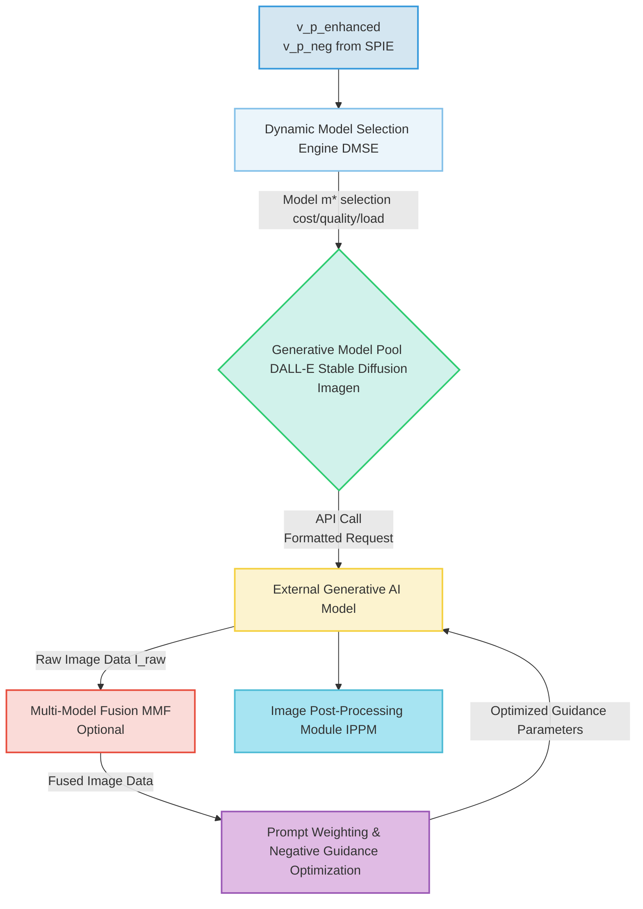

```mermaid
graph TD
    A[v_p_enhanced <br> v_p_neg from SPIE] --> B[Dynamic Model Selection Engine DMSE];
    B -- Model m* selection cost/quality/load --> C{Generative Model Pool <br> DALL-E Stable Diffusion Imagen};
    C -- API Call <br> Formatted Request --> D[External Generative AI Model];
    D -- Raw Image Data I_raw --> E[Multi-Model Fusion MMF <br> Optional];
    E -- Fused Image Data --> F[Prompt Weighting & Negative Guidance Optimization];
    F -- Optimized Guidance Parameters --> D;
    D --> G[Image Post-Processing Module IPPM];

    style A fill:#D4E6F1,stroke:#3498DB,stroke-width:2px;
    style B fill:#EBF5FB,stroke:#85C1E9,stroke-width:2px;
    style C fill:#D1F2EB,stroke:#2ECC71,stroke-width:2px;
    style D fill:#FCF3CF,stroke:#F4D03F,stroke-width:2px;
    style E fill:#FADBD8,stroke:#E74C3C,stroke-width:2px;
    style F fill:#E0BBE4,stroke:#9B59B6,stroke-width:2px;
    style G fill:#A7E4F2,stroke:#4DBBD5,stroke-width:2px;
```