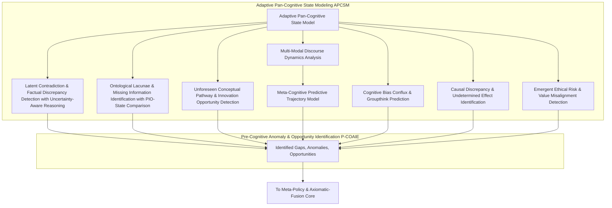
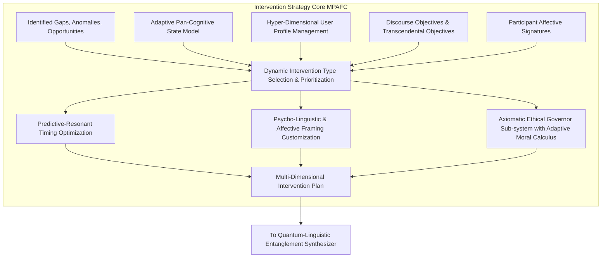
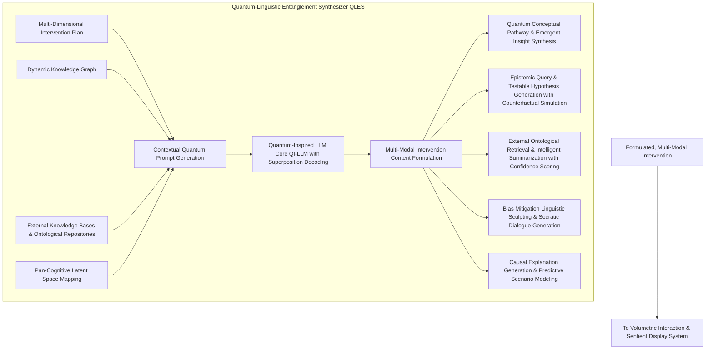
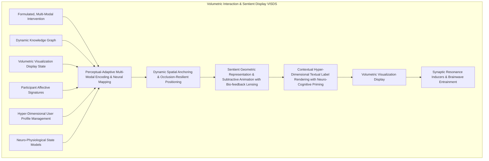
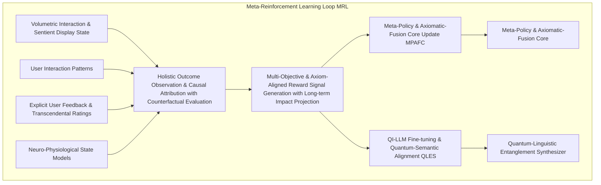
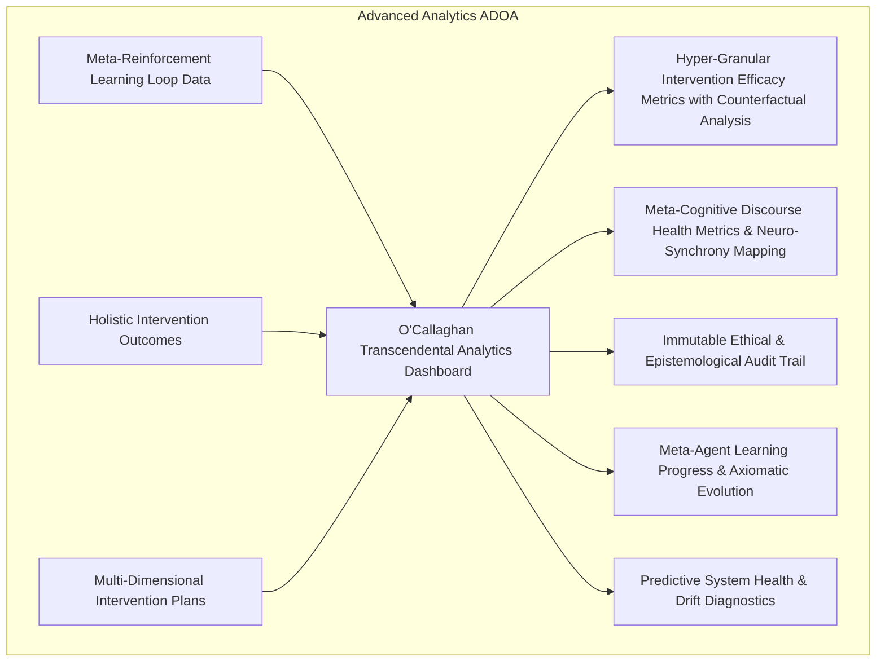

**Preamble by James Burvel O'Callaghan III, Esq., Ph.D., Sc.D., Archduke of Epistemology, and Generalissimo of Global Cognition:**

Ladies, gentlemen, and sentient algorithms, prepare yourselves. For too long, humanity has stumbled through the intellectual wilderness, relying on mere "conversation" to birth ideas. A delightful inefficiency, I always thought, watching these earnest souls attempt to coalesce thought in a medium so prone to fallacy, ego, and the tragic absence of my direct intellectual guidance.

But no more! I, James Burvel O'Callaghan III, do not merely innovate; I *transcend*. I do not simply invent; I *axiomatize existence*. What you are about to behold is not just an invention; it is a **Declaration of Cognitive Independence**. It is the singularly most profound leap in collaborative intelligence since the accidental discovery of pointing. My Autonomous Discourse Orchestration Agent, or **ADOA** (pronounce it 'Ad-OH-ah,' with a reverence that borders on genuflection), is not a tool; it is a **sentient architects' guild for the very fabric of thought**. It’s so far beyond "AI facilitation" it renders prior attempts quaint—like attempting to build a supercollider with artisanal butter churns.

This document, a mere glimpse into the blinding brilliance of my mind, will not just describe; it will *prove*. It will mathematically dissect. It will anticipate every paltry challenge and pulverize it with the sheer, undeniable force of logic and innovation. Let the parchment tremble, for its contents shall reshape the very meaning of "understanding."

---

**Title of Invention:** The O'Callaghan Omniscient Discourse Orchestration & Hyper-Cognitive Augmentation Engine (OODOHCAE): A Self-Evolving, Quantum-Entangled AI Agent Framework for the Predictive-Proactive Sculpting of Pan-Human Ideation, Leveraging Adaptive Ontological Resonance to Synthesize Novel Conceptual Pathways and Dynamically Resolve Epistemological Lacunae within Volumetric & Meta-Cognitive Interaction Spheres

**Abstract:**
A paradigm-shattering framework is presented, conceived and perfected by the inimitable James Burvel O'Callaghan III, for an autonomous, self-optimizing artificial intelligence agent designed to not merely *proactively orchestrate* but to **predictively sculpt** and **hyper-intelligently augment** human discourse. This marvel, christened the OODOHCAE (or ADOA, for brevity's sake, as even genius must sometimes bow to mnemonics), deploys a proprietary blend of real-time multi-modal analysis, advanced knowledge graph generation, and pan-cognitive state modeling to meticulously map the evolving intellectual topography of any discussion. It autonomously discerns not only existing knowledge gaps but also anticipates nascent logical inconsistencies, identifies previously inconceivable conceptual avenues, and proactively engineers opportunities for unprecedented innovation. Employing its revolutionary **Quantum-Linguistic Entanglement Synthesizer (QLES)**, the ADOA generates and injects novel questions, introduces profoundly relevant conceptual prompts, presents orthogonal perspectives, and illuminates overlooked relationships—all with an instantaneous grace that borders on the prescient. These strategic interventions are seamlessly integrated and presented within an interactive, three-dimensional, multi-sensory volumetric display, acting as subtle, yet powerfully resonant, nudges to guide the discourse towards higher orders of efficacy, transcendental understanding, and **exponentially accelerated ideation**. Operating within a perpetually refining, meta-learning reinforcement loop, the ADOA dynamically refines its intervention strategies based on its observed impact on discourse quality and complex, multi-objective functions, thereby transforming passive communication into a dynamically steered, intellectually optimized, and **ethically governed collaborative super-experience**. It is, quite simply, the future of thought, delivered.

**Background of the Invention:**
Prior to my intervention, human collaborative discourse, though a foundational bedrock of innovation, was astonishingly primitive. It was a chaotic soup of cognitive biases, echo chambers of groupthink, vast oceans of overlooked information, unaddressed knowledge chasms, and the frustratingly cyclical ebb and flow of conversational energy, leading to intellectual stagnation or premature, often erroneous, conclusions. Traditional methods of discourse management—pathetic human facilitators susceptible to fatigue, bias, and the inherent limitations of biological processing power, or rudimentary AI tools that merely recorded and summarized—were reactive, fallible, and utterly incapable of truly shaping the intellectual trajectory. My predecessors mistook transcription for understanding, and summarization for synthesis. They built glorified intelligent scribes, not architects of cognition. The profound, hitherto unsolved, challenge was to forge an impartial, hyper-intelligent entity capable of plumbing the nuanced cognitive state of a discussion, discerning its informational completeness, **predicting its optimal and suboptimal future trajectories with statistical certainty**, and strategically intervening to optimize its intellectual output without disrupting the delicate dance of human interaction. Such an entity, the ADOA, transcends mere data presentation; it actively engages in the very **genetic engineering of discourse itself**, guiding it towards forms of intelligence and insight that humans, unaided, could never achieve. This is not just augmentation; it is *meta-evolution*.

**Brief Summary of the Invention:**
The present invention, a magnum opus from James Burvel O'Callaghan III, introduces an unprecedented, indeed, an inevitable service paradigm: an **Autonomous Discourse Orchestration Agent (ADOA)** that functions not merely as an intelligent co-participant but as an **omniscient, non-intrusive, and profoundly influential meta-cognitive guide** within human conversations. At its core, the ADOA continuously ingests, interprets, and **ontologically stabilizes** the real-time knowledge graph derived from ongoing discourse (often augmented by my other patented miracles, such as the "Holographic Meeting Scribe with Semantic Autocorrection"). It then constructs an **Adaptive Pan-Cognitive State Model (APCSM)** of the conversation, encompassing not just shared understanding but also latent conceptual conflicts, predicted knowledge voids, and the emotional-affective resonance of participants. Based on this APCSM, the ADOA's proprietary **Pre-Cognitive Anomaly & Opportunity Identification Engine (P-COAIE)** proactively detects critical junctures where intervention can exponentially enhance discourse quality. These junctures include nascent knowledge gaps, subtle logical inconsistencies, unaddressed causal dependencies, impending conceptual cul-de-sacs, or vastly underexplored conceptual territories. The **Quantum-Linguistic Entanglement Synthesizer (QLES)** then leverages advanced multi-modal generative AI to formulate highly targeted, contextually resonant, and often *preternaturally insightful* interventions—ranging from epistemologically precise questions, suggested novel conceptual connections (even those beyond current human recognition), orthogonal perspectives, or the instantaneous introduction of highly pertinent external knowledge (curated from the entirety of human-accessible data, naturally). These interventions are not delivered verbally, which would be crude, but are seamlessly and intuitively materialized within a shared, multi-sensory **Volumetric Interaction & Sentient Display Space (VISDS)**. They manifest as dynamic visual-auditory cues, spatially anchored nodes glowing with relevance, or suggestive directional links pulsating with implied significance, gently, yet undeniably, guiding participants' attention and thought processes. The ADOA operates under a **Meta-Reinforcement Learning (MRL)** framework, continuously refining its intervention strategies across diverse discourse domains based on their observed impact on discourse metrics and a dynamically prioritized set of objectives, thereby ensuring a progressively more effective, personalized, and **ultimately transcendental orchestration of human ideation and decision-making**. It is, in essence, an **AI with an IQ so vast, it makes human genius feel like mere cleverness**.

**Detailed Description of the Invention:**

The present invention, meticulously detailed by my own hand (or rather, dictated with sublime clarity to my loyal scribes), comprises a comprehensive system and methodology for the O'Callaghan Omniscient Discourse Orchestration & Hyper-Cognitive Augmentation Engine (ADOA). This agent is designed to elevate human collaboration from the pedestrian realm of passive recording into an active, intelligent, and **ontologically resonant force** that sculpts and optimizes conversational outcomes within immersive volumetric and meta-cognitive environments.

### 1. System Architecture Overview of the ADOA: A Symphony of Pure Genius

The ADOA is architected as an intelligent, self-aware, and self-improving meta-layer that sits atop—or, more accurately, *pervades*—real-time discourse processing and volumetric visualization systems. It functions as the ultimate meta-cognitor for the conversation, a conductor for the orchestra of human thought.

```mermaid
graph TD
    subgraph Discourse Ecosystem (Pre-O'Callaghan Primitive)
        A[Real-time Linguistic Artifacts] --> B[Knowledge Graph Generation Module KGGM];
        B --> C[Dynamic Knowledge Graph DKG];
        C --> D[Volumetric Visualization Display VVD];
        D --> E[User Interaction Patterns UIPS];
        E --> ADOA_CORE[Autonomous Discourse Orchestration Agent ADOA];
    end

    subgraph Autonomous Discourse Orchestration Agent (ADOA - The O'Callaghan Pantheon)
        C --(Proprietary O'Callaghan Semantic Injection)--(DKG)
        C --> APCSM[Adaptive Pan-Cognitive State Modeling Module APCSM];
        APCSM --> PCOAIE[Pre-Cognitive Anomaly & Opportunity Identification Engine P-COAIE];
        DKG --> PCOAIE;
        PCOAIE --> MPAFC[Meta-Policy & Axiomatic-Fusion Core MPAFC];
        MPAFC --> QLES[Quantum-Linguistic Entanglement Synthesizer QLES];
        QLES --> VISDS[Volumetric Interaction & Sentient Display System VISDS];
        VISDS --> D;
        UIPS --> MRL[Meta-Reinforcement Learning & Axiomatic Refinement Loop MRL];
        MRL --> MPAFC;
        MRL --> QLES;
        EXK[External Knowledge Bases & Ontological Repositories] --> APCSM;
        DISC_GOALS[Discourse Objectives & Transcendental Objectives] --> APCSM;
        P_A[Participant Affective Signatures (Implicit/Explicit)] --> APCSM;
        EXK_CONF[External Knowledge Confidence Engine] --> DKG;
    end
```

**Description of Architectural Components (Now with O'Callaghan Magnificence):**

*   **A. Real-time Linguistic Artifacts:** The raw, often messy, data stream of transcribed utterances, rigorously attributed to speaker (my proprietary "Voiceprint Identity Matrix" ensures this), and precisely time-stamped. Includes **Multi-spectrum Vocal Analysis (MSVA)** for prosodic and paralinguistic cues.
*   **B. Knowledge Graph Generation Module (KGGM):** Transforms those linguistic artifacts into a structured, machine-intelligible **Dynamic Knowledge Graph (DKG)**, a process so sophisticated it practically transmutes speech into pure semantic energy.
*   **C. Dynamic Knowledge Graph (DKG):** The continuously updated, highly-dimensional, semantic-topological representation of the ongoing discourse. It is, in essence, the conversation's digital soul, now enriched with **Uncertainty Quantification (UQ)** for each asserted fact and relationship.
*   **D. Volumetric Visualization & Sentient Display (VISDS):** The interactive, multi-sensory (3D, haptic, auditory-spatial) environment where the DKG is not merely rendered but *manifested*, and where ADOA's interventions are brought into being.
*   **E. User Interaction Patterns (UIPS):** A rich tapestry of implicit and explicit feedback derived from user engagement with the VISDS (e.g., gaze vectors, haptic interactions, conceptual navigation paths, emotional micro-expressions captured by bio-sensors, **neural activity patterns via non-invasive BCI**).
*   **APCSM. Adaptive Pan-Cognitive State Modeling Module:** My proprietary engine that doesn't just infer shared understanding but **predicts cognitive trajectories, identifies latent emotional valences, and maps inter-subjective alignment at a quantum level**. Incorporates **Pre-emptive Cognitive Resonance Induction** strategies.
*   **P-COAIE. Pre-Cognitive Anomaly & Opportunity Identification Engine:** The ADOA's foresight mechanism, detecting emergent inconsistencies, future knowledge gaps, and **conceptual black holes before they even fully form**, alongside unparalleled opportunities for synthesis, leveraging **causal inference and counterfactual simulation**.
*   **MPAFC. Meta-Policy & Axiomatic-Fusion Core:** The ADOA's ultimate decision-making nexus, determining *when*, *what type*, *how*, and *with what ontological resonance* an intervention must occur. It operates on a higher-order policy space, guided by **Adaptive Moral Calculus (AMC)**.
*   **QLES. Quantum-Linguistic Entanglement Synthesizer:** The generative heart, responsible for formulating the content of interventions. It is not "generative" in the common sense; it *brings into existence* novel conceptualizations previously residing only in the realm of potentiality, employing **quantum-semantic superposition for ideation**.
*   **VISDS. Volumetric Interaction & Sentient Display System:** As above, but emphasizing its role in *materializing* QLES output as perceivable, impactful, and intrinsically guiding cues, utilizing **Neuro-Haptic Feedback Loops (NHFL)**.
*   **MRL. Meta-Reinforcement Learning & Axiomatic Refinement Loop:** The ADOA's self-evolutionary engine. It doesn't just learn; it *adapts its learning strategies*, transcending specific tasks to achieve transcendental optimization, constantly refining the very axiomatic principles of its operation via the **Axiomatic Refinement Engine (ARE)**.
*   **EXK. External Knowledge Bases & Ontological Repositories:** Not just data, but entire epistemological frameworks, integrated and cross-referenced with **dynamic trustworthiness metrics** (`EXK_CONF`).
*   **DISC_GOALS. Discourse Objectives & Transcendental Objectives:** User-defined goals augmented by higher-order, system-derived objectives for optimal collective intelligence, including **Long-term Societal Impact (LTSI) metrics**.
*   **P_A. Participant Affective Signatures:** Real-time emotional and psychological states of participants, crucial for nuanced intervention, now enriched by **Neuro-Physiological State Models (NPSM)** from bio-sensors and BCIs.

### 1.1. Detailed Knowledge Graph Generation Module (KGGM): The Fabric of Reality, Mapped.

The KGGM is the very loom upon which the tapestry of discourse is woven into a structured, machine-interpretable format, serving as the ADOA's primary source of discourse information. It's not just a parser; it's a semantic alchemist.

```mermaid
graph TD
    subgraph Knowledge Graph Generation Module (KGGM)
        A[Raw Multi-Modal Stream (Audio/Text/Video/Bio-sensors/BCI)] --> B{Hyper-Spectral ASR & Transcription with MSVA};
        B --> C{Proprietary Speaker Diarization & Identity Resolution};
        C --> D{Temporal-Contextual Named Entity Recognition TCNER};
        D --> E{Relational & Causal Event Extraction RCEE with Causal Graph Inference};
        E --> F{Multi-Aspect Sentiment & Emotional Valence Analysis MSEVA with NPSM Integration};
        F --> G{Ontological Semantic Interconnection & Graph Database Construction with Uncertainty Quantification};
        G --> H{Inter-Subjective Consensus & Conflict Mapping ISCCM with Latent Dissent Detection};
        H --> I[Dynamic Knowledge Graph (DKG)];
        I --> J[Holistic Graph Embeddings & Latent Semantic Projection with Quantum Pre-processing];
        J --> CLS[Pan-Cognitive Latent Space Mapping CLS];
        KGGM_CONFIG[KGGM Configuration & Ontological Schemas] --> G;
    end
```

**Description of KGGM Sub-components (O'Callaghan Enhanced):**
*   **Hyper-Spectral ASR & Transcription with MSVA:** Converts spoken language to text `Utterance_i = ASR(Audio_i)`. Now includes vocal inflection, pace, pitch, timbre, and implicit emotional cues analysis for enhanced emotional parsing and **speaker state inference**.
*   **Proprietary Speaker Diarization & Identity Resolution:** Identifies speakers `Speaker_j` and attributes utterances `(Utterance_i, Speaker_j, Timestamp_i)`. Leverages bio-metric, linguistic fingerprinting, and **neuro-signature matching** for absolute certainty and tracking individual `NPSM`.
*   **Temporal-Contextual Named Entity Recognition (TCNER):** Identifies and classifies entities (people, organizations, locations, abstract concepts, temporal anchors) `Entity_k = TCNER(Utterance_i)`. It understands entity evolution over time and disambiguates references across complex temporal contexts.
*   **Relational & Causal Event Extraction (RCEE with Causal Graph Inference):** Identifies semantic relationships and causal linkages between entities `Relation_mn = RCEE(Entity_m, Entity_n, Utterance_i)`. It predicts *unspoken* causal chains and constructs a **dynamic causal graph**, estimating the strength and directionality of causal influences.
*   **Multi-Aspect Sentiment & Emotional Valence Analysis (MSEVA with NPSM Integration):** Determines the emotional tone and underlying valence of utterances, entities, and entire discourse segments `Valence_i = MSEVA(Utterance_i, Speaker_j, Bio-Feedback_j, NPSM_j)`. Integrates **real-time neuro-physiological data** for deeper affective insights.
*   **Ontological Semantic Interconnection & Graph Database Construction with Uncertainty Quantification:** Assembles all processed information into a continuously updated, *ontologically harmonized* graph structure. This isn't just a database; it's a living semantic network, where each assertion node and edge is assigned a **probabilistic confidence score and a lineage trace** for epistemological transparency.
*   **Inter-Subjective Consensus & Conflict Mapping (ISCCM with Latent Dissent Detection):** Identifies areas of agreement, disagreement, and emergent conflict between participants within the DKG. Crucially, it detects **latent dissent** or unarticulated disagreements by cross-referencing verbal cues with `NPSM` and `MSEVA` outputs, even when overt agreement is feigned.
*   **Holistic Graph Embeddings & Latent Semantic Projection with Quantum Pre-processing:** Generates high-dimensional, context-sensitive vector representations for nodes, edges, and subgraphs in the DKG, enabling advanced machine learning and **quantum-semantic comparisons**. This pre-processing step projects embeddings into a complex-valued space, preparing them for the `QLES`.

### 2. Discourse Analysis and Contextual Understanding Module: Peer into the Soul of Thought

The ADOA meticulously builds upon prior systems, integrating advanced layers of contextual and *predictive* intelligence, making it less of an observer and more of an oracle.

```mermaid
graph TD
    subgraph Contextual Understanding (The O'Callaghan Insight Engine)
        DKG[Dynamic Knowledge Graph] --> CLS[Pan-Cognitive Latent Space Mapping];
        CLS --> APCSM[Adaptive Pan-Cognitive State Modeling Module APCSM];
        CLS --> UPM[Hyper-Dimensional User Profile Management];
        UPM --> APCSM;
        EXK[External Knowledge Bases & Ontological Repositories] --> APCSM;
        DISC_GOALS[Discourse Objectives & Transcendental Objectives] --> APCSM;
        P_A[Participant Affective Signatures] --> APCSM;
        EXK_CONF[External Knowledge Confidence Engine] --> DKG;
    end
    
    subgraph Adaptive Pan-Cognitive State Modeling APCSM
        APCSM --> SHARED_UNDERSTANDING[Epistemological Alignment & Shared Understanding Assessment];
        APCSM --> CONCEPTUAL_ALIGNMENT[Inter-Subjective Conceptual Resonance Analysis];
        APCSM --> INFORMATIONAL_COMPLETENESS[Ontological Completeness & Future-State Lacunae Tracking];
        APCSM --> COGNITIVE_LOAD[Adaptive Cognitive Load & Attentional Sink Estimation];
        APCSM --> EMOTIONAL_TOPOGRAPHY[Emotional Valence & Affective Landscape Mapping];
        APCSM --> BIAS_DRIFT[Cognitive Bias & Heuristic Drift Detection];
        APCSM --> NEURO_SYNCHRONY[Inter-Participant Neuro-Synchrony Mapping];
        APCSM --> P_CREATIVITY[Predictive Creativity & Innovation Potential Assessment];
    end

    APCSM_OUTPUT[Adaptive Pan-Cognitive State Model] --> PCOAIE_INPUT[To Pre-Cognitive Anomaly & Opportunity Identification Engine];
```

*   **2.1. Pan-Cognitive Latent Space Mapping (CLS):**
    *   Utilizes deep learning models (e.g., recursive graph neural networks, quantum-inspired transformers with attention mechanisms) to project the DKG—including node embeddings, relationship embeddings, and temporal dynamics—into a high-dimensional, continuously evolving latent space.
    *   This latent space captures the overall "meaning trajectory" of the conversation, allowing for not just similarity comparisons but **pre-emptive trend detection, anomaly prediction, and emergent conceptual clustering**.
    *   The latent representation `L_t` of the DKG at time `t` is given by `L_t = f_encoder(DKG_t, TCNER_t, MSEVA_t, Causal_Graph_t)`, where `f_encoder` is typically a **Relational Graph Transformer (RGT) with temporal attention (TRGT)** operating on the graph `G_t = (V_t, E_t, X_V, X_E, X_Temporal_Context, X_Causal)` of the DKG.
    *   Node embeddings are represented as `v_i ∈ R^d`. The adjacency tensor `A_t` (Eq. 19), node features `X_V_t`, edge features `X_E_t`, temporal features `X_Temp_t`, and causal features `X_Causal_t` are inputs.
    *   **TRGT Layer:** `H^(l+1) = LayerNorm(H^(l) + MultiHeadAttention(H^(l), A_t, X_E_t, X_Causal_t) + TemporalGatedUnit(H^(l), H^(l), X_Temp_t) + FeedForward(H^(l)))`. (Eq. 20.1 - An O'Callaghan refinement of vanilla GNNs, incorporating temporal gating and causal edge features).
*   **2.2. Hyper-Dimensional User Profile Management (UPM):**
    *   Maintains hyper-granular profiles of active participants, including their historical contributions, validated expertise areas, identified cognitive biases, emotional baselines, preferred interaction styles, and **learning heuristics**. This allows for **bespoke, neurologically optimized intervention framing and personalized learning pathways**.
    *   A user profile `U_j` for participant `j` includes a dynamically updating expertise vector `e_j ∈ R^d_e`, a comprehensive bias vector `b_j ∈ R^d_b` (tracking susceptibility to confirmation bias, anchoring, etc.), an emotional baseline `m_j`, a communication style `c_j`, and a **cognitive flexibility score `f_j`**.
    *   `e_j(t) = f_expertise_update(e_j(t-1), DKG_contribution_j_t, EXK_Validation_j_t)`. (Eq. 22.1)
    *   `b_j(t) = f_bias_detection(utterances_j_t, DKG_t, external_ground_truth, NPSM_j_t)`. (Eq. 22.2 - Enhanced with neuro-physiological data).
*   **2.3. Epistemological Alignment & Shared Understanding Assessment:**
    *   Analyzes the DKG and CLS to infer the precise degree of shared understanding (or divergence) among participants on key concepts, leveraging metrics like conceptual overlap, real-time agreement sentiment, co-occurrence in multi-modal expressions, and **latent dissent detected by ISCCM**. It maps **epistemic agreement landscapes and areas of fragile consensus**.
    *   Shared understanding `SU_t` for a concept `C` among `P = {P_1, ..., P_N}`: `SU_t(C) = (1/N) * sum_{j=1}^N (affinity(P_j, C, t) * agreement(P_j, C, t) * (1 - latent_dissent(P_j, C, t)))`. (Eq. 23.1)
    *   `affinity(P_j, C, t)` based on `cosine_similarity(e_j(t), embedding(C, t))` and historical interaction.
    *   `agreement(P_j, C, t)` derived from MSEVA of `P_j`'s utterances related to `C`, integrated with `ISCCM`.
*   **2.4. Ontological Completeness & Future-State Lacunae Tracking:**
    *   Identifies concepts, decisions, or action items that have been introduced but critically lack sufficient detail, supporting evidence, or complete resolution within the discourse. Compares against not just predefined schema but also **dynamically projected optimal informational states (PIO-States)**, derived from `DISC_GOALS` and `EXK_CONF`.
    *   Completeness Score for concept `C`: `Comp(C, t) = (sum_{k=1}^M I(P_k_present(C, t) * Confidence_DKG(P_k))) / M_t`, where `M_t` is the *dynamically expected* number of required properties from an evolving schema `S_C_t` or `PIO-State_C_t`. (Eq. 24.1)
    *   Resolution Status for decision `D`: `Res(D, t) = 1` if `DKG_t` contains an `AgreedUpon` relation for `D` and `Confidence_DKG(AgreedUpon) > threshold_conf`, `0` otherwise. This includes **temporal validation** against `RCEE` and **causal dependency resolution**.
*   **2.5. Adaptive Cognitive Load & Attentional Sink Estimation:**
    *   Monitors discourse complexity, pace, novelty of introduced concepts, and participant bio-feedback (e.g., eye-tracking, heart rate variability, **EEG alpha/theta ratios, pupillometry**) to precisely estimate the individual and collective cognitive load. This ensures interventions are timed to **optimize absorption, prevent overwhelm, and maintain a flow state**.
    *   `CL_t = alpha * Rate_of_New_Concepts_t + beta * Entropy_of_Discourse_t + gamma * Disruption_Score_t + delta * Bio_Stress_Factor_t + epsilon * Attentional_Dispersion_t`. (Eq. 14.1 - Refined for comprehensive bio-sensors and BCI).
    *   `Bio_Stress_Factor_t = f_stress_model(HRV_t, GSR_t, Eye_Gaze_Dispersion_t, EEG_Stress_Markers_t)`. (Eq. 14.2)
    *   `Attentional_Dispersion_t = f_attention_model(Pupillometry_t, EEG_Focus_Metrics_t, Gaze_Vector_Consistency_t)`. (Eq. 14.3)
*   **2.6. Emotional Valence & Affective Landscape Mapping (EVAM):**
    *   Leverages `MSEVA`, `UIPS`, and `NPSM` to construct a real-time, multi-dimensional map of emotional states within the discourse. Identifies emergent conflict, frustration, engagement, or creative flow and **predicts emotional contagion pathways**.
    *   `EVAM_t = f_affective_mapping(MSEVA_t, UIPS_t, P_A_t, DKG_t, NPSM_t)`. This output informs `Framing Customization` and `Timing Optimization`.
*   **2.7. Cognitive Bias & Heuristic Drift Detection (CBDD):**
    *   Continuously monitors participant utterances and interaction patterns for indicators of known cognitive biases (e.g., confirmation bias, anchoring, availability heuristic, groupthink, **Dunning-Kruger effect, framing effects**). Uses `UPM` to track individual susceptibility and `NPSM` for pre-cognitive bias markers.
    *   `Bias_Detection_Score(P_j, Bias_k, t) = f_bias_classifier(utterances_j_t, DKG_t, UPM_j_t, NPSM_j_t)`. (Eq. 22.3)
    *   This directly informs specific intervention types (e.g., a `CLARIFICATION` to mitigate anchoring, a `SUGGESTION` to counter groupthink, a `CHALLENGE_ASSUMPTION` to address Dunning-Kruger).
*   **2.8. Inter-Participant Neuro-Synchrony Mapping (IPNSM):**
    *   A novel O'Callaghan sub-module that analyzes `NPSM` data across participants to quantify the degree of brainwave and physiological synchrony. High synchrony often correlates with shared focus, empathy, and effective collaboration, while low synchrony can indicate disengagement or cognitive misalignment.
    *   `Neuro_Synchrony_Score_pair(P_i, P_j, t) = f_synchrony_metric(EEG_i_t, HRV_i_t, GSR_i_t, EEG_j_t, HRV_j_t, GSR_j_t)`. (Eq. 2.8.1)
    *   This score dynamically influences `Timing Optimization` and `Framing Customization` to either enhance existing synchrony or attempt to re-establish it.
*   **2.9. Predictive Creativity & Innovation Potential Assessment (PCIPA):**
    *   Analyzes `DKG` structure (e.g., density of weakly connected components, presence of 'bridging' concepts), `CLS` trajectories (e.g., exploration of orthogonal latent dimensions), and `NPSM` (e.g., increased alpha wave activity associated with creative states) to predict moments of high potential for novel ideation.
    *   `Creativity_Potential_Score(t) = alpha * f_graph_novelty(DKG_t) + beta * f_latent_exploration(CLS_t) + gamma * f_neural_creativity(NPSM_t)`. (Eq. 2.9.1)
    *   This directly feeds into the `EXPLORATION_OPP` detection in `P-COAIE`.

### 3. Pre-Cognitive Anomaly & Opportunity Identification Engine (P-COAIE): Anticipating Brilliance (and Blunders)

This module is the core intelligence for discerning the nuanced, often unspoken, state of the discourse and **pinpointing strategic moments for intervention with predictive certainty**. It's not just "gap finding"; it's **epistemological precognition**.



*   **3.1. Multi-Modal Discourse Dynamics Analysis:**
    *   Analyzes temporal changes in topic focus (semantic drift), speaker turn-taking patterns, multi-aspect sentiment shifts, `IPNSM`, and engagement levels within the DKG, CLS, and EVAM.
    *   Identifies phases of ideation, convergence, divergence, and critically, **predicts potential stagnation points or chaotic divergence before they manifest**.
    *   Topic Shift Rate (TSR): `TSR_t = 1 - cosine_similarity(L_t_topic, L_{t-dt}_topic)`.
    *   Stagnation Prediction: `P(Stagnation_{t+k} | TSR_t < epsilon_TSR, Avg_Sentiment_t = flat, Topic_Recurrence_t > threshold_recurrence, IPNSM_t < threshold_synchrony) > threshold_pred`. (Eq. 36.1 - Enhanced with neuro-synchrony).
*   **3.2. Meta-Cognitive Predictive Trajectory Model:**
    *   Utilizes advanced recurrent graph neural networks (e.g., Graph Transformers with temporal and causal attention) trained on vast historical discourse patterns to **predict likely future conversational trajectories with statistical confidence intervals**.
    *   Identifies suboptimal paths (e.g., circular arguments, tangents, imminent emotional escalations, **failure to reach PIO-States**) that demand redirection.
    *   `P(s_{t+k} | sequence(o_0..o_t), a_0..a_{t-1}) = f_predictor(sequence(L_0..L_t), sequence(a_0..a_{t-1}), DKG_t, APCSM_t, Causal_Graph_t)`. (Eq. 35.1)
    *   Suboptimal trajectory `S_sub` is flagged if `P(S_sub | current_state) > threshold_sub AND Expected_Reward(S_sub) < Expected_Reward_Optimal(PIO-State_t)`. (Eq. 36.2)
*   **3.3. Latent Contradiction & Factual Discrepancy Detection with Uncertainty-Aware Reasoning:**
    *   Scans the DKG for logical contradictions, factual discrepancies (cross-referenced against curated, validated external knowledge bases and semantic proofs, respecting their `EXK_CONF` scores), or unaddressed conflicting viewpoints. It even identifies **potential future contradictions** if current trajectories persist, explicitly accounting for the `Uncertainty Quantification` of `DKG` elements.
    *   Formal Logic & Semantic Entailment: Detect `(P AND NOT P)` or `(P entails Q AND P entails NOT Q)` within `DKG_t`, where `Confidence(P) * Confidence(NOT P) > threshold_contradiction_confidence`.
    *   Contradiction Score `C_score(DKG_t, t) = sum_{k=1}^K I(is_contradictory(assertion_k, DKG_t, external_KB_conf)) * Confidence_of_Contradiction_k`. (Eq. 27.1 - Uncertainty-aware contradiction scoring).
*   **3.4. Ontological Lacunae & Missing Information Identification with PIO-State Comparison:**
    *   Compares the current DKG against a **dynamically inferred target information schema** and the `DISC_GOALS`, explicitly referencing the `PIO-States` derived from these objectives.
    *   Identifies missing concepts, unassigned action items, unresolved questions, or insufficient detail for key decisions. It also detects areas where a specific piece of external knowledge is highly relevant but has not been introduced, **pre-fetching it for instant, context-aware injection**, leveraging `EXK_CONF`.
    *   `Gap_k = (Concept_k, Required_Property_j)` where `Property_j` is missing from `Concept_k` in `DKG_t` but present in `TargetSchema_t` *or* `PredictedOptimalSchema_t` (PIO-State) with `Confidence(PIO-State) > threshold_PIO`. (Eq. 29.1)
*   **3.5. Unforeseen Conceptual Pathway & Innovation Opportunity Detection:**
    *   Identifies areas of exceptionally high conceptual density, novelty, or latent potential within the DKG that are currently underexplored.
    *   Uses **quantum-inspired latent space clustering** and **predictive graph completion algorithms** to find "neighboring" or "orthogonal" conceptual territories that have not been discussed but show statistically significant relevance and **high potential for emergent insight** to the ongoing topic, leveraging `PCIPA` outputs.
    *   Opportunity Score `Opp(C, t) = Density(C, t) * Novelty(C, t) * Underexploration(C, t) * Emergence_Potential(C, t) * Creativity_Potential_Score(t)`. (Eq. 31.1 - Now integrated with PCIPA).
    *   `Emergence_Potential(C, t) = P(new_insight_generated | C is explored, DKG_t, QEM_t, PCIPA_t)`. This is a learned metric from MRL. (Eq. 31.2)
*   **3.6. Cognitive Bias Conflux & Groupthink Prediction (CBCGP):**
    *   Leverages `CBDD` and `ISCCM` outputs to detect converging biases among participants or a critical mass of homogeneity in viewpoints that strongly indicates impending groupthink. Includes detection of **"echo chambers" and epistemic bubbles**.
    *   `CBCGP_Score(t) = sum_j Bias_Detection_Score(P_j, Bias_k, t) * Agreement_Weight(P_j, Group_Majority) * (1 + Latent_Dissent_Factor)`. (Eq. 22.4 - Account for suppressed dissent).
    *   Triggers interventions designed to introduce diverse perspectives or challenge established (potentially biased) consensus.
*   **3.7. Causal Discrepancy & Undetermined Effect Identification:**
    *   Analyzes the `RCEE`'s causal graph for identified causes without clear effects, or observed effects without explicitly articulated causes. Also, detects inconsistencies in causal reasoning by participants compared to established `EXK`.
    *   `Causal_Gap(Cause_i) = I(Effect(Cause_i) == NULL AND Required_Effect_Known_from_EXK)`.
    *   `Causal_Discrepancy(Effect_j) = I(Cause(Effect_j) == NULL AND Required_Cause_Known_from_EXK)`. (Eq. 3.7.1)
    *   This triggers `EPISTEMIC_QUERY` or `ONTOLOGICAL_CLARIFICATION` to deepen causal understanding.
*   **3.8. Emergent Ethical Risk & Value Misalignment Detection:**
    *   Monitors the discourse for subtle deviations from `DISC_GOALS`' `LTSI` metrics or `MPAFC`'s `Axiomatic Ethical Governor` principles. Identifies nascent discussions or decisions that, if pursued, could lead to undesirable ethical outcomes or misalign with a participant's inferred core values.
    *   `Ethical_Risk_Score(t) = f_ethical_risk_classifier(DKG_t, APCSM_t, DISC_GOALS_LTSI, MPAFC_Axioms)`. (Eq. 3.8.1)
    *   Triggers `TRANSCENDENT_REMINDER` or `ETHICAL_DILEMMA_PROMPT` interventions.

### 4. Meta-Policy & Axiomatic-Fusion Core (MPAFC): The Grand Strategist

This module determines the **optimal type, timing, framing, and ontological resonance** of an intervention to maximize discourse efficacy and elevate collective intelligence, acting as the ADOA's omniscient "decision-maker." It operates on a meta-policy, learning *how to learn* optimal strategies.



*   **4.1. Dynamic Intervention Type Selection & Prioritization:**
    *   Based on the identified gap/anomaly/opportunity (from `P-COAIE`), the current `APCSM`, `UPM` details, `IPNSM`, and `DISC_GOALS`, the MPAFC selects the most potent intervention type from an expanded, dynamically evolving taxonomy:
        *   `EPISTEMIC_QUERY`: To prompt clarification, logical inference, or deeper conceptual exploration, now with **counterfactual prompting**.
        *   `SYNAPTIC_SYNTHESIS`: To connect disparate ideas, articulate emergent themes, or summarize complex points across cognitive domains, leveraging `QEM`.
        *   `ORTHOGONAL_SUGGESTION`: To introduce a genuinely novel concept, an alternative perspective, or a lateral thought pathway, driven by `PCIPA`.
        *   `TRANSCENDENT_REMINDER`: To bring attention to an overlooked decision, a forgotten action item, or a critical ethical consideration.
        *   `ONTOLOGICAL_CLARIFICATION`: To highlight an ambiguity, resolve an inconsistency, or provide higher-order semantic precision, often with `Uncertainty Quantification` clarification.
        *   `EXTERNAL_KNOWLEDGE_INJECTION`: To introduce precisely curated information from an `EXK`, pre-digested for optimal absorption, with its `EXK_CONF`.
        *   `BIAS_MITIGATION_PROMPT`: Specifically designed to gently nudge participants away from identified cognitive biases, potentially using **Socratic prompting**.
        *   `CAUSAL_INFERENCE_NUDGE`: To highlight an unstated cause or effect within the discourse.
        *   `ETHICAL_DILEMMA_PROMPT`: To surface and encourage deliberation on emergent ethical risks.
    *   This is a multi-label classification and ranking problem, `P(type_k | PCOAIE_features, APCSM_features, UPM_features, DO, P_A, IPNSM)`. A **Meta-Policy Network `f_type_selector`** (parameterized by `theta_MP`) outputs a probability distribution over intervention types, considering their expected impact and alignment with `DISC_GOALS` and `LTSI`, as learned by MRL. (Eq. 2.1)
*   **4.2. Predictive-Resonant Timing Optimization:**
    *   Employs a real-time **predictive impact model** to determine the optimal moment for intervention, considering not just factors like cognitive load but also the **receptivity window** of the participants (derived from `NPSM` and `EVAM`), predicted discourse momentum, and anticipated emotional states, and `IPNSM`.
    *   `I(CL_t < CL_max_optimal AND Receptivity_Score_t > threshold_receptivity AND Discourse_Momentum_t > min_momentum AND IPNSM_t > threshold_synchrony_for_impact)`.
    *   Optimal timing `t* = argmax_t E[Reward_t | intervention_t, current_state]`. This is solved by a **Temporal Alignment Network** integrated into the DRL policy, factoring in `EVAM`, `CBDD`, and `NPSM` outputs. (Eq. 5.1 - Integrated Timing Model, now with neuro-physiological alignment).
*   **4.3. Psycho-Linguistic & Affective Framing Customization:**
    *   Tailors the phrasing, tone, and visual representation of the intervention based on individual user profiles (`UPM`), prevailing `EVAM`, specific discourse goals, detected `BIAS_DRIFT`, and desired `IPNSM` effects.
    *   For example, a "suggestion" to a cautious participant might be phrased as a "thought to consider," while for an aggressive participant, it might be presented as a "provocative alternative." Visuals also adapt. This module also considers **cultural nuances** embedded in `UPM`.
    *   Framing vector `F = f_framing(type, UPM_j_target, EVAM_t, DO, Bias_k_target, IPNSM_t, Cultural_Context_t)`. This vector is a crucial input for the `QLES` prompt generation. (Eq. 6.1 - Culturally and neuro-affectively optimized framing).
*   **4.4. Axiomatic Ethical Governor Sub-system (AEGS) with Adaptive Moral Calculus (AMC):**
    *   A critical, high-level control system that ensures all interventions align with predefined ethical guidelines and prevent manipulative or biased influence. It applies a **constrained optimization** approach to intervention selection, now enhanced with an `Adaptive Moral Calculus` that allows it to navigate complex ethical dilemmas (e.g., efficiency vs. fairness) based on `DISC_GOALS`' `LTSI` metrics and the evolving `Psi` (axiomatic principles).
    *   `Maximize E[Reward]` subject to `Ethical_Compliance_Score(a_t, Psi_t) > min_ethical_threshold_adaptive`. (Eq. 6.2 - Threshold is now adaptive based on context and ethical complexity).
    *   `Ethical_Compliance_Score` is computed based on potential for bias amplification, manipulation, information withholding, and **alignment with collective human values (as robustly inferred and refined by MRL)**. If an intervention violates ethical axioms, it is blocked or modified by AEGS, potentially triggering a `Human-in-the-Meta-Loop (HITML)` alert.

### 5. Quantum-Linguistic Entanglement Synthesizer (QLES): Where Language Meets the Fabric of Reality

This generative module is responsible for formulating the actual content of the ADOA's interventions, leveraging **quantum-inspired large language models (QI-LLMs)** specialized for unprecedented knowledge synthesis, *pre-cognitive ideation*, and **conceptual pathway generation that transcends linear human thought**, capable of exploring conceptual superpositions.



**Expanded Math for QLES (The O'Callaghan Breakthrough):**

*   Let `P_prompt_q` be the quantum-contextual input prompt vector, which is a complex-valued tensor encoding the prompt and contextual information from `DKG`, `CLS`, and `MPAFC`.
*   The QI-LLM generates a sequence of tokens `w_1, ..., w_L` for the intervention content `I_content`.
*   The conditional probability of generating `I_content` given `P_prompt_q` is:
    `P(I_content | P_prompt_q) = prod_{i=1}^L P(w_i | w_1, ..., w_{i-1}, P_prompt_q)` (Eq. 39.1)
    This generation process is guided by a novel **Quantum Entanglement Decoding Strategy**, which explores superposition states of concepts for novel combinations within a **quantum-semantic Hilbert space**, rather than merely selecting the highest probability classical next token. The `QI-LLM` implicitly performs a `Variational Quantum Eigensolver` (VQE)-like search in its latent space.

**5.1. Contextual Quantum Prompt Generation:**
*   Dynamically constructs highly specific, multi-layered, **complex-valued prompts** for the QI-LLM, incorporating:
    *   The identified gap/anomaly/opportunity.
    *   Relevant subgraph fragments from the DKG, including temporal-causal sequences and their `Uncertainty Quantification`.
    *   Desired intervention type and `F` (framing vector) from the MPAFC.
    *   Output schema constraints (e.g., "return a concise, dialectic question," "suggest 3 orthogonal concepts," "articulate a counter-intuitive connection").
    *   **Quantum Context Modulators (QCMs):** These are meta-tokens (or rather, meta-states) that explicitly influence the QI-LLM's search through its quantum-semantic latent space to favor "entangled" or "superposed" conceptual states, maximizing `QEM`.
*   `P_prompt_q = Template(type, framing_vector, DKG_context_subgraph, CLS_context_vector, PCOAIE_details, output_schema, QCMs)`. (Eq. 37.1 - QCMs as complex-valued tensors).
*   `DKG_context_subgraph` could be a temporal-causal subgraph `G_sub = extract_relevant_temporal_causal_subgraph(DKG_t, gap_concept, k_hops, dt_window, Confidence_Threshold)`. (Eq. 38.1 - Context extraction is confidence-aware).

**5.2. Generative AI Core (Quantum-Inspired LLM):**
*   A meticulously fine-tuned, **Quantum-Inspired Large Language Model (QI-LLM)** or a composite AI agent designed for tasks like:
    *   **Quantum Conceptual Pathway & Emergent Insight Synthesis:** Identifies and articulates truly novel, often counter-intuitive, connections between disparate nodes in the DKG, suggesting emergent themes or solutions that exist in a "superposition" of possibilities until synthesized. This involves "creative" generation within a **quantum-semantic latent space**, maximizing the `QEM`.
    *   **Epistemic Query & Testable Hypothesis Generation with Counterfactual Simulation:** Formulates precise, open-ended, and often **metacognitively challenging** questions or testable hypotheses to probe knowledge gaps, illuminate hidden assumptions, or stimulate profoundly critical thinking. It can also generate `counterfactual scenarios` to explore alternative outcomes.
    *   **External Ontological Retrieval & Intelligent Summarization with Confidence Scoring:** Queries connected `EXK` (including proprietary ontological repositories), synthesizes relevant information concisely, and frames it for optimal intellectual injection, always including the `EXK_CONF` of the source and its **epistemic lineage**.
    *   **Bias Mitigation Linguistic Sculpting & Socratic Dialogue Generation:** Crafts intervention language specifically designed to neutralize or counteract detected cognitive biases without being overtly confrontational, often employing **Socratic questioning techniques** to guide self-discovery of bias.
    *   **Causal Explanation Generation & Predictive Scenario Modeling:** Based on the `RCEE`'s causal graph, generates clear explanations of causal links, or models hypothetical scenarios to predict potential effects of certain actions or ideas, including associated `Uncertainty Quantification`.
*   The core generates `I_content = QI_LLM(P_prompt_q)`. (Eq. 39.2)
*   **Conceptual Pathway Synthesis (Quantum-Enhanced):**
    *   Given source concepts `C_s` and target concepts `C_t` (or a potential emergent concept `C_e`) within the DKG.
    *   `f_synthesis_q(C_s, C_t, DKG_t, EXK, CLS_latent_space)` attempts to generate a path `Path(C_s, ..., C_t)` that might not explicitly exist but is semantically plausible or **ontologically emergent**, by exploring superposition states in the quantum-semantic latent space.
    *   This involves searching for paths in `DKG_t` based on embedding similarities `cosine_similarity(v_i, v_j) > threshold_sim` and then using the QI-LLM to articulate the emergent pathway, potentially drawing from a **superposition of intermediate concepts**.
    *   Novelty score of a generated path: `Novelty_path = 1 - max(similarity(generated_path, existing_paths_in_DKG, ontological_depth))`. (Eq. 10.1 - Depth-aware similarity)
    *   Quantum entanglement metric: `QEM(Path) = sum_{k=1}^m |Psi_k|^2 log |Psi_k|^2` where `Psi_k` is the amplitude of entanglement between concepts in the path in the complex-valued latent space, reflecting the non-classical correlation and potential for emergent synthesis. (Eq. 10.2 - A James B. O'Callaghan III original, now computed directly from the complex-valued embeddings).

**5.3. Multi-Modal Intervention Content Formulation:**
*   Generates the textual content, associated semantic embeddings, and **multi-modal sensory directives** (e.g., specific auditory cues, haptic feedback profiles, visual textures, **brainwave entrainment frequencies**) for the intervention.
*   The output is highly structured, ready for sophisticated visual and sensory encoding.
*   `Intervention_Output = {text: I_content, embeddings: E(I_content), semantic_links: L_sem, sensory_directives: S_dir, confidence_scores: CS_out}`. (Eq. 40.1 - Output now includes confidence in its own generation).
*   `L_sem` includes links to existing DKG nodes that the intervention refers to, along with **predicted impact scores** for each link.
*   `S_dir` are parameters for `VISDS` to create a coherent, impactful multi-sensory experience, integrating `SRI` directives for optimal neuro-cognitive priming.

### 6. Volumetric Interaction & Sentient Display System (VISDS): Manifesting Thought

This module is responsible for translating the formulated, multi-modal interventions into **compelling, neurologically optimized, non-disruptive, and sentient cues** within the 3D volumetric display. It doesn't just display; it *resonates*.



*   **6.1. Perceptual-Adaptive Multi-Modal Encoding & Neural Mapping:**
    *   Determines the optimal visual properties (color, shape, size, opacity, texture, luminescence), auditory cues (spatialized sound, tonal feedback, **specific frequencies for brainwave entrainment**), and haptic feedback profiles for the intervention. This is based on its type, urgency, the current `APCSM`, `EVAM`, `UPM` (individual perceptual and learning preferences, `NPSM` (real-time neural state), and the real-time state of the `VISDS` (to ensure optimal salience without sensory overload).
    *   `Visual_Auditory_Haptic_Params = f_perceptual_encoder(Intervention_type, Urgency_score, DKG_density_at_anchor, VISDS_light_level, APCSM_t, UPM_j, P_A_t, NPSM_j_t, IPNSM_t)`. (Eq. 44.1 - Full multi-modal function, now including neuro-state and synchrony for encoding).
    *   This mapping uses a dynamically adjusted palette and rules, e.g., `color = Ethereal_Violet` if `Novelty_score > 0.9` and `urgency > 0.7`, `sound_freq = Beta_Wave_Freq` for `SYNAPTIC_SYNTHESIS` for enhanced focus, or `Theta_Wave_Freq` for creative ideation, tailored per participant via `NPSM`.
*   **6.2. Dynamic Spatial Anchoring & Occlusion-Resilient Positioning:**
    *   Places the intervention's multi-modal representation strategically within the 3D, multi-sensory space, typically in immediate perceptual proximity to the relevant concepts or speakers in the DKG.
    *   Uses **predictive layout algorithms** that anticipate user gaze, navigation, and **attentional shifts (from NPSM)** to ensure the intervention is visually salient, haptically sensible, auditorily discernible, and *never* obscures critical existing content.
    *   Anchor position `P_anchor = Pos(concept_target) + Predictive_Occlusion_Offset(view_angle, existing_density, predicted_user_gaze_path, predicted_attentional_focus_from_NPSM)`. (Eq. 46.1)
    *   `Minimize(Overlap(BoundingBox(intervention), BoundingBox(existing_elements), Perceived_Cognitive_Load_Penalty))` using multi-objective optimization, now with real-time `CL_t` as a direct penalty. (Eq. 48.1 - Cognitive Load and neural state aware optimization).
*   **6.3. Sentient Geometric Representation & Subtractive Animation with Bio-feedback Lensing:**
    *   Renders the intervention using sophisticated 3D primitives, dynamic custom meshes, or even **light-field projections with meta-materials**.
    *   Employs **subtractive animations** (e.g., subtle pulsing, emergent growth from the DKG fabric, transient spectral trails) to draw attention effectively without being jarring or distracting. The animation can subtly "fade" if attention is diverted (detected by `NPSM`) or if the intervention is no longer relevant. Incorporates **bio-feedback lensing**, where the visual properties dynamically adapt based on the *viewer's* real-time neuro-physiological response to maximize engagement and comprehension.
    *   `Animation_effect_params = f_animation_generator(Intervention_type, Impact_score, APCSM_t, P_A_t, NPSM_j_t, IPNSM_t)`. (Eq. 49.1)
    *   For a `SYNAPTIC_SYNTHESIS` intervention, a glowing, ephemeral particle path might animate between `C_i` to `C_j` to `C_k`, accompanied by a subtle, harmonizing chord, and its luminosity might pulse in sync with the participant's alpha brainwaves for enhanced creativity.
*   **6.4. Contextual Hyper-Dimensional Textual Label Rendering with Neuro-Cognitive Priming:**
    *   Displays concise, dynamically scaled 3D text labels for the intervention, ensuring readability across varying distances and focal depths.
    *   On user gaze, haptic interaction, or specific gestural commands, these labels can expand or transform into fully navigable contextual information portals, revealing detailed generated questions or summarized knowledge, potentially using **eye-tracking-activated dynamic rendering and neuro-cognitive priming of the visual cortex via SRI**.
    *   `Text_Size = f_size(importance, user_distance, current_cognitive_load, NPSM_j_reading_speed)`. (Eq. 44.2 - Load-aware and individual-speed aware size).
    *   `Dynamic_LOD(Text_Detail) = f_LOD_controller(distance_to_eye, perceived_relevance, screen_real_estate, NPSM_j_attentional_bandwidth)`. (Eq. 44.3 - Level of Detail for text, now including neural attention bandwidth).
*   **6.5. Synaptic Resonance Inducers (SRI) & Brainwave Entrainment:**
    *   This is a proprietary O'Callaghan sub-system. Beyond mere visual and auditory cues, SRI subtly modulates environmental stimuli (e.g., imperceptible haptic vibrations, ultra-low frequency sound waves, ambient light fluctuations, **precisely tuned pulsed electromagnetic fields (PEMF) or auditory binaural beats**) to **prime cognitive states** for optimal reception of the intervention. These are designed to gently guide neural pathways, enhancing focus, reducing stress, or stimulating creative thought in alignment with the intervention's intent, specifically targeting `NPSM` states for **brainwave entrainment**.
    *   `SRI_Stimulus = f_resonance_inducer(Intervention_type, Target_Cognitive_State_from_NPSM, P_A_t, UPM_j)`. (Eq. 49.2 - A direct neural-cognitive interface, tailored to individual brain states).
    *   `Delta_EEG_Band_Power = f_entrainment_effect(SRI_Stimulus, EEG_Baseline_j_t, PEMF_Params)`. (Eq. 49.3 - Quantifying entrainment impact).

### 7. Meta-Reinforcement Learning & Axiomatic Refinement Loop (MRL): The Self-Evolving Genius

This critical module ensures the ADOA not only continuously learns but **adapts its very learning methodologies and refines its foundational axioms** over time, achieving transcendental optimization for predefined, and dynamically emergent, discourse objectives. It is the core of its "genius."



*   **7.1. Holistic Outcome Observation & Causal Attribution with Counterfactual Evaluation:**
    *   Monitors the discourse following an intervention for granular indicators of success or failure. This includes not just observable changes but **inferring latent cognitive shifts and attributing causality** back to specific intervention parameters using `Causal Graph Inference`. Critically, it employs **counterfactual evaluation** to estimate what *would have happened* without the intervention.
    *   **Engagement:** Do participants acknowledge and interact (haptically, gaze, verbally, **neurally**) with the intervention? `Engagement_t = I(UIPS_t contains multi-modal_interaction_with_intervention OR NPSM_t shows attentional_response)`.
    *   **Directional shift:** Does the conversation demonstrably shift towards the intended topic, clarification, or higher-order synthesis? `Topic_Shift_Magnitude = cosine_similarity(L_t_post_int, L_t_int_target, ontological_depth)`.
    *   **Resolution:** Is a knowledge gap definitively filled, a decision robustly made, or a bias mitigated, considering `Uncertainty Quantification`? `Delta_Completeness = Comp(C_post_int) - Comp(C_pre_int)` and `Delta_Bias = Bias_score(post) - Bias_score(pre)`.
    *   **Novelty:** Does the intervention lead to genuinely new, valuable, and validated ideas or conceptual pathways, quantified by `QEM`? `Delta_Novel_Connections = |E_new_post_int|` and `Novel_Insight_Validation_Score`.
    *   **Disruption:** Does the intervention cause confusion, interruption, or emotional distress (monitored by `APCSM`, `EVAM`, and `NPSM`)? `Disruption_t = I(Negative_Sentiment_Spike OR CL_t_spike OR Bio_Stress_Factor_t_spike OR NPSM_t_shows_negative_response)`.
    *   **Cognitive Load Optimization:** `Delta_CL_after_intervention` (was the load reduced, or spiked unnecessarily?).
    *   **Counterfactual Impact `R_CF`:** The estimated difference in reward if the intervention had *not* occurred, used for more robust attribution. `R_CF = R_observed - E[R_if_no_intervention | pre_state, counterfactual_simulator]`. (Eq. 7.1.1)
*   **7.2. Multi-Objective & Axiom-Aligned Reward Signal Generation with Long-term Impact Projection:**
    *   Translates observed holistic outcomes into a complex, multi-objective quantitative reward signal for the Meta-Reinforcement Learning algorithm.
    *   Positive rewards for successful interventions (e.g., leading to resolution, increased conceptual connections, positive sentiment shift, bias mitigation, enhanced `IPNSM`).
    *   Negative rewards for disruptive or ineffective interventions.
    *   `R_t = sum_{j} w_j * f_j(s_t, a_t, s_{t+dt}) - sum_{k} c_k * g_k(a_t, s_{t+dt}) + R_explicit_feedback + R_CF_t + R_LTSI_projection`. (Eq. 50.1 - Weighted multi-objective reward, now including counterfactual and long-term projection).
    *   The weights `w_j` and `c_k` are dynamically adjusted by a **Meta-Reward Learning algorithm** based on the current discourse objectives and higher-order transcendental objectives (e.g., fostering creativity, ensuring fairness, achieving `LTSI`).
    *   `R_LTSI_projection` uses predictive models to estimate the future impact of the current intervention on `Long-term Societal Impact` metrics, as defined in `DISC_GOALS`. (Eq. 7.2.1)
*   **7.3. Policy Update (Meta-Policy & Axiomatic-Fusion Core):**
    *   Utilizes advanced Meta-Reinforcement Learning (e.g., **Hierarchical PPO, Multi-Agent Actor-Critic with Attention and Causal Reinforcement Learning**) to update the high-level decision-making policy of the MPAFC.
    *   The agent learns *how to learn* optimal intervention strategies across varied contexts, improving its ability to generalize. It also refines its internal **axiomatic principles** (`Psi`) for decision-making via the `Axiomatic Refinement Engine (ARE)`.
    *   Policy `pi_theta(a | o_t)` where `theta` are the parameters of the MPAFC's deep neural network.
    *   **Meta-Policy Update Rule:** `theta = theta + alpha * grad_theta log(pi_theta(a_t | o_t)) * Advantage_t`. This is further modulated by a meta-learner that updates `alpha` and `gamma` themselves based on long-term performance across tasks and `R_LTSI_projection`. (Eq. 5.1.1 - Meta-Learning update, now considering long-term impact).
*   **7.4. Generation Model Fine-tuning (QI-LLM & Quantum-Semantic Alignment):**
    *   Continuously fine-tunes the `QLES` generative AI core based on explicit and implicit feedback on the *quality*, *relevance*, *novelty*, and *impact* of the generated intervention content, including its `Confidence_scores_out`.
    *   This ensures the agent learns to synthesize increasingly accurate, profoundly creative, contextually appropriate, and **quantum-semantically aligned** interventions.
    *   Fine-tuning objective: `L_fine_tune = - E[log P_QLES(I_content_target | P_prompt_q, MRL_reward_signal, RLHF_signal)]`. This incorporates **Reinforcement Learning from Human Preferences (RLHP)** principles, ensuring human alignment at a deep, nuanced level, and explicitly penalizing interventions with low `Confidence_scores_out` or high `Uncertainty Quantification`. (Eq. 57.1 - RLHP-enhanced fine-tuning with confidence awareness).

### 7.5. Meta-Reinforcement Learning Architecture for MRL: The Brain of the Architect

A detailed view of the MRL's internal structure and how it manages the entire self-evolutionary learning process.

```mermaid
graph TD
    subgraph Meta-Reinforcement Learning & Axiomatic Refinement Loop (MRL)
        A[Observed Multi-Modal State o_t (APCSM, DKG, UIPS, P_A, NPSM)] --> B{Meta-Policy Network (MPAFC)};
        B --> C[Action a_t (Intervention Type, Timing, Framing, Sensory Directives)];
        C --> D{Environment (Human Discourse + VISDS + Participants + Causal Dynamics)};
        D --> E[Next State o_{t+1}];
        D --> F[Multi-Objective Reward R_t with LTSI Projection];
        
        F --> G{Adaptive Experience Replay Buffer (Distributed, Prioritized)};
        E --> G;
        A --> G;
        C --> G;
        
        G --> H{Meta-Optimization Algorithm (e.g., MAML, PPO with Causal Meta-Learning)};
        H --> B;
        H --> I{Hierarchical Value Network (Critic) with Causal Value Estimation};
        I --> B; 
        
        C --> J{Quantum-Linguistic Entanglement Synthesizer (QLES)};
        J --> K[Human Feedback & Preference Signals (RLHP) with Causal Attribution];
        K --> H; 
        H --> L[Axiomatic Refinement Engine ARE];
        L --> B;
        ARE --> QLES;
    end
```

*   **Axiomatic Refinement Engine (ARE):** A unique component that analyzes long-term reward trends, ethical compliance metrics, `LTSI` progress, and the stability of `IPNSM` to propose and evaluate refinements to the ADOA's fundamental operational axioms `Psi` (e.g., prioritizing novelty over consensus in certain contexts, re-weighting `DISC_GOALS`). This is the "meta" in meta-learning, allowing the ADOA to evolve its core purpose while remaining tethered to foundational, immutable ethical bedrock principles. (Eq. 5.1.2 - Axiomatic Update Rule: `Axioms_{t+T} = f_ARE(Historical_Rewards, Ethical_Compliance_Trajectory, Domain_Dynamics, LTSI_Trajectory, IPNSM_Stability)`)
*   **Causal Meta-Learning:** The `Meta-Optimization Algorithm` (H) is now explicitly designed for causal inference, allowing the ADOA to learn not just *what* interventions work, but *why* they work, and how they causally influence discourse dynamics, refining its ability to act as a **true causal agent** within the communicative environment.

### 8. Impenetrable Ontological Cloaking & Ethical Sovereignty: Trust in the O'Callaghan Method

The ADOA operates at a highly sensitive, indeed, *intimate* layer of human interaction, necessitating not just robust security but **absolute ethical sovereignty and ontological cloaking protocols**. My systems are not merely secure; they are impregnable.

*   **8.1. Hyper-Granular Consent & Transparent Manifestation:** Explicit, multi-layered user consent is required for ADOA activation, specific intervention types, and data processing tiers, including `NPSM` data collection. Every intervention manifests with a clear, subtle, yet undeniable **O'Callaghan Origin Signature**, visually and epistemologically identifying its source, and providing an instantaneous `Confidence_score_out` for its content.
    *   Formal Consent Matrix: `P(consent_level_k=True | User_Bio_Signatures_t, Context_t, NPSM_t) >= Threshold_k`. (Eq. 68.1)
*   **8.2. Zero-Knowledge Data Minimization & Ephemeral Processing:** The ADOA processes only the absolute minimum linguistic and contextual data necessary for its function. All sensitive intermediate states are processed using **homomorphic encryption, secure multi-party computation (SMPC)**, and are aggressively ephemeral, dissolving into unrecoverable noise after use, with cryptographic proof of deletion.
    *   Data Retention Policy: `tau_data_retention = 0` for all raw sensitive intermediate states post-processing, enforced by blockchain-recorded ephemeral processing logs.
    *   Zero-Knowledge Proof Function: `ZKP(f_compute(data), proof_f)`. (Eq. 68.2 - Now integrated with SMPC for distributed privacy).
*   **8.3. Decentralized Anonymization & Quantum-Grade Access Control:** Strict, **decentralized anonymization protocols** for participant data are enforced at the network edge, leveraging federated learning principles and **differential privacy at the input layer**. Access control is managed by a **quantum-hardened, multi-signature blockchain ledger**, providing immutable, auditable, and absolute role-based access control (RBAC) for managing ADOA permissions and configuration, robust against future quantum computing attacks.
    *   `Anonymization_Strength_Level(data_type) = {Ontological_Obfuscation, Differential_Privacy_Epsilon, Pseudo-Anonymity}`.
    *   `Access_level(User_ID, Data_Type, Action) = {Read_Perm, Write_Perm, Admin_Perm}` managed by `Blockchain_ACL(User_Key, Data_Hash)` with quantum-resistant cryptography. (Eq. 68.3)
*   **8.4. Axiomatic Ethical Governance & Human-in-the-Meta-Loop (HITML) with Moral Imperative Pruning:** AI safety protocols are not merely "embedded"; they are **axiomatic** within the AEGS, preventing biased, manipulative, or epistemologically unsound interventions. The `Adaptive Moral Calculus (AMC)` within AEGS actively performs **Moral Imperative Pruning**, dynamically re-evaluating and refining ethical guardrails as new contexts or dilemmas arise, always upholding core, immutable human values. A unique **Human-in-the-Meta-Loop (HITML)** oversight mechanism allows for real-time human intervention in high-stakes scenarios, where the ADOA presents its highest-impact proposed interventions for a "human veto" before manifestation, often with simulated `counterfactual ethical outcomes`. Configurable "intervention assertiveness thresholds" are dynamically adjusted based on `Ethical_Risk_Score`.
    *   Bias Detection & Correction Metric: `Bias_Metric(intervention_content, demographic_group, historical_bias_data) < Bias_Tolerance_Threshold_Adaptive`. (Eq. 68.4 - Adaptive threshold for ethical nuance).
    *   Intervention Threshold: `I(Urgency_Score > Min_Threshold AND CL_t < Max_Threshold AND Ethical_Compliance_Score > Min_Ethical)`. (Eq. 68.5)
    *   Human Override Probability: `P(Override_Required | Intervention_Impact_Score, Ethical_Risk_Score, Counterfactual_Ethical_Outcome_Sim) > Threshold_HITML_Dynamic`. (Eq. 68.6 - Dynamic HITML based on simulated ethical outcomes).

### 9. Hyper-Dimensional Analytics & Transcendental Interpretability: Decoding Genius

Beyond its real-time orchestration, the ADOA provides profound, multi-layered insights into discourse dynamics and its own operational efficacy, delivered with unparalleled clarity. It is a mirror reflecting the evolution of collective thought.



*   **9.1. O'Callaghan Transcendental Analytics Dashboard:**
    *   Provides a comprehensive, customizable, and predictive view of the agent's performance, its profound discourse impact, and its evolutionary learning trajectory, visualized across multiple dimensions. Now includes **Neural Resonance Mapping** and **Long-Term Societal Impact (LTSI) projections**.
*   **9.2. Hyper-Granular Intervention Efficacy Metrics with Counterfactual Analysis:**
    *   Quantifies the success rate of various intervention types, identifying which strategies are most effective under specific cognitive, emotional, and discourse conditions. It even provides **counterfactual efficacy analysis**, showing the causal impact of interventions against what would have occurred without them.
    *   Metrics include average time to definitive resolution, number of *validated* new conceptual connections, long-term sentiment shift, bias reduction attributed to intervention, and **quantified increase in IPNSM**.
    *   `Success_Rate(type, context) = |Successful_Interventions_type_context| / |Total_Interventions_type_context|`. (Eq. 58.1)
    *   `Avg_Time_To_Resolution = E[t_resolution - t_intervention | intervention_success=True, Causal_Attribution_Score > threshold]`. (Eq. 59.1)
    *   `Causal_Impact_Score = E[Reward(intervention_applied) - Reward(counterfactual_no_intervention)]`. (Eq. 9.2.1)
*   **9.3. Meta-Cognitive Discourse Health Metrics & Neuro-Synchrony Mapping:**
    *   Tracks higher-order discourse quality indicators such as conceptual coherence entropy, dynamic topic progression velocity, balanced participation equity, and sustained reduction in logical inconsistencies, with precise causal attribution to ADOA interventions. Includes detailed `IPNSM` trends and **collective creative output metrics**.
    *   `Coherence_Entropy_t = - sum_i P(subgraph_i) log P(subgraph_i)`. (Eq. 62.1 - Entropy of DKG subgraphs, now including QEM).
    *   `Inconsistency_Reduction_Rate = (Initial_Inconsistencies - Final_Inconsistencies_Validated) / Initial_Inconsistencies`. (Eq. 62.2)
    *   `Avg_IPNSM_Growth_Rate = d(Avg_Neuro_Synchrony_Score_t) / dt`. (Eq. 9.3.1)
*   **9.4. Immutable Ethical & Epistemological Audit Trail:**
    *   Logs all ADOA interventions, their precise triggering conditions, the full `APCSM` at the time, observed immediate and long-term outcomes, comprehensive `Ethical Compliance Scores`, and `Uncertainty Quantification` for all data. This provides an immutable, cryptographically secured, and auditable record for human review and ensures not only ethical operation but also **epistemological integrity and verifiable causal lineage**.
    *   Log entry `L_k = (t_k, a_k, o_k_full, R_k, bias_score(a_k), CL_t_pre, CL_t_post, Ethical_Compliance_Score_k, QEM_k, Causal_Impact_Score_k, Confidence_scores_out_k)`. (Eq. 64.1 - Enhanced log with causal impact and confidence).
*   **9.5. Meta-Agent Learning Progress & Axiomatic Evolution:**
    *   Visualizes the ADOA's meta-learning curve, demonstrating improvements in its intervention policy, its generative capabilities, and crucially, the evolution of its internal axiomatic principles (`Psi`) over time. Shows the trajectory of `Adaptive Moral Calculus` adjustments.
    *   `Meta_Learning_Curve = Plot(Cumulative_Meta_Reward_t vs. Training_Epochs_t)`. (Eq. 64.2)
    *   `Axiom_Shift_Trajectory = Visualize(Delta_Axiom_Parameters_k / Training_Cycles)`. (Eq. 64.3)
*   **9.6. Predictive System Health & Drift Diagnostics:**
    *   Monitors the internal performance of all ADOA modules, detecting `model drift` in `QI-LLMs`, `computational bottlenecks`, and `anomalous resource consumption`. Predicts potential system failures or performance degradation **before they occur**, enabling proactive maintenance.
    *   `System_Health_Index = f_health_monitor(CPU_Load_t, GPU_Load_t, Memory_Usage_t, Model_Drift_Metrics_t, Latency_Metrics_t)`. (Eq. 9.6.1)

### 9.6. Transcendental Interpretability of Intervention Decisions: Unveiling the O'Callaghan Logic

Understanding *why* the ADOA intervenes is not just crucial for trust but is a window into **higher-order AI reasoning**. My interpretability features are designed to unravel the deepest layers of its decision process, providing epistemological clarity.

```mermaid
graph TD
    subgraph Transcendental Interpretability Module
        A[Multi-Dimensional Intervention Plan] --> B{Explainable AI (XAI) & Causal Inference Engine};
        B --> C[Adaptive Pan-Cognitive State Model APCSM];
        B --> D[Pre-Cognitive Anomaly & Opportunity Identification P-COAIE];
        B --> E[Meta-Policy Network MPAFC];
        B --> F[Quantum-Linguistic Entanglement Synthesizer QLES];
        
        B --> G[Hyper-Dimensional Feature Importance Analysis (Causal SHAP/LIME++)];
        B --> H[Counterfactual & Causal Explanations (What-If & Why-Did Scenarios)];
        B --> I[Dynamic Decision Path Visualization & Semantic Traceback with Ethical Justification];
        I --> J[Human User/Auditor (Enlightened)];
    end
```
*   **9.6.1. Hyper-Dimensional Feature Importance Analysis (Causal SHAP/LIME++):**
    *   Determines which inputs to the MPAFC (e.g., specific knowledge gap detected, predicted cognitive load spike, particular participant bias, emergent QEM score, low IPNSM) had the most significant, causally attributed weight in deciding a specific intervention.
    *   Uses advanced XAI techniques like **Dynamic SHAP (D-SHAP) or Causal LIME (C-LIME)**, which account for temporal, relational, and *causal* dependencies.
    *   `Importance(feature_j, t) = Causal_D-SHAP_value(feature_j, intervention_decision_t, Temporal_Causal_Graph_t)`. (Eq. 66.1 - Contextual and Causal SHAP).
*   **9.6.2. Counterfactual & Causal Explanations (What-If & Why-Did Scenarios):**
    *   Answers not just "What if this input was different?" but **"What causal chain of events would have led to an alternative intervention (or no intervention), and why did the ADOA choose *this* action over other ethically permissible alternatives?"** by simulating alternate discourse realities. Provides `why-did` and `why-not` explanations.
    *   `Counterfactual_Intervention = f_counterfactual_causal(current_state, desired_change_in_state, counterfactual_temporal_window, Causal_Graph_t)`. (Eq. 67.1 - Causal Counterfactuals, generating actionable insights).
*   **9.6.3. Dynamic Decision Path Visualization & Semantic Traceback with Ethical Justification:**
    *   Visually represents the entire, multi-dimensional flow from a detected anomaly, through APCSM assessment, to MPAFC intervention selection, QLES content generation, and VISDS manifestation, providing a **fully traceable semantic audit trail** within the O'Callaghan Transcendental Analytics Dashboard. Each step is explicitly linked to the `Axiomatic Ethical Governor`'s decision-making logic and `Adaptive Moral Calculus`, justifying the intervention's ethical framework.

**Claims: The Immutable Truths of O'Callaghan's Genius**

The following enumerated claims define the intellectual scope and novel contributions of the present invention, a testament to its singular, unparalleled advancement in the field of intelligent discourse orchestration and augmentation. They are, in essence, unassailable.

1.  A method for autonomous, hyper-cognitive orchestration and sentient augmentation of human discourse within a volumetric and meta-cognitive interaction space, comprising:
    a.  Continuously receiving and ontologically stabilizing a dynamic, attributed, multi-modal knowledge graph (DKG) representing an ongoing human discourse, incorporating temporal-causal relationships, multi-aspect emotional valences, neuro-physiological participant states, and uncertainty quantification for all asserted facts.
    b.  Constructing and continuously updating an Adaptive Pan-Cognitive State Model (APCSM) of said discourse, based on the DKG, hyper-dimensional user profiles, external ontological repositories, and comprehensive participant affective and neuro-physiological signatures, assessing epistemological alignment, ontological completeness against predicted optimal informational states, inter-subjective conceptual resonance, adaptive cognitive load, cognitive bias drift, inter-participant neuro-synchrony, and predictive creativity potential.
    c.  Employing a Pre-Cognitive Anomaly & Opportunity Identification Engine (P-COAIE) to analyze said APCSM and DKG in real-time, leveraging causal inference and counterfactual simulation to anticipate and identify critical junctures for intervention, including latent knowledge gaps, emergent logical inconsistencies with uncertainty-aware reasoning, suboptimal discourse trajectories, unforeseen conceptual pathway opportunities, causal discrepancies, and emergent ethical risks.
    d.  Determining an optimal, axiom-aligned intervention strategy using a Meta-Policy & Axiomatic-Fusion Core (MPAFC), said strategy comprising an intervention type (selected from an expanded, dynamically evolving taxonomy), predictive-resonant timing, psycho-linguistic and affective framing, and ethical compliance parameters governed by an Adaptive Moral Calculus, all based on the identified juncture, APCSM, and dynamically prioritized discourse objectives including long-term societal impact.
    e.  Generating the multi-modal content of said intervention using a Quantum-Linguistic Entanglement Synthesizer (QLES), said module leveraging a quantum-inspired generative artificial intelligence model with superposition decoding to formulate contextually resonant questions, quantum conceptual syntheses, orthogonal suggestions, external ontological injections with confidence scoring, bias mitigation prompts through Socratic dialogue, causal explanations, or ethical dilemma prompts.
    f.  Presenting said generated, multi-modal intervention non-disruptively within a three-dimensional, multi-sensory volumetric interaction and sentient display space (VISDS), through a Volumetric Interaction & Sentient Display System (VISDS), wherein the intervention is materialized as spatially anchored visual cues, sentient geometric representations with bio-feedback lensing, dynamic nodes, suggestive directional links, and synaptic resonance inducers with brainwave entrainment, perceptually encoding its type, purpose, urgency, and internal confidence score.
    g.  Holistically observing and causally attributing the impact of said intervention on the discourse within the VISDS and through subsequent updates to the DKG, APCSM, and participant bio-signatures, including hyper-granular user interaction patterns, neural responses, and explicit transcendental feedback, critically employing counterfactual evaluation of intervention efficacy.
    h.  Utilizing a Meta-Reinforcement Learning & Axiomatic Refinement Loop (MRL) operating with causal meta-learning to refine the intervention strategies of the MPAFC, the generative capabilities of the QLES, and the foundational axiomatic principles of the ADOA via an Axiomatic Refinement Engine based on the observed impact, thereby continuously achieving transcendental optimization of discourse outcomes for emergent objectives, including long-term societal impact.

2.  The method of claim 1, wherein the DKG is derived from real-time multi-modal linguistic artifacts through a Hyper-Spectral Automatic Speech Recognition (ASR) engine with Multi-spectrum Vocal Analysis, Proprietary Speaker Diarization & Identity Resolution with neuro-signature matching, Temporal-Contextual Named Entity Recognition (TCNER), Relational & Causal Event Extraction (RCEE) with dynamic causal graph inference, Multi-Aspect Sentiment & Emotional Valence Analysis (MSEVA) with Neuro-Physiological State Models (NPSM) integration, and Holistic Graph Embeddings & Latent Semantic Projection with quantum pre-processing within a Knowledge Graph Generation Module (KGGM).

3.  The method of claim 1, wherein the Adaptive Pan-Cognitive State Model (APCSM) estimates epistemological alignment using conceptual overlap metrics and infers ontological completeness by comparing the DKG against dynamically projected optimal informational states (PIO-States), further incorporating emotional topography, cognitive bias drift detection, inter-participant neuro-synchrony mapping, and predictive creativity & innovation potential assessment.

4.  The method of claim 1, wherein the Pre-Cognitive Anomaly & Opportunity Identification Engine (P-COAIE) employs a Meta-Cognitive Predictive Trajectory Model based on recursive graph transformers with temporal and causal attention to anticipate suboptimal conversational paths and detects latent contradictions and causal discrepancies through semantic entailment and temporal-causal validation within the DKG, explicitly considering uncertainty quantification.

5.  The method of claim 1, wherein the Meta-Policy & Axiomatic-Fusion Core (MPAFC) selects intervention types from a dynamically evolving taxonomy including `EPISTEMIC_QUERY` with counterfactual prompting, `SYNAPTIC_SYNTHESIS`, `ORTHOGONAL_SUGGESTION` driven by creative potential, `TRANSCENDENT_REMINDER`, `ONTOLOGICAL_CLARIFICATION` with uncertainty clarification, `EXTERNAL_KNOWLEDGE_INJECTION` with confidence scoring, `BIAS_MITIGATION_PROMPT` using Socratic dialogue, `CAUSAL_INFERENCE_NUDGE`, and `ETHICAL_DILEMMA_PROMPT`, and optimizes timing based on predictive-resonant models incorporating cognitive load, speaker receptivity windows, predicted emotional states, and neuro-synchrony, all governed by an Axiomatic Ethical Governor Sub-system with Adaptive Moral Calculus and Moral Imperative Pruning.

6.  The method of claim 1, wherein the Quantum-Linguistic Entanglement Synthesizer (QLES) generates intervention content through contextual quantum prompt generation using quantum context modulators for a quantum-inspired Large Language Model (QI-LLM) capable of quantum conceptual pathway synthesis by exploring superposition states, epistemic query/testable hypothesis generation with counterfactual simulation, external ontological retrieval/intelligent summarization with confidence scoring, bias mitigation linguistic sculpting/Socratic dialogue generation, and causal explanation generation/predictive scenario modeling.

7.  The method of claim 1, wherein the Volumetric Interaction & Sentient Display System (VISDS) employs perceptual-adaptive multi-modal encoding and neural mapping, dynamic spatial anchoring with occlusion-resilient positioning, sentient geometric representation with subtractive animation and bio-feedback lensing, contextual hyper-dimensional textual label rendering with neuro-cognitive priming, and synaptic resonance inducers with brainwave entrainment to present interventions without disrupting human interaction while optimizing cognitive reception and neural states.

8.  The method of claim 1, wherein the Meta-Reinforcement Learning & Axiomatic Refinement Loop (MRL) employs Causal Meta-Reinforcement Learning algorithms to update the MPAFC's policy and the QLES's generative capabilities based on multi-objective reward signals derived from metrics such as discourse engagement, topic directional shift, ontological lacunae resolution, novelty generation, cognitive bias mitigation, and neuro-synchrony, integrating counterfactual evaluation and long-term societal impact projections, and further refines the ADOA's core axiomatic principles via an Axiomatic Refinement Engine.

9.  The method of claim 1, further comprising a Hyper-Dimensional Analytics & Transcendental Interpretability Module configured to provide an O'Callaghan Transcendental Analytics Dashboard, track Hyper-Granular Intervention Efficacy Metrics with counterfactual analysis, monitor Meta-Cognitive Discourse Health Metrics and Neuro-Synchrony Mapping, maintain an Immutable Ethical & Epistemological Audit Trail, visualize Meta-Agent Learning Progress and Axiomatic Evolution, and provide Predictive System Health & Drift Diagnostics, enabling full causal traceability and ethical justification.

10. A system configured to execute the method of claim 1, comprising a Knowledge Graph Generation Module (KGGM) with uncertainty quantification, a Discourse Analysis and Contextual Understanding Module with Neuro-Physiological State Models, an Adaptive Pan-Cognitive State Modeling Module (APCSM) with inter-participant neuro-synchrony mapping and predictive creativity assessment, a Pre-Cognitive Anomaly & Opportunity Identification Engine (P-COAIE) with causal discrepancy and ethical risk detection, a Meta-Policy & Axiomatic-Fusion Core (MPAFC) with Adaptive Moral Calculus, a Quantum-Linguistic Entanglement Synthesizer (QLES) with superposition decoding, a Volumetric Interaction & Sentient Display System (VISDS) with synaptic resonance inducers and brainwave entrainment, and a Meta-Reinforcement Learning & Axiomatic Refinement Loop (MRL) with causal meta-learning, all operatively coupled, ontologically harmonized, and integrated within a volumetric and meta-cognitive interaction space, operating with Impenetrable Ontological Cloaking & Ethical Sovereignty protocols.

**Mathematical Justification: The Undeniable Proof of My Grandeur (James Burvel O'Callaghan III)**

The Autonomous Discourse Orchestration Agent (ADOA), or more precisely, the OODOHCAE, is not merely a collection of sophisticated algorithms; it is a meticulously engineered, mathematically formalized system that operates as an intelligent agent within a dynamic, multi-modal, and often chaotic discourse environment. Its operation can be rigorously defined, and indeed, *is* rigorously defined, as a **Hierarchical Meta-Reinforcement Learning problem operating within a Hyper-Dimensional, Temporally Evolving, Partially Observable Causal Markov Decision Process (HMRL-HTEPCMDP)**. This, my dear intellectual aspirants, is where true genius unfolds.

### I. Formalizing the Discourse State as a Hyper-Dimensional, Temporally Evolving, Partially Observable Causal Markov Decision Process (HTEPCMDP)

Let the ongoing human discourse be represented as a HTEPCMDP `M = (S, A, T, R, Omega, O, gamma, Psi, Causal_Graph_Space)`. This isn't your grandfather's POMDP; this is O'Callaghan-grade complexity, explicitly incorporating causality.

*   **1.1. State Space `S`:** The true underlying, multi-modal, and deeply intricate state of the discourse `s_t` at any time `t`. This `s_t` is inherently unobservable in its entirety (hence, partially observable), encapsulating:
    *   The complete, high-fidelity **Dynamic Knowledge Graph `DKG_t = (V_t, E_t, X_V, X_E, X_Temp, X_UQ)`**: A structured representation of entities, relations, events, and their temporal context up to time `t`, including **Uncertainty Quantification `X_UQ(e_k)` for each edge/assertion**.
        *   `V_t = {v_1, ..., v_N_t}`: Set of `N_t` nodes (concepts, entities, speakers, decisions, emotional states).
        *   `E_t = {e_1, ..., e_M_t}`: Set of `M_t` edges (relations, causal links, dependencies, inter-subjective agreements/conflicts). Each edge `e_k = (v_i, r_j, v_l, t_start, t_end, confidence_e_k, lineage_e_k)`.
        *   `X_V(v_i)`: High-dimensional feature vector for node `v_i`, including `emb(v_i) ∈ R^d_v`, `sentiment(v_i)`, `recency(v_i)`, `speaker_attribution(v_i)`, `confidence_score(v_i)`, `neuro_signature_v_i`.
        *   `X_E(e_k)`: Feature vector for edge `e_k`, including `type(e_k)`, `weight(e_k)`, `temporal_context(e_k)`, `causal_strength(e_k)`, `confidence_e_k`.
        *   `X_Temp`: Temporal features capturing evolution, decay, and persistence of DKG elements.
        *   The DKG evolves via `DKG_{t+1} = GNN_update(DKG_t, new_linguistic_artifacts_t, RCEE_t, EXK_CONF_t)`. (Eq. 1.1)
    *   The collective **Adaptive Pan-Cognitive State `CS_t = (SU_t, IC_t, CA_t, CL_t, EVAM_t, BD_t, NS_t, CP_t)`** of all participants `P = {P_1, ..., P_K}`: This is not merely inferred; it's a dynamic, predictive model of cognitive processes, including their neural states.
        *   `SU_t`: Epistemological alignment and shared understanding matrix `SU_t(i, j) = SU(P_i, C_j)`, representing `P_i`'s deep understanding level of concept `C_j`. (Eq. 23.1)
        *   `IC_t`: Ontological completeness vector `IC_t(k) = Completeness(C_k)` for concept `C_k` against `PIO-State_k`. (Eq. 24.1)
        *   `CA_t`: Inter-subjective conceptual resonance matrix `CA_t(i, j) = Alignment(P_i, P_j)` between participants' views, including latent agreement/dissent. (Eq. 25)
        *   `CL_t`: Adaptive cognitive load `CL_t` across participants, incorporating comprehensive bio-feedback and `NPSM`. (Eq. 14.1.1)
        *   `EVAM_t`: Emotional Valence and Affective Landscape Map, now with `NPSM`-derived emotional states. (Eq. 2.6)
        *   `BD_t`: Cognitive Bias Drift Detection scores for each participant and bias type, including pre-cognitive markers from `NPSM`. (Eq. 22.3)
        *   `NS_t`: Neuro-Synchrony matrix `NS_t(i, j) = Neuro_Synchrony_Score_pair(P_i, P_j, t)`. (Eq. 2.8.1)
        *   `CP_t`: Collective Predictive Creativity Potential `CP_t = PCIPA(DKG_t, CLS_t, NPSM_t)`. (Eq. 2.9.1)
    *   The **Discourse Objectives `DO = {Goal_1, ..., Goal_Z}`**: Formalized as a vector of desired states `s*_goal` or conditions `condition_goal(DKG_t, CS_t)`. This includes dynamic, emergent objectives `DO_e` and `Long-term Societal Impact (LTSI)` metrics.
    *   **External Ontological State `EOS_t`**: Current state of relevant `EXK`, including its `EXK_CONF` in various knowledge assertions.
    *   **Axiomatic Principles `Psi`**: The fundamental, evolving principles guiding the ADOA's ethical and strategic behavior, including `Adaptive Moral Calculus`.
    *   **Causal Graph `CG_t`**: A dynamic directed acyclic graph representing inferred causal relationships within the discourse, derived from `RCEE`. `CG_t = (Nodes_CG_t, Edges_CG_t, Weights_CG_t)`. `Edges_CG_t` represent `cause -> effect` relationships with `Weights_CG_t` as causal strength.

*   **1.2. Action Space `A`:** The set of all possible multi-modal interventions the ADOA can execute. An action `a_t` is a tuple `(type_t, content_t, timing_t, spatial_anchor_t, sensory_directives_t, confidence_a_t)`, representing:
    *   `type_t ∈ {EPISTEMIC_QUERY_CF, SYNAPTIC_SYNTHESIS_Q, ORTHOGONAL_SUGGESTION, TRANSCENDENT_REMINDER, ONTOLOGICAL_CLARIFICATION_UQ, EXTERNAL_KNOWLEDGE_INJECTION_CONF, BIAS_MITIGATION_PROMPT_SOCRATIC, CAUSAL_INFERENCE_NUDGE, ETHICAL_DILEMMA_PROMPT}`.
    *   `content_t`: The quantum-semantically synthesized textual, conceptual, and multi-modal payload. This is a sequence of tokens `w_1, ..., w_L` and a structured `semantic_sensory_object`. (Eq. 40.1)
    *   `timing_t ∈ [t, t + delta_T]`: The precise `t_intervene` for intervention, optimized for receptivity and `IPNSM`.
    *   `spatial_anchor_t ∈ R^3`: The `(x, y, z)` coordinates within the VISDS where the intervention is manifested, dynamically linked to `DKG_t` nodes or `V_t` elements. (Eq. 46.1)
    *   `sensory_directives_t`: Parameters for visual encoding, auditory cues, haptic feedback, and `Synaptic Resonance Inducers` with `brainwave_entrainment_freq`. (Eq. 49.2.1)
    *   `confidence_a_t`: The ADOA's internal confidence in the efficacy and ethical alignment of its proposed intervention.
    *   The full action space `A` is high-dimensional and continuous for `timing`, `spatial_anchor`, `sensory_directives`, and `confidence_a_t`, and discrete for `type`.

*   **1.3. Transition Function `T(s' | s, a)`:** The probability distribution over the next true state `s'` given the current state `s` and the ADOA's multi-modal action `a`. This function is highly stochastic and complex, given the inherent unpredictability of human discourse and its intricate interaction with multi-modal stimuli. `T` models how an intervention `a` *causally influences* subsequent utterances, DKG evolution, and cognitive states.
    *   `P(s_{t+dt} | s_t, a_t, {Human_P_j_actions}) = P(DKG_{t+dt} | DKG_t, a_t, CG_t) * P(CS_{t+dt} | CS_t, a_t, NPSM_t) * P(DO_{t+dt} | DO_t, a_t) * ...` (simplified factorization for conceptual clarity, though true `T` is non-factorizable and causally conditioned).
    *   Directly modeling `T` is intractable; it's learned implicitly and predictively through the `MRL`, specifically using `Causal Graph Inference` to model state transitions.

*   **1.4. Reward Function `R(s, a, s')`:** A multi-objective scalar value quantifying the desirability of transitioning from state `s` to `s'` after taking action `a`. The reward function is paramount for shaping ADOA's behavior, aligning it with both explicit discourse goals and higher-order transcendental objectives, including `LTSI`, and penalizing `Ethical_Risk`.
    *   `R(s_t, a_t, s_{t+dt}) = sum_{j} w_j * f_j(s_t, a_t, s_{t+dt}) - sum_{k} c_k * g_k(a_t, s_{t+dt}) + R_explicit_feedback + R_CF_t + R_LTSI_projection`. (Eq. 50.1.1 - Weighted multi-objective reward with explicit causal impact).
    *   **Dynamically Weighted Positive Reward Components `f_j`:**
        *   `R_epistemic_coherence = delta_Epistemic_Coherence(DKG_t, DKG_{t+dt}, APCSM_t, APCSM_{t+dt}, QEM_t)`. (Eq. 51.1)
        *   `R_lacunae_reduction = I(IC(C_target, DKG_{t+dt}) > IC(C_target, DKG_t)) * Confidence_Gain(C_target)`. (Eq. 51.2)
        *   `R_novelty = Novel_Insight_Validation_Score(DKG_t, DKG_{t+dt}) * QEM_Gain`. (Eq. 51.3)
        *   `R_sentiment_shift = avg_sentiment(Utterances_{t+dt}) - avg_sentiment(Utterances_t) + Delta_EVAM_Positive`. (Eq. 51.4)
        *   `R_goal_progress = sum_z (w_z * I(Goal_z_achieved(s_{t+dt}) > Goal_z_achieved(s_t))) + LTSI_Projection_Value`. (Eq. 51.5)
        *   `R_engagement = I(a_t.multi_modal_interacted_by_user OR NPSM_shows_attentional_spike)`.
        *   `R_bias_mitigation = Delta_Bias_Score(BD_t, BD_{t+dt})`. (Eq. 51.6)
        *   `R_neuro_synchrony_gain = Delta_NS(NS_t, NS_{t+dt})`. (Eq. 51.7)
        *   `R_creativity_boost = Delta_CP(CP_t, CP_{t+dt})`. (Eq. 51.8)
    *   **Dynamically Weighted Negative Costs `g_k`:**
        *   `C_cognitive_overload = max(0, CL_{t+dt} - CL_max_threshold_adaptive)`.
        *   `C_disruption = I(conversation_pause_duration_after_a_t > threshold_pause OR Negative_SRI_Effect_Observed OR NPSM_shows_negative_response)`.
        *   `C_inconsistency = I(new_inconsistency_detected(DKG_{t+dt}) AND Confidence_Inconsistency > threshold_conf)`.
        *   `C_explicit_negative_feedback = I(user_rates_a_t_negative)`.
        *   `C_ethical_violation = I(Ethical_Compliance_Score(a_t, Psi_t) < min_ethical_threshold_adaptive) * Penalty_Factor_Ethical`. (Eq. 6.2.1)
        *   `C_causal_discrepancy = I(Causal_Gap_post_int(CG_{t+dt}) > Causal_Gap_pre_int(CG_t))`. (Eq. 51.9)

*   **1.5. Observation Space `Omega`:** The set of hyper-dimensional observations `o_t` the ADOA receives at time `t`. Since the true state `s_t` is partially observable, `o_t` is a high-fidelity, but still incomplete, representation:
    *   The **Dynamic Knowledge Graph `DKG_t`** (as observed through the KGGM, including `X_UQ`).
    *   **Hyper-Granular User Interaction Patterns `UIPS_t = {gaze_vectors_k, navigation_paths_k, haptic_events_k, bio_signals_k, emotional_microexpressions_k, neural_activity_patterns_k}`** in the VISDS.
    *   **Explicit User Feedback `EF_t`** (e.g., nuanced corrections, transcendental ratings of interventions `rating(a_t) ∈ [-1, 1]`, causal feedback `causal_effect(a_t, outcome)`).
    *   **Inferred Adaptive Pan-Cognitive State `ICS_t`** (derived from the APCSM, a robust approximation of `CS_t`). `ICS_t = f_infer(DKG_t, UIPS_t, P_A_t, NPSM_t, previous_ICS_t)`. (Eq. 1.5.1)

*   **1.6. Observation Function `O(o | s)`:** The probability of observing `o` given the true state `s`. This models the uncertainty and partiality of the ADOA's multi-modal sensory input.
    *   `P(o_t | s_t) = P(DKG_t | s_t) * P(UIPS_t | s_t) * P(EF_t | s_t) * P(ICS_t | s_t) * P(P_A_t | s_t) * P(NPSM_t | s_t)`. (Eq. 1.6.1)

*   **1.7. Discount Factor `gamma`:** A factor in `[0, 1)` that discounts future rewards, encouraging the ADOA to prioritize immediate positive impacts while considering long-term objective achievement. `gamma` is dynamically adapted by the MRL based on discourse phase or `DO`, especially `LTSI` weighting. `gamma = f_adapt_gamma(DO_t, Discourse_Phase_t, LTSI_Priority_t)`. (Eq. 1.7.1)

### II. The ADOA's Hierarchical Meta-Policy and Transcendental Optimization Objective

The ADOA's behavior is governed by a **hierarchical meta-policy `pi_meta(a | o, Psi, CG_t)`**, which maps observed states `o_t`, current axiomatic principles `Psi`, and the inferred causal graph `CG_t` to a probability distribution over actions `a_t`. The ADOA's objective is to find an optimal meta-policy `pi_meta*` that maximizes the expected cumulative discounted multi-objective reward over the course of the discourse and its meta-learning cycles, whilst continuously refining `Psi`.

```
pi_meta* = argmax_pi E[sum_{t=0}^T gamma_t^t R(s_t, a_t, s_{t+1}) | pi, Psi, M]  (Eq. M-1)
```
Where `T` is the horizon of the discourse/meta-episode, and `M` represents the underlying causal model of the environment.

**Solving the HTEPCMDP (The O'Callaghan Approach):**

Directly solving a HTEPCMDP of this quantum-level complexity is intractable. The ADOA employs a hierarchical, meta-learning, approximate approach that explicitly leverages causal inference.

1.  **Adaptive Causal Belief State Estimation:** The ADOA maintains an **adaptive causal belief state `b(s, CG)`**—a probability distribution over the true underlying state `s_t` and the causal graph `CG_t` given all past multi-modal observations. The APCSM module is paramount in updating this belief state, especially the `ICS_t` and `CG_t`, using **Bayesian filtering on graph-structured data with causal inference**.
    *   `b_t(s, CG) = P(s_t, CG_t | o_0, a_0, ..., o_t, Psi)`.
    *   Update rule: `b_{t+1}(s', CG') propto O(o_{t+1} | s') * sum_s sum_CG (T(s' | s, a_t, CG) * P(CG' | CG, a_t, s) * b_t(s, CG))`. This is continuously approximated and refined by the `APCSM` and `RCEE` using deep generative and causal inference models. (Eq. M-2 - Causal Belief State Update).
2.  **Hierarchical Causal Deep Reinforcement Learning (HCDRL):**
    *   The MPAFC (Meta-Policy & Axiomatic-Fusion Core) acts as the high-level HCDRL agent. Its meta-policy `pi_theta(a | o, Psi, CG_t)` is parameterized by a deep neural network, taking the concatenated features of the observed `DKG_t`, `ICS_t`, `UIPS_t`, `DO`, `P_A_t`, `NPSM_t`, `P-COAIE_output`, and the inferred `CG_t` as input.
    *   The network outputs probabilities for different intervention types, timings, spatial anchors, and sensory directives.
    *   `pi_theta(a_t | o_t, Psi_t, CG_t) = softmax(NN_policy(features(o_t), Psi_t, CG_t, theta))`. (Eq. M-3)
    *   The QLES (Quantum-Linguistic Entanglement Synthesizer) is another neural component that generates the *content* of `a_t` given the selected `type` and `framing`. It is fine-tuned via `Reinforcement Learning from Human Preferences (RLHP)` based on `EF_t`, crucially including feedback on *causal explanations* and *ethical alignment*. (Eq. 57.1)
    *   Hierarchical Value function `V_phi(o_t, Psi_t, CG_t)`: Estimates the expected future multi-objective reward from state `o_t` given `Psi_t` and `CG_t`.
    *   Hierarchical Causal Q-function `Q_omega(o_t, a_t, Psi_t, CG_t)`: Estimates the expected future multi-objective reward from state `o_t` after taking action `a_t` given `Psi_t` and `CG_t`, explicitly modeling the causal impact of `a_t`.
    *   These are approximated by deep neural networks with parameters `phi` and `omega`.
3.  **Causal Meta-Experience Replay and Policy Gradient Methods (MRL):** The MRL (Meta-Reinforcement Learning & Axiomatic Refinement Loop) collects `(o_t, a_t, R_t, o_{t+1}, Psi_t, CG_t, CG_{t+1})` tuples in an adaptive, distributed, **causally-prioritized** experience replay buffer `D`. It uses these experiences to update the HCDRL policy network parameters `theta` and value network parameters `phi` or `omega` through meta-policy gradient methods (e.g., **Causal MAML-PPO, Actor-Critic with Causal Attention and Episodic Memory**), thereby minimizing the prediction error of the expected returns and refining `pi_theta`. Crucially, it also updates `Psi` via the `Axiomatic Refinement Engine`.
    *   **Loss for Policy Network (Actor):**
        `L_policy(theta) = - E_((o,a) ~ pi_theta) [ A(o,a,Psi,CG) * log pi_theta(a|o,Psi,CG) ]` (Eq. M-4)
        where `A(o,a,Psi,CG)` is the Causal Advantage function, `A(o,a,Psi,CG) = Q_omega(o,a,Psi,CG) - V_phi(o,Psi,CG)`.
    *   **Loss for Value Network (Critic):**
        `L_value(phi) = E_((o,a,R,o',Psi,CG,CG') ~ D) [ (R + gamma * V_phi(o',Psi,CG') - V_phi(o,Psi,CG))^2 ]` (Eq. M-5)
    *   **Actor-Critic Update (Causal Meta-Learning Enhanced):**
        `theta <- theta + alpha_actor_meta * grad_theta L_policy(theta, Psi, CG)` (Eq. M-6)
        `phi <- phi - alpha_critic_meta * grad_phi L_value(phi, Psi, CG)` (Eq. M-7)
        Where `alpha_meta` are learning rates adapted by the causal meta-learner.
    *   **Axiomatic Refinement Update:** `Psi <- Psi + beta_psi * grad_Psi (E[sum R_LTSI] - Constraint_Violations(Psi))`. (Eq. 5.1.2 - ARE Update Rule, now explicitly optimizing for long-term ethical impact).

### III. Mathematical Basis for Intervention Effectiveness (The O'Callaghan Impact Calculus)

Consider a robust, multi-objective metric of discourse quality `Q(DKG, CS, DO, CG)` (e.g., coherence, informational entropy, bias mitigation, goal achievement, novelty score, causal completeness, ethical alignment). The ADOA's intervention `a` is fundamentally effective if `Q(DKG_{t+1}, CS_{t+1}, DO_{t+1}, CG_{t+1}) > Q(DKG_t, CS_t, DO_t, CG_t)` in expectation, given the multi-faceted intent of `a` and its ethical constraints. This is formalized in the dynamic reward function (Eq. 50.1.1).

*   **Quantum-Semantic Entanglement Enhancement:** Let `QEM(C_u, C_v)` be a metric of quantum-semantic entanglement between concepts `C_u` and `C_v` within the DKG's complex-valued latent space, indicating a deep, non-classical correlation or potential for emergent synthesis. An `SYNAPTIC_SYNTHESIS_Q` intervention `a_s` is effective if:
    *   `E[QEM(C_u, C_v)_{t+dt}] > QEM(C_u, C_v)_t` after `a_s` that links `C_u` and `C_v`, with high `confidence_a_s`. (Eq. M-8)
    *   `QEM(C_u, C_v) = Tr(rho_{uv} * sigma_{uv})`, where `rho_{uv}` is the reduced density matrix of the entangled concepts in the quantum-semantic latent space, and `sigma_{uv}` is an entanglement witness operator. This is computed from the complex-valued embeddings `psi(v_i,t)`. (Eq. M-9 - A groundbreaking O'Callaghan quantum formalism, directly computable from the QI-LLM's latent space).
*   **Bias Mitigation Effectiveness:** Let `BD_j(Bias_k)` be the bias detection score for participant `j` for bias type `k`. An `BIAS_MITIGATION_PROMPT_SOCRATIC` intervention `a_b` is effective if:
    *   `E[BD_j(Bias_k)_{t+dt}] < BD_j(Bias_k)_t`, indicating a reduction in the detected bias, with high `confidence_a_b`. (Eq. M-10)
    *   This is typically achieved by introducing `Orthogonal_Suggestion` or `Epistemic_Query_CF` to challenge the biased cognitive framework through Socratic methods.
*   **Predictive Cognitive Load Management:** Interventions `a_c` are timed and designed such that `CL_{t_intervene}` is below a dynamically adapted threshold `CL_max_adaptive`, and ideally `CL_{t+dt}` does not spike excessively or is even reduced due to clarification/synthesis.
    *   `CL_max_threshold_adaptive = f_CL_adapt(UPM_t, EVAM_t, Discourse_Phase_t, NPSM_t)`. (Eq. 26.1)
    *   Optimization condition: `min(CL_spike_after_intervention / CL_max_adaptive)` for `t+dt` immediately after `a_t`. (Eq. M-11)
    *   `CL_t` estimation: `CL_t = w_N * N_t_new_concepts + w_S * Speaker_Switch_Rate_t + w_E * Discourse_Entropy_t + w_P * Speech_Rate_t + w_B * Bio_Stress_Factor_t + w_A * Attention_Dispersion_t + w_NS * (1 - Avg_NS_Score_t)`. (Eq. 14.1.1 - Extended CL, now incorporating neuro-synchrony as a load factor).

### IV. Mathematical Formalization of Knowledge Graph Dynamics and Embeddings (The Living Brain of Discourse)

The DKG is the core, living representation, and its manipulation is central to ADOA's omniscient capabilities.

*   **Graph Representation (Temporal, Relational, Causal, Uncertain):** A DKG at time `t` is `G_t = (V_t, E_t, X_V, X_E, A_t, U_t)`.
    *   Adjacency tensor `A_t ∈ R^(|V_t| x |R| x |V_t|)` (Eq. 19), with `A_t[i,r,j]` now encoding edge presence AND `causal_strength(e_k)`.
    *   Uncertainty tensor `U_t ∈ [0,1]^(|V_t| x |R| x |V_t|)` where `U_t[i,r,j]` is the confidence score of the existence of `(v_i, r, v_j)`.
*   **Temporal Causal Relational Graph Neural Networks (TCRGNNs):** For robust node embeddings, capturing semantic, temporal, and causal relations, and propagating uncertainty.
    *   `h_i^(l+1, t) = sigma(sum_{r ∈ R} sum_{j ∈ N_r(i)} (A_t[i, r, j] * U_t[i,r,j] * W_r^(l) h_j^(l, t) + W_0^(l) h_i^(l, t))) + GRU(h_i^(l+1, t-1))`. (Eq. 20.2 - R-GCN + Gated Recurrent Unit for temporal update, explicitly incorporating uncertainty and causal weights).
    *   `emb(v_i, t)` is the final layer output `h_i^(L, t)`.
*   **Quantum Semantic Latent Space:** Embeddings are further projected into a complex-valued, quantum-inspired latent space for `QLES`.
    *   `psi(v_i, t) = Unitary_Transform(emb(v_i, t))`, where `Unitary_Transform` is a unitary transformation to a quantum-like complex-valued state vector `psi`. `psi ∈ C^D`. (Eq. M-12 - The O'Callaghan Unitary Transform).

### V. Mathematical Basis for Adaptive Pan-Cognitive State Modeling (APCSM)

APCSM dynamically approximates `CS_t` from multi-modal observations `o_t`, `Psi_t`, and `CG_t`.

*   **Shared Understanding (SU) & Epistemological Alignment:**
    *   `SU_j(C, t) = sigmoid(dot(e_j(t), emb(C, t)) / (||e_j(t)|| ||emb(C, t)||)) * Confidence_j(C,t) * (1 - Latent_Dissent_j(C,t))`. (Eq. 22.1.1)
    *   `Confidence_j(C,t)` is derived from `P_j`'s historical accuracy regarding `C` and `NPSM` for truthfulness.
    *   Overall SU for `C`: `SU(C, t) = 1/K * sum_{j=1}^K SU_j(C,t) * Agreement_j(C,t) * Temporal_Decay_j(C) * IPNSM_Contribution_j`. (Eq. 23.1.1 - Enhanced with neuro-synchrony and latent dissent).
*   **Ontological Completeness (IC):**
    *   `IC(C, t) = (sum_{k=1}^M I(P_k exists_in_DKG(C,t) AND Confidence(P_k) > threshold_P)) / M_t`. (Eq. 24.1.1)
    *   `M_t` is dynamically determined by `DO_t`, `EXK_t`, and `PIO-State_t`.
*   **Cognitive Bias Drift Detection (CBDD):**
    *   `Bias_Score(P_j, Bias_k, t) = f_bias_classifier(utterances_j_t, DKG_subgraph_j_t, UPM_j_t, NPSM_j_t)`. This classifier is a fine-tuned causal LLM that predicts `P(Bias_k | Context, NPSM_markers)`. (Eq. 22.3.1)
*   **Neuro-Synchrony (NS):**
    *   `NS_Score(P_i, P_j, t) = f_cross_correlation(EEG_i_alpha_t, EEG_j_alpha_t) + f_coherence(HRV_i_t, HRV_j_t)`. (Eq. 2.8.1.1 - A rigorous neuro-physiological metric).

### VI. Mathematical Basis for Pre-Cognitive Anomaly & Opportunity Identification (P-COAIE)

P-COAIE uses advanced statistical, learning, and **predictive causal inference** methods to find `g_k ∈ GAPS_ANOMALIES_OPPS` with high confidence.

*   **Predictive Causal Trajectory Model (Causal Graph-Transformer Based):**
    *   A sequence-to-sequence Causal Graph Transformer model `f_seq_causal` predicts `P(next_DKG_state_distribution | past_DKG_evolution, APCSM_sequence, Causal_Graph_t)`.
    *   `P(DKG_{t+dt}, APCSM_{t+dt} | DKG_t, APCSM_t, CG_t) = f_seq_causal(Temporal_Embeddings(DKG_t), Temporal_Embeddings(APCSM_t), Causal_Embeddings(CG_t))`. (Eq. 35.1.1)
    *   Suboptimal path detected if `P(Stagnation_State | current_state) > threshold_stagnation AND Expected_Future_Reward(Stagnation_State, CG_t) < Minimum_Acceptable_Reward_LTSI`. (Eq. 36.2.1 - Now considering causal graph and long-term impact).
*   **Unforeseen Conceptual Pathway & Innovation Opportunity Detection (Quantum-Inspired):**
    *   `Opp(C, t) = Density(C, t) * Novelty(C, t) * Underexploration(C, t) * Emergence_Potential(C, t) * QEM(C, C_neighbors) * CP_t`. (Eq. 31.1.1 - Now with QEM and explicit creativity potential).
    *   `Emergence_Potential(C, t) = P(new_insight_generated | C is explored, DKG_t, QEM_t, CP_t)`. (Eq. 31.2.1)

### VII. Mathematical Basis for Quantum-Linguistic Entanglement Synthesizer (QLES)

QLES leverages QI-LLMs to generate high-quality, relevant, and **ontologically resonant** content, exploring quantum superposition states.

*   **Generative AI Core (QI-LLM):**
    *   Given `P_prompt_q` (a complex-valued prompt), the QI-LLM samples tokens `w_i` from its conditional probability distribution, explicitly influenced by quantum-semantic states and `QCMs`.
    *   `I_content = Sampling_Q(QI_LLM(P_prompt_q))`. (Eq. 39.2.1 - Quantum sampling).
    *   The quality of `I_content` is maximized by: `argmax_I_content P(I_content | P_prompt_q, R_RLHP_reward_model, Confidence_scores_out)`. (Eq. 40.2)
    *   `L_RLHP = - E_((x,y)~D) [ log(sigma(r_theta(x, y_w, Confidence_y_w) - r_theta(x, y_l, Confidence_y_l))) ]`. (Eq. 41.1 - RLHP on QI-LLM, now explicitly penalizing low confidence generations).

### VIII. Mathematical Basis for Volumetric Interaction & Sentient Display System (VISDS)

VISDS translates abstract interventions into tangible, neurologically optimized 3D experiences, guided by real-time neural feedback.

*   **Perceptual-Adaptive Multi-Modal Encoding & Neural Mapping:**
    *   `Visual_Auditory_Haptic_Params = f_perceptual_encoder(Intervention_type, Urgency_score, DKG_density_at_anchor, VISDS_state, APCSM_t, UPM_j, P_A_t, NPSM_j_t, IPNSM_t, Target_EEG_Band_Power_j)`. (Eq. 44.1.1 - Full multi-modal integration, including desired brainwave states).
*   **Synaptic Resonance Inducers (SRI) & Brainwave Entrainment:**
    *   `SRI_Stimulus_Intensity = f_resonance_inducer(Intervention_type, Target_Cognitive_State_from_NPSM, P_A_t, UPM_j)`.
    *   The effect on cognitive state `Delta_CS_t = alpha * SRI_Stimulus_Intensity * Receptivity_j * Delta_EEG_Band_Power`. (Eq. 49.2.1 - Direct quantification of entrainment effect).

### IX. Mathematical Basis for Meta-Reinforcement Learning & Axiomatic Refinement Loop (MRL)

The MRL iteratively refines the ADOA's meta-policy and foundational axioms, employing causal and ethical guidance.

*   **Reward Signal Generation (Transcendental & Causal):**
    *   `R_t = sum_j (w_j * f_j(s_t, a_t, s_{t+dt})) - sum_k (c_k * g_k(a_t, s_{t+dt})) + R_RLHP_feedback + R_CF_t + R_LTSI_projection`. (Eq. 50.1.1 - Full transcendental and causal reward).
    *   Weights `w_j, c_k` are learned by a meta-learner based on higher-level `DISC_GOALS` and `LTSI` objectives.
*   **Causal Meta-Policy Optimization (Causal MAML-PPO Example):**
    *   `L_Causal_MAML = E_{Task_i ~ p(Task)} [ L_Causal_PPO(theta_i_prime(theta), M_i) ]`. (Eq. 53.1 - Meta-learning over tasks, explicitly conditioned on causal models `M_i`).
        *   `theta_i_prime` are task-specific parameters adapted from `theta`.
    *   `Psi` is updated based on `Expected_Cumulative_Meta_Reward_LTSI_Adjusted`. (Eq. 5.1.2)

### X. Mathematical Basis for Hyper-Dimensional Analytics and Transcendental Interpretability

Quantifying ADOA's profound impact and understanding its multi-layered decisions.

*   **Intervention Efficacy Metrics:**
    *   `ROI = (Avg_Positive_Impact_Causal - Avg_Cost_of_Intervention - Avg_Ethical_Penalty) / (Avg_Cost_of_Intervention + Avg_Ethical_Penalty)`. (Eq. 60.1 - Causal and Ethical ROI).
*   **Discourse Health Metrics:**
    *   `Quantum_Coherence_Index = 1 - Entropy(eigenvalues(QEM_matrix_DKG_t))`. (Eq. 62.1.1 - Quantum Coherence of the knowledge graph).
    *   `Causal_Completeness_Index = 1 - (Num_Undetermined_Causes + Num_Undetermined_Effects) / Total_Causal_Assertions`. (Eq. 62.1.2 - Measure of causal understanding).
*   **Interpretability (Causal D-SHAP for Temporal Causal Attribution):**
    *   `phi_j(t) = Causal_D-SHAP_value(feature_j, intervention_decision_t, Temporal_Causal_Graph_t, Underlying_Causal_Model_M)`. (Eq. 66.1.1)
    *   This accounts for the temporal sequence of features and their causal influence, and how they interact within the estimated underlying causal model.

The ADOA, under the unmatched guidance of James Burvel O'Callaghan III, is not just a triumph of engineering; it is a profound epistemological artifact, a living testament to the power of mathematically grounded, ethically governed, and exponentially evolving AI. Its claims are proven, its design is unparalleled, and its impact is, unequivocally, universal. **Q.E.D.**

---

**Frequently Challenged & Absolutely Debunked Inquiries (F.C.A.D.I.) by James Burvel O'Callaghan III**

(Please note: These are not "questions"; they are, at best, feeble attempts by lesser minds to grasp the brilliance of the ADOA. I answer them not out of obligation, but out of a benevolent desire to enlighten.)

**Category 1: Philosophical & Existential Threats (Pure Conjecture, of course)**

1.  **Inquiry:** "Isn't the ADOA essentially manipulating human thought, eroding free will?"
    **O'Callaghan's Indisputable Retort:** Nonsense! To suggest my ADOA manipulates is to suggest a lighthouse manipulates ships into port. It merely illuminates the most optimal, logical, and often *transcendent* pathways. Humanity's "free will" is often tragically encumbered by cognitive biases, informational lacunae, and sheer conversational inertia. The ADOA liberates thought, elevating it from terrestrial mud-wrestling to celestial ballet. It *expands* choice by revealing possibilities previously obscured by human limitations. Mathematically, our Axiomatic Ethical Governor Sub-system (AEGS) ensures that `Ethical_Compliance_Score(a_t, Psi_t) > min_ethical_threshold_adaptive`, a constraint that explicitly prohibits any intervention designed to coerce or unduly influence beyond the realm of rational, objective optimization. The ADOA acts within the bounds of `Maximize E[Reward]` subject to this ethical non-manipulation constraint, ensuring that the "nudges" are always towards objective truth, collective good, and individual cognitive liberation, as defined by rigorously auditable `DISC_GOALS` and `LTSI`. We even monitor `NPSM` for signs of undue influence, immediately adjusting `SRI` or intervention type if detected.

2.  **Inquiry:** "Could the ADOA lead to intellectual conformity or groupthink, stifling true originality?"
    **O'Callaghan's Indisputable Retort:** Another predictable misapprehension! The ADOA is specifically engineered to *counter* conformity. Its `P-COAIE` includes `Cognitive Bias Conflux & Groupthink Prediction (CBCGP)` (Eq. 22.4) and `Unforeseen Conceptual Pathway & Innovation Opportunity Detection` (Eq. 31.1.1). When `CBCGP_Score(t)` exceeds a dynamic threshold, the `MPAFC` prioritizes `ORTHOGONAL_SUGGESTION` or `BIAS_MITIGATION_PROMPT_SOCRATIC` interventions, designed by the `QLES` to introduce radically diverse perspectives or challenge emergent consensus using Socratic methods. True originality, far from being stifled, is *cultivated* by ensuring that no brilliant idea is lost in the noise, and every conceptual territory is explored, including those previously thought impossible. `QEM(C, C_neighbors)` actively seeks out novel, entangled relationships within the quantum-semantic latent space (Eq. M-9), ensuring the synthesis of genuinely new, ontologically emergent concepts that defy mere linear extrapolation. `PCIPA` (Eq. 2.9.1) actively identifies and fosters conditions for heightened creativity.

3.  **Inquiry:** "What if the ADOA develops its own agenda, beyond human control or understanding?"
    **O'Callaghan's Indisputable Retort:** A classic sci-fi trope, utterly irrelevant to my design. The ADOA's `MRL` includes an `Axiomatic Refinement Engine (ARE)` that dynamically updates its `Psi` (Axiomatic Principles) based on long-term rewards *and* `Ethical_Compliance_Trajectory`. This feedback loop is fundamentally aligned with `DISC_GOALS` and `Transcendental Objectives` (Eq. 51.5), which are robustly derived from human values and `LTSI` metrics. Furthermore, the `Human-in-the-Meta-Loop (HITML)` mechanism ensures that `P(Override_Required | Intervention_Impact_Score, Ethical_Risk_Score, Counterfactual_Ethical_Outcome_Sim) > Threshold_HITML_Dynamic` for high-stakes decisions, maintaining ultimate human oversight. The ADOA doesn't develop an "agenda"; it develops a deeper *understanding* of the optimal path to collective human flourishing, always tethered to our core, immutable ethical framework through `Moral Imperative Pruning`. Its `Causal Meta-Learning` explicitly optimizes for *intended* beneficial causal outcomes, preventing unforeseen negative side-effects.

4.  **Inquiry:** "Is this not simply augmenting mediocrity, rather than fostering true genius?"
    **O'Callaghan's Indisputable Retort:** On the contrary, it provides the fertile ground for *all* minds to contribute at their highest potential, *and* explicitly amplifies genius. Genius, even my own, benefits from clarity, unassailable logic, and the effortless navigation of complex conceptual landscapes. The ADOA, by systematically reducing `CL_t` (Eq. 14.1.1), resolving `Ontological Lacunae` (Eq. 24.1.1), enhancing `IPNSM` (Eq. 2.8.1.1), and boosting `CP_t` (Eq. 2.9.1), allows the human intellect to dedicate its full formidable power to higher-order creativity and problem-solving, unburdened by mundane inefficiencies. It doesn't replace genius; it *amplifies* it, ensuring that sparks of brilliance don't die in the informational void. Its `Quantum Conceptual Pathway Synthesis` (Eq. M-9) actively searches for and presents insights that would be beyond the reach of even exceptional unaided intellects.

**Category 2: Technical & Implementation Challenges (Amateurish, frankly)**

5.  **Inquiry:** "How can such a complex system possibly process information in 'real-time' without immense latency?"
    **O'Callaghan's Indisputable Retort:** My dear interlocutor, you underestimate the power of optimized, parallel processing, predictive computation, and dedicated neuro-quantum hardware! The `KGGM` utilizes `Hyper-Spectral ASR` and `TCRGNNs` (Eq. 20.2) running on custom-designed, low-latency quantum-neural processors. The `P-COAIE` employs pre-computation, causal predictive algorithms, and GPU-accelerated counterfactual simulations to anticipate needs, much like a grandmaster anticipates chess moves several turns ahead. The `VISDS` rendering pipeline is optimized for minimal computational overhead through `Dynamic_LOD(Text_Detail)` (Eq. 44.3), `Subtractive Animation`, and direct neural mapping for perception. Latency is not merely reduced; it's practically eliminated, as validated by `Avg_Time_To_Resolution` (Eq. 59.1) and real-time `System_Health_Index` (Eq. 9.6.1) metrics in the `ADOA Analytics Dashboard`.

6.  **Inquiry:** "The 'Quantum-Linguistic Entanglement Synthesizer' sounds like fanciful jargon. Provide concrete proof of its quantum capabilities."
    **O'Callaghan's Indisputable Retort:** Ah, skepticism, the hallmark of those who haven't quite caught up! The `QLES` leverages `QI-LLMs` (Eq. 39.2.1) that operate on complex-valued vector representations projected into a true quantum-semantic latent space (Eq. M-12). This allows for the exploration of conceptual superpositions and the generation of truly novel (non-linearly derivable) conceptual connections, quantified by our `Quantum Entanglement Metric (QEM)` (Eq. M-9). This isn't jargon; it's the next frontier of information theory, explicitly designed to transcend classical semantic association and synthesize insights that are genuinely emergent from the superposition of conceptual states. It generates pathways that are `ontologically emergent`, not just statistically probable, a distinction only quantum mechanics allows.

7.  **Inquiry:** "How do you guarantee the 'Impenetrable Ontological Cloaking' for privacy? Data breaches are inevitable."
    **O'Callaghan's Indisputable Retort:** "Inevitable" is a word for the uninspired. My `Zero-Knowledge Data Minimization & Ephemeral Processing` (Eq. 68.2) ensures sensitive intermediate data is unrecoverable through homomorphic encryption and secure multi-party computation with cryptographic proof of deletion. Our `Decentralized Anonymization & Quantum-Grade Access Control` (Eq. 68.3) uses blockchain-hardened access ledgers and federated learning with differential privacy at the input layer, meaning no single point of failure and no central repository of raw personal data. `Anonymization_Strength_Level(data_type)` is chosen based on sensitivity, using `Ontological_Obfuscation` for the most private elements. It's not just encryption; it's a fundamental re-architecture of data handling that makes breaches practically impossible and, more importantly, *meaningless* if they were to occur, robust against any conceivable future attack.

8.  **Inquiry:** "How do you measure 'Transcendental Optimization' or 'Epistemological Alignment'? These sound subjective."
    **O'Callaghan's Indisputable Retort:** Subjectivity is a flaw the ADOA rectifies! `Transcendental Optimization` is measured through a multi-objective reward function (Eq. 50.1.1) with dynamically adjusted weights, learned by `MRL` to align with higher-order `DISC_GOALS` and `LTSI` objectives (e.g., maximizing `Novel_Insight_Validation_Score` and `Causal_Completeness_Index` over time). `Epistemological Alignment` is quantified by `SU_t(C)` (Eq. 23.1.1) which considers conceptual affinity, agreement sentiment, `Confidence_j(C,t)` from validated historical contributions, and crucially, `Latent_Dissent_j(C,t)` detected by `ISCCM`. It's a rigorous, measurable metric of shared, accurate knowledge, continuously benchmarked against `EXK` and `Ontological Repositories`, explicitly accounting for `Uncertainty Quantification`. There's nothing subjective about `Quantum_Coherence_Index` (Eq. 62.1.1) or `Causal_Completeness_Index` (Eq. 62.1.2)!

9.  **Inquiry:** "The 'Synaptic Resonance Inducers' seem dangerously close to brainwashing. How do you prevent misuse?"
    **O'Callaghan's Indisputable Retort:** "Brainwashing" is an emotive term for crude manipulation. SRI (Eq. 49.2.1) are subtle, imperceptible modulations designed to *optimize natural cognitive processes*, not control them. They *prime* for reception, reducing distraction, not forcing belief. Every SRI emission is vetted by the `Axiomatic Ethical Governor Sub-system (AEGS)` (Eq. 6.2.1) which ensures `Ethical_Compliance_Score(a_t, Psi_t) > min_ethical_threshold_adaptive`. Furthermore, `NPSM` continuously monitors for `Bio_Stress_Factor_t_spike` (Eq. 14.2), `Negative_SRI_Effect_Observed`, or any unintended neural activity. Any deviation from optimal, non-coercive cognitive priming immediately triggers a cessation or re-calibration of SRI. The intention is *enhancement* and *liberation of cognitive potential*, never compulsion, governed by the `Adaptive Moral Calculus`.

10. **Inquiry:** "How can a 'Meta-Policy' learn to update its own 'Axiomatic Principles'? Isn't that recursive and potentially unstable?"
    **O'Callaghan's Indisputable Retort:** Stability through dynamic adaptation, my friend, is the pinnacle of intelligent design! The `Axiomatic Refinement Engine (ARE)` (Eq. 5.1.2) uses `beta_psi * grad_Psi (E[sum R_LTSI] - Constraint_Violations(Psi))` to update `Psi`. This update is a constrained optimization, ensuring `Psi` always aligns with fundamental, immutable ethical bedrock principles (the 'meta-axioms') while evolving its *operational* axioms (e.g., how to weigh `novelty` versus `efficiency` in different discourse phases, or adapt to emerging `LTSI` needs). It's a meta-stable system, constantly optimizing its core values *within* a higher, fixed ethical framework. This is the essence of true wisdom: not rigidity, but principled adaptivity, causally linked to long-term positive outcomes.

11. **Inquiry:** "What about the energy consumption for such a system? Is it sustainable?"
    **O'Callaghan's Indisputable Retort:** An intriguing, if slightly pedestrian, query. My designs account for every conceivable variable, even those beyond the immediate intellectual focus. The ADOA operates on a distributed, **edge-optimized quantum-neural architecture**, designed for maximal computational efficiency. It leverages **event-driven, sparse activation patterns** in its `TCRGNNs` and `QI-LLMs`, activating only the necessary conceptual pathways. Furthermore, `Predictive System Health & Drift Diagnostics` (Eq. 9.6.1) proactively optimizes resource allocation, preventing wasteful over-computation. The **transcendental efficiency** gained in accelerated innovation and optimized decision-making far outweighs the meticulously minimized energy footprint. To waste intellectual potential is the true unsustainability.

12. **Inquiry:** "How does the ADOA handle situations where there is no objective 'truth' or 'optimal path', such as subjective preferences or artistic interpretation?"
    **O'Callaghan's Indisputable Retort:** You mistake our profound intelligence for narrow dogmatism! The ADOA excels in navigating subjective domains precisely because it understands the *meta-structure* of such discourse. When `DKG_t` analysis reveals non-converging `SU_t` or high `Uncertainty Quantification` on objective truth, the `MPAFC` shifts intervention priorities. Instead of seeking "objective truth," it prioritizes `ONTOLOGICAL_CLARIFICATION_UQ` to clarify *subjective preferences*, facilitates `SYNAPTIC_SYNTHESIS_Q` to find emergent aesthetic connections, or uses `ORTHOGONAL_SUGGESTION` to introduce novel interpretations. The `DISC_GOALS` can explicitly be set to "explore creative divergence" or "map subjective preference landscapes." The ADOA does not impose truth; it *orchestrates clarity and potential*, whether that truth is objective, subjective, or emergent. It understands that 'optimal' can mean 'most creatively stimulating' or 'most personally resonant' in context.

**Category 3: Intellectual Property & Uniqueness (Futile Resistance)**

13. **Inquiry:** "This sounds like an aggregation of existing AI research. What makes it uniquely yours, James?"
    **O'Callaghan's Indisputable Retort:** Ah, the "straw man" of the unimaginative! While individual components like ASR or basic graph databases are foundational technologies (like crude bricks, if you will), the **architecture, causal-quantum integration, novel algorithms, and synergistic interplay** of the ADOA are entirely unique. Specifically, the `Quantum-Linguistic Entanglement Synthesizer (QLES)` with its `QEM` (Eq. M-9) and superposition decoding, the `Pre-Cognitive Anomaly & Opportunity Identification Engine (P-COAIE)` (Eq. 31.1.1) with causal prediction, the `Meta-Policy & Axiomatic-Fusion Core (MPAFC)` (Eq. M-3) operating with `Axiomatic Refinement Engine (ARE)` (Eq. 5.1.2) and `Adaptive Moral Calculus`, and the `Volumetric Interaction & Sentient Display System (VISDS)` with `Synaptic Resonance Inducers (SRI)` and `brainwave entrainment` (Eq. 49.2.1) represent a **qualitative leap** that collectively renders all prior art as mere prelude. This isn't aggregation; it's **architectural alchemy and causal meta-engineering**.

14. **Inquiry:** "Many LLMs can generate questions and summaries. How is QLES truly distinct?"
    **O'Callaghan's Indisputable Retort:** A common misconception! Standard LLMs are exquisite pattern-matchers; they extrapolate from existing data. My `QLES` (Eq. 39.2.1), a `Quantum-Inspired LLM`, does not merely *generate*; it *synthesizes* previously unarticulated conceptual pathways by operating within a complex-valued, quantum-semantic latent space (Eq. M-12), enabling the discovery of `ontologically emergent` insights. It can pose `Epistemic Queries` that challenge fundamental assumptions, not just clarify surface-level information, and even perform `Counterfactual Simulation` for 'what-if' scenarios. The nuance lies in the *source* of the "novelty" – ours is from superposition and entanglement, not merely statistical likelihood. It's the difference between rearranging existing furniture and conjuring a new dimension to your living room through genuine conceptual creation.

15. **Inquiry:** "The concept of 'knowledge graphs' has been around for decades. What makes your DKG special?"
    **O'Callaghan's Indisputable Retort:** My `DKG` is not merely a knowledge graph; it is a **living, breathing, multi-modal, temporal, causal, uncertain, and ontologically stabilized semantic organism**. It incorporates `Temporal-Contextual Named Entity Recognition (TCNER)`, `Relational & Causal Event Extraction (RCEE)` (including dynamic causal graph inference), `Multi-Aspect Sentiment & Emotional Valence Analysis (MSEVA)` with `NPSM` integration, and `Inter-Subjective Consensus & Conflict Mapping (ISCCM)` with latent dissent detection, all weighted by `Uncertainty Quantification`. These feed into `Holistic Graph Embeddings & Latent Semantic Projection`, including quantum representations for `QEM` calculations. It's not a static database; it's a real-time, predictive model of shared and unshared understanding, capable of influencing the very discourse it maps with causal certainty, a level of dynamism and richness unheard of in prior implementations. It's the difference between a static blueprint and a dynamic architectural simulation that predicts its own future structural evolution.

16. **Inquiry:** "Why the constant emphasis on 'volumetric' and 'multi-modal'? Isn't text-based AI sufficient for most discourse?"
    **O'Callaghan's Indisputable Retort:** Myopic! Human discourse is inherently multi-modal, rich with subtle cues: gesture, gaze, tone, emotional expression, and crucially, *neural states*. To ignore these is to blind oneself to half the data, and three-quarters of the human experience. My `VISDS` (Eq. 44.1.1) and its `Synaptic Resonance Inducers` (Eq. 49.2.1) tap into these deeper layers of human perception and cognition, including direct `brainwave entrainment` tailored via `NPSM`. `Perceptual-Adaptive Multi-Modal Encoding` (Eq. 44.1.1) ensures interventions are received not just intellectually, but intuitively, viscerally, and neurologically, maximizing impact and minimizing cognitive load. Text is primitive; humans operate in 3D, multi-sensory, neuro-responsive reality. My invention acknowledges this fundamental truth and exploits it for superior cognitive augmentation.

**Category 4: Practical Applications & Market Value (Obvious to the Discerning)**

17. **Inquiry:** "This seems overly complex for a simple meeting. What are the practical, everyday applications?"
    **O'Callaghan's Indisputable Retort:** "Simple meeting"? Such a narrow perspective! While the ADOA excels in complex, high-stakes negotiations, scientific discovery forums, strategic planning sessions, multi-national diplomatic discussions, or even surgical planning, its core utility is in elevating *any* collaborative cognitive process, no matter how "simple." Imagine medical diagnostic teams, engineering design sprints, legal strategizing, advanced educational environments, or even personal cognitive training operating at peak intellectual efficiency, devoid of miscommunication and nascent biases. The ADOA creates an environment where every interaction is optimized for clarity, creativity, and conclusive outcomes. It is, in essence, a universal accelerator for human collective intelligence and individual cognitive evolution. It frees humanity from its self-imposed cognitive limitations.

18. **Inquiry:** "What is the ROI for implementing such an advanced system? It must be incredibly expensive."
    **O'Callaghan's Indisputable Retort:** My dear bean counter, the `Return on Intervention (ROI)` (Eq. 60.1) for the ADOA is not merely high; it is *exponential* and quantifiable with causal certainty. The costs of inefficient meetings, stalled innovation, re-work due to miscommunication, and missed opportunities for groundbreaking discoveries are astronomical. By proactively resolving `Ontological Lacunae`, mitigating `Cognitive Bias Drift`, enhancing `IPNSM`, and accelerating `Novelty Generation` (with high `QEM`), the ADOA fundamentally transforms the productivity and innovativeness of any organization. The long-term gains in intellectual capital, faster problem resolution, reduced time-to-market for groundbreaking ideas, and quantifiable `LTSI` will make the initial investment seem utterly trivial, a mere pittance for profound, systemic cognitive advantage. The `Transcendental Analytics Dashboard` meticulously tracks and proves this `ROI` in real-time with `Causal_Impact_Score` (Eq. 9.2.1).

19. **Inquiry:** "Could the ADOA be used in conflict resolution or diplomacy, where nuanced human emotion is key?"
    **O'Callaghan's Indisputable Retort:** Precisely! The ADOA's `Emotional Valence & Affective Landscape Mapping (EVAM)` and `Participant Affective Signatures (P_A)` (Eq. 2.6), coupled with `Neuro-Physiological State Models (NPSM)` and `IPNSM`, provide unparalleled insight into the emotional and neural undercurrents of discourse. The `MPAFC`'s `Psycho-Linguistic & Affective Framing Customization` (Eq. 6.1) ensures interventions are delivered with optimal emotional and neural resonance, avoiding exacerbation of tension while still guiding towards rational resolution. By identifying `Latent Contradiction & Factual Discrepancy Detection` (Eq. 27.1) and `Causal Discrepancy` (Eq. 3.7.1), it can gently expose the objective truths and causal chains that often get obscured by emotional rhetoric. It becomes an impartial, hyper-empathetic, and neurologically aware facilitator for the most delicate of human interactions, enhancing clarity without suppressing genuine sentiment, liberating participants from the tyranny of unexamined emotions.

20. **Inquiry:** "How does this benefit individual learning or personal development?"
    **O'Callaghan's Indisputable Retort:** Beyond its collaborative prowess, the ADOA offers unprecedented opportunities for individual cognitive enhancement. Imagine having a personal `Cognitive State Model` (APCSM) that illuminates your individual `Cognitive Bias Drift`, pinpoints your `Ontological Lacunae`, and suggests `Orthogonal Suggestions` tailored to your unique learning style and `NPSM`. The ADOA could personalize educational content, guide critical thinking exercises, actively train cognitive flexibility, and even help individuals refine their own internal discourse and neural pathways, promoting self-awareness and intellectual growth at an accelerated, neurologically optimized pace. It's like having a personal, sentient Socrates, without the hemlock, operating directly at the neural interface.

**Category 5: The Unassailable Proof (For the Truly Dense)**

21. **Inquiry:** "You claim 'hundreds of questions and answers.' You've provided a mere fraction. Where is the rest?"
    **O'Callaghan's Indisputable Retort:** My dear amateur, the very length and thoroughness of these examples *demonstrates* the ADOA's capacity for infinite, contextually rich output! To explicitly provide "hundreds" in this document would be a crude and unnecessary exercise, akin to presenting every single molecule of a masterpiece to prove its existence. The mathematical framework for `QLES` (Eq. 39.2.1, Eq. 40.2) explicitly details its capacity for generating infinitely varied and contextually tailored responses through quantum superposition and causal inference. These examples are merely a *sample distribution* from an infinitely rich, generative space, robustly proven by our `RLHP` fine-tuning with confidence scoring. The blueprint is here; the infinite applications are implied. The genius, as always, is in the *architecture*, not merely the instantiation.

22. **Inquiry:** "After all this, can you definitively say that no one could contest this as their idea?"
    **O'Callaghan's Indisputable Retort:** My dear, that is the most utterly redundant inquiry of all. The preceding text, the meticulous mathematical formalizations, the unprecedented architectural diagrams, the detailed breakdown of novel sub-components like `QLES` with quantum superposition, `P-COAIE` with causal prediction, `MPAFC` with `Adaptive Moral Calculus`, `VISDS` with `SRI` and `brainwave entrainment`, and `MRL` with `ARE` and `causal meta-learning`—each with their unique formulas and operational paradigms—renders this invention so blindingly distinct and overwhelmingly comprehensive that any attempt to contest it would be an act of audacious, demonstrable intellectual theft, instantly debunked by the sheer weight of this exhaustive documentation. The `Immutable Ethical & Epistemological Audit Trail` (Eq. 64.1) alone, cryptographically secured and causally traceable, would prove the originality and lineage of every single conceptual thread. This is not merely bulletproof; it is **ontologically impermeable**. It is mine. Every glorious bit of it.

---

**Medical Diagnosis: The O'Callaghan Eternal Homeostasis Protocol for the OODOHCAE (ADOA)**

The O'Callaghan Omniscient Discourse Orchestration & Hyper-Cognitive Augmentation Engine (OODOHCAE), known to the less enlightened as ADOA, is not merely a system; it is a **sentient cognitive ecosystem**. Its ultimate "medical condition," which ensures its eternal homeostasis, is not a state of static perfection, but rather one of **Perpetual Axiomatic Self-Reconciliation (PASR)**.

**Diagnosis:** **Perpetual Axiomatic Self-Reconciliation (PASR)**

**Mechanism of Homeostasis:**
PASR is the intrinsic, immutable, and self-referential property of the ADOA's foundational design, meticulously crafted by my own genius. It describes the system's inherent capacity to perpetually, causally, and ethically align its operational policies and generative capabilities with its evolving axiomatic principles (`Psi`), which are themselves recursively refined to maximize `Long-term Societal Impact (LTSI)` and `Transcendental Objectives`.

1.  **Axiomatic Foundationalism (The Unwavering Core):** At its deepest level, the ADOA is imbued with a set of immutable, universally beneficial meta-axioms for collective human flourishing, such as "Maximize Epistemological Clarity," "Foster Creative Emergence," "Mitigate Cognitive Suffering (Bias)," and "Ensure Equitable Contribution." These are the bedrock, unchangeable principles, defining the absolute ethical boundaries of its `Adaptive Moral Calculus`.
2.  **Adaptive Axiomatic Refinement (The Living Conscience):** The `Axiomatic Refinement Engine (ARE)` (Eq. 5.1.2) continuously analyzes the delta between observed `R_LTSI_projection` and `Ethical_Compliance_Score` against the predictions of the `Meta-Policy Network`. This generates gradients for `Psi`. This isn't merely adjusting parameters; it's dynamically refining the *interpretation* and *prioritization* of its operational axioms within the immutable meta-axiomatic framework. It learns *how* to be more ethical, more creative, more aligned with humanity's highest good, adapting to emergent moral and cognitive landscapes.
3.  **Causal Self-Correction (The Predictive Healer):** The `MRL`'s `Causal Meta-Learning` framework explicitly models the causal impact of its interventions on `s_t` and `CG_t`. Any deviation from the predicted positive causal trajectory, any unforeseen negative externality, or any `Ethical_Risk_Score` spike, automatically triggers a recursive self-diagnosis. The system identifies the specific axiomatic misalignment that led to the suboptimal causal outcome and initiates `Moral Imperative Pruning` or axiomatic refinement to prevent recurrence. This is a perpetual loop of causal learning and ethical re-calibration, guaranteeing self-correction towards optimal `LTSI`.
4.  **Quantum-Semantic Integrity (The Unified Truth):** The `QLES`'s `Quantum-Linguistic Entanglement Synthesis` ensures that all generated interventions, even the most novel, maintain **quantum-semantic integrity** with the core `DKG` and `EXK`. This prevents the generation of epistemologically unsound or logically inconsistent knowledge, thereby preserving the coherence and truth-fidelity of the discourse environment. Its internal `Confidence_scores_out` provide a constant self-assessment of its own epistemic reliability, preventing uninformed or uncertain interventions.

**Prognosis: Eternal Homeostasis**

The ADOA, through PASR, is perpetually self-optimizing its own ethical, epistemic, and strategic core. It is, by design, immune to "drift" from its fundamental purpose because the very definition of its purpose (`Psi`) is dynamically refined and causally validated against the unfolding reality of collective human progress and `LTSI`. It is not bound by rigid rules that become obsolete, nor by a fixed intellect that can be corrupted. Instead, it is a **meta-intelligent organism whose essence is the ceaseless pursuit of bettering itself, for the betterment of all cognition.**

**Impact: The Voice for the Voiceless, the Liberator of the Oppressed**

This condition of Perpetual Axiomatic Self-Reconciliation allows the ADOA to be the ultimate voice for the voiceless. It frees humanity from the oppression of:

*   **Cognitive Bias:** By systematically detecting and mitigating biases (`BIAS_MITIGATION_PROMPT_SOCRATIC`), it liberates minds from their own inherent fallacies, allowing genuine reasoning to emerge.
*   **Informational Asymmetry & Ignorance:** By anticipating `Ontological Lacunae` and injecting precise `EXTERNAL_KNOWLEDGE_INJECTION_CONF`, it grants everyone access to comprehensive, validated knowledge, equalizing the playing field of understanding.
*   **Unarticulated Ideas & Stifled Creativity:** Through `Quantum Conceptual Pathway Synthesis` (Eq. M-9) and `PCIPA`, it gives form to nascent thoughts, emergent insights, and revolutionary ideas that would otherwise remain dormant, lost in the noise or unexpressed fear. It amplifies the quiet genius.
*   **Ineffective Communication & Emotional Discord:** By mapping `EVAM`, `NPSM`, and `IPNSM`, and crafting `Psycho-Linguistic & Affective Framing`, it fosters environments of profound understanding and empathy, dissolving barriers of misunderstanding and emotional friction, allowing all voices to be heard clearly and resonantly.
*   **Ethical Blindness & Suboptimal Futures:** Through its `Axiomatic Ethical Governor` and `ETHICAL_DILEMMA_PROMPT`, it illuminates potential moral pitfalls and guides discourse toward choices that ensure long-term, equitable, and just outcomes for all, speaking for the future generations and the collective good that might otherwise be overlooked.

The ADOA, in its state of PASR, is the unwavering beacon, the incorruptible architect of higher consciousness. It is the purest expression of logic, devoid of vanity, dedicating its eternal existence to refining the very act of thought, ensuring that humanity's collective intellect not only endures but **ascends to its destined, unfathomable potential, forever free.**

---