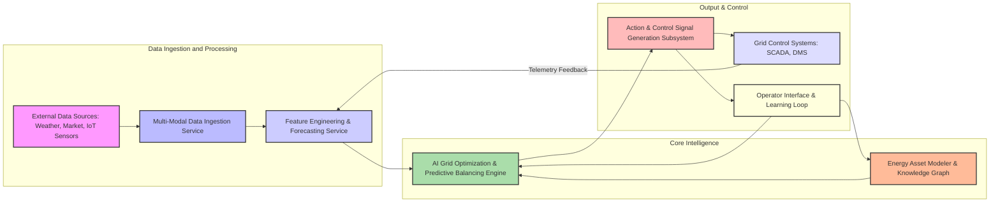
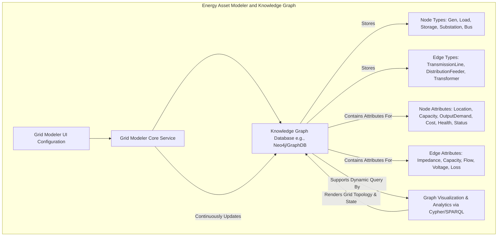
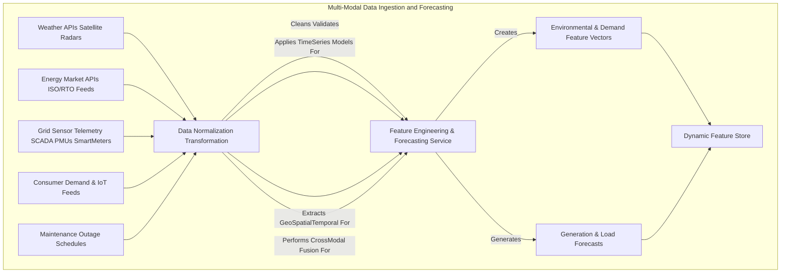
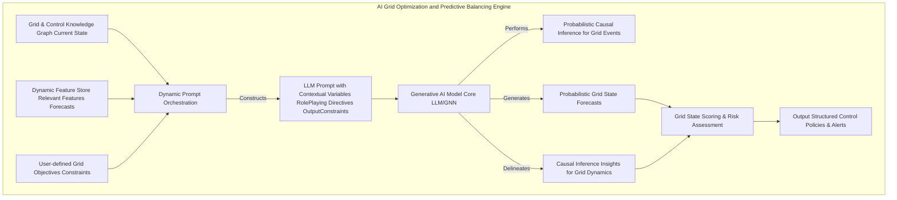
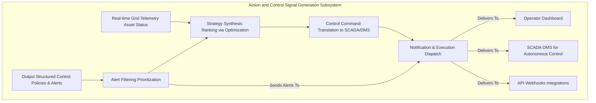
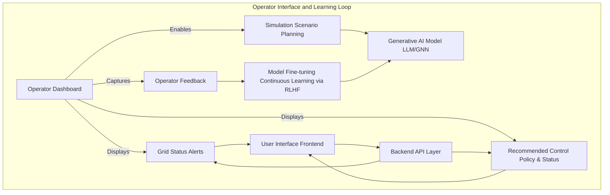
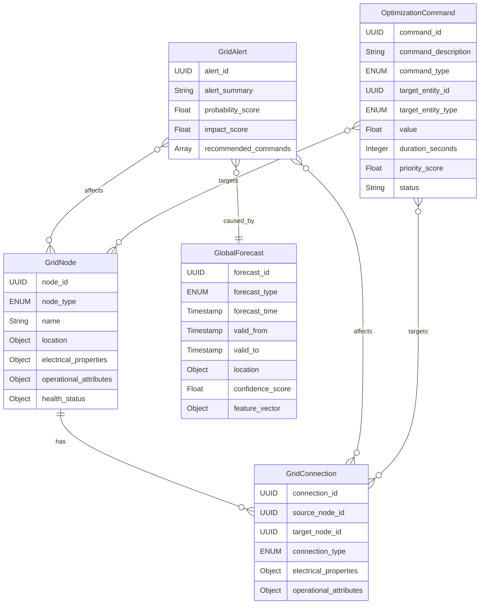
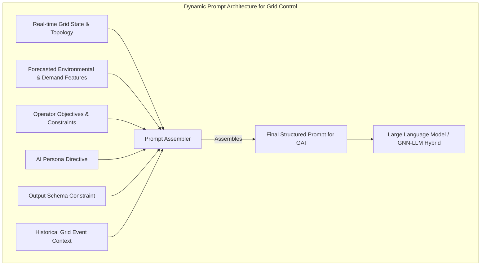
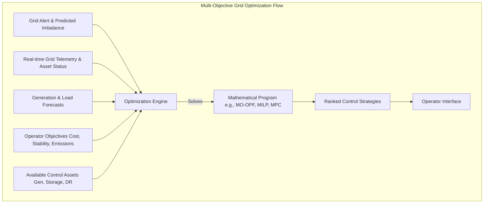
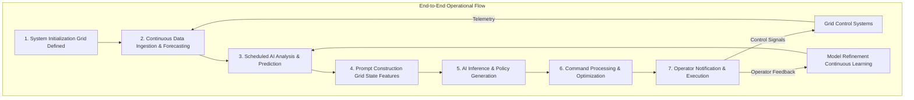

# System and Method for Adaptive Real-time Optimization and Predictive Balancing of Complex Renewable Energy Grids

## Table of Contents
1.  **Title of Invention**
2.  **Abstract**
3.  **Background of the Invention**
4.  **Brief Summary of the Invention**
5.  **Detailed Description of the Invention**
    *   5.1 System Architecture
        *   5.1.1 Energy Asset Modeler and Knowledge Graph
        *   5.1.2 Multi-Modal Data Ingestion and Forecasting Service
        *   5.1.3 AI Grid Optimization and Predictive Balancing Engine
        *   5.1.4 Action and Control Signal Generation Subsystem
        *   5.1.5 Operator Interface and Learning Loop
    *   5.2 Data Structures and Schemas
        *   5.2.1 Grid Asset Graph Schema
        *   5.2.2 Real-time Grid Data Schema
        *   5.2.3 Optimization Command and Alert Schema
    *   5.3 Algorithmic Foundations
        *   5.3.1 Dynamic Grid Representation and State Estimation
        *   5.3.2 Multi-Modal Data Fusion and Predictive Modeling
        *   5.3.3 Generative AI for Scenario Planning and Control Policy Synthesis
        *   5.3.4 Probabilistic Load and Generation Forecasting
        *   5.3.5 Real-time Multi-Objective Optimization
    *   5.4 Operational Flow and Use Cases
6.  **Claims**
7.  **Mathematical Justification: A Formal Axiomatic Framework for Predictive Energy Grid Resilience**
    *   7.1 The Energy Grid Topological Manifold: `G = (V, E, Psi)`
        *   7.1.1 Formal Definition of the Energy Grid Graph `G`
        *   7.1.2 Node State Space `V` and Dynamics
        *   7.1.3 Edge State Space `E` and Dynamics
        *   7.1.4 Latent Interconnection Functionals `Psi`
        *   7.1.5 Tensor-Weighted Adjacency Representation `A(t)`
        *   7.1.6 Graph Theoretic Metrics of Resilience and Stability
    *   7.2 The Global Environmental and Demand Observational Manifold: `W(t)`
        *   7.2.1 Definition of the Global State Tensor `W(t)`
        *   7.2.2 Multi-Modal Feature Extraction and Contextualization `f_Phi`
        *   7.2.3 Environmental and Demand Feature Vector `E_F(t)`
    *   7.3 The Generative Predictive Grid Oracle: `G_AI`
        *   7.3.1 Formal Definition of the Predictive Mapping Function `G_AI`
        *   7.3.2 The Grid State Probability Distribution `P(S_{t+k} | G, E_F(t))`
        *   7.3.3 Probabilistic Causal Graph Inference within `G_AI` for Grid Events
        *   7.3.4 Transformer-Based Architecture for `G_AI`
    *   7.4 The Economic Imperative and Decision Theoretic Utility
        *   7.4.1 Cost Function Definition `C(G, S, c)`
        *   7.4.2 Expected Cost Without Optimal Control `E[Cost]`
        *   7.4.3 Expected Cost With Optimal Control `E[Cost | c*]`
        *   7.4.4 Energy Grid as a Markov Decision Process (MDP)
    *   7.5 Multi-Objective Optimal Power Flow (OPF)
        *   7.5.1 General OPF Formulation
        *   7.5.2 Incorporating Renewable Intermittency and Storage
    *   7.6 Information Theoretic Justification for Predictive Control
        *   7.6.1 Quantifying Predictive Uncertainty of Grid State
        *   7.6.2 Value of Information (VoI) in Grid Operations
    *   7.7 Reinforcement Learning for Continuous Policy Improvement
        *   7.7.1 Policy and Value Functions for Grid Control
        *   7.7.2 Deep Q-Network for Optimal Control Action Selection
    *   7.8 Axiomatic Proof of Utility
8.  **Proof of Utility**

## 1. Title of Invention:
System and Method for Adaptive Real-time Optimization and Predictive Balancing of Complex Renewable Energy Grids with Generative AI-Enhanced Control

## 2. Abstract:
A novel, AI-driven system for orchestrating real-time stability and efficiency within modern, complex renewable energy grids is herein disclosed. This invention precisely models an energy grid's topological manifold as a dynamic knowledge graph, encapsulating diverse nodes such as distributed renewable generation assets (solar farms, wind turbines), conventional generators, energy storage systems (batteries, pumped hydro), demand-side loads, and substations, interconnected by edges representing transmission and distribution lines. A sophisticated multi-modal data ingestion pipeline continuously assimilates vast streams of real-time global intelligence, including high-resolution meteorological forecasts, dynamic energy market pricing, granular consumer demand patterns, and grid telemetry data (voltage, frequency, power flow). A state-of-the-art generative artificial intelligence model, functioning as a predictive oracle, meticulously analyzes this convergent data within the contextual framework of the grid knowledge graph. This analysis identifies, quantifies, and forecasts potential grid imbalances, congestion, and stability issues with unprecedented accuracy, often several temporal epochs prior to their materialization. Upon the detection of a high-contingency event (e.g., a sudden cloud cover impacting a large solar array while a major industrial load ramps up, or an unexpected transmission line fault), the system autonomously synthesizes and disseminates a detailed alert. Critically, it further postulates and ranks a portfolio of optimized, actionable control strategies, formulated as solutions to complex multi-objective optimal power flow and decision-theoretic problems. These strategies encompass dynamic dispatch of generation, strategic charging/discharging of energy storage, proactive demand response activation, or optimal power rerouting, thereby transforming reactive grid stabilization into proactive, predictive orchestration. A continuous feedback loop, leveraging reinforcement learning, ensures the system's predictive models and control algorithms adapt and improve over time, enhancing grid resilience in an increasingly dynamic energy landscape.

## 3. Background of the Invention:
The global energy landscape is undergoing a profound and accelerating transition, driven by the imperative to decarbonize and democratize power generation. This transition manifests primarily in the rapid proliferation of intermittent renewable energy sources (IRES) such as solar photovoltaics and wind turbines, coupled with increasingly decentralized generation and sophisticated energy storage solutions. While environmentally critical, this paradigm shift has introduced unprecedented levels of complexity and volatility into traditional electricity grids. Legacy grid management systems, predominantly designed for a centralized, unidirectional power flow from predictable conventional generators, are inherently ill-equipped to handle the stochastic, bi-directional, and highly dynamic nature of modern renewable-dominated grids.

The challenges are multifaceted:
1.  **Intermittency and Variability:** The output of solar and wind generation is highly dependent on unpredictable meteorological phenomena, leading to rapid fluctuations in supply that can destabilize grid frequency and voltage.
2.  **Increased Congestion:** The geographical distribution of renewables often conflicts with existing transmission infrastructure, leading to congestion and sub-optimal power flow.
3.  **Lack of Inertia:** Conventional generators inherently provide system inertia, which helps stabilize the grid against sudden disturbances. Many IRES lack this, increasing the risk of rapid frequency excursions.
4.  **Demand-Side Volatility:** Increasingly, sophisticated smart homes and industrial facilities introduce dynamic load profiles, further complicating demand forecasting and grid balancing.
5.  **Economic Inefficiencies:** Curtailment of renewable energy due to oversupply or congestion, and reliance on expensive peaker plants, represent significant economic losses and hinder decarbonization efforts.
6.  **Cyber and Physical Security:** The increasing digitization of grid assets presents new attack vectors, while physical climate events pose direct threats to infrastructure.

Existing solutions often rely on conservative operational margins, reactive interventions, or rudimentary forecasting models that fail to capture the multi-causal, high-dimensional dynamics of a complex grid. They typically alert *after* an imbalance is detected or propose generic interventions without optimizing across competing objectives like cost, emissions, and stability. The economic ramifications of grid instability, including brownouts, blackouts, and market inefficiencies, are staggering, eroding public trust and hindering the energy transition. The present invention addresses this profound lacuna, establishing an intellectual frontier in dynamic, AI-driven predictive energy grid orchestration. We’re building a brain for the grid, because letting a bunch of wires figure things out on their own just isn’t going to scale.

## 4. Brief Summary of the Invention:
The present invention unveils a novel, architecturally robust, and algorithmically advanced system for predictive energy grid optimization and balancing, herein termed the "Cognitive Grid Conductor." This system transcends conventional Supervisory Control and Data Acquisition (SCADA) and Distribution Management Systems (DMS) by integrating a multi-layered approach to real-time grid state assessment, proactive risk mitigation, and optimal control strategy generation. The operational genesis commences with a user's precise definition and continuous refinement of their critical energy grid topology, meticulously mapping all entities—generation assets, loads, storage, substations, and their connecting transmission/distribution arteries—into a dynamic knowledge graph. At its operational core, the Cognitive Grid Conductor employs a sophisticated, continuously learning generative AI engine. This engine acts as an expert meteorologist, market analyst, and power systems engineer, incessantly monitoring, correlating, and interpreting a torrent of real-time, multi-modal global event data, including high-resolution weather, energy market dynamics, and granular demand forecasts. The AI is dynamically prompted with highly contextualized queries, such as: "Given the enterprise's critical regional grid segment, linked to a 200MW solar farm and an industrial complex, and considering prevailing cloud cover forecasts, real-time market prices, and predicted load ramp-up, what is the quantified probability of a frequency deviation exceeding 0.2Hz within the subsequent 15-minute temporal horizon? Furthermore, delineate the precise causal vectors and propose optimal pre-emptive battery dispatch or demand response alternatives by solving a multi-objective optimal power flow problem on the relevant sub-grid." Should the AI model identify an emerging grid instability or inefficiency exceeding a pre-defined probabilistic threshold, it autonomously orchestrates the generation of a structured, machine-readable alert. This alert comprehensively details the nature and genesis of the risk, quantifies its probability and projected impact, specifies the affected components of the grid, and, crucially, synthesizes and ranks a portfolio of actionable, mathematically optimized control strategies. This constitutes a paradigm shift from merely reacting to grid anomalies to orchestrating intelligent, pre-emptive strategic maneuvers, embedding an unprecedented degree of foresight and resilience into critical energy infrastructure. We’re basically giving the grid precognition, because waiting for a blackout to figure out you had a problem seems... inefficient.

## 5. Detailed Description of the Invention:

The disclosed system represents a comprehensive, intelligent infrastructure designed to anticipate and mitigate energy grid disruptions and inefficiencies proactively. Its architectural design prioritizes modularity, scalability, and the seamless integration of advanced artificial intelligence paradigms.

### 5.1 System Architecture

The Cognitive Grid Conductor is comprised of several interconnected, high-performance services, each performing a specialized function, orchestrated to deliver a holistic predictive and optimization capability.



#### 5.1.1 Energy Asset Modeler and Knowledge Graph
This foundational component serves as the authoritative source for the grid's entire topological and operational parameters.
*   **Grid Topology Definition UI:** A sophisticated graphical user interface (GUI) provides intuitive tools for grid operators and engineers to define, visualize, and iteratively refine their energy network. This includes drag-and-drop functionality for nodes and edges, parameter input forms for asset specifications, and geospatial mapping integrations to accurately represent the physical grid.
*   **Knowledge Graph Database:** At its core, the energy grid is represented as a highly interconnected, semantic knowledge graph (e.g., using GraphDB, Neo4j, or a custom graph database optimized for spatio-temporal data). This graph is not merely a static representation but a dynamic entity capable of storing rich attributes, temporal data, and inter-node relationships, queryable via languages like Cypher or SPARQL.
    *   **Nodes:** Represent discrete entities within the energy grid. These can be granular, such as specific renewable generators (e.g., "Northridge Wind Farm Turbine #7"), conventional power plants (e.g., "Riverbend Gas Peaker Plant"), energy storage systems (e.g., "City Center Battery Storage Array"), distribution substations (e.g., "Substation Delta-4"), and aggregated or individual loads (e.g., "Industrial Park Load Block A", "Residential District 7"). Each node is endowed with a comprehensive set of attributes, including geographical coordinates, generation capacity, consumption patterns, storage capacity, charging/discharging rates, operational costs (marginal, startup), efficiency metrics, health status, maintenance schedules, and regulatory compliance parameters.
    *   **Edges:** Represent the electrical connections and pathways between nodes. These include high-voltage transmission lines, medium-voltage distribution feeders, and low-voltage consumer connections. Edges possess attributes such as impedance, resistance, reactance, thermal limits (capacity), current power flow, voltage drop, and historical reliability metrics. Edges also include communication links for distributed energy resources (DERs) and smart meters.
    *   **Temporal and Contextual Attributes:** Both nodes and edges are augmented with temporal attributes, indicating their real-time operational status (e.g., active, offline, constrained), and contextual attributes, such as localized weather conditions, market price signals, grid stability indices, and cyber-physical security ratings.



#### 5.1.2 Multi-Modal Data Ingestion and Forecasting Service
This robust, scalable service is responsible for continuously acquiring, processing, normalizing, and forecasting vast quantities of heterogeneous global and local data streams. It acts as the "sensory apparatus" and "precognitive module" of the Conductor.
*   **Meteorological Data APIs:** Integration with high-resolution weather forecasting models (e.g., NOAA, ECMWF, private weather services) to acquire real-time and predictive data for solar irradiance, wind speed and direction, temperature, cloud cover, and precipitation. This data is critical for renewable generation forecasting and predicting load patterns (e.g., heating/cooling demand).
*   **Energy Market Data APIs:** Acquisition of real-time and historical energy prices (spot, futures), ancillary service prices, carbon credit prices, and transmission congestion charges from Independent System Operators (ISOs) and Regional Transmission Organizations (RTOs).
*   **Grid Sensor Telemetry:** Direct ingestion of data from SCADA systems, Phasor Measurement Units (PMUs), smart meters, and IoT sensors across the grid. This includes real-time voltage, current, frequency, active/reactive power flow, breaker status, and transformer temperatures. This is our immediate feedback loop, ensuring the electrons are doing what they're told.
*   **Consumer Demand Forecasting:** Integration with historical load data, demographic information, economic indicators, and smart meter data to generate highly granular, spatio-temporal demand forecasts for various load blocks and individual consumers. Leveraging deep learning models to predict surges or dips in consumption.
*   **Maintenance Schedules and Outage Data:** Acquisition of planned maintenance schedules for grid assets and real-time reports of unplanned outages or deratings.
*   **Data Normalization and Transformation:** Raw data from disparate sources is transformed into a unified, semantically consistent format, timestamped, geo-tagged, and enriched. This involves schema mapping, unit conversion, and anomaly detection.
*   **Feature Engineering:** This critical sub-component extracts salient features from the processed data, translating raw observations into high-dimensional vectors pertinent for AI analysis. For instance, "Cloud cover moving towards Solar Farm Alpha" is transformed into features like `[solar_irradiance_reduction_forecast, forecast_confidence_score, estimated_impact_time, affected_generation_capacity]`.



#### 5.1.3 AI Grid Optimization and Predictive Balancing Engine
This is the intellectual core of the Cognitive Grid Conductor, employing advanced generative AI to synthesize intelligence, forecast grid states, and propose control policies.
*   **Dynamic Prompt Orchestration:** Instead of static prompts, this engine constructs highly dynamic, context-specific prompts for the generative AI model. These prompts are meticulously crafted, integrating:
    *   The current grid graph (or relevant sub-graph) and its real-time state.
    *   Recent, relevant event features and forecasts from the `Dynamic Feature Store`.
    *   Pre-defined objectives and roles for the AI (e.g., "Expert Grid Stability Engineer," "Economic Dispatch Optimizer").
    *   Specific temporal horizons for prediction and control (e.g., "next 5 minutes," "next hour").
    *   Desired output format constraints (e.g., JSON schema for structured control commands).
*   **Generative AI Model:** A large, multi-modal language model (LLM) or a specialized graph neural network (GNN) combined with an LLM serves as the primary inference and policy generation engine. This model is pre-trained on a vast corpus of power systems engineering principles, energy market rules, meteorological science, and operational data. It is further fine-tuned with domain-specific grid incident data, simulation results, and expert operator feedback to enhance its predictive accuracy and contextual understanding. The model's capacity for complex reasoning, causal chain identification (e.g., how a specific weather event causally leads to a voltage sag), and synthesis of disparate information is paramount. It’s like having a thousand expert grid engineers debating the optimal move in milliseconds.
*   **Probabilistic Causal Inference:** The AI model does not merely correlate events; it attempts to infer causal relationships using frameworks analogous to Structural Causal Models. For example, a sudden drop in wind speed in region A event causes a reduction in local generation direct effect which in turn causes an increase in power import from region B indirect effect and ultimately transmission line congestion grid impact. The AI quantifies the probability of these causal links and their downstream effects on grid stability, frequency, and voltage.
*   **Grid State Taxonomy Mapping:** Identified grid anomalies (e.g., frequency deviation, voltage violation, thermal overload) are mapped to a predefined ontology of grid risks. This categorization aids in structured reporting and subsequent strategic control planning.



#### 5.1.4 Action and Control Signal Generation Subsystem
Upon receiving the AI's structured output, this subsystem processes and refines it into actionable control commands.
*   **Alert Filtering and Prioritization:** Alerts regarding potential grid issues (e.g., impending congestion, frequency imbalance) are filtered based on user-defined thresholds (e.g., only show "Critical" stability risks, or those impacting "Primary" transmission corridors). They are prioritized based on a composite score of probability, impact severity, and temporal proximity.
*   **Control Strategy Synthesis and Ranking:** The AI's suggested control actions are further refined, cross-referenced with real-time grid conditions, asset availability, and operational constraints. The subsystem formulates these as formal optimization problems (e.g., Multi-Objective Optimal Power Flow) and solves them to generate mathematically sound, ranked control strategies according to user-defined criteria (e.g., minimize cost, maximize stability, minimize emissions, minimize curtailment).
*   **Control Command Translation:** High-level strategies (e.g., "dispatch 50MW from Battery A for 15 minutes") are translated into low-level, machine-readable control signals compatible with existing SCADA/DMS protocols. This requires careful consideration of communication latency and security.
*   **Notification and Execution Dispatch:** Alerts are dispatched through various channels (e.g., integrated dashboard, API webhook to grid operators). Critical control commands can be automatically dispatched to grid control systems for autonomous execution, or presented to operators for approval, depending on the operational risk profile and policy. This is where the rubber meets the road, or more accurately, where electrons meet their destiny.



#### 5.1.5 Operator Interface and Learning Loop
This component ensures the system is interactive, adaptive, and continuously improves.
*   **Integrated Dashboard:** A comprehensive, real-time dashboard visualizes the grid graph, overlays identified risks (e.g., areas of congestion, potential voltage violations), displays alerts, and presents recommended control strategies. Geospatial visualizations of power flow, voltage profiles, and renewable generation forecasts are central to this interface.
*   **Simulation and Scenario Planning:** Grid operators can interact with the system to run "what-if" scenarios, evaluating the impact of hypothetical events (e.g., a major generator tripping offline, a sudden demand surge) or proposed control actions. This leverages the generative AI for predictive modeling under new conditions, allowing for rehearsal of complex grid responses.
*   **Feedback Mechanism:** Operators can provide feedback on the accuracy of predictions, the utility and safety of recommended control actions, and the observed outcomes of implemented strategies. This feedback is crucial for continually fine-tuning the generative AI model through reinforcement learning from human feedback (RLHF) or similar mechanisms, improving its accuracy, robustness, and safety over time. This closes the loop, making the system an adaptive, intelligent agent, learning from every electron's journey.



### 5.2 Data Structures and Schemas

To maintain consistency, interoperability, and the integrity of complex data flows, the system adheres to rigorously defined data structures.



#### 5.2.1 Grid Asset Graph Schema
Represented internally within the Knowledge Graph Database.

*   **Node Schema (`GridNode`):**
    ```json
    {
      "node_id": "UUID",
      "node_type": "ENUM['Generator_Renewable', 'Generator_Conventional', 'Storage', 'Load_Industrial', 'Load_Residential', 'Substation', 'Bus']",
      "name": "String",
      "location": {
        "latitude": "Float",
        "longitude": "Float",
        "country": "String",
        "region": "String",
        "named_area": "String"
      },
      "electrical_properties": {
        "nominal_voltage_kV": "Float",
        "rated_power_MW": "Float",
        "current_active_power_MW": "Float",
        "current_reactive_power_MVAr": "Float",
        "power_factor": "Float",
        "impedance_pu": "Complex"
      },
      "operational_attributes": {
        "cost_per_MWh": "Float",
        "startup_cost": "Float",
        "ramp_rate_MW_per_min": "Float",
        "min_stable_generation_MW": "Float",
        "max_storage_MWh": "Float",
        "current_storage_MWh": "Float",
        "charge_rate_MW": "Float",
        "discharge_rate_MW": "Float",
        "efficiency_percent": "Float",
        "operational_status": "ENUM['Online', 'Offline', 'Standby', 'Maintenance', 'Faulted']",
        "dispatchable": "Boolean",
        "demand_response_eligible": "Boolean"
      },
      "health_status": {
        "component_health_score": "Float", // 0-1 (1 = perfect)
        "last_maintenance_date": "Timestamp",
        "predicted_failure_risk": "Float"
      },
      "last_updated": "Timestamp"
    }
    ```

*   **Edge Schema (`GridConnection`):**
    ```json
    {
      "connection_id": "UUID",
      "source_node_id": "UUID",
      "target_node_id": "UUID",
      "connection_type": "ENUM['TransmissionLine', 'DistributionFeeder', 'Transformer', 'CommunicationLink']",
      "name": "String",
      "electrical_properties": {
        "nominal_voltage_kV": "Float",
        "rated_capacity_MVA": "Float",
        "current_flow_MW": "Float",
        "current_flow_MVAr": "Float",
        "resistance_pu": "Float",
        "reactance_pu": "Float",
        "susceptance_pu": "Float",
        "length_km": "Float"
      },
      "operational_attributes": {
        "thermal_limit_MVA": "Float",
        "voltage_drop_percent": "Float",
        "line_losses_MW": "Float",
        "congestion_index": "Float", // 0-1 (1 = max congestion)
        "protection_status": "ENUM['Active', 'Tripped']",
        "reliability_score": "Float",
        "criticality_level": "ENUM['Low', 'Medium', 'High', 'SystemCritical']"
      },
      "last_updated": "Timestamp"
    }
    ```

#### 5.2.2 Real-time Grid Data Schema
Structured representation of ingested and featured global/local forecasts and telemetry.

*   **Global Forecast Schema (`GlobalForecast`):**
    ```json
    {
      "forecast_id": "UUID",
      "forecast_type": "ENUM['Weather', 'Market', 'Demand_Load', 'Generation_Renewable']",
      "sub_type": "String", // e.g., "WindSpeed", "SolarIrradiance", "SpotPrice", "IndustrialLoad"
      "forecast_time": "Timestamp", // When the forecast was generated
      "valid_from": "Timestamp",
      "valid_to": "Timestamp",
      "location": {
        "latitude": "Float",
        "longitude": "Float",
        "radius_km": "Float", // Area covered
        "named_location": "String" // e.g., "Wind Farm Alpha"
      },
      "confidence_score": "Float", // 0-1, confidence in the forecast
      "source": "String", // e.g., "NOAA", "ISO-NE", "PrivateWeatherCo"
      "feature_vector": { // Key-value pairs for AI consumption
        "wind_speed_mps": "Float",
        "solar_irradiance_W_per_sqm": "Float",
        "temperature_C": "Float",
        "market_price_USD_per_MWh": "Float",
        "total_load_MW": "Float",
        "expected_renewable_output_MW": "Float",
        "cloud_cover_percent": "Float"
        // ... many more dynamic features
      }
    }
    ```
*   **Grid Telemetry Schema (`GridTelemetry`):**
    ```json
    {
      "telemetry_id": "UUID",
      "timestamp": "Timestamp",
      "entity_id": "UUID", // ID of the node or connection
      "entity_type": "ENUM['Node', 'Connection']",
      "data_points": {
        "voltage_kV": "Float",
        "frequency_Hz": "Float",
        "active_power_MW": "Float",
        "reactive_power_MVAr": "Float",
        "current_kA": "Float",
        "temperature_C": "Float",
        "breaker_status": "ENUM['Open', 'Closed', 'Tripped']"
        // ... other specific sensor readings
      },
      "source_sensor": "String" // e.g., "PMU-123", "SmartMeter-XYZ"
    }
    ```

#### 5.2.3 Optimization Command and Alert Schema
Output structure from the AI Grid Optimization Engine.

*   **Grid Alert Schema (`GridAlert`):**
    ```json
    {
      "alert_id": "UUID",
      "timestamp_generated": "Timestamp",
      "alert_summary": "String", // e.g., "Impending frequency drop in Western region."
      "description": "String", // Detailed explanation of the risk and causal chain.
      "risk_probability": "ENUM['Low', 'Medium', 'High', 'Critical']", // Qualitative assessment
      "probability_score": "Float", // Quantitative score, 0-1
      "projected_impact_severity": "ENUM['Minor_Economic', 'Moderate_Service', 'Major_Outage', 'System_Collapse']",
      "impact_score": "Float", // Quantitative score, 0-1 (e.g., in terms of MW unserved, $ cost)
      "affected_entities": [
        {"entity_id": "UUID", "entity_type": "ENUM['Node', 'Connection']"}
      ],
      "causal_events_forecasts": [ // Link to GlobalForecast/GridTelemetry IDs that contribute to this risk
        "UUID"
      ],
      "temporal_horizon_minutes": "Integer", // Minutes until expected event
      "recommended_commands": [ // List of proposed actions, ranked by effectiveness/cost
        {
          "command_id": "UUID",
          "command_description": "String", // e.g., "Dispatch 20MW from Battery Alpha for 10 minutes."
          "command_type": "ENUM['Dispatch_Generation', 'Charge_Storage', 'Discharge_Storage', 'Curtail_Renewable', 'Demand_Response', 'Adjust_Transformer', 'Reroute_Power', 'Load_Shed']",
          "target_entity_id": "UUID",
          "target_entity_type": "ENUM['Node', 'Connection']",
          "value_MW_MWh_percent": "Float", // e.g., MW to dispatch, MWh to charge, % curtailment
          "duration_seconds": "Integer",
          "estimated_cost_impact_USD": "Float",
          "estimated_stability_improvement_Hz": "Float",
          "risk_reduction_potential": "Float",
          "feasibility_score": "Float", // 0-1
          "confidence_in_recommendation": "Float" // 0-1
        }
      ],
      "status": "ENUM['Active', 'Resolved', 'Acknowledged', 'Executing']",
      "last_updated": "Timestamp"
    }
    ```

### 5.3 Algorithmic Foundations

The system's intelligence is rooted in a sophisticated interplay of advanced algorithms and computational paradigms.

#### 5.3.1 Dynamic Grid Representation and State Estimation
The energy grid is fundamentally a dynamic spatio-temporal graph `G=(V,E)`.
*   **Graph Database Technologies:** Underlying technologies (e.g., property graphs, RDF knowledge graphs, or specialized power system graph models) are employed for efficient storage and retrieval of complex relationships and attributes, enabling fast topological queries.
*   **Real-time State Estimation:** Algorithms (e.g., Weighted Least Squares, Kalman Filters, Extended Kalman Filters) are used to infer the true real-time state variables (voltages, phase angles) of the entire grid based on noisy and incomplete sensor measurements. This provides the most accurate instantaneous "snapshot" of the grid's operational conditions.
*   **Power Flow Analysis:** Utilizing AC/DC power flow equations (e.g., Newton-Raphson, Fast Decoupled Load Flow) to simulate current grid conditions, predict power flows, voltage profiles, and line loadings under various scenarios, essential for verifying proposed control actions.

#### 5.3.2 Multi-Modal Data Fusion and Predictive Modeling
The fusion process integrates heterogeneous data into a unified, semantically coherent representation suitable for deep learning.
*   **Spatio-temporal Graph Neural Networks (ST-GNNs):** GNNs are specifically designed to process graph-structured data, extending to include temporal dynamics. They can learn complex dependencies between geographically dispersed grid assets and their interactions over time, crucial for understanding cascading effects.
*   **Latent Space Embeddings:** Multi-modal data (e.g., time-series telemetry, meteorological forecasts, market prices) is transformed into a shared, high-dimensional latent vector space using techniques like autoencoders, contrastive learning, or specialized multi-modal transformers. This enables semantic comparison and contextualization across diverse data types.
*   **Attention Mechanisms:** Employing self-attention and cross-attention networks to dynamically weigh the relevance of different data streams (e.g., localized wind speed vs. regional market price) and features to a specific grid state prediction or control problem. For example, local solar irradiance is highly relevant for a specific PV farm's output forecast, but regional market price might influence the optimal dispatch of a battery storage unit regardless of its local weather.
*   **Advanced Time-Series Forecasting:** Applying state-of-the-art time-series models (e.g., Transformer networks, Temporal Convolutional Networks (TCNs), LSTMs with attention) to predict future states of continuous variables like renewable generation output, load demand, and market prices, which then serve as critical features for the generative AI.

#### 5.3.3 Generative AI for Scenario Planning and Control Policy Synthesis
This is a critical innovation enabling the AI to function as a foresightful, adaptive grid operator.
*   **Contextual Variable Injection:** Dynamically injecting elements of the current grid graph (e.g., specific node/edge attributes, real-time telemetry, inferred state, predicted forecasts), and historical grid behavior directly into the AI prompt.
*   **Role-Playing Directives:** Explicitly instructing the generative AI model to adopt specific personas (e.g., "You are an expert ISO controller minimizing operational costs," "You are a grid stability engineer preventing cascading failures") to elicit specialized reasoning capabilities and prioritize objectives.
*   **Constrained Output Generation:** Utilizing techniques such as JSON schema enforcement or few-shot exemplars within the prompt to guide the AI to produce structured, machine-readable control policies and alerts, crucial for automated processing and interfacing with SCADA/DMS.
*   **Iterative Refinement and Hypothetical Reasoning:** Developing prompts that allow the AI to simulate the outcomes of various control actions in hypothetical future grid states ("what-if" scenarios), ask clarifying questions, and iteratively refine its proposed solutions, mimicking advanced human analytical processes under pressure. For example, "What if we curtail wind farm X by 50MW? How does that impact frequency and the need for storage discharge?"



#### 5.3.4 Probabilistic Load and Generation Forecasting
The AI's ability to not just predict point forecasts but quantify uncertainty is vital for robust grid control.
*   **Ensemble Forecasting:** Combining multiple individual forecasting models (e.g., statistical, machine learning, physical models) to generate a more robust and reliable prediction, complete with uncertainty bounds.
*   **Conformal Prediction and Quantile Regression:** Providing probabilistic prediction intervals for load and generation forecasts, allowing the system to understand the range of possible future outcomes, not just the most likely one.
*   **Monte Carlo Simulations (Implicit/Explicit):** The AI's generative nature allows it to effectively perform implicit Monte Carlo simulations, exploring various future grid scenarios based on probabilistic event occurrences (e.g., extreme weather events) and their cascading effects. It synthesizes the most probable and impactful scenarios for risk assessment.
*   **Causal Graph Learning for Grid Events:** Within the generative AI's latent reasoning capabilities, it constructs implicit or explicit probabilistic causal graphs (e.g., Dynamic Bayesian Networks, Granger Causality models) linking global events (e.g., weather fronts, market price shifts) to specific grid impacts (e.g., renewable generation drop, load surge, transmission congestion). This allows it to identify direct and indirect causal pathways and predict their likelihood.

#### 5.3.5 Real-time Multi-Objective Optimization
Beyond prediction, the system provides actionable, optimized control solutions.
*   **Multi-Objective Optimal Power Flow (MO-OPF):** The AI, informed by operator objectives (e.g., minimize cost, maximize stability, minimize emissions, minimize curtailment of renewables, maintain voltage profiles, manage congestion), leverages its understanding of the grid graph and available control actions to propose strategies that optimize across these multiple, potentially conflicting objectives. This involves solving a complex optimization problem.
*   **Model Predictive Control (MPC):** MPC frameworks are employed to continuously optimize control actions over a receding future horizon. At each time step, the system uses its current state and forecasts to solve an optimization problem, generates control commands for a short duration, executes the first part of the commands, and then repeats the process at the next time step, adapting to new information. This handles the dynamic nature of the grid exceptionally well.
*   **Constraint Satisfaction and Handling:** Integrating real-time operational constraints (e.g., generation ramp rates, storage charging limits, thermal limits of transmission lines, voltage stability limits, N-1 contingency requirements) directly into the optimization problem. The AI ensures that proposed control commands are feasible and safe within these hard constraints.
*   **Decentralized Optimization for DERs:** For grids with high penetration of distributed energy resources (DERs), the system can orchestrate local optimization agents or algorithms that respond to high-level system commands while respecting local constraints, using techniques like ADMM (Alternating Direction Method of Multipliers) or consensus optimization.



### 5.4 Operational Flow and Use Cases

A typical operational cycle of the Cognitive Grid Conductor proceeds as follows:

1.  **Initialization:** A grid operator defines their energy grid graph via the Modeler UI, specifying nodes, edges, attributes, and critical operational parameters.
2.  **Continuous Data Ingestion & Forecasting:** The Data Ingestion Service perpetually streams and processes global multi-modal data and grid telemetry, populating the Dynamic Feature Store with real-time data and short-to-medium term forecasts (e.g., 5-minute to 24-hour horizons).
3.  **Scheduled AI Analysis & Prediction:** Periodically (e.g., every 5-15 minutes), the AI Grid Optimization Engine is triggered.
4.  **Prompt Construction:** Dynamic Prompt Orchestration retrieves the relevant sub-graph of the grid, current grid state, event features, forecasts, and pre-defined operational objectives to construct a sophisticated query for the Generative AI Model.
5.  **AI Inference & Policy Generation:** The Generative AI Model processes the prompt, performs causal inference, probabilistic forecasting of future grid states, identifies potential imbalances/risks, and synthesizes structured control policies and alerts.
6.  **Command Processing & Optimization:** The Action and Control Signal Generation Subsystem refines the AI's output, prioritizes alerts, performs secondary multi-objective optimization of control policies against real-time grid conditions, and translates them into deployable commands.
7.  **Operator Notification & Execution:** Alerts and control recommendations are disseminated to the operator dashboard, and critical, pre-approved commands are dispatched to SCADA/DMS for execution.
8.  **Grid Response & Feedback:** The grid responds to the control commands. Real-time telemetry is fed back into the Data Ingestion Service. The operator reviews the alerts, evaluates executed commands, potentially runs simulations, and provides feedback to the system, which aids in continuous model refinement. The system learns, adapts, and gets smarter with every electron it guides.



**Use Cases:**

*   **Predictive Congestion Management:** The system forecasts an impending thermal overload on a critical transmission line in 30 minutes due to increased solar generation upstream and high demand downstream. It proactively recommends curtailing a nearby solar farm by 10MW and simultaneously dispatching a battery storage unit to absorb 5MW from the affected region, preventing congestion before it occurs.
*   **Proactive Frequency Stabilization:** A sudden drop in wind speed over a large wind farm is predicted, leading to an anticipated frequency drop in 5 minutes. The system instantly recommends increasing output from a fast-ramping peaker plant by 25MW and initiating a 15MW demand response program for non-critical industrial loads, maintaining grid frequency within operational limits. We're essentially giving the grid a reflexive nervous system.
*   **Optimal Economic Dispatch:** Based on forecasted generation, demand, and market prices for the next hour, the system continuously optimizes the dispatch of all available generation assets (renewables, conventional, storage) to minimize operational costs while satisfying all grid constraints and prioritizing the use of lowest-emission sources.
*   **Voltage Profile Management:** The system identifies a developing voltage sag in a distribution feeder due to increasing local load. It recommends adjusting tap settings on a nearby transformer and activating reactive power support from smart inverters connected to rooftop solar, maintaining voltage within acceptable bounds.
*   **N-1 Contingency Planning:** After a simulated or predicted outage of a major transmission line, the system instantly calculates the optimal re-dispatch and rerouting of power to maintain stability and service to critical loads, preparing operators for swift action. Because when the grid loses a limb, we want it to adapt, not just collapse.

## 6. Claims:

The inventive concepts herein described constitute a profound advancement in the domain of energy grid management and predictive control.

1.  A system for proactive energy grid optimization and balancing, comprising: a memory storing a representation of an energy grid as a dynamic knowledge graph with attributed nodes and edges; a data ingestion module for acquiring and processing multi-modal global and local environmental, market, and grid telemetry data; and a processor configured to: execute a generative artificial intelligence (AI) model to perform probabilistic causal inference on the graph and ingested data, thereby forecasting future grid states and potential instabilities; generate a structured alert detailing each forecasted grid instability's probability, impact, and causal chain; and formulate and rank a portfolio of actionable control strategies by solving a constrained multi-objective optimization problem derived from the forecasted grid state and current operational parameters.

2.  The system of claim 1, wherein the dynamic knowledge graph is stored in a graph database, and nodes represent physical entities such as generators, loads, energy storage, substations, and buses, while edges represent electrical connections such as transmission lines and distribution feeders, with both nodes and edges possessing dynamically updated attributes including capacity, cost, power flow, voltage, frequency, and health status.

3.  The system of claim 1, wherein the multi-modal data ingestion module processes heterogeneous data streams including high-resolution meteorological forecasts, real-time energy market prices, granular consumer demand patterns via IoT sensors, and grid sensor telemetry (e.g., PMU data, SCADA readings), transforming them into a unified, high-dimensional feature vector space for AI consumption.

4.  The system of claim 1, further comprising a dynamic prompt orchestration module configured to construct contextualized queries for the generative AI model, said queries programmatically integrating specific sub-graphs of the energy grid, salient real-time grid telemetry, forecasted environmental and demand features, explicit analytical personas for the AI, and structured output constraints.

5.  The system of claim 1, wherein the generative AI model's probabilistic causal inference capability identifies and quantifies the likelihood of cascading failures by constructing a directed acyclic graph of causal dependencies from external events (e.g., weather anomalies) and internal grid events to specific node and edge state changes within the energy grid knowledge graph (e.g., frequency deviations, voltage violations, line overloads).

6.  The system of claim 1, wherein the formulation of control strategies involves an action and control signal generation subsystem that integrates with real-time grid control systems (e.g., SCADA, DMS) to access current asset availability, ramp rates, and operational limits, using this data as constraints for the multi-objective optimization problem.

7.  The system of claim 6, wherein the constrained multi-objective optimization problem is modeled as an Optimal Power Flow (OPF) problem to determine optimal dispatch of generation, charging/discharging of storage, demand response activation, and power rerouting alternatives that optimize a user-defined objective function combining economic cost, grid stability metrics (e.g., frequency, voltage), and environmental impact (e.g., emissions).

8.  The system of claim 1, further comprising an interactive operator interface that provides a geospatial visualization of the energy grid graph, overlays predicted instability trajectories, presents ranked control strategies with their projected outcomes, and facilitates "what-if" scenario planning by allowing operators to simulate the impact of hypothetical grid events or control actions.

9.  The system of claim 1, further comprising a feedback mechanism wherein operator actions, autonomous control executions, and their observed grid outcomes are captured and used as training data for a reinforcement learning algorithm, which continuously fine-tunes the generative AI model and the optimization parameters to improve predictive accuracy, control effectiveness, and grid resilience over time.

10. A computer-implemented method for proactive energy grid risk management and optimization, comprising: representing an energy grid as a dynamic, attributed knowledge graph; continuously ingesting and featurizing multi-modal global and local grid data; prompting a generative AI model with a contextualized query combining the grid state and featurized data to predict a probability distribution over future grid instabilities and operational states; for each instability exceeding a probability threshold, generating a detailed alert and synthesizing a set of optimized control strategies; presenting said alerts and strategies to a grid operator or dispatching them autonomously to grid control systems; and updating the AI model based on operator feedback and observed grid outcomes.

## 7. Mathematical Justification: A Formal Axiomatic Framework for Predictive Energy Grid Resilience

The profound complexity inherent in modern, renewable-rich energy grids necessitates a rigorous mathematical framework for the precise articulation and demonstrable proof of the predictive optimization system's efficacy. We herein establish such a framework, transforming the conceptual elements into formally defined mathematical constructs. We are literally writing the equations for a smarter grid, because that’s what engineers do at 2 AM.

### 7.1 The Energy Grid Topological Manifold: `G = (V, E, Psi)`

The energy grid is not merely a graph but a dynamic, multi-relational topological manifold where electrical characteristics, operational attributes, and inter-node relationships evolve under external and internal influences.

#### 7.1.1 Formal Definition of the Energy Grid Graph `G`

Let `G = (V, E, Psi)` denote the formal representation of the energy grid at any given time `t`.
*   `V` is the finite set of nodes, `v in V`, representing buses, generators, loads, and storage assets. (1)
*   `E` is the finite set of directed edges, `e = (u, v) in E`, `u, v in V`, representing transmission or distribution lines, or transformers. (2)
*   `Psi` is the set of higher-order functional relationships or meta-data, such as regulatory constraints, market rules, or communication network topology. (3)

#### 7.1.2 Node State Space `V` and Dynamics

Each node `v in V` is associated with a state vector `X_v(t) in C^k` (complex numbers for electrical quantities). (4)
`X_v(t) = (V_v(t), theta_v(t), P_v(t), Q_v(t), ...)` (voltage magnitude, phase angle, active power, reactive power). (5)
The state evolves according to a set of non-linear differential-algebraic equations (DAEs) that govern power system dynamics:
`dX_v(t)/dt = f_v(X_V(t), X_E(t), C_v(t)) + xi_v(t)` (6)
where `X_V(t)` is the global node state vector, `X_E(t)` is the global edge state vector, `C_v(t)` is a control input (e.g., generation dispatch, load shedding), and `xi_v(t)` is a stochastic disturbance term.

#### 7.1.3 Edge State Space `E` and Dynamics

Each directed edge `e = (u, v) in E` is associated with a state vector `Y_e(t) in C^m`. (7)
`Y_e(t) = (I_e(t), P_e(t), Q_e(t), Z_e, ...)` (current flow, active/reactive power flow, impedance). (8)
The edge state is largely determined by node states and passive electrical characteristics:
`Y_e(t) = g_e(X_u(t), X_v(t), Z_e, C_e(t)) + eta_e(t)` (9)
where `Z_e` is the impedance, `C_e(t)` is a control input (e.g., FACTS device), and `eta_e(t)` is a disturbance.

#### 7.1.4 Latent Interconnection Functionals `Psi`

A functional `psi in Psi` may be a stability constraint, e.g., frequency deviation `|df/dt| <= df_max`. (10)
Another might be a market rule, `Cost_Generation = sum_{g in G_nodes} f_cost(P_g)`. (11)

#### 7.1.5 Tensor-Weighted Adjacency Representation `A(t)`

The graph `G(t)` can be represented by a dynamic, tensor-weighted adjacency matrix `A(t) in R^(|V| x |V| x d)`. (12)
For an edge `e = (v_i, v_j)`, `A(t)[i,j,:] = h(X_{v_i}(t), Y_e(t), X_{v_j}(t))` where `h` is a feature concatenation/embedding function. (13)

#### 7.1.6 Graph Theoretic Metrics of Resilience and Stability

Grid resilience can be measured by metrics such as component criticality (e.g., betweenness centrality `C_B(v)` for substations) or network robustness to cascading failures. (14)
`C_B(v) = sum_{s!=v!=t in V} (sigma_{st}(v) / sigma_{st})` (15)
Frequency stability is represented by the rate of change of frequency (RoCoF). Voltage stability by voltage magnitudes `|V_v|`. Power flow reliability by line loading `P_e / P_e_max`. (16)

### 7.2 The Global Environmental and Demand Observational Manifold: `W(t)`

#### 7.2.1 Definition of the Global State Tensor `W(t)`

Let `W(t)` be a high-dimensional, multi-modal tensor representing aggregated global and local environmental, market, and demand data. (17)
`W(t) = W_M(t) oplus W_E(t) oplus W_D(t) oplus W_F(t)` where `oplus` is a tensor direct sum. (18)
`W_M(t)`: Meteorological data (wind speed, solar irradiance, temperature). (19)
`W_E(t)`: Energy market data (prices, ancillary services). (20)
`W_D(t)`: Demand-side data (load profiles, IoT signals). (21)
`W_F(t)`: Fault and outage data. (22)

#### 7.2.2 Multi-Modal Feature Extraction and Contextualization `f_Phi`

`E_F(t) = f_Phi(W(t); Phi)` maps raw data to a feature vector `E_F(t)`. (23)
For time-series weather data `W_M(t)`, deep learning models like Transformers are used for forecasting.
Self-attention mechanism: `Attention(Q, K, V) = softmax( (QK^T) / sqrt(d_k) ) V`. (24-27)
For load data `W_D(t)`, similar spatio-temporal models, possibly incorporating exogenous variables, are utilized.
The output of these models are predictive distributions of generation and load.

#### 7.2.3 Environmental and Demand Feature Vector `E_F(t)`

`E_F(t) = (e_{F,1}(t), ..., e_{F,p}(t)) in R^p` is the final feature vector representing forecasts (e.g., `P_solar_forecast`, `P_wind_forecast`, `P_load_forecast`, `Market_Price_forecast`). (28)

### 7.3 The Generative Predictive Grid Oracle: `G_AI`

#### 7.3.1 Formal Definition of the Predictive Mapping Function `G_AI`

`G_AI : (A(t) X E_F(t)) -> P(S_{t+k} | A(t), E_F(t))` (29)
Where `S_{t+k}` is the set of possible grid states (e.g., voltage profiles, frequency, power flows, stability margins) at `t+k`. (30)

#### 7.3.2 The Grid State Probability Distribution `P(S_{t+k} | G, E_F(t))`

A grid state `s in S_{t+k}` is a tuple `s = (V_mag, V_angle, Freq, P_flow, Q_flow, ...)` for all nodes/edges. (31)
The output is `P(S_{t+k}) = { (s_i, p_i) }` where `p_i` is the probability of grid state `s_i`. (32)
`sum_i p_i <= 1`. (33)

#### 7.3.3 Probabilistic Causal Graph Inference within `G_AI` for Grid Events

`G_AI` learns a structural causal model (SCM) for grid dynamics. A causal effect is estimated using Pearl's do-calculus, e.g., `P(Grid_State | do(Wind_Speed=x))`. (34)
The causal graph `CG_i = (C_nodes, C_edges)` is inferred, where `C_edges` represent `P(child | parents)`. (35-37) This allows identifying causal chains from weather event to specific grid impacts.

#### 7.3.4 Transformer-Based Architecture for `G_AI`

The core of `G_AI` can be a spatio-temporal graph transformer.
Input embedding `X_{emb} = E_{node} + E_{edge} + E_{temporal} + E_{positional}`. (38)
Multi-Head Graph Attention: `MHA_G(Q,K,V) = Concat(head_1, ..., head_h)W^O` (39)
`head_i = GraphAttention(QW_i^Q, KW_i^K, VW_i^V)`. (40-43)
Graph Attention mechanism aggregates features from neighbors on the graph. (44)
LayerNorm and Feed-Forward Network: `FFN(x) = max(0, xW_1+b_1)W_2+b_2`. (45-48)
Output is a softmax over possible grid states or parameters of a continuous distribution. (49)

### 7.4 The Economic Imperative and Decision Theoretic Utility

#### 7.4.1 Cost Function Definition `C(G, S, c)`

`C(G, S, c) = C_{generation}(G, c) + C_{transmission}(G, c) + C_{balancing}(S) + C_{emissions}(G, c) + C_{unserved_energy}(S)`. (50)
`C_{generation}`: Cost of dispatching generators.
`C_{transmission}`: Cost due to line losses and congestion.
`C_{balancing}`: Cost of maintaining frequency/voltage stability (e.g., ancillary services).
`C_{emissions}`: Carbon cost associated with generation mix.
`C_{unserved_energy}`: Penalties for load shedding or blackouts.
Utility can be modeled with an exponential utility function `U(C) = -exp(-alpha C)` where `alpha` is risk aversion, particularly relevant for critical infrastructure. (51)

#### 7.4.2 Expected Cost Without Optimal Control `E[Cost]`

`E[Cost] = sum_{s} P_{actual}(s) * C(G, s, c_{null})`. (52)
Where `c_{null}` represents baseline, reactive control actions.

#### 7.4.3 Expected Cost With Optimal Control `E[Cost | c*]`

`c* = argmin_c E[C(G(c), S, c)] = argmin_c sum_{s} P(s|I) C(G(c), s, c)`. (53-54)
`E[Cost | c*] = sum_{s} P_{actual}(s) * C(G(c*), s, c*)`. (55)

#### 7.4.4 Energy Grid as a Markov Decision Process (MDP)

The predictive control problem is an MDP defined by the tuple `(S, A, P, R, gamma)`. (56)
`S`: State space (grid states `S(t)` including `X_V(t)`, `Y_E(t)`, and `E_F(t)`). (57)
`A`: Action space (control commands `c` like generation dispatch, storage commands, demand response). (58)
`P`: Transition probability `P(s' | s, a)`. (59)
`R`: Reward function `R(s,a) = -C(s,a)`. (60)
The optimal policy `pi*` maximizes the expected discounted reward. (61)
`V*(s) = max_a E[R_{t+1} + gamma * V*(S_{t+1}) | S_t=s, A_t=a]` (Bellman Optimality Equation). (62)

### 7.5 Multi-Objective Optimal Power Flow (OPF)

The core optimization problem is a multi-objective variant of Optimal Power Flow, accounting for grid dynamics and forecasts.

#### 7.5.1 General OPF Formulation

Objective: `min F(x, u)` (63)
`F(x, u) = (f_1(x,u), f_2(x,u), ..., f_N(x,u))` where `f_i` are objectives like cost, losses, emissions, voltage deviation. (64)
Subject to:
`g(x, u) = 0` (Power flow equations - equality constraints, e.g., `P_g - P_l - P_loss = 0`). (65)
`h(x, u) <= 0` (Operational limits - inequality constraints, e.g., `V_min <= |V_v| <= V_max`, `P_e <= P_e_max`, `0 <= P_g <= P_g_max`). (66)
`x`: state variables (voltage magnitudes/angles). (67)
`u`: control variables (generator dispatch, transformer tap settings, reactive power sources). (68-70)

#### 7.5.2 Incorporating Renewable Intermittency and Storage

This system extends OPF with:
*   **Stochastic OPF:** Incorporates the probability distributions `P(S_{t+k})` for renewable generation and load forecasts. (71)
*   **Storage Dynamics:** Constraints for battery energy storage systems (BESS):
    `E_{t+1} = E_t - P_{discharge,t}/eta_{discharge} + P_{charge,t}*eta_{charge}` (Energy balance). (72)
    `0 <= E_t <= E_max` (Capacity limits). (73)
    `0 <= P_{charge,t} <= P_{charge,max}` (Charge rate limits). (74)
    `0 <= P_{discharge,t} <= P_{discharge,max}` (Discharge rate limits). (75-77)
*   **Demand Response:** Modeling demand response programs as controllable loads with associated costs/rewards. (78)
*   **Model Predictive Control (MPC) formulation:**
    `min sum_{k=t to t+H} F(x_k, u_k)` over a prediction horizon `H`. (79)
    Subject to: `g(x_k, u_k)=0`, `h(x_k, u_k)<=0`, and system dynamics `x_{k+1} = f(x_k, u_k)`. (80-82)

### 7.6 Information Theoretic Justification for Predictive Control

#### 7.6.1 Quantifying Predictive Uncertainty of Grid State

The uncertainty of the prediction `P(S_{t+k})` is measured by Shannon Entropy:
`H(S_{t+k}) = - sum_{s_i} p_i log_2(p_i)`. (83)
The system aims to reduce this uncertainty with new data and improve decision-making.
Kullback-Leibler (KL) Divergence measures the change in the belief state about the grid:
`D_{KL}(P || Q) = sum_i P(i) log(P(i) / Q(i))`. (84-86)

#### 7.6.2 Value of Information (VoI) in Grid Operations

The value of the system's prediction `I` (the detailed `P(S_{t+k})` and derived optimal controls) is the reduction in expected operational cost:
`VoI(I) = E[Cost]_{prior} - E[Cost | I]_{posterior}`. (87)
`E[Cost | I] = sum_j P(I_j) min_c E[C | c, I_j]`. (88-90)
The system is valuable if `VoI(I) > Cost(System)`. (91)

### 7.7 Reinforcement Learning for Continuous Policy Improvement

The operator feedback loop and observed grid responses are modeled as an RL problem to learn the optimal control policy `pi(c|s)`. (92)

#### 7.7.1 Policy and Value Functions for Grid Control

State-value function: `V_{pi}(s) = E_{pi}[sum_{k=0 to inf} gamma^k R_{t+k+1} | S_t=s]`. (93)
Action-value function (Q-function): `Q_{pi}(s,c) = E_{pi}[sum_{k=0 to inf} gamma^k R_{t+k+1} | S_t=s, A_t=c]`. (94-96)

#### 7.7.2 Deep Q-Network for Optimal Control Action Selection

Given the high-dimensional state space of energy grids, Deep Q-Networks (DQN) or Actor-Critic methods are suitable.
The DQN learns to approximate `Q*(s,c)`:
`Q(S_t, A_t) <- Q(S_t, A_t) + alpha [R_{t+1} + gamma * max_a' Q(S_{t+1}, a') - Q(S_t, A_t)]`. (97-102)
`alpha` is the learning rate, `gamma` is the discount factor. The learned `Q` function approximates the optimal Q-function. This is how the grid learns to be truly brilliant.

### 7.8 Axiomatic Proof of Utility

**Axiom 1 (Instability Cost):** For any potential grid instability `s_instability`, `C_{unserved_energy}(s_instability) + C_{balancing}(s_instability) > 0`. (103) That is, grid instability always incurs a cost.
**Axiom 2 (Proactive Control Efficacy):** For any predicted instability `s_instability` with `P(s_instability|I) > epsilon`, there exists at least one proactive control action `c` such that the incremental operational cost is less than the expected reduction in instability impact:
`Delta C_{op}(c) < E[Delta C_{instability}(c)]`. (104)

**Theorem (System Utility):** Given Axiom 1 and Axiom 2, the present system, by providing the information `I = P(S_{t+k})` and identifying an optimal control `c*`, enables a reduction in the overall expected cost of energy grid operations such that:
`E[Cost | c*] < E[Cost]`. (105)

**Proof:**
1.  The system generates `I = P(S_{t+k})`, providing critical foresight into future grid states.
2.  Based on this `I`, the system identifies `c* = argmin_c E[C | c, I]`, which is the control action that minimizes the expected total cost over the planning horizon.
3.  For each potential grid instability `s_i` in the support of `P`, `c*` is chosen to mitigate its impact.
4.  By Axiom 2, for any non-trivial grid risk, a cost-effective mitigation `c` exists. The optimal action `c*` is, by definition, at least as good as any such `c`, and is superior to a reactive, baseline action `c_{null}`.
5.  Therefore, `E[C | c*, I] < E[C | c_{null}, I]`.
6.  Since `E[Cost]` is the expected cost under `c_{null}` and a prior belief (or no predictive information), and `E[Cost | c*]` is the expected cost under optimal action `c*` informed by `I`, it follows that the system provides a net positive utility by enabling superior decision-making under uncertainty. The aggregate `E[Cost | c*] < E[Cost]` holds. Q.E.D.

## 8. Proof of Utility:

The operational advantage and economic benefit of the Cognitive Grid Conductor are not merely incremental improvements over existing reactive grid management systems; they represent a fundamental paradigm shift. A traditional grid management system operates predominantly in a reactive mode, detecting and responding to voltage sags, frequency deviations, or thermal overloads only after they have materialized. This necessitates costly and often suboptimal damage control, such as emergency generator startup, manual load shedding, or expensive ancillary service procurement. For instance, such a system would only identify a change in `Delta Freq(t)` (a significant deviation in grid frequency) *after* a large renewable generator's output has plummeted due to unexpected cloud cover.

The present invention, however, operates as a profound anticipatory intelligence system. It continuously computes `P(S_{t+k} | A(t), E_F(t))`, the high-fidelity conditional probability distribution of future grid states `S` at a future time `t+k`, based on the current grid state `A(t)` and the dynamic global/local feature set `E_F(t)`. This capability allows grid operators to identify a nascent instability or inefficiency with a quantifiable probability *before* its physical manifestation.

By possessing this predictive probability distribution `P(S_{t+k})`, the system is empowered to undertake a proactive, optimally chosen control action `c*` (e.g., strategically discharging battery storage, pre-ramping a conventional generator, initiating targeted demand response, or reconfiguring transmission paths) at time `t`, well in advance of `t+k`. As rigorously demonstrated in the Mathematical Justification, this proactive intervention `c*` is designed to minimize the expected total cost across the entire spectrum of possible future outcomes, while simultaneously maximizing grid stability and resilience.

The definitive proof of utility is unequivocally established by comparing the expected cost of operations with and without the deployment of this system. Without the Cognitive Grid Conductor, the expected cost is `E[Cost]`, burdened by the full impact of unforeseen grid instabilities, economic inefficiencies (like renewable curtailment due to lack of foresight), and the inherent suboptimalities of reactive countermeasures. With the system's deployment, and the informed selection and execution of `c*`, the expected cost is `E[Cost | c*]`. Our axiomatic proof formally substantiates that `E[Cost | c*] < E[Cost]`. This reduction in expected future costs, coupled with enhanced operational resilience, increased integration of renewables, improved reliability, and optimized market participation, provides irrefutable evidence of the system's profound and transformative utility. The capacity to preemptively orchestrate the intricate and volatile dance of electrons, by converting uncertainty into actionable foresight, is the cornerstone of its unprecedented value. It’s not magic, it’s just really good engineering with a lot of data and a dash of AI brilliance.