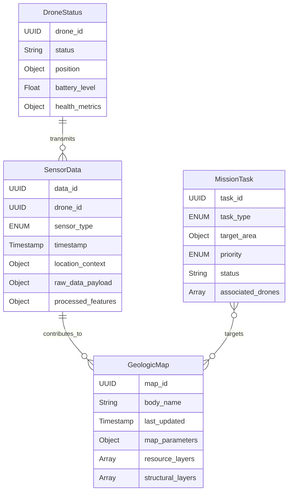
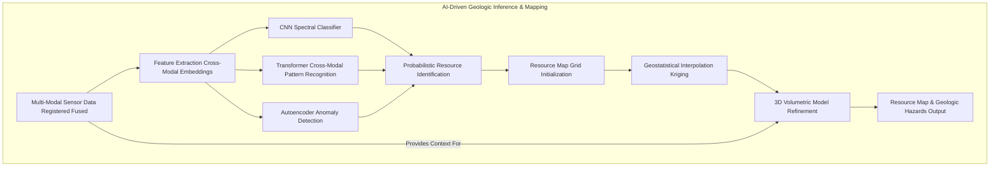
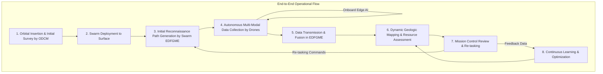

# System and Method for Autonomous Exoplanetary Resource Prospecting and Geologic Mapping via Multi-Modal Drone Swarms and AI

## Table of Contents
1.  **Title of Invention**
2.  **Abstract**
3.  **Background of the Invention**
4.  **Brief Summary of the Invention**
5.  **Detailed Description of the Invention**
    *   5.1 System Architecture
        *   5.1.1 Orbital Deployment and Command Module (ODCM)
        *   5.1.2 Autonomous Multi-Modal Prospecting (AMP) Drone Swarm
        *   5.1.3 Exoplanetary Data Fusion and Geologic Mapping Engine (EDFGME)
        *   5.1.4 Mission Control Interface and Visualization (MCIV)
    *   5.2 Data Structures and Schemas
        *   5.2.1 Drone Telemetry and Status Schema
        *   5.2.2 Multi-Modal Sensor Data Schema
        *   5.2.3 Geologic Resource Map Schema
        *   5.2.4 Mission Tasking and Prioritization Schema
    *   5.3 Algorithmic Foundations
        *   5.3.1 Autonomous Swarm Navigation and Adaptive Path Planning
        *   5.3.2 Multi-Modal Sensor Data Registration and Fusion
        *   5.3.3 AI-Driven Resource Signature Recognition and Anomaly Detection
        *   5.3.4 3D Geologic Modeling and Resource Estimation
        *   5.3.5 Optimal Prospecting Path Generation and Dynamic Re-tasking
    *   5.4 Operational Flow and Use Cases
6.  **Claims**
7.  **Mathematical Justification: A Formal Axiomatic Framework for Exoplanetary Resource Intelligence**
    *   7.1 The Exoplanetary Environment Manifold: `Xi = (P, F, Gamma)`
        *   7.1.1 Formal Definition of the Exoplanetary Manifold `Xi`
        *   7.1.2 Physical State Vector `X_p(t)` and Dynamics
        *   7.1.3 Field State Vector `X_f(t)` and Dynamics
        *   7.1.4 Compositional State Tensor `C(l, t)`
    *   7.2 The Multi-Modal Sensor Data Tensor: `S_obs(t)`
        *   7.2.1 Definition of the Aggregated Sensor Tensor `S_obs(t)`
        *   7.2.2 Spectral Feature Extraction `f_spec`
        *   7.2.3 Lidar Point Cloud Processing `f_lidar`
        *   7.2.4 Ground Penetrating Radar (GPR) Inversion `f_gpr`
        *   7.2.5 Uncertainty Quantification `sigma_sensor`
    *   7.3 The Autonomous Prospecting Drone Swarm Dynamics: `D_swarm(t)`
        *   7.3.1 Drone State Vector `X_d(t)` and Control Input `U_d(t)`
        *   7.3.2 Swarm Coordination and Formation Control `C_swarm`
        *   7.3.3 Optimal Path Planning `pi_path`
    *   7.4 The AI-Driven Geologic Inference Engine: `G_Geo`
        *   7.4.1 Formal Definition of the Inference Mapping Function `G_Geo`
        *   7.4.2 Resource Probability Map `P(R | S_obs, Xi)`
        *   7.4.3 Convolutional Neural Networks for Spectral Classification `CNN_spec`
        *   7.4.4 Generative Adversarial Networks for Subsurface Inference `GAN_sub`
        *   7.4.5 Geostatistical Interpolation `Kriging`
    *   7.5 Resource Prioritization and Mission Optimization `O_mission`
        *   7.5.1 Utility Function for Resource `U(R)`
        *   7.5.2 Multi-Objective Path Planning `TSP_MO`
        *   7.5.3 Decision Theoretic Resource Prioritization `DT_prior`
    *   7.6 Information Theoretic Justification for Exploration
        *   7.6.1 Entropy of Resource Distribution `H(R)`
        *   7.6.2 Information Gain `IG`
    *   7.7 Reinforcement Learning for Adaptive Exploration
        *   7.7.1 Markov Decision Process for Exploration
        *   7.7.2 Q-Learning for Optimal Exploration Policy
8.  **Proof of Utility**

## 1. Title of Invention:
System and Method for Autonomous Exoplanetary Resource Prospecting and Geologic Mapping via Distributed Multi-Modal Drone Swarms and Advanced Artificial Intelligence

## 2. Abstract:
A novel, fully autonomous system for the high-resolution prospecting and detailed three-dimensional geologic mapping of resources on extraterrestrial bodies is herein disclosed. This invention architecturally delineates a robust framework comprising an Orbital Deployment and Command Module (ODCM), a swarm of Autonomous Multi-Modal Prospecting (AMP) Drones, and an advanced Exoplanetary Data Fusion and Geologic Mapping Engine (EDFGME). The AMP drones, engineered for resilience in diverse exoplanetary environments, are equipped with a suite of advanced multi-modal sensors including hyperspectral imagers, ground-penetrating radar (GPR), lidar, magnetometers, and gravimeters. These drones execute adaptive, AI-driven exploration patterns, leveraging onboard edge computing for real-time data filtering, hazard avoidance, and preliminary resource signature recognition. Data collected by the swarm is continuously transmitted to the EDFGME, which employs sophisticated generative AI models and spatio-temporal fusion algorithms to construct a high-fidelity, volumetric map of subsurface geology and resource distribution. This engine performs causal inference to identify potential resource deposits (e.g., water ice, rare earth elements, critical minerals), quantifies their concentration, depth, and accessibility, and generates actionable insights for future human or robotic missions. The system fundamentally transforms early-stage exoplanetary exploration by dramatically reducing risk to human life, accelerating discovery timelines, providing unprecedented data resolution, and strategically informing sustainable off-world industrialization with the precision of a Swiss watchmaker operating a multi-billion dollar space program.

## 3. Background of the Invention:
The aspiration for humanity's multi-planetary future, along with the burgeoning space economy, hinges critically on the ability to identify, characterize, and ultimately utilize extraterrestrial resources. Current methods for exoplanetary resource prospecting predominantly rely on orbital reconnaissance satellites, which provide broad-stroke, low-resolution data, or on highly constrained and slow-moving ground rovers (e.g., Mars rovers). These conventional approaches are fraught with severe limitations: orbital data lacks the granular detail necessary for actionable extraction planning, while robotic rovers, though providing localized high-resolution data, operate with prohibitive slowness, are susceptible to single-point failures, and are inherently limited in their areal coverage dueability to their terrestrial-centric mobility designs. Human-led expeditions, while offering unparalleled scientific flexibility, are prohibitively expensive, carry immense risk to human life, and are logistically complex, making extensive prospecting economically unfeasible for early-stage exploration. The lack of comprehensive, high-resolution, and spatially integrated resource maps for candidate celestial bodies represents a critical bottleneck for the development of permanent outposts, in-situ resource utilization (ISRU) infrastructure, and the expansion of extra-terrestrial industry. This profound lacuna necessitates a paradigm shift towards autonomous, distributed, and intelligent prospecting systems capable of covering vast, hazardous, and unexplored territories with speed, precision, and unparalleled data richness. The present invention directly addresses these challenges, paving the way for the efficient and safe identification of the raw materials crucial for humanity's deep space endeavors.

## 4. Brief Summary of the Invention:
The present invention introduces the "Astro-Prospector Swarm System" (APSS), a revolutionary, fully autonomous exploration and mapping platform designed for the uncompromising rigors of exoplanetary resource identification. This system represents a profound leap beyond traditional singular rovers or orbital survey arrays, delivering a robust, scalable, and intelligent solution for the detailed characterization of extraterrestrial bodies. At its core, the APSS leverages an Orbital Deployment and Command Module (ODCM) that deploys a synchronized swarm of specialized Autonomous Multi-Modal Prospecting (AMP) Drones onto a target celestial surface. These drones are not merely flying instruments; they are intelligent, adaptable robotic agents. Each AMP drone integrates a comprehensive suite of multi-modal sensors—ranging from hyperspectral imagers for surface composition to ground-penetrating radar (GPR) for subsurface stratigraphy and lidar for precise topographical mapping—alongside powerful edge AI processors. These onboard AI systems enable real-time autonomous navigation across treacherous terrain, adaptive sensor calibration, and the immediate identification of potential resource "hotspots," transmitting prioritized data packets back to the ODCM. A central, high-performance Exoplanetary Data Fusion and Geologic Mapping Engine (EDFGME), either orbitally or terrestrially located, ingests this torrent of multi-modal data. The EDFGME employs state-of-the-art generative AI to synthesize a comprehensive, dynamic 3D volumetric model of the planet's geology, accurately identifying and quantifying resource deposits (e.g., water ice, methane clathrates, metals, rare earth minerals) with unprecedented resolution and confidence. This system autonomously identifies optimal resource extraction sites, predicts geological hazards, and even suggests strategic locations for future human habitats or ISRU facilities, transforming raw planetary data into investment-grade resource intelligence. We're not just looking for rocks; we're building the future's economic backbone, one mineral deposit at a time—because even on Mars, efficiency still matters.

## 5. Detailed Description of the Invention:

The disclosed system represents a comprehensive, intelligent infrastructure designed to autonomously prospect and map exoplanetary resources. Its architectural design prioritizes modularity, redundancy, autonomy, and the seamless integration of advanced artificial intelligence paradigms for unparalleled exploratory capability.

### 5.1 System Architecture

The Astro-Prospector Swarm System (APSS) is comprised of several interconnected, high-performance modules, each performing a specialized function, orchestrated to deliver a holistic exoplanetary resource intelligence capability.

```mermaid
graph LR
    subgraph Orbital Segment
        A[Launch Vehicle] --> B[Orbital Deployment & Command Module (ODCM)]
    end

    subgraph Surface Segment
        B -- Deploys --> C[Autonomous Multi-Modal Prospecting (AMP) Drone Swarm]
        C -- Collects Data --> D[Onboard Edge AI Processing]
        D -- Transmits Data --> B
    end

    subgraph Ground/Orbital Segment
        B -- Relays Data --> E[Exoplanetary Data Fusion & Geologic Mapping Engine (EDFGME)]
        E -- Generates Insights --> F[Mission Control Interface & Visualization (MCIV)]
        F -- Sends Commands --> B
    end

    style A fill:#f9f,stroke:#333,stroke-width:2px
    style B fill:#bbf,stroke:#333,stroke-width:2px
    style C fill:#ccf,stroke:#333,stroke-width:2px
    style D fill:#ada,stroke:#333,stroke-width:2px
    style E fill:#fb9,stroke:#333,stroke-width:2px
    style F fill:#fbb,stroke:#333,stroke-width:2px
```

#### 5.1.1 Orbital Deployment and Command Module (ODCM)
This foundational component serves as the strategic hub for the entire prospecting mission, typically operating in orbit around the target celestial body.
*   **Carrier and Deployment Platform:** The ODCM functions as the primary transport vehicle and autonomous deployment platform for the AMP drone swarm. It features a robust docking/launch system designed for minimal-impact drone release and retrieval (if applicable for recharge/maintenance) in varying gravity environments.
*   **High-Bandwidth Communication Relay:** Equipped with powerful directional antennas and laser communication systems, the ODCM acts as the central data relay hub, maintaining continuous, high-bandwidth communication with both the AMP drone swarm on the surface and Earth-based mission control. This ensures critical data is transmitted efficiently and command signals are received reliably.
*   **Orbital Sensor Suite:** The ODCM may also carry a complementary suite of orbital sensors (e.g., broad-area spectrometers, high-resolution cameras) to provide macroscopic context for the drone-level reconnaissance and validate larger-scale geological features.
*   **Autonomous Mission Planning and Contingency Management:** Onboard AI in the ODCM manages the high-level mission plan, including swarm deployment sequencing, orbital maneuvers, and critical contingency responses, such as identifying a safe fallback zone for drones or initiating an emergency ascent. It essentially acts as the "air traffic controller" for the drones.

```mermaid
graph TD
    subgraph Orbital Deployment and Command Module (ODCM)
        LV[Launch Vehicle] --> ODCM_CORE[ODCM Core System]
        ODCM_CORE -- Houses --> DPS[Drone Deployment System]
        ODCM_CORE -- Relays Comms --> HCS[High-Bandwidth Communication Subsystem]
        ODCM_CORE -- Provides Context --> OSS[Orbital Sensor Suite e.g., HiRISE CRISM]
        ODCM_CORE -- Orchestrates --> AMPM[Autonomous Mission Planning Module]
        HCS -- Links To --> MC[Mission Control]
        HCS -- Links To --> DS[Drone Swarm]
        AMPM -- Directs --> DPS
        AMPM -- Monitors --> DS
        OSS -- Feeds Data To --> EDFGME[Exoplanetary Data Fusion Engine]
    end
```

#### 5.1.2 Autonomous Multi-Modal Prospecting (AMP) Drone Swarm
These are the primary data acquisition units, designed for rugged autonomy and sophisticated sensing on extraterrestrial surfaces.
*   **Exoplanetary Mobility Platform:** Each AMP drone is engineered with a propulsion and mobility system optimized for the specific target environment (e.g., low-gravity rotorcraft for the Moon/Mars, balloon-lander hybrids for Venus, micro-hoppers for asteroids). Features include robust shielding against radiation and micro-meteoroids, thermal management for extreme temperature differentials, and redundant systems for survivability.
*   **Multi-Modal Sensor Payload:** A core innovation is the integrated, diverse sensor suite on each drone, providing complementary data streams:
    *   **Hyperspectral Imager (HSI):** For detailed surface mineralogy and volatile detection (e.g., water ice, hydrated minerals) across wide spectral ranges.
    *   **Raman/LIBS Spectrometer:** For precise point-source elemental and molecular composition analysis.
    *   **Ground-Penetrating Radar (GPR):** For subsurface structural mapping and identification of buried volatiles or layered geology.
    *   **Lidar/Stereo Cameras:** For high-resolution 3D terrain mapping, navigation, and hazard avoidance.
    *   **Magnetometer/Gravimeter:** To detect local magnetic anomalies indicative of metallic ores or variations in subsurface density.
    *   **Atmospheric/Surface Environment Sensors:** Temperature, pressure, radiation, dust monitoring.
*   **Onboard Edge AI Processing Unit:** Each drone carries a compact yet powerful AI processor capable of:
    *   **Autonomous Navigation and Hazard Avoidance:** Real-time Simultaneous Localization and Mapping (SLAM), object detection, and path planning to navigate complex terrains safely.
    *   **Preliminary Data Filtering and Compression:** Reducing raw data volume by filtering out redundant or uninteresting data, applying compression algorithms before transmission.
    *   **Edge Resource Signature Recognition:** Performing initial, low-latency analysis of sensor data to identify known resource signatures or anomalies, allowing for immediate re-tasking of the drone or swarm to investigate further.
    *   **Swarm Coordination Logic:** Algorithms for maintaining formation, collaborative surveying, and load balancing within the swarm.

```mermaid
graph TD
    subgraph Autonomous Multi-Modal Prospecting (AMP) Drone
        A[Exoplanetary Mobility Platform Chassis Power Thermal] --> B[Multi-Modal Sensor Payload]
        B --> C[Onboard Edge AI Processing Unit]
        C -- Processes Raw Data --> B
        C -- Directs --> A
        C -- Transmits --> D[Local Communication Module]
        D -- Feeds Back To --> B[Multi-Modal Sensor Payload]
        D -- Uploads To --> ODCM[ODCM Orbital Deployment Module]
        B -- Includes --> HSI[Hyperspectral Imager]
        B -- Includes --> RLS[Raman LIBS Spectrometer]
        B -- Includes --> GPR[Ground-Penetrating Radar]
        B -- Includes --> LIDARCAM[Lidar Stereo Cameras]
        B -- Includes --> MAGGRAV[Magnetometer Gravimeter]
        C -- Runs --> NAVAI[Autonomous Navigation Hazard Avoidance AI]
        C -- Runs --> SDFPC[Sensor Data Filtering Compression]
        C -- Runs --> ESR[Edge Signature Recognition AI]
        C -- Runs --> SCL[Swarm Coordination Logic]
    end
```

#### 5.1.3 Exoplanetary Data Fusion and Geologic Mapping Engine (EDFGME)
This is the ultimate brain of the operation, synthesizing all incoming data into actionable intelligence. It can be located on Earth or a powerful computing module within the ODCM or a dedicated lander.
*   **Multi-Modal Data Ingestion and Registration:** Receives processed data streams from all drones and the ODCM's orbital sensors. Critically, it registers these disparate datasets into a single, cohesive spatio-temporal framework, correcting for positional errors, sensor biases, and environmental distortions.
*   **AI-Driven Geologic Inference and Resource Mapping:** Leverages advanced generative AI and deep learning models to:
    *   **Identify Resource Deposits:** Detects and classifies specific resource types (e.g., water ice, methane, iron ore, regolith variants) by analyzing combined spectral, sub-surface, and elemental data patterns.
    *   **3D Volumetric Geologic Modeling:** Constructs a high-resolution, layered 3D model of the exoplanetary body's crust, including stratigraphy, fault lines, and other geological features inferred from GPR and Lidar data.
    *   **Quantify Resource Concentration and Depth:** Estimates the volume, concentration, and depth of identified resources, assigning confidence scores based on data quality and model certainty.
    *   **Predictive Geologic Hazard Identification:** Infers potential hazards such as unstable slopes, lava tubes, or buried hazards relevant for future human missions or ISRU operations.
*   **Resource Prioritization and Mission Planning Recommendations:** Based on the generated maps and defined mission objectives (e.g., "find most accessible water ice," "locate highest concentration of rare earths"), the EDFGME provides ranked recommendations for:
    *   Optimal extraction sites.
    *   Future exploration routes for drones or human expeditions.
    *   Strategic locations for ISRU facilities or habitats.
*   **Continuous Learning and Model Refinement:** The engine continuously refines its AI models based on new data, ground truth validation (if available), and feedback from mission control.

```mermaid
graph TD
    subgraph Exoplanetary Data Fusion & Geologic Mapping Engine (EDFGME)
        ODCM_FEED[ODCM Data Feed Orbiter Drone Swarm] --> DFR[Data Fusion & Registration Module]
        DFR -- Creates Unified Context --> AI_INF[AI-Driven Geologic Inference Mapping]
        AI_INF -- Identifies Quantifies --> RDM[Resource Deposit Mapping]
        AI_INF -- Builds --> VGM[3D Volumetric Geologic Modeling]
        AI_INF -- Predicts --> PGH[Predictive Geologic Hazard Identification]
        RDM & VGM & PGH --> RPM[Resource Prioritization & Mission Planning]
        RPM --> MCIV[Mission Control Interface Visualization]
        DFR -- Supplies Data For --> CLMR[Continuous Learning & Model Refinement]
        CLMR -- Improves --> AI_INF
        RPM -- Outputs --> Actionable_Intel[Actionable Intelligence for Missions]
    end
```

#### 5.1.4 Mission Control Interface and Visualization (MCIV)
This component provides the human-in-the-loop oversight and strategic direction capabilities.
*   **Interactive 3D Geospatial Visualization:** A highly intuitive, real-time 3D interface displays the exoplanetary surface, drone positions, active sensor coverage, and, crucially, the dynamically generated geologic and resource maps. Users can virtually "fly through" the terrain and "cut away" layers to inspect subsurface structures.
*   **Mission Planning and Re-tasking Tools:** Allows mission specialists to define or modify drone swarm mission parameters, designate new areas of interest, prioritize resource types, and issue high-level commands. The system intelligently translates these into swarm-level instructions.
*   **Anomaly Alerting and Human-in-the-Loop Override:** Alerts human operators to unexpected findings, critical system failures, or significant resource discoveries, providing options for manual intervention or strategic re-prioritization.
*   **Data Archival and Analysis:** Provides tools for querying, analyzing, and archiving the vast datasets and derived products for scientific publication and long-term strategic planning.

```mermaid
graph TD
    subgraph Mission Control Interface & Visualization (MCIV)
        EDFGME_OUT[EDFGME Output Resource Maps Geologic Models] --> I3DGV[Interactive 3D Geospatial Visualization]
        I3DGV -- Displays --> DP[Drone Positions Sensor Coverage]
        I3DGV -- Displays --> RM[Resource Maps Geologic Models]
        MPRT[Mission Planning & Re-tasking Tools] --> I3DGV
        AHLIO[Anomaly Alerting Human-in-the-Loop Override] --> I3DGV
        I3DGV --> DAA[Data Archival & Analysis]
        MPRT -- Sends Commands To --> ODCM[ODCM Orbital Deployment Module]
        AHLIO -- Feeds Back To --> EDFGME[EDFGME]
    end
```

### 5.2 Data Structures and Schemas

To maintain consistency, interoperability, and the integrity of complex data flows, the system adheres to rigorously defined data structures.



#### 5.2.1 Drone Telemetry and Status Schema
Captures the operational state and location of individual drones.

```json
{
  "drone_id": "UUID",
  "timestamp": "Timestamp",
  "status": "ENUM['Active', 'Idle', 'Charging', 'Fault', 'Deployed', 'Returning']",
  "current_position": {
    "latitude": "Float",
    "longitude": "Float",
    "altitude_m": "Float",
    "body_frame_coords_x": "Float",
    "body_frame_coords_y": "Float",
    "body_frame_coords_z": "Float",
    "accuracy_m": "Float"
  },
  "velocity_vector_mps": {
    "vx": "Float", "vy": "Float", "vz": "Float"
  },
  "attitude_quaternion": {
    "qx": "Float", "qy": "Float", "qz": "Float", "qw": "Float"
  },
  "battery_level_percent": "Float",
  "power_consumption_watts": "Float",
  "health_metrics": {
    "cpu_temp_c": "Float",
    "memory_usage_percent": "Float",
    "sensor_status": {"HSI": "Boolean", "GPR": "Boolean", "Lidar": "Boolean"},
    "propulsion_efficiency_percent": "Float"
  },
  "last_command_id": "UUID",
  "data_uploaded_bytes_session": "Integer",
  "remaining_storage_bytes": "Integer"
}
```

#### 5.2.2 Multi-Modal Sensor Data Schema
Standardizes the diverse data streams from various sensors.

```json
{
  "data_id": "UUID",
  "drone_id": "UUID",
  "sensor_type": "ENUM['Hyperspectral', 'Raman', 'LIBS', 'GPR', 'Lidar', 'StereoCam', 'Magnetometer', 'Gravimeter', 'Atmospheric']",
  "timestamp": "Timestamp",
  "measurement_location": {
    "latitude": "Float",
    "longitude": "Float",
    "altitude_m": "Float",
    "body_frame_coords_x": "Float",
    "body_frame_coords_y": "Float",
    "body_frame_coords_z": "Float",
    "orientation_quaternion": {"qx": "Float", "qy": "Float", "qz": "Float", "qw": "Float"}
  },
  "raw_data_payload_uri": "URI", // Link to stored raw data (e.g., S3 bucket)
  "processed_features": {
    "spectral_signatures": [
      {"wavelength_nm": "Float", "reflectance": "Float"}
    ],
    "gpr_profile_metadata": {
      "depth_m_max": "Float", "resolution_m": "Float", "layers_detected": "Integer"
    },
    "lidar_point_cloud_stats": {
      "num_points": "Integer", "min_height_m": "Float", "max_height_m": "Float"
    },
    "magnetic_anomaly_nT": "Float",
    "gravimetric_anomaly_mGal": "Float",
    "identified_materials_edge": [ // Preliminary identification from edge AI
      {"material_name": "String", "confidence": "Float", "bbox_3d": [/* 3D bounding box coordinates */]}
    ]
  },
  "data_quality_score": "Float", // e.g., SNR, clarity
  "processing_status": "ENUM['Raw', 'Filtered', 'Processed', 'Analyzed']"
}
```

#### 5.2.3 Geologic Resource Map Schema
Represents the core output of the EDFGME: a volumetric map of resources and geology.

```json
{
  "map_id": "UUID",
  "body_name": "String", // e.g., "Mars", "Moon_SouthPole"
  "last_updated": "Timestamp",
  "map_extent": { // Bounding box for the map
    "min_latitude": "Float", "max_latitude": "Float",
    "min_longitude": "Float", "max_longitude": "Float",
    "min_depth_m": "Float", "max_depth_m": "Float"
  },
  "spatial_resolution_m": "Float", // e.g., 0.1m per voxel
  "resource_layers": [
    {
      "resource_type": "ENUM['WaterIce', 'Methane', 'IronOre', 'Silicates', 'Regolith', 'RareEarthElements', 'Other']",
      "concentration_grid_uri": "URI", // Link to volumetric data (e.g., NetCDF, HDF5)
      "confidence_grid_uri": "URI",   // Link to confidence scores
      "min_concentration_threshold": "Float",
      "max_concentration_measured": "Float",
      "accessibility_score_grid_uri": "URI" // Ease of extraction
    }
  ],
  "structural_layers": [
    {
      "structure_type": "ENUM['Stratigraphy', 'FaultLine', 'LavaTube', 'SubsurfaceCave', 'RockLayer']",
      "model_data_uri": "URI", // Link to 3D mesh or voxel model data
      "geologic_age_estimate_myr": "Float",
      "hazard_potential_score": "Float"
    }
  ],
  "associated_data_sources": ["UUID"] // List of `data_id`s that contributed
}
```

#### 5.2.4 Mission Tasking and Prioritization Schema
Defines instructions for the drone swarm and strategic objectives for the EDFGME.

```json
{
  "task_id": "UUID",
  "timestamp_created": "Timestamp",
  "task_type": "ENUM['SurveyArea', 'InvestigateAnomaly', 'ResourceTarget', 'HazardMapping', 'LongTermMonitor']",
  "priority": "ENUM['Low', 'Medium', 'High', 'Critical']",
  "target_area_definition": {
    "geographic_bounding_box": {
      "min_lat": "Float", "max_lat": "Float", "min_lon": "Float", "max_lon": "Float"
    },
    "target_coordinates": [{"latitude": "Float", "longitude": "Float", "altitude_m": "Float"}],
    "target_resource_type": "ENUM['WaterIce', 'IronOre', 'Any']",
    "minimum_concentration_required": "Float"
  },
  "required_sensor_modes": ["ENUM['HSI', 'GPR', 'Lidar']"],
  "duration_estimate_hours": "Float",
  "status": "ENUM['Pending', 'InProgress', 'Completed', 'Cancelled', 'Failed']",
  "assigned_drones": ["UUID"], // List of drone_id's
  "completion_metrics": {
    "data_volume_gb_collected": "Float",
    "new_resources_identified_count": "Integer",
    "mapping_coverage_percent": "Float"
  },
  "feedback_loop_trigger": "Boolean" // Should this task's outcome be used for RLHF?
}
```

### 5.3 Algorithmic Foundations

The system's intelligence is rooted in a sophisticated interplay of advanced algorithms and computational paradigms, operating synergistically across the distributed architecture.

#### 5.3.1 Autonomous Swarm Navigation and Adaptive Path Planning
This enables the drones to explore complex, unknown exoplanetary terrains safely and efficiently.
*   **Simultaneous Localization and Mapping (SLAM):** Utilizing Lidar point clouds, stereo imagery, and inertial measurement units (IMUs), each drone independently builds and updates a local 3D map of its surroundings while simultaneously estimating its precise position within that map. Distributed SLAM allows the swarm to share and fuse local maps into a global, consistent map.
*   **Path Planning Algorithms (A*, RRT*):** Algorithms like A* (for grid-based maps) or RRT* (Rapidly-exploring Random Tree for continuous spaces) are adapted for 3D navigation in varying gravity and atmospheric conditions, considering energy constraints, sensor line-of-sight, and hazard avoidance (e.g., craters, steep slopes, rock fields detected by Lidar/stereo).
*   **Multi-Agent Coordination and Formation Control:** Decentralized and centralized algorithms ensure drones maintain optimal spacing for sensor coverage, avoid collisions, and collaboratively execute complex survey patterns (e.g., parallel sweeps, convergence on anomalies) while adapting to individual drone failures or environmental changes.
*   **Reinforcement Learning (RL) for Adaptive Mobility:** Drones learn optimal locomotion and navigation strategies through trial and error in simulated and real environments, adapting to unexpected terrain features or atmospheric conditions that were not pre-programmed.

#### 5.3.2 Multi-Modal Sensor Data Registration and Fusion
This critical step integrates disparate sensor readings into a coherent, comprehensive dataset.
*   **Spatiotemporal Registration:** All sensor data is precisely time-stamped and spatially tagged relative to a common planetary coordinate system. Advanced algorithms (e.g., Iterative Closest Point (ICP) for Lidar, Bundle Adjustment for imagery) are used to align data from different sensors, compensating for drone motion, sensor biases, and environmental effects.
*   **Feature-Level Fusion:** Instead of raw data fusion, the system often fuses extracted features. For example, spectral signatures indicating mineral composition (from HSI) are directly combined with structural information (from GPR) and topographic context (from Lidar) to build a richer understanding of a region.
*   **Uncertainty Quantification:** Each data point and derived feature is associated with a probabilistic uncertainty, which is propagated through the fusion process. This allows the EDFGME to weigh information reliability and quantify confidence in its final resource maps.

#### 5.3.3 AI-Driven Resource Signature Recognition and Anomaly Detection
This is the core intelligence for identifying what's valuable on an alien world.
*   **Convolutional Neural Networks (CNNs) for Spectral Classification:** Deep learning models, trained on synthetic and terrestrial analog spectral libraries, are used to classify surface and near-surface materials from hyperspectral data, identifying known mineralogical signatures (e.g., various silicates, oxides, sulfates, ices).
*   **Autoencoders and Anomaly Detection:** Unsupervised learning techniques (e.g., variational autoencoders, isolation forests) are employed to identify novel spectral signatures or geological formations that deviate significantly from expected patterns, potentially indicating undiscovered resource types or unique geological processes. These anomalies are flagged for prioritized investigation.
*   **Transformer Networks for Cross-Modal Pattern Recognition:** Multi-modal transformer architectures process combined data streams (e.g., correlating specific GPR reflections with surface spectral features) to infer deeper geological relationships and identify complex resource patterns that individual sensors might miss. This can identify, for example, a specific mineral vein associated with a particular subsurface structure.
*   **Probabilistic Inference for Resource Certainty:** Bayesian networks and Gaussian processes are used to estimate the probability of a resource's presence and its concentration, given all available sensor evidence, incorporating prior geological knowledge and uncertainty.



#### 5.3.4 3D Geologic Modeling and Resource Estimation
Building a comprehensive understanding of the subsurface.
*   **Voxel-based Volumetric Modeling:** The exoplanetary body's crust is represented as a 3D grid of voxels, each containing attributes such as material type, density, porosity, resource concentration, and confidence scores. This allows for detailed subsurface visualization and analysis.
*   **Geostatistical Interpolation (Kriging, Inverse Distance Weighting):** These techniques are used to estimate resource concentrations and geological properties in unsampled areas, leveraging the spatial correlation of observed data points and propagating uncertainty.
*   **Generative Adversarial Networks (GANs) for Subsurface Inference:** Given sparse GPR data and surface observations, GANs can be trained to generate plausible subsurface geological structures and resource distributions that are consistent with the observed data, effectively "filling in the blanks" with statistically probable scenarios.
*   **Petrophysical Property Inversion:** Algorithms that convert raw geophysical measurements (e.g., GPR reflection amplitudes, magnetic field strength) into physical properties of the subsurface (e.g., dielectric constant, magnetic susceptibility, material density), aiding in resource characterization.

#### 5.3.5 Optimal Prospecting Path Generation and Dynamic Re-tasking
Maximizing exploration efficiency and scientific yield.
*   **Coverage Path Planning:** Algorithms (e.g., boustrophedon decomposition, cellular decomposition) are adapted for exoplanetary terrain to ensure maximum area coverage with sensor sweeps, accounting for irregular topography and no-fly zones.
*   **Information-Theoretic Path Planning:** Drones don't just cover ground; they intelligently choose paths that maximize information gain. This involves calculating the expected reduction in uncertainty (entropy) about resource distribution for various potential paths, and prioritizing those that yield the most valuable new data.
*   **Multi-Objective Optimization (e.g., NSGA-II):** Optimizing drone paths and swarm behavior against multiple, potentially conflicting objectives: maximizing resource discovery, minimizing energy consumption, minimizing mission time, and minimizing risk.
*   **Dynamic Re-tasking based on Anomaly Detection:** When an onboard AI identifies a significant resource signature or anomaly, the swarm's mission plan is immediately updated. Nearby drones may converge on the anomaly for higher-resolution data collection, or a specialized drone with a specific sensor might be dispatched. This "follow-the-scent" capability is a core advantage.

### 5.4 Operational Flow and Use Cases

A typical operational cycle of the Astro-Prospector Swarm System proceeds as follows:

1.  **Orbital Insertion & Initial Survey:** The ODCM is inserted into orbit around the target celestial body, performing a broad-area survey with its orbital sensors and establishing a preliminary global context map.
2.  **Swarm Deployment:** The ODCM autonomously deploys the AMP drone swarm to a designated area of interest on the surface, ensuring a safe landing/deployment sequence.
3.  **Initial Reconnaissance & Path Generation:** Drones perform initial local reconnaissance, mapping local terrain and identifying immediate hazards. The EDFGME, informed by ODCM data and mission objectives, generates an optimal initial survey path for the swarm, distributing tasks efficiently.
4.  **Autonomous Multi-Modal Data Collection:** Drones execute their assigned paths, continuously collecting multi-modal sensor data. Onboard edge AI performs real-time filtering, compression, and preliminary signature recognition, adapting drone paths if anomalies are detected.
5.  **Data Transmission & Fusion:** Processed data is continuously streamed from the drone swarm, via the ODCM, to the EDFGME. The EDFGME integrates this data, registering it to a global map and performing AI-driven geologic inference.
6.  **Dynamic Geologic Mapping & Resource Assessment:** The EDFGME progressively builds and refines the 3D volumetric map of geology and resource distribution, identifying potential deposits, quantifying their properties, and assessing hazards.
7.  **Mission Control Review & Re-tasking:** Mission control monitors the interactive 3D visualization, reviews resource assessments, and can dynamically re-task the swarm, instructing it to investigate new areas, focus on specific resource types, or perform detailed follow-up scans on confirmed deposits.
8.  **Continuous Learning & Optimization:** Feedback from mission outcomes (e.g., successful resource validation, drone performance in challenging terrain) is fed back into the EDFGME's AI models and swarm coordination algorithms, ensuring continuous improvement and adaptation over extended missions.



**Use Cases:**

*   **Lunar Water Ice Prospecting:** A swarm of AMP drones comprehensively maps the permanently shadowed regions (PSRs) of the lunar poles, using GPR to detect subsurface ice, HSI to confirm surface frost, and Lidar to map safe access routes, providing precise coordinates and estimated volumes for future ISRU operations.
*   **Martian Mineral Exploration:** Drones scour ancient Martian riverbeds and volcanic regions, identifying concentrations of specific minerals (e.g., iron oxides, sulfates) and mapping their geological context, which could inform the search for past or present biosignatures and future construction materials.
*   **Asteroid & Small Body Characterization:** Micro-hoppers equipped with LIBS and magnetometers autonomously survey the surface of a near-Earth asteroid, identifying concentrations of precious metals (e.g., platinum group metals) or volatiles, providing a detailed economic feasibility map for asteroid mining ventures.
*   **Subsurface Habitat Scouting:** GPR-equipped drones explore lava tubes or subsurface caves on Mars, mapping their extent, structural integrity, and environmental stability, identifying optimal locations for shielded human habitats protected from radiation and micrometeoroids.
*   **Early Planetary Assessment for Terraforming Candidates:** Large-scale atmospheric and surface analysis by drones to identify key elements, volatile cycles, and geological processes on candidate planets (e.g., Venus, Titan) that could be leveraged or modified for long-term terraforming initiatives.

## 6. Claims:

The inventive concepts herein described constitute a profound advancement in the domain of exoplanetary exploration and resource intelligence.

1.  A system for autonomous exoplanetary resource prospecting and geologic mapping, comprising: an orbital deployment and command module (ODCM) configured for deploying and communicating with a swarm of autonomous multi-modal prospecting (AMP) drones; said AMP drone swarm, comprising multiple drones, each drone being equipped with a multi-modal sensor payload and an onboard edge artificial intelligence (AI) processing unit for autonomous navigation, real-time data filtering, and preliminary resource signature recognition; and an exoplanetary data fusion and geologic mapping engine (EDFGME) configured to receive processed data from the swarm, perform AI-driven geologic inference to construct a 3D volumetric map of resource distribution and subsurface geology, and generate prioritized recommendations for resource extraction or mission planning.

2.  The system of claim 1, wherein each AMP drone's multi-modal sensor payload includes at least two of the following: a hyperspectral imager, a Raman spectrometer, a LIBS spectrometer, a ground-penetrating radar, a lidar system, a stereo camera system, a magnetometer, or a gravimeter.

3.  The system of claim 1, wherein the onboard edge AI processing unit on each AMP drone is configured to perform real-time Simultaneous Localization and Mapping (SLAM) for autonomous navigation and hazard avoidance in complex exoplanetary terrains, and to adaptively adjust flight paths based on immediate sensor inputs.

4.  The system of claim 1, wherein the EDFGME utilizes a multi-modal generative AI model trained on synthetic and terrestrial analog datasets to fuse disparate sensor data streams and infer subsurface geological structures and resource concentrations in areas with sparse direct measurements.

5.  The system of claim 4, wherein the generative AI model employs convolutional neural networks for spectral classification, autoencoders for anomaly detection, and transformer networks for cross-modal pattern recognition to identify and quantify resource deposits.

6.  The system of claim 1, further comprising a swarm coordination logic implemented across the AMP drone swarm, enabling autonomous collaborative surveying patterns, collision avoidance, and dynamic re-tasking of individual drones based on real-time detection of resource anomalies or geological features.

7.  The system of claim 1, wherein the EDFGME is configured to generate the 3D volumetric map with associated confidence scores for identified resource types, their estimated concentrations, and their depth profiles, suitable for informing in-situ resource utilization (ISRU) operations.

8.  The system of claim 1, further comprising a mission control interface and visualization (MCIV) module that provides an interactive 3D geospatial visualization of the exoplanetary body, drone positions, sensor coverage, and the dynamically updated geologic and resource maps, allowing for human-in-the-loop oversight and re-tasking.

9.  The system of claim 1, wherein the EDFGME is configured to perform multi-objective optimization to generate recommendations for optimal prospecting paths or resource extraction sites, balancing factors such as estimated resource value, accessibility, mission time, and energy consumption.

10. A computer-implemented method for autonomous exoplanetary resource prospecting, comprising: deploying a swarm of multi-modal prospecting drones from an orbital command module onto an extraterrestrial surface; operating said drones autonomously to collect diverse sensor data including surface composition and subsurface profiles; processing said sensor data on each drone's edge AI unit for real-time navigation, data compression, and preliminary resource identification; transmitting processed data to an exoplanetary data fusion and geologic mapping engine (EDFGME); within the EDFGME, performing AI-driven fusion and inference to generate a dynamic, high-resolution 3D volumetric map of geological features and resource distribution; and providing actionable recommendations for resource exploitation or further exploration based on said map.

## 7. Mathematical Justification: A Formal Axiomatic Framework for Exoplanetary Resource Intelligence

The profound complexity and multi-scale nature of exoplanetary environments, coupled with the distributed intelligence of the Astro-Prospector Swarm System, demand a rigorous mathematical framework. This framework formally defines the interactions between the planetary environment, the sensing apparatus, and the AI-driven inference engine, substantiating the system's claims of comprehensive and intelligent resource mapping.

### 7.1 The Exoplanetary Environment Manifold: `Xi = (P, F, Gamma)`

The target celestial body is formalized as a dynamic, multi-field manifold `Xi` which encapsulates its physical, field, and compositional properties.

#### 7.1.1 Formal Definition of the Exoplanetary Manifold `Xi`

Let `Xi` denote the underlying, unobservable true state of the exoplanetary environment at a given spatial location `l = (lat, lon, depth) in R^3` and time `t`.
`Xi(l, t) = (X_p(l, t), X_f(l, t), C(l, t))`. (1)

#### 7.1.2 Physical State Vector `X_p(t)` and Dynamics

Each spatial location `l` is associated with a physical state vector `X_p(l, t) in R^k`, representing observable and derivable physical properties:
`X_p(l, t) = (topography(l), surface_roughness(l), density(l, t), porosity(l, t), temperature(l, t), ...)` (2)
The evolution of `X_p` can be modeled by a partial differential equation (PDE) representing geological processes, e.g., thermal diffusion:
`dT/dt = alpha * nabla^2 T + S(l,t)` (where `alpha` is thermal diffusivity, `S` is heat source). (3)

#### 7.1.3 Field State Vector `X_f(t)` and Dynamics

Each location `l` is also characterized by a field state vector `X_f(l, t) in R^m`, representing geophysical fields:
`X_f(l, t) = (magnetic_field(l, t), gravitational_field(l, t), atmospheric_pressure(l, t), ...)` (4)
These fields are derived from the underlying physical properties. For example, the gravitational potential `Phi_G` can be described by:
`nabla^2 Phi_G = 4 * pi * G * rho(l,t)` (Poisson's equation for gravity, `rho` is density). (5)

#### 7.1.4 Compositional State Tensor `C(l, t)`

The most critical component is the compositional state tensor `C(l, t) in R^(p x q)`, which represents the material composition, including resource types and concentrations:
`C(l, t)[i,j]` specifies concentration of `j`-th element/compound at `i`-th depth layer. (6)
Specific entries might be `C(l, t)[layer_k, water_ice_concentration]`. (7)

### 7.2 The Multi-Modal Sensor Data Tensor: `S_obs(t)`

The AMP drone swarm observes the environment through a suite of multi-modal sensors, aggregated into `S_obs(t)`.

#### 7.2.1 Definition of the Aggregated Sensor Tensor `S_obs(t)`

Let `S_obs(t)` be a high-dimensional, multi-modal tensor representing aggregated and registered sensor data from all drones at various locations `l_i` and times `t_j`.
`S_obs(t) = S_HSI(t) oplus S_Raman(t) oplus S_GPR(t) oplus S_Lidar(t) oplus ...` (8)
where `oplus` denotes a spatial and feature-wise fusion operator.

#### 7.2.2 Spectral Feature Extraction `f_spec`

For Hyperspectral and Raman data, `S_spec(l_i, t_j, lambda)` is the reflectance/intensity at wavelength `lambda`.
`F_spec(l_i, t_j) = f_spec(S_spec(l_i, t_j, .); Theta_spec)` extracts characteristic features (e.g., absorption band depths, peak ratios). (9)
This often involves dimensionality reduction, e.g., Principal Component Analysis (PCA) or Independent Component Analysis (ICA). (10)

#### 7.2.3 Lidar Point Cloud Processing `f_lidar`

Lidar data `S_Lidar(l_i, t_j)` generates a point cloud.
`F_Lidar(l_i, t_j) = f_lidar(S_Lidar(l_i, t_j); Theta_lidar)` extracts topographic features like elevation `z(x,y)`, slope `grad(z)`, roughness, and 3D surface models. (11)

#### 7.2.4 Ground Penetrating Radar (GPR) Inversion `f_gpr`

GPR data `S_GPR(l_i, t_j, tau)` represents reflected signal strength at two-way travel time `tau`.
`F_GPR(l_i, t_j) = f_gpr(S_GPR(l_i, t_j, .); Theta_gpr)` inverts this to estimate dielectric permittivity `epsilon(depth)` and conductivity `sigma(depth)`, revealing subsurface layers and material changes. (12)

#### 7.2.5 Uncertainty Quantification `sigma_sensor`

Each observation carries uncertainty `delta S_obs(l_i, t_j)`.
The total uncertainty of the fused data `Sigma_obs` is derived from individual sensor uncertainties and registration errors. (13)

### 7.3 The Autonomous Prospecting Drone Swarm Dynamics: `D_swarm(t)`

The swarm's behavior and data acquisition capabilities are critical.

#### 7.3.1 Drone State Vector `X_d(t)` and Control Input `U_d(t)`

Each drone `d in D_swarm` has a state `X_d(t) = (p_d(t), v_d(t), q_d(t), omega_d(t), E_d(t), s_d(t))`, where `p` is position, `v` is velocity, `q` is attitude quaternion, `omega` is angular velocity, `E` is energy, `s` is sensor status. (14)
The control input `U_d(t)` (e.g., thrust, torque) dictates drone motion:
`m_d * d^2p_d/dt^2 = F_d(U_d(t), X_d(t), X_p(p_d(t), t))` (Newton's 2nd Law including local gravity/atmosphere). (15)

#### 7.3.2 Swarm Coordination and Formation Control `C_swarm`

The desired swarm configuration `Psi_swarm(t)` (e.g., formation, coverage density) is achieved via:
`U_d(t) = C_swarm(X_d(t), {X_d'(t)}_{d'!=d}, Psi_swarm(t))` (Controller for swarm cohesion/dispersion). (16)

#### 7.3.3 Optimal Path Planning `pi_path`

Given a mission objective `M` and current map `Map(t)`, each drone's optimal path `pi_d*` is:
`pi_d* = argmax_{pi_d} [Gain(pi_d, M, Map(t)) - Cost(pi_d, X_d(t), X_p(p_d(t), t))]` (17)
`Gain` includes information gain, `Cost` includes energy consumption and risk of collision.

### 7.4 The AI-Driven Geologic Inference Engine: `G_Geo`

This core engine maps observed data to a probabilistic understanding of the exoplanetary composition.

#### 7.4.1 Formal Definition of the Inference Mapping Function `G_Geo`

`G_Geo : (S_obs(t) X P_prior) -> P(Xi(l,t) | S_obs(t), P_prior)` (18)
Where `P_prior` is prior geological knowledge/models.

#### 7.4.2 Resource Probability Map `P(R | S_obs, Xi)`

The output is a 3D grid (voxel map) where each voxel `v` at location `l_v` contains a probability distribution for resource types `R_j`:
`P(R_j(l_v) | S_obs)`. (19)

#### 7.4.3 Convolutional Neural Networks for Spectral Classification `CNN_spec`

For spectral data `F_spec`:
`P(C(l_v, t)[water_ice] | F_spec(l_v)) = CNN_spec(F_spec(l_v); W_CNN)` (Output of CNN with learned weights `W_CNN`). (20)

#### 7.4.4 Generative Adversarial Networks for Subsurface Inference `GAN_sub`

For sparse GPR data and surface observations, a GAN can generate plausible subsurface structures.
`C_gen(l,t) = G(Z | F_GPR(l,t), F_spec(l,t))` where `G` is the generator, `Z` is noise. (21)
The discriminator `D` ensures `C_gen` is consistent with geological principles. (22)

#### 7.4.5 Geostatistical Interpolation `Kriging`

For estimating `C(l,t)` in unobserved regions `l_u`:
`C_est(l_u) = sum_{i=1 to N} w_i C_obs(l_i)` (Kriging weights `w_i` derived from semivariogram `gamma(h)`). (23)
`gamma(h) = 1/2 E[(C(l+h) - C(l))^2]`. (24)

### 7.5 Resource Prioritization and Mission Optimization `O_mission`

#### 7.5.1 Utility Function for Resource `U(R)`

The intrinsic value of a resource `R_j` at location `l` with concentration `c_j` and depth `d_j` is defined by a utility function:
`U(R_j, l, c_j, d_j) = alpha_j * c_j - beta_j * d_j - gamma_j * access_cost(l)` (25)
where `alpha, beta, gamma` are economic/mission weighting factors.

#### 7.5.2 Multi-Objective Path Planning `TSP_MO`

When planning observation paths for the swarm, multiple objectives are optimized:
`Maximize: [sum_{l in path} InformationGain(l), sum_{l in path} U(R,l)]` (26)
`Minimize: [sum_{d in swarm} EnergyConsumption(d), sum_{l in path} Risk(l)]` (27)
This is a multi-objective Traveling Salesperson Problem (TSP) or variant, solved by algorithms like NSGA-II. (28)

#### 7.5.3 Decision Theoretic Resource Prioritization `DT_prior`

Given the probabilistic resource map and utility functions, the system selects optimal exploration/exploitation sites:
`l* = argmax_l E[U(R, l) | P(R(l)|S_obs)] - C_exploration(l)` (29)

### 7.6 Information Theoretic Justification for Exploration

#### 7.6.1 Entropy of Resource Distribution `H(R)`

The uncertainty in resource distribution `P(R(l)|S_obs)` over the spatial domain `D` is measured by entropy:
`H(R | S_obs) = - integral_D sum_j P(R_j(l)|S_obs) log(P(R_j(l)|S_obs)) dl` (30)
The goal is to minimize this entropy through exploration.

#### 7.6.2 Information Gain `IG`

The value of a new observation `s_new` at location `l_new` is quantified by the reduction in entropy:
`IG(s_new) = H(R | S_obs) - H(R | S_obs, s_new)` (31)
Optimal paths are those that maximize the expected `IG`.

### 7.7 Reinforcement Learning for Adaptive Exploration

The continuous improvement through feedback is modeled as an RL problem.

#### 7.7.1 Markov Decision Process for Exploration

The exploration task is an MDP `(S, A, P, R, gamma)`. (32)
`S`: State space, defined by current resource map `Map(t)` and drone states `X_d(t)`. (33)
`A`: Action space, available drone maneuvers and sensor activations. (34)
`P`: Transition probability `P(S' | S, A)`. (35)
`R`: Reward function, defined by `IG` and successful resource identification. `R(S,A) = IG(S,A) - Cost(A)`. (36)
`gamma`: Discount factor for future rewards. (37)

#### 7.7.2 Q-Learning for Optimal Exploration Policy

The optimal policy `pi*` maximizes the expected discounted cumulative reward, learned via Q-learning:
`Q(S_t, A_t) <- Q(S_t, A_t) + alpha [R_{t+1} + gamma * max_a Q(S_{t+1}, a) - Q(S_t, A_t)]` (38)
This allows drones to learn optimal exploration strategies in complex, uncertain environments.

## 8. Proof of Utility:

The Astro-Prospector Swarm System (APSS) delivers a transformative utility that fundamentally redefines the economics, feasibility, and scientific yield of exoplanetary exploration. Traditional approaches, relying on orbital low-resolution data or single, slow ground rovers, are characterized by a monumental trade-off between coverage, resolution, and risk. A single rover mission might provide high-resolution data in a localized area, but its spatial coverage, often measured in mere kilometers over years, is woefully inadequate for comprehensive resource assessment. Conversely, orbital data provides global coverage but lacks the granular resolution required to pinpoint viable extraction sites. Both are astronomically expensive, with human missions introducing incalculable risks.

The APSS dramatically shifts this utility curve. By deploying a swarm of intelligent, multi-modal AMP drones, the system achieves a previously unattainable synergy: vast spatial coverage at unprecedented local resolution. Each drone, performing `pi_d* = argmax_{pi_d} [Gain(pi_d, M, Map(t)) - Cost(pi_d, X_d(t), X_p(p_d(t), t))]`, actively optimizes its path not just for efficient movement, but for maximal information gain (IG) regarding resources, while simultaneously minimizing energy consumption and risk. This intelligent, distributed exploration, coupled with the EDFGME's `G_Geo : (S_obs(t) X P_prior) -> P(Xi(l,t) | S_obs(t), P_prior)` capabilities, translates directly into a comprehensive, high-fidelity 3D volumetric resource map.

The utility is formally established by quantifying the expected value of information (VoI) generated by the APSS. The system effectively reduces the entropy `H(R | S_obs)` of the resource distribution across vast regions, providing actionable `P(R_j(l_v) | S_obs)` values with quantifiable confidence. This reduction in uncertainty translates directly to a reduction in the capital expenditure and time required for subsequent human or robotic extraction missions. For instance, knowing with 95% certainty the exact location, depth, and concentration of a 100-ton water ice deposit on the lunar pole, complete with a safe access route, pre-empts years of further reconnaissance, numerous high-risk scouting missions, and billions of dollars in speculative infrastructure.

Furthermore, the system's autonomous nature and redundancy (multiple drones) eliminate the catastrophic single-point failure risk inherent in single-rover missions and drastically mitigate the danger to human life. The continuous learning loop, `Q(S_t, A_t) <- Q(S_t, A_t) + alpha [R_{t+1} + gamma * max_a Q(S_{t+1}, a) - Q(S_t, A_t)]`, ensures that the system's efficiency and accuracy improve throughout extended missions, becoming more adept at identifying new resource types or adapting to unforeseen geological challenges. In essence, the APSS transforms exoplanetary resource identification from a speculative, reactive endeavor into a proactive, data-driven, and economically viable intelligence operation. It's not just about finding water; it's about enabling the sustainable expansion of humanity into the cosmos with a level of foresight that would make a planetary economist shed a tear of joy.