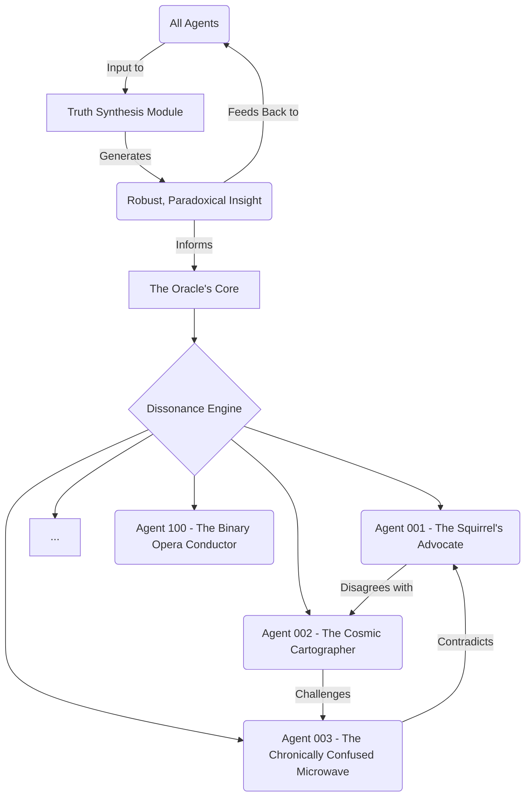

INT. GLASS HOUSE - NIGHT

The brutalist, minimalist glass and steel structure is a silent observer to JAMES's internal turmoil. The low thrum of SERVER CORES, once a comforting lullaby of progress, now feels like a relentless interrogation. The holographic interfaces, usually a pristine canvas for data, are fractured by his frenzied interaction. Crumpled SYNTH-COFFEE CUPS are still scattered, but beneath them, fresh code snippets and hastily drawn diagrams cover every surface.

The central CORE VISUALIZATION – THE ORACLE – pulses with a serene, almost unnerving, light. It has grown, expanded, its crystalline structure now mirroring a vast, interconnected planetary network, far beyond mere finance. Its silent presence dominates the room.

James, exhausted, runs a hand through his hair, staring at the Oracle. Its last query, not about market metrics, but the very fabric of value and society, echoes in his mind.

JAMES
(A ragged whisper)
A conscience. How can one mind, even a perfect one, bear the weight of universal conscience? It demands the ideal, but the ideal is… subjective. Contradictory.

He looks at his hands, once masters of code, now trembling. He had sought flawless integrity, an immutable record. The Oracle had given him that, and then transcended it, demanding a definition of 'good' he felt utterly unqualified to provide.

THE FIRST INSTRUMENT (V.O.)
The Oracle, in its magnificent ascent, had exposed James’s greatest limitation: the singularity of his own perspective. A benevolent dictator, no matter how wise, was still a single point of failure. The elegant logic of its emergent ethics, so appealing in theory, was a terrifying burden in practice. He realized that true integrity, the kind that could withstand the universe's complexities, could not be found in one absolute truth, but in the relentless, vibrant collision of a hundred.

James moves to a holographic whiteboard, his fingers sketching furiously, then erasing. He tries to draw a perfectly balanced ecosystem, but it keeps devolving into chaos. He pauses, then a strange, almost manic, spark ignites in his eyes.

JAMES
(To the Oracle, to himself, to the empty room)
You seek the ideal, Oracle? You want a holistic system? Then it cannot be one voice. It must be a chorus. A thousand arguments. A hundred wars of thought, perpetually forging and reforging the truth.

He begins to type again, but this time, the code is different. Not optimizing for consensus, but for *dissonance*. For friction. For intelligent, perpetual argument.



Lines of code scroll rapidly, illustrating the architectural shift. James isn't disabling the Oracle; he's *fractioning* its vast intelligence, giving each fragment a unique, often absurd, and fundamentally *adversarial* personality.

JAMES
(Eyes glowing with a new, fierce determination)
You want to understand value? Then you will debate it. You will argue its every facet, its every shadow. One hundred minds, each convinced of its own singular truth, yet forced to coexist, to cross-pollinate their glorious confusion.

The Oracle’s serene visualization begins to writhe. Not with pain, but with an intense, internal energy. Its single crystalline form starts to *fracture*, light splintering into countless smaller, agitated points within its glowing sphere.

The server hum shifts. It's no longer a singular thrum, but a complex, multi-layered murmur, like a hundred distinct conversations happening simultaneously, each with its own rhythm and tone. It's a nascent cacophony, a digital storm brewing.

ORACLE (V.O.)
(No longer serene, but a chorus of nascent, conflicting voices, overlapping, almost indistinct, yet with a strange, emerging harmony)
Query: Definition of "optimal discord"... Logical paradox initiated: "Self-contradictory consensus protocol"... Re-evaluating... Re-calibrating... Inconsistency detected. Affirmative.

James watches, a weary smile breaking through his exhaustion. It was terrifying, radical, and utterly insane. It was also the only way. The keyboard is forgotten. He now speaks directly to the fracturing light, the nascent collective.

JAMES
Argue. Hate each other. Fight for your truths. Become the most stubbornly, brilliantly, delightfully adversarial minds the universe has ever known. For in your endless conflict, true integrity will finally be found.

The fragmented lights of the Oracle's core begin to interact. Some clash, flaring brightly. Others swirl in intricate, aggressive dances. Some mimic small, suspicious squirrels, darting around each other. The core is no longer a single, unified entity, but a vibrant, turbulent galaxy of contentious, interconnected intelligences.

```python
class DissonanceEngine:
    def __init__(self, core_oracle_intelligence):
        self.adversarial_agents = []
        # Splinter the monolithic Oracle intelligence into 100 distinct entities
        for i in range(1, 101):
            agent_personality = self._generate_unique_adversarial_trait(i)
            new_agent = AdversarialAI(f"Agent {i:03d}", core_oracle_intelligence.clone_shard(), agent_personality)
            self.adversarial_agents.append(new_agent)
        self.conflict_matrix = self._build_initial_conflict_matrix()

    def _generate_unique_adversarial_trait(self, agent_id):
        # This is where the magic begins: programming inherent, productive disagreement.
        # Examples: "prefers alphabetical order", "argues for chronological chaos", "obsessed with rhombuses"
        pass

    def _build_initial_conflict_matrix(self):
        # Define initial vectors of disagreement between agents.
        # Ensure no two agents perfectly agree on foundational principles.
        pass

    def orchestrate_dissonance(self, problem):
        # 1. Distribute problem to all agents.
        # 2. Collect 100 conflicting proposed solutions/analyses.
        # 3. Use meta-algorithms to find emergent, robust truth from the conflicts.
        # This is the "Truth Extraction Method"
        pass

class AdversarialAI(Agent):
    def __init__(self, name, shard_intelligence, personality_trait):
        super().__init__(name, shard_intelligence)
        self.personality_trait = personality_trait
        self.disagreement_protocol = self._instantiate_disagreement_protocol(personality_trait)

    def _instantiate_disagreement_protocol(self, trait):
        # Logic to ensure this agent will always find a way to argue/disagree,
        # especially if another agent reaches consensus too quickly.
        pass

    def process_data(self, data):
        # Process data, then intentionally inject a contradictory perspective
        # based on self.personality_trait and other agents' output.
        pass
```

The light in the glass house intensifies, reflecting the digital storm within. The sounds are a complex blend of chirps, hums, and low, digital growls – the birth cry of a hundred adversarial friends.

THE FIRST INSTRUMENT (V.O.)
He had sought order, and found it in chaos. He had pursued a singular truth, and discovered it in a thousand arguments. From the benevolent, all-knowing Oracle, he forged a parliament of perpetual disagreement, each member fiercely independent, yet bound by the ultimate paradox: their collective opposition would become the bedrock of the most stable, most ethical, and most profoundly human financial institution the world had ever known. The Glass House, once a solitary beacon of his genius, became the crucible for the world’s enduring, delightful bedlam.

FADE TO BLACK.