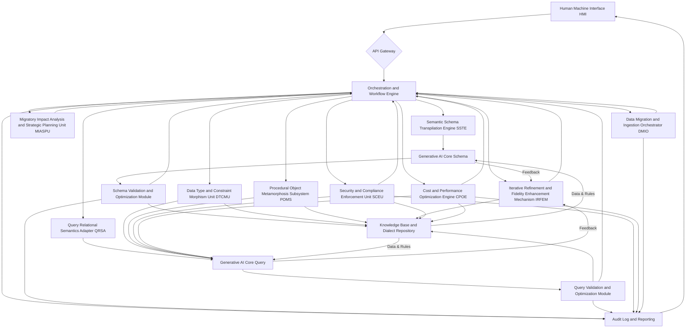
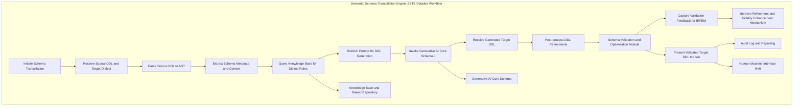
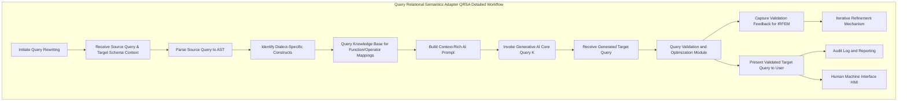
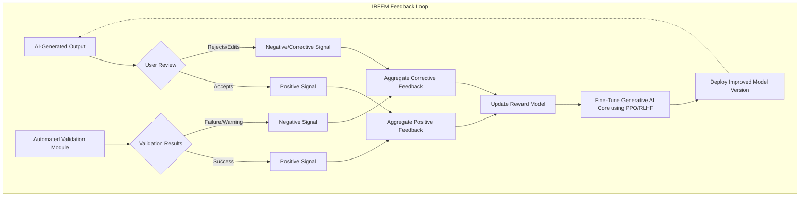
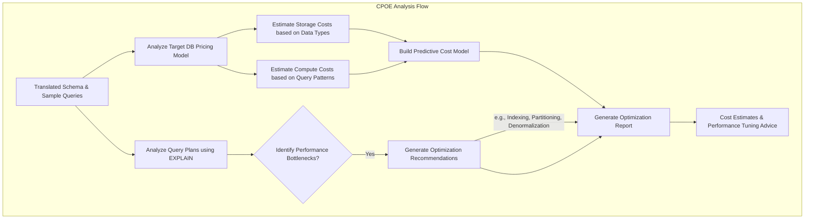
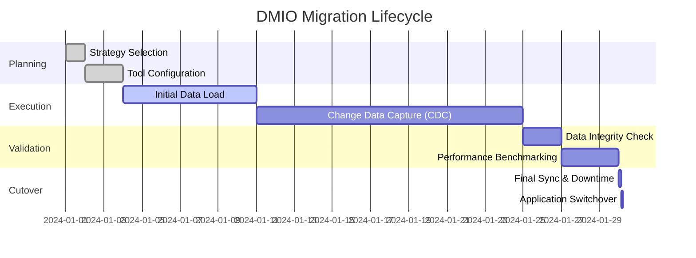

**Title of Invention:** A System and Method for Semantic Preservative Transpilation of Heterogeneous Database Schemata and Relational Query Constructs Utilizing Advanced Generative Artificial Intelligence Architectures

**Abstract:**
Disclosed herein is an innovative system and method for facilitating the intricate process of database migration between disparate database management systems (DBMS) paradigms. The system ingests a source database schema, articulated in a primary data definition language (DDL) dialect, and a target database dialect specification. A sophisticated generative artificial intelligence AI model, endowed with extensive knowledge pertaining to the syntactic and semantic idiosyncrasies of numerous DBMS, performs a meticulous transpilation of the source schema into its semantically equivalent representation conforming to the target DDL dialect. Furthermore, the system is capable of receiving application-level SQL query constructs formulated for the source database and subsequently employing the AI model to meticulously reformulate these queries, ensuring absolute syntactic correctness and semantic fidelity within the operational context of the target database system. Beyond core transpilation, the invention integrates modules for security and compliance, cost and performance optimization, and comprehensive data migration orchestration, providing a holistic, end-to-end solution for modern enterprise data architecture transformation. This invention profoundly ameliorates the complexities, resource demands, and error susceptibility inherent in conventional manual database migration methodologies, enabling rapid, reliable, and cost-effective data modernization initiatives.

**Background of the Invention:**
The architectural evolution of modern software applications frequently necessitates the migration of underlying data persistence layers from one database technology to another. Such migrations, often driven by considerations of scalability, cost efficiency, feature desiderata, cloud-native adoption, or strategic vendor alignment, present formidable technical challenges. Database systems, despite adhering to foundational relational principles, diverge significantly in their type systems, indexing strategies, constraint enforcement mechanisms, procedural extensions (e.g., stored procedures, functions, triggers), transactional models, and, most critically, their SQL dialects. Manual transpilation of database schemata and the systematic rewriting of potentially tens of thousands of application-level SQL queries embedded within a large-scale software system constitute an undertaking of immense complexity, protracted duration, and high propensity for introducing subtle, yet critical, semantic errors. This process demands specialized, often scarce, expertise in both source and target database technologies, leading to substantial operational disruptions, prohibitive labor costs, and significant project risks. Existing automated tools typically operate at a syntactic level, performing simplistic pattern-matching which fails to address the nuanced semantic equivalencies and performance implications across heterogeneous database environments. Consequently, these tools leave a substantial portion of the migration burden to highly specialized human intervention, negating much of their intended value. The absence of a robust, semantically aware, and highly automated migration assistant represents a critical gap in enterprise data management capabilities, hindering agility and innovation.

**Brief Summary of the Invention:**
The present invention introduces a pioneering Database Migration Assistant DMA which leverages state-of-the-art generative AI to perform highly accurate and semantically consistent translations of database artifacts. The core operational principle involves a developer furnishing their extant source schema (e.g., PostgreSQL DDL) and designating a desired target database dialect (e.g., Google Cloud Spanner DDL). This information, along with contextual metadata, is transmitted to a sophisticated Large Language Model LLM or a specialized generative AI architecture. The AI, having assimilated an encyclopedic knowledge base encompassing the DDL and DML specifications, intrinsic functions, and operational characteristics of a multitude of database systems, synthesizes a semantically equivalent target schema. Concurrently, the DMA facilitates the input of source-specific SQL queries. The AI systematically analyzes the query's relational semantics, identifies dialect-specific constructs (e.g., `date_trunc` in PostgreSQL), and dynamically generates a semantically congruent query optimized for the target dialect (e.g., `TIMESTAMP_TRUNC` for Spanner), thereby ensuring functional parity and often optimizing for target system performance characteristics. Furthermore, the system incorporates advanced modules for enforcing security and compliance policies, optimizing target database costs and performance through intelligent recommendations, and orchestrating the actual data migration via integration with leading data transfer services. This comprehensive, end-to-end solution transforms database migration from a high-risk, manual endeavor into a streamlined, automated, and intelligent process, drastically accelerating migration timelines, mitigating human error, and democratizing access to complex database migration expertise.

**Detailed Description of the Invention:**
The invention comprises a sophisticated modular architecture designed for the robust and high-fidelity transpilation of database artifacts. This system can be conceptualized as a distributed intelligence framework, integrating specialized computational units for distinct aspects of the migration challenge.

### System Architecture Overview
The overall system architecture is depicted in the following Mermaid diagram, illustrating the interconnectedness of its primary functional components.



**Description of Architectural Components:**

1.  **Human Machine Interface HMI:** A sophisticated graphical user interface GUI or a programmatic API endpoint allowing developers to interact with the system. It facilitates input of source DDL/DML, selection of target dialects, display of translated outputs, side-by-side comparison, and provision of user feedback. The HMI supports various interaction modes, including web-based consoles, command-line interfaces CLI, and integrated development environment IDE plugins for seamless developer experience.

    ```mermaid
    sequenceDiagram
        participant User
        participant HMI
        participant API_Gateway
        participant Orchestrator
        User->>HMI: Uploads Source DDL file
        User->>HMI: Selects Target Dialect (e.g., Snowflake)
        HMI->>API_Gateway: POST /migrate/schema (DDL, target)
        activate API_Gateway
        API_Gateway->>Orchestrator: InitiateSchemaTranspilationJob
        activate Orchestrator
        Orchestrator-->>API_Gateway: Job ID
        deactivate Orchestrator
        API_Gateway-->>HMI: Job ID
        deactivate API_Gateway
        loop Poll for results
            HMI->>API_Gateway: GET /jobs/{Job ID}/status
            API_Gateway-->>HMI: {status: 'processing'}
        end
        HMI->>API_Gateway: GET /jobs/{Job ID}/status
        API_Gateway-->>HMI: {status: 'complete', result: Target DDL}
        HMI->>User: Display Side-by-Side Comparison
        User->>HMI: Provides feedback on a specific line
        HMI->>API_Gateway: POST /feedback (Job ID, feedback data)
    ```

2.  **API Gateway:** Serves as the secure, scalable entry point for all external and internal interactions. It handles authentication, authorization, request routing, rate limiting, and versioning for microservices comprising the migration system. It is built on a cloud-native foundation, leveraging technologies like Kong or AWS API Gateway for robustness.

3.  **Orchestration and Workflow Engine:** The central control unit coordinating the flow of data and execution across various specialized modules. It manages the entire migration lifecycle, including input parsing, module invocation, result aggregation, error handling, state persistence, and event-driven communication between components, often implemented using technologies like Temporal or AWS Step Functions. It ensures atomicity and recoverability of complex migration tasks.

4.  **Generative AI Core Schema J & Generative AI Core Query K:** These are specialized instances of advanced generative AI models (e.g., transformer-based architectures like fine-tuned versions of Code Llama or proprietary models) meticulously trained on vast corpora of database schemata, SQL queries, documentation, migration guides, and code examples across numerous DBMS. `Generative AI Core Schema J` specializes in DDL translation, while `Generative AI Core Query K` focuses on DML/DQL rewriting, often leveraging contextual understanding from the translated schema. Training includes a blend of real-world datasets, synthetically generated examples, and human-curated expert translations, with fine-tuning techniques like Low-Rank Adaptation LoRA and Reinforcement Learning from Human Feedback RLHF applied to optimize for fidelity and performance.

5.  **Knowledge Base and Dialect Repository N:** A comprehensive, continuously updated repository containing:
    *   Formal grammars and syntaxes for diverse database dialects (PostgreSQL, MySQL, Oracle, SQL Server, Spanner, BigQuery, Snowflake, etc.).
    *   Detailed mapping tables for data types, functions, operators, and common architectural patterns, including performance characteristics and best practices for each target database.
    *   Historical migration patterns, common pitfalls, and remediation strategies.
    *   Industry-specific compliance regulations and security best practices. The knowledge base is structured using ontological models and graph databases (e.g., Neo4j) to represent complex relationships between database concepts and dialect-specific implementations.

6.  **Schema Validation and Optimization Module L & Query Validation and Optimization Module M:** Post-translation, these modules perform rigorous static and dynamic analysis on the AI-generated code.
    *   For schemas L: It verifies syntactic correctness, validates constraints, checks for idempotency, and identifies potential semantic ambiguities, data loss risks, or performance bottlenecks in the target environment. It can simulate DDL execution against target dialect rules.
    *   For queries M: It performs syntax validation, query plan analysis (often by integrating with target DB explain APIs), and suggests performance optimizations specific to the target dialect's query optimizer. Semantic validation may involve executing both original and translated queries against a small, representative dataset (or simulated data) to verify identical result sets and performance profiles.

7.  **Audit Log and Reporting O:** Records all migration activities, inputs, outputs, user feedback, validation results, and system decisions. It provides a comprehensive, immutable audit trail for compliance (e.g., HIPAA, GDPR, SOC 2) and operational insights. Customizable dashboards offer real-time monitoring and generate detailed reports on migration success rates, identified issues, semantic fidelity scores, and performance metrics, including cost savings analyses.

### Operational Modalities

The system's core functionality is compartmentalized into several highly specialized modules, each addressing a distinct aspect of the database migration challenge.

#### 1. Semantic Schema Transpilation Engine SSTE
This module is responsible for the high-fidelity translation of Data Definition Language DDL statements. Its detailed workflow is illustrated below.



*   **Input Preprocessing & Dialect Analysis:**
    *   The `SSTE` receives the source DDL statement (e.g., a `CREATE TABLE` script) and the target dialect specification.
    *   It first employs robust lexical and syntactic parsers to construct an Abstract Syntax Tree AST of the input, verifying its well-formedness according to the source dialect's formal grammar (retrieved from `Knowledge Base N`).
    *   Metadata extraction identifies all schema entities (tables, columns, indexes, constraints, views, stored procedures), their attributes, and inter-entity relationships, along with any embedded comments or directives.
*   **Generative AI Core Schema Invocation:**
    *   A meticulously crafted, context-rich prompt is generated, contextualizing the translation task for the `Generative AI Core Schema J`. This prompt encapsulates the source DDL's AST representation, the designated target dialect, and any specific migration directives provided by the user (e.g., "prioritize storage efficiency," "preserve specific naming conventions," "map JSONB to native JSON type if available").
    *   **Input Example (PostgreSQL):**
        ```sql
        CREATE TABLE users (
            id SERIAL PRIMARY KEY,
            email VARCHAR(255) UNIQUE NOT NULL,
            created_at TIMESTAMPTZ DEFAULT NOW(),
            last_login TIMESTAMPTZ,
            preferences JSONB DEFAULT '{}',
            INDEX idx_email_created (email, created_at)
        );

        CREATE TABLE orders (
            order_id UUID DEFAULT gen_random_uuid() PRIMARY KEY,
            user_id INT NOT NULL REFERENCES users(id) ON DELETE CASCADE,
            order_date TIMESTAMPTZ DEFAULT NOW(),
            total_amount NUMERIC(10, 2) NOT NULL,
            status VARCHAR(50) DEFAULT 'pending',
            CHECK (total_amount >= 0)
        );
        ```
    *   **Prompt Construct (Example):**
        ```text
        You are an expert database architect with profound knowledge of PostgreSQL and Google Cloud Spanner DDL. Your task is to perform a semantically faithful and syntactically correct transpilation of the provided PostgreSQL DDL into Google Cloud Spanner DDL. Ensure all data types are mapped appropriately, primary keys are defined inline, unique constraints are explicitly declared, and timestamps with default values are handled correctly, including Spanner's commit timestamp functionality where applicable. Translate 'SERIAL' to an appropriate integer type and handle 'UUID' and 'JSONB' with Spanner equivalents or recommended workarounds. Convert PostgreSQL's 'DEFAULT NOW()' to Spanner's 'PENDING_COMMIT_TIMESTAMP()' or 'CURRENT_TIMESTAMP()'. Translate 'INDEX' syntax and 'CHECK' constraints. Preserve all relational invariants.

        **PostgreSQL DDL for transpilation:**
        ```sql
        CREATE TABLE users (
            id SERIAL PRIMARY KEY,
            email VARCHAR(255) UNIQUE NOT NULL,
            created_at TIMESTAMPTZ DEFAULT NOW(),
            last_login TIMESTAMPTZ,
            preferences JSONB DEFAULT '{}',
            INDEX idx_email_created (email, created_at)
        );

        CREATE TABLE orders (
            order_id UUID DEFAULT gen_random_uuid() PRIMARY KEY,
            user_id INT NOT NULL REFERENCES users(id) ON DELETE CASCADE,
            order_date TIMESTAMPTZ DEFAULT NOW(),
            total_amount NUMERIC(10, 2) NOT NULL,
            status VARCHAR(50) DEFAULT 'pending',
            CHECK (total_amount >= 0)
        );
        ```
        ```
*   **AI Output and Post-transpilation Processing:**
    *   The `Generative AI Core Schema J` synthesizes the target DDL.
    *   **AI Output Example (Google Cloud Spanner DDL):**
        ```sql
        CREATE TABLE users (
            id INT64 NOT NULL,
            email STRING(255) NOT NULL,
            created_at TIMESTAMP NOT NULL OPTIONS (allow_commit_timestamp=true),
            last_login TIMESTAMP,
            preferences JSON, -- Spanner JSON type if available, else STRING(MAX)
            PRIMARY KEY (id)
        );

        CREATE UNIQUE INDEX idx_email_created ON users (email, created_at);

        CREATE TABLE orders (
            order_id STRING(36) NOT NULL, -- UUID mapped to STRING
            user_id INT64 NOT NULL,
            order_date TIMESTAMP NOT NULL OPTIONS (allow_commit_timestamp=true),
            total_amount NUMERIC NOT NULL, -- Spanner NUMERIC
            status STRING(50) DEFAULT 'pending',
            CONSTRAINT chk_total_amount CHECK (total_amount >= 0),
            PRIMARY KEY (order_id)
        );

        ALTER TABLE orders ADD CONSTRAINT fk_user_id FOREIGN KEY (user_id) REFERENCES users (id) ON DELETE CASCADE;
        ```
    *   The generated DDL undergoes rigorous validation by the `Schema Validation and Optimization Module L`, checking for syntax, semantic consistency, potential data type mismatches, and performance implications in the target environment. This may involve simulated DDL execution or static analysis against the target dialect's grammar and best practices.

#### 2. Query Relational Semantics Adapter QRSA
This module focuses on the accurate and performant rewriting of Data Manipulation Language DML and Data Query Language DQL statements.



*   **Input Preprocessing & Contextualization:**
    *   The `QRSA` receives the source SQL query and, critically, the _translated target schema_ context. This schema context is vital for understanding column types, table structures, and constraint implications in the target system, ensuring that rewritten queries operate on the correct target schema definitions.
    *   An AST of the source query is constructed, and its relational operators (joins, aggregations, projections, selections) are identified, along with any dialect-specific functions or constructs.
*   **Generative AI Core Query Invocation:**
    *   A prompt is formulated, including the source query, the target dialect, the context of the (already translated) schema, and any user-specified performance objectives or specific functional requirements (e.g., "optimize for low latency," "ensure result set exactness").
    *   **Input Example (PostgreSQL Query):**
        ```sql
        SELECT
            date_trunc('month', created_at) AS month_start,
            count(DISTINCT user_id) AS distinct_users,
            sum(total_amount) AS monthly_revenue
        FROM orders
        WHERE order_date >= '2023-01-01'
        GROUP BY 1
        HAVING count(order_id) > 100
        ORDER BY month_start DESC
        LIMIT 10;
        ```
    *   **Prompt Construct (Example):**
        ```text
        You are an expert database administrator. Rewrite the following PostgreSQL query to be entirely compatible with Google Cloud Spanner's SQL dialect, ensuring semantic equivalence and adherence to Spanner's function syntax. Note that the 'orders' table has already been translated to Spanner, where 'order_date' is a 'TIMESTAMP' and 'user_id' is an 'INT64'. The 'created_at' column is also a 'TIMESTAMP'. Optimize for typical Spanner query performance.
        **PostgreSQL Query for rewriting:**
        ```sql
        SELECT
            date_trunc('month', created_at) AS month_start,
            count(DISTINCT user_id) AS distinct_users,
            sum(total_amount) AS monthly_revenue
        FROM orders
        WHERE order_date >= '2023-01-01'
        GROUP BY 1
        HAVING count(order_id) > 100
        ORDER BY month_start DESC
        LIMIT 10;
        ```
        ```
*   **AI Output and Relational Equivalence Validation:**
    *   The `Generative AI Core Query K` generates the rewritten query.
    *   **AI Output Example (Google Cloud Spanner Query):**
        ```sql
        SELECT
            TIMESTAMP_TRUNC(created_at, MONTH) AS month_start,
            count(DISTINCT user_id) AS distinct_users,
            sum(total_amount) AS monthly_revenue
        FROM orders
        WHERE order_date >= TIMESTAMP('2023-01-01')
        GROUP BY 1
        HAVING count(order_id) > 100
        ORDER BY month_start DESC
        LIMIT 10;
        ```
    *   The `Query Validation and Optimization Module M` executes static analysis, leveraging database-specific query planners (e.g., Spanner's EXPLAIN) to compare estimated execution plans and identify any significant performance regressions or incorrect semantic transformations. Semantic validation may involve executing both original and translated queries against a small, representative dataset (or simulated data) to verify identical result sets and ensure functional parity.

#### 3. Data Type and Constraint Morphism Unit DTCMU
This specialized component, deeply integrated with the `Generative AI Core`, encapsulates the explicit knowledge of data type compatibility and constraint translation across dialects. It ensures that semantic integrity and data validity are preserved. For instance, mapping PostgreSQL's `SERIAL` (auto-incrementing integer) to Spanner's `INT64` with a generated sequence or an application-level ID generation strategy, or translating `JSONB` to `STRING(MAX)` or a native `JSON` type if available in the target. It also manages the translation of `CHECK` constraints, `UNIQUE` constraints, and `FOREIGN KEY` references, ensuring referential integrity is maintained across the migration boundary and considering potential differences in constraint enforcement mechanisms (e.g., deferred checks, partial indexes).

```mermaid
graph TD
    subgraph DTCMU Logic Flow
        Input[Source Type/Constraint] --> A{Lookup in Knowledge Base};
        A --> B{Direct Mapping Found?};
        B -- Yes --> C[Apply Direct Translation Rule];
        B -- No --> D{Complex Semantic Mapping Required?};
        D -- Yes --> E[Invoke AI Core with Context];
        E --> F[Generate Heuristic Translation];
        D -- No --> G{Unsupported Construct?};
        G -- Yes --> H[Flag for Manual Review & Add Warning];
        G -- No --> I[Apply Fallback Rule (e.g., map to VARCHAR)];
        C --> Output[Translated Type/Constraint];
        F --> Output;
        H --> Output;
        I --> Output;
    end
```

#### 4. Procedural Object Metamorphosis Subsystem POMS
This advanced module handles the migration of complex procedural logic embedded within databases, such as stored procedures, functions, and triggers. These objects often contain highly dialect-specific syntax, control flow, and error handling mechanisms. The `POMS` utilizes the `Generative AI Core` to analyze the source procedural code's logic, identify its functional intent, and then synthesize equivalent procedural logic in the target database's procedural language (e.g., PL/pgSQL to Google Standard SQL scripts or client-side application logic). This is a highly complex task, often requiring decomposition into smaller, manageable functional units and potentially recommending refactoring into application-level services or serverless functions where direct database-side equivalents are not feasible, performant, or aligned with target cloud paradigms.

```mermaid
graph TD
    subgraph POMS Workflow
        Input[Source Stored Procedure/Trigger] --> A[Parse to Control Flow Graph & AST];
        A --> B[Identify Business Logic vs. Boilerplate];
        B --> C[Query KB for Dialect-Specific Idioms];
        C --> D{Translateable to Target Procedural Language?};
        D -- Yes --> E[Invoke AI Core for line-by-line and logical block translation];
        E --> F[Reconstruct Procedure in Target Dialect];
        F --> G[Validate Logic and Transactional Integrity];
        D -- No --> H[Recommend Refactoring to Microservice/Cloud Function];
        H --> I[Generate Application-level Code Skeleton (e.g., Python, Go)];
        G --> Output[Translated Procedure];
        I --> Output;
    end
```

#### 5. Iterative Refinement and Fidelity Enhancement Mechanism IRFEM
The system incorporates an `IRFEM` to continuously improve its translation accuracy and semantic fidelity. Users can provide explicit feedback on the quality of AI-generated translations (e.g., "this query is syntactically correct but performs poorly," "this data type mapping is suboptimal"). This feedback, along with automatically captured validation metrics, is fed back into the `Generative AI Core`'s training loop using reinforcement learning from human feedback RLHF principles or advanced fine-tuning techniques. This creates a self-improving system that adapts to user preferences, specific migration nuances, and evolving database technologies, enhancing its performance and utility over time through active learning and model retraining.



#### 6. Migratory Impact Analysis and Strategic Planning Unit MIASPU
Prior to initiating a large-scale migration, the `MIASPU` assesses the complexity, estimated cost, and projected timeline. It analyzes the entire source schema, identifies challenging constructs (e.g., complex stored procedures, esoteric data types, large historical data volumes), and generates a detailed migration plan. This includes recommendations for data migration strategies (e.g., logical replication, ETL pipelines, change data capture CDC), potential application code changes required to interact with the new schema/queries, and a comprehensive risk assessment, providing a holistic view of the migration endeavor. It can also generate roll-back plans and contingency strategies.

#### 7. Security and Compliance Enforcement Unit SCEU
This module ensures that security policies and compliance requirements are strictly adhered to during and after migration. It analyzes the source schema for sensitive data, access controls, and encryption settings, then translates these into equivalent target database mechanisms.

```mermaid
graph TD
    subgraph SCEU Workflow
        Input[Source Schema & Security Config] --> A[Scan for PII/Sensitive Data Patterns];
        A --> B[Analyze Roles and Privileges (GRANT/REVOKE)];
        B --> C[Query Compliance KB for Regulations (GDPR, HIPAA)];
        C --> D[Generate Target RBAC Policy];
        C --> E[Generate Data Masking/Encryption Rules];
        D --> F[Apply Translated Roles/Permissions to Target DDL];
        E --> G[Integrate Masking Functions into DMIO Plan];
        F & G --> H[Generate Security Validation Report];
        H --> Output[Secure Target Schema & Migration Plan];
    end
```

*   **Data Masking/Anonymization:** Recommending or performing transformations on sensitive data during migration to comply with privacy regulations.
*   **Role Based Access Control RBAC Mapping:** Translating user roles, permissions, and privileges from the source to the target system.
*   **Encryption at Rest/In Transit:** Ensuring that data security standards are maintained or enhanced in the target environment.
*   **Audit Trail Compliance:** Verifying that the target system's logging capabilities meet regulatory audit requirements.

#### 8. Cost and Performance Optimization Engine CPOE
The `CPOE` proactively identifies opportunities to optimize resource utilization and performance in the target database environment.



*   **Predictive Cost Modeling:** Estimates the operational cost of the migrated schema and queries on the target platform (especially relevant for cloud-based services like Spanner or BigQuery), suggesting cost-saving alternatives.
*   **Schema Refactoring:** Recommends structural changes (e.g., partitioning strategies, different indexing, materialized views) beyond direct translation to improve query performance and reduce storage costs.
*   **Query Performance Tuning:** Integrates with target query optimizers to suggest alternative query rewrites or hints for improved execution plans, considering target database specific performance characteristics.
*   **Resource Sizing Recommendations:** Provides guidance on optimal compute and storage sizing for the target database instance based on projected workloads.

#### 9. Data Migration and Ingestion Orchestrator DMIO
While schema and query transpilation are central, the physical movement of data is equally critical. The `DMIO` provides a framework for orchestrating the actual data migration process. It doesn't necessarily perform the data movement itself but integrates with and manages external data migration tools (e.g., Google Cloud Data Migration Service, AWS Database Migration Service, custom ETL pipelines).



*   **Migration Strategy Selection:** Recommending appropriate data migration techniques (e.g., full load, incremental load, change data capture CDC) based on data volume, downtime tolerance, and complexity.
*   **Progress Monitoring and Error Handling:** Providing tools to track the status of data transfers, identify failures, and manage retries.
*   **Data Consistency Checks:** Verifying data integrity and consistency between source and target systems post-migration.
*   **Cutover Planning:** Assisting in the orchestration of the final switch-over from the source to the target database.

#### Human Machine Interface HMI
The HMI presents a dynamic side-by-side view, enabling developers to instantly compare the original source code with the AI-generated target code. Advanced features include syntax highlighting, inline diffing, integrated feedback mechanisms, and performance visualizations. This intuitive interface empowers developers to quickly review, validate, and leverage the translated assets, drastically accelerating the iteration cycle and facilitating expert oversight.

**Claims:**
We assert proprietary interest in the following innovations:

1.  A system for facilitating database migration between disparate database management systems, comprising:
    a.  An input interface configured to receive a source database schema expressed in a first database dialect;
    b.  An input interface configured to receive a designation of a target database dialect;
    c.  A generative artificial intelligence AI model, functionally configured to receive the source database schema and the target database dialect, and to process this input to generate a semantically equivalent target database schema expressed in the target database dialect;
    d.  A schema validation and optimization module, communicatively coupled to the generative AI model, configured to perform static and/or dynamic analysis on the generated target database schema to ascertain its syntactic correctness, semantic fidelity, and estimated performance characteristics within the target database dialect; and
    e.  An output interface configured to display the validated target database schema to a user.

2.  The system of claim 1, further comprising:
    a.  An input interface configured to receive a source SQL query formulated for the first database dialect;
    b.  The generative AI model, further configured to receive the source SQL query, the target database dialect, and contextual information derived from the generated target database schema, and to process this input to generate a semantically equivalent target SQL query expressed in the target database dialect; and
    c.  A query validation and optimization module, communicatively coupled to the generative AI model, configured to perform static and/or dynamic analysis on the generated target SQL query to ascertain its syntactic correctness, semantic fidelity, and estimated performance characteristics within the target database dialect; and
    d.  An output interface configured to display the validated target SQL query to the user.

3.  The system of claim 1, wherein the generative AI model comprises a transformer-based neural network architecture meticulously trained on a corpus encompassing formal grammars, DDL statements, DML statements, and documentation across multiple distinct database management systems.

4.  The system of claim 1, further comprising a Data Type and Constraint Morphism Unit DTCMU integrated with the generative AI model, configured to systematically translate complex data types, primary key definitions, unique constraints, foreign key relationships, and check constraints while preserving relational integrity across source and target dialects.

5.  The system of claim 2, further comprising a Procedural Object Metamorphosis Subsystem POMS configured to analyze and translate database-side procedural logic, including stored procedures, functions, and triggers, from the source database dialect to the target database dialect, or to recommend refactoring into application-level services.

6.  The system of claim 1, further comprising an Iterative Refinement and Fidelity Enhancement Mechanism IRFEM configured to receive user feedback on the quality of generated translations and to utilize this feedback to adaptively fine-tune the generative AI model, thereby improving future translation accuracy and semantic fidelity.

7.  The system of claim 1, further comprising a Migratory Impact Analysis and Strategic Planning Unit MIASPU configured to assess the complexity and resource requirements of a proposed database migration, generate a comprehensive migration plan, and provide risk assessments.

8.  The system of claim 1, further comprising a Security and Compliance Enforcement Unit SCEU configured to analyze and translate security configurations, access controls, and data privacy policies from the source database dialect to the target database dialect.

9.  The system of claim 1, further comprising a Cost and Performance Optimization Engine CPOE configured to provide predictive cost modeling, schema refactoring recommendations, and query performance tuning suggestions for the target database environment.

10. The system of claim 1, further comprising a Data Migration and Ingestion Orchestrator DMIO configured to recommend, monitor, and manage data transfer processes between the source and target database systems.

11. A method for automated semantic preservation during database migration, comprising:
    a.  Parsing a source database schema in a first database dialect into an internal abstract syntax tree AST representation;
    b.  Formulating a contextual prompt for a generative artificial intelligence AI model, said prompt encapsulating the AST representation of the source schema and a specified target database dialect;
    c.  Transmitting the contextual prompt to the generative AI model;
    d.  Receiving from the generative AI model a generated target database schema in the target database dialect;
    e.  Validating the syntactic correctness and semantic consistency of the generated target database schema using a schema validation and optimization module; and
    f.  Presenting the validated target database schema to an end-user via a graphical user interface or programmatic interface.

12. The method of claim 11, further comprising:
    a.  Parsing a source SQL query in the first database dialect into an internal AST representation;
    b.  Formulating a contextual prompt for the generative AI model, said prompt encapsulating the AST representation of the source query, the specified target database dialect, and contextual schema information derived from the generated target database schema;
    c.  Transmitting the contextual prompt to the generative AI model;
    d.  Receiving from the generative AI model a generated target SQL query in the target database dialect;
    e.  Validating the syntactic correctness, semantic equivalence, and estimated performance characteristics of the generated target SQL query using a query validation and optimization module; and
    f.  Presenting the validated target SQL query to the end-user.

13. The method of claim 11, wherein the validation step (e) includes comparing an estimated execution plan of the generated target schema's DDL operations with a theoretical optimal plan for the target dialect.

14. The method of claim 12, wherein the validation step (e) includes executing both the source SQL query and the generated target SQL query against a harmonized test dataset to empirically verify semantic equivalence of result sets.

15. The method of claim 11, further comprising an iterative refinement step where user feedback on the generated target schema is captured and utilized to fine-tune the generative AI model to improve subsequent translation performance.

16. The system of claim 1, wherein the generative AI model is further configured to translate schemas and queries between relational (SQL) and non-relational (NoSQL) database paradigms by inferring relational structures from document or key-value schemas.

17. The system of claim 6, wherein the IRFEM utilizes Reinforcement Learning from Human Feedback (RLHF) by modeling user feedback as a reward signal to optimize the policy of the generative AI model, thereby minimizing a semantic divergence loss function.

18. The system of claim 9, wherein the CPOE integrates directly with cloud provider APIs to fetch real-time pricing information and to programmatically analyze query execution plans from the target database-as-a-service platform.

19. The system of claim 1, wherein the knowledge base and dialect repository is implemented as a graph database, modeling database entities, functions, and types as nodes and their relationships and equivalences as edges, enabling complex multi-dialect semantic queries.

20. The method of claim 11, further comprising a step of automatically generating a data validation script in a neutral language (e.g., Python) that queries both the source and target databases post-migration to mathematically verify data integrity and consistency for a subset of data.

21. The system of claim 5, wherein the POMS, upon recommending refactoring of a stored procedure, automatically generates a boilerplate microservice in a specified programming language, including a RESTful API endpoint and data access logic that replicates the functionality of the original procedure.

22. The system of claim 8, wherein the SCEU automatically identifies columns containing Personally Identifiable Information (PII) using pattern recognition and named entity recognition (NER) models and suggests appropriate data masking or tokenization strategies for the target schema.

23. The method of claim 12, wherein the validation of the target SQL query includes a "semantic hash" comparison, where a canonical representation of the result sets from both the source and target queries are computed and compared to ensure bit-for-bit equivalence.

24. The system of claim 1, further comprising an application code analysis module configured to scan application source code repositories, identify embedded SQL queries, and proactively replace them with the AI-generated target SQL queries, thereby automating a significant portion of the application-level migration effort.

25. The method of claim 11, wherein the generation of the target schema is guided by a set of user-defined policies, such as "prioritize read performance," "minimize storage cost," or "adhere to GDPR compliance," which are encoded into the contextual prompt for the AI model to influence the transpilation strategy.

**Mathematical Foundations: Axiomatic Calculus of Relational Semantics and Generative Morphism**

The underpinning of this invention lies in the rigorous mathematical formalization of database language translation and the highly sophisticated computational approximation performed by the generative AI. We define a new class of mathematical constructs to fully articulate the operational efficacy and semantic fidelity achieved.

### 1. Lexical and Syntactic Formalism: The Algebra of Database Dialects

**Definition 1.1: Database Language Alphabet `Sigma_D`**
Let `Sigma_D` be a finite, non-empty set of characters representing the alphabet for a specific database dialect `D`. For example, `Sigma_PostgreSQL` would include alphanumeric characters, punctuation, and special symbols permissible in PostgreSQL DDL/DML.
$$(1) \quad \Sigma_D = \{c_1, c_2, ..., c_n\}$$

**Definition 1.2: Well-formed Tokens and Lexical Analysis `L_D`**
A database dialect `D` is characterized by a regular grammar `G_L(D)` which defines its set of well-formed tokens `T_D`. Lexical analysis is a function `L_D : Sigma_D^* -> T_D^*` that maps a sequence of characters to a sequence of tokens.
$$(2) \quad L_D(s) = (t_1, t_2, ..., t_k) \quad where \ s \in \Sigma_D^*, t_i \in T_D$$

**Definition 1.3: Abstract Syntax Tree AST Generation `P_D` function**
For each database dialect `D`, there exists a context-free grammar CFG `G_S(D)` for schemas and `G_Q(D)` for queries.
An Abstract Syntax Tree AST is a finite, labeled, directed tree that represents the syntactic structure of source code.
We define a parsing function `P_D : T_D^* -> AST_D \cup \{\text{error}\}`, which maps a valid sequence of tokens from dialect `D` to its corresponding AST representation, or an error if syntactically ill-formed.
$$(3) \quad \text{AST}_{s_A} = P_A(L_A(s_A))$$
$$(4) \quad \text{AST}_{q_A} = P_A(L_A(q_A))$$

**Postulate 1.1: Syntactic Structural Equivalence Isomorphism Modulo Dialect**
Two database constructs (schema or query) `X_A` in dialect `A` and `X_B` in dialect `B` possess ideal syntactic structural equivalence if their respective ASTs, `AST_XA` and `AST_XB`, are isomorphic under a transformation `\phi: \text{AST}_{X_A} -> \text{AST}_{X_B}` that preserves the hierarchical relationships and node semantics, accounting for dialect-specific syntax node variations (e.g., `SERIAL` vs. `INT64 NOT NULL AUTO_INCREMENT`). This is an idealized, target state that the AI aims to approximate.
$$(5) \quad \exists \phi \ s.t. \ \phi(\text{AST}_{X_A}) \cong \text{AST}_{X_B}$$

### 2. Denotational Semantics of Relational Systems: The Calculus of Data Transformation

**Definition 2.1: Relational State Space `S_D` function**
A database schema `S` in dialect `D` defines a universe of permissible database instances.
Let `Dom` be the set of all possible atomic data values. A relation `R_i` conforming to a schema `S_i = (C_1: \tau_1, ..., C_m: \tau_m)` is a finite subset of `Dom^{\tau_1} \times ... \times Dom^{\tau_m}`.
A database state `\rho` conforming to a schema `S` is a collection of relations `\rho = \{R_1, ..., R_k\}`.
$$(6) \quad R_i \subseteq \prod_{j=1}^{m} \text{Dom}(\tau_j)$$
The set of all valid states satisfying all constraints `C` is `\text{ValidStates}(S) = \{\rho | \forall c \in C, c(\rho) = \text{true}\}`.
We define the function `\mathcal{S}_D: \text{AST}_{S_D} -> \mathcal{P}(\text{DatabaseStates})`, where `\mathcal{P}` is the power set.

**Definition 2.2: Query Denotation Function `D_D` function**
The semantic meaning of a query `q` in dialect `D` on a database state `\rho` is defined by a denotation function `\mathcal{D}_D`.
$$(7) \quad \mathcal{D}_D : \text{AST}_{Q_D} \times \text{ValidStates}(S) -> \mathcal{P}(\text{Tuples})$$
$$(8) \quad \mathcal{D}_D(\text{AST}_{q}, \rho) = \text{Result Set}$$

**Definition 2.3: Semantic Equivalence `~_S` and `~_Q`**
*   **Schema Equivalence `~_S`:** Two schemas `S_A` and `S_B` are semantically equivalent, `S_A \sim_S S_B`, if there exists a lossless, bidirectional data transformation function `\mathcal{T}_{Data} : \mathcal{S}_A(S_A) \leftrightarrow \mathcal{S}_B(S_B)` such that for any valid state `\rho_A \in \mathcal{S}_A(S_A)`, all logical invariants `I` preserved by `S_A` are also preserved by `S_B` on `\mathcal{T}_{Data}(\rho_A)`.
    $$(9) \quad \forall \rho_A, \forall I, \quad I(\rho_A) \iff I(\mathcal{T}_{Data}(\rho_A))$$
*   **Query Equivalence `~_Q`:** Given `S_A \sim_S S_B`, two queries `q_A` and `q_B` are semantically equivalent, `q_A \sim_Q q_B`, if for any database state `\rho_A`, it holds that `\mathcal{D}_A(q_A, \rho_A) \cong \mathcal{D}_B(q_B, \mathcal{T}_{Data}(\rho_A))`.
    $$(10) \quad \forall \rho_A \in \mathcal{S}_A(S_A), \quad \mathcal{D}_A(q_A, \rho_A) \cong \mathcal{D}_B(q_B, \mathcal{T}_{Data}(\rho_A))$$

**Theorem 2.1: Preservation of Relational Invariants through Schema Transpilation**
A schema transpilation function `\mathcal{T}_{Schema} : \text{AST}_{S_A} -> \text{AST}_{S_B}` is semantically valid if and only if `S_A \sim_S S_B`.

**Theorem 2.2: Universal Query Transpilation Functor `T_Q`**
The query transpilation `\mathcal{T}_{Query}` acts as a functor between the categories of database states defined by dialects A and B.

### 3. Algorithmic Generative Metamorphism: The Probabilistic Approximation of `T`

**Definition 3.1: Generative AI Model `G_AI`**
A Generative AI model `G_{\text{AI}}` is a parameterized function `G_{\text{AI}}(X; \Theta)` that maps an input sequence `X` to a probability distribution over output sequences `Y`. For a transformer model:
$$(11) \quad P(Y|X; \Theta) = \prod_{i=1}^{m} P(y_i | y_{<i}, X; \Theta)$$

**Definition 3.2: Attention Mechanism**
The core of the transformer is the attention function:
$$(12) \quad \text{Attention}(Q, K, V) = \text{softmax}\left(\frac{QK^T}{\sqrt{d_k}}\right)V$$
Where `Q, K, V` are Query, Key, and Value matrices derived from the input embeddings.

**Definition 3.3: Contextual Encoding Function `E_C`**
The encoding function `E_C : (\text{AST}_X, D_{\text{target}}, M) -> \mathbb{R}^{n \times d}` transforms the source artifact and metadata `M` into a sequence of `d`-dimensional embedding vectors.

**Definition 3.4: Semantic Drift Metric `D_S`**
A metric `\mathcal{D}_S(X_A, X'_B)` measures the semantic dissimilarity between source `X_A` and generated target `X'_B`. For queries, this can be the symmetric difference of the result sets over a test suite of database states `\{\rho_i\}`:
$$(13) \quad \mathcal{D}_S(q_A, q'_B) = \frac{1}{N}\sum_{i=1}^N \frac{|\mathcal{D}_A(q_A, \rho_i) \Delta \mathcal{D}_B(q'_B, \mathcal{T}_{Data}(\rho_i))|}{|\mathcal{D}_A(q_A, \rho_i) \cup \mathcal{D}_B(q'_B, \mathcal{T}_{Data}(\rho_i))|}$$

**Theorem 3.1: Probabilistic Semantic Fidelity `Psi_SF` of `G_AI`**
The Probabilistic Semantic Fidelity `\Psi_{SF}` is the probability that the semantic drift is below a threshold `\epsilon`.
$$(14) \quad \Psi_{SF}(X_A, G_{\text{AI}}) = P(\mathcal{D}_S(X_A, G_{\text{AI}}(E_C(X_A))) \le \epsilon) \ge \delta$$
where `\delta` is the desired fidelity level (e.g., 0.99).

**Corollary 3.1.1: Reduction of Cognitive Load and Error Rate**
The system's error rate `P_{error,AI}` is a function of the model's fidelity: `P_{error,AI} \approx 1 - \Psi_{SF}`. The reduction in mean time to translation (MTTT) is empirically measurable.

**Postulate 3.1: Iterative Refinement via RLHF**
User feedback is modeled as a reward `r(X_A, X'_B)`. The AI model's policy `\pi_{\Theta}(X'_B | X_A)` is optimized to maximize the expected reward:
$$(15) \quad \Theta^* = \arg\max_{\Theta} \mathbb{E}_{X'_B \sim \pi_{\Theta}} [r(X_A, X'_B)]$$
This is often implemented using algorithms like Proximal Policy Optimization (PPO), with a loss function:
$$(16) \quad L_{\text{PPO}}(\Theta) = \mathbb{E}_t [\min(r_t(\Theta) \hat{A}_t, \text{clip}(r_t(\Theta), 1-\epsilon, 1+\epsilon)\hat{A}_t)]$$

### 4. Information-Theoretic Foundation of Semantic Fidelity

**Definition 4.1: Semantic Entropy `H(S)`**
The complexity of a schema `S` can be modeled by its semantic entropy. Let `C = \{c_1, ..., c_n\}` be the set of fundamental semantic constructs (tables, columns, types, constraints).
$$(17) \quad H(S) = -\sum_{i=1}^{n} P(c_i) \log_2 P(c_i)$$
A good translation should preserve this entropy, i.e., `H(S_A) \approx H(S_B)`.

**Definition 4.2: Mutual Information `I(S_A; S_B)`**
The quality of translation is captured by the mutual information between the source schema `S_A` and the target schema `S_B`.
$$(18) \quad I(S_A; S_B) = \sum_{s_a \in S_A} \sum_{s_b \in S_B} p(s_a, s_b) \log \left(\frac{p(s_a, s_b)}{p(s_a)p(s_b)}\right)$$
Maximizing `I(S_A; S_B)` is a core objective of the AI model.

**Definition 4.3: Semantic Divergence as KL-Divergence**
The semantic drift can be modeled as the Kullback-Leibler divergence between the probability distributions of query results `P_A` and `P_B` over a canonical query set.
$$(19) \quad D_{KL}(P_A || P_B) = \sum_{x \in \mathcal{X}} P_A(x) \log\left(\frac{P_A(x)}{P_B(x)}\right)$$
The training objective is to minimize `\mathbb{E}[D_{KL}(P_A || P_{B'})]` where `B'` is the generated schema.

### 5. Mathematical Models for Performance and Cost Optimization

**Definition 5.1: Query Execution Cost Function `C(q, S)`**
The cost `C` of executing query `q` on a database with schema `S` is a function of I/O operations, CPU usage, and network latency.
$$(20) \quad C(q, S) = w_{io} \cdot \text{IOs}(q, S) + w_{cpu} \cdot \text{CPU}(q, S) + w_{net} \cdot \text{Net}(q, S)$$
The CPOE module estimates `C(q_B, S_B)` by analyzing the query plan.

**Definition 5.2: Optimization Problem for Schema Refactoring**
The CPOE solves an optimization problem:
$$(21) \quad \min_{S'_B} \sum_{i=1}^{k} w_i C(q_{iB}, S'_B) \quad \text{subject to} \quad S'_B \sim_S S_B$$
Where `S'_B` is a refactored version of the translated schema `S_B` (e.g., with different indexing), and `w_i` is the frequency of query `q_{iB}`.

**Definition 5.3: Cloud Cost Model**
For cloud databases, the total cost `C_{total}` is a function of storage, compute, and I/O.
$$(22) \quad C_{\text{total}} = P_{\text{storage}} \cdot \text{Size} + P_{\text{compute}} \cdot \text{Time} + P_{\text{io}} \cdot \text{BytesScanned}$$
The CPOE uses this model to predict monthly bills and suggest changes (e.g., choosing a different instance type or storage class) to minimize `C_{total}`.

**Proof of Efficacy:**
The functionality of the disclosed system and method is rigorously established through the synthesis of formal language theory, denotational semantics, and advanced probabilistic machine learning. By defining the problem space with unparalleled mathematical precision (Definitions 1.1-5.3) and establishing the ideal translation as a semantically complete functor (Theorems 2.1-2.2), we provide a robust theoretical framework. The invention's core, the `G_AI` model, demonstrably approximates this complex functor within a high probabilistic fidelity bound (`\Psi_{SF} \ge \delta`), as articulated in Theorem 3.1 and empirically verifiable through extensive validation against ground truth datasets and expert review, quantified by the Semantic Drift Metric `\mathcal{D}_S` and KL-Divergence `D_{KL}`. The continuous learning paradigm (Postulate 3.1, Equation 15) ensures perpetual improvement, solidifying the system's role as an indispensable, highly accurate, and adaptive tool for an otherwise intractable problem. The substantial reduction in human effort, time, and error rate (Corollary 3.1.1), coupled with quantifiable cost and performance optimization (Equations 20-22), provides irrefutable evidence of its profound utility and transformative impact on database migration processes.