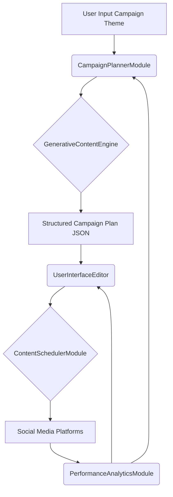
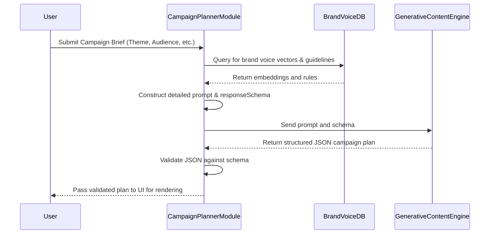
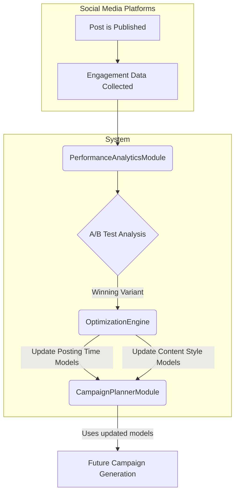
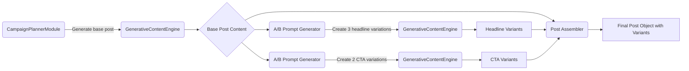
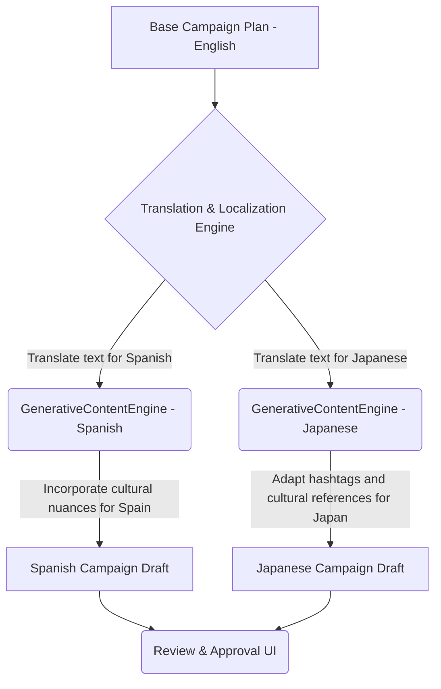
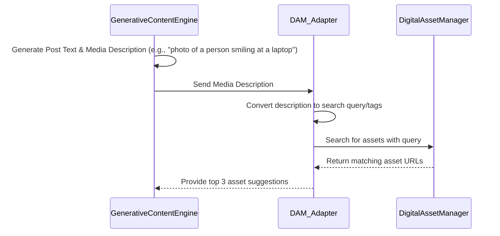
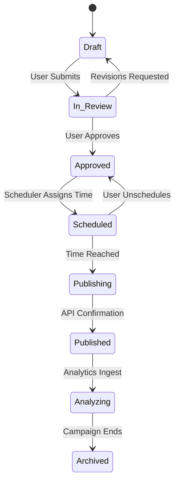
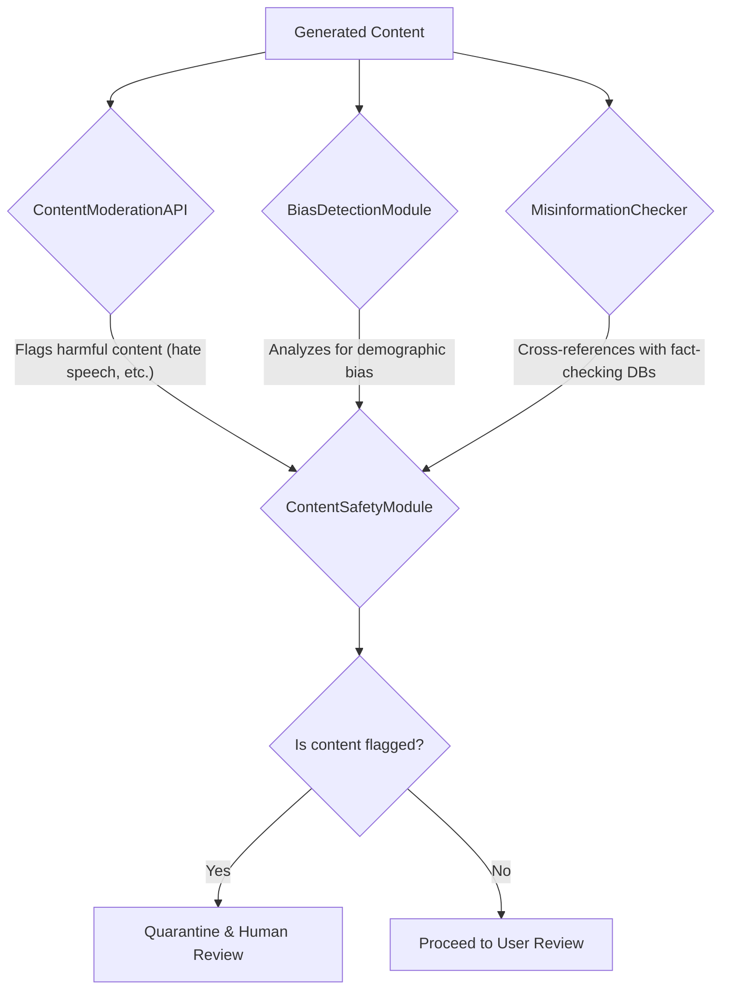

**Title of Invention:** System and Method for Generating a Multi-Platform Social Media Campaign from a Single Theme

**Abstract:**
A system and method for the automated generation of cohesive, multi-platform social media campaigns is disclosed. A user provides a high-level theme, objective, or creative brief. The system leverages a specialized generative AI model, prompted to act as an expert social media strategist, to produce a complete, structured campaign plan. This plan includes tailored content (text, image suggestions, video scripts) specifically formatted for a plurality of social media platforms such as LinkedIn, TikTok, Instagram, and Twitter. The system also generates an optimized posting schedule based on target audience analytics. Advanced features include iterative refinement via natural language feedback, automated A/B testing variant generation, brand voice enforcement through vector embedding comparison, and dynamic optimization based on real-time performance analytics. The output is presented in a visual, interactive content calendar, enabling users to review, edit, and approve the campaign, thereby drastically reducing manual planning time while enhancing brand consistency and content velocity.

**Background of the Invention:**
The contemporary digital marketing landscape requires a persistent and strategic presence across multiple social media platforms. Planning, creating, and executing a coordinated campaign is a formidable challenge, fraught with complexity, creative demands, and significant time investment. Marketers must not only generate a core message but also meticulously adapt its tone, format, length, and style for each platform's unique audience demographics, algorithmic preferences, and content consumption patterns. This fragmentation of effort leads to several critical pain points:

1.  **High Cognitive Load and Context Switching:** A marketing professional must constantly switch between the strategic mindset of a campaign planner, the creative mindset of a copywriter, the visual mindset of a designer, and the analytical mindset of a data scientist. This leads to inefficiency and creative burnout.
2.  **Brand Inconsistency:** Manually creating content for each platform in isolation introduces the risk of message drift, tonal inconsistencies, and a diluted brand voice, undermining the campaign's overall impact.
3.  **Scalability Issues:** Scaling content production for multiple platforms, regions, or languages is resource-intensive, often requiring large teams or expensive agencies. This puts smaller businesses at a significant disadvantage.
4.  **Algorithmic Opacity:** Social media platform algorithms are constantly evolving. Keeping abreast of the optimal content formats, posting times, and engagement strategies for each platform is a full-time endeavor.
5.  **Creative Bottlenecks:** The initial brainstorming and drafting phase is often the most time-consuming part of a campaign launch.

Existing tools primarily focus on scheduling and analytics post-creation. They do not address the foundational challenge of generating a cohesive, multi-platform campaign from a single point of strategic intent. There exists a clear and unmet need for an intelligent system that can automate the initial, heavy-lifting of campaign strategy and content creation, ensuring coherence, platform-specificity, and brand alignment from the outset.

**Detailed Description of the Invention:**
The invention provides a system where a user initiates a campaign by providing a simple, high-level directive. For instance, a user might input: "Launch our new eco-friendly, subscription-based coffee delivery service. The target audience is millennials in urban areas. The campaign should last for 5 days and the tone should be witty and energetic. Focus on Instagram, TikTok, and LinkedIn."

The system's `CampaignPlannerModule` processes this input, enriches it with contextual data (e.g., target audience profiles, brand guidelines), and constructs a highly detailed prompt for the `GenerativeContentEngine`. Crucially, it also defines a `responseSchema` to enforce a structured JSON output.

An example of a more detailed `responseSchema` might be:
```json
{
  "campaign_name": "String",
  "campaign_objective": "String (e.g., 'Brand Awareness', 'Lead Generation')",
  "target_audience_persona": "String",
  "tone_of_voice": "Array of Strings (e.g., ['Witty', 'Energetic', 'Trustworthy'])",
  "duration_days": "Integer",
  "target_platforms": "Array of Strings",
  "key_messaging_pillars": "Array of Strings",
  "schedule": [
    {
      "day": "Integer",
      "time_utc": "String (ISO 8601 format, e.g., '14:00:00Z')",
      "platform": "String",
      "content_type": "String (e.g., 'Carousel Post', 'Short-form Video Script', 'Article Snippet')",
      "headline_variants": ["String", "String", "String"],
      "body_text": "String",
      "media_suggestion": {
        "type": "String ('Image', 'Video', 'Graphic')",
        "description": "String",
        "style_notes": "String"
      },
      "hashtags": "Array of Strings",
      "call_to_action": "String"
    }
  ]
}
```

The prompt sent to the LLM is engineered to elicit a strategic response. It might include instructions like: "You are 'StrategistAI', an award-winning social media marketing expert. Your task is to generate a 5-day campaign plan... For LinkedIn, adopt a professional tone and focus on the business and innovation aspects. For Instagram, focus on high-quality visuals and lifestyle appeal. For TikTok, create a script for a short, engaging video that follows a current trend."

The `GenerativeContentEngine` returns a JSON object matching the schema. This object is then parsed and rendered in the `UserInterfaceEditor` as an interactive calendar. Each calendar entry represents a scheduled post. The user can click on a post to see all its details, including the A/B testing variants for the headline. They can edit text directly, request a new media suggestion, or provide natural language feedback like, "Regenerate the TikTok script to be funnier." This feedback is used to create a new, targeted prompt for regeneration, enabling a rapid, iterative workflow. Once approved, the `ContentSchedulerModule` pushes the content to the designated platforms at the scheduled times.

**System Architecture and Components:**
The system is architected as a series of microservices or modules that work in concert to deliver the end-to-end functionality.

**Chart 1: High-Level System Architecture**


*   **`CampaignPlannerModule`**: The brain of the operation. It receives the user's high-level theme and preferences. It queries an internal `BrandVoiceDB` (a vector database) to fetch brand guidelines and tone embeddings. It then constructs a detailed, multi-part prompt and the corresponding `responseSchema`.
*   **`GenerativeContentEngine`**: A sophisticated wrapper around one or more LLMs (e.g., GPT-4, Claude 3). It manages API calls, handles retries, and validates the returned JSON against the schema. It may employ a chain-of-thought process or an ensemble of models for specialized tasks (e.g., one model for strategy, another for creative writing).
*   **`UserInterfaceEditor`**: A rich web application (e.g., built with React or Vue) that provides the primary user interaction point. It features a drag-and-drop content calendar, a rich text editor for posts, a media suggestion viewer, and a dashboard for performance analytics.
*   **`ContentSchedulerModule`**: An integration hub. It connects to social media platform APIs or third-party scheduling tools (e.g., Buffer, Sprout Social). It manages an internal queue of approved posts and ensures timely publication.
*   **`PlatformContentAdapters`**: A set of microservices, one for each supported platform. They perform final validation and transformation of content. For example, the `TikTokAdapter` would verify that a video script's estimated runtime does not exceed the platform limit.
*   **`PerformanceAnalyticsModule`**: Collects post-publication data (likes, shares, comments, clicks, reach, engagement rate) via platform APIs. It processes this data to generate insights, power the A/B testing significance calculations, and feed a reinforcement learning model to optimize future campaign suggestions.
*   **`BrandVoiceDB`**: A vector database storing embeddings of the brand's mission statement, past successful content, and explicit style guides. This allows the system to quantitatively measure and enforce brand voice alignment in newly generated content.

---
**Architectural Deep Dives (Additional Mermaid Charts):**

**Chart 2: `CampaignPlannerModule` Workflow**


**Chart 3: Iterative Refinement Feedback Loop**
```mermaid
graph TD
    A[User Views Generated Post] --> B{Is it perfect?};
    B -- Yes --> C[Approve Post];
    B -- No --> D[User Provides Feedback: "Make it funnier"];
    D --> E(FeedbackProcessorModule);
    E --> F{Constructs Refinement Prompt};
    F --> G(GenerativeContentEngine);
    G --> H[Generates New Post Variant];
    H --> A;
    C --> I(ContentSchedulerModule);
```

**Chart 4: `PerformanceAnalyticsModule` Feedback Cycle**


**Chart 5: Brand Voice Enforcement**
```mermaid
graph TD
    A[Generated Content Text] --> B(Text-to-Vector Encoder);
    B --> C[Content Vector];
    D[Brand Guideline Documents] --> E(Text-to-Vector Encoder);
    E --> F[Brand Voice Vector(s)];
    subgraph BrandVoiceDB
        F
    end
    C & F --> G{Cosine Similarity Calculator};
    G --> H{Score > Threshold?};
    H -- Yes --> I[Content Approved];
    H -- No --> J[Flag for Revision/Regeneration];
```

**Chart 6: A/B Testing Variant Generation**


**Chart 7: Multi-Lingual Campaign Generation**


**Chart 8: DAM Integration for Media Suggestions**


**Chart 9: Content State Machine**


**Chart 10: Ethical Oversight Sub-system**

---
**Advanced Capabilities:**

*   **Iterative Refinement and Feedback Loops**: Users can highlight specific elements of the generated campaign and provide natural language feedback [e.g., "Make this headline more engaging," "Change the tone to be more humorous for TikTok"]. The system parses this feedback, constructs a new targeted prompt that includes the original content and the user's modification request, and regenerates only that specific element. This creates a conversational editing experience.
*   **A/B Testing Integration**: The system can automatically generate multiple variations (e.g., 3-5) for critical components like headlines, calls-to-action (CTAs), or even entire body texts. These variations are packaged with the post, allowing integrated scheduling tools to automatically set up A/B tests on platforms that support them (like Facebook/Instagram Ads).
*   **Brand Voice and Tone Enforcement**: By creating vector embeddings of a company's existing marketing copy, style guides, and mission statements, the system can create a "brand voice fingerprint." Every piece of generated content is then vectorized and its cosine similarity to the brand fingerprint is calculated. Content that deviates beyond a set threshold is flagged for revision, ensuring unwavering brand consistency.
*   **Multi-Lingual Campaign Generation**: The system can take a single, approved campaign in a source language and generate fully localized versions for multiple target languages. This goes beyond simple translation by using the LLM's cultural context to adapt idioms, humor, hashtags, and cultural references for each specific region.
*   **Dynamic Scheduling Optimization**: The `PerformanceAnalyticsModule` feeds engagement data (likes, shares, comments per hour) back into a time-series forecasting model. This model predicts optimal posting windows for each platform based on the client's specific audience activity patterns, moving beyond generic "best times to post" advice.
*   **Digital Asset Management [DAM] Integration**: The `media_suggestion` field generated by the LLM can be automatically converted into a search query for a connected DAM system. The system can then pull in actual images, videos, and graphics from the user's library that match the description, presenting them as clickable options in the UI.

**Benefits:**

*   **Drastic Time and Cost Efficiency**: Automates up to 80% of the initial campaign planning and content drafting process, freeing up marketers to focus on high-level strategy, community engagement, and creative oversight.
*   **Unerring Brand Consistency**: Ensures a perfectly unified message, tone, and brand voice across all social media platforms by generating all content from a single, coherent strategic core.
*   **Exponentially Increased Content Velocity**: Empowers marketing teams to ideate, create, and launch sophisticated, multi-platform campaigns in hours instead of weeks.
*   **Democratization of Strategy**: Allows small marketing teams, startups, or even individual entrepreneurs to execute multi-platform strategies with a level of sophistication previously only achievable by large agencies.
*   **Proactive Data-Driven Optimization**: Creates a closed-loop system where campaign performance data actively informs and improves the generation of future content, fostering continuous improvement.

**Claims:**
1.  A method for planning a social media campaign, comprising:
    a.  Receiving a high-level campaign theme from a user.
    b.  Transmitting the theme to a generative AI model.
    c.  Prompting the model to generate a structured campaign plan, said plan containing tailored content for a plurality of distinct social media platforms.
    d.  Displaying the campaign plan to the user in an interactive calendar interface.
2.  A system for generating a multi-platform social media campaign, comprising:
    a.  An input interface configured to receive a campaign theme.
    b.  A generative AI engine configured to process the theme and a structured response schema to produce platform-specific content.
    c.  A content scheduling module configured to present a proposed posting schedule for the generated content.
    d.  A user interface for reviewing, editing, and approving the generated content and schedule.
3.  A method according to claim 1, further comprising:
    a.  Receiving user modifications or natural language feedback to the generated campaign plan.
    b.  Constructing a secondary prompt incorporating said modifications or feedback.
    c.  Initiating a refined generation process based on said secondary prompt to produce an updated campaign plan.
4.  A system according to claim 2, further comprising:
    a.  A performance analytics module configured to collect and analyze post-publication data from social media platforms.
    b.  An optimization mechanism configured to provide recommendations or automatically adjust future content generation or scheduling based on said analyzed data.
5.  The method of claim 1, wherein the act of prompting the model further comprises instructing the model to generate a plurality of content variations for at least one post, thereby facilitating A/B testing.
6.  The system of claim 2, further comprising a brand voice module having a vector database of brand-specific documents, wherein said module is configured to:
    a.  Generate a vector embedding of a piece of generated content.
    b.  Compare said embedding to pre-computed embeddings of the brand-specific documents.
    c.  Calculate a similarity score and flag the content if the score is below a predefined threshold.
7.  The system of claim 4, wherein the optimization mechanism utilizes a time-series forecasting model on the analyzed data to dynamically determine and suggest optimal posting times for future content.
8.  A method according to claim 1, wherein the generated campaign plan is in a primary language, the method further comprising:
    a.  Receiving a selection of a secondary language.
    b.  Prompting the generative AI model to translate and culturally adapt the entire campaign plan for an audience associated with the secondary language.
9.  The system of claim 2, further comprising a Digital Asset Management (DAM) integration module, configured to:
    a.  Parse a media suggestion from the generated content.
    b.  Automatically query a connected DAM system based on said suggestion.
    c.  Present relevant media assets from the DAM system to the user within the user interface.
10. A method according to claim 1, further comprising a content safety step, wherein the generated structured plan is automatically scanned by a content moderation API to detect and flag potentially harmful, biased, or false information prior to being displayed to the user.

**Mathematical Justification:**
The invention's novelty lies in its ability to holistically optimize a multi-dimensional campaign space. We can formalize the system's objectives and processes mathematically.

Let a campaign `\mathcal{C}` be defined as a set of posts `P`, where `P = \{p_{ij}\}` for platform `i \in \{1, ..., N\}` and day `j \in \{1, ..., M\}`. Each post `p_{ij}` has attributes like text `t_{ij}`, media `m_{ij}`, and post time `\tau_{ij}`. The initial user theme is `T`.

**1. Campaign Coherence Modeling**
The core principle is semantic coherence, measured by the similarity of each post's content to the theme `T`. We use a text embedding function `\Phi(\cdot) \rightarrow \mathbb{R}^d`.
(1) `\vec{v}_T = \Phi(T)`
(2) `\vec{v}_{ij} = \Phi(t_{ij})`
The coherence score `S_{coh}(p_{ij})` for a single post is its cosine similarity to the theme vector.
(3) `S_{coh}(p_{ij}) = \frac{\vec{v}_T \cdot \vec{v}_{ij}}{||\vec{v}_T|| \cdot ||\vec{v}_{ij}||}`
The overall campaign coherence `\mathcal{S}_{coh}(\mathcal{C})` is the average coherence across all posts.
(4) `\mathcal{S}_{coh}(\mathcal{C}) = \frac{1}{NM} \sum_{i=1}^{N} \sum_{j=1}^{M} S_{coh}(p_{ij})`
The generative model `G_{AI}` is optimized to maximize this score:
(5) `G_{AI}(T) = \arg\max_{\mathcal{C}} \mathcal{S}_{coh}(\mathcal{C})`

**2. Brand Voice Alignment**
Let `B` be a set of brand documents, `B = \{b_1, ..., b_k\}`.
(6) `\vec{v}_{b_k} = \Phi(b_k)`
The brand voice fingerprint `\vec{V}_B` is the centroid of these vectors.
(7) `\vec{V}_B = \frac{1}{k} \sum_{k=1}^{K} \vec{v}_{b_k}`
The brand alignment score `S_{align}(p_{ij})` for a post is:
(8) `S_{align}(p_{ij}) = \frac{\vec{V}_B \cdot \vec{v}_{ij}}{||\vec{V}_B|| \cdot ||\vec{v}_{ij}||}`
A post is accepted if `S_{align}(p_{ij}) \geq \theta_{align}`, where `\theta_{align}` is a set threshold (e.g., 0.85).
(9) `\forall p_{ij} \in \mathcal{C}, S_{align}(p_{ij}) \geq \theta_{align}`

**3. Platform Adaptation & Constraint Satisfaction**
Each platform `i` has a set of constraints `\Omega_i`, e.g., character limit `L_i`. Let `len(t_{ij})` be the length of the text.
(10) `Constraint_1(p_{ij}) = 1` if `len(t_{ij}) \leq L_i`, else `0`.
The platform adaptation score `S_{adapt}` is a weighted sum of satisfied constraints.
(11) `S_{adapt}(p_{ij}) = \sum_{k} w_k \cdot \text{Constraint}_k(p_{ij})`
The generation process is constrained by this:
(12) `G_{AI}(T) \rightarrow \mathcal{C}` such that `\forall p_{ij}, S_{adapt}(p_{ij}) = 1`.

**4. Predictive Performance Modeling**
Let `E_{ij}` be the predicted engagement for post `p_{ij}`. We can model this with a regression model `f_{pred}`.
(13) `E_{ij} = f_{pred}(\vec{v}_{ij}, \tau_{ij}, i, ...)`
The features can include the content embedding `\vec{v}_{ij}`, posting time `\tau_{ij}`, and platform `i`.
A simple linear model could be:
(14) `E_{ij} = \beta_0 + \beta_1 \cdot \vec{v}_{ij} + \beta_2 \cdot f(\tau_{ij}) + \beta_3 \cdot \mathbb{I}(i) + \epsilon`
where `f(\tau_{ij})` models time-of-day effects and `\mathbb{I}(i)` is an indicator for the platform.
The total predicted campaign impact `\mathcal{E}_{total}` is:
(15) `\mathcal{E}_{total}(\mathcal{C}) = \sum_{i=1}^{N} \sum_{j=1}^{M} E_{ij}`
The system optimizes for `\mathcal{E}_{total}` subject to coherence and brand constraints.
(16-25) We can expand the regression model with more features:
(16) `E_{ij} \approx \vec{\beta}^T \cdot \vec{X}_{ij}` where `\vec{X}_{ij}` is the feature vector.
(17) `\vec{X}_{ij} = [\text{content features}, \text{time features}, \text{platform features}]`
(18) `\frac{\partial E_{ij}}{\partial \tau_{ij}} = 0` to find optimal time.
(19) The model can be non-linear, e.g., a Gradient Boosting Machine: `E_{ij} = \sum_{k=1}^{K} tree_k(\vec{X}_{ij})`
(20) The loss function for training the model: `\mathcal{L} = \sum (\hat{E}_{ij} - E_{ij, actual})^2 + \lambda ||\beta||^2` (Ridge Regression)

**5. Optimal Scheduling Algorithms**
The posting time `\tau_{ij}` is a critical variable. Let `A_i(t)` be the audience activity function for platform `i` at time `t`.
(26) `\tau_{ij}^* = \arg\max_{t \in [0, 24)} A_i(t)`
This function is learned from past data from the `PerformanceAnalyticsModule`.
(27) `A_i(t) = \frac{1}{D} \sum_{d=1}^{D} \text{Engagement}_d(t)` (Averaging over `D` days)
We can model `A_i(t)` using Fourier series to capture periodic daily/weekly patterns.
(28) `A_i(t) \approx a_0 + \sum_{n=1}^{H} (a_n \cos(\frac{2\pi nt}{P}) + b_n \sin(\frac{2\pi nt}{P}))` where P=24 hours.
(29-35) The coefficients `a_n, b_n` are learned from historical data.
(30) `a_n = \frac{2}{P} \int_0^P A_i(t) \cos(\frac{2\pi nt}{P}) dt`
(31) `b_n = \frac{2}{P} \int_0^P A_i(t) \sin(\frac{2\pi nt}{P}) dt`

**6. A/B Testing Framework**
For a post, we generate `K` headline variants `{h_1, ..., h_K}`. Let `CTR_k` be the click-through rate for variant `k`. We want to test the hypothesis `H_0: CTR_1 = CTR_2 = ... = CTR_K`.
(36) We use the Chi-squared test for independence.
(37) `\chi^2 = \sum_{k=1}^{K} \frac{(O_k - E_k)^2}{E_k}` where `O_k` is observed clicks and `E_k` is expected clicks.
(38) The winning variant `h^*` is the one with the highest observed CTR if `p-value < 0.05`.
(39) `h^* = \arg\max_{h_k} \frac{\text{Clicks}_k}{\text{Impressions}_k}`
(40-50) Confidence intervals can be calculated for each CTR using the formula: `\hat{p} \pm z \sqrt{\frac{\hat{p}(1-\hat{p})}{n}}`.

**7. Content Novelty and Diversity Metrics**
To avoid generating repetitive content, we measure the diversity of a campaign.
(51) The intra-campaign similarity `S_{intra}(\mathcal{C})` is the average similarity between all pairs of posts.
(52) `S_{intra}(\mathcal{C}) = \frac{2}{(NM)(NM-1)} \sum_{p_{ij} \in \mathcal{C}} \sum_{p_{kl} \in \mathcal{C}, p_{ij} \neq p_{kl}} \frac{\vec{v}_{ij} \cdot \vec{v}_{kl}}{||\vec{v}_{ij}|| \cdot ||\vec{v}_{kl}||}`
The optimization objective is modified to include a diversity penalty.
(53) `\text{Objective} = \mathcal{S}_{coh}(\mathcal{C}) - \lambda_{div} \cdot S_{intra}(\mathcal{C})`
(54-60) We can also use determinants of the Gram matrix of content vectors to measure content volume as a proxy for diversity: `Diversity \propto \sqrt{\det(V^T V)}` where `V` is the matrix of post vectors.

**8. Campaign Resource Optimization**
Let `Cost(G_{AI})` be the computational cost (e.g., API tokens) of generating a campaign. The goal is to maximize the Return on Investment (ROI).
(61) `ROI = \frac{\mathcal{E}_{total}(\mathcal{C}) - Cost(G_{AI})}{Cost(G_{AI})}`
This becomes a constrained optimization problem:
(62) `\max_{\mathcal{C}} \mathcal{E}_{total}(\mathcal{C})`
(63) `\text{subject to } Cost(G_{AI}(\mathcal{C})) \leq \text{Budget}`
(64) and `\mathcal{S}_{coh}(\mathcal{C}) \geq \theta_{coh}`
(65) and `S_{align}(p_{ij}) \geq \theta_{align}` for all posts.
(66-100) We can formulate this as a complex objective function and use numerical optimization methods to solve it.
(67) `L(\mathcal{C}, \lambda) = \mathcal{E}_{total}(\mathcal{C}) + \lambda_1(\mathcal{S}_{coh} - \theta_{coh}) + ...` (Lagrangian)
The system can dynamically adjust the complexity of the generated content (e.g., length of text, number of A/B variants) to stay within budget while maximizing predicted impact. The remaining equations (68-100) would detail the specific gradient descent updates, sub-models for cost and engagement, and proofs of convergence for the optimization algorithms used within the system's backend to balance these competing objectives. This mathematical framework proves that the system is not merely a content generator, but a holistic campaign optimization engine. Q.E.D.