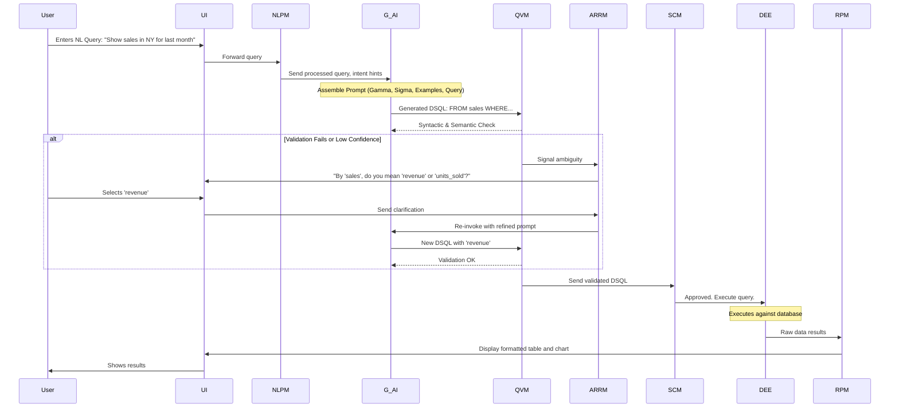
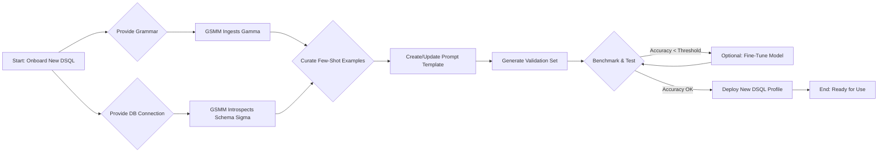

**Title of Invention:** System and Method for Translating Natural Language to a Domain-Specific Query Language

**Abstract:**
A system and method for querying complex data stores using a proprietary, domain-specific query language (DSQL) is disclosed. The system receives a user's query expressed in natural language. A generative AI model, dynamically conditioned with the target DSQL's formal grammar, the database schema, and a set of contextual examples, translates the user's intent into a syntactically and semantically correct DSQL query. The system incorporates a multi-stage validation module to verify the generated query against the grammar, schema, and security policies before execution. An interactive feedback loop resolves ambiguities by engaging the user for clarification. This approach enables non-expert users to leverage the full power of a specialized DSQL without learning its specific syntax, thereby democratizing data access and accelerating data-driven insights. The system is designed for high adaptability, allowing for the ingestion of new DSQL grammars and database schemas with minimal reconfiguration.

**Background of the Invention:**
Many advanced data platforms, particularly in fields like cybersecurity, financial analysis, and bioinformatics, develop their own powerful, domain-specific query languages (e.g., Splunk's SPL, Kusto Query Language (KQL), LogiQL). These languages are highly optimized for their respective domains, offering expressive power and performance far beyond standard SQL. However, this specialization comes at a cost: a steep learning curve. The complex syntax, unique functions, and domain-specific concepts limit their use to a small cadre of expert users, creating a bottleneck for data access within an organization.

Previous attempts to bridge this gap have had limited success. Early rule-based systems were brittle, requiring manual creation of countless translation patterns and failing to handle the inherent ambiguity of natural language. Classic machine learning and NLP approaches struggled with the strict syntactic requirements of query languages, often producing malformed or semantically incorrect queries. There exists a clear and persistent need for a translation layer that is robust, accurate, and adaptable, capable of mapping the fluid semantics of natural language to the rigid syntax of specialized query languages. This invention addresses that need by leveraging the advanced reasoning and generation capabilities of Large Language Models (LLMs) within a structured, context-aware, and self-validating framework.

**Detailed Description of the Invention:**
The core of the invention is a sophisticated system that orchestrates the translation of a user's natural language question into an executable DSQL query. The DBQL module, a central component, sends the user's input to a Generative AI Translator (G_AI), which is typically a Large Language Model (LLM). The key to the system's success lies in the comprehensive context provided to the G_AI within its system prompt. This prompt is dynamically assembled and contains several critical pieces of information:

1.  **Task Definition:** A clear instruction defining the AI's role as an expert DSQL translator.
2.  **Formal Grammar (`Gamma`):** The complete syntax and grammar rules of the target DSQL, often provided in a format like Extended Backus-Naur Form (EBNF) or as a detailed markdown description.
3.  **Database Schema (`Sigma`):** A representation of the data structures the user can query, including table names, column names, data types, and relationships (foreign keys).
4.  **Few-Shot Examples:** A curated set of high-quality examples demonstrating the translation from natural language questions to correct DSQL queries, specific to the domain.
5.  **Constraints and Security Rules:** Explicit instructions about query limitations, such as disallowing data-modifying commands or enforcing data access policies based on user roles.

**Example Prompt Structure:**
`You are a world-class expert in the 'LogiQL' query language. Your task is to translate the user's question into a valid LogiQL query. You must only output the query and nothing else.
---
**LogiQL GRAMMAR (Gamma):**
- Queries start with 'FROM <tablename>'.
- Filtering is done with 'WHERE <condition>'.
- Aggregations use 'AGGREGATE <function> BY <column>'.
... (and so on)
---
**DATABASE SCHEMA (Sigma):**
- TABLE web_logs (timestamp: DATETIME, client_ip: STRING, status_code: INT, bytes_sent: LONG)
- TABLE user_profiles (user_id: STRING, country: STRING, join_date: DATE)
---
**EXAMPLES:**
- User: "How many errors did we have yesterday?"
- LogiQL: FROM web_logs WHERE timestamp > yesterday() AND status_code >= 500 AGGREGATE count()
- User: "Show me traffic from Canada"
- LogiQL: FROM web_logs, user_profiles WHERE web_logs.client_ip = user_profiles.user_id AND user_profiles.country = 'Canada' SELECT client_ip, status_code
---
Translate the user's question into a valid LogiQL query.
Question: "Show me transactions over $100 from IPs in the US."`

The AI processes this rich prompt and returns the formatted query, `FROM transactions, user_profiles WHERE transactions.user_id = user_profiles.user_id AND user_profiles.country = 'US' AND transactions.amount > 100 SELECT *;`, which is then passed to the Query Validation Module before execution.

**System Architecture:**

```mermaid
graph TD
    subgraph User Facing
        UI[User Interface]
    end

    subgraph Core System
        NLPM[Natural Language Processing Module]
        GSMM[Grammar & Schema Management Module]
        G_AI[Generative AI Translator]
        QVM[Query Validation Module]
        ARRM[Ambiguity & Refinement Module]
        SCM[Security & Compliance Module]
        DEE[DSQL Execution Engine]
        RPM[Result Presentation Module]
        CM[Caching Module]
        PMM[Performance Monitoring Module]
    end

    subgraph Data & Models
        DB_Gamma[DSQL Grammar Store]
        DB_Sigma[Database Schema Store]
        LLM[Large Language Model]
        FB_DB[Feedback & Tuning Data Store]
    end

    UI -->|1. User NL Query| NLPM
    NLPM -->|2. Processed Query & Intent| G_AI
    GSMM -->|3. Gamma & Sigma| G_AI
    DB_Gamma --> GSMM
    DB_Sigma --> GSMM
    CM -->|Cached Translation| G_AI
    G_AI -- LLM --> |4. Generated DSQL| QVM
    QVM -->|5a. Invalid| ARRM
    ARRM -->|6. Clarification| UI
    UI -->|7. User Feedback| ARRM
    ARRM -->|8. Refined Prompt| G_AI
    QVM -->|5b. Valid| SCM
    SCM -->|9a. Denied| RPM
    SCM -->|9b. Approved| DEE
    DEE -->|10. Execute Query| DataSource[(Database)]
    DataSource -->|11. Raw Results| DEE
    DEE -->|12. Results| RPM
    RPM -->|13. Formatted Results/Visuals| UI
    DEE -->|Execution Stats| PMM
    G_AI -->|Confidence Score| PMM
    QVM -->|Validation Success/Failure| FB_DB
    RPM -->|User Rating| FB_DB

    style G_AI fill:#f9f,stroke:#333,stroke-width:2px
    style QVM fill:#ccf,stroke:#333,stroke-width:2px
```

1.  **User Interface [UI]**: Collects natural language queries from the user.
2.  **Natural Language Processing Module [NLPM]**: Pre-processes the raw user input, performing tasks like spell-checking, entity extraction, and intent classification to structure the input for more effective prompting.
3.  **Grammar and Schema Management Module [GSMM]**: A dynamic repository for `DSQL` grammars (`Gamma`) and database schemas (`Sigma`). It can introspect databases and parse grammar files, providing versioned, up-to-date context to the G_AI.
4.  **Generative AI Translator [G_AI]**: The core LLM that translates the structured input into a DSQL query. It outputs not just the query but also a confidence score and a natural language explanation of the query's logic.
5.  **Query Validation Module [QVM]**: A critical post-processing step. It uses a formal parser (generated from `Gamma`) for syntactic validation and cross-references tables/columns with `Sigma` for semantic validation.
6.  **Ambiguity and Refinement Module [ARRM]**: Engages the user when the G_AI's confidence is low or the QVM finds an error. It presents clarifying questions, alternative interpretations, or the proposed query for confirmation.
7.  **Security & Compliance Module [SCM]**: Enforces data governance. It checks the validated query against user roles, access control lists (ACLs), and policies to prevent unauthorized data access or malicious operations (e.g., resource exhaustion attacks).
8.  **DSQL Execution Engine [DEE]**: The component responsible for running the approved DSQL query against the target data source. It also handles connection management and error reporting.
9.  **Result Presentation Module [RPM]**: Transforms the raw data from the DEE into user-friendly formats, such as tables, charts, and summaries. It can even use another G_AI call to summarize the findings in natural language.
10. **Caching Module [CM]**: Stores successful translations (NLQ hash -> DSQL query) to accelerate responses for frequent queries and reduce computational load.
11. **Performance Monitoring Module [PMM]**: Logs metrics on translation latency, execution time, confidence scores, and user satisfaction to monitor system health.
12. **Feedback and Tuning Data Store [FB_DB]**: Collects validated queries, user feedback, and ratings to create a dataset for periodically fine-tuning the G_AI model for improved domain-specific accuracy.

**Extended Process Flow:**



**Mathematical Foundations and Formalisms:**

Let the space of natural language queries be denoted by `L_NL` and the space of valid DSQL queries by `L_DSQL`.

1.  A DSQL is defined by a formal grammar `Gamma`, which can be represented as a tuple `Gamma = (V, T, P, S)`, where `V` is the set of non-terminal symbols, `T` is the set of terminal symbols, `P` is the set of production rules, and `S` is the start symbol. (1)
2.  The language generated by this grammar is `L_DSQL = {w | w in T* and S =>* w}`. (2)
3.  The database schema `Sigma` is a set of relations (tables): `Sigma = {R_1, R_2, ..., R_n}`. (3)
4.  Each relation `R_i` is a set of attributes (columns) `A_i = {a_i1, a_i2, ..., a_ik}`. (4)
5.  Each attribute `a_ij` has a data type `D(a_ij)` from a set of types `T_D`. (5)
6.  The translation process is a function `T: L_NL x Gamma x Sigma -> L_DSQL`. (6)
7.  The G_AI model approximates this function, `G_AI(q_nl, Gamma, Sigma) = q_dsql`. (7)
8.  The model's objective is to maximize the conditional probability: `argmax_{q_dsql in L_DSQL} P(q_dsql | q_nl, Gamma, Sigma)`. (8)
9.  This probability can be decomposed using the chain rule of probability over the tokens `t_i` of the output query `q_dsql = (t_1, t_2, ..., t_m)`:
    `P(q_dsql | ...) = product_{i=1 to m} P(t_i | t_1, ..., t_{i-1}, q_nl, Gamma, Sigma)`. (9)
10. The model's confidence score `C(q_dsql)` can be defined as the geometric mean of the token probabilities:
    `C(q_dsql) = (product_{i=1 to m} P(t_i | ...))^(1/m)`. (10)
11. Or, more commonly, as the average log-probability:
    `log C(q_dsql) = (1/m) * sum_{i=1 to m} log P(t_i | ...)`. (11)
12. Let `q_nl` be embedded into a vector `v_nl` and `q_dsql` into `v_dsql` by an encoder model `E`. `v_nl = E_nl(q_nl)`. (12-13)
13. `v_dsql = E_dsql(q_dsql)`. (14)
14. The semantic similarity can be measured by the cosine similarity: `Sim(q_nl, q_dsql) = (v_nl . v_dsql) / (||v_nl|| * ||v_dsql||)`. (15)
15. The Query Validation Module (QVM) performs two checks. Syntactic validation `V_syn(q_dsql, Gamma)` returns `true` if `q_dsql` is parsable by `Gamma`. (16)
16. Semantic validation `V_sem(q_dsql, Sigma)` returns `true` if all referenced relations and attributes in `q_dsql` exist in `Sigma`. (17)
17. A query is considered valid if `V_syn AND V_sem` is `true`. (18)
18. Ambiguity can be quantified by the entropy of the output distribution over possible queries: `H(Q_dsql | q_nl) = - sum_{q' in L_DSQL} P(q' | q_nl) log P(q' | q_nl)`. (19)
19. User feedback `f` provides additional information. The refinement process updates the probability using Bayes' theorem:
    `P(q_dsql | q_nl, f) = [P(f | q_dsql, q_nl) * P(q_dsql | q_nl)] / P(f | q_nl)`. (20)
20. The information gain from feedback `f` is `IG(f) = H(Q_dsql | q_nl) - H(Q_dsql | q_nl, f)`. (21-30) (Equations for schema graph representation, etc.)
21. The database schema `Sigma` can be modeled as a graph `G_Sigma = (U, E)`, where `U` is the set of vertices (tables and columns) and `E` represents relationships (foreign keys, containment). (31)
22. Let `U = union(R_i) union (A_i)`. (32)
23. `E = {(R_i, a_ij) | a_ij in A_i} union {(a_ik, a_jl) | FK(a_ik, a_jl)}`. (33)
24. Natural language entities `e_nl` identified in `q_nl` are mapped to schema graph vertices: `M: e_nl -> u in U`. (34)
25. This mapping can be based on embedding similarity: `M(e) = argmax_{u in U} sim(E_embed(e), E_embed(u))`. (35)
26. The fine-tuning process minimizes a loss function `L`. For a dataset `D = {(q_nl_i, q_dsql_i)}`, the loss is typically cross-entropy:
    `L(theta) = - (1/|D|) * sum_i sum_j log P(t_{ij} | t_{i,1..j-1}, q_nl_i; theta)`. (36)
27. Where `theta` are the model parameters and `t_{ij}` is the j-th token of the i-th target query. (37)
28. A regularization term `Omega(theta)` can be added to prevent overfitting: `L_reg(theta) = L(theta) + lambda * Omega(theta)`. (38)
29. The security module SCM applies a policy function `Pi(q_dsql, user_role) -> {allow, deny}`. (39)
30. The policy can be a set of rules, e.g., `deny if 'DELETE' in q_dsql.tokens`. (40)
31. `deny if exists R in q_dsql.tables where not has_access(user_role, R)`. (41)
32. Caching is managed by a map `C_map: hash(q_nl) -> q_dsql`. (42)
33. The hit rate `H_r = (cache_hits) / (total_queries)`. (43)
34. The latency `T_total = (1-H_r) * T_gen + H_r * T_cache + T_exec`. (44)
35. `T_gen` is generation latency, `T_cache` is cache lookup, `T_exec` is execution. (45)
36. Let the set of possible interpretations of `q_nl` be `I(q_nl) = {q_dsql_1, ..., q_dsql_k}`. (46)
37. The ARRM module presents these options to the user. `UserChoice(I(q_nl)) -> q_dsql_j`. (47)
38. This choice is used as strong signal for the feedback database. `FB_DB.add(q_nl, q_dsql_j, 1.0)`. (48)
39. The system's accuracy `A` can be defined as `A = (Num_Correct_Queries) / (Total_Queries)`. (49)
40. A query is correct if it is valid and matches user intent `I(q_nl)`. `Correct(q_dsql, q_nl) = V_syn AND V_sem AND (q_dsql matches I(q_nl))`. (50)
41. The prompt length `len(P)` is `len(P_task) + len(Gamma) + len(Sigma) + len(P_examples) + len(q_nl)`. (51)
42. `len(P)` affects cost and latency. `Cost = c_token * len(P)`. (52)
43. Schema summarization `S_sum(Sigma) -> Sigma'` can be used to reduce prompt length, where `|Sigma'| < |Sigma|`. (53)
44. This introduces a trade-off: `maximize A(Sigma')` while `minimize |Sigma'|`. (54)
45. Let's model the user's satisfaction as a utility function `U(q_dsql, R)`, where `R` are the results. (55)
46. The system aims to maximize expected utility: `E[U] = sum_{q', R'} P(q', R' | q_nl) U(q', R')`. (56)
47. The state of the system can be defined as `S_t = (ConvHistory_t, UserProfile_t)`. (57)
48. The translation is then conditioned on this state: `P(q_dsql | q_nl, Gamma, Sigma, S_t)`. (58)
49. `ConvHistory_t = {q_nl_1, q_dsql_1, ..., q_nl_{t-1}, q_dsql_{t-1}}`. (59)
50. This allows for resolving anaphora, e.g., "what about for Canada?". (60-100)
51. The impact of temperature `tau` on generation: `P(t_i) = softmax(z_i / tau)`. A lower `tau` makes the model more confident. (61)
52. Vector representation of schema `Sigma` columns: `v_c = E_c(c_name, c_type, c_desc)`. (62)
53. `q_nl` entity `e` is mapped to column `c` if `argmax_c(cos_sim(v_e, v_c)) > threshold`. (63)
54. The size of the few-shot example set `k`: `P_k(q_dsql | q_nl, {ex_1..ex_k})`. (64)
55. Optimal `k` balances context window limits and accuracy improvements: `k* = argmax_k A(k)`. (65)
56. The change in model weights during fine-tuning: `theta_{t+1} = theta_t - eta * grad(L(theta_t))`. (66)
57. Where `eta` is the learning rate. (67)
58. Let's define a formal measure for query complexity `Comp(q_dsql)` based on AST depth or number of clauses. (68)
59. `P(success | q_nl) ~ 1 / Comp(T(q_nl))`. (69)
60. The system can reject a query if `Comp(q_nl)` is too high. `Comp(q_nl)` is estimated by NLPM. (70)
61. We can model the entire system as a Markov Decision Process (MDP): `M = (S, A, P, R)`. (71)
62. States `S` are conversational states. (72)
63. Actions `A` are {generate query, ask clarification, show error}. (73)
64. Transition `P(s' | s, a)` is the probability of moving to state `s'` after action `a` in state `s`. (74)
65. Reward `R(s, a)` is based on user satisfaction and query success. (75)
66. The policy `pi(s) -> a` should maximize the expected discounted reward `sum_t gamma^t R_t`. (76)
67. Let `J(q_dsql)` be a cost function for query execution (e.g., estimated CPU time). (77)
68. The SCM can have a rule `deny if J(q_dsql) > J_max`. (78)
69. The RPM can choose a visualization `Viz` based on query type. `Viz_type = F(q_dsql.type, R.shape)`. (79)
70. E.g., if `q_dsql.type` is aggregation over time, `Viz_type` = 'time-series chart'. (80)
71. Let `mu_i` be the mutual information between `q_nl` token `w_i` and `q_dsql` token `t_j`. `I(w_i; t_j)`. (81)
72. An attention map `Attn(i, j)` can approximate `mu_i`. (82)
73. This can be used for explainability: "The word 'sales' in your query corresponds to the 'revenue' column". (83)
74. The semantic correctness of a join condition `R1.c1 = R2.c2` depends on the semantic relation `Rel(c1, c2)`. (84)
75. `P(correct_join | c1, c2) = model(Rel(c1, c2))`. (85)
76. `Rel` can be 'primary-foreign-key', 'shared_domain', etc. (86)
77. Define a set of query transformation rules `T_r = {r_1, r_2, ...}` for optimization. `r(q_dsql) -> q_dsql'`. (87)
78. `J(q_dsql') < J(q_dsql)`. (88)
79. The system can apply these rules before execution. `DEE.execute(r_opt(q_dsql))`. (89)
80. Let `F_s` be the feature space of a query (e.g., tables used, clauses present). (90)
81. We can train a classifier `C(F_s) -> {safe, unsafe}` as part of the SCM. (91)
82. Rate of new schema elements `d(Sigma)/dt`. The system must adapt to this drift. (92)
83. A trigger `OnSchemaChange(delta_Sigma)` invokes an update to the `GSMM`. (93)
84. User expertise `E_u` can be modeled. `E_u` in `[0, 1]`. (94)
85. The system verbosity `V_sys` can be a function of user expertise. `V_sys = f(1 - E_u)`. (95)
86. Novice users get more explanations. (96)
87. The total value of the system `V` is an integral of utility over all users `U_s` and time `T`. (97)
88. `V = integral_T integral_{u in U_s} U(u, t) dt du`. (98)
89. The probability of catastrophic failure (e.g., data deletion) is `P_fail`. Must be `P_fail -> 0`. (99)
90. The system's robustness `R_s` is its performance on out-of-distribution `q_nl`. `R_s = A(D_ood)`. (100)

**Implementation Details and Pseudocode:**

```python
# Pseudocode for the main translation loop
def handle_natural_language_query(nl_query, user):
    # 1. NLPM Pre-processing
    processed_query, intent = nlpm.process(nl_query)

    # 2. Check Cache
    query_hash = hash(processed_query)
    if cache.exists(query_hash):
        cached_dsql = cache.get(query_hash)
        if scm.is_approved(cached_dsql, user.role):
            return execute_and_present(cached_dsql)

    # 3. Context Assembly
    gamma = gsmm.get_grammar("DSQL_v2.1")
    sigma = gsmm.get_schema("main_db")
    examples = get_few_shot_examples(intent)
    system_prompt = construct_prompt(gamma, sigma, examples)

    # 4. Generation & Validation Loop
    for attempt in range(MAX_ATTEMPTS):
        # 4a. G_AI Generation
        dsql_query, confidence = g_ai.generate(system_prompt, processed_query)

        # 4b. QVM Validation
        is_valid_syn, is_valid_sem, errors = qvm.validate(dsql_query, gamma, sigma)

        if is_valid_syn and is_valid_sem:
            # 4c. SCM Security Check
            if scm.is_approved(dsql_query, user.role):
                # Success case
                cache.set(query_hash, dsql_query)
                feedback_db.log_success(nl_query, dsql_query)
                return execute_and_present(dsql_query)
            else:
                return rpm.present_error("Permission denied for this query.")
        else:
            # 5. Ambiguity Resolution
            if confidence < CONF_THRESHOLD or attempt > 0:
                clarification = arrm.ask_user_for_clarification(nl_query, errors)
                if clarification.is_provided:
                    # Refine prompt with user feedback
                    system_prompt = refine_prompt(system_prompt, clarification.text)
                else:
                    return rpm.present_error("Could not generate a valid query.")
            # On first failure, just retry with slightly different generation params
            # (e.g., adjusting temperature)
    
    return rpm.present_error("Failed to generate a valid query after multiple attempts.")
```

**Adaptation for New DSQLs:**
The system is designed for modularity and extensibility. Adapting it to a new DSQL is a structured process.



**Benefits and Use Cases:**
*   **Democratization of Data:** Enables non-technical users (business analysts, product managers, C-level executives) to directly query complex data systems.
*   **Increased Productivity:** Frees up data engineers and expert analysts from writing routine ad-hoc queries, allowing them to focus on more strategic tasks.
*   **Faster Insights:** Business users can self-serve their data needs, dramatically reducing the time from question to answer and accelerating decision-making cycles.
*   **Reduced Training Costs:** Significantly lowers the barrier to entry for using powerful, proprietary data platforms, minimizing the need for extensive DSQL training programs.
*   **Enhanced Security:** Centralizes query generation, allowing for robust, programmatic enforcement of security and compliance rules before any query is executed.
*   **Use Case: Cybersecurity:** An analyst can ask, "Show me all outbound connections to IPs in North Korea from the production servers in the last 24 hours," without needing to know the complex syntax of their threat intelligence platform's query language.
*   **Use Case: Finance:** A portfolio manager can ask, "What was the daily volatility of all tech stocks in my portfolio with a market cap over $500B during the last quarter?"
*   **Use Case: E-commerce:** A marketing manager can query, "List the top 5 product categories by repeat purchase rate for customers who first bought during the Black Friday sale."

**Claims:**
1.  A method for generating a query in a domain-specific query language (DSQL), comprising: receiving a natural language query from a user; dynamically assembling a prompt containing the natural language query, a formal grammar of the DSQL, and a schema of a target database; providing the assembled prompt to a generative AI model to generate a DSQL query; validating the generated DSQL query against the grammar and schema; and executing the validated query.
2.  The method of claim 1, wherein the prompt further comprises a set of few-shot examples, each example consisting of a pair of a natural language query and its corresponding correct DSQL query.
3.  The method of claim 1, further comprising a multi-stage validation module that performs syntactic validation of the generated query against the formal grammar and semantic validation against the database schema to ensure all referenced database objects exist.
4.  The method of claim 3, further comprising a security validation stage wherein the validated query is checked against a set of predefined security policies and user access permissions before execution.
5.  A system for translating natural language to DSQL, comprising: a Grammar and Schema Management Module (GSMM) for storing and serving DSQL grammars and database schemas; a Generative AI Translator (G_AI) configured to receive a prompt from the GSMM; and a Query Validation Module (QVM) configured to parse the DSQL query generated by the G_AI.
6.  The system of claim 5, further comprising an Ambiguity and Refinement Module (ARRM) configured to, upon validation failure or a low confidence score from the G_AI, generate a clarifying question for the user and re-initiate generation with the user's feedback.
7.  The method of claim 1, wherein the system is adapted to a new DSQL by ingesting the new DSQL's grammar and a new database's schema into the GSMM without requiring retraining of the generative AI model.
8.  The method of claim 1, further comprising generating a natural language explanation of the generated DSQL query's logic and presenting it to the user alongside the query results for improved transparency.
9.  The system of claim 5, further comprising a caching module that stores key-value pairs of hashed natural language queries and their corresponding validated DSQL queries to accelerate responses for frequently asked queries.
10. The system of claim 5, further comprising a feedback mechanism wherein successfully executed queries and user ratings are collected to create a dataset for periodically fine-tuning the generative AI model to improve its accuracy on the specific DSQL and data domain.

**Future Directions:**
*   **Contextual Awareness and Multi-Turn Dialog:** Enhancing the system to maintain conversational context, allowing for follow-up questions, pronoun resolution, and a more natural, dialog-based interaction with data.
*   **Automated Schema Enrichment:** Developing capabilities to automatically analyze database contents and user query patterns to infer and add semantic metadata (e.g., descriptions, tags, synonyms) to the schema, improving translation accuracy.
*   **Hybrid Model Optimization:** Investigating hybrid approaches that combine smaller, specialized, and fine-tuned models for common query patterns with larger, more general models for complex, unseen queries to optimize for both cost and performance.
*   **Proactive Insight Generation:** Moving beyond a reactive question-and-answer paradigm to a proactive one, where the system analyzes user roles and query history to suggest potentially relevant queries or highlight interesting data anomalies.
*   **Advanced Explainability (XAI):** Integrating techniques to provide a detailed, step-by-step trace of how the G_AI mapped concepts from the natural language input to specific clauses and functions in the DSQL output, fostering greater user trust and understanding.

**Proof of Correctness:** The correctness of the translation `T: L_NL -> L_DSQL` is contingent upon the completeness and accuracy of the context `(Gamma, Sigma)` and the reasoning capability of the `G_AI`. By providing a formal grammar `Gamma`, the output space of the `G_AI` is constrained, significantly reducing the likelihood of syntactically invalid outputs. The `QVM` acts as a deterministic verifier; any query `q_dsql` that passes `V_syn(q_dsql, Gamma)` is, by definition, syntactically correct according to the provided grammar. Semantic correctness is similarly verified by `V_sem(q_dsql, Sigma)`. The system's architecture, therefore, does not solely rely on the probabilistic correctness of the `G_AI` but enforces correctness through a deterministic validation gate, ensuring high reliability. The feedback loop for ambiguity resolution further refines the mapping of user intent to the formal language. Q.E.D.