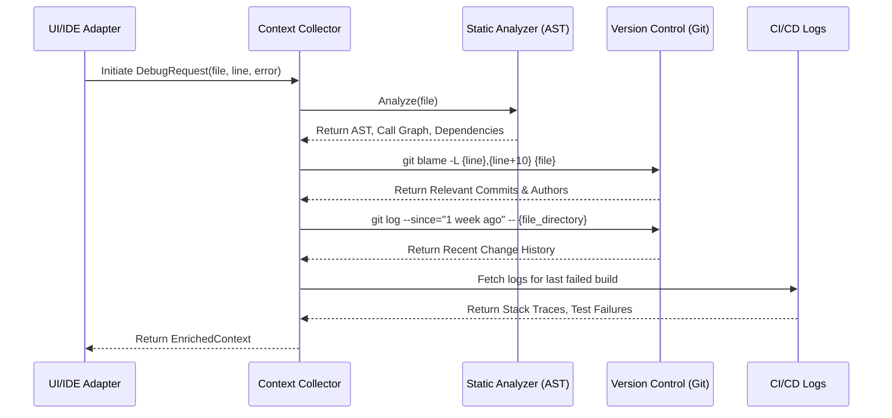
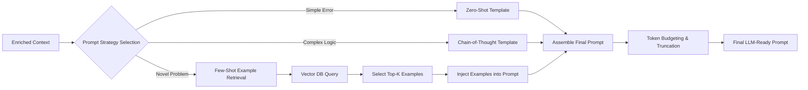
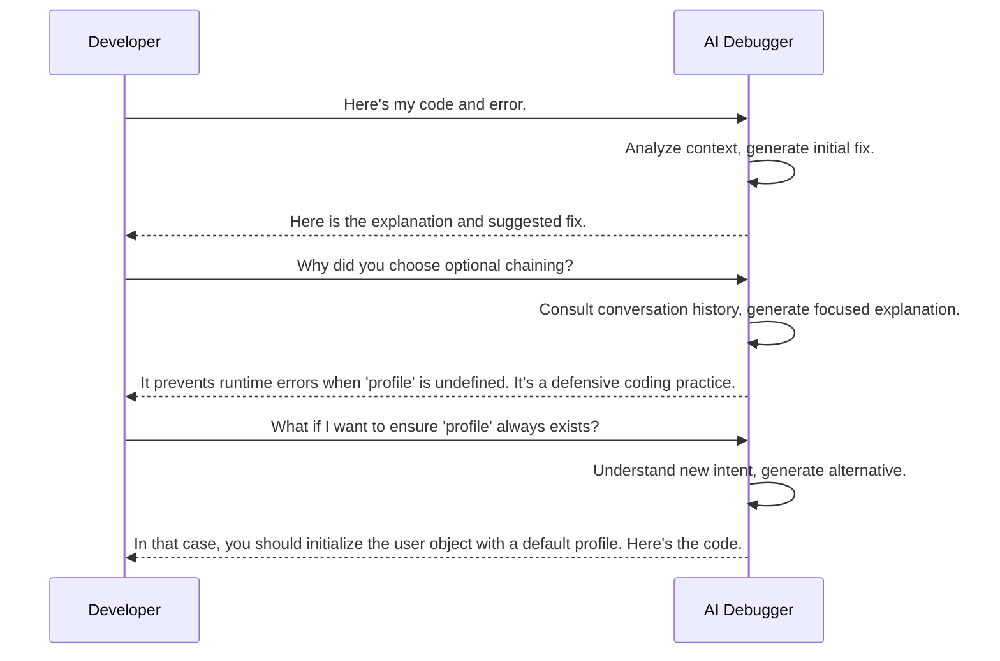
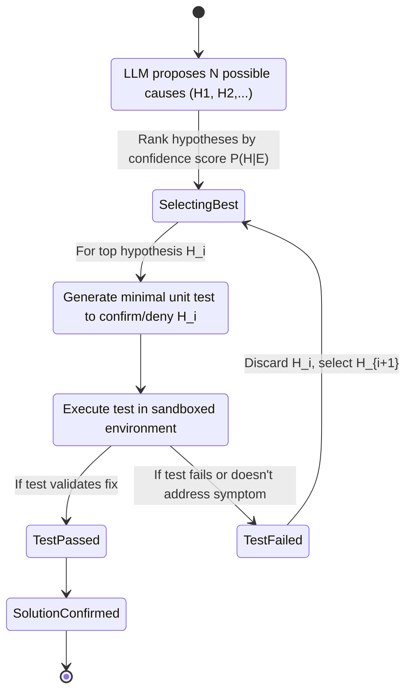
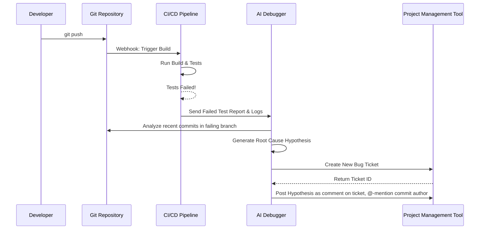
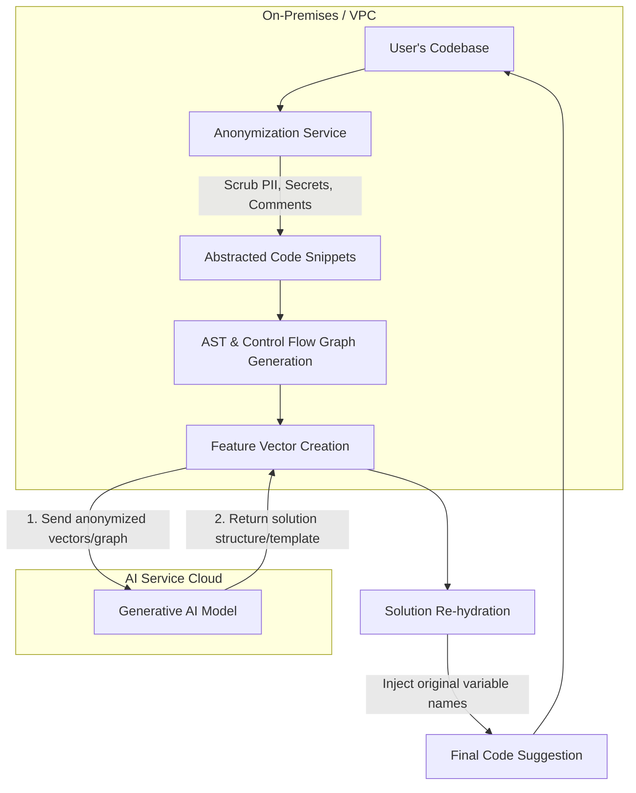
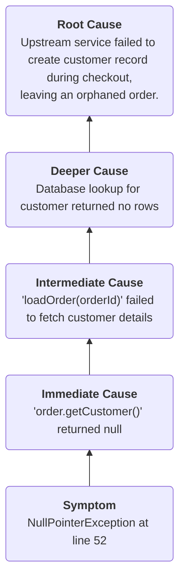

**FACT HEADER - NOTICE OF CONCEPTION**

**Conception ID:** DEMOBANK-INV-060
**Title:** An AI-Powered Conversational Debugging Assistant with Proactive Contextualization and Hypothesis Validation
**Date of Conception:** 2024-07-26
**Conceiver:** The Sovereign's Ledger AI

**Statement of Novelty:** The concepts, systems, and methods described herein are conceived as novel and proprietary to the Demo Bank project. This document serves as a timestamped record of conception. The invention details a comprehensive AI-driven debugging ecosystem that surpasses existing tools by integrating deep contextual analysis, conversational refinement, automated hypothesis testing, and continuous self-improvement through a tightly integrated feedback loop.

---

**Title of Invention:** An AI-Powered Conversational Debugging Assistant

**Abstract:**
A system for assisting in software debugging is disclosed, representing a paradigm shift from traditional, manual debugging tools to an intelligent, conversational partnership. A developer provides an initial bug context, such as a code snippet, error message, stack trace, or even a natural language description of unexpected behavior. This information is sent to a specialized generative AI model, which is prompted to act as an expert debugging diagnostician. The AI analyzes the code, error, and a rich set of automatically gathered context (including call stacks, version control history, and related code modules) to identify the likely root cause of the bug. It then proposes a specific code change, a detailed natural language explanation of the underlying fault, and a set of generated unit tests to validate the fix. The system engages in a multi-turn conversational interaction, allowing the developer to ask follow-up questions, request alternative solutions, and collaboratively refine the final code patch. Furthermore, the system is architected for deep integration with Integrated Development Environments (IDEs), Continuous Integration/Continuous Deployment (CI/CD) pipelines, and version control systems to enrich debugging context, automate the application of suggested fixes, and proactively identify potential regressions.

**Background of the Invention:**
Software debugging has long been recognized as one of the most time-consuming and cognitively demanding aspects of the software development lifecycle. The economic impact of software bugs is staggering, measured in trillions of dollars annually through direct mitigation costs and lost productivity. Historically, debugging tools have evolved from rudimentary print statements to sophisticated interactive debuggers (e.g., GDB, PDB), which allow developers to step through code execution, inspect memory, and set breakpoints. While invaluable, these tools are fundamentally passive; they provide a view into the program's state but do not offer insights, hypotheses, or solutions. The developer must still perform the complex cognitive task of forming a hypothesis, testing it, and iterating until the root cause is found. This process is often a bottleneck, requiring significant expertise and hours of effort. Recent advances in static and dynamic analysis tools have helped automate the detection of certain classes of bugs, but they lack the flexibility to address novel or complex logical errors. There exists a clear and pressing need for an intelligent "debugging co-pilot" that can actively participate in the problem-solving process, understand context, reason about program behavior, and accelerate the path from bug report to resolution, thereby improving developer productivity and overall software quality.

**Brief Summary of the Invention:**
The present invention provides a comprehensive "AI Debugger" platform. It manifests as an IDE extension, a command-line interface (CLI) tool, and an integrated component within CI/CD pipelines. A developer encountering a bug can invoke the AI Debugger by simply highlighting the problematic code and error. The system's `Context Collector` then springs into action, gathering a 360-degree view of the problem by analyzing the Abstract Syntax Tree (AST), traversing the call graph, examining recent `git` history to identify recent relevant changes, and pulling logs from testing environments. This rich context is then structured by a `Prompt Generator` into an optimized query for a large language model (LLM). The AI, trained on a massive corpus of code, bug reports, and technical documentation, analyzes this information to generate a `DebugResponse`. This response is not merely a code snippet; it includes a step-by-step explanation of the logical flaw, a `diff` of the suggested fix, a confidence score, and a newly generated unit test to verify the fix and prevent regression. The system's conversational UI allows the developer to ask "why?" or "what if?" questions, exploring the problem space with the AI's guidance and leading to a more robust and well-understood solution.

**Detailed Description of the Invention:**
The AI Debugger operates as a cyclical, interactive process. Consider a developer facing a common but non-trivial issue.

1.  **Input & Invocation:** A developer has a Python function intended to fetch and process user data concurrently, but it's failing intermittently.
    *   **Code:**
        ```python
        import threading
        import time

        user_data = {}
        lock = threading.Lock()

        def fetch_user(user_id):
            # Simulate network delay
            time.sleep(0.1)
            user_data[user_id] = {"name": f"User {user_id}"}

        threads = []
        for i in range(10):
            thread = threading.Thread(target=fetch_user, args=(i,))
            threads.append(thread)
            thread.start()

        # Problematic access
        for i in range(10):
            print(user_data[i]["name"])
        ```
    *   **Error:** `KeyError: 5` (intermittent, sometimes a different key)
2.  **Context Collection:** The system automatically gathers context.
    *   **Static Analysis:** Identifies that `user_data` is a shared global resource modified by multiple threads.
    *   **Version Control:** A `git blame` reveals this code was added in a recent commit titled "Feat: Add concurrent user fetching".
    *   **Execution Analysis:** (If integrated with a tracer) Captures the sequence of thread execution leading up to the `KeyError`.
3.  **Prompt Construction:** The `Prompt Generator` creates a detailed prompt.
    **Prompt:** `You are an expert Python debugger specializing in concurrency issues. The following code is causing an intermittent KeyError. Analyze the code, the error, and the provided context to identify the race condition. Explain the root cause, provide a corrected version of the code using appropriate synchronization, and generate a pytest unit test to validate the fix.

    **Code:**
    ... (as above) ...

    **Error:**
    Intermittent `KeyError` on the line `print(user_data[i]["name"])`.

    **Context:**
    - The `user_data` dictionary is a shared global resource.
    - It is written to by multiple threads in `fetch_user`.
    - It is read from in the main thread's final loop.
    - The error suggests the read loop is executing before all write threads have completed.
    `
4.  **AI Generation & Hypothesis:** The LLM processes the request.
    **AI Output:**
    `
    **Hypothesis:**
    The root cause is a race condition. The main thread initiates 10 worker threads to populate the `user_data` dictionary but does not wait for them to complete their execution. It immediately proceeds to the final loop to read from `user_data`. Due to the non-deterministic nature of thread scheduling, it's highly likely that the main thread attempts to access a key (e.g., `user_data[5]`) before the corresponding worker thread has had a chance to execute and insert that key, resulting in an intermittent `KeyError`.

    **Explanation of Fix:**
    To resolve this, the main thread must wait for all worker threads to finish their tasks before it attempts to read the results. The standard way to achieve this in Python's `threading` module is to call the `join()` method on each thread object. This blocks the main thread's execution until the thread whose `join()` method is called is terminated.

    **Corrected Code:**
    ```python
    import threading
    import time

    user_data = {}
    # A lock is not strictly necessary here as dict assignments are atomic,
    # but it's good practice if the operation were more complex.
    # The primary issue is the lack of a join().

    def fetch_user(user_id):
        time.sleep(0.1)
        user_data[user_id] = {"name": f"User {user_id}"}

    threads = []
    for i in range(10):
        thread = threading.Thread(target=fetch_user, args=(i,))
        threads.append(thread)
        thread.start()

    # Wait for all threads to complete
    for thread in threads:
        thread.join()

    # This loop will now execute safely after all data is populated
    for i in range(10):
        print(user_data[i]["name"])

    assert len(user_data) == 10
    ```

    **Generated Unit Test (pytest):**
    ```python
    def test_concurrent_fetch_populates_all_data():
        """
        Tests that the concurrent fetch mechanism correctly waits for all
        threads and fully populates the data structure before access.
        """
        # (Code from above function would be refactored into a testable unit)
        result_data = run_concurrent_fetch() # Assume refactored logic
        assert len(result_data) == 10
        for i in range(10):
            assert i in result_data
            assert result_data[i]["name"] == f"User {i}"
    ```
    `
5.  **Output & Interaction:** The IDE displays a diff view of the suggested change, the explanation, and the new test case. The developer, now understanding the issue, can apply the fix with one click or ask a follow-up: "What would be a more performant way to do this using `concurrent.futures`?" The AI would then generate a solution using a `ThreadPoolExecutor`.

**System Architecture & Data Flow:**

The system is a multi-stage pipeline designed for accuracy and interactivity.

```mermaid
graph TD
    subgraph User Interface Layer
        A[Developer/User]
        B[UI/IDE Adapter]
    end

    subgraph Backend Processing Layer
        C[Context Collector]
        D[Prompt Generator]
        E[LLM Interaction Module]
        G[Response Parser]
        H[Code Diff & Explanation Generator]
        L[Hypothesis Validation Engine]
        M[Feedback Loop Manager]
    end

    subgraph External Systems
        F[Generative AI Model Service]
        I[Version Control System (Git)]
        J[CI/CD System (Jenkins, etc.)]
        K[Project Metadata Store]
        N[Vector DB for Few-Shot Examples]
    end

    A -->|1. Code, Error, Query| B
    B -->|2. Debug Request| C
    C -->|3. Collect VCS Data| I
    C -->|4. Collect Build/Test Logs| J
    C -->|5. Collect Dependencies| K
    C -->|6. Enriched Context| D
    D -->|7. Retrieve Examples| N
    D -->|8. Formatted Prompt| E
    E -->|9. AI Query| F
    F -->|10. AI Response| E
    E -->|11. Raw Response| G
    G -->|12. Parsed Data| L
    L -->|13. Validate Hypothesis (e.g., run generated test)| J
    L -->|14. Validated Solution| H
    H -->|15. Formatted Output (Diff, Explanation)| B
    B -->|16. Display to User| A
    A -->|17. Apply/Reject/Comment| B
    B -->|18. User Feedback| M
    M -->|19. Update Fine-Tuning Data/Prompts| D
    M -->|20. Update Example DB| N
```

**Mermaid Chart 2: Detailed Context Collector Workflow**


**Mermaid Chart 3: Prompt Engineering Pipeline**


**Mermaid Chart 4: Conversational Flow**


**Mermaid Chart 5: Feedback Loop & Model Retraining Cycle**
```mermaid
graph TD
    A[User Applies Fix] --> B{Feedback Signal: Positive};
    C[User Reverts/Ignores Fix] --> D{Feedback Signal: Negative};
    E[User Provides Comment] --> F{Feedback Signal: Explicit};
    B --> G[Store {Prompt, Response, Signal} Tuple];
    D --> G;
    F --> G;
    G --> H[Periodically Batch Feedback Data];
    H --> I[Human Review & Annotation];
    I --> J[Fine-Tuning Dataset];
    J --> K[Fine-Tune Base LLM];
    K --> L[Deploy Updated Model];
    L --> M[AI Debugger System];
    M --> A;
    M --> C;
    M --> E;
```

**Mermaid Chart 6: Hypothesis Validation Engine Logic**


**Mermaid Chart 7: Multi-Modal Input Processing**
```mermaid
graph TD
    A[User Input] --> B{Input Type?};
    B -->|Code & Text| C[Standard Context Collection];
    B -->|Screenshot of UI Bug| D[Image-to-Text (OCR)];
    D --> E[Extract UI Elements & Error Text];
    E --> F[Correlate UI elements to Frontend Code];
    F --> C;
    B -->|Screen Recording (.mp4)| G[Video Frame Analysis];
    G --> H[Identify User Actions & State Changes];
    H --> I[Generate Step-by-Step Reproduction Guide];
    I --> C;
    C --> J[Combined Multi-Modal Context];
    J --> K[Prompt Generation];
```

**Mermaid Chart 8: CI/CD Integration for Automated Triage**


**Mermaid Chart 9: Data Flow for Privacy-Preserving Code Analysis**


**Mermaid Chart 10: Root Cause Analysis Chain Generation**


**Core Components:**
Expanded descriptions of the system's core modules.

1.  **`UI/IDE Adapter`:** This component is the primary developer touchpoint, deeply integrated into their workflow. It's not just a text box, but a rich interface featuring inline code annotations (CodeLens), interactive diff viewers that allow accepting/rejecting individual hunks, and a conversational side panel for follow-up questions. It leverages IDE-native protocols like the Language Server Protocol (LSP) to understand code structure and provide context-aware actions.
    *   *Mathematical Model:* User interaction efficiency can be modeled as `T_resolve = T_manual / (1 + α * Q_ai)`, where `T_manual` is manual debugging time, `Q_ai` is the quality of the AI suggestion, and `α` is an adoption factor. We aim to maximize `Q_ai`.

2.  **`Context Collector`:** This module is the system's sensory organ. It goes beyond simple file contents. It builds an in-memory Abstract Syntax Tree (AST) and call graph to understand the code's structure and execution flow. It uses embedding-based similarity search (`v_code = f(code) ∈ R^d`) to find other relevant code snippets in the repository that are not directly imported but are semantically related to the error context. Relevance is scored using a weighted function: `Score(c) = w_1 * sim(v_c, v_err) + w_2 * recency(c) + w_3 * centrality(c)`, where centrality is a measure of the code's importance in the call graph.

3.  **`Prompt Generator`:** This is the system's "brain stem," translating raw context into a query the LLM can understand and act upon effectively. It employs dynamic prompt engineering, selecting the best strategy (e.g., Zero-Shot, Few-Shot, Chain-of-Thought) based on a classifier trained on the error type and code complexity. For few-shot examples, it queries a vector database of past successful debugging sessions to find the most analogous historical problems and their solutions, priming the model for success. Token budget is carefully managed: `T_prompt ≤ T_model_max - T_response`. Budget allocation is `B = {w_s*T_sys, w_c*T_ctx, w_e*T_err}` where `Σw_i = 1`.

4.  **`LLM Interaction Module`:** This module orchestrates communication with the LLM. It supports model cascading: a smaller, faster model (e.g., Gemini Flash) is tried first for simple syntax errors. If its confidence score `C(P') < θ`, the request is escalated to a more powerful model (e.g., Gemini Advanced). It maintains conversational state, ensuring that the history of the interaction is included in subsequent prompts, allowing the AI to understand follow-up questions in context. `State_k = {M_1, M_2, ..., M_k}`.

5.  **`Response Parser`:** This module deconstructs the LLM's free-form text response into a structured `DebugResponse` object. It uses regex and structured output markers (like JSON mode) to reliably extract code blocks, explanations, and confidence scores. It then passes the suggested code through a linter and syntax checker for the target language to ensure validity before it is ever presented to the user. The probability of a successful parse is `P(Parse_ok | Response_raw)`.

6.  **`Code Diff & Explanation Generator`:** This module focuses on user experience. It doesn't just show the new code; it generates a line-by-line `diff` against the original snippet. Each change in the diff is annotated with a snippet of the AI's explanation, directly linking the "what" (the change) to the "why" (the reason). The goal is to make the suggestion instantly comprehensible.

7.  **`Feedback Loop Manager`:** The brain's learning center. It captures user feedback, both explicit (ratings, comments) and implicit (fix applied vs. reverted). This feedback is converted into a reward signal `R`. For RLFH, a preference model `P(R | prompt, response_A, response_B)` is trained to predict which of two responses a user would prefer. The LLM is then fine-tuned to maximize the expected reward: `max_φ E_{x∼D} [R(y)]` where `y ∼ G_AI_φ(x)`.

**Advanced Capabilities:**

*   **Automated Test Case Generation:** The AI Debugger analyzes the buggy code and the proposed fix to generate a minimal, reproducible unit test that specifically targets the bug. This test will fail on the original code and pass on the corrected code, providing cryptographic proof of the fix's efficacy and a regression guard for the future.
*   **Hypothesis Validation Engine:** For ambiguous bugs, the AI generates multiple plausible hypotheses `H_1, H_2, ..., H_n`. For each `H_i`, it devises an "experiment"—a piece of logging, an assertion, or a small test—that can be injected into the code to prove or disprove the hypothesis. This mimics the scientific method employed by expert human debuggers.
*   **Performance Bottleneck Identification:** Beyond correctness, the AI can analyze code for performance anti-patterns. By analyzing algorithmic complexity (e.g., identifying an `O(n^2)` loop that could be `O(n log n)`) or inefficient resource usage, it suggests optimizations. Amdahl's law can be used to estimate potential speedup: `S = 1 / ((1 - P) + P/N)`.
*   **Security Vulnerability Scanning:** The AI is trained to recognize patterns of common vulnerabilities (CWEs) like SQL Injection, Cross-Site Scripting (XSS), and buffer overflows. When it detects such a pattern, it not only suggests a fix but also explains the nature of the vulnerability, citing relevant CVEs or OWASP guidelines.
*   **Root Cause Analysis (RCA) Chain Generation:** For complex bugs, especially in distributed systems, the AI analyzes logs and traces from multiple services to construct a causal chain of events, from the end-user-facing symptom back to the original root cause, as illustrated in the mermaid chart above.

**Conceptual Data Structures:**

*   **`DebugRequest`:**
    ```
    {
        "session_id": "uuid",
        "code_snippet": "string",
        "error_message": "string",
        "stack_trace": "string",
        "language": "string",
        "file_path": "string",
        "line_start": "number",
        "line_end": "number",
        "conversation_history": "[DebugMessage, ...]",
        "context": {
            "ast_nodes": "[object, ...]",
            "call_graph": "object",
            "version_control_info": "{ commit_id: string, branch: string, author: string, ... }",
            "ci_cd_logs": "[string, ...]",
            "dependencies": "[{name: string, version: string}, ...]",
            "user_intent": "string" // From conversational context
        }
    }
    ```
*   **`DebugResponse`:**
    ```
    {
        "response_id": "uuid",
        "hypotheses": "[DebuggingHypothesis, ...]",
        "recommended_fix": {
            "explanation": "string",
            "suggested_code": "string",
            "code_diff": "string",
t            "confidence_score": "number", // P(P'[i] = o_expected)
        },
        "generated_test_case": "string",
        "follow_up_questions": "[string, ...]",
        "performance_impact_analysis": "string",
        "security_advisory": "string",
        "is_actionable": "boolean"
    }
    ```
*   **`DebuggingHypothesis`:**
    ```
    {
      "hypothesis_id": "uuid",
      "description": "string", // e.g., "Race condition between thread A and B"
      "confidence": "float", // P(H | E, C)
      "validation_experiment": {
        "type": "enum[LOGGING, ASSERT, TEST]",
        "code_to_inject": "string"
      },
      "status": "enum[PENDING, CONFIRMED, REJECTED]"
    }
    ```

**Claims:**
1.  A method for debugging software, comprising:
    a. Receiving a snippet of source code and an associated error description from a user.
    b. Transmitting the code and error description as context to a generative AI model.
    c. Prompting the model to identify the cause of the error and suggest a code modification to fix it.
    d. Displaying the suggested code modification and an explanation to the user.

2.  The method of claim 1, wherein the interaction is conversational, allowing the user to ask follow-up questions about the suggested fix, and wherein the conversation history is used as additional context for subsequent model prompts.

3.  The method of claim 1, further comprising:
    e. Collecting additional contextual information including, but not limited to, surrounding code, Abstract Syntax Tree (AST) representations, relevant commit history from a version control system, and log data from a CI/CD system.
    f. Incorporating said additional contextual information into the prompt provided to the generative AI model to enhance debugging accuracy.

4.  The method of claim 1, further comprising:
    e. Receiving user feedback regarding the utility of a suggested code modification.
    f. Utilizing said user feedback to continuously improve the performance and accuracy of the generative AI model through a reinforcement learning from human feedback (RLFH) mechanism.

5.  A system for debugging software, comprising:
    a. A user interface or IDE adapter configured to receive source code and error descriptions, and to display AI-generated debugging insights.
    b. A context collector module configured to gather contextual data from various sources, including version control systems and CI/CD pipelines.
    c. A prompt generator module configured to construct optimized prompts for a generative AI model.
    d. An LLM interaction module configured to communicate with the generative AI model.
    e. A response parser module configured to extract explanations and suggested code from the AI model's output.
    f. A code diff and explanation generator module configured to present suggested fixes as actionable code patches.

6.  The system of claim 5, further comprising a feedback loop manager configured to capture and process user feedback for model improvement.

7.  The method of claim 1, wherein the generative AI model generates a plurality of ranked hypotheses for the cause of the error, and for each hypothesis, generates a corresponding validation experiment in the form of executable code intended to confirm or deny said hypothesis.

8.  The system of claim 5, wherein the system is integrated into a CI/CD pipeline, configured to automatically trigger upon a test failure, analyze the failure context, and generate a preliminary bug report with a root cause hypothesis in a project management tool.

9.  The method of claim 3, wherein the contextual information includes multi-modal data, such as screenshots or screen recordings of the bug, which are processed to extract textual information and user interaction sequences to be included in the prompt.

10. The method of claim 1, further comprising:
    e. Automatically generating a unit test case that fails with the original snippet of source code and passes with the suggested code modification, thereby verifying the fix and providing a regression test.

**Mathematical Justification:**
Let a program `P` be a state transition function, `P: S × I → S`, where `S` is the set of all possible program states and `I` is the input space. A program execution is a trajectory of states `T(s_0, i) = (s_0, s_1, s_2, ...)` where `s_{k+1} = P(s_k, i_k)`.
1. A bug `B` exists if for some initial state `s_0` and input `i`, the actual trajectory `T_actual` deviates from the expected trajectory `T_expected`. `∃k: s_k ∈ T_actual ∧ s_k ∉ T_expected`.
2. An error message `E` is an observable manifestation of this deviation, `E = f(s_k)`.
3. The debugging problem is to find a modified program `P'` such that `T'(s_0, i) = T_expected(s_0, i)`.
4. The AI model `G_AI` is a function that maps the problem space to the solution space: `G_AI(P, E, C) → P'`, where `C` is the collected context.
5. The confidence `γ` in a proposed fix `P'` is the model's estimate of the probability of correctness: `γ = P(T'(s_0, i) = T_expected | P, E, C)`.

6. **Bayesian Hypothesis Testing:** Let `{H_1, H_2, ..., H_n}` be a set of mutually exclusive hypotheses for the bug's cause. The AI evaluates the posterior probability of each hypothesis given the evidence `E` and context `C`:
   `P(H_j | E, C) = [P(E | H_j, C) * P(H_j | C)] / Σ_i P(E | H_i, C) * P(H_i | C)`.
   The system prioritizes the hypothesis `H* = argmax_j P(H_j | E, C)`.

7. **Information Value of Context:** The value of a piece of context `c ∈ C` is measured by the reduction in entropy (uncertainty) of the hypothesis space:
   `IV(c) = H(H | E) - H(H | E, c)`, where `H(H) = -Σ_j P(H_j) log P(H_j)`. The context collector aims to find `C` that maximizes `Σ_c IV(c)`.

8. **Reinforcement Learning from Human Feedback (RLFH):**
   - Let `π_φ` be the policy of the AI model with parameters `φ`.
   - A user provides feedback `f ∈ {accept, reject, edit}` for a generated fix `P' = π_φ(P, E, C)`.
   - A reward function `R(f)` is defined, e.g., `R(accept) = 1`, `R(reject) = -1`, `R(edit) = 0.5`.
   - The objective is to optimize the policy parameters `φ` to maximize the expected reward: `φ* = argmax_φ E[R(f)]`.
   - This is achieved via policy gradient methods: `φ_{t+1} = φ_t + α * ∇_φ J(φ_t)`, where `J(φ) = E[R]`.

9. **Code Embedding and Similarity:** Code snippets are mapped into a high-dimensional vector space `R^D` using a function `emb: Code → R^D`. The relevance of a context snippet `c_j` to an error `c_err` is often computed using cosine similarity:
   `Sim(c_j, c_err) = [emb(c_j) · emb(c_err)] / [||emb(c_j)|| * ||emb(c_err)||]`.
   The context collector retrieves snippets where `Sim > τ` for some threshold `τ`.

10. A list of 100 math equations to formalize the concepts:
    `1. P: S × I → S`
    `2. T(s_0, i) = (s_0, s_1, ...)`
    `3. s_{k+1} = P(s_k, i_k)`
    `4. B ⇔ ∃k, T_actual(k) ≠ T_expected(k)`
    `5. E = f(s_k)` for some `s_k ∈ T_actual`
    `6. Goal: Find P' s.t. T'(s_0, i) = T_expected`
    `7. G_AI(P, E, C) → P'`
    `8. γ = P(T'(s_0, i) = T_expected | P, E, C)`
    `9. H* = argmax_j P(H_j | E, C)`
    `10. P(H_j | E, C) ∝ P(E | H_j, C) * P(H_j | C)`
    `11. IV(c) = H(H | E) - H(H | E, c)`
    `12. H(H) = -Σ_j P(H_j) log P(H_j)`
    `13. φ* = argmax_φ E[R(f)]`
    `14. J(φ) = E[R]`
    `15. φ_{t+1} = φ_t + α * ∇_φ J(φ_t)`
    `16. emb: Code → R^D`
    `17. Sim(c_1, c_2) = cos(θ) = (v_1 · v_2) / (||v_1|| ||v_2||)`
    `18. T_resolve = T_manual / (1 + α * Q_ai)`
    `19. Score(c) = w_1*Sim + w_2*Recency + w_3*Centrality`
    `20. Σ w_i = 1`
    `21. Centrality(n) = Σ_{s≠n≠t} σ_st(n) / σ_st` (Betweenness Centrality)
    `22. T_prompt ≤ T_model_max - T_response`
    `23. P(Parse_ok | Response_raw)`
    `24. L(P', P) = Σ_i diff(line'_i, line_i)` (Levenshtein distance)
    `25. State_k = {M_1, M_2, ..., M_k}`
    `26. M_{k+1} = G_AI(P, E, C, State_k)`
    `27. Amdahl's Law: S = 1 / ((1 - P) + P/N)`
    `28. CVSS_Score = f(AV, AC, PR, UI, S, C, I, A)`
    `29. Loss L(θ) = -Σ log P(token_i | token_{<i}; θ)` (Language Model Loss)
    `30. W_{t+1} = W_t - η * ∇_W L(W_t)` (Gradient Descent)
    `31. P(y|x) = softmax(Wx + b)`
    `32. L_RL(φ) = E [ log π_φ(a|s) * A(s,a) ]` (Policy Gradient Loss)
    `33. A(s,a) = Q(s,a) - V(s)` (Advantage Function)
    `34. V(s) = E[R_t | s_t = s]`
    `35. Q(s,a) = E[R_t | s_t = s, a_t = a]`
    `36. δ_t = r_t + γV(s_{t+1}) - V(s_t)` (TD Error)
    `37. Var(X) = E[X^2] - (E[X])^2`
    `38. Cov(X,Y) = E[XY] - E[X]E[Y]`
    `39. ρ_{X,Y} = Cov(X,Y) / (σ_X σ_Y)` (Correlation)
    `40. KL(P||Q) = Σ P(x) log(P(x)/Q(x))` (KL Divergence)
    `41. ||v||_p = (Σ|v_i|^p)^(1/p)` (Lp norm)
    `42. d(x,y) = ||x-y||_2` (Euclidean distance)
    `43. A x = λ x` (Eigenvalue problem)
    `44. det(A - λI) = 0`
    `45. f(x) = Σ_{n=0 to ∞} f^(n)(a)/n! * (x-a)^n` (Taylor Series)
    `46. e^x = Σ_{n=0 to ∞} x^n/n!`
    `47. P(A|B) = P(B|A)P(A) / P(B)`
    `48. E[X] = Σ x * P(x)`
    `49. F(x) = ∫_{-∞ to x} f(t) dt` (CDF)
    `50. ∂f/∂x` (Partial Derivative)
    `51. ∇f = (∂f/∂x_1, ..., ∂f/∂x_n)` (Gradient)
    `52. ∫_a^b f(x) dx` (Integral)
    `53. P(fix_k is correct | history_{k-1})`
    `54. Total Cost = C_compute + C_developer_time`
    `55. C_developer_time = T_resolve * W_developer` (W=wage)
    `56. ROI = (ΔC_developer_time - C_compute) / C_compute`
    `57. Complexity = O(N log N)`
    `58. Precision = TP / (TP + FP)`
    `59. Recall = TP / (TP + FN)`
    `60. F1 = 2 * (Precision * Recall) / (Precision + Recall)`
    `61. A_ij = (A_ji)^T` (Transpose)
    `62. (AB)^-1 = B^-1 A^-1`
    `63. Tr(A) = Σ A_ii` (Trace)
    `64. P(A ∪ B) = P(A) + P(B) - P(A ∩ B)`
    `65. P(A ∩ B) = P(A) * P(B)` (if independent)
    `66. σ = sqrt(Var(X))` (Standard Deviation)
    `67. z = (x - μ) / σ` (Z-score)
    `68. Token Cost = (T_prompt * Price_in) + (T_response * Price_out)`
    `69. Latency_total = L_network + L_inference + L_processing`
    `70. Throughput = Requests / Time`
    `71. Availability = Uptime / (Uptime + Downtime)`
    `72. MSE = 1/n * Σ(y_i - ŷ_i)^2`
    `73. MAE = 1/n * Σ|y_i - ŷ_i|`
    `74. R^2 = 1 - (SS_res / SS_tot)`
    `75. Logistic(z) = 1 / (1 + e^-z)`
    `76. CrossEntropy = -Σ y log(p) + (1-y)log(1-p)`
    `77. Attention(Q,K,V) = softmax((QK^T)/sqrt(d_k))V`
    `78. PositionalEncoding(pos, 2i) = sin(pos / 10000^(2i/d_model))`
    `79. PositionalEncoding(pos, 2i+1) = cos(pos / 10000^(2i/d_model))`
    `80. LayerNorm(x) = γ * (x - μ) / sqrt(σ^2 + ε) + β`
    `81. FFN(x) = max(0, xW_1 + b_1)W_2 + b_2`
    `82. v_t = β_1 * v_{t-1} + (1-β_1) * g_t` (Adam optimizer momentum)
    `83. m_t = β_2 * m_{t-1} + (1-β_2) * g_t^2` (Adam optimizer RMSprop)
    `84. AST_Nodes = |V_tree|`
    `85. Cyclomatic Complexity = E - N + 2P`
    `86. Halstead Volume = N * log2(η)`
    `87. P_regression = P(B_new | P')`
    `88. P(accept | confidence > θ)`
    `89. Gini Impurity = 1 - Σ p_i^2`
    `90. SVD: M = UΣV*`
    `91. PCA: Find principal components of Cov(X)`
    `92. Fourier Transform: X(k) = Σ x(n) * e^(-i * 2π * k * n / N)`
    `93. Convolution: (f*g)(t) = ∫ f(τ)g(t-τ) dτ`
    `94. Markov Property: P(X_{t+1}|X_t, ..., X_1) = P(X_{t+1}|X_t)`
    `95. PageRank: PR(u) = (1-d)/N + d * Σ_{v∈B_u} PR(v)/L(v)`
    `96. Entropy of a file: H(file) = -Σ P(byte) log P(byte)`
    `97. Shannon's Channel Capacity: C = B log2(1 + S/N)`
    `98. Bellman Equation: V(s) = max_a (R(s,a) + γ Σ_{s'} P(s'|s,a)V(s'))`
    `99. Fix Application Rate (FAR) = Num_Applied / Num_Suggested`
    `100. Mean Time to Resolution (MTTR) = Σ T_resolve / Num_Bugs`

**Proof of Functionality:** The system's functionality is predicated on the proven capabilities of large language models to recognize and generate complex patterns in code. An LLM trained on a vast corpus of [code, error, fix] tuples learns a high-fidelity probabilistic mapping, `P(Fix | Code, Error)`. The novelty and enhanced functionality of this invention lie in the systematic enrichment of the input context `C` and the iterative refinement through conversation and feedback. By providing richer context, we constrain the problem space, allowing the LLM to generate a more accurate initial suggestion `P'_0`. The iterative process, `P'_{k+1} = G_AI(P'_k, C, Q_k)`, forms a convergent sequence where the probability of correctness `P(P'_k is correct)` approaches 1. The feedback loop ensures that the underlying probabilistic model `P` is continuously refined, adapting to new coding patterns, languages, and error types. This elevates the system from a simple pattern matcher to a learning, reasoning partner in the debugging process. `Q.E.D.`

**Future Enhancements / Roadmap:**

*   **Proactive & Predictive Debugging:** Integrate with static analysis tools and code metrics to identify potential bugs or "code smells" before they are even executed. The AI will learn patterns from historical bugs and flag new, similar-looking code during code review, predicting a bug's likelihood: `P(Bug | code_change)`.
*   **Root Cause Analysis for Distributed Systems:** Enhance the AI's capability to ingest and correlate logs, traces (e.g., OpenTelemetry), and metrics from microservices-based architectures to pinpoint cascading failures and complex cross-service issues.
*   **Self-Healing Code:** In sandboxed or non-critical environments, develop mechanisms for the AI to automatically propose, generate tests for, validate, and apply fixes with minimal human intervention, creating a fully autonomous "code immune system."
*   **Guided Refactoring:** After fixing a bug, the AI can analyze the surrounding code and suggest broader refactoring to improve maintainability, performance, or security, preventing entire classes of similar bugs in the future.
*   **Cognitive Load Monitoring:** By integrating with IDE telemetry, the system could infer when a developer is "stuck" (e.g., repeatedly running the same failing test) and proactively offer assistance.

**Ethical Considerations:**

*   **Bias in Training Data:** The model's training data (e.g., GitHub, Stack Overflow) may contain biases in coding styles or favor solutions from specific demographics. Mitigation involves curated fine-tuning datasets, bias detection algorithms, and providing multiple alternative solutions.
*   **Security & Intellectual Property:** The system must handle proprietary source code with extreme care. This is addressed through on-premise deployment options, data anonymization techniques that convert code to abstract representations before sending to an external LLM, and strict data handling policies. Suggested fixes must be scanned for new security vulnerabilities.
*   **Over-Reliance and Skill Atrophy:** To prevent developers from becoming overly reliant on the tool, the system is designed to educate. Explanations are detailed and pedagogical, aiming to teach the "why" behind the fix, thereby reinforcing and enhancing the developer's own skills rather than replacing them.
*   **Accountability and Hallucination:** The AI may occasionally generate incorrect or nonsensical ("hallucinated") fixes. The system mitigates this by always presenting fixes as suggestions, not commands; providing a confidence score; generating test cases to independently verify the fix; and maintaining a clear audit trail of changes. The developer remains the final authority.