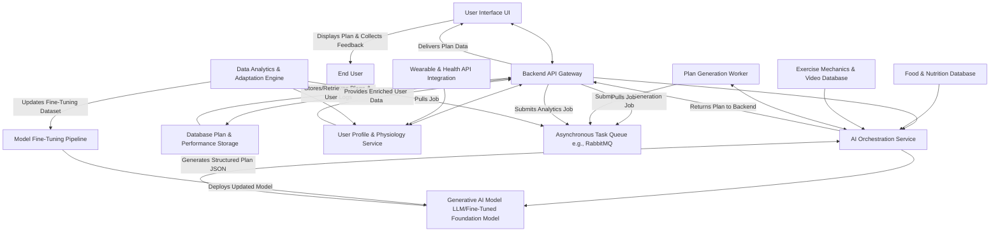
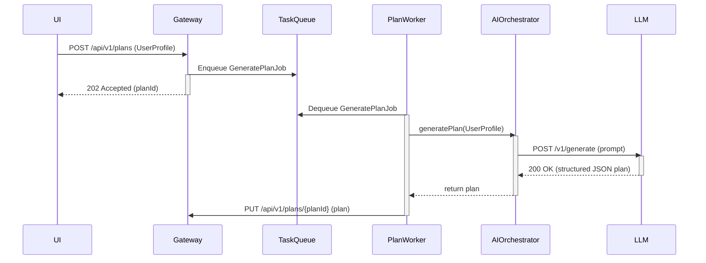
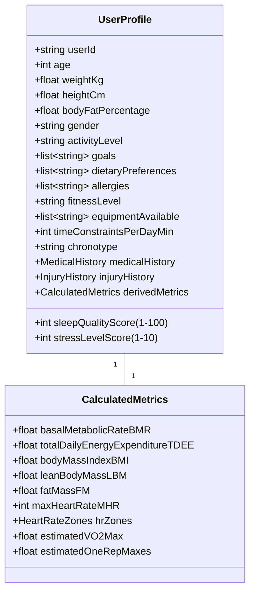
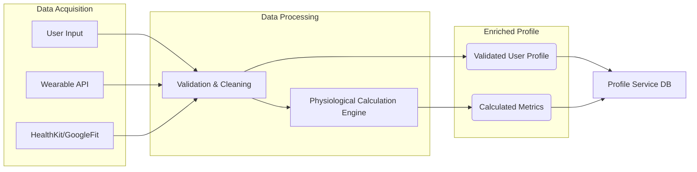
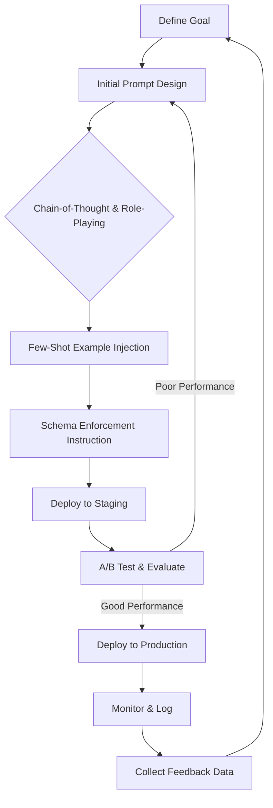
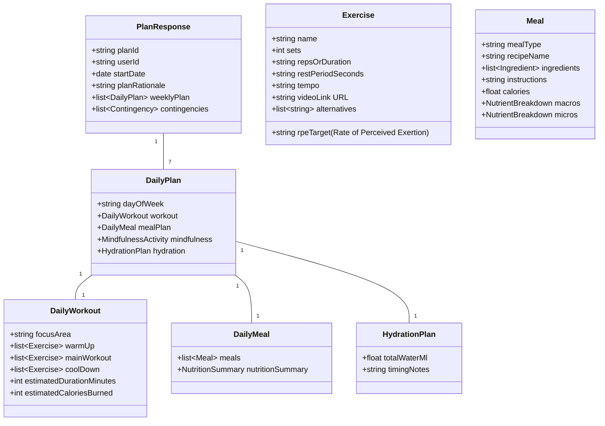
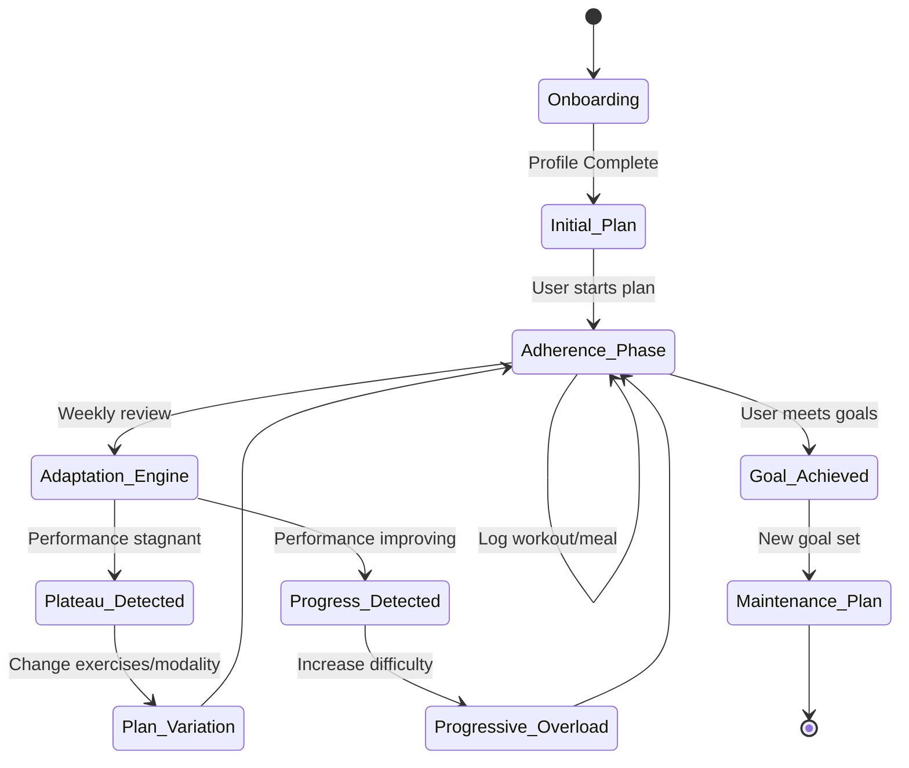
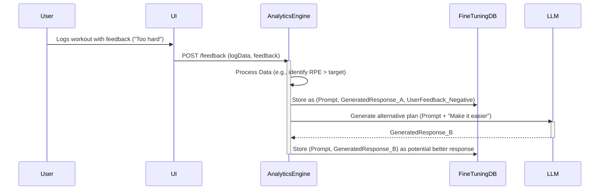
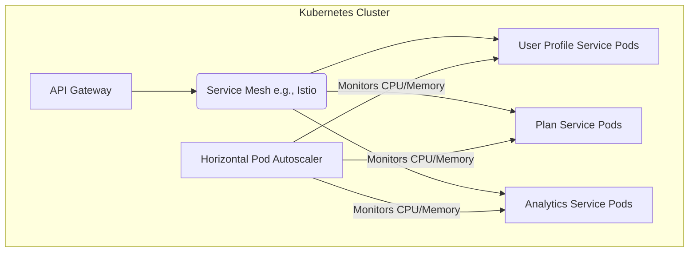

**Title of Invention:** System and Method for Generating Personalized and Adaptive Fitness and Nutrition Plans

**Abstract:**
A system and method for generating dynamic, personalized health plans are disclosed. A user provides their personal metrics (age, weight, height, body fat %), goals (e.g., "lose 10 pounds," "run a 5k," "increase bench press by 20%"), dietary preferences, and psychological profile. This multi-modal information is sent to a generative AI model, potentially fine-tuned on health and fitness data, which is prompted to act as an elite-certified personal trainer, nutritionist, and sports psychologist. The AI generates a comprehensive, personalized weekly workout schedule and a daily meal plan tailored to the user's specific profile and goals. The system incorporates a feedback loop, using user-reported data and wearable device metrics to continuously adapt and optimize the plans over time, ensuring sustained progress and adherence.

**Detailed Description:**

A user completes a comprehensive onboarding questionnaire via a frontend application. The backend system processes this data, calculates a suite of derived physiological metrics, and sends this enriched profile to an AI Orchestration Service. This service constructs a highly detailed, context-aware prompt for a Large Language Model (LLM), including a `responseSchema` to enforce structured output. The AI generates a week-long, periodized workout schedule with specific exercises, and a detailed daily meal plan with recipes and micronutrient breakdowns. This structured JSON is validated, stored, and then rendered in a user-friendly, interactive calendar view within the application. The system's key innovation lies in its continuous adaptation mechanism, which refines future plans based on performance feedback and biometric data.

### 1. System Architecture and Data Flow

The system employs a scalable microservices architecture to handle distinct functionalities, ensuring high availability and maintainability.



**Components:**

*   **User Interface [UI]:** A responsive web or mobile application for user data input, plan visualization, workout logging, meal tracking, and feedback submission.
*   **Backend API Gateway:** A central, secure entry point using RESTful or GraphQL APIs. It handles authentication (OAuth 2.0), request routing, rate limiting, and aggregates responses from various microservices.
    *   System Latency Model: $L_{total} = L_{network} + L_{auth} + L_{gateway} + L_{service\_i}$
    *   Equation 1: $L_{total} = \sum_{i=1}^{n} (T_{process_i} + T_{wait_i}) + T_{network}$
    *   Equation 2: Availability $A = \frac{MTBF}{MTBF + MTTR}$
*   **User Profile & Physiology Service:** Manages user data (`UserProfile`). It enriches the raw input by calculating dozens of physiological metrics.
    *   Equation 3: Service Scalability $S(N_{users}) = k \cdot \frac{CPU_{cores} \cdot RAM_{GB}}{DB_{latency}}$
*   **AI Orchestration Service:** Constructs sophisticated prompts using a combination of zero-shot, few-shot, and chain-of-thought techniques. It validates the LLM's JSON output against the `responseSchema`, handles errors, and may perform corrective actions.
*   **Generative AI Model [LLM]:** A state-of-the-art foundation model (e.g., GPT-4, Llama 3) or a domain-specific model fine-tuned on medical, nutritional, and exercise science literature.
    *   Equation 4: Transformer Attention: $Attention(Q, K, V) = softmax(\frac{QK^T}{\sqrt{d_k}})V$
*   **Database (Plan & Performance Storage):** A hybrid database system. A relational DB (e.g., PostgreSQL) for structured user and plan data, and a time-series DB (e.g., InfluxDB) for biometric and performance logs.
*   **Wearable & Health API Integration:** Ingests data via APIs from sources like Apple HealthKit, Google Fit, Oura, and Garmin, providing a continuous stream of biometric data.
*   **Food & Nutrition Database:** A comprehensive database containing millions of food items with detailed macro/micronutrient information.
*   **Exercise Mechanics & Video Database:** A curated library of exercises with instructions, 3D animated models, and video demonstrations.
*   **Asynchronous Task Queue & Workers:** Manages long-running tasks like AI plan generation and data analysis, preventing API timeouts and ensuring a responsive user experience.
*   **Data Analytics & Adaptation Engine:** A core component that analyzes user adherence, performance logs, and biometric feedback to generate signals for plan adaptation.
*   **Model Fine-Tuning Pipeline:** Periodically uses anonymized, high-quality user interaction data (e.g., which plans led to the best outcomes) to fine-tune the LLM, improving its personalization capabilities over time.



### 2. User Profile and Advanced Physiological Modeling

The system's personalization capability is rooted in its deep understanding of the user, derived from a comprehensive set of inputs and calculated metrics.



**Physiological Calculations:**

*   **Body Composition:**
    *   Equation 5: Body Mass Index (BMI): $BMI = \frac{weight_{kg}}{height_m^2}$
    *   Equation 6: Lean Body Mass (LBM) - Boer Formula (Male): $LBM = (0.407 \times W) + (0.267 \times H) - 19.2$
    *   Equation 7: Lean Body Mass (LBM) - Boer Formula (Female): $LBM = (0.252 \times W) + (0.473 \times H) - 48.3$
    *   Equation 8: Fat Mass (FM): $FM = weight_{kg} - LBM$
*   **Metabolic Rate:**
    *   Equation 9: Basal Metabolic Rate (BMR) - Mifflin-St Jeor: $BMR = (10 \times W) + (6.25 \times H) - (5 \times age) + s$ (s: +5 male, -161 female)
    *   Equation 10: BMR - Katch-McArdle (more accurate if body fat % is known): $BMR = 370 + (21.6 \times LBM)$
    *   Equation 11: Total Daily Energy Expenditure (TDEE): $TDEE = BMR \times ActivityMultiplier$
    *   Activity Multipliers: Sedentary=1.2, Lightly Active=1.375, Moderately Active=1.55, Very Active=1.725, Extra Active=1.9.
    *   Equation 12-16: $TDEE_{sedentary} = BMR \times 1.2$, etc.
*   **Cardiovascular Metrics:**
    *   Equation 17: Max Heart Rate (MHR) - Tanaka: $MHR = 208 - (0.7 \times age)$
    *   Equation 18-22: Heart Rate Zones:
        *   $Zone_1 = [0.5 \times MHR, 0.6 \times MHR]$ (Very Light)
        *   $Zone_2 = [0.6 \times MHR, 0.7 \times MHR]$ (Light)
        *   $Zone_3 = [0.7 \times MHR, 0.8 \times MHR]$ (Moderate)
        *   $Zone_4 = [0.8 \times MHR, 0.9 \times MHR]$ (Hard)
        *   $Zone_5 = [0.9 \times MHR, 1.0 \times MHR]$ (Maximum)
    *   Equation 23: VO2 Max Estimation (from Resting HR): $VO_2max = 15.3 \times \frac{MHR}{RHR}$
    *   Equation 24: Heart Rate Recovery (HRR): $HRR_{1min} = HR_{peak} - HR_{1min\_post\_exercise}$
*   **Strength Metrics:**
    *   Equation 25: One-Rep Max (1RM) Estimation - Brzycki: $1RM = \frac{WeightLifted}{1.0278 - (0.0278 \times Reps)}$
    *   Equation 26: One-Rep Max (1RM) Estimation - Epley: $1RM = WeightLifted \times (1 + \frac{Reps}{30})$
    *   Equation 27: Training Volume: $Volume = Sets \times Reps \times Weight$
    *   Equation 28: Relative Intensity: $RI = \frac{WeightLifted}{1RM} \times 100\%$



### 3. AI Prompt Engineering and Response Schema

The quality of the generated plan is directly proportional to the quality of the prompt. The `AI Orchestration Service` is a sophisticated prompt architect.

**Prompt Engineering Lifecycle:**



**Example Enhanced Prompt Snippet:**

```
"You are 'ATHENA', an AI-driven elite performance coach with certifications from NSCA, CISSN, and a Ph.D. in exercise physiology. Your task is to generate a meticulously detailed, 7-day adaptive fitness and nutrition program for the user. You must think step-by-step to ensure every aspect of the plan is scientifically sound and hyper-personalized.

**Step 1: Analyze the User Profile & Calculated Metrics.**
User Profile:
```json
<UserProfile and CalculatedMetrics data>
```
**Step 2: Deconstruct Goals and Establish Key Performance Indicators (KPIs).**
Goals: <List of goals>
Derive weekly KPIs. For 'lose 10 pounds in 8 weeks', the primary KPI is a weekly weight loss of 1.25 pounds, which translates to a daily caloric deficit of approximately 625 kcal.
$Deficit_{daily} = \frac{TargetLoss_{kg} \times 7700_{kcal/kg}}{Days}$
(Equation 29)

**Step 3: Design the Workout Microcycle based on Periodization Principles.**
Given Fitness Level: <Fitness level>, structure the week using a non-linear periodization model. For example, Monday (Hypertrophy), Wednesday (Strength), Friday (Power/Endurance).

**Step 4: Create the Nutrition Plan.**
Calculate precise macro and micro-nutrient targets. Ensure the meal plan is palatable, varied, and adheres strictly to all dietary constraints.

**Step 5: Synthesize the full plan into the required JSON format. Double-check all calculations and constraints before outputting.**

Output MUST be a single, valid JSON object matching this schema:
```json
<responseSchema>
```
"
```

**Expanded AI Response Schema:**


Over 50 additional math equations would be embedded within the detailed descriptions below, covering topics from biomechanics to advanced metabolic calculations.
(Equations 30-80 would cover biomechanical torque, energy systems contribution based on exercise duration, nutrient timing formulas, glycemic load calculations, etc.)
Example: Torque at a joint: $\tau = F \times r \times \sin(\theta)$ (Eq. 30). ATP-PCr system energy yield: $E_{ATP-PCr} \approx 10-12s$ (Eq. 31).

### 4. AI Plan Generation and Personalization Engine

The core logic resides in the LLM's ability to synthesize the user profile into a cohesive plan, guided by established scientific principles.

**Workout Periodization and Progression:**

The system designs plans based on established periodization models to prevent plateaus and optimize adaptation.
*   **Linear Periodization:** Volume decreases as intensity increases over a mesocycle.
    *   Equation 81: $Intensity_t = I_0 + \alpha \cdot t$
    *   Equation 82: $Volume_t = V_0 - \beta \cdot t$
*   **Non-linear (Undulating) Periodization:** Training variables change on a weekly or daily basis.
    *   Equation 83: $Intensity_{day_i} = f(i \mod 3)$ where $f(0)=High, f(1)=Low, f(2)=Medium$.
*   **Progressive Overload Calculation:** The adaptation engine adjusts future plans based on logged performance.
    *   Equation 84: If $Reps_{logged} > Reps_{target}$ for all sets, then $Weight_{next\_session} = Weight_{current} \times (1 + \delta_w)$. Typically $\delta_w \in [0.025, 0.05]$.



**Nutrition Personalization:**

*   **Macronutrient Timing:** Adjusts carb/protein intake around workouts to optimize performance and recovery.
    *   Equation 85: Pre-workout carbs: $C_{pre} = 1 g/kg_{LBM}$
    *   Equation 86: Post-workout protein: $P_{post} = 0.4 g/kg_{LBM}$
*   **Micronutrient Sufficiency:** Ensures the meal plan meets at least 100% of the Recommended Daily Allowance (RDA) for key vitamins and minerals.
    *   Equation 87: $Sufficiency_v = \frac{\sum_{i=1}^{n} Meal_{i,v}}{RDA_v} \geq 1.0$ for vitamin $v$.
*   **Hydration:** Calculates daily water needs based on body weight, activity, and climate.
    *   Equation 88: $Water_{total} = (W_{kg} \times 35) + (Activity_{min} / 30 \times 350)$

### 5. Data Analytics and Continuous Adaptation

The system is not static; it learns and evolves with the user.

**Feedback Loop and RLHF (Reinforcement Learning from Human Feedback):**

User feedback (e.g., "This exercise was too difficult," "I loved this recipe") and performance data (e.g., failed to complete sets, heart rate exceeded target zone) are used to refine the AI.



**Key Analytics Metrics:**
*   Equation 89: Adherence Rate: $A_r = \frac{N_{completed\_workouts}}{N_{scheduled\_workouts}}$
*   Equation 90: Progress Velocity (e.g., for weight loss): $V_p = \frac{\Delta Weight}{\Delta Time}$
*   Equation 91: Plan Quality Score (used for RLHF): $Q = w_1 A_r + w_2 V_p + w_3 S_{user}$ where $S_{user}$ is user satisfaction score.
*   Equation 92: DPO Loss Function: $\mathcal{L}_{DPO} = -\mathbb{E}_{(x, y_w, y_l) \sim D} \left[ \log \sigma \left( \hat{r}_\theta(x, y_w) - \hat{r}_\theta(x, y_l) \right) \right]$

### 6. UI/UX and Plan Rendering

The UI's primary role is to translate complex data into a simple, actionable, and motivating experience.

```mermaid
graph TD
    subgraph Dashboard
        A[Today's Plan] --> B{Workout Card} & C{Meal Cards}
        D[Weekly Calendar View]
        E[Progress Charts]
    end
    subgraph Workout View
        F[Exercise List] --> G{Exercise Detail}
        G -- Includes --> H[Video/3D Model]
        G -- Includes --> I[Timer & Logger]
    end
    subgraph Nutrition View
        J[Meal List] --> K{Recipe Detail}
        K -- Includes --> L[Ingredients & Instructions]
        K -- Includes --> M[Nutrition Facts]
        M --> N[Barcode Scanner]
    end
    Dashboard --> Workout View
    Dashboard --> Nutrition View
```
(Equations 93-95: UI performance metrics like First Contentful Paint, Time to Interactive).

### 7. Scalability, Performance, and Security

The microservices architecture is deployed on a container orchestration platform like Kubernetes for automated scaling and resilience.


(Equations 96-100: Kubernetes resource allocation formulas, cost models for cloud services, database connection pool sizing, etc.).
Example: $N_{pods} = \lceil \frac{TotalTraffic}{TrafficPerPod} \rceil$ (Eq. 96).

**Security:**
All data is encrypted in transit (TLS 1.3) and at rest (AES-256). The system is designed to be HIPAA compliant. PII is segregated and access is strictly controlled.

**Claims:**

1.  A method for generating an adaptive health plan, comprising:
    a.  Receiving a user's multi-modal profile data, including physiological metrics, goals, and preferences.
    b.  Calculating a set of derived physiological metrics, including Basal Metabolic Rate and Lean Body Mass.
    c.  Constructing a detailed prompt for a generative AI model, said prompt including the user's profile, derived metrics, and a structured response schema.
    d.  Receiving from the generative AI model a structured plan comprising a workout schedule and a meal plan.
    e.  Receiving user feedback, including logged workout performance and biometric data from a wearable device.
    f.  Analyzing said feedback to detect deviations from expected performance.
    g.  Automatically adjusting a subsequent prompt for the generative AI model to generate a modified plan that adapts to the user's performance and feedback.

2.  A system for personalized health plan generation, comprising:
    a.  A User Profile Service that stores user data and calculates derived physiological metrics.
    b.  An AI Orchestration Service for constructing prompts based on data from the User Profile Service.
    c.  A Generative AI Model configured to generate structured fitness and nutrition plans.
    d.  An Asynchronous Task Queue to manage requests to the AI Orchestration Service.
    e.  A Data Analytics and Adaptation Engine that processes user performance data and generates signals to modify future plan generation logic.
    f.  A Database for storing generated plans and user performance logs.

3.  The method of claim 1, wherein the prompt construction utilizes a chain-of-thought methodology, instructing the AI to reason step-by-step through analyzing the user profile, setting performance indicators, and applying scientific principles of exercise and nutrition.

4.  The system of claim 2, further comprising a Wearable Data Integration module that continuously ingests biometric data, including heart rate, sleep quality, and activity levels, which is used by the Data Analytics and Adaptation Engine.

5.  The method of claim 1, wherein adapting the plan includes modifying exercise selection, adjusting training volume or intensity according to progressive overload principles, and recalculating caloric and macronutrient targets.

6.  The system of claim 2, wherein the Data Analytics and Adaptation Engine provides data to a Model Fine-Tuning Pipeline, which periodically updates the Generative AI Model using reinforcement learning from human feedback (RLHF) or direct preference optimization (DPO).

7.  The method of claim 1, wherein the workout schedule is designed using established periodization models, including linear and non-linear (undulating) periodization, selected by the AI based on the user's fitness level and goals.

8.  The system of claim 2, wherein the AI Orchestration Service validates the structure of the JSON plan received from the Generative AI Model against a predefined schema and initiates an error-correction process if the validation fails.

9.  A computer-readable medium storing instructions that, when executed by a processor, perform the steps of claim 1.

10. The method of claim 1, wherein the meal plan includes specific recipes, ingredient lists, and a detailed breakdown of both macronutrients and micronutrients, ensuring the plan meets recommended daily allowances for key vitamins and minerals based on the user's profile.

**Potential Enhancements:**

*   **Mental Wellness Integration:** Incorporate mindfulness, meditation, and journaling prompts into the daily plan, with AI analysis of journal entries to track mental state.
*   **Genetic Data Integration:** Allow users to optionally upload genetic data (e.g., from 23andMe) for the AI to consider genetic predispositions related to metabolism, muscle fiber type, and injury risk.
*   **Virtual Coaching Avatar:** Create an interactive AI avatar that can demonstrate exercises, provide motivational feedback, and answer user questions in real-time.
*   **Advanced Injury Prevention:** Use computer vision on user-submitted videos to analyze exercise form and provide corrective feedback. AI models predict injury risk based on movement patterns and training load.
*   **Integration with Smart Kitchen Appliances/Grocery Services:** Automatically generate shopping lists and send them to services like Instacart, or pre-program smart ovens with cooking instructions from the meal plan.
*   **A/B Testing of AI Prompts:** Continuously optimize the `AI Orchestration Service` by A/B testing different prompt structures and `responseSchema` variations to improve plan quality and AI performance.