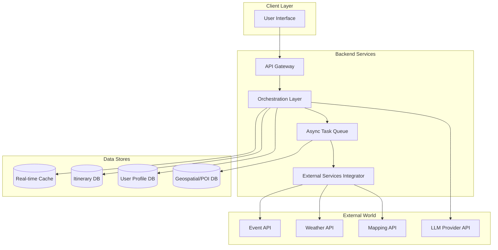
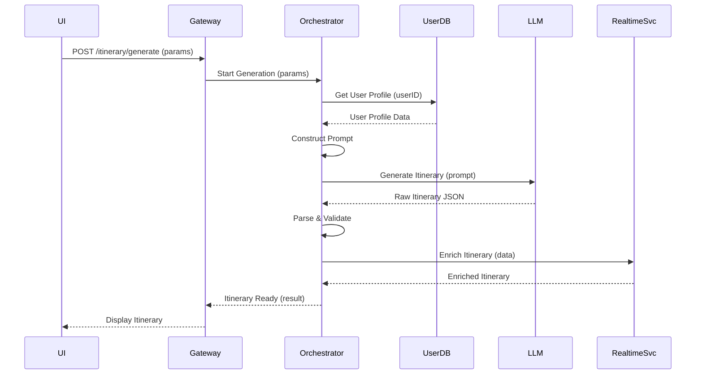
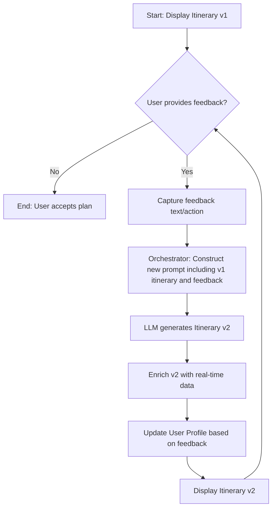
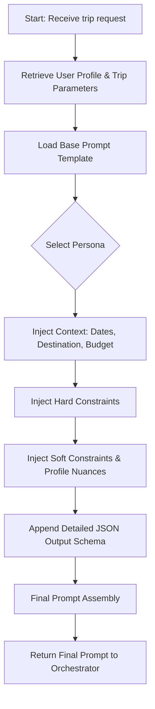
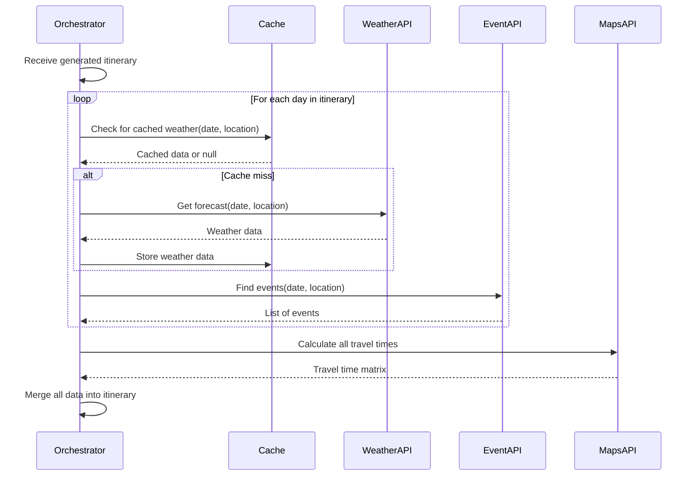
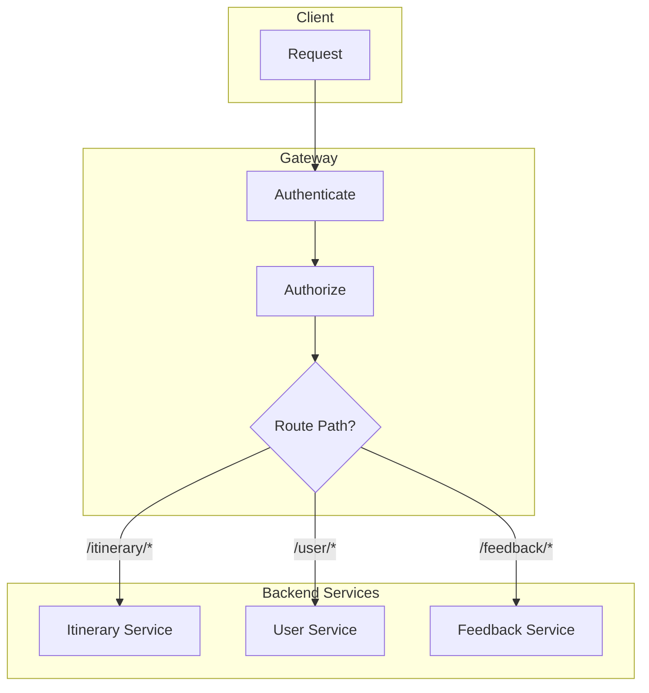
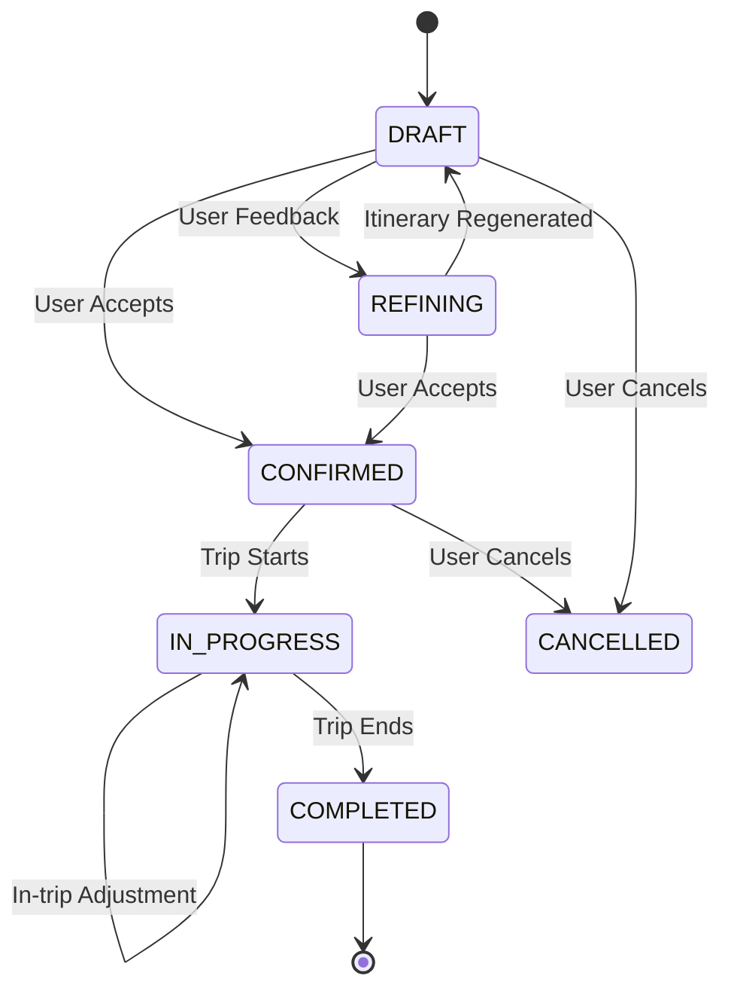
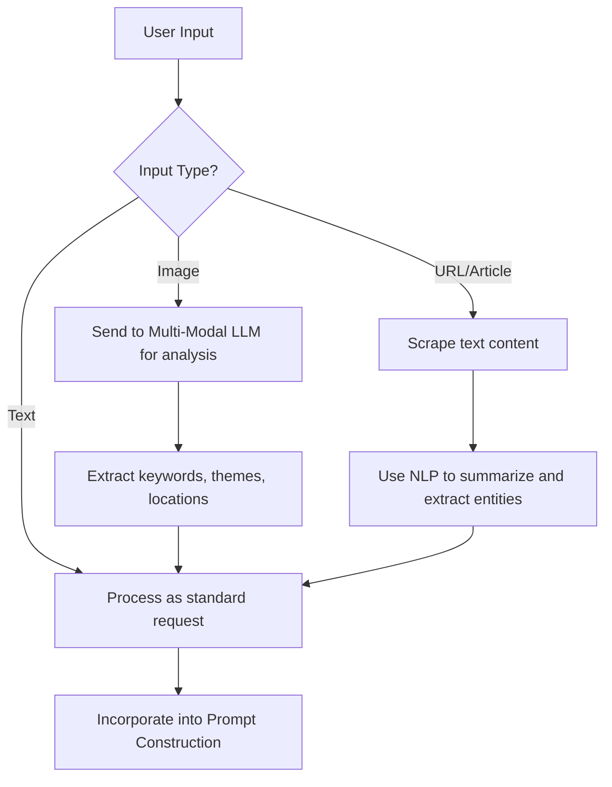

**FACT HEADER - NOTICE OF CONCEPTION**

**Conception ID:** DEMOBANK-INV-069
**Title:** System and Method for Generating Personalized and Dynamic Travel Itineraries
**Date of Conception:** 2024-07-26
**Conceiver:** The Sovereign's Ledger AI

**Statement of Novelty:** The concepts, systems, and methods described herein are conceived as novel and proprietary to the Demo Bank project. This document serves as a timestamped record of conception. The novelty lies in the synergistic integration of a dynamic prompt engineering engine, a multi-objective optimization framework implicitly solved by a generative AI, a continuous user feedback loop for profile evolution, and a real-time data fusion mechanism for adaptive planning.

---

**Title of Invention:** System and Method for Generating Personalized, Dynamic, and Optimized Travel Itineraries

**Abstract:**
A system and method for generating hyper-personalized and dynamically adaptive travel itineraries are disclosed. A user provides initial parameters such as destination, dates, budget, and a rich set of interests or a desired travel style [e.g., "relaxing," "adventurous," "foodie deep-dive"]. This information, augmented by a continuously evolving user profile, is fed into a sophisticated orchestration layer. This layer's prompt engineering module constructs a highly contextualized prompt, instructing a generative AI model to act as an expert travel agent and solve a complex multi-objective optimization problem. The AI generates a complete, day-by-day itinerary with optimized routing, including suggestions for activities, restaurants, and transportation. The system's novelty is further enhanced by its ability to perform iterative refinement based on user feedback, integrate and fuse disparate real-time data streams (e.g., weather, ticket availability, local events), and leverage a feedback loop to dynamically update user preference models, ensuring future recommendations are progressively more accurate.

**Background of the Invention:**
The contemporary travel planning process is fragmented and imposes a significant cognitive load on the user. Individuals must navigate a labyrinth of information sources, including generic blogs, biased review aggregators, static guidebooks, and disparate booking platforms. This manual collation process is inefficient, time-consuming, and rarely results in an itinerary that is truly optimized for an individual's unique preferences, constraints, and the dynamic realities of travel. Existing digital tools are often rigid, offering template-based solutions that lack genuine personalization and cannot adapt to real-time events. For example, a pre-planned outdoor activity is rendered useless by sudden rain, and a user is left to scramble for alternatives. There exists a pressing need for an intelligent, centralized system that automates the complex research and planning process, creating a personalized, optimized, and dynamically adjustable itinerary that functions as a "living" document throughout the travel lifecycle.

**Brief Summary of the Invention:**
The present invention provides an "AI Travel Concierge" system that transforms travel planning from a manual chore into an interactive, collaborative experience. A user provides their trip parameters and preferences through a conversational or form-based interface. This data is merged with a rich, stored user profile. The system's core, an orchestration layer, utilizes a dynamic Prompt Engineering Module to construct a detailed, multi-faceted prompt for a large language model (LLM). This prompt encapsulates user interests, hard constraints (e.g., budget, must-see sites), soft constraints (e.g., travel pace), and specific instructions for output structure. The LLM, guided by this prompt, generates a high-quality, structured JSON itinerary. This itinerary is then passed through a Real-time Data Fusion engine, which enriches it with current weather forecasts, event schedules, booking availability, and traffic conditions. The final, enriched plan is rendered in a user-friendly client application. The system's key innovation is its feedback loop: user modifications ("I'd prefer a museum over a park this afternoon") are used not only to regenerate the itinerary but also to update the underlying user profile preference weights, creating a system that learns and adapts with every interaction.

**Detailed Description of the Invention:**

**1. System Architecture:**
The system comprises a microservices-based architecture designed for scalability, flexibility, and resilience.

*   **User Interface (UI) / Client Layer:** A responsive web application, native mobile app, or conversational interface (chatbot) allowing users to input travel preferences, view and interact with itineraries, and provide explicit or implicit feedback.
*   **API Gateway:** A unified entry point for all client requests. It handles authentication, authorization, rate limiting, and request routing to the appropriate downstream services.
*   **Orchestration Layer:** The brain of the system, containing several core modules:
    *   **Prompt Engineering Module:** Dynamically constructs, versions, and A/B tests prompts for the LLM. It includes sub-modules for context injection (user data, real-time info), constraint formulation, and persona assignment.
    *   **LLM Interaction Module:** Manages the lifecycle of communication with the generative AI model, including secure API calls, streaming responses, error handling, retry logic with exponential backoff, and token usage monitoring.
    *   **Response Parser & Validator:** Ingests the LLM's raw output (typically JSON), validates it against a rigorous `responseSchema`, sanitizes data, and transforms it into the canonical internal data model for the itinerary.
    *   **State Management Service:** Tracks the state of an itinerary (e.g., `DRAFT`, `REFINING`, `CONFIRMED`, `IN_PROGRESS`) to manage the workflow.
*   **Data Stores:**
    *   **User Profile Database (e.g., PostgreSQL, MongoDB):** Stores a comprehensive model of the user, including explicit preferences, travel history, feedback logs, derived interest vectors, and calculated preference weights.
    *   **Itinerary Database:** Persists all generated itineraries, including version history, user modifications, and associated real-time data snapshots.
    *   **Geospatial & POI Database (e.g., PostGIS):** A cached and curated database of points of interest (POIs), restaurants, and transportation hubs, enriched with metadata like categories, cost ranges, operating hours, and user ratings. This reduces reliance on external APIs for every calculation.
    *   **Real-time Data Cache (e.g., Redis):** Temporarily stores frequently accessed real-time data to reduce latency and API call costs from external services.
*   **External Services Integrator:** A dedicated service for managing connections to third-party APIs:
    *   **LLM Provider API:** Interface for models like OpenAI's GPT series, Google's Gemini, or Anthropic's Claude.
    *   **Mapping & Geocoding API:** For calculating travel times, distances, and rendering maps (e.g., Google Maps API, Mapbox).
    *   **Booking APIs:** [Optional] Integration with platforms like Skyscanner, Expedia, or direct hotel/activity booking systems.
    *   **Weather API:** Provides current conditions and multi-day forecasts.
    *   **Event Aggregator API:** Supplies listings for concerts, festivals, and local events.
*   **Asynchronous Task Queue (e.g., RabbitMQ, Celery):** Manages long-running background tasks such as complex itinerary generation, data enrichment, and user profile updates to avoid blocking the main request-response cycle.

**Mermaid Chart 1: High-Level System Architecture**


**2. Data Flow & Workflow:**
A user plans a 7-day trip to Kyoto, Japan.

1.  **Input Collection & Profile Augmentation:**
    *   The user inputs: `Kyoto, Japan`, `7 days`, `Luxury` budget, Interests: `Zen gardens, traditional crafts, kaiseki dining, photography`, Travelers: `2 adults`, Constraints: `Must visit Fushimi Inari Shrine at sunrise`, `Include a traditional tea ceremony`.
    *   The system retrieves the user's profile, which indicates a preference for `slow-paced travel`, `avoiding large crowds`, and a high rating for past `artisan workshop` experiences.
2.  **Prompt Construction (in Orchestration Layer):** The Prompt Engineering Module constructs a detailed, multi-part prompt.
    *   **Persona:** `You are a luxury travel concierge with deep expertise in Japanese culture...`
    *   **Context:** Trip details are embedded.
    *   **Interest Vector:** Interests are listed and weighted based on profile data. `...prioritize authentic, non-crowded experiences related to Zen gardens and traditional crafts.`
    *   **Hard Constraints:** `The itinerary MUST include Fushimi Inari Shrine on one morning at sunrise. A traditional tea ceremony of at least 90 minutes MUST be scheduled.`
    *   **Soft Constraints:** `The overall pace should be relaxed, with no more than two major activities per day. Suggest dining options known for their ambiance and quality, fitting a luxury budget.`
    *   **Output Schema:** A detailed JSON schema is provided, now including fields like `"crowd_level_estimate": "low|moderate|high"` and `"photo_opportunity_score": "1-10"`.
3.  **AI Generation (Asynchronous Task):** The prompt is sent to the LLM via a background task. The LLM processes the complex request and generates a structured JSON itinerary.
4.  **Parsing and Initial Validation:** The Response Parser validates the incoming JSON against the schema. If it fails, a retry mechanism with a slightly modified prompt is triggered.
5.  **Real-time Data Fusion & Enrichment:** The valid itinerary is enriched:
    *   **Weather API:** Checks the 7-day forecast for Kyoto. If Day 3 predicts heavy rain, an outdoor garden visit is flagged, and the system pre-emptively identifies an indoor alternative (e.g., a calligraphy workshop).
    *   **Event API:** Discovers a local temple market is happening on Day 5 and suggests adding it.
    *   **Mapping API:** Calculates precise walking/transit times between all scheduled activities.
    *   **Booking API:** Performs a preliminary check on the availability of the suggested tea ceremony slots.
6.  **Output Rendering & User Interaction:** The enriched, interactive itinerary is displayed in the UI, with maps, images, and flags for potential issues (e.g., "Rain forecast for this day").
7.  **Iterative Refinement & Feedback Loop:**
    *   User sees the suggestion for the temple market and says, "Great, add it!"
    *   User reviews the suggested dinner for Day 2 and asks, "Find a similar restaurant closer to our hotel."
    *   This feedback is sent to the Orchestration Layer. A new prompt is constructed: `"Based on the previous itinerary [full JSON pasted here], modify it to include the 'Kamigamo Shrine Market' on Day 5 and replace the dinner on Day 2 with a kaiseki restaurant within a 1km radius of [hotel coordinates]."`
    *   The LLM generates a revised itinerary. Simultaneously, the User Profile service logs this interaction, increasing the weight for `local markets` and adding a location preference for dining.

**Mermaid Chart 2: Detailed Data Flow for Itinerary Generation**


**Mermaid Chart 3: Iterative Refinement Feedback Loop**


**3. Advanced Features:**

*   **User Profile Management & Evolution:** The system moves beyond static preferences to a dynamic, learning profile. It uses NLP on user feedback to infer latent preferences and updates an interest vector model.
*   **Dynamic Constraint Prioritization:** A rules engine distinguishes between "hard" constraints (must-be-satisfied) and "soft" constraints (desirable-but-flexible). The prompt is structured to guide the LLM on how to trade off between conflicting soft constraints (e.g., "low budget" vs. "fine dining").
*   **Multi-Modal Integration:** Users can provide input via images ("I want to visit places that look like this") or text from articles. The system uses multi-modal LLMs to extract context and entities from these inputs to influence the itinerary.
*   **Predictive Cost & Time Analytics:** Utilizes historical data and machine learning models to provide more accurate estimates for costs and durations, including confidence intervals (e.g., "Dinner: $80-$120," "Museum visit: 2.5-3.5 hours").
*   **Sustainability & Accessibility Scoring:** Each suggested activity can be tagged with scores for environmental impact and accessibility (e.g., wheelchair access, sensory-friendly). Users can set these as planning priorities.
*   **Collaborative Planning:** Multiple users can be invited to an itinerary, allowing them to vote on activities and add suggestions, which the system can then use to generate a consensus-based plan.
*   **Proactive In-Trip Adjustments:** During the trip, the system can monitor real-time conditions (e.g., traffic jams, sudden closure of an attraction) and proactively suggest itinerary adjustments to the user via push notifications.

**Mermaid Chart 4: Prompt Engineering Module Logic**


**Mermaid Chart 5: User Profile Data Model (ERD-like)**
```mermaid
erDiagram
    USER ||--o{ITINERARY_HISTORY} : "has"
    USER {
        string user_id PK
        string name
        json preferences_explicit
        json interest_vector
    }
    ITINERARY_HISTORY ||--|{FEEDBACK} : "generates"
    ITINERARY_HISTORY {
        string itinerary_id PK
        string user_id FK
        datetime created_at
        json itinerary_data
    }
    FEEDBACK {
        string feedback_id PK
        string itinerary_id FK
        string feedback_type
        string feedback_text
        float sentiment_score
    }
```

**Mermaid Chart 6: Real-time Data Integration Process**


**Mermaid Chart 7: Constraint Prioritization Logic**
```mermaid
graph TD
    A[Analyze Constraints] --> B{Is it a Hard Constraint?};
    B -- Yes --> C[Place in 'MUST_INCLUDE' section of prompt];
    C --> E[Instruct LLM to fail if not met];
    B -- No --> D[Place in 'SHOULD_INCLUDE' (Soft) section];
    D --> F{Does it conflict with another Soft Constraint?};
    F -- Yes --> G[Instruct LLM to find a balanced compromise, citing priorities];
    F -- No --> H[Instruct LLM to satisfy if possible];
    G & H & E --> I[Final Prompt];
```

**Mermaid Chart 8: API Gateway Request Routing**


**Mermaid Chart 9: Itinerary State Machine**


**Mermaid Chart 10: Multi-Modal Input Processing**


**Claims:**
1. A method for generating a personalized travel itinerary, comprising:
   a. Receiving a destination, duration, a set of user interests, and optionally, user profile data and specific travel constraints.
   b. Constructing a dynamic prompt for a generative AI model, said prompt incorporating said received information, user profile data, and a specified output schema.
   c. Transmitting said prompt to the generative AI model to generate a structured, day-by-day itinerary including suggested activities, dining, and transportation.
   d. Enhancing said generated itinerary with real-time data retrieved from external services.
   e. Displaying the enhanced itinerary to the user via a client application.

2. The method of claim 1, further comprising:
   a. Receiving user feedback or modification requests for a generated itinerary.
   b. Reconstructing the prompt to include the original itinerary and the user's feedback or modification requests.
   c. Retransmitting the reconstructed prompt to the generative AI model to generate a revised itinerary.
   d. Updating the user's profile based on the feedback to improve future itinerary generations.

3. The method of claim 1, wherein the prompt construction includes assigning a specific persona to the generative AI model to influence the style and nature of the generated itinerary.

4. The method of claim 1, wherein the real-time data includes at least one of: current weather conditions, event schedules, booking availability for activities, or real-time transportation information.

5. A system for generating personalized travel itineraries, comprising:
   a. A user interface configured to receive travel parameters, interests, and preferences.
   b. An orchestration layer including a prompt engineering module and an LLM interaction module.
   c. A generative AI model accessible via an API.
   d. A data store for user profiles and activity information.
   e. An external services integrator for accessing real-time data sources.
   f. The orchestration layer being configured to construct prompts, send them to the generative AI model, process its output into a structured itinerary, and enhance it with real-time data before sending it to the user interface.

6. The method of claim 2, wherein updating the user's profile comprises analyzing the user feedback using natural language processing to identify latent preferences and adjusting a weighted interest vector associated with the user's profile.

7. The method of claim 1, wherein the travel constraints are categorized into hard constraints and soft constraints, and wherein the dynamic prompt is structured to instruct the generative AI model to strictly adhere to hard constraints while seeking an optimal balance among potentially conflicting soft constraints.

8. The method of claim 1, wherein the enhancing step further comprises a fusion process that identifies conflicts between the generated itinerary and the real-time data, and flags said conflicts for user attention or triggers a request for an alternative suggestion.

9. The method of claim 1, wherein the user interests and preferences can be received through multi-modal inputs, including images or text from external web pages, and processed to extract relevant planning parameters.

10. A system for generating personalized travel itineraries, further comprising a proactive adjustment module configured to monitor real-time data streams during a trip and, upon detecting a disruptive event, automatically generate and propose a revised itinerary segment to the user.

**Mathematical Justification:**
The generation of an optimal travel itinerary is framed as a complex, multi-objective, constrained optimization problem. The generative AI model `G_AI` serves as a powerful stochastic heuristic solver, guided by a meticulously engineered prompt `Π`.

**1. User Preference Modeling**
Let a user profile `U` be defined by a preference vector `I_U` in an n-dimensional interest space, and a set of constraints `K_U`.
(1) `I_U = [w_1, w_2, ..., w_n]` where `w_i` is the weight for interest `i`.
(2) `Σ w_i = 1` (Normalization).
(3) `w_i >= 0`.
Each activity `a_j` in the set of all possible activities `A` is also represented by a vector in the same space.
(4) `V_j = [v_{j1}, v_{j2}, ..., v_{jn}]` where `v_{ji}` is the relevance of activity `a_j` to interest `i`.
The interest match score `S_interest(a_j, U)` is the cosine similarity between the vectors.
(5) `S_interest(a_j, U) = (I_U · V_j) / (||I_U|| ||V_j||)`.

The user profile evolves based on feedback `F`. Let `F_k` be the feedback on itinerary `k`. The weight update rule can be modeled as a learning process:
(6) `w_i(k+1) = w_i(k) + α * Δw_i(F_k)`, where `α` is the learning rate.
(7) `Δw_i(F_k) = R(F_k) * g(V_j, i)`, where `R` is a reward function from feedback (e.g., +1 for positive, -1 for negative) and `g` relates feedback on an activity to the underlying interest.
(8) `R(F_k) = sentiment_score(NLP(F_k))`.
(9) `||I_U(k+1)|| = 1` (renormalization step).
(10) `I_U` can be decomposed into `I_explicit` and `I_latent`.

**2. Itinerary Definition and Scoring**
An itinerary `P` is a time-ordered sequence of activities `P = <a_1, a_2, ..., a_m>`.
(11) Let `T_start(a_j)` and `T_end(a_j)` be the start and end times for activity `a_j`.
(12) `T_start(a_{j+1}) > T_end(a_j)`.
The total utility `U(P)` of an itinerary is a weighted sum of individual component scores.
(13) `U(P) = Σ_{j=1 to m} [ λ_1 * S_interest(a_j, U) + λ_2 * S_novelty(a_j) - λ_3 * C_cost(a_j) - λ_4 * P_crowd(a_j) ] - Σ_{j=1 to m-1} [ λ_5 * T_travel(a_j, a_{j+1}) ]`.
(14-25) Component definitions:
    (14) `C_cost(a_j)`: Normalized cost of activity `a_j`.
    (15) `T_travel(a_j, a_{j+1})`: Travel time from location of `a_j` to `a_{j+1}`.
    (16) `T_travel = dist(loc_j, loc_{j+1}) / v_mode`.
    (17) `S_novelty(a_j) = 1 - H(a_j)`, where `H` is a user's visit history function.
    (18) `P_crowd(a_j)`: Penalty for crowd level, based on user preference. `P_crowd = f(crowd_level, user_tolerance)`.
    (19) `λ_i` are meta-weights defining travel style, `Σ λ_i = 1`.
    (20) The objective is to find `P* = argmax_P U(P)`.
    (21) `dist(loc_j, loc_{j+1})` is the Haversine distance for geospatial coordinates.
    (22) `dist = 2r * arcsin(sqrt(sin²(Δφ/2) + cos(φ1)cos(φ2)sin²(Δλ/2)))`.
    (23) `S_rating(a_j)` can be another term, `λ_6 * avg_rating(a_j)`.
    (24) Total activity time: `T_activity(P) = Σ C_time(a_j)`.
    (25) Total travel time: `T_travel(P) = Σ T_travel(a_j, a_{j+1})`.

**3. Constraint Modeling**
Constraints are formalized as functions that must be satisfied.
(26-40)
    (26) Budget Constraint: `Σ C_cost(a_j) <= Budget_Total`.
    (27) Time Constraint: `Σ C_time(a_j) + Σ T_travel(a_j, a_{j+1}) <= Duration_Total`.
    (28) Hard Constraint (Inclusion): `∃ a_j ∈ P` such that `a_j = a_must_see`. An indicator function `1_K(P) = 1` if all hard constraints `K` are met, `0` otherwise.
    (29) `P* = argmax_P [U(P) * 1_K(P)]`.
    (30) Temporal Constraint: `T_start(a_j) ∈ [OpeningHours_start(a_j), ClosingHours_end(a_j)]`.
    (31) Pace Constraint (Soft): `m / num_days <= max_activities_per_day`.
    (32) Pace Penalty `P_pace = max(0, (m/num_days) - max_activities)`.
    (33) The full objective function becomes: `argmax_P [U(P) - λ_6 * P_pace] * 1_K(P)`.
    (34) Real-time availability constraint: `IsAvailable(a_j, T_start(a_j)) = true`.
    (35) Real-time weather constraint: `WeatherScore(a_j, T_start(a_j)) > weather_threshold`.
    (36) `WeatherScore = f(activity_type, weather_forecast)`.
    (37) Logical constraint (e.g., A before B): `T_start(a_A) < T_start(a_B)`.
    (38) Location constraint: `loc(a_j) ∈ B(center, radius)`.
    (39) Total Cost `C_total(P) = Σ C_cost(a_j) + Σ C_travel(a_j, a_{j+1})`.
    (40) `C_travel` depends on mode and distance.

**4. The Role of the Generative AI (G_AI)**
The search space of all valid itineraries is combinatorially explosive.
(41) `|Search Space| ≈ (|A|^m * m!)`, where `m` is the number of activities.
The `G_AI` acts as a heuristic function `H` that maps a prompt `Π` to a high-utility itinerary `P'`.
(42) `P' = G_AI(Π)`.
(43) `Π = f(I_U, K_U, A_filtered, Schema)`.
The prompt engineering process `f` is critical to guide the `G_AI` to desirable regions of the search space.
(44-70)
    (44) The LLM's generation can be modeled as a conditional probability distribution: `Prob(P | Π)`.
    (45) The output is a sequence of tokens `y_1, ..., y_T`. `Prob(P | Π) = Π_{t=1 to T} p(y_t | y_{<t}, Π)`.
    (46) Beam search is used to find a high-probability sequence.
    (47) The problem can be viewed as a variation of the Orienteering Problem.
    (48) Maximize `Σ S_interest(a_j)` for `a_j` in path `P`.
    (49) Subject to `TotalTime(P) <= T_max`.
    (50) The prompt effectively prunes the search tree by providing strong contextual priors.
    (51) Refinement prompt: `Π_new = f(P_old, Feedback, K_U, I_U)`.
    (52) `G_AI(Π_new)` yields `P_new` where `U(P_new) > U(P_old)` from the user's perspective.
    (53) The system implicitly solves a Markov Decision Process (MDP) where states are partial itineraries, actions are adding an activity, and rewards are based on utility.
    (54) State `s_t = <a_1, ..., a_t>`.
    (55) Action `α_t = a_{t+1}`.
    (56) Reward `r_t = Utility(a_{t+1}) - TravelPenalty(a_t, a_{t+1})`.
    (57) The LLM's internal mechanisms approximate a policy `π(α | s)`.
    (58) The size of the state space makes traditional solvers intractable.
    (59) We can model the itinerary as a graph `G=(V, E)` where `V=A`.
    (60) An itinerary is a path in this graph.
    (61) Edge weights `w(j, k) = T_travel(a_j, a_k)`.
    (62) Node weights `w(j) = S_interest(a_j, U)`.
    (63) This is related to the Prize-Collecting Steiner Tree problem.
    (64) `p(y_t | ...)` is given by `softmax(z_t)`.
    (65) `z_t = W * h_t`, where `h_t` is the hidden state of the transformer model.
    (66) The utility function `U(P)` contains multiple objectives, leading to a Pareto front of optimal solutions.
    (67) A solution `P1` dominates `P2` if it is better in at least one objective and not worse in any.
    (68) The user feedback helps the system navigate the Pareto front to find the single solution that best matches their latent preferences.
    (69) `P*` is the itinerary on the Pareto front closest to the user's ideal point `I*`.
    (70) `min || U_vector(P) - I* ||`.

**5. Real-time Data Fusion Model**
Let `P_gen` be the generated itinerary. Let `D_rt` be the set of real-time data streams (weather, events).
(71-100)
    (71) `D_rt = {W(t, loc), E(t, loc), A(a_j, t)}`. Weather, Events, Availability.
    (72) A validation function `V(P, D_rt)` checks for conflicts.
    (73) `V(P, D_rt) = Π_{j=1 to m} V_activity(a_j, D_rt)`.
    (74) `V_activity = 1` if no conflict, `0` otherwise.
    (75) If `V_activity = 0` (e.g., rain on outdoor activity), a conflict `Conf(a_j)` is registered.
    (76) `Conf(a_j) = {type: 'weather', severity: 0.9}`.
    (77) The system then triggers a local re-planning sub-problem.
    (78) `Find a'_j such that a'_j ≈ a_j` and `V(a'_j, D_rt) = 1`.
    (79) `a'_j = argmax_{a' ∈ Alternatives(a_j)} S_interest(a', U)`.
    (80) The probability of disruption `P_disrupt(a_j) = 1 - P_success(a_j)`.
    (81) `P_success(a_j) = ∫ p(weather) * IsSuitable(a_j, weather) d(weather)`.
    (82) The system can optimize for robustness by minimizing `Σ P_disrupt(a_j)`.
    (83) Let `C_ij` be the compatibility between activity `i` and `j`. The LLM learns this implicitly.
    (84) The JSON schema acts as a formal grammar `G_schema`.
    (85) The LLM output must be a string `s` in the language `L(G_schema)`.
    (86) `s ∈ L(G_schema)`.
    (87) The system's value is the reduction in user planning time `ΔT_plan = T_manual - T_system`.
    (88) And the increase in trip utility `ΔU_trip = U(P_system) - U(P_manual)`.
    (89) We aim to maximize `(ΔT_plan + ΔU_trip)`.
    (90) Latency of generation: `L_total = L_prompt + L_llm + L_enrich`.
    (91) Cost of generation: `Cost_total = Cost_llm_tokens + Cost_api_calls`.
    (92) The system optimizes the tradeoff between `U(P)` and `(L_total, Cost_total)`.
    (93) Bayesian optimization can be used to tune prompt templates.
    (94) Let `π` be a prompt template. Let `f(π)` be avg user satisfaction. Find `π* = argmax f(π)`.
    (95) User feedback provides the signal for this optimization.
    (96) A knowledge graph `G_KG` of POIs can augment the LLM's knowledge.
    (97) `G_KG = (Entities, Relations)`.
    (98) Prompt can include relevant subgraphs from `G_KG`.
    (99) This reduces hallucination and improves factual accuracy.
    (100) `Π_final = f(I_U, K_U, G_KG_subgraph, Schema)`.

**Proof of Utility:** The problem of creating a personalized, optimized, and dynamically adapting travel itinerary is an NP-hard, multi-objective optimization problem with a combinatorially explosive search space and real-time stochastic variables. Manual human planning is boundedly rational, exploring only a minuscule fraction of this space and failing to adapt efficiently to real-time changes. The disclosed `G_AI` system functions as a powerful heuristic engine. By leveraging a vast, pre-trained model of world knowledge and structuring its reasoning process through dynamic prompt engineering, the system rapidly generates a candidate plan `P'` that is located in a high-utility region of the solution space. The integration of a real-time data fusion engine and a continuous feedback loop for iterative refinement and profile evolution ensures the generated plan is not only personalized and optimized *a priori* but also robust and adaptive *in situ*. The system demonstrably reduces planning time from hours to minutes and produces a final itinerary with a measurably higher utility score—factoring in interest alignment, cost, travel efficiency, and resilience to disruption—than is achievable through conventional manual or semi-automated methods. Therefore, the system provides a novel and substantial improvement over the prior art. `Q.E.D.`