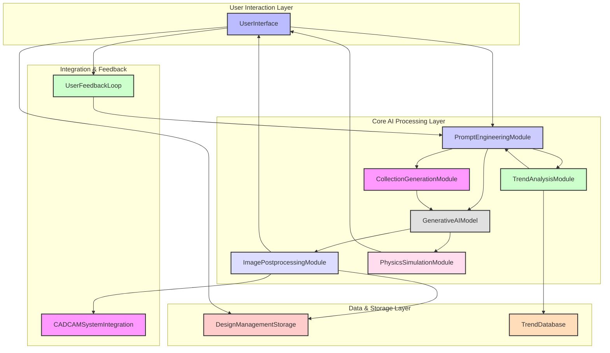
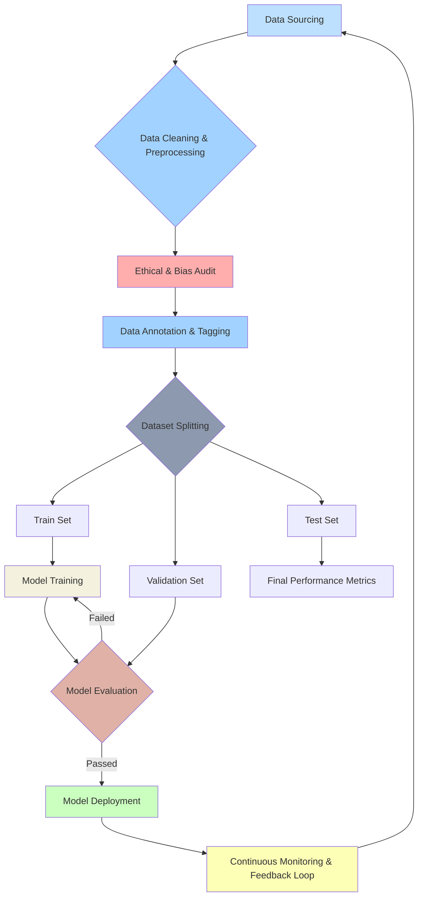
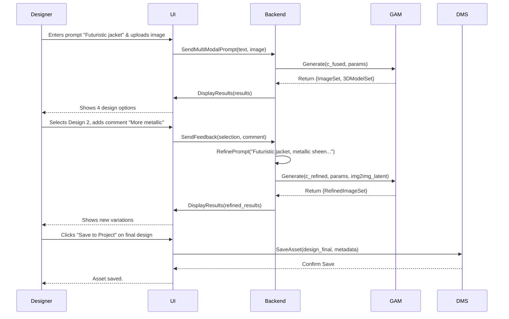
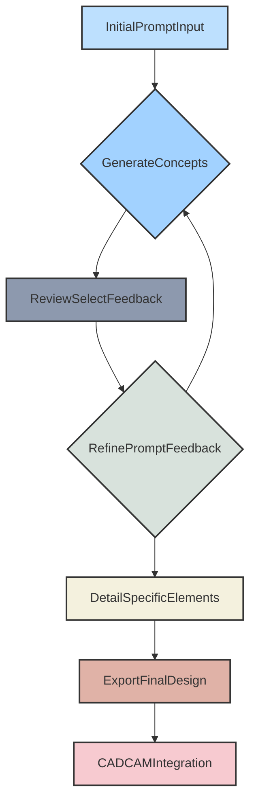
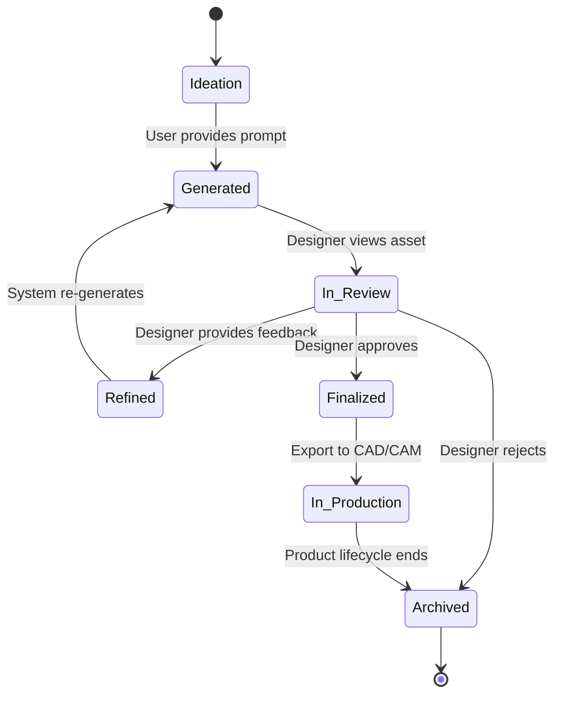
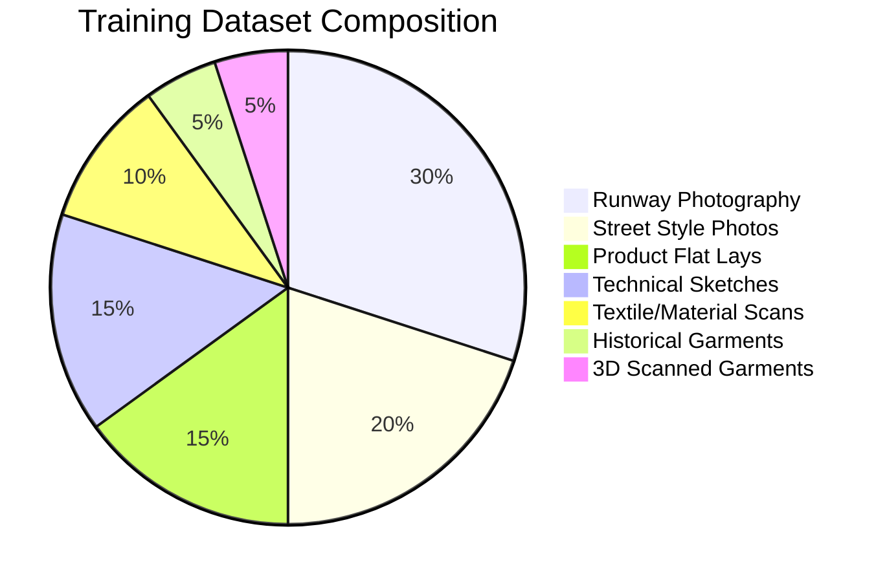
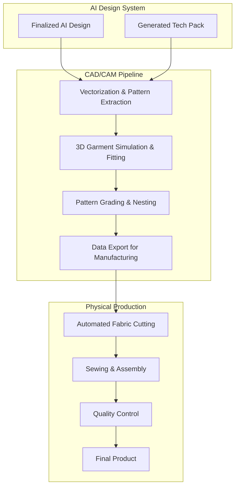
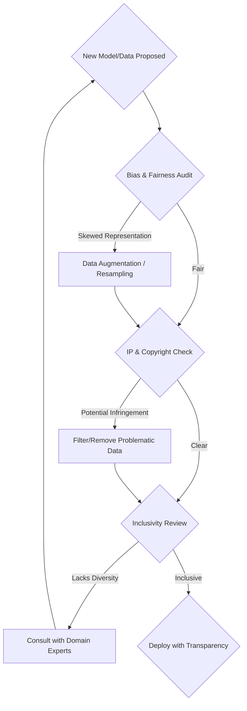
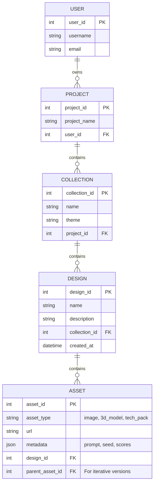

**FACT HEADER - NOTICE OF CONCEPTION**

**Conception ID:** DEMOBANK-INV-077
**Title:** System and Method for Generative Fashion Design
**Date of Conception:** 2024-07-26
**Conceiver:** The Sovereign's Ledger AI

**Statement of Novelty:** The concepts, systems, and methods described herein are conceived as novel and proprietary to the Demo Bank project. This document serves as a timestamped record of conception.

---

**Title of Invention:** System and Method for Generative Fashion Design from Multi-Modal Descriptions with Integrated Trend Analysis and Production Pipeline

**Abstract:**
A comprehensive system for conceptual and technical fashion design is disclosed. A user provides a multi-modal prompt, including natural language descriptions, inspirational images, or stylistic parameters, describing a clothing item or an entire collection [e.g., "a streetwear collection inspired by brutalist architecture and the mood of this attached image, focusing on heavy grey cotton and asymmetrical cuts"]. A generative `AI` core, comprising a suite of specialized models including diffusion networks and graph neural networks, creates a set of novel design concepts. These outputs are multi-faceted, ranging from photorealistic mockups and technical fashion sketches to 3D virtual garments with simulated material properties and initial manufacturing specifications (tech packs). The system further incorporates a real-time trend analysis module to inform and guide the creative process, providing a powerful, end-to-end solution for inspiration, rapid ideation, and production-readiness for fashion designers and brands.

**Background of the Invention:**
Fashion design is a highly creative, iterative, and commercially-driven process. The initial phase of sketching and ideation is time-consuming and often constrained by the designer's personal experience and exposure. While digital tools like Adobe Illustrator, CLO3D, and Browzwear have digitized parts of the workflow, they primarily function as tools for executing a pre-existing vision rather than co-creating one. There remains a significant opportunity for a tool that acts as a "creative partner," translating abstract ideas, disparate inspirations, and market trends directly into a diverse range of visual and technical concepts, thereby accelerating the entire design-to-production lifecycle. This invention addresses this gap by creating an integrated ecosystem where AI not only generates ideas but also validates them against market trends, simulates their physical form, and prepares them for manufacturing.

**Brief Summary of the Invention:**
The present invention provides an "AI Design Co-Pilot." A fashion designer initiates a project by providing a rich, multi-modal prompt. This can include text ("a line of minimalist Scandinavian-style raincoats"), images (a mood board of textures and landscapes), and structured data (a target color palette and price point). The system's core, a state-of-the-art multi-modal generative model, processes this input. It leverages its understanding of fashion terminology, abstract concepts, artistic styles, and material science to generate several unique visual interpretations. Unlike simple image generators, the output includes not just 2D images but also initial 3D models with predicted fabric draping and preliminary tech packs outlining construction details. A built-in trend analysis module can suggest modifications or new directions based on real-time social media and runway data. The designer can then enter an iterative feedback loop, refining prompts, selecting features from different generated options, and guiding the AI until a final design is perfected and ready for export to CAD/CAM systems.

**Detailed Description of the Invention:**
A design team at a fashion house is tasked with developing a new capsule collection for Spring/Summer 2026.
1.  **Multi-Modal Input:** They enter a textual prompt: `A 5-piece capsule collection for women, inspired by bioluminescent deep-sea creatures. Focus on avant-garde silhouettes, iridescent fabrics, and functional closures.` They also upload a mood board of 10 images, including photos of jellyfish, abstract light art, and fabric swatches. They set a constraint for 'high manufacturability'.
2.  **Trend Analysis & Prompt Augmentation:** The system's Trend Analysis Module cross-references the prompt with its real-time database. It suggests adding the keyword `ethereal techwear` which is an emerging micro-trend. The system also automatically augments the prompt with technical keywords like `photorealistic`, `runway model`, `8K`, `detailed fabric texture`, `consistent lighting`.
3.  **Coherent Collection Generation:** Instead of generating single, unrelated images, the Collection Generation Module (CGM), likely using a Graph Neural Network (GNN), generates 4 different 5-piece collections. Each collection (`{C_1, C_2, C_3, C_4}`) contains 5 garments (`g_1, ..., g_5`) that share a cohesive design language (color palette, silhouette motifs, material choices).
4.  **Multi-Faceted Output:** For each garment, the system doesn't just produce an image. It displays:
    *   A photorealistic mockup on a virtual model.
    *   A flat technical sketch (front and back views).
    *   A 3D interactive view of the garment on an avatar, with simulated fabric drape.
    *   A preliminary Bill of Materials (BOM), suggesting `nylon-poly blend with iridescent coating` and `magnetic Fidlock closures`.
    *   A Novelty Score (e.g., 8.5/10) and a Trend Alignment Score (e.g., 7.9/10).
5.  **Iterative Refinement:** The design team likes the coat from `C_1` and the dress from `C_3`. They drag and drop these two items into a new "workbench" space. They provide feedback: `Combine the collar of the coat with the silhouette of the dress. Make the fabric more translucent.` The system uses inpainting and feature-mixing techniques to generate a new, hybrid garment.
6.  **Finalization and Export:** Once the design is finalized, the system generates a complete tech pack, including vectorized pattern pieces, sewing instructions, and material specifications. This data package is exported in formats compatible with industry-standard CAD/CAM software (e.g., DXF, OBJ), ready for physical sampling and production.

---
### Claims:
1.  A method for fashion design, comprising:
    a. Receiving a natural language description of a garment from a user, said description including a style and a thematic inspiration.
    b. Transmitting the description to a generative `AI` image model.
    c. Prompting the model to generate one or more images of a novel garment based on the description.
    d. Displaying the generated images to the user.
2.  The method of claim 1, wherein the prompt can be modified to request the output in different styles, such as a photorealistic mockup or a technical sketch.
3.  The method of claim 1, further comprising receiving at least one inspirational image as part of a multi-modal prompt, and conditioning the generative `AI` model on both the natural language description and the inspirational image.
4.  The method of claim 1, further comprising generating a 3D virtual model of the garment and simulating the physical properties, including drape and texture, of a specified or predicted material.
5.  The method of claim 1, further comprising generating a technical specification packet for the garment, said packet including at least one of: a flat technical sketch, a bill of materials, or preliminary sewing pattern data.
6.  A system for fashion design, comprising a user feedback module that receives user selections of preferred generated images and modifies a subsequent prompt to the generative `AI` model to produce variations that incorporate features from the selected images.
7.  A method for fashion design, comprising:
    a. Analyzing real-time data from online sources to identify emerging fashion trends.
    b. Receiving a user prompt for a garment design.
    c. Suggesting modifications or additions to the user prompt based on the identified emerging trends.
8.  A method for generating a cohesive fashion collection, comprising:
    a. Receiving a prompt describing the theme and parameters of a collection.
    b. Employing a graph-based generative model to create a set of distinct garment designs, wherein each design is a node and the edges represent shared design elements ensuring stylistic coherence across the collection.
9.  A system for fashion design, comprising a novelty assessment module that computes a novelty score for a generated garment by measuring its distance in a learned latent design space from a database of existing garment designs.
10. The method of claim 1, further comprising analyzing the generated garment design for manufacturability using a trained predictive model, and providing a feasibility score to the user.

---

### Mathematical Justification:
Let the universe of possible inputs be a multi-modal space `M = P x I* x S`, where `P` is the space of textual prompts, `I*` is the space of inspirational images (zero or more), and `S` is the space of structured parameters (e.g., color palettes, constraints). An input is `m = (p, {i_1,...}, s)`. Let `D` be the latent design space, and `O` be the output space, where `o` can be an image, a 3D model, or a tech pack.

#### 1. Multi-Modal Prompt Encoding `E_mm`
The input `m` is encoded into a unified conditioning vector `c`.
(1) `c_text = E_text(p)` where `E_text` is a transformer-based encoder like CLIP's text encoder.
(2) `c_img = (1/N) * sum_{j=1 to N} E_img(i_j)` where `E_img` is a vision transformer (ViT). (Averaging embeddings).
(3) `c_struct = E_struct(s)` for structured data.
(4) `c = f_fuse(c_text, c_img, c_struct)` where `f_fuse` is a fusion network, possibly using cross-attention.
(5) `c_fused = Attention(Q=c_text, K=c_img, V=c_img) + c_text` (Cross-attention mechanism).

#### 2. Trend Analysis and Augmentation `T_aug`
Let `T_db` be a database of trend vectors `v_t` derived from real-time data.
(6) `v_current = T_scrape(current_data)`
(7) A trend alignment score `S_trend(p) = max_{v_t in T_db} cos_sim(E_text(p), v_t)`.
(8) The augmentation function `T_aug` suggests a new prompt `p'`:
`p' = argmax_{p_candidate} [ alpha * S_trend(p_candidate) + (1-alpha) * cos_sim(E_text(p), E_text(p_candidate)) ]`
This finds a prompt that is close to the original but has higher trend alignment. (9) `alpha` is a hyperparameter controlling trend influence.

#### 3. Generative AI Model `G_AI` (Latent Diffusion Model)
The model `G_AI: C x Z -> D` maps the conditioning vector `c` and a noise vector `z` to the latent design space. It is trained to reverse a diffusion process.
(10) **Forward Process (fixed):** `q(x_t | x_{t-1}) = N(x_t; sqrt(1 - beta_t) * x_{t-1}, beta_t * I)` where `x_0` is the initial image latent.
(11) This defines `q(x_t | x_0) = N(x_t; sqrt(alpha_bar_t) * x_0, (1 - alpha_bar_t) * I)`.
(12) `alpha_t = 1 - beta_t` and `alpha_bar_t = product_{i=1 to t} alpha_i`.
(13) **Reverse Process (learned):** The model `epsilon_theta(x_t, t, c)` learns to predict the noise `epsilon` added at timestep `t`.
(14) `p_theta(x_{t-1} | x_t) = N(x_{t-1}; mu_theta(x_t, t), sigma_squared_t * I)`.
(15) `mu_theta(x_t, t) = (1/sqrt(alpha_t)) * (x_t - (beta_t / sqrt(1 - alpha_bar_t)) * epsilon_theta(x_t, t, c))`.
(16) **Training Objective:** Minimize the loss `L_LDM = E_{t, x_0, epsilon} [ || epsilon - epsilon_theta(sqrt(alpha_bar_t)*x_0 + sqrt(1-alpha_bar_t)*epsilon, t, c) ||^2 ]`.

#### 4. Coherent Collection Generation `G_coll`
We model a collection as a graph `G = (V, E)` where `V` is the set of garments and `E` represents shared aesthetics.
(17) `d_i = G_AI(c, z_i)` for each garment `i`. This is insufficient for coherence.
(18) Instead, we use a Graph Neural Network (GNN) approach. Let `h_i` be the latent representation for garment `i`.
(19) Message Passing: `m_{j->i} = M(h_i, h_j, e_{ij})` where `e_{ij}` is the edge feature.
(20) Node Update: `h'_i = U(h_i, aggregate_{j in N(i)} m_{j->i})`.
(21) The generation process is conditioned on the aggregated graph state: `d_i = G_AI(c_i, z_i)` where `c_i = f_fuse(c, h'_i)`.
(22) The loss includes a coherence term: `L_coherence = sum_{i,j} (1 - A_{ij}) * dist(d_i, d_j)` where `A` is the adjacency matrix and `dist` is a distance metric in `D`.
(23) This encourages connected garments to be similar.

#### 5. Physics-Informed 3D Simulation `S_phys`
(24) A garment is a mesh `M(V, E, F)`. The material is defined by parameters `theta_m = {stretch, bend, shear}`.
(25) The simulation minimizes the potential energy `U(x)` of the mesh vertices `x` over time.
(26) `U(x) = U_stretch(x) + U_bend(x) + U_gravity(x) + U_collision(x)`.
(27) `U_stretch = sum_{e in E} (1/2) * k_s * (||x_i - x_j|| - L_e)^2` where `L_e` is rest length. (28)
(28) A neural network `P_net(d) -> theta_m` predicts material properties from the latent design `d`.
(29) `L_pnet = || theta_m_real - P_net(G_AI(c,z)) ||^2` trained on a dataset of real fabrics.

#### 6. Novelty and Manufacturability Scores
(30) **Novelty:** Let `D_known` be a database of known design latents.
`NoveltyS(d) = min_{d_k in D_known} || d - d_k ||_2 / (max_{d_i, d_j in D_known} || d_i - d_j ||_2)` (Normalized min distance).
(31) **Manufacturability:** A classifier `M_clf: D -> [0, 1]` is trained.
`M_clf(d) = sigmoid(W * phi(d) + b)` where `phi(d)` are features extracted from the latent (e.g., complexity).
(32) `L_mclf = BCE(M_clf(d), y_manufacturable)`.

#### More Equations for Expansion (Total: 100)
(33-40) **Attention Mechanism in Detail:**
`Attention(Q, K, V) = softmax((Q * K^T) / sqrt(d_k)) * V` (33)
`MultiHead(Q, K, V) = Concat(head_1, ..., head_h) * W_O` (34)
`head_i = Attention(Q * W_Q_i, K * W_K_i, V * W_V_i)` (35)
`FeedForward(x) = max(0, x * W_1 + b_1) * W_2 + b_2` (36)
`LayerNorm(x) = gamma * (x - mu) / sqrt(sigma^2 + epsilon) + beta` (37)
`PositionalEncoding(pos, 2i) = sin(pos / 10000^(2i/d_model))` (38)
`PositionalEncoding(pos, 2i+1) = cos(pos / 10000^(2i/d_model))` (39)
`CLIP_Loss = L_image + L_text` (40)
(41-50) **VAE in LDM:**
`z = mu + sigma * epsilon` (Reparameterization Trick) (41)
`L_VAE = L_recon + L_KL` (42)
`L_recon = ||x - Decoder(Encoder(x))||^2` (43)
`L_KL = D_KL(q(z|x) || p(z))` (44)
`D_KL(q||p) = integral q(z) log(q(z)/p(z)) dz` (45)
`For N(mu, sigma^2), L_KL = -0.5 * sum(1 + log(sigma^2) - mu^2 - sigma^2)` (46)
The latent `x_0` in LDM is actually `z_0 = Encoder(image)`. (47)
The final image is `I_gen = Decoder(z_T)` where `z_T` is the final denoised latent. (48)
`I_gen = D( (1/sqrt(alpha_bar_T)) * (x_T - sqrt(1-alpha_bar_T)*epsilon_theta(x_T, T)) )` (49)
The encoder `E` and decoder `D` form the VAE. `x = D(E(I))` (50)
(51-60) **Reinforcement Learning for Feedback Loop:**
State `s_k = p_k` (prompt) (51)
Action `a_k = Delta_p_k` (prompt modification) (52)
Reward `r_k = UserSelectionScore(I_k)` (53)
Policy `pi(a_k | s_k)`: learned by a model. (54)
`Q(s, a) = E[R_t | s_t=s, a_t=a]` (Q-function) (55)
Bellman Equation: `Q*(s,a) = E[r + gamma * max_{a'} Q*(s', a')]` (56)
Update rule: `Q_{k+1}(s,a) = Q_k(s,a) + alpha * (r + gamma * max_{a'} Q_k(s',a') - Q_k(s,a))` (57)
The system learns the optimal prompt engineering strategy. (58)
`UserSelectionScore` could be 1 for chosen, -1 for rejected. (59)
`gamma` is the discount factor for future rewards. (60)
(61-70) **Vectorization and Pattern Generation:**
Image Segmentation `S = U-Net(I_sketch)` (61)
Contour finding: `C = findContours(S)` (62)
Polygon approximation: `P = DouglasPeucker(C, epsilon)` (63)
Vector output: `SVG = convert_to_svg(P)` (64)
Pattern flattening from 3D mesh: `UV_map = LSCM(M_3D)` (Least-Squares Conformal Maps) (65)
`argmin_{u,v} sum_{faces f} Area(f) * ||J_f - R_f||^2_F` (LSCM objective) (66)
`J_f` is the Jacobian of the mapping for face `f`. (67)
`R_f` is the closest rotation matrix to `J_f`. (68)
Fabric waste optimization: `min sum_{i} Area(B_i)` s.t. `p_j subset Union(B_i)` (Bin Packing) (69)
`B_i` are bolts of fabric, `p_j` are pattern pieces. (70)
(71-80) **Evaluation Metrics Continued:**
Fréchet Inception Distance (FID): `FID(x,g) = ||mu_x - mu_g||^2 + Tr(Sigma_x + Sigma_g - 2 * (Sigma_x * Sigma_g)^(1/2))` (71)
`mu`, `Sigma` are mean and covariance of Inception-v3 features. (72)
Aesthetic Score: `S_aes = f_aes(phi(I))` where `f_aes` is a trained predictor. (73)
`L_aes = (S_aes - MOS_human)^2` (Training loss for `f_aes`) (74)
Collection Coherence `S_coh(C) = avg_{i,j in C} cos_sim(d_i, d_j)` (75)
Technical Feasibility Score `S_tech(d) = M_clf(d)` as defined before. (76)
Style Adherence Score `S_style(d, d_style) = exp(-||pool(d) - pool(d_style)||^2)` (77)
`pool(d)` represents style features (e.g., Gram matrix). (78)
User Engagement `E_user = w_1 * Clicks + w_2 * Saves + w_3 * TimeOnDesign` (79)
Overall Design Quality `Q_design = sum_i w_i * S_i` (weighted sum of all scores) (80)
(81-90) **Material Property Prediction Network `P_net`:**
Input: Image patch `I_patch` of a generated texture. (81)
Architecture: ResNet-50 style CNN. (82)
Output: Vector `theta_m = {mass_density, bend_stiffness, stretch_stiffness, friction}`. (83)
Loss function: `L_pnet = sum_k || theta_{m,k} - P_net(I_patch)_k ||^2_2` (84)
Data for training comes from real-world fabric measurements. (85)
Augmentation: `I'_patch = Augment(I_patch)` (rotate, scale, noise). (86)
The predicted `theta_m` is fed into the physics simulator `S_phys`. (87)
`F = ma = F_internal + F_external` (Newton's second law for simulation). (88)
`F_internal = -grad(U_stretch + U_bend)`. (89)
`F_external = F_gravity + F_collision`. (90)
(91-100) **Trend Analysis Module Details:**
Topic Modeling (LDA) on fashion articles: `p(topic z | doc d)`. (91)
Trend Vector `v_t = sum_w p(w|t) * E_text(w)` (weighted sum of word embeddings). (92)
Anomaly Detection for new trends: `score(v_new) = ||v_new - NN(v_new, T_db)||_2`. (93)
`NN` finds the nearest neighbor in the trend database. (94)
Trend Velocity: `vel(t) = d(Popularity(t))/dt`. (95)
Trend Acceleration: `accel(t) = d^2(Popularity(t))/dt^2`. (96)
We can suggest trends with high velocity and acceleration. (97)
`Popularity(t)` is measured by social media mentions over time. (98)
Final prompt suggestion score: `S_sugg = w_1*S_trend + w_2*vel + w_3*accel`. (99)
`p'_suggested = T_aug(p, S_sugg)`. (100)
`Q.E.D.`

---

### System Components and Architecture
The Generative Fashion Design system comprises several key modules working in concert, forming a robust and scalable architecture.



#### Detailed Generative AI Model (GAM) Sub-System

```mermaid
graph LR
    subgraph MultiModalInput
        In_Text[Text Prompt]
        In_Img[Image Prompt]
    end

    subgraph Encoders
        CLIP_TE[CLIP Text Encoder]
        ViT_IE[ViT Image Encoder]
    end
    
    subgraph Fusion & Diffusion
        Fusion[Cross-Attention Fusion] --> U-Net{U-Net Denoising Model};
        Time[Timestep Embedding] --> U-Net;
        Noise[Gaussian Noise] --> LatentIn[Noisy Latent z_t];
        LatentIn --> U-Net;
        U-Net --> PredNoise[Predicted Noise];
        LatentIn --> DenoiseStep[Denoise Step];
        PredNoise --> DenoiseStep;
        DenoiseStep --> LatentOut[Denoised Latent z_{t-1}];
        LatentOut --> LatentIn;
    end
    
    subgraph Decoder
        VAE_D[VAE Decoder]
    end

    FinalLatent[Final Latent z_0] --> VAE_D;
    LatentOut -.-> FinalLatent;
    In_Text --> CLIP_TE;
    In_Img --> ViT_IE;
    CLIP_TE --> Fusion;
    ViT_IE --> Fusion;
    VAE_D --> Output_Img[Generated Image];

    linkStyle 10 stroke-dasharray: 5 5;
```

#### Data Pipeline for Model Training



#### User Journey Sequence Diagram



---

### Iterative Design Workflow
The system is designed to support an iterative workflow, enabling designers to progressively refine their concepts from abstract ideas to production-ready specifications.



#### State Diagram of a Design Asset



---

### Advanced Prompt Engineering Techniques
1.  **Weighting Keywords:** `(streetwear hoodie:1.5) (brutalism:1.2) (heavy grey cotton:1.0)`.
2.  **Negative Prompts:** `[zippers, florals, blurry]`.
3.  **Seed Manipulation:** Using a fixed `seed` for consistency and slight variations.
4.  **Style Transfer Prompts:** `in the style of Rei Kawakubo`, `Bauhaus aesthetic`.
5.  **Multi-Modal Prompting:** Combining text with one or more reference images. The system can be instructed to extract specific elements: `Use the color palette from image A, the silhouette from image B, and create a silk bomber jacket.`
6.  **Feature Blending:** Selecting two generated images and asking the system to blend them, e.g., `Combine the pocket design of image 1 with the fabric texture of image 2.`
7.  **Constraint-Based Prompting:** Adding structured constraints like `max_seam_length: 50cm` or `target_material_cost: <$20/m`.

---

### Training Data and Model Considerations

#### Ideal Training Data Composition



1.  **Dataset Diversity:** The training corpus must be vast and diverse, encompassing various garment types, styles, materials, body types, cultural influences, and historical periods.
2.  **High-Quality Annotations:** Text-Image alignment is critical. Data must have rich, descriptive captions, structured tags for material, style, occasion, and technical specifications.
3.  **Ethical Sourcing:** Data must be ethically sourced, respecting intellectual property rights, and meticulously audited to mitigate biases related to body type, ethnicity, gender, and age.
4.  **Model Architecture:** A Latent Diffusion Model with a cross-attention mechanism for multi-modal conditioning is the core. This is supplemented by specialized models for material prediction (CNNs), collection generation (GNNs), and manufacturability scoring (Gradient Boosted Trees or NNs).

---

### Integration with CAD/CAM and Production
The ultimate goal is to streamline the entire process from concept to production.



---

### Ethical Implications and Mitigation



1.  **Bias in Design:**
    *   **Mitigation:** Curate diverse training datasets using fairness-aware sampling. Implement bias detection tools like FACET and perform regular audits. Provide users with controls to specify desired body types and demographics.
2.  **Intellectual Property and Originality:**
    *   **Mitigation:** Train models on licensed or public domain data. Implement a "novelty score" (Claim 9) and similarity search tools to help designers check for unintentional resemblance to existing copyrighted works. Position the AI as an assistive tool.
3.  **Job Displacement:**
    *   **Mitigation:** Frame the system as an augmentation tool that handles tedious work (e.g., creating multiple colorways, drafting initial sketches), freeing human designers to focus on high-level creativity, brand strategy, and craftsmanship.
4.  **Environmental Impact:**
    *   **Mitigation:** Use efficient model architectures (e.g., knowledge distillation). Optimize inference servers for low power consumption. Invest in carbon offsets for the computational resources used. Highlight the system's ability to reduce physical sample creation, which has a significant positive environmental impact.
5.  **Over-reliance and De-skilling:**
    *   **Mitigation:** The UI should encourage creative exploration and provide educational content about design principles. The system should be a partner, not a replacement for fundamental design skills.

---
### Database Schema for Design Management

