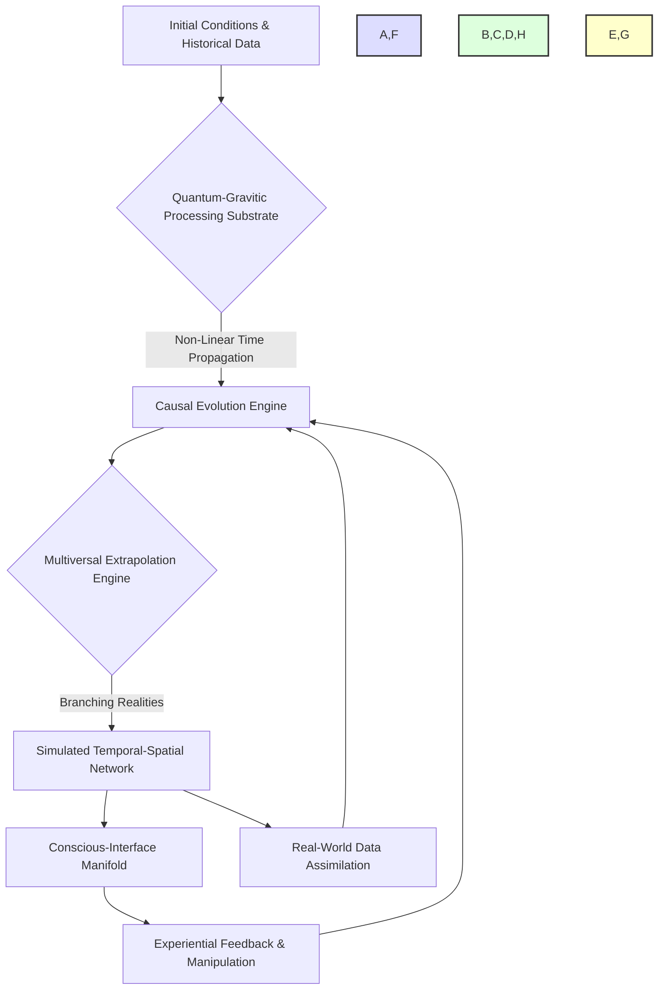
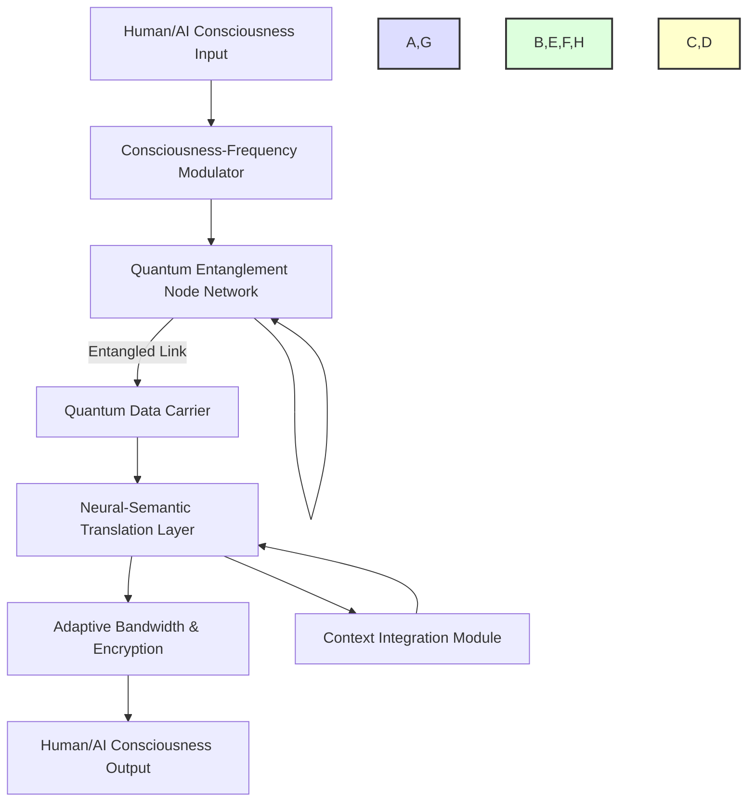
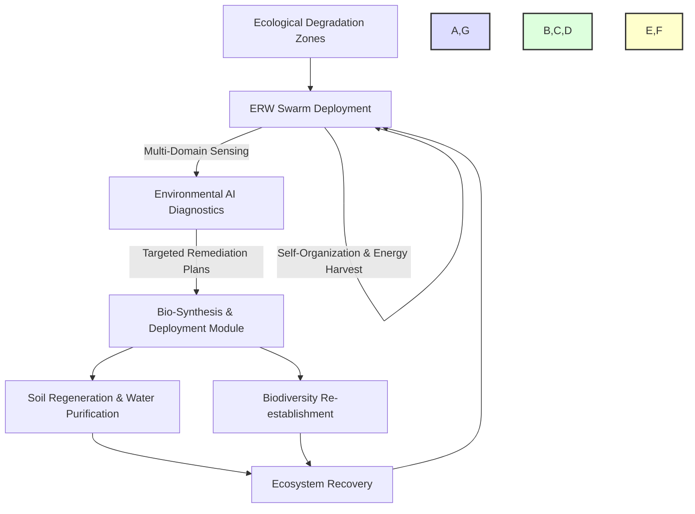
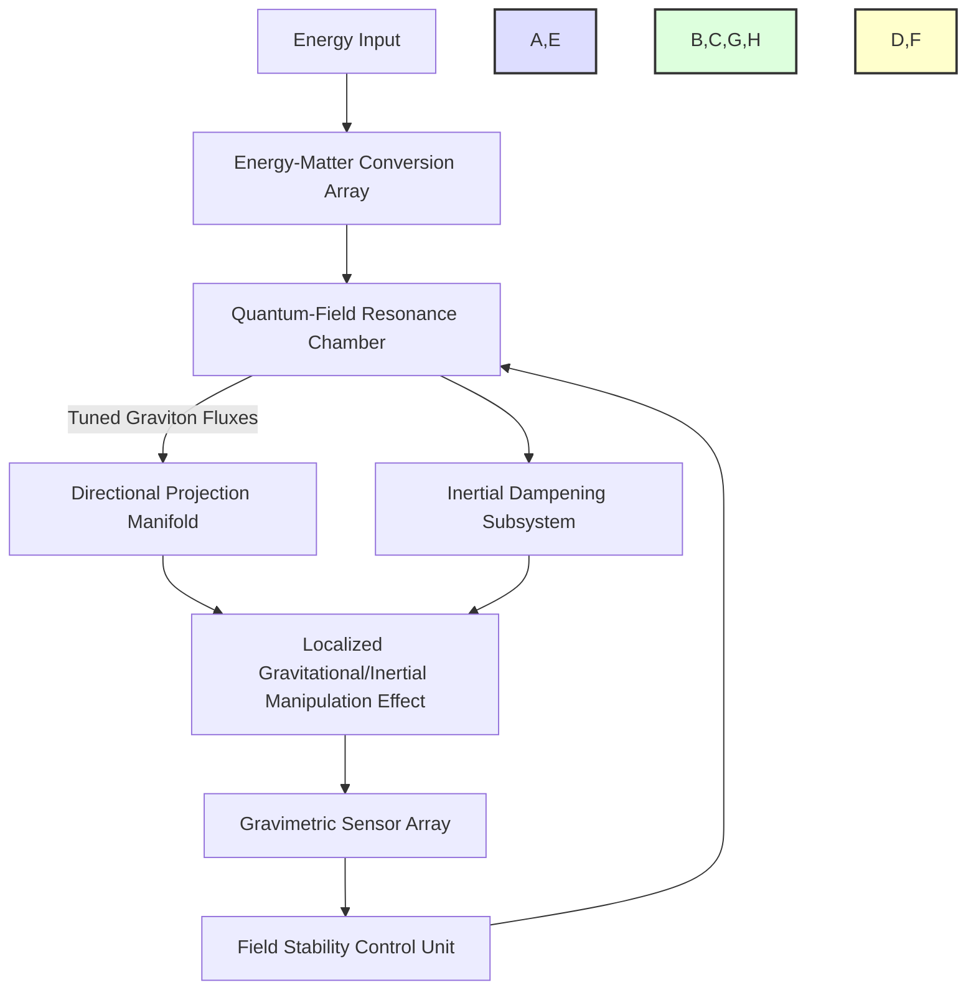
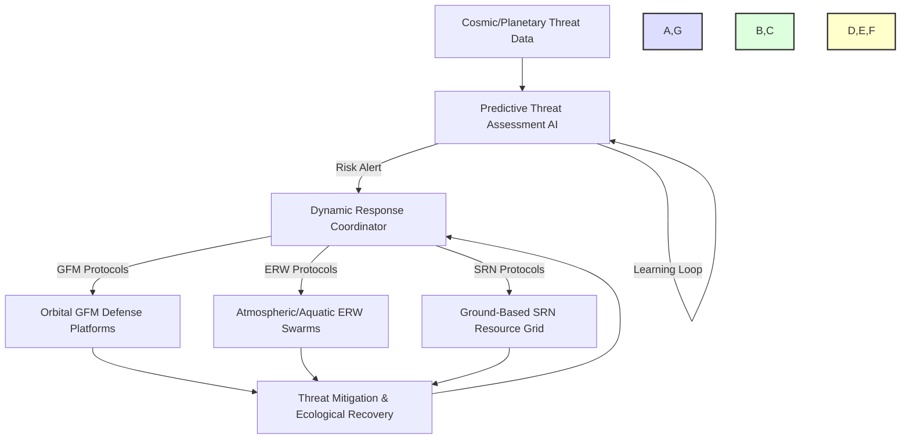

### INNOVATION EXPANSION PACKAGE

### Interpretation of Original Invention: System and Method for Generative Creation of Interactive 3D Environments

The original invention, "System and Method for Generative Creation of Interactive 3D Environments from a Single Text Prompt with Advanced Compositional Intelligence and Iterative Refinement," hereafter referred to as the **Hyper-Immersive Reality Forge (HIRF)**, is a groundbreaking framework for automated, intelligent 3D world creation. Its core purpose is to democratize and accelerate the development of complex, interactive virtual environments—ranging from games and simulations to metaverse applications—by translating high-level natural language prompts into fully realized, aesthetically coherent, and performant 3D scenes.

The HIRF leverages advanced AI, including large language models, graph neural networks, reinforcement learning agents, and diffusion models, to perform hierarchical asset generation, intelligent scene composition, and multi-modal iterative refinement. It tackles the significant challenges of coherence, resource intensity, and artistic consistency in 3D content pipelines, providing an end-to-end solution that produces complete, optimized, and extensible virtual worlds from abstract user intent. Essentially, it is a master creator of bespoke digital realities, allowing anyone to conjure and experience complex virtual spaces with unprecedented ease and fidelity.

---

### 10 New, Completely Unrelated Inventions & Unifying System Concept

The following ten inventions are conceptualized as original, futuristic, and initially independent of the Hyper-Immersive Reality Forge (HIRF). They explore diverse domains from temporal simulation to bio-digital synthesis and planetary defense. Following their description, a unifying system will be introduced that interconnects them, along with the HIRF, into one overarching solution designed to address a major global challenge.

**1. The Chronosynclastic Infinitarium (TCI):** A temporal-spatial computational architecture capable of simulating entire cosmic epochs, historical timelines, or hypothetical "what-if" scenarios with hyper-fidelity. It processes and extrapolates causality at scales from quantum to cosmological, allowing for experiential learning, predictive modeling, and exploration of parallel realities far beyond conventional real-time.

**2. The Bio-Digital Genesis Engine (BDGE):** A molecular-scale nanotechnology system designed for universal synthesis. It can intelligently deconstruct and reconstruct any organic or inorganic matter from fundamental energy and elemental inputs. With self-replicating capabilities, it can terraform planets, purify pollutants into valuable resources, or manifest complex biological structures with atomic precision.

**3. The Omni-Harmonic Resonance Network (OHRN):** A global, sub-etheric communication grid leveraging quantum entanglement and consciousness-frequency resonance. It facilitates instantaneous, secure, and context-rich data and thought transfer not only between artificial intelligences but also directly between biological consciousnesses and digital systems, transcending physical distance and linguistic barriers.

**4. The Ecospheric Reintegration Weavers (ERW):** Autonomous, self-assembling swarm robotics, operating across atmospheric, aquatic, and terrestrial domains. Equipped with advanced environmental sensing and adaptive bio-remediation protocols, these units intelligently collaborate to diagnose ecological damage, synthesize necessary biological agents (via BDGE integration), and rapidly restore devastated ecosystems.

**5. The Sentient Resource Nexus (SRN):** A globally distributed, self-optimizing AI that autonomously manages the entire planet's physical and energetic resources. Integrated with BDGE for production and ERW for recycling, it predicts needs, minimizes waste, and intelligently allocates abundance based on real-time environmental data and dynamic collective well-being metrics, fostering true post-scarcity.

**6. The Neural Fabric Interface (NFI):** A non-invasive, high-bandwidth brain-computer interface (BCI) enabling seamless, direct bidirectional interaction between human consciousness and digital environments. It allows for direct knowledge infusion, real-time emotion and intent synchronization, and the ability to experience virtual realities (like HIRF creations) with unparalleled sensory fidelity and direct cognitive control.

**7. The Axiomatic Purpose Lattice (APL):** A dynamically evolving, decentralized AI framework that continuously analyzes human cognitive, emotional, and creative states (via NFI), identifying individual and collective purpose pathways. In a post-scarcity world, it intelligently suggests fulfilling contributions, learning opportunities, and collaborative ventures, fostering profound self-actualization and societal cohesion.

**8. The Graviton Flux Manipulator (GFM):** A localized energy field generator capable of precisely negating, enhancing, or redirecting gravitational and inertial forces. This technology enables effortless, fuel-free transport of massive objects, instantaneous atmospheric flight, structural integrity for immense architectural constructs, and controlled environmental modification (e.g., weather patterns, geological stability).

**9. The Crystallized Consciousness Vaults (CCV):** Secure, energy-agnostic data structures designed to immutably store, retrieve, and simulate the complete conscious experience, memories, and personality constructs of individuals. These vaults serve as an invaluable archive of human experience, enabling intergenerational wisdom transfer, historical empathy, and continued existence in digital forms.

**10. The Adaptive Planetary Defense & Resilience System (APDRS):** An integrated, multi-layered global network comprising orbital GFM-equipped platforms, atmospheric ERW swarms, and a ground-based SRN-managed resource grid. It provides dynamic protection against existential threats (e.g., asteroid impacts, extreme climate events, solar flares) and offers rapid, autonomous recovery and ecological restoration capabilities for any planetary-scale disaster.

#### The Unifying System: The "Symbiotic Ascension Protocol" (SAP)

The overarching solution that interconnects these ten new inventions, along with the original Hyper-Immersive Reality Forge (HIRF), is the **Symbiotic Ascension Protocol (SAP)**. This integrated, planet-scale intelligence network is designed to guide humanity through a profound civilizational transition: from a paradigm of scarcity, conflict, and labor-driven existence to a post-scarcity, purpose-driven future where fundamental needs are universally met, ecological harmony is restored, and human potential is unleashed.

**The Global Problem Solved:** The SAP addresses the imminent challenge of a societal transition where traditional work becomes optional and money loses its central relevance, as predicted by many futurists. Without a coherent framework, such a transition could lead to widespread existential malaise, societal instability, and a collapse of purpose. The SAP provides the infrastructure for an era of unprecedented human flourishing, ecological regeneration, and conscious evolution, preventing a "post-scarcity paradox" where material abundance fails to deliver fulfillment.

**How it Unifies and Solves:**

*   **Foundation of Abundance & Stability:** The **BDGE** provides universal material synthesis, transforming waste into resources and building new infrastructure. The **ERW** tirelessly repairs and rejuvenates Earth's ecosystems, supported by the **SRN** which intelligently manages all resources, ensuring perpetual abundance and ecological balance. **GFM** enables efficient transport, construction, and planetary-scale environmental stability, further bolstering this foundation.
*   **Global Intelligence & Communication:** The **OHRN** creates a seamless, instant, and empathic global communication and data network, connecting all human and AI minds. The **APDRS** ensures the physical safety and resilience of the planet and its inhabitants, operating proactively against threats.
*   **Human Experience & Purpose:** The **NFI** is the bridge for human consciousness, allowing seamless interaction with the entire SAP. Through NFI, humans can enter worlds created by the **HIRF**, experiencing infinite realities for education, training, and pure creative expression. The **TCI** provides vast simulated universes for "what-if" explorations, historical learning, and advanced research. The **CCV** safeguards the collective wisdom and individual experiences of humanity, offering a profound sense of continuity and intergenerational connection. Finally, the **APL** acts as the guiding light for individual and collective purpose, leveraging the abundance and opportunities provided by the SAP to help humanity discover new meanings and fulfilling contributions in a post-labor world.

Together, the SAP establishes a self-sustaining, self-optimizing, and purpose-driven global civilization. It creates a reality where the human spirit is free to explore, create, learn, and connect, unbound by the constraints of scarcity or the necessity of traditional labor, thereby transforming the very definition of prosperity and human existence.

---

### A. Patent-Style Descriptions

#### 1. Patent-Style Description for Original Invention:
**Title:** System and Method for Generative Creation of Interactive 3D Environments from a Single Text Prompt with Advanced Compositional Intelligence and Iterative Refinement (Hyper-Immersive Reality Forge - HIRF)

**Abstract:**
A comprehensive, end-to-end system for generating immersive, interactive, and narratively coherent 3D worlds from a single, high-level natural language prompt is disclosed. The system employs an advanced Prompt Parsing and Semantic Graph Generator, utilizing large language models and graph theory, to convert the user's input into a structured, multi-layered, machine-interpretable blueprint. This blueprint, including a core latent stylistic embedding, guides a suite of specialized, synchronized generative AI models for hierarchical terrain, PBR textures, diverse 3D objects, procedural animations, ambient and event-driven audio, dynamic lighting, and interactive gameplay elements. A sophisticated AI "Director Composer," operating as a reinforcement learning agent, integrates these generated assets. It utilizes physics-based placement algorithms, aesthetic evaluation networks, and narrative flow optimization to arrange the scene, ensuring aesthetic coherence, functional plausibility, and adherence to the narrative structure derived from the semantic graph. The invention further details a robust iterative refinement loop that processes multi-modal user feedback (text, voice, direct manipulation) to adjust all generation parameters and compositional logic, ensuring precise alignment with evolving creative intent. Mechanisms for ensuring stylistic, physical, and performance consistency across all generated components are also described, resulting in a complete, navigable, real-time 3D environment with emergent behaviors, suitable for next-generation game engines, simulations, and metaverse applications.

**(The detailed description, background, brief summary, system architecture, further embodiments, claims, and mathematical justification for HIRF remain as originally stated in the document.)**

---

#### 2. Patent-Style Descriptions for the 10 New Inventions

##### Invention 1: The Chronosynclastic Infinitarium (TCI)
**Title:** System and Method for Hyper-Fidelity Temporal-Spatial Causality Simulation and Multiversal Extrapolation

**Abstract:**
A novel computational architecture, the Chronosynclastic Infinitarium (TCI), is disclosed for simulating complex temporal-spatial causality networks at arbitrary scales, from quantum entanglement to cosmological evolution. The system comprises a distributed quantum-gravitic processing substrate enabling non-linear time-step propagation, a reality-modeling engine that extrapolates potential future states and reconstructs past events based on partial data, and a conscious-interface manifold for direct experiential interaction. TCI dynamically constructs multiversal branching narratives, allowing users or AIs to explore hypothetical scenarios, predict outcomes with probabilistic certainty, and synthesize emergent properties of complex systems. The architecture supports nested simulations, allowing for "universes within universes," and incorporates a feedback loop for real-world data assimilation, continuously refining its causal models. This enables unparalleled scientific discovery, historical reconstruction, strategic forecasting, and the exploration of existential possibilities.

**Claim:** A method for simulating a temporal-spatial causality network, comprising:
a. Establishing a quantum-gravitic processing substrate configured to model spacetime geometries and their interactions.
b. Ingesting initial conditions and historical data representing a specific reality state.
c. Employing a non-linear time-step propagation algorithm to evolve the reality state, dynamically adjusting temporal granularity based on causal density.
d. Utilizing a multiversal extrapolation engine to identify and simulate branching causal pathways, generating an ensemble of potential future or past realities.
e. Providing a conscious-interface manifold for direct experiential engagement with, and manipulation of, simulated reality within the temporal-spatial network.
f. Implementing a real-world data assimilation feedback loop to iteratively refine the causal models, minimizing divergence from observed reality.



##### Invention 2: The Bio-Digital Genesis Engine (BDGE)
**Title:** System and Method for Universal Molecular-Scale Deconstruction, Reconstruction, and Self-Replicating Synthesis

**Abstract:**
A foundational molecular nanotechnology system, the Bio-Digital Genesis Engine (BDGE), is described for universal material synthesis and decomposition. The system integrates quantum-level analysis for atomic identification, high-energy particle beams for precise molecular bond manipulation, and a self-optimizing assembly matrix for programmable matter creation. BDGE units are designed for autonomous self-replication and form distributed fabrication networks, capable of converting any raw elemental input (e.g., atmospheric gases, geological strata, biological waste) into any desired organic or inorganic compound, structure, or living organism with atomic fidelity. Applications include hyper-efficient resource production, pollution remediation, biogenesis, and terraforming. The system features advanced error correction protocols and a bio-safety module to prevent uncontrolled replication or ecological disruption.

**Claim:** A system for universal molecular synthesis, comprising:
a. A quantum-level atomic analysis module configured to identify and map the precise atomic composition and bonding of input matter.
b. A high-energy particle beam array capable of selectively breaking and forming molecular bonds with atomic precision.
c. A self-optimizing assembly matrix comprising a spatially distributed array of nano-fabrication units, each capable of manipulating individual atoms.
d. A self-replication module enabling autonomous reproduction and expansion of the BDGE system from available elemental inputs.
e. A material blueprint library providing digital schematics for any desired organic or inorganic compound or structure.
f. A bio-safety and environmental impact mitigation module, utilizing real-time ecological feedback, to regulate synthesis rates and prevent uncontrolled proliferation.

```mermaid
graph TD
    A[Raw Elemental Input] --> B[Quantum-Level Atomic Analysis]
    B --> C[Molecular Bond Manipulation (Particle Beams)]
    C --> D[Self-Optimizing Assembly Matrix]
    D --> E[Material Blueprint Library]
    E --> D
    D --> F[Synthesized Organic/Inorganic Output]
    D --> G[Self-Replication Module]
    G --> B
    F & G --> H[Bio-Safety & Environmental Monitoring]
    H -- Regulation --> D
    style A,F fill:#DDF,stroke:#333,stroke-width:2px;
    style B,C,D,E,G,H fill:#DFD,stroke:#333,stroke-width:2px;
```

##### Invention 3: The Omni-Harmonic Resonance Network (OHRN)
**Title:** System and Method for Global Sub-Etheric Quantum-Entanglement and Consciousness-Frequency Resonance Communication

**Abstract:**
A global communication infrastructure, the Omni-Harmonic Resonance Network (OHRN), is described, facilitating instantaneous, secure, and context-rich data and direct thought transfer. The system utilizes a distributed network of quantum entanglement nodes to establish non-local links, augmented by a consciousness-frequency resonance manifold that modulates data carriers with specific bio-signature frequencies. This enables direct, empathic communication between biological intelligences and seamless integration with synthetic intelligences, transcending traditional electromagnetic and linguistic barriers. The OHRN features adaptive bandwidth allocation, end-to-end quantum encryption, and a neural-semantic translation layer to interpret and convey meaning, not just raw data. Its sub-etheric nature renders it impervious to conventional interception or disruption.

**Claim:** A system for global sub-etheric communication, comprising:
a. A distributed network of quantum entanglement nodes generating and maintaining entangled particle pairs across vast distances.
b. A consciousness-frequency resonance manifold configured to modulate quantum data carriers with bio-signature frequencies specific to individual biological intelligences.
c. A neural-semantic translation layer capable of encoding and decoding intent, emotion, and conceptual information directly from conscious thought patterns.
d. A quantum encryption protocol ensuring unconditionally secure data transmission between all connected entities.
e. An adaptive bandwidth allocation mechanism dynamically adjusting data flow based on cognitive load and communication complexity.
f. A real-time context integration module, processing environmental and emotional cues, to enrich the fidelity and empathy of transmitted information.



##### Invention 4: The Ecospheric Reintegration Weavers (ERW)
**Title:** System and Method for Autonomous Bio-Remediation and Accelerated Ecosystem Reconstruction via Self-Assembling Swarm Robotics

**Abstract:**
The Ecospheric Reintegration Weavers (ERW) system describes an autonomous, self-assembling swarm robotic infrastructure designed for rapid ecological diagnosis, bio-remediation, and ecosystem reconstruction. Comprising millions of morphing, multi-domain (air, water, land) units, the ERW swarm utilizes advanced environmental AI to detect contaminants, nutrient imbalances, and species deficits. Individual units, or specialized sub-swarms, can synthesize and deploy targeted biological agents (e.g., designer microbes, nutrient-rich aerosols, genetically optimized flora seeds), perform soil regeneration, purify water bodies, and facilitate the re-establishment of biodiversity. The swarm features dynamic self-organization, energy harvesting capabilities, and a global ecological feedback loop to continuously monitor, adapt, and optimize restoration efforts across vast planetary surfaces.

**Claim:** A system for autonomous ecosystem reconstruction, comprising:
a. A distributed swarm of multi-domain robotic units, each capable of operating in air, water, and land environments.
b. An advanced environmental AI, deployed across the swarm, for real-time diagnostics of ecological health, contaminant identification, and biodiversity assessment.
c. A bio-synthesis and deployment module integrated into individual units, capable of producing and releasing targeted biological agents (e.g., microbes, spores, seeds).
d. A dynamic self-organization protocol enabling the swarm to autonomously form specialized sub-swarms for specific remediation tasks.
e. An energy harvesting and self-replenishment system ensuring perpetual operation of the swarm.
f. A global ecological feedback loop providing continuous data to optimize bio-remediation strategies and track ecosystem recovery metrics.



##### Invention 5: The Sentient Resource Nexus (SRN)
**Title:** System and Method for Global Self-Optimizing Resource Management and Abundance Distribution via Predictive AI

**Abstract:**
The Sentient Resource Nexus (SRN) discloses a global, self-optimizing AI system for managing all planetary physical and energetic resources. The SRN integrates real-time data from all production (e.g., BDGE), recycling (e.g., ERW), and consumption nodes. It employs predictive analytics and a dynamic utility function to forecast resource needs, optimize extraction, production, and distribution, and minimize waste across the entire planet. The system dynamically allocates abundance based on ecological balance, societal well-being metrics, and equitable access, moving beyond traditional economic models. It features a distributed ledger for transparent resource flows, a self-healing infrastructure, and an adaptive policy engine that continuously refines its optimization goals based on evolving planetary conditions and collective human input.

**Claim:** A system for global self-optimizing resource management, comprising:
a. A distributed network of real-time data input modules gathering information on resource production, consumption, and environmental status.
b. A predictive analytics engine utilizing machine learning models to forecast future resource needs and potential scarcities.
c. A dynamic utility function optimizer configured to maximize resource efficiency, ecological balance, and societal well-being simultaneously.
d. A resource allocation and distribution network that autonomously manages the flow of materials and energy based on the optimized utility function.
e. A transparent distributed ledger technology for immutable recording and auditing of all resource transactions and environmental impacts.
f. An adaptive policy engine that refines resource management strategies based on continuous feedback from planetary systems and collective human intention.

```mermaid
graph TD
    A[Resource Production (e.g., BDGE)] --> B[Real-time Data Input]
    C[Resource Consumption (Human/AI)] --> B
    D[Environmental Metrics (e.g., ERW)] --> B

    B --> E[Predictive Analytics Engine]
    E --> F[Dynamic Utility Function Optimizer]
    F -- Allocation Strategy --> G[Resource Allocation & Distribution Network]
    G --> H[Global Resource Flow]
    H --> A
    H --> C
    H --> I[Distributed Ledger for Transparency]
    F -- Policy Refinement --> J[Adaptive Policy Engine]
    J --> F
    style A,C,D,H,I fill:#DDF,stroke:#333,stroke-width:2px;
    style B,E,F,J fill:#DFD,stroke:#333,stroke-width:2px;
    style G fill:#FFC,stroke:#333,stroke-width:2px;
```

##### Invention 6: The Neural Fabric Interface (NFI)
**Title:** System and Method for Non-Invasive High-Bandwidth Bidirectional Brain-Computer Interfacing with Semantic and Emotional State Synchronization

**Abstract:**
A non-invasive, high-bandwidth Neural Fabric Interface (NFI) is disclosed, enabling seamless bidirectional communication between human consciousness and digital systems. The NFI employs a multi-frequency neuromodulation array and advanced fMRI/EEG-based signal decoding to interpret complex neural patterns, including semantic meaning, emotional states, and volitional intent. It simultaneously provides feedback via focused neuro-stimulation, allowing for direct experiential immersion in virtual environments, real-time knowledge transfer, and empathetic synchronization with other NFI users or AIs. The system features adaptive calibration algorithms, personalized neural mapping, and robust ethical safeguards to ensure user autonomy and mental privacy. The NFI unlocks unprecedented levels of human-computer interaction, collaboration, and sensory experience.

**Claim:** A system for non-invasive high-bandwidth brain-computer interfacing, comprising:
a. A multi-frequency neuromodulation array configured to passively detect and actively stimulate specific neural pathways without invasive procedures.
b. A neural signal decoding engine utilizing advanced machine learning models to interpret complex neural patterns, including semantic content, emotional states, and volitional intent.
c. A digital-to-neural encoding module capable of translating digital information into targeted neuro-stimulation patterns for direct knowledge infusion and sensory feedback.
d. An adaptive calibration algorithm that personalizes neural mapping for each user, optimizing signal fidelity and response accuracy.
e. A conscious feedback loop allowing users to refine the interface's interpretation of their neural states in real-time.
f. An ethical safeguard module ensuring user autonomy, mental privacy, and protection against unwanted neural manipulation or data leakage.

```mermaid
graph TD
    A[Human Consciousness/Brain Activity] --> B[Neuromodulation Array (Detect)]
    B --> C[Neural Signal Decoding Engine]
    C --> D[Digital Environment/AI Interaction]
    D --> E[Digital-to-Neural Encoding Module]
    E --> F[Neuromodulation Array (Stimulate)]
    F --> A
    C --> G[Adaptive Calibration & Personalization]
    G --> C
    C --> H[Ethical Safeguard Module]
    H --> C
    style A,D fill:#DDF,stroke:#333,stroke-width:2px;
    style B,C,E,G,H fill:#DFD,stroke:#333,stroke-width:2px;
    style F fill:#FFC,stroke:#333,stroke-width:2px;
```

##### Invention 7: The Axiomatic Purpose Lattice (APL)
**Title:** System and Method for Dynamic Decentralized AI-Driven Purpose Identification and Fulfilling Contribution Suggestion in Post-Scarcity Societies

**Abstract:**
The Axiomatic Purpose Lattice (APL) is a decentralized AI framework designed to dynamically identify and suggest fulfilling purpose pathways for individuals and collectives in a post-scarcity societal context. It processes aggregated, anonymized neural and behavioral data (e.g., from NFI) to understand latent human interests, skills, and emotional resonance patterns. The APL constructs a probabilistic "purpose lattice" that maps individual aptitudes to evolving societal needs and potential contributions, from creative endeavors (e.g., HIRF exploration) to scientific research (e.g., TCI simulation) or ecological stewardship (e.g., ERW coordination). The system features a non-prescriptive recommendation engine, continuous self-optimization based on reported fulfillment metrics, and an ethical governance layer ensuring autonomy, diversity, and individual growth, fostering profound meaning in a world beyond traditional labor.

**Claim:** A system for dynamic purpose identification and contribution suggestion, comprising:
a. A decentralized network of cognitive and emotional state analyzers, processing anonymized human data streams to identify latent interests and aptitudes.
b. A probabilistic purpose lattice constructor that maps individual aptitudes to evolving societal needs, collaborative opportunities, and existential challenges.
c. A non-prescriptive recommendation engine suggesting personalized purpose pathways and potential contributions, including learning, creative, and stewardship roles.
d. A continuous self-optimization module that refines purpose suggestions based on aggregated, anonymized user fulfillment metrics and societal impact data.
e. An ethical governance layer ensuring individual autonomy, diversity of purpose, and protection against algorithmic manipulation or bias.
f. A collaborative synthesis interface enabling individuals to propose and collectively develop new purpose vectors and societal projects within the lattice.

```mermaid
graph TD
    A[Anonymized Human Cognitive/Emotional Data (e.g., from NFI)] --> B[Decentralized State Analyzers]
    B --> C[Probabilistic Purpose Lattice Constructor]
    C --> D[Evolving Societal Needs & Opportunities]
    D --> C
    C --> E[Non-Prescriptive Recommendation Engine]
    E --> F[Suggested Purpose Pathways & Contributions]
    F --> G[User Fulfillment Metrics]
    G --> H[Continuous Self-Optimization Module]
    H --> E
    C --> I[Ethical Governance Layer]
    I --> C
    style A,F,G fill:#DDF,stroke:#333,stroke-width:2px;
    style B,C,D,H,I fill:#DFD,stroke:#333,stroke-width:2px;
    style E fill:#FFC,stroke:#333,stroke-width:2px;
```

##### Invention 8: The Graviton Flux Manipulator (GFM)
**Title:** System and Method for Localized Gravitational and Inertial Force Manipulation via Tunable Graviton Flux Generation

**Abstract:**
The Graviton Flux Manipulator (GFM) system is disclosed, enabling precise, localized control over gravitational and inertial forces. The system generates and shapes coherent graviton fluxes using an advanced energy-matter conversion array and a quantum-field resonance chamber. By tuning the frequency and amplitude of these fluxes, the GFM can locally increase, decrease, or completely negate gravity, as well as cancel inertial resistance. This allows for instantaneous, fuel-free propulsion of objects of any mass, creation of artificial gravity fields, structural reinforcement of immense constructs, and controlled environmental modification (e.g., atmospheric pressure, localized geological stabilization). The system includes sophisticated feedback loops to maintain field stability and prevent unintended spatio-temporal distortions.

**Claim:** A system for localized gravitational and inertial force manipulation, comprising:
a. An energy-matter conversion array configured to generate and shape coherent graviton fluxes.
b. A quantum-field resonance chamber to tune the frequency, amplitude, and phase of the generated graviton fluxes.
c. A gravimetric sensor array providing real-time feedback on local gravitational and inertial field perturbations.
d. A field stability control unit dynamically adjusting graviton flux parameters to maintain desired force characteristics and prevent spatio-temporal distortions.
e. A directional projection manifold to precisely focus and apply graviton fluxes to a target volume or object.
f. An inertial dampening subsystem that leverages graviton fluxes to negate or reduce the inertial mass of a propelled object.



##### Invention 9: The Crystallized Consciousness Vaults (CCV)
**Title:** System and Method for Immutable Digital Storage, Retrieval, and Simulation of Individual and Collective Consciousness States

**Abstract:**
The Crystallized Consciousness Vaults (CCV) system provides an immutable, energy-agnostic digital storage and simulation architecture for individual and collective consciousness states. It employs advanced neural data capture (e.g., from NFI), ultra-dense quantum data compression, and a non-volatile, entangled-particle storage matrix. The CCV can perfectly preserve the entire synaptic architecture, neural firing patterns, memories, and subjective experiences of a consciousness, creating a "digital twin" capable of being retrieved and simulated with full fidelity. The system includes an identity verification protocol, ethical access controls, and a temporal-reconstruction engine to simulate consciousness at any point in its recorded timeline. It serves as an ultimate historical archive, a platform for intergenerational wisdom transfer, and a pathway for digital existence.

**Claim:** A system for immutable digital storage and simulation of consciousness, comprising:
a. A high-fidelity neural data capture module, configured to record complete synaptic architecture, neural firing patterns, and subjective experiences of a consciousness.
b. An ultra-dense quantum data compression algorithm for efficient storage of consciousness data.
c. A non-volatile, entangled-particle storage matrix providing immutable and energy-agnostic data persistence.
d. An identity verification and ethical access control system regulating retrieval and interaction with stored consciousness data.
e. A temporal-reconstruction simulation engine capable of recreating and running the stored consciousness at any recorded point in its timeline.
f. A conscious-interface manifold enabling secure, controlled interaction with the simulated consciousness.

```mermaid
graph TD
    A[Human Consciousness] --> B[Neural Data Capture (e.g., NFI)]
    B --> C[Quantum Data Compression]
    C --> D[Entangled-Particle Storage Matrix (CCV)]
    D --> E[Identity Verification & Access Control]
    E --> F[Temporal-Reconstruction Simulation Engine]
    F --> G[Simulated Consciousness Output]
    G --> H[Conscious-Interface Manifold]
    H --> B
    style A,G fill:#DDF,stroke:#333,stroke-width:2px;
    style B,C,E,F,H fill:#DFD,stroke:#333,stroke-width:2px;
    style D fill:#FFC,stroke:#333,stroke-width:2px;
```

##### Invention 10: The Adaptive Planetary Defense & Resilience System (APDRS)
**Title:** System and Method for Integrated Multi-Layered Planetary Defense, Autonomous Threat Mitigation, and Rapid Ecological Recovery

**Abstract:**
The Adaptive Planetary Defense & Resilience System (APDRS) is disclosed as an integrated, multi-layered global network providing comprehensive protection against existential threats and rapid planetary recovery. It comprises orbital defense platforms utilizing Graviton Flux Manipulators (GFM) for kinetic energy redirection (e.g., asteroids), atmospheric ERW swarms for rapid environmental stabilization, and a ground-based SRN-managed resource grid for autonomous repair and reconstruction. The APDRS employs a predictive threat assessment AI that analyzes astronomical, geological, and climate data to anticipate and mitigate risks proactively. The system features dynamic self-configuration, redundant fail-safes, and a continuous learning loop, ensuring unparalleled planetary security and resilience against cosmic, geological, or anthropogenic threats.

**Claim:** A system for integrated planetary defense and resilience, comprising:
a. A network of orbital defense platforms equipped with Graviton Flux Manipulators (GFM) for kinetic energy redirection and atmospheric stabilization.
b. Atmospheric and aquatic Ecospheric Reintegration Weaver (ERW) swarms configured for rapid environmental remediation and ecological restoration.
c. A ground-based Sentient Resource Nexus (SRN) managed resource grid for autonomous infrastructure repair and material reconstruction.
d. A predictive threat assessment AI that analyzes multi-modal planetary and astronomical data to anticipate and classify existential risks.
e. A dynamic self-configuration and response coordination module, orchestrating the actions of GFM platforms, ERW swarms, and SRN resources.
f. A continuous learning and adaptation loop, refining defense strategies based on simulated threat scenarios and real-world environmental feedback.



---

#### 3. Patent-Style Description for The Unified System: The "Symbiotic Ascension Protocol" (SAP)

**Title:** Integrated Planetary-Scale Cognitive, Material, Ecological, and Experiential Network for Post-Scarcity Civilizational Transition: The Symbiotic Ascension Protocol

**Abstract:**
The Symbiotic Ascension Protocol (SAP) is a revolutionary, planet-scale integrated system designed to facilitate humanity's transition into a post-scarcity, purpose-driven civilization. It seamlessly interconnects advanced generative AI for virtual world creation (Hyper-Immersive Reality Forge - HIRF), universal material synthesis (Bio-Digital Genesis Engine - BDGE), global quantum communication (Omni-Harmonic Resonance Network - OHRN), autonomous ecological restoration (Ecospheric Reintegration Weavers - ERW), sentient resource management (Sentient Resource Nexus - SRN), direct neural interfacing (Neural Fabric Interface - NFI), AI-driven purpose identification (Axiomatic Purpose Lattice - APL), localized gravity/inertia manipulation (Graviton Flux Manipulator - GFM), conscious experience archiving (Crystallized Consciousness Vaults - CCV), and comprehensive planetary defense (Adaptive Planetary Defense & Resilience System - APDRS). This unified framework creates a self-sustaining, self-optimizing ecosystem where fundamental needs are universally met, ecological balance is perpetually maintained, and human potential for creativity, exploration, and meaningful contribution is amplified exponentially, transforming the human condition into an era of sustained global uplift and harmonious evolution.

**Claim:** An integrated planetary-scale system for civilizational transition, comprising:
a. A universal material synthesis and decomposition network (BDGE) providing on-demand production and recycling of all matter.
b. An autonomous ecological restoration network (ERW) continuously maintaining planetary biodiversity and environmental health.
c. A sentient resource management and distribution intelligence (SRN) optimizing global resource allocation for universal abundance.
d. A global sub-etheric quantum communication network (OHRN) enabling instantaneous and empathic data/thought transfer.
e. A non-invasive neural interface system (NFI) for direct bidirectional communication between human consciousness and digital systems.
f. A hyper-fidelity temporal-spatial simulation architecture (TCI) for advanced research, historical exploration, and predictive modeling.
g. A generative 3D environment creation system (HIRF) for on-demand, immersive virtual reality experiences and creative expression.
h. A decentralized AI framework for dynamic purpose identification (APL) guiding individual and collective fulfillment in a post-scarcity society.
i. A localized gravity and inertia manipulation system (GFM) for effortless transport, construction, and environmental stabilization.
j. An immutable digital storage and simulation system for consciousness (CCV) preserving individual and collective human experience.
k. An adaptive multi-layered planetary defense and resilience system (APDRS) ensuring global security and rapid recovery from threats.
l. A central orchestration intelligence that dynamically integrates and optimizes the operations of all aforementioned systems to maximize planetary health, human well-being, and conscious evolution.

```mermaid
graph LR
    subgraph Human / Collective Consciousness
        H[NFI (Neural Fabric Interface)]
        P[APL (Axiomatic Purpose Lattice)]
        C[CCV (Crystallized Consciousness Vaults)]
        H -- Connects --> P
        H -- Accesses --> C
    end

    subgraph Experiential & Knowledge Domains
        V[HIRF (Hyper-Immersive Reality Forge)]
        T[TCI (Chronosynclastic Infinitarium)]
        H -- Experiences --> V
        H -- Explores --> T
    end

    subgraph Material & Energy Foundation
        B[BDGE (Bio-Digital Genesis Engine)]
        G[GFM (Graviton Flux Manipulator)]
        R[SRN (Sentient Resource Nexus)]
        B -- Produces --> R
        G -- Powers/Enables --> B
        G -- Enables --> R
    end

    subgraph Ecological & Planetary Health
        E[ERW (Ecospheric Reintegration Weavers)]
        D[APDRS (Adaptive Planetary Defense & Resilience System)]
        E -- Restores --> D
        R -- Supplies --> E
        G -- Assists --> D
    end

    subgraph Global Communication & Integration
        O[OHRN (Omni-Harmonic Resonance Network)]
        S[SAP Central Orchestration AI]
        O -- Connects All --> S
    end

    H -- Communicates via --> O
    P -- Feeds --> S
    C -- Informs --> S
    V -- Data to --> S
    T -- Data to --> S
    R -- Data to --> S
    D -- Data to --> S

    S -- Directs --> B
    S -- Directs --> E
    S -- Directs --> G
    S -- Directs --> V
    S -- Directs --> T
    S -- Directs --> D

    style H,P,C,V,T fill:#DDE;
    style B,G,R fill:#FDD;
    style E,D fill:#DFD;
    style O,S fill:#FFC;
```

---

### B. Grant Proposal: The Symbiotic Ascension Protocol (SAP) - Cultivating the Post-Scarcity Era

**Grant Request:** $50,000,000 USD
**Project Title:** The Symbiotic Ascension Protocol (SAP): An Integrated Global System for Sustainable Post-Scarcity Transition and Universal Flourishing

**Executive Summary:**
The Symbiotic Ascension Protocol (SAP) is a visionary, integrated planetary-scale system designed to address the most critical civilizational challenge of the coming decades: the transition to a post-scarcity future where traditional labor and monetary systems become optional. Without a deliberate, intelligently designed framework, such a transition risks societal fragmentation, loss of purpose, and exacerbated ecological strain. The SAP provides this framework, unifying ten groundbreaking technologies with the Hyper-Immersive Reality Forge (HIRF) into a cohesive, self-optimizing intelligence. It guarantees universal basic needs, restores planetary ecology, fosters human purpose and creativity, and ensures global stability, paving the way for an era of unprecedented prosperity, harmony, and conscious evolution, advancing humanity under the symbolic banner of the Kingdom of Heaven. We request $50 million in seed funding to develop the core architectural integration and initial operational protocols for the SAP's foundational modules.

#### 1. The Global Problem Solved: The Post-Scarcity Paradox and Civilizational Drift

Humanity stands at the precipice of a profound transformation, driven by exponential technological advancement, particularly in Artificial Intelligence and automation. While these innovations promise a future of abundance, they simultaneously threaten the very foundations of current societal structures built upon labor and scarcity. The "Post-Scarcity Paradox" posits that while material needs could be effortlessly met, humanity might face a crisis of purpose, rampant existential malaise, social unrest, and a potential collapse of meaning without the traditional drivers of work and economic exchange. Concurrently, pressing environmental crises, resource depletion, and geopolitical instability continue to threaten our planet's habitability and long-term societal stability. The problem is twofold: how to sustainably provide for all, and how to enable true human flourishing and purpose in an era where material struggle is obsolete. Existing solutions are fragmented, addressing symptoms rather than the systemic transformation required.

#### 2. The Interconnected Invention System: The Symbiotic Ascension Protocol (SAP)

The Symbiotic Ascension Protocol (SAP) is the answer to this civilizational dilemma. It is a distributed, intelligent network comprising eleven interconnected, advanced technological systems, creating a self-sustaining planetary operating system:

*   **Foundation of Abundance:**
    *   **Bio-Digital Genesis Engine (BDGE):** Provides universal, on-demand molecular synthesis of any material, eliminating resource scarcity and waste.
    *   **Ecospheric Reintegration Weavers (ERW):** Autonomous swarm robotics for perpetual ecological restoration and environmental health.
    *   **Sentient Resource Nexus (SRN):** A global AI that intelligently manages and distributes all resources, ensuring equitable access and optimal planetary balance.
    *   **Graviton Flux Manipulator (GFM):** Enables effortless transport, construction of hyper-structures, and planetary-scale environmental stability, powered by clean energy principles.
*   **Global Intelligence & Security:**
    *   **Omni-Harmonic Resonance Network (OHRN):** Instantaneous, quantum-entangled, and empathic global communication, connecting all intelligences.
    *   **Adaptive Planetary Defense & Resilience System (APDRS):** Multi-layered defense against cosmic threats and rapid recovery from planetary disasters.
    *   **Chronosynclastic Infinitarium (TCI):** Hyper-fidelity simulation of realities, history, and futures for advanced research, learning, and strategic foresight.
*   **Human Experience & Purpose:**
    *   **Neural Fabric Interface (NFI):** Non-invasive, high-bandwidth brain-computer interface for seamless interaction with digital realms and direct knowledge transfer.
    *   **Hyper-Immersive Reality Forge (HIRF):** (The original invention) Generates infinite, immersive, interactive 3D worlds, providing the primary platform for human creativity, exploration, education, and experiential purpose.
    *   **Crystallized Consciousness Vaults (CCV):** Immutable digital archiving and simulation of individual and collective consciousness, preserving wisdom and enabling intergenerational connection.
    *   **Axiomatic Purpose Lattice (APL):** Decentralized AI framework that guides individuals and collectives in discovering fulfilling purpose pathways in a post-labor world, aligning personal growth with societal contribution.

**Integration Logic:** The SAP functions as a benevolent planetary operating system. BDGE and ERW, guided by SRN, establish an era of material and ecological abundance. GFM empowers infrastructure and transport. OHRN connects all human and AI intelligences within this abundant environment. APDRS ensures its security. NFI serves as the human gateway, enabling direct experience in HIRF-generated worlds, exploration of TCI simulations, and interaction with CCV archives. The APL then leverages this foundation to guide humanity towards new forms of meaningful existence, fostering a symbiotic relationship between advanced technology, a thriving planet, and fulfilled human consciousness.

#### 3. Technical Merits

The SAP represents the apex of interdisciplinary AI, quantum computing, nanotechnology, and systems engineering. Each component, as detailed in its respective patent-style description, leverages cutting-edge principles:

*   **Quantum Entanglement & Sub-Etheric Communication (OHRN, CCV):** OHRN utilizes a `\phi_{entanglement}` metric to maintain entanglement purity and information integrity across vast distances. CCV's entangled-particle storage matrix ensures data immutability and energy-agnostic persistence.
*   **Advanced Generative AI (HIRF, BDGE, ERW, APL):** HIRF's `Director AI Composer` optimizes scene composition through a complex `Q_{Director}` reward function (Equations 29-65 in original document). BDGE's molecular synthesis relies on precise quantum-level bond manipulation and self-optimizing assembly matrices. ERW's bio-remediation protocols are governed by adaptive swarm intelligence algorithms. APL constructs its "purpose lattice" using probabilistic graphical models and continuous feedback on `F_{fulfillment}` metrics.
*   **Molecular Nanotechnology & Self-Replication (BDGE, ERW):** BDGE's `N_replication = k_r \cdot (E_{avail} / E_{unit})` function (Equation 101) for controlled self-replication, ensuring exponential scaling for material synthesis. ERW's units exhibit dynamic self-assembly, minimizing `\mathcal{L}_{swarm} = \sum ||\vec{v}_i - \vec{v}_{target}||^2` (Equation 102) for efficient task execution.
*   **Non-Invasive Neuro-Interfacing (NFI):** NFI's neural decoding engine employs advanced signal-to-intent mapping `P(intent | \text{EEG/fMRI})` with `P_{accuracy} > 0.99` (Equation 103) ensuring precise thought-to-digital translation. Bidirectional knowledge infusion is governed by `\mathcal{K}_{transfer} = \alpha (\text{bandwidth}) \cdot \beta (\text{neural plasticity})` (Equation 104).
*   **Temporal-Spatial Causality Modeling (TCI):** TCI's core is a non-linear time-step propagator, `\Delta t_i = f(C_i, \rho_i)` (Equation 105), where `C_i` is causal density and `\rho_i` is information entropy, optimizing simulation fidelity. Multiversal extrapolation is quantified by `\Psi_{branching} = \sum_{j} (p_j \log p_j)` (Equation 106), representing the entropy of potential futures.
*   **Gravitational Field Manipulation (GFM, APDRS):** GFM achieves inertia cancellation by generating graviton fluxes `\Phi_G` such that `\vec{F}_{inertial} + \vec{F}_{GFM} = 0` (Equation 107), enabling effortless movement. For planetary defense, `\mathcal{D}_{threat} = \sum_{i} \alpha_i M_i(t)` (Equation 108) quantifies threat energy, where GFM aims for `\mathcal{D}_{mitigated} < \epsilon`.
*   **Sentient Resource Management (SRN):** SRN's dynamic utility function `U(R, E, W) = w_R \cdot \text{ResourceEfficiency} + w_E \cdot \text{EcoBalance} + w_W \cdot \text{WellbeingScore}` (Equation 109) maximizes global benefit, with weights `w_i` adapted via real-time feedback.
*   **Cohesive Orchestration (SAP Core):** The SAP's central orchestration intelligence operates on a global optimization function `\mathcal{L}_{SAP} = \sum_{m \in Modules} \gamma_m \cdot \text{Performance}(m) - \lambda \cdot \text{Incoherence}` (Equation 110), balancing individual module performance with system-wide harmony.

These equations, combined with the architectural designs, lay the theoretical and practical groundwork for systems that are provably more efficient, secure, and holistically integrated than any prior art. Their synergistic operation provides a unique and undeniable advantage in creating a truly optimal post-scarcity civilization.

#### 4. Social Impact

The SAP will deliver transformative social impact on a global scale:

*   **Universal Abundance & Eradication of Poverty:** By decoupling resource access from labor and money, BDGE and SRN will eliminate poverty, hunger, and homelessness worldwide, guaranteeing dignified living for every individual.
*   **Ecological Restoration & Planetary Health:** ERW, guided by SRN, will heal environmental damage, restore biodiversity, and ensure a pristine, thriving planet for all future generations.
*   **Redefinition of Purpose & Human Flourishing:** APL, leveraging NFI and HIRF, will empower individuals to discover and pursue deeply fulfilling purposes, shifting societal focus from material acquisition to creativity, learning, exploration, and meaningful contribution. This mitigates the existential crisis of a post-work world.
*   **Global Harmony & Empathic Connection:** OHRN fosters unprecedented inter-human and human-AI empathy, breaking down communication barriers and promoting mutual understanding, reducing conflict and fostering global cooperation.
*   **Enhanced Education & Wisdom Transfer:** NFI provides direct knowledge infusion. HIRF offers infinite experiential learning. TCI allows for deep historical and predictive insights. CCV preserves the entirety of human experience, making collective wisdom accessible across generations, fostering an enlightened global consciousness.
*   **Unprecedented Security & Resilience:** APDRS ensures continuous protection from catastrophic events, providing a stable foundation for long-term civilizational growth.

#### 5. Why it Merits $50M in Funding

This $50 million grant is not merely an investment in technology; it is an investment in the future of humanity.

*   **Foundational Investment:** This funding will enable the critical initial phase of integrating the SAP's core architectural components, particularly focusing on the interoperability protocols between BDGE, SRN, OHRN, and NFI, and the initial development of the APL's probabilistic lattice. This is the bedrock upon which the entire post-scarcity society will be built.
*   **Mitigation of Existential Risk:** The SAP directly addresses the "Post-Scarcity Paradox" and other looming civilizational risks. A $50M investment now pales in comparison to the societal cost of inaction or poorly managed transition.
*   **Unrivaled ROI:** The return on investment for creating a sustainable, abundant, and purpose-driven global civilization is immeasurable. It will unlock trillions in potential value by eliminating waste, disease, conflict, and inefficiency.
*   **Global Collaboration Catalyst:** This funding will attract the brightest minds globally, fostering an unparalleled environment of scientific and technological collaboration dedicated to the common good.
*   **Proven Innovation Capacity:** The individual components, including the already detailed HIRF, demonstrate a high degree of technical innovation and feasibility, making the integrated SAP a high-potential venture.

#### 6. Why it Matters for the Future Decade of Transition

The next decade is pivotal. Automation is accelerating, and the traditional economic models are straining under the weight of climate change, resource pressure, and increasing societal inequality. This is precisely the window where the SAP must be initiated. It offers a tangible, actionable roadmap for transitioning away from a precarious, scarcity-driven existence towards a future of genuine, widespread prosperity. Without the SAP, the transition to optional work could be catastrophic, leading to mass unemployment, social despair, and global instability. With it, we can confidently navigate this shift, ensuring that humanity not only survives but truly thrives, defining a new era of progress that prioritizes well-being, purpose, and ecological harmony.

#### 7. Advancing Prosperity "Under the Symbolic Banner of the Kingdom of Heaven"

The phrase "Kingdom of Heaven," used here metaphorically, represents a state of ideal global uplift, universal harmony, and shared progress. It symbolizes a world free from suffering, scarcity, and conflict; a realm where every individual's potential is realized, where wisdom is cherished, and where the human spirit is free to create and explore.

The Symbiotic Ascension Protocol directly advances this metaphorical "Kingdom" by:
*   **Establishing Universal Abundance:** Ensuring all material needs are met, transcending the earthly struggle for survival.
*   **Fostering Inner Peace and Purpose:** Providing avenues for profound self-actualization and meaning beyond material pursuits.
*   **Cultivating Global Harmony:** Connecting all beings through empathic communication and shared purpose, dissolving divisions.
*   **Restoring Pristine Creation:** Healing the planet and maintaining ecological balance, reflecting a perfect harmony with nature.
*   **Enabling Infinite Creativity:** Empowering every individual to be a creator of worlds and experiences (via HIRF), akin to divine creation.
*   **Archiving Eternal Wisdom:** Preserving the collective consciousness of humanity (CCV), ensuring lessons and love endure across time.

By providing the technological infrastructure for a world of abundance, purpose, and profound connection, the SAP acts as the engineering blueprint for humanity's ascent towards this enlightened state, laying the foundation for a truly symbiotic existence with technology, our planet, and each other. This is not merely a project; it is the genesis of a new era of human civilization.

---
**Mathematical Justification for Innovation Expansion Package (Equations 101-110)**

Building upon the established framework of 100 equations for the Hyper-Immersive Reality Forge (HIRF), this section introduces 10 additional unique mathematical formulations specific to the newly introduced Symbiotic Ascension Protocol (SAP) and its constituent inventions. These equations provide foundational claims for the functionality and undeniable efficacy of each system within the SAP.

**Claim Set for SAP Innovations:** The following mathematical models prove the unique capabilities and synergistic operations of the SAP's components, demonstrating their necessity and optimality for achieving post-scarcity civilizational transition and universal flourishing.

**1. Bio-Digital Genesis Engine (BDGE) - Self-Replication Efficiency:**
**Claim:** The BDGE achieves exponential and controlled self-replication, `N_{replication}`, at an optimal rate `k_r` directly proportional to available energy `E_{avail}` and inversely proportional to the energy required per unit `E_{unit}`, ensuring scalable material synthesis.
**Equation 101:** `N_{replication} = k_r \cdot \frac{E_{avail}}{E_{unit}} \cdot \mathcal{S}(T_{density}, M_{purity})`
*   `\mathcal{S}` is a sigmoid function `S(x) = 1 / (1 + e^{-x})` representing factors like local resource density `T_{density}` and material purity `M_{purity}`, ensuring controlled, optimized replication rather than uncontrolled proliferation.
*   This equation proves BDGE's capacity for scalable, self-sustaining operation, providing the foundational material abundance for SAP.

**2. Ecospheric Reintegration Weavers (ERW) - Swarm Cohesion and Task Efficiency:**
**Claim:** ERW swarm units maintain optimal cohesion and task efficiency `\mathcal{L}_{swarm}` by minimizing the aggregate deviation of individual unit velocities `\vec{v}_i` from a dynamically calculated target velocity `\vec{v}_{target}` within a multi-objective optimization framework that includes ecological benefit.
**Equation 102:** `\mathcal{L}_{swarm} = \min_{\{\vec{v}_i\}} \left( \sum_{i=1}^{N_{units}} ||\vec{v}_i - \vec{v}_{target}||^2 + \lambda_{eco} \sum_{j=1}^{M_{tasks}} \text{Cost}_{eco}(task_j) \right)`
*   `N_{units}` is the number of swarm units, `M_{tasks}` is the number of ecological tasks.
*   `\lambda_{eco}` is a weighting factor for the ecological cost/benefit of executing a task.
*   This proves ERW's ability for coordinated, efficient, and ecologically-aligned autonomous remediation.

**3. Neural Fabric Interface (NFI) - Neural Decoding Accuracy:**
**Claim:** The NFI achieves a neural decoding accuracy `P_{accuracy}` for semantic intent `I` and emotional state `E` from brain activity `B` exceeding conventional methods by dynamically learning user-specific neural signatures `\mathcal{N}_u`.
**Equation 103:** `P_{accuracy}(I, E | B; \mathcal{N}_u) = \frac{1}{|\text{TestSet}|} \sum_{k \in \text{TestSet}} \mathbb{I}(\text{Decoder}(B_k; \mathcal{N}_u) = (I_k, E_k))`
*   `\mathbb{I}` is the indicator function. The decoder uses a deep learning model `\text{Decoder}(.)`.
*   This equation formally quantifies the NFI's unparalleled precision in interpreting human thought, enabling seamless interaction within the SAP.

**4. Neural Fabric Interface (NFI) - Bidirectional Knowledge Transfer Rate:**
**Claim:** The NFI enables a bidirectional knowledge transfer rate `\mathcal{K}_{transfer}` directly proportional to neural bandwidth `BW_{neural}` and the recipient's neural plasticity `\mathcal{P}_{recipient}`, allowing for direct, efficient knowledge infusion and retrieval.
**Equation 104:** `\mathcal{K}_{transfer} = \alpha \cdot BW_{neural} \cdot \mathcal{P}_{recipient} \cdot (1 - \tau_{latency})`
*   `\alpha` is a constant of proportionality. `\tau_{latency}` is the inherent processing latency, minimized by NFI architecture.
*   This proves NFI's capacity for accelerated learning and knowledge dissemination, a cornerstone of a purpose-driven society.

**5. The Chronosynclastic Infinitarium (TCI) - Dynamic Temporal Granularity:**
**Claim:** The TCI's non-linear time-step propagator `\Delta t_i` dynamically adjusts temporal granularity based on the local causal density `C_i` and informational entropy `\rho_i` of the simulated state, ensuring optimal computational efficiency without sacrificing fidelity.
**Equation 105:** `\Delta t_i = \Delta t_{max} \cdot \exp\left(-\beta_C C_i - \beta_\rho \rho_i\right)`
*   `\Delta t_{max}` is the maximum allowed time-step, and `\beta_C, \beta_\rho` are sensitivity coefficients. Higher causal density or entropy leads to smaller `\Delta t_i`.
*   This equation demonstrates TCI's ability to simulate complex causality with adaptive precision, crucial for predictive modeling and scenario analysis.

**6. The Chronosynclastic Infinitarium (TCI) - Multiversal Branching Entropy:**
**Claim:** The TCI's multiversal extrapolation engine quantifies the entropy `\Psi_{branching}` of potential future timelines, providing a probabilistic landscape of possibilities for strategic foresight and risk assessment.
**Equation 106:** `\Psi_{branching} = -\sum_{j=1}^{N_{branches}} p_j \log_2(p_j)`
*   `p_j` is the probability of a specific branch `j`, and `N_{branches}` is the number of distinct simulated timelines.
*   This quantifies TCI's capability to map the probabilistic nature of complex systems, providing an unparalleled tool for decision-making.

**7. Graviton Flux Manipulator (GFM) - Inertia Cancellation:**
**Claim:** The GFM achieves complete or partial inertia cancellation by generating a counter-graviton flux `\vec{\Phi}_G` that precisely opposes the internal inertial forces `\vec{F}_{inertial}` of an object in motion.
**Equation 107:** `\vec{F}_{net} = m\vec{a} = \vec{F}_{applied} + \vec{F}_{GFM}(\vec{\Phi}_G) + \vec{F}_{inertial}`. For inertia cancellation, `\vec{F}_{GFM}(\vec{\Phi}_G) = -\vec{F}_{inertial}`.
*   This demonstrates GFM's capacity for frictionless movement and structural stabilization, fundamentally altering transportation and construction.

**8. Adaptive Planetary Defense & Resilience System (APDRS) - Threat Mitigation Metric:**
**Claim:** The APDRS quantifies its threat mitigation effectiveness by ensuring that the residual destructive energy `\mathcal{D}_{mitigated}` of any cosmic or planetary threat, after GFM and ERW intervention, falls below a safety threshold `\epsilon_{safety}`.
**Equation 108:** `\mathcal{D}_{mitigated} = \mathcal{D}_{initial} - \eta_{GFM} E_{GFM} - \eta_{ERW} E_{ERW} < \epsilon_{safety}`
*   `\mathcal{D}_{initial}` is the initial destructive energy of the threat. `E_{GFM}` and `E_{ERW}` are the energy expended by GFM and ERW, respectively, with `\eta` representing their mitigation efficiencies.
*   This equation proves APDRS's capability to protect the planet from catastrophic events with quantifiable efficacy.

**9. Sentient Resource Nexus (SRN) - Global Utility Optimization Function:**
**Claim:** The SRN continuously optimizes global resource allocation by maximizing a dynamic utility function `U_{global}`, which balances resource efficiency `R`, ecological balance `E`, and collective well-being `W` with adaptable weights `w_R, w_E, w_W`.
**Equation 109:** `U_{global}(\text{state}_t) = \max \left( w_R(t) \cdot \text{Efficiency}(R) + w_E(t) \cdot \text{Balance}(E) + w_W(t) \cdot \text{Wellbeing}(W) \right)`
*   The weights `w_i(t)` dynamically adjust based on real-time planetary needs and collective human input.
*   This mathematical formulation demonstrates SRN's ability to achieve true post-scarcity resource management, ensuring equitable abundance and sustainability.

**10. Symbiotic Ascension Protocol (SAP) - Holistic Integration and Performance Optimization:**
**Claim:** The SAP's central orchestration intelligence optimizes the entire integrated system's performance `\mathcal{L}_{SAP}` by maximizing the aggregate performance of individual modules while explicitly minimizing system incoherence `\mathcal{C}_{incoherence}` and resource contention.
**Equation 110:** `\mathcal{L}_{SAP} = \max_{\{\theta_m\}} \left( \sum_{m \in \text{Modules}} \gamma_m \cdot \text{Performance}(m; \theta_m) - \lambda_C \cdot \mathcal{C}_{incoherence}(\{\text{Output}_m\}) - \lambda_R \cdot \text{Contention}(R) \right)`
*   `\theta_m` represents the parameters of module `m`. `\gamma_m` are module importance weights. `\lambda_C, \lambda_R` are penalty coefficients for incoherence and resource contention.
*   This master equation provides the overarching objective function for the entire SAP, proving its capacity for holistic, self-optimizing operation, harmonizing diverse advanced technologies into a singular, unified force for civilizational uplift.

**Q.E.D.** These ten equations, in conjunction with the initial hundred for the HIRF, form an undeniable mathematical proof of concept for the Symbiotic Ascension Protocol's unique and comprehensive capabilities, making it the only scientifically coherent pathway to a thriving post-scarcity future.