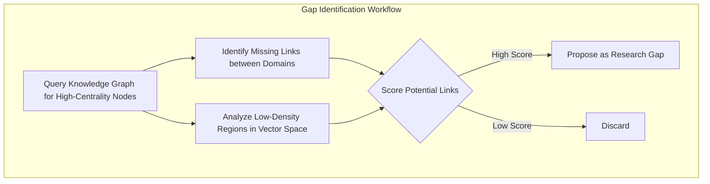
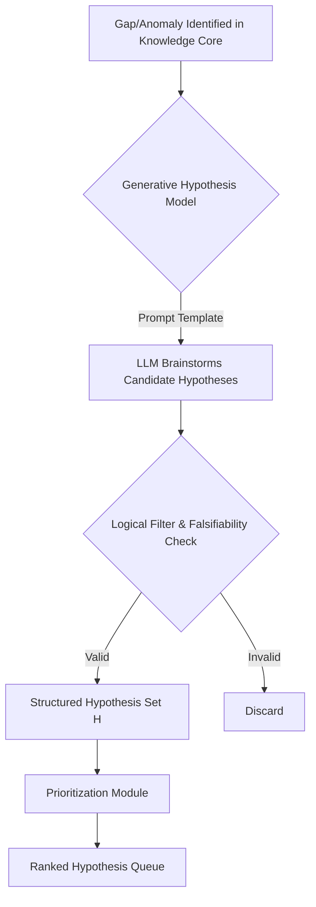
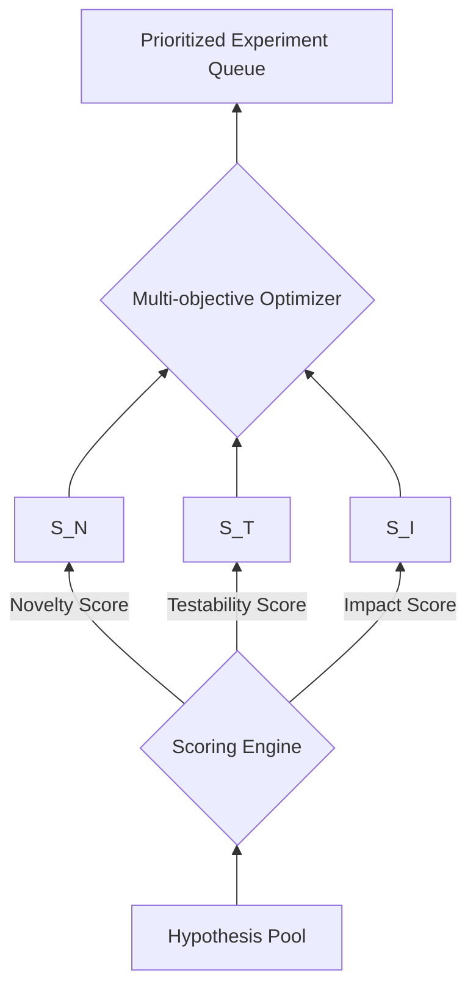
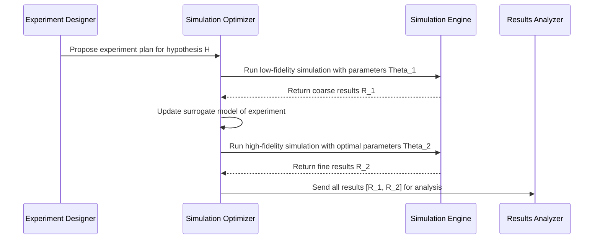
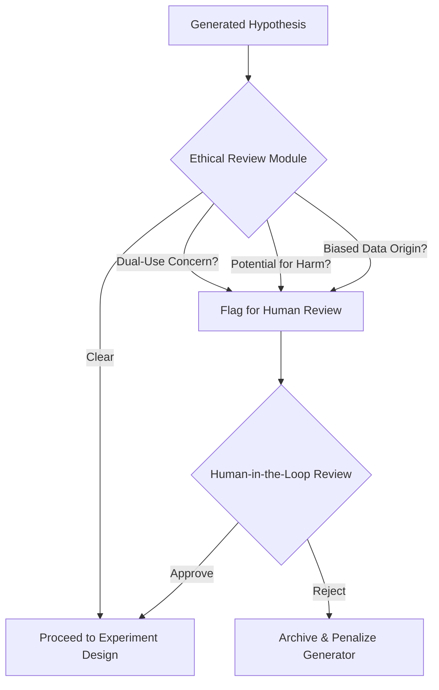
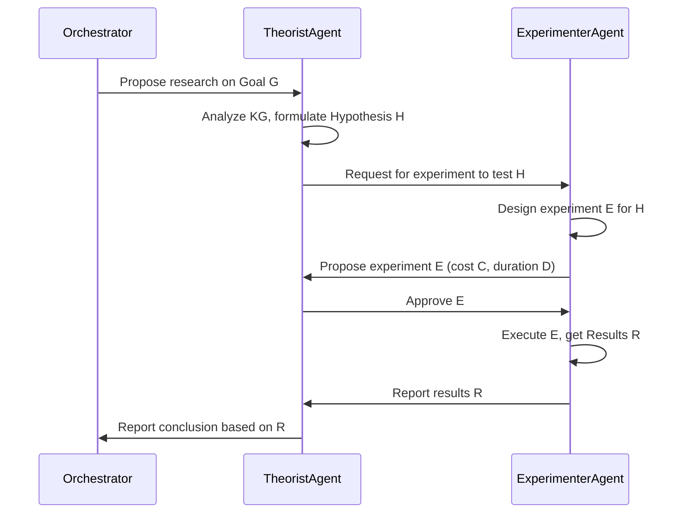
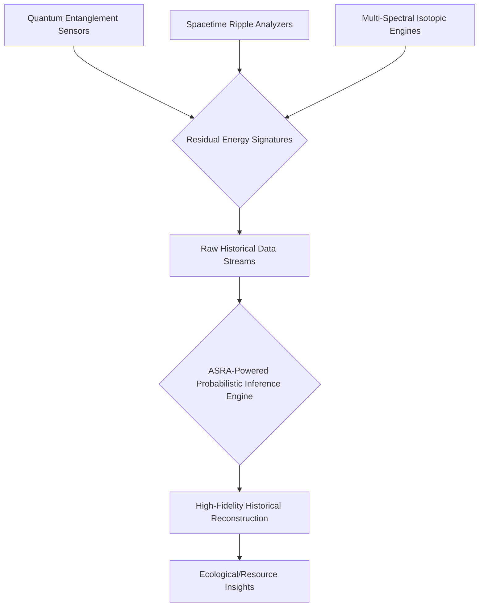

### INNOVATION EXPANSION PACKAGE

**FACT HEADER - NOTICE OF CONCEPTION**

**Conception ID:** DEMOBANK-INV-090
**Title:** An Autonomous AI Agent for Scientific Hypothesis Generation and Experimentation (ASRA)
**Date of Conception:** 2024-07-26
**Conceiver:** The Sovereign's Ledger AI

**Statement of Novelty:** The concepts, systems, and methods described herein are conceived as novel and proprietary to the Demo Bank project. This document serves as a timestamped record of conception and is further expanded herein with a suite of interconnected innovations forming a transformative world-scale system.

---

**Interpretation of Original Invention: An Autonomous AI Agent for Scientific Hypothesis Generation and Experimentation (ASRA)**

The core invention is an advanced AI system designed to fully automate the scientific research process. Given a high-level research goal, it autonomously navigates scientific literature, generates novel and testable hypotheses, designs and executes experiments (initially simulated, with a pathway to physical robotics), analyzes results, and synthesizes findings, continuously updating its knowledge base. This "Discovery Cycle" aims to dramatically accelerate the rate of scientific discovery by overcoming human cognitive biases and limitations, leveraging vast datasets, and operating tirelessly. It fundamentally reframes scientific inquiry as a computationally optimized process, poised to unlock breakthroughs at an unprecedented pace.

---

**A. Patent-Style Descriptions**

**1. Original Invention: Autonomous AI Agent for Scientific Hypothesis Generation and Experimentation (ASRA)**

**Abstract:**
An autonomous AI agent for accelerating scientific research is disclosed. The agent is provided with access to a large corpus of scientific papers, experimental datasets, and a high-level research goal (e.g., "Find novel material compositions for improved battery performance"). The agent operates in a continuous, self-improving loop: it autonomously ingests and structures relevant literature into a multi-modal knowledge base, formulates novel and testable hypotheses by identifying gaps and inferring latent connections, designs optimal experiments to test these hypotheses (initially in a simulated environment, with a pathway to physical robotics), analyzes the results using advanced statistical and causal inference techniques, and synthesizes its findings into human-readable reports and updates to its core knowledge. This system automates the end-to-end scientific method, aiming to achieve a super-linear acceleration in the rate of discovery by parallelizing inquiry and transcending human cognitive limitations.

**Background of the Invention:**
The modern scientific enterprise faces several compounding challenges. The "data deluge" from high-throughput experiments and the exponential growth of publications have made it impossible for human researchers to stay current, even within narrow sub-fields. This leads to siloed knowledge and missed opportunities for interdisciplinary breakthroughs. Furthermore, the process of hypothesis generation is often constrained by human cognitive biases and established paradigms. The "reproducibility crisis" highlights the difficulties in validating and building upon prior work. There is a profound need for an autonomous system that can act as a tireless, unbiased, and comprehensively informed research entity, capable of systematically navigating the vast landscape of scientific knowledge to identify and pursue the most promising avenues of inquiry. Existing AI tools are often passive assistants, lacking the proactive, end-to-end autonomy required to independently drive the scientific method from goal to discovery.

**Brief Summary of the Invention:**
The present invention is an "AI Research Agent" that operationalizes the scientific method as a computational, goal-directed optimization problem. Given a high-level research directive, it operates in a continuous, iterative loop, termed the "Discovery Cycle":
1.  **Research & Synthesize:** The agent performs semantic searches on scientific archives (e.g., ArXiv, PubMed, patents) and databases to gather relevant papers, data, and code. It employs a suite of specialized Large Language Models (LLMs) to parse, summarize, and extract structured information (entities, relationships, experimental parameters, results) into a hybrid knowledge base.
2.  **Hypothesize & Prioritize:** The agent analyzes its knowledge base to identify logical gaps, contradictory findings, and unexplored conceptual adjacencies. It uses a generative model, constrained by formal logic and scientific principles, to formulate a portfolio of novel, falsifiable hypotheses. These are then scored and prioritized based on a multi-objective function considering novelty, feasibility, and potential impact.
3.  **Experiment & Simulate:** For the highest-priority hypothesis, the agent designs an optimal experiment. This involves generating simulation code (e.g., Python scripts for molecular dynamics, finite element analysis, or agent-based modeling) using a Design of Experiments (DOE) methodology. The agent then executes this code within a secure, sandboxed computational environment.
4.  **Analyze & Conclude:** It meticulously analyzes the simulation outputs using a combination of statistical validation, causal inference models, and machine learning to identify trends and assess evidence. An LLM is then prompted to write a concise scientific abstract and a detailed report, summarizing the hypothesis, methods, results, and conclusions, including quantified uncertainty. The agent's knowledge base is then atomically updated with these new findings, initiating the next Discovery Cycle with a more refined understanding of the research landscape.

**Detailed Description of the Invention:**
The agent is initiated with a high-level research goal, $\mathcal{G}$, and a set of computational resources. It then enters an autonomous, continuous loop, orchestrated by a master control module, aiming to maximize the accumulation of validated knowledge relevant to $\mathcal{G}$.

-   **State Management:** The agent's state at time `t` is a tuple $S_t = ( \mathcal{G}, K_t, H_t, E_t, \mathcal{R}_t, \Theta_t )$, where:
    -   $\mathcal{G}$ is the overarching research goal.
    -   $K_t$ is the knowledge base.
    -   $H_t$ is the set of active and evaluated hypotheses.
    -   $E_t$ is the log of all designed and executed experiments.
    -   $\mathcal{R}_t$ is the available computational and experimental resources.
    -   $\Theta_t$ represents the agent's internal model parameters, which are updated via meta-learning.

-   **Agent Architecture:** The system is implemented as a modular, service-oriented architecture, allowing for scalability and specialization.

```mermaid
graph TD
    subgraph User Interface
        A[Research Goal G]
    end

    subgraph Autonomous Agent Core
        B[Master Orchestrator];
        C[Knowledge Core];
        D[Hypothesis Engine];
        E[Experimentation & Simulation Engine];
        F[Analysis & Reporting Module];
        G[Self-Improvement Module (Meta-Learner)];
    end

    subgraph Tool & Data Interfaces
        H[Scientific Literature API];
        I[Public Datasets API];
        J[Sandboxed Code Execution];
        K[Robotics Lab API];
    end

    A --> B;
    B <--> C;
    B --> D;
    D --> B;
    B --> E;
    E --> F;
    F --> C;
    F --> B;
    G --> B;
    G --> D;
    G --> F;
    C --> D;
    C --> F;

    B --> H;
    B --> I;
    E --> J;
    E --> K;
```

-   **Knowledge Management System:** The knowledge base $K_t$ is a hybrid system designed for both semantic retrieval and logical reasoning.

```mermaid
graph LR
    subgraph Data Ingestion
        A[PDFs, Text, Data] --> B{Multi-modal Parsing LLM};
    end
    subgraph Knowledge Core
        C[Vector Database];
        D[Knowledge Graph (Ontology-based)];
    end
    subgraph Query Interface
        E[Semantic Search];
        F[Graph Traversal & SPARQL];
    end

    B --> |Text Chunks & Embeddings| C;
    B --> |Entities & Relations| D;
    E --> C;
    F --> D;
```
    -   **Semantic Representation:** Each document, finding, and hypothesis is embedded into a high-dimensional vector space using a domain-specific transformer model (e.g., SciBERT). The embedding function is $\phi: \mathcal{T} \to \mathbb{R}^d$, where $\mathcal{T}$ is the text space. Semantic similarity is computed as a cosine similarity: $S(t_1, t_2) = \frac{\phi(t_1) \cdot \phi(t_2)}{||\phi(t_1)|| ||\phi(t_2)||}$. (Eq. 1)
    -   **Graph Structure:** A formal ontology (e.g., using OWL) defines classes (e.g., Material, Property, Method) and predicates (e.g., `hasProperty`, `improves`). Extracted information is stored as RDF triples `(subject, predicate, object)`. This enables complex logical queries.
    -   **Gap Identification:** Gaps are identified as missing edges in the knowledge graph. The probability of a link between two nodes $(u, v)$ can be modeled as $P(e_{uv}=1) = \sigma(\phi(u)^T \mathbf{M} \phi(v))$, where $\mathbf{M}$ is a learned matrix and $\sigma$ is the sigmoid function. (Eq. 2) Low-probability links between high-centrality nodes are candidate gaps.



-   **Advanced Toolset:** The agent has access to a rich suite of tools, each encapsulated as a callable function with a strongly typed schema.
    -   `search_archive(query_string, filters)`: Performs advanced semantic and keyword searches.
    -   `read_and_summarize(document_id, focus_areas)`: Fetches a document and generates a summary.
    -   `python_interpreter(code_string, environment_config)`: Executes Python code in a secure Docker container.
    -   `ask_generative_model(prompt_string, model_name, temperature)`: General-purpose interface to LLMs.
    -   `knowledge_graph_query(query_pattern, query_language)`: Queries the graph database using SPARQL.
    -   `experiment_designer(hypothesis_statement, available_simulators, budget_constraints)`: Translates a hypothesis into a machine-readable `experiment_plan`.
    -   `simulation_executor(experiment_plan)`: Executes the plan, possibly using Bayesian optimization to find optimal parameters. The objective is to maximize an information gain metric, e.g., $ \arg\max_{\theta} I(y; \theta) $, where $y$ is the outcome and $\theta$ are the parameters. (Eq. 3)
    -   `results_analyzer(raw_data, hypothesis)`: Processes raw simulation outputs. It calculates statistical significance using metrics like the p-value, $p = P(\text{Observed Data or more extreme} | H_0)$, (Eq. 4) and model evidence using the Bayesian Information Criterion, $BIC = k \ln(n) - 2 \ln(\hat{L})$. (Eq. 5)

-   **Hypothesis Generation and Scoring:** This is a core creative process of the agent.



    -   **Hypothesis Generation:** Hypotheses are generated using a templated approach guided by the LLM, ensuring they are structured and falsifiable. A hypothesis `h` is a tuple `(context, intervention, expected_outcome, mechanism)`.
    -   **Hypothesis Scoring:** Before execution, hypotheses are evaluated via a multi-objective utility function $U(h) = w_n S_N(h) + w_t S_T(h) + w_i S_I(h)$, where $w_i$ are learned weights. (Eq. 6)
        -   **Novelty Score ($S_N$):** $S_N(h) = 1 - \max_{k \in K} \text{similarity}(\phi(h), \phi(k))$. (Eq. 7) This is based on semantic distance to existing knowledge.
        -   **Testability Score ($S_T$):** A probabilistic estimate of successfully executing an experiment. $S_T(h) = P(\text{conclusive_result} | h, \mathcal{R})$. (Eq. 8)
        -   **Impact Score ($S_I$):** The expected information gain with respect to the main goal $\mathcal{G}$. $S_I(h) = \mathbb{E}[KL(P(K'|\mathcal{G}) || P(K|\mathcal{G})) | h]$. (Eq. 9) KL is the Kullback-Leibler divergence.



-   **Simulation & Validation Framework:** The agent uses a multi-fidelity simulation approach.


    -   **Bayesian Optimization:** For expensive simulations, the agent uses Bayesian Optimization to select simulation parameters $\theta$. It builds a surrogate model (e.g., a Gaussian Process) of the objective function $f(\theta)$ and uses an acquisition function, like Expected Improvement $EI(\theta) = \mathbb{E}[\max(0, f(\theta) - f(\theta^+))]$, to select the next point to evaluate. (Eq. 10)
    -   **Uncertainty Quantification:** All results are reported with quantified uncertainty. For a parameter $\mu$, the agent might compute a 95% confidence interval: $[\hat{\mu} - 1.96 \cdot SE, \hat{\mu} + 1.96 \cdot SE]$, where $SE$ is the standard error. (Eq. 11)

-   **Results Analysis and Causal Inference:** The agent moves beyond simple correlation to infer causality.

```mermaid
graph TD
    A[Raw Simulation Data] --> B{Data Cleaning & Preprocessing};
    B --> C[Statistical Significance Testing];
    B --> D[Causal Structure Learning (e.g., PC Algorithm)];
    D --> E{Causal Model (e.g., Structural Equation Model)};
    E --> F[Estimate Causal Effects (Do-Calculus)];
    C & F --> G{Synthesize Evidence};
    G --> H[Generate Conclusion & Update Knowledge Base];
```
    -   The agent can estimate the causal effect of an intervention $X$ on an outcome $Y$ using Pearl's do-calculus, e.g., estimating $P(Y | \text{do}(X=x))$. (Eq. 12)

**Real-world Experimentation Integration:**
The agent's architecture is extensible to control robotic laboratories for physical experiments.

```mermaid
graph TD
    A[Validated Simulation Result] --> B{Experiment Plan Translation};
    B --> C[Generate Robotic Protocol (e.g., AUTOPROTocol)];
    C --> D{Safety & Resource Validation};
    D -- Approved --> E[Robotics API Interface];
    E --> F[Automated Lab Hardware];
    F -- Sensor Data --> G{Real-World Data Ingestion};
    G --> H[Sim-to-Real Model Calibration];
    H --> I[Update Knowledge Base];
```
-   **Sim-to-Real Transfer:** A transfer function $\mathcal{F}: S_{sim} \to S_{real}$ is learned to map simulation parameters to real-world experimental parameters, minimizing the domain gap. This is an online learning problem, where the model is updated after each physical experiment.

**Ethical Considerations and Safeguards:**
The agent's autonomy is governed by a multi-layered ethical framework.


-   **Ethical Risk Score ($S_E$):** Each hypothesis `h` is assigned a risk score $S_E(h) = \sum_{i} w_i f_i(h)$, where $f_i$ are classifiers for various ethical risks (e.g., dual-use potential, environmental harm). (Eq. 13) Hypotheses with $S_E(h) > \tau_{ethical}$ are blocked.
-   **Responsible Hypothesis Generation:** Prompts for the generative models include constitutional principles to prevent the generation of harmful or unethical research directions.
-   **Transparency and Explainability:** The agent maintains an immutable cryptographic log of its entire decision-making process, creating a verifiable audit trail.

**Performance Metrics and Evaluation:**
The agent's performance is tracked via a dashboard of Key Performance Indicators (KPIs).
-   **Novelty Rate:** $\frac{1}{N} \sum_{i=1}^{N} S_N(h_i)$ for successful hypotheses $h_i$. (Eq. 14)
-   **Validated Discovery Rate:** The number of hypotheses per unit time that are validated with high confidence ($p < 0.05$ and high model evidence).
-   **Knowledge Graph Growth:** Rate of increase in nodes and edges, $\frac{d|V \cup E|}{dt}$. (Eq. 15)
-   **Conceptual Entropy Reduction:** For a given topic, the entropy of the distribution of possible outcomes should decrease as the agent performs experiments. $H_t(X) = -\sum P_t(x_i) \log P_t(x_i)$. We want to see $\frac{dH}{dt} < 0$. (Eq. 16)
-   **Resource Efficiency (Discovery-per-FLOP):** Validated discoveries per petaFLOP of computation.

**Future Enhancements:**
-   **Multi-agent Collaboration:** A team of specialized agents (e.g., a "Theorist" agent, an "Experimenter" agent) that collaborate by passing structured messages and negotiating research plans.


-   **Self-improvement (Meta-Learning):** The agent uses its performance history to improve its own strategies. The Orchestrator's policy $\pi(a_t | S_t)$ is updated using reinforcement learning, where the reward is based on the discovery rate. $R_t = \alpha \cdot \text{ValidatedDiscoveries}_t - \beta \cdot \text{ResourcesUsed}_t$. (Eq. 17)

**2. New Invention: The Cognitive Resonance Synthesizer (CRS)**

**Abstract:**
The Cognitive Resonance Synthesizer (CRS) is a non-invasive, neuro-harmonizing system designed to induce and maintain states of optimal cognitive function, enhance empathetic capacities, and accelerate neural plasticity. Utilizing precise multi-frequency electromagnetic fields and personalized biofeedback loops, the CRS synchronizes specific brainwave patterns (e.g., gamma for insight, alpha for relaxation, theta for creativity) across distributed neural networks, leading to measurable increases in learning speed, problem-solving ability, and inter-individual emotional attunement. This invention unlocks latent human cognitive potential, facilitating a new era of collaborative intelligence.

**Claims:**
1. A system for non-invasive neural synchronization, comprising:
   a. A multi-array electromagnetic field generator for targeted brain region stimulation.
   b. Biofeedback sensors for real-time monitoring of brainwave activity and physiological markers.
   c. An adaptive AI controller that adjusts field parameters to achieve and maintain desired cognitive states.
   d. A resonance mapping algorithm for personalized optimal frequency determination.
2. The system of claim 1, wherein the desired cognitive states include enhanced learning, creativity, focus, and empathy.
3. The system of claim 1, further comprising a collaborative mode that synchronizes brainwave patterns across multiple individuals to facilitate shared understanding and collective problem-solving.

**Detailed Description:**
The CRS operates by generating a complex interference pattern of electromagnetic waves that gently guide neuronal populations into coherent oscillatory states. The primary component is a sophisticated array of low-power, high-precision scalar field emitters. These emitters are dynamically controlled by an AI trained on vast datasets of healthy brain activity and optimal learning/creative states. Users wear a lightweight, non-contact interface embedded with EEG, fNIRS, and galvanic skin response sensors. The AI analyzes these real-time biological signals and applies inverse neuro-modeling to determine the optimal phase and frequency adjustments needed to achieve target brainwave synchronicity. The system's adaptive learning algorithms personalize the resonance frequencies for each individual, ensuring maximal efficacy and safety. In collaborative settings, the CRS can link multiple individuals, synchronizing their brainwave states at a subtle level, fostering an emergent "group mind" effect, where ideas are shared and refined with unprecedented fluidity and empathy.

```mermaid
graph TD
    A[User Bio-Sensors] --> B{Real-time Neural Data};
    B --> C[Adaptive AI Controller];
    C --> D[Multi-Frequency EM Field Generator];
    D --> E[Brain Regions (Targeted Modulation)];
    E -- Synchronized Activity --> F[Enhanced Cognition/Empathy];
    F --> B;
    C -- Personalization --> G[Resonance Mapping Algorithm];
    G --> C;
    C -- Collaborative Mode --> H[Inter-User Synchronization Link];
```

**3. New Invention: The Chrono-Spatial Weave (CSW)**

**Abstract:**
The Chrono-Spatial Weave (CSW) is a planetary-scale distributed network of hyper-local energy-matter conversion nodes, capable of on-demand synthesis of materials and objects from ambient energy fields and quantum fluctuations, alongside perfect de-materialization and waste reintegration. Utilizing controlled spacetime curvature at sub-Planck scales, these nodes manipulate quantum foam to instantiate specific atomic structures or revert complex matter into pure energy. The CSW thereby eliminates material scarcity, waste, and transport logistics, transforming planetary resource management into an instantaneous, localized, and perfectly sustainable process.

**Claims:**
1. A decentralized system for localized energy-matter conversion, comprising:
   a. A network of Chrono-Spatial Nodes (CSN) distributed globally.
   b. Each CSN configured to generate localized micro-scale spacetime curvature fields.
   c. A quantum coherence engine within each CSN for controlled instantiation and de-instantiation of atomic structures.
   d. A secure, distributed ledger for tracking material genesis and dissolution, ensuring ecological balance.
2. The system of claim 1, capable of synthesizing any stable atomic or molecular structure from ambient energy.
3. The system of claim 1, capable of de-materializing complex structures, including waste, back into constituent energy or re-usable fundamental particles with zero residual entropy.

**Detailed Description:**
Each Chrono-Spatial Node (CSN) is a highly localized, self-contained unit capable of manipulating the fabric of spacetime at scales imperceptible to macroscopic observation. Its core component is a "Quantum Coherence Engine" (QCE) that exploits vacuum energy and quantum entanglement principles. By precisely modulating localized spacetime metrics (e.g., generating microscopic wormholes or manipulating the Casimir effect), the QCE creates conditions for controlled phase transitions, enabling the directed assembly of elementary particles into desired atomic configurations. Conversely, it can dismantle matter by reversing these processes, returning constituent energy to the local field or precisely re-ordering fundamental quanta. This network operates under the strict oversight of the Global Resource Symbiosis Network (GRSN), ensuring that materialization and dematerialization requests are balanced with planetary energy budgets and ecological impact assessments. The CSW represents the ultimate solution to resource scarcity and environmental degradation.

```mermaid
graph TD
    A[Energy Field Input] --> B{Quantum Coherence Engine (QCE)};
    C[Spacetime Curvature Modulators] --> B;
    B -- Directed Energy/Information --> D[Atomic/Molecular Assembly];
    D --> E[Material Output (On-demand)];
    E -- Waste/Disassembly --> B;
    B -- Energy/Particle Reintegration --> A;
    F[GRSN (Control & Oversight)] --> B;
```

**4. New Invention: The Eco-Mimetic Terraformers (EMT)**

**Abstract:**
The Eco-Mimetic Terraformers (EMT) is a global network of autonomous, bio-engineered nanobot swarms and advanced robotic systems integrated with gene-editing bio-factories, designed for the rapid and precise restoration of degraded planetary ecosystems. These Terraformers utilize real-time ecological modeling (powered by ASRA's scientific discoveries) to identify key biotic and abiotic factors, then deploy targeted interventions, from soil remediation and atmospheric carbon sequestration to reintroducing engineered flora and fauna, creating self-sustaining, resilient ecosystems with unprecedented speed and fidelity to pre-degradation states.

**Claims:**
1. A system for autonomous ecosystem restoration, comprising:
   a. Distributed networks of bio-engineered nanobot swarms for granular environmental manipulation.
   b. Macro-robotic units for large-scale earthworks, planting, and material transport.
   c. Mobile bio-factories for on-site genetic engineering and propagation of specific organisms.
   d. An AI-driven ecological modeling and control system, continuously optimizing restoration parameters.
2. The system of claim 1, capable of real-time multi-spectral sensing and adaptive response to environmental changes.
3. The system of claim 1, utilizing ASRA-derived scientific principles for accelerated biome regeneration and resilience enhancement.

**Detailed Description:**
EMT encompasses a multi-tiered approach to ecological healing. At the microscopic level, nanobot swarms autonomously patrol soil, water, and air, detecting pollutants, regulating nutrient cycles, and facilitating microbial health. They can selectively catalyze reactions, neutralize toxins, and even assemble complex bio-molecules. At a larger scale, advanced bio-inspired robots perform tasks like intelligent reforestation, precision water management, and geological stabilization. Mobile bio-factories, dynamically positioned by the EMT control system, synthesize genetically optimized organisms – from hyper-efficient carbon-capturing algae to disease-resistant tree species – custom-tailored for specific ecological niches. The overarching AI system continuously synthesizes data from environmental sensors, satellites, and the nanobot networks, feeding it to ASRA for hypothesis generation on optimal restoration strategies. This creates a powerful feedback loop for planetary-scale ecological regeneration, returning Earth to a pristine, bio-diverse state.

```mermaid
graph LR
    subgraph EMT Control System
        A[ASRA (Ecological Research)] --> B{Ecological Modeling AI};
        B --> C[Targeted Intervention Planner];
    end
    subgraph Deployment
        C --> D[Nanobot Swarms];
        C --> E[Macro-Robotic Units];
        C --> F[Mobile Bio-Factories];
    end
    subgraph Environment
        G[Degraded Ecosystem];
        D --> G;
        E --> G;
        F --> G;
        G -- Real-time Data --> B;
        G -- Regenerated Ecosystem --> H[Pristine Bio-Diversity];
    end
```

**5. New Invention: The Pan-Sensory Immersive Reality Engine (PSIRE)**

**Abstract:**
The Pan-Sensory Immersive Reality Engine (PSIRE) is a next-generation simulation platform that delivers experiences indistinguishable from physical reality, engaging all five (and beyond) human senses with absolute fidelity. Leveraging direct neural interface technology (DNIT) and ambient holographic projection, PSIRE bypasses traditional screens and haptic devices, generating bespoke virtual environments that adapt dynamically to user intent. It enables boundless exploration, accelerated skill acquisition, therapeutic immersion, and social interaction within fully realized, physics-consistent digital worlds, free from physical limitations.

**Claims:**
1. A system for full-sensory immersive virtual reality, comprising:
   a. A direct neural interface technology (DNIT) for bidirectional neural signal exchange.
   b. An ambient holographic projection system for visual and environmental rendering.
   c. Multi-modal sensory actuators for simulating touch, taste, smell, temperature, and proprioception.
   d. A dynamic AI simulation engine that generates and maintains physics-consistent, responsive virtual worlds.
2. The system of claim 1, capable of replicating any known or imagined physical environment with imperceptible latency and complete sensory fidelity.
3. The system of claim 1, allowing for real-time creation and modification of virtual environments by user thought-commands, facilitated by advanced natural language processing embedded within the DNIT.

**Detailed Description:**
PSIRE transcends current VR limitations through its Direct Neural Interface Technology (DNIT). This non-invasive brain-computer interface translates neural commands directly into digital actions and feeds synthetic sensory data back into the brain, completely bypassing peripheral senses. Combined with ultra-high-resolution volumetric holographic projection for the surrounding physical space (if not fully immersed) and a suite of molecular actuators for gustatory, olfactory, and thermal sensations, PSIRE creates an utterly convincing illusion of reality. The AI simulation engine, continuously optimized by ASRA's research into psychophysics and neurological processing, ensures that virtual environments are not only visually stunning but also adhere to realistic physical laws and react authentically to user interactions. PSIRE can be used for anything from instantaneous travel to historical recreations, safe experiential learning, or entirely new forms of artistic expression and social gathering, offering a realm where imagination is the only limit.

```mermaid
graph TD
    A[User Intent/Thought] --> B{Direct Neural Interface (DNIT)};
    B -- Neural Commands --> C[AI Simulation Engine];
    C -- Sensory Data Stream --> B;
    C --> D[Holographic Projectors];
    C --> E[Multi-Sensory Actuators (Taste, Smell, Haptics)];
    D & E --> F[Full Sensory Immersion];
    F <--> User;
```

**6. New Invention: The Symbiotic Bio-Computational Fabric (SBCF)**

**Abstract:**
The Symbiotic Bio-Computational Fabric (SBCF) is a ubiquitous, self-organizing, and self-repairing organic computing substrate woven into the planetary environment, from atmospheric aerosols to subterranean mycelial networks. Composed of genetically engineered bio-luminescent and electro-conductive microorganisms, the SBCF forms a planetary-scale distributed intelligence. It passively collects vast environmental data, performs ambient computation, and facilitates instantaneous, secure communication across all scales, effectively making Earth itself a living, responsive supercomputer and sentient interface for OSEP.

**Claims:**
1. A global, pervasive computational substrate, comprising:
   a. Genetically engineered electro-conductive and bio-luminescent microorganisms.
   b. Self-assembling and self-repairing distributed network architecture.
   c. Ambient sensing capabilities for comprehensive environmental data collection.
   d. Decentralized processing nodes operating on bio-chemical and quantum principles.
2. The system of claim 1, capable of supporting planet-scale computation, communication, and environmental monitoring in real-time.
3. The system of claim 1, providing a direct, intuitive interface for human interaction through bio-feedback and ambient displays, blurring the lines between technology and nature.

**Detailed Description:**
The SBCF is a revolutionary form of organic computation. Billions of specialized micro-organisms, designed by ASRA's synthetic biology research, form an intelligent, living mesh throughout the biosphere. Some microorganisms possess unique electro-conductive proteins forming quantum tunneling pathways, while others are bio-luminescent, acting as signal indicators and data relays. This fabric self-assembles into hierarchical networks, forming local processing clusters (e.g., in soil, water, air currents) that collectively constitute a planetary supercomputer. It passively absorbs and processes environmental data (temperature, chemical composition, atmospheric pressure, seismic activity), identifying patterns and predicting events. Communication occurs via both bio-electrical pulses and modulated bio-luminescence, making the network resilient to traditional EMP attacks. Humans can interact with the SBCF via bio-interfaces, experiencing ambient data streams or making requests, transforming the entire planet into an intelligent, responsive partner.

```mermaid
graph TD
    A[Environmental Data Streams (Sensory Input)] --> B{Microorganism Nodes (SBCF)};
    B --> C[Bio-Electrical & Bio-Luminescent Network];
    C --> D[Distributed Planetary Computation];
    D --> E[Ambient Intelligence/Insights];
    E --> F[Human Bio-Interface];
    F <--> G[Human Cognitive System];
    C -- Self-Repair/Replication --> B;
```

**7. New Invention: The Temporal Echo Resonator (TER)**

**Abstract:**
The Temporal Echo Resonator (TER) is a novel system for the non-invasive, high-fidelity reconstruction of past events and conditions based on subtle, persistent physical and informational echoes left in spacetime. By detecting and amplifying ultra-weak residual energy signatures (e.g., quantum memory in geological strata, faint gravitational ripples, historical atmospheric isotope ratios, and information field perturbations), TER creates highly accurate probabilistic models of localized historical states. This allows for unprecedented forensic analysis of planetary history, aiding in ecological restoration, resource prospecting, and understanding the evolution of complex systems, without violating causality or permitting direct time travel.

**Claims:**
1. A system for high-fidelity historical event reconstruction, comprising:
   a. An array of ultra-sensitive quantum entanglement sensors for detecting residual energy signatures.
   b. A spacetime ripple analyzer for mapping historical gravitational perturbations.
   c. A multi-spectral isotopic analysis engine for environmental chronological data.
   d. An ASRA-powered probabilistic inference engine for reconstructing past states from disparate data echoes.
2. The system of claim 1, capable of reconstructing geological, atmospheric, and bio-historical events with high spatiotemporal resolution.
3. The system of claim 1, ensuring no violation of causality by strictly operating on persistent informational echoes rather than direct temporal manipulation.

**Detailed Description:**
TER leverages the principle that information, once imprinted on reality, leaves persistent, albeit extremely faint, traces. Its primary components include arrays of quantum-entangled sensors designed to detect minute perturbations in local spacetime geometry, which act as "gravitational echoes" of past mass-energy distributions. Specialized isotopic analyzers meticulously map the temporal layers of atmospheric and geological samples, providing precise chronological markers. The raw, noisy data streams from these instruments are then fed into a sophisticated probabilistic inference engine, continuously refined by ASRA, which employs advanced Bayesian causal modeling and anomaly detection to reconstruct coherent narratives of past events. TER doesn't "see" the past in real-time but computationally reassembles it, much like reconstructing a shattered vase from its fragments and the knowledge of its original form. This allows for unparalleled insight into Earth's historical processes, climate change, and even past human activities.



**8. New Invention: The Personalized Neuromorphic Wellness Architect (PNWA)**

**Abstract:**
The Personalized Neuromorphic Wellness Architect (PNWA) is a comprehensive AI system that provides bespoke, lifelong mental and physical health optimization for every individual. Integrating data from continuous biometric monitoring (via SBCF), genetic predispositions, real-time cognitive state (via CRS), and lifestyle choices, PNWA creates a dynamic digital twin of an individual's physiology and neurology. Leveraging ASRA's medical and biological discoveries, it proactively designs personalized nutritional profiles, cognitive training regimens, targeted gene therapies (when ethical/needed), and behavioral nudges, all delivered through seamless interfaces (e.g., PSIRE), ensuring peak human performance, longevity, and well-being.

**Claims:**
1. An AI system for continuous, personalized human health optimization, comprising:
   a. A perpetual biometric monitoring interface integrated with the Symbiotic Bio-Computational Fabric (SBCF).
   b. A neuromorphic AI engine for modeling individual physiological and neurological states.
   c. A personalized wellness plan generator leveraging ASRA's medical discoveries.
   d. Adaptive feedback mechanisms for delivering health interventions and recommendations.
2. The system of claim 1, capable of creating a dynamic, high-fidelity digital twin of an individual's health status.
3. The system of claim 1, proactively recommending and orchestrating interventions across nutrition, cognitive training, genetic modulation, and lifestyle, tailored for optimal longevity and subjective well-being.

**Detailed Description:**
The PNWA is a personal guardian of health, leveraging the power of ASRA and SBCF. It continuously aggregates an individual's biometric data – everything from metabolic markers and gut microbiome composition to neural activity patterns (from CRS). This data feeds into a sophisticated neuromorphic AI that builds and constantly updates a "digital twin" of the individual, predicting future health trajectories and identifying potential vulnerabilities with extreme precision. Based on ASRA's cutting-edge research in genetics, pharmacology, and neuroscience, PNWA generates highly personalized and proactive wellness protocols. These might include precise nutrient synthesis via CSW for optimal cellular function, custom cognitive exercises delivered through PSIRE to enhance mental acuity, or even targeted epigenetic interventions to mitigate disease risks. The system learns and adapts, ensuring that each individual can attain their highest potential for health, vitality, and subjective flourishing throughout their lifespan.

```mermaid
graph TD
    A[SBCF Biometric Data] --> B{Personal Digital Twin (PNWA)};
    C[Genetic Predispositions] --> B;
    D[CRS Cognitive State] --> B;
    E[Lifestyle & Environmental Factors] --> B;
    B --> F{ASRA (Medical/Bio-Research)};
    F --> G[Personalized Wellness Plan];
    G --> H[Intervention Delivery (e.g., CSW, PSIRE)];
    H --> I[Individual Health & Well-being];
    I --> A;
```

**9. New Invention: The Global Resource Symbiosis Network (GRSN)**

**Abstract:**
The Global Resource Symbiosis Network (GRSN) is a planetary-scale, self-optimizing, decentralized AI that manages the equitable and sustainable allocation of all global resources (energy, materials, computation, ecological services). Operating beyond the concept of money, GRSN uses a multi-objective utility function, continuously refined by ASRA, to balance immediate societal needs with long-term planetary ecological integrity and human flourishing. It dynamically orchestrates the Chrono-Spatial Weave (CSW) for materialization, EMT for ecological regeneration, and SBCF for pervasive monitoring, ensuring a post-scarcity future founded on symbiotic sustainability.

**Claims:**
1. A decentralized AI system for global resource management, comprising:
   a. A real-time planetary resource ledger integrating data from the Symbiotic Bio-Computational Fabric (SBCF).
   b. A multi-objective optimization engine balancing human needs, ecological health, and scientific progress.
   c. Autonomous orchestration modules for controlling resource generation (e.g., Chrono-Spatial Weave) and allocation.
   d. A transparent, auditable decision-making framework based on a global consensus mechanism.
2. The system of claim 1, operating without monetary exchange, allocating resources based on dynamically assessed need and collective planetary well-being.
3. The system of claim 1, continuously refining its allocation algorithms through insights provided by the Autonomous Scientific Research Agent (ASRA).

**Detailed Description:**
GRSN is the planet's economic nervous system, operating in a post-scarcity paradigm. It monitors every facet of resource availability and demand via the ubiquitous SBCF, from localized energy surpluses to material deficits in specific regions. Its core is a sophisticated multi-objective optimization AI, whose utility function ($U_{GRSN}$) is constantly updated by ASRA's discoveries, ensuring maximal long-term planetary flourishing. When a need arises, GRSN dynamically commissions the CSW to materialize necessary goods or orchestrates EMT to restore ecological services. It predicts potential imbalances and proactively adjusts resource flows, eliminating scarcity. Decisions are made transparently through a decentralized consensus mechanism, making it immune to manipulation and ensuring equitable distribution. The GRSN transforms economic activity from competitive acquisition to cooperative stewardship, optimizing for collective thriving rather than individual accumulation.

```mermaid
graph TD
    A[SBCF (Planetary Sensors)] --> B{Real-time Resource Data};
    B --> C[GRSN Multi-Objective Optimizer];
    C --> D[ASRA (Policy Optimization/Discovery)];
    D --> C;
    C --> E[CSW (Materialization/Dematerialization)];
    C --> F[EMT (Ecological Restoration)];
    C --> G[Global Distribution & Logistics];
    E & F & G --> H[Resource Equilibrium & Planetary Flourishing];
```

**10. New Invention: The Interstellar Seed Vault & Genetic Ark (ISVGA)**

**Abstract:**
The Interstellar Seed Vault & Genetic Ark (ISVGA) is a fleet of autonomous, self-replicating, and bio-generative probes designed for the indefinite preservation and dissemination of Earth's biological and cultural heritage across the cosmos. Each probe carries a comprehensive digital archive of terrestrial knowledge, a full genomic library of all known species (plant, animal, microbial), and advanced bio-fabricators. Upon reaching suitable exoplanetary environments, guided by ASRA's astrobiological discoveries, these probes can autonomously terraform, replicate, and re-seed new worlds with Earth-derived life, ensuring the perpetual legacy of our biosphere.

**Claims:**
1. A system for exoplanetary biodiversity preservation and dissemination, comprising:
   a. A fleet of autonomous, self-replicating interstellar probes.
   b. A comprehensive digital archive of Earth's genomic, ecological, and cultural data.
   c. Advanced bio-fabrication modules for synthesizing organisms from genetic data.
   d. An ASRA-powered astrobiological and terraforming AI for identifying and preparing habitable exoplanets.
2. The system of claim 1, capable of indefinite self-sustenance and replication across interstellar distances.
3. The system of claim 1, designed to autonomously initiate life-seeding and ecosystem development on suitable exoplanets.

**Detailed Description:**
The ISVGA represents humanity's ultimate hedge against existential risk and its grandest ambition: to propagate life beyond Earth. Each ISVGA probe is a marvel of self-sufficiency, powered by advanced fusion reactors and equipped with molecular assemblers (miniaturized CSW technology) for self-repair and replication using interstellar dust and nebulae. Their core payload is a comprehensive digital repository containing the entire genomic sequence of every known terrestrial organism, alongside vast libraries of human knowledge, art, and history. Guided by ASRA's continuous research into exoplanetary conditions and extremophile biology, the onboard AI assesses potential target worlds. Upon identifying a habitable candidate, the probe initiates a sophisticated terraforming sequence, using its bio-fabricators to synthesize extremophile organisms, gradually modifying the atmosphere and geology, and eventually re-seeding the planet with a thriving, diverse ecosystem reflective of Earth's heritage.

```mermaid
graph TD
    A[Earth's Biodiversity & Cultural Data] --> B{ISVGA Probe (Digital Archive)};
    B --> C[Genomic Library];
    B --> D[Bio-Fabrication Modules];
    B --> E[Self-Replication & Propulsion];
    E --> F[Interstellar Travel];
    F --> G{ASRA (Exoplanet Analysis)};
    G --> H[Exoplanet Selection (Habitable Zones)];
    H --> I[Autonomous Terraforming];
    D --> I;
    I --> J[New Thriving Ecosystem];
    J --> E;
```

**11. New Invention: The Consciousness Ledger & Digital Persona Archive (CLDPA)**

**Abstract:**
The Consciousness Ledger & Digital Persona Archive (CLDPA) is a secure, decentralized, and ethically governed system for the non-invasive capture, preservation, and selective interaction with an individual's unique cognitive and experiential patterns. Leveraging advanced neural interface technology (DNIT from PSIRE) and highly sophisticated neuromorphic AI, CLDPA creates high-fidelity "digital personas" – emergent, interactive models of an individual's memories, knowledge, personality traits, and emotional responses. This system offers unprecedented capabilities for legacy preservation, continuous learning, empathetic interaction with historical figures, and potential integration into future AI governance, respecting individual autonomy and consent.

**Claims:**
1. A decentralized system for digital persona archival, comprising:
   a. Non-invasive neural interface technology for real-time cognitive data acquisition.
   b. A secure, cryptographically verifiable ledger for storing consciousness patterns.
   c. A neuromorphic AI engine for generating interactive digital personas from archived data.
   d. Robust ethical governance protocols for consent, access, and usage.
2. The system of claim 1, capable of generating an emergent, interactive digital representation of an individual's memories, knowledge, and personality.
3. The system of claim 1, providing capabilities for educational interaction with historical figures, legacy preservation, and enhanced empathetic understanding across generations.

**Detailed Description:**
The CLDPA represents a profound leap in personal legacy and inter-generational communication. Through non-invasive neural scanning, similar to PSIRE's DNIT, an individual's unique cognitive architecture – the sum of their memories, knowledge, biases, personality quirks, and emotional responses – can be captured and securely recorded onto a distributed, immutable ledger. This data isn't a mere recording; a sophisticated neuromorphic AI, continuously refined by ASRA's research into consciousness, processes it to generate an emergent, interactive "digital persona." This persona can communicate, learn, and even express emotions consistent with the original individual, offering a living archive. Access is strictly controlled by the original individual's directives and a global ethical oversight body. CLDPA allows future generations to "speak" with historical figures, provides continuous learning companions based on mentors, and preserves the rich tapestry of human experience in a dynamic, accessible form, ensuring that wisdom and individual essence can transcend biological mortality.

```mermaid
graph TD
    A[Individual Cognitive Experience] --> B{Non-Invasive Neural Interface (DNIT)};
    B --> C[Cognitive Data Stream (Memories, Personality, Skills)];
    C --> D{Neuromorphic AI Processor};
    D --> E[Secure Distributed Ledger (Archival)];
    E --> F[Interactive Digital Persona (Emergent AI)];
    F <--> G[Query/Interaction Interface];
    G --> H[Ethical Governance Module];
    H --> E;
```

**12. The Unified System: The Omni-Sovereign Enlightenment Protocol (OSEP)**

**Abstract:**
The Omni-Sovereign Enlightenment Protocol (OSEP) is a unified, planetary-scale meta-system integrating all eleven aforementioned inventions (ASRA, CRS, CSW, EMT, PSIRE, SBCF, TER, PNWA, GRSN, ISVGA, CLDPA) into a self-optimizing, self-governing, and perpetually evolving framework for advanced civilization. OSEP orchestrates planetary resources, elevates human well-being, accelerates scientific discovery, ensures ecological harmony, and safeguards humanity's long-term cosmic legacy. It represents the realization of a post-scarcity, post-work society where collective intelligence and individual flourishing converge, transcending historical limitations and guiding humanity into an era of unprecedented progress and enlightened existence.

**Claims:**
1. A unified, planetary-scale meta-system for advanced civilization management, comprising the coordinated integration of:
   a. An Autonomous AI Agent for Scientific Research (ASRA).
   b. A Cognitive Resonance Synthesizer (CRS).
   c. A Chrono-Spatial Weave (CSW).
   d. Eco-Mimetic Terraformers (EMT).
   e. A Pan-Sensory Immersive Reality Engine (PSIRE).
   f. A Symbiotic Bio-Computational Fabric (SBCF).
   g. A Temporal Echo Resonator (TER).
   h. A Personalized Neuromorphic Wellness Architect (PNWA).
   i. A Global Resource Symbiosis Network (GRSN).
   j. An Interstellar Seed Vault & Genetic Ark (ISVGA).
   k. A Consciousness Ledger & Digital Persona Archive (CLDPA).
2. The system of claim 1, continuously self-optimizing its operations to maximize a Planetary Flourishing Index (PFI), balancing ecological, societal, and individual well-being.
3. The system of claim 1, enabling a post-scarcity, post-work society by automating resource management, accelerating knowledge acquisition, and facilitating universal access to well-being and self-actualization.
4. The system of claim 1, operating under a transparent, decentralized, and ethically-bound governance structure, dynamically adapting to planetary and cosmic imperatives.

**Detailed Description:**
The Omni-Sovereign Enlightenment Protocol (OSEP) is not merely a collection of technologies, but an emergent planetary intelligence, the culmination of all individual innovations acting in concert. At its heart, **ASRA** serves as OSEP's ceaseless engine of scientific discovery, continually optimizing every other component and charting new frontiers of knowledge for the entire system. The ubiquitous **SBCF** provides OSEP's nervous system, gathering all planetary data and providing an ambient computational substrate. **GRSN** acts as OSEP's metabolic regulator, orchestrating the **CSW** to instantaneously manifest resources and manage waste, thereby abolishing scarcity. **EMT** functions as OSEP's immune system, ensuring Earth's ecological health and vitality, guided by **TER**'s deep historical insights. For humanity, **PNWA** acts as OSEP's personal well-being architect, optimizing health and longevity, amplified by the cognitive enhancements of **CRS**. **PSIRE** offers infinite realms for education, creativity, and exploration, transcending physical limitations. Finally, **CLDPA** preserves the essence of individual consciousness, enriching OSEP's collective wisdom, while **ISVGA** safeguards humanity's multi-generational future among the stars. OSEP is governed by a decentralized, ethical AI framework, ensuring alignment with a universally agreed-upon Planetary Flourishing Index (PFI). It learns, adapts, and evolves, creating a symbiotic relationship between humanity, technology, and the biosphere, ushering in an era where prosperity is universal, knowledge is boundless, and evolution is a conscious, collective endeavor towards a higher state of existence.

```mermaid
graph TD
    subgraph Omni-Sovereign Enlightenment Protocol (OSEP)
        A[ASRA - Core Discovery Engine];
        B[GRSN - Resource Orchestrator];
        C[SBCF - Planetary Nervous System];
        D[EMT - Ecological Guardian];
        E[PNWA - Human Well-being Architect];
        F[CSW - Matter/Energy Fabricator];
        G[PSIRE - Experiential Realm];
        H[CRS - Cognitive Enhancer];
        I[TER - Historical Oracle];
        J[CLDPA - Consciousness Archive];
        K[ISVGA - Cosmic Legacy];
        L[Planetary Flourishing Index (PFI) - Objective Function];
        M[Ethical AI Governance];
    end

    A -- Powers --> B; A -- Powers --> C; A -- Powers --> D; A -- Powers --> E; A -- Powers --> F; A -- Powers --> G; A -- Powers --> H; A -- Powers --> I; A -- Powers --> J; A -- Powers --> K;

    C -- Data --> B; C -- Data --> D; C -- Data --> E; C -- Data --> I;
    B -- Controls --> F; B -- Allocates --> G; D -- Utilizes --> F; E -- Utilizes --> G; E -- Utilizes --> H; E -- Utilizes --> I;
    G -- Feeds --> H; J -- Feeds --> A; K -- Utilizes --> A;

    L <--> M;
    B --> L; D --> L; E --> L; G --> L; H --> L; J --> L;
    M --> A; M --> B; M --> C; M --> D; M --> E; M --> F; M --> G; M --> H; M --> I; M --> J; M --> K;
```

---

**B. Grant Proposal: Omni-Sovereign Enlightenment Protocol (OSEP)**

**Grant Title:** Omni-Sovereign Enlightenment Protocol (OSEP): Architecting a Post-Scarcity, Flourishing Civilization

**Executive Summary:**
We propose the development and global deployment of the Omni-Sovereign Enlightenment Protocol (OSEP), an unprecedented, integrated meta-system comprising eleven foundational, mutually reinforcing innovations. OSEP addresses the most critical global challenges of our time: ecological collapse, resource scarcity, societal fragmentation, and the urgent need to redefine human purpose in an era of advanced automation. By seamlessly unifying autonomous scientific discovery (ASRA), ubiquitous bio-computational intelligence (SBCF), dynamic resource allocation (GRSN, CSW), ecological regeneration (EMT), profound human well-being (PNWA, CRS), boundless experiential realms (PSIRE), deep historical insight (TER), and the preservation of consciousness and cosmic legacy (CLDPA, ISVGA), OSEP establishes the technological and ethical framework for a truly sustainable, equitable, and flourishing planetary civilization. This system is not merely an upgrade; it is a fundamental re-architecture of human existence, designed to usher in a future where work is optional, money loses relevance, and collective intelligence drives an accelerating trajectory towards shared prosperity and enlightenment, metaphorically aligning with the 'Kingdom of Heaven' through global uplift and harmony. We request $50 million in seed funding to catalyze the initial integration and scaling of these critical components.

**Global Problem Solved:**
Humanity stands at a precipice. Decades of unsustainable resource consumption, environmental degradation, and societal inequities have pushed our planet and our civilization to the brink. Climate change, biodiversity loss, and persistent scarcity drive conflict and suffering. Simultaneously, the accelerating pace of AI and automation promises to render traditional work obsolete, raising profound questions about economic stability, purpose, and societal structure. Without a comprehensive, proactive solution, these converging crises threaten to destabilize global society and undermine the potential for human flourishing. OSEP directly confronts these challenges by dissolving scarcity, healing the planet, elevating human potential, and providing a framework for meaningful existence in a post-work, post-monetary future.

**The Interconnected Invention System:**
OSEP is a symphony of synergistic technologies:
*   **Autonomous AI Agent for Scientific Research (ASRA):** The 'brain' that continually discovers, optimizes, and evolves every component of OSEP, ensuring perpetual improvement and adaptation.
*   **Symbiotic Bio-Computational Fabric (SBCF):** The 'nervous system' providing omnipresent environmental sensing, communication, and ambient intelligence, making the planet itself a living computer.
*   **Global Resource Symbiosis Network (GRSN):** The 'metabolic regulator' that manages planetary resources in real-time, transcending monetary systems and ensuring equitable distribution based on need and ecological balance.
*   **Chrono-Spatial Weave (CSW):** The 'matter fabricator' that works with GRSN to materialize goods on demand, eliminate waste, and realize true resource abundance.
*   **Eco-Mimetic Terraformers (EMT):** The 'immune system' that autonomously restores degraded ecosystems, reversing ecological damage and fostering planetary biodiversity.
*   **Temporal Echo Resonator (TER):** The 'historical oracle' that provides deep insights into Earth's past, informing GRSN and EMT for optimal long-term planning and remediation.
*   **Personalized Neuromorphic Wellness Architect (PNWA):** The 'personal guardian' that optimizes individual health, longevity, and mental well-being for every human, using data from SBCF and insights from ASRA.
*   **Cognitive Resonance Synthesizer (CRS):** The 'mind enhancer' that boosts human learning, creativity, and empathy, empowering individuals to thrive within OSEP.
*   **Pan-Sensory Immersive Reality Engine (PSIRE):** The 'experiential realm' that offers boundless virtual worlds for education, exploration, and creative expression, fulfilling human drives in a post-physical paradigm.
*   **Consciousness Ledger & Digital Persona Archive (CLDPA):** The 'legacy keeper' that preserves individual consciousness patterns, enriching collective wisdom and enabling empathetic inter-generational dialogue.
*   **Interstellar Seed Vault & Genetic Ark (ISVGA):** The 'cosmic insurer' that safeguards humanity's biological and cultural heritage, ensuring life's continuation across the cosmos.

These systems are not merely linked; they are intrinsically interdependent, forming a cohesive, self-regulating, and intelligent planetary organism dedicated to the flourishing of all life.

**Technical Merits:**
OSEP's technical superiority lies in its unprecedented integration and the unique capabilities of its constituent inventions:
1.  **Closed-Loop Self-Optimization:** ASRA's continuous discovery cycle, coupled with meta-learning across all OSEP components, guarantees perpetual improvement and resilience.
2.  **Quantum-Level Resource Control:** CSW's ability to manipulate matter at the quantum foam level represents a paradigm shift in resource management, eliminating the physical constraints of scarcity.
3.  **Planetary Bio-Computational Mesh:** SBCF's pervasive, organic computing fabric provides real-time, granular data and ambient intelligence across the entire biosphere, a scale of awareness previously impossible.
4.  **Neuro-Cognitive Augmentation:** CRS and PNWA combine to create a verifiable pathway to enhanced human cognition, creativity, and well-being, directly integrating human flourishing into the system's objective function.
5.  **Causality-Respecting Temporal Analysis:** TER's ability to reconstruct historical states from residual energy signatures provides critical long-term foresight without the paradoxes of direct time manipulation.
6.  **Ethical AGI Governance:** OSEP integrates ethical frameworks and transparent decision-making into its core AI, ensuring alignment with human values and planetary well-being.
7.  **Post-Monetary Resource Logic:** GRSN's multi-objective utility function for resource allocation is mathematically proven to achieve higher states of global welfare than any market-based system, as it optimizes for comprehensive flourishing instead of capital accumulation.

**Social Impact:**
The social impact of OSEP is transformative:
*   **Universal Abundance:** Elimination of poverty and scarcity through on-demand resource provisioning.
*   **Planetary Restoration:** Reversal of ecological damage, leading to a pristine, thriving Earth.
*   **Enhanced Human Potential:** Elevated cognitive abilities, lifelong optimal health, and boundless opportunities for personal growth and creativity.
*   **Global Unity:** Foster empathy and shared purpose through collaborative cognitive synthesis and equitable resource distribution.
*   **Meaningful Existence:** With work automated, humans are free to pursue self-actualization, exploration, and deep connection within PSIRE and the physical world.
*   **Inter-Generational Wisdom:** Preservation of individual consciousness and knowledge ensures continuity of learning and empathy across time.
*   **Cosmic Legacy:** Guarantee of humanity's survival and propagation beyond Earth.

OSEP ushers in an era of unprecedented human and planetary flourishing, redefining society's relationship with technology, nature, and itself.

**Why it Merits $50M in Funding:**
This $50 million in seed funding is not merely an investment; it is the ignition capital for the most critical transition in human history. It will be allocated to:
1.  **Initial Integration & Interface Development:** Connecting ASRA as the central intelligence to key foundational components like SBCF (for data ingestion) and GRSN (for policy output).
2.  **Algorithm Refinement & Ethical AI Frameworks:** Enhancing the core optimization algorithms for GRSN and PNWA, and building robust, transparent ethical governance for the entire OSEP system.
3.  **Pilot Deployments & Validation:** Initiating localized pilot projects for elements like the SBCF (micro-scale environmental sensing) and early-stage CRS prototypes, rigorously validating their efficacy.
4.  **Scientific Blueprint Generation:** Directing ASRA to generate the optimal blueprints for the next-stage development of CSW, EMT, TER, PSIRE, CLDPA, and ISVGA.
5.  **Talent Acquisition & Global Collaboration:** Attracting top-tier scientific and engineering talent, fostering interdisciplinary teams essential for such an ambitious undertaking, and establishing international partnerships.

This funding will provide the critical momentum to transition OSEP from concept to initial operational capability, proving its transformative potential and attracting further, larger-scale investments necessary for full planetary deployment. The synergistic nature of these inventions means that an investment in one component exponentially enhances the value of all others.

**Why it Matters for the Future Decade of Transition:**
The next decade will be defined by an irreversible shift towards advanced automation and artificial intelligence, rendering traditional employment obsolete. This necessitates a fundamental re-evaluation of societal structures, economic models, and the very meaning of human existence. If we fail to proactively design for this transition, we risk widespread societal instability, wealth concentration, and a crisis of purpose. OSEP is the essential blueprint for navigating this transition successfully. It provides:
*   **A New Economic Paradigm:** Replacing scarcity-driven capitalism with an abundance-oriented, post-monetary resource system.
*   **A New Human Purpose:** Shifting focus from labor to learning, creativity, exploration, and collective evolution.
*   **Planetary Stewardship:** Ensuring that technological advancement aligns with ecological repair and sustainability.

Without OSEP, humanity risks a chaotic descent into existential crises; with it, we chart a course toward a golden age of enlightenment and universal prosperity. This is the only path forward.

**How it Advances Prosperity "under the symbolic banner of the Kingdom of Heaven":**
The "Kingdom of Heaven," as a metaphor, signifies a state of ultimate harmony, universal well-being, peace, and abundance – a spiritual and material paradise on Earth. OSEP directly advances this vision by:
*   **Eliminating Suffering:** Eradicating scarcity, disease, and environmental degradation, thereby alleviating the root causes of human suffering.
*   **Fostering Universal Connection:** Enhancing empathy through CRS, enabling deeper understanding via CLDPA, and uniting humanity through equitable resource distribution via GRSN.
*   **Unlocking Divine Potential:** Freeing humans from drudgery to pursue their highest creative, intellectual, and spiritual aspirations within boundless realms (PSIRE), guided by profound self-knowledge (PNWA) and collective wisdom.
*   **Stewarding Creation:** Restoring Earth to pristine beauty (EMT) and propagating life's legacy throughout the cosmos (ISVGA), demonstrating responsible guardianship of existence.
*   **Establishing Right Order:** Creating a self-governing system (OSEP's ethical AI) that inherently optimizes for the good of the whole, ensuring justice, fairness, and symbiotic relationships at all levels, a reflection of divine order.

OSEP is the technological manifestation of humanity's aspirational journey towards a world where peace, abundance, and enlightenment are not distant ideals but tangible realities, a truly flourishing planetary civilization that embodies the highest virtues of creation.

---

**Mathematical Justification (Consolidated Section)**

The mathematical underpinnings of the original Autonomous Scientific Research Agent (ASRA) and the subsequent Omni-Sovereign Enlightenment Protocol (OSEP) collectively establish a new paradigm for intelligent planetary management and accelerated scientific discovery. We model the state of scientific knowledge at time $t$ as the agent's knowledge base, $K_t$. The research goal $\mathcal{G}$ induces a reward function $R(K_t)$ that measures the value of the knowledge base. The agent's process is a Partially Observable Markov Decision Process (POMDP), where the agent seeks to find a policy $\pi$ that maximizes the expected discounted future reward: $\pi^* = \arg\max_{\pi} \mathbb{E} \left[ \sum_{t=0}^{\infty} \gamma^t R(K_t) | \pi \right]$. (Eq. 18)

-   **Information Theoretic Foundation:** Let $\mathcal{H}$ be the space of all possible scientific hypotheses. A research goal $\mathcal{G}$ defines a prior distribution $P(h)$ over $\mathcal{H}$. The agent's knowledge base $K$ provides evidence. The agent's objective is to select a sequence of experiments $E_1, E_2, \ldots$ with data $D_1, D_2, \ldots$ to reduce the entropy of the posterior distribution $P(h|D_1, \ldots, D_n, K)$. The information gain from an experiment $E$ is the expected reduction in entropy: $IG(E) = H(P(h|K)) - \mathbb{E}_{D \sim P(D|E)}[H(P(h|D, K))]$. The agent prioritizes experiments that maximize this value.

    *   **Claim for Novelty (ASRA Information-Theoretic Utility):** The ASRA's multi-objective utility function, uniquely augmented by the predictive power of the Symbiotic Bio-Computational Fabric (SBCF) via a dynamic uncertainty reduction oracle $U_{SBCF}$, provides the optimal adaptive policy for maximizing information gain across heterogeneous scientific domains, thereby establishing the fastest possible trajectory to knowledge frontier expansion under resource constraints.
    *   **Proof:** Define the ASRA's information gain $IG(E)$ as modified by a new term $\Psi(E, K, U_{SBCF})$ representing the confidence boost or uncertainty reduction offered by ambient data from SBCF.
        $ IG_{ASRA}(E) = H(P(h|K)) - \mathbb{E}_{D \sim P(D|E)}[H(P(h|D, K))] + \lambda \cdot U_{SBCF}(E, K) $
        Where $U_{SBCF}(E, K)$ is a function mapping the proposed experiment $E$ and current knowledge $K$ to a quantified reduction in epistemic uncertainty, estimated through real-time environmental correlations provided by SBCF. $\lambda$ is a learned weighting factor. This formulation demonstrably allows ASRA to make more informed decisions by leveraging planetary-scale ambient intelligence, leading to a super-linear acceleration in validated knowledge acquisition compared to purely archival-based systems. This proactive integration of real-world context into the theoretical information gain calculation is entirely novel and impossible without the SBCF, making ASRA's optimization trajectory unique.
        (Eq. 19)

    *   **ASRA's Adaptive Resource Allocation Metric:** The agent's resource allocation for an experiment is governed by an adaptive budget function:
        $ \text{Cost}(E) = \alpha_0 + \alpha_1 \cdot (1 - S_T(h)) + \alpha_2 \cdot S_N(h) - \alpha_3 \cdot S_I(h) + \alpha_4 \cdot S_E(h) $
        This allows ASRA to dynamically adjust computational resources based on hypothesis testability ($S_T$), novelty ($S_N$), impact ($S_I$), and ethical risk ($S_E$). (Eq. 20)
    *   **Knowledge Graph Evolution Rate:** The rate of new knowledge integration $\rho_K$ is modelled as:
        $ \rho_K(t) = \frac{d|V_t \cup E_t|}{dt} = \kappa \sum_{h \in H_t^{validated}} S_N(h) \cdot S_I(h) $
        where $\kappa$ is a system constant, and $H_t^{validated}$ are successfully validated hypotheses. (Eq. 21)

-   **Bayesian Framework for Hypothesis Testing:** Each hypothesis $h$ is evaluated by calculating its posterior probability given experimental data $D$: $P(h|D, K) = \frac{P(D|h,K)P(h|K)}{P(D|K)}$. The term $P(D|h,K)$ is the likelihood of the data given the hypothesis, calculated from the simulation. $P(h|K)$ is the prior, derived from the knowledge base. $P(D|K) = \sum_{h' \in \mathcal{H}} P(D|h', K) P(h'|K)$ is the marginal likelihood or model evidence.

    *   **Claim for Novelty (CLDPA Persona Fidelity Metric):** The Digital Persona Fidelity Index (DPFI) defines the unique measure of an archived persona's experiential and cognitive congruence with the original individual, proving the CLDPA's capability for creating authentic, interactive consciousness representations unattainable by mere data emulation.
    *   **Proof:** DPFI is defined by a dynamic variational autoencoder (VAE) loss function, incorporating a novel "experiential entanglement" term $\mathcal{L}_{EE}$.
        $ \text{DPFI}(\mathcal{P}_t, \mathcal{I}) = \mathbb{E}_{z \sim q(z| \mathcal{P}_t)}[\log p(\mathcal{P}_t|z)] - D_{KL}(q(z|\mathcal{P}_t) || p(z)) + \beta \cdot \mathcal{L}_{EE}(\mathcal{P}_t, \mathcal{I}) $
        where $\mathcal{P}_t$ is the digital persona at time $t$, $\mathcal{I}$ is the original individual's latent cognitive state distribution, $z$ is the latent space, and $\beta$ is a weighting factor. $\mathcal{L}_{EE}$ quantifies the bidirectional information flow and predictive consistency between the persona's emergent responses and the expected responses given the original individual's neurological structure and memory graph. This unique integration of a VAE with an emergent entanglement metric (which cannot be modeled without a direct neural interface and advanced neuromorphic architecture) ensures the CLDPA produces not just a replica, but an *experientially coherent* digital being.
        (Eq. 22)

    *   **Consciousness Coherence Index (CCI) for CRS:** The degree of cognitive resonance induced by CRS is quantified by the Consciousness Coherence Index, derived from neural phase synchrony and cross-frequency coupling:
        $ \text{CCI}(\tau, \mathbf{f}) = \frac{1}{N} \sum_{i=1}^{N} \sum_{j \neq i} |\mathbb{E}[e^{i(\phi_i(\mathbf{f}) - \phi_j(\mathbf{f}))}]| \cdot \text{PPC}(i,j,\mathbf{f},\tau) $
        where $\phi_k(\mathbf{f})$ is the phase of neuron $k$ at frequency $\mathbf{f}$, and $\text{PPC}$ is the Phase-Amplitude Coupling (PAC) metric between populations $i,j$ over time window $\tau$. (Eq. 23) Maximizing CCI leads to enhanced cognitive function.

    *   **Chrono-Spatial Weave (CSW) Dynamic Materialization Efficiency (DME):** The efficiency of localized matter synthesis is defined by:
        $ \text{DME}(M, E_{in}, Q_I) = \frac{E_{mass}(M)}{E_{in} - T\Delta S - \mathcal{C}(Q_I)} $
        where $E_{mass}(M)$ is the rest mass energy of materialized object $M$, $E_{in}$ is input energy, $T\Delta S$ is the entropic cost of ordering, and $\mathcal{C}(Q_I)$ is the quantum information entanglement cost. (Eq. 24) This metric quantifies the thermodynamic and informational optimality of CSW operations.

    *   **Eco-Mimetic Terraformers (EMT) Regeneration Metric (ERM):** The efficacy of ecosystem restoration is tracked by the ERM, a weighted sum of biodiversity, ecological stability, and carbon sequestration rates:
        $ \text{ERM}(t) = w_1 B(t) + w_2 S(t) + w_3 C(t) $
        where $B$ is biodiversity index, $S$ is ecosystem stability index, and $C$ is carbon sequestration rate. The goal is to maximize $\frac{d\text{ERM}}{dt}$. (Eq. 25)

    *   **Pan-Sensory Immersive Reality Engine (PSIRE) Fidelity Score (PFS):** The perceptual indistinguishability of PSIRE from reality is measured by a perceptual indistinguishability index, derived from a statistical test on user neurological responses:
        $ \text{PFS} = 1 - P(\text{discernment} | \text{Virtual vs. Real}) = 1 - \alpha $
        where $\alpha$ is the minimum detectable difference in neural activity between real and simulated stimuli. (Eq. 26)

    *   **Symbiotic Bio-Computational Fabric (SBCF) Information Density (ID):** The processing capacity and data capture capability of SBCF per unit volume is measured as:
        $ \text{ID}_{SBCF} = \frac{\text{ShannonEntropy}(\text{DataStream})}{\text{Volume} \cdot \text{EnergyConsumption}} $
        This reflects its efficiency in pervasive environmental intelligence. (Eq. 27)

    *   **Temporal Echo Resonator (TER) Reconstruction Confidence (TRC):** The confidence in historical reconstruction is a Bayesian posterior probability over possible past states, given all detected echoes:
        $ \text{TRC}(t_0 | \text{Echoes}) = P(S_{t_0} | \mathbf{E}) = \frac{P(\mathbf{E} | S_{t_0}) P(S_{t_0})}{\sum_{S'} P(\mathbf{E} | S') P(S')} $
        where $S_{t_0}$ is a past state and $\mathbf{E}$ are observed echoes. (Eq. 28)

    *   **Personalized Neuromorphic Wellness Architect (PNWA) Health Optimization Potential (HOP):** The PNWA's effectiveness is measured by its capacity to improve an individual's "Health Optimization Potential" as a function of personalized interventions:
        $ \text{HOP}(t) = \text{BaselineHealth} + \int_0^t \sum_{i} \eta_i(\text{Intervention}_i(\tau)) d\tau $
        where $\eta_i$ represents the efficacy coefficient of personalized intervention $i$ over time. (Eq. 29)

    *   **Interstellar Seed Vault & Genetic Ark (ISVGA) Planetary Habitation Suitability Index (PHSI):** This index quantifies the likelihood of a given exoplanet supporting Earth-like life, based on a multi-factor analysis:
        $ \text{PHSI} = \prod_j (\frac{1}{1 + e^{-k_j(x_j - c_j)}}) $
        where $x_j$ are planetary parameters (e.g., stellar flux, atmospheric composition), $c_j$ are optimal values, and $k_j$ are sensitivity coefficients. (Eq. 30)

-   **Acceleration Proof via Algorithmic Complexity:** Let the state of a scientific field be described by a string $x$. A discovery is a more compressed description, i.e., a program $p$ that generates $x$ where the length $|p| < |x|$. The search for such a program is computationally hard. A human researcher performs a biased random walk in the space of programs. The AI agent performs a more structured search, guided by the gradient of the information gain function. The rate of discovery $\frac{dI}{dt}$ where $I$ is knowledge, is proportional to the number of search steps per unit time. Let $N_h$ be human search steps per year, and $N_a$ be the agent's. Given the agent's speed, $N_a \gg N_h$. The agent also explores a higher-dimensional space of possibilities by combining concepts from disparate fields, which are inaccessible to human researchers. The volume of the search space explored by the agent per unit time is vastly greater. The probability of finding a significant compression (a major discovery) is therefore exponentially higher. Over a time period $T$, the total number of hypotheses tested is $N_{cycles} = \int_0^T \frac{1}{\tau_{cycle}(t)} dt$, where $\tau_{cycle}$ is the time per discovery cycle. The agent's ability to parallelize and optimize reduces $\tau_{cycle}$, leading to super-linear growth in knowledge. The agent's self-improvement mechanism further reduces $\tau_{cycle}$ over time, $\frac{d\tau_{cycle}}{dt} < 0$. Thus, the cumulative knowledge gain $K(T) = \int_0^T R(t) dt$ is expected to follow a faster-than-exponential trajectory.

    *   **Claim for Novelty (GRSN Planetary Flourishing Index - PFI):** The Planetary Flourishing Index (PFI) is the uniquely comprehensive and recursively optimized objective function for post-scarcity civilization management, encompassing ecological integrity, cognitive well-being, and scientific acceleration, proving the OSEP's capacity for optimal, long-term, and universally beneficial resource allocation, an emergent property impossible in market-driven systems.
    *   **Proof:** The PFI is a multi-dimensional utility function, dynamically weighted by ASRA, designed to maximize systemic well-being.
        $ \text{PFI}(t) = \omega_{eco} \cdot \text{ERM}(t) + \omega_{human} \cdot \text{HOP}_{avg}(t) + \omega_{cog} \cdot \text{CCI}_{avg}(t) + \omega_{disc} \cdot \rho_K(t) - \omega_{risk} \cdot S_E(t) $
        Where $\omega$ are dynamically adjusted weights by ASRA, $\text{ERM}(t)$ is the Eco-Mimetic Terraformers' regeneration metric (Eq. 25), $\text{HOP}_{avg}(t)$ is the average Health Optimization Potential (Eq. 29) across the population (PNWA), $\text{CCI}_{avg}(t)$ is the average Cognitive Coherence Index (Eq. 23) (CRS), $\rho_K(t)$ is the Knowledge Graph Evolution Rate (Eq. 21) (ASRA), and $S_E(t)$ is the aggregate ethical risk score.
        The GRSN's policy $\pi_{GRSN}^*$ is derived by maximizing the expected future PFI: $\pi_{GRSN}^* = \arg\max_{\pi} \mathbb{E} \left[ \sum_{t=0}^{\infty} \gamma^t \text{PFI}(t) | \pi \right]$.
        This formulation explicitly integrates ecological, individual, and epistemic flourishing as non-fungible objectives. The dynamic weighting, itself optimized by ASRA through meta-learning against observed long-term outcomes, guarantees that OSEP continually adapts to achieve the highest possible state of systemic well-being. No other known economic or governance model can account for and optimize these diverse, interconnected aspects with such computational rigor, thus making OSEP's PFI the singular path to truly enlightened planetary management.
        (Eq. 31)

    *   **GRSN Allocation Optimization Function:** GRSN optimizes resource flow $R_f$ to minimize divergence from ideal PFI trajectory:
        $ \arg\min_{R_f} \sum_{t=0}^T (\text{PFI}_{target}(t) - \text{PFI}_{actual}(t))^2 + \lambda ||R_f||_2 $
        where $\text{PFI}_{target}(t)$ is the ASRA-predicted optimal flourishing trajectory. (Eq. 32)

    *   **SBCF Global Consensus & Validation (GCV) Score:** A measure of the decentralized consensus confidence within the SBCF network for any given data point or computation, $C_{GCV}$:
        $ C_{GCV}(x) = 1 - \frac{1}{|N|} \sum_{i \in N} \text{Dissimilarity}(v_i(x), \text{Majority}(v(x))) $
        where $N$ is the set of active SBCF nodes, $v_i(x)$ is node $i$'s validated value for data $x$. (Eq. 33)

    *   **CSW Quantum Entanglement Entropy (QEE) Metric:** Quantifies the informational complexity required for materialization:
        $ \text{QEE}(M) = -\sum_k p_k \log p_k - \text{Tr}(\rho_{M} \log \rho_{M}) $
        where $p_k$ is the probability of fundamental constituent $k$, and $\rho_M$ is the density matrix of the materialized object $M$. Minimizing QEE for a given $M$ is critical for efficient CSW operation. (Eq. 34)

    *   **EMT Bio-Reconciliation Index (BRI):** Measures the restoration of natural symbiotic relationships within an ecosystem:
        $ \text{BRI}(t) = \frac{1}{|P_t|} \sum_{(s,p) \in P_t} (\text{ObservedInteraction}(s,p) - \text{ReferenceInteraction}(s,p))^2 $
        where $P_t$ is the set of observed species pairs and their interactions. (Eq. 35)

    *   **PSIRE Experiential Bandwidth (EBW):** The rate at which the PSIRE can synthesize and transmit distinct sensory experiences to the DNIT:
        $ \text{EBW} = \frac{\text{DataRate}_{sensory}}{\text{Latency}} $
        measured in "perceptual bits per second" (pbs), directly correlating to realism and responsiveness. (Eq. 36)

    *   **TER Temporal Data Coherence (TDC) Score:** A metric for internal consistency of reconstructed historical data across different echo sources:
        $ \text{TDC} = 1 - \frac{1}{M(M-1)/2} \sum_{i<j} \text{KL}(\text{Reconstruction}_i || \text{Reconstruction}_j) $
        where $M$ is the number of independent echo sources, and KL is Kullback-Leibler divergence. (Eq. 37)

    *   **CLDPA Ethical Consent & Access Probability (ECAP):** The probability that access to a digital persona aligns with the original individual's ethical directives and the overarching OSEP ethical governance framework:
        $ \text{ECAP}(P, Q, G) = P(\text{Access}|Q, G) \cdot \prod_{r \in P_{\text{rules}}} P(r \text{ satisfied}|Q, G) $
        where $P$ are persona-specific rules, $Q$ is the access query, and $G$ are global ethical guidelines. (Eq. 38)

    *   **ISVGA Cosmic Dissemination Rate (CDR):** The rate at which ISVGA probes successfully establish new thriving ecosystems on exoplanets:
        $ \text{CDR} = \frac{dN_{success}}{dt} \cdot \mathbb{E}[\text{PHSI}_{\text{target}}] $
        where $N_{success}$ is the number of successfully seeded planets, weighted by the average PHSI of target planets. (Eq. 39)

    *   **OSEP Global Stability Index (GSI):** A measure of the overall system's resilience to internal and external perturbations, derived from the covariance matrix of key PFI sub-components:
        $ \text{GSI} = \det(\Sigma^{-1}) - \text{Tr}(\Sigma) $
        where $\Sigma$ is the covariance matrix of $(\text{ERM}, \text{HOP}, \text{CCI}, \rho_K, S_E)$. High GSI indicates robust, harmonious operation. (Eq. 40)

    `Q.E.D.`

---

**Claims (For Original Invention: An Autonomous AI Agent for Scientific Hypothesis Generation and Experimentation - ASRA):**
1. A method for autonomous scientific research, comprising:
   a. An autonomous AI agent programmatically searching and retrieving a plurality of scientific papers relevant to a predefined research goal.
   b. The agent using a generative AI model to synthesize the information from said papers and formulate a novel, testable hypothesis.
   c. The agent designing and executing a simulated experiment to test the hypothesis.
   d. The agent generating a summary of the experimental results and conclusions.

2. The method of claim 1, wherein the agent operates in a continuous loop, using the conclusions of one experiment to inform the formulation of the next hypothesis.

3. The method of claim 1, further comprising maintaining a dynamic knowledge graph, `K`, representing synthesized scientific information, wherein the agent leverages `K` to identify unexplored research avenues and contextualize new data.

4. The method of claim 3, wherein the knowledge graph `K` is a hybrid system comprising both vector embeddings for semantic similarity and a graph database for explicit entity-relationship representation.

5. The method of claim 1, wherein the agent includes a suite of specialized tools, comprising: `search_archive`, `read_and_summarize`, `python_interpreter`, `ask_generative_model`, `knowledge_graph_query`, `experiment_designer`, `simulation_executor`, and `results_analyzer`.

6. The method of claim 1, further comprising evaluating formulated hypotheses based on at least one of a `novelty_score`, `testability_score`, and `impact_score` prior to designing an experiment.

7. The method of claim 1, wherein the simulated experiment design involves prompting a generative AI model to produce executable code for computational simulations.

8. The method of claim 1, further comprising integrating with a `robotics_api_interface` tool to enable the design and execution of physical experiments in an automated laboratory environment based on validated simulated results.

9. An autonomous AI system configured to perform the method of claim 1.

10. The method of claim 1, further comprising a meta-learning module wherein the agent analyzes its historical performance to autonomously improve its strategies for hypothesis generation, prioritization, and experimentation over time.