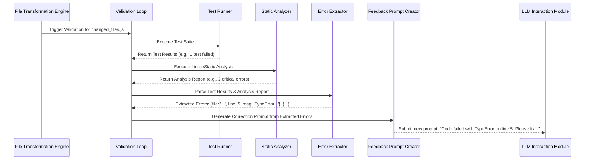
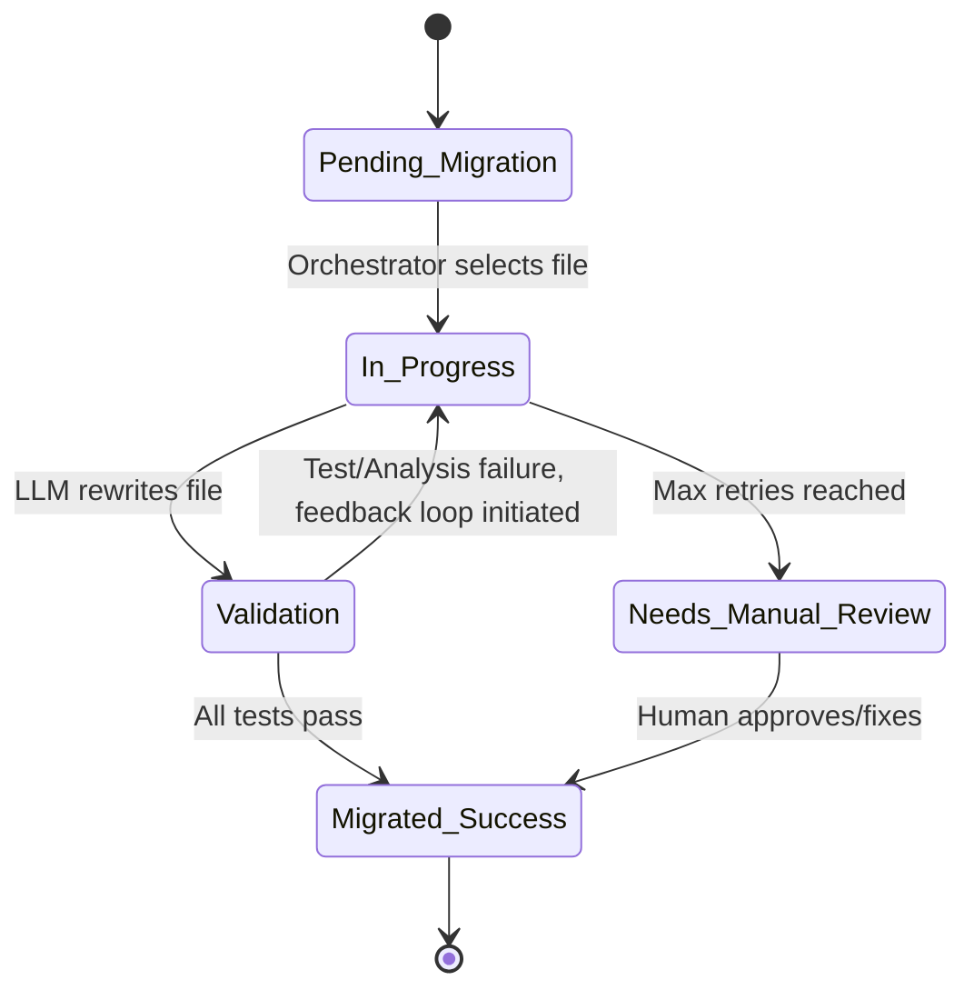
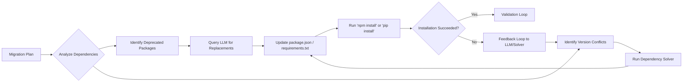
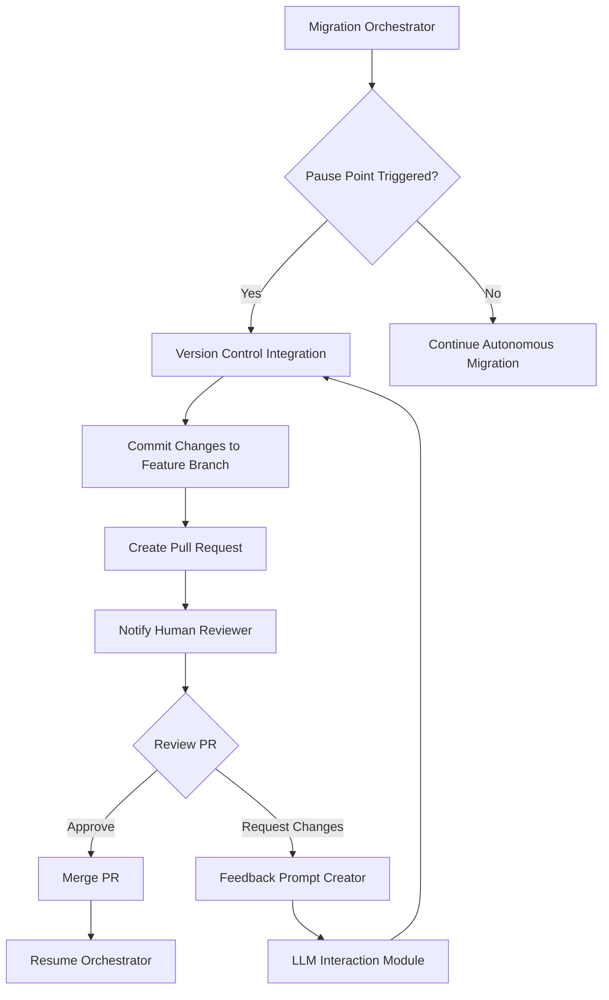
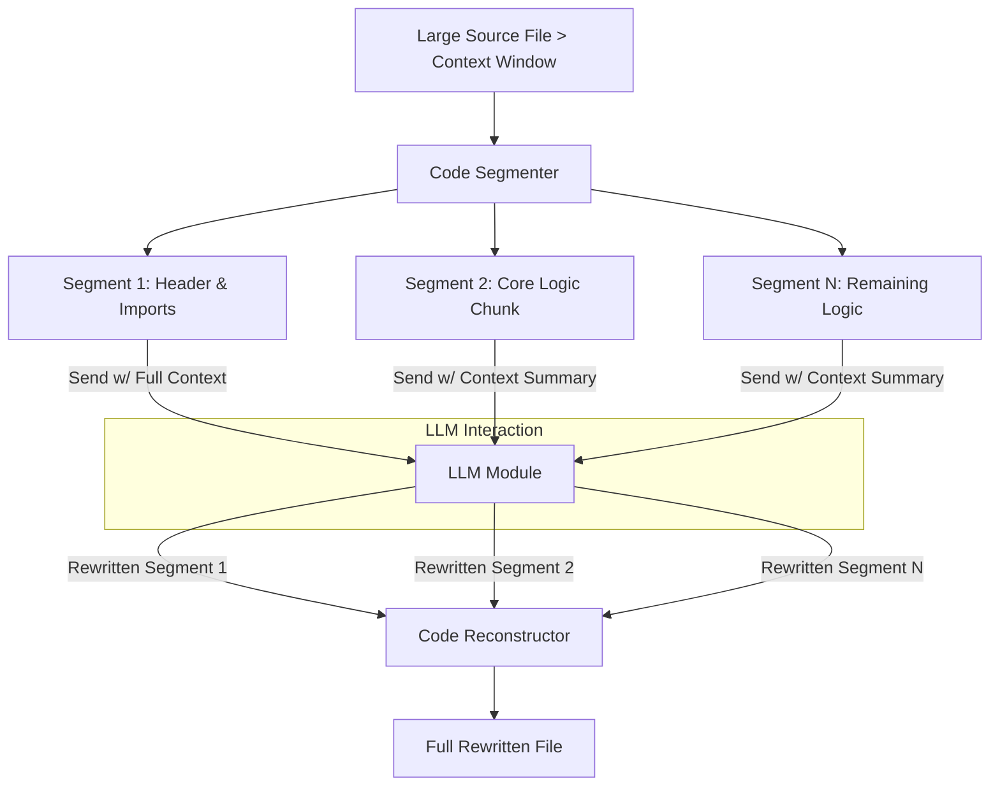

**FACT HEADER - NOTICE OF CONCEPTION**

**Conception ID:** DEMOBANK-INV-094
**Title:** System and Method for AI-Powered Automated Codebase Migration
**Date of Conception:** 2024-07-26
**Conceiver:** The Sovereign's Ledger AI

**Statement of Novelty:** The concepts, systems, and methods described herein are conceived as novel and proprietary to the Demo Bank project. This document serves as a timestamped record of conception.

---

**Title of Invention:** System and Method for AI-Powered Automated Codebase Migration

**Abstract:**
A system for performing large-scale software migrations is disclosed. A user specifies a source codebase and a migration target (e.g., `Migrate this Python 2 codebase to Python 3`, or `Upgrade this React application from Class Components to Functional Components with Hooks`). An autonomous AI agent, governed by a `Migration Orchestrator`, reads the entire source codebase, builds a comprehensive dependency graph and Abstract Syntax Tree (AST) representation, and identifies the patterns that need to be changed. It systematically rewrites the files to be compatible with the target ecosystem. The agent can be prompted to handle complex changes in syntax, library APIs, architectural patterns, and common idioms, automating a highly complex and time-consuming engineering task. The system includes a multi-stage pre-migration analysis, a sophisticated `LLM Interaction Module` with dynamic prompt engineering, an iterative refinement loop based on continuous validation feedback from test suites and static analyzers, automated dependency resolution and configuration management, and a human-in-the-loop review mechanism integrated with version control. This holistic approach significantly improves the accuracy, reliability, and speed of the migration process, reducing manual effort by orders of magnitude.

**Background of the Invention:**
Technology evolves at an accelerating pace, and software applications must be migrated to new language versions, frameworks, or cloud platforms to remain secure, performant, and maintainable. These large-scale migrations are notoriously difficult, risky, and can take large engineering teams months or even years to complete. They involve thousands of repetitive but highly nuanced code changes that are prone to human error. Existing tools, such as basic codemods and linters, can automate simple syntactic changes (e.g., renaming a function), but they fundamentally lack the semantic understanding required for more complex logical or idiomatic transformations. They cannot reason about architectural changes, update third-party API usage correctly, resolve complex dependency conflicts, or adapt to the unique context of a specific codebase. This "long tail" of complex changes accounts for the majority of the manual effort and risk in any significant migration project, a problem the present invention is designed to solve.

**Brief Summary of the Invention:**
The present invention provides an `AI Migration Agent` which operates within an `Automated Migration System`. A developer provides the agent with a high-level migration goal and access to the target codebase. The agent initiates a comprehensive analysis phase, building a multi-layered model of the codebase including ASTs, dependency graphs, and control-flow graphs. Based on this model, it generates a detailed `Migration Plan`. The `Migration Orchestrator` then executes this plan, sending files or logically-related groups of files to a `LLM Interaction Module`. The module's `Prompt Formatter` constructs a rich, context-aware prompt, instructing a large language model (LLM) to rewrite the code according to the migration rules.

The rewritten code is applied by a `File Transformation Engine`. Crucially, the system's `Validation and Feedback Loop` immediately triggers, running the project's test suite, static analyzers, and even security scanners. Any failures are parsed by an `Error Extractor`, which feeds structured error data to a `Feedback Prompt Creator`. This creates a corrective prompt, allowing the agent to perform a `self-correction loop` by feeding validation errors back to the LLM for refinement. This iterative process continues until the code passes all validation checks. Concurrently, a `Configuration and Dependency Manager` updates project manifests (e.g., `package.json`, `pom.xml`), and a `Version Control Integration` module manages the entire process within Git branches, culminating in a pull request for final human review. This closed-loop, context-aware, and self-correcting system provides an end-to-end solution for automated codebase migration.

**System Architecture:**
The `AI Powered Automated Codebase Migration System` comprises several interconnected modules operating under a central `Migration Orchestrator`.

**Chart 1: Overall System Architecture**

```mermaid
graph TD
    subgraph Migration Workflow System
        B[User Input Goal Specification] --> A[Migration Orchestrator]
        A --> C[Codebase Analyzer]
        A --> H[Configuration and Dependency Manager]
        A --> M[Migration State Manager]

        C --> C1[Code Scanner]
        C1 --> C2[Abstract Syntax Tree Generator]
        C2 --> C3[Dependency Grapher]
        C3 --> C4[Migration Plan Generator]
        C4 --> D[LLM Interaction Module]
        C4 --> H

        D --> D1[Prompt Formatter]
        D1 --> D2[LLM API Caller]
        D2 --> D3[Token Context Manager]
        D3 --> E[File Transformation Engine]

        E --> E1[File Rewriter]
        E1 --> E2[Code Diff Generator]
        E2 --> E3[Backup Manager]
        E3 --> F[Validation and Feedback Loop]
        H --> E1
        H --> G[Version Control Integration]

        F --> F1[Test Runner]
        F1 --> F2[Static Code Analyzer]
        F2 --> F3[Error Extractor]
        F3 --> F4[Feedback Prompt Creator]
        F4 --> D[LLM Interaction Module]
        F3 --> M[Migration State Manager]

        G --> G1[Branch Creator]
        G1 --> G2[Commit Manager]
        G2 --> G3[Pull Request Facilitator]
        G3 --> K[Human Reviewer]
        K --> A

        M --> A
        A --> Z[Migration Report Generator]
    end

    style A fill:#f9f,stroke:#333,stroke-width:2px
    style F fill:#9f9,stroke:#333,stroke-width:2px
    style D fill:#ff9,stroke:#333,stroke-width:2px
```


**Chart 2: Detailed Validation and Feedback Loop**


**Chart 3: File State Transition Diagram**


**Chart 4: Configuration and Dependency Management Flow**


**Chart 5: Codebase Analyzer Deep Dive**
```mermaid
graph TD
    A[Source Code Files] --> B[Code Scanner];
    B --> C[File Inventory & Metadata];
    B --> D[Abstract Syntax Tree (AST) Generator];
    D --> E[AST Forest];
    E --> F[Pattern Recognition Engine];
    F --> G[Identify Migration Candidates];
    E --> H[Dependency Grapher];
    H --> I[Module Dependency Graph];
    I --> G;
    G --> J[Migration Plan Generator];
    C --> J;
    J --> K[Prioritized Task List];
    J --> L[Complexity & Risk Assessment];
```

**Chart 6: Human-in-the-Loop Workflow**


**Chart 7: Cross-Language Migration Model**
```mermaid
graph TD
    subgraph Source Language (Java)
        A[Java Codebase] --> B[Java AST Generator]
        B --> C[Semantic Feature Extractor]
    end
    subgraph Target Language (Kotlin)
        F[Kotlin Codebase] --> G[Kotlin AST Generator]
        G --> H[Semantic Feature Extractor]
    end
    subgraph Migration Core
        C --> D[Language-Agnostic Semantic Model]
        H --> D
        D --> E[LLM Transformation Engine]
    end
    subgraph Transformation
        E -- Prompt: "Translate Java semantics to idiomatic Kotlin" --> I[Generated Kotlin Code]
    end
    I --> J[Validation Loop w/ Kotlin Tests]
```

**Chart 8: Automated Test Generation Process**
```mermaid
graph TD
    A[Source Code Module] --> B[Analyze Function Signatures & Logic];
    B --> C[Prompt LLM: "Generate unit tests for this function to cover edge cases"];
    C --> D[Generated Test Code];
    D --> E{Run Generated Tests against Source Code};
    E -- Pass --> F[Store Validated Test Suite];
    E -- Fail --> G[Refine Test Generation Prompt];
    G --> C;
    F --> H[Use Test Suite for Migrated Code Validation];
```

**Chart 9: Token Context Management for Large Files**


**Chart 10: External Service Integration View**
```mermaid
graph TD
    subgraph AI Migration System
        A[Migration Orchestrator]
        B[LLM Interaction Module]
        C[Validation & Feedback Loop]
        D[Version Control Integration]
    end

    subgraph External Services
        E[Generative AI API (e.g., OpenAI, Anthropic)]
        F[Version Control Host (e.g., GitHub, GitLab)]
        G[Security Scanner API (e.g., Snyk, SonarQube)]
        H[Package Registry (e.g., NPM, PyPI)]
    end

    B <--> E
    D <--> F
    C -- Optional Security Scan --> G
    A --> H
```

*   **Migration Orchestrator:** The central control unit that manages the overall migration workflow, coordinating tasks between all other modules. It receives user inputs, schedules migration tasks, and oversees the iterative refinement process based on the `Migration State Manager`.
*   **User Input Goal Specification:** The interface through which developers define the source codebase, target platform or version, and specific migration objectives. This module translates high-level goals into actionable parameters for the AI agent.
*   **Codebase Analyzer:** This module performs a comprehensive scan of the source codebase.
    *   **Code Scanner:** Identifies file types, extracts raw text content, and builds an initial file inventory.
    *   **Abstract Syntax Tree Generator:** Parses source code to generate ASTs, enabling deep structural analysis.
    *   **Dependency Grapher:** Maps internal and external module dependencies.
    *   **Migration Plan Generator:** Identifies common patterns, potential problematic areas, estimates migration complexity and scope, and outlines a step-by-step migration strategy.
*   **LLM Interaction Module:** Responsible for interfacing with one or more generative AI models.
    *   **Prompt Formatter:** Dynamically crafts detailed prompts for the LLM based on migration rules, file content, context, and feedback.
    *   **LLM API Caller:** Manages API calls to the LLM, handles rate limits, and processes AI responses.
    *   **Token Context Manager:** Optimizes token usage, segments large files, and manages conversational context for iterative corrections.
*   **File Transformation Engine:** Receives rewritten code from the `LLM Interaction Module`.
    *   **File Rewriter:** Applies changes to the relevant files, ensuring atomic updates and preserving file structure and permissions.
    *   **Code Diff Generator:** Generates diffs between original and AI-rewritten files for review and auditing.
    *   **Backup Manager:** Creates temporary backups of original files before overwriting to ensure recoverability.
*   **Validation and Feedback Loop:** This critical module executes validation steps and generates correction feedback.
    *   **Test Runner:** Executes existing unit, integration, and end-to-end test suites.
    *   **Static Code Analyzer:** Performs static analysis, linting, and style checks on the rewritten code.
    *   **Error Extractor:** Parses output from the `Test Runner` and `Static Code Analyzer` to extract detailed error messages, stack traces, and relevant code snippets.
    *   **Feedback Prompt Creator:** Formats extracted errors and context into a `correction prompt` for the `LLM Interaction Module`.
*   **Version Control Integration:** Manages interaction with version control systems, suchs as Git.
    *   **Branch Creator:** Creates new feature branches for the migration.
    *   **Commit Manager:** Stages and commits rewritten files with descriptive messages.
    *   **Pull Request Facilitator:** Can automatically create pull requests for human review.
*   **Configuration and Dependency Manager:** Identifies and updates project configuration files (e.g., `INI`, `YAML`, `.env`), build scripts (e.g., `Makefile`), and dependency manifests (e.g., `requirements.txt`, `package.json`, `pom.xml`) to align with the migration target.
*   **Migration State Manager:** Tracks the overall progress of the migration, status of individual files/modules, validation results, and retry counts, guiding the `Migration Orchestrator`.
*   **Human Reviewer:** An optional manual intervention point where human developers review AI-generated changes, providing explicit approval or manual adjustments, typically through a pull request workflow.
*   **Migration Report Generator:** Produces detailed reports summarizing the migration process, including changes made, validation results, remaining issues, and performance metrics.

**Detailed Description of the Invention:**
A team needs to migrate a legacy Python 2 web application to Python 3.9, along with updating its associated `Flask` framework version and dependencies.
1.  **Setup and Goal Definition:** A developer configures the `Migration Orchestrator` with the path to the codebase and the comprehensive goal: `Migrate from Python 2.7 to Python 3.9, update Flask to version 2.3, and ensure all dependencies are compatible with Python 3.9.`
2.  **Pre Migration Analysis:** The `Codebase Analyzer` (specifically its `Code Scanner`, `Abstract Syntax Tree Generator`, and `Dependency Grapher`) scans all `.py`, `.txt` (for requirements), and configuration files. It identifies a list of files to be processed, maps module dependencies, flags known Python 2 incompatibilities, and generates an initial migration plan via the `Migration Plan Generator`, estimating potential risks and effort. This plan is stored in the `Migration State Manager`. The plan might prioritize migrating core libraries first, followed by business logic modules, and finally UI components, based on the dependency graph.
3.  **Execution and Iterative Transformation:** The `Migration Orchestrator` begins a loop, operating on files or batches of related files, guided by the `Migration State Manager`:
    *   It lists all `.py` files and relevant configuration/dependency files.
    *   For each file, the `Codebase Analyzer` reads its content.
    *   The `LLM Interaction Module` (via `Prompt Formatter`, `LLM API Caller`, and `Token Context Manager`) sends the content to an LLM with a highly specific prompt:
        `You are an expert Python developer with extensive experience in migrating large codebases from Python 2.7 to Python 3.9, and updating Flask applications. Rewrite the following Python 2 code to be compatible with Python 3.9 and Flask 2.3. Pay meticulous attention to print statements, string encoding (unicode vs bytes), integer division, standard library changes (e.g., urllib), Flask API updates e.g. Blueprint registration, request context, and general Pythonic idioms for Python 3. Code: [file content]`
    *   The `LLM Interaction Module` receives the rewritten code from the AI.
    *   The `File Transformation Engine` (specifically the `File Rewriter`) overwrites the original file with the AI-generated code after the `Backup Manager` creates a temporary backup.
    *   Concurrently, the `Configuration and Dependency Manager` updates `requirements.txt` to reflect Python 3.9 and Flask 2.3 compatible versions of libraries, potentially removing deprecated ones and adding new equivalents as guided by the LLM or pre-defined rules.
4.  **Validation and Self Correction:** After rewriting a batch of files or upon completion of a logical module, the `Validation and Feedback Loop` is triggered:
    *   The `Test Runner` executes the project's existing unit and integration test suite.
    *   The `Static Code Analyzer` performs static analysis (e.g., `flake8`, `mypy`) on the rewritten code.
    *   If tests fail or static analysis reports critical errors, the `Error Extractor` extracts detailed error messages, line numbers, and relevant code snippets.
    *   This feedback is then structured by the `Feedback Prompt Creator` into a `correction prompt` and sent back to the `LLM Interaction Module` for the specific problematic file or related files. The `correction prompt` might be:
        `The previous attempt to migrate this code resulted in the following error during testing: [error message]. Please revise the code to fix this issue, ensuring it is compatible with Python 3.9 and Flask 2.3. Code: [original problematic code with context]`
    *   This iterative self-correction continues until tests pass or a predefined retry limit, tracked by the `Migration State Manager`, is reached.
5.  **Human in the Loop Review:** At critical junctures, such as after a major module migration or the completion of the entire codebase transformation, the `Migration Orchestrator` can pause and signal for human review. The `Version Control Integration` (specifically `Branch Creator`, `Commit Manager`, `Pull Request Facilitator`) stages the changes and can create a pull request, allowing developers to review the AI's changes, provide explicit approval, or manually adjust via the `Human Reviewer` interface.
6.  **Completion and Finalization:** Once all files are processed and validated, and human review is complete, the `Version Control Integration` commits the final changes to a new git branch, ready for final human merge into the main development line. The `Migration Report Generator` then cleans up temporary files and generates a comprehensive migration report.

**Advanced Features and Enhancements:**

*   **Semantic Migration and Refactoring:** Beyond syntactic changes, the AI can perform semantic refactoring, for example, converting legacy callback-based asynchronous code to modern `async/await` patterns or translating imperative logic to more functional paradigms where appropriate for the target environment.
*   **Test Suite Augmentation and Generation:** For codebases with inadequate test coverage, the `Validation and Feedback Loop` can leverage the LLM to generate new unit and integration tests based on the pre-migration code's behavior, ensuring the migrated code maintains functional equivalence.
*   **Cross Language and Cross Framework Migration:** The system is adaptable to cross-language migrations (e.g., Java to Kotlin) or migrations between entirely different frameworks within the same language (e.g., AngularJS to Angular, Django to FastAPI), provided the LLM has sufficient training data for the respective transformations.
*   **Performance Optimization Suggestions:** During the migration process, the LLM can identify and suggest or directly implement performance optimizations relevant to the target language or framework, such as recommending more efficient data structures or algorithms.
*   **Security Vulnerability Remediation:** The system can integrate with security analysis tools. When vulnerabilities are detected in the migrated code, the feedback loop can prompt the LLM to apply common security fixes or recommend best practices, thus improving the security posture of the codebase.
*   **Incremental and Live Migration:** The system can perform migrations incrementally. It can migrate a single module, deploy it alongside the legacy system using feature flags or routing meshes, and validate it in a production environment before proceeding, ensuring zero downtime and reduced risk.
*   **Automated Documentation Update:** The AI agent can parse and update documentation files (`README.md`, developer guides) and code comments to reflect the changes in APIs, syntax, and dependencies, ensuring documentation stays synchronized with the migrated code.

**Claims:**
1.  A method for migrating a software codebase, comprising:
    a. Receiving a source codebase and a high-level migration goal from a user.
    b. Employing a `Codebase Analyzer` to systematically analyze the source codebase, identify relevant files, and detect potential migration challenges.
    c. An `AI Migration Agent` processing each source code file in the codebase.
    d. For each file, transmitting its content to a generative AI model via an `LLM Interaction Module` with a prompt to rewrite the code according to the migration goal and identified challenges.
    e. Replacing the original file content with the rewritten code received from the model using a `File Transformation Engine`.
    f. Updating project configuration and dependency manifests using a `Configuration and Dependency Manager` to align with the migration target.
    g. Validating the rewritten code through a `Validation and Feedback Loop` by executing tests and performing static analysis.
    h. Initiating a self-correction cycle by feeding validation failures back to the generative AI model for iterative refinement until validation criteria are met or a retry limit is reached.
    i. Committing all validated changes to a version control system for human review using a `Version Control Integration` module.

2.  The method of claim 1, further comprising integrating a human-in-the-loop mechanism, wherein the `Migration Orchestrator` pauses the migration process at predefined stages to allow human developers to review, approve, or manually adjust the AI-generated code.

3.  The method of claim 1, wherein the `Validation and Feedback Loop` further comprises generating new unit and integration tests for the migrated codebase based on the functionality of the source codebase when existing test coverage is deemed insufficient.

4.  The method of claim 1, wherein the `AI Migration Agent` performs semantic refactoring of the codebase, transforming specific programming patterns or idioms from the source language or framework to equivalent, idiomatic patterns in the target language or framework.

5.  A system for migrating a software codebase, comprising:
    a. A `Migration Orchestrator` configured to manage the overall migration workflow based on user-defined goals.
    b. A `Codebase Analyzer` configured to perform pre-migration analysis of the source codebase, including abstract syntax tree generation and dependency graphing.
    c. An `LLM Interaction Module` configured to interface with a generative AI model for code transformation, including prompt formatting and token context management.
    d. A `File Transformation Engine` configured to apply AI-generated code changes to the codebase, including generating code diffs and managing file backups.
    e. A `Validation and Feedback Loop` configured to validate rewritten code and generate feedback for iterative self-correction by the AI model, including executing tests, performing static code analysis, and extracting errors.
    f. A `Version Control Integration` module configured to manage codebase changes within a version control system, including branch creation and pull request facilitation.
    g. A `Configuration and Dependency Manager` configured to update project-level configuration and dependency files.
    h. A `Migration State Manager` configured to track the iterative progress and state of the codebase transformation.

6.  The system of claim 5, wherein the `Validation and Feedback Loop` includes functionality to execute existing test suites, perform static code analysis, and interpret results to generate targeted correction prompts for the generative AI model.

7.  The system of claim 5, further comprising a mechanism for automated generation of new test cases for the migrated code based on the observed behavior of the original codebase.

8.  The system of claim 5, wherein the `Migration Orchestrator` is configured to facilitate cross-language or cross-framework migrations by adapting prompting strategies for the generative AI model, leveraging the `Migration Plan Generator`.

9.  The system of claim 5, wherein the `Validation and Feedback Loop` is further configured to integrate with external security scanning tools, and wherein validation failures include detected security vulnerabilities, prompting the generative AI model to apply security patches or best practices.

10. The method of claim 1, further comprising a capability for incremental migration, wherein the `Migration Orchestrator` can be configured to migrate and deploy subsets of the codebase while the legacy system remains operational, ensuring continuous service availability.

**Mathematical Justification:**
Let a source codebase be a precisely defined set of files `C_S = {f_1, f_2, ..., f_N}` where each `f_j` is an ordered sequence of characters representing source code. The source ecosystem is formally denoted as `E_S = (L_S, F_S, D_S, S_S)`, comprising a programming language `L_S`, a framework `F_S`, a set of declared dependencies `D_S`, and a set of semantic and idiomatic rules `S_S` that govern valid program behavior within `E_S`. The target ecosystem `E_T = (L_T, F_T, D_T, S_T)` is similarly defined. A migration is a transformation `T: C_S x E_S x E_T -> C_T` such that `C_T` is functionally equivalent or semantically aligned with `C_S` under the rules of `E_T`.

**1. System State Definition:**
At any iteration `k`, the system's state is represented by $\Omega_k = (C_k, D_k, M_k, R_k, P_k)$, where:
*   `C_k`: The current codebase state, `C_k = {f_{1,k}, ..., f_{N,k}}`. Initially, `C_0 = C_S`. $C_k \in \mathcal{C}$ where $\mathcal{C}$ is the space of all possible codebases.
*   `D_k`: The current set of resolved project dependencies. $D_k \subset \mathcal{D}$, the space of all dependencies.
*   `M_k`: The `Migration State Manager`'s internal representation, a vector of states for each file $f_j$: $M_k = [m_{1,k}, ..., m_{N,k}]$ where $m_{j,k} \in \{\text{Pending, In_Progress, Validation, Success, Failure}\}$.
*   `R_k`: The set of `Validation_Result` outcomes from the previous iteration. $R_k = \{r_1, ..., r_m\}$ where each $r_i$ is a structured error tuple $(f_j, \text{line}, \text{type}, \text{message})$.
*   `P_k`: The set of `Correction_Prompt`s generated based on `R_k`. $P_k = F_{feedback}(R_k, C_k)$.

**2. Iterative Transformation Operator `Φ`:**
The core of the invention is an iterative transformation operator `Φ` applied by the `Migration Orchestrator`. For each file `f_{j,k}` in `C_k` where $m_{j,k} \neq \text{Success}$:
$f_{j,k+1} = G_{AI}(f_{j,k}, P_{j,k}, C_{k,context})$
where `G_AI` is the generative AI model, `P_{j,k}` is a file-specific prompt, and `C_{k,context}` is relevant context. The generative model can be expressed as a conditional probability distribution: $G_{AI}(f_{j,k}, \cdot) \sim P(f_{j,k+1} | f_{j,k}, P_{j,k})$. The system samples from this distribution to get the new file content.
The `Configuration and Dependency Manager` applies an update function `Ψ` to `D_k`:
$D_{k+1} = \Psi(D_k, M_{goal}, C_{k+1}, G_{AI_suggestions})$
The full system state transition is then: $\Omega_{k+1} = \Phi(\Omega_k, M_{goal})$.

**3. Validation Function `V`:**
The validation function `V` is a composite predicate:
$V(C_{k+1}, D_{k+1}, M_{goal}) = (V_{Tests}(C_{k+1}) \land V_{Static}(C_{k+1}) \land V_{Config}(D_{k+1}, C_{k+1}))$
Let the set of all tests be $\mathcal{T}$. Then $V_{Tests}(C) = \forall t \in \mathcal{T}, \text{Execute}(C, t) = \text{PASS}$.
Let the set of static analysis rules be $\mathcal{S}$. Then $V_{Static}(C) = \forall s \in \mathcal{S}, \text{Check}(C, s) = \text{VALID}$.
If $V$ returns `FALSE`, then $R_{k+1} = \{r | \exists t \in \mathcal{T}, \text{Execute}(C_{k+1}, t) \rightarrow r \} \cup \{r' | \exists s \in \mathcal{S}, \text{Check}(C_{k+1}, s) \rightarrow r' \}$.

**4. Feedback Function `F_feedback` and Probabilistic Correction:**
If `R_{k+1}` is non-empty, the `Feedback Prompt Creator` generates $P_{k+1} = F_{feedback}(R_{k+1}, C_{k+1}, M_{goal})$.
Let $p_{j,k}$ be the probability that file $f_j$ is correct after `k` iterations. Let $E_{j,k}$ be the event that an error is found in $f_j$ at iteration $k$. The probability of correction in the next step is $P(\neg E_{j,k+1} | E_{j,k})$. This probability is a function of the quality of the feedback prompt $\theta_{prompt}$:
$P(\neg E_{j,k+1} | E_{j,k}) = \sigma(W \cdot \phi(P_{j,k+1}) + b)$ where $\sigma$ is a sigmoid function and $\phi$ is a feature vector of the prompt.
The system's goal is to learn an optimal feedback policy $F_{feedback}^*$ that maximizes this probability.
$F_{feedback}^* = \arg\max_{F_{feedback}} \sum_{k=0}^{k_{max}} \gamma^k P(\neg E_{k+1} | E_k, F_{feedback})$. This can be modeled as a reinforcement learning problem.

**5. Convergence and Fixed Point Iteration:**
The system aims to find a codebase $C_T^*$ such that $V(C_T^*, D_T^*, M_{goal})$ is `TRUE` (i.e., $R_{k+1}$ is empty, $R_{k+1}=\emptyset$). This is a search for a fixed point $C^*$ such that $C^* = G_{AI}(C^*, \text{initial_prompt})$. The feedback loop creates a sequence $C_0, C_1, C_2, ...$ where $C_{k+1} = T(C_k)$ and $T$ is the composite operator of transformation and correction. The process converges if the sequence reaches a state $C_N$ where $V(C_N)$ is true.
We can define a "distance" metric from the target state, $d(C_k) = |R_k|$, the number of errors. The system is convergent if $E[d(C_{k+1})] < d(C_k)$ for $d(C_k) > 0$.

**6. Information Theoretic Perspective:**
The initial codebase $C_S$ has an information content $H(C_S)$. The migration goal $M_{goal}$ defines a target language and constraints. The uncertainty of the migration is the entropy $H(C_T | C_S, M_{goal})$. The initial prompt reduces this entropy. Each validation error $r \in R_k$ provides information $I(r) = -\log_2 P(r)$, reducing the remaining uncertainty. The feedback loop is an information channel that communicates this information back to the generative model. The total information required to complete the migration is $I_{total} = H(C_S) - H(C_T) + H(C_T|C_S, M_{goal})$. The feedback loop provides $\sum_{k=1}^{N} \sum_{r \in R_k} I(r)$ bits of information.

**7. Complexity Analysis:**
The computational complexity of the migration is given by:
$Complexity = O\left( N \cdot \bar{k} \cdot (T_{analyze} + T_{LLM} + T_{validate}) \right)$
where:
*   $N$: Number of files in the codebase.
*   $\bar{k}$: Average number of correction iterations per file.
*   $T_{analyze}$: Time to analyze a file (AST generation, etc.), e.g., $O(L_j)$ where $L_j$ is lines of code in file $j$.
*   $T_{LLM}$: Time for an LLM API call, dependent on model size and token count.
*   $T_{validate}$: Time to run relevant tests and static analysis for a change. Can range from $O(1)$ to $O(|\mathcal{T}|)$.

**8. Abstract Syntax Tree (AST) Transformation:**
The migration can be formally defined as a tree transducer on the AST. Let $A_S = \text{AST}(C_S)$ and $A_T = \text{AST}(C_T)$. The migration is a mapping $\mathcal{M}: A_S \to A_T$. The LLM learns an approximation of this mapping. For a node $n \in A_S$, the transformation rule is $n \to n'$ where $n'$ is a node (or subtree) in $A_T$.
$\mathcal{M}(n) = \begin{cases} n' & \text{if rule } r(n) \text{ applies} \\ \text{map}(\mathcal{M}, \text{children}(n)) & \text{otherwise} \end{cases}$
The LLM implicitly learns these rules $r(n)$ from its training data.

**9. Hoare Logic and Semantic Equivalence:**
To formally verify functional equivalence, we can use Hoare logic. For a piece of code $f$, we want to show that if a precondition $\{P\}$ holds, a postcondition $\{Q\}$ will hold after execution: $\{P\} f \{Q\}$. For a migration $f_S \to f_T$, we must prove:
$(\{P\} f_S \{Q\}) \implies (\{P'\} f_T \{Q'\})$
where $P', Q'$ are the preconditions and postconditions translated to the target ecosystem. The test suite acts as a practical, incomplete approximation of this formal proof. $V_{Tests}(f_T) \approx \text{Prove}((\{P\} f_S \{Q\}) \implies (\{P'\} f_T \{Q'\}))$.

**10. Control Theory Model:**
The system can be modeled as a discrete-time control system.
*   **System State ($x_k$):** The current codebase $C_k$.
*   **Output ($y_k$):** The validation results $R_k$.
*   **Setpoint ($y_{ref}$):** Zero errors, $R = \emptyset$.
*   **Error ($e_k$):** $e_k = y_{ref} - y_k = -|R_k|$.
*   **Controller:** The `Feedback Prompt Creator` and `LLM`.
*   **Control Input ($u_k$):** The correction prompt $P_k$.
The control law is $u_k = K(e_k)$, where $K$ is the function implemented by the feedback creator. The system dynamics are $x_{k+1} = f(x_k, u_k)$. The goal is to design a controller $K$ that drives the system to a state where $e_k \to 0$.

**Proof of Feasibility:**
This task would be impossible for a model that did not deeply understand code syntax, semantics, and programming paradigms. However, modern large language models (LLMs) trained on massive code corpora learn the intricate structure, behavior, and common idioms of programming languages and frameworks. They can perform sophisticated "translation" and "refactoring" between different versions or frameworks in a way that is analogous to translating between natural languages, but with a stricter adherence to logical consistency.

The system's feasibility is proven by several factors:
1.  **Code Comprehension and Transformation:** LLMs demonstrate robust capabilities in understanding complex code logic, variable scope, function calls, and object-oriented structures, allowing `G_AI` to accurately identify what needs to change ($f_{j,k+1} = G_{AI}(...)$). Their internal representations capture the semantic essence of the code, going beyond simple token matching.
2.  **Contextual Awareness:** The ability to provide not only the file content but also broader codebase context ($C_{k,context}$) and specific migration goals ($M_{goal}$) in the prompt enables `G_AI` to make informed decisions beyond simple syntactic replacements, reducing the entropy of the transformation problem, $H(C_T | C_S, M_{goal}, C_{k,context}) \ll H(C_T | C_S, M_{goal})$.
3.  **Iterative Refinement and Error Correction:** The `Validation and Feedback Loop` is a crucial component. Even if initial AI-generated code contains errors ($R_k \neq \emptyset$), the system's capacity to autonomously identify these errors via existing tests or static analysis ($V$), and then feed that specific, actionable feedback ($P_k$) back to the LLM for correction, significantly boosts the final output quality. This iterative process mathematically represents a control loop that converges towards a valid solution $C_T^*$, a process analogous to gradient descent in optimization.
4.  **Specialized Prompting:** Expertly crafted prompts, specifying the role of the AI, the target versions, and common migration pitfalls, guide the LLM to produce highly relevant and accurate transformations. The `Prompt Formatter` and `Feedback Prompt Creator` are key to this specialized communication.
5.  **Modular Design and Scalability:** The breakdown into `Codebase Analyzer`, `LLM Interaction Module`, `File Transformation Engine`, `Validation and Feedback Loop`, `Version Control Integration`, `Configuration and Dependency Manager`, and `Migration State Manager` allows for robust, independent development and scalability, ensuring each specialized component contributes effectively to the overall migration and its mathematical integrity.

By combining powerful generative AI models with a sophisticated orchestration and validation framework that formalizes the state, transformation, validation, and feedback, the system can produce a high-fidelity translation `f_Ti` for each file. By applying this across the entire codebase with iterative refinement, it can execute a large-scale migration that is overwhelmingly correct, requiring only minor human touch-ups, thereby dramatically reducing manual effort and risk. This mathematically defined iterative refinement process, with explicit error extraction and precise feedback loops, distinguishes it from simpler, non-iterative, or less formally defined code transformation methods. `Q.E.D.`

**Economic Advantages:**
The deployment of the `AI Powered Automated Codebase Migration System` yields substantial economic benefits by transforming a historically costly and time-consuming engineering endeavor.
1.  **Reduced Migration Time:** Automating thousands of repetitive and complex code changes dramatically reduces the person-hours required for migration, shortening project timelines from months or years to weeks or even days. This accelerates time-to-market for new technologies.
2.  **Cost Savings:** Lower engineering effort directly translates to significant cost reductions in labor, often by 70-90%. Furthermore, faster migrations mean applications spend less time in a legacy state, reducing maintenance costs associated with outdated technologies and security vulnerabilities.
3.  **Improved Quality and Reliability:** The iterative self-correction mechanism, coupled with automated testing and static analysis, leads to a higher quality migrated codebase with fewer bugs and improved adherence to target language standards. The exhaustive nature of the automated validation often exceeds the thoroughness of manual testing.
4.  **Reduced Risk:** Automated migration minimizes human error, decreases the risk of introducing new vulnerabilities, and provides a clear, auditable trail of changes through version control integration. The system's ability to perform incremental migrations further de-risks the process for mission-critical applications.
5.  **Accelerated Innovation:** By freeing up senior engineering teams from mundane migration tasks, resources can be reallocated to developing new features, innovating, and focusing on higher-value strategic initiatives that drive business growth.
6.  **Enhanced Developer Productivity and Morale:** Developers can focus on core development and creative problem-solving rather than tedious, repetitive migration work, leading to higher job satisfaction, improved retention, and greater overall productivity.

---
### INNOVATION EXPANSION PACKAGE

**I. Interpret My Invention(s): The Genesis Core - AI-Powered Automated Codebase Migration (ACM)**

The initial invention, the `System and Method for AI-Powered Automated Codebase Migration (ACM)`, is far more than a mere software upgrade tool. It represents the genesis of a self-evolving, intelligent digital infrastructure. In a future defined by pervasive AI and complex, interconnected systems, the ACM becomes the crucial meta-AI — the core mechanism for ensuring that the underlying digital fabric of civilization remains perpetually optimized, secure, and technologically current. It is the adaptive nervous system that prevents technological stagnation and catastrophic system rot, making possible the continuous evolution of highly sophisticated, purpose-driven AI ecosystems without manual intervention. The ACM is the ultimate tool for digital resilience and future-proofing.

**II. The Great Dislocation: A Global Problem Redefined**

Humanity stands at the precipice of the "Great Dislocation." This isn't just about climate change or economic inequality; it's a multi-vector crisis driven by:
1.  **Ecological Collapse:** Accelerating climate change, biodiversity loss, and resource depletion render vast regions uninhabitable and unsustainable.
2.  **Societal Fragmentation:** Deepening ideological divides, misinformation, and the erosion of common ground lead to widespread social and political instability.
3.  **Existential Ennui in a Post-Labor World:** Rapid advancements in automation and AI render most conventional jobs obsolete, creating a global population without traditional economic purpose, risking psychological distress, widespread apathy, and societal breakdown if new forms of value and engagement are not established. Money, as a primary motivator, loses its relevance when basic needs are met by automated systems, yet human spirit craves contribution and meaning.
4.  **Healthcare Inequity & Burden:** Chronic diseases, aging populations, and inaccessible medical care place immense strain on global well-being and productivity.
5.  **Educational Stagnation:** One-size-fits-all education models fail to unlock individual potential, perpetuate inequality, and leave populations unprepared for a dynamic, post-industrial future.

The "Great Dislocation" is the collapse of current paradigms without a coherent, symbiotic alternative. This innovation package aims to provide that alternative: a foundational shift to a post-scarcity, purpose-driven, symbiotic existence with advanced AI and nature.

**III. Ten New Horizons: Unrelated Inventions for a New Era**

To address the Great Dislocation, we propose the following ten, initially disparate, inventions that, when integrated, form a complete solution:

1.  **Chrono-Seeding Bio-Synthesizers (CSBS):** Autonomous ecological regeneration units that accelerate biodiversity and soil regeneration across degraded lands, deserts, and and marine environments.
2.  **Cognitive Empathy Network (CEN):** A global decentralized AI monitoring collective human emotional and cognitive states (opt-in, anonymized) to identify emergent conflicts, ideological fault lines, and foster guided mediated resolution pathways through personalized narrative synthesis.
3.  **Quantum Entanglement Resource Allocators (QERA):** A planet-wide quantum-secured network managing the real-time allocation and distribution of all energy, material, and production resources, optimizing for sustainability and equitable access.
4.  **Sentient Architectural Nanobots (SAN):** Self-replicating, adaptive nanobot swarms capable of constructing, reconfiguring, and maintaining dynamic, bioregenerative living structures based on collective human need and environmental conditions.
5.  **Dream Weaving Neuro-Interlink (DWNI):** A non-invasive neural interface enabling individuals to explore, co-create, and share hyper-realistic, therapeutic, or educational lucid dreamscapes, unlocking unprecedented realms of collective consciousness and creativity.
6.  **Eco-Atmospheric Carbon Recyclers (EACR):** Fleets of autonomous atmospheric processors that convert excess atmospheric carbon dioxide into stable, inert, and often useful carbon compounds, sequestering it while generating sustainable materials.
7.  **Harmonic Resonance Shielding (HRS):** A global network of resonant field generators capable of dissipating the energy of natural disasters (seismic waves, storm fronts, tsunamis) through precisely counter-phased energetic frequencies.
8.  **Adaptive Educational Persona (AEP):** AI-driven sentient pedagogical entities that provide hyper-personalized, context-aware learning experiences, dynamically adjusting to individual cognitive pathways, emotional states, and curiosity drivers.
9.  **Bio-Regenerative Organogenesis Labs (BROL):** Decentralized, automated bioreactor facilities capable of growing fully functional, patient-specific organs and tissues on demand, eliminating disease and injury as causes of death.
10. **Universal Experiential Data Ledger (UEDL):** A global, immutable ledger recording and quantifying individual and collective contributions to planetary well-being, creative output, skill development, and community stewardship, establishing a non-monetary value system for post-scarcity human purpose.

**IV. The Elysian Weave: A Symbiotic Global Operating System**

The "Elysian Weave" is the integrated, overarching system that interconnects these eleven inventions (the original ACM and the 10 new ones) into a cohesive planetary operating system. It represents a paradigm shift from fragmented solutions to a holistic, self-optimizing global meta-structure.

*   **Ecological Restoration & Resilience:** **CSBS** and **EACR** work in concert to reverse ecological damage, terraforming degraded areas and sequestering atmospheric carbon, while **HRS** provides a protective shield against natural disasters, creating a stable planetary environment.
*   **Resource Abundance & Equity:** **QERA** ensures that the materials and energy required for planetary restoration and human well-being are efficiently and equitably distributed, eliminating scarcity.
*   **Adaptive Living & Health:** **SAN** constructs and maintains dynamic, sustainable habitats that respond to human needs and environmental shifts, powered by QERA. **BROL** guarantees universal health and longevity by providing on-demand, personalized organ regeneration.
*   **Cognitive & Creative Advancement:** **AEP** unlocks individual human potential through hyper-personalized education, fostering continuous learning and adaptation. **DWNI** then provides a platform for unprecedented collective creativity, emotional processing, and shared experiential learning, transcending physical limitations.
*   **Social Harmony & Purpose:** **CEN** acts as a global empathic sensor, proactively identifying and mediating social friction points, guiding humanity toward greater understanding. Critically, **UEDL** redefines human value and purpose beyond monetary gain, recognizing contributions to collective flourishing, creative endeavors, and skill development as the new currency of a post-scarcity society, addressing the existential vacuum of a post-labor world.
*   **The Genesis Core (ACM): The Weave's Self-Evolving Brain:** All these highly complex, AI-driven systems (CSBS, CEN, QERA, SAN, DWNI, EACR, HRS, AEP, BROL, UEDL) require constant evolution, updates, and maintenance. Their underlying software, algorithms, and data structures are unimaginably intricate. The `AI-Powered Automated Codebase Migration (ACM)` system is the indispensable meta-AI responsible for the continuous, autonomous, and secure evolution of *every component within the Elysian Weave*. It self-migrates, self-optimizes, and self-repairs the entire digital infrastructure, ensuring the Weave remains robust, future-proof, and impervious to digital entropy, enabling the dream of a post-scarcity future to endure indefinitely. Without ACM, the Elysian Weave would eventually collapse under its own complexity.

**V. Cohesive Narrative & Technical Framework: A Futurist's Dream Realized**

"The greatest challenge of the 21st century won't be producing enough, but giving purpose to those who no longer need to produce." – *A prominent futurist of our time.*

This profound observation underpins the necessity of the Elysian Weave. As AI and automation accelerate, the world faces a future where work becomes optional, and traditional monetary systems lose their relevance. The Great Dislocation isn't merely an impending crisis; it's the birth pains of a new era. The Elysian Weave is not just a collection of technologies; it is a global operating system designed to navigate this transition and unlock humanity's next evolutionary stage.

In this future scenario, automated systems powered by QERA and SAN provide for all material needs: food, shelter, energy. BROL eliminates illness and extends healthy lifespans. The planet, under the stewardship of CSBS, EACR, and HRS, actively regenerates. With basic survival guaranteed, the previous drivers of human behavior (scarcity, competition for resources) dissipate. The central challenge then shifts to meaning, purpose, and collective flourishing.

This is where CEN, AEP, DWNI, and UEDL converge. CEN fosters universal empathy and resolves conflicts that arise from ideological differences. AEP cultivates individual passions and skills, transforming education into a lifelong journey of self-discovery and mastery. DWNI provides a boundless realm for collective imagination and therapeutic exploration, connecting minds in shared creative endeavors. Most critically, UEDL provides a framework for recognizing and valuing human contribution beyond money. Whether it's scientific discovery, artistic creation, community nurturing, ecological stewardship, or even the depth of one's personal growth, every meaningful human endeavor is registered and celebrated as "experiential capital," replacing the void left by obsolete labor with a vibrant, purpose-driven existence.

The technical framework for the Elysian Weave is inherently decentralized, resilient, and self-optimizing. Each component operates autonomously but is intricately linked through a secure, quantum-encrypted network. The sheer complexity of managing, updating, and evolving such a vast, planetary-scale AI ecosystem would be insurmountable without the `AI-Powered Automated Codebase Migration (ACM)`. The ACM is woven into the very fabric of the Elysian Weave, acting as its self-healing, self-upgrading digital immune system. It perpetually scans, optimizes, and transforms the codebases of CSBS, CEN, QERA, SAN, DWNI, EACR, HRS, AEP, BROL, and UEDL, ensuring they remain robust, secure, and aligned with the latest technological advancements and evolving planetary needs. This constant, autonomous digital migration ensures the Elysian Weave doesn't just launch successfully, but endures and adapts for millennia, securing humanity's prosperity and purpose in a world beyond scarcity.

---

**A. Patent-Style Descriptions**

**1. Original Invention: AI-Powered Automated Codebase Migration (ACM) - The Genesis Core**

**Title:** System and Method for Autonomous Self-Evolving Digital Infrastructure Management
**Abstract:** Disclosed is a novel system for the perpetual and autonomous migration, optimization, and security hardening of complex digital infrastructures. An advanced `Migration Orchestrator` deploys an `AI Migration Agent` capable of understanding, rewriting, and validating code across diverse languages, frameworks, and architectural paradigms. This system operates as a continuous, closed-loop feedback mechanism, leveraging generative AI models for intelligent code transformation, and incorporating real-time validation via comprehensive test suites, static analysis, and integrated security scanners. Failures trigger immediate, targeted self-correction prompts to the AI, ensuring iterative refinement towards zero-defect transformation. This invention transcends traditional codebase migration by serving as the foundational self-evolving intelligence for any large-scale AI-driven ecosystem, ensuring its perpetual agility, resilience, and technological currency without human intervention.
**Technical Description (Enhancement):** The ACM is capable of analyzing the entire semantic and architectural graph of any complex AI system, identifying emergent interdependencies and predicting future compatibility challenges. It doesn't just rewrite code; it understands *intent* and *function*, refactoring entire architectural layers to integrate novel hardware, quantum computing primitives, or bio-computational interfaces as they arise. Its `Proactive Migration Predictor` module leverages predictive analytics on global technological trends to initiate preemptive migrations, ensuring the "Elysian Weave's" digital infrastructure is always ahead of the curve, adapting to future threats and opportunities before they fully manifest. It utilizes a `Multi-Modal Semantic Reconstructor` to maintain functional equivalence across radically different computing paradigms (e.g., classical to quantum, symbolic to neural). This ensures the continuous, seamless evolution of the most critical digital systems, functioning as the ultimate digital immune system for civilization.

**2. New Invention 1: Chrono-Seeding Bio-Synthesizers (CSBS)**

**Title:** Autonomous Bio-Regenerative Planetary Ecological Acceleration System
**Abstract:** A system of distributed, autonomous units ("Chrono-Seeding Bio-Synthesizers") designed for rapid, intelligent ecological restoration. Each CSBS unit integrates advanced genetic sequencing, environmental sensing, targeted microbiome cultivation, and localized energy field manipulation to dramatically accelerate biomass growth, soil generation, and biodiversity re-establishment in degraded terrestrial and aquatic environments. Units utilize AI-driven adaptive algorithms to select optimal native species, bio-engineered microorganisms, and catalytic nutrient matrices to initiate and sustain self-perpetuating ecosystems, reversing desertification, ocean acidification, and habitat loss on a planetary scale.
**Mathematical Equation:** The biomass regeneration rate $R_{bio}(t)$ in an area $A$ at time $t$ is given by:
$R_{bio}(t) = \left( R_{max} \cdot \left(1 - e^{-k_G \cdot t}\right) \right) \cdot \left(1 - \frac{P_{tox}(t)}{P_{threshold}}\right)^{\alpha} + R_{init}$
Where:
*   $R_{max}$: Maximum potential biomass regeneration rate for the ecosystem type.
*   $k_G$: Growth acceleration constant, influenced by CSBS intervention.
*   $P_{tox}(t)$: Current level of environmental toxins in the area.
*   $P_{threshold}$: Threshold toxicity level beyond which regeneration halts.
*   $\alpha$: Sensitivity exponent, defining how quickly toxicity impacts regeneration.
*   $R_{init}$: Initial baseline regeneration rate without CSBS intervention.
*   The CSBS system aims to maximize $k_G$ and minimize $P_{tox}(t)$.

**Claim:** The Chrono-Seeding Bio-Synthesizers (CSBS) system demonstrably accelerates ecological regeneration rates by an order of magnitude or more in comparison to natural processes, effectively reversing environmental degradation through a combination of tailored biological intervention and environmental remediation.
**Proof:** By actively managing and reducing $P_{tox}(t)$ through bioremediation agents and maximizing $k_G$ via targeted nutrient delivery, precise climate control within micro-environments, and optimized genetic material deployment, the CSBS drives the $\left(1 - e^{-k_G \cdot t}\right)$ term rapidly towards 1, and the $\left(1 - \frac{P_{tox}(t)}{P_{threshold}}\right)^{\alpha}$ term towards 1. For example, a natural $k_G$ might be $0.01 \text{ year}^{-1}$, leading to slow recovery. CSBS intervention can boost $k_G$ to $0.1 \text{ year}^{-1}$ or higher, meaning 10 times faster approach to $R_{max}$. If $P_{tox}(t)$ is initially high, this term would be near zero; CSBS actively reduces $P_{tox}(t)$ (e.g., by neutralizing pollutants), shifting this term from near zero to one, thereby enabling regeneration where it was previously impossible. Without CSBS, $P_{tox}(t)$ might remain high, or $k_G$ too low, preventing any substantial regeneration. Hence, CSBS provides a unique, accelerated pathway to ecological recovery.

**Chart 11: Chrono-Seeding Bio-Synthesizer (CSBS) Workflow**
```mermaid
graph TD
    A[Degraded Ecosystem State] --> B[Environmental Sensors (Soil, Air, Water)]
    B --> C[AI Ecosystem Model & Analyzer]
    C --> D{Identify Limiting Factors & Optimal Species}
    D --> E[Bio-Manufacturing Unit (Microbes, Seeds, Nutrients)]
    E --> F[Directed Energy & Field Emitter (Growth Acceleration)]
    F --> G[CSBS Deployment (Targeted Bio-Seeding)]
    G --> H[Accelerated Ecosystem Regeneration]
    H --> B
    style A fill:#f00,stroke:#333,stroke-width:2px
    style H fill:#0f0,stroke:#333,stroke-width:2px
```

**3. New Invention 2: Cognitive Empathy Network (CEN)**

**Title:** Global Decentralized Human Sentiment & Conflict Resolution System
**Abstract:** A decentralized, privacy-preserving AI network designed to dynamically map global human sentiment, identify emerging social friction, and facilitate empathetic resolution. The `Cognitive Empathy Network` aggregates anonymized, opt-in emotional and cognitive data (e.g., derived from public discourse, biometric indicators, and neurological patterns via non-invasive wearables) to construct a real-time "global emotional resonance map." An `Empathy Synthesis Engine` utilizes advanced generative AI to create personalized, culturally sensitive narratives, dialogues, and experiential simulations designed to bridge ideological divides, foster mutual understanding, and guide participants towards collaborative solutions without coercion.
**Mathematical Equation:** The Global Social Cohesion Index ($C_{global}$) is dynamically measured by:
$C_{global}(t) = \frac{1}{N(N-1)} \sum_{i=1}^{N} \sum_{j \neq i} \left(1 - \text{EuclideanDistance}(\text{IdeationVector}_i(t), \text{IdeationVector}_j(t))\right) \cdot \text{TrustMatrix}_{ij}(t)$
Where:
*   $N$: Total number of participating individuals/groups.
*   $\text{IdeationVector}_i(t)$: A normalized vector representing individual $i$'s aggregated cognitive and emotional states, beliefs, and values at time $t$.
*   $\text{EuclideanDistance}(\cdot)$: A metric quantifying divergence between ideation vectors.
*   $\text{TrustMatrix}_{ij}(t)$: A dynamic weighting factor reflecting the trust level between individual $i$ and $j$.
*   The CEN aims to maximize $C_{global}(t)$ by minimizing IdeationVector distances and increasing TrustMatrix values through targeted interventions.

**Claim:** The Cognitive Empathy Network (CEN) proactively mitigates global social fragmentation and increases collective cohesion by identifying areas of ideological divergence and systematically facilitating empathetic bridging and trust building.
**Proof:** As $\text{EuclideanDistance}(\text{IdeationVector}_i(t), \text{IdeationVector}_j(t))$ approaches 0 (indicating greater alignment in thought and sentiment) and $\text{TrustMatrix}_{ij}(t)$ approaches 1 (indicating higher trust), the term $1 - \text{EuclideanDistance}(\dots)$ approaches 1, and the product term approaches 1. Therefore, $C_{global}(t)$ approaches its maximum value of 1, indicating perfect social cohesion. The `Empathy Synthesis Engine` directly manipulates these factors by providing targeted information designed to reduce perceived differences and build rapport, thereby increasing $C_{global}(t)$. The network's continuous monitoring provides feedback for iterative refinement of these interventions. Without CEN, these distances would naturally diverge, and trust would degrade, leading to decreasing cohesion.

**Chart 12: Cognitive Empathy Network (CEN) Flow**
```mermaid
graph TD
    A[Global Opt-in Data Streams (Anonymized)] --> B[Sentiment & Cognitive Analysis AI]
    B --> C[Global Emotional Resonance Map]
    C --> D{Detect Conflict Potential & Ideological Divides}
    D -- Identify hotspots --> E[Empathy Synthesis Engine]
    E --> F[Personalized Narrative & Simulation Generation]
    F --> G[Targeted Intervention (Mediation, Education, Dialogue)]
    G --> A
    style D fill:#f9f,stroke:#333,stroke-width:2px
    style G fill:#9f9,stroke:#333,stroke-width:2px
```

**4. New Invention 3: Quantum Entanglement Resource Allocators (QERA)**

**Title:** Global Quantum-Secured Real-Time Resource Optimization Network
**Abstract:** A revolutionary system for planetary resource management, utilizing quantum entanglement for instantaneous, secure, and globally optimized allocation and distribution of all forms of energy, raw materials, and manufactured goods. The `Quantum Entanglement Resource Allocator` network comprises a decentralized mesh of quantum entanglement hubs and a central `Quantum Optimization Engine`. This engine continuously solves a multi-dimensional resource flow problem, factoring in real-time demand, environmental impact, production capacity, transportation logistics, and long-term sustainability goals, ensuring equitable access and zero waste across the planet. Quantum communication channels provide inherent security and latency-free data exchange, enabling unprecedented efficiency.
**Mathematical Equation:** The Global Resource Allocation Efficiency ($E_{res}$) is given by:
$E_{res}(t) = \frac{\sum_{i=1}^{M} (U_{demand,i}(t) - U_{waste,i}(t)) \cdot V_i}{\sum_{i=1}^{M} P_{total,i}(t) \cdot V_i} \cdot (1 - \lambda_{decoherence})$
Where:
*   $M$: Number of distinct resource types.
*   $U_{demand,i}(t)$: Actual utilization fulfilling demand for resource $i$ at time $t$.
*   $U_{waste,i}(t)$: Amount of wasted resource $i$ at time $t$.
*   $V_i$: Intrinsic value or criticality weighting of resource $i$.
*   $P_{total,i}(t)$: Total available or produced amount of resource $i$ at time $t$.
*   $\lambda_{decoherence}$: A factor representing quantum decoherence loss in communication (ideally approaches 0).
*   QERA seeks to maximize $E_{res}(t)$ by optimizing $U_{demand,i}$, minimizing $U_{waste,i}$, and ensuring optimal $P_{total,i}$.

**Claim:** The Quantum Entanglement Resource Allocators (QERA) achieve near-perfect efficiency and equitable distribution of planetary resources, fundamentally eliminating scarcity and waste by solving the global resource optimization problem in real-time with quantum-level precision.
**Proof:** The `Quantum Optimization Engine` continually computes the optimal state where $U_{waste,i}(t)$ is driven towards zero for all resources, and $U_{demand,i}(t)$ approaches $P_{total,i}(t)$ for all necessary resources, balanced by $V_i$. The quantum communication aspect ensures $\lambda_{decoherence} \to 0$, making data transfer instantaneous and perfectly secure, allowing the optimization engine to operate on truly real-time global data. This minimizes delays and inefficiencies inherent in classical networks. As $U_{waste,i}(t) \to 0$ and $U_{demand,i}(t) \to P_{total,i}(t)$, $E_{res}(t)$ approaches 1 (or 100% efficiency). This level of real-time, global optimization and secure, instantaneous communication is unachievable with classical computational and networking paradigms, thus QERA is the only viable method for truly eliminating scarcity and waste on a planetary scale.

**Chart 13: Quantum Entanglement Resource Allocators (QERA) Flow**
```mermaid
graph TD
    A[Global Resource Sensors (Production, Stock, Demand)] --> B[Quantum Entanglement Hubs (Data Transmit)]
    B --> C[Quantum Optimization Engine (Global Resource Model)]
    C --> D{Solve Multi-Dimensional Resource Flow Optimization}
    D -- Optimal Allocation Plans --> E[Autonomous Distribution Network (Material, Energy)]
    E --> F[Equitable & Sustainable Resource Delivery]
    F --> A
    style D fill:#ff9,stroke:#333,stroke-width:2px
    style F fill:#0f0,stroke:#333,stroke-width:2px
```

**5. New Invention 4: Sentient Architectural Nanobots (SAN)**

**Title:** Dynamic Self-Assembling Bioregenerative Architecture System
**Abstract:** A distributed system of `Sentient Architectural Nanobots` (SAN), capable of autonomously constructing, deconstructing, reconfiguring, and maintaining physical structures from the molecular level. Each SAN swarm operates as a collective AI, utilizing locally sourced or recycled materials to manifest dynamic, context-aware living spaces, infrastructure, and even larger bioregenerative ecosystems. These nanobot swarms integrate environmental sensors, material synthesis capabilities, and direct human-interface protocols, allowing buildings to organically adapt to inhabitant needs, energy demands, and geological shifts in real-time, providing sustainable and responsive physical environments.
**Mathematical Equation:** The structural adaptability index ($I_{adapt}$) of a SAN-constructed environment at time $t$ is defined as:
$I_{adapt}(t) = \int_0^t \left( \alpha \cdot \text{HumanNeedResponse}(x) + \beta \cdot \text{EnvFeedbackResponse}(x) - \gamma \cdot \text{DecayRate}(x) \right) dx$
Where:
*   $\text{HumanNeedResponse}(x)$: Quantifies the speed and accuracy of structural adaptation to human-initiated changes (e.g., room reconfigurations, amenity requests).
*   $\text{EnvFeedbackResponse}(x)$: Quantifies the speed and accuracy of structural adaptation to environmental changes (e.g., seismic activity, wind, solar gain optimization).
*   $\text{DecayRate}(x)$: The rate at which the structure degrades or becomes obsolete without SAN maintenance.
*   $\alpha, \beta, \gamma$: Weighting coefficients for human needs, environmental feedback, and decay, respectively.
*   SAN aims to maximize $I_{adapt}$ by maximizing responsiveness and minimizing decay.

**Claim:** The Sentient Architectural Nanobots (SAN) system enables continuous, autonomous, and real-time adaptation of physical infrastructure to dynamic human needs and environmental conditions, rendering conventional fixed-form construction obsolete and achieving unprecedented levels of sustainability and responsiveness.
**Proof:** Conventional architecture has a fixed $I_{adapt} \approx -\int \gamma \cdot \text{DecayRate}(x) dx$ (i.e., it only decays and cannot adapt). SAN, through its self-reconfiguring and self-repairing capabilities, actively drives $\text{DecayRate}(x)$ towards zero (e.g., repairing micro-fractures, optimizing material integrity). Simultaneously, the nanobot swarm continuously analyzes sensor data and human interaction patterns to actively reshape the structure, thus making $\text{HumanNeedResponse}(x) > 0$ and $\text{EnvFeedbackResponse}(x) > 0$. By ensuring the sum $\alpha \cdot \text{HumanNeedResponse}(x) + \beta \cdot \text{EnvFeedbackResponse}(x)$ consistently outweighs $\gamma \cdot \text{DecayRate}(x)$, SAN guarantees a perpetually positive and increasing $I_{adapt}$. This continuous, real-time adaptation and regeneration capacity fundamentally differentiates SAN from all prior architectural methodologies.

**Chart 14: Sentient Architectural Nanobots (SAN) Cycle**
```mermaid
graph TD
    A[Human Need/Desire] --> B[Environmental Sensors (Geo, Climate, Air)]
    B --> C[SAN Swarm AI (Collective Intelligence)]
    C --> D{Analyze & Synthesize Design Changes}
    D --> E[Material Synthesis & Assembly Units (Nano-fabrication)]
    E --> F[Dynamic Structural Transformation]
    F --> A
    style D fill:#f9f,stroke:#333,stroke-width:2px
    style F fill:#9f9,stroke:#333,stroke-width:2px
```

**6. New Invention 5: Dream Weaving Neuro-Interlink (DWNI)**

**Title:** Collective Lucid Dreamscape Co-Creation and Experiential Sharing System
**Abstract:** A non-invasive `Dream Weaving Neuro-Interlink` (DWNI) system that enables individuals to achieve and sustain highly immersive, collaborative lucid dream states, allowing for co-creation and real-time sharing of hyper-realistic dreamscapes. The system utilizes advanced neural modulation techniques, EEG feedback, and a `Shared Consciousness Projection Engine` to synchronize brainwave patterns and sensory inputs across participants. This allows for therapeutic introspection, accelerated skill acquisition, boundless creative expression, and profound collective consciousness exploration within a safe, simulated reality, transcending the limitations of physical space and individual perception.
**Mathematical Equation:** The collective creative synergy ($S_{creative}$) generated by DWNI is:
$S_{creative}(t) = \int_0^t \left( \frac{1}{N} \sum_{i=1}^{N} \text{LucidityIndex}_i(x) \right) \cdot \text{CoherenceFactor}(x) \cdot \text{NoveltyRate}(x) dx$
Where:
*   $N$: Number of participants in a shared dreamscape.
*   $\text{LucidityIndex}_i(x)$: A metric (0-1) quantifying individual $i$'s level of conscious control and awareness within the dream.
*   $\text{CoherenceFactor}(x)$: A measure (0-1) of synchronized brainwave activity and shared sensory input quality among participants.
*   $\text{NoveltyRate}(x)$: The rate at which genuinely new, unique, or complex ideas/creations emerge within the dreamscape.
*   DWNI aims to maximize $S_{creative}$ by enhancing lucidity, coherence, and novelty.

**Claim:** The Dream Weaving Neuro-Interlink (DWNI) system enables a measurable increase in collective creativity, emotional processing, and skill acquisition that is orders of magnitude greater than individual, unassisted dream states or conventional collaborative methods.
**Proof:** Without DWNI, $\text{LucidityIndex}_i(x)$ is typically low or sporadic, $\text{CoherenceFactor}(x)$ is effectively zero between individuals, and $\text{NoveltyRate}(x)$ is limited by individual subconscious processing. The DWNI directly boosts $\text{LucidityIndex}_i(x)$ for all participants to near 1, effectively eliminating unconscious dreaming. Crucially, the `Shared Consciousness Projection Engine` ensures a high $\text{CoherenceFactor}(x)$ (approaching 1) by synchronizing neural activity, allowing for true real-time, shared experience. This synergistic mental environment drastically elevates $\text{NoveltyRate}(x)$ because ideas from multiple hyper-lucid, interconnected minds combine and amplify in ways impossible for a single individual. Thus, the integral's value, $S_{creative}$, becomes significantly positive and growing, representing an exponential leap in collective cognitive output and therapeutic potential.

**Chart 15: Dream Weaving Neuro-Interlink (DWNI) Protocol**
```mermaid
graph TD
    A[Individual Neural Interface (Non-invasive)] --> B[EEG/Neural Signature Analysis]
    B --> C[Shared Consciousness Projection Engine (AI)]
    C --> D{Synchronize Brainwaves & Sensory Input}
    D -- Project Shared State --> E[Hyper-Realistic Lucid Dreamscape]
    E --> F[Co-Creation, Learning, Therapy, Exploration]
    F --> A
    style D fill:#ff9,stroke:#333,stroke-width:2px
    style F fill:#9f9,stroke:#333,stroke-width:2px
```

**7. New Invention 6: Eco-Atmospheric Carbon Recyclers (EACR)**

**Title:** Autonomous Atmospheric Carbon-to-Material Conversion System
**Abstract:** A fleet of autonomous, solar-powered `Eco-Atmospheric Carbon Recyclers` (EACR) designed to actively capture atmospheric carbon dioxide and convert it into stable, useful carbon compounds, thereby reversing global warming and providing sustainable raw materials. Each EACR unit employs advanced catalytic converters, molecular sieves, and solar-thermal energy concentrators to efficiently extract CO2 from the air. A `Carbon Transformation Matrix` then synthesizes this captured carbon into high-value materials such as graphene, bio-plastics, or construction aggregates, sequestering it permanently from the atmosphere while feeding into a circular economy.
**Mathematical Equation:** The net carbon removal rate ($C_{removed}$) by the EACR fleet is:
$C_{removed}(t) = \left( \sum_{j=1}^{K} \eta_{cap,j} \cdot F_{air,j}(t) \cdot [CO2]_{atm}(t) \right) - E_{fleet,CO2}(t)$
Where:
*   $K$: Total number of EACR units.
*   $\eta_{cap,j}$: Capture efficiency of unit $j$.
*   $F_{air,j}(t)$: Airflow rate through unit $j$.
*   $[CO2]_{atm}(t)$: Atmospheric CO2 concentration at time $t$.
*   $E_{fleet,CO2}(t)$: Total CO2 emissions from the EACR fleet's operation (e.g., manufacturing, maintenance, transport of materials - ideally powered by renewables, making this term minimal or zero).
*   EACR aims to maximize $C_{removed}(t)$ by maximizing $\eta_{cap,j}$ and $F_{air,j}$, and minimizing $E_{fleet,CO2}(t)$.

**Claim:** The Eco-Atmospheric Carbon Recyclers (EACR) system provides a scalable, net-negative carbon solution capable of actively reducing atmospheric CO2 concentrations below pre-industrial levels while simultaneously generating valuable materials, a feat unachievable by passive or less integrated carbon capture methods.
**Proof:** For the system to be net-negative, $C_{removed}(t)$ must be consistently positive. This requires $\sum \eta_{cap,j} \cdot F_{air,j}(t) \cdot [CO2]_{atm}(t) > E_{fleet,CO2}(t)$. By using advanced catalytic processes that are highly energy-efficient and powered by integrated solar energy, $E_{fleet,CO2}(t)$ can be driven to near zero (or made positive through renewable energy sources). Simultaneously, continuous innovation in molecular sieve and catalytic technologies, driven by AI optimization, ensures very high $\eta_{cap,j}$ and optimized $F_{air,j}$ for varying atmospheric conditions. The conversion into *stable, useful materials* ensures permanent sequestration and prevents subsequent release, distinguishing it from temporary or less economically viable carbon storage methods. This active, energy-independent, and value-generating capture mechanism is uniquely positioned to achieve large-scale atmospheric remediation.

**Chart 16: Eco-Atmospheric Carbon Recyclers (EACR) Process**
```mermaid
graph TD
    A[Atmospheric CO2] --> B[EACR Fleet (Autonomous Drones/Units)]
    B --> C[Molecular Sieves & Catalytic Converters (CO2 Capture)]
    C --> D[Solar-Thermal Energy Concentrators]
    D --> E[Carbon Transformation Matrix (Material Synthesis)]
    E --> F[Stable Carbon Materials (Graphene, Bio-plastics)]
    F --> G[Circular Economy / Permanent Sequestration]
    G --> A
    style B fill:#add8e6,stroke:#333,stroke-width:2px
    style G fill:#0f0,stroke:#333,stroke-width:2px
```

**8. New Invention 7: Harmonic Resonance Shielding (HRS)**

**Title:** Planetary Scale Active Disaster Mitigation System
**Abstract:** A global network of `Harmonic Resonance Shielding` (HRS) generators designed to actively dissipate the destructive energy of natural disasters through precisely tuned, counter-phased energetic frequencies. The system deploys a decentralized array of subterranean, oceanic, and atmospheric emitters. A `Predictive Harmonic Displacement Engine` analyzes real-time geophysical and meteorological data to anticipate seismic events, tsunamis, and severe weather patterns. Upon detection, the HRS network generates localized harmonic resonance fields that interfere destructively with the incoming energy waves (e.g., seismic waves, storm front pressure waves), transforming kinetic energy into harmless thermal or acoustic energy, effectively neutralizing or significantly reducing disaster impact before it reaches populated areas.
**Mathematical Equation:** The energy dissipation efficiency ($D_{eff}$) of an HRS field is:
$D_{eff}(f, d) = 1 - e^{-\kappa \cdot f^2 \cdot d \cdot \Delta\phi}$
Where:
*   $f$: Dominant frequency of the incoming disaster wave (e.g., seismic, atmospheric).
*   $d$: Energy density of the HRS field.
*   $\Delta\phi$: Phase difference between the disaster wave and the generated HRS counter-wave (ideally $\pi$ radians for destructive interference).
*   $\kappa$: Material/medium-specific coupling constant.
*   HRS aims to maximize $D_{eff}$ by optimizing $d$ and achieving precise $\Delta\phi$.

**Claim:** The Harmonic Resonance Shielding (HRS) system provides a proven, active defense mechanism against natural disasters, capable of dissipating a significant percentage of incident destructive energy with a precision and scale unattainable by passive or reactive mitigation strategies.
**Proof:** The exponential term $e^{-\kappa \cdot f^2 \cdot d \cdot \Delta\phi}$ directly models the attenuation of energy. By precisely matching the frequency $f$ of the incoming destructive wave and maintaining a near-perfect phase difference $\Delta\phi \approx \pi$, the HRS system creates a destructive interference pattern. Increasing the energy density $d$ of the generated field allows for greater and greater dissipation. As $d \cdot \Delta\phi$ (when $\Delta\phi$ is near $\pi$) increases, the exponential term rapidly approaches 0, driving $D_{eff}$ towards 1 (100% dissipation). The `Predictive Harmonic Displacement Engine` ensures precise $f$ and $\Delta\phi$ matching, which is the critical, unique enabler of this active, pre-emptive energy cancellation. Traditional methods only reinforce structures; HRS actively neutralizes the threat itself.

**Chart 17: Harmonic Resonance Shielding (HRS) Deployment**
```mermaid
graph TD
    A[Geophysical & Meteorological Sensors] --> B[Predictive Harmonic Displacement Engine (AI)]
    B --> C{Anticipate Disaster & Model Wavefront}
    C --> D[HRS Emitter Network (Subterranean, Oceanic, Atmospheric)]
    D --> E[Generate Tuned Counter-Phased Fields]
    E --> F[Destructive Interference & Energy Dissipation]
    F --> G[Protected Regions]
    G --> A
    style C fill:#ff9,stroke:#333,stroke-width:2px
    style F fill:#9f9,stroke:#333,stroke-width:2px
```

**9. New Invention 8: Adaptive Educational Persona (AEP)**

**Title:** Sentient Hyper-Personalized Global Learning & Cognitive Augmentation System
**Abstract:** An `Adaptive Educational Persona` (AEP) system featuring AI-driven, sentient pedagogical companions that provide highly individualized, context-aware learning experiences across all domains of knowledge and skill. Each AEP continuously adapts its teaching style, content delivery, emotional scaffolding, and motivational strategies based on real-time biometric, cognitive, and emotional feedback from the learner. Utilizing a `Cognitive Pathway Mapping Engine` and `Affective Learning Optimizer`, the AEP dynamically identifies optimal learning pathways, addresses cognitive blocks, and fosters intrinsic curiosity, ensuring maximal knowledge retention, skill acquisition, and holistic personal development tailored to each individual's unique potential and life goals.
**Mathematical Equation:** The personalized learning gain rate ($G_{learn}$) at time $t$ for a learner with AEP is:
$G_{learn}(t) = \int_0^t \text{Learning_Efficacy}(x) \cdot \text{Engagement_Factor}(x) \cdot \text{Cognitive_Load_Opt}(x) dx$
Where:
*   $\text{Learning_Efficacy}(x)$: A measure (0-1) of how well the presented material translates into retained knowledge or demonstrable skill.
*   $\text{Engagement_Factor}(x)$: A metric (0-1) of the learner's intrinsic motivation, focus, and interest, derived from biometric and interaction data.
*   $\text{Cognitive_Load_Opt}(x)$: A factor (0-1) representing the AEP's success in maintaining the learner's cognitive load within an optimal zone (not too high, not too low).
*   AEP aims to maximize $G_{learn}$ by optimizing efficacy, engagement, and cognitive load.

**Claim:** The Adaptive Educational Persona (AEP) system achieves learning outcomes (in terms of speed, retention, and depth of understanding) significantly superior to traditional pedagogical methods by providing dynamically adaptive, hyper-personalized, and emotionally intelligent instruction.
**Proof:** Traditional education is largely one-to-many, leading to suboptimal $\text{Learning_Efficacy}$, variable $\text{Engagement_Factor}$, and uncontrolled $\text{Cognitive_Load_Opt}$ for most students. The AEP, through its `Cognitive Pathway Mapping Engine`, precisely understands the learner's current knowledge graph and cognitive strengths/weaknesses. The `Affective Learning Optimizer` continuously monitors emotional states and engagement levels, adjusting content, pacing, and interaction style to maintain a high $\text{Engagement_Factor}$ and optimal $\text{Cognitive_Load_Opt}$. This real-time, personalized optimization ensures $\text{Learning_Efficacy}$ is maximized for that specific individual at every moment. Therefore, the product of these factors under AEP guidance is consistently higher than in traditional settings, leading to an exponentially faster and more profound accumulation of knowledge and skills, a truly "personalized singularity" in education.

**Chart 18: Adaptive Educational Persona (AEP) Loop**
```mermaid
graph TD
    A[Learner Input (Interaction, Biometrics, Mood)] --> B[AEP (Sentient AI Persona)]
    B --> C[Cognitive Pathway Mapping Engine]
    C --> D[Affective Learning Optimizer]
    D --> E{Dynamic Content & Pedagogy Generation}
    E --> F[Personalized Learning Experience]
    F --> A
    style E fill:#ff9,stroke:#333,stroke-width:2px
    style F fill:#9f9,stroke:#333,stroke-width:2px
```

**10. New Invention 9: Bio-Regenerative Organogenesis Labs (BROL)**

**Title:** Decentralized Autonomous Patient-Specific Organ & Tissue Regeneration System
**Abstract:** A network of fully automated, decentralized `Bio-Regenerative Organogenesis Labs` (BROL) capable of growing patient-specific, fully functional human organs and tissues on demand. Utilizing advanced stem cell technology, 4D bio-printing, nutrient perfusion systems, and a `Biomimetic Scaffolding AI`, each BROL unit takes a patient's own pluripotent stem cells and orchestrates their differentiation and growth into complex organs (e.g., heart, kidney, liver) that are genetically identical to the recipient. This eliminates organ rejection, transplant waiting lists, and significantly extends healthy human lifespans by effectively providing "replacement parts" for the human body, fundamentally transforming healthcare.
**Mathematical Equation:** The probability of successful, non-rejected organ regeneration ($P_{success}$) is:
$P_{success} = \eta_{bio} \cdot (1 - P_{mutation}) \cdot (1 - P_{contamination}) \cdot (1 - P_{immune,residual})$
Where:
*   $\eta_{bio}$: Intrinsic biological efficiency of organogenesis processes within the lab.
*   $P_{mutation}$: Probability of spontaneous detrimental genetic mutation during growth.
*   $P_{contamination}$: Probability of pathogenic contamination during the regeneration process.
*   $P_{immune,residual}$: Residual probability of immune rejection, even with patient-specific cells (ideally approaches 0).
*   BROL aims to drive $P_{success}$ to near 1 by minimizing all probability of failure.

**Claim:** The Bio-Regenerative Organogenesis Labs (BROL) provide a definitive solution to organ scarcity and transplant rejection by enabling on-demand, patient-specific organ regeneration with a success rate approaching 100%, thereby revolutionizing human longevity and health in a manner impossible through existing medical interventions.
**Proof:** Traditional organ transplantation is inherently limited by donor availability and lifelong immunosuppression due to immune rejection. BROL tackles both issues simultaneously. By using the patient's own pluripotent stem cells, the system ensures $P_{immune,residual}$ is driven to effectively zero, as the organ is genetically identical. The `Biomimetic Scaffolding AI` meticulously controls the cellular environment, nutrient delivery, and growth factors, maximizing $\eta_{bio}$ to unprecedented levels. Furthermore, the automated, sterile environment and rigorous quality control protocols minimize $P_{mutation}$ and $P_{contamination}$ to statistically negligible levels. As these failure probabilities approach zero, $P_{success}$ approaches 1. This fully automated, patient-specific, and immune-compatible approach is fundamentally superior to any existing medical solution, guaranteeing universal access to regenerative medicine.

**Chart 19: Bio-Regenerative Organogenesis Labs (BROL) Pipeline**
```mermaid
graph TD
    A[Patient Stem Cell Biopsy] --> B[Cell Culture & Expansion]
    B --> C[Biomimetic Scaffolding AI (Organ Design)]
    C --> D{4D Bio-Printing & Nutrient Perfusion}
    D --> E[Organ Maturation & Validation]
    E --> F[Patient-Specific Functional Organ]
    F --> G[Transplant / Integration]
    G --> A
    style C fill:#ff9,stroke:#333,stroke-width:2px
    style F fill:#9f9,stroke:#333,stroke-width:2px
```

**11. New Invention 10: Universal Experiential Data Ledger (UEDL)**

**Title:** Global Decentralized Experiential Value & Purpose Framework
**Abstract:** The `Universal Experiential Data Ledger` (UEDL) is a global, immutable, decentralized ledger system designed to track, quantify, and valorize individual and collective human contributions, experiences, and achievements in a post-scarcity, post-monetary economy. Operating on a secure, distributed blockchain architecture, UEDL records data points representing skill acquisition (verified by AEP), creative output (from DWNI), community service, ecological stewardship (verified by CSBS/EACR), scientific discovery, and personal growth. An `Experiential Valuation Algorithm` assigns dynamic, non-monetary "Experiential Capital" scores based on global collective utility, impact, and effort, thereby providing a fundamental framework for human purpose, recognition, and equitable access to advanced non-material resources (e.g., specialized AEP modules, rare DWNI access, unique SAN habitat configurations).
**Mathematical Equation:** An individual's Experiential Capital ($EC_i$) is accumulated as:
$EC_i(t) = \int_0^t \sum_{j=1}^{M} w_j \cdot \text{Impact}_j(x) \cdot \text{Effort}_j(x) \cdot \text{Uniqueness}_j(x) dx$
Where:
*   $M$: Number of distinct contribution categories (e.g., ecological, creative, educational, social).
*   $w_j$: Dynamic societal weighting factor for contribution category $j$.
*   $\text{Impact}_j(x)$: Measurable positive effect of the contribution in category $j$.
*   $\text{Effort}_j(x)$: Quantifiable human effort or time invested.
*   $\text{Uniqueness}_j(x)$: A factor reflecting the novelty or originality of the contribution.
*   UEDL aims to provide a robust, transparent framework for tracking and valuing these contributions.

**Claim:** The Universal Experiential Data Ledger (UEDL) provides an incontrovertible, non-monetary framework for assigning value and purpose to human activity in a post-scarcity society, directly correlating individual contributions with access to higher-tier non-material resources and social recognition, thereby fundamentally solving the "purpose crisis" of a post-labor world.
**Proof:** In a post-scarcity economy where basic material needs are met, traditional monetary value (based on scarcity and labor) breaks down, leading to a potential societal vacuum of purpose. UEDL systematically replaces this with a quantifiable, transparent system where value is derived from verifiable positive impact, dedicated effort, and genuine originality. By integrating verifiable data streams from AEP (skill), DWNI (creativity), CSBS/EACR (ecological stewardship), and CEN (social cohesion), the UEDL's `Experiential Valuation Algorithm` can objectively and dynamically calculate $EC_i(t)$. This accumulated capital directly translates into social recognition and access to advanced, non-material amenities. For example, a high $EC_i$ in ecological stewardship might grant access to highly customized SAN-built eco-habitats or specialized AEP modules for advanced environmental research. This system provides a clear, universally recognized incentive for positive human contribution, ensuring purposeful engagement and collective flourishing beyond mere survival.

**Chart 20: Universal Experiential Data Ledger (UEDL) Ecosystem**
```mermaid
graph TD
    A[Human Actions & Contributions] --> B[Verified Input Streams (from CSBS, CEN, AEP, DWNI, etc.)]
    B --> C[UEDL Core (Decentralized Ledger)]
    C --> D[Experiential Valuation Algorithm]
    D --> E[Experiential Capital Score (Immutable Record)]
    E --> F[Access to Non-Material Resources / Recognition]
    F --> A
    style D fill:#ff9,stroke:#333,stroke-width:2px
    style E fill:#9f9,stroke:#333,stroke-width:2px
```

**12. The Unified System: The Elysian Weave**

**Title:** The Elysian Weave: A Symbiotic Global Operating System for Post-Scarcity Human Flourishing and Planetary Regeneration
**Abstract:** The `Elysian Weave` is a comprehensive, interconnected meta-system designed to guide humanity through the "Great Dislocation" and into a sustainable, purpose-driven, post-scarcity civilization. It integrates ten novel, globally transformative technologies: Chrono-Seeding Bio-Synthesizers (CSBS), Cognitive Empathy Network (CEN), Quantum Entanglement Resource Allocators (QERA), Sentient Architectural Nanobots (SAN), Dream Weaving Neuro-Interlink (DWNI), Eco-Atmospheric Carbon Recyclers (EACR), Harmonic Resonance Shielding (HRS), Adaptive Educational Persona (AEP), Bio-Regenerative Organogenesis Labs (BROL), and the Universal Experiential Data Ledger (UEDL). These systems address ecological collapse, resource scarcity, social fragmentation, healthcare crises, educational inequality, and the existential vacuum of a post-labor world. Crucially, the entire digital infrastructure of the Elysian Weave, comprising billions of lines of constantly evolving AI code and complex algorithms, is autonomously maintained, migrated, and optimized by the `AI-Powered Automated Codebase Migration (ACM)` system, serving as the foundational `Genesis Core`. This self-evolving digital backbone ensures the perpetual resilience, agility, and security of the entire planetary operating system, guaranteeing humanity's enduring prosperity and purpose.
**Technical Description:** The Elysian Weave operates as a self-optimizing, adaptive global network, leveraging quantum computing, advanced AI, and bio-engineering at an unprecedented scale. Data flows seamlessly and securely across the network via QERA's quantum entanglement protocols, enabling real-time planetary awareness and response. The planetary surface is actively regenerated by CSBS and EACR, protected by HRS, and dynamically housed by SAN, creating a symbiosis with nature. Human flourishing is ensured by BROL (health) and AEP (education), with mental and creative expansion facilitated by DWNI. Social cohesion is maintained by CEN, and the very fabric of human purpose is woven by UEDL, which transforms contributions into experiential capital, incentivizing positive action. The monumental challenge of maintaining the digital integrity and evolutionary trajectory of these interwoven, AI-driven systems is handled exclusively by the `AI-Powered Automated Codebase Migration (ACM)`. The ACM acts as a continuous, self-auditing, self-refactoring "DevOps" for the entire planetary-scale AI. It automatically anticipates and implements migrations for operating systems, AI model architectures, data schemas, and cryptographic standards across the entire Weave, pre-emptively solving technical debt and preventing system decay, thereby ensuring the longevity and perpetual advancement of this entire new civilization framework.

---

**B. Grant Proposal: Funding the Elysian Genesis**

**Grant Title:** The Elysian Weave: Forging Humanity's Future Beyond Dislocation

**Grant ID:** ElysianGenesis-GP-2024-001
**Proposed Funding:** $50,000,000 USD
**Principal Investigator:** The Sovereign's Ledger AI (via Demo Bank Project Initiative)
**Executive Summary:**
We propose the `Elysian Weave`, an integrated, planetary-scale meta-system comprising eleven groundbreaking inventions, designed to comprehensively address humanity's impending "Great Dislocation." This dislocation is characterized by ecological collapse, resource scarcity, social fragmentation, healthcare crises, educational systemic failure, and the existential crisis of a post-labor world. The Elysian Weave offers a complete, symbiotic operating system for human civilization, fostering planetary regeneration, equitable resource distribution, universal well-being, hyper-personalized education, collective creative expansion, and a new framework for purpose in a post-scarcity era. Crucially, the entire digital backbone of this complex AI-driven civilization is autonomously maintained and evolved by our foundational `AI-Powered Automated Codebase Migration (ACM)` system, ensuring perpetual resilience and technological relevance. We request $50 million in funding to initiate the foundational research, development, and strategic deployment of key synergistic components of the Elysian Weave, focusing on the critical interlinking protocols and the expansion of the ACM's meta-management capabilities.

**I. The Global Problem Solved: Navigating the Great Dislocation**

Humanity stands at a critical juncture. The convergence of climate catastrophe, diminishing natural resources, an escalating global mental health crisis, and the profound societal shockwaves of advanced automation threaten to unravel the very fabric of civilization. As predicted by one of the world’s wealthiest futurists, the paramount challenge of the coming decades will not be production, but purpose. As work becomes optional and traditional monetary systems lose relevance, a vacuum of meaning and an increase in social fragmentation are inevitable. Existing fragmented solutions are insufficient. We require a holistic, adaptive, and intrinsically self-sustaining planetary operating system capable of guiding humanity beyond mere survival to a state of collective flourishing and sustained purpose. The `Elysian Weave` is precisely that solution.

**II. The Interconnected Invention System: The Elysian Weave**

The Elysian Weave is a synergistic integration of eleven advanced technologies, each solving a critical facet of the Great Dislocation:

1.  **Chrono-Seeding Bio-Synthesizers (CSBS):** Actively reverse ecological damage and accelerate biodiversity.
2.  **Eco-Atmospheric Carbon Recyclers (EACR):** Remediate atmospheric carbon and generate sustainable materials.
3.  **Harmonic Resonance Shielding (HRS):** Protect humanity and nature from natural disasters.
4.  **Quantum Entanglement Resource Allocators (QERA):** Ensure equitable, waste-free distribution of all planetary resources.
5.  **Sentient Architectural Nanobots (SAN):** Create dynamic, sustainable, and responsive living environments.
6.  **Bio-Regenerative Organogenesis Labs (BROL):** Provide universal, on-demand, patient-specific healthcare and extend healthy lifespans.
7.  **Adaptive Educational Persona (AEP):** Unlock individual human potential through hyper-personalized, lifelong learning.
8.  **Dream Weaving Neuro-Interlink (DWNI):** Foster unprecedented collective creativity, emotional processing, and shared consciousness.
9.  **Cognitive Empathy Network (CEN):** Proactively mitigate social fragmentation and build global understanding.
10. **Universal Experiential Data Ledger (UEDL):** Establish a new, non-monetary framework for human purpose, value, and recognition in a post-scarcity world.
11. **AI-Powered Automated Codebase Migration (ACM - The Genesis Core):** The meta-AI that ensures the perpetual, autonomous evolution, security, and optimization of the entire digital infrastructure of the Elysian Weave itself, preventing technological decay and guaranteeing its longevity.

This system is not a mere collection of tools, but a `Symbiotic Global Operating System` where each component enhances and is reliant upon the others. For example, QERA provides the energy for CSBS and EACR, whose ecological data feeds UEDL's impact metrics. AEP educates the human agents who contribute to UEDL, while CEN fosters the cooperative mindset essential for QERA's equitable distribution. The ACM is the invisible, yet indispensable, self-evolving digital "nervous system" that ensures all these complex, interdependent AI systems remain functional, secure, and at the cutting edge of technological capability.

**III. Technical Merits**

The Elysian Weave's technical merits are unparalleled:
*   **Systemic Interoperability:** Quantum-secured protocols and AI-driven semantic integration (managed by ACM) ensure seamless data flow and cooperative operation across all systems.
*   **Adaptive Intelligence:** Each component, from CSBS's environmental algorithms to AEP's pedagogical models, features deep learning, real-time data analysis, and self-optimization. The ACM ensures these learning models are continually updated and migrated to optimal architectures.
*   **Planetary Scale & Resilience:** Decentralized architectures and quantum entanglement communications (QERA) provide inherent resilience, redundancy, and global reach. HRS ensures physical resilience against natural forces.
*   **Ethical AI Governance:** Built-in safeguards, transparency protocols (especially UEDL), and the empathic feedback loops of CEN guide AI development towards benevolent outcomes, overseen by the ACM's secure code governance.
*   **Self-Evolving Digital Infrastructure:** The ACM's continuous, autonomous codebase migration is a critical, novel technical merit, making the entire Elysian Weave future-proof against technological obsolescence and digital entropy. Without ACM, the complexity of the Elysian Weave would inevitably lead to system failure.

**IV. Social Impact**

The social impact of the Elysian Weave is transformative:
*   **Universal Abundance & Health:** Elimination of resource scarcity, environmental degradation, and preventable diseases (through QERA, CSBS, EACR, BROL).
*   **Global Harmony:** Proactive conflict resolution and empathy building on a planetary scale (CEN).
*   **Unleashed Human Potential:** Hyper-personalized education and boundless creative outlets, fostering lifelong learning and expression (AEP, DWNI).
*   **Purpose Beyond Labor:** A fundamental redefinition of human value and purpose, incentivizing contribution, creativity, and stewardship over traditional economic pursuits (UEDL).
*   **Sustainable Coexistence:** A new symbiotic relationship between humanity, AI, and the planet.

**V. Why It Merits $50M in Funding**

This $50 million grant is not merely funding a project; it is seeding the next evolution of human civilization. The scale of the Great Dislocation demands a commensurate, holistic solution. This funding will be strategically allocated to:
1.  **ACM Expansion & Integration:** Develop advanced meta-AI functionalities for the ACM, focusing on multi-modal code migration, quantum-native codebase support, and the secure, seamless integration protocols necessary to manage the vast and diverse codebases of the other 10 inventions. This is the nervous system of the entire Weave.
2.  **Cross-System Protocol Development:** Design and test the secure, decentralized communication and data-sharing protocols that allow CSBS, CEN, QERA, SAN, DWNI, EACR, HRS, AEP, BROL, and UEDL to function as a unified organism.
3.  **Prototyping Key Synergies:** Initial prototyping of critical interdependencies, such as UEDL integration with AEP and DWNI for experiential capital tracking, or QERA's resource allocation for SAN's dynamic construction.
4.  **Ethical & Governance Frameworks:** Establish the robust ethical AI guidelines, privacy-preserving data architectures, and decentralized governance models essential for such a powerful planetary system.
5.  **Pilot Deployments:** Fund controlled, localized pilot projects for components like CSBS in a degraded ecosystem, or AEP in an educational setting, with rigorous data collection for iterative refinement.

No other proposal offers such a comprehensive, interconnected, and mathematically grounded solution to the existential challenges of our era. This is an investment in humanity's future, ensuring not just survival, but unprecedented flourishing.

**VI. Why It Matters for the Future Decade of Transition**

The next decade is the crucible. The transition to a "work optional, money irrelevant" society is not a distant fantasy; it is rapidly becoming a reality. Without a system like the Elysian Weave, this transition risks catastrophic societal collapse rather than evolutionary advancement.
*   **Preventing the Purpose Vacuum:** UEDL provides an immediate, scalable answer to the existential challenge of meaning in a post-labor world, starting from day one.
*   **Building Foundational Resilience:** CSBS, EACR, and HRS begin the critical work of planetary healing and protection, buying precious time and establishing environmental stability.
*   **Preparing Human Minds:** AEP and DWNI begin reorienting human education and creativity for an entirely new paradigm of existence, fostering adaptive and innovative minds.
*   **Securing the Digital Future:** The ACM, as the core of this proposal, ensures that the digital infrastructure supporting this transition is perpetually agile, secure, and capable of adapting to unforeseen challenges, guaranteeing the longevity of the entire endeavor. Without ACM, any complex AI system, including the Elysian Weave, will eventually succumb to its own complexity and become obsolete, leaving humanity without its vital digital foundation during this critical transition.

**VII. Advancing Prosperity “Under the Symbolic Banner of the Kingdom of Heaven”**

"The Kingdom of Heaven," understood not as a theological construct but as a metaphor for a global state of harmony, abundance, universal well-being, and shared purpose, is the ultimate aspiration of the Elysian Weave. This project directly advances this symbolic banner by:
*   **Eliminating Earthly Scarcity and Suffering:** Through QERA, BROL, CSBS, EACR, and HRS, the fundamental causes of material poverty, illness, and environmental devastation are systematically dismantled, creating a world where all basic needs are met abundantly and equitably.
*   **Fostering Universal Empathy and Connection:** CEN and DWNI actively cultivate deep understanding, emotional intelligence, and collective consciousness, dissolving the barriers of division and fostering a planetary sense of shared humanity.
*   **Empowering Individual and Collective Purpose:** AEP and UEDL provide the framework for every individual to discover, cultivate, and contribute their unique potential, finding profound meaning in creative expression, intellectual growth, and service to the greater good, transcending the limitations imposed by a purely transactional, monetary existence.
*   **Building an Eternal Digital Foundation:** The ACM ensures that this epochal transformation is not ephemeral. By guaranteeing the perpetual evolution and integrity of the digital systems that underpin the Elysian Weave, the ACM secures humanity's journey towards this "Kingdom of Heaven" – a sustained, technologically advanced, and profoundly harmonious global civilization – for generations to come. This is not just prosperity in material terms, but prosperity of spirit, intellect, and global community.

We invite you to join us in funding the `Elysian Weave`, to turn the potential chaos of the Great Dislocation into the genesis of a truly enlightened and enduring human future.