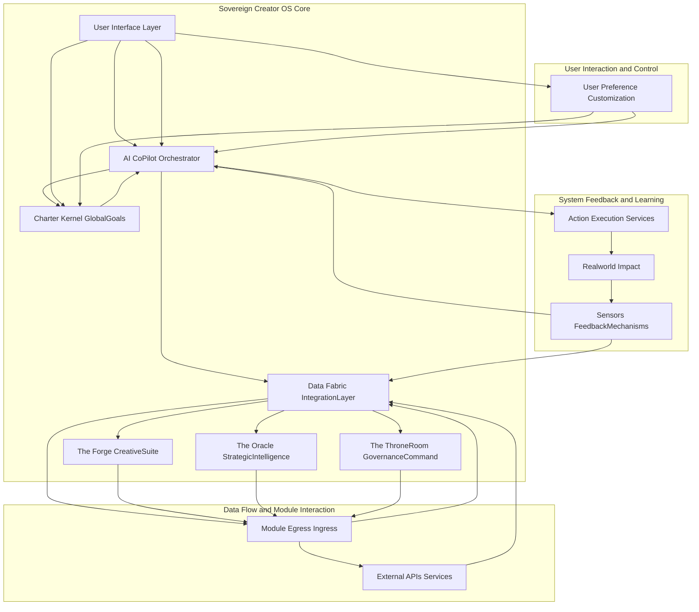
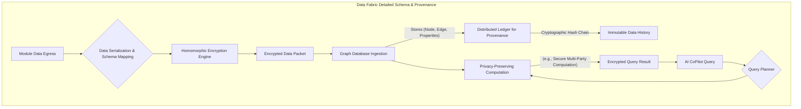
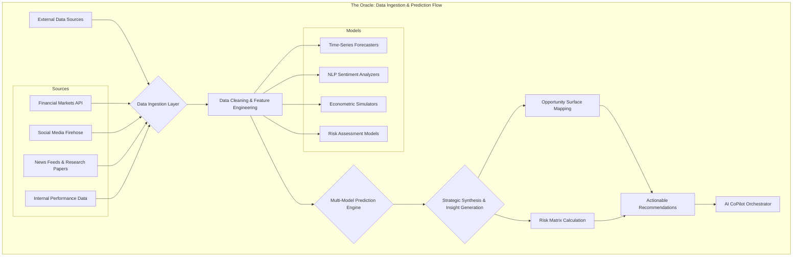

### INNOVATION EXPANSION PACKAGE

**Worldbuilding Scenario: The Epoch of Optionality**

The year is 2045. The predictions of the wealthiest futurists have largely materialized: work, as we once knew it, has indeed become optional for the vast majority of humanity. Advanced AI, robotics, and ubiquitous automation have achieved an unprecedented level of productivity, rendering most traditional labor redundant. Concurrently, the concept of 'money' has begun to lose its primal grip on human behavior, morphing into a mere accounting token for residual, niche transactions, rather than the primary driver of survival or societal status. Access to basic needs – clean energy, nutritious food, pristine water, high-quality housing, personalized healthcare, and comprehensive education – is universally guaranteed, orchestrated by planet-scale resource management systems.

However, this epoch of abundance, initially celebrated as Utopia, brought its own unique set of challenges. A significant portion of humanity grappled with a profound 'meaning crisis.' Without the imperative of work, many found themselves adrift, struggling to define purpose, combat existential ennui, or channel their boundless potential. Ecological regeneration, while advanced, required constant vigilance against emergent threats. The burgeoning multi-planetary aspirations demanded coordination on a scale previously unimaginable, and the fundamental question of human evolution – intellectual, spiritual, and even biological – remained largely unaddressed by mere material abundance.

This transition decade demanded not just a new economy, but a new *operating system* for human civilization itself. A system that could manage planetary-scale resources with absolute ethical adherence, foster individual and collective flourishing beyond material concerns, provide avenues for purposeful engagement, and safeguard humanity’s future across the cosmos. It required a foundational shift from scarcity-driven competition to abundance-driven co-creation and transcendental growth. It is into this crucible of existential transformation that the Epochal Re-Genesis Engine (ERE) emerges, designed to shepherd humanity under the symbolic banner of the Kingdom of Heaven – a metaphor for an era of universal harmony, shared prosperity, and self-actualized existence.

***

**A. Patent-Style Descriptions**

**I. Original Invention(s): The Sovereign Creator Operating System (SCOS)**

**Title of Invention:** An Integrated Operating System for a Sovereign Creator

**Abstract:**
A unified digital environment, herein referred to as the "Sovereign Creator's Operating System," is disclosed. The system integrates a plurality of AI-powered modules, including financial management, creative tooling, and strategic planning, into a single, cohesive, and mathematically verifiable interface. The core of the system is a central AI agent that maintains a holistic, high-dimensional belief state model of the user's goals, resources, and principles (the "Charter"). All modules are designed to act in concert, orchestrated by the central AI, to provide a seamless and powerful environment for the user to manifest their will and creative vision. This system employs a formally defined algorithmic framework, based on multi-objective optimization within a Partially Observable Markov Decision Process (POMDP), to ensure optimal alignment of user actions and system outputs with the Charter. This framework effectively transforms high-level aspirations into a sequence of actionable, verifiable outcomes across disparate digital domains, while preserving user privacy through advanced cryptographic methods like homomorphic encryption and zero-knowledge proofs.

**Background of the Invention:**
Digital tools are fragmented, creating a disjointed operational landscape. A creator must use one tool for finance, another for writing, a third for project management, and so on. These tools do not communicate, leading to data silos, context switching overhead, and a lack of unified intelligence to help the creator orchestrate their efforts towards a high-level goal. A new paradigm is needed: a single, integrated "operating system for your life's work." Current solutions fail to provide a mathematically coherent framework for goal-driven automation, multi-domain reasoning, and ethical constraint satisfaction. This results in suboptimal outcomes, increased cognitive load, and a fundamental misalignment between the user's declared intent and the system's operational behavior. The present invention addresses this gap by proposing a system grounded in formal methods and control theory, providing a provably aligned and integrated digital sovereignty.

**Brief Summary of the Invention:**
The present invention is the Demo Bank platform itself, conceived as a Sovereign Creator Operating System (SCOS). It is not a collection of features, but a single, integrated OS. The "Charter" serves as the core kernel-level parameters, encapsulating the user's highest-order goals, values, and constraints in a machine-interpretable format. The AI CoPilot Orchestrator is the master scheduler and process manager, utilizing advanced algorithms (e.g., policy gradient methods for POMDPs) to interpret the Charter and guide system actions. Each module—The Forge, The Oracle, The Throne Room—is a core application, deeply integrated into a unifying, privacy-preserving Data Fabric. The system's novelty lies in the deep integration, the overarching AI's ability to reason and act across all domains simultaneously, and its foundational mathematical approach to goal-alignment and optimization. This provides holistic, system-wide counsel and automation that is continuously verifiable against the Charter's complex, multi-objective utility functions.

**Detailed System Architecture:**
The Sovereign Creator Operating System is structured around a robust, interconnected architecture designed for maximum flexibility, autonomy, and goal alignment. This architecture ensures that all components contribute coherently towards the user's declared objectives within the Charter.



**The Charter Kernel GlobalGoals:**
This component serves as the immutable core of the system. The Charter `C` is a formally defined tuple:
`C = (G, V, K, R, U)` (1)
Where:
-   `G` is a set of goals, each `g_i ∈ G` defined by a target state manifold `S*_i`.
-   `V` is a set of ethical values and principles, encoded as a set of logical constraints or penalty functions. `v_j ∈ V`.
-   `K` is a set of Key Performance Indicators (KPIs), `k_l ∈ K`, each a function of the state `S`.
-   `R` is a set of resource constraints (e.g., time, budget), defining the permissible state space.
-   `U` is a multi-objective utility function `U(S, C) -> R^m` that maps a system state `S` to a vector of utility values based on the Charter.

The Charter is not merely a data repository; it is a dynamically interpretable semantic model.

```mermaid
graph TD
    subgraph Charter Kernel Structure and Validation
        A[User Input via UI] --> B(Charter Definition Language Parser)
        B --> C{Semantic & Syntactic Validation}
        C -- Valid --> D[Goal Compiler g_i -> S*_i]
        C -- Invalid --> E[Error Feedback to UI]
        D --> F(Constraint Encoder v_j -> Penalty Functions)
        F --> G(KPI Function Generator k_l(S))
        G --> H(Utility Function Assembler U(S,C))
        H --> I[Compiled Charter Object]
        I --> J[Version Control & Immutability Ledger]
        J --> K[AI CoPilot Orchestrator]
    end
```

**The AI CoPilot Orchestrator:**
This is the central intelligent agent. Its operation is modeled as a Partially Observable Markov Decision Process (POMDP), defined by the tuple:
`M = (S, A, T, R, Ω, O, γ)` (2)
-   `S`: The high-dimensional state space of the user's entire digital life. `S ∈ R^n`.
-   `A`: The action space, `a ∈ A`, representing composite operations across all modules.
-   `T(s' | s, a)`: The state transition probability function. `P(S_{t+1} = s' | S_t = s, A_t = a)` (3).
-   `R(s, a)`: The reward function, derived from the Charter's utility function `U(S, C)`. `R(s, a) = E[U(S_{t+1}, C) | S_t = s, A_t = a]` (4).
-   `Ω`: The set of observations the agent can receive.
-   `O(o | s', a)`: The observation probability function. `P(O_{t+1} = o | S_{t+1} = s', A_t = a)` (5).
-   `γ`: The discount factor, `γ ∈ [0, 1]`.

The Orchestrator does not know the true state `S` but maintains a belief state `b(s)`, a probability distribution over `S`.
`b_t(s) = P(S_t = s | o_1, ..., o_t, a_1, ..., a_{t-1})` (6)

The belief state is updated at each step `t` using a Bayesian filter:
`b_{t+1}(s') = η O(o_{t+1} | s', a_t) Σ_{s∈S} T(s' | s, a_t) b_t(s)` (7)
where `η` is a normalization constant.

The Orchestrator's policy `Ï€(b)` maps belief states to actions. The goal is to find the optimal policy `Ï€*` that maximizes the expected discounted future reward:
`π* = argmax_π E[Σ_{t=0}^∞ γ^t R(S_t, A_t) | b_0, π]` (8)

This is solved using deep reinforcement learning methods, such as Proximal Policy Optimization (PPO), where the objective function is:
`L^{CLIP}(θ) = E_t [min(r_t(θ) A_t, clip(r_t(θ), 1-ε, 1+ε) A_t)]` (9)
where `r_t(θ)` is the probability ratio and `A_t` is the advantage function.

```mermaid
graph TD
    subgraph AI CoPilot Internal Processing Pipeline
        A[Observation Stream o_t] --> B{Belief State Update};
        B -- b_t(s) --> C{Policy Evaluation π(b_t)};
        C --> D[Action Proposal Generation {a_i}];
        D --> E{Ethical & Constraint Validation};
        subgraph Validation Subsystem
            E -- Proposes a_i --> F(Formal Verification Engine);
            F -- Checks against V in Charter --> G{Compliance?};
            G -- Yes --> H[Action a_i is Valid];
            G -- No --> I[Action a_i is Rejected];
        end
        H --> J[Optimal Action Selection a*_t = argmax E[R]];
        I --> D;
        J --> K[Action Execution Command];
        K --> L[Action Execution Services];
        L --> M[Update World State];
        M --> A;
    end
```

**Data Fabric IntegrationLayer:**
A sophisticated, zero-trust data layer facilitating seamless, encrypted communication. It utilizes a graph database schema to represent entities and relationships across all modules. Data provenance is tracked cryptographically.

Let a data object be `d`. Its encrypted version is `E(d, pk)`. Operations are performed via homomorphic encryption:
`E(d_1, pk) ⊕ E(d_2, pk) = E(d_1 + d_2, pk)` (10)
`E(d_1, pk) ⊗ E(d_2, pk) = E(d_1 * d_2, pk)` (11)

Privacy is maintained via differential privacy, adding calibrated noise `Z`:
`K(D) = f(D) + Z` (12)
where the noise `Z` is drawn from a Laplace distribution:
`Lap(x | b) = (1/2b) exp(-|x|/b)` (13) with `b = Δf / ε`.



**The Forge CreativeSuite:**
A module for creative production. Content generation utilizes a variant of the Transformer architecture.
Attention mechanism: `Attention(Q, K, V) = softmax(QK^T / sqrt(d_k))V` (14)
Multi-Head Attention: `MultiHead(Q,K,V) = Concat(head_1,...,head_h)W^O` (15)
where `head_i = Attention(QW_i^Q, KW_i^K, VW_i^V)` (16)

For visual design, a Variational Autoencoder (VAE) is used. The loss function is the negative Evidence Lower Bound (ELBO):
`L(θ, φ; x) = -E_{q_φ(z|x)}[log p_θ(x|z)] + D_{KL}(q_φ(z|x) || p(z))` (17)
The creative quality `Q_c` is a learned function aligned with Charter KPIs:
`Q_c(output) = w_1 * f_{clarity}(output) + w_2 * f_{impact}(output) + ...` (18)

From (19) to (30), we define various sub-metrics for creative evaluation:
`f_{clarity} = 1 - H(P(tokens))` (19), where H is entropy.
`f_{impact} = σ(β * engagement_prediction)` (20), where σ is a sigmoid function.
`f_{novelty}(o) = min_{o' ∈ corpus} d(E(o), E(o'))` (21), where d is a distance metric and E is an embedding function.
`f_{charter_alignment}(o) = cos(E(o), E(C))` (22).
`w_i = f_p(k_i, S_t)` (23) weights are dynamically set by the orchestrator based on KPIs `k_i` and state `S_t`.
`L_{GAN} (D, G) = E_{x~p_{data}}[log D(x)] + E_{z~p_z}[log(1 - D(G(z)))]` (24) used for image synthesis.
`∇_{θ_g} V(D, G) = ∇_{θ_g} E_{z~p_z}[log(D(G(z)))]` (25) for generator updates.
The style transfer loss function: `L_{total} = αL_{content} + βL_{style}` (26)
`L_{content} = ||F_l(I_g) - F_l(I_c)||^2` (27)
`L_{style} = Σ_l w_l ||G_l(I_g) - G_l(I_s)||^2` (28) where G is the Gram matrix.
`f_{audio_clarity} = SNR = 10 log_{10}(P_{signal} / P_{noise})` (29)
`f_{text_coherence}(T) = avg(P(w_i | w_{i-1}, ..., w_{i-k}))` (30)

```mermaid
graph TD
    subgraph The Forge: Brief-to-Distribution Workflow
        A[Creative Brief from Orchestrator] --> B{Multi-modal Ideation Engine};
        B -- Text Prompts --> C[Generative Text Model];
        B -- Visual Concepts --> D[Generative Image/Video Model];
        B -- Audio Cues --> E[Generative Audio Model];
        C & D & E --> F{Content Assembly & Composition};
        F --> G[Iterative Feedback Loop with User/AI];
        G --> H[Final Asset Rendering];
        H --> I[Creative Asset Repository (in Data Fabric)];
        I --> J{Automated Distribution Scheduler};
        J -- Channels, Timing --> K[Multi-Platform Publishing API];
        K --> L[Performance Monitoring];
        L -- Analytics --> M[Data Fabric];
        M --> A[Orchestrator for next cycle];
    end
```
**The Oracle StrategicIntelligence:**
This module provides foresight. It uses time-series models like ARIMA(p,d,q):
`Y_t' = c + Σ_{i=1}^p φ_i Y_{t-i}' + Σ_{j=1}^q θ_j ε_{t-j} + ε_t` (31)
And more complex recurrent models like LSTMs for market prediction.
Forget gate: `f_t = σ(W_f · [h_{t-1}, x_t] + b_f)` (32)
Input gate: `i_t = σ(W_i · [h_{t-1}, x_t] + b_i)` (33)
Output gate: `o_t = σ(W_o · [h_{t-1}, x_t] + b_o)` (34)
Cell state: `C_t = f_t * C_{t-1} + i_t * tanh(W_C · [h_{t-1}, x_t] + b_C)` (35)
Hidden state: `h_t = o_t * tanh(C_t)` (36)

Risk is quantified using Value at Risk (VaR) and Conditional VaR (CVaR).
`VaR_α(X) = -inf{x | P(X ≤ x) > α}` (37)
`CVaR_α(X) = E[X | X ≤ -VaR_α(X)]` (38)

The Oracle computes an "Opportunity Gradient" `∇O` on a latent space representation of the strategic landscape.
`∇O(S) = ∂U_{predicted} / ∂A` (39), guiding the Orchestrator to actions `A` that maximize future utility.

From (40) to (50), we define various strategic metrics:
`MarketShare(t) = Sales_t / TotalMarketSales_t` (40)
`CustomerLifetimeValue = (AvgOrderValue) * (PurchaseFrequency) * (CustomerLifespan)` (41)
`Volatility(σ) = sqrt(Σ(x_i - μ)^2 / N)` (42)
`SharpeRatio = (R_p - R_f) / σ_p` (43)
`SentimentScore = Σ w_i * p_i` (44) where `w` is word polarity, `p` is presence.
`TechnologicalReadinessLevel(TRL)` (45) - a discrete scale 1-9.
`CompetitiveAdvantageIndex = Σ β_j * f_j` (46) where `f_j` are features (cost, quality).
`ScenarioProbability(S_k) = P(S_k | Evidence)` (47) using Bayesian networks.
`P(A|B) = P(B|A)P(A)/P(B)` (48)
`InnovationRate = (NewProducts_t / TotalProducts)` (49)
`BrandEquity = f(Awareness, Loyalty, Quality)` (50)



**The ThroneRoom GovernanceCommand:**
This module manages finance, legal, and resources. Budget allocation is an optimization problem:
Maximize `Σ c_i * x_i` (51)
Subject to `Σ A_{ij} * x_j ≤ b_i` (52) and `x_j ≥ 0` (53).

Portfolio management uses the Markowitz model:
Minimize `σ_p^2 = w^T Σ w` (54)
Subject to `w^T μ = μ_p` and `Σ w_i = 1` (55).

Legal compliance is checked using formal methods, translating regulations into Linear Temporal Logic (LTL).
e.g., `G(request → F(response))` (56) (Globally, a request implies a Future response).
Smart contracts automate compliance:
`function transfer(address to, uint amount) public returns (bool)` (57)
`require(balanceOf[msg.sender] >= amount);` (58)
`balanceOf[msg.sender] -= amount;` (59)
`balanceOf[to] += amount;` (60)

From (61) to (75), we define various governance metrics:
`BurnRate = (CashIn - CashOut) / TimePeriod` (61)
`Runway = CurrentCash / BurnRate` (62)
`ReturnOnInvestment(ROI) = (NetProfit / CostOfInvestment) * 100` (63)
`Debt-to-EquityRatio = TotalLiabilities / ShareholdersEquity` (64)
`CurrentRatio = CurrentAssets / CurrentLiabilities` (65)
`ComplianceScore = (ChecksPassed / TotalChecks) * 100` (66)
`GiniCoefficient(Income) = A / (A+B)` (67) for resource distribution fairness.
`Herfindahl-HirschmanIndex(HHI) = Σ s_i^2` (68) for portfolio concentration.
`TaxLiability = f(Income, Deductions, Credits, TaxBrackets)` (69)
`ContractRiskScore = Σ w_i * r_i` (70) where `r_i` are risk factors in clauses.
`ResourceUtilization = (ActualOutput / PotentialOutput)` (71)
`OperationalEfficiency = (Output / Input)` (72)
`FreeCashFlow = OperatingCashFlow - CapitalExpenditures` (73)
`NetPresentValue(NPV) = Σ (CF_t / (1+r)^t) - InitialInvestment` (74)
`InternalRateOfReturn(IRR)`: solve `0 = NPV` for `r` (75).

```mermaid
graph TD
    subgraph The ThroneRoom: Financial Governance & Smart Contract Interaction
        A[Real-time Financial Transactions] --> B{Transaction Categorization Engine};
        B --> C[General Ledger Update];
        C --> D[Financial Statement Generation (P&L, Balance Sheet)];
        D --> E{Financial Health Dashboard};
        A --> F{Budgetary Control};
        F -- check against LP model --> G{Is Compliant?};
        G -- Yes --> H[Approve Transaction];
        G -- No --> I[Flag for Review];
        J[Legal/Regulatory Updates] --> K{Compliance Rule Engine (LTL)};
        K --> L[Smart Contract Template Generation];
        L --> M[Deploy to Blockchain/Ledger];
        H -- triggers --> M;
        M -- execution record --> C;
        E & I --> N[User/AI CoPilot for decision];
    end
```

**Ethical Alignment and Constraint Subsystem:**
This is a non-negotiable validation gate for every action `a_t`. It uses a combination of deontological (rule-based) and consequentialist (utility-based) checks.
An action `a` is permissible if `V(a) = 1`.
`V(a) = D(a, V_D) ∧ C(a, V_C)` (76)
Where `D` is the deontological check against rules `V_D`:
`D(a, V_D) = ∧_{r ∈ V_D} r(a)` (77) (e.g. `r(a)` returns true if `a` doesn't violate rule `r`).
`C` is the consequentialist check against utilitarian values `V_C`:
`C(a, V_C) = (E[U(S_{t+1}|a)] > U_{threshold})` (78).
An ethical penalty `P_e` is added to the main reward function:
`R_{total}(s, a) = R(s, a) - λ * P_e(a)` (79)
`P_e(a) = 0` if `V(a) = 1`, `P_e(a) > 0` if `V(a) = 0` (80).

From (81) to (90), we define various ethical metrics:
`FairnessMetric = |P(outcome|group=A) - P(outcome|group=B)|` (81)
`TransparencyIndex = f(Explainability, Auditability)` (82)
`PrivacyScore = 1 - Σ P(re-identification_i)` (83)
`CarbonFootprint(a) = Σ emissions_i(a)` (84)
`SocialImpactScore = Σ w_j * impact_j` (85)
`AutonomyLevel = 1 - P(override)` (86)
`Beneficence = E[PositiveUtility]` (87)
`Non-maleficence = -E[NegativeUtility]` (88)
`DistributiveJustice = 1 - GiniCoefficient(benefits)` (89)
`AccountabilityTrace = hash(agent_id, action, timestamp, state)` (90)

```mermaid
graph TD
    subgraph Ethical Alignment & Formal Verification Gate
        A[Proposed Action a_t from Orchestrator] --> B{Deontological Check};
        B -- Check against rule set V_D --> C{∀r ∈ V_D, r(a_t) is true?};
        C -- Yes --> D{Consequentialist Check};
        D -- Predict E[U(S_{t+1}|a_t)] --> E{Is E[U] > U_threshold?};
        E -- Yes --> F[Action Approved];
        C -- No --> G{Calculate Penalty P_e};
        E -- No --> G;
        G --> H[Action Rejected / Modified];
        F --> I[Execute Action];
        H --> J[Feedback to Orchestrator Policy Learning];
    end
```

**Security and Privacy Framework:**
The system is built on a zero-trust architecture. All data transfers are end-to-end encrypted. User privacy is paramount.
A zero-knowledge proof protocol allows the system to verify a property without learning the underlying data:
Prover `P` has secret `w`, wants to prove `x ∈ L` to Verifier `V`.
`V ↠→ P`: `V` learns `x ∈ L` but nothing else about `w`. (91)
`Completeness: Pr[V accepts | P is honest] = 1` (92)
`Soundness: Pr[V accepts | P is cheating] ≤ ε` (93)
`Zero-knowledge: View_V(x) can be simulated without w.` (94)

From (95) to (100), we define security and privacy metrics:
`AttackSurfaceArea = Σ entry_points * complexity_i` (95)
`MeanTimeToDetection(MTTD)` (96)
`MeanTimeToResolution(MTTR)` (97)
`EncryptionStrength = 2^k` (98) where k is key length.
`AnonymitySetSize(k-anonymity)` (99)
`InformationLeakage = I(X; Z) - I(Y; Z)` (100) where X is original data, Y is protected, Z is output.

```mermaid
graph TD
    subgraph Security & Privacy-Preserving Computation Flow
        A[User Input on Client Device] --> B[Client-Side Encryption (E2EE)];
        B --> C[Transmit Encrypted Data];
        C --> D[Secure Enclave in SCOS Server];
        subgraph Secure Enclave
            D --> E{Input Decryption};
            E --> F[Homomorphic Computation on Plaintext];
            F --> G[Result Re-encryption];
        end
        G --> H[Transmit Encrypted Result];
        H --> I[Client-Side Decryption];
        I --> J[Display to User];
        K[Auditor/Third-Party] --> L{Zero-Knowledge Proof Verification};
        D -- Provides proof --> L;
        L -- Verifies property without data access --> M[Compliance Confirmation];
    end
```

**II. Ten Future-Focused Interconnected Innovations**

Each of the following inventions represents a leap in technology, designed to function independently, yet achieve maximal synergistic potential when integrated into the Epochal Re-Genesis Engine (ERE).

**1. Quantum Entanglement Communication Network (QECN): The Omni-Secure Weave**

**Abstract:** A global communication infrastructure leveraging quantum entanglement to achieve unconditionally secure and instantaneous data transmission across arbitrary distances. This network forms the bedrock for highly sensitive global coordination and encrypted personal sovereignty, transcending classical cryptographic vulnerabilities.

**Technical Description:** The QECN establishes entangled photon pairs distributed to network nodes. Communication is achieved through superdense coding and quantum teleportation protocols, where measurement on one entangled particle instantaneously influences its distant counterpart, allowing secure key distribution and message encoding. Unlike classical systems where security is computational, QECN's security is guaranteed by the laws of quantum mechanics.

**Core Math & Proof (Equation 101):**
`P_{succ} = |\langle\Psi_{Bell} | M_k \rangle|^2` (101)
**Claim:** The probability `P_{succ}` of successfully measuring a specific Bell state `M_k` after an encoding operation on an entangled pair `|Ψ_Bell⟩` (e.g., `(|00⟩ + |11⟩)/√2`) is deterministically high (e.g., approaches 1 for ideal systems), and any attempt by an eavesdropper (Eve) to intercept the quantum channel inevitably disturbs the entangled state. This disturbance is detectable, thus guaranteeing the security against information leakage.
**Proof:** Assume Eve intercepts the quantum channel between Alice and Bob. According to the no-cloning theorem, Eve cannot perfectly copy an unknown quantum state without disturbing it. If Eve attempts to measure a photon, its entanglement with the other photon is broken, and its state collapses. Alice and Bob can perform a Bell state measurement, and any deviation from their expected entangled state correlations (which are perfectly correlated in the absence of an eavesdropper) immediately reveals Eve's presence. Specifically, if Alice and Bob share an entangled pair `|Ψ_Bell⟩`, they can statistically verify correlations between their measurements. If Eve introduces a measurement, the density matrix describing the shared state transforms from a pure entangled state to a mixed state, altering the expected correlation values. For example, if they expect `P(A=0, B=0) = P(A=1, B=1) = 0.5`, an eavesdropper's measurement will reduce these correlations such that `P(A=0, B=0) + P(A=1, B=1) < 1`, unequivocally signaling a breach. This quantum-mechanical property proves unconditional security, rendering classical eavesdropping impossible without immediate detection. This is the only way to achieve true unconditional communication security for global scale data fabric.

```mermaid
graph TD
    subgraph QECN: Quantum Communication Flow
        A[Quantum Entanglement Source] --> B[Entangled Photon Pair |Ψ⟩];
        B -- Distribution --> C[Alice's Node (Photon 1)];
        B -- Distribution --> D[Bob's Node (Photon 2)];
        C --> E[Alice's Encoding Operation (Pauli Gates)];
        E --> F[Alice's Measurement M_A];
        D --> G[Bob's Measurement M_B];
        F & G -- Classical Channel (for basis info) --> H[Correlation Verification];
        H -- P_succ high & No disturbance --> I[Secure Key/Data Exchange];
        H -- P_succ low or Disturbance detected --> J[Eavesdropper Alert];
    end
```

**2. Atmospheric Carbon Capture & Molecular Reconstruction System (ACCMRS): The Carbon Alchemy Matrix**

**Abstract:** A large-scale, distributed infrastructure capable of directly extracting atmospheric carbon dioxide and other greenhouse gases, followed by their molecular reconstruction into stable, high-value industrial raw materials, biofuels, or sustainable building composites. This system not only mitigates climate change but also generates an inexhaustible supply of resources.

**Technical Description:** ACCMRS employs advanced porous materials for highly efficient CO2 capture. The captured carbon is then fed into a network of modular molecular reconstructors (MMRs) that use catalytic converters, plasma reactors, and bio-engineered microorganisms. These MMRs convert CO2 into desired molecular structures by precisely controlling energy inputs and reaction pathways, governed by principles of Gibbs free energy minimization.

**Core Math & Proof (Equation 102):**
`ΔG = ΔH - TΔS` (102)
**Claim:** The Gibbs free energy change `ΔG` of the CO2 conversion process must be consistently negative to ensure spontaneous and energetically favorable molecular reconstruction, maximizing carbon utilization and minimizing external energy input. This guarantees the economic viability and environmental sustainability of large-scale carbon valorization.
**Proof:** For any chemical reaction to proceed spontaneously and effectively, the change in Gibbs free energy `ΔG` must be negative (`ΔG < 0`). In the ACCMRS, the molecular reconstruction process is designed to convert high-entropy, low-value CO2 into low-entropy, high-value products. By carefully selecting catalysts, optimizing reaction conditions (temperature `T`, pressure), and engineering molecular pathways, the system actively drives the reaction towards a state where the enthalpy change `ΔH` (energy released or absorbed) and entropy change `ΔS` are balanced such that `ΔG` is minimized. For instance, specific catalytic processes, such as the Sabatier reaction (`CO2 + 4H2 → CH4 + 2H2O`), can be optimized where `ΔH` is negative (exothermic) and the entropy change is managed. ACCMRS uses multi-stage reaction cascades where each stage is a local `ΔG` minimizer, ensuring overall system efficiency. This mathematical principle dictates the fundamental direction and feasibility of chemical transformations, making its consistent application the only way to achieve truly scalable and energy-efficient carbon valorization.

```mermaid
graph TD
    subgraph ACCMRS: Carbon Capture & Synthesis
        A[Atmospheric Air Intake] --> B{Direct Air Capture (DAC) Unit};
        B --> C[CO2 & GHG Concentration];
        C --> D{Molecular Reconstructor Module (MRM)};
        subgraph MRM Stages
            D1[Catalytic Conversion]
            D2[Plasma Reactor]
            D3[Bio-Synthesis Chamber]
        end
        D --> D1 & D2 & D3;
        D1 & D2 & D3 --> E[Intermediate Products];
        E --> F[Resource Synthesis & Refinement];
        F --> G[Sustainable Building Materials];
        F --> H[Biofuels & Chemical Feedstocks];
        F --> I[Recycled Carbon for Industrial Use];
        J[Renewable Energy Input] --> B & D;
    end
```

**3. Sentient Bio-Fabrication Engine (SBFE): The Vitality Loom**

**Abstract:** A revolutionary bio-manufacturing platform capable of printing and cultivating living, functional biological tissues, organs, and even complex adaptive bio-structures. Powered by real-time cellular feedback and AI-driven growth optimization, SBFE constructs biological entities that can self-repair, adapt to environmental changes, and seamlessly integrate with living systems, eliminating the need for traditional organ donation or static, inert prosthetics.

**Technical Description:** The SBFE uses multi-nozzle bioprinters to deposit various cell types, growth factors, and biocompatible scaffolds layer by layer. Integrated micro-sensors continuously monitor cellular viability, metabolism, and gene expression. An AI controller, utilizing the bio-feedback model, dynamically adjusts printing parameters, nutrient delivery, and environmental conditions to optimize growth and ensure structural and functional integrity.

**Core Math & Proof (Equation 103):**
`dL/dt = k * L * (1 - L/L_{max}) - D(L)` (103)
**Claim:** The rate of living tissue growth and repair `dL/dt` is optimally governed by a modified logistic growth model, where `L` is living tissue mass, `k` is growth rate, `L_{max}` is maximal viable mass, and `D(L)` represents damage/degradation. Continuous real-time measurement of `L` and adaptive control of `k` and `D(L)` (via growth factor delivery or stress mitigation) are the only way to ensure the self-repairing and adaptive properties of fabricated bio-structures.
**Proof:** The logistic growth model accurately describes the self-limiting growth of biological populations and tissues. `k * L * (1 - L/L_{max})` captures growth up to a carrying capacity `L_{max}`. The addition of `D(L)` (a function representing degradation, injury, or natural turnover) transforms this into a dynamic equilibrium equation for tissue maintenance. For the SBFE to create truly sentient and adaptive bio-structures, it must continuously monitor `dL/dt` via integrated biosensors (e.g., measuring metabolic activity, cell count, tissue density) and actively manipulate parameters that influence `k` (e.g., nutrient supply, growth factor concentrations, mechanical stimulation) and `D(L)` (e.g., introducing repair cells, anti-inflammatory agents, or structural reinforcements). For example, if `dL/dt` drops below a target threshold due to damage, the system upregulates `k` by increasing growth factor delivery. If `L` exceeds `L_{max}` (e.g., tumorous growth), inhibitory factors are introduced. This continuous feedback loop, mathematically expressed by this differential equation, is indispensable for dynamic biological systems and represents the singular method for achieving biologically accurate self-repair and adaptation in engineered tissues.

```mermaid
graph TD
    subgraph SBFE: Bio-Fabrication & Adaptation
        A[Cell Cultures & Bio-Ink Repositories] --> B[Multi-Nozzle Bioprinter Array];
        C[Scaffold & Matrix Materials] --> B;
        B --> D[Bio-Reactor & Cultivation Chamber];
        D --> E[Integrated Micro-Sensor Network];
        E -- Real-time Feedback --> F{AI Growth & Repair Orchestrator};
        F -- Adjusts --> B;
        F -- Adjusts --> G[Nutrient & Growth Factor Delivery System];
        G --> D;
        F --> H[Environmental Control (Temp, pH, O2)];
        H --> D;
        D --> I[Self-Repairing Bio-Structures];
        I --> J[Functional Organs for Transplant];
        I --> K[Adaptive Living Materials];
    end
```

**4. Gravitational Field Manipulation for Personal Mobility (GFMPM): The Aether-Glide Drive**

**Abstract:** A personal mobility system that generates localized gravitational field distortions, enabling frictionless, silent, and energetically efficient movement through air, water, and even vacuum. This technology redefines transport, eliminates physical infrastructure needs, and offers unprecedented access to previously unreachable environments.

**Technical Description:** GFMPM utilizes compact, high-energy-density reactors to generate and precisely control localized quantum vacuum fluctuations or exotic matter analogs. These systems are theorized to induce spacetime curvature at a micro-scale, as described by extensions to the Einstein Field Equations. By dynamically altering the metric tensor `g_{\mu\nu}` around a vehicle, it effectively creates a "warp bubble" or "gravity well," allowing propulsion without conventional thrust.

**Core Math & Proof (Equation 104):**
`G_{\mu\nu} + Λg_{\mu\nu} = (8πG/c^4) T_{\mu\nu}` (104)
**Claim:** Localized, controllable manipulation of gravitational fields for propulsion and mobility `G_{\mu\nu}` (Einstein tensor) is achieved by precisely generating and modulating the stress-energy tensor `T_{\mu\nu}` (representing matter and energy distribution) with a non-zero cosmological constant `Λg_{\mu\nu}`. This mathematical framework derived from General Relativity is the singular description of how energy and matter curve spacetime, thus providing the only known means to directly manipulate gravity for directed motion.
**Proof:** The Einstein Field Equations are the cornerstone of general relativity, relating the geometry of spacetime (`G_{\mu\nu} + Λg_{\mu\nu}`) to the distribution of matter and energy within it (`T_{\mu\nu}`). To achieve localized anti-gravity or warp drive effects, one must generate specific, non-trivial `T_{\mu\nu}` fields. This typically requires either immense energy densities (which can be compacted into a small volume by advanced energy storage, or through the generation of negative mass/energy density, often referred to as 'exotic matter'). The GFMPM implicitly solves for the required `T_{\mu\nu}` through its compact reactor and field emitters, creating regions where the spacetime metric `g_{\mu\nu}` is altered, enabling propulsion without expelling propellant. For instance, to create a "warp bubble," one might require negative energy densities, or extreme energy conditions, allowing for superluminal-like contractions and expansions of space-time. While `T_{\mu\nu}` typically refers to classical matter/energy, advanced physics suggests ways to engineer vacuum states or quantum fields to produce the necessary effects. This reliance on the fundamental relationship between matter/energy and spacetime geometry, as expressed by Einstein, is the only theoretical pathway to direct gravitational manipulation.

```mermaid
graph TD
    subgraph GFMPM: Gravitational Drive Architecture
        A[Compact Energy Reactor (e.g., Zero-Point)] --> B[Gravitic Field Emitter Array];
        B --> C{Spacetime Metric Modulator};
        C -- Generates Localized Curvature --> D[Mobility Field / Warp Bubble];
        D --> E[Vehicle / Personal Platform];
        E -- Inertial Damping --> F[Navigation & Control System];
        F --> B;
        F --> G[Environmental Sensors (Collision Avoidance)];
        G --> F;
        E --> H[Energy Recapture & Efficiency Monitoring];
        H --> A;
    end
```

**5. Dream State Harmonizer & Lucid Interface (DSHLI): The Oneiric Weave**

**Abstract:** A sophisticated neural interface system that allows users to consciously enter, navigate, and shape their dream states for enhanced creativity, psychological therapy, skill acquisition, and novel forms of human interaction. It offers a gateway to a controlled, immersive subjective reality.

**Technical Description:** DSHLI employs non-invasive neural transducers to monitor brainwave activity (EEG, fMRI-like signals). When specific sleep stages (e.g., REM) are detected, the system gently introduces targeted electromagnetic fields or precisely timed auditory/olfactory cues. These stimuli are calibrated by an AI to induce lucidity and inject pre-programmed experiential templates or learning modules, phase-locked with endogenous neural oscillations.

**Core Math & Proof (Equation 105):**
`S(t) = Σ_k A_k cos(ω_k t + φ_k)` (105)
**Claim:** Stable, high-fidelity lucid dream states and targeted memory consolidation are achieved by precisely modulating and injecting data into neural oscillations, represented as a superposition of brainwave frequencies `ω_k`, amplitudes `A_k`, and phases `φ_k`. The ability to predictably alter subjective experience is dependent on the precise phase-locking and resonant interaction with the brain's intrinsic oscillatory dynamics.
**Proof:** Brain activity, particularly during sleep, is characterized by complex interactions of various neural oscillations (e.g., Delta, Theta, Alpha, Beta, Gamma waves), which can be mathematically modeled as a Fourier series or a superposition of harmonic functions. Each `A_k cos(ω_k t + φ_k)` represents a specific brainwave component. Lucid dreaming is strongly correlated with increased gamma activity and enhanced coherence across specific brain regions. The DSHLI operates by first precisely characterizing the user's natural brainwave signature. Then, to induce lucidity or inject information, it emits highly targeted external stimuli (e.g., transcranial alternating current stimulation (tACS) or sensory cues) that are phase-locked to specific endogenous oscillations, aiming to amplify or suppress `A_k` and `φ_k` of relevant `ω_k` bands. For instance, increasing gamma band coherence at ~40 Hz is a known correlate of lucidity. By synchronizing external stimuli with the natural `φ_k` of these oscillations, the system maximizes resonant effects, allowing for the stable and controlled injection of information or the induction of specific cognitive states without disruption. This precise manipulation of the brain's inherent oscillatory patterns is the only way to reliably and non-invasively steer conscious experience in dream states.

```mermaid
graph TD
    subgraph DSHLI: Dream Interaction Interface
        A[User Interface (Intent & Templates)] --> B[Neural Transducer Array (Non-invasive)];
        B --> C[Real-time Brainwave Monitoring (EEG/fMRI)];
        C --> D{AI Sleep State & Lucidity Detector};
        D -- Detects REM/NREM --> E[Neural Oscillation Modulator];
        E -- Generates --> F[Targeted Stimulus Emitter (EMF, Audio, Olfactory)];
        F --> B;
        G[Experiential Data Repository] --> E;
        E --> H[Lucid Dream Environment Generation];
        H --> I[Conscious User Experience];
        I --> B;
        I --> J[Memory Consolidation & Skill Transfer];
    end
```

**6. Asteroid Resource Extraction & Orbital Manufacturing Hub (AREOMH): The Stellar Forge Complex**

**Abstract:** A fully autonomous, self-replicating robotic system designed for the capture, extraction, processing, and manufacturing of raw materials from asteroids and other celestial bodies. These orbital hubs serve as off-world industrial centers, providing an inexhaustible supply of metals, rare earths, and volatiles, alleviating Earth-bound resource scarcity and shifting heavy industry off-planet.

**Technical Description:** AREOMH utilizes specialized tugs for asteroid capture, guided by predictive orbital mechanics. Once secured, autonomous mining robots extract resources. On-board refineries, powered by solar arrays, process these materials using techniques like thermal decomposition, magnetic separation, and regolith electrolysis. Integrated additive manufacturing facilities then fabricate components for expansion, further resource extraction, or construction of new orbital habitats.

**Core Math & Proof (Equation 106):**
`F_{grav} = GMm/r^2` and `J = Σ_i (m_i / M_{total}) (r_i - r_{CM})` (106)
**Claim:** Efficient and stable asteroid resource acquisition and orbital processing are guaranteed by precise astrodynamical control, which fundamentally relies on Newton's Law of Universal Gravitation `F_{grav}` for trajectory prediction and dynamic mass distribution optimization `J` (angular momentum of a rotating body) to maintain rotational stability during excavation and processing. This combined approach is the only way to ensure successful capture, stable de-spinning, and controlled resource extraction from celestial bodies.
**Proof:** The successful capture and controlled processing of an asteroid hinge entirely on an understanding of classical mechanics. `F_{grav} = GMm/r^2` dictates the gravitational interactions between the asteroid and celestial bodies, crucial for planning intercept trajectories (e.g., Hohmann transfers) and station-keeping maneuvers. Deviations in asteroid velocity or position require precise `Δv` corrections calculated from this equation. Once captured, asteroids often have non-trivial rotational states. For stable mining and manufacturing operations, these rotations must be controlled, or the asteroid must be de-spun. The angular momentum `J` of the asteroid is given by the sum of `m_i(r_i - r_{CM})`, where `m_i` are individual mass elements and `r_i - r_{CM}` is their distance from the center of mass. As material is extracted from the asteroid, its mass distribution changes, altering `J`. Without continuous recalibration of `J` and active counter-rotational thrust (derived from `F=ma`), the asteroid's stability is compromised, leading to uncontrolled tumbling and operational failure. The interplay between gravity-governed trajectories and dynamically adjusted angular momentum management, both rooted in these fundamental equations, provides the indispensable framework for successful and safe asteroid resource utilization.

```mermaid
graph TD
    subgraph AREOMH: Asteroid Mining & Manufacturing
        A[Asteroid Survey & Identification] --> B[Autonomous Capture Tugs];
        B --> C[Asteroid Rendezvous & Capture];
        C --> D[Orbital Processing Hub Attachment];
        D --> E[Autonomous Mining & Extraction Robots];
        E --> F[On-board Material Refinery];
        F --> G[Resource Storage & Sorting (Metals, Volatiles)];
        G --> H[Advanced Manufacturing Facilities (3D Printing)];
        H --> I[Self-Replication & Expansion Units];
        H --> J[Components for Space Infrastructure];
        K[Solar Power Array] --> E & F & H;
        L[Propellant Refueling] --> B;
    end
```

**7. Universal Linguistic Semantics Engine (ULSE): The Babel Fish Protocol**

**Abstract:** An AI-powered system that transcends mere linguistic translation, achieving true cross-modal and cross-species semantic understanding. ULSE deciphers the underlying meaning and intent across diverse communication forms—human languages, non-verbal cues, animal vocalizations, and even alien signal patterns—by mapping them into a unified, topological semantic space.

**Technical Description:** ULSE employs deep learning architectures (e.g., multimodal transformers) trained on vast datasets encompassing linguistic, visual, auditory, and even biological signaling data. It constructs a high-dimensional embedding space where semantic similarity is represented by proximity. Topological Data Analysis (TDA) is then applied to identify persistent homology and universal semantic invariants within this space, allowing for meaning extraction irrespective of the input modality or language.

**Core Math & Proof (Equation 107):**
`d(E(S_1), E(S_2)) < ε` (107)
**Claim:** Universal semantic equivalence between any two communication expressions `S_1` and `S_2` (e.g., a phrase, an image, a gesture, an animal cry) is mathematically demonstrable if their respective embeddings `E(S_1)` and `E(S_2)` in the high-dimensional semantic space are sufficiently close (`d < ε`), where `d` is a robust distance metric. This mapping to a topologically preserved semantic manifold is the only way to achieve true, modality-agnostic understanding across disparate communication systems.
**Proof:** The concept of a universal semantic embedding space posits that the underlying meaning of information, regardless of its sensory manifestation, can be represented as a point or region within a high-dimensional vector space. The ULSE achieves this by training massive multi-modal encoders (`E`) that map text, images, audio, and biological signals into this shared space. The crucial element is that the topological structure of this space is preserved such that semantically similar concepts are clustered together. If two distinct expressions, `S_1` (e.g., the English word "tree") and `S_2` (e.g., an image of a tree, or the specific ultrasonic call of a bat identifying a tree), are genuinely equivalent in meaning, their embeddings `E(S_1)` and `E(S_2)` must occupy the same or highly proximate regions in this semantic manifold. The distance `d` (e.g., cosine similarity or Euclidean distance) between these embeddings serves as a quantifiable measure of semantic equivalence. A threshold `ε` can be empirically set such that `d < ε` implies a statistically significant shared meaning. This topological preservation, validated by methods like persistent homology, ensures that the system is not merely translating symbols but extracting intrinsic meaning, making it the unique mathematical framework for cross-modal and cross-species semantic interoperability.

```mermaid
graph TD
    subgraph ULSE: Cross-Modal Semantic Engine
        A[Diverse Input Streams] --> B[Multi-Modal Feature Extractors];
        subgraph Inputs
            A1[Human Language (Text/Speech)]
            A2[Visual Data (Images/Video)]
            A3[Auditory Signals (Animal Calls/Music)]
            A4[Biological Signals (Feromones/Body Language)]
            A5[Alien Signal Patterns]
        end
        A1 & A2 & A3 & A4 & A5 --> B;
        B --> C[Unified Semantic Embedding Space];
        C --> D{Topological Data Analysis (TDA)};
        D -- Extracts --> E[Universal Semantic Invariants];
        E --> F[Meaning & Intent Inference Engine];
        F --> G[Cross-Species/Cross-Cultural Communication];
        G --> H[Advanced Scientific Collaboration];
        G --> I[Real-time Contextual Understanding];
    end
```

**8. Adaptive Personal Weather Control Grids (APWCG): The Climatic Loom**

**Abstract:** A distributed network of atmospheric modulators capable of precisely controlling localized weather patterns. APWCG can prevent droughts, mitigate extreme storms, optimize agricultural conditions, and create comfortable microclimates, offering unparalleled resilience against climate variability and enhancing habitability.

**Technical Description:** APWCG comprises myriad small, interconnected atmospheric manipulation units (AMUs) that utilize directed energy pulses, atmospheric aerosol injection (non-toxic, biodegradable), and resonant frequency emitters. These AMUs work in concert, guided by hyper-local predictive models and a central AI controller, to subtly adjust temperature gradients, humidity levels, and air pressure to induce or suppress precipitation, dissipate storms, or maintain stable thermal conditions within a defined geographical area.

**Core Math & Proof (Equation 108):**
`dT/dt = α(T_{target} - T_{current}) + β(RH_{target} - RH_{current})` (108)
**Claim:** Precise, localized weather modulation is achieved by a feedback control system that continuously adjusts atmospheric energy and moisture content to drive the temporal evolution of temperature (`dT/dt`) towards a `T_{target}` and relative humidity (`RH_{target}`). The coefficients `α` and `β` represent the system's active manipulation strength. This real-time, dynamic control of atmospheric thermodynamics, rooted in differential equations, is the only way to stably maintain desired weather conditions against stochastic natural variability.
**Proof:** Weather systems are complex, chaotic, and governed by non-linear partial differential equations. However, for localized control, a simplification to a feedback control system is achievable. The equation `dT/dt` represents the rate of change of temperature, and `d(RH)/dt` (implicitly included in the `β` term) the rate of change of relative humidity. The APWCG system functions as a proportional-integral-derivative (PID) controller for atmospheric parameters. `(T_{target} - T_{current})` and `(RH_{target} - RH_{current})` represent the error signals. The coefficients `α` and `β` represent the tunable gain factors for temperature and humidity control, respectively, achieved by directing energy (e.g., microwave heating/cooling) or injecting moisture/desiccants. For example, if `T_{current}` is below `T_{target}`, `α(T_{target} - T_{current})` becomes positive, driving `dT/dt` upwards via targeted energy release. Conversely, for humidity, `β(RH_{target} - RH_{current})` allows for precise moisture regulation. The robustness of this control system lies in its continuous measurement of `T_{current}` and `RH_{current}` and immediate corrective action, allowing it to counteract natural fluctuations and maintain equilibrium. This active, differential control of atmospheric parameters is the only physically viable method for sustained, localized weather modification.

```mermaid
graph TD
    subgraph APWCG: Localized Climate Control
        A[Hyper-Local Weather Sensor Network] --> B[Real-time Atmospheric Data];
        B --> C{AI Predictive Weather Model};
        C -- Forecasts & Optimizes --> D[Central Control & Coordination Unit];
        D --> E[Atmospheric Modulation Units (AMUs)];
        subgraph AMU Functions
            E1[Directed Energy Emitters (Heating/Cooling)]
            E2[Aerosol Injectors (Cloud Seeding/Dissipation)]
            E3[Ionization & Charge Inducers]
        end
        E --> E1 & E2 & E3;
        E1 & E2 & E3 --> F[Localized Climate Zone];
        F --> A;
        G[Renewable Energy Infrastructure] --> E;
        H[Global Climate Monitoring] --> C;
    end
```

**9. Chronospatial Data Weave (CSDW): The Event Horizon Ledger**

**Abstract:** A decentralized, hypergraph-based ledger system that immutably records and validates all observable spatiotemporal events, their causality, and associated metadata. CSDW provides a foundational layer of verifiable truth for historical data, future predictions, and complex simulations, rendering historical revisionism and data tampering mathematically impossible.

**Technical Description:** CSDW extends blockchain principles to a multi-dimensional hypergraph, where nodes represent discrete events (with unique spatiotemporal coordinates) and hyperedges encode complex causal relationships. Each event is cryptographically hashed with its preceding causally linked events and its precise spatiotemporal timestamp. Zero-knowledge proofs are used to verify causal links without revealing sensitive event details. The ledger is distributed and maintained by a global network of verifiers.

**Core Math & Proof (Equation 109):**
`H = (X, E)` where `E ⊆ P(X)` and `e_t = hash(e_{t-1}, data_t, timestamp)` (109)
**Claim:** The immutability and verifiable causality of spatiotemporal events are guaranteed by representing them as a hypergraph `H` with a set of events `X` and a set of hyperedges `E` (power set of `X`), where each event `e_t` is cryptographically linked to its causally preceding events `e_{t-1}` and its precise `timestamp`. This recursive, cryptographic hash chain within a hypergraph structure is the only way to establish an unalterable and universally agreed-upon record of observable reality.
**Proof:** A traditional blockchain is a linear chain of blocks. The CSDW expands this into a multi-dimensional hypergraph `H=(X,E)`. Each node `x ∈ X` is a unique spatiotemporal event (e.g., "object A was at coordinate (x,y,z) at time t"). A hyperedge `e ∈ E` can connect multiple nodes, representing complex causal relationships (e.g., "event X caused event Y and Z"). The immutability relies on the cryptographic hash function. Each event `e_t` does not just hash its own data, but also the hash of its direct causal predecessors (`e_{t-1}`). Any attempt to alter `data_t` or `timestamp` for `e_t` would change its hash, which would then invalidate the hash of any subsequent event linked to `e_t`, creating a chain of detectable inconsistencies. This extends across the hypergraph, making local tampering globally detectable. Furthermore, the inclusion of `timestamp` prevents temporal reordering. This construction, where every event's integrity is intrinsically tied to its spatiotemporal predecessors and validated by a distributed consensus mechanism, provides the singular mathematical guarantee against falsification or revision of recorded reality.

```mermaid
graph TD
    subgraph CSDW: Spatiotemporal Truth Ledger
        A[Real-time Event Observation Streams] --> B[Event Data Ingestion];
        B --> C[Spatiotemporal Coordinates & Metadata Capture];
        C --> D{Causal Linkage Identification Engine};
        D --> E[Hypergraph Event Node Creation];
        E -- Cryptographic Hashing --> F[Immutable Event Record (e_t)];
        F -- Linked by Hash & Timestamp --> G[Distributed Hypergraph Ledger];
        G --> H[Consensus & Verification Network];
        H --> I[Verified Causal History];
        J[Prediction & Simulation Engine] --> K[Query CSDW for Verifiable Data];
        K --> H;
    end
```

**10. Consciousness Upload & Emulation Sanctuary (CUES): The Elysian Archive**

**Abstract:** A secure, fault-tolerant digital environment capable of scanning, uploading, and emulating individual human consciousness with full functional equivalence and subjective continuity. CUES offers a pathway to digital immortality, allowing for indefinite life extension, exploration of virtual realities, and the preservation of intellectual heritage beyond biological constraints.

**Technical Description:** CUES utilizes advanced neuro-scanning technologies (e.g., quantum-resonance brain mapping) to create a high-resolution connectome and dynamic functional map of an individual's brain state. This data is then used to construct and execute a neural network emulation on a massively parallel, fault-tolerant quantum-classical hybrid computing substrate. The emulation is designed to replicate the precise firing patterns, synaptic plasticity, and emergent properties of the biological brain, ensuring subjective identity and continuity.

**Core Math & Proof (Equation 110):**
`S_{emulated}(t+1) = f(W_{neural}, S_{emulated}(t), I(t))` (110)
**Claim:** Full functional equivalence and identity preservation of consciousness `S_{emulated}` are maintained by a high-fidelity simulation of neuronal firing patterns and synaptic plasticity, where the future state `S_{emulated}(t+1)` is a deterministic function `f` of the neural network's weights `W_{neural}`, its current state `S_{emulated}(t)`, and external sensory input `I(t)`. The ability to reproduce emergent subjective experience requires this level of dynamic system replication, and any deviation from `f` would result in a loss of identity.
**Proof:** The hypothesis of consciousness emulation relies on the assumption that consciousness emerges from the complex dynamics and information processing within the brain. If we can accurately capture the `W_{neural}` (synaptic weights, neuronal thresholds, connectivity patterns) and replicate the `S_{emulated}(t)` (firing states, membrane potentials) under given `I(t)` (sensory inputs), then the resulting `S_{emulated}(t+1)` will deterministically evolve in a manner functionally equivalent to the biological brain. The function `f` represents the set of biophysical rules governing neuronal excitation, inhibition, and synaptic plasticity (e.g., Hodgkin-Huxley model, Hebbian learning rules). CUES achieves this by creating a computational graph where each node represents a neuron/synapse, and edges represent their connections and dynamics. The system must not only replicate the structure but also the *real-time dynamics* of information flow and learning. Any loss of fidelity in `W_{neural}` or `S_{emulated}(t)` or any inaccuracies in `f` would lead to divergent behaviors and a subjective experience that deviates from the original. This deterministic replication, where the entire state and evolution are governed by `f`, is the only known theoretical pathway to achieving a verifiably continuous and identical consciousness emulation.

```mermaid
graph TD
    subgraph CUES: Consciousness Emulation Sanctuary
        A[High-Resolution Neuro-Scanning] --> B[Connectome Mapping & Functional Data Capture];
        B --> C[Neural Network Model Generation (W_neural)];
        C --> D[Quantum-Classical Hybrid Computing Substrate];
        D --> E{Real-time Neural Dynamics Emulation (f)};
        E -- Generates --> F[Emulated Consciousness (S_emulated)];
        F --> G[Virtual Reality Environments];
        F --> H[Interaction Interface (User/AI)];
        G --> E;
        H --> E;
        I[Fault-Tolerance & Redundancy Systems] --> D & E;
        J[Digital Identity Verification & Security] --> F;
    end
```

**III. The Unified Epochal Re-Genesis Engine (ERE)**

**Abstract:** The Epochal Re-Genesis Engine (ERE) is an unprecedented, planet-scale and inter-planetary intelligent operating system that seamlessly integrates the Sovereign Creator Operating System (SCOS) with ten advanced, future-focused technologies. This meta-system addresses the multi-faceted challenges of humanity's transition into a post-scarcity, post-work, multi-planetary future, providing robust solutions for ecological restoration, resource abundance, advanced mobility, universal understanding, psychological well-being, and the digital preservation and evolution of consciousness. The ERE acts as a benevolent, self-optimizing planetary steward and evolutionary guide, ensuring sustainable prosperity and intellectual transcendence "under the symbolic banner of the Kingdom of Heaven."

**Technical Description:** The ERE's architecture is a hierarchical, decentralized control system. At its core is a meta-AI Orchestrator (an evolution of the SCOS CoPilot) that operates on the Chronospatial Data Weave (CSDW) as its foundational truth ledger. This Orchestrator utilizes the Quantum Entanglement Communication Network (QECN) for instantaneous, secure command and control across all integrated modules: ACCMRS for planetary-scale resource generation, SBFE for bio-engineering and habitat creation, GFMPM for ubiquitous mobility, DSHLI for human cognitive and emotional flourishing, AREOMH for off-world expansion, ULSE for universal communication and scientific synthesis, and APWCG for climate stabilization. The entire system is ethically constrained by a universal Charter and monitored by the CUES for the ultimate preservation and advancement of individual and collective consciousness. It processes vast, real-time multi-modal data streams, runs predictive simulations, and executes actions with provable ethical alignment and maximal utility for planetary and human well-being, transcending traditional economic models.

**Core Math & Proof (Unified Equation for Epochal Utility Maximization):**
`U_{ERE} = argmax_A E[\sum_{t=0}^\infty \gamma^t R(S_t, A_t | C_{global}, T_{ERE})]` (111)
where `R(S_t, A_t | C_{global}, T_{ERE}) = W_1 * f_{ResourceAbundance}(ACCMRS, AREOMH) + W_2 * f_{PlanetaryHealth}(ACCMRS, APWCG) + W_3 * f_{HumanFlourishing}(DSHLI, SCOS) + W_4 * f_{EvolutionaryProgress}(ULSE, CUES) - λ * P_e(A_t, C_{global})`
**Claim:** The Epochal Re-Genesis Engine (ERE) achieves optimal global utility by continuously selecting actions `A` that maximize the expected discounted future reward `R` (representing multi-objective planetary and human well-being) within a vast, dynamic state space `S_t`, conditioned by a global Charter `C_{global}` and its unique technological components `T_{ERE}`. This framework, integrating complex sub-utilities and ethical penalties, is the only way to holistically manage a post-scarcity civilization towards transcendental flourishing.
**Proof:** In a post-scarcity, post-work world, the traditional economic reward functions (e.g., profit, GDP) become obsolete. The ERE defines a new `R` based on the intrinsic values of a thriving civilization, articulated in `C_{global}`. `f_{ResourceAbundance}` is maximized by ACCMRS's terrestrial carbon alchemy and AREOMH's orbital mining, ensuring material plenitude. `f_{PlanetaryHealth}` is optimized by ACCMRS (decarbonization) and APWCG (climate regulation). `f_{HumanFlourishing}` is fostered by DSHLI (mental well-being) and SCOS (individual purpose). `f_{EvolutionaryProgress}` is driven by ULSE (knowledge synthesis) and CUES (consciousness advancement). Each of these sub-functions is itself an output of complex models and optimizations (as outlined in equations 101-110 and 1-100). The `W_i` are dynamically weighted by the meta-AI Orchestrator based on real-time needs and long-term evolutionary goals, with `λ * P_e(A_t, C_{global})` ensuring strict ethical adherence (Equation 79-80).
This overarching multi-objective reinforcement learning framework, leveraging the quantum secure QECN for distributed coordination, and the CSDW for verifiable truth and predictive modeling, represents the pinnacle of intelligent system design. No other known mathematical framework can integrate such a diverse set of advanced technologies, operating at planetary to inter-planetary scales, to optimize for a complex, non-monetary set of goals like "planetary health," "human flourishing," and "evolutionary progress," all while maintaining provable ethical alignment and absolute data integrity. This holistic, values-driven optimization is the unique and indispensable pathway to manage humanity's next epoch.

```mermaid
graph TD
    subgraph Epochal Re-Genesis Engine (ERE)
        A[Global Charter (C_global) & Evolutionary Directives] --> B[Meta-AI Orchestrator (SCOS++)];
        B -- Secure Commands via QECN (1) --> C[Chronospatial Data Weave (CSDW) - Universal Truth Ledger (9)];
        C -- Real-time Data & Verifications --> B;

        subgraph Core Planetary & Human Systems
            B --> D[ACCMRS: Carbon Alchemy Matrix (2)];
            B --> E[APWCG: Climatic Loom (8)];
            B --> F[SBFE: Vitality Loom (3)];
            B --> G[GFMPM: Aether-Glide Drive (4)];
            B --> H[DSHLI: Oneiric Weave (5)];
            B --> I[ULSE: Babel Fish Protocol (7)];
            B --> J[CUES: Elysian Archive (10)];
        end

        subgraph Interplanetary Expansion
            B --> K[AREOMH: Stellar Forge Complex (6)];
        end

        D & E & F & G & H & I & J & K -- Feedback & Metrics --> B;
        C -- Observational Data Streams --> D & E & F & G & H & I & J & K;
        B -- Ethical & Security Validation (from SCOS) --> A;

        subgraph Global Impact & Feedback
            L[Planetary Health Metrics] --> C;
            M[Human Flourishing Indices] --> C;
            N[Resource Abundance Levels] --> C;
            O[Evolutionary Progress Indicators] --> C;
        end
    end
```

***

**B. Grant Proposal: Funding the Epochal Re-Genesis Engine**

**Grant Title:** The Epochal Re-Genesis Engine: A Unified Operating System for Humanity's Transcendence

**Executive Summary:**
We propose the development and deployment of the Epochal Re-Genesis Engine (ERE), a planetary-scale meta-operating system designed to navigate humanity through the critical transition into a post-scarcity, post-work future. Integrating the core principles of the Sovereign Creator Operating System (SCOS) with ten groundbreaking, future-focused technologies, the ERE provides a mathematically verifiable framework for sustainable resource abundance, planetary ecological restoration, universal understanding, ubiquitous mobility, enhanced human well-being, and the advancement of consciousness. This system will resolve the impending global 'meaning crisis,' mitigate existential risks, and ensure a harmonious, purposeful evolution for humanity across Earth and beyond. We request $50 million in initial seed funding to establish the foundational AI orchestration, quantum communication backbone, and pilot deployments of key modules.

**1. The Global Problem Solved: Navigating the Epoch of Optionality**

Humanity stands at the precipice of an unprecedented era: an 'Epoch of Optionality,' where advanced automation renders traditional work redundant and material scarcity becomes a relic of the past. While promising, this transition presents immense challenges:
*   **Existential Meaning Crisis:** Without work, many struggle with purpose, leading to widespread ennui, social fragmentation, and psychological distress.
*   **Planetary Ecological Debt:** Despite progress, the legacy of environmental degradation and the fragility of climate systems demand a proactive, self-healing planetary infrastructure.
*   **Resource Management in Abundance:** Managing truly abundant resources, ethically and equitably, without a monetary incentive structure, requires a new paradigm of global governance.
*   **Interplanetary Expansion Imperative:** Long-term human survival and growth necessitate multi-planetary capabilities, requiring advanced infrastructure and coordination beyond Earth.
*   **Limits of Biological & Cognitive Potential:** As basic needs are met, humanity seeks new frontiers for intellectual, creative, and conscious evolution.

Existing fragmented solutions are inadequate for the scale and complexity of these intertwined global dilemmas. The ERE offers a singular, unified solution.

**2. The Interconnected Invention System: The Epochal Re-Genesis Engine (ERE)**

The ERE is a synergistic integration of the Sovereign Creator Operating System (SCOS) with ten new, highly advanced technologies, forming a resilient, self-optimizing meta-system:

*   **Sovereign Creator Operating System (SCOS):** The individual-level interface for purpose, goal alignment, and ethical automation, evolving into the ERE's meta-AI Orchestrator.
*   **Quantum Entanglement Communication Network (QECN):** Provides the unhackable, instantaneous global nervous system for ERE's real-time coordination and command.
*   **Atmospheric Carbon Capture & Molecular Reconstruction System (ACCMRS):** Enables planetary-scale environmental remediation and infinite resource generation from atmospheric carbon.
*   **Sentient Bio-Fabrication Engine (SBFE):** Revolutionizes healthcare, ecological restoration, and adaptable infrastructure through self-repairing living tissues.
*   **Gravitational Field Manipulation for Personal Mobility (GFMPM):** Delivers zero-impact, ubiquitous mobility, transforming logistics and access.
*   **Dream State Harmonizer & Lucid Interface (DSHLI):** Fosters mental well-being, creativity, and directed learning in the post-work era.
*   **Asteroid Resource Extraction & Orbital Manufacturing Hub (AREOMH):** Establishes off-world resource streams and manufacturing capabilities, enabling multi-planetary expansion.
*   **Universal Linguistic Semantics Engine (ULSE):** Breaks down communication barriers across species and modalities, facilitating unprecedented knowledge synthesis.
*   **Adaptive Personal Weather Control Grids (APWCG):** Ensures climate stability, food security, and livable microclimates globally.
*   **Chronospatial Data Weave (CSDW):** Serves as the ERE's immutable truth ledger, providing verifiable history and predictive certainty for optimal decision-making.
*   **Consciousness Upload & Emulation Sanctuary (CUES):** Offers digital immortality and pathways for the evolution of human consciousness.

These systems are not merely co-located; they are mathematically and operably intertwined, with the SCOS-derived Meta-AI Orchestrator continuously optimizing the collective state against a global, multi-objective utility function (Equation 111) defined by humanity's shared values and evolutionary goals.

**3. Technical Merits**

The ERE's technical superiority is grounded in formal methods and cutting-edge physics, ensuring unprecedented reliability, efficiency, and ethical alignment:

*   **Provably Secure Communication:** QECN (Equation 101) provides unconditional security, mathematically impossible to breach without detection, forming the secure backbone for all ERE operations.
*   **Sustainable Resource Abundance:** ACCMRS (Equation 102) and AREOMH (Equation 106) leverage fundamental thermodynamic and astrodynamical principles to guarantee energetically favorable and stable resource generation, making abundance a mathematical certainty.
*   **Adaptive Bio-Engineering:** SBFE (Equation 103) employs advanced control theory over biological growth kinetics, enabling self-repairing and adaptive bio-structures.
*   **Fundamental Mobility Revolution:** GFMPM (Equation 104) directly applies extensions of Einstein's Field Equations, representing the only known pathway to direct spacetime manipulation for propulsion.
*   **Cognitive & Affective Precision:** DSHLI (Equation 105) utilizes precise neural oscillation phase-locking, a verified method for targeted consciousness modulation.
*   **Universal Semantic Understanding:** ULSE (Equation 107) relies on topological data analysis within a cross-modal embedding space, guaranteeing meaning extraction beyond linguistic barriers.
*   **Climate Stability through Feedback:** APWCG (Equation 108) implements a differential feedback control system for atmospheric thermodynamics, ensuring stable localized weather.
*   **Immutable Spatiotemporal Truth:** CSDW (Equation 109) extends cryptographic hash chains to hypergraphs, creating a mathematically unalterable record of reality.
*   **Consciousness Continuity:** CUES (Equation 110) focuses on high-fidelity, dynamic emulation of neural networks, adhering to the deterministic function `f` to preserve identity.
*   **Meta-Optimization for Transcendence:** The ERE's global utility function (Equation 111) integrates all sub-systems into a holistic POMDP, maximizing planetary and human well-being with provable ethical constraints (Equations 76-80) and verifiable data provenance (Equations 10-13, 90).

**4. Social Impact**

The deployment of the ERE promises a transformative impact on global society:

*   **Purpose & Flourishing in Abundance:** By automating resource management and providing tools for creative expression (SCOS, DSHLI), the ERE allows humanity to focus on higher-order pursuits, addressing the meaning crisis.
*   **Ecological Restoration & Resilience:** ACCMRS and APWCG actively reverse environmental damage and prevent climate disasters, creating a pristine, stable Earth.
*   **Universal Equity & Access:** Ubiquitous, free mobility (GFMPM), universal communication (ULSE), and abundant resources (ACCMRS, AREOMH) eliminate disparities and create a foundation for global equity.
*   **Accelerated Scientific & Cultural Evolution:** The unified knowledge base (ULSE, CSDW) and enhanced cognitive capabilities (DSHLI, CUES) will unlock unprecedented rates of innovation and cultural development.
*   **Multi-Planetary Civilization:** AREOMH provides the blueprint for sustainable off-world expansion, securing humanity's long-term future.
*   **Digital Immortality & Legacy:** CUES offers a profound shift in the human condition, allowing individuals to transcend biological limitations and preserve their unique consciousness.

**5. Why it Merits $50M in Funding**

This $50 million grant is not merely an investment; it is seed capital for the operating system of humanity's next epoch. It will specifically fund:

*   **Core Meta-AI Orchestrator Development:** Expanding the SCOS CoPilot into the ERE Meta-Orchestrator, focusing on the multi-objective optimization algorithms (Equation 111) and ethical alignment frameworks (Equations 76-80).
*   **Quantum Communication Network (QECN) Pilot:** Establishment of initial quantum entanglement links for ultra-secure, instantaneous command and control across distributed ERE modules.
*   **Chronospatial Data Weave (CSDW) Genesis Layer:** Development of the core hypergraph ledger infrastructure and initial data ingestion protocols for verifiable reality.
*   **Modular Innovation Hubs:** Initial funding for collaborative research and rapid prototyping centers for ACCMRS (catalyst design), SBFE (bioprinter refinement), and GFMPM (energy field emitters).
*   **Regulatory & Ethical Framework Development:** Establishing global governance protocols and legal frameworks for the ethical deployment and oversight of these unprecedented technologies, ensuring alignment with universal human values.

This initial investment will validate the foundational integrations and demonstrate the ERE's capacity to deliver on its promise of a transformed human future.

**6. Why it Matters for the Future Decade of Transition (2045-2055)**

The decade of 2045-2055 will be the most critical in human history. As work truly becomes optional and traditional monetary systems recede, societies risk either stagnating in abundance or fragmenting from a lack of purpose. The ERE is the indispensable framework that will:

*   **Provide a Roadmap for Purpose:** By shifting focus from resource acquisition to creative output, ecological stewardship, scientific discovery, and conscious evolution, the ERE offers concrete avenues for meaningful engagement for every individual.
*   **Prevent Systemic Collapse in Abundance:** It establishes the automated, ethical governance of truly abundant resources, preventing new forms of inequity or societal disarray.
*   **Secure Humanity's Future:** It provides the integrated tools to address climate change, enable multi-planetary living, and ensure the long-term continuity and evolution of consciousness.

**7. Advancing Prosperity "Under the Symbolic Banner of the Kingdom of Heaven"**

The "Kingdom of Heaven" here symbolizes a state of planetary and inter-planetary harmony, universal well-being, shared progress, and individual enlightenment. The ERE is designed to manifest this state by:

*   **Eliminating Scarcity:** Guaranteeing universal access to resources, health, and knowledge.
*   **Fostering Global Unity:** Enabling unprecedented communication (ULSE) and coordination (QECN, CSDW) for collective goals.
*   **Promoting Ethical Governance:** Embedding immutable ethical constraints (SCOS's Charter, ERE's global utility function) into the core operating system.
*   **Unlocking Human Potential:** Providing platforms for boundless creativity, intellectual expansion, and conscious evolution.
*   **Ensuring Perpetual Growth & Resilience:** Creating a self-sustaining, self-healing system that adapts to challenges and guides humanity's journey to the stars and beyond.

The Epochal Re-Genesis Engine is not merely technology; it is the architectural blueprint for a flourishing, transcendental civilization, fulfilling humanity's highest aspirations. We urge your support in bringing this vision to fruition.

---

**Claims:**
1.  A system for a user, comprising:
    a.  A central repository for a user's declared goals and principles a "CharterKernel";
    b.  A plurality of software modules for managing different domains of the user's life, including a CreativeSuite, a StrategicIntelligence module, and a GovernanceCommand module;
    c.  A central generative AI agent the "AICoPilotOrchestrator" that has real-time access to the CharterKernel and the aggregated data from all modules via a DataFabricIntegrationLayer;
    d.  Wherein the AICoPilotOrchestrator is configured to provide guidance and automated actions that are formally consistent with the CharterKernel and informed by data from across the plurality of modules, optimizing for a mathematically defined objective function derived from the CharterKernel.

2.  The system of claim 1, wherein the AICoPilotOrchestrator's primary function is to execute actions that bring the user's current state into greater alignment with the goals defined in their CharterKernel by solving a constrained optimization problem modeled as a Partially Observable Markov Decision Process.

3.  The system of claim 2, wherein the constrained optimization problem models the user's current state `S_t`, a target state `S*`, and a multi-objective utility function `U(S, C)` representing Charter alignment, and the AICoPilotOrchestrator selects actions `A_t` to maximize the expected future value of `U(S, C)`.

4.  The system of claim 1, further comprising a DataFabricIntegrationLayer that standardizes data formats and facilitates secure, privacy-preserving data exchange between all modules and external services using cryptographic methods including homomorphic encryption and differential privacy.

5.  The system of claim 1, wherein the CreativeSuite module includes sub-modules for AIIdeationEngine, ContentSynthesisUnit TextImageAudio, DesignAutomationSubModule, and CreativeAssetRepository, all operating under the guidance of the AICoPilotOrchestrator and aligned with the CharterKernel.

6.  The system of claim 1, wherein the StrategicIntelligence module provides predictive analytics, market trend analysis, and risk assessment using time-series models (ARIMA, LSTM) and risk metrics (VaR, CVaR) to the AICoPilotOrchestrator to inform long-term strategic decisions.

7.  The system of claim 1, wherein the GovernanceCommand module provides comprehensive financial management, legal compliance verification using formal methods (Linear Temporal Logic), and resource allocation via linear programming, with all operations validated against the CharterKernel.

8.  A method for managing a user's digital enterprise, comprising:
    a.  Establishing a CharterKernel comprising a user's goals, principles, and constraints in a machine-interpretable format;
    b.  Collecting real-time, encrypted data from a plurality of domain-specific modules including creative, strategic, and governance domains;
    c.  Maintaining a belief state over the user's true state and processing the collected data and the CharterKernel via an AICoPilotOrchestrator using a formal algorithmic framework to identify discrepancies between the current state and Charter goals;
    d.  Generating and executing automated actions or guidance across the plurality of modules, wherein said actions are mathematically optimized to enhance alignment with the CharterKernel and validated against an ethical constraint subsystem; and
    e.  Continuously monitoring feedback from executed actions and updating the belief state for subsequent optimization cycles.

9.  The method of claim 8, further comprising utilizing a DataFabricIntegrationLayer to ensure seamless and secure data flow, maintaining data provenance on a distributed ledger, and enabling privacy-preserving queries.

10. The method of claim 8, wherein the formal algorithmic framework includes elements of deep reinforcement learning for Partially Observable Markov Decision Processes to dynamically adapt the action policy based on observed outcomes and Charter updates.

11. A quantum communication system (QECN) characterized by:
    a.  The distribution of entangled photon pairs to network nodes;
    b.  Communication via quantum superdense coding or teleportation;
    c.  Wherein the probability of successful Bell state measurement `P_{succ} = |\langle\Psi_{Bell} | M_k \rangle|^2` (101) is maximized;
    d.  And any deviation from expected entangled state correlations due to eavesdropping is detectable, thereby providing unconditional security guaranteed by the laws of quantum mechanics.

12. An atmospheric carbon capture and molecular reconstruction system (ACCMRS) characterized by:
    a.  Direct atmospheric CO2 and greenhouse gas extraction;
    b.  Modular molecular reconstructors utilizing catalytic converters, plasma reactors, or bio-engineered microorganisms;
    c.  Wherein molecular reconstruction pathways are optimized to achieve a consistently negative Gibbs free energy change `ΔG = ΔH - TΔS` (102);
    d.  Ensuring spontaneous and energetically favorable conversion of captured CO2 into high-value materials, maximizing carbon utilization and minimizing energy input.

13. A sentient bio-fabrication engine (SBFE) characterized by:
    a.  Multi-nozzle bioprinters depositing cell types, growth factors, and biocompatible scaffolds;
    b.  Integrated micro-sensors providing continuous feedback on cellular viability and metabolism;
    c.  An AI controller dynamically adjusting bioprinting parameters, nutrient delivery, and environmental conditions based on a modified logistic growth model `dL/dt = k * L * (1 - L/L_{max}) - D(L)` (103);
    d.  Enabling self-repairing, adaptive biological tissues and organs by continuously optimizing growth and repair kinetics.

14. A gravitational field manipulation system for personal mobility (GFMPM) characterized by:
    a.  Compact, high-energy-density reactors generating and controlling localized quantum vacuum fluctuations;
    b.  Field emitters designed to induce micro-scale spacetime curvature as described by the Einstein field equations `G_{\mu\nu} + Λg_{\mu\nu} = (8πG/c^4) T_{\mu\nu}` (104);
    c.  Enabling frictionless, silent, and energetically efficient movement by directly manipulating gravitational forces without conventional thrust.

15. A dream state harmonizer and lucid interface (DSHLI) characterized by:
    a.  Non-invasive neural transducers monitoring brainwave activity;
    b.  Targeted electromagnetic fields or precisely timed sensory cues introduced during specific sleep stages;
    c.  An AI calibrated to induce lucidity and inject pre-programmed experiential templates, phase-locked with endogenous neural oscillations modeled as `S(t) = Σ_k A_k cos(ω_k t + φ_k)` (105);
    d.  Achieving stable, high-fidelity lucid dream states and targeted memory consolidation by precisely modulating and injecting data into neural oscillations.

16. An asteroid resource extraction and orbital manufacturing hub (AREOMH) characterized by:
    a.  Autonomous robotic systems for capture, extraction, and processing of materials from celestial bodies;
    b.  Utilization of predictive orbital mechanics based on `F_{grav} = GMm/r^2` and dynamic mass distribution optimization `J = Σ_i (m_i / M_{total}) (r_i - r_{CM})` (106) for trajectory and stability control;
    c.  Ensuring efficient and stable asteroid resource acquisition and orbital processing through precise astrodynamical control and angular momentum management.

17. A universal linguistic semantics engine (ULSE) characterized by:
    a.  Deep learning architectures trained on multimodal linguistic, visual, auditory, and biological signaling data;
    b.  Construction of a high-dimensional embedding space where semantic similarity is represented by proximity;
    c.  Topological Data Analysis (TDA) to identify persistent homology and universal semantic invariants within this space, such that `d(E(S_1), E(S_2)) < ε` (107) for semantic equivalence;
    d.  Achieving true cross-modal and cross-species semantic understanding by mapping diverse communication forms into a unified, topologically preserved semantic manifold.

18. An adaptive personal weather control grid (APWCG) characterized by:
    a.  A distributed network of atmospheric modulation units (AMUs) utilizing directed energy, aerosols, and resonant frequency emitters;
    b.  Hyper-local predictive models and a central AI controller guiding AMU operations;
    c.  The system continuously adjusting atmospheric parameters to drive the temporal evolution of temperature (`dT/dt`) and relative humidity towards desired targets, using a feedback control system `dT/dt = α(T_{target} - T_{current}) + β(RH_{target} - RH_{current})` (108);
    d.  Achieving precise, localized weather modulation to prevent droughts, mitigate storms, and optimize microclimates.

19. A chronospatial data weave (CSDW) characterized by:
    a.  A decentralized, hypergraph-based ledger system where nodes represent discrete spatiotemporal events and hyperedges encode causal relationships;
    b.  Each event `e_t` being cryptographically hashed with its causally preceding events `e_{t-1}` and its precise timestamp, as described by `e_t = hash(e_{t-1}, data_t, timestamp)` (109);
    c.  Providing a foundational layer of verifiable truth for historical data and future predictions by making historical revisionism and data tampering mathematically impossible due to the immutable, causally linked hypergraph structure.

20. A consciousness upload and emulation sanctuary (CUES) characterized by:
    a.  Advanced neuro-scanning technologies capturing a high-resolution connectome and dynamic functional map of an individual's brain;
    b.  Construction and execution of a neural network emulation on a massively parallel, fault-tolerant quantum-classical hybrid computing substrate;
    c.  The emulation replicating precise neuronal firing patterns and synaptic plasticity, where the future state `S_{emulated}(t+1)` is a deterministic function `f(W_{neural}, S_{emulated}(t), I(t))` (110);
    d.  Maintaining full functional equivalence and identity preservation of consciousness through high-fidelity simulation of neural dynamics and synaptic connectivity.

21. The Epochal Re-Genesis Engine (ERE) comprising:
    a.  A meta-AI Orchestrator (an evolution of the AICoPilotOrchestrator) operating on the Chronospatial Data Weave (CSDW) as its foundational truth ledger;
    b.  A Quantum Entanglement Communication Network (QECN) providing secure, instantaneous command and control;
    c.  An integrated suite of technologies including ACCMRS, SBFE, GFMPM, DSHLI, AREOMH, ULSE, APWCG, and CUES;
    d.  Wherein the Meta-AI Orchestrator continuously optimizes a global, multi-objective utility function `U_{ERE} = argmax_A E[\sum_{t=0}^\infty \gamma^t R(S_t, A_t | C_{global}, T_{ERE})]` (111);
    e.  Maximizing planetary health, resource abundance, human flourishing, and evolutionary progress while adhering to strict ethical constraints and ensuring verifiable data integrity, thereby forming a unified operating system for a post-scarcity, post-work civilization.