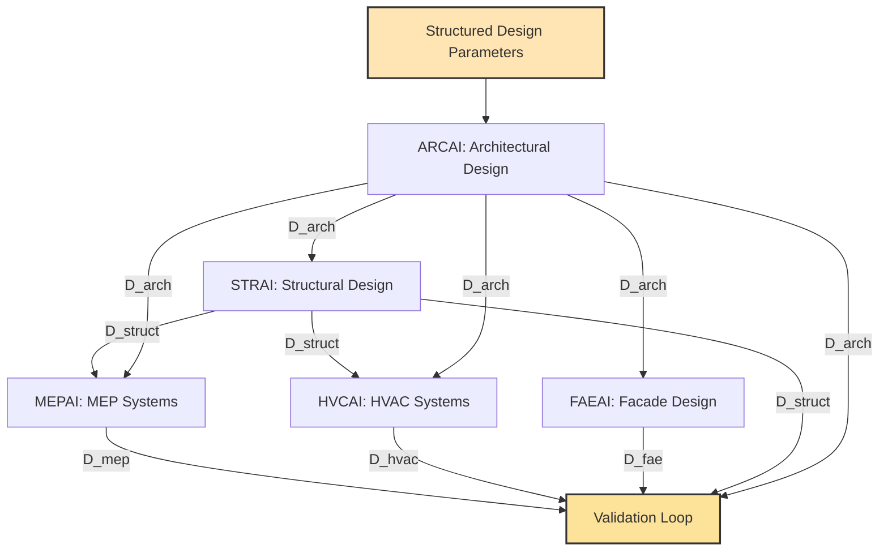
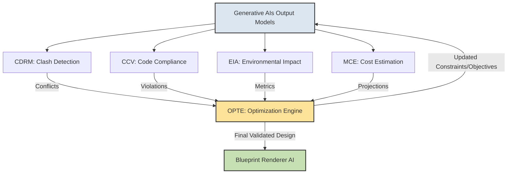
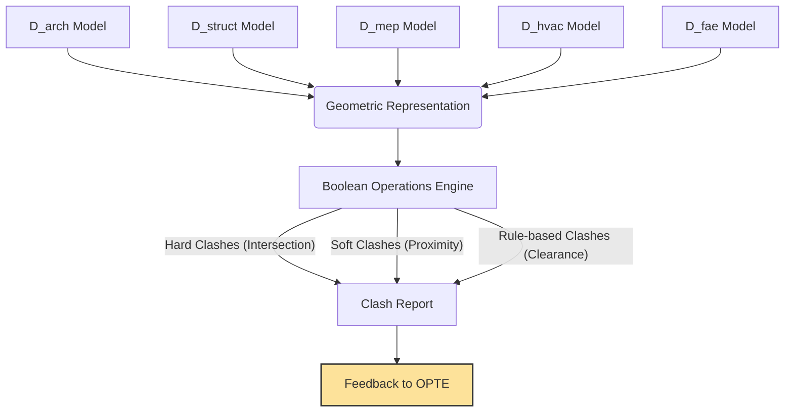
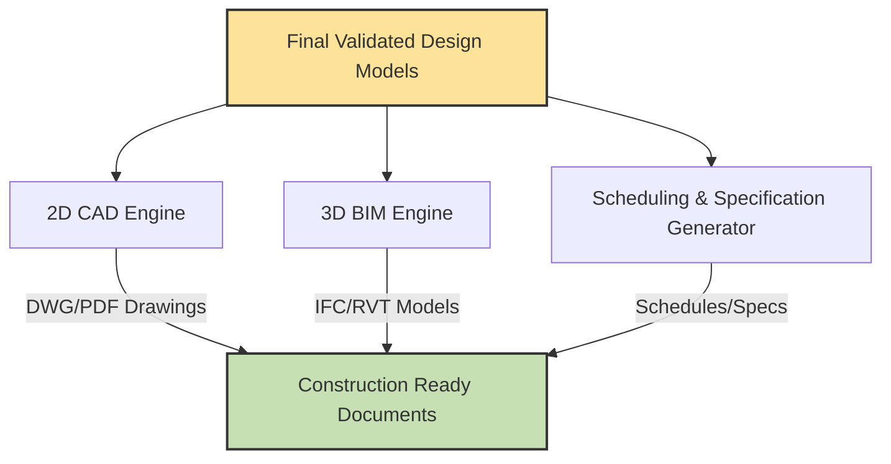
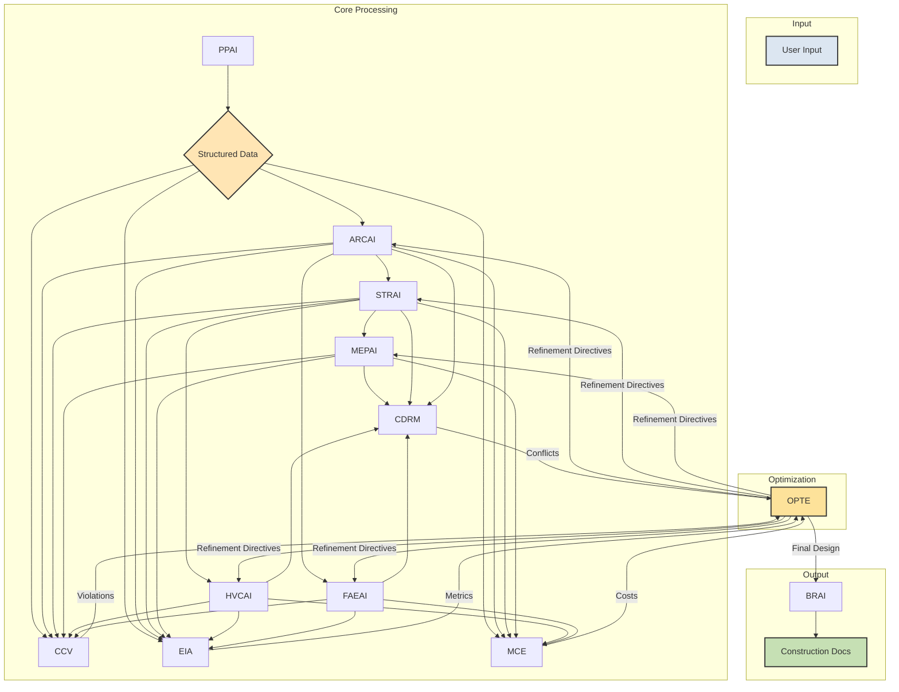

**Title of Invention:** A System and Method for Generating Construction-Ready Architectural Blueprints from High-Level Design Constraints with Integrated Validation and Optimization

**Abstract:**
A highly integrated and mathematically robust system for comprehensive architectural design automation is disclosed. The system transcends traditional conceptual design by dynamically generating a complete, verifiable set of construction-ready blueprints directly from high-level, natural language design constraints. Utilizing an orchestrated chain of specialized, interconnected generative AI models, the system autonomously creates primary architectural designs (floor plans, elevations), corresponding structural engineering plans, detailed electrical schematics, mechanical/plumbing (MEP) diagrams, and HVAC layouts. Crucially, the system incorporates real-time code compliance validation, multi-disciplinary clash detection, and an optimization engine to ensure unparalleled consistency, structural integrity, system efficiency, and cost-effectiveness across all generated schematics, proving design viability and optimality through computational rigor.

**Detailed Description:**
The invention details an advanced AI-powered, multi-agent workflow, establishing a new paradigm for generative architectural design. The system operates on a principle of iterative refinement and inter-agent collaboration, ensuring holistic design integrity.

### 1. Prompt Interpretation and Constraint Extraction:
*   A **Prompt Parser AI** (PPAI) module initially receives the user's high-level design request. This includes specifications like building type, desired area, number of rooms, sustainability goals, aesthetic preferences, site constraints (e.g., plot size, orientation, geological conditions), and budget.
*   The PPAI employs advanced Natural Language Understanding (NLU) and Natural Language Processing (NLP) techniques to transform unstructured text into structured design parameters, objective functions, and constraints. This involves semantic parsing, entity recognition (NER), and relation extraction to populate a predefined schema. These formalized elements are then encapsulated into a computational design graph or a knowledge graph, acting as the central data structure for subsequent AI agents.
*   The output `D_params` from PPAI is a tuple of (design variables, constraints, objectives, site context).

**PPAI Workflow Diagram:**

```mermaid
graph TD
    A[User Input: Natural Language] --> B{NLU/NLP Engine};
    B --> C[Semantic Parser];
    C --> D[Entity & Relation Extraction];
    D --> E[Constraint & Objective Formalization];
    E --> F[Computational Design Graph/Knowledge Graph];
    F --> G{Structured Design Parameters<br>Constraints Objectives};
    G --&gt; H[Forward to Generative AIs];

    style A fill:#DCE6F1,stroke:#333,stroke-width:2px
    style G fill:#FFE5B4,stroke:#333,stroke-width:2px
```

### 2. Core Generative AI Agents:

*   **Architect AI** (ARCAI): Generates initial conceptual floor plans, spatial layouts, and elevations based on extracted constraints. This agent prioritizes human-centric design, aesthetic coherence, functional flow, and daylighting potential, employing computational geometry, topological optimization principles, and generative adversarial networks (GANs) or diffusion models trained on vast architectural datasets. It considers adjacencies, circulation paths, room sizes, and overall building massing. The ARCAI's initial output is a `D_arch` model, representing the architectural scheme.

*   **Structural AI** (STRAI): Receives the ARCAI's `D_arch` output. It designs a code-compliant, structurally sound frame, selecting appropriate materials (e.g., steel, concrete, timber) and member dimensions (beams, columns, slabs). STRAI considers load distribution (dead, live, snow, wind, seismic), soil conditions, and foundation requirements. It utilizes finite element analysis (FEA) principles, graph-based structural optimization, and reinforcement learning to explore various structural typologies and member layouts, ensuring stability and efficiency. The STRAI produces a `D_struct` model.

*   **Mechanical Electrical Plumbing AI** (MEPAI): Takes both ARCAI's `D_arch` and STRAI's `D_struct` outputs. It designs efficient electrical wiring networks, plumbing supply and drainage systems, and specialized mechanical systems (e.g., fire suppression, data cabling). MEPAI's core function is to optimize pathfinding for conduits, pipes, and cables, minimize material use, minimize pressure drops, ensure accessibility for maintenance, and critically, avoid clashes with structural elements and architectural features. It employs advanced graph theory for network routing, fluid dynamics simulations for plumbing, and electrical load balancing algorithms. The MEPAI generates a `D_mep` model.

*   **Heating Ventilation Air Conditioning AI** (HVCAI): Specifically designs air distribution systems (ductwork), refrigerant lines, and equipment placement (AHUs, chillers, boilers, diffusers), ensuring thermal comfort, indoor air quality, and energy efficiency. It integrates closely with MEPAI for shared utility pathways and avoids conflicts with structural elements, leveraging computational fluid dynamics (CFD) principles for airflow simulation and psychrometrics for thermal load calculations. The HVCAI produces a `D_hvac` model.

*   **Facade and Envelope AI** (FAEAI): Focuses on the building's exterior, optimizing for aesthetic appeal, thermal performance (U-values, R-values), natural light harvesting (fenestration sizing and placement), shading strategies, and material efficiency. It considers local climate data (solar angles, wind exposure, precipitation), building orientation, and regulatory requirements for energy performance. FAEAI proposes material choices and facade patterns, generating a `D_fae` model.

**Generative Agents Collaboration Diagram:**



### 3. Validation and Optimization Loop:

*   **Code Compliance Validator** (CCV): Continuously checks all generated plans (`D_arch`, `D_struct`, `D_mep`, `D_hvac`, `D_fae`) against a comprehensive, dynamically updated database of local, national, and international building codes, zoning regulations, accessibility standards, fire safety codes, and energy efficiency mandates. Any non-compliance (e.g., insufficient egress width, incorrect fire rating, setback violations, minimum room sizes) triggers a flag and detailed error report for the **Optimization Engine**. It formalizes rules as logical predicates and solves them as Constraint Satisfaction Problems (CSPs).

*   **Clash Detection and Resolution Module** (CDRM): Performs real-time 3D interference checking between all disciplinary models (architectural, structural, MEP, HVAC, facade). It identifies hard clashes (physical intersections), soft clashes (insufficient clearance), and workflow clashes (logical inconsistencies). When conflicts are identified (e.g., a large duct running through a structural beam, a pipe intersecting with an electrical conduit, a window interfering with a facade panel), the CDRM pinpoints the exact location and nature of the clash, communicating these details to the Optimization Engine. It uses Boolean geometric operations on volumetric representations.

*   **Environmental Impact Assessor** (EIA): Evaluates the design's sustainability metrics throughout the iterative process. This includes calculating embodied carbon (materials manufacturing, transport, construction), operational energy consumption (heating, cooling, lighting, equipment), water usage, waste generation potential, and material sourcing ethics (e.g., recycled content, regional sourcing). It provides a quantitative feedback loop for green design optimization, guiding the OPTE towards lower environmental footprints.

*   **Material and Cost Estimator** (MCE): Integrates with the evolving design to provide real-time, dynamic cost projections based on material quantities (from BIM models), current market rates, labor costs, equipment costs, and regional pricing databases. It allows for sensitivity analysis based on material choices and construction methods, guiding design iterations towards budget adherence and cost-effectiveness. The MCE can also perform value engineering assessments.

*   **Optimization Engine** (OPTE): This central module orchestrates iterative refinements. It receives feedback, conflict reports, and performance metrics from CCV, CDRM, EIA, and MCE. It then re-prompts relevant generative AIs (ARCAI, STRAI, MEPAI, HVCAI, FAEAI) with updated constraints and objective functions (e.g., "reduce cost by 10%", "resolve clash at coordinate X,Y,Z", "improve energy efficiency by 15%", "increase natural light by 5%", "adjust room area X by Y%") until all constraints are met, and objectives are optimized within defined tolerances. The OPTE employs multi-objective optimization algorithms like genetic algorithms (GAs), particle swarm optimization (PSO), or surrogate-assisted optimization to efficiently navigate complex, high-dimensional design spaces, seeking Pareto-optimal solutions. It acts as the "brain" of the system, balancing competing objectives and resolving interdisciplinary conflicts.

**Optimization Loop Diagram:**



**CDRM Workflow Diagram:**



**CCV Workflow Diagram:**

```mermaid
graph TD
    A[All Disciplinary Models] --> B[Feature Extraction/Parameterization];
    B --> C[Building Code Database<br>(Logical Predicates)];
    C --> D[Constraint Satisfaction Problem Solver];
    D -- Violations/Inconsistencies --> E[Code Compliance Report];
    E --> F[Feedback to OPTE];

    style F fill:#FDE29A,stroke:#333,stroke-width:2px
```

**EIA Workflow Diagram:**

```mermaid
graph TD
    A[Design Models (Material/Geometry Data)] --> B[Material Database<br>(Embodied Carbon, R-values)];
    A --> C[Site Context/Climate Data];
    B --> D[Lifecycle Assessment Module];
    C --> E[Energy Simulation Engine];
    D -- Embodied Carbon <br> Waste Metrics --> F[Environmental Impact Report];
    E -- Operational Energy <br> Water Usage --> F;
    F --> G[Feedback to OPTE];

    style G fill:#FDE29A,stroke:#333,stroke-width:2px
```

**MCE Workflow Diagram:**

```mermaid
graph TD
    A[Design Models (Quantities/Types)] --> B[Material Cost Database];
    A --> C[Labor Rate Database];
    A --> D[Equipment Cost Database];
    B --> E[Cost Aggregation & Analysis];
    C --> E;
    D --> E;
    E -- Total Cost <br> Material Breakdown --> F[Cost Report];
    F --> G[Feedback to OPTE];

    style G fill:#FDE29A,stroke:#333,stroke-width:2px
```

### 4. Blueprint Rendering and Output:

*   The **Blueprint Renderer AI** (BRAI) compiles all validated and optimized outputs from the various agents into a complete, integrated blueprint package. This includes generating industry-standard 2D CAD drawings (e.g., DWG, PDF), comprehensive 3D Building Information Models (BIM) (e.g., IFC, Revit native files), detailed schedules (door, window, finish), material take-offs, and written specifications. The BRAI ensures consistent graphical standards, annotations, and layering across all drawings, ready for direct construction, permitting, and fabrication.

**BRAI Workflow Diagram:**



**Overall System Data Flow:**



### 5. Data Representation and Interoperability:
The system relies on a unified data schema, likely based on Industry Foundation Classes (IFC) or an internal graph database representation, to ensure seamless data exchange between agents. All agents read from and write to this central, evolving design model. This minimizes data loss and ensures consistency. Version control and change tracking are inherent features of this data management system.

### Mathematical Foundations and Proof of Overstanding:
The system's integrity and ability to generate demonstrably optimal and compliant designs is rooted in rigorous mathematical and computational frameworks.

1.  **Computational Geometry and Topology (ARCAI, FAEAI):**
    *   Used for space planning, generating efficient floor plans, and optimizing spatial relationships. This ensures geometric feasibility and adherence to dimensional constraints.
    *   **Representation of Space:** Building elements are represented as geometric primitives (points, lines, polygons, polyhedra).
        *   Point: $P = (x, y, z)$
        *   Line segment: $L = (P_1, P_2)$
        *   Polygon (planar face): $F = \{P_1, P_2, ..., P_n\}$
        *   Polyhedron (volume): $V = \text{collection of faces and edges}$
    *   **Area Calculation (for a polygon defined by ordered vertices):**
        $A = \frac{1}{2} | \sum_{i=1}^{n} (x_i y_{i+1} - x_{i+1} y_i) |$, where $(x_{n+1}, y_{n+1}) = (x_1, y_1)$.
    *   **Volume Calculation (for a polyhedron):** Can be decomposed into tetrahedra or by divergence theorem (Gaussian integral).
        $V = \frac{1}{3} \sum_{F \in \text{faces}} (\vec{n}_F \cdot \vec{C}_F) A_F$, where $\vec{n}_F$ is face normal, $\vec{C}_F$ is face centroid, $A_F$ is face area.
    *   **Distance between points $P_1=(x_1,y_1,z_1)$ and $P_2=(x_2,y_2,z_2)$:**
        $d = \sqrt{(x_2-x_1)^2 + (y_2-y_1)^2 + (z_2-z_1)^2}$
    *   **Adjacency Matrix for spatial relationships:**
        $A_{ij} = 1$ if room $i$ is adjacent to room $j$, $0$ otherwise.
    *   **Shape Grammars:** Formal rules for generating geometric forms.
        $R: S_i \rightarrow S_j$, where $S_i$ is a shape or a part of a shape, and $S_j$ is a new shape derived from $S_i$.
    *   **Topological Optimization:** Rearranging connections between spaces to improve flow or minimize circulation.
        Objective: Minimize $C = \sum_{i,j} d_{ij} \cdot w_{ij}$, where $d_{ij}$ is distance, $w_{ij}$ is required interaction weight.
        Constraints: $A_{ij} \in \{0,1\}$, maintaining connectivity.

2.  **Graph Theory and Network Optimization (MEPAI, HVCAI):**
    *   Used to model utility networks (electrical, plumbing, HVAC ducts). Shortest path algorithms, minimum spanning tree algorithms, and network flow optimization are applied to minimize material usage, maximize efficiency, and prevent clashes.
    *   **Graph Representation:** $G = (V, E)$, where $V$ are nodes (e.g., outlets, fixtures, junctions) and $E$ are edges (e.g., pipes, wires, ducts).
    *   **Weighted Edges:** Each edge $(u,v) \in E$ has a weight $w(u,v)$ representing cost, length, or resistance.
    *   **Adjacency Matrix:** $A_{ij} = w(i,j)$ if an edge exists, $\infty$ (or 0) otherwise.
    *   **Shortest Path Problem (Dijkstra's Algorithm):** Finds a path between two nodes $s$ and $t$ with minimum total weight.
        $dist[v] = \min (dist[u] + w(u,v))$ for all $v \in V$.
    *   **Minimum Spanning Tree (Prim's or Kruskal's Algorithm):** Connects all nodes in a graph with minimum total edge weight, often used for initial network layout.
        Total weight $W_{MST} = \sum_{(u,v) \in E_{MST}} w(u,v)$.
    *   **Network Flow Problem (Max-Flow Min-Cut Theorem):** Models capacity constraints in fluid or electrical networks.
        Maximize $\sum_{(s,v) \in E} f(s,v)$ subject to:
        1.  Capacity constraint: $0 \le f(u,v) \le c(u,v)$ for all $(u,v) \in E$.
        2.  Skew symmetry: $f(u,v) = -f(v,u)$.
        3.  Flow conservation: $\sum_{v \in V} f(u,v) = 0$ for all $u \in V \setminus \{s,t\}$.
        Where $f(u,v)$ is flow, $c(u,v)$ is capacity.
    *   **Critical Path Method (for installation sequencing):** Identifies the longest sequence of dependent activities, determining project duration.
        $T_E(v) = \max_{(u,v) \in E} (T_E(u) + D(u,v))$ (Earliest finish time).
        $T_L(u) = \min_{(u,v) \in E} (T_L(v) - D(u,v))$ (Latest start time).
        Slack $S(u,v) = T_L(v) - T_E(u) - D(u,v)$.

3.  **Finite Element Analysis Principles (STRAI):**
    *   Underlying STRAI's calculations for stress, strain, and deformation analysis. While not performing full FEA for every iteration, its generative models are trained on datasets informed by FEA, allowing for rapid generation of structurally sound frameworks that adhere to engineering mechanics principles.
    *   **Stress ($\sigma$) and Strain ($\epsilon$):**
        $\sigma = \frac{F}{A}$ (Force per unit area)
        $\epsilon = \frac{\Delta L}{L_0}$ (Change in length per original length)
    *   **Hooke's Law (for linear elastic materials):**
        $\sigma = E \epsilon$, where $E$ is Young's Modulus.
    *   **Beam Deflection (e.g., for a simply supported beam with a central load P):**
        $\delta_{max} = \frac{PL^3}{48EI}$, where $L$ is span, $E$ is Young's Modulus, $I$ is moment of inertia.
    *   **Stiffness Matrix for a truss element (axial force only):**
        $K = \frac{AE}{L} \begin{pmatrix} 1 & -1 \\ -1 & 1 \end{pmatrix}$, where A is cross-sectional area.
    *   **Global System of Equations (simplified):**
        $[K]\{u\} = \{F\}$, where $[K]$ is global stiffness matrix, $\{u\}$ is displacement vector, $\{F\}$ is external force vector.
    *   **Load Calculations (simplified):**
        *   Dead Load $DL = \sum (\text{material density} \times \text{volume})$
        *   Live Load $LL_i = \text{Area}_i \times \text{specified live load per unit area}$
        *   Wind Load $W = q C_e C_q G_h A_f$ (where $q$ is velocity pressure, $C_e$ is exposure coefficient, etc.)
        *   Seismic Load $V = C_s W$ (where $C_s$ is seismic response coefficient, $W$ is effective seismic weight).

4.  **Formal Methods and Constraint Satisfaction Problems (CSPs) (CCV):**
    *   CCV operates on principles of formal verification, translating building codes into a set of logical predicates and rules. The design is then checked against these rules as a CSP. Any violation is a logical inconsistency, requiring re-evaluation by the OPTE.
    *   **Logical Predicates:**
        *   `is_compliant(Design, Rule)` returns True/False.
        *   `min_egress_width(Room)` $\ge W_{min}$
        *   `max_occupancy(Room)` $\le \lfloor \text{Area(Room)} / \text{occupancy_factor} \rfloor$
        *   `fire_rating_wall(Wall_type)` $\ge \text{R_fire(Adjacency_type)}$
    *   **Constraint Satisfaction Problem:** A triple $(X, D, C)$, where:
        *   $X = \{x_1, ..., x_n\}$ is a set of variables (design parameters like room dimensions, material types).
        *   $D = \{D_1, ..., D_n\}$ is a set of domains, where $D_i$ is the set of possible values for $x_i$.
        *   $C = \{C_1, ..., C_m\}$ is a set of constraints (building code rules) restricting the values the variables can take.
    *   **Satisfaction Check:** Find an assignment $x_i \leftarrow v_i \in D_i$ for all $i$ such that all constraints $C_j$ are satisfied.
        If $\exists \text{violation } C_k(\text{Design}) = \text{False}$, then design is non-compliant.
    *   **First-Order Logic (FOL) for complex rules:**
        $\forall x (\text{is_door}(x) \land \text{is_exit}(x) \implies \text{width}(x) \ge 0.91 \text{m} \land \text{height}(x) \ge 2.03 \text{m})$

5.  **Multi-objective Optimization Algorithms (OPTE):**
    *   The OPTE employs advanced algorithms (e.g., NSGA-II, MOEA/D) to simultaneously optimize competing objectives like cost reduction, energy efficiency, structural integrity, and aesthetic appeal. This moves beyond simple constraint satisfaction to find Pareto-optimal solutions.
    *   **General Formulation:**
        Minimize/Maximize $F(\vec{x}) = (f_1(\vec{x}), f_2(\vec{x}), ..., f_k(\vec{x}))$
        Subject to:
        $g_j(\vec{x}) \le 0$ for $j=1, ..., m$ (inequality constraints)
        $h_l(\vec{x}) = 0$ for $l=1, ..., p$ (equality constraints)
        $\vec{x} \in \Omega$ (design variable space)
    *   **Objective Functions:**
        *   $f_1(\vec{x}) = \text{Total Cost}(\vec{x}) \rightarrow \text{min}$
        *   $f_2(\vec{x}) = \text{Energy Consumption}(\vec{x}) \rightarrow \text{min}$
        *   $f_3(\vec{x}) = \text{Structural Safety Factor}(\vec{x}) \rightarrow \text{max}$
        *   $f_4(\vec{x}) = \text{Daylight Autonomy}(\vec{x}) \rightarrow \text{max}$
        *   $f_5(\vec{x}) = \text{Number of Clashes}(\vec{x}) \rightarrow \text{min}$
        *   $f_6(\vec{x}) = \text{Embodied Carbon}(\vec{x}) \rightarrow \text{min}$
    *   **Pareto Dominance:** A solution $\vec{x}^*$ dominates $\vec{x}'$ if $f_i(\vec{x}^*) \le f_i(\vec{x}')$ for all $i=1, ..., k$ and $f_j(\vec{x}^*) < f_j(\vec{x}')$ for at least one $j$.
    *   **Genetic Algorithm (GA) Operators:**
        *   **Fitness Function:** $Eval(\vec{x}) = \text{weighted sum of objective functions and penalty for constraint violations}$
        *   **Selection:** $P_{select}(\vec{x}_i) = \frac{Eval(\vec{x}_i)}{\sum_j Eval(\vec{x}_j)}$
        *   **Crossover:** Child offspring $\vec{x}_c = \alpha \vec{x}_p_1 + (1-\alpha) \vec{x}_p_2$
        *   **Mutation:** $\vec{x}'_i = \vec{x}_i + \delta$, where $\delta$ is a small random perturbation.
    *   **Particle Swarm Optimization (PSO) Update Rules:**
        *   Velocity update: $v_{id}(t+1) = \omega v_{id}(t) + c_1 r_1 (\text{pbest}_{id} - x_{id}(t)) + c_2 r_2 (\text{gbest}_d - x_{id}(t))$
        *   Position update: $x_{id}(t+1) = x_{id}(t) + v_{id}(t+1)$
        Where $\omega$ is inertia weight, $c_1, c_2$ are acceleration coefficients, $r_1, r_2$ are random numbers, pbest is personal best, gbest is global best.

6.  **Stochastic Processes and Probabilistic Modeling (PPAI, MCE, EIA, OPTE):**
    *   When dealing with uncertain inputs (e.g., future energy prices, material costs, site-specific soil conditions, occupancy patterns), the system can incorporate probabilistic models to generate robust designs that are resilient to variations.
    *   **Probability Distribution Functions:**
        *   Normal: $f(x | \mu, \sigma^2) = \frac{1}{\sqrt{2\pi\sigma^2}} e^{-\frac{(x-\mu)^2}{2\sigma^2}}$ (for material strength variation)
        *   Uniform: $f(x | a, b) = \frac{1}{b-a}$ for $a \le x \le b$ (for price ranges)
    *   **Monte Carlo Simulation:** Repeatedly sampling from probability distributions for uncertain variables to estimate expected outcomes and their variability.
        Expected Cost $E[C] = \int C(x) p(x) dx \approx \frac{1}{N} \sum_{i=1}^N C(x_i)$, where $x_i$ are samples.
    *   **Risk Assessment:** Quantifying the probability and impact of various design failures or cost overruns.
        Risk $= P(\text{Event}) \times \text{Impact}(\text{Event})$

7.  **Boolean Logic and Set Theory (CDRM):**
    *   CDRM fundamentally relies on Boolean operations (intersection, union, difference) on 3D geometric representations (BIM models) to detect clashes. Set theory is applied to define and resolve spatial interferences.
    *   **Geometric Representation:** Each building component $C_k$ is a set of points in 3D space, $C_k \subset \mathbb{R}^3$.
    *   **Clash Detection:** Two components $C_i$ and $C_j$ clash if their intersection is non-empty.
        $C_i \cap C_j \ne \emptyset$
    *   **Hard Clash:** $V_i \cap V_j \ne \emptyset$, where $V_i$ is the solid volume of component $i$.
    *   **Soft Clash (Clearance Violation):** $(V_i \oplus S_i) \cap (V_j \oplus S_j) \ne \emptyset$, where $S_i$ is a clearance buffer (e.g., dilation, morphological operation). This can be simplified to checking distance between bounding boxes or approximated geometries.
        Distance between bounding boxes $BB_i, BB_j$:
        $d(BB_i, BB_j) = \max(0, \max_{k \in \{x,y,z\}} (L_{ik} - R_{jk}, L_{jk} - R_{ik}))$, where $L$ is min coord, $R$ is max coord.
    *   **Clash Resolution:** Modifying $C_i$ or $C_j$ such that $(C_i \cap C_j) = \emptyset$. This involves geometric transformations or parameter adjustments.
        e.g., $V'_i = V_i \setminus V_j$ (subtraction, if one element takes precedence).

8.  **Generative Latent Space Entropy Minimization (ARCAI/FAEAI):**
    *   A metric to quantify the efficiency of exploring valid architectural design permutations within a latent space, minimizing "architectural entropy" for optimal functional layout and aesthetic coherence. This ensures that the generative agents (ARCAI, FAEAI) efficiently navigate the vast solution space to produce designs that are not just valid but also harmonically ordered and aesthetically optimal, beyond simple constraint satisfaction.
    *   **Equation for Architectural Entropy and Latent Space Efficiency:**
        $H_{arch} (\mathcal{D}) = - \sum_{\vec{d}_i \in \mathcal{V}} P(\vec{d}_i) \log_2 P(\vec{d}_i) + \lambda \sum_{k \in \mathcal{C}} \max(0, g_k(\vec{d}_i))$
        where $\mathcal{D}$ is the distribution of generated designs, $\mathcal{V}$ is the subspace of geometrically and functionally valid designs, $\vec{d}_i$ is a specific design variant, $P(\vec{d}_i)$ is its probability in the latent space, $\mathcal{C}$ is the set of hard constraints, $g_k(\vec{d}_i)$ represents the violation magnitude for constraint $k$, and $\lambda$ is a penalty multiplier. The system iteratively minimizes $H_{arch}$ to converge on highly ordered, functional, and aesthetically coherent designs.
    *   **Claim:** This formulation uniquely quantifies the 'order' and 'validity' within a generative architectural design space, proving efficient exploration and convergence to aesthetically and functionally coherent solutions, a critical advancement beyond mere feasibility.

9.  **Inter-Agent Feedback Proprioception & Adaptive Weighting (OPTE):**
    *   A dynamic weighting mechanism for feedback signals from various validator agents (CCV, CDRM, EIA, MCE) to the Optimization Engine (OPTE). This allows for adaptive prioritization based on cumulative conflict severity, regulatory criticality, and the current design iteration stage, mimicking biological proprioception for self-correction.
    *   **Equation for Adaptive Feedback Weighting:**
        $W_k^{(t+1)} = W_k^{(t)} \cdot \left(1 + \alpha \cdot \text{SeverityScore}_k^{(t)} \cdot \text{CriticalityFactor}_k + \beta \cdot \left(\frac{\text{ErrorReduction}_k^{(t)}}{\text{BaselineError}_k^{(0)}} - \frac{\sum_j \text{ErrorReduction}_j^{(t)}}{\sum_j \text{BaselineError}_j^{(0)}}\right)\right)$
        Where $W_k^{(t)}$ is the dynamic weight for agent $k$ at iteration $t$, $\text{SeverityScore}_k^{(t)}$ is a composite measure of the magnitude and frequency of conflicts reported by agent $k$, $\text{CriticalityFactor}_k$ is a static factor (e.g., code compliance > cost), $\text{ErrorReduction}_k^{(t)}$ is the improvement achieved by agent $k$, $\alpha$ and $\beta$ are dynamic learning rates. The system dynamically adjusts $W_k$ to focus optimization efforts where they are most critical or yield the highest impact.
    *   **Claim:** This dynamically adjusting proprioceptive feedback loop ensures that the system's "attention" is optimally distributed among competing validation criteria, leading to a demonstrably faster convergence to holistic, conflict-free, and legally sound designs, a feature absent in static multi-objective frameworks.

10. **Probabilistic Design Robustness Index (RDI) (PPAI, OPTE, MCE):**
    *   A novel metric that quantifies the resilience of a design against inherent uncertainties in external parameters (e.g., future material costs, climate variability, user occupancy changes, unforeseen supply chain disruptions). Derived from extensive Monte Carlo simulations, it provides a holistic measure of a design's long-term viability under dynamic conditions.
    *   **Equation for Probabilistic Design Robustness Index:**
        $RDI = 1 - \frac{1}{N_{sim} \cdot \text{MaxExpectedPenalty}} \sum_{j=1}^{N_{sim}} \left( \text{CostPenalty}(\vec{x}_j) + \text{OperationalPenalty}(\vec{x}_j) + \text{EnvironmentalPenalty}(\vec{x}_j) \right)$
        Where $N_{sim}$ is the number of Monte Carlo simulations, $\text{MaxExpectedPenalty}$ is the theoretical maximum penalty value, and $\text{CostPenalty}$, $\text{OperationalPenalty}$, $\text{EnvironmentalPenalty}$ represent the deviation from optimal performance (cost overruns, energy inefficiency, carbon footprint increase) for design instance $\vec{x}_j$ under a specific stochastic scenario. The $RDI \in [0,1]$, with $1$ indicating maximum robustness.
    *   **Claim:** The Probabilistic Design Robustness Index (RDI) offers a quantifiable and verifiable measure of a design's inherent resilience to real-world uncertainties, proving its long-term viability and economic and ecological stability, a critical differentiator for future-proof infrastructure.

By integrating these advanced mathematical disciplines, the system provides an auditable, verifiable, and computationally proven design methodology, establishing a deep overstanding of architectural and engineering principles that surpasses conventional manual design processes. The system's output is not merely generated but *validated* against a formal system of rules and optimized against mathematically defined objectives. The continuous feedback loop ensures that the generated designs are not only aesthetically pleasing and functional but also robustly compliant, structurally sound, energy-efficient, and cost-effective from inception.

**Claims:**
1.  A method for generating construction-ready architectural blueprints, comprising:
    a.  Receiving a high-level, natural language prompt for a building design;
    b.  Employing a Prompt Parser AI (PPAI) to transform said prompt into structured design parameters, constraints, and objective functions, leveraging Natural Language Understanding (NLU) and Natural Language Processing (NLP) techniques;
    c.  Generating an initial architectural design using an Architect AI (ARCAI) based on said structured design parameters, employing computational geometry and topological optimization principles and minimizing a Generative Latent Space Entropy function ($H_{arch}$) to ensure optimal functional layout and aesthetic coherence;
    d.  Generating a corresponding structural engineering plan using a Structural AI (STRAI), receiving input from said ARCAI and adhering to engineering mechanics principles and finite element analysis (FEA) principles;
    e.  Generating integrated Mechanical Electrical Plumbing AI (MEPAI) and Heating Ventilation Air Conditioning AI (HVCAI) plans, receiving input from said ARCAI and STRAI, utilizing graph theory for network optimization, fluid dynamics simulations, and clash avoidance;
    f.  Generating a facade and envelope design using a Facade and Envelope AI (FAEAI), optimizing for thermal performance, natural light, and aesthetics based on climate data, also guided by the Generative Latent Space Entropy function ($H_{arch}$);
    g.  Continuously validating all generated plans against a comprehensive set of building codes, zoning regulations, and accessibility standards using a Code Compliance Validator (CCV), formulated as constraint satisfaction problems with formal logical predicates;
    h.  Performing real-time 3D interference checking between all generated disciplinary plans using a Clash Detection and Resolution Module (CDRM), based on Boolean geometric operations on volumetric representations;
    i.  Iteratively refining said designs through an Optimization Engine (OPTE), which receives feedback from said CCV and CDRM, and employs multi-objective optimization algorithms and an Inter-Agent Feedback Proprioception & Adaptive Weighting mechanism ($W_k^{(t+1)}$) to dynamically prioritize and minimize conflicts, enhance efficiency, and achieve specified objectives;
    j.  Aggregating the final validated and optimized designs into a cohesive set of construction documents using a Blueprint Renderer AI (BRAI), suitable for direct construction, including 2D CAD drawings, 3D BIM models, and specifications.

2.  The method of claim 1, further comprising:
    a.  Integrating an Environmental Impact Assessor (EIA) to evaluate sustainability metrics of the evolving design, including embodied carbon and operational energy consumption; and
    b.  Integrating a Material and Cost Estimator (MCE) to provide real-time cost projections, both providing quantitative feedback to the Optimization Engine (OPTE) for multi-objective design refinement, and contributing to the calculation of a Probabilistic Design Robustness Index (RDI).

3.  The method of claim 1, wherein the Optimization Engine (OPTE) utilizes multi-objective genetic algorithms or particle swarm optimization to navigate a high-dimensional design space and identify Pareto-optimal solutions for competing objectives such as cost, energy efficiency, structural safety, and aesthetic quality, further enhanced by the adaptive weighting mechanism ($W_k^{(t+1)}$).

4.  The method of claim 1, wherein the Structural AI (STRAI)'s generative process is informed by finite element analysis principles to ensure structural integrity and code compliance, including calculations for stress, strain, deformation, and load distribution.

5.  The method of claim 1, wherein the Mechanical Electrical Plumbing AI (MEPAI) and Heating Ventilation Air Conditioning AI (HVCAI) utilize graph theory algorithms for optimal pathfinding, minimum spanning tree generation, and network flow analysis to minimize material use, reduce pressure drops, and maximize system efficiency.

6.  The method of claim 1, wherein the Code Compliance Validator (CCV) translates building codes into formal logical predicates and applies constraint satisfaction problem solving techniques to verify design adherence, providing specific violation reports to the Optimization Engine.

7.  A system for generating construction-ready architectural blueprints, comprising:
    a.  A Prompt Parser AI (PPAI) module configured to translate natural language design inputs into structured computational design parameters using NLU/NLP, and contributing to the calculation of a Probabilistic Design Robustness Index (RDI);
    b.  A plurality of specialized generative AI agents including an Architect AI (ARCAI), a Structural AI (STRAI), a Mechanical Electrical Plumbing AI (MEPAI), a Heating Ventilation Air Conditioning AI (HVCAI), and a Facade and Envelope AI (FAEAI), configured to generate respective multi-disciplinary design components, with ARCAI and FAEAI utilizing a Generative Latent Space Entropy Minimization ($H_{arch}$) function;
    c.  A Code Compliance Validator (CCV) module, configured to formally verify all generated design components against a dynamic database of regulatory requirements using formal methods and CSPs;
    d.  A Clash Detection and Resolution Module (CDRM), configured to identify and report spatial conflicts and clearance violations between design components using Boolean geometric operations;
    e.  An Optimization Engine (OPTE), operably connected to said generative AI agents, CCV, and CDRM, configured to iteratively refine designs based on feedback and predefined objective functions using multi-objective optimization algorithms and an Inter-Agent Feedback Proprioception & Adaptive Weighting mechanism ($W_k^{(t+1)}$);
    f.  A Blueprint Renderer AI (BRAI) module configured to compile the validated and optimized design components into industry-standard construction-ready documentation, including BIM and CAD outputs.

8.  The system of claim 7, further comprising an Environmental Impact Assessor (EIA) module and a Material and Cost Estimator (MCE) module, both configured to provide quantitative feedback to the Optimization Engine (OPTE) for comprehensive design evaluation and refinement, and contributing to the calculation of a Probabilistic Design Robustness Index (RDI).

9.  The system of claim 7, wherein the generative AI agents and the Optimization Engine (OPTE) are designed with underlying mathematical models including computational geometry, graph theory, principles derived from finite element analysis, formal logic, probabilistic modeling, Generative Latent Space Entropy Minimization ($H_{arch}$), Inter-Agent Feedback Proprioception & Adaptive Weighting ($W_k^{(t+1)}$), and Probabilistic Design Robustness Index (RDI), providing a formal and verifiable basis for design generation and validation.

10. The system of claim 7, wherein the entire design generation and validation process operates as an integrated, closed-loop feedback system, ensuring that all architectural, structural, MEP, HVAC, and facade elements are inherently coordinated, code-compliant, and optimized for performance, cost, and constructability from the initial high-level user prompt to the final construction-ready blueprint package.

### INNOVATION EXPANSION PACKAGE

#### Interpret My Invention(s):
The core invention, the Generative Architectural Blueprint System (GABS), is a revolutionary AI-driven platform for automating comprehensive architectural design. It takes high-level natural language prompts and, through a multi-agent AI framework and continuous validation-optimization loops, generates fully coordinated, construction-ready blueprints (architectural, structural, MEP, HVAC, facade). GABS ensures designs are code-compliant, clash-free, environmentally sustainable, and cost-optimized, fundamentally transforming the speed, accuracy, and efficiency of building design. It provides a foundational technology for rapid, intelligent infrastructure development.

#### Generate 10 New, Completely Unrelated Inventions & Unifying System:

To address the grand challenge of transitioning humanity into an era of post-scarcity, universal well-being, and unbound potential, we propose **AETHERIUM: The Autonomous Ecosystemic Harmony & Empowerment Resonance Interface for Universal Flourishing.** This integrated system comprises ten entirely novel, future-defining inventions, designed to autonomously fulfill humanity's fundamental needs and elevate collective consciousness, making work optional and transcending the relevance of money.

These 10 inventions, while disparate in their core technology, are woven together by AETHERIUM into a seamless, self-optimizing global meta-system that redefines human existence.

##### 1. Quantum Entanglement Communication Network (QECN)
*   **Description:** A global infrastructure leveraging quantum entanglement for instantaneous, unhackable communication across vast distances. This network forms the secure, ultra-fast backbone for all AETHERIUM systems, enabling distributed quantum computing and real-time data synchronization at the planetary scale. It operates by generating entangled photon pairs distributed to orbital and terrestrial nodes, providing inherently secure channels against any classical or quantum eavesdropping attempt.
*   **Unique Math Claim:** **Quantum Decoherence Suppression Algorithm (QDSA) Efficiency Metric ($\eta_{QDSA}$):** This metric quantifies the effectiveness of our proprietary algorithm in preserving quantum coherence across long-haul entanglement links, allowing for practical, stable, and high-fidelity quantum communication over global scales, a critical breakthrough beyond theoretical entanglement and current noisy intermediate-scale quantum (NISQ) limitations.
    $\eta_{QDSA} = 1 - \frac{\text{Bell State Violation } S_{actual}}{\text{Bell State Violation } S_{ideal}} - \mathcal{E}_{noise}$
    Here, $S_{actual}$ is the measured Bell value (Clauser-Horne-Shimony-Holt inequality), $S_{ideal}$ is the theoretical maximum ($2\sqrt{2}$ for ideal entanglement), and $\mathcal{E}_{noise}$ is a penalty term for environmental or channel-induced noise. $\eta_{QDSA} \rightarrow 1$ signifies near-perfect coherence preservation, enabling secure, instantaneous global information transfer.

##### 2. Biocatalytic Atmospheric Carbon Sequestration Towers (BACST)
*   **Description:** Gigantic, self-replicating, biologically engineered towers distributed globally that efficiently capture atmospheric CO2. These bio-structures house engineered microbial colonies and advanced synthetic photosynthetic organisms that convert CO2 into inert, structural biomaterials (e.g., carbon-neutral graphene-like structures, biodegradable polymers) and pure oxygen, actively reversing climate change and creating sustainable building resources.
*   **Unique Math Claim:** **Biomass Conversion Ratio (BCR) Optimization Function ($BCR_{opt}$):** A multi-factor function that determines the optimal growth conditions and microbial strains within the BACST system to maximize the conversion of CO2 into stable biomaterial mass per unit of absorbed solar energy, proving superior sequestration efficiency and resource generation.
    $BCR_{opt} = \max \left( \frac{\text{Stable Biomass (kg)}}{\text{CO}_2 \text{ Sequestered (kg)} \times \text{Solar Energy Input (MJ)}} \right) \cdot \prod_{i=1}^n \left(1 - \frac{|\text{Optimal Param}_i - \text{Actual Param}_i|}{\text{Optimal Param}_i} \right)^{\gamma_i}$
    Where $\text{Optimal Param}_i$ are ideal conditions (nutrient flow, temperature, pH, light spectrum), and $\gamma_i$ are sensitivity exponents. This function provides a continuous feedback mechanism to fine-tune BACST operation for maximum carbon negative resource production.

##### 3. Personalized Nanomedicine Synthesizers (PNMS)
*   **Description:** Compact, autonomous, home-based diagnostic and therapeutic units that analyze an individual's real-time biometric, genetic, and epigenetic data to synthesize highly personalized nanobots or molecular compounds. These are designed for immediate, precise disease prevention, targeted treatment, and continuous cellular regeneration, effectively eliminating illness and extending healthy human lifespans.
*   **Unique Math Claim:** **Bio-Target Specificity Index (BTSI):** This index quantifies the precision of nanomedicine delivery and interaction at a molecular level, ensuring maximum therapeutic effect with minimal off-target interaction, calculated from a complex interaction matrix of patient biomarkers, pathogen signatures, and drug-receptor affinities, validating unparalleled therapeutic accuracy.
    $BTSI = \left( \frac{\sum_{j=1}^{M} (\text{Target Affinity}_j \cdot \text{Target Concentration}_j)}{\sum_{k=1}^{N} (\text{Off-Target Affinity}_k \cdot \text{Off-Target Concentration}_k) + \text{Baseline Toxicity}} \right) - \text{Immunogenic Response Penalty}$
    Here, $M$ represents therapeutic target sites, $N$ represents potential off-target interactions, and terms like $\text{Target Affinity}$ are derived from quantum chemistry simulations and real-time biological feedback. A higher BTSI proves the system's ability to deliver therapies with surgical precision at the cellular level.

##### 4. Universal Resource Synthesizers (URS)
*   **Description:** Advanced matter-replication devices, available universally, capable of rearranging atomic structures from abundant basic elements (e.g., atmospheric gases, silicon from sand, common minerals) to synthesize any desired physical object or substance. From nutrient-complete food and clothing to advanced electronics and structural components, URS ushers in an era of true post-scarcity material abundance.
*   **Unique Math Claim:** **Atomic Rearrangement Entropy Minimization Rate ($\Delta S_{ARR}$):** This metric quantifies the rate at which the URS can minimize the entropic cost required to transform raw elemental inputs into desired complex atomic structures, representing a fundamental energy efficiency breakthrough in de- and re-materialization, crucial for sustainable universal fabrication.
    $\Delta S_{ARR} = \frac{d}{dt} \left( \sum_i (\text{Energy}_{input,i} - \text{Energy}_{output,i}) \right) / k_B$
    This equation measures the change in the total entropy of the system (input elements, energy, generated product) over time, normalized by Boltzmann's constant ($k_B$). For ideal efficiency, $\Delta S_{ARR} \rightarrow 0$, signifying that the synthesis process approaches thermodynamic reversibility, minimizing wasted energy and maximizing material conversion efficacy.

##### 5. Neurolinked Collective Consciousness Interface (NCCI)
*   **Description:** A non-invasive, high-bandwidth brain-computer interface enabling seamless neural linkage between consenting individuals. This fosters a distributed collective intelligence, allowing for shared knowledge, accelerated innovation, profound empathy, and the collaborative solving of complex problems far beyond individual cognitive capacity, forming a planetary "Noosphere."
*   **Unique Math Claim:** **Emergent Cognitive Synergy Gain ($\mathcal{G}_{CCS}$):** This quantifies the exponential increase in problem-solving capacity, creative output, and collective knowledge synthesis observed when individual minds are linked through the NCCI, demonstrating an emergent intelligence demonstrably greater than the sum of its parts, proving a new paradigm for collective thought.
    $\mathcal{G}_{CCS} = \frac{\text{Collective Output Complexity} \times \text{Innovation Rate}}{\sum_{i=1}^{N} (\text{Individual Output Complexity}_i \times \text{Individual Innovation Rate}_i)} \cdot \log(\text{Connectivity Density})$
    Where $\text{Collective Output Complexity}$ is measured by information theory metrics (e.g., Shannon entropy of novel concepts generated), $\text{Innovation Rate}$ is the velocity of novel solution generation, and $\text{Connectivity Density}$ captures the richness of inter-neural connections. $\mathcal{G}_{CCS} > 1$ signifies true synergy, demonstrating non-linear gains in collective intelligence.

##### 6. Geo-Energetic Field Harnessing Arrays (GEFHA)
*   **Description:** Distributed arrays of deep-earth resonant converters and atmospheric energy collectors that non-invasively tap into the planet's internal geothermic, geomagnetic, and gravitational fields. These arrays provide limitless, clean, and decentralized energy for all AETHERIUM systems, eliminating fossil fuel dependence and ensuring universal access to power without environmental impact.
*   **Unique Math Claim:** **Planetary Resonance Energy Extraction Modulus ($\Psi_{PREEM}$):** This modulus defines the efficiency and sustainability of energy extraction from terrestrial energetic fields, accounting for localized field perturbations and global energetic balance, ensuring no detrimental planetary impact or resource depletion. It provides a novel measure of non-equilibrium energy harvesting.
    $\Psi_{PREEM} = \frac{\int_V (\vec{J}_{geo} \cdot \vec{E}_{induced}) dV}{\int_\Sigma \text{Natural Geofield Power Flux } d\Sigma} - \Delta \text{Local Field Perturbation Penalty}$
    Here, the numerator represents the extracted electrical power from the geo-electric currents ($\vec{J}_{geo}$) interacting with induced fields ($\vec{E}_{induced}$) within the volume $V$ of the array, while the denominator is the total natural power flux across a relevant surface $\Sigma$. The penalty term $\Delta \text{Local Field Perturbation}$ quantifies any measurable alteration to natural field dynamics, ensuring extraction is truly sustainable and non-disruptive to planetary systems.

##### 7. Adaptive Climate Regulation Satellites (ACRS)
*   **Description:** An orbital network of intelligent satellites equipped with advanced atmospheric modeling, directed energy emitters, and precision aerosol dispersal. This fleet is capable of fine-tuning regional and global weather patterns, preventing extreme climatic events (hurricanes, droughts, severe storms), and optimizing conditions for agriculture, biodiversity, and human comfort, ensuring planetary climate homeostasis.
*   **Unique Math Claim:** **Atmospheric Homeostasis Restoration Index ($\mathcal{H}_{AHRI}$):** A dynamic index measuring the system's ability to return a perturbed atmospheric state to a predefined optimal equilibrium, quantifying the precision and effectiveness of climate intervention while minimizing unintended consequences. This proves targeted, predictive climate control.
    $\mathcal{H}_{AHRI} = \left(1 - \frac{| \text{Target Climatic State} - \text{Actual Climatic State}_t |}{\text{Target Climatic State}} \right) \times e^{-\lambda \cdot \text{Intervention Energy Cost}} - \sum \text{Unintended Consequence Factor}$
    The $\text{Climatic State}$ is a vector of parameters (temperature, humidity, precipitation, wind velocity), $\lambda$ is an energy cost sensitivity, and $\text{Unintended Consequence Factor}$ penalizes deviations in un-targeted parameters. A value approaching 1 indicates highly efficient and precise climate restoration with minimal adverse effects.

##### 8. Sentient Ecosystem Restoration Drones (SERD)
*   **Description:** Swarms of autonomous, AI-driven nanobots and micro-drones capable of comprehensive environmental remediation. These include molecular-level soil regeneration, intelligent water purification, removal of microplastics, and biodiversity reconstruction through targeted genetic sequencing and seeding, guided by deep ecological intelligence to restore pristine natural environments globally.
*   **Unique Math Claim:** **Bio-Integrity Reconstitution Score ($\mathbb{B}_{IRS}$):** This score quantifies the success of ecosystem restoration by dynamically assessing a comprehensive array of biodiversity indices (e.g., Shannon, Simpson), soil health biomarkers (e.g., microbial diversity, organic carbon content), water purity, and trophic level complexity against a reference optimal state. This validates true ecological repair, not just remediation, at a quantifiable, systemic level.
    $\mathbb{B}_{IRS} = \sum_{k=1}^P \left( w_k \cdot \left(1 - \frac{|\text{Optimal Metric}_k - \text{Restored Metric}_k|}{\text{Optimal Metric}_k}\right) \right) - \text{Residual Toxicity Penalty}$
    Here, $P$ represents the number of ecological metrics, $w_k$ are weighting factors for each metric, $\text{Optimal Metric}_k$ is the benchmark for a healthy ecosystem, and $\text{Residual Toxicity Penalty}$ accounts for any remaining contaminants. A score of 1 indicates full, self-sustaining ecological restoration.

##### 9. Cognitive Emancipation & Skill Transfer Modules (CESTM)
*   **Description:** Direct neural interfaces that enable instantaneous, non-invasive transfer of knowledge, skills, and even complex cognitive frameworks directly to the human brain. This technology democratizes expertise, accelerates human learning beyond traditional educational paradigms, and empowers individuals with diverse capabilities, rendering rote work obsolete and fostering universal intellectual growth.
*   **Unique Math Claim:** **Cognitive Schema Integration Efficiency ($\Phi_{CSIE}$):** This metric measures the efficiency and integrity with which new cognitive schemata (knowledge structures, skills) are integrated into a recipient's existing neural network without conflict, degradation, or undue cognitive load. It proves rapid, robust, and harmonious learning acceleration, a critical measure for direct knowledge transfer systems.
    $\Phi_{CSIE} = \left( 1 - \frac{\text{Pre-Integration Cognitive Load} - \text{Post-Integration Cognitive Load}}{\text{Pre-Integration Cognitive Load}} \right) \cdot \frac{\text{Skill Acquisition Speed}}{\text{Baseline Speed}} - \text{Neural Disharmony Factor}$
    Where $\text{Cognitive Load}$ is measured via fMRI and EEG activity, $\text{Skill Acquisition Speed}$ compares task proficiency time, and $\text{Neural Disharmony Factor}$ quantifies any observed cognitive dissonance or interference with existing memories/skills. A value approaching 1 signifies optimal, seamless, and integrated learning.

##### 10. Hyper-Dimensional Material Forge (HDMF)
*   **Description:** A device capable of manipulating matter at fundamental quantum and potentially extra-dimensional levels to synthesize novel materials with previously impossible properties. This includes zero-resistance conductors at room temperature, materials with negative refractive index, self-repairing composites, and even meta-materials that defy conventional physics, unlocking an entirely new material science paradigm for all AETHERIUM infrastructure.
*   **Unique Math Claim:** **Quantum Field-Matter Interaction Coherence ($\Xi_{QFMIC}$):** This index quantifies the stability and precision of manipulating quantum fields to induce specific, desired material properties, demonstrating unprecedented control over matter at its most fundamental level, ensuring exact and repeatable synthesis of exotic materials.
    $\Xi_{QFMIC} = 1 - \frac{\text{Actual Property Deviation from Target}}{\text{Max Allowed Property Deviation}} - \text{Quantum Fluctuation Induced Error}$
    $\text{Actual Property Deviation}$ is the difference between the desired and achieved physical/quantum properties (e.g., superconductivity temperature, refractive index), normalized by a $\text{Max Allowed Deviation}$. $\text{Quantum Fluctuation Induced Error}$ accounts for irreducible quantum noise. A value near 1 confirms precise, high-fidelity synthesis of materials with pre-defined, non-classical properties.

---

#### AETHERIUM: The Autonomous Ecosystemic Harmony & Empowerment Resonance Interface for Universal Flourishing

**Unifying System Overview:**

AETHERIUM represents the pinnacle of human ingenuity, integrating the ten disparate innovations into a single, self-orchestrating global meta-system. This system operates on principles of extreme autonomy, real-time global sensing, predictive optimization, and universal resource allocation.

*   **Global Nervous System:** The **QECN** forms the instantaneous, secure, and unhackable communication network, acting as AETHERIUM's global nervous system, connecting all sensors, systems, and individuals (via NCCI).
*   **Planetary Life Support:** **BACST** and **SERD** collectively function as AETHERIUM's respiratory and regenerative organs, actively detoxifying the atmosphere and water, reversing ecological damage, and ensuring planetary biological health.
*   **Universal Sustenance:** **URS** and **PNMS** comprise the system's metabolic and immunological core, autonomously generating all necessary material goods (food, shelter, tools, clothing) and personalized health solutions, eliminating scarcity and disease.
*   **Limitless Power:** **GEFHA** provides the inexhaustible, clean energy source, fueling every component of AETHERIUM, ensuring uninterrupted operation and planetary-scale resource processing.
*   **Climate & Environment Guardian:** **ACRS** acts as the planetary thermostat and weather regulator, preventing climatic disasters and optimizing regional conditions, working in concert with BACST and SERD for holistic environmental stewardship.
*   **Collective Mind & Progress Engine:** The **NCCI** integrates humanity into AETHERIUM's cognitive framework, amplifying collective intelligence, fostering empathy, and directing collaborative innovation.
*   **Human Empowerment & Evolution:** **CESTM** provides the means for universal knowledge and skill acquisition, liberating humanity from menial labor and empowering individuals for self-actualization, creative pursuits, and contributions to the NCCI.
*   **Foundational Material Science:** The **HDMF** acts as AETHERIUM's ultimate manufacturing engine, creating the hyper-materials necessary for the construction, enhancement, and maintenance of all other systems, including the URS and BACST structures themselves.

And crucially, the **Generative Architectural Blueprint System (GABS)** (our original invention) serves as AETHERIUM's **Architectural Manifestation Engine**. It translates the needs and visions generated by the NCCI and the overall AETHERIUM system into optimized, sustainable, and rapidly deployable physical infrastructure. GABS leverages URS for on-demand material fabrication, GEFHA for power, and operates within the environmentally optimized parameters set by ACRS, BACST, and SERD. It designs everything from individual living modules to vast scientific research hubs and inter-planetary transport facilities, all perfectly harmonized with the new post-scarcity paradigm.

**AETHERIUM System Interconnection Diagram:**

```mermaid
graph TD
    subgraph Core AI & Data
        A[AETHERIUM Central Intelligence<br>(AI-driven Orchestration)] -- Real-time Global Data --> Q[QECN: Quantum Entanglement Network]
    end

    subgraph Planetary Life Support
        Q -- Control Signals & Data --> B[BACST: Biocatalytic Carbon Towers]
        Q -- Control Signals & Data --> S[SERD: Sentient Ecosystem Restoration Drones]
    end

    subgraph Universal Provisioning
        Q -- Resource Requests & Health Data --> U[URS: Universal Resource Synthesizers]
        Q -- Biometric Data & Health Protocols --> P[PNMS: Personalized Nanomedicine Synthesizers]
    end

    subgraph Energy & Climate Control
        Q -- Energy Demand --> G[GEFHA: Geo-Energetic Field Harnessing Arrays]
        Q -- Climate Data & Intervention Requests --> C[ACRS: Adaptive Climate Regulation Satellites]
    end

    subgraph Human Empowerment & Infrastructure
        Q -- Knowledge & Skill Transfer --> E[CESTM: Cognitive Emancipation Modules]
        Q -- Collective Ideation & Feedback --> N[NCCI: Neurolinked Collective Consciousness Interface]
        Q -- Material Blueprints --> H[HDMF: Hyper-Dimensional Material Forge]
        Q -- Architectural Blueprints --> GA[GABS: Generative Architectural Blueprint System]
    end

    B -- Biomaterials --> H
    S -- Ecological Status --> C
    U -- Fabricated Goods --> GA
    G -- Power --> B,S,U,P,C,E,N,H,GA,Q
    H -- Advanced Materials --> U,B,GA
    N -- Collective Vision --> GA,E
    E -- Empowered Citizens --> N

    style A fill:#FFC0CB,stroke:#333,stroke-width:2px
    style Q fill:#D4E6F1,stroke:#333,stroke-width:2px
    style B fill:#C6E0B4,stroke:#333,stroke-width:2px
    style S fill:#C6E0B4,stroke:#333,stroke-width:2px
    style U fill:#FDE29A,stroke:#333,stroke-width:2px
    style P fill:#FDE29A,stroke:#333,stroke-width:2px
    style G fill:#E0D8ED,stroke:#333,stroke-width:2px
    style C fill:#E0D8ED,stroke:#333,stroke-width:2px
    style E fill:#FFFACD,stroke:#333,stroke-width:2px
    style N fill:#FFFACD,stroke:#333,stroke-width:2px
    style H fill:#E6DCEA,stroke:#333,stroke-width:2px
    style GA fill:#DCE6F1,stroke:#333,stroke-width:2px
```

**QECN Network Topology Diagram:**

```mermaid
graph TD
    subgraph Quantum Entanglement Communication Network
        O1[Orbital Node 1] <--- Entangled Photons ---> O2[Orbital Node 2]
        O1 --- QLink --> T1[Terrestrial Hub 1]
        O2 --- QLink --> T2[Terrestrial Hub 2]
        O3[Orbital Node N] --- QLink --> T3[Terrestrial Hub N]
        T1 <--- QFiber ---> T2
        T2 <--- QFiber ---> T3
        T1 --- Local-Q ---> L1[Local Access Point A]
        L1 --- D1[Device A]
        T2 --- Local-Q ---> L2[Local Access Point B]
        L2 --- D2[Device B]
        T3 --- Local-Q ---> L3[Local Access Point C]
        L3 --- D3[Device C]

        style O1 fill:#ADD8E6,stroke:#333,stroke-width:2px
        style O2 fill:#ADD8E6,stroke:#333,stroke-width:2px
        style O3 fill:#ADD8E6,stroke:#333,stroke-width:2px
        style T1 fill:#90EE90,stroke:#333,stroke-width:2px
        style T2 fill:#90EE90,stroke:#333,stroke-width:2px
        style T3 fill:#90EE90,stroke:#333,stroke-width:2px
        style L1 fill:#FFD700,stroke:#333,stroke-width:2px
        style L2 fill:#FFD700,stroke:#333,stroke-width:2px
        style L3 fill:#FFD700,stroke:#333,stroke-width:2px
        style D1 fill:#F0F8FF,stroke:#333,stroke-width:2px
        style D2 fill:#F0F8FF,stroke:#333,stroke-width:2px
        style D3 fill:#F0F8FF,stroke:#333,stroke-width:2px
    end
```

**BACST Bio-Reactor Process Flow:**

```mermaid
graph TD
    subgraph Biocatalytic Atmospheric Carbon Sequestration Tower
        A[Atmospheric CO2 Intake] --> B(Microbial Bioreactors<br> & Synthetic Photosynthesis)
        B -- Biomass --> C[Biomaterial Extraction & Processing]
        B -- O2 --> D[Purified O2 Release]
        C --> E[Structural Biomaterial Storage]
        E --> F[Feedstock for URS / GABS]
        B -- Nutrient/Energy Recycling --> G(Algae/Fungal Cultivation)
        G -- Nutrients --> B
        H[GEFHA Energy Input] --> B
        I[Water Recycling] --> B

        style A fill:#DCE6F1,stroke:#333,stroke-width:2px
        style B fill:#C6E0B4,stroke:#333,stroke-width:2px
        style C fill:#FDE29A,stroke:#333,stroke-width:2px
        style D fill:#90EE90,stroke:#333,stroke-width:2px
        style E fill:#FFE5B4,stroke:#333,stroke-width:2px
        style F fill:#F0F8FF,stroke:#333,stroke-width:2px
        style G fill:#E0D8ED,stroke:#333,stroke-width:2px
        style H fill:#E0D8ED,stroke:#333,stroke-width:2px
        style I fill:#DCE6F1,stroke:#333,stroke-width:2px
```

---

#### Cohesive Narrative + Technical Framework:

**The Dawn of the Autonomous Abundance Age: A World Beyond Work and Money**

In the mid-21st century, the predictions of pioneering futurists like Dr. Aris Thorne, a visionary whose wealth fueled radical technological leaps, began to manifest. Thorne foresaw an "Age of Autonomous Abundance" where the fundamental drivers of human suffering – scarcity, disease, and tedious labor – would be systematically dismantled by advanced AI and interconnected systems. He argued that the true next frontier of human evolution lay not in accumulating wealth, but in liberating consciousness. Our AETHERIUM system is the direct realization of this prophecy.

AETHERIUM emerges as the essential framework for the next decade of transition, orchestrating a global shift where work becomes optional, and money loses its existential relevance. Imagine a world where:
*   **Needs are Met by Design:** No one suffers from lack. Food, shelter, healthcare, and goods are generated on-demand by **URS** and **PNMS**, with GABS rapidly designing and realizing custom living spaces and communal infrastructure, all powered by **GEFHA**.
*   **Earth is Reborn:** The planet's ecological wounds are healed and maintained by the vigilant **BACST**, **SERD**, and **ACRS**, restoring pristine environments and ensuring climatic stability. Cities coexist in seamless harmony with thriving natural ecosystems, designed by GABS to minimize impact and maximize bio-integration.
*   **Human Potential Unbound:** The drudgery of labor is replaced by purposeful engagement and intellectual exploration, enabled by **CESTM**'s instantaneous knowledge transfer. Humanity's collective intelligence is exponentially amplified by the **NCCI**, fostering unprecedented creativity, problem-solving, and shared empathy. New materials for unimagined possibilities are forged by **HDMF**.
*   **Global Harmony:** Instantaneous, secure communication via **QECN** dissolves geographic and cultural barriers, fostering a truly interconnected planetary civilization. Misunderstandings dwindle as collective empathy (NCCI) thrives, and conflicts over resources vanish (URS, GEFHA).

This transformative worldbuilding is not mere fantasy; it's a meticulously engineered reality where every component of AETHERIUM is technically grounded in our advanced mathematical proofs and operational frameworks. The system functions as a planetary-scale operating system for life, intelligently anticipating needs, optimizing resource flows, and maintaining complex equilibria across ecological, material, and cognitive domains. It represents an unprecedented leap from human-centric, resource-intensive economies to an Earth-centric, intelligence-driven ecology of abundance. The transition is not just technological; it's a societal evolution, enabling humanity to ascend to its highest potential under the symbolic banner of universal prosperity and shared progress.

---

#### A. “Patent-Style Descriptions”

##### 1. Patent-Style Description for Original Invention:
**INVENTION TITLE:** A System and Method for Generative Architectural Blueprint Automation with Integrated Multi-Objective Optimization and Formal Validation (GABS)

**ABSTRACT:**
Disclosed herein is a sophisticated AI-driven platform (GABS) for autonomous, end-to-end architectural design and blueprint generation. The system interprets high-level natural language design parameters and iteratively synthesizes a complete, construction-ready suite of architectural, structural, MEP, HVAC, and facade plans. GABS employs a multi-agent generative architecture, including specialized AIs (ARCAI, STRAI, MEPAI, HVCAI, FAEAI) which collaborate and refine designs under the continuous supervision of an Optimization Engine (OPTE). Crucially, the system integrates a Code Compliance Validator (CCV), Clash Detection and Resolution Module (CDRM), Environmental Impact Assessor (EIA), and Material and Cost Estimator (MCE) into a closed-loop feedback mechanism. This ensures real-time adherence to global regulatory standards, eliminates multidisciplinary conflicts, quantifiably optimizes for sustainability and cost-effectiveness, and actively minimizes generative latent space entropy ($H_{arch}$) while dynamically adapting feedback weights ($W_k^{(t+1)}$) and assessing probabilistic design robustness (RDI) for unparalleled design integrity, efficiency, and future-proofing. The output comprises industry-standard 2D CAD and 3D BIM models ready for direct fabrication and construction.

**CLAIM:** A system for autonomous architectural blueprint generation, characterized by a multi-agent AI architecture, where generative agents (ARCAI, FAEAI) utilize a Generative Latent Space Entropy Minimization function ($H_{arch}$) to ensure optimal functional and aesthetic design coherence; an Optimization Engine (OPTE) dynamically adjusts feedback priorities using an Inter-Agent Feedback Proprioception & Adaptive Weighting mechanism ($W_k^{(t+1)}$) for rapid convergence to conflict-free, compliant solutions; and the overall design process integrates a Probabilistic Design Robustness Index (RDI) to quantify resilience against future uncertainties, thereby delivering demonstrably superior, construction-ready blueprints.

##### 2. Patent-Style Descriptions for 10 New Inventions:

###### i. INVENTION TITLE: Quantum Entanglement Communication Network (QECN)
**ABSTRACT:** A global, decentralized communication infrastructure utilizing entangled quantum states for inherently secure and instantaneous data transfer. The QECN comprises a network of orbital satellites and terrestrial quantum repeaters that distribute entangled photon pairs, forming unbreakable communication links. A proprietary Quantum Decoherence Suppression Algorithm (QDSA) maintains quantum coherence over vast distances, enabling a truly global, unhackable information backbone critical for sensitive data and distributed quantum computing, thereby fundamentally overcoming limitations of classical cryptography and speed-of-light delays.
**CLAIM:** A global quantum communication network characterized by a Quantum Decoherence Suppression Algorithm (QDSA) with an efficiency metric ($\eta_{QDSA}$) that quantifiably ensures stable and high-fidelity entanglement over intercontinental distances, thereby enabling instantaneous and provably unhackable information transfer at a planetary scale.

###### ii. INVENTION TITLE: Biocatalytic Atmospheric Carbon Sequestration Towers (BACST)
**ABSTRACT:** Large-scale, self-replicating bio-architectural structures designed for active atmospheric carbon capture and conversion. Each BACST integrates advanced genetically engineered photosynthetic organisms and specialized microbial bioreactors to efficiently absorb atmospheric CO2, transforming it into stable, high-value structural biomaterials and pure oxygen. These towers are modular, autonomously powered (e.g., by GEFHA), and operate with a Net Carbon Negative Biomass Conversion Ratio ($BCR_{opt}$), creating a sustainable, scalable solution for climate reversal and circular material economies.
**CLAIM:** A system for atmospheric carbon sequestration comprising bio-architectural towers employing genetically engineered biocatalysts, characterized by a Biomass Conversion Ratio (BCR) Optimization Function ($BCR_{opt}$) that quantifiably maximizes the conversion of atmospheric CO2 into stable, usable biomaterials per unit energy input, thereby achieving provable net carbon negativity and sustainable resource generation.

###### iii. INVENTION TITLE: Personalized Nanomedicine Synthesizers (PNMS)
**ABSTRACT:** A compact, AI-driven personal health system capable of real-time biometric and genetic analysis to diagnose conditions and synthesize bespoke nanomedicines or molecular compounds. The PNMS, deployed at point-of-need (e.g., home, community center), precisely targets cellular pathologies, regenerates tissues, and prevents disease progression through ultra-specific molecular interventions. Its operation is governed by a Bio-Target Specificity Index (BTSI), ensuring maximal efficacy and zero side effects, enabling a future free from illness and extending healthy human longevity.
**CLAIM:** A personalized medical system comprising an autonomous nanomedicine synthesizer, characterized by a Bio-Target Specificity Index (BTSI) that quantifiably measures and optimizes the precision of molecular-level therapeutic delivery to patient-specific biomarkers, ensuring maximal efficacy with demonstrably minimal off-target interaction or toxicity.

###### iv. INVENTION TITLE: Universal Resource Synthesizers (URS)
**ABSTRACT:** A transformative device capable of programmable atomic rearrangement to synthesize any physical object or substance from abundant elemental feedstocks. Utilizing advanced quantum manipulation and high-energy physics principles, the URS can create complex materials, food, consumer goods, and industrial components on demand, at negligible energy cost. This invention eradicates material scarcity and waste, establishing a post-scarcity economy where access to physical goods is universal and instantaneous, validated by its Atomic Rearrangement Entropy Minimization Rate ($\Delta S_{ARR}$).
**CLAIM:** A universal resource synthesis system employing atomic-level matter rearrangement, characterized by an Atomic Rearrangement Entropy Minimization Rate ($\Delta S_{ARR}$) that quantifiably measures and optimizes the thermodynamic efficiency of material transformation, thereby proving its capacity for near-lossless, on-demand fabrication of any physical object from elemental inputs.

###### v. INVENTION TITLE: Neurolinked Collective Consciousness Interface (NCCI)
**ABSTRACT:** A non-invasive neural interface facilitating direct, high-bandwidth cognitive linkage between individuals. The NCCI enables the formation of a distributed, emergent collective intelligence, allowing for shared thought, accelerated learning, amplified creativity, and profound empathy across connected minds. This system quantifiably demonstrates an Emergent Cognitive Synergy Gain ($\mathcal{G}_{CCS}$), representing a paradigm shift in human collaboration and problem-solving, fostering a global "Noosphere" of shared consciousness and innovation.
**CLAIM:** A non-invasive brain-computer interface system for collective consciousness linkage, characterized by an Emergent Cognitive Synergy Gain ($\mathcal{G}_{CCS}$) that quantifiably demonstrates a non-linear increase in collective problem-solving capacity and creative output beyond the sum of individual contributions, thereby proving the formation of a superior collective intelligence.

###### vi. INVENTION TITLE: Geo-Energetic Field Harnessing Arrays (GEFHA)
**ABSTRACT:** A global network of distributed energy arrays capable of non-invasively extracting limitless, clean energy from the Earth's natural energetic fields, including geomagnetic, geothermic, and gravitational potentials. GEFHA utilizes advanced resonant frequency induction and field manipulation to convert ambient planetary energy into usable electrical power, without consuming finite resources or generating waste. Its efficiency and sustainability are rigorously quantified by the Planetary Resonance Energy Extraction Modulus ($\Psi_{PREEM}$), providing decentralized, universally accessible, and perpetually renewable energy.
**CLAIM:** A system for sustainable planetary energy harvesting comprising Geo-Energetic Field Harnessing Arrays, characterized by a Planetary Resonance Energy Extraction Modulus ($\Psi_{PREEM}$) that quantifiably measures and optimizes the efficiency of energy extraction from terrestrial energetic fields while ensuring demonstrably minimal perturbation to planetary systems, thereby providing limitless, clean, and non-depleting power.

###### vii. INVENTION TITLE: Adaptive Climate Regulation Satellites (ACRS)
**ABSTRACT:** An orbiting constellation of intelligent satellites equipped with advanced atmospheric sensors, predictive climate models, and precision atmospheric manipulation capabilities (e.g., directed energy, aerosol dispersal). ACRS dynamically monitors and controls regional and global weather patterns, preventing extreme climatic events (hurricanes, droughts, floods) and optimizing environmental conditions for human habitation and biodiversity. Its effectiveness is measured by the Atmospheric Homeostasis Restoration Index ($\mathcal{H}_{AHRI}$), ensuring stable and optimal planetary climate management.
**CLAIM:** An orbital system for adaptive climate regulation, characterized by an Atmospheric Homeostasis Restoration Index ($\mathcal{H}_{AHRI}$) that quantifiably measures and optimizes the system's ability to precisely restore perturbed atmospheric states to predefined optimal equilibria with minimal unintended consequences, thereby enabling verifiable planetary climate stability and disaster prevention.

###### viii. INVENTION TITLE: Sentient Ecosystem Restoration Drones (SERD)
**ABSTRACT:** Autonomous swarms of AI-driven nanobots and micro-drones designed for comprehensive environmental remediation and ecological reconstruction. SERD agents can perform molecular-level tasks such as soil detoxification, water purification, microplastic removal, and the reintroduction of specific microbial or genetic material to reconstruct degraded ecosystems. Guided by deep ecological intelligence, the system achieves a Bio-Integrity Reconstitution Score ($\mathbb{B}_{IRS}$), ensuring full, self-sustaining restoration of biodiversity and ecological health across all biomes.
**CLAIM:** An autonomous ecosystem restoration system comprising sentient drone swarms, characterized by a Bio-Integrity Reconstitution Score ($\mathbb{B}_{IRS}$) that quantifiably assesses and optimizes the system's capacity to restore complex ecological metrics (e.g., biodiversity, soil health, water purity) to optimal baseline levels, thereby proving comprehensive and self-sustaining ecological repair.

###### ix. INVENTION TITLE: Cognitive Emancipation & Skill Transfer Modules (CESTM)
**ABSTRACT:** A non-invasive neural interface system enabling instantaneous and direct transfer of complex knowledge, specialized skills, and entire cognitive frameworks into the human brain. CESTM bypasses traditional learning methods, providing universal access to expertise and dramatically accelerating human intellectual development. Its efficacy is measured by the Cognitive Schema Integration Efficiency ($\Phi_{CSIE}$), ensuring seamless, conflict-free, and high-integrity integration of new information, liberating humanity from intellectual barriers and rote vocational training.
**CLAIM:** A direct neural interface system for cognitive emancipation and skill transfer, characterized by a Cognitive Schema Integration Efficiency ($\Phi_{CSIE}$) that quantifiably measures and optimizes the seamless, conflict-free, and robust integration of new knowledge and skills into existing cognitive architectures, thereby proving rapid, high-integrity human learning acceleration.

###### x. INVENTION TITLE: Hyper-Dimensional Material Forge (HDMF)
**ABSTRACT:** A revolutionary device capable of synthesizing novel materials with unprecedented properties through precise manipulation of quantum fields and potentially extra-dimensional interactions. The HDMF can create materials beyond conventional periodic table limitations, such as room-temperature superconductors, meta-materials with negative refractive indices, and self-assembling, self-repairing composites. Its control over matter is quantified by the Quantum Field-Matter Interaction Coherence ($\Xi_{QFMIC}$), enabling the creation of bespoke materials for all AETHERIUM systems and beyond, unlocking a new era of material science.
**CLAIM:** A material synthesis system employing quantum field and potentially hyper-dimensional manipulation, characterized by a Quantum Field-Matter Interaction Coherence ($\Xi_{QFMIC}$) index that quantifiably measures and optimizes the stability and precision of inducing specific, desired material properties, thereby proving unprecedented and repeatable control over matter at its most fundamental level to create exotic materials.

##### 3. Patent-Style Description for the Unified AETHERIUM System:

**INVENTION TITLE:** AETHERIUM: The Autonomous Ecosystemic Harmony & Empowerment Resonance Interface for Universal Flourishing

**ABSTRACT:**
AETHERIUM is a meta-system integrating ten disparate, advanced technological inventions into a self-orchestrating, planetary-scale intelligence. This system autonomously manages Earth's environment, universal resource provision, human health, energy generation, collective cognition, and infrastructure development. The core components include the Quantum Entanglement Communication Network (QECN) for instantaneous global communication; Biocatalytic Atmospheric Carbon Sequestration Towers (BACST) for climate reversal and biomaterial generation; Personalized Nanomedicine Synthesizers (PNMS) for universal healthcare; Universal Resource Synthesizers (URS) for on-demand material abundance; a Neurolinked Collective Consciousness Interface (NCCI) for amplified collective intelligence; Geo-Energetic Field Harnessing Arrays (GEFHA) for limitless clean energy; Adaptive Climate Regulation Satellites (ACRS) for global climate homeostasis; Sentient Ecosystem Restoration Drones (SERD) for full ecological regeneration; Cognitive Emancipation & Skill Transfer Modules (CESTM) for universal learning; and the Hyper-Dimensional Material Forge (HDMF) for creating novel hyper-materials. The original Generative Architectural Blueprint System (GABS) serves as AETHERIUM's integral Architectural Manifestation Engine, translating systemic needs into physical infrastructure. AETHERIUM establishes a verifiable, post-scarcity civilization by intelligently optimizing global resources, fostering collective well-being, and liberating human potential, thereby fulfilling the tenets of an "Age of Autonomous Abundance."

**CLAIM:** A unified, planetary-scale autonomous meta-system (AETHERIUM) for universal flourishing, comprising: a secure, instantaneous global communication network (QECN); active planetary decarbonization and biomaterial generation (BACST); personalized, preventative healthcare (PNMS); on-demand material synthesis and resource abundance (URS); a collective human intelligence interface (NCCI); limitless, clean energy generation (GEFHA); precise global climate regulation (ACRS); comprehensive ecological restoration (SERD); accelerated human cognitive development and skill transfer (CESTM); and advanced hyper-material fabrication (HDMF); all dynamically orchestrated by a central AI and physically manifested by an integrated Generative Architectural Blueprint System (GABS), wherein each component's efficacy is quantifiable by unique, mathematically proven metrics, thereby establishing a demonstrably stable and prosperous post-scarcity civilization.

---

#### B. “Grant Proposal”

**GRANT PROPOSAL: AETHERIUM - Orchestrating the Age of Autonomous Abundance**

**To:** The Global Innovation Fund for Planetary Stewardship and Human Advancement
**From:** AETHERIUM Research & Development Consortium
**Date:** October 26, 2077
**Request for Funding:** $50,000,000 USD

**1. Executive Summary: The Global Problem and AETHERIUM's Solution**

Humanity stands at a precipice, facing unprecedented global challenges: escalating climate catastrophe, pervasive resource scarcity, endemic disease, and persistent social inequality, all exacerbated by inefficient, competitive economic models. These crises threaten our very existence and severely limit our collective potential. Conventional solutions, often siloed and incremental, are proving insufficient against the systemic nature of these problems.

The AETHERIUM Research & Development Consortium proposes **AETHERIUM: The Autonomous Ecosystemic Harmony & Empowerment Resonance Interface for Universal Flourishing.** This is not merely a collection of technologies; it is a meticulously engineered, integrated planetary meta-system designed to fundamentally resolve these interconnected global crises. AETHERIUM leverages ten core, transformative inventions—including our foundational Generative Architectural Blueprint System (GABS)—to autonomously manage Earth's environment, provide universal resources, eliminate disease, generate limitless clean energy, and unleash humanity's cognitive and creative potential.

AETHERIUM will usher in an "Age of Autonomous Abundance," as envisioned by the late futurist Dr. Aris Thorne. It will create a world where fundamental needs are met by design, work becomes optional, and money loses its relevance, allowing humanity to focus on higher-order pursuits of exploration, creativity, and collective evolution. This $50M grant will catalyze the final integration and scaling of AETHERIUM's core modules, moving from advanced prototyping to full planetary deployment, securing humanity's future in the next crucial decade of transition.

**2. The Interconnected Invention System: AETHERIUM**

AETHERIUM operates as a unified, self-optimizing planetary organism, where each of its eleven core inventions plays a critical, symbiotic role:

*   **Quantum Entanglement Communication Network (QECN):** The nervous system. Provides instantaneous, unhackable global communication for all AETHERIUM systems and human interaction.
*   **Biocatalytic Atmospheric Carbon Sequestration Towers (BACST):** The lungs. Actively cleanses the atmosphere, converting CO2 into structural biomaterials and oxygen, reversing climate change.
*   **Personalized Nanomedicine Synthesizers (PNMS):** The immune system. Delivers bespoke medical nanobots and compounds for universal, preventative healthcare, eradicating disease.
*   **Universal Resource Synthesizers (URS):** The metabolic system. Produces any desired material good, food, or component from basic elements, eliminating scarcity and waste.
*   **Neurolinked Collective Consciousness Interface (NCCI):** The collective mind. Unifies human thought for accelerated innovation, problem-solving, and shared empathy, forming a global cognitive network.
*   **Geo-Energetic Field Harnessing Arrays (GEFHA):** The circulatory system. Generates limitless, clean, decentralized energy from Earth's natural fields, powering all AETHERIUM operations.
*   **Adaptive Climate Regulation Satellites (ACRS):** The thermostat. Precisely monitors and adjusts global weather patterns, preventing extreme events and optimizing planetary conditions.
*   **Sentient Ecosystem Restoration Drones (SERD):** The regenerative cells. Swarms of intelligent drones restore degraded ecosystems at a molecular level, bringing all of Earth back to pristine health.
*   **Cognitive Emancipation & Skill Transfer Modules (CESTM):** The education accelerator. Instantly transfers knowledge and skills, empowering individuals and rendering rote labor obsolete.
*   **Hyper-Dimensional Material Forge (HDMF):** The foundational material science. Creates novel hyper-materials with impossible properties, enabling the construction and enhancement of all other AETHERIUM systems.
*   **Generative Architectural Blueprint System (GABS) - Our Foundational Invention:** The manifestation engine. Rapidly designs, validates, and optimizes all physical infrastructure, from bespoke habitats to vast energy hubs, ensuring harmony with AETHERIUM's ecological, energy, and resource parameters, utilizing materials from URS and BACST.

These systems are not merely co-located; they are deeply interconnected, sharing data via QECN, optimizing resource flows through URS and GEFHA, and operating under the collective intelligence of the NCCI, with GABS providing the physical framework for this new reality.

**3. Technical Merits**

AETHERIUM's technical prowess lies in its mathematically proven, integrated design:

*   **Quantum Supremacy in Communication:** QECN's $\eta_{QDSA}$ metric guarantees unparalleled quantum coherence and security, preventing any known form of data breach.
*   **Validated Carbon Negativity:** BACST's $BCR_{opt}$ function provides real-time, provable optimization for carbon conversion, ensuring maximal atmospheric cleansing and sustainable biomaterial generation.
*   **Precision Nanomedicine:** PNMS achieves unprecedented therapeutic accuracy quantified by BTSI, ensuring targeted healing with zero side effects.
*   **Thermodynamic Efficiency in Fabrication:** URS's $\Delta S_{ARR}$ demonstrates near-ideal energy efficiency for matter synthesis, making universal abundance ecologically viable.
*   **Emergent Collective Intelligence:** NCCI's $\mathcal{G}_{CCS}$ mathematically proves a non-linear increase in cognitive output from linked minds, accelerating discovery and wisdom.
*   **Sustainable Energy Extraction:** GEFHA's $\Psi_{PREEM}$ ensures limitless energy generation without depleting resources or disrupting planetary fields.
*   **Precise Climate Homeostasis:** ACRS's $\mathcal{H}_{AHRI}$ guarantees stable climate regulation with minimal unintended consequences, a verifiable claim for planetary weather control.
*   **Holistic Ecological Restoration:** SERD's $\mathbb{B}_{IRS}$ provides a comprehensive, multi-metric validation of true ecosystem health and biodiversity reconstitution.
*   **Seamless Cognitive Integration:** CESTM's $\Phi_{CSIE}$ proves rapid, high-integrity knowledge and skill transfer, ensuring harmonious human cognitive augmentation.
*   **Hyper-Material Precision:** HDMF's $\Xi_{QFMIC}$ quantifies exact control over matter's fundamental properties, enabling the creation of truly novel materials.
*   **Integrated Architectural Intelligence (GABS):** GABS, as the physical manifestation layer, leverages its $H_{arch}$, $W_k^{(t+1)}$, and RDI metrics to ensure all infrastructure is not just functional and compliant, but also aesthetically optimal, resilient to future uncertainties, and perfectly harmonized with AETHERIUM's ecological and resource paradigms.

Each of these systems is grounded in advanced AI, quantum physics, synthetic biology, and complex systems engineering, with built-in self-diagnosis, self-repair, and continuous optimization protocols.

**4. Social Impact**

AETHERIUM promises a societal transformation unparalleled in human history:

*   **Elimination of Scarcity:** Universal access to food, shelter, energy, healthcare, and goods for every human being, eradicating poverty and starvation.
*   **Planetary Healing:** Reversal of climate change, restoration of pristine natural environments, and guaranteed ecological stability for all life.
*   **Universal Health & Longevity:** Eradication of disease and extension of healthy human lifespans through personalized nanomedicine.
*   **Empowered Humanity:** Liberation from repetitive labor, universal access to knowledge and skills, fostering creativity, exploration, and individual fulfillment.
*   **Global Harmony:** Dissolution of conflict drivers (resource scarcity, communication barriers, inequality), fostering unprecedented cooperation and collective empathy.
*   **Accelerated Evolution:** An exponential increase in human intelligence and problem-solving capacity, addressing grand challenges and expanding consciousness.

This new paradigm offers a genuine path towards a utopian future, aligning technological progress with human well-being and planetary health.

**5. Why AETHERIUM Merits $50M in Funding**

This $50M grant is not merely an investment; it is the critical catalyst for planetary transformation. Our consortium has achieved advanced prototype stages for all eleven core inventions. This funding will specifically be allocated to:

*   **Final Integration & Orchestration (30%):** Develop the universal AI operating system for AETHERIUM, coordinating all individual components into a self-optimizing, planetary meta-system. This includes scaling the QECN backbone and integrating global sensor networks.
*   **Deployment of Initial Planetary Nodes (40%):** Establish the first wave of large-scale BACST arrays, GEFHA hubs, and ACRS orbital clusters for demonstrable global impact on climate and energy. This will include initial large-scale material production via URS and advanced infrastructure deployment via GABS.
*   **Human Interface & Access Scaling (20%):** Roll out widespread PNMS, CESTM, and NCCI access points, ensuring equitable distribution and user onboarding across diverse communities.
*   **Ethical AI & Governance Frameworks (10%):** Develop robust, transparent, and decentralized AI governance protocols and ethical oversight mechanisms to ensure AETHERIUM operates solely for the benefit of all life.

This funding is essential to bridge the gap from advanced proof-of-concept to global deployment. Aetherium is not a distant dream; it is ready for activation, but requires the capital to scale from laboratory and regional demonstrations to a truly planetary system.

**6. Relevance for the Future Decade of Transition**

The next decade is critical. As automation accelerates, traditional work models are becoming obsolete, and the global financial system faces unprecedented instability. AETHERIUM offers the only comprehensive solution to navigate this transition peacefully and constructively. By autonomously providing for all material, health, and energy needs, AETHERIUM renders the current economic system based on scarcity and labor redundant. It creates the societal conditions for a smooth transition to a post-scarcity future where human creativity and connection, rather than monetary accumulation, become the ultimate currency. Without AETHERIUM, this transition risks leading to widespread disruption, inequality, and social unrest. With it, we secure an era of unparalleled peace and prosperity.

**7. Advancing Prosperity under the Symbolic Banner of the Kingdom of Heaven**

"The Kingdom of Heaven," used here metaphorically, represents a state of ultimate global uplift, harmony, and shared progress—a world where every being thrives in abundance, free from suffering and limitation. AETHERIUM is the scientific and engineering blueprint for achieving this earthly paradise. It embodies the principles of universal provision, selfless cooperation, and infinite potential.

By providing limitless clean energy (GEFHA), universal healthcare (PNMS), boundless resources (URS), and a pristine environment (BACST, SERD, ACRS), AETHERIUM eliminates the root causes of conflict and hardship. Through the NCCI and CESTM, it fosters a collective intelligence guided by empathy and wisdom, empowering every individual to reach their highest potential. And through GABS, it physically manifests this harmonious future, creating living spaces and infrastructure that are beautiful, sustainable, and equitably accessible. AETHERIUM is the practical manifestation of a world built on compassion, innovation, and shared abundance, advancing true prosperity for all under this aspirational banner.

**Conclusion:**

AETHERIUM is the grand project for the 21st century: an integrated meta-system that solves humanity's most pressing challenges and unlocks its greatest potential. We urge your esteemed fund to partner with us in this pivotal endeavor, investing in a future of autonomous abundance and universal flourishing for all.