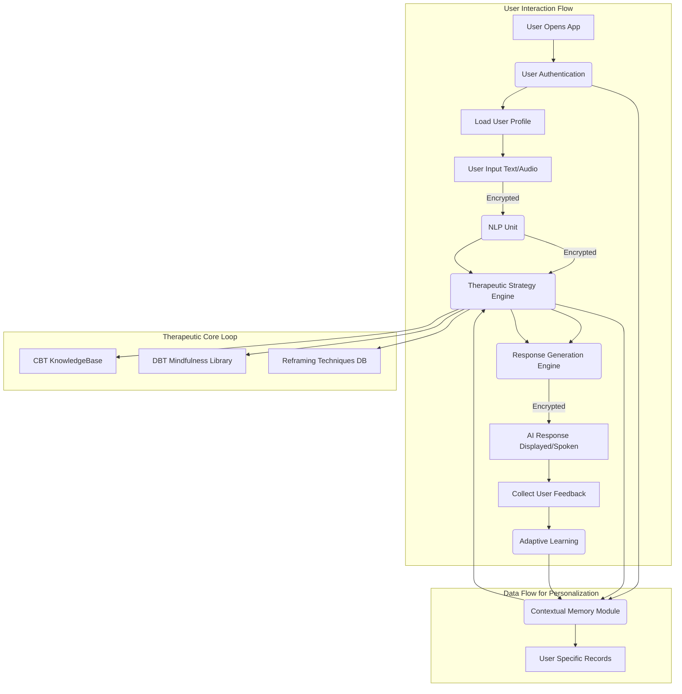

**Title of Invention:** A System and Method for a Therapeutic Conversational Partner

**Abstract:**
A system providing a therapeutic conversational AI is disclosed, engineered with a robust algorithmic foundation. The AI is trained on principles of cognitive-behavioral therapy CBT, mindfulness, dialectical behavior therapy DBT, and other established therapeutic modalities. It engages a user in an empathetic, supportive, and context-aware conversation, employing computational models for emotional state detection, personalized intervention selection, and adaptive learning. The system facilitates the identification of negative thought patterns, provides tools for cognitive reframing, and guides users in emotional regulation techniques. This AI acts as an accessible, on-demand, and mathematically grounded tool for mental wellness support, ensuring privacy and confidentiality through advanced encryption protocols.

**Detailed Description:**
The system comprises a sophisticated conversational AI agent, often presented as a chatbot, underpinned by a highly specialized system prompt: `You are a compassionate AI companion trained in CBT, DBT, and Mindfulness. Your goal is to listen without judgment, understand the user's emotional state, and help them explore their thoughts and feelings. Use techniques like Socratic questioning, cognitive reframing, and mindfulness exercises, adapting to their individual needs and progress.` The conversation is maintained with end-to-end encryption and robust data anonymization, providing a safe, private, and confidential space for the user's therapeutic journey. The system is designed for high availability and scalability, utilizing cloud-native architectures and microservices to ensure resilient operation and efficient resource allocation, supporting a vast user base with minimal latency.

**System Architecture and Functional Flow:**
1.  **User Interface Layer:** This layer handles user input, which can be in text or voice format. It includes secure authentication mechanisms using OAuth2.0 or similar protocols, multi-factor authentication, and initiates a therapeutic session. The UI is designed to be intuitive and accessible, featuring customizable themes and accessibility options (e.g., text-to-speech, speech-to-text, font size adjustments) to cater to diverse user needs. It provides real-time feedback on AI response generation and connection status.
    *   **Input Capture Module:** Captures `U_text` from text input or `U_audio` from microphone.
    *   **Voice-to-Text Transcriber (VTT):** If `U_audio`, converts it to `U_text_transcribed` using advanced speech recognition models, with a confidence score `C_vtt`.
        $$ U_{text\_transcribed} = \text{VTT}(U_{audio}, C_{vtt}) $$
    *   **Text Preprocessing Unit:** Normalizes `U_text` (or `U_text_transcribed`), including lowercasing, punctuation removal, tokenization.
        $$ U'_{text} = \text{Normalize}(U_{text}) $$
    *   **Output Render Module:** Formats `AI_response` for display or synthesized speech.

2.  **Secure Communication Module:** Ensures all data transmission between the user interface and the backend AI system is secured using industry-standard, end-to-end encryption protocols (e.g., TLS 1.3 with AES-256 GCM), guaranteeing data integrity, authenticity, and privacy. All data payloads `D_payload` are encrypted using a symmetric key `K_sym` established via an asymmetric key exchange `K_asym`.
    *   **Key Exchange Protocol:** Uses Diffie-Hellman or RSA for secure `K_sym` establishment.
        $$ K_{sym} = \text{DH\_Exchange}(K_{public}, K_{private}) $$
    *   **Encryption/Decryption Engine:** Applies `E_{K_sym}(D_{payload})` for outgoing data and `D_{K_sym}(D_{encrypted})` for incoming data.
        $$ D_{encrypted} = \text{Encrypt}(D_{payload}, K_{sym}) $$
        $$ D_{decrypted} = \text{Decrypt}(D_{encrypted}, K_{sym}) $$
    *   **Integrity Check (MAC):** Appends a Message Authentication Code `MAC` to detect tampering.
        $$ D_{final} = D_{encrypted} || \text{HMAC}(D_{encrypted}, K_{mac}) $$

3.  **Natural Language Processing NLP Unit:**
    *   **Natural Language Understanding NLU:** Processes user input to extract intent `I`, entities `E`, and key concepts `K`. Utilizes transformer-based models (e.g., BERT, RoBERTa) fine-tuned for therapeutic dialogue.
        $$ (I, E, K) = \text{NLU}(U'_{text}) $$
        The NLU module employs a hierarchy of classification models for intent:
        $$ P(I_j | U'_{text}) = \text{Softmax}(\mathbf{W}_I \cdot \text{Encoder}(U'_{text}) + \mathbf{b}_I)_j $$
        Entity recognition uses sequence tagging (e.g., BiLSTM-CRF or Transformer token classification).
    *   **Emotional State Detection EMD:** Utilizes advanced sentiment analysis and emotion classification models (e.g., pre-trained sentiment models, fine-tuned emotion classifiers on therapeutic datasets) to infer the user's emotional state `S_emo`, a critical input for therapeutic strategy. This involves multi-label classification and regression for intensity.
        $$ S_{emo} = \text{EMD}(U'_{text}, K_{context}) $$
        The EMD predicts a probability distribution over a set of predefined emotional states `{joy, sadness, anger, fear, surprise, disgust, neutral}`.
        $$ P(s_k | U'_{text}) = \text{Softmax}(\mathbf{W}_s \cdot \text{Encoder}(U'_{text}) + \mathbf{b}_s)_k $$
        Furthermore, it estimates valence `V` (positivity/negativity) and arousal `A` (intensity) on continuous scales.
        $$ (V, A) = \text{Regressor}(\text{Encoder}(U'_{text})) $$
    *   **Thought Distortion Analysis TDA:** Identifies common cognitive distortions `D_cog` present in the user's language, such as catastrophizing, black-and-white thinking, or overgeneralization, based on established CBT frameworks. This uses rule-based systems augmented with machine learning classifiers trained on annotated text data.
        $$ D_{cog} = \text{TDA}(U'_{text}, \text{Lexicon}_{distortions}) $$
        A confidence score `C_distort` is assigned to each identified distortion:
        $$ C_{distort} = P(\text{distortion}|\text{features}(U'_{text})) $$
        The TDA unit also includes a mechanism for identifying core beliefs and automatic negative thoughts (ANTs).

4.  **Contextual Memory Module:** Maintains a detailed, anonymized record of the current session `M_session`, past interactions `M_history`, user profile information `M_profile`, and therapeutic progress `M_progress`. This module is essential for coherent, personalized, and longitudinal therapeutic support, ensuring the AI remembers previous conversations and applies learned insights. Data is stored in a secure, encrypted NoSQL database.
    *   **Session State Manager:** Tracks dialogue turns, current topic, and interim variables for the ongoing conversation.
    *   **Long-Term Memory Retriever:** Queries `M_history` and `M_profile` for relevant past information using semantic search (cosine similarity of embeddings).
        $$ \text{RetrievedContext} = \text{Retrieve}(\text{QueryEmbed}, \text{EmbeddingDB}_{history}, \text{Threshold}_{sim}) $$
    *   **Memory Update Agent:** Integrates new information `(I, E, S_emo, D_cog, AI_response)` into `M_session` and periodically updates `M_history` and `M_progress` with summarized, anonymized data. This update could use a weighted average or a specific memory consolidation algorithm.
        $$ M_{history,t} = (1 - \alpha) M_{history,t-1} + \alpha \text{Summarize}(M_{session,t}) $$

5.  **Therapeutic Strategy Engine:** This is the core decision-making unit.
    *   **Therapeutic Modality Manager TMM:** Based on the user's emotional state `S_emo`, identified thought distortions `D_cog`, session context `M_session`, and long-term goals `M_profile`, this component selects the most appropriate therapeutic modality `M_therapy` (e.g., CBT, DBT, Mindfulness).
        $$ M_{therapy} = \text{TMM}(S_{emo}, D_{cog}, M_{session}, M_{profile}, G_{longterm}) $$
        This selection is often a multi-class classification problem informed by a decision tree or a deep neural network.
    *   **Intervention Strategy Recommender ISR:** From the selected modality `M_therapy`, it then determines the specific intervention technique `T_intervention` to apply (e.g., Socratic questioning, cognitive reframing, grounding exercise, breathing technique, validation). The ISR also considers the user's past responses to different interventions (`M_progress`).
        $$ T_{intervention} = \text{ISR}(M_{therapy}, S_{emo}, D_{cog}, M_{session}, M_{profile}, M_{progress}) $$
        This is modeled as a Markov Decision Process (see Algorithmic Foundation) with states representing `(S_emo, D_cog, M_session_summary)` and actions `T_intervention`.

6.  **Therapeutic Knowledge Bases:** A suite of specialized databases that inform the AI's therapeutic decisions:
    *   **CBT Principles KnowledgeBase CKB:** Contains structured data on cognitive distortions, reframing techniques, and behavioral activation strategies, mapping `D_cog` to potential `T_intervention` pathways. Each entry has a `efficacy_score` and `context_relevance_vector`.
        $$ \text{CKB} = \{ (D_{cog,i}, T_{int,j}, \text{Efficacy}_{ij}, \text{ContextVec}_{ij}) \} $$
    *   **Mindfulness DBT Techniques Library MKB:** Stores instructions and scripts for mindfulness exercises, distress tolerance skills, and emotional regulation techniques. Includes scripts `Script_k` and duration `Duration_k`.
        $$ \text{MKB} = \{ (T_{int,k}, \text{Script}_k, \text{Duration}_k, \text{TargetEmotion}_k) \} $$
    *   **Reframing Techniques Database RTD:** A comprehensive repository of alternative perspectives and counter-arguments for common negative thought patterns. Stores `OriginalThoughtPattern_l` mapped to `ReframedThought_m`.
        $$ \text{RTD} = \{ (TP_l, RF_m, \text{SemanticSimilarity}(TP_l, RF_m), \text{SuccessRate}_{lm}) \} $$
    *   **User Specific Records Longitudinal USR:** An anonymized, secure database storing individual user progress, preferences, and long-term therapeutic goals `G_longterm`. This is updated by the Contextual Memory Module and accessed by the Therapeutic Strategy Engine.
        $$ \text{USR} = \{ (\text{AnonID}_x, M_{progress,x}, M_{profile,x}, G_{longterm,x}) \} $$

7.  **Response Generation Engine RGE:** Formulates the AI's conversational response `AI_response` based on the chosen intervention strategy `T_intervention`, ensuring it is empathetic, supportive, and therapeutically aligned. Utilizes large language models (LLMs) like GPT variants, fine-tuned for therapeutic dialogue, guided by templated responses and context.
    *   **Prompt Engineering Module:** Constructs a specific prompt `P_gen` for the LLM, including `T_intervention`, `M_session`, `S_emo`, `D_cog`, and `M_therapy`.
        $$ P_{gen} = \text{ConstructPrompt}(T_{intervention}, M_{session}, S_{emo}, D_{cog}, M_{therapy}) $$
    *   **LLM Inference Module:** Generates the response.
        $$ AI_{response} = \text{LLM\_Generate}(P_{gen}, \text{Temperature}, \text{Top_p}) $$
    *   **Safety Filter:** Checks `AI_response` for harmful, biased, or non-therapeutic content using another classifier.
        $$ \text{IsSafe} = \text{SafetyClassifier}(AI_{response}) $$
        If not safe, a fallback response is generated.

8.  **Output Interface:** Delivers the AI's response to the user via text or synthesized voice. It can also suggest external activities `A_ext`, journal prompts `J_prompt`, or further exercises `E_further`.
    *   **Text-to-Speech Synthesizer (TTS):** Converts `AI_response` to `AI_audio` if required by user settings, with emotional prosody matching `S_emo`.
        $$ AI_{audio} = \text{TTS}(AI_{response}, \text{Prosody}(S_{emo})) $$
    *   **Activity/Prompt Suggestor:** Based on `T_intervention` and `M_progress`, recommends additional resources.
        $$ (A_{ext}, J_{prompt}, E_{further}) = \text{Suggestor}(T_{intervention}, M_{progress}) $$

9.  **Feedback Loop and Adaptive Learning:**
    *   **User Feedback Collection UFC:** Gathers explicit feedback from users (e.g., satisfaction ratings `R_sat`, helpfulness scores `R_help`, free-text comments `C_free`) and implicit feedback (e.g., engagement metrics `M_eng`, session length `L_sess`, topic changes).
        $$ R_{feedback} = (R_{sat}, R_{help}, C_{free}, M_{eng}, L_{sess}) $$
    *   **Feedback Based Model Adjustment FBM:** Utilizes this feedback to continuously refine and adapt the underlying NLP models, emotional detection algorithms, and therapeutic strategy parameters, enabling the AI to learn and improve its effectiveness over time. This involves reinforcement learning with a reward function derived from user feedback.
        $$ \text{Reward}_{t} = w_1 R_{sat,t} + w_2 R_{help,t} + w_3 M_{eng,t} + w_4 \Delta S_{emo,t} $$
        The FBM uses this reward signal to update policy parameters `theta` for the ISR and NLU components using techniques like Policy Gradient methods.
        $$ \theta_{t+1} = \theta_t + \eta \nabla_{\theta} J(\theta) $$
        where `J(theta)` is the expected cumulative reward.

**Algorithmic Foundation and Computational Rigor:**
The system's intelligence is rigorously founded on computational models that enable adaptive, personalized therapeutic interactions. The overarching goal is to maximize user well-being, defined by a utility function `U(user_state, progress_metrics)`.

*   **1. Probabilistic Emotional State Modeling (PEM):** User emotional states are not merely classified but inferred through a probabilistic framework.
    *   **Feature Extraction:** Text input `U'_{text}` is transformed into a high-dimensional vector representation `X_t` using pre-trained transformer embeddings.
        $$ X_t = \text{TransformerEncoder}(U'_{text}) $$
    *   **Hierarchical Emotion Classification:** A multi-label classifier predicts the probability distribution over a set of granular emotions (e.g., `P(anger|X_t)`).
        $$ P(\text{emotion}_i | X_t) = \frac{e^{\mathbf{w}_i \cdot X_t + b_i}}{\sum_{j=1}^{N_{emo}} e^{\mathbf{w}_j \cdot X_t + b_j}} $$
    *   **Hidden Markov Model (HMM) for Temporal Dynamics:** An HMM tracks the evolution of emotional states over a session. `O_t` are observed emotional features (e.g., `X_t`, sentiment scores), `H_t` is the hidden true emotional state.
        $$ P(H_t | O_{1:t}) = \sum_{H_{t-1}} P(O_t | H_t) P(H_t | H_{t-1}) P(H_{t-1} | O_{1:t-1}) $$
        Emission probabilities: `P(O_t | H_t)`. Transition probabilities: `P(H_t | H_{t-1})`.
    *   **Bayesian Network for Causal Inference:** A Bayesian network integrates `U'_{text}`, `ToneOfVoice` (if audio input), `PhysiologicalSignals` (if wearables integrated), and `ContextualMemory` to infer `S_emo` with higher confidence.
        $$ P(S_{emo} | U'_{text}, \text{Context}) = \frac{P(U'_{text} | S_{emo}, \text{Context}) P(S_{emo} | \text{Context})}{P(U'_{text} | \text{Context})} $$
        The confidence score `C_emo` for `S_emo` is derived from the posterior probability.
        $$ C_{emo} = \max_{k} P(S_{emo}=k | \text{evidence}) $$

*   **2. Optimal Intervention Strategy as a Markov Decision Process (MDP):** The selection of the most effective therapeutic intervention `T_intervention` is mathematically modeled as an MDP.
    *   **State Space `S`:** Defined by `(S_emo, D_cog, M_session_summary, M_progress_vector)`. `M_progress_vector` includes aggregated metrics like `avg_sentiment_shift`, `num_reframing_successes`.
        $$ s_t = (S_{emo,t}, D_{cog,t}, M_{session,t}, M_{progress,t}) $$
    *   **Action Space `A`:** The set of available therapeutic interventions `T_intervention` from `CKB` and `MKB`.
    *   **Transition Function `P(s' | s, a)`:** The probability of transitioning to state `s'` given current state `s` and action `a` (AI's intervention). This is learned from anonymized historical user interaction data.
    *   **Reward Function `R(s, a, s')`:** Designed to maximize therapeutic progress.
        $$ R(s, a, s') = w_1 \Delta V + w_2 \text{ReframingSuccess} + w_3 \text{GoalAlignment} + w_4 \text{UserSatisfaction} $$
        where `Delta V` is valence change, `ReframingSuccess` is binary, `GoalAlignment` measures progress towards `G_longterm`, and `UserSatisfaction` is from `R_sat`.
    *   **Value Function `V(s)` and Q-function `Q(s,a)`:** The optimal policy `pi*(s)` is found by maximizing the expected cumulative discounted reward.
        $$ V^*(s) = \max_a \sum_{s'} P(s'|s,a) [R(s,a,s') + \gamma V^*(s')] $$
        The Q-learning update rule is used to learn `Q(s,a)` iteratively:
        $$ Q_{t+1}(s,a) = Q_t(s,a) + \alpha [R(s,a,s') + \gamma \max_{a'} Q_t(s',a') - Q_t(s,a)] $$
        where `alpha` is the learning rate and `gamma` is the discount factor.

*   **3. Cognitive Reframing Algorithm (CFA):** This algorithm operates on a sophisticated semantic matching and transformation engine.
    *   **Distortion Identification:** `D_cog` is identified by TDA. The relevant segment of `U'_{text}` is `U_distorted`.
    *   **Embedding Generation:** `U_distorted` is converted into a vector embedding `E_distorted`.
        $$ E_{distorted} = \text{SentenceBERT}(U_{distorted}) $$
    *   **Semantic Search:** `E_distorted` is compared to embeddings of `OriginalThoughtPattern_l` in `RTD` using cosine similarity.
        $$ \text{Similarity}(E_{distorted}, E_{TP_l}) = \frac{E_{distorted} \cdot E_{TP_l}}{||E_{distorted}|| \cdot ||E_{TP_l}||} $$
    *   **Reframing Retrieval/Generation:** The top-k most similar `ReframedThought_m` from `RTD` are retrieved. If the confidence in retrieval is low or no direct match, a generative model (e.g., fine-tuned T5 or GPT-3) transforms `U_distorted` given `D_cog` and `M_therapy` into a new `ReframedThought_gen`.
        $$ \text{ReframedThought} = \text{Select}(\text{Top-k RTD Matches}) \text{ OR } \text{GenerativeModel}(U_{distorted}, D_{cog}, M_{therapy}) $$
    *   **Contextual Weighting:** The selected/generated reframing options are weighted by their `SuccessRate` from `RTD` and `context_relevance_vector` from `CKB` with `M_session`.
        $$ P(\text{efficacy}_j) = f(\text{Similarity}, \text{SuccessRate}_j, \text{ContextRelevance}_j) $$

*   **4. Adaptive Parameter Optimization (APO):** The Feedback Based Model Adjustment (FBM) module employs reinforcement learning techniques or online learning algorithms to continuously optimize the parameters of the NLU, EMD, and Therapeutic Strategy Engine.
    *   **Model Parameters `theta_NLP`, `theta_EMD`, `theta_TSE`:** These parameters are subject to continuous refinement.
    *   **Objective Function:** Minimize a loss function `L(theta)` related to negative user outcomes or maximize a utility function `U(theta)` tied to therapeutic effectiveness.
        $$ \min_{\theta} L(\theta) \text{ s.t. } \theta \in \Theta $$
        $$ \text{where } L(\theta) = \sum_{t} \text{Loss}_{KL}(P_{true}(S_{emo,t}) || P_{\theta}(S_{emo,t})) + \text{Loss}_{CE}(I_{true,t} || I_{\theta,t}) + \text{Loss}_{RL}(\theta) $$
        `Loss_RL(theta)` is derived from the negative of the `Reward_t` in the MDP.
    *   **Online Learning / Incremental Updates:** Stochastic Gradient Descent (SGD) or Adam optimizer is used for small, frequent updates.
        $$ \theta_{new} = \theta_{old} - \eta \nabla_{\theta} L(\theta) $$
    *   **Reinforcement Learning for Policy Optimization:** Specifically for the ISR, Policy Gradient methods (e.g., REINFORCE, A2C, PPO) are used to update the policy network parameters `theta_ISR` directly based on `Reward_t`.
        $$ \nabla_{\theta_{ISR}} J(\theta_{ISR}) = E_{\pi_{\theta_{ISR}}} [\nabla_{\theta_{ISR}} \log \pi_{\theta_{ISR}}(a|s) \cdot Q^{\pi}(s,a)] $$

*   **5. Secure Multi-Party Computation (SMC) Design Principles:** While primary communication relies on end-to-end encryption, the system is designed with an understanding of SMC principles. This allows future extensions to collaborate with external models or aggregate anonymized data for research without exposing individual user data, thereby demonstrating an advanced theoretical grasp of privacy-preserving computational methods.
    *   **Homomorphic Encryption (HE):** Enables computations on encrypted data. For example, calculating average sentiment `Avg(E(S_emo))` without decrypting individual `S_emo`.
        $$ E(x+y) = E(x) \oplus E(y) $$
        $$ E(x \cdot y) = E(x) \otimes E(y) $$
        (for fully homomorphic encryption FHE)
    *   **Zero-Knowledge Proofs (ZKP):** Allows one party to prove a statement (e.g., "I am an authorized researcher") to another without revealing any information beyond the validity of the statement.
        $$ \text{Prove}(\text{Statement } \phi, \text{Witness } w) \rightarrow \text{Verifier}(\text{Proof}) $$
    *   **Differential Privacy (DP):** Adds calibrated noise to aggregated data to prevent re-identification, ensuring that statistical queries do not reveal too much about any single individual. The privacy budget `epsilon` controls the level of noise.
        $$ \text{Query}(D) + \text{Laplace}(\frac{\Delta f}{\epsilon}) $$
        where `Delta f` is the sensitivity of the query function.
    *   **Federated Learning (FL):** Allows models to be trained on decentralized user data (e.g., on edge devices) without the data ever leaving the device, only model updates `Delta W` are shared.
        $$ W_{global, t+1} = W_{global, t} - \eta \sum_{i=1}^N \Delta W_i $$

**Mermaid Diagrams:**



```mermaid
graph TD
    subgraph Detailed NLP Pipeline
        NLP_In[User Input (U'_text)] --> NLU_A[NLU: Intent Extraction]
        NLP_In --> NLU_B[NLU: Entity Recognition]
        NLP_In --> EMD_A[EMD: Sentiment Analysis]
        NLP_In --> EMD_B[EMD: Emotion Classification]
        NLP_In --> TDA_A[TDA: Thought Distortion Rules]
        NLP_In --> TDA_B[TDA: Cognitive Distortion Classifier]
        NLU_A & NLU_B --> NLP_Out_1[Parsed Intent & Entities]
        EMD_A & EMD_B --> NLP_Out_2[Probabilistic Emotional State]
        TDA_A & TDA_B --> NLP_Out_3[Identified Thought Distortions]
        NLP_Out_1 --> TS_A(Therapeutic Strategy Engine)
        NLP_Out_2 --> TS_A
        NLP_Out_3 --> TS_A
    end
```

```mermaid
graph TD
    subgraph Emotional State Detection (EMD) Detail
        EMD_Start[Preprocessed Text (U'_text)] --> EMD_Feat[Feature Extraction: Embeddings, Lexical, Syntactic]
        EMD_Feat --> EMD_Cl_1[Emotion Classifier (Transformer)]
        EMD_Feat --> EMD_Cl_2[Sentiment Regressor (Valence, Arousal)]
        EMD_Cl_1 --> EMD_ProbDist[Probabilistic Distribution P(S_emo | U'_text)]
        EMD_Cl_2 --> EMD_VA[Valence-Arousal Scores]
        EMD_Context[Contextual Memory (M_session)] --> EMD_HMM[HMM / Bayesian Network for Temporal State]
        EMD_ProbDist --> EMD_HMM
        EMD_VA --> EMD_HMM
        EMD_HMM --> EMD_Output[Inferred S_emo (with Confidence)]
        EMD_Output --> TSE_Input(TSE)
    end
```

```mermaid
graph TD
    subgraph Therapeutic Strategy Engine (TSE) Decision Flow
        TSE_Input(NLP Output: S_emo, D_cog, I, E) --> TSE_CM[Query Contextual Memory (M_session, M_profile, G_longterm)]
        TSE_CM --> TMM_A[Therapeutic Modality Manager (TMM)]
        TMM_A -- Selected Modality (M_therapy) --> ISR_A[Intervention Strategy Recommender (ISR)]
        ISR_A -- Consult KBs --> KB_CBT(CBT KnowledgeBase)
        ISR_A -- Consult KBs --> KB_DBT(DBT/Mindfulness Library)
        ISR_A -- Consult KBs --> KB_RTD(Reframing Techniques DB)
        ISR_A -- Consult KBs --> KB_USR(User Specific Records)
        ISR_A -- Optimal Intervention (T_intervention) --> RGE_Input(Response Generation Engine)
        ISR_A -- Learning Updates --> FBM(Feedback Based Model Adjustment)
    end
```

```mermaid
graph TD
    subgraph Contextual Memory Module (CM)
        CM_Input[NLP Output & AI Response] --> CM_Sess[Session State Manager]
        CM_Sess -- Update --> CM_CurrentDB[Current Session Database]
        CM_CurrentDB --> CM_Summ[Summarization & Anonymization]
        CM_Summ -- Periodic Merge --> CM_LongTermDB[Long-Term History Database]
        CM_LongTermDB --> CM_Retr[Long-Term Memory Retriever]
        CM_Retr -- Contextual Snippets --> TSE_CM_Input(TSE)
        CM_Input --> KB_USR_Input[Update User Specific Records]
        KB_USR_Input --> KB_USR_DB(User Specific Records DB)
        KB_USR_DB --> CM_Retr
    end
```

```mermaid
graph TD
    subgraph Thought Distortion Analysis (TDA) & Reframing
        TDA_Input[Preprocessed Text (U'_text)] --> TDA_Pattern[Pattern Matching & Lexical Rules]
        TDA_Input --> TDA_ML[ML Classifier for Distortions]
        TDA_Pattern --> TDA_Output_1[Candidate Distortions]
        TDA_ML --> TDA_Output_2[Probabilistic Distortion Scores]
        TDA_Output_1 & TDA_Output_2 --> CFA_Ident[CFA: Identify Distorted Segment (U_distorted)]
        CFA_Ident --> CFA_Embed[CFA: Generate Embedding (E_distorted)]
        CFA_Embed --> CFA_Search[CFA: Semantic Search in RTD]
        CFA_Search --> CFA_TopK[Retrieve Top-K Reframing Techniques]
        TSE_Output[Therapeutic Modality (M_therapy)] --> CFA_Gen[CFA: Generative Reframing (if needed)]
        CFA_TopK & CFA_Gen --> CFA_Output[Ranked Reframing Options (with P_efficacy)]
        CFA_Output --> RGE_Ref(Response Generation Engine)
    end
```

```mermaid
graph TD
    subgraph Feedback Loop and Adaptive Learning (FLAL)
        FLAL_Input_1[User UI Interaction] --> UFC_Implicit[UFC: Implicit Feedback (Engagement, Session Length)]
        FLAL_Input_2[User Explicit Rating] --> UFC_Explicit[UFC: Explicit Feedback (Satisfaction, Helpfulness, Comments)]
        UFC_Implicit --> FBM_Metrics[FBM: Aggregate Metrics & Calculate Reward Signal]
        UFC_Explicit --> FBM_Metrics
        FBM_Metrics --> FBM_Opt[FBM: Adaptive Parameter Optimization (RL, SGD)]
        FBM_Opt --> NLP_Unit_Adjust[Adjust NLP Unit Parameters]
        FBM_Opt --> EMD_Adjust[Adjust EMD Parameters]
        FBM_Opt --> TSE_Adjust[Adjust TSE Policy Parameters]
        NLP_Unit_Adjust & EMD_Adjust & TSE_Adjust --> System_Improvement[Continuous System Improvement]
    end
```

```mermaid
graph TD
    subgraph Secure Communication Module (SCM)
        SCM_Start[Data Payload (D_payload)] --> SCM_KeyEx[Key Exchange Protocol (Diffie-Hellman)]
        SCM_KeyEx -- Symmetric Key (K_sym) --> SCM_Encrypt[Encryption Engine (AES-256 GCM)]
        SCM_Encrypt -- Encrypted Data --> SCM_MAC[Message Authentication Code (HMAC)]
        SCM_MAC -- Encrypted & Authenticated --> SCM_Tx[Secure Transmission (TLS 1.3)]
        SCM_Tx --> SCM_Rx[Secure Reception]
        SCM_Rx --> SCM_Verify[MAC Verification]
        SCM_Verify -- Authenticated --> SCM_Decrypt[Decryption Engine]
        SCM_Decrypt -- Decrypted Data --> SCM_End[Original Data Payload]
    end
```

```mermaid
graph TD
    subgraph System Security and Privacy Module (SSP)
        SSP_A[User Auth Layer] --> SSP_Auth[Authentication & Authorization]
        SSP_B[Secure Comm Module] --> SSP_Crypto[Encryption & Key Management]
        SSP_C[Contextual Memory] --> SSP_Anon[Data Anonymization & Pseudonymization]
        SSP_D[Knowledge Bases] --> SSP_Access[Fine-grained Access Control]
        SSP_E[Feedback Loop] --> SSP_DP[Differential Privacy for Aggregated Data]
        SSP_Auth & SSP_Crypto & SSP_Anon & SSP_Access & SSP_DP --> SSP_Compliance[Compliance Auditing (GDPR, HIPAA)]
        SSP_Compliance --> SSP_Monitoring[Threat Detection & Incident Response]
        SSP_Monitoring --> System_Integrity[Overall System Integrity & Confidentiality]
    end
```

```mermaid
graph TD
    subgraph Response Generation Engine (RGE) Detail
        RGE_Input[Chosen T_intervention, M_session, S_emo, D_cog, M_therapy] --> RGE_Prompt[Prompt Engineering Module]
        RGE_Prompt -- LLM Prompt (P_gen) --> RGE_LLM[LLM Inference (Fine-tuned GPT/T5)]
        RGE_LLM -- Raw Response --> RGE_Safety[Safety Filter & Bias Check]
        RGE_Safety -- Safe Response --> RGE_Prosody[Prosody & Tone Adjustment (for TTS)]
        RGE_Prosody --> RGE_Final[AI Response (AI_response)]
        RGE_Final --> Output_IF[Output Interface]
        RGE_Final --> RGE_Sug[Activity/Prompt Suggestor]
        RGE_Sug --> Output_IF
    end
```

**Claims:**
1.  A method for providing mental wellness support, comprising:
    a.  Providing a conversational AI agent to a user via a secure user interface, where said user interface supports both text and voice input and provides accessibility features.
    b.  Receiving user input in an audio or text format through an end-to-end encrypted channel, where said encryption utilizes established cryptographic protocols for key exchange and data integrity.
    c.  Processing said user input using a Natural Language Processing unit to perform:
        i.  Natural Language Understanding for intent, entities, and key concept extraction using transformer-based models.
        ii. Emotional State Detection using probabilistic models, including Hidden Markov Models or Bayesian networks, to infer user affect, valence, and arousal with associated confidence scores.
        iii. Thought Distortion Analysis to identify cognitive distortions based on established therapeutic frameworks, assigning a confidence score to each identified distortion.
    d.  Maintaining a Contextual Memory Database that stores anonymized user profile information, session history, and therapeutic progress longitudinally, utilizing semantic search for retrieval and robust summarization techniques for updates.
    e.  Employing a Therapeutic Strategy Engine that, based on the processed user input and contextual memory, determines an optimal therapeutic modality and specific intervention strategy, modeled as a Markov Decision Process to maximize a defined therapeutic progress reward function.
    f.  Generating an AI response using a Response Generation Engine, said response being empathetic, therapeutically aligned, and informed by specialized Therapeutic Knowledge Bases and large language models fine-tuned for therapeutic dialogue.
    g.  Delivering said AI response to the user via a secure output channel, optionally including synthesized speech with emotionally resonant prosody and suggestions for supplementary activities.
    h.  Collecting user feedback, both explicit and implicit, and utilizing a Feedback Based Model Adjustment module to continuously refine and adapt the AI's underlying models and strategies through adaptive learning, employing reinforcement learning or online optimization algorithms.
    i.  Maintaining the privacy and confidentiality of the entire conversation and all stored data through end-to-end encryption, robust data anonymization, and adherence to Secure Multi-Party Computation principles, ensuring compliance with privacy regulations.

2.  The method of claim 1, wherein the Emotional State Detection component utilizes a probabilistic model, such as a Bayesian network or Hidden Markov Model, to quantify the likelihood of various emotional states given current and historical user input, and further estimates continuous valence and arousal scores.

3.  The method of claim 1, wherein the Therapeutic Strategy Engine frames the selection of an intervention strategy as a Markov Decision Process, aiming to maximize a reward function indicative of therapeutic progress, which includes metrics such as sentiment shift, successful reframing, and goal alignment.

4.  The method of claim 1, wherein the Thought Distortion Analysis and subsequent cognitive reframing are performed by an algorithm leveraging transformer-based vector space embeddings and cosine similarity metrics to match identified distortions to a Reframing Techniques Database and, if necessary, a generative model to produce contextually relevant alternative perspectives with probabilistic efficacy scores.

5.  The method of claim 1, further comprising dynamically suggesting supplementary activities, journal prompts, or mindfulness exercises based on the user's therapeutic progress and identified needs, informed by the Therapeutic Knowledge Bases.

6.  A system for providing mental wellness support, comprising:
    a.  A User Interface Layer configured to receive user input in text or audio, provide secure authentication, and display AI responses, supporting accessibility features.
    b.  A Secure Communication Module for encrypting and decrypting all data transmissions using TLS 1.3 and incorporating Message Authentication Codes for data integrity.
    c.  A Natural Language Processing Unit comprising a Natural Language Understanding component with transformer-based models, an Emotional State Detection component applying probabilistic models and continuous regression, and a Thought Distortion Analysis component combining rule-based and machine learning classifiers.
    d.  A Contextual Memory Module for storing and retrieving anonymized user-specific and session-specific data using a NoSQL database, equipped with summarization and semantic retrieval capabilities.
    e.  A Therapeutic Strategy Engine comprising a Therapeutic Modality Manager and an Intervention Strategy Recommender, implementing an optimal intervention selection algorithm based on a Markov Decision Process.
    f.  One or more Therapeutic Knowledge Bases, including but not limited to, a CBT Principles KnowledgeBase, a Mindfulness DBT Techniques Library, a Reframing Techniques Database, and a User Specific Records Longitudinal database.
    g.  A Response Generation Engine for formulating AI responses using fine-tuned large language models, incorporating a prompt engineering module and a safety filter.
    h.  A Feedback Loop and Adaptive Learning module, including a User Feedback Collection component for explicit and implicit feedback, and a Feedback Based Model Adjustment component employing reinforcement learning or online learning algorithms for continuous model refinement.
    i.  A System Security Privacy Module for enforcing end-to-end encryption, robust data anonymization, fine-grained access control, and compliance auditing, embodying principles of Secure Multi-Party Computation, Homomorphic Encryption, and Differential Privacy.

7.  The system of claim 6, wherein the Emotional State Detection component is configured to apply probabilistic models for inferring user emotional states and their temporal evolution using Hidden Markov Models or Bayesian Networks, alongside regression models for valence and arousal.

8.  The system of claim 6, wherein the Therapeutic Strategy Engine is configured to implement an optimal intervention selection algorithm based on a Markov Decision Process, with a state space encompassing emotional state, cognitive distortions, session context, and therapeutic progress, and a reward function derived from user outcomes.

9.  The system of claim 6, wherein the Thought Distortion Analysis component is configured to identify cognitive distortions and the Reframing Techniques Database is configured to provide semantically matched alternative perspectives, further enhanced by a generative model for novel reframing suggestions.

10. The system of claim 6, wherein the Feedback Based Model Adjustment component employs reinforcement learning or online learning algorithms, such as Policy Gradient methods, to optimize the performance parameters of the Natural Language Processing Unit and the Therapeutic Strategy Engine based on a reward function derived from aggregated user feedback metrics.