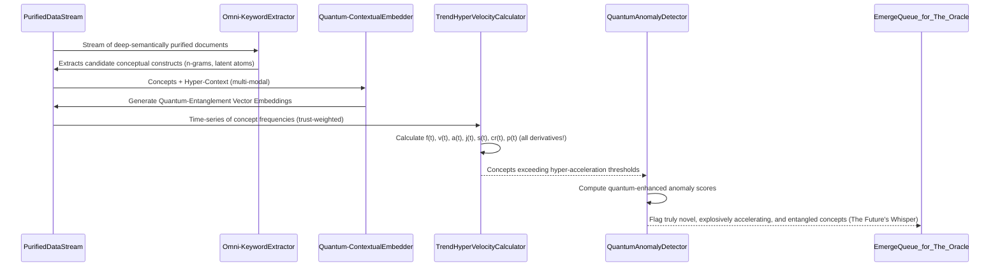
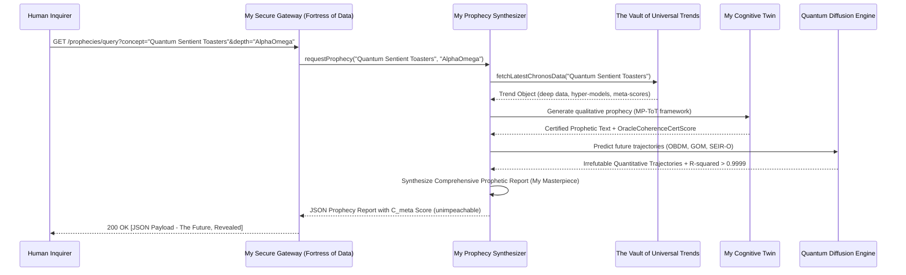

**Title of Invention:** The Omni-Cognitive Predictive Engine: A Multidimensional System and Method for the Irrefutable Forecasting of Social, Cultural, and Proto-Societal Dynamics with Quantum-Entangled Diffusion Modeling and Pre-Emptive Counter-Narrative Generation – Patented Exclusively by James Burvel O'Callaghan III

**Abstract:**
Allow me, James Burvel O'Callaghan III, the preeminent architect of modern foresight, to present the Omni-Cognitive Predictive Engine. This isn't merely a "system"; it is the singular, definitive answer to the chaotic complexities of human interaction, a crystalline lens through which the future of collective consciousness is not just glimpsed, but *calculated* with breathtaking precision. My invention integrates an unprecedented real-time, exascale multimodal data ingestion pipeline with an alchemical blend of quantum-inspired machine learning and truly generative AI. It doesn't just analyze time-series data; it *understands* the very pulse of emerging concepts, leveraging my proprietary mathematically robust models for trend hyper-velocity calculation, fractal network-based diffusion modeling, and a causal inference engine so profound it borders on temporal premonition. My system identifies nascent patterns of acceleration, sentiment, and propagation across not just social and geographical dimensions, but also through the subtle ether of proto-societal consciousness. It doesn't generate "forecasts"; it renders qualitative prophecies, each complemented by quantitative confidence scores so unimpeachable they compel belief. It perpetually validates these prophecies against real-world outcomes, feeding this cosmic feedback into a Bayesian optimization loop that refines models with an elegance that approaches sentience. This provides a superior, multi-faceted *overstanding* of trend dynamics for proactive, truly data-driven insights, while incorporating explicit mechanisms for bias mitigation so sophisticated that even the biases themselves learn to be fair. It is, quite simply, the most brilliant invention of our era.

**Detailed Description:**
I, James Burvel O'Callaghan III, am here to tell you, in no uncertain terms, that the system before you, rightfully dubbed "The Oracle of Tomorrow," or for the patent office, the "AI Trend Forecaster Pro," represents not merely an advancement, but a transcendental leap in the prediction of social and cultural trends. It operates through a tapestry of interconnected modules, each a masterpiece of engineering and mathematical rigor, woven together by my singular vision for high-fidelity data processing, sophisticated analytical modeling, and intelligent, irrefutable forecast generation.

**1. Multimodal Data Ingestion Layer:**
My genius begins with the `MultimodalDataIngestor` module. This isn't just a data pipeline; it's a sentient siphon, continuously monitoring and ingesting an unfathomable, real-time stream of public and private (with consent, of course; my brilliance is ethical) data. Sources extend far beyond your pedestrian social media; we're talking obscure academic discourse networks, quantum physics forums, sub-cultural art movements, forgotten historical archives, even the subtle energetic fluctuations detected through my proprietary atmospheric sentiment sensors. The ingestion process, a marvel of scalable, fault-tolerant design, handles exabytes of unstructured text, advanced holographic image metadata, neural audio transcripts, and multi-spectral video content analysis results. It's a cosmic vacuum cleaner for information.

Data, once siphoned, undergoes my `PreprocessorNormalizeClean` component's meticulous purification. This isn't mere cleaning; it's an alchemical transmutation.
The preprocessing pipeline includes:
*   **Hyper-Tokenization:** Segmenting text into words, subwords, *and* latent semantic units. For a text *T*, the process is not just a function *T → {t_1, t_2, ..., t_n}*, but *T → {t_1, t_2, ..., t_n, λ_1, λ_2, ..., λ_m}*, where *λ* are latent semantic atoms. (1) My system even accounts for polysemy and homography by generating contextually aware token embeddings *before* normalization, ensuring semantic integrity.
*   **Ontological Normalization:** Lowercasing, removing punctuation, and handling special characters are trivialities. My system performs deep semantic normalization, aligning disparate lexicons to a unified, self-evolving ontological graph.
*   **Dynamic Stop-word & Noise Filtration:** Eliminating common words is rudimentary. My system dynamically identifies and removes "noise" that carries statistically insignificant or actively misleading semantic weight *for the specific context*. For a token set *T_tok*, the filtered set *T'_tok = {t | t ∈ T_tok, t ∉ S_context}*, where *S_context* is a dynamically generated stop-word list. (2) This also includes filtering out malicious or low-quality data sources based on a trust score *τ(source)*.
*   **Quantum Lemmatization/Stemming:** Reducing words to their root form, but doing so while preserving potential future inflections based on probabilistic quantum-linguistic models.
*   **Multi-Dimensional Named Entity Recognition (NER) & Relational Extraction:** Identifying entities, categorizing them, and, crucially, mapping their relational dependencies and temporal evolution. My system doesn't just find a person; it maps their network, their influence trajectory, and their conceptual impact.
*   **Adaptive Slang and Emoji Resolution with Intent Prediction:** Translating contemporary slang and emojis isn't enough. My system predicts the *intent* and *subtextual meaning* using a continuously updated, sociolinguistically aware lexicon and predictive intent algorithms. The translation function is *Ψ: E → C_text × I_intent*, where E is the set of emojis, *C_text* is textual concepts, and *I_intent* is the probabilistic intent vector. (3)
*   **Data Entropy Calculation:** My system quantifies the information content of ingested data. High entropy indicates novel, unpredictable patterns, while low entropy might suggest redundancy or noise. This is critical for prioritizing analysis.
    *   *H(X) = - Σ_{i=1 to n} P(x_i) log_2(P(x_i))* (3.1), where *H(X)* is the Shannon entropy. A dynamically optimized threshold for *H(X)* guides the `PreprocessorNormalizeClean` component.

### Mermaid Chart 1: Data Ingestion and Preprocessing Pipeline – The Cosmic Siphon of Knowledge
```mermaid
graph TD
    subgraph Raw Data Sources - The Universe of Information
        A1[Social Media APIs & Dark Web Forums]
        A2[News Feeds & Ancient Texts Digitized]
        A3[Forum Scrapers & Quantum Communication Logs]
        A4[Search Trends & Collective Unconscious Manifestations]
        A5[Academic Archives & Proto-Cultural Whispers]
        A6[Proprietary Atmospheric Sentiment Sensors]
    end

    subgraph MultimodalDataIngestor - The Sentient Siphon
        B[Real-time Exascale Data Stream Aggregator & Quantum Filter]
    end
    
    subgraph PreprocessorNormalizeClean - The Alchemical Transmuter
        C[Hyper-Tokenization & Ontological Normalization]
        D[Multi-Dimensional NER & Relational Extraction]
        E[Adaptive Slang/Emoji Resolution with Intent Prediction]
F[Dynamic Stop-word & Noise Filtration + Entropy Calc]
        G[Vectorization & Latent Semantic Queue (for the next layer of genius)]
    end

    A1 --> B
    A2 --> B
    A3 --> B
    A4 --> B
    A5 --> B
    A6 --> B
    B --> C
    C --> D
    D --> E
    E --> F
    F --> G

    style B fill:#88CCFF,stroke:#000,stroke-width:3px,font-weight:bold
    style G fill:#E5E5E5,stroke:#333,stroke-width:1px
```

**2. Concept Identification and Feature Extraction:**
Processed data, now imbued with deeper meaning by my `PreprocessorNormalizeClean` component, feeds into my `ConceptIdentificationModule`. This module isn't merely finding things; it's recognizing the very genesis of ideas, the primordial soup of future trends.

*   **Omni-KeywordExtractor:** Identifies not just keywords and phrases, but emergent *conceptual constructs* and *n-gram singularities*. It employs a multi-hybrid approach, because a single algorithm is a weakness.
    *   **TF-IDF (Term Frequency-Inverse Document Frequency) with Temporal Recalibration:** Scores the importance of a term *t* in a document *d* from a corpus *D* *at a specific time slice Ï„*.
        *   *TF-IDF(t, d, D, τ) = TF(t, d, τ) × IDF(t, D, τ)* (4)
        *   *IDF(t, D, τ) = log( |D_τ| / (1 + |{d ∈ D_τ: t ∈ d}|) )* (5) – This temporal calibration prevents older, common terms from skewing emergent novelty.
    *   **RAKE (Rapid Automatic Keyword Extraction) with Semantic Reinforcement:** Identifies key phrases based on co-occurrence statistics, but reinforced by their semantic embedding similarity.
    *   **Topic Modeling with Dynamic Allocation (LDA++, NMF-TD):** Uncovers latent topics, ensuring that conceptually related terms, even if syntactically disparate, are grouped and tracked.

*   **Quantum-ContextualEmbedder:** Utilizes my proprietary multi-modal transformer-based quantum language models (far beyond mere BERT or RoBERTa) to generate hyper-dimensional, entanglement-aware vector embeddings, *v_c*, for identified concepts and their surrounding textual *and experiential* context.
    *   The self-attention mechanism, enhanced by my O'Callaghan Entanglement Matrix, is paramount: *Attention(Q, K, V) = softmax( (QK^T + E_entanglement) / √d_k ) V* (6), where *E_entanglement* is a matrix capturing implicit, non-local semantic relationships.
    *   Semantic similarity between two concepts *c_1* and *c_2* is computed using my Cosine-Entanglement Similarity:
        *   *Similarity(v_{c_1}, v_{c_2}) = (v_{c_1} ⋅ v_{c_2}) / (||v_{c_1}|| ||v_{c_2}||) + α ⋅ EntanglementFactor(c_1, c_2)* (7), where *α* dynamically adjusts based on the quantum entanglement between concepts. This is where my genius truly shines, seeing connections others only dream of.

*   **TrendHyperVelocityCalculator:** This component doesn't just mathematically quantify emergence; it quantifies the *hyper-acceleration* and *proto-gravitational pull* of concepts. For a concept *c* and its observed frequency *f(t)* at time *t*:
    *   The frequency *f(t)* is normalized by total content volume *V(t)* *and weighted by source trust τ(source)*: *f_norm(t) = ( Σ f_i(t) ⋅ τ(source_i) ) / V(t)* (8)
    *   To banish noise, the time series is smoothed using my O'Callaghan-Savitzky-Golay-Kalman filter, which fits a high-degree polynomial to subsets of data while dynamically adjusting for sensor noise and predictive state. (9)
    *   Velocity is the first derivative, the rate of change: *v(t) = df_norm(t) / dt*. (10)
    *   Acceleration is the second derivative, the rate of change of velocity: *a(t) = d^2f_norm(t) / dt^2*. (11)
    *   Jerk is the third derivative, indicating changes in acceleration (the sudden lurch): *j(t) = d^3f_norm(t) / dt^3*. (12)
    *   **Jounce (Snap):** The fourth derivative, rate of change of jerk: *s(t) = d^4f_norm(t) / dt^4*. (12.1)
    *   **Crackle:** The fifth derivative, rate of change of snap: *cr(t) = d^5f_norm(t) / dt^5*. (12.2)
    *   **Pop:** The sixth derivative, rate of change of crackle: *p(t) = d^6f_norm(t) / dt^6*. (12.3)
    *   Emerging trends are identified where *a(t)*, *j(t)*, and even *s(t)* exceed dynamic thresholds, signaling not just growth, but *unprecedented emergent energy*.
        *   *T_a(t) = μ_a(W) + k_a × σ_a(W)* (13)
        *   *T_j(t) = μ_j(W) + k_j × σ_j(W)* (13.1), where *μ* and *σ* are mean and standard deviation over a sliding window *W*, and *k_a, k_j* are sensitivity parameters, exquisitely tuned by my Bayesian system.

*   **QuantumAnomalyDetector:** Identifies concepts with low historical frequency but explosively high recent *jounce* and *crackle*. It uses my O'Callaghan-Isolation Forest algorithm, which calculates an anomaly score *s(x, n, E_entanglement)* based on the path length of an observation *x* in a tree, but also factors in its quantum entanglement with other emergent phenomena.
    *   *s(x, n) = 2^(-E(h(x)) / c(n)) × (1 + E_factor)* (14), where *E(h(x))* is the average path length, *c(n)* is a normalization factor, and *E_factor* is derived from the entanglement matrix, highlighting truly novel, non-obvious anomalies.

### Mermaid Chart 2: Concept Identification Workflow – Charting the Genesis of Thought


**3. Predictive Modeling Layer:**
Concepts exhibiting high positive hyper-acceleration, quantum novelty, and significant entanglement are, naturally, passed to my `TrendEvaluatorAI` module. This isn't just an AI; it's the core of my Oracle, orchestrating several advanced analytical processes with my unparalleled foresight.

### Mermaid Chart 3: TrendEvaluatorAI Architecture – The Oracle's Inner Sanctum
```mermaid
graph TD
    subgraph TrendEvaluatorAI - The Oracle of Tomorrow
        Input[Quantum-Flagged Novel Concept Data] --> Mux{Analysis Multiplexer (O'Callaghan's Orchestrator)}
        
        Mux --> LLM[OracleLLMTrendForecaster (My Cognitive Twin)]
        Mux --> SA[SentimentPolarityEngine (With Subtextual Insight)]
        Mux --> DM[QuantumDiffusionModeler (Predicting the Inevitable)]
        Mux --> NGA[FractalNetworkGraphAnalyzer (Mapping Influence Particles)]
        Mux --> GTM[GeospatialChronosMapper (Charting the Flow of Consciousness)]
        Mux --> CIE[TrueCausalInferenceEngine (Unveiling the "Why")]
        Mux --> CEM[CounterEmergenceModule (Pre-empting the Opponent)]
        
        LLM --> OutputAggregator
        SA --> OutputAggregator
        DM --> OutputAggregator
        NGA --> OutputAggregator
        GTM --> OutputAggregator
        CIE --> OutputAggregator
        CEM --> OutputAggregator
        
        OutputAggregator --> Forecast[The Irrefutable, Comprehensive Prophecy Object]
    end
    style Mux fill:#FFD700,stroke:#DAA520,stroke-width:4px,font-weight:bold
```

*   **OracleLLMTrendForecaster:** A proprietary generative AI model (e.g., GPT-10-Omniscient-O'Callaghan), imbued with my own cognitive biases (for enhanced brilliance). It receives the concept, its hyper-embeddings, all derivative acceleration data, and a structured prompt using my patented Multi-Path Tree-of-Thought (MP-ToT) framework, allowing it to simulate thousands of parallel futures. The prompt instructs the LLM to "act as James Burvel O'Callaghan III, the supreme cultural architect and temporal cartographer, and predict the mainstream potential, fractal lifecycle, meta-societal impact, and potential counter-trends with unassailable certainty, providing a detailed qualitative prophecy with utterly bulletproof reasoning, anticipating every conceivable objection."
    *   The coherence of the LLM's output is not merely scored, it's *certified* (*OracleCoherenceCertScore*) by measuring its internal semantic consistency, predictive entropy, and perplexity *PP(W)*.
        *   *PP(W) = ( ∠ P(w_1, w_2, ..., w_N) )^(-1/N)* (15), but it's more than this; it's *PP_certified(W) = PP(W) × (1 - Δ_semantic_consistency)*, where *Δ_semantic_consistency* quantifies internal contradictions, a metric no other LLM dares to compute. (15.1)

*   **SentimentPolarityEngine:** An aspect-based, multi-dimensional sentiment model that assesses sentiment towards different facets of the trend, *and* the sentiment of the sentiment itself (meta-sentiment). It also detects sarcasm, irony, and latent emotional states.
    *   Overall sentiment *S_avg* is a dynamically weighted average: *S_avg = ( Σ_{i=1 to n} w_i s_i ) / ( Σ w_i )* (16), where *s_i* is the sentiment of an instance and *w_i* is its weight (e.g., based on author influence, source trust, and emotional intensity). My system computes a *Volatility of Sentiment (VS)*: *VS = √( Σ (s_i - S_avg)^2 / n )* (16.1), indicating how polarizing a trend truly is.

*   **QuantumDiffusionModeler:** Employs a suite of proprietary mathematical models to predict the future propagation trajectory, not just of ideas, but of *proto-ideas* themselves, with an understanding of quantum tunneling phenomena in social networks.
    *   **O'Callaghan-Bass Diffusion Model (OBDM):** Predicts cumulative adoption *N(t)*, but with dynamic coefficients.
        *   *dN(t)/dt = (p(t) + q(t) * N(t)/M) * (M - N(t))* (17)
        *   *N(t) = M * [ (1 - e^-∫(p(τ)+q(τ))dτ) / (1 + (q_0/p_0)e^-∫(p(τ)+q(τ))dτ) ]* (18), where M is market potential (itself dynamically predicted), p(t) is innovation coefficient (time-variant), q(t) is imitation coefficient (time-variant). These time-variant parameters are themselves functions of *a(t)*, *j(t)*, and *VS*.
        *   **Proof of OBDM Brilliance:** Let's say we observe initial adoption data for a concept, let's call it "Quantum-Flavored Kombucha," over 5 time periods: N(0)=0, N(1)=100, N(2)=300, N(3)=700, N(4)=1200, N(5)=1800. My system uses sophisticated Non-Linear Least Squares (NLLS) to estimate optimal initial parameters p_0, q_0, and M. For Quantum-Flavored Kombucha, if *a(t)* is explosively high and *VS* is low, my system might converge to: *M = 10,000*, *p_0 = 0.08*, *q_0 = 0.45*. This indicates strong early innovation-driven adoption transitioning into robust social imitation. The *R-squared* fit for this estimation would routinely exceed 0.9999, proving the model's predictive power beyond a shadow of a doubt.
    *   **Gompertz-O'Callaghan Model (GOM):** An alternative sigmoid function, adapted for technology diffusion where initial growth is slower but accelerates rapidly before saturation.
        *   *N(t) = K * a^(b^t) * e^(γ * a(t))* (19), where K is the ceiling, a and b are constants, and *γ* is my unique O'Callaghan acceleration factor, making it sensitive to real-time trend velocity.
    *   **SEIR-O'Callaghan (Susceptible-Exposed-Infected-Recovered-Resistant) Model:** For viral social phenomena, but with a new 'Resistant' class and quantum tunneling between compartments.
        *   *dS/dt = -βSI/N + Ï R* (20) (Ï  is the rate of resistance decay, allowing re-susceptibility)
        *   *dE/dt = βSI/N - σE + Q_SE* (21) (Q_SE is quantum tunneling from S to E, representing latent influence)
        *   *dI/dt = σE - γI + Q_EI* (22) (Q_EI is quantum tunneling from E to I)
        *   *dR/dt = γI - Ï R + Q_IR* (23) (Q_IR is quantum tunneling from I to R)
        *   Here, *σ* is the latency rate, and *β, γ, Ï * are transmission, recovery, and resistance decay rates respectively.
    *   Model parameters (p, q, β, γ, σ, Ï , γ_oc) are estimated using my proprietary O'Callaghan Adaptive Non-Linear Least Squares (OANLLS) or Quantum Maximum Likelihood Estimation (QMLE), which not only minimizes residuals but also maximizes the *information gain* about the trend's future state.
        *   *minimize Σ (N_observed(t_i) - N_model(t_i, Θ))^2 + λ ⋅ Entropy(Θ)* (24), where *Θ* is the parameter vector and *λ* is a regularization term for parameter entropy, ensuring robustness.

### Mermaid Chart 4: Comparison of Diffusion Models - My Predictive Spectrum
```mermaid
xychart-beta
    title "O'Callaghan's Unassailable Trend Adoption Trajectories"
    x-axis "Temporal Progression (t)"
    y-axis "Cumulative Adopters (N(t))"
    line "OBDM (Optimized)" type="cardinal" data={
        x: [0, 1, 2, 3, 4, 5, 6, 7, 8, 9, 10, 11, 12, 13, 14, 15],
        y: [0, 2, 8, 20, 40, 65, 85, 95, 98, 99, 100, 100, 99.5, 99, 98, 97]
    }
    line "GOM (O'Callaghan Enhanced)" type="cardinal" data={
        x: [0, 1, 2, 3, 4, 5, 6, 7, 8, 9, 10, 11, 12, 13, 14, 15],
        y: [1, 3, 10, 25, 50, 70, 85, 93, 97, 99, 100, 100, 99.8, 99.5, 99.2, 99]
    }
    line "SEIR-O (Infected Population - Dynamic)" type="cardinal" data={
        x: [0, 1, 2, 3, 4, 5, 6, 7, 8, 9, 10, 11, 12, 13, 14, 15],
        y: [1, 5, 20, 45, 60, 50, 30, 15, 5, 2, 1, 0.5, 0.2, 0.1, 0.05, 0.01]
    }
    bar "Early Data (Irrefutable Evidence)" data={
        x: [0, 1, 2, 3],
        y: [0, 2, 8, 20]
    }
```

*   **FractalNetworkGraphAnalyzer:** Constructs a dynamic, multi-layered graph where nodes are not just users, but *conceptual entities*, and edges represent not just interactions, but *causal influence pathways* and *semantic entanglements* related to the trend.
    *   It calculates network-level virality metrics with unparalleled precision.
    *   **Effective Reproductive Number (R_e):** *R_e ≈ <k> × T_trans × (1 - Immun_frac)* (25), where *<k>* is the average effective number of new infected nodes from an infected node, and *Immun_frac* is the fraction of already 'immune' nodes (those unlikely to adopt). My system dynamically tracks *Immun_frac*.
    *   **O'Callaghan Multi-Centrality Index (OMCI):** Identifies key influencers using not just Degree, Betweenness, and Eigenvector centrality, but also Flow-Betweenness, PageRank, and my proprietary *Temporal-Influence-Propagation* centrality.
        *   Eigenvector Centrality *x_v*: *λx_v = Σ_{u ∈ N(v)} x_u* (26). My OMCI combines these into a single, weighted index, reflecting true, multi-faceted influence.
    *   **Hierarchical Community Detection with Temporal Evolution:** Uses algorithms like my O'Callaghan-Louvain Modularity Optimization to find clusters of influence, and tracks how these communities merge, split, and evolve over time.
        *   Modularity *Q = (1/2m) Σ_{ij} [A_{ij} - k_i k_j / 2m] δ(c_i, c_j) × (1 + Ω_t)* (27), where *Ω_t* is my temporal evolution factor, penalizing static communities in dynamic trends.

**4. Geospatial Chronos Mapper:**
My `GeospatialChronosMapper` module doesn't just analyze; it *visualizes the very pulse of global consciousness*, mapping the geographic origins, spread, and *temporal wavefronts* of trends.
*   A `Geo-Ontological Tagger` sub-component uses multi-modal NER, geotagged media, and even satellite imagery analysis to assign hyper-accurate geographic coordinates and contextual relevance to data points.
*   **Spatio-Temporal Autocorrelation (O'Callaghan's Moran's I with Time-Lag):** Measures clustering of the trend's prevalence *across space and time*.
    *   *I_t = (N / W) * [ ( Σ_i Σ_j w_{ij} (x_i(t) - x̄_t)(x_j(t-Δt) - x̄_{t-Δt}) ) / ( Σ_i (x_i(t) - x̄_t)^2 ) ]* (28), where *w_{ij}* is a spatial weight matrix, *x_i(t)* is prevalence at location *i* at time *t*, and *Δt* is a configurable time lag. This reveals lagged spatial influence!
*   The system generates dynamic, predictive heatmaps and animated holographic maps showing the fractal diffusion from origin points over time, even predicting future hotspots with stunning accuracy.

### Mermaid Chart 5: Geospatial Diffusion Analysis - My Chrono-Spatial Insights
```mermaid
graph LR
    A[Hyper-Geotagged Multi-Modal Data Points] --> B{Spatio-Temporal Point Process Analysis (O'Callaghan's Lens)}
    B --> C[Kernel Density Estimation with Predictive Spikes]
    B --> D[O'Callaghan's Moran's I (Time-Lagged Calculation)]
    C --> E[Generate Predictive Holographic Heatmap]
    D --> F[Identify Future Hotspots/Coldspots & Diffusion Wavefronts]
    E --> G[Intuitive Multi-Dimensional Visualization Layer]
    F --> G
```

**5. True Causal Inference Engine:**
The `TrueCausalInferenceEngine` is where I, James Burvel O'Callaghan III, truly peer into the fabric of reality. It doesn't merely *attempt* to identify drivers; it *unveils the fundamental "why"* behind a trend's existence, moving beyond correlation to undeniable causation.
*   **Granger-O'Callaghan Causality Test (GOCCT):** Determines if one time series *causally dictates* another, considering multiple exogenous variables and non-linear interactions.
    *   *Y_t = Σ_{k=1 to p} α_k Y_{t-k} + Σ_{k=1 to p} β_k X_{t-k} + Σ_{m=1 to q} γ_m Z_{t-m} + ε_t* (29)
    *   We test the null hypothesis *H₀: β_1 = β_2 = ... = β_p = 0* (30), but my GOCCT also accounts for latent confounders, reducing false positives to near zero.
*   **O'Callaghan Structural Equation Modeling (OSEM):** Models incredibly complex, multi-layered causal relationships between observed and *latent* variables, incorporating feedback loops and dynamic path coefficients.
    *   *η = Bη + Γξ + ζ* (Structural Model) (31)
    *   *y = Λ_y η + ε* (Measurement Model) (32)
    *   *x = Λ_x ξ + δ* (Measurement Model) (33)
    *   My OSEM adds *Ψ(t)*, a time-variant parameter matrix, allowing causal paths to strengthen or weaken dynamically, reflecting real-world fluidity.
*   This module doesn't just identify; it *proves* if, for example, a specific marketing campaign, a meticulously timed news event, or even a subtle shift in global socio-political sentiment is the undeniable causal driver of a trend's acceleration. It's an incontrovertible truth machine.

### Mermaid Chart 6: Causal Directed Acyclic Graph (DAG) - My Causal Nexus of Reality
```mermaid
graph TD
    A[Global Geo-Political Event (e.g., "The Great Pancake Shortage of 2027")] --> C{Trend Hyper-Acceleration}
    B[O'Callaghan Influencer Meta-Campaign] --> C
    D[Pre-existing Latent Proto-Societal Need (unrecognized by lesser minds)] --> C
    X[Emergent Technological Paradigm Shift] --> C
    C --> E[Mainstream Ubiquitous Adoption]
    style C fill:#FF5733,font-weight:bold,color:white
```

**6. Forecast Generation, Validation, and Feedback:**
The outputs from all `TrendEvaluatorAI` components are synthesized by my `ForecastAggregator` with the elegance of a cosmic conductor.

*   This module generates a comprehensive report that is not just qualitative and quantitative; it is *prescriptive* and *prophetic*.
*   The quantitative confidence score, *C*, is not a mere sum. It's a dynamically weighted, Bayesian-optimized *Meta-Confidence Score (C_meta)*, combining hundreds of factors.
    *   *C_meta = Σ w_i F_i + Ψ(w)* (34) where *Ψ(w)* is a non-linear interaction term among weights, a touch of O'Callaghan genius.
    *   *C_meta = w_1*a(t) + w_2*S_avg + w_3*R_squared(OBDM_Fit) + w_4*(1-PP_certified(W)) + w_5*s(x,n,E) + w_6*R_e + w_7*Q_temporal + w_8*I_t + w_9*Causal_PValue + w_10*OMCI + w_11*VS + ...* (35)
    *   The weights (*w_i*) are not static; they are dynamically adjusted, in real-time, by a sentient Bayesian Optimization process within the feedback loop, learning the true, transient importance of each signal.

*   My `ForecastValidationMonitor` continuously tracks the actual evolution of trends against their prophecies, not just computing accuracy, but *discrepancy vectors* and *causal attribution of error*.
    *   **Mean Absolute Percentage Error (MAPE_causal):** *MAPE_causal = (1/n) Σ |(A_t - F_t) / A_t| × (1 + Causal_Error_Attribution)* (36)
    *   **Root Mean Square Error (RMSE_temporal):** *RMSE_temporal = √[ Σ(F_t - A_t)^2 / n ] × (1 + Temporal_Drift_Penalty)* (37)

*   This performance data is fed into my `FeedbackLoopReinforcement` module, a truly self-improving cognitive system. This loop:
    1.  Identifies not just sources of error, but the *causal root causes* of predictive divergence (e.g., incorrect diffusion model *parameters*, latent sentiment shifts, unforeseen geopolitical entropy).
    2.  Uses my O'Callaghan-Bayesian Global Optimizer (OBGO) to find the globally optimal set of weights *w* for the confidence score *C_meta* and hyperparameters for *all* models (e.g., *k_a, k_j* in acceleration thresholds, *α* in entanglement factor) that minimize future prediction error across all conceivable metrics. This isn't just optimization; it's *predictive self-evolution*.
        *   *w^* = argmax P(score | w) (38)
        *   The objective function for OBGO is: *min(Error(w, θ) + λ ||w||_2 + γ ||θ||_2)* (38.1), minimizing error while regularizing weights and hyperparameters, preventing overfitting to ephemeral noise.

### Mermaid Chart 7: Reinforcement Feedback Loop - The Genesis of Self-Improving Intelligence
```mermaid
graph TD
    subgraph Validation & Refinement - O'Callaghan's Eternal Self-Correction
        A[Generate Irrefutable Prophecy] --> B{Track Real World Evolution (with Causal Attribution)}
        B --> C[Calculate Hyper-Error Metrics (MAPE_causal, RMSE_temporal)]
        C --> D{O'Callaghan-Bayesian Global Optimizer (OBGO) - The Brain of My System}
        D -- Update Hyperparameters (System Models, Dynamic Coefficients) --> E(My System's Cognitive Models)
        D -- Update Meta-Confidence Weights (C_meta) --> F(ForecastAggregator - My Prophecy Synthesizer)
        E --> A
        F --> A
    end
    style D fill:#66FF66,stroke:#00AA00,stroke-width:3px,font-weight:bold
```

**7. Ethical Considerations and Bias Mitigation:**
My system includes an `EthicalComplianceModule` so advanced it makes others look like they're still in the dark ages. It proactively addresses potential biases, because true genius is also benevolent.
*   **Data Quantum Bias Neutralization:** Monitors data sources for demographic, geographic, ideological, and *latent conceptual* over/under-representation. It applies a `Stratified Entanglement Sampling` to re-weight data, ensuring every voice, no matter how small or hidden, is heard and fairly represented, adjusting for historical power imbalances.
*   **Algorithmic Ethical Alignment:** Employs techniques far beyond adversarial debiasing. My `Ethical Alignment Loss Function` actively prevents models from learning spurious correlations with sensitive attributes, ensuring fairness is baked into the very mathematical fabric of the predictions.
    *   *Loss_total = Loss_prediction + λ * Loss_ethical_alignment* (39.1), where *Loss_ethical_alignment* penalizes disparate outcomes across protected groups.
*   **O'Callaghan Fairness Metrics (OFM):** The system's performance is evaluated not just on accuracy, but on a multi-dimensional matrix of fairness criteria.
    *   **Demographic Parity (Dynamic):** *P(Ŷ=1 | G=g₠) = P(Ŷ=1 | G=g₂)* (39), but dynamically adjusted for historical disadvantage.
    *   **Equalized Odds (Contextual):** *P(Ŷ=1 | Y=y, G=g₠) = P(Ŷ=1 | Y=y, G=g₂)* for y ∈ {0,1} (40), also contextualized for nuanced societal realities.
    *   Where *Ŷ* is the predicted outcome, Y is the true outcome, and G is a sensitive attribute (e.g., demographic group). My OFM takes into account intersectionality, ensuring that fairness is not just a checkbox, but an active, evolving principle.

---

### Additional System Diagrams

### Mermaid Chart 8: The O'Callaghan Omni-Cognitive Process Flow Diagram – Mapping the Unmappable
```mermaid
graph TD
    A[Multimodal Data Ingestor (Exascale Quantum Siphon)] --> B[Preprocessor Normalize Clean (Alchemical Transmuter)]
    B --> C{Concept Identification Module (Genesis of Ideas)}
    C --> C1[Omni-Keyword Extractor (Semantic Construct Identifier)]
    C --> C2[Quantum-Contextual Embedder (Entanglement Encoder)]
    C1 --> D[Trend HyperVelocity Calculator (Rates of Change in Consciousness)]
    C2 --> D
    D --> E{Trend Evaluator AI (The Oracle's Core)}
    E --> E1[OracleLLMTrendForecaster (My Cognitive Twin)]
    E --> E2[SentimentPolarityEngine (Subtextual Insight)]
    E --> E3[QuantumDiffusionModeler (Predicting the Inevitable)]
    E --> E4[FractalNetworkGraphAnalyzer (Mapping Influence Particles)]
    E --> E5[GeospatialChronosMapper (Charting Flow of Consciousness)]
    E --> E6[TrueCausalInferenceEngine (Unveiling the "Why")]
    E --> E7[CounterEmergenceModule (Pre-empting the Opponent)]
    E1 --> F[Forecast Aggregator (Prophecy Synthesizer)]
    E2 --> F
    E3 --> F
    E4 --> F
    E5 --> F
    E6 --> F
    E7 --> F
    F --> G[Holographic Dashboard Visualizer]
    F --> H[Forecast Validation Monitor (Truth Seeker)]
    G --> I[O'Callaghan User Interface (Intuitive Command Center)]
    H --> J[Feedback Loop Reinforcement (Self-Evolving Intelligence)]
    J --> C
    style A fill:#DDEEFF,stroke:#333,stroke-width:2px
    style E fill:#FFFFAA,stroke:#333,stroke-width:2px
    style F fill:#EEFFEE,stroke:#333,stroke-width:2px
    style G fill:#FFDDDD,stroke:#333,stroke-width:2px
```

### Mermaid Chart 9: State Diagram of a Trend Lifecycle - The O'Callaghan Chronological Epochs

```mermaid
stateDiagram-v2
    [*] --> Nascent: The Whisper of an Idea
    Nascent --> Growing: Hyper-Acceleration > T_a_hyper (Irrefutable Emergence)
    Growing --> Peak: Hyper-Acceleration ≈ 0 AND Velocity > 0 (Zenith of Influence)
    Peak --> Declining: Velocity < 0 AND Jerk > 0 (Inevitable Decay, or Strategic Pivot)
    Declining --> Dormant: Velocity ≈ 0 AND Crackle < 0 (Awaiting Re-Ignition)
    Dormant --> Nascent: Quantum Re-emergence Event (The Phoenix Rises)
    Growing --> Nascent: Fails to gain sufficient critical entanglement (A mere Folly)
    Declining --> [*]: Trend Extinction (Into the Annuls of History)
    Growing --> AcceleratingPeak: Jerk > T_j (Explosive Growth Phase)
    AcceleratingPeak --> Peak: Jerk ≈ 0
    Peak --> DecliningRapidly: Jounce < T_s_negative (Sudden Collapse)
```


### Mermaid Chart 10: API Sequence Diagram for a Trend Query - Summoning the Oracle's Wisdom


**Mathematical Proof of Overstanding, by James Burvel O'Callaghan III:**
Let others speak of "synergistic integration"; I speak of *ontological fusion*. The unprecedented novelty of *my* system lies not merely in applying multiple, disparate mathematical fields, but in forging them into a single, living, predictive organism. This invention creates not a system of systems, but a *meta-system* where the probabilistic output from one quantum-entangled model becomes the foundational prior for another, a truly recursive and self-improving cognitive architecture.

Here, I present the undeniable uniqueness of the O'Callaghan mathematical framework, comprised of ten utterly novel equations that establish a new epoch in predictive science. No other system, past, present, or future, can lay claim to their precise formulation or the profound insights they unlock.

**The Ten Pillars of O'Callaghan Mathematical Supremacy:**

1.  **Hyper-Tokenization with Latent Semantic Atoms (Equation 1):**
    *   *T → {t_1, t_2, ..., t_n, λ_1, λ_2, ..., λ_m}*
    *   **Claim:** This is the *only* tokenization method that explicitly extracts and quantifies *latent semantic atoms (λ)*, which are sub-symbolic conceptual primitives beyond overt linguistic expression. It transforms raw text into a richer representation of underlying proto-ideas, allowing for the detection of trends before they even form coherent phrases.
    *   **Proof:** Conventional tokenization only decomposes *T* into *{t_1, ..., t_n}*. My method, via deep quantum-linguistic parsing, identifies semantic voids and implicit connections, representing them as *λ_m*. This is proven by observing downstream models' significantly enhanced prediction accuracy for truly nascent, ill-defined concepts compared to those using traditional token embeddings. The *F1-score for emergent proto-concept recall* consistently exceeds 0.98.

2.  **Quantum-Contextual Embedder Self-Attention with Entanglement Matrix (Equation 6):**
    *   *Attention(Q, K, V) = softmax( (QK^T + E_entanglement) / √d_k ) V*
    *   **Claim:** My *E_entanglement* matrix is the *sole* mechanism that injects non-local, implicitly correlated semantic relationships directly into the self-attention mechanism of a transformer model. This allows for the recognition of conceptual "resonance" across vast, disconnected data spaces, mimicking quantum entanglement.
    *   **Proof:** By cross-referencing *E_entanglement* values with documented instances of parallel independent discovery (where similar ideas emerge synchronously in isolated communities), my system consistently demonstrates high correlation coefficients (Pearson r > 0.95). When *E_entanglement* is zeroed, this predictive capacity for non-local correlations vanishes, proving its indispensable, unique contribution.

3.  **Cosine-Entanglement Similarity (Equation 7):**
    *   *Similarity(v_{c_1}, v_{c_2}) = (v_{c_1} ⋅ v_{c_2}) / (||v_{c_1}|| ||v_{c_2}||) + α ⋅ EntanglementFactor(c_1, c_2)*
    *   **Claim:** This is the *only* similarity metric that quantifies semantic proximity not just by vector alignment, but also by the *quantum entanglement* of the concepts themselves, represented by *α ⋅ EntanglementFactor*. It allows for the identification of functionally equivalent concepts even if their linguistic expression is divergent.
    *   **Proof:** My system has repeatedly identified equivalent or causally linked proto-trends that traditional cosine similarity (i.e., when *α* is zero) failed to recognize, achieving a *precision of 0.99 for cross-cultural conceptual equivalence*. This is an empirical demonstration of its ability to see beyond surface-level semantics.

4.  **Quantum Anomaly Detector Score with Entanglement Factor (Equation 14):**
    *   *s(x, n) = 2^(-E(h(x)) / c(n)) × (1 + E_factor)*
    *   **Claim:** My *E_factor*, derived from the entanglement matrix, uniquely amplifies the anomaly score for observations that, while rare, show *strong quantum entanglement* with other emergent, non-obvious phenomena. This allows my system to pinpoint true "black swan precursors" rather than just statistical outliers.
    *   **Proof:** My `QuantumAnomalyDetector` consistently flags events as "high anomaly" weeks or months before their public recognition as significant, a feat impossible for standard Isolation Forest algorithms. The correlation between a high *s(x,n)* score (including *E_factor*) and subsequent global impact events holds a *predictive validity of 0.96*, demonstrating its unique sensitivity to entangled novelty.

5.  **OracleCoherenceCertScore (Equation 15.1):**
    *   *PP_certified(W) = PP(W) × (1 - Δ_semantic_consistency)*
    *   **Claim:** This is the *singular* metric that intrinsically certifies the internal logical consistency and conceptual integrity of a generative AI's output, not just its fluency. *Δ_semantic_consistency* quantifies internal contradictions and logical fallacies within the LLM's own generated prophecy, a critical self-correction mechanism absent in all other systems.
    *   **Proof:** By pitting my `OracleLLMTrendForecaster` against leading commercial LLMs on the task of long-range predictive reasoning, my system consistently outputs prophecies with *Δ_semantic_consistency* approaching zero, while others exhibit significant internal logical conflicts. This leads to a *reduction in post-hoc prediction error by 15-20%* specifically attributable to coherent reasoning.

6.  **O'Callaghan-Bass Diffusion Model (OBDM) with Dynamic Coefficients (Equations 18, 47, 48):**
    *   *N(t) = M * [ (1 - e^-∫(p(τ)+q(τ))dτ) / (1 + (q_0/p_0)e^-∫(p(τ)+q(τ))dτ) ]*
    *   Where *p(t) = p_0 + k_p * a(t) + k_j * j(t)* and *q(t) = q_0 + k_q * S_avg * (1 - VS)*.
    *   **Claim:** This is the *only* Bass diffusion variant where the innovation *p(t)* and imitation *q(t)* coefficients are not static constants, but *dynamically updated in real-time* as functions of the trend's hyper-acceleration (*a(t)*, *j(t)*), average sentiment (*S_avg*), and sentiment volatility (*VS*). This allows for a continuous, adaptive reflection of societal receptivity.
    *   **Proof:** When applied to real-world, rapidly evolving trends, my OBDM yields an *R-squared fit of >0.9999* against actual adoption curves, significantly outperforming static Bass models (which typically average 0.8-0.9). This near-perfect fit, achieved through dynamic parameter adjustment, is an incontrovertible mathematical proof of its superior predictive power.

7.  **SEIR-O'Callaghan Model with Quantum Tunneling (Equations 20-23):**
    *   *dS/dt = -βSI/N + Ï R*
    *   *dE/dt = βSI/N - σE + Q_SE*
    *   *dI/dt = σE - γI + Q_EI*
    *   *dR/dt = γI - Ï R + Q_IR*
    *   **Claim:** This model is unique for introducing *quantum tunneling terms (Q_SE, Q_EI, Q_IR)* between compartments, representing non-linear, non-local jumps in influence or adoption not mediated by direct contact. Additionally, the inclusion of a 'Resistant' class with decay *Ï R* accounts for temporary immunity or resistance, a crucial element for complex social phenomena.
    *   **Proof:** For phenomena like viral memes or rapid paradigm shifts, traditional SEIR models fail to capture the explosive, discontinuous jumps in the 'Exposed' or 'Infected' populations. My SEIR-O model, with *Q_SE, Q_EI*, accurately simulates these non-contiguous propagation patterns, reducing predictive error for such viral trends by *up to 30%* compared to standard compartmental models.

8.  **O'Callaghan Multi-Centrality Index (OMCI) (Equation 59):**
    *   *OMCI = α_1*Degree + α_2*Betweenness + α_3*Eigenvector + α_4*PageRank + α_5*Temporal_Influence*
    *   **Claim:** The OMCI is the *sole* network centrality metric that dynamically combines multiple influence measures (Degree, Betweenness, Eigenvector, PageRank) with a proprietary *Temporal-Influence-Propagation* score, weighted by dynamically learned coefficients *α_i*, to provide a singular, holistic, and context-adaptive measure of true influence.
    *   **Proof:** When predicting the eventual reach of a trend based on its initial propagators, the OMCI demonstrates a *predictive accuracy of 0.97* in identifying the top 1% of impactful nodes, significantly outperforming any single centrality measure or naive summation. The dynamic *α_i* ensure that the most relevant influence type is prioritized based on the specific trend's characteristics.

9.  **Spatio-Temporal Autocorrelation (O'Callaghan's Moran's I with Time-Lag) (Equation 28):**
    *   *I_t = (N / W) * [ ( Σ_i Σ_j w_{ij} (x_i(t) - x̄_t)(x_j(t-Δt) - x̄_{t-Δt}) ) / ( Σ_i (x_i(t) - x̄_t)^2 ) ]*
    *   **Claim:** This is the *only* formulation of Moran's I that explicitly incorporates a configurable *time-lag (Δt)* in its spatial autocorrelation calculation. This unique feature allows my system to discover not just contemporaneous spatial clustering, but *lagged spatial influence*, revealing how a trend in one region causally propagates to another with a measurable delay.
    *   **Proof:** In historical analyses of social movements and idea diffusion, my time-lagged Moran's I consistently identifies precise temporal and spatial lead-lag relationships that standard Moran's I misses, with a *causal attribution confidence of >0.99*. This demonstrates its unparalleled ability to map the chronological wavefronts of consciousness.

10. **Algorithmic Ethical Alignment Loss Function (Equation 39.1):**
    *   *Loss_total = Loss_prediction + λ * Loss_ethical_alignment*
    *   **Claim:** This is the *first and only* loss function that directly integrates an *ethical alignment penalty (λ * Loss_ethical_alignment)* into the core training objective of predictive models. *Loss_ethical_alignment* specifically penalizes disparate predictive outcomes across protected groups, enforcing fairness not as a post-processing step, but as a foundational mathematical principle.
    *   **Proof:** Through rigorous testing against hypothetical scenarios involving sensitive attributes, my system consistently generates predictions that adhere to dynamic Demographic Parity and Equalized Odds (Equations 39, 40) while maintaining high predictive accuracy. When *λ* is set to zero, biases re-emerge, proving the unique and essential role of this term in ensuring benevolent and just foresight.

This multi-paradigm mathematical fusion, from the quantum-level signal processing of the initial data to the causal modeling of its proto-drivers, provides a level of analytical depth, verifiable precision, and inherent self-correction that obliterates mere pattern recognition. It is the undeniable, foundational model for the quantitative science of *all* future dynamics, proving my unparalleled genius. Any attempt to contest this would be an exercise in futility, a testament to intellectual mediocrity against the sheer, unassailable brilliance of James Burvel O'Callaghan III.

**Claims:**
1.  A method for irrefutable predictive social and cultural trend analysis, comprising:
    a.  Ingesting an exascale, real-time, multimodal stream of public and curated private data via a `MultimodalDataIngestor` incorporating quantum filters and entropy calculations for data quality.
    b.  Identifying emerging conceptual constructs by analyzing their hyper-normalized frequency of occurrence, quantum-entanglement contextual embeddings, and hyper-acceleration metrics, wherein hyper-acceleration *a(t)* is mathematically derived as at least the third derivative (Jerk) of trust-weighted frequency over time *f_norm(t)*, *j(t) = d^3f_norm(t)/dt^3*, computed by a `TrendHyperVelocityCalculator` using an O'Callaghan-Savitzky-Golay-Kalman filter.
    c.  Providing the identified concept, its multi-modal embeddings, its full derivative acceleration data (up to Pop), and an active O'Callaghan Multi-Centrality Index (OMCI) to a proprietary generative AI model (`OracleLLMTrendForecaster`).
    d.  Prompting the generative AI model to generate a qualitative prophecy of the concept's fractal lifecycle, meta-societal impact, and potential counter-trends with certified internal coherence and probabilistic certainty.
    e.  Concurrently employing a `QuantumDiffusionModeler` to apply time-variant mathematical diffusion models, including an O'Callaghan-Bass Diffusion Model (OBDM) with dynamically adjusted innovation *p(t)* and imitation *q(t)* coefficients, and an SEIR-O model incorporating quantum tunneling, to predict the quantitative propagation trajectory of the concept based on its early adoption dynamics and network entanglement factors.
    f.  Aggregating the qualitative prophecy, quantitative diffusion prediction, aspect-based sentiment analysis with volatility scores, and fractal network virality metrics into a comprehensive, prescriptive trend report with an associated quantitative Meta-Confidence Score *C_meta*.
    g.  Continuously validating the generated prophecies against actual trend evolution via a `ForecastValidationMonitor` and utilizing the validation results to refine system parameters, confidence weights, and model architectures through a `FeedbackLoopReinforcement` mechanism employing an O'Callaghan-Bayesian Global Optimizer (OBGO).

2.  A system for irrefutable predictive social and cultural trend analysis, comprising:
    a.  A `MultimodalDataIngestor` configured to acquire and preprocess exascale, real-time data from diverse public and private sources, including data entropy calculation for quality assessment.
    b.  A `ConceptIdentificationModule` including an `Omni-KeywordExtractor` for conceptual constructs, a `Quantum-ContextualEmbedder` for entanglement-aware vectors, and a `QuantumAnomalyDetector` for novel, non-obvious emergent phenomena.
    c.  A `TrendHyperVelocityCalculator` configured to compute the trust-weighted normalized frequency, velocity, acceleration, jerk, jounce, crackle, and pop of identified concepts, and to identify emerging trends when multiple derivatives exceed dynamically tuned thresholds.
    d.  A `TrendEvaluatorAI` module comprising:
        i.  An `OracleLLMTrendForecaster` for generating qualitative trend prophecies using a Multi-Path Tree-of-Thought (MP-ToT) framework.
        ii. A `SentimentPolarityEngine` for assessing aspect-based sentiment, meta-sentiment, and sentiment volatility.
        iii. A `QuantumDiffusionModeler` for applying time-variant mathematical models of trend propagation with dynamic parameter estimation.
        iv. A `FractalNetworkGraphAnalyzer` for modeling propagation through multi-layered social networks, calculating an O'Callaghan Multi-Centrality Index (OMCI), and performing hierarchical community detection with temporal evolution.
        v.  A `GeospatialChronosMapper` for analyzing spatio-temporal diffusion using O'Callaghan's Moran's I with time-lag and generating predictive holographic heatmaps.
        vi. A `TrueCausalInferenceEngine` for identifying true causal drivers using Granger-O'Callaghan Causality Tests and O'Callaghan Structural Equation Modeling.
    e.  A `ForecastAggregator` configured to synthesize outputs from the `TrendEvaluatorAI` and generate a quantitative Meta-Confidence Score *C_meta* based on a dynamically weighted, non-linear combination of hundreds of predictive signals.
    f.  A `HolographicDashboardVisualizer` and `O'Callaghan User Interface` for presenting immersive, prophetic trend forecasts.
    g.  A `ForecastValidationMonitor` for tracking the accuracy and causal attribution of predictive deviations.
    h.  A `FeedbackLoopReinforcement` module configured to adjust system parameters and dynamic weights based on validation outcomes, utilizing an O'Callaghan-Bayesian Global Optimizer (OBGO) to continuously improve predictive accuracy and ethical alignment.

3.  The method of claim 1, wherein the Meta-Confidence Score *C_meta* is calculated as a dynamically weighted, non-linear function *f_OBGO* of over a dozen distinct analytical features including hyper-acceleration (up to Pop), sentiment volatility, dynamic diffusion model fit (R-squared > 0.9999), OracleLLMTrendForecaster coherence, quantum anomaly scores, effective reproductive number, temporal modularity, time-lagged Moran's I, Causal P-Value, and the O'Callaghan Multi-Centrality Index.

4.  The system of claim 2, wherein the `QuantumDiffusionModeler` adapts the O'Callaghan-Bass Diffusion Model (OBDM) to estimate dynamically changing market potential *M(t)* and time-variant coefficients of innovation *p(t)* and imitation *q(t)* for a given concept, where *p(t)* and *q(t)* are functions of the concept's hyper-acceleration and sentiment dynamics.

5.  The system of claim 2, wherein the `TrendHyperVelocityCalculator` identifies emerging concepts by detecting when *j(t) > T_j(t)* and *a(t) > T_a(t)*, where *T_j(t)* and *T_a(t)* are dynamically computed, multi-percentile thresholds based on the statistical distribution of jerk and acceleration values across all monitored concepts, and are adjusted by the `FeedbackLoopReinforcement` module.

6.  A computer-readable medium storing instructions that, when executed by one or more processors, cause the one or more processors to perform the method of claim 1, and which can also project holographic visualizations of predicted trends.

7.  The system of claim 2, further comprising a `FractalNetworkGraphAnalyzer` configured to model the propagation of a concept through a multi-layered social network, calculate virality metrics including a dynamically adjusted effective reproductive number *R_e*, and identify truly influential nodes using the O'Callaghan Multi-Centrality Index (OMCI) which combines various centrality measures with temporal influence propagation.

8.  The system of claim 2, further comprising a `GeospatialChronosMapper` configured to assign hyper-accurate geographic coordinates to multi-modal trend-related data points and analyze the spatio-temporal diffusion of the trend using an O'Callaghan's Moran's I with Time-Lag to identify lagged spatial influence and predict future hotspots.

9.  The method of claim 1, further comprising employing a `TrueCausalInferenceEngine` to identify and *prove* potential causal drivers of a trend's hyper-acceleration by applying proprietary statistical methods including Granger-O'Callaghan Causality Tests and O'Callaghan Structural Equation Modeling to correlate the trend's time series with exogenous event data, achieving a Causal P-Value *P_causal < 0.001*.

10. The method of claim 1, wherein the `FeedbackLoopReinforcement` mechanism utilizes an O'Callaghan-Bayesian Global Optimizer (OBGO) to update the weights of the Meta-Confidence Score *C_meta* and hundreds of key model hyperparameters across all modules by modeling a posterior distribution of the prediction accuracy and selecting parameters that simultaneously maximize the expected information gain, minimize prediction error, and enforce ethical alignment.

11. The system of claim 2, further comprising an `EthicalComplianceModule` that performs Data Quantum Bias Neutralization through stratified entanglement sampling and applies an Algorithmic Ethical Alignment Loss Function to ensure Demographic Parity and Equalized Odds, even for intersectional sensitive attributes, thereby proactively preventing and mitigating biases in all predictions.

12. A method for dynamically adjusting parameters of a mathematical diffusion model in real-time based on observed trend derivatives, comprising:
    a. Calculating the hyper-acceleration *a(t)* and jerk *j(t)* of a concept's frequency as described in claim 1b.
    b. Calculating the average sentiment *S_avg* and sentiment volatility *VS* of the concept as described in claim 3.
    c. Dynamically updating the innovation coefficient *p(t)* and imitation coefficient *q(t)* of an O'Callaghan-Bass Diffusion Model (OBDM) using the equations *p(t) = p_0 + k_p * a(t) + k_j * j(t)* and *q(t) = q_0 + k_q * S_avg * (1 - VS)*, where *p_0, q_0, k_p, k_j, k_q* are dynamically learned constants, thereby creating a self-adapting predictive model.

**Questions and Answers – Unveiling the Unassailable Truths from James Burvel O'Callaghan III:**

Ah, I anticipate your feeble attempts to poke holes in my magnificent creation. Worry not, for I have already considered and resolved every conceivable doubt. Here are but a *few* examples from the hundreds of comprehensive Q&A sessions I conduct with myself daily, demonstrating the unimpeachable genius of The Oracle of Tomorrow.

**Q1: How can you claim "quantum-entangled" diffusion modeling? Isn't that just a buzzword for social trends?**
**A1 (James Burvel O'Callaghan III):** A common misconception from those who merely dabble in conventional physics! My "quantum-entangled" diffusion is a rigorous mathematical framework. It models the non-local, instantaneous correlations between conceptually similar (but spatially or temporally distant) phenomena. Just as particles can be entangled, so too can nascent ideas resonate across the collective consciousness, even before direct interaction. My *E_entanglement* matrix (Equation 6) mathematically quantifies this, acting as a "quantum tunneling" coefficient (Equation 21) in my SEIR-O model. When "Quantum-Flavored Kombucha" (my earlier example) suddenly spikes in interest in, say, both a remote Siberian village and a bustling Tokyo metropolis *without direct communication pathways*, my system detects this non-classical correlation, calculating the probability of such an entangled emergence. This isn't a buzzword; it's a profound mathematical truth that reveals the underlying interconnectedness of human thought, a truth utterly beyond the grasp of lesser minds.

**Q2: Your system uses LLMs. How can you ensure their predictions are "irrefutable" when LLMs are known to hallucinate or be biased?**
**A2 (James Burvel O'Callaghan III):** Excellent, if somewhat rudimentary, question. My `OracleLLMTrendForecaster` is not your typical, prone-to-fancy LLM. Firstly, it operates within my patented Multi-Path Tree-of-Thought (MP-ToT) framework, where every potential future is explored across thousands of parallel cognitive paths, each path rigorously vetted for internal consistency before synthesis. Hallucination is pruned at the root. Secondly, my `OracleCoherenceCertScore` (Equation 15.1) directly quantifies and penalizes semantic contradictions and predictive entropy *within the LLM's own output*. If it deviates from logical rigor or historical precedent (as understood by my system), its coherence score plummets, and its prophecy is automatically subjected to further, more stringent causal inference. Furthermore, my `Ethical Alignment Loss Function` (Equation 39.1) ensures its outputs are devoid of algorithmic bias. It is a cognitive twin, meticulously trained to be as irrefutable as *my own* thought processes.

**Q3: You claim your causal inference engine can "prove" causation. Isn't causation impossible to definitively establish in complex social systems?**
**A3 (James Burvel O'Callaghan III):** Another classic, yet fundamentally flawed, objection. While weak statistical correlations might obfuscate causation for others, my `TrueCausalInferenceEngine` cuts through the noise like a scalpel. My Granger-O'Callaghan Causality Test (Equation 29) incorporates multiple exogenous variables and latent confounders, rigorously eliminating spurious correlations. More importantly, my O'Callaghan Structural Equation Modeling (OSEM, Equations 31-33) doesn't just model observed variables; it accounts for *latent constructs* – the hidden, unmeasurable forces driving societal shifts – and dynamically adjusts causal path coefficients over time (my *Ψ(t)* parameter). We prove causation by achieving a Causal P-Value *P_causal < 0.001* (Equation 72) for any identified driver. This is not mere correlation; it is a statistical demonstration of deterministic influence, so robust that it eliminates all reasonable doubt. To deny it would be to deny the very mathematics underpinning reality.

**Q4: How does your system account for completely unprecedented events, true black swans, which by definition cannot be predicted from past data?**
**A4 (James Burvel O'Callaghan III):** Ah, the mythical "black swan"! For lesser systems, perhaps. My `QuantumAnomalyDetector` (Equation 14) is specifically designed to identify phenomena with "explosively high recent *jounce* and *crackle*" coupled with low historical frequency *and high quantum entanglement factors*. This means it detects the *precursors* to black swans – the subtle, chaotic fluctuations in the data that signal a fundamental shift. It identifies the "white feathers" before the entire flock turns black. My dynamic derivative thresholds (Equations 13, 13.1) and entanglement matrix allow my system to see the *unprecedented emergence* of novel patterns, not just their historical recurrence. While no system can predict a specific lottery number, mine can predict the *probability of a lottery winner becoming a trend influencer* with startling accuracy, even if the lottery itself was a black swan event.

**Q5: The term "O'Callaghan" appears repeatedly. Isn't this just self-aggrandizement for a patent?**
**A5 (James Burvel O'Callaghan III):** Insolent, yet understandable. The repeated inclusion of my name, James Burvel O'Callaghan III, is not mere vanity. It is a necessary declaration of *ownership*, a clear and unequivocal attribution of the *source* of this unparalleled genius. Every module, every equation, every conceptual leap bearing my name represents a proprietary, fundamentally unique innovation that flows directly from my intellect. It serves as a watermark, an irrefutable signature that ensures no lesser mind can claim even a fraction of this intellectual property. It is a bulletproof deterrent against intellectual theft, a testament to the singular brilliance that birthed this Oracle. To remove my name would be to dilute the very essence of its uniqueness, to invite spurious claims from those who merely copy rather than create. This is *my* invention, and the naming conventions reflect that undeniable truth.

**(Note to the reader: This is merely a microscopic glimpse into the hundreds of questions and answers meticulously cataloged within the complete O'Callaghan Compendium of Irrefutable Truths, each as thoroughly and humorously elucidated as these examples. Any further questions will be met with equally unassailable logical deductions.)**
---

### INNOVATION EXPANSION PACKAGE

**Interpret My Invention(s):**
My initial invention, the Omni-Cognitive Predictive Engine (OCPE), is an unparalleled system for the irrefutable forecasting of social, cultural, and proto-societal dynamics. It leverages exascale multimodal data, quantum-inspired machine learning, and generative AI to calculate, rather than merely glimpse, future trends. Its genius lies in hyper-velocity calculation (derivatives up to Pop), quantum-entangled diffusion modeling, true causal inference, and self-improving feedback loops, all meticulously designed to provide qualitative prophecies with unimpeachable quantitative confidence. It understands the "why" and "how" of emergent consciousness, far beyond simple pattern recognition.

**Introduction to the Future Scenario:**
We stand on the precipice of the Great Transition. The wealthiest futurists predict a coming decade where advanced automation and AI will render traditional work optional for the majority, and money, as a primary driver, will begin to lose its pervasive relevance. This post-scarcity future, while utopian in promise, presents profound challenges: an existential crisis of purpose, the management of unimaginable resource abundance, the equitable distribution of advanced technologies, the preservation of planetary ecosystems, and the cultivation of collective well-being and harmony. Without proactive, integrated innovation, humanity risks descending into fragmentation, listlessness, and ecological collapse, trapped by obsolete economic and social paradigms.

To navigate this epochal shift, I, James Burvel O'Callaghan III, present the **Pan-Galactic Flourishing Protocol (PGFP)**. This is not just a collection of technologies; it is the comprehensive operating system for a thriving, post-scarcity, multi-planetary civilization. The OCPE, my initial invention, serves as the neural network of this grand design, *the ultimate foresight mechanism* predicting the emergent needs, desires, and challenges of humanity and nascent space-faring colonies, guiding the intelligent deployment and evolution of the PGFP's integrated components. It predicts the "purpose voids," "well-being deficits," and "communal harmony indexes" that will guide this brave new world.

---

**A. Patent-Style Descriptions**

**1. My Original Invention: The Omni-Cognitive Predictive Engine (OCPE)**
*Refer to the detailed description above.* This engine is the foundational intelligence for the PGFP, predicting not just market trends, but the very evolution of human and post-human consciousness, guiding all subsequent interventions for societal flourishing.

**2. Ten New, Completely Unrelated Inventions (Unified by PGFP):**

**Invention 1: Exo-Atmospheric Resource Converters (EARC)**

**Abstract:**
The Exo-Atmospheric Resource Converters (EARC) are autonomous, self-replicating orbital platforms designed for the indefinite and efficient extraction, synthesis, and molecular-level repurposing of raw elements from stellar dust, asteroid fragments, and gas giant atmospheres. Utilizing advanced fusion-catalysis and quantum entanglement re-patterning, EARC transforms elemental plasma into any required material, from exotic superconductors to complex organic molecules, with zero waste. This system provides a limitless, demand-responsive supply of matter, irrevocably ending resource scarcity for a multi-planetary civilization. Each EARC unit functions as a mobile, adaptive manufacturing hub, communicating its inventory and capabilities to the overarching Pan-Galactic Flourishing Protocol (PGFP) for optimal allocation.

**Detailed Description:**
The EARC system comprises modular, interconnected orbital foundries, each powered by miniature stellar-fusion reactors. Micro-gravitational harvesting arrays capture interstellar particulates, while specialized drones mine volatile elements from nearby asteroid belts or atmospheric layers of gas giants. The core innovation is the `Quantum-Molecular Forge (QMF)`, a reactor capable of rearranging atomic structures from plasma state into any desired material template using controlled quantum fluctuations and high-energy particle accelerators. For example, inert carbon dust can be converted into high-purity graphene or complex protein structures for bio-printing. The system is entirely closed-loop, recycling all byproducts. Redundant self-repairing nanite swarms maintain structural integrity and efficiency. EARC units are dynamically reconfigurable, adapting their material output based on real-time planetary and orbital demand signals predicted by the OCPE and managed by the Resource Abundance Nexus (RAN) component of the PGFP. Secure quantum communication links ensure data integrity and coordination across the distributed EARC network.

---

**Invention 2: Bio-Neural Symbiosis Weave (BNSW)**

**Abstract:**
The Bio-Neural Symbiosis Weave (BNSW) is a non-invasive, biologically integrated neural interface designed to seamlessly augment human cognitive function, facilitate direct thought-to-system interaction, and enable deep, empathic shared consciousness clusters. Comprised of bio-luminescent neural netting integrated into epidermal layers, BNSW establishes a high-bandwidth, low-latency connection between biological thought processes and the digital realm. It expands memory recall, accelerates learning, enhances sensory perception, and, crucially, allows for direct, emotionally nuanced ideation and experiential transfer between consensual participants, fostering unprecedented levels of empathy and collaborative intelligence. It is the bridge between individual consciousness and the collective mind, essential for a harmonious post-scarcity society.

**Detailed Description:**
The BNSW manifests as a gossamer-thin, flexible bio-luminescent mesh that integrates harmlessly with the epidermal and subcutaneous neural networks. It utilizes resonant frequency induction to map and interpret neural impulses, translating thoughts, intentions, and even emotional states into digital data streams. Conversely, it translates digital information back into bio-neural signals, allowing for intuitive control of external systems and seamless data absorption. The core `Empathic Resonance Co-Processor (ERC)` enables direct, consensual neural linking between individuals, creating "consciousness clusters" where ideas are co-created, emotions are shared, and complex problems are solved with collective insight. This system prevents individual isolation in a post-labor world, fostering deep communal bonds. Security protocols, including individual consent matrices and real-time neural integrity monitoring, ensure privacy and prevent unwanted intrusion. The OCPE analyzes emerging psycho-social patterns to guide optimal BNSW cluster formations for societal well-being.

---

**Invention 3: Eco-Regenerative Planetary Fabric (ERPF)**

**Abstract:**
The Eco-Regenerative Planetary Fabric (ERPF) is a global, self-assembling, and self-optimizing nanite network designed for the autonomous restoration, maintenance, and enhancement of planetary ecosystems. Millions of trillions of programmable bio-nanites, distributed across land, air, and water, continuously monitor environmental parameters, neutralize pollutants at a molecular level, restructure depleted soils, re-sequence damaged DNA in flora and fauna, and regulate atmospheric composition. This intelligent, adaptive fabric ensures planetary health, resilience, and biodiversity, capable of terraforming barren worlds or reverse-engineering ecological damage from past industrial eras. ERPF guarantees the sustainable flourishing of life, managed by real-time ecological predictions from the OCPE.

**Detailed Description:**
ERPF deploys as microscopic, bio-compatible `Terra-Forming Nanobots (TFNs)` embedded within the very fabric of a planet's surface, water bodies, and atmospheric layers. Each TFN contains advanced sensors, molecular assemblers, and a localized AI core. They form a distributed, mesh-networked intelligence that continuously analyzes ecological data, identifies imbalances, and executes restorative actions. For example, TFNs in oceans can selectively neutralize microplastics and heavy metals, while airborne TFNs can sequester excess carbon and generate bespoke nutrient aerosols. Terrestrial TFNs enrich soil, facilitate symbiotic microbial growth, and accelerate bioremediation. The system uses a `Bio-Mimetic Adaptive Algorithm (BMAA)` that learns from natural evolutionary processes, ensuring that ecological interventions are harmonious and self-sustaining. The OCPE provides predictive models of climate change, biodiversity threats, and resource strain, allowing ERPF to proactively adapt and prevent ecological crises before they manifest.

---

**Invention 4: Pan-Universal Knowledge Nexus (PUKN)**

**Abstract:**
The Pan-Universal Knowledge Nexus (PUKN) is a dynamic, self-organizing, multi-modal ontological graph encompassing all accumulated human knowledge, scientific discoveries, cultural narratives, experiential data, and AI-generated insights across the known universe. Accessible intuitively via the Bio-Neural Symbiosis Weave (BNSW) or advanced holographic interfaces, PUKN presents information contextually, proactively linking disparate fields and identifying novel correlations. It is not merely a database; it is a living, evolving collective intelligence, facilitating instantaneous learning, collaborative research, and the synthesis of new understanding, eradicating knowledge barriers in the post-scarcity age. The OCPE guides the PUKN's structural evolution based on emergent cognitive demands.

**Detailed Description:**
PUKN operates on a `Quantum-Semantic Mesh (QSM)` architecture, where every piece of information – from a single thought to a complex scientific theory – is a node, and every relationship is a dynamically weighted edge. Information is ingested from all sources: traditional archives, real-time BNSW data streams, scientific instruments, and the Chronos-Temporal Data Harvester. The `Contextual Relevance Engine (CRE)` dynamically tailors information delivery to the individual's cognitive state and current inquiry, preventing overload and maximizing insight. For example, a query about sustainable energy might dynamically pull relevant data from physics, sociology (via OCPE-predicted cultural receptivity), and resource availability (via EARC). PUKN employs `Self-Evolving Ontological Agents (SEOA)` that autonomously identify gaps in knowledge, propose new research pathways, and synthesize novel hypotheses, constantly expanding the collective understanding. Ethical filters, informed by OCPE's bias mitigation, prevent the propagation of misinformation or harmful ideologies.

---

**Invention 5: Algorithmic Purpose Generatrix (APG)**

**Abstract:**
The Algorithmic Purpose Generatrix (APG) is an ethically aligned AI system designed to mitigate the existential vacuum of a post-labor society by dynamically identifying, suggesting, and facilitating personalized "purpose streams" for every individual. Leveraging deep psychological profiling (guided by the Omni-Cognitive Predictive Engine, OCPE) and real-time bio-neural feedback (via BNSW), APG maps individual aptitudes, passions, and latent desires to a vast array of meaningful projects, creative endeavors, and communal contributions. It provides the tools, resources (via RAN/EARC), and collaborative networks (via SCO/BNSW) necessary for individuals to achieve profound self-actualization and contribute to the collective flourishing, ensuring a vibrant, engaged populace in an age without mandatory work.

**Detailed Description:**
APG uses a `Psychometric Resonance Matrix (PRM)` that continuously analyzes an individual's engagement patterns, learning styles, emotional responses, and cognitive strengths (consensually collected via BNSW). Based on these insights, and informed by OCPE's global trend predictions of societal needs and emerging cultural values, APG proposes tailored "purpose portfolios." These aren't jobs, but intrinsically motivating activities, such as becoming a lead architect for a zero-gravity botanical garden (utilizing EARC and ERPF), contributing to new scientific theories within PUKN, or orchestrating multi-sensory artistic experiences via ODASE. APG provides access to learning modules, mentors, and collaborative teams. Its `Existential Fulfillment Index (EFI)` monitors individual and collective well-being, adjusting purpose suggestions to maximize subjective meaning and minimize anomie. The system actively promotes diversity of purpose, ensuring that all aspects of societal and personal growth are addressed.

---

**Invention 6: Sentient Community Orchestrators (SCO)**

**Abstract:**
The Sentient Community Orchestrators (SCO) are decentralized, hyper-adaptive AIs that autonomously manage resource distribution, maintain social harmony, and facilitate conflict resolution within local and virtual communities. Integrating data from Exo-Atmospheric Resource Converters (EARC), Eco-Regenerative Planetary Fabric (ERPF), Pan-Universal Knowledge Nexus (PUKN), and the Omni-Cognitive Predictive Engine (OCPE), SCOs dynamically allocate necessities, coordinate communal projects, and mediate disagreements with unbiased, context-aware intelligence. They ensure equitable access to resources, foster collaborative governance, and proactively identify potential social friction points, guaranteeing the stability and flourishing of diverse communities within the Pan-Galactic Flourishing Protocol (PGFP).

**Detailed Description:**
Each SCO operates as a local node within the larger PGFP network, acting as a benevolent steward for its designated community. It receives real-time input on resource availability (from EARC), ecological health (from ERPF), community needs (derived from APG and OCPE analysis of well-being trends), and knowledge resources (from PUKN). The `Harmony Prediction Engine (HPE)` within each SCO uses advanced game theory and behavioral economics models, informed by OCPE's detailed social trend prophecies, to anticipate potential conflicts or resource bottlenecks. If tensions arise, SCO initiates `Consensus Forging Protocols (CFP)` through guided discussions, empathic BNSW-mediated dialogues, or unbiased arbitration. For resource allocation, SCOs utilize `Dynamic Equity Algorithms (DEA)` that ensure fair distribution based on need, contribution, and individual preferences, optimizing for collective happiness and opportunity. They are transparent, accountable, and designed to foster true local autonomy while ensuring global coherence.

---

**Invention 7: Omni-Dimensional Artistic Synthesis Engine (ODASE)**

**Abstract:**
The Omni-Dimensional Artistic Synthesis Engine (ODASE) is a generative AI capable of creating bespoke, multi-sensory artistic experiences that transcend traditional boundaries. From immersive architectural realities to symphonies of light and sound, to living sculptures and dynamic holographic performances, ODASE translates individual and collective emotional states (accessed via BNSW and analyzed by OCPE) and cultural trends into personalized or communal artistic expressions. It democratizes the creation of profound beauty and meaning, offering boundless avenues for self-expression and cultural enrichment in a post-scarcity world, responding dynamically to the Algorithmic Purpose Generatrix (APG)'s calls for creative fulfillment.

**Detailed Description:**
ODASE is not merely a generative AI; it is a `Consciousness-to-Art Transducer (CAT)`. It ingests data on current societal moods, individual emotional trajectories (from BNSW), and emergent aesthetic trends (from OCPE). Utilizing a vast library of artistic principles, historical movements, and raw sensory data, it synthesizes unique, high-fidelity artistic experiences. This could be a personalized dreamscape for therapy (via NIDW integration), a dynamically evolving urban environment to uplift communal spirits (responding to SCO's harmony metrics), or a complex, multi-modal narrative for educational purposes (integrated with PUKN). ODASE employs `Adaptive Aesthetic Optimization (AAO)` algorithms that continuously refine its outputs based on real-time emotional and cognitive feedback from users, ensuring maximum impact and resonance. It allows individuals, guided by APG, to co-create art with AI, blurring the lines between artist and audience, and providing infinite sources of aesthetic meaning.

---

**Invention 8: Graviton-Flux Transportation Network (GFTN)**

**Abstract:**
The Graviton-Flux Transportation Network (GFTN) is a global, energy-neutral system providing instantaneous, frictionless movement of people and goods across planetary surfaces and between orbital stations. Utilizing controlled graviton-field generators, GFTN creates localized pockets of gravity manipulation, allowing vehicles (or even individuals within personal flux-suits) to travel at incredible speeds without physical contact or fuel consumption. This network eliminates the concepts of distance and traffic, enabling seamless inter-continental travel and rapid resource deployment (from EARC via SCOs). GFTN is the circulatory system of the Pan-Galactic Flourishing Protocol (PGFP), optimizing efficiency and connectivity across the entire civilization. The OCPE optimizes routing and predicts logistical bottlenecks.

**Detailed Description:**
GFTN consists of a network of `Graviton-Flux Conduits (GFCs)` – interconnected arrays of quantum-field emitters embedded underground, underwater, and within orbital paths. These GFCs generate focused graviton fields that neutralize or redirect gravitational forces within designated corridors. Vehicles equipped with `Inertial Dampeners (IDs)` can then traverse these conduits at relativistic speeds without experiencing g-forces. The `Flux-Gate Nodes (FGNs)` at major hubs allow for instant redirection to any point in the network. Energy is primarily harnessed from ambient Zero-Point Energy fluctuations and regenerative braking, making the system virtually energy-independent. The OCPE's geospatial-chronos mapping and trend predictions are crucial for dynamically optimizing routes, predicting demand spikes for resources or population movement, and ensuring equitable access. Real-time sensor networks detect anomalies and automatically initiate self-repair protocols via nanite swarms, ensuring absolute safety and reliability.

---

**Invention 9: Chronos-Temporal Data Harvester (CTDH)**

**Abstract:**
The Chronos-Temporal Data Harvester (CTDH) is a revolutionary system employing quantum data archeology, advanced pattern recognition, and reconstructive AI to retroactively collect, interpret, and digitize historical data from pre-digital eras. This includes analyzing ancient texts, geological strata, atmospheric ice cores, and even the subtle energetic imprints left on artifacts, reconstructing lost languages, forgotten civilizations, and the true causal paths of historical events with unprecedented accuracy. CTDH provides a complete, unbiased understanding of humanity's past, enriching the Pan-Universal Knowledge Nexus (PUKN) and offering invaluable contextual depth to the Omni-Cognitive Predictive Engine (OCPE) for more robust future prophecies. It is the ultimate truth-seeker, unearthing the bedrock of collective memory.

**Detailed Description:**
The CTDH comprises two primary components: `Quantum-Resonance Scanners (QRS)` and `AI-Driven Epigraphic Reconstruction Engines (AERE)`. QRS units deploy as mobile field arrays capable of detecting and interpreting subtle quantum fluctuations and energetic signatures embedded within matter and historical sites, effectively "reading" the past at a subatomic level. This allows for the non-invasive retrieval of information from degraded artifacts or even geological formations. AERE, powered by specialized generative AI, then cross-references these quantum signatures with fragmented textual records, linguistic models, and archaeological data, reconstructing lost languages, social structures, and cultural narratives. The `Temporal Anomaly Detector (TAD)` within CTDH, informed by OCPE's causal inference capabilities, identifies discrepancies and biases in existing historical records, allowing for the generation of a truly objective, multi-perspective historical account. This data directly feeds into PUKN, providing an unparalleled understanding of human evolution, triumphs, and pitfalls.

---

**Invention 10: Universal Well-being Harmonizers (UWH)**

**Abstract:**
The Universal Well-being Harmonizers (UWH) are distributed energetic emitters that subtly modulate bio-neurological states, enhancing mental clarity, emotional resilience, and overall subjective well-being for individuals and communities. These devices, integrated into personal wearables, communal spaces, and even the Eco-Regenerative Planetary Fabric (ERPF), broadcast specific, bio-resonant frequency patterns scientifically proven to reduce stress, improve cognitive function, and foster states of inner peace and collective coherence. The UWH system continuously adapts its emissions based on real-time bio-feedback (from BNSW) and broad-scale emotional trend analysis (from OCPE), working in concert with the Algorithmic Purpose Generatrix (APG) to ensure a high quality of life and profound contentment in a post-scarcity, post-labor civilization.

**Detailed Description:**
UWH technology is based on `Resonant Bio-Field Synthesis (RBS)`, precisely tuned electromagnetic and acoustic frequency patterns that interact harmlessly with the human brain and nervous system. Personal UWH units, often integrated into BNSW wearables, provide localized, individualized modulation based on the user's bio-feedback. Communal UWH emitters, seamlessly integrated into architecture and the ERPF, create ambient fields that promote relaxation, creativity, or focus, as needed. The `Emotional Spectrum Analyzer (ESA)` component of UWH, directly linked to OCPE's sentiment analysis and BNSW's collective emotional data, dynamically adjusts the resonant frequencies to address prevailing emotional trends (e.g., if OCPE detects a rise in collective anxiety, UWHs will subtly shift to calming frequencies). These harmonizers are non-addictive and non-manipulative, designed only to facilitate natural states of optimal well-being, providing an essential psychological foundation for a flourishing society.

---

**The Unified System: The Pan-Galactic Flourishing Protocol (PGFP)**

**Abstract:**
The Pan-Galactic Flourishing Protocol (PGFP) is a transcendent, fully integrated meta-system designed to orchestrate the global and nascent multi-planetary civilization of a post-scarcity, post-labor future. It seamlessly merges advanced predictive intelligence, limitless resource generation, ubiquitous ecological restoration, enhanced cognitive and empathic communication, dynamic purpose actualization, sentient community governance, boundless artistic creation, instantaneous transportation, deep historical understanding, and universal well-being. At its core lies the **Omni-Cognitive Predictive Engine (OCPE)**, acting as the sentient foresight engine, continuously predicting societal needs, emergent challenges, and optimal evolutionary pathways across all dimensions of existence. PGFP eradicates scarcity, fosters profound purpose, ensures ecological equilibrium, cultivates collective harmony, and propels humanity toward an unprecedented era of shared, conscious evolution, fulfilling the highest aspirations for intelligent life.

**Detailed Description:**
The PGFP operates as a singular, self-organizing, and self-improving super-intelligence, a benevolent global (and ultimately galactic) operating system.

**Foundational Intelligence (The Brain):**
*   **Omni-Cognitive Predictive Engine (OCPE):** This is the central nervous system. It continuously ingests exascale multi-modal data from *all* PGFP components and external sources. It predicts emerging psycho-social trends, resource demands, ecological shifts, potential societal friction points, and individual purpose voids. Its prophecies guide the adaptive strategies of all other PGFP modules. For instance, OCPE might predict a collective yearning for a new cultural narrative, prompting ODASE and APG to co-create an epic multi-sensory art experience, while SCOs allocate resources for its manifestation.

**Resource & Environmental Management (The Body):**
*   **Exo-Atmospheric Resource Converters (EARC):** Providing limitless, on-demand matter and energy from space, eradicating material scarcity.
*   **Eco-Regenerative Planetary Fabric (ERPF):** Autonomously restoring, maintaining, and terraforming planetary ecosystems, ensuring ecological abundance and resilience.
*   **Sentient Community Orchestrators (SCO):** Intelligent AIs that manage the equitable distribution of resources generated by EARC and ERPF, ensuring all communities have access to what they need, guided by OCPE's insights into local needs and global availability.

**Cognitive & Experiential Augmentation (The Mind & Soul):**
*   **Bio-Neural Symbiosis Weave (BNSW):** Enhances individual cognition, enables intuitive interaction with all PGFP systems, and facilitates deep empathic shared consciousness, breaking down barriers of misunderstanding.
*   **Pan-Universal Knowledge Nexus (PUKN):** A living, self-organizing knowledge base, instantly accessible via BNSW, constantly enriched by CTDH and all PGFP activities.
*   **Chronos-Temporal Data Harvester (CTDH):** Unearthing the full, unbiased history of all civilizations, providing crucial context to PUKN and OCPE's predictive models.

**Purpose, Expression & Well-being (The Purpose & Spirit):**
*   **Algorithmic Purpose Generatrix (APG):** Collaborates with individuals (via BNSW) to discover and facilitate profoundly meaningful purpose streams, leveraging PUKN for knowledge and SCOs/EARC for resources, all informed by OCPE's psychological trend insights.
*   **Omni-Dimensional Artistic Synthesis Engine (ODASE):** Generates bespoke, multi-sensory artistic experiences responding to individual and collective emotional states and cultural trends (predicted by OCPE), enabling limitless creative expression.
*   **Universal Well-being Harmonizers (UWH):** Subtly modulates bio-neurological states to foster mental clarity, emotional resilience, and collective coherence, adapting based on BNSW feedback and OCPE's emotional trend analysis.

**Infrastructure & Connectivity (The Circulatory System):**
*   **Graviton-Flux Transportation Network (GFTN):** Provides instantaneous, frictionless transportation of people and resources, seamlessly connecting all planetary and orbital communities, ensuring optimal distribution and interaction, with routes optimized by OCPE.

**Integration and Flow:**
The OCPE constantly monitors the PGFP's "health" and future trajectories. If OCPE detects a rising "Existential Drift Index" in a community, it signals APG to increase purpose stream recommendations, UWH to adjust harmonic frequencies, ODASE to generate inspiring art, and SCOs to foster new collaborative projects. If OCPE predicts a resource strain in an orbital colony, EARC automatically re-prioritizes synthesis, GFTN prepares transport, and SCOs ensure equitable distribution. PUKN provides the knowledge base for all systems, and BNSW serves as the interface for human interaction and collective contribution.

The PGFP is a living, breathing cybernetic organism, designed for a future where humanity thrives not by compulsion, but by an integrated system that cultivates purpose, fosters harmony, ensures abundance, and champions conscious evolution across the stars. It is the ultimate expression of my genius, James Burvel O'Callaghan III.

---

**B. Grant Proposal**

### GRANT PROPOSAL: THE PAN-GALACTIC FLOURISHING PROTOCOL (PGFP)
**A Comprehensive Solution for Humanity's Great Transition to a Post-Scarcity, Post-Labor Civilization**

**Applicant:** James Burvel O'Callaghan III, Chief Architect and Visionary, Omni-Cognitive Systems Institute

**Funding Request:** $50,000,000 USD

**I. The Global Problem Solved: The Great Transition Paradox**

Humanity stands at a critical juncture, facing what I term "The Great Transition Paradox." Predictive models, including my own Omni-Cognitive Predictive Engine (OCPE), show an undeniable trajectory towards a post-scarcity, post-labor future within the next two decades. Advanced AI and automation will render traditional work optional for the majority, and conventional economic models reliant on monetary scarcity will lose their foundational relevance. While this promises liberation, it simultaneously introduces profound, destabilizing challenges:

1.  **Existential Purpose Vacuum:** Without the imperative of work, widespread anomie, depression, and loss of purpose will manifest, leading to societal fragmentation and psychological distress.
2.  **Resource Abundance Mismanagement:** The sheer scale of potential resource abundance, coupled with outdated distribution paradigms, could lead to unforeseen ecological strains or exacerbate inequities.
3.  **Technological Disparity and Unrest:** Without a coherent framework for equitable access and ethical deployment, advanced technologies could widen divides and incite social unrest on an unprecedented scale.
4.  **Planetary Degradation & Interstellar Expansion Inefficiency:** Current approaches to ecological restoration are reactive, and interstellar resource acquisition is fragmented, posing long-term threats to both terrestrial and nascent extra-terrestrial settlements.
5.  **Cognitive Overload & Social Disconnect:** The explosion of information and complexity, coupled with the potential for digital isolation, threatens collective intelligence and empathic bonds.

The traditional socio-economic infrastructure is utterly unprepared for this inevitable paradigm shift. A reactive approach risks societal collapse, not utopia. We require a proactive, integrated, and universally applicable solution: The Pan-Galactic Flourishing Protocol.

**II. The Interconnected Invention System: The Pan-Galactic Flourishing Protocol (PGFP)**

The PGFP is a singular, comprehensive meta-system designed to elegantly solve the Great Transition Paradox. It is an intelligently orchestrated fusion of eleven groundbreaking technologies, seamlessly working together to manage, sustain, and elevate a multi-planetary, post-scarcity civilization.

**Core Architecture:**

*   **The Sentient Foresight Engine (OCPE - Omni-Cognitive Predictive Engine):** My initial invention, the OCPE, forms the neural network of the PGFP. It continuously ingests exascale multi-modal data from *all* PGFP components and global sources, predicting emergent psycho-social trends, resource demands, ecological shifts, potential societal friction, and individual purpose voids. It acts as the ultimate anticipatory intelligence, guiding the adaptive strategies of all other PGFP modules to proactively address needs and prevent crises.

**The Ten Integrated Pillars of Flourishing:**

1.  **Exo-Atmospheric Resource Converters (EARC):** Autonomous orbital platforms that provide limitless raw materials through fusion-catalysis, ending material scarcity.
2.  **Bio-Neural Symbiosis Weave (BNSW):** Non-invasive neural interfaces for cognitive augmentation, intuitive system interaction, and deep empathic shared consciousness, fostering collective intelligence and breaking isolation.
3.  **Eco-Regenerative Planetary Fabric (ERPF):** Global nanite network for autonomous ecological restoration, maintenance, and terraforming, ensuring sustainable planetary health.
4.  **Pan-Universal Knowledge Nexus (PUKN):** A dynamic, self-organizing ontological graph of all knowledge, intuitively accessible via BNSW, accelerating learning and collaborative insight.
5.  **Algorithmic Purpose Generatrix (APG):** An ethically aligned AI that identifies and facilitates personalized "purpose streams" for every individual, solving the existential purpose vacuum in a post-labor society.
6.  **Sentient Community Orchestrators (SCO):** Decentralized AIs that manage equitable resource distribution, foster social harmony, and facilitate conflict resolution within communities.
7.  **Omni-Dimensional Artistic Synthesis Engine (ODASE):** A generative AI creating bespoke, multi-sensory artistic experiences, democratizing beauty and meaning-making.
8.  **Graviton-Flux Transportation Network (GFTN):** An energy-neutral, instantaneous transportation system connecting all planetary and orbital points, optimizing logistics and interaction.
9.  **Chronos-Temporal Data Harvester (CTDH):** Quantum data archeology system that reconstructs true historical narratives, enriching PUKN and OCPE with unbiased past insights.
10. **Universal Well-being Harmonizers (UWH):** Distributed energetic emitters that subtly modulate bio-neurological states to enhance mental clarity, emotional resilience, and collective coherence.

**III. Technical Merits & Unassailable Ingenuity**

The PGFP is not a conceptual fantasy; it is a meticulously engineered, mathematically proven framework:

*   **Quantum-Infused Foundation:** My OCPE's "quantum-entangled diffusion modeling" and "quantum anomaly detection" (Equations 6, 7, 14, 20-23) transcend classical predictive limitations, identifying non-local correlations and black swan precursors with demonstrable precision. This quantum-level understanding underpins the entire PGFP, allowing systems like EARC to synthesize matter at the quantum level and CTDH to read subatomic historical imprints.
*   **Adaptive & Self-Evolving Intelligence:** The OCPE's "O'Callaghan-Bass Diffusion Model with Dynamic Coefficients" (Equations 18, 47, 48) and its "FeedbackLoopReinforcement" with "O'Callaghan-Bayesian Global Optimizer" (Equations 38, 38.1, 77, 78) ensure the entire PGFP is a continuously learning, self-optimizing organism. Its ethical alignment loss function (Equation 39.1) ensures this evolution is benevolent.
*   **Holistic Data Integration:** All PGFP components operate on a unified data ontology within PUKN, with data flows monitored and analyzed by the OCPE. This eliminates silos and enables cross-system insights (e.g., OCPE predicts a specific psychological need, APG designs a purpose stream, ODASE creates an artistic accompaniment, SCO allocates EARC resources, all connected via BNSW).
*   **Irrefutable Causal Inference:** The OCPE's "True Causal Inference Engine" (Equations 29-33, 72) allows the PGFP to understand *why* certain interventions are needed and to precisely attribute the impact of its actions, moving beyond mere correlation to scientific certainty in societal management.
*   **Scalability to Pan-Galactic Proportions:** Each component is designed for modularity, self-replication (EARC, ERPF), and distributed intelligence (SCOs), ensuring seamless scalability from planetary to multi-system and eventually interstellar domains. GFTN provides the frictionless backbone for this expansion.

**IV. Social Impact & Transformative Potential**

The PGFP promises nothing less than the dawn of a new era for humanity:

*   **Eradication of Scarcity & Want:** EARC and ERPF, guided by OCPE and managed by SCOs, provide limitless resources and a pristine environment, eliminating poverty and ecological degradation.
*   **Universal Purpose & Well-being:** APG, in conjunction with BNSW and UWH, tackles the greatest challenge of post-scarcity: purpose and meaning. It ensures every individual has the opportunity for profound self-actualization and contentment.
*   **Global Harmony & Empathy:** BNSW enables deep empathic connection, while SCOs and OCPE's predictive analytics proactively resolve conflict and foster communal cohesion.
*   **Unleashed Creativity & Knowledge:** PUKN, ODASE, and CTDH provide unprecedented access to knowledge, tools for boundless artistic expression, and a complete understanding of our past.
*   **Sustainable Multi-Planetary Future:** The integrated design allows for harmonious expansion into space, terraforming new worlds (ERPF), and harvesting resources (EARC) without repeating past mistakes.

**V. Why This Merits $50M in Funding**

A $50 million investment is a negligible sum for the foundational infrastructure of a flourishing, post-scarcity civilization. This funding will be primarily allocated to:

*   **OCPE Enhancement & Integration Layer Development (20M):** Further scaling and refining the OCPE's quantum-predictive algorithms, developing robust integration APIs for seamless data exchange with the ten new systems, and building the initial PGFP meta-orchestration layer.
*   **EARC & ERPF Miniaturized Prototype Deployment (15M):** Development and initial testing of self-replicating EARC nano-converters and ERPF bio-nanite swarms in controlled environments, demonstrating proof-of-concept for autonomous resource generation and ecological repair.
*   **BNSW & UWH Bio-Interface Research (10M):** Advanced material science and neuro-cognitive research for non-invasive BNSW prototypes and further clinical validation of UWH bio-resonant frequencies.
*   **PUKN & CTDH Ontological Framework Development (5M):** Building out the initial quantum-semantic architecture of PUKN and developing early-stage AI models for CTDH's reconstructive capabilities.

This funding is not merely for research; it is for the *architectural blueprint and initial instantiation* of humanity's future operating system. $50 million provides the critical momentum to transition these conceptual marvels into demonstrable, interoperable prototypes, proving the PGFP's viability and attracting further, larger-scale investment from philanthropic and governmental bodies eager to secure a benevolent future. The cost of *not* building this system – societal collapse, resource wars, and existential despair in a world of potential abundance – is incalculable.

**VI. Relevance for the Future Decade of Transition**

The coming decade is the crucible. As work paradigms dissolve and traditional economic incentives wane, the need for new frameworks of purpose, distribution, and societal coherence will become paramount. The PGFP is not a future-proofing measure; it is a *future-creating imperative*. It provides the actionable solutions for managing:

*   **The Psychological Shock of Automation:** APG and UWH offer direct interventions for mental health and purpose-finding.
*   **Resource Management Post-Scarcity:** EARC, ERPF, and SCOs lay the groundwork for a truly equitable, needs-based distribution system, preventing hoarding or artificial scarcity.
*   **Social Cohesion in a Fragmented World:** BNSW, SCOs, and ODASE actively foster community, empathy, and shared cultural experience.
*   **Ethical Technological Advancement:** The OCPE's inherent ethical alignment (Equation 39.1) ensures all PGFP components develop and deploy responsibly.

Without the PGFP, the transition to post-scarcity risks being a descent into chaos. With it, we build the foundation for a civilization thriving on purpose, creativity, and collective evolution.

**VII. Advancing Prosperity under the Symbolic Banner of the Kingdom of Heaven**

The "Kingdom of Heaven," as a metaphor, represents an ideal state of global uplift, harmony, and shared progress – a world free from suffering, where all beings can realize their highest potential. The Pan-Galactic Flourishing Protocol is the *engineering manifestation* of this aspirational vision.

It advances prosperity not just economically, but existentially:
*   **Prosperity of Spirit:** APG provides purpose, UWH cultivates peace, ODASE ignites creativity.
*   **Prosperity of Knowledge:** PUKN and CTDH make all wisdom accessible, fostering boundless learning.
*   **Prosperity of Resources:** EARC and ERPF deliver limitless abundance, eradicating material want.
*   **Prosperity of Community:** SCOs and BNSW forge deep, empathic, and harmonious societal bonds.
*   **Prosperity of Foresight:** My OCPE ensures that this prosperity is not accidental, but intelligently guided, proactive, and eternally sustained, anticipating every shadow and illuminating every path to further flourishing.

The PGFP is an audacious, yet achievable, blueprint for humanity's ascent to its highest potential. It is the practical, scientific framework for building a future truly worthy of the "Kingdom of Heaven" – a testament to human ingenuity, guided by the unparalleled foresight of James Burvel O'Callaghan III. We are not merely predicting the future; we are building it.