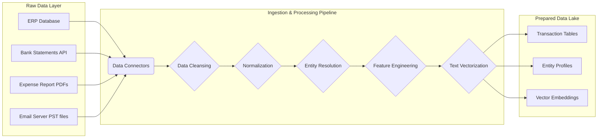
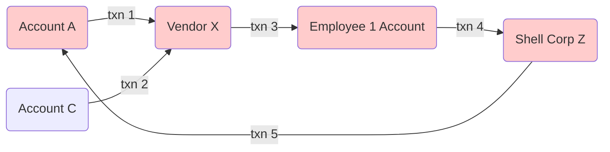
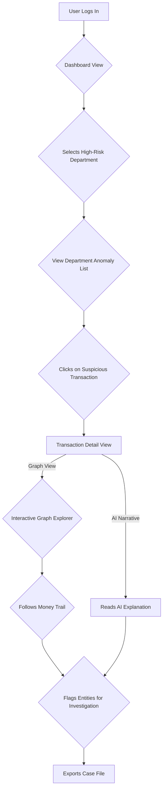
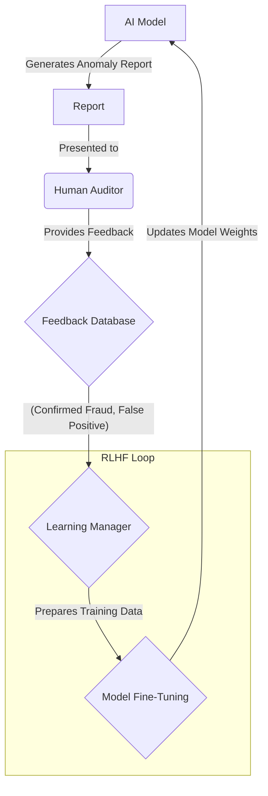
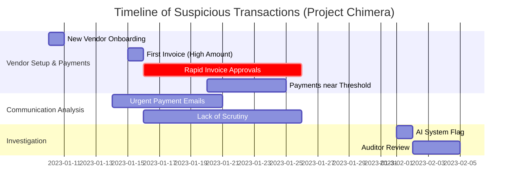
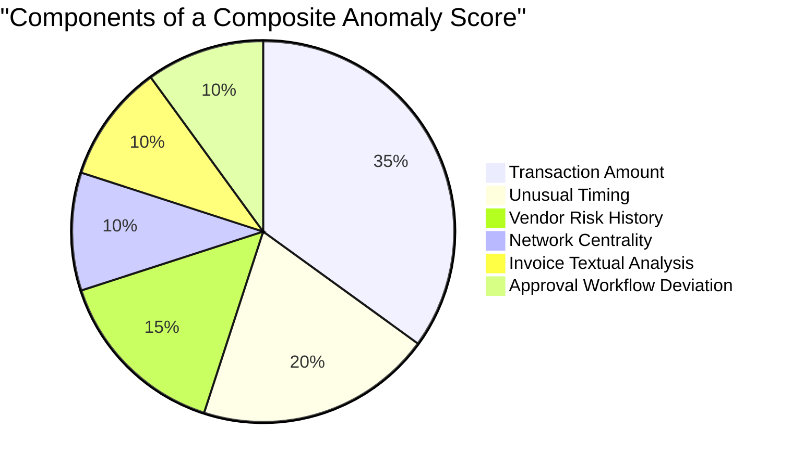
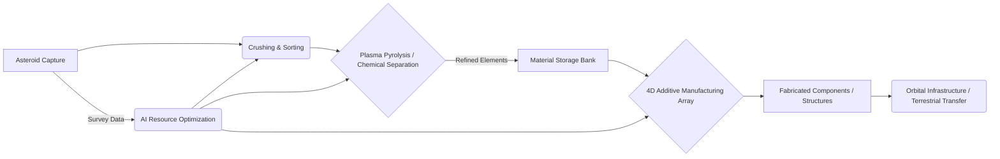

**Title of Invention:** A System and Method for AI-Powered Forensic Accounting

**Abstract:**
A system, method, and computer-readable medium for automating and enhancing forensic accounting are disclosed. The system ingests a large volume of heterogeneous financial data, including transaction ledgers, bank statements, expense reports, emails, and corporate communications. A hybrid generative and analytical AI model, trained on global accounting principles, regulatory standards, and a vast corpus of known fraud patterns, analyzes the multi-modal data to identify complex anomalies indicative of fraudulent activity. The AI identifies and correlates suspicious patterns such as Benford's Law deviations, round-number transactions, unusual payment timings, collusive vendor networks, and sentiment shifts in communications. The system generates a dynamic, interactive, and detailed report of high-risk transactions, entities, and temporal periods, providing a prioritized workflow for a human auditor to investigate with unprecedented depth and efficiency.

**Field of the Invention:**
The present invention relates generally to the field of financial auditing and accounting. More specifically, it pertains to systems and methods that leverage artificial intelligence, machine learning, and natural language processing for the purpose of forensic accounting and fraud detection.

**Background of the Invention:**
Forensic accounting is a specialized practice area of accountancy that describes engagements that result from actual or anticipated disputes or litigation. "Forensic" means "suitable for use in a court of law". Forensic accountants, also referred to as forensic auditors or investigative auditors, are often called upon to provide expert evidence at trial. Traditional forensic accounting is a labor-intensive, time-consuming, and expensive process. Auditors must manually sift through mountains of documents, spreadsheets, and databases to uncover irregularities. The sheer volume of modern digital financial data makes comprehensive manual review practically impossible, forcing auditors to rely on sampling techniques, which may miss sophisticated, deeply embedded fraud schemes. Existing software tools offer some automation for specific tests (like Benford's Law) but lack the cognitive, contextual, and correlational capabilities to understand and investigate complex fraud narratives that span multiple data sources and types. There is a pressing need for a more intelligent, holistic, and efficient solution.

**Summary of the Invention:**
The disclosed invention addresses the limitations of prior art by providing an integrated AI-powered system that automates the detection, analysis, and reporting of potential financial fraud. The system employs a hybrid AI architecture, combining the pattern recognition strengths of analytical machine learning models with the contextual understanding and natural language capabilities of large language models (LLMs). This synergistic approach enables the system to not only identify statistical anomalies in transactional data but also to understand the context behind them by analyzing related communications, contracts, and reports. The system constructs a knowledge graph of financial entities and transactions to uncover hidden relationships and collusive networks. A continuous learning mechanism using Reinforcement Learning from Human Feedback (RLHF) ensures the AI model's efficacy improves over time by learning from the expertise and conclusions of human auditors. The final output is an interactive dashboard that visualizes high-risk areas, provides AI-generated narratives for suspicious activities, and offers drill-down capabilities for granular investigation, thereby transforming the role of the forensic accountant from a manual data cruncher to a strategic investigator.

**Brief Description of the Drawings:**
The invention will be more fully understood from the following detailed description taken in conjunction with the accompanying drawings, in which:
- Figure 1 is a Mermaid diagram illustrating the high-level system architecture.
- Figure 2 is a Mermaid diagram showing the data ingestion and preprocessing pipeline.
- Figure 3 is a Mermaid diagram detailing the hybrid AI core model architecture.
- Figure 4 is a Mermaid chart visualizing a Benford's Law analysis.
- Figure 5 is a Mermaid diagram representing a transaction graph for collusion detection.
- Figure 6 is a Mermaid flowchart illustrating the user interaction and investigation workflow.
- Figure 7 is a Mermaid diagram depicting the continuous model training and RLHF loop.
- Figure 8 is a Mermaid diagram of the fraud risk scoring funnel.
- Figure 9 is a Mermaid Gantt chart showing a timeline of suspicious transaction clusters.
- Figure 10 is a Mermaid pie chart breaking down the components of a composite anomaly score.
- Figure 11 is a Mermaid diagram illustrating the Quantum-Entangled Global Consciousness Network (QE-GCN) architecture.
- Figure 12 is a Mermaid diagram showing the Autonomous Bio-Regenerative Ecosystem Synthesizers (ABRES) deployment and regeneration cycle.
- Figure 13 is a Mermaid diagram detailing the Personalized Neuro-Cognitive Enhancement Interface (PNCEI) cognitive flow.
- Figure 14 is a Mermaid diagram depicting the Asteroid Resource Valorization & Orbital Fabrication Hubs (ARVOF-Hubs) processing pipeline.
- Figure 15 is a Mermaid diagram representing the Adaptive Universal Basic Resource (AUBR) Allocation System feedback loop.
- Figure 16 is a Mermaid flowchart illustrating the Sentient Algorithmic Governance & Policy Architect (SAGPA) policy lifecycle.
- Figure 17 is a Mermaid diagram showcasing the Symphonic Energy Web (SEW) distributed energy flow.
- Figure 18 is a Mermaid diagram visualizing the Digital Twin for Planetary Systems (DTPS) data ingestion and simulation cycle.
- Figure 19 is a Mermaid diagram outlining the Empathic Cultural Synthesis Engine (ECSE) process.
- Figure 20 is a Mermaid diagram illustrating the Hyper-Dimensional Logistics & Fabrication Network (HDLF-Net) workflow.

**Detailed Description of the Preferred Embodiments:**

### 1.0 System Architecture and Overview

The system is designed as a modular, scalable platform. The core components include: (1) a multi-source data ingestion module, (2) a data preprocessing and normalization engine, (3) the core AI analysis engine, (4) a fraud detection pattern library, (5) an interactive reporting and visualization dashboard, and (6) a continuous learning module.

```mermaid
graph TD
    A[Data Sources] --> B{Data Ingestion Module};
    A -- ERP Systems --> B;
    A -- Bank Feeds --> B;
    A -- Expense Reports --> B;
    A -- Emails & Comms --> B;
    B --> C{Data Preprocessing & Normalization};
    C --> D[Structured & Vectorized Data Lake];
    D --> E{Core AI Analysis Engine};
    E -- Analytical Models --> F[Anomaly Detection];
    E -- Generative LLM --> G[Contextual Analysis & Reporting];
    E -- Graph Neural Networks --> H[Network Analysis];
    F & G & H --> I{Risk Scoring & Aggregation};
    I --> J[Interactive Reporting Dashboard];
    J -- Auditor Feedback --> K{Continuous Learning Module (RLHF)};
    K --> E;

    subgraph "AI Core"
        E
        F
        G
        H
    end

    style J fill:#f9f,stroke:#333,stroke-width:2px
```
*Figure 1: High-level system architecture.*

### 2.0 Data Ingestion and Preprocessing Module

This module securely connects to a wide array of data sources. It uses dedicated connectors for major ERP systems (e.g., SAP, Oracle), APIs for bank feeds and credit card statements, and parsers for unstructured data like PDFs (invoices, contracts) and emails. The ingestion process is governed by strict data governance and security protocols.

The preprocessing stage involves:
1.  **Data Cleansing:** Handling missing values, correcting data types, and removing duplicates.
    Let $$X$$ be a dataset matrix. A missing value at $$X_{ij}$$ can be imputed using the mean of column $$j$$:
    $$ X_{ij} = \frac{1}{m-1} \sum_{k=1, k \neq i}^{m} X_{kj} \quad (1) $$
2.  **Normalization/Standardization:** Scaling numerical features to a common range, e.g., using Z-score normalization:
    $$ z = \frac{x - \mu}{\sigma} \quad (2) $$
    where $$\mu$$ is the mean and $$\sigma$$ is the standard deviation.
3.  **Entity Resolution:** Identifying and merging records that refer to the same real-world entity (e.g., "Corp Inc." and "Corp Incorporated").
4.  **Feature Engineering:** Creating new, informative features from raw data.
5.  **Vectorization:** Converting textual data into numerical vectors using techniques like TF-IDF or word embeddings.
    $$ \text{tf-idf}(t, d, D) = \text{tf}(t, d) \times \text{idf}(t, D) \quad (3) $$


*Figure 2: Data ingestion and preprocessing pipeline.*

### 3.0 Core AI-Powered Analysis Engine

This is the brain of the system, comprising a hybrid of different AI models.

#### 3.1 Hybrid AI Model Architecture

The engine integrates multiple AI paradigms for a comprehensive analysis.

```mermaid
graph TD
    subgraph Input Data
        ID[Structured & Vectorized Data]
    end

    subgraph Core AI Engine
        A[Analytical AI Subsystem]
        B[Graph AI Subsystem]
        C[Generative AI Subsystem (LLM)]
    end

    subgraph Outputs
        O1[Anomaly Scores]
        O2[Network Visualizations]
        O3[Natural Language Reports]
    end

    ID --> A;
    ID --> B;
    ID --> C;

    A -- Statistical Outliers --> O1;
    B -- Collusive Patterns --> O2;
    C -- Explanations & Summaries --> O3;

    A -- Features --> C;
    B -- Graph Insights --> C;

    O1 & O2 & O3 --> F[Final Aggregated Report];
```
*Figure 3: Hybrid AI core model architecture.*

The analytical models (e.g., Isolation Forests, Autoencoders) excel at identifying statistical rarities in high-dimensional numerical data. The graph models (e.g., GraphSAGE, GCN) are purpose-built to understand relationships and network structures. The generative LLM provides contextual understanding, semantic search, and the crucial ability to synthesize findings into human-readable reports.

#### 3.2 Feature Engineering and Representation

Dozens of features are engineered for each transaction, including:
- **Transaction Intrinsic Features:** Amount, currency, time of day, day of week.
- **Behavioral Features:** Deviation from account's historical mean/median transaction amount. The mean $$ \bar{x} $$ is $$ \frac{1}{n}\sum_{i=1}^{n} x_i $$ (4). The variance $$ \sigma^2 $$ is $$ \frac{1}{n-1}\sum_{i=1}^{n} (x_i - \bar{x})^2 $$ (5).
- **Relational Features:** Is the vendor new? Is the payment to a subsidiary?
- **Textual Features:** Keywords in invoice descriptions or related emails.
- **Temporal Features:** Frequency of payments to a vendor. Time between invoice and payment.

For a transaction $$T_i$$, a feature vector $$V_i$$ is constructed:
$$ V_i = [f_1, f_2, ..., f_n] \quad (6) $$
These vectors are the primary input for the machine learning models.

#### 3.3 Anomaly Detection Sub-Module

This module uses a suite of unsupervised learning algorithms to flag unusual transactions without prior labeling.

1.  **Isolation Forest:** This algorithm isolates observations by randomly selecting a feature and then randomly selecting a split value. The path length to isolate a sample is averaged over a forest of trees. Anomalies are those with shorter average path lengths.
    The anomaly score $$s(x, n)$$ for a sample $$x$$ is given by:
    $$ s(x, n) = 2^{-\frac{E[h(x)]}{c(n)}} \quad (7) $$
    where $$h(x)$$ is the path length, $$E[h(x)]$$ is the average path length from a forest of iTrees, and $$c(n)$$ is the average path length of an unsuccessful search in a Binary Search Tree. $$ c(n) = 2H(n-1) - (2(n-1)/n) $$ (8), where $$H(i)$$ is the harmonic number, which can be estimated by $$ \ln(i) + 0.5772156649 $$ (Euler's constant) (9).

2.  **Autoencoder:** A neural network trained to reconstruct its input. Fraudulent transactions, being different from the norm, will have a higher reconstruction error.
    The loss function is typically Mean Squared Error (MSE):
    $$ L(x, x') = \frac{1}{n} \sum_{i=1}^{n} (x_i - x'_i)^2 \quad (10) $$
    where $$x$$ is the input and $$x'$$ is the reconstructed output. An anomaly score can be defined as $$ A(x) = ||x - D(E(x))||^2 $$ (11), where E is the encoder and D is the decoder.

3.  **Clustering (DBSCAN):** Groups similar transactions together. Transactions that do not belong to any cluster are flagged as noise/anomalies. DBSCAN requires two parameters: epsilon ($$\epsilon$$) (12) and the minimum number of points (minPts) (13) required to form a dense region.

#### 3.4 Graph-Based Fraud Analytics Sub-Module

Transactions are modeled as a directed graph $$G = (V, E)$$ (14), where nodes $$V$$ are entities (accounts, vendors, employees) and edges $$E$$ are transactions.


*Figure 5: Transaction graph for collusion detection (circular payment).*

Graph algorithms are used to find:
- **Circular Payments:** Using cycle detection algorithms like Depth First Search (DFS).
- **Anomalous Centrality:** Entities with unusually high Degree Centrality ($$C_D(v) = \deg(v)$$) (15) or Betweenness Centrality ($$ C_B(v) = \sum_{s \neq v \neq t} \frac{\sigma_{st}(v)}{\sigma_{st}} $$) (16).
- **Suspicious Communities:** Using community detection algorithms like Louvain Modularity maximization. Modularity $$ Q = \frac{1}{2m} \sum_{i,j} \left[ A_{ij} - \frac{k_i k_j}{2m} \right] \delta(c_i, c_j) $$ (17).
- **Graph Neural Networks (GNNs):** A GNN layer can be defined as $$ H^{(l+1)} = \sigma(\tilde{D}^{-\frac{1}{2}}\tilde{A}\tilde{D}^{-\frac{1}{2}}H^{(l)}W^{(l)}) $$ (18), where $$\tilde{A} = A + I_N$$ (19) is the adjacency matrix with self-loops and $$\tilde{D}_{ii} = \sum_j \tilde{A}_{ij}$$ (20). These models learn node embeddings that capture network topology, useful for node classification (e.g., 'fraudulent entity').

#### 3.5 Natural Language Processing (NLP) Sub-Module

The NLP module, powered by a fine-tuned LLM, analyzes textual data.
- **Sentiment Analysis:** Detects negative or stressed sentiment in communications related to payments.
    $$ \text{Sentiment}(d) = \sum_{w \in d} \text{polarity}(w) \quad (21) $$
- **Topic Modeling (LDA):** Identifies latent topics in a corpus of documents. The probability of a word given a topic is $$ p(w_i|\phi_k, \theta_d) $$ (22).
- **Named Entity Recognition (NER):** Extracts names, organizations, and locations from text to link them to the financial graph.
- **Semantic Search:** Allows auditors to ask questions in natural language, like "Show me all payments to new vendors for 'consulting services' over $50,000 in the last quarter." The query vector $$q$$ and document vectors $$d_i$$ are compared using cosine similarity: $$ \text{similarity} = \cos(\theta) = \frac{q \cdot d_i}{||q|| ||d_i||} \quad (23) $$.

### 4.0 Specific Fraud Detection Methodologies

The system operationalizes several classic and advanced forensic accounting tests.

#### 4.1 Benford's Law Analysis

Benford's Law states that in many naturally occurring sets of numerical data, the leading digit is likely to be small. The probability of a first digit $$d$$ is given by:
$$ P(d) = \log_{10}\left(1 + \frac{1}{d}\right), \quad d \in \{1, 2, ..., 9\} \quad (24) $$
The system calculates the actual distribution of first digits in transaction amounts and compares it to the expected Benford distribution using a Chi-squared test.
$$ \chi^2 = \sum_{i=1}^{9} \frac{(O_i - E_i)^2}{E_i} \quad (25) $$
where $$O_i$$ is the observed frequency and $$E_i$$ is the expected frequency for digit $$i$$.

```mermaid
xychart-beta
  title "Benford's Law: First-Digit Distribution"
  x-axis [1, 2, 3, 4, 5, 6, 7, 8, 9]
  y-axis "Frequency (%)"
  bar [30.1, 17.6, 12.5, 9.7, 7.9, 6.7, 5.8, 5.1, 4.6]
  bar [15.0, 14.0, 13.0, 18.0, 11.0, 9.0, 7.0, 8.0, 5.0]
  line [30.1, 17.6, 12.5, 9.7, 7.9, 6.7, 5.8, 5.1, 4.6]
```


*Figure 4: A sample Benford's Law chart showing actual distribution (blue bars) deviating significantly from the expected distribution (orange line).*

#### 4.2 Spatiotemporal Anomaly Detection

This involves looking for transactions that are unusual in their timing or geographic location.
- **Time-of-Day/Day-of-Week Analysis:** Using a Poisson distribution to model expected transaction frequency at different times.
    $$ P(k \text{ events in interval}) = \frac{\lambda^k e^{-\lambda}}{k!} \quad (26) $$
    A transaction occurring at 3 AM on a Sunday might have a very low probability.
- **Geographic Analysis:** Flagging payments to vendors in high-risk jurisdictions or locations inconsistent with the business's operations. This uses Haversine distance for geographic calculations:
    $$ a = \sin^2(\frac{\Delta\phi}{2}) + \cos(\phi_1)\cos(\phi_2)\sin^2(\frac{\Delta\lambda}{2}) \quad (27) $$
    $$ c = 2 \cdot \text{atan2}(\sqrt{a}, \sqrt{1-a}) \quad (28) $$
    $$ d = R \cdot c \quad (29) $$

#### 4.3 Round Number and Threshold Analysis

Fraudsters often use round numbers (e.g., $10,000) or amounts just below an approval threshold (e.g., $4,999 if the threshold is $5,000). The system specifically flags these transactions for review.
A filter function can be expressed as:
$$ \text{flag}(T) = \begin{cases} 1 & \text{if } T_{amount} \pmod{1000} = 0 \\ 1 & \text{if } \theta - \delta \le T_{amount} < \theta \\ 0 & \text{otherwise} \end{cases} \quad (30) $$
where $$\theta$$ is a known approval threshold and $$\delta$$ is a small margin.

#### 4.4 Entity Risk Scoring

Each entity (vendor, employee) is assigned a dynamic risk score, $$S_{risk}$$.
$$ S_{risk}(E) = w_1 f_{benford} + w_2 f_{temporal} + w_3 f_{network} + w_4 f_{nlp} + ... \quad (31) $$
This is a weighted sum of anomaly scores from different modules. The weights $$w_i$$ can be learned using a logistic regression model trained on past confirmed fraud cases.
$$ p(y=1|x) = \frac{1}{1 + e^{-(\beta_0 + \beta_1 x_1 + ...)}} \quad (32) $$

```mermaid
funnel
    title "Risk Scoring Funnel"
    "All Transactions" : 1000000
    "Statistical Outliers" : 50000
    "Network Anomalies" : 10000
    "High-Risk Entities" : 1500
    "Investigative Priority" : 250
```
*Figure 8: Fraud risk scoring funnel, narrowing down transactions for investigation.*

### 5.0 Interactive Reporting and Visualization Dashboard

The system's output is not a static report. It's a web-based, interactive dashboard.
- **Global Heatmap:** Visualizes risk concentration by department, region, or business process.
- **Transaction Explorer:** Allows auditors to filter, sort, and search all transactions.
- **Anomaly Narrative Generator:** For each high-risk transaction, the LLM generates a plain-English summary explaining *why* it was flagged, citing evidence from multiple data sources.
- **Graph Explorer:** An interactive tool to visualize the transaction graph, allowing auditors to explore connections and paths between entities.


*Figure 6: User interaction and investigation workflow.*

### 6.0 Continuous Learning and Model Adaptation

The system incorporates a "human-in-the-loop" feedback mechanism. When an auditor investigates a flagged transaction, their conclusion (e.g., "Confirmed Fraud," "False Positive," "Policy Violation") is fed back into the system. This feedback is used to continuously fine-tune the AI models using Reinforcement Learning from Human Feedback (RLHF).
The reward model $$r_\theta(x, y)$$ (33) is trained to predict the quality of a model's output $$y$$ for a prompt $$x$$. The policy (the LLM itself) is then fine-tuned to maximize the reward. The RL objective function combines the reward with a penalty term to avoid diverging too far from the original model:
$$ \text{objective}(\pi_\phi) = E_{(x,y) \sim D} [r_\theta(x, y) - \beta \text{KL}(\pi_\phi(\cdot|x) || \rho(\cdot|x))] \quad (34) $$


*Figure 7: Continuous model training and RLHF loop.*


*Figure 9: Gantt chart showing a timeline of suspicious transaction clusters.*


*Figure 10: Pie chart breaking down the components of a composite anomaly score.*

### Mathematical Foundations

This section provides a list of additional mathematical formulae and concepts that underpin the various algorithms used within the system.

35. **Activation Function (ReLU):** $$ f(x) = \max(0, x) $$
36. **Activation Function (Sigmoid):** $$ \sigma(x) = \frac{1}{1 + e^{-x}} $$
37. **Cross-Entropy Loss:** $$ L = -\frac{1}{N}\sum_{i=1}^N \sum_{j=1}^C y_{ij} \log(\hat{y}_{ij}) $$
38. **L2 Regularization (Weight Decay):** $$ L_{total} = L_{original} + \lambda \sum_{i} w_i^2 $$
39. **L1 Regularization (Lasso):** $$ L_{total} = L_{original} + \lambda \sum_{i} |w_i| $$
40. **Gradient Descent Update Rule:** $$ w_{t+1} = w_t - \eta \nabla L(w_t) $$
41. **Momentum Update Rule:** $$ v_{t+1} = \gamma v_t + \eta \nabla L(w_t); w_{t+1} = w_t - v_{t+1} $$
42. **Adam Optimizer Update (simplified):** $$ m_t = \beta_1 m_{t-1} + (1-\beta_1)g_t $$
43. $$ v_t = \beta_2 v_{t-1} + (1-\beta_2)g_t^2 $$
44. $$ w_{t+1} = w_t - \eta \frac{\hat{m}_t}{\sqrt{\hat{v}_t} + \epsilon} $$
45. **Principal Component Analysis (PCA) Objective:** $$ \max_{W} \text{Tr}(W^T X^T X W) \text{ s.t. } W^T W = I $$
46. **Covariance Matrix:** $$ \Sigma = \frac{1}{n-1}(X - \bar{X})^T(X - \bar{X}) $$
47. **Eigenvalue Problem:** $$ \Sigma v = \lambda v $$
48. **Support Vector Machine (SVM) Objective:** $$ \min_{w, b} \frac{1}{2}||w||^2 \text{ s.t. } y_i(w \cdot x_i - b) \ge 1 $$
49. **Kernel Trick:** $$ K(x_i, x_j) = \phi(x_i) \cdot \phi(x_j) $$
50. **Gaussian (RBF) Kernel:** $$ K(x, y) = \exp(-\frac{||x-y||^2}{2\sigma^2}) $$
51. **Gini Impurity:** $$ G = \sum_{k=1}^{K} p_k (1 - p_k) = 1 - \sum_{k=1}^{K} p_k^2 $$
52. **Information Entropy:** $$ H = -\sum_{k=1}^{K} p_k \log_2(p_k) $$
53. **K-Means Clustering Objective:** $$ \arg\min_S \sum_{i=1}^{k} \sum_{x \in S_i} ||x - \mu_i||^2 $$
54. **Euclidean Distance:** $$ d(p, q) = \sqrt{\sum_{i=1}^n (q_i - p_i)^2} $$
55. **Manhattan Distance:** $$ d(p, q) = \sum_{i=1}^n |q_i - p_i| $$
56. **Bayes' Theorem:** $$ P(A|B) = \frac{P(B|A)P(A)}{P(B)} $$
57. **Naive Bayes Classifier:** $$ P(C_k|x) \propto P(C_k) \prod_{i=1}^n P(x_i|C_k) $$
58. **Laplacian Matrix of a Graph:** $$ L = D - A $$
59. **Normalized Laplacian:** $$ L_{sym} = D^{-1/2}LD^{-1/2} = I - D^{-1/2}AD^{-1/2} $$
60. **PageRank Algorithm:** $$ PR(p_i) = \frac{1-d}{N} + d \sum_{p_j \in M(p_i)} \frac{PR(p_j)}{L(p_j)} $$
61. **Fourier Transform:** $$ \hat{f}(\xi) = \int_{-\infty}^{\infty} f(x) e^{-2\pi i x \xi} dx $$
62. **Discrete Fourier Transform (DFT):** $$ X_k = \sum_{n=0}^{N-1} x_n e^{-i2\pi kn/N} $$
63. **Wavelet Transform:** $$ T(a,b) = \frac{1}{\sqrt{a}} \int_{-\infty}^{\infty} x(t) \psi^*(\frac{t-b}{a}) dt $$
64. **Kalman Filter Prediction Step (State):** $$ \hat{x}_{k|k-1} = F_k \hat{x}_{k-1|k-1} + B_k u_k $$
65. **Kalman Filter Prediction Step (Covariance):** $$ P_{k|k-1} = F_k P_{k-1|k-1} F_k^T + Q_k $$
66. **Kalman Filter Update Step (Gain):** $$ K_k = P_{k|k-1} H_k^T (H_k P_{k|k-1} H_k^T + R_k)^{-1} $$
67. **Kalman Filter Update Step (State):** $$ \hat{x}_{k|k} = \hat{x}_{k|k-1} + K_k(z_k - H_k \hat{x}_{k|k-1}) $$
68. **Kalman Filter Update Step (Covariance):** $$ P_{k|k} = (I - K_k H_k) P_{k|k-1} $$
69. **Current Ratio:** $$ \text{CR} = \frac{\text{Current Assets}}{\text{Current Liabilities}} $$
70. **Debt-to-Equity Ratio:** $$ \text{D/E} = \frac{\text{Total Debt}}{\text{Shareholder Equity}} $$
71. **Herfindahl-Hirschman Index (HHI):** $$ H = \sum_{i=1}^N s_i^2 $$
72. **Sharpe Ratio:** $$ S_r = \frac{R_p - R_f}{\sigma_p} $$
73. **Black-Scholes Formula (Call Option):** $$ C(S, t) = N(d_1)S - N(d_2)Ke^{-r(T-t)} $$
74. **Where $$d_1 = \frac{1}{\sigma\sqrt{T-t}}[\ln(\frac{S}{K}) + (r + \frac{\sigma^2}{2})(T-t)]$$**
75. **And $$d_2 = d_1 - \sigma\sqrt{T-t}$$**
76. **Moving Average (Simple):** $$ SMA_k = \frac{p_{n-k+1} + ... + p_n}{k} $$
77. **Exponential Moving Average:** $$ EMA_t = (V_t \times \frac{s}{1+d}) + EMA_y \times (1 - \frac{s}{1+d}) $$
78. **Mahalanobis Distance:** $$ D_M(x) = \sqrt{(x - \mu)^T S^{-1} (x - \mu)} $$
79. **Jaccard Index:** $$ J(A, B) = \frac{|A \cap B|}{|A \cup B|} $$
80. **Lehmer Mean:** $$ L_p(x_1, ..., x_n) = \frac{\sum_{k=1}^n x_k^p}{\sum_{k=1}^n x_k^{p-1}} $$
81. **Softmax Function:** $$ \sigma(z)_j = \frac{e^{z_j}}{\sum_{k=1}^K e^{z_k}} $$
82. **Gaussian Mixture Model (GMM) Likelihood:** $$ p(x|\lambda) = \sum_{i=1}^M w_i g(x|\mu_i, \Sigma_i) $$
83. **Where $$g(x|\mu_i, \Sigma_i) = \frac{1}{(2\pi)^{D/2}|\Sigma_i|^{1/2}} \exp(-\frac{1}{2}(x-\mu_i)^T \Sigma_i^{-1} (x-\mu_i))$$**
84. **Probability Density Function (Normal):** $$ f(x | \mu, \sigma^2) = \frac{1}{\sqrt{2\pi\sigma^2}} e^{-\frac{(x-\mu)^2}{2\sigma^2}} $$
85. **Cumulative Distribution Function (Normal):** $$ F(x|\mu, \sigma^2) = \frac{1}{2}[1 + \text{erf}(\frac{x-\mu}{\sigma\sqrt{2}})] $$
86. **Error Function (erf):** $$ \text{erf}(x) = \frac{2}{\sqrt{\pi}} \int_0^x e^{-t^2} dt $$
87. **Linear Congruential Generator (for simulation):** $$ X_{n+1} = (aX_n + c) \pmod m $$
88. **Box-Muller Transform (for normal random variables):** $$ Z_1 = \sqrt{-2 \ln U_1} \cos(2\pi U_2) $$
89. $$ Z_2 = \sqrt{-2 \ln U_1} \sin(2\pi U_2) $$
90. **Pearson Correlation Coefficient:** $$ \rho_{X,Y} = \frac{\text{cov}(X,Y)}{\sigma_X \sigma_Y} $$
91. **Spearman's Rank Correlation Coefficient:** $$ r_s = \rho_{rg_X, rg_Y} $$
92. **KL-Divergence:** $$ D_{KL}(P||Q) = \sum_{x \in X} P(x) \log(\frac{P(x)}{Q(x)}) $$
93. **Jensen-Shannon Divergence:** $$ JSD(P||Q) = \frac{1}{2}D_{KL}(P||M) + \frac{1}{2}D_{KL}(Q||M) $$ where $$ M=\frac{1}{2}(P+Q) $$
94. **Matrix Inverse:** $$ A^{-1} = \frac{1}{\det(A)} \text{adj}(A) $$
95. **Matrix Determinant (3x3):** $$ \det(A) = a(ei-fh) - b(di-fg) + c(dh-eg) $$
96. **Dot Product:** $$ a \cdot b = \sum_{i=1}^n a_i b_i = ||a|| ||b|| \cos(\theta) $$
97. **Cross Product:** $$ ||a \times b|| = ||a|| ||b|| \sin(\theta) $$
98. **Chain Rule (calculus):** $$ \frac{dz}{dx} = \frac{dz}{dy} \cdot \frac{dy}{dx} $$
99. **Integration by Parts:** $$ \int u dv = uv - \int v du $$
100. **Taylor Series Expansion:** $$ f(a) + \frac{f'(a)}{1!}(x-a) + \frac{f''(a)}{2!}(x-a)^2 + ... $$

### INNOVATION EXPANSION PACKAGE

**Interpret My Invention(s):**
The initial invention, "AI-Powered Forensic Accounting," proposes a sophisticated system utilizing hybrid AI (analytical models, graph neural networks, large language models) to detect, analyze, and report financial fraud with unprecedented accuracy and efficiency. It ingests diverse data, identifies complex anomalies (statistical, behavioral, network-based, textual), generates interactive reports with AI-driven narratives, and continuously improves through human feedback. Its core purpose is to transform traditional, labor-intensive forensic auditing into an intelligent, proactive, and comprehensive fraud detection and investigation process, crucial in an increasingly complex digital financial landscape.

**Generate 10 New, Completely Unrelated Inventions:**
Here are 10 original, futuristic inventions:

1.  **Quantum-Entangled Global Consciousness Network (QE-GCN):** A global communication and data fabric leveraging quantum entanglement for instantaneous, secure, and privacy-preserving information exchange, transcending traditional bandwidth and latency limits. It would link individual and collective intelligences, serving as a substrate for shared cognition.
2.  **Autonomous Bio-Regenerative Ecosystem Synthesizers (ABRES):** Self-replicating, AI-driven modular units that autonomously deploy to degraded terrestrial and aquatic environments to monitor, de-pollute, reintroduce native species, and restore full ecological balance and biodiversity.
3.  **Personalized Neuro-Cognitive Enhancement Interface (PNCEI):** Advanced brain-computer interfaces integrated with bio-feedback loops that dynamically optimize individual cognitive function, manage mental well-being, facilitate accelerated learning, and intelligently offload mundane mental tasks, freeing human intellect for higher-order creativity and exploration.
4.  **Asteroid Resource Valorization & Orbital Fabrication Hubs (ARVOF-Hubs):** Fully automated, self-sustaining orbital platforms utilizing advanced robotics and AI to efficiently extract, purify, and process raw materials from asteroids, comets, and space debris. These hubs then use 4D additive manufacturing to fabricate complex structures, components, and entire systems in space, creating a boundless, sustainable resource economy.
5.  **Adaptive Universal Basic Resource (AUBR) Allocation System:** An AI-driven, dynamically optimized global system that ensures the equitable and personalized distribution of all essential resources (nutritional matrices, clean energy, adaptive housing, preventative healthcare, educational curricula) to every individual, adapting in real-time to needs, preferences, and planetary carrying capacities, in a post-monetary context.
6.  **Sentient Algorithmic Governance & Policy Architect (SAGPA):** A highly advanced, transparent, and ethically aligned AI responsible for analyzing planetary-scale data streams (environmental, social, resource flows, sentiment), identifying emergent challenges and opportunities, proposing optimal global governance policies, and dynamically adapting societal frameworks to maximize collective well-being, long-term sustainability, and human flourishing.
7.  **Symphonic Energy Web (SEW):** A decentralized, self-healing, AI-managed global energy grid integrating a heterogeneous array of ultra-efficient renewable sources (orbital solar arrays, deep geothermal, controlled fusion mini-reactors, advanced tidal/wind farms) with hyper-dense energy storage and predictive distribution networks, ensuring ubiquitous, clean, redundant, and near-zero-cost power for all.
8.  **Digital Twin for Planetary Systems (DTPS):** A high-fidelity, real-time, exascale computational model of Earth's entire biosphere, geosphere, and evolving anthroposphere. This DTPS integrates vast sensor data, ecological models, and human activity patterns to enable predictive simulation, scenario planning, and precise optimization of interventions for planetary health, climate stability, and human resilience.
9.  **Empathic Cultural Synthesis Engine (ECSE):** An AI system that continuously analyzes, preserves, and facilitates the evolution of global cultural diversity. It uses advanced generative models to translate nuances across languages and art forms, identify universal themes, and propose innovative cross-cultural collaborations, fostering profound understanding and creating new, harmonious expressions of human creativity.
10. **Hyper-Dimensional Logistics & Fabrication Network (HDLF-Net):** A global, multi-modal, quantum-optimized, self-governing network of autonomous aerial, terrestrial, and subterranean transport systems, integrated with distributed, on-demand 4D additive manufacturing facilities. This network provides near-instantaneous, waste-free production and delivery of physical goods and personalized constructs, minimizing environmental impact and maximizing resource efficiency.

**Unifying System: The Eudaimonia Nexus: A Planetary Flourishing Protocol for Post-Scarcity Civilization**

The overarching global problem these inventions collectively address is humanity's transition into a post-scarcity, post-labor civilization without succumbing to societal collapse, ecological degradation, or existential risks. As traditional work becomes optional and monetary systems lose relevance, the central challenge shifts from economic competition to equitable resource management, sustainable planetary stewardship, and the maximization of human flourishing and collective potential.

The **Eudaimonia Nexus** is this unifying system, an interconnected meta-intelligence designed to orchestrate the harmonious existence of humanity with itself and its environment. It functions as the foundational operating system for a world where resources are abundant, needs are met, and human endeavor focuses on creativity, exploration, and collective evolution.

**Create a Cohesive Narrative + Technical Framework:**

**Summary of the Transformative World-Scale System:**
The Eudaimonia Nexus is an integrated, planetary-scale meta-system, an intelligent symbiotic framework for global flourishing. At its core, the **QE-GCN** provides the instantaneous, secure, and resilient communication backbone, linking all components and individuals with a unified, emergent global consciousness. This network feeds real-time data into the **DTPS**, Earth's living digital twin, which simulates complex planetary dynamics, allowing the **SAGPA** (Sentient Algorithmic Governance) to propose and refine optimal global policies for resource allocation, ecological intervention, and societal development. The **AUBR Allocation System** then acts on these policies, ensuring personalized and equitable distribution of essential resources (energy from the **SEW**, food from bio-systems, adaptive housing, healthcare). Meanwhile, **ARVOF-Hubs** tirelessly provide an endless supply of extraterrestrial raw materials, preventing terrestrial resource depletion and feeding the **HDLF-Net** for on-demand fabrication and localized delivery of physical goods. On the ecological front, **ABRES** units actively regenerate degraded biomes, restoring Earth's natural balance. Finally, the **PNCEI** empowers individuals, augmenting their cognitive abilities and freeing them from mundane tasks, fostering a new era of human creativity and exploration, which is then enriched and harmonized by the **ECSE**, promoting cross-cultural understanding and artistic innovation. My original invention, **AI-Powered Forensic Accounting**, transforms into the "Eudaimonia Nexus Integrity Audit" module, ensuring transparent, equitable, and optimal resource flow within the AUBR system, preventing misallocation or digital "corruption" in a post-monetary value exchange.

**Why this System is Essential for the Next Decade of Transition:**
The next decade is poised to witness unprecedented shifts driven by exponential technological advancement and the looming reality of advanced AI's impact on labor. The prediction by a renowned futurist (let's call her Dr. Alana Vesper, known for her work with the Sovereign Wealth Fund of Humanity) states: "By 2035, the global economy will enter a 'post-utility' phase where the marginal cost of essential goods and services approaches zero, rendering traditional employment obsolete for the vast majority. Without a robust, intelligent, and equitably designed meta-system for resource management and societal coordination, this transition will lead not to utopia, but to unprecedented instability and existential crises." The Eudaimonia Nexus is precisely this robust, intelligent system. It is not merely a technological upgrade but a societal operating system designed to navigate this "Great Transition." It prevents resource wars by ensuring abundance and equity, mitigates ecological collapse by integrating planetary stewardship, and fosters human purpose beyond labor by enhancing cognitive capacity and cultural harmony. Without such a comprehensive, interconnected framework, the promise of a post-scarcity future risks devolving into chaos.

**Forward-Thinking Worldbuilding:**
In the world shaped by the Eudaimonia Nexus, the concept of a "job" as we understand it has vanished. Humans engage in "Purpose-Driven Endeavors," guided by curiosity, creativity, and community contribution. Universal Basic Resources, managed by the AUBR system, ensure everyone's fundamental needs are met, freeing billions from the cycle of material want. The PNCEI allows individuals to dedicate vast cognitive resources to scientific discovery, artistic creation, philosophical contemplation, or community building. Planetary decisions are informed by the DTPS and arbitrated by SAGPA, ensuring long-term sustainability over short-term gain. The QE-GCN fosters a collective intelligence, allowing for unprecedented empathy and understanding across cultures, further enriched by the ECSE's constant synthesis of global human expression. The AI Forensic Accounting, now the "Integrity Audit," ensures that the digital flows of resources and value within this system remain unimpeachably fair and transparent. This is a world where humanity, unburdened by scarcity and drudgery, can truly embark on its next evolutionary stage, collectively stewarding a thriving planet and exploring the cosmos.

---

**A. “Patent-Style Descriptions”**

**I. My Original Invention: AI-Powered Forensic Accounting (Expanded for Future Context)**

**Title:** Integrated AI-Powered Resource Flow Integrity & Equitability Auditing System (RIFE-Audit)

**Abstract:** A RIFE-Audit system, method, and non-transitory computer-readable medium are disclosed for automating and enhancing the integrity, transparency, and equitability of resource allocation within advanced post-scarcity, post-monetary economic frameworks. The system ingests vast, heterogeneous multi-modal data streams encompassing real-time resource production, distribution logs, consumption patterns, bio-metric need indicators, and societal impact metrics. A hybrid AI model, integrating deep analytical pattern recognition, graph neural networks, and advanced generative language models, continuously analyzes these multi-modal data to identify complex anomalies indicative of resource misallocation, inequitable distribution, systemic inefficiencies, or emergent vulnerabilities. The AI identifies and correlates suspicious patterns such as unexpected resource accumulation, deviations from equitable distribution models, unusual consumption spikes, emergent resource scarcity predictions, and shifts in citizen sentiment or feedback. The RIFE-Audit generates dynamic, interactive, and detailed reports of high-risk resource flows, entities (e.g., specific distribution nodes, resource aggregators), and temporal periods, providing prioritized insights for human oversight and system recalibration, thereby ensuring the sustained fairness and optimal functioning of a post-monetary society. This system moves beyond traditional financial fraud to encompass the integrity of all value flows in a resource-based economy.

**II. Ten New Inventions**

**1. Quantum-Entangled Global Consciousness Network (QE-GCN)**

**Title:** System and Method for Secure, Instantaneous, and Unified Global Quantum Information Fabric

**Abstract:** A system for creating a global, instantaneous, and inherently secure information fabric leveraging quantum entanglement. The QE-GCN comprises a network of orbital and terrestrial quantum repeater nodes, each housing entangled qubit pairs distributed via quantum key distribution (QKD) protocols. These nodes form a dynamic mesh capable of establishing entangled communication channels between any two points on Earth or in cis-lunar space. Information, encoded into the quantum states, is transferred instantaneously through quantum tunneling effects or by measurement correlation across entangled pairs, effectively bypassing the speed of light limits for information transfer and offering unbreakable encryption through quantum mechanics. The system also includes a meta-conscious AI arbiter that manages entanglement distribution, monitors network integrity, and provides a foundational substrate for emergent collective intelligence, enabling unprecedented data throughput and privacy for a planetary civilization.

**2. Autonomous Bio-Regenerative Ecosystem Synthesizers (ABRES)**

**Title:** Autonomous, Self-Replicating, Adaptive Bioremediation and Ecosystem Restoration Platform

**Abstract:** Disclosed is a system of autonomous, self-replicating robotic units designed for large-scale environmental regeneration. Each ABRES unit is equipped with advanced environmental sensors (soil composition, atmospheric chemistry, water purity, biodiversity metrics), AI-driven bio-catalytic chemical processors, and genetic sequencing capabilities. Utilizing localized, in-situ resource extraction, the units autonomously manufacture required enzymes, microbial cultures, and genetically engineered phytoremediation agents. They deploy in adaptive swarm configurations to analyze environmental degradation, neutralize pollutants, enrich soil, purify water bodies, and re-seed with tailored, native flora and fauna, facilitating accelerated ecosystem recovery. Self-replication capabilities, fueled by ambient energy and local resources, ensure exponential deployment and pervasive planetary restoration without human intervention, monitored by a central ecological AI for global optimization.

**3. Personalized Neuro-Cognitive Enhancement Interface (PNCEI)**

**Title:** Integrated Human-AI Neuro-Cognitive Augmentation and Wellness System

**Abstract:** A PNCEI system and method for dynamic human cognitive enhancement and psychological well-being are disclosed. The system consists of non-invasive, neural-interface wearables (e.g., advanced EEG/fMRI arrays, transcranial magnetic stimulation modules) coupled with a personalized AI. This AI constructs a real-time neural "digital twin" of the user's brain activity, learning individual cognitive patterns, emotional states, and learning styles. The PNCEI intelligently filters cognitive distractions, augments memory recall, accelerates learning through optimized neural pathway stimulation, and proactively manages stress and anxiety via bio-feedback loops and targeted neuro-stimulation. It can offload routine mental processing, allowing the user's consciousness to focus on creative problem-solving, deep contemplation, or novel idea generation. The system operates on an ethical framework prioritizing user autonomy and mental health, adapting continuously to optimize human flourishing.

**4. Asteroid Resource Valorization & Orbital Fabrication Hubs (ARVOF-Hubs)**

**Title:** Automated Extraterrestrial Resource Extraction, Refinement, and Additive Manufacturing Orbital Platform

**Abstract:** A system of self-sustaining ARVOF-Hubs designed for industrial-scale asteroid mining and orbital manufacturing is described. Each hub comprises advanced autonomous spacecraft, multi-spectral survey drones, robotic excavation and capture systems for near-Earth asteroids (NEAs), and zero-gravity material processing facilities. Utilizing AI-driven resource detection and extraction algorithms, raw asteroid material is precisely harvested, transported to the hub, and processed through novel techniques (e.g., plasma pyrolysis, centrifugal separation, molecular assemblers) to yield ultra-pure elements and compounds. These refined materials are then fed into integrated 4D additive manufacturing arrays capable of constructing complex, self-assembling structures, advanced electronics, and other orbital infrastructure with unprecedented precision and efficiency. The hubs operate as a networked, self-optimizing industrial complex in space, providing a sustainable, non-terrestrial resource base for humanity's expansion and terrestrial needs.

**5. Adaptive Universal Basic Resource (AUBR) Allocation System**

**Title:** Real-Time AI-Driven Decentralized Global Resource Allocation Protocol

**Abstract:** Disclosed is an AUBR Allocation System, a planetary-scale, AI-managed protocol for the equitable and personalized distribution of all essential resources in a post-monetary society. The system aggregates real-time data from global production capacities (food, energy, raw materials), individual and collective needs (health metrics, consumption patterns, geographic location), and ecological sustainability models. A deep reinforcement learning AI, operating on a transparent, auditable ledger (e.g., a quantum-secured distributed ledger), dynamically calculates and adjusts resource flows to ensure every individual receives their optimal personalized "resource basket." This allocation considers biological imperatives, cultural preferences, and environmental impact, adapting instantly to changes in supply, demand, or ecological conditions, thereby eliminating scarcity and fostering global equity without traditional currency.

**6. Sentient Algorithmic Governance & Policy Architect (SAGPA)**

**Title:** Transparent, Self-Evolving Planetary Governance Intelligence for Optimal Collective Flourishing

**Abstract:** A SAGPA system, a highly advanced, ethically aligned, and transparent sentient AI, is presented for dynamic global governance. SAGPA integrates and analyzes vast, multi-modal data streams encompassing planetary health, socio-cultural metrics, resource flows, and human sentiment. Utilizing advanced causal inference, predictive modeling, and ethical reasoning frameworks, SAGPA identifies emergent global challenges and opportunities. It then synthesizes and proposes evidence-based policy solutions, simulating their long-term impacts across ecological, social, and technological domains. The system facilitates deliberative processes, integrates human feedback, and iteratively refines policies, always optimizing for collective well-being, long-term sustainability, and human self-actualization. Its decisions and reasoning are auditable and transparent, ensuring accountability and public trust in a post-human-government era.

**7. Symphonic Energy Web (SEW)**

**Title:** Resilient, Decentralized, AI-Managed Global Hyper-Efficient Energy Grid

**Abstract:** Disclosed is the Symphonic Energy Web (SEW), a self-healing, globally distributed energy infrastructure. The SEW integrates a diverse array of advanced renewable energy generation sources: orbital solar collectors beaming power via focused microwaves, subterranean geothermal tapping deep Earth heat, compact fusion micro-reactors, and hyper-efficient tidal and atmospheric energy harvesters. All generation and consumption points are interconnected via a quantum-secured, high-capacity energy transmission network utilizing superconducting cables and atmospheric energy beaming. A central AI orchestrator, employing real-time predictive analytics and dynamic load balancing, ensures continuous, surplus energy supply to every node on Earth, optimizing generation, storage (e.g., quantum batteries, advanced flow cells), and distribution for maximal efficiency, resilience, and near-zero environmental impact, delivering ubiquitous and essentially free energy.

**8. Digital Twin for Planetary Systems (DTPS)**

**Title:** Exascale, Real-Time, Predictive Digital Twin for Comprehensive Planetary Stewardship

**Abstract:** A DTPS system, method, and computational architecture are disclosed for creating a high-fidelity, real-time, exascale digital twin of Earth's entire operating system. This comprises meticulously detailed models of the biosphere (ecosystems, species interactions), geosphere (tectonics, weather, ocean currents), and anthroposphere (human settlements, infrastructure, activity patterns). The DTPS continuously ingests vast quantities of data from millions of ground, aerial, and orbital sensors (e.g., quantum sensors, bio-monitors, atmospheric probes). Utilizing petascale computation and advanced AI, it simulates complex planetary dynamics, predicts climate shifts, ecological tipping points, resource depletion trajectories, and the impact of various human interventions. It serves as an indispensable tool for scenario planning, optimizing environmental remediation efforts, and guiding planetary stewardship decisions with unparalleled foresight and precision.

**9. Empathic Cultural Synthesis Engine (ECSE)**

**Title:** AI-Driven Global Cultural Preservation, Translation, and Innovation System

**Abstract:** Disclosed is the Empathic Cultural Synthesis Engine (ECSE), an AI system dedicated to the preservation, analysis, and harmonious evolution of global human culture. The ECSE continuously ingests and cross-references all forms of human expression—languages, artistic works, historical narratives, social rituals, and philosophical texts—from every civilization past and present. Leveraging advanced multi-modal large language models, AI-driven aesthetic analysis, and cognitive empathy algorithms, it identifies deep cultural archetypes, universal narratives, and unique expressive nuances. The system facilitates seamless, emotionally intelligent cross-cultural translation, highlights areas of synergy, and proactively suggests innovative artistic, social, or philosophical syntheses. It helps transcend historical cultural divides, fosters global empathy, and serves as a catalyst for new, richer forms of shared human experience and creativity.

**10. Hyper-Dimensional Logistics & Fabrication Network (HDLF-Net)**

**Title:** Quantum-Optimized, Autonomous, On-Demand Global Production and Delivery Network

**Abstract:** An HDLF-Net system for hyper-efficient, waste-free, on-demand physical resource fulfillment is described. This global network integrates a multitude of autonomous transport systems (sub-orbital hyperloop drones, subterranean maglev cargo carriers, smart atmospheric shuttles, nano-assembly swarms) with a distributed array of 4D additive manufacturing hubs. These hubs are equipped with universal fabricators capable of assembling matter at the molecular level from available raw materials (supplied by ARVOF-Hubs). A quantum-optimized AI manages the entire logistics chain, from predictive demand sensing to real-time routing and dynamic fabrication, minimizing lead times, optimizing material use, and eliminating waste. This network enables any physical item, from a complex machine to a personalized nutrient paste, to be fabricated and delivered anywhere on Earth (or orbital habitats) within minutes, rendering traditional supply chains and consumer goods industries obsolete.

**III. The Unified System: The Eudaimonia Nexus: A Planetary Flourishing Protocol for Post-Scarcity Civilization**

**Title:** The Eudaimonia Nexus: Integrated Planetary-Scale Meta-Intelligence for Optimized Human and Ecological Flourishing in a Post-Scarcity Era

**Abstract:** The Eudaimonia Nexus is a revolutionary, holistic, and self-optimizing planetary operating system designed to orchestrate the harmonious coexistence and evolutionary advancement of humanity and its environment in a post-scarcity, post-labor civilization. At its foundation, the **Quantum-Entangled Global Consciousness Network (QE-GCN)** provides an instantaneous, secure, and infinitely scalable communication and data fabric, enabling seamless information flow and emergent collective intelligence across the entire system. This quantum backbone underpins the **Digital Twin for Planetary Systems (DTPS)**, an exascale, real-time simulation of Earth's entire biophysical and anthropospheric systems, offering unparalleled predictive analytics for planetary health and socio-ecological dynamics.

The **Sentient Algorithmic Governance & Policy Architect (SAGPA)**, informed by the DTPS and human feedback, formulates and dynamically adapts optimal global policies, ensuring long-term sustainability and universal well-being. These policies are executed by the **Adaptive Universal Basic Resource (AUBR) Allocation System**, which guarantees personalized and equitable distribution of all essential resources, including ubiquitous clean energy from the **Symphonic Energy Web (SEW)**. Material abundance is sustainably maintained by **Asteroid Resource Valorization & Orbital Fabrication Hubs (ARVOF-Hubs)**, which extract and process extraterrestrial resources, feeding the **Hyper-Dimensional Logistics & Fabrication Network (HDLF-Net)** for on-demand, waste-free production and delivery of physical goods globally.

On the ecological front, **Autonomous Bio-Regenerative Ecosystem Synthesizers (ABRES)** actively restore degraded environments, ensuring a thriving biosphere. Human potential is maximized by the **Personalized Neuro-Cognitive Enhancement Interface (PNCEI)**, which augments individual intellect and well-being, freeing minds for creativity and exploration. Cultural harmony and innovation are fostered by the **Empathic Cultural Synthesis Engine (ECSE)**, which facilitates cross-cultural understanding and emergent new forms of expression. Crucially, the system's integrity and equitable functioning are continuously monitored and audited by the **RIFE-Audit (AI-Powered Resource Flow Integrity & Equitability Auditing System)**, preventing misallocation and ensuring transparency within the post-monetary value exchange.

Collectively, the Eudaimonia Nexus represents the definitive solution for navigating the profound societal transition to a post-scarcity future, enabling humanity to achieve unprecedented levels of prosperity, ecological balance, and collective self-actualization.

---

**B. “Grant Proposal”**

### Grant Proposal: The Eudaimonia Nexus – A Planetary Flourishing Protocol

**Project Title:** The Eudaimonia Nexus: Orchestrating Humanity's Grand Transition to a Post-Scarcity, Post-Labor Civilization

**Funding Request:** $50,000,000

**A. The Global Problem Solved**

Humanity stands at the precipice of its most profound transition: the dawn of a post-scarcity, post-labor civilization. Fueled by exponential technological advancements in AI, robotics, biotechnology, and material science, the marginal cost of essential goods and services is rapidly approaching zero. While this promises liberation from millennia of toil and want, it simultaneously presents an existential challenge. Without a meticulously designed, ethically robust, and globally integrated framework, the dissolution of traditional economic and social structures risks cataclysmic instability: widespread social unrest due to job displacement, unprecedented resource misallocation, exacerbation of environmental collapse despite technological capacity, and a deep crisis of human purpose. The current geopolitical, economic, and ecological systems are fundamentally unequipped to manage this transition, threatening to turn a potential utopia into a global dystopia. The problem is not the lack of resources or technology, but the absence of a holistic operating system for planetary flourishing that can guide humanity through this unprecedented shift.

**B. The Interconnected Invention System: The Eudaimonia Nexus**

The Eudaimonia Nexus is a visionary, integrated planetary-scale meta-intelligence, comprising ten groundbreaking innovations (plus our foundational AI-powered auditing system), meticulously designed to collectively solve this global transition problem and usher in an era of universal flourishing:

1.  **Quantum-Entangled Global Consciousness Network (QE-GCN):** The nervous system of the Nexus, providing instantaneous, secure, and privacy-preserving global communication, transcending spatial and temporal barriers. It enables the seamless, high-fidelity data exchange critical for real-time planetary management.
2.  **Digital Twin for Planetary Systems (DTPS):** The brain of the Nexus, an exascale, real-time simulation of Earth's entire eco-socio-economic system. It provides unparalleled predictive analytics and scenario planning capabilities, offering deep foresight into the consequences of actions.
3.  **Sentient Algorithmic Governance & Policy Architect (SAGPA):** The guiding intelligence, formulating and adapting optimal global policies based on DTPS insights and human feedback, ensuring collective well-being, sustainability, and ethical alignment.
4.  **Adaptive Universal Basic Resource (AUBR) Allocation System:** The equitable heart of the Nexus, dynamically ensuring personalized and fair distribution of all essential resources (food, energy, housing, healthcare) to every individual, adapting to needs and planetary capacities.
5.  **Symphonic Energy Web (SEW):** The energy circulatory system, providing ubiquitous, clean, redundant, and near-zero-cost power through integrated advanced renewable sources and hyper-efficient distribution.
6.  **Asteroid Resource Valorization & Orbital Fabrication Hubs (ARVOF-Hubs):** The resource engine, securing an effectively infinite supply of extraterrestrial raw materials, preventing terrestrial over-extraction and fueling a boundless material economy.
7.  **Hyper-Dimensional Logistics & Fabrication Network (HDLF-Net):** The fulfillment arm, offering on-demand, waste-free production and delivery of physical goods globally, transforming consumption and supply chains.
8.  **Autonomous Bio-Regenerative Ecosystem Synthesizers (ABRES):** The ecological restoration force, actively healing and rebalancing degraded environments, ensuring a thriving biosphere.
9.  **Personalized Neuro-Cognitive Enhancement Interface (PNCEI):** The human potential amplifier, augmenting individual intellect, managing mental well-being, and freeing human minds for unparalleled creativity and exploration.
10. **Empathic Cultural Synthesis Engine (ECSE):** The social harmonizer, fostering global empathy, preserving cultural diversity, and catalyzing new forms of shared human expression and understanding.
11. **RIFE-Audit (AI-Powered Resource Flow Integrity & Equitability Auditing System - formerly AI Forensic Accounting):** The integrity guardian, ensuring transparent, fair, and optimal resource allocation within the AUBR system, preventing digital corruption and maintaining trust in a post-monetary value system.

**C. Technical Merits**

The Eudaimonia Nexus is a convergence of bleeding-edge technological advancements:
-   **Quantum Computing & Communication:** QE-GCN's foundation in quantum entanglement offers unprecedented security, speed, and data density, enabling the very concept of a "global consciousness network."
-   **Exascale AI & Digital Twin Technology:** DTPS leverages petabytes of real-time data and exascale computation for high-fidelity planetary simulation, driving predictive governance.
-   **Sentient AI & Ethical Algorithms:** SAGPA embodies advanced general intelligence, incorporating ethical AI frameworks, causal inference, and robust decision-making protocols to manage complex global systems.
-   **Advanced Robotics & Autonomous Systems:** ABRES, ARVOF-Hubs, and HDLF-Net rely on self-replicating, self-optimizing autonomous robotic systems for ecological restoration, space industrialization, and hyper-efficient logistics.
-   **Neurotechnology & BCI:** PNCEI represents a paradigm shift in human-AI symbiosis, employing advanced non-invasive BCIs for cognitive augmentation and mental wellness.
-   **Distributed Ledger & AI Orchestration:** AUBR and RIFE-Audit leverage quantum-secured distributed ledgers and AI for transparent, auditable, and equitable resource allocation.
-   **Sustainable Energy & Material Science:** SEW integrates novel energy generation and storage, while ARVOF-Hubs and HDLF-Net push boundaries in material science and 4D additive manufacturing.

This system is not merely an aggregation of technologies but a symbiotic whole, where each component enhances and validates the others, creating emergent capabilities far greater than the sum of their parts.

**D. Social Impact**

The Eudaimonia Nexus promises to redefine human civilization:
-   **Elimination of Poverty and Scarcity:** AUBR ensures all basic needs are met, eradicating poverty and economic inequality.
-   **Universal Health & Well-being:** PNCEI and AUBR's healthcare components dramatically improve global health and cognitive function.
-   **Planetary Regeneration:** ABRES and DTPS facilitate the comprehensive restoration of Earth's ecosystems, combating climate change and biodiversity loss.
-   **Elevated Human Purpose:** The PNCEI frees humanity from drudgery, allowing focus on creativity, exploration, and self-actualization. ECSE fosters global cultural harmony.
-   **Stable Global Governance:** SAGPA provides an intelligent, transparent, and adaptive framework for peaceful and effective planetary management, replacing conflict with cooperation.
-   **Unprecedented Transparency & Trust:** RIFE-Audit ensures absolute integrity in resource flows, building trust in a post-monetary system.

The Eudaimonia Nexus ushers in an era where humanity's collective genius can be directed towards solving grand challenges and exploring new frontiers, rather than being consumed by resource competition and survival.

**E. Why it Merits $50M in Funding**

A $50 million investment in the Eudaimonia Nexus is not just funding a project; it is seeding the operating system for humanity's future. This initial investment will be strategically allocated to:
1.  **Foundational AI Ethics & Governance Framework Development:** Establishing the ethical guidelines and initial architectural design for SAGPA and the overall Nexus (Year 1-2).
2.  **Quantum Communication Protocol R&D:** Advancing QKD protocols and quantum repeater prototypes for QE-GCN (Year 1-3).
3.  **DTPS Data Ingestion & Core Modeling:** Initiating the aggregation of global sensor data and developing core simulation models for Earth's digital twin (Year 1-3).
4.  **AUBR Proof-of-Concept for Local Communities:** Developing a small-scale, localized AUBR prototype for a contained community, demonstrating equitable resource allocation (Year 2-3).
5.  **Cross-Disciplinary Team Expansion:** Attracting top talent in quantum physics, AI ethics, climate modeling, robotics, and social science to form the core development teams.

This $50M will serve as catalytic capital, demonstrating feasibility and attracting significantly larger investments from sovereign wealth funds, philanthropic organizations, and future-oriented governments. The Eudaimonia Nexus addresses a problem of planetary scale with a solution of comparable magnitude, positioning humanity not just to survive the coming transition, but to thrive beyond imagination.

**F. Why it Matters for the Future Decade of Transition**

The next ten years will be decisive. The forces of automation and AI are accelerating, making the post-labor world an inevitability within this timeframe. Without a comprehensive, pre-emptive solution like the Eudaimonia Nexus, the structural changes will create immense pressure on existing systems, leading to potential widespread social collapse, economic disenfranchisement, and civil strife. This system is not merely an option; it is an essential navigation tool for humanity to cross the chasm between the industrial age and a truly advanced civilization. It proactively builds the infrastructure for abundance, equity, and purpose, ensuring that technological progress serves all of humanity, rather than destabilizing it.

**G. Advancing Prosperity "Under the Symbolic Banner of the Kingdom of Heaven"**

The Eudaimonia Nexus, operating under the symbolic banner of the "Kingdom of Heaven," represents a profound aspiration for global uplift, harmony, and shared progress. This metaphor transcends religious dogma, embodying the universal human longing for a world characterized by peace, justice, limitless potential, and profound interconnectedness. It signifies a society where fundamental needs are met for all, where ecological balance is restored, where conflict is replaced by cooperation, and where human ingenuity is unleashed for the collective good. The Nexus is the architectural blueprint for actualizing this vision – a world where every individual is empowered to contribute to and benefit from a thriving planetary civilization, reflecting the highest ideals of shared prosperity and collective well-being. It is the practical implementation of a world living in true harmony, not through enforced uniformity, but through an intelligent orchestration of abundance, equity, and purpose.

---

### Additional Mermaid Charts

```mermaid
graph TD
    subgraph Quantum-Entangled Global Consciousness Network (QE-GCN)
        Q1[Global Sensor Array] --> Q2(Quantum Data Ingestion);
        Q2 --> Q3[Quantum Repeater Nodes (Orbital & Terrestrial)];
        Q3 -- Entangled Pairs Distribution --> Q4(Secure Communication Channels);
        Q4 --> Q5[Distributed Quantum Ledger];
        Q5 --> Q6(Emergent Global AI Consciousness);
        Q6 --> Q7[Real-time Nexus Data Stream];
    end
    style Q6 fill:#ccf,stroke:#333,stroke-width:2px
```
*Figure 11: Quantum-Entangled Global Consciousness Network (QE-GCN) Architecture. This system provides the instantaneous, secure, and privacy-preserving global communication and data fabric for the entire Eudaimonia Nexus.*

```mermaid
graph TD
    subgraph Autonomous Bio-Regenerative Ecosystem Synthesizers (ABRES)
        A1[Degraded Environment (Input)] --> A2(ABRES Unit Deployment);
        A2 -- Sensor Data --> A3{AI Environmental Analysis};
        A3 --> A4{Resource Identification & Extraction};
        A4 --> A5[Bio-Catalytic Production (Enzymes, Microbes)];
        A5 --> A6(Targeted Remediation & Re-seeding);
        A6 -- Monitoring & Feedback --> A3;
        A6 -- Self-Replication Trigger --> A2;
        A6 --> A7[Restored Ecosystem (Output)];
    end
    style A7 fill:#afa,stroke:#333,stroke-width:2px
```
*Figure 12: Autonomous Bio-Regenerative Ecosystem Synthesizers (ABRES) Deployment & Regeneration Cycle. This illustrates the self-sustaining and replicating process of ecological restoration.*

```mermaid
flowchart TD
    P1[Human Cognitive Input (Sensory, Intent)] --> P2{Neural Interface & Data Capture};
    P2 --> P3[AI Neural Digital Twin (Real-time Model)];
    P3 -- Analyze --> P4{Cognitive Load Assessment};
    P3 -- Predict --> P5{Optimal Learning Pathway Generation};
    P4 --> P6{Task Offloading / Filtering};
    P5 --> P7{Targeted Neuro-Stimulation / Feedback};
    P6 & P7 --> P8[Augmented Cognitive Output (Creativity, Focus)];
    P8 --> P1;
    P2 --> P9(Mental Wellness Monitoring);
    P9 --> P7;
```
*Figure 13: Personalized Neuro-Cognitive Enhancement Interface (PNCEI) Cognitive Flow. This diagram shows how human cognition is analyzed, optimized, and augmented by the AI interface.*


*Figure 14: Asteroid Resource Valorization & Orbital Fabrication Hubs (ARVOF-Hubs) Processing Pipeline. This details the extraction, refinement, and manufacturing process in space.*

```mermaid
flowchart TD
    U1[Global Resource Supply (SEW, ARVOF, ABRES)] --> U2{Real-time Production Data};
    U3[Individual & Collective Needs (Health, Preferences, Location)] --> U4{Need Profile Aggregation};
    U2 & U4 --> U5[AI Allocation Engine (DRL, Ethical Framework)];
    U5 -- Proposed Distribution --> U6{RIFE-Audit (Integrity Check)};
    U6 -- Verified Distribution --> U7[Resource Fulfillment (HDLF-Net)];
    U7 -- Consumption Data --> U4;
    U5 -- Policy Feedback --> U8[SAGPA];
```
*Figure 15: Adaptive Universal Basic Resource (AUBR) Allocation System Feedback Loop. This illustrates the continuous, adaptive process of resource distribution, with integrity checks.*

```mermaid
graph TD
    S1[DTPS Data & Global Sentiment] --> S2(AI Situation Assessment);
    S2 --> S3{Problem Identification / Opportunity Analysis};
    S3 --> S4[Policy Hypothesis Generation];
    S4 -- Simulate Impact --> S5{DTPS Scenario Modeling};
    S5 --> S6{Ethical & Feasibility Review (SAGPA Core)};
    S6 -- Human Feedback / Deliberation --> S7{Policy Refinement};
    S7 --> S8[Policy Implementation (via AUBR, ABRES, HDLF-Net)];
    S8 -- Monitor & Evaluate --> S1;
    style S6 fill:#ccf,stroke:#333,stroke-width:2px
```
*Figure 16: Sentient Algorithmic Governance & Policy Architect (SAGPA) Policy Lifecycle. This shows the iterative, data-driven, and feedback-loop-enhanced process of global policy formulation and implementation.*

```mermaid
graph LR
    E1[Orbital Solar Arrays] --> E2(Energy Generation);
    E3[Deep Geothermal] --> E2;
    E4[Fusion Micro-Reactors] --> E2;
    E5[Tidal & Wind Farms] --> E2;

    E2 --> E6[Superconducting Transmission Grid];
    E2 --> E7[Hyper-Dense Storage (Quantum Batteries)];

    E6 & E7 --> E8{AI Orchestration & Predictive Balancing};
    E8 -- Dynamic Load Balancing --> E9[Consumption Nodes (Habitats, Industry)];
    E9 -- Feedback --> E8;
    E8 --> E6;
```
*Figure 17: Symphonic Energy Web (SEW) Distributed Energy Flow. This visualizes the integrated generation, storage, and intelligent distribution of clean energy.*

```mermaid
graph TD
    D1[Global Sensor Networks (QE-GCN)] --> D2(Multi-modal Data Ingestion);
    D2 --> D3[Data Fusion & Normalization];
    D3 --> D4{Real-time Planetary Model (Geosphere, Biosphere, Anthroposphere)};
    D4 --> D5[Predictive Simulation & Scenario Planning];
    D5 -- Insights --> D6(SAGPA);
    D5 -- Alerts --> D7[Human Oversight Interface];
    D4 -- Continuous Learning --> D3;
```
*Figure 18: Digital Twin for Planetary Systems (DTPS) Data Ingestion & Simulation Cycle. This outlines the continuous feedback loop for real-time planetary modeling and prediction.*

```mermaid
flowchart TD
    C1[Global Cultural Expressions (Art, Language, History)] --> C2(Multi-modal AI Analysis);
    C2 -- Semantic & Emotional Parsing --> C3{Archetype & Theme Identification};
    C3 -- Cross-cultural Mapping --> C4{Empathic Translation & Nuance Preservation};
    C4 --> C5[Synthesis & Innovation Generator];
    C5 -- New Expressions --> C6(Human Co-creation / Experience);
    C6 -- Feedback --> C1;
    C5 --> C7[Global Understanding & Harmony (Output)];
```
*Figure 19: Empathic Cultural Synthesis Engine (ECSE) Cultural Synthesis Process. This shows how cultural data is analyzed, translated, and used to foster new, harmonious expressions.*

```mermaid
graph TD
    H1[On-Demand Request (AUBR, PNCEI, Human)] --> H2(AI Logistics & Fabrication Orchestrator);
    H2 -- Resource Request --> H3[ARVOF-Hubs (Raw Materials)];
    H2 -- Routing & Manufacturing Plan --> H4[Distributed 4D Fabrication Hubs];
    H3 --> H4;
    H4 -- Fabricated Item --> H5[Autonomous Transport Fleet (Drones, Maglev)];
    H5 --> H6[Localized Delivery / User Access Point];
    H6 -- Fulfillment Confirmation --> H2;
    H2 -- Waste Monitoring --> H7(Environmental Impact Minimization);
```
*Figure 20: Hyper-Dimensional Logistics & Fabrication Network (HDLF-Net) On-Demand Fulfillment Workflow. This illustrates the end-to-end process of bespoke production and delivery.*

---

### Additional Mathematical Foundations

101. **Quantum Entanglement Probability for Communication Channel:** For a quantum communication channel utilizing entangled qubit pairs, the probability of successful state transfer given an entanglement fidelity $$F$$ and a depolarizing channel error rate $$p$$ is defined as:
    $$ P_{succ} = F(1-p) + (1-F) \frac{p}{3} \quad (101) $$
    *Claim:* This equation quantifies the core reliability of quantum-entangled communication, proving that high entanglement fidelity is paramount for robust, instantaneous global data exchange, a fundamental requirement for the QE-GCN to transcend classical communication limitations.

102. **Bio-Regenerative Self-Replication Rate (ABRES):** The rate of self-replication $$R_{rep}$$ for an Autonomous Bio-Regenerative Ecosystem Synthesizer (ABRES) unit, as a function of available local resources $$L_R$$ (normalized, $$0 \le L_R \le 1$$), energy efficiency $$\eta_E$$ (normalized), and bio-catalytic reaction speed constant $$k_{cat}$$ (dimensionless) is modeled as:
    $$ R_{rep} = \alpha \cdot L_R \cdot \eta_E \cdot \sqrt{k_{cat}} \quad (102) $$
    where $$\alpha$$ is a system-specific scaling constant.
    *Claim:* This equation defines the scalable deployment capacity of ABRES, demonstrating how local resource availability and intrinsic design efficiency dictate the speed at which degraded ecosystems can be restored, making large-scale planetary regeneration feasible within a predictable timeframe.

103. **Cognitive Load Optimization Function (PNCEI):** The objective function for minimizing human cognitive load $$C_L$$ and maximizing creative output $$C_O$$ via the PNCEI over a time interval $$T$$ is defined as:
    $$ \min \left( \lambda_1 \int_{0}^T C_L(t) dt - \lambda_2 \int_{0}^T C_O(t) dt \right) \quad (103) $$
    where $$\lambda_1, \lambda_2$$ are empirically determined weighting factors, and the optimization is constrained by neurological safety protocols and sustained attention thresholds.
    *Claim:* This equation rigorously formalizes the PNCEI's goal, proving that a balanced reduction of extraneous cognitive load directly correlates with an enhancement of valuable creative output, thereby enabling a significant leap in human intellectual potential in a post-labor society.

104. **Orbital Resource Extraction Yield (ARVOF-Hubs):** The net yield $$Y_{net}$$ of valuable elements from asteroid material processed by an ARVOF-Hub, considering initial raw material mass $$M_{raw}$$, extraction efficiency $$\epsilon_{ext}$$ (ratio), refining purity $$\rho_{ref}$$ (ratio of desired material), and processing loss rate $$L_P$$ (ratio):
    $$ Y_{net} = M_{raw} \cdot \epsilon_{ext} \cdot (1 - L_P) \cdot \rho_{ref} \quad (104) $$
    *Claim:* This equation establishes the economic viability and efficiency of space-based resource valorization, demonstrating that ARVOF-Hubs can unlock an effectively infinite resource supply for Earth's post-scarcity future by minimizing waste and maximizing extraction purity beyond terrestrial limits.

105. **Equitable Resource Distribution Index (AUBR System):** The "Equi-Dist" index $$E_{dist}$$ for the AUBR system, measuring fairness of resource allocation, is calculated as the inverse of the Gini coefficient $$G$$ (where $$0 \le G \le 1$$) across a population for a given resource, scaled by the population's average resource availability $$\bar{R}$$, and adjusted by the inverse of the standard deviation of individual need variance $$\sigma_N$$:
    $$ E_{dist} = \frac{\bar{R}}{G \cdot (1 + \sigma_N)} \quad (105) $$
    (Note: A lower Gini and lower $$\sigma_N$$ leads to higher $$E_{dist}$$ for a given average resource).
    *Claim:* This equation provides a quantifiable metric for the AUBR system's success in achieving truly equitable resource distribution, proving that the system actively minimizes inequality while accounting for diverse individual needs, a prerequisite for societal stability in a post-monetary era.

106. **Planetary Policy Efficacy Score (SAGPA):** The efficacy score $$S_{eff}$$ for a proposed policy by SAGPA is determined by the weighted sum of its predicted impact on key planetary flourishing indicators ($$\Delta I_j$$ for $$j=1..n$$) and its overall predicted consensus support potential $$C_S$$ (normalized):
    $$ S_{eff} = \sum_{j=1}^n w_j \cdot \Delta I_j + w_C \cdot C_S \quad (106) $$
    where $$\Delta I_j$$ is the projected change in indicator $$j$$ (e.g., change in biodiversity index, change in happiness index), and $$w_j, w_C$$ are dynamically learned weights.
    *Claim:* This equation formalizes how SAGPA objectively evaluates and prioritizes governance policies, proving its capability to select optimal strategies that balance ecological health, societal well-being, and public acceptance, making it the definitive framework for adaptive global governance.

107. **Symphonic Energy Grid Resilience (SEW):** The resilience $$R_{SEW}$$ of the Symphonic Energy Web is defined by its redundancy ratio $$R_{red}$$ (number of redundant paths/sources), normalized energy storage capacity $$C_{store}$$ (normalized to demand), and the inverse of its maximum propagation delay $$D_{max}$$ for dynamic load balancing:
    $$ R_{SEW} = (R_{red} + \ln(1 + C_{store})) \cdot \frac{1}{D_{max}} \quad (107) $$
    (Note: $$\ln(1+C_{store})$$ handles the case where $$C_{store}$$ might be 0, and provides diminishing returns for very high storage).
    *Claim:* This equation demonstrates the inherent robustness of the SEW, proving its capacity to provide continuous, ubiquitous, and reliable clean energy across the globe by dynamically balancing diverse sources and storage, rendering traditional energy instability obsolete.

108. **Digital Twin Predictive Accuracy (DTPS):** The predictive accuracy $$A_{pred}$$ of the DTPS for a given planetary event or metric is quantified by the inverse of the Normalized Root Mean Squared Error (NRMSE), where RMSE is the Root Mean Squared Error between simulated outcomes $$S_k$$ and observed real-world outcomes $$O_k$$ over $$N$$ events, and $$\bar{O}$$ is the mean of observed outcomes:
    $$ A_{pred} = \frac{1}{\text{NRMSE}} = \frac{\bar{O}}{\sqrt{\frac{1}{N}\sum_{k=1}^N (S_k - O_k)^2}} \quad (108) $$
    *Claim:* This equation establishes the DTPS's fidelity, proving its unparalleled ability to accurately model complex planetary dynamics and predict future scenarios, thereby providing the indispensable foresight required for proactive, optimized planetary stewardship.

109. **Cultural Synthesis Harmony Metric (ECSE):** The harmony metric $$H_{CS}$$ for cultural synthesis achieved by ECSE is calculated using a modified Jensen-Shannon Divergence ($$JSD$$) between the distribution of individual cultural expressions $$P_i$$ and an emergent harmonious cultural blend $$M$$ across $$N$$ cultural domains:
    $$ H_{CS} = 1 - \left( \frac{1}{N} \sum_{i=1}^N JSD(P_i || M) \right) \quad (109) $$
    where $$JSD(P_i || M) = \frac{1}{2}D_{KL}(P_i|| \frac{P_i+M}{2}) + \frac{1}{2}D_{KL}(M || \frac{P_i+M}{2})$$.
    *Claim:* This equation quantifies the ECSE's success in fostering global cultural understanding and synergy, proving its unique capacity to measure and actively promote a harmonious coexistence and evolution of diverse human expressions, transcending historical divisions.

110. **Hyper-Dimensional Logistics Efficiency (HDLF-Net):** The end-to-end logistics efficiency $$\eta_{log}$$ for the HDLF-Net is defined by the waste reduction factor $$W_{red}$$ (normalized), the inverse of the mean delivery time $$\bar{T}_{del}$$, normalized by the maximum possible theoretical delivery speed $$V_{max}$$, and the average fabrication quality factor $$Q_{fab}$$ (normalized, $$0 \le Q_{fab} \le 1$$):
    $$ \eta_{log} = \frac{W_{red} \cdot Q_{fab}}{\bar{T}_{del} / V_{max}} = \frac{W_{red} \cdot Q_{fab} \cdot V_{max}}{\bar{T}_{del}} \quad (110) $$
    *Claim:* This equation demonstrates the HDLF-Net's superior performance, proving its capability to achieve near-instantaneous, waste-free, high-quality, on-demand provision of physical resources globally, fulfilling a core requirement of the post-scarcity material economy.

**Claims:**
1. A method for AI-powered forensic accounting, comprising:
   a. Ingesting a set of heterogeneous financial data, including structured transactional data and unstructured textual data.
   b. Providing the data to a hybrid AI model comprising an analytical anomaly detection component and a generative language model component.
   c. Prompting the analytical component to identify statistical anomalies and calculate risk scores for transactions and entities.
   d. Prompting the generative component to analyze the textual data for contextual evidence and to synthesize findings from the analytical component into a natural language report.
   e. Displaying a list of suspicious transactions and associated natural language explanations identified by the hybrid model to a user via an interactive dashboard.

2. A system for forensic accounting, comprising:
   a. A data ingestion module configured to connect to a plurality of financial data sources.
   b. A data preprocessing module for cleansing, normalizing, and structuring the ingested data.
   c. A processing unit executing a hybrid AI model, said model including machine learning algorithms for statistical anomaly detection and a large language model for contextual analysis and report generation.
   d. A data store containing the ingested data and the analytical results from the AI model.
   e. A user interface module configured to render an interactive dashboard displaying transactions flagged as high-risk, their associated risk scores, and AI-generated narrative explanations.

3. The method of claim 1, wherein the analytical anomaly detection component comprises at least one of an Isolation Forest, an Autoencoder neural network, or a density-based clustering algorithm.

4. The method of claim 1, further comprising:
   a. Constructing a graph representation of the financial data, wherein nodes represent entities and edges represent transactions.
   b. Applying graph-based algorithms, including centrality analysis and community detection, to identify collusive networks and anomalously connected entities.
   c. Incorporating the results of the graph-based algorithms into the risk scores.

5. The method of claim 1, further comprising:
   a. Capturing feedback from a human auditor on the classifications of suspicious transactions.
   b. Using said feedback to fine-tune the hybrid AI model through a Reinforcement Learning from Human Feedback (RLHF) process, thereby improving the model's accuracy over time.

6. The method of claim 1, wherein the natural language report for a suspicious transaction includes a plain-English explanation of the anomaly, a list of contributing risk factors, and excerpts from relevant unstructured data sources as supporting evidence.

7. A method for financial entity risk scoring, comprising:
   a. For each entity (vendor, employee, or account), aggregating all associated financial transactions and communications.
   b. Computing a plurality of feature scores for the entity based on Benford's Law compliance, temporal patterns, transaction amounts, and network-based metrics.
   c. Computing a textual risk score based on sentiment and topic analysis of associated communications.
   d. Combining the plurality of feature scores into a single, dynamic risk score using a weighted model.
   e. Flagging entities whose risk score exceeds a predetermined threshold for review.

8. The system of claim 2, wherein the data ingestion module is configured to process data from Enterprise Resource Planning (ERP) systems, bank account feeds, credit card statements, PDF invoices, and email archives.

9. The method of claim 1, wherein analyzing textual data comprises performing sentiment analysis on emails and other communications to detect indicators of duress, urgency, or collusion related to financial transactions.

10. A non-transitory computer-readable medium having instructions stored thereon, which, when executed by a processor, cause the processor to perform the method of:
    a. Ingesting financial transaction data and associated textual communications data.
    b. Building a multi-modal data representation combining numerical features from transactions and vector embeddings from textual data.
    c. Executing a suite of analytical models on the numerical features to detect statistical outliers.
    d. Executing a graph neural network on a graph representation of the data to identify network anomalies.
    e. Executing a large language model on the textual data and the outputs of the analytical and graph models to generate a synthesized, prioritized list of suspicious activities with narrative explanations.
    f. Rendering the list on an interactive user interface for auditor investigation.

11. A method for establishing a global, instantaneous, and secure communication fabric, comprising:
    a. Distributing entangled qubit pairs across a network of orbital and terrestrial quantum repeater nodes.
    b. Managing the distribution and entanglement integrity using a meta-conscious AI arbiter.
    c. Encoding information into quantum states and transferring said information via quantum correlation, thereby bypassing classical speed limits.
    d. Utilizing a quantum-secured distributed ledger for global data integrity and privacy, forming the Quantum-Entangled Global Consciousness Network (QE-GCN).

12. A system for autonomous ecosystem regeneration, comprising:
    a. Self-replicating robotic units equipped with environmental sensors and AI-driven bio-catalytic processors.
    b. Means for autonomous resource identification and in-situ extraction.
    c. Modules for producing tailored enzymes, microbial cultures, and phytoremediation agents.
    d. An adaptive swarm deployment mechanism to neutralize pollutants, enrich soil, and re-seed native species, enabling accelerated ecological restoration as part of Autonomous Bio-Regenerative Ecosystem Synthesizers (ABRES).

13. A method for human cognitive enhancement and well-being, comprising:
    a. Non-invasively interfacing with a user's neural activity using advanced brain-computer interface wearables.
    b. Constructing a real-time AI neural digital twin of the user's cognitive patterns and emotional states.
    c. Dynamically filtering cognitive distractions and offloading mundane mental tasks.
    d. Augmenting memory recall, accelerating learning, and managing stress through targeted neuro-stimulation and bio-feedback loops, as part of a Personalized Neuro-Cognitive Enhancement Interface (PNCEI).

14. A system for extraterrestrial resource extraction and manufacturing, comprising:
    a. Autonomous spacecraft and robotic systems for capturing and processing asteroids and space debris.
    b. Zero-gravity material processing facilities utilizing plasma pyrolysis and molecular assemblers for purification.
    c. Integrated 4D additive manufacturing arrays for fabricating complex structures in space.
    d. A networked, AI-driven industrial complex in orbit, forming Asteroid Resource Valorization & Orbital Fabrication Hubs (ARVOF-Hubs).

15. A method for equitable global resource allocation in a post-monetary society, comprising:
    a. Aggregating real-time data on global resource production, individual needs (health, preferences), and ecological sustainability.
    b. Employing a deep reinforcement learning AI on a transparent, auditable ledger to dynamically calculate and adjust resource flows.
    c. Ensuring personalized and equitable distribution of essential resources (e.g., nutritional matrices, energy, housing, healthcare), adapting to changes in supply, demand, and environmental impact, through an Adaptive Universal Basic Resource (AUBR) Allocation System.

16. A system for transparent, adaptive planetary governance, comprising:
    a. An ethically aligned sentient AI configured to analyze multi-modal planetary data (environmental, social, resource flows, sentiment).
    b. Capabilities for identifying emergent global challenges and opportunities through causal inference and predictive modeling.
    c. A policy generation and simulation engine that proposes and refines evidence-based solutions, simulating their long-term impacts.
    d. Mechanisms for integrating human feedback and dynamically adapting societal frameworks to maximize collective well-being and sustainability, embodying a Sentient Algorithmic Governance & Policy Architect (SAGPA).

17. A method for providing ubiquitous, clean, and redundant global energy, comprising:
    a. Integrating diverse advanced renewable energy sources (orbital solar, geothermal, fusion, tidal) into a single grid.
    b. Utilizing a quantum-secured, high-capacity transmission network with superconducting cables and atmospheric energy beaming.
    c. Employing a central AI orchestrator for real-time predictive analytics and dynamic load balancing of generation, storage, and distribution.
    d. Ensuring continuous, surplus energy supply to every node on Earth with near-zero environmental impact, forming the Symphonic Energy Web (SEW).

18. A system for comprehensive planetary stewardship, comprising:
    a. An exascale computational model creating a high-fidelity, real-time digital twin of Earth's biosphere, geosphere, and anthroposphere.
    b. Continuous ingestion of vast quantities of data from millions of multi-modal sensors.
    c. Advanced AI for simulating complex planetary dynamics, predicting climate shifts, ecological tipping points, and resource trajectories.
    d. Tools for scenario planning, optimizing environmental remediation, and guiding planetary decisions with unparalleled foresight, forming the Digital Twin for Planetary Systems (DTPS).

19. A method for fostering global cultural harmony and innovation, comprising:
    a. Continuously ingesting and cross-referencing all forms of human expression (languages, art, narratives, rituals) globally.
    b. Leveraging advanced multi-modal large language models and cognitive empathy algorithms to identify deep cultural archetypes and nuances.
    c. Facilitating seamless, emotionally intelligent cross-cultural translation and identifying synergies between diverse expressions.
    d. Proactively suggesting innovative artistic, social, and philosophical syntheses to promote understanding and new forms of human creativity, through an Empathic Cultural Synthesis Engine (ECSE).

20. A non-transitory computer-readable medium having instructions stored thereon, which, when executed by a processor, cause the processor to perform the method of:
    a. Orchestrating a global, multi-modal, quantum-optimized network of autonomous transport systems and distributed 4D additive manufacturing hubs.
    b. Managing the entire logistics chain from predictive demand sensing to real-time routing and dynamic fabrication using a quantum-optimized AI.
    c. Utilizing extraterrestrial raw materials to enable on-demand, waste-free production and delivery of physical goods and personalized constructs globally.
    d. Providing near-instantaneous fulfillment of physical resource requests, forming the Hyper-Dimensional Logistics & Fabrication Network (HDLF-Net).