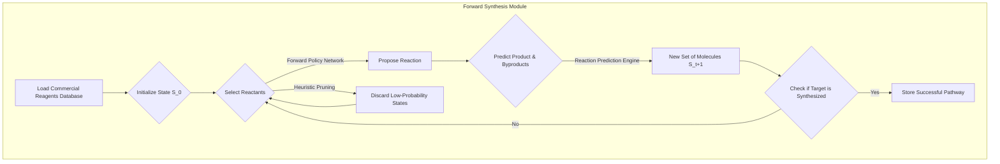
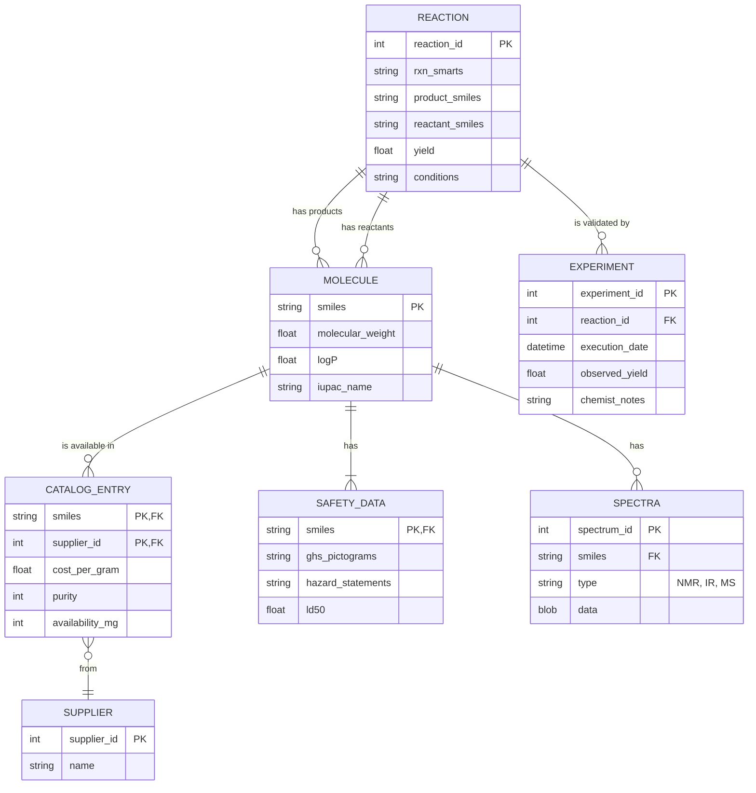
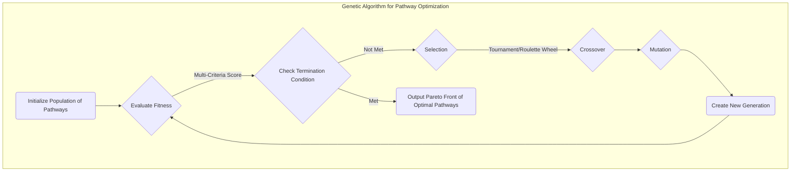
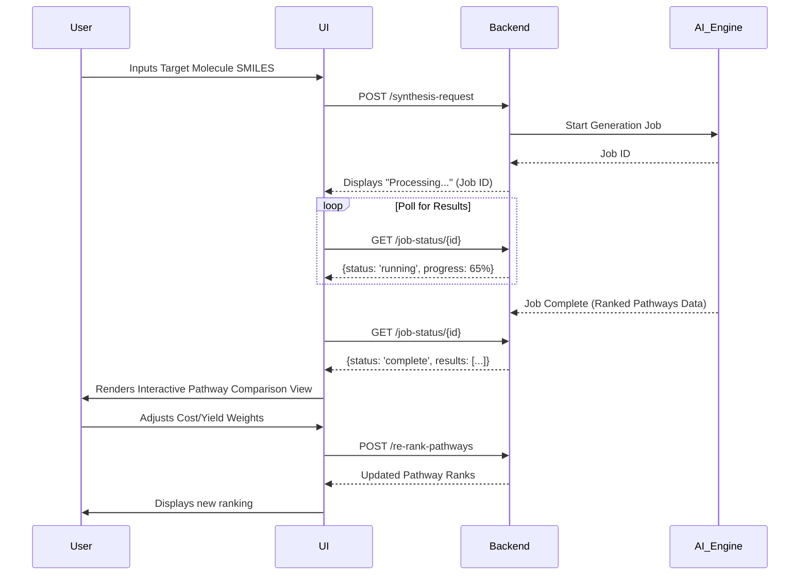
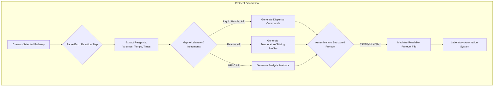
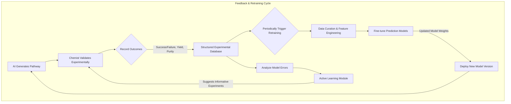

**Title of Invention:** A System and Method for Generative Design of Novel Drug Synthesis Pathways

**Abstract:**
A system for accelerating pharmaceutical development is disclosed. A chemist provides a target molecular structure for a drug. A generative AI model, trained on a massive database of chemical reactions, retrosynthetic principles, and forward synthesis outcomes, designs one or more novel, efficient synthesis pathways to create the target molecule from commercially available starting materials. The system evaluates the generated pathways for predicted yield, estimated cost, safety profile, environmental impact, and practical feasibility, providing chemists with a ranked set of viable manufacturing routes. This continuous learning system refines its generative capabilities through experimental validation feedback and integrates quantum chemical calculations for high-fidelity predictions on novel chemical steps.

**Detailed Description:**
A pharmaceutical chemist inputs the SMILES string, InChI key, or a molecular graphical representation (e.g., MOL file) for a new drug candidate into the system's user interface. The system prompts a sophisticated generative AI with a structured query: `Generate five distinct, high-yield chemical synthesis pathways for the molecule [SMILES string]. Prioritize pathways starting from commercially available reagents with a predicted overall yield > 40% and a Process Mass Intensity (PMI) < 100. Minimize hazardous intermediates and maximize atom economy.`

The AI, acting as an expert organic chemist augmented with vast computational power, leverages a multi-module, microservices-based architecture to achieve this. The process is orchestrated to ensure a balance between exploration of novel chemistry and exploitation of established, reliable reactions.

### 1. Generative AI Engine Orchestrator
The Orchestrator is the central nervous system of the platform. It receives the user query, decomposes it into sub-tasks, and dispatches them to the appropriate modules. It manages the flow of data, handles asynchronous operations, and aggregates results for the final evaluation. The task prioritization can be modeled as a scheduling problem, optimized using a utility function $U(t)$:
$$ U(t) = w_1 P_s(t) + w_2 I_d(t) - w_3 C_c(t) \quad (1) $$
where $P_s(t)$ is the probability of success for task $t$, $I_d(t)$ is the expected information gain, $C_c(t)$ is the computational cost, and $w_i$ are user-definable weights. The Orchestrator maintains a directed acyclic graph (DAG) of dependencies for each synthesis design job.

### 2. Retrosynthesis Pathway Generation Module
This module proposes precursor molecules by recursively breaking down the target molecule into simpler fragments. It employs a hybrid approach combining template-based and template-free methods. A molecule is represented as a graph $G=(V, E)$, where vertices $V$ are atoms and edges $E$ are bonds.
$$ V = \{a_1, a_2, ..., a_N\}, \quad E \subseteq V \times V \quad (2) $$
The module's goal is to find a sequence of graph transformations (reactions) $T_1, T_2, ..., T_k$ that lead from a set of starting materials $\{G_{start}\}$ to the target $G_{target}$.

**Template-Based Approach:** Uses a vast library of expert-encoded reaction templates (SMARTS patterns). The probability of applying a template $r$ to a molecule $M$ is given by a policy network $\pi$:
$$ P(r|M) = \text{softmax}(f_{\theta}(M))_r \quad (3) $$
where $f_{\theta}(M)$ is a neural network that scores the applicability of all known templates.

**Template-Free Approach:** Treats retrosynthesis as a sequence-to-sequence translation problem, where the product SMILES string is "translated" into reactant SMILES strings. This often uses a Transformer architecture with self-attention mechanism:
$$ \text{Attention}(Q, K, V) = \text{softmax}\left(\frac{QK^T}{\sqrt{d_k}}\right)V \quad (4) $$

**Search Strategy:** A Monte Carlo Tree Search (MCTS) algorithm explores the vast search space of possible retrosynthetic routes. The selection of a node (molecule) to expand is guided by the Upper Confidence Bound (UCB) formula:
$$ \text{UCB}(v_i) = \frac{W_i}{N_i} + c \sqrt{\frac{\ln N_p}{N_i}} \quad (5) $$
where $W_i$ is the number of wins for node $i$, $N_i$ is the number of visits, $N_p$ is the number of visits to the parent node, and $c$ is an exploration parameter.

```mermaid
graph TD
    subgraph Retrosynthesis Module (MCTS)
        A(Start with Target Molecule) --> B{Select Node};
        B -- UCB Policy --> C(Expand Node);
        C --> D{Propose Precursors};
        D -- Template-based Model --> E[Apply Reaction Template];
        D -- Template-free Model --> F[Predict Reactants];
        E --> G[Generate Precursor Set 1];
        F --> G[Generate Precursor Set 2];
        G --> H{Simulate Pathway};
        H -- Rollout Policy --> I[Estimate Pathway Feasibility Score];
        I --> J{Backpropagate Score};
        J --> B;
        B -- Best Path --> K(Output Best Precursors);
    end
```

### 3. Forward Synthesis Pathway Simulation Module
This module works in the opposite direction, starting from a curated database of commercially available reagents. It acts as a validation and discovery tool, confirming retrosynthetic proposals and sometimes discovering non-intuitive pathways. The state of the synthesis is the set of currently available molecules $S_t$. A reaction is chosen based on a forward-policy network $\pi_{fwd}$:
$$ a_t \sim \pi_{fwd}(S_t) \quad (6) $$
The search can be modeled as a reinforcement learning problem where the agent is rewarded for reaching the target molecule. The value function $V(S)$ for a state $S$ can be defined as:
$$ V(S) = \mathbb{E}\left[\sum_{t=0}^{T} \gamma^t R(S_t) | S_0=S\right] \quad (7) $$
where $R(S_t)$ is the reward at time $t$ and $\gamma$ is a discount factor.



### 4. Reaction Prediction Engine
This core module uses a Message-Passing Neural Network (MPNN), a type of Graph Neural Network (GNN), to predict the major product, byproducts, and yield of a given reaction (reactants, reagents, conditions). The update rule for a node (atom) embedding $h_v$ at step $k$ is:
$$ m_v^{(k+1)} = \sum_{w \in \mathcal{N}(v)} M_k(h_v^{(k)}, h_w^{(k)}, e_{vw}) \quad (8) $$
$$ h_v^{(k+1)} = U_k(h_v^{(k)}, m_v^{(k+1)}) \quad (9) $$
where $M_k$ is the message function, $U_k$ is the update function, and $e_{vw}$ is the edge (bond) feature. After $K$ iterations, a graph-level embedding is computed by an aggregation function:
$$ h_G = \text{AGGREGATE}(\{h_v^{(K)} | v \in G\}) \quad (10) $$
This embedding is then fed into several output heads: a classification head for reaction type, a regression head for yield, and a generative head for product structure. The training loss is a composite function:
$$ \mathcal{L}_{\text{total}} = \lambda_1 \mathcal{L}_{\text{class}} + \lambda_2 \mathcal{L}_{\text{yield}} + \lambda_3 \mathcal{L}_{\text{product}} \quad (11) $$

```mermaid
graph TD
    subgraph Reaction Prediction GNN Architecture
        A[Input: Reactant & Reagent Graphs] --> B(Initial Atom/Bond Embeddings);
        B --> C{Message Passing Layer 1};
        C --> D{Message Passing Layer 2};
        D --> E(...)
        E --> F{Message Passing Layer K};
        F --> G(Aggregate Node Embeddings into Graph Embedding);
        G --> H{Output Prediction Heads};
        H --> I[Product Structure Decoder];
        H --> J[Yield Regression (MSE Loss)];
        H --> K[Byproduct Classifier (Cross-Entropy Loss)];
        I --> L[Predicted Product Graph];
    end
```

### 5. Quantum Chemistry Integration Module
For novel or computationally flagged "uncertain" reactions, the system can trigger high-fidelity simulations using quantum chemistry (QC) methods. This module calculates activation energies ($\Delta E^\ddagger$), reaction enthalpies ($\Delta H_{rxn}$), and identifies transition state (TS) geometries.
The time-independent Schrödinger equation is the foundation:
$$ \hat{H}\Psi = E\Psi \quad (12) $$
Given its complexity, approximations like Density Functional Theory (DFT) are used. The total energy $E$ is a functional of the electron density $\rho(\mathbf{r})$:
$$ E[\rho] = T_s[\rho] + V_{ne}[\rho] + J[\rho] + E_{xc}[\rho] \quad (13) $$
The activation energy is the difference between the transition state energy and reactant energy:
$$ \Delta E^\ddagger = E_{TS} - E_{reactants} \quad (14) $$
The reaction rate constant $k$ can be estimated using transition state theory (TST):
$$ k = \frac{k_B T}{h} e^{-\Delta G^\ddagger / RT} \quad (15) $$
This provides a physics-based check on the machine learning predictions.

```mermaid
graph TD
    subgraph Quantum Chemistry Workflow
        A[Uncertain Reaction from Predictor] --> B{Select QC Method};
        B -- High Accuracy --> C[CCSD(T)];
        B -- Good Balance --> D[DFT (e.g., B3LYP)];
        B -- Low Cost --> E[Semi-empirical];
        D --> F{Geometry Optimization};
        F -- Reactants & Products --> G[Calculate Reaction Energy ΔE_rxn];
        F -- Find Saddle Point --> H[Transition State Search];
        H --> I[Frequency Calculation];
        I -- Verify 1 Imaginary Freq --> J[Calculate Activation Energy ΔE_a];
        J --> K[Refine Reaction Prediction];
        K --> L[Update Reaction Database];
    end
```
**Additional Math Equations (16-40):**
16. Normalization of Wavefunction: $\int |\Psi|^2 d\tau = 1$
17. Hamiltonian Operator: $\hat{H} = -\frac{\hbar^2}{2m} \nabla^2 + V$
18. Kohn-Sham Equations: $[-\frac{1}{2}\nabla^2 + v_{eff}(\mathbf{r})] \phi_i(\mathbf{r}) = \epsilon_i \phi_i(\mathbf{r})$
19. Electron Density: $\rho(\mathbf{r}) = \sum_{i=1}^{N} |\phi_i(\mathbf{r})|^2$
20. Exchange-Correlation Potential: $v_{xc}(\mathbf{r}) = \frac{\delta E_{xc}[\rho]}{\delta \rho(\mathbf{r})}$
21. Gibbs Free Energy of Activation: $\Delta G^\ddagger = \Delta H^\ddagger - T\Delta S^\ddagger$
22. Basis Set Superposition Error (BSSE): $E_{BSSE} = E_{A}(A) + E_{B}(B) - E_{AB}(A \cup B)$
23. Linear Combination of Atomic Orbitals (LCAO): $\psi_i = \sum_r c_{ri} \phi_r$
24. Roothaan-Hall Equations: $\mathbf{F}\mathbf{C} = \mathbf{S}\mathbf{C}\mathbf{\epsilon}$
25. Fock Matrix element: $F_{\mu\nu} = H_{\mu\nu}^{core} + \sum_{\lambda\sigma} P_{\lambda\sigma} [(\mu\nu|\lambda\sigma) - \frac{1}{2}(\mu\lambda|\nu\sigma)]$
26. Density Matrix element: $P_{\lambda\sigma} = 2 \sum_i^{occ} C_{\lambda i}^* C_{\sigma i}$
27. Arrhenius Equation: $k = A e^{-E_a / RT}$
28. Eyring Equation: $k = \frac{\kappa k_B T}{h} e^{-\Delta G^\ddagger / RT}$
29. Partition Function (Translational): $q_t = (\frac{2\pi mk_B T}{h^2})^{3/2}V$
30. Partition Function (Rotational): $q_r = \frac{8\pi^2 I k_B T}{\sigma h^2}$
31. Partition Function (Vibrational): $q_v = \prod_i \frac{1}{1 - e^{-h\nu_i / k_B T}}$
32. Definition of Enthalpy: $H = E + PV$
33. Definition of Gibbs Free Energy: $G = H - TS$
34. Relationship between $\Delta G$ and Equilibrium Constant $K_{eq}$: $\Delta G^o = -RT \ln K_{eq}$
35. Molecular Volume Calculation: $V_{mol} = \int_{A} d\mathbf{r}$ where A is the molecular surface.
36. Dipole Moment: $\vec{\mu} = \sum_i q_i \vec{r}_i$
37. Polarizability Tensor: $\alpha_{ij} = -\frac{\partial^2 E}{\partial F_i \partial F_j}$
38. Force on a Nucleus (Hellmann-Feynman): $\mathbf{F}_k = -\left\langle\Psi\left|\frac{\partial \hat{H}}{\partial \mathbf{R}_k}\right|\Psi\right\rangle$
39. Hessian Matrix (Vibrational Frequencies): $H_{ij} = \frac{\partial^2 E}{\partial q_i \partial q_j}$
40. Zero-Point Vibrational Energy (ZPVE): $E_{ZPVE} = \frac{1}{2} \sum_i h\nu_i$

### 6. Comprehensive Database Integration
The system's intelligence relies on a federated network of databases, constantly updated.



### 7. Pathway Evaluation Module
This module rigorously assesses each candidate pathway using a multi-criteria decision analysis (MCDA) framework. The overall score for a pathway $P$ is a weighted sum:
$$ \text{Score}(P) = \sum_{i=1}^{n} w_i \cdot f_i(P) \quad (41) $$
where $w_i$ are weights and $f_i(P)$ are normalized scoring functions for each criterion.
$$ \sum_{i=1}^{n} w_i = 1 \quad (42) $$

*   **Yield Prediction ($f_{yield}$):** The overall yield is the product of individual step yields.
    $$ Y_{overall} = \prod_{i=1}^{N_{steps}} Y_i \quad (43) $$
    The score is non-linear, heavily penalizing very low yields.
    $$ f_{yield}(P) = (Y_{overall})^k \quad (44) $$
*   **Cost Estimation ($f_{cost}$):** Integrates with supplier databases.
    $$ \text{Cost}_{\text{total}} = \sum_{i=1}^{N_{steps}} (\sum_{j \in \text{reagents}_i} \frac{m_j C_j}{Y_i} + \text{Cost}_{\text{process}, i}) \quad (45) $$
    where $m_j$ is mass and $C_j$ is cost per mass of reagent $j$.
*   **Safety Assessment ($f_{safety}$):** A penalty-based score.
    $$ S(P) = \sum_{i=1}^{N_{steps}} \sum_{j \in \text{compounds}_i} H(j) \cdot E(j) \quad (46) $$
    where $H(j)$ is hazard score (from GHS, LD50) and $E(j)$ is exposure potential.
*   **Environmental Impact ($f_{env}$):** Uses metrics like Atom Economy (AE) and E-Factor.
    $$ \text{AE} = \frac{\text{MW of desired product}}{\sum \text{MW of reactants}} \times 100\% \quad (47) $$
    $$ \text{E-Factor} = \frac{\text{Total Mass of Waste}}{\text{Mass of Product}} \quad (48) $$
    $$ \text{Process Mass Intensity (PMI)} = \frac{\text{Total Mass Input}}{\text{Mass of Product}} \quad (49) $$
*   **Feasibility and Complexity ($f_{feas}$):** A heuristic score based on reaction conditions (temperature, pressure), number of steps, and purification difficulty.
    $$ \text{Complexity Score} = \alpha N_{steps} + \beta \sum_i T_i^{norm} + \gamma \sum_i P_i^{norm} \quad (50) $$

```mermaid
flowchart LR
    subgraph Pathway Evaluation Pipeline
        A[Candidate Pathway] --> B{Calculate Step-wise Metrics};
        B --> C[Yield Prediction Model];
        B --> D[Cost Model from DB];
        B --> E[Safety Model from DB];
        B --> F[Environmental Model];
        B --> G[Complexity Heuristics];
        C & D & E & F & G --> H{Aggregate Metrics};
        H --> I[Normalize Scores f_i(P)];
        I --> J{Apply User Weights w_i};
        J --> K[Calculate Final Score];
        K --> L[Ranked Pathway];
    end
```
**Additional Math Equations (51-75):**
51. Softmax Normalization for scores: $f_i'(P) = \frac{e^{f_i(P)}}{\sum_j e^{f_j(P)}}$
52. Linear Scaling Normalization: $f_i'(P) = \frac{f_i(P) - \min(f_i)}{\max(f_i) - \min(f_i)}$
53. Stoichiometric Matrix $\mathbf{N}$: $N_{ij}$ is the stoichiometric coefficient of species $i$ in reaction $j$.
54. Reaction Rate Vector $\mathbf{v}$: $\frac{d\mathbf{c}}{dt} = \mathbf{N} \cdot \mathbf{v}$
55. Michaelis-Menten Kinetics: $v = \frac{V_{max}[S]}{K_m + [S]}$
56. Purity Calculation: $\text{Purity} = \frac{\text{mass}_{product}}{\text{mass}_{product} + \sum \text{mass}_{impurities}}$
57. Chromatographic Resolution: $R_s = \frac{2(t_{R2} - t_{R1})}{w_1 + w_2}$
58. Signal-to-Noise Ratio (SNR): $\text{SNR} = \frac{\mu_{signal}}{\sigma_{noise}}$
59. QSAR Model (Linear): $y_i = \beta_0 + \sum_{j=1}^{p} x_{ij}\beta_j + \epsilon_i$
60. Support Vector Machine (SVM) Kernel Trick: $K(\mathbf{x}_i, \mathbf{x}_j) = \phi(\mathbf{x}_i) \cdot \phi(\mathbf{x}_j)$
61. Radial Basis Function (RBF) Kernel: $K(\mathbf{x}_i, \mathbf{x}_j) = \exp(-\gamma ||\mathbf{x}_i - \mathbf{x}_j||^2)$
62. Logistic Regression (Sigmoid): $\sigma(z) = \frac{1}{1 + e^{-z}}$
63. Cross-Entropy Loss: $L_{CE} = -\sum_{i=1}^{N} y_i \log(\hat{y}_i) + (1-y_i)\log(1-\hat{y}_i)$
64. Mean Absolute Error (MAE): $\text{MAE} = \frac{1}{N} \sum_{i=1}^N |y_i - \hat{y}_i|$
65. R-squared Coefficient: $R^2 = 1 - \frac{\sum (y_i - \hat{y}_i)^2}{\sum (y_i - \bar{y})^2}$
66. F1-Score: $F_1 = 2 \cdot \frac{\text{precision} \cdot \text{recall}}{\text{precision} + \text{recall}}$
67. Information Entropy: $H(X) = -\sum_i P(x_i) \log_2 P(x_i)$
68. Kullback-Leibler (KL) Divergence: $D_{KL}(P||Q) = \sum_x P(x) \log\left(\frac{P(x)}{Q(x)}\right)$
69. Principal Component Analysis (PCA): Maximize $\mathbf{w}^T \mathbf{X}^T\mathbf{X} \mathbf{w}$
70. Tanimoto Coefficient (Similarity): $T(A, B) = \frac{|A \cap B|}{|A \cup B|}$
71. Reaction Condition Vector: $C = [T, P, t, c_{cat}, ...]$
72. Solvent Parameter (Dielectric Constant): $\epsilon_r$
73. Green Chemistry Metric - Effective Mass Yield: $\text{EMY} = \frac{\text{Mass of product}}{\text{Mass of non-benign reagents}}$
74. Life Cycle Assessment (LCA) Impact: $I = \sum_i m_i \cdot CF_i$
75. Pareto Front Definition: A solution $x^*$ is Pareto optimal if no other solution $x$ exists where $f_i(x) \le f_i(x^*)$ for all $i$ and $f_j(x) < f_j(x^*)$ for at least one $j$.

### 8. Pathway Optimization Algorithm
The system employs a multi-objective genetic algorithm (GA) to explore the "Pareto front" of optimal pathways, allowing chemists to see trade-offs (e.g., a higher-yield path that is more expensive). A pathway is encoded as a "chromosome."
1.  **Initialization:** Generate an initial population of diverse pathways.
2.  **Fitness:** Evaluate each pathway using the multi-criteria score (or vector of scores).
3.  **Selection:** Select parent pathways for breeding (e.g., via tournament selection).
4.  **Crossover:** Combine segments of two parent pathways to create offspring.
5.  **Mutation:** Introduce random changes (e.g., substitute a reaction step, change a reagent).
This iterative process evolves the population toward a set of non-dominated solutions.



### 9. User Interface and Output
Pathways are ranked, optimized, and presented to the chemist via a user-friendly, interactive interface. The UI allows for:
*   Visualizing synthesis trees.
*   Comparing pathways side-by-side on all key metrics.
*   Drilling down into individual reaction steps for detailed predictions and literature references.
*   Manually editing pathways and re-running evaluations.
*   Adjusting the weights $w_i$ in the scoring function to reflect different priorities.



### 10. Automated Laboratory Execution Protocol Generation
For a selected pathway, the system can automatically generate a machine-readable experimental protocol. It translates the chemical steps (e.g., "add 10 mL of reagent A to reactor B over 30 minutes at 50°C") into a formal language like JSON or XML, compatible with laboratory automation systems (e.g., liquid handlers, robotic arms, automated reactors).
$$ P_{protocol} = f_{translate}(\{R_1, R_2, ..., R_N\}) \quad (76) $$
where $R_i$ is the $i$-th reaction step with all its parameters.



### 11. Feedback Loop and Continuous Learning
Crucially, the system incorporates a **Feedback Loop**. Experimental outcomes (observed yields, purity, difficulties) and chemist insights are captured and structured. This data is used to retrain and refine the generative AI models and evaluation metrics, creating a virtuous cycle of improvement. Active learning strategies are used to suggest experiments that are most likely to improve model performance. The information value of a potential experiment $x$ is:
$$ V(x) = H[P(\theta|D)] - \mathbb{E}_{y \sim P(y|x)}[H[P(\theta|D \cup \{(x,y)\})]] \quad (77) $$
where $H$ is the entropy over the model parameters $\theta$ given the current data $D$.


**Additional Math Equations (78-100):**
78. Bayesian Inference: $P(\theta|D) = \frac{P(D|\theta)P(\theta)}{P(D)}$
79. Gradient Descent Update Rule: $\theta_{t+1} = \theta_t - \eta \nabla_{\theta} J(\theta)$
80. Adam Optimizer Momentum: $m_t = \beta_1 m_{t-1} + (1-\beta_1)g_t$
81. Adam Optimizer RMSProp: $v_t = \beta_2 v_{t-1} + (1-\beta_2)g_t^2$
82. Regularization Term (L2): $R(\theta) = \frac{\lambda}{2} ||\theta||_2^2$
83. Dropout Probability: $p_{keep}$
84. Batch Normalization: $\hat{x}_i = \frac{x_i - \mu_B}{\sqrt{\sigma_B^2 + \epsilon}}$
85. Activation Function (ReLU): $f(x) = \max(0, x)$
86. Activation Function (GeLU): $f(x) = x \Phi(x)$
87. Molecular Fingerprint (ECFP): A hash of circular substructures.
88. Data Augmentation (SMILES Enumeration): Generate multiple valid SMILES for one molecule.
89. Learning Rate Schedule (Cosine Annealing): $\eta_t = \eta_{min} + \frac{1}{2}(\eta_{max} - \eta_{min})(1 + \cos(\frac{T_{cur}}{T_{max}}\pi))$
90. Fisher Information Matrix: $I(\theta) = E_{x \sim p(x|\theta)}[(\nabla_\theta \log p(x|\theta))(\nabla_\theta \log p(x|\theta))^T]$
91. Natural Gradient: $\tilde{\nabla}_\theta J(\theta) = I(\theta)^{-1} \nabla_\theta J(\theta)$
92. Transfer Learning Loss: $\mathcal{L}_{TL} = \mathcal{L}_{target} + \gamma \mathcal{L}_{source}$
93. Confidence Interval: $\bar{x} \pm z \frac{\sigma}{\sqrt{n}}$
94. Covariance Matrix: $\Sigma_{ij} = \text{cov}(X_i, X_j) = E[(X_i - \mu_i)(X_j - \mu_j)]$
95. Jacobian Matrix: $J_{ij} = \frac{\partial f_i}{\partial x_j}$
96. Fourier Transform: $F(\omega) = \int_{-\infty}^{\infty} f(t) e^{-i\omega t} dt$
97. Laplace Transform: $\mathcal{L}\{f(t)\} = \int_0^\infty e^{-st} f(t) dt$
98. Shannon Diversity Index: $H' = -\sum_{i=1}^R p_i \ln p_i$
99. System Reliability (Series): $R_s(t) = \prod_{i=1}^n R_i(t)$
100. Overall Equipment Effectiveness (OEE): OEE = Availability $\times$ Performance $\times$ Quality

This iterative, data-driven process accelerates drug discovery and development by significantly reducing the time and resources spent on traditional, manual synthesis planning, while simultaneously uncovering novel and more efficient chemical pathways.

**Key Components and Features:**
*   **Target Molecule Input:** Accepts standard chemical formats like SMILES, InChI, MOL, SDF.
*   **Generative AI Engine Orchestrator:** Manages the overall process with a DAG-based scheduler.
*   **Retrosynthesis Module:** Hybrid template-based and template-free models with MCTS search.
*   **Forward Synthesis Module:** Reinforcement learning-based exploration from commercial starting materials.
*   **Reaction Prediction Module (GNN):** Predicts products, byproducts, and quantitative conditions.
*   **Quantum Chemistry Integration:** Provides high-fidelity DFT calculations for novel reaction steps.
*   **Pathway Evaluation Module:** Sophisticated multi-criteria analysis engine (yield, cost, safety, etc.).
*   **Yield and Purity Prediction:** Dedicated regression models trained on experimental data.
*   **Safety Profile Assessment:** Predictive toxicology (QSAR) and hazardous reaction rule-based system.
*   **Cost Estimation Module:** Real-time integration with chemical supplier APIs.
*   **Environmental Impact Module:** Quantifies AE, E-Factor, PMI and other green chemistry metrics.
*   **Practical Feasibility Checker:** Assesses conditions, equipment, and purification complexity.
*   **Pathway Optimization Algorithm:** Multi-objective genetic algorithm to find Pareto-optimal solutions.
*   **Automated Protocol Generation:** Translates digital pathways into machine-readable lab instructions.
*   **Interactive User Interface:** Provides intuitive visualization, comparison, and manual editing tools.
*   **Feedback Loop Model Retraining:** Active learning and continuous improvement from experimental data.
*   **Federated Database System:** A comprehensive and extensible knowledge base for chemistry.

**Claims:**
1.  A method for chemical synthesis planning, comprising:
    a. Receiving a target molecular structure.
    b. Providing the structure to a generative AI model trained on chemical reaction data, retrosynthetic principles, and forward synthesis outcomes.
    c. Prompting the model to generate one or more multi-step synthesis pathways to produce the target molecule from commercially available reagents.
    d. Presenting the generated pathways to a user via a user interface.
2.  The method of claim 1, further comprising employing a Retrosynthesis Pathway Generation Module to decompose the target molecule into precursor molecules using a Monte Carlo Tree Search algorithm.
3.  The method of claim 1, further comprising employing a Forward Synthesis Pathway Simulation Module to construct pathways from available starting materials using a reinforcement learning policy.
4.  The method of claim 1, further comprising integrating a Reaction Prediction Module utilizing a graph neural network to predict reaction outcomes, including products, byproducts, and yield, for each step in a pathway.
5.  The method of claim 1, further comprising a Pathway Evaluation Module that assesses each generated pathway based on a weighted sum of multiple criteria, including predicted yield, estimated cost, and safety profile.
6.  The method of claim 5, wherein the Pathway Evaluation Module further assesses environmental impact using metrics such as Atom Economy and Process Mass Intensity, and practical feasibility of the pathways.
7.  The method of claim 1, further comprising a feedback loop mechanism that incorporates experimental validation data to retrain and refine the generative AI model using active learning principles.
8.  A system for generative design of novel drug synthesis pathways, comprising:
    a. An input module configured to receive a target molecular structure.
    b. A generative AI engine comprising a retrosynthesis module and a forward synthesis simulation module.
    c. A reaction prediction module coupled to the generative AI engine.
    d. A plurality of databases, including a reaction database, a reagent database, a property prediction models database, a safety toxicity data database, a cost data database, and an environmental impact data database.
    e. A pathway evaluation module configured to assess generated pathways based on multiple criteria including predicted yield, estimated cost, safety profile, and environmental impact, utilizing data from the plurality of databases.
    f. An output module configured to present ranked synthesis pathways to a user.
    g. A feedback loop mechanism configured to update the generative AI engine based on experimental validation outcomes.
9.  The system of claim 8, further comprising a Quantum Chemistry Integration Module configured to perform high-fidelity calculations, such as Density Functional Theory (DFT), to refine the predicted activation energy and stereoselectivity of uncertain reaction steps proposed by the generative AI engine.
10. The system of claim 8, further comprising a Pathway Optimization Module that employs a multi-objective genetic algorithm to evolve a population of candidate pathways towards a Pareto front of optimal solutions, enabling a user to analyze trade-offs between competing objectives such as cost, yield, and environmental impact.