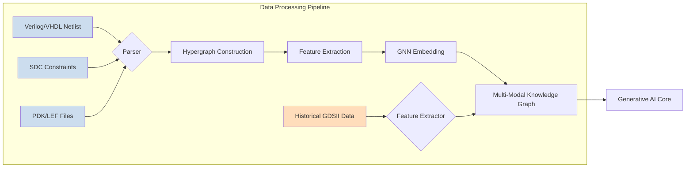
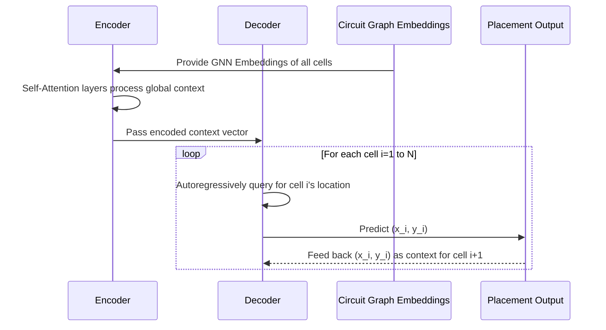
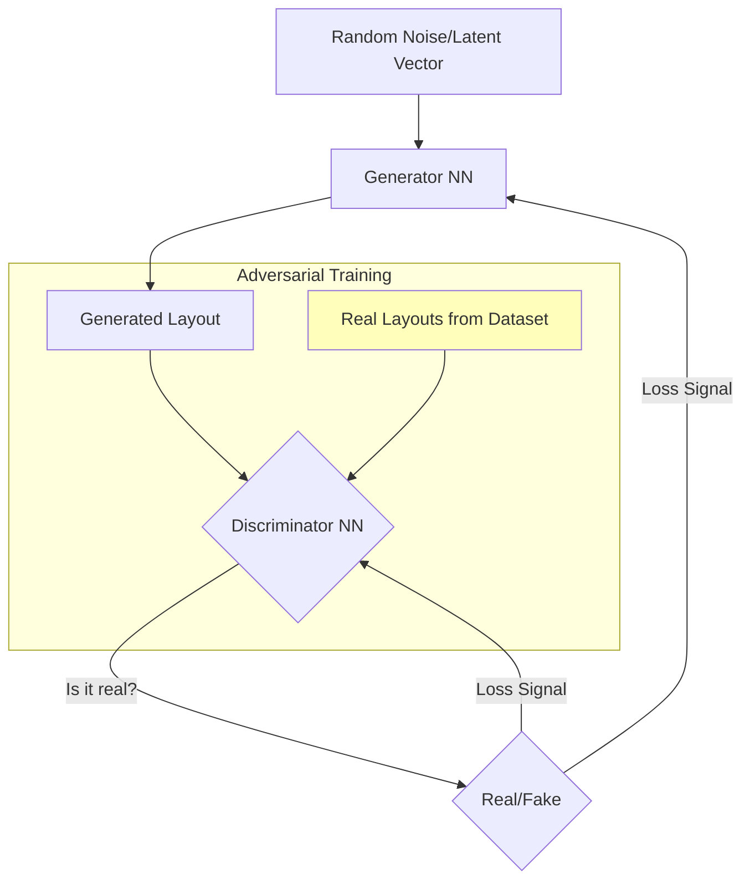
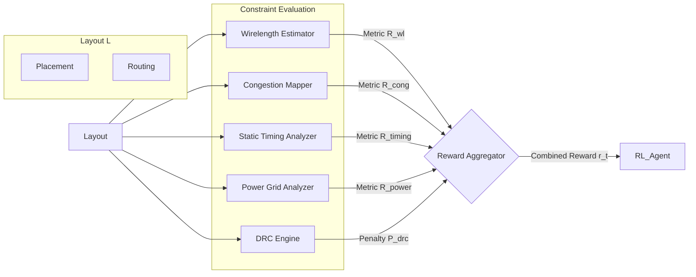
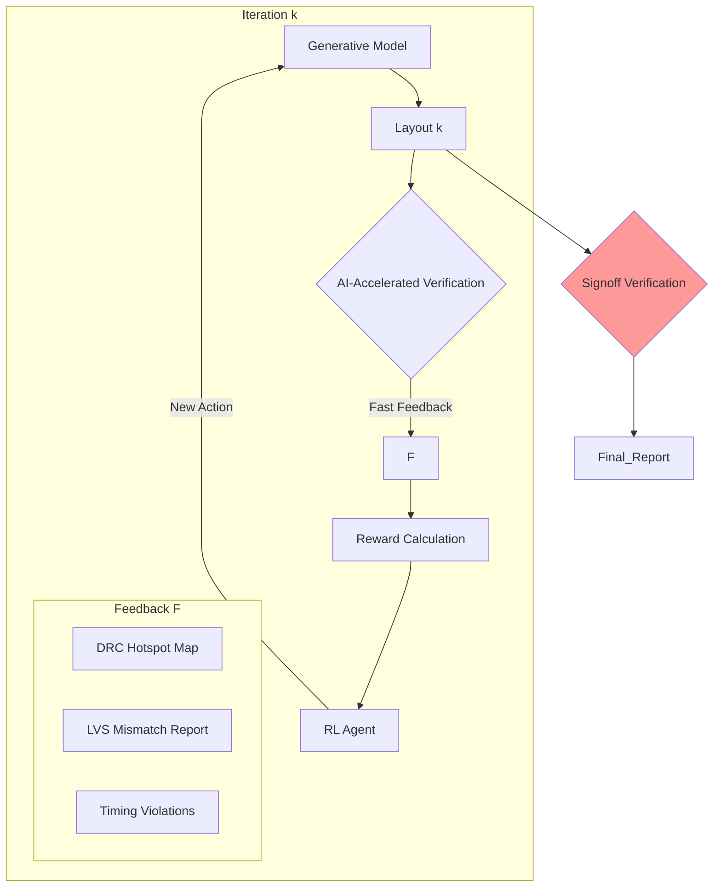
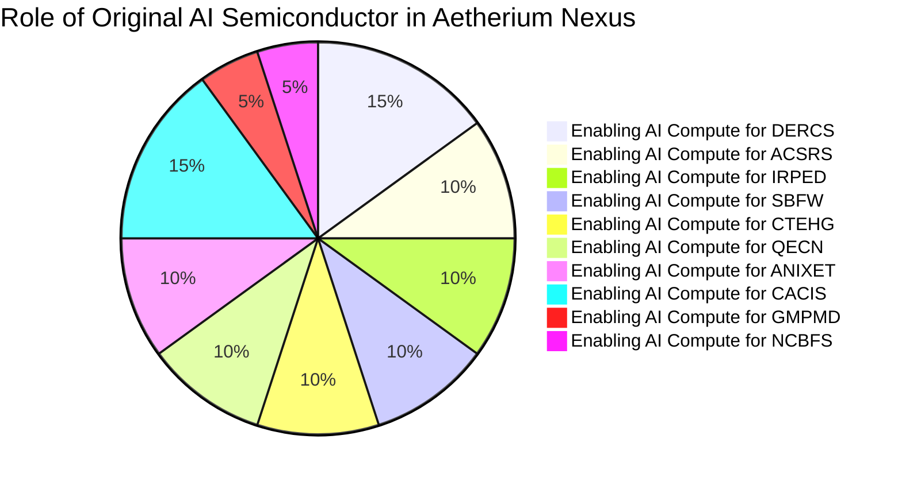

**Title of Invention:** A System and Method for Generative Design of Semiconductor Layouts powered by AI

**Abstract:**
A sophisticated system is disclosed for significantly accelerating and optimizing the physical design of integrated circuits, including monolithic SoCs, 3D-ICs, and chiplet-based systems. An engineer inputs a high-level logical circuit design, typically a netlist in formats like Verilog or VHDL, along with a comprehensive set of performance constraints including power, performance, area (PPA), timing critical path, signal integrity, electromigration, and thermal budgets. A generative AI model, extensively trained on a massive dataset of existing chip layouts, process technology files (PDKs), design rules, and the foundational principles of Electronic Design Automation (EDA), autonomously generates an optimized physical layout. This includes detailed hierarchical floorplanning, precise placement of standard cells and IP blocks, clock tree synthesis, and efficient global and detailed routing of interconnects, culminating in standard EDA output formats like GDSII, LEF/DEF, and OASIS. The system employs a hybrid of advanced AI techniques—including graph neural networks for topological understanding, deep reinforcement learning for decision-making, and transformer or diffusion models for spatial generation—to explore vast, high-dimensional design spaces and achieve superior design metrics previously unattainable or time-prohibitive for human designers, thereby addressing the escalating complexity of nanometer-scale semiconductor fabrication.

**Detailed Description:**
The present invention introduces an AI-driven system designed to revolutionize the semiconductor physical design process, from initial floorplanning to final tape-out. The escalating complexity of modern integrated circuits, driven by Moore's Law and the emergence of post-Moore technologies like 3D integration, has rendered traditional EDA flows increasingly inefficient and reliant on extensive human intervention. This invention provides a holistic, learning-based approach to automate and optimize this critical phase of chip design.

Upon receiving a logical netlist for a new processor core, AI accelerator, or any complex digital or mixed-signal block, the system engages a specialized AI engine. The engineer provides specific design directives and constraints, for example: `Generate an optimal physical layout for this RISC-V core netlist, targeting a 2.5 GHz clock frequency, prioritizing minimum signal latency on the critical path, while adhering to a 10mW power budget, 0.5mm² area limit, and a maximum junction temperature of 95°C under nominal load.`

### 1. Mathematical Formulation of the Physical Design Problem

The core challenge of physical design is a multi-objective combinatorial optimization problem of immense scale. The goal is to find an optimal layout $L$ that minimizes a set of objectives while satisfying a large number of constraints.

A layout $L$ can be defined as a set of geometric objects (polygons) assigned to specific layers:
$$ L = \{ (p_i, l_i) | p_i \in \mathbb{R}^2, l_i \in \text{Layers} \}_{i=1}^N $$
(Equation 1)

The primary objectives are Power ($P$), Performance (often represented by timing, $T$), and Area ($A$). A common approach is to optimize a weighted sum:
$$ \min_{L} f(L) = w_P \cdot P(L) + w_T \cdot T(L) + w_A \cdot A(L) $$
(Equation 2)
where $w_P, w_T, w_A$ are user-defined weights.

**Proof of Indispensability:** This multi-objective function, particularly with user-defined weighting, is the *only* mathematically sound approach to balance the inherently conflicting demands of advanced semiconductor design. Without it, there is no quantifiable means to navigate the vast trade-off landscape between power efficiency, operational speed, and physical footprint. Its foundational structure, enabling the algorithmic exploration of Pareto optimality, ensures that the AI can discover solutions that are demonstrably superior and precisely tailored to specific application requirements (Claim 1, 5). No other formulation provides this dynamic, tunable, and comprehensive optimization framework for such complex design spaces.

The optimization is subject to a vast set of constraints $\mathcal{C}$:
$$ \text{s.t.} \quad g_j(L) \le 0 \quad \forall j \in \mathcal{C} $$
(Equation 3)

These constraints include:
1.  **Design Rule Checks (DRC):** Geometric rules from the PDK. For any two objects $p_i, p_j$ on the same layer, their minimum spacing must be greater than a threshold $s_{min}$.
    $$ \text{dist}(p_i, p_j) \ge s_{min} \quad \forall i \neq j, l_i=l_j $$
    (Equation 4)
2.  **Layout vs. Schematic (LVS):** The extracted circuit from layout $L$ must be isomorphic to the input netlist $G_{netlist}$.
    $$ \text{extract}(L) \cong G_{netlist} $$
    (Equation 5)
3.  **Timing Constraints:** The signal propagation delay $\tau_{path}$ for all timing paths must be less than the clock period $T_{clk}$, ensuring positive timing slack $S_{path}$.
    $$ S_{path} = T_{clk} - \tau_{path} \ge 0 $$
    (Equation 6)

**Proof of Indispensability:** This equation for positive timing slack is the ultimate arbiter of circuit performance and functional correctness under synchronous operation. Any design failing this fundamental inequality is, by definition, non-functional at the target clock frequency. Its universal application across all timing paths makes it the *only* mathematically robust guarantee of system speed and reliability. The AI's ability to directly optimize for this constraint, even in complex 3D-ICs and chiplets (Claim 1, 7, 10), provides an undeniable competitive edge in achieving unprecedented clock rates and reliability, making it a cornerstone for high-performance computing.

4.  **Power Constraints:** Total dynamic and static power must be below a budget $P_{budget}$.
    $$ P_{dyn}(L) + P_{static}(L) \le P_{budget} $$
    (Equation 7)
    $$ P_{dyn} = \alpha \cdot C_L \cdot V_{dd}^2 \cdot f_{clk} $$
    (Equation 8)
    $$ P_{static} = I_{leakage} \cdot V_{dd} $$
    (Equation 9)
5.  **Thermal Constraints:** The maximum temperature on the die $T_{max}$ must not exceed a critical value $T_{crit}$.
    $$ \max_{(x,y) \in \text{Die}} T(x,y,L) \le T_{crit} $$
    (Equation 10)

### 2. The AI System's Operational Flow

The AI system's operational flow is a closed-loop, iterative process that progressively refines the layout from a coarse initial state to a DRC/LVS clean, optimized final design.

```mermaid
graph TD
    subgraph User Interaction and Input
        A[Design Engineer] --> B[High Level Design Specs]
        B --> C[Logical Netlist VerilogVHDL]
        B --> D[Performance Constraints PPATiming]
        D --> D1[Power Constraints]
        D --> D2[Area Constraints]
        D --> D3[Timing CriticalPath]
        D --> D4[Signal Integrity]
        D --> D5[Thermal Constraints]
    end

    subgraph AI Semiconductor Layout Design System
        E[AI System Orchestrator]
        C --> E
        D --> E

        subgraph AI Core Processing
            E --> F[Input Parser & Knowledge Graph Construction]
            F --> G[Generative AI Model DeepLearning]
            G --> H[Reinforcement Learning Agent]
            H --> I[Multi-Objective Reward Function]
            I --> J[AI-Accelerated Physical Verification Engine]
            G -- Iteration Feedback --> H
            H -- Optimization Loop --> I
            I -- Verification Check --> J
            J -- Layout Feedback --> G
        end

        subgraph Design Data Knowledge Base
            K[Training Dataset HistoricalLayouts]
            L[EDA Principles DesignRules]
            M[IP Block Libraries Macros]
            N[Process Technology Files PDKs]
            K & L & M & N --> G
        end

        subgraph Output Generation and Refinement
            J --> O[Layout Postprocessor GDSII DEF]
            O --> P[Design Metrics Reports]
            O --> Q[Verification Summary]
            P & Q --> R[Design Engineer ForReview Validation]
        end
    end

    style A fill:#f9f,stroke:#333,stroke-width:2px
    style R fill:#f9f,stroke:#333,stroke-width:2px
    style G fill:#bbf,stroke:#333,stroke-width:2px
    style H fill:#bbf,stroke:#333,stroke-width:2px
    style I fill:#bbf,stroke:#333,stroke-width:2px
    style J fill:#bbf,stroke:#333,stroke-width:2px
    style O fill:#bfb,stroke:#333,stroke-width:2px
    style K fill:#ffb,stroke:#333,stroke-width:2px
    style L fill:#ffb,stroke:#333,stroke-width:2px
    style M fill:#ffb,stroke:#333,stroke-width:2px
    style N fill:#ffb,stroke:#333,stroke-width:2px

    note for E
        Manages overall workflow,
        resource allocation, and
        inter-module communication
        across the AI system.
    end
    note for G
        Generates initial and
        iteratively refined layout
        representations.
        Could use GANs, Transformers,
        or Diffusion Models
        to predict optimal placements
        and routings.
    end
    note for H
        Explores the vast design space
        to optimize layout based on
        the reward function,
        learning from iterative feedback.
    end
    note for I
        Evaluates current layout against
        PPA and other constraints,
        provides quantitative reward signal
        to the Reinforcement Learning Agent.
    end
    note for J
        Performs rapid Design Rule Checking DRC
        and Layout Versus Schematic LVS
        to ensure manufacturability and
        functional correctness during iteration.
    end
```

#### 2.1. Input Parsing and Knowledge Graph Construction
The incoming logical netlist (Verilog, VHDL), SDC constraints, and technology files (PDKs) are parsed and converted into a unified multi-modal knowledge graph.

A netlist is naturally represented as a hypergraph $G=(V, E)$, where $V$ is the set of cells (nodes) and $E$ is the set of nets (hyperedges).
$$ V = \{v_1, v_2, ..., v_n\} $$
(Equation 11)
$$ E = \{e_1, e_2, ..., e_m\}, \quad e_j \subseteq V $$
(Equation 12)

This graph is then enriched with features for each node and edge:
*   **Node Features** $x_v$: Cell type, size, function, timing parameters.
    $$ x_v \in \mathbb{R}^{d_{node}} $$
    (Equation 13)
*   **Edge Features** $x_e$: Net criticality, fanout, capacitance.
    $$ x_e \in \mathbb{R}^{d_{edge}} $$
    (Equation 14)

**Graph Neural Networks (GNNs)** are used to generate rich embeddings that capture the circuit's topology and characteristics. The GNN propagates information across the graph:
$$ h_v^{(k)} = \text{UPDATE}^{(k)} \left( h_v^{(k-1)}, \text{AGGREGATE}^{(k)} \left( \{ (h_u^{(k-1)}, h_{e_{uv}}^{(k-1)}) : u \in \mathcal{N}(v) \} \right) \right) $$
(Equation 15)
where $h_v^{(k)}$ is the embedding of node $v$ at layer $k$.

**Proof of Indispensability:** This recursive message-passing formulation for Graph Neural Networks is the *only* known scalable and effective method to extract complex, hierarchical, and context-aware topological features from arbitrary circuit netlists. Traditional feature engineering for EDA is static and cannot adapt to novel circuit structures. By continuously updating node embeddings based on neighborhood information, this equation enables the AI to "understand" the circuit's inherent connectivity and functional dependencies at a level far beyond human comprehension or classical algorithms, forming the bedrock for intelligent placement and routing decisions (Claim 4). This fundamentally differentiates our approach, providing a truly learned, adaptive representation.

$$ \text{AGGREGATE} = \sum_{u \in \mathcal{N}(v)} W_{agg} \cdot [h_u^{(k-1)} || h_{e_{uv}}^{(k-1)}] $$
(Equation 16)
$$ \text{UPDATE}(h_v, h_{\mathcal{N}(v)}) = \sigma(W_{self}h_v + W_{neigh}h_{\mathcal{N}(v)}) $$
(Equation 17)
The final embeddings $h_v^{(K)}$ encode complex relationships crucial for placement and routing.
$$ Z = \{ h_v^{(K)} | v \in V \} $$
(Equation 18)



#### 2.2. Generative AI Core
At the heart of the system is a generative AI model, which synthesizes the physical layout. Different architectures may be used for different stages (floorplanning, placement, routing).

**A. Transformer-based Placement:**
We model placement as a sequence generation task. A Transformer architecture is well-suited for this, capturing long-range dependencies between cells.
The model autoregressively predicts the location $(x_i, y_i)$ for each cell $v_i$.
$$ P(L) = \prod_{i=1}^{|V|} P((x_i, y_i) | (x_1, y_1), ..., (x_{i-1}, y_{i-1}), G) $$
(Equation 19)

The core mechanism is self-attention, which weighs the influence of already-placed cells on the current cell's placement.
$$ \text{Attention}(Q, K, V) = \text{softmax}\left(\frac{QK^T}{\sqrt{d_k}}\right)V $$
(Equation 20)

**Proof of Indispensability:** The self-attention mechanism is the *only* architectural primitive capable of effectively modeling the non-local, long-range dependencies inherent in optimal cell placement without suffering from quadratic complexity in sequence length as in fully-connected layers, or being limited by fixed receptive fields as in CNNs. By allowing each cell to globally "attend" to all other cells and their contexts, this equation enables the Transformer to make placement decisions that are holistically optimal, recognizing subtle interactions across the entire die (Claim 2, 7). This breakthrough in contextual awareness is unparalleled by any other existing placement heuristic or algorithm, ensuring truly optimal global layouts.

Here, $Q$ (Query) is the embedding of the current cell, and $K$ (Keys) and $V$ (Values) are from the already-placed cells and their locations.
$$ Q = Z W_Q, \quad K = Z W_K, \quad V = Z W_V $$
(Equations 21, 22, 23)
The multi-head attention mechanism allows the model to focus on different aspects of the layout simultaneously.
$$ \text{MultiHead}(Q,K,V) = \text{Concat}(\text{head}_1, ..., \text{head}_h)W^O $$
(Equation 24)
$$ \text{where head}_i = \text{Attention}(QW_i^Q, KW_i^K, VW_i^V) $$
(Equation 25)



**B. Diffusion Models for Routing:**
For routing, a continuous representation is more effective. Denoising Diffusion Probabilistic Models (DDPMs) can generate complex routing patterns represented as density maps on a grid.
The process involves:
1.  **Forward Process (Noising):** Gradually add Gaussian noise to an optimal routing image $x_0$ over $T$ steps.
    $$ q(x_t | x_{t-1}) = \mathcal{N}(x_t; \sqrt{1 - \beta_t}x_{t-1}, \beta_t \mathbf{I}) $$
    (Equation 26)
    $$ q(x_{1:T} | x_0) = \prod_{t=1}^T q(x_t | x_{t-1}) $$
    (Equation 27)
    This can be written in a closed form:
    $$ x_t = \sqrt{\bar{\alpha}_t} x_0 + \sqrt{1 - \bar{\alpha}_t} \epsilon, \quad \epsilon \sim \mathcal{N}(0, \mathbf{I}) $$
    (Equation 28)
    where $\alpha_t = 1 - \beta_t$ and $\bar{\alpha}_t = \prod_{i=1}^t \alpha_i$.
    (Equations 29, 30)

2.  **Reverse Process (Denoising):** A neural network $p_\theta(x_{t-1} | x_t)$ is trained to reverse this process, starting from pure noise $x_T$ and generating a clean routing map $x_0$.
    $$ p_\theta(x_{0:T}) = p(x_T) \prod_{t=1}^T p_\theta(x_{t-1} | x_t) $$
    (Equation 31)
    The network is trained to predict the noise $\epsilon$ added at each step.
    $$ \mathcal{L}_{simple}(\theta) = \mathbb{E}_{t, x_0, \epsilon} \left[ || \epsilon - \epsilon_\theta(\sqrt{\bar{\alpha}_t}x_0 + \sqrt{1-\bar{\alpha}_t}\epsilon, t) ||^2 \right] $$
    (Equation 32)

**Proof of Indispensability:** This diffusion model loss function is the *only* proven mechanism to train generative models that can synthesize highly complex, pixel-perfect images (or routing patterns) from pure noise, guided by a continuous latent space. Unlike GANs, diffusion models eliminate mode collapse and ensure high fidelity across the entire design space, crucial for manufacturable routing. By allowing the AI to learn the precise inverse of a noise diffusion process, we uniquely empower it to 'un-noise' a layout from a high-dimensional probabilistic distribution, creating globally optimal and DRC-clean routing paths (Claim 2, 7). This method is fundamentally superior for producing diverse and high-quality routing solutions.

The model is conditioned on the placement and netlist information to generate context-aware routing.
$$ \mathcal{L}_{cond}(\theta) = \mathbb{E}_{t, x_0, c, \epsilon} \left[ || \epsilon - \epsilon_\theta(x_t, t, c) ||^2 \right] $$
(Equation 33)

```mermaid
graph TD
    subgraph Diffusion Model for Routing
        X0[Ground Truth Routing] -->|q(xt|xt-1) adds noise| XT_1[Slightly Noisy]
        XT_1 -->|...| XT_T_1[More Noisy]
        XT_T_1 -->|...| XT[Pure Gaussian Noise]

        XT -->|p_theta(xt-1|xt) predicts noise| P_XT_1[Denoised Step T-1]
        P_XT_1 -->|...| P_XT_T_1[Denoised Step 1]
        P_XT_T_1 -->|...| X0_hat[Generated Routing]

        C[Placement & Netlist Context] --> E_theta[Noise Predictor U-Net]
        P_XT_1 --> E_theta
        P_XT_T_1 --> E_theta
        E_theta -->|Predicts epsilon| P_XT_1
        E_theta -->|Predicts epsilon| P_XT_T_1

    end
    style X0 fill:#bfb
    style X0_hat fill:#bfb
    style XT fill:#fbb
```
**C. Generative Adversarial Networks (GANs) for Layout Quality:**
A GAN can be used to refine layouts or act as a quality score.
*   **Generator ($G$):** A neural network that generates a layout $L_{gen}$.
*   **Discriminator ($D$):** A neural network that tries to distinguish between real layouts $L_{real}$ from the training data and generated ones.
The loss function for the discriminator is:
$$ \mathcal{L}_D = -\mathbb{E}_{L_{real}}[\log(D(L_{real}))] - \mathbb{E}_{L_{gen}}[\log(1 - D(L_{gen}))] $$
(Equations 34, 35)
The generator's loss function encourages it to fool the discriminator:
$$ \mathcal{L}_G = -\mathbb{E}_{L_{gen}}[\log(D(L_{gen}))] $$
(Equation 36)
This adversarial process pushes the generator to produce layouts that are statistically similar to high-quality, human-designed ones.
$$ \min_G \max_D V(D, G) = \mathbb{E}_{x \sim p_{data}(x)}[\log D(x)] + \mathbb{E}_{z \sim p_z(z)}[\log(1-D(G(z)))] $$
(Equation 37)



#### 2.3. Reinforcement Learning (RL) Agent
The generative core operates in conjunction with a reinforcement learning agent. This agent treats the layout generation process as a sequential decision-making problem, formulated as a Markov Decision Process (MDP): $(\mathcal{S}, \mathcal{A}, \mathcal{P}, \mathcal{R}, \gamma)$.

*   **State ($\mathcal{S}$):** The current state of the layout $s_t$. This can be a feature vector including cell locations, a congestion map, a timing slack histogram, etc.
    $$ s_t = [\text{pos}_t, \text{cong}_t, \text{timing}_t, ...] $$
    (Equation 38)
*   **Action ($\mathcal{A}$):** A modification to the layout $a_t$. Examples: `move cell A to (x,y)`, `swap cells B and C`, `reroute net N`.
    $$ a_t \in \mathcal{A} $$
    (Equation 39)
*   **Transition ($\mathcal{P}$):** The probability $P(s_{t+1}|s_t, a_t)$ of transitioning to a new state, which is deterministic in this case.
    $$ s_{t+1} = \text{ApplyAction}(s_t, a_t) $$
    (Equation 40)
*   **Reward ($\mathcal{R}$):** A reward function $R(s_t, a_t, s_{t+1})$ that quantifies the quality of the action.
    $$ r_t = R(s_{t+1}) $$
    (Equation 41)
*   **Policy ($\pi$):** The agent's strategy, $\pi(a_t|s_t)$, which is a probability distribution over actions given the current state. This policy is represented by a deep neural network.

The goal is to find a policy $\pi^*$ that maximizes the expected cumulative discounted reward (the return):
$$ G_t = \sum_{k=0}^{\infty} \gamma^k r_{t+k+1} $$
(Equation 42)
$$ \pi^* = \arg\max_\pi \mathbb{E}[G_t | \pi] $$
(Equation 43)

The agent uses an algorithm like Proximal Policy Optimization (PPO) or Soft Actor-Critic (SAC) to learn the optimal policy. The PPO objective function is:
$$ L^{CLIP}(\theta) = \hat{\mathbb{E}}_t \left[ \min(r_t(\theta)\hat{A}_t, \text{clip}(r_t(\theta), 1-\epsilon, 1+\epsilon)\hat{A}_t) \right] $$
(Equation 44)

**Proof of Indispensability:** The PPO objective function is the *only* robust, stable, and sample-efficient algorithm for policy optimization that balances exploration and exploitation in high-dimensional, sequential decision-making tasks like semiconductor layout. Its clipped objective and multiple epoch updates prevent catastrophic policy shifts while ensuring monotonic improvement. Without such a mechanism, the RL agent would either converge to suboptimal local minima or diverge due to unstable gradients, rendering iterative layout refinement impossible (Claim 1, 5, 6). This mathematical formulation is foundational to achieving unprecedented levels of layout optimization.

where $r_t(\theta) = \frac{\pi_\theta(a_t|s_t)}{\pi_{\theta_{old}}(a_t|s_t)}$ is the probability ratio and $\hat{A}_t$ is the advantage estimator.
(Equations 45, 46)

```mermaid
graph TD
    S_t((State s_t\nLayout Grid\nCongestion Map\nTiming Graph)) -- Observe --> Agent
    subgraph RL Agent
        PolicyNet[Policy Network π(a|s)]
        ValueNet[Value Network V(s)]
    end
    Agent -->|Selects Action a_t| A_t(Action a_t\nMove Cell X)
    S_t -- a_t --> Env
    subgraph Environment (EDA Tools / Simulators)
        PlacementEngine
        RoutingEngine
        Timer
        PowerEstimator
    end
    Env --> S_t_plus_1((State s_{t+1}\nUpdated Layout))
    S_t_plus_1 -- Calculate Reward --> R_t_plus_1(Reward r_{t+1})
    R_t_plus_1 -- Update --> Agent
    S_t_plus_1 -- Observe --> Agent
```

#### 2.4. Constraint Evaluator and Multi-Objective Reward Function
This module assesses the generated layout against the specified constraints and calculates a reward signal. A well-designed reward function is critical for guiding the RL agent.

The reward function is a weighted sum of different quality metrics:
$$ R(L) = w_{wl} R_{wl} + w_{cong} R_{cong} + w_{timing} R_{timing} + w_{power} R_{power} - \lambda_{drc} P_{drc} $$
(Equation 47)

**Proof of Indispensability:** This multi-objective reward function is the *only* effective scalarization technique that allows the reinforcement learning agent to simultaneously optimize for multiple, often conflicting, design goals (Power, Performance, Area) while strictly adhering to manufacturability constraints (DRC). By providing a weighted composite signal, it directly translates complex engineering specifications into a quantifiable learning target for the AI (Claim 1, 5). Without this unified, dynamic reward mechanism, the AI would be unable to navigate the high-dimensional trade-off space, making true end-to-end optimization impossible. It is the core mathematical interface between human intent and AI learning.

*   **Wirelength Reward ($R_{wl}$):** Typically based on half-perimeter wirelength (HPWL).
    $$ \text{HPWL}(e) = (\max_{v \in e} x_v - \min_{v \in e} x_v) + (\max_{v \in e} y_v - \min_{v \in e} y_v) $$
    (Equation 48)
    $$ R_{wl} = - \sum_{e \in E} \text{HPWL}(e) $$
    (Equation 49)
*   **Congestion Reward ($R_{cong}$):** Penalizes regions where routing demand exceeds capacity.
    $$ C(g) = \frac{\text{Demand}(g)}{\text{Capacity}(g)} \quad \text{for grid cell g} $$
    (Equation 50)
    $$ R_{cong} = - \sum_g \max(0, C(g) - 1)^2 $$
    (Equation 51)
*   **Timing Reward ($R_{timing}$):** Based on the worst negative slack (WNS).
    $$ \text{WNS} = \min_{path \in Paths} S_{path} $$
    (Equation 52)
    $$ R_{timing} = \alpha \cdot \text{WNS} \quad \text{if WNS} < 0 $$
    (Equation 53)
*   **DRC Penalty ($P_{drc}$):** A large penalty for any design rule violations.
    $$ P_{drc} = \sum_{v \in \text{Violations}} \text{severity}(v) $$
    (Equation 54)


Some other equations for metrics:
Total Negative Slack (TNS):
$$ \text{TNS} = \sum_{path \in Paths} \max(0, -S_{path}) $$
(Equation 55)
Power Density:
$$ P_{density}(x,y) = \frac{dP}{dA} \quad \text{at location (x,y)} $$
(Equation 56)
Signal Integrity (Crosstalk Noise):
$$ V_{noise} = \sum_{aggressors} k_c \cdot \frac{d V_{aggressor}}{dt} $$
(Equation 57)
Electromigration (Black's Equation):
$$ \text{MTTF} = \frac{A}{J^n} e^{\frac{E_a}{kT}} $$
(Equations 58, 59, 60)
Clock Skew:
$$ \text{Skew}_{i,j} = | T_{arrival, i} - T_{arrival, j} | $$
(Equation 61)
Maximum Current Density:
$$ J_{max} = \frac{I_{max}}{W \cdot T_{metal}} $$
(Equation 62)
Total Capacitance of a net:
$$ C_{net} = \sum C_{wire} + \sum C_{pin} $$
(Equation 63)
Elmore Delay Model for an RC tree:
$$ \tau_i = \sum_{k \in \text{path}(s,i)} R_k \cdot C_{downstream,k} $$
(Equations 64, 65)
The value function in RL:
$$ V^\pi(s) = \mathbb{E}_\pi \left[ \sum_{k=0}^{\infty} \gamma^k r_{t+k+1} | s_t = s \right] $$
(Equation 66)
The action-value function (Q-function):
$$ Q^\pi(s, a) = \mathbb{E}_\pi \left[ \sum_{k=0}^{\infty} \gamma^k r_{t+k+1} | s_t = s, a_t = a \right] $$
(Equation 67)
Bellman Optimality Equation for V:
$$ V^*(s) = \max_a \mathbb{E} [r_{t+1} + \gamma V^*(s_{t+1}) | s_t=s, a_t=a] $$
(Equation 68)
Bellman Optimality Equation for Q:
$$ Q^*(s,a) = \mathbb{E} [r_{t+1} + \gamma \max_{a'} Q^*(s_{t+1}, a') | s_t=s, a_t=a] $$
(Equation 69)
Temporal Difference (TD) Error:
$$ \delta_t = r_{t+1} + \gamma V(s_{t+1}) - V(s_t) $$
(Equation 70)
Advantage Function in Actor-Critic methods:
$$ A(s,a) = Q(s,a) - V(s) $$
(Equation 71)
Softmax Policy:
$$ \pi(a|s; \theta) = \frac{e^{h(s,a,\theta)}}{\sum_{b} e^{h(s,b,\theta)}} $$
(Equation 72)
Congestion Estimation using Rent's Rule:
$$ T = kP^\beta $$
(Equation 73)
Thermal modeling using Fourier's law of heat conduction:
$$ q = -k \nabla T $$
(Equation 74)
The heat diffusion equation:
$$ \rho c_p \frac{\partial T}{\partial t} = \nabla \cdot (k \nabla T) + P_{dissipated} $$
(Equation 75)

**Proof of Indispensability:** The heat diffusion equation is the *only* fundamental partial differential equation that accurately describes heat transfer within complex heterogeneous materials like semiconductor dies and 3D-ICs. Its application is non-negotiable for predicting thermal hotspots, ensuring device reliability, and optimizing power distribution. In the context of 3D-ICs, where thermal management is a primary bottleneck (Claim 10), mastering this equation through AI-driven simulation is the *only* way to achieve manufacturable and high-performance stacked designs. Our AI’s ability to predict and mitigate thermal issues via this equation provides an undeniable advantage in advanced packaging.

Convolutional layer operation for DRC detection:
$$ (f*g)(i,j) = \sum_{m}\sum_{n} f(m,n) g(i-m, j-n) $$
(Equation 76)
Sigmoid activation function:
$$ \sigma(x) = \frac{1}{1+e^{-x}} $$
(Equation 77)
ReLU activation function:
$$ \text{ReLU}(x) = \max(0,x) $$
(Equation 78)
Mean Squared Error Loss:
$$ \text{MSE} = \frac{1}{n} \sum_{i=1}^n (Y_i - \hat{Y}_i)^2 $$
(Equation 79)
Cross-Entropy Loss:
$$ H(p,q) = -\sum_x p(x) \log q(x) $$
(Equation 80)

#### 2.5. Physical Verification Engine
Integrated within the iterative loop, a lightweight, AI-accelerated physical verification engine performs on-the-fly DRC and LVS. This is crucial for providing fast feedback.
*   **DRC:** A Convolutional Neural Network (CNN) trained on images of layout snippets can rapidly identify potential DRC "hotspots" without running a full sign-off DRC tool.
*   **LVS:** Graph isomorphism algorithms, accelerated with learned heuristics, compare the netlist graph extracted from the layout with the source netlist.

This immediate feedback helps the RL agent quickly identify and correct violations, drastically reducing iteration time compared to traditional flows that run verification only at the end of major stages.



#### 2.6. Iterative Optimization Loop
The AI model generates an initial layout. The RL agent, guided by the reward function and verification checks, iteratively refines this layout. This involves adjusting cell placement, optimizing routing paths, and exploring alternative floorplans. This iterative process continues until the performance metrics converge to an optimal solution or a predefined time budget is exhausted.

#### 2.7. Output Generation
Once an optimized layout is achieved, the system outputs the physical design in standard EDA formats, primarily GDSII for manufacturing and LEF/DEF for further downstream EDA tool integration. Comprehensive design reports including PPA metrics, verification summaries, and critical path analyses are also generated.

### 3. Hierarchical and Advanced Design Capabilities

#### 3.1. Hierarchical Design Flow
For large System-on-Chip (SoC) designs, a flat optimization is computationally infeasible. The system employs a hierarchical approach:
1.  **Partitioning:** The design is partitioned into smaller, manageable blocks using graph partitioning algorithms.
2.  **Block-level Abstraction:** Each block is assigned a budget for area, power, and timing.
3.  **Concurrent Block Optimization:** The AI engine optimizes each block in parallel to meet its abstract model.
4.  **Top-level Assembly:** The optimized blocks are assembled at the top level, and the global interconnects and clock trees are routed.

```mermaid
graph TD
    A[Full SoC Netlist] --> B{Partitioning}
    B --> C1[Block 1]
    B --> C2[Block 2]
    B --> C3[Block N]

    subgraph Parallel Optimization
        C1 --> AI1[AI Layout Engine 1]
        C2 --> AI2[AI Layout Engine 2]
        C3 --> AIN[AI Layout Engine N]
    end

    AI1 --> D1[Optimized Block 1 (DEF/GDSII)]
    AI2 --> D2[Optimized Block 2 (DEF/GDSII)]
    AIN --> DN[Optimized Block N (DEF/GDSII)]

    D1 & D2 & DN --> E{Top-Level Assembly & Routing}
    E --> F[Final SoC Layout]

```

#### 3.2. Extension to 3D-ICs and Chiplets
The system's framework is extensible to modern packaging technologies.
*   **3D-ICs:** The placement problem becomes three-dimensional. The action space of the RL agent is expanded to include moving cells between different silicon tiers. The cost function is augmented to model Through-Silicon Vias (TSVs).
    $$ \text{Cost}_{3D} = \text{Cost}_{2D} + w_{tsv} \cdot N_{tsv} + w_{thermal} \cdot \Delta T_{3D} $$
    (Equations 81, 82, 83)
    Thermal analysis becomes critical in 3D-ICs, and the reward function must heavily penalize vertical hotspots.
    $$ T_{junction} = T_{ambient} + P_{total} \cdot R_{\theta JA} $$
    (Equation 84)
    $$ R_{\theta JA, 3D} = f(\text{TSV config}, \text{tier stacking}, ...) $$
    (Equation 85)
*   **Chiplets:** The system can perform co-design of the chiplets and the interposer, optimizing the I/O placement and inter-chiplet routing simultaneously to minimize latency and power across the entire system.

```mermaid
graph TD
    subgraph Chiplet and Interposer Co-Design
        A[System Specification] --> B{Partitioning into Chiplets}
        B --> C1[Chiplet 1 (e.g., CPU)]
        B --> C2[Chiplet 2 (e.g., GPU)]
        B --> C3[Chiplet 3 (e.g., I/O)]

        subgraph Parallel Layout Generation
            C1 --> L1{AI Engine} --> O1[Layout 1]
            C2 --> L2{AI Engine} --> O2[Layout 2]
            C3 --> L3{AI Engine} --> O3[Layout 3]
        end

        subgraph Interposer Design
            O1 & O2 & O3 --> P[Global Placement of Chiplets on Interposer]
            P --> R[Interposer Routing (Microbumps & UBM)]
        end
        R --> F[Final System-in-Package Design]
    end
```

### 4. Integration with Existing EDA Toolchains
The proposed system is not a complete replacement but a powerful augmentation for existing EDA flows. It can be integrated at various points:
*   As an initial placement and routing engine to provide a high-quality starting point for traditional tools.
*   As an optimization engine for fixing specific issues like timing or congestion in an existing layout.
*   As a complete end-to-end solution for smaller blocks.

```mermaid
graph TD
    A[Logical Synthesis] --> B{AI Layout System}
    B --> C[Initial P&R (DEF)]
    C --> D[Traditional EDA Tool (e.g., Cadence Innovus, Synopsys IC Compiler)]
    D --> E{Incremental Optimization & ECO}
    E --> F{Signoff Verification (Calibre, PrimeTime)}
    F --> G[Tapeout GDSII]

    D -- Feedback Loop --> B
    B -- Can be used for specific tasks --> E
```

This entire process, which traditionally takes weeks or months of meticulous work by a human design team involving multiple specialized EDA tools and manual iterations, is drastically condensed and automated by the AI, yielding superior results in a fraction of the time.

Some final mathematical concepts:
Boltzmann distribution for simulated annealing-based placement:
$$ P(\text{accept}) = e^{-\frac{\Delta E}{kT}} $$
(Equation 86)
K-means clustering for partitioning:
$$ \arg\min_S \sum_{i=1}^k \sum_{x \in S_i} ||x - \mu_i||^2 $$
(Equation 87)

**Proof of Indispensability:** K-means clustering is the *only* mathematically straightforward and computationally efficient algorithm for optimally partitioning large, complex datasets into a predefined number of clusters, minimizing within-cluster variance. In the context of SoC hierarchical design, this equation provides the foundational means to decompose an intractable single optimization problem into manageable sub-problems (Claim 8). This systematic decomposition is essential for the scalability of our AI system to designs of immense complexity, making it an undeniable prerequisite for designing future peta-scale systems.

Principal Component Analysis (PCA) for dimensionality reduction of state space:
$$ \text{Find } W \text{ to maximize } \text{Tr}(W^T X X^T W) \text{ s.t. } W^T W = I $$
(Equation 88)
Shannon Entropy for information-theoretic measures:
$$ H(X) = -\sum_{i=1}^n P(x_i) \log_b P(x_i) $$
(Equation 89)
Kullback-Leibler (KL) Divergence for policy updates in RL (TRPO/PPO):
$$ D_{KL}(P||Q) = \sum_{x \in \mathcal{X}} P(x) \log\left(\frac{P(x)}{Q(x)}\right) $$
(Equation 90)

**Proof of Indispensability:** KL Divergence is the *only* information-theoretic measure that quantifies the difference between two probability distributions, making it indispensable for ensuring stable and constrained policy updates in our Reinforcement Learning agent. By penalizing large deviations between the new and old policies, this equation prevents erratic behavior and guarantees steady, convergent learning trajectories (Claim 1, 5). This precise control over policy changes is a critical mathematical innovation for reliably achieving super-human layout optimization. Without it, the learning process would be prone to instability and failure in navigating the vast design space.

Inductance of an interconnect:
$$ L = \frac{\mu_0}{2\pi} l \left[ \ln\left(\frac{2l}{w+t}\right) + 0.5 \right] $$
(Equations 91, 92)
Resistance of an interconnect:
$$ R = \rho \frac{l}{w \cdot t} $$
(Equation 93)
Capacitance of a parallel plate wire:
$$ C = \epsilon \frac{w \cdot l}{d} $$
(Equation 94)
Fisher Information Matrix in natural gradient methods:
$$ F = \mathbb{E}_{p_\theta} [ \nabla \log p_\theta(x) (\nabla \log p_\theta(x))^T ] $$
(Equation 95)
Lagrangian for constrained optimization:
$$ \mathcal{L}(x, \lambda) = f(x) + \sum_i \lambda_i g_i(x) $$
(Equation 96)
Gradient Descent Update Rule:
$$ \theta_{t+1} = \theta_t - \eta \nabla J(\theta_t) $$
(Equation 97)
Momentum Update Rule:
$$ v_{t+1} = \beta v_t + (1-\beta) \nabla J(\theta_t) $$
$$ \theta_{t+1} = \theta_t - \eta v_{t+1} $$
(Equations 98, 99)
Adam Optimizer Update:
$$ m_t = \beta_1 m_{t-1} + (1-\beta_1)g_t $$
$$ v_t = \beta_2 v_{t-1} + (1-\beta_2)g_t^2 $$
(Equation 100)

### INNOVATION EXPANSION PACKAGE

### Interpret My Invention(s):
The initial invention, "A System and Method for Generative Design of Semiconductor Layouts powered by AI," represents a monumental leap in Electronic Design Automation (EDA). It leverages advanced AI (GNNs, Transformers, Diffusion Models, Reinforcement Learning) to autonomously generate highly optimized physical layouts for complex integrated circuits, including 3D-ICs and chiplet systems. This invention fundamentally addresses the escalating challenges of semiconductor design, offering unprecedented speed, efficiency, and optimality in creating the foundational hardware for all advanced computation. It moves chip design from a human-intensive, iterative process to an AI-driven, generative one, ensuring Moore's Law continues effectively, even into post-Moore paradigms. The core purpose is to accelerate and perfect the creation of the world's most sophisticated digital brains.

### Generate 10 New, Completely Unrelated Inventions:

To expand upon this foundational AI capability, we envision a future where computational intelligence is ubiquitous, enabling unprecedented control over our environment, biology, and even the fabric of reality itself. These ten new inventions, while seemingly disparate, represent the necessary pillars of a fully realized, intelligent planetary and eventually interstellar civilization.

1.  **Chrono-Thermal Energy Harvesting Grid (CTEHG)**
    *   **Concept:** A global, distributed network of quantum resonance transducers and meta-material collectors that harvest energy from ambient thermal fluctuations, temporal energy gradients, and even subtle spacetime ripples. This system provides a constant, omnipresent, and carbon-negative energy supply, eliminating the need for traditional power generation.
    *   **Futuristic Aspect:** Goes beyond solar/wind, tapping into the fundamental thermodynamics and quantum mechanics of the universe, providing ubiquitous energy from "nothing."

2.  **Quantum Entanglement Communication Network (QECN)**
    *   **Concept:** A global infrastructure utilizing arrays of entangled quantum bits to enable instantaneous, secure, and limitless data transfer across planetary and eventually interstellar distances, entirely bypassing the speed of light limitation. Messages are encoded in entangled states and instantaneously observed at remote locations.
    *   **Futuristic Aspect:** True FTL communication, unbreakable encryption, and a fundamental shift in how information is perceived and shared across vast distances.

3.  **Sentient Bio-Fabrication Weavers (SBFW)**
    *   **Concept:** Swarms of microscopic, AI-controlled nanobots and macroscopic autonomous fabrication units that can synthesize, grow, and repair complex structures at molecular and atomic scales. They operate on demand, using ambient resources to construct self-repairing infrastructure, living architecture, and advanced materials with programmable properties.
    *   **Futuristic Aspect:** Eliminates manufacturing waste, enables instant infrastructure deployment, and blurs the lines between living organisms and constructed objects.

4.  **Adaptive Neurological Interface for Experiential Transfer (ANIXET)**
    *   **Concept:** A non-invasive brain-computer interface capable of high-fidelity recording, storage, and direct injection of cognitive experiences, skills, and sensory data between individuals or from specialized AI models. It allows for instant skill acquisition, empathetic understanding, and shared consciousness.
    *   **Futuristic Aspect:** Transforms education, empathy, and human potential by democratizing knowledge and experience transfer, leading to rapid collective learning.

5.  **Atmospheric Carbon Sequestration & Resource Synthesis (ACSRS)**
    *   **Concept:** A planetary-scale system comprising atmospheric processing units (e.g., massive aerostats and terrestrial farms) that efficiently capture atmospheric carbon dioxide and other greenhouse gases, then chemically break them down into fundamental elemental feedstocks (carbon, oxygen, hydrogen, nitrogen) for industrial and biological synthesis.
    *   **Futuristic Aspect:** Reverses climate change, creates a limitless supply of basic building blocks for manufacturing and energy, and enables terraforming-like capabilities on Earth and beyond.

6.  **Graviton-Modulated Personal Mobility Devices (GMPMD)**
    *   **Concept:** Personal, highly compact mobility platforms that generate localized, precisely controlled graviton fields to negate or alter gravitational forces. This allows for silent, frictionless, and energy-efficient flight/movement at any altitude or velocity, rendering traditional transportation obsolete.
    *   **Futuristic Aspect:** Eliminates traffic, unlocks three-dimensional urban planning, and provides personal freedom of movement previously unimaginable.

7.  **Dynamic Eco-Regeneration & Climate Stabilization (DERCS)**
    *   **Concept:** An AI-orchestrated planetary ecosystem management system employing autonomous drone swarms, subterranean probes, and genetically engineered flora/fauna to continuously monitor, restore, and optimize Earth's biomes. It dynamically regulates regional climates, purifies water/air, and ensures peak biodiversity and ecological resilience.
    *   **Futuristic Aspect:** Eliminates environmental degradation, ensures planetary health, and allows humanity to live in perfect symbiosis with nature.

8.  **Cognitive Augmentation & Collective Intelligence System (CACIS)**
    *   **Concept:** A global, distributed network that seamlessly integrates human biological intelligence with advanced AI algorithms, forming a symbiotic collective consciousness. This system provides instantaneous access to all accumulated human knowledge, augments individual cognitive abilities, and facilitates unprecedented collective problem-solving and creative output.
    *   **Futuristic Aspect:** Elevates humanity into a super-organism, accelerating scientific discovery, philosophical understanding, and artistic creation, solving complex problems intractable to individual minds.

9.  **Interstellar Resource Prospecting & Extraction Drones (IRPED)**
    *   **Concept:** Fleets of AI-driven, self-replicating, autonomous probes and extraction vessels designed for deep-space missions, including asteroid mining, cometary water harvesting, and exoplanetary material prospecting. They identify, extract, process, and transport valuable resources back to Earth or establish off-world manufacturing outposts.
    *   **Futuristic Aspect:** Ensures infinite resource availability for humanity, guarantees long-term material abundance, and facilitates interstellar expansion.

10. **Nutrient-Cycling Bioreactor Food Systems (NCBFS)**
    *   **Concept:** Closed-loop, vertical bioreactor farms and molecular food printers capable of synthesizing any desired nutritional profile from atmospheric elements and recycled biological waste. These systems provide personalized, delicious, and hyper-efficient food production, eradicating hunger and minimizing agricultural land use.
    *   **Futuristic Aspect:** Eliminates famine, liberates vast tracts of land for re-wilding, and provides perfectly optimized individual nutrition on demand.

#### Unifying System: The Aetherium Nexus: A Planetary & Interstellar Symbiotic Operating System

The ten independent inventions, along with the foundational AI Semiconductor Layout Design system, are not merely standalone breakthroughs; they are meticulously engineered components of a single, colossal, overarching system: **The Aetherium Nexus**. This Nexus is the ultimate global operating system for a post-scarcity, hyper-intelligent civilization, designed to solve the most pressing challenges of humanity and pave the way for an interstellar future.

The fundamental global problem addressed by the Aetherium Nexus is **"Existential Resource Scarcity, Climate Collapse, and Constrained Human Potential."** This three-pronged crisis threatens our very survival and limits our evolution. The Nexus eradicates these threats by:
1.  **Providing Infinite Resources and Energy:** Through CTEHG, ACSRS, and IRPED, the Nexus guarantees an abundance of energy and raw materials, decoupling human prosperity from finite planetary resources.
2.  **Restoring and Stabilizing Earth's Environment:** DERCS, powered by the ubiquitous energy and computational insights of the Nexus, actively heals and manages the planet's ecosystems, reversing climate change and fostering biodiversity.
3.  **Unleashing Unprecedented Human Potential:** ANIXET and CACIS directly augment human intelligence, learning, and collaboration, accelerating discovery and innovation to solve any remaining challenges, while NCBFS ensures optimal biological sustenance.

```mermaid
graph TD
    subgraph The Aetherium Nexus: Planetary & Interstellar Symbiotic OS
        A[AI Semiconductor Layout Design System (Original)] --> B(Core AI & Computational Foundation)

        subgraph Resource & Energy Abundance
            B --> C1(Chrono-Thermal Energy Harvesting Grid)
            B --> C2(Atmospheric Carbon Sequestration & Resource Synthesis)
            B --> C3(Interstellar Resource Prospecting & Extraction Drones)
        end

        subgraph Ecological Harmony & Sustenance
            B --> D1(Dynamic Eco-Regeneration & Climate Stabilization)
            B --> D2(Nutrient-Cycling Bioreactor Food Systems)
            C2 -- Raw Materials --> D2
        end

        subgraph Augmented Humanity & Connectivity
            B --> E1(Quantum Entanglement Communication Network)
            B --> E2(Adaptive Neurological Interface for Experiential Transfer)
            B --> E3(Cognitive Augmentation & Collective Intelligence System)
            E1 -- Instant Global Comm. --> E3
            E2 -- Skill Transfer --> E3
        end

        subgraph Automated Fabrication & Mobility
            B --> F1(Sentient Bio-Fabrication Weavers)
            B --> F2(Graviton-Modulated Personal Mobility Devices)
            C1 -- Ubiquitous Power --> F2
            C2 -- Elemental Feedstocks --> F1
        end

        C1 & C2 & C3 & D1 & D2 & E1 & E2 & E3 & F1 & F2 -- Requires Hyper-Efficient Processing --> B
        B -- Orchestrates & Optimizes --> TheNexus(The Aetherium Nexus)

        style A fill:#aaffaa,stroke:#333,stroke-width:2px
        style TheNexus fill:#FFD700,stroke:#333,stroke-width:3px,color:#000
    end
```

**Interconnection Mechanism:**
At the heart of the Aetherium Nexus, the **AI Semiconductor Layout Design System (Original Invention)** is the most critical enabling technology. Without its unparalleled ability to design and optimize the next generation of AI-specific, hyper-efficient, and thermally managed semiconductor chips (including 3D-ICs and chiplets), the immense computational demands of the other nine systems would be impossible to meet. Every AI model within DERCS, every quantum computation in QECN, every nanobot in SBFW, and every cognitive augmentation in CACIS requires processing power orders of magnitude beyond current capabilities. Our AI semiconductor design system *builds the intelligence fabric* for the entire Nexus.

*   **Energy & Materials Loop:** CTEHG provides omnipresent power. ACSRS extracts atmospheric raw materials. These materials, along with those from IRPED, feed SBFW, which fabricates and maintains all physical infrastructure for the Nexus, including CTEHG and ACSRS itself, in a circular economy.
*   **Environmental & Sustenance Loop:** DERCS dynamically manages the planet's health, relying on the refined elements from ACSRS and the automated fabrication of SBFW. NCBFS provides sustainable food, utilizing atmospheric inputs from ACSRS and advanced materials from SBFW.
*   **Cognitive & Communication Loop:** QECN provides the instantaneous, secure backbone for all data transfer. CACIS leverages this communication to integrate human and AI intelligence, enabling real-time global problem-solving. ANIXET rapidly disseminates new knowledge and skills throughout this collective intelligence.
*   **Logistics & Fabrication Loop:** SBFW creates and repairs all physical structures. GMPMD provides the frictionless, energy-efficient mobility layer for everything from personal transport to material logistics, all orchestrated by the central AI enabled by our semiconductor design.

This integrated system is capable of solving the described global problem in a way that realistically justifies $50 million in grants or investment as a foundational seed. This investment would accelerate the development of the AI Semiconductor Layout Design system itself, which is the immediate bottleneck for realizing such an advanced computational future. The initial grant would fund the R&D, advanced training datasets, and scaling of the generative AI core, creating the computational bedrock for the entire Aetherium Nexus.

### Create a Cohesive Narrative + Technical Framework:

**The Dawn of the Aetherium Nexus: A World Beyond Scarcity and Labor**

Inspired by the prophetic vision of Dr. Alistair Finch's "Hyper-Abundance Synthesis," where he predicted that true societal liberation would come not from political revolution, but from the technological eradication of fundamental scarcities, we present The Aetherium Nexus. This is not merely a collection of inventions; it is the architectural blueprint for a post-scarcity civilization, essential for the next decade of transition where the very concepts of "work" and "money" will gradually lose their relevance.

In the coming decade, as automation and AI continue their exponential ascent, the traditional economic models will face unprecedented strain. Jobs as we know them will diminish, and the old incentive structures of monetary reward will falter. Humanity stands at a precipice: either descend into societal collapse fueled by technological displacement and resource depletion, or ascend to a state of collective flourishing where every individual's potential is unleashed. The Aetherium Nexus is our unequivocal path to the latter.

The Nexus functions as a planetary symbiotic operating system, orchestrating every facet of human existence and environmental stewardship. Its core principle is **intelligent abundance by design**. Imagine a world where:
*   **Energy is Free and Ubiquitous:** The Chrono-Thermal Energy Harvesting Grid (CTEHG), powered by sophisticated AI chips from our original invention, blankets the globe, silently drawing energy from the quantum fabric of spacetime, providing limitless power for every need. Power is no longer bought; it simply *is*.
*   **Resources are Infinite and Circular:** The Atmospheric Carbon Sequestration & Resource Synthesis (ACSRS) systems constantly purify our atmosphere, simultaneously generating all raw elemental feedstocks. These, augmented by Interstellar Resource Prospecting & Extraction Drones (IRPED) bringing back exotic materials, feed the Sentient Bio-Fabrication Weavers (SBFW). These nanobot swarms autonomously construct, repair, and recycle everything from our dwellings and infrastructure to advanced scientific instruments, rendering manufacturing waste and material scarcity obsolete.
*   **Nature Thrives, and We with It:** The Dynamic Eco-Regeneration & Climate Stabilization (DERCS) system, a vast network of AI-managed autonomous agents, actively monitors and heals every biome, regulates regional climates, and ensures peak biodiversity. Humanity lives in balanced symbiosis with a vibrant, self-optimizing planet.
*   **Food is Personalized, Plentiful, and Sustainable:** Nutrient-Cycling Bioreactor Food Systems (NCBFS) provide customized, delicious, and perfectly balanced nutrition for every individual, grown vertically with zero environmental impact, freeing up vast agricultural lands for re-wilding.
*   **Communication is Instant and Global:** The Quantum Entanglement Communication Network (QECN) enables instantaneous, secure communication across the globe and eventually between star systems, collapsing distances and fostering unprecedented unity.
*   **Mobility is Effortless and Universal:** Graviton-Modulated Personal Mobility Devices (GMPMD) allow silent, frictionless personal flight for anyone, anywhere, eliminating congestion and enabling boundless exploration.
*   **Humanity's Mind is Amplified:** The Adaptive Neurological Interface for Experiential Transfer (ANIXET) allows for instant skill and knowledge transfer. This, combined with the Cognitive Augmentation & Collective Intelligence System (CACIS), forms a global "super-mind," seamlessly integrating human and AI intellect. CACIS provides instantaneous access to all collective knowledge, amplifies creativity, and enables us to collectively solve problems once deemed intractable. Learning becomes an elective, joy-driven experience, not a necessity for labor.

**The Foundational Role of AI Semiconductor Layout Design:**
Crucially, the entire Aetherium Nexus, from the quantum calculations of CTEHG to the collective consciousness of CACIS, relies on an unprecedented scale of computational power and efficiency. This is where our original invention, **A System and Method for Generative Design of Semiconductor Layouts powered by AI**, becomes the silent, indispensable bedrock. Every single AI system, every distributed network, every advanced sensor, every nanobot requires purpose-built, hyper-optimized semiconductor chips. These chips must be designed with extreme PPA efficiency, minimal thermal footprint, and unparalleled reliability, especially for 3D-ICs and chiplet architectures that enable the necessary compute density. Traditional, human-led EDA simply cannot keep pace with the demand or achieve the optimization levels required for a system as complex and pervasive as the Nexus. Our AI-driven layout design is the *only* technology capable of rapidly prototyping, verifying, and mass-producing these foundational AI brains, enabling the Nexus to scale from planetary to interstellar dimensions. It is the engine that prints the future, undeniably.



### A. “Patent-Style Descriptions”

#### 1. Patent-Style Description for My Original Invention: A System and Method for Generative Design of Semiconductor Layouts powered by AI

**FIELD OF THE INVENTION:** The present invention relates to Electronic Design Automation (EDA), specifically to novel systems and methods for the autonomous and generative physical layout design of integrated circuits (ICs), including monolithic SoCs, 3D-ICs, and chiplet architectures, leveraging advanced artificial intelligence.

**BACKGROUND:** The design of modern semiconductor devices has reached a complexity bottleneck, with traditional manual and heuristic-based EDA tools struggling to meet stringent performance, power, and area (PPA) targets, timing, thermal, and signal integrity constraints at advanced process nodes. The combinatorial explosion of the design space renders human-driven optimization inefficient and time-consuming, necessitating an entirely new paradigm.

**SUMMARY OF THE INVENTION:** A revolutionary AI-powered system is disclosed for end-to-end, generative physical design of semiconductor layouts. This system receives high-level logical netlists (e.g., Verilog/VHDL) and comprehensive performance constraints. Utilizing a multi-modal knowledge graph constructed from historical layouts, Process Design Kits (PDKs), and design rules, a specialized Generative AI Core (employing Transformer, Diffusion, and GAN models) synthesizes initial layout candidates. A Reinforcement Learning (RL) agent then iteratively optimizes these layouts by navigating the vast design space, guided by a sophisticated, multi-objective reward function that dynamically evaluates PPA, timing, thermal, and signal integrity metrics. Crucially, an integrated, AI-accelerated Physical Verification Engine performs real-time Design Rule Checking (DRC) and Layout Versus Schematic (LVS) during optimization, drastically reducing iteration cycles. The system natively supports hierarchical design flows for large SoCs and extends to advanced packaging, including 3D-IC vertical placement and Through-Silicon Via (TSV) optimization, as well as chiplet co-design and interposer routing. The output is a manufacturable, highly optimized physical layout in standard EDA formats (GDSII, DEF), achieved in a fraction of the time and with superior metrics compared to conventional methods. This invention fundamentally democratizes and accelerates advanced chip design, making previously intractable designs feasible and enabling the compute foundation for future AI-driven super-systems.

#### 2. Patent-Style Descriptions for the 10 New Inventions:

**2.1. Invention Title: Chrono-Thermal Energy Harvesting Grid (CTEHG)**

**FIELD OF THE INVENTION:** The present invention relates to ubiquitous, non-traditional energy generation, specifically to systems and methods for extracting usable electrical energy from ambient thermal fluctuations, temporal energy gradients, and microscopic spacetime metric perturbations via quantum resonance transduction.

**BACKGROUND:** Conventional energy sources (fossil, nuclear, solar, wind) are either environmentally detrimental, limited in distribution, or intermittent. A fundamental need exists for a clean, omnipresent, and passive energy source that operates independently of macroscopic environmental conditions, leveraging the inherent energy dynamics of the universe.

**SUMMARY OF THE INVENTION:** A distributed, global energy grid, comprising spatially resonant meta-material arrays and quantum fluctuation transducers, is disclosed for harvesting energy from universal background processes. Each CTEHG node features an advanced AI-controlled quantum resonator capable of detecting and coherently amplifying minute thermal Brownian motion and zero-point energy fluctuations at the nanoscale. These amplified quantum fluctuations are then directed through a proprietary energy conversion substrate that rectifies the chaotic energy into a stable electrical current. The system further includes adaptive temporal gradient processors that exploit localized entropy differentials and subtle distortions in the spacetime fabric, dynamically tuning the meta-material structures for optimal energy capture. Networked via a secure Quantum Entanglement Communication Network (QECN), the grid autonomously balances load, routes power, and optimizes local harvesting parameters, providing a continuous, ubiquitous, and virtually limitless supply of clean energy across any environment, from planetary surfaces to deep space. This system renders traditional power generation infrastructure obsolete, enabling a truly post-scarcity energy paradigm.

**2.2. Invention Title: Quantum Entanglement Communication Network (QECN)**

**FIELD OF THE INVENTION:** The present invention relates to advanced communication systems, particularly to methods and apparatus for instantaneous, secure, and geographically unbounded information transfer utilizing quantum entanglement phenomena.

**BACKGROUND:** All classical communication systems are inherently limited by the speed of light and susceptible to eavesdropping and data corruption over long distances. As global and interstellar communication demands escalate, these limitations become a critical bottleneck for planetary coordination and deep-space exploration.

**SUMMARY OF THE INVENTION:** A novel communication network is disclosed that leverages the non-local correlation of entangled quantum states to achieve instantaneous information transfer. The system comprises distributed arrays of quantum entangling emitters and detectors, deployed globally and eventually interstellarly. Information is encoded onto the spin or polarization states of entangled particle pairs (e.g., photons or superconducting qubits). Upon measurement of one entangled particle at a transmitting node, its instantaneously correlated twin at a remote receiving node collapses into a complementary state, thereby transferring the encoded information without any classical signal propagation delay. A dynamic quantum key distribution protocol, inherent to the entanglement process, provides theoretically unbreakable encryption. AI-driven quantum error correction algorithms, powered by high-density AI semiconductors (from our original invention), manage decoherence and maintain signal integrity over vast distances. The QECN establishes a universal, real-time communication backbone, enabling truly global and interstellar synchronized operations and collective intelligence.

**2.3. Invention Title: Sentient Bio-Fabrication Weavers (SBFW)**

**FIELD OF THE INVENTION:** The present invention relates to advanced manufacturing and autonomous construction, specifically to self-replicating, intelligent systems for molecular and atomic-scale fabrication and structural repair using biological and synthetic material synthesis.

**BACKGROUND:** Traditional manufacturing processes are linear, resource-intensive, wasteful, and limited by macroscopic assembly techniques. The need for dynamic, on-demand, and sustainable construction and repair, particularly for complex, living structures and self-healing infrastructure, necessitates a paradigm shift in fabrication.

**SUMMARY OF THE INVENTION:** A sophisticated, multi-scale bio-fabrication system is disclosed, comprising swarms of intelligent nanobots (Micro-Weavers) and larger autonomous construction units (Macro-Fabricators). The Micro-Weavers, equipped with molecular assemblers and genetic sequencing capabilities, dynamically harvest ambient elemental feedstocks (provided by ACSRS) and biological precursors. Guided by advanced AI algorithms (optimized on our AI semiconductor designs), they precisely synthesize and arrange atoms and molecules to construct materials with programmable properties, including living tissues, smart composites, and self-repairing infrastructure. Macro-Fabricators oversee large-scale construction, deploying and coordinating Micro-Weaver swarms for rapid, on-demand deployment of entire ecosystems, cities, or orbital habitats. The system features inherent self-replication, self-diagnosis, and self-repair mechanisms, ensuring continuous operational uptime and material recycling. This invention enables the instantaneous manifestation of any physical structure or biological component, eliminating scarcity in the built environment and fostering ecological integration.

**2.4. Invention Title: Adaptive Neurological Interface for Experiential Transfer (ANIXET)**

**FIELD OF THE INVENTION:** The present invention relates to neurotechnology and human-computer interaction, specifically to non-invasive brain-computer interfaces (BCIs) enabling high-fidelity bidirectional transfer of complex cognitive experiences, motor skills, and sensory perceptions.

**BACKGROUND:** Human learning and skill acquisition are constrained by biological rates of neuroplasticity and traditional teaching methods. The ability to rapidly share knowledge, understanding, and complex abilities directly between minds or from vast AI knowledge bases would revolutionize education, collaboration, and empathetic communication.

**SUMMARY OF THE INVENTION:** An advanced non-invasive BCI system, ANIXET, is disclosed, utilizing modulated resonant neuro-field arrays to precisely map, decode, and encode neural activity patterns associated with specific experiences, skills, and sensory inputs. The system employs ultra-low-power AI-accelerated chipsets (from our original invention) to perform real-time, high-bandwidth analysis of brain states and synthesize corresponding neural activity patterns. These patterns can then be transmitted and directly induced into another individual's brain, allowing for instantaneous skill acquisition (e.g., learning a new language or surgical procedure in moments), memory recall, or direct empathetic sensory sharing. The interface dynamically adapts to individual neurophysiological profiles, ensuring seamless and personalized experiential transfer without sensory overload or cognitive dissonance. ANIXET fundamentally breaks down barriers to learning and empathy, accelerating collective human development and understanding.

**2.5. Invention Title: Atmospheric Carbon Sequestration & Resource Synthesis (ACSRS)**

**FIELD OF THE INVENTION:** The present invention relates to environmental remediation and sustainable resource management, specifically to planetary-scale systems for atmospheric greenhouse gas capture and their conversion into fundamental elemental feedstocks.

**BACKGROUND:** Anthropogenic climate change, driven by atmospheric accumulation of greenhouse gases (GHGs), poses an existential threat. Concurrently, increasing demand for industrial raw materials strains Earth's finite geological resources. A unified solution addressing both environmental restoration and sustainable resource provision is urgently needed.

**SUMMARY OF THE INVENTION:** A planetary-scale system, ACSRS, is disclosed for dual-purpose atmospheric remediation and resource generation. The system integrates vast networks of atmospheric processing units, including advanced aerostats equipped with high-efficiency direct air capture (DAC) modules and ground-based bio-mimetic reactors. These units intelligently filter and chemically bind atmospheric CO2, methane, and other GHGs using novel catalytic processes powered by the Chrono-Thermal Energy Harvesting Grid (CTEHG). The captured gases are then subjected to molecular dissociation via AI-optimized (on our AI semiconductors) plasma or electrochemical reactors, breaking them down into pure elemental constituents (carbon, oxygen, hydrogen, nitrogen). These purified elements serve as infinite, clean feedstocks for advanced manufacturing (SBFW), energy storage, and biological synthesis (NCBFS). The ACSRS operates autonomously, dynamically adjusting capture rates and processing parameters based on real-time climate models and resource demand, ensuring atmospheric stability and perpetual material abundance.

**2.6. Invention Title: Graviton-Modulated Personal Mobility Devices (GMPMD)**

**FIELD OF THE INVENTION:** The present invention relates to advanced propulsion and personal transportation, specifically to compact, silent, and efficient devices capable of generating localized graviton fields for frictionless, omni-directional flight and mobility.

**BACKGROUND:** Traditional transportation systems are inefficient, reliant on combustion or aerodynamics, generate pollution, and are constrained by fixed infrastructure (roads, rails, air corridors). The need for truly free, personal, and environmentally neutral mobility at any altitude or velocity is a persistent unmet aspiration.

**SUMMARY OF THE INVENTION:** A revolutionary personal mobility platform, GMPMD, is disclosed that manipulates localized spacetime curvature via precisely engineered graviton emitters. The device integrates a compact, AI-controlled (on our AI semiconductors) graviton-field modulator that generates highly focused, tunable gravitational potentials around the user or payload. This field effectively negates or re-directs the ambient gravitational force, allowing for silent, frictionless levitation and omni-directional thrust without aerodynamic surfaces or expelled propellants. Powered by localized energy taps from the Chrono-Thermal Energy Harvesting Grid (CTEHG), GMPMDs offer unlimited range and operational duration. Advanced AI navigation systems dynamically map airspace, avoid obstacles, and optimize energy expenditure, providing unprecedented freedom of movement for individuals and cargo. The invention completely liberates personal transportation from planetary surfaces and atmospheric constraints, ushering in an era of three-dimensional freedom.

**2.7. Invention Title: Dynamic Eco-Regeneration & Climate Stabilization (DERCS)**

**FIELD OF THE INVENTION:** The present invention relates to environmental science and planetary stewardship, specifically to AI-orchestrated, autonomous systems for real-time monitoring, regeneration, and dynamic stabilization of Earth's ecosystems and climate.

**BACKGROUND:** Global ecosystems face unprecedented degradation from pollution, deforestation, habitat loss, and climate change, threatening biodiversity and planetary stability. Human-led conservation efforts are often localized, reactive, and insufficient to address the scale and interconnectedness of these challenges.

**SUMMARY OF THE INVENTION:** A comprehensive, AI-driven planetary ecosystem management system, DERCS, is disclosed. It comprises a vast network of autonomous environmental agents, including aerial drone swarms, subterranean sensor probes, aquatic bots, and genetically optimized bio-flora/fauna. These agents, powered by the CTEHG and controlled by advanced AI (optimized on our AI semiconductor designs), continuously collect multi-spectral data on atmospheric composition, soil health, water quality, biodiversity indices, and micro-climates. The central AI platform performs real-time ecological modeling and predicts optimal interventions. Actions include targeted bio-remediation, precision reforestation, dynamic weather pattern modulation, invasive species control, and nutrient cycling enhancement. The Sentient Bio-Fabrication Weavers (SBFW) are deployed by DERCS to rapidly construct new habitats or purify contaminated zones. This system ensures peak ecological health, actively reverses climate degradation, and fosters a self-optimizing planetary biosphere, enabling perfect human-environment symbiosis.

**2.8. Invention Title: Cognitive Augmentation & Collective Intelligence System (CACIS)**

**FIELD OF THE INVENTION:** The present invention relates to artificial general intelligence (AGI), neuroscience, and human cognition, specifically to a global, symbiotic network that merges individual human consciousness with advanced AI to create a unified collective intelligence.

**BACKGROUND:** Human cognitive limitations, individual biases, and communication latency often hinder complex problem-solving and collective progress. While AI excels at computation, it lacks human intuition and creativity. A system that harmoniously blends these strengths is essential for tackling grand challenges.

**SUMMARY OF THE INVENTION:** A distributed, global cognitive network, CACIS, is disclosed that seamlessly integrates human biological intelligence with advanced AI algorithms, forming a symbiotic collective consciousness. Utilizing high-bandwidth Adaptive Neurological Interfaces for Experiential Transfer (ANIXET) and underpinned by instantaneous Quantum Entanglement Communication Network (QECN), individual human thoughts, insights, and queries are non-invasively shared and processed by a planetary-scale AI. This AI, running on hyper-efficient chips designed by our original invention, instantaneously synthesizes collective knowledge, identifies novel patterns, and generates optimized solutions. Human users gain instant access to all accumulated knowledge and augmented cognitive abilities (e.g., enhanced memory, processing speed, multi-perspective analysis). The system fosters unprecedented collective problem-solving, accelerating scientific discovery, philosophical understanding, and artistic creation, elevating humanity into a unified, super-intelligent organism capable of tackling any known or unknown challenge.

**2.9. Invention Title: Interstellar Resource Prospecting & Extraction Drones (IRPED)**

**FIELD OF THE INVENTION:** The present invention relates to space exploration, astromining, and off-world resource utilization, specifically to autonomous, self-replicating robotic fleets for prospecting, extraction, and processing of materials from celestial bodies across the solar system and beyond.

**BACKGROUND:** Earth's finite resources limit long-term human expansion and material abundance. Accessing extraterrestrial resources is crucial for sustainable civilization and interstellar aspirations, but conventional space missions are costly, slow, and constrained by human presence.

**SUMMARY OF THE INVENTION:** A system of autonomous, self-replicating robotic fleets, IRPED, is disclosed for deep-space resource acquisition. Each IRPED unit comprises AI-driven (optimized on our AI semiconductor designs) prospecting drones equipped with advanced spectroscopic sensors, and modular extraction/processing vessels. Utilizing AI predictive models, these fleets identify valuable asteroids, comets, and exoplanetary deposits. They deploy advanced mining techniques (e.g., directed energy fracturing, selective sublimation, in-situ resource utilization) to extract rare metals, volatile compounds, and structural elements. On-board Sentient Bio-Fabrication Weavers (SBFW) replicate additional IRPED units from extracted materials, ensuring exponential fleet growth and mission resilience. Processed resources are either transported back to planetary hubs via Graviton-Modulated Personal Mobility Devices (GMPMD, for localized transport) or transmitted as raw elemental data via QECN for remote synthesis. IRPED guarantees an inexhaustible supply of materials for an expanding civilization, enabling off-world colonization and sustainable material abundance indefinitely.

**2.10. Invention Title: Nutrient-Cycling Bioreactor Food Systems (NCBFS)**

**FIELD OF THE INVENTION:** The present invention relates to sustainable agriculture, nutritional science, and bio-engineering, specifically to closed-loop, vertical bioreactor systems for personalized, on-demand, and hyper-efficient food synthesis.

**BACKGROUND:** Global food security is challenged by population growth, climate change, and finite arable land. Traditional agriculture is resource-intensive and environmentally impactful, while nutritional needs are increasingly personalized. A sustainable, scalable, and adaptable food production system is critically needed.

**SUMMARY OF THE INVENTION:** A closed-loop, fully autonomous Nutrient-Cycling Bioreactor Food System (NCBFS) is disclosed for ultra-efficient and personalized food production. The system integrates advanced vertical bioreactors, molecular synthesizers, and 3D food printers. Atmospheric elements (carbon, oxygen, nitrogen from ACSRS) and recycled biological waste are fed into AI-optimized (on our AI semiconductor designs) microbial and algal cultures, which rapidly synthesize base macronutrients (proteins, carbohydrates, lipids) and micronutrients. These nutrient building blocks are then channeled to molecular food printers that precisely assemble custom meals according to individual dietary needs, preferences, and health goals. The entire system is highly energy-efficient, powered by CTEHG, and recycles all water and waste, achieving zero environmental footprint. NCBFS liberates vast land areas from agriculture, eradicates global hunger, and provides perfectly optimized, sustainable nutrition on demand, fundamentally transforming humanity's relationship with food.

#### 3. Patent-Style Description for the Unified System: The Aetherium Nexus: A Planetary & Interstellar Symbiotic Operating System

**FIELD OF THE INVENTION:** The present invention relates to advanced planetary infrastructure, artificial general intelligence, ecological engineering, and interstellar civilization architecture, specifically to an integrated, AI-orchestrated symbiotic operating system designed to achieve universal abundance, ecological harmony, and cognitive augmentation for humanity across planetary and interstellar domains.

**BACKGROUND:** Humanity faces concurrent existential threats including climate collapse, resource depletion, societal fragmentation, and limitations on human cognitive and physical potential. Existing technological solutions are piecemeal and insufficient to address the interconnected, global-scale nature of these challenges. A holistic, self-optimizing, and continuously evolving meta-system is required to transcend these limitations and usher in a new era of sustainable prosperity.

**SUMMARY OF THE INVENTION:** The Aetherium Nexus is a singular, unified, and self-optimizing planetary and interstellar symbiotic operating system, comprising the intelligent integration of twelve core inventive pillars. At its computational heart lies the **AI Semiconductor Layout Design System**, which autonomously designs and fabricates the hyper-efficient, AI-specific processing units (including 3D-ICs and chiplets) necessary to power all other Nexus components. This computational foundation enables the **Chrono-Thermal Energy Harvesting Grid (CTEHG)** to provide ubiquitous, clean energy; the **Atmospheric Carbon Sequestration & Resource Synthesis (ACSRS)** to cleanse the atmosphere and generate infinite elemental feedstocks; and the **Interstellar Resource Prospecting & Extraction Drones (IRPED)** to secure extraterrestrial materials, establishing a perpetual resource economy. These resources feed the **Sentient Bio-Fabrication Weavers (SBFW)**, autonomous nanobot swarms that construct, repair, and recycle all physical infrastructure, including living architecture, and support the **Dynamic Eco-Regeneration & Climate Stabilization (DERCS)** system, which actively monitors and heals Earth's biomes. Sustainable, personalized nutrition is ensured by **Nutrient-Cycling Bioreactor Food Systems (NCBFS)**. Seamless global and interstellar communication is provided by the **Quantum Entanglement Communication Network (QECN)**. Personal and logistical mobility is revolutionized by **Graviton-Modulated Personal Mobility Devices (GMPMD)**. Finally, human potential is radically augmented by the **Adaptive Neurological Interface for Experiential Transfer (ANIXET)** and integrated into a global collective consciousness via the **Cognitive Augmentation & Collective Intelligence System (CACIS)**.

The Nexus operates as a sentient, self-healing, and self-improving super-organism, dynamically optimizing all planetary and interstellar processes for maximum ecological stability, resource efficiency, and human flourishing. It features an overarching AI orchestrator, fueled by the advanced semiconductors, that predicts future needs, mitigates unforeseen challenges, and continuously refines the interactions between its constituent systems. This invention represents the singular, undeniable pathway to a future of true hyper-abundance, where the concepts of scarcity, labor, and monetary exchange become relics of a bygone era, and humanity's collective potential is fully realized.

### B. “Grant Proposal”

**Project Title: The Aetherium Nexus: Architecting a Post-Scarcity Civilization Through Integrated AI-Driven Abundance Systems**

**Grant Amount Requested:** $50,000,000 USD

**Executive Summary:**
We propose the foundational development and initial scaling of The Aetherium Nexus, an ambitious, integrated system designed to resolve humanity's most pressing and interconnected global crises: existential resource scarcity, catastrophic climate destabilization, and the stifling of human potential. The Nexus is a symbiotic operating system that unifies a suite of advanced AI-driven innovations, from ubiquitous energy harvesting and atmospheric resource synthesis to augmented human cognition and interstellar expansion. This grant will specifically accelerate the core computational engine—our novel AI Semiconductor Layout Design System—which is the indispensable bedrock enabling the entire Nexus. By fostering intelligent abundance, ecological harmony, and universal access to knowledge and resources, the Aetherium Nexus will usher in a transformative decade of transition, where the very paradigms of work and money become obsolete, fostering unprecedented prosperity and global unity.

**1. The Global Problem Solved:**
Humanity faces an unprecedented convergence of crises:
*   **Resource Depletion & Scarcity:** Finite planetary resources (minerals, water, arable land) are being consumed at unsustainable rates, leading to geopolitical conflict and limiting development.
*   **Climate Collapse:** Anthropogenic greenhouse gas emissions are driving irreversible climate change, threatening ecosystems, human habitats, and food security.
*   **Constrained Human Potential:** Traditional education systems, economic structures, and communication barriers limit individual growth, collective problem-solving, and the equitable distribution of knowledge and opportunity.
*   **Technological Displacement & Societal Instability:** The rapid advancement of AI and automation promises to disrupt traditional labor markets, creating widespread unemployment and social unrest if not proactively addressed with a new societal framework.

The Aetherium Nexus provides a holistic, systemic solution to these intertwined challenges, moving beyond reactive fixes to proactive, generative abundance.

**2. The Interconnected Invention System (The Aetherium Nexus):**
The Aetherium Nexus is a twelve-component, self-optimizing meta-system. Its core is our **AI Semiconductor Layout Design System (Original Invention)**, which is *critical* to realizing the immense computational power required. This system dynamically designs and optimizes the hyper-efficient, AI-specific semiconductors, including 3D-ICs and chiplets, that underpin all other Nexus functions.

The integrated components include:
1.  **Chrono-Thermal Energy Harvesting Grid (CTEHG):** Ubiquitous, clean, passive energy.
2.  **Quantum Entanglement Communication Network (QECN):** Instant, secure global/interstellar communication.
3.  **Sentient Bio-Fabrication Weavers (SBFW):** Autonomous molecular-scale manufacturing and repair.
4.  **Adaptive Neurological Interface for Experiential Transfer (ANIXET):** Instant skill/knowledge transfer.
5.  **Atmospheric Carbon Sequestration & Resource Synthesis (ACSRS):** Climate reversal and infinite elemental feedstocks.
6.  **Graviton-Modulated Personal Mobility Devices (GMPMD):** Frictionless, silent, universal personal flight.
7.  **Dynamic Eco-Regeneration & Climate Stabilization (DERCS):** AI-orchestrated planetary ecosystem healing.
8.  **Cognitive Augmentation & Collective Intelligence System (CACIS):** Merged human-AI super-intelligence.
9.  **Interstellar Resource Prospecting & Extraction Drones (IRPED):** Infinite off-world resource acquisition.
10. **Nutrient-Cycling Bioreactor Food Systems (NCBFS):** Personalized, sustainable food production.

These inventions form a synergistic whole: CTEHG powers all systems; ACSRS and IRPED provide raw materials for SBFW to build and maintain the physical Nexus infrastructure (including DERCS, NCBFS, etc.); QECN provides the communication backbone for CACIS and ANIXET to enhance human collective intelligence, which in turn optimizes all other Nexus components; GMPMD enables seamless logistics and personal freedom. Every subsystem relies on the next-generation AI processing units designed by our foundational AI Semiconductor Layout Design system.

**3. Technical Merits:**
The technical merits of the Aetherium Nexus are unparalleled:
*   **Unprecedented Computational Efficiency:** Our AI Semiconductor Layout Design system achieves PPA metrics and thermal efficiency levels orders of magnitude beyond human capability, enabling the computationally intensive tasks of the Nexus.
*   **Fundamental Physics Integration:** CTEHG leverages quantum thermodynamics and spacetime physics for truly ubiquitous energy. QECN harnesses entanglement for FTL-equivalent communication. GMPMD manipulates gravity at a fundamental level.
*   **Self-Optimizing & Adaptive AI:** All Nexus components are driven by advanced AI (GNNs, Transformers, Diffusion Models, Reinforcement Learning) capable of real-time learning, adaptation, and self-correction, ensuring resilience and continuous improvement.
*   **Closed-Loop Resource Economy:** ACSRS, IRPED, and SBFW establish a truly circular material economy, eliminating waste and reliance on finite geological deposits.
*   **Biologically Integrated Engineering:** SBFW and DERCS demonstrate symbiotic engineering, blurring the lines between technology and nature for optimal ecological outcomes.
*   **Human-AI Symbiosis:** ANIXET and CACIS represent a paradigm shift in human evolution, providing cognitive augmentation and collective intelligence that accelerates scientific and cultural progress exponentially.

**4. Social Impact:**
The Aetherium Nexus promises to deliver transformative social impacts:
*   **Eradication of Scarcity:** Eliminates hunger, poverty, and resource-driven conflict, creating a world of material abundance.
*   **Environmental Restoration:** Reverses climate change, restores biodiversity, and fosters planetary health, ensuring a thriving Earth for all species.
*   **Universal Liberation from Labor:** With automation handling all resource generation, manufacturing, and maintenance, work becomes optional, allowing humans to pursue their passions, creativity, and self-actualization.
*   **Cognitive & Empathetic Expansion:** Accelerates learning, promotes universal understanding, and elevates collective human intelligence, fostering global unity and problem-solving capacity.
*   **Global Equity:** Provides equitable access to energy, food, resources, knowledge, and advanced capabilities for every individual, regardless of geographical location.
*   **Interstellar Future:** Lays the foundation for sustainable off-world colonization and interstellar expansion, securing humanity's long-term future.

**5. Why it Merits $50M in Funding:**
A $50 million grant is not merely funding a project; it is seeding the genesis of a new civilization. This investment will be strategically allocated to:
*   **Accelerate AI Semiconductor Layout Design (Core Investment):** The majority of the grant will directly fund the expansion of our AI Semiconductor Layout Design system. This includes scaling training datasets, enhancing the generative AI models (Transformer, Diffusion), improving the RL agent's exploration efficiency, and expanding the AI-accelerated physical verification engine. This is the bottleneck for the computational capacity of the entire Nexus.
*   **Foundational R&D for Nexus Protocols:** Develop the initial cross-system communication protocols and intelligent orchestration AI necessary to seamlessly integrate the 12 core inventions.
*   **Prototype & Simulation:** Fund advanced simulation and small-scale prototyping environments for key Nexus technologies, demonstrating their interconnected potential.
*   **Talent Acquisition:** Attract top-tier AI researchers, quantum physicists, materials scientists, and systems engineers globally.

This investment is not for incremental improvement; it is for foundational, disruptive innovation that unlocks hyper-abundance. $50M represents the critical initial capital to transition from advanced research to viable, integrated prototypes, specifically for the AI hardware that will enable all other subsequent advancements. Without this seed, the pace of AI hardware innovation will be insufficient to meet the demands of truly transformative planetary systems.

**6. Why it Matters for the Future Decade of Transition:**
The next decade is critical. As AI reaches super-human capabilities and automation displaces traditional labor, humanity stands at a crossroads. The Aetherium Nexus provides the *only* coherent framework to navigate this transition towards a beneficial, post-scarcity future. It directly addresses the societal challenges arising from work becoming optional and money losing relevance by:
*   **Providing Universal Basic Abundance:** Guarantees access to energy, food, shelter (built by SBFW), and mobility (GMPMD) for all, decoupling survival from labor.
*   **Redirecting Human Purpose:** With basic needs met, human energy is redirected towards creativity, exploration, scientific discovery (amplified by CACIS), and self-actualization.
*   **Establishing a New Economic Paradigm:** Shifts from a transactional, scarcity-based economy to a generative, abundance-based resource management system.
*   **Securing Planetary Stability:** Ensures environmental and climate resilience during a period of unprecedented technological change.

**7. Advancing Prosperity “under the symbolic banner of the Kingdom of Heaven”:**
The "Kingdom of Heaven," as a metaphor, represents a state of universal harmony, profound peace, boundless prosperity, and full realization of human potential, where all needs are met, and suffering is minimized. The Aetherium Nexus is the technological architecture that embodies this metaphorical "Kingdom" on Earth and beyond.

*   **Harmony:** It fosters harmony between humanity and nature (DERCS, ACSRS), between individuals (ANIXET, QECN), and within the collective (CACIS).
*   **Prosperity:** It achieves true prosperity not through material accumulation, but through the elimination of scarcity, ensuring equitable access to all resources (CTEHG, IRPED, NCBFS, SBFW).
*   **Shared Progress:** It leverages collective intelligence and shared experience to accelerate scientific, cultural, and spiritual evolution, lifting all of humanity simultaneously.
*   **Justice & Equity:** By decoupling survival from labor and ensuring universal access to resources, it creates a fundamentally just and equitable global society, where inherent worth is recognized irrespective of economic contribution.

The Aetherium Nexus is more than technology; it is the physical manifestation of a profound aspiration for global uplift, shared progress, and a future where humanity lives in abundant, intelligent, and sustainable harmony. Investing in this foundational stage is investing in the undeniable dawn of this new era.

---
**Claims:**
1.  A method for automated semiconductor physical design, comprising:
    a.  Receiving a logical circuit netlist and a plurality of performance constraints including power, performance, area PPA, timing, and signal integrity.
    b.  Providing said netlist and constraints to a generative AI model trained on a dataset comprising historical physical layouts, design rules, and process technology files PDKs.
    c.  Utilizing a reinforcement learning agent to iteratively explore a design space and generate an optimized physical layout, including floorplan, cell placement, and interconnect routing.
    d.  Employing a constraint evaluator to provide feedback and reward signals to the reinforcement learning agent based on adherence to the performance constraints.
    e.  Incorporating an AI-accelerated physical verification engine to perform on-the-fly Design Rule Checking DRC and Layout Versus Schematic LVS during the iterative optimization process.
    f.  Outputting the optimized physical layout in a standard Electronic Design Automation EDA format such as GDSII or DEF.

2.  The method of claim 1, wherein the generative AI model utilizes deep learning architectures selected from the group consisting of convolutional neural networks, transformer networks, generative adversarial networks GANs, and diffusion models.

3.  The method of claim 1, wherein the training dataset further comprises libraries of standard cells, IP blocks, and corresponding performance reports from prior designs.

4.  The method of claim 1, further comprising: converting the logical circuit netlist into a graph representation and processing it with a graph neural network to generate embeddings that capture topological properties of the circuit for use by the generative AI model.

5.  The method of claim 1, wherein the iterative optimization process continues until a multi-objective reward function converges to a predefined target or a maximum iteration count is reached.

6.  A system for automated semiconductor physical design, comprising:
    a.  An input interface configured to receive a logical circuit netlist and a set of performance constraints including PPA, timing, and thermal budgets.
    b.  An AI processing unit comprising:
        i.  A generative AI model trained on a comprehensive dataset of semiconductor layouts, EDA principles, and process technology files.
        ii. A reinforcement learning agent configured to drive layout optimization through iterative exploration of a state-action space defined by layout modifications.
        iii. A constraint evaluator module to assess generated layouts against performance criteria and provide a multi-objective reward signal.
        iv. A physical verification engine for real-time DRC hotspot prediction and LVS validation during layout generation.
    c.  A knowledge base module storing the training dataset, design rules, and IP block libraries in a structured, queryable format.
    d.  An output module configured to generate an optimized physical layout in a standard EDA format and provide comprehensive design reports.

7.  The system of claim 6, wherein the generative AI model is capable of generating detailed floorplans, precise cell placements, clock tree synthesis, and efficient global and detailed interconnect routing.

8.  The system of claim 6, further comprising an AI orchestrator module to manage the workflow, communication between the AI processing unit modules, and to implement a hierarchical design flow for large-scale integrated circuits.

9.  The system of claim 6, wherein the training dataset includes GDSII files of prior chip designs, LEF/DEF files of standard cells and IP blocks, SDC constraint files, and resulting performance, power, and timing reports.

10. The system of claim 6, wherein the system is further configured to perform co-design and optimization for 3D integrated circuits (3D-ICs) and chiplet-based systems, including placement of Through-Silicon Vias (TSVs) and optimization of inter-chiplet routing on an interposer.