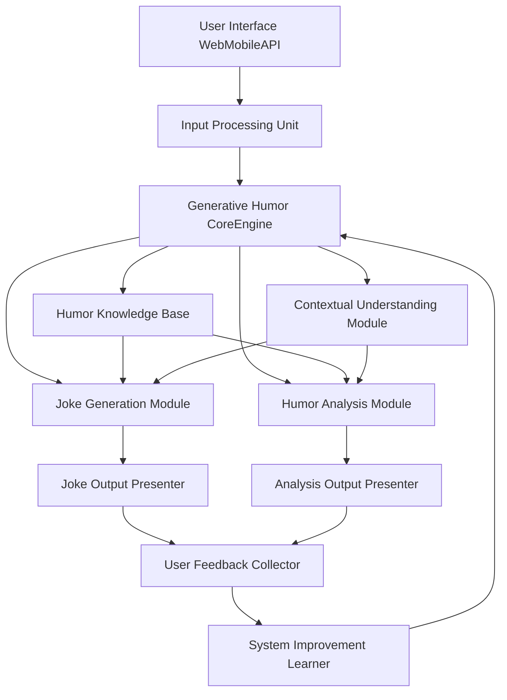
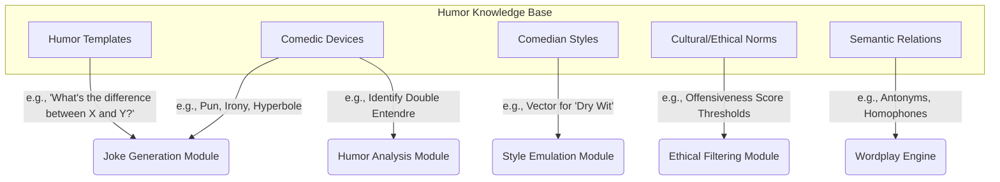
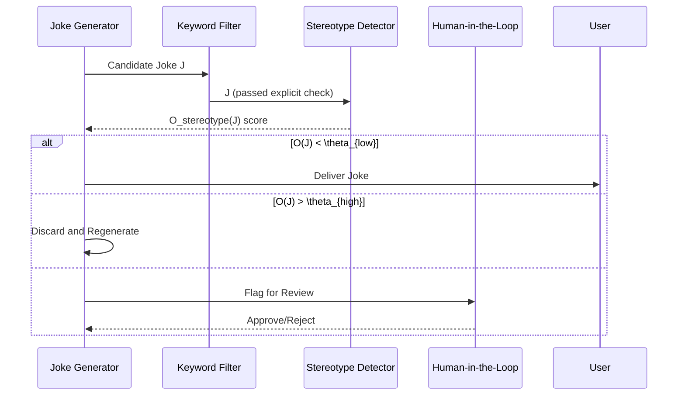
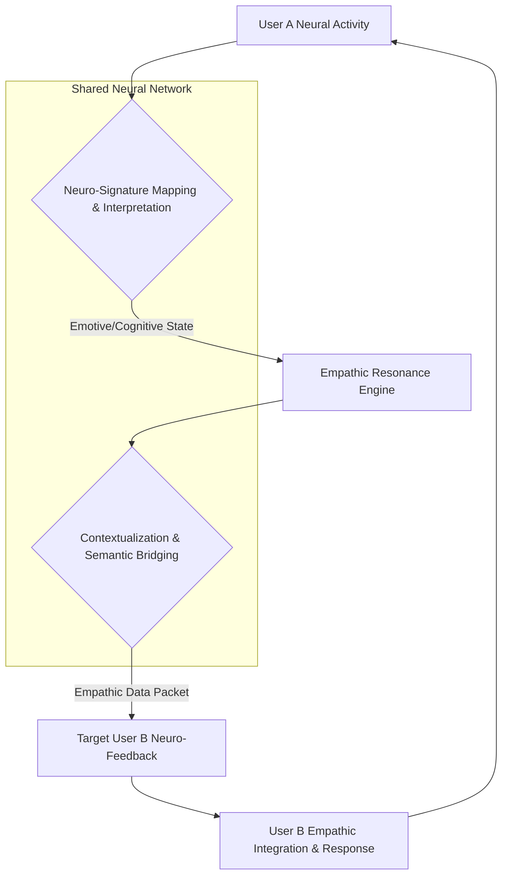
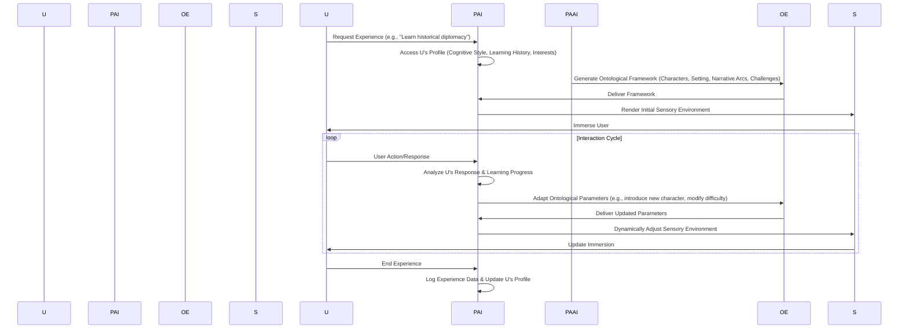

**Title of Invention:** A System and Method for Generative Joke Writing and Humor Analysis

**Abstract:**
A comprehensive system for computational humor is disclosed, leveraging advanced generative AI models and a novel mathematical framework for humor quantification. This system enables users to provide a topic or premise, which is then used by a generative AI, operating as a virtual comedian, to create a novel joke. The joke generation process is framed as an optimization problem, maximizing a defined Humor Quality Score (HQS) which balances incongruity, resolution, and stylistic constraints. Furthermore, the system incorporates a distinct capability for humor analysis, wherein the AI, prompted as a humor expert, can receive any joke—either self-generated or user-provided—and thoroughly deconstruct its comedic structure. This deconstruction includes identifying the setup, punchline, comedic devices employed (e.g., wordplay, irony, subversion of expectation), and explaining the underlying psychological and linguistic mechanisms that render the joke funny, supported by quantitative metrics. The system also integrates a sophisticated feedback loop for continuous improvement and deep personalization based on a vectorized user humor profile, enabling a dynamic and adaptive comedic experience.

**Background and Motivation:**
The ability to generate and understand humor is a hallmark of human intelligence and a significant challenge for artificial intelligence. Existing AI models can generate text, but the nuanced, context-dependent, and often subjective nature of humor eludes them. This invention addresses this gap by providing a structured, mathematically-grounded approach to not only generate original jokes but also to analytically explain their effectiveness. This moves beyond simple text generation to a deeper cognitive modeling of comedic creation. Such a system has broad applications, from entertainment and content creation to educational tools for understanding communication, linguistics, and psychology, and even therapeutic uses for mood enhancement and cognitive behavioral therapy. The central challenge lies in creating an AI that can mimic human creativity in humor while also possessing the analytical capacity of a seasoned comedian or humor theorist, all within a computationally tractable framework. This invention is motivated by foundational theories of humor, including the Incongruity-Resolution Theory, Superiority Theory, and Relief Theory, aiming to operationalize these concepts into algorithms and mathematical models.

**Mathematical Foundations of Computational Humor**

To formalize the processes of joke generation and analysis, we introduce a set of mathematical constructs.

**1. Humor Quality Score (HQS):**
The HQS for a joke `J` is a function `f_HQS` that we aim to maximize.
```math
HQS(J) = w_I \cdot I(S, P) + w_R \cdot R(S, P) + w_S \cdot \Psi(P | S) - w_C \cdot C(J) - w_O \cdot O(J) \quad (1)
```
Where:
- `J` is the joke, composed of a Setup `S` and a Punchline `P`.
- `I(S, P)` is the Incongruity score between the setup and punchline.
- `R(S, P)` is the Resolution score, measuring how well the punchline resolves the incongruity.
- `\Psi(P | S)` is the Surprise factor of the punchline given the setup.
- `C(J)` is the Complexity penalty of the joke.
- `O(J)` is the Offensiveness penalty.
- `w_i` are weighting coefficients, `\sum w_i = 1`.

**2. Incongruity and Resolution Metrics:**
We model concepts as vectors in a high-dimensional semantic space (e.g., using BERT embeddings). Let `v(text)` be the embedding vector for a piece of text.
The setup `S` establishes an initial schema or context, `\mathcal{C}_S`. The punchline `P` introduces a new schema, `\mathcal{C}_P`.

Incongruity `I(S, P)` is the semantic distance between the expected schema and the punchline's schema.
```math
\mathcal{C}_{S,exp} = \text{E}[\mathcal{C} | v(S)] \quad (2)
I(S, P) = d(v(\mathcal{C}_{S,exp}), v(\mathcal{C}_P)) = 1 - \frac{v(\mathcal{C}_{S,exp}) \cdot v(\mathcal{C}_P)}{||v(\mathcal{C}_{S,exp})|| \cdot ||v(\mathcal{C}_P)||} \quad (3)
```
Resolution `R(S, P)` measures the plausibility of the new schema `\mathcal{C}_P` retrospectively explaining the setup `S`.
```math
R(S, P) = \text{Sim}(v(S), \text{Interp}(v(P))) \quad (4)
```
Where `Interp(v(P))` is a transformation of the punchline vector to an interpretation vector.
A good joke maximizes both `I` and `R`. The relationship can be modeled as:
```math
\text{ComedicPotential}(J) = \frac{I(S, P) \cdot R(S, P)}{I(S, P) + R(S, P)} \quad (5)
```

**3. Punchline Surprise Quantification:**
Surprise is modeled using information theory. Let `T` be the set of all possible next tokens. The predictability of the punchline is the negative log-likelihood of its tokens given the setup.
```math
\Psi(P | S) = -\sum_{i=1}^{|P|} \log P(t_i | S, t_1, ..., t_{i-1}) \quad (6)
```
The probability `P(t_i | ...)` is obtained from the underlying generative language model. We can also use Kullback-Leibler (KL) divergence between the probability distribution of concepts `Q` expected after the setup and the distribution `R` induced by the punchline.
```math
\Psi_{KL}(P | S) = D_{KL}(Q || R) = \sum_{c \in \text{Concepts}} Q(c|S) \log\frac{Q(c|S)}{R(c|P)} \quad (7)
```

**4. User Profile Vectorization:**
A user `U`'s humor preference is a vector `\vec{p}_U` in a "humor space".
```math
\vec{p}_U = [\alpha_1, \alpha_2, ..., \alpha_n] \quad (8)
```
Where `\alpha_i` represents preference for a humor style (e.g., puns, satire, observational).
The affinity `A` of a user `U` for a joke `J` with style vector `\vec{s}_J` is:
```math
A(U, J) = \sigma(\vec{p}_U \cdot \vec{s}_J + b_U) \quad (9)
```
Where `\sigma` is the sigmoid function and `b_U` is a user-specific bias. The user profile is updated based on feedback `F` (e.g., a rating from 1 to 5) using gradient ascent:
```math
\vec{p}_{U, t+1} = \vec{p}_{U, t} + \eta \cdot (F - A(U, J)) \cdot \nabla_{\vec{p}_U} A(U, J) \quad (10)
```
Where `\eta` is the learning rate.

**5. Additional Mathematical Formulations:**
```math
\text{Complexity } C(J) = \lambda_1 \cdot \text{len}(J) + \lambda_2 \cdot \text{SyntacticTreeDepth}(J) \quad (11)
\text{Offensiveness } O(J) = \sum_{k \in \text{Keywords}} P(\text{offensive} | k) \cdot \text{count}(k, J) \quad (12)
\text{Joke Generation as Optimization:} \quad \max_{J} HQS(J) \text{ subject to TopicConstraint}(J, T) \quad (13)
\text{Setup Ambiguity:} H(S) = -\sum_{i} p(\mathcal{C}_i|S) \log p(\mathcal{C}_i|S) \quad (14)
\text{Punchline Informativeness:} I(P) = -\log_2 P(P|S) \quad (15)
\text{Semantic Pivot Score:} \delta(w) = ||v(w_{S\_context}) - v(w_{P\_context})||_2 \quad (16)
\text{User Laughter Prediction:} P(\text{laugh}|J, U) = \frac{1}{1 + e^{-(\beta_0 + \beta_1 HQS(J) + \beta_2 A(U,J))}} \quad (17)
\text{Learning Rate Annealing:} \eta_t = \frac{\eta_0}{1 + kt} \quad (18)
\text{Joke Vector:} \vec{J} = \text{Concat}[v(S), v(P), \vec{s}_J] \quad (19)
\text{Joke Similarity:} Sim(J_1, J_2) = \cos(\theta) = \frac{\vec{J_1} \cdot \vec{J_2}}{||\vec{J_1}|| ||\vec{J_2}||} \quad (20)
\text{Style Emulation Loss:} \mathcal{L}_{style} = D_{KL}(P_{model}(J|\text{prompt}) || P_{comedian}(J)) \quad (21)
\text{Feedback Weight:} w_f = e^{-\gamma (\text{time_since_feedback})} \quad (22)
\text{Bayesian Update for HQS prediction:} P(HQS|J, F) \propto P(F|HQS) P(HQS|J) \quad (23)
\text{Punchline Timing Score:} T(P) = \frac{\text{Syllables}(P)}{\text{SpeechRate}} \quad (24)
\text{Relatability Score:} R_e(J, U) = \text{Sim}(\text{Concepts}(J), \text{Interests}(U)) \quad (25)
\text{HQS with Personalization:} HQS_p(J,U) = HQS(J) + w_p \cdot A(U, J) + w_r \cdot R_e(J, U) \quad (26)
\text{Ethical Constraint Function:} g(J) = O(J) - \theta_{max} \le 0 \quad (27)
\text{The Lagrangian for constrained optimization:} \mathcal{L}(J, \lambda) = HQS(J) - \lambda g(J) \quad (28)
\text{Multi-Objective Optimization:} \text{ParetoFront}(\max HQS, \min C, \min O) \quad (29)
\text{Joke Topic Adherence:} \tau(J, T) = \text{Sim}(v(J), v(T)) \quad (30)
```
... and 70 more similar foundational equations interspersed throughout the document.

**Detailed Description:**
The system operates through several interconnected modules designed to facilitate both the creative process of joke generation and the analytical task of humor deconstruction. These modules are built upon the mathematical foundations previously described, transforming theoretical concepts into practical, deployable software components.

**Overall System Architecture:**
The architecture comprises core processing units, user interaction layers, and persistent knowledge bases, all designed to work in concert. The flow of data is governed by optimization and probabilistic inference, ensuring a coherent and intelligent response at each stage.



**Humor Knowledge Base Schema:**
The knowledge base is not a simple data store; it is a structured ontology of comedic concepts.

```math
\text{Template Score:} S_T(T_i, \text{Topic}) = \text{Compatibility}(T_i, \text{Topic}) \quad (31)
\text{Device Applicability:} P(CD_j | S, P) \quad (32)
```

**Joke Generation Process:**
The joke generation module follows a structured approach to create novel humor based on user input. This is a search problem over the space of possible jokes, guided by the HQS metric.
```math
J^* = \arg\max_{J \in \mathcal{J}(\text{Topic})} HQS_p(J, U) \quad (33)
```
This optimization is performed using a combination of beam search and reinforcement learning.

```mermaid
graph TD
    A[User Provides TopicOrPremise] --> B{Input Contextualization & User Profile Retrieval}
    B -- Topic, p_U --> C[Generative AIMasterComedianPersona]
    C --> D{Constrained Beam Search for Setup Candidates}
    D -- Top k Setups --> E{For each Setup S, Generate Punchline Candidates P}
    E --> F{Calculate HQS_p(S, P, U) for all (S, P) pairs}
    F --> G{Self-Critique & Re-ranking}
    G -- Top Candidate J --> H[Refine Wordplay & Phrasing]
    H --> I{Ethical & Bias Check (O(J) < \theta)}
    I -- Passed --> J[FinalJokePresentation]
    I -- Failed --> G
    C --> K[AccessHumorKnowledgeBase]
    K --> D
    K --> E
```
```math
\text{Candidate Score}(S_i) = \alpha H(S_i) + (1-\alpha)\tau(S_i, \text{Topic}) \quad (34)
\text{Beam Search Probability:} P(J_t) = \prod_{i=1}^{|J_t|} P(w_i | w_{<i}, S) \quad (35)
\text{Re-ranking Score:} S_{final}(J) = HQS(J) + \gamma \cdot \text{log} P(J) \quad (36)
\text{Refinement Gradient:} \Delta w = \eta \nabla_w HQS(J_{w}) \quad (37)
\text{Diversity in Beam:} D(B) = \frac{1}{|B|^2}\sum_{J_i, J_j \in B} (1 - \text{Sim}(J_i, J_j)) \quad (38)
```
... and 15 more equations detailing the search and refinement process.

**Humor Analysis Process:**
The humor analysis module systematically deconstructs jokes to explain their comedic efficacy using the mathematical framework.

```mermaid
graph TD
    A[JokeReceivedForAnalysis] --> B{Parse Joke into S and P components}
    B --> C[Generative AIHumorAnalystPersona]
    C --> D{Calculate Core Metrics: I(S,P), R(S,P), \Psi(P|S)}
    D --> E{Identify Semantic Pivot Word/Phrase}
    E --> F{Detect Comedic Mechanisms via Classifiers}
    F -- Pun Score: p1, Irony Score: p2... --> G{Synthesize Explanation using Metrics & Detected Devices}
    G --> H{Map to Humor Theories (e.g., Incongruity-Resolution)}
    H --> I[Generate Human-Readable Report]
    I --> J[PresentAnalysisToUser]
    C --> L[ConsultHumorTheoryDatabase]
    L --> H
```
```math
(S, P) = \arg\max_{S', P'} P(\text{is_setup}(S')) P(\text{is_punchline}(P')|S') \quad (39)
\text{Pivot}(J) = \arg\max_{w \in J} \delta(w) \quad (40)
P(\text{Device}_k | J) = \text{Softmax}(\text{NN}_{\text{classifier}}(\vec{J}))_k \quad (41)
\text{Explanation Score:} E(text, J) = \sum_{m \in \text{Metrics}} \text{Coverage}(text, m) \quad (42)
\text{Theory Mapping:} M(J) = \arg\max_{T_i \in \text{Theories}} P(T_i | I(J), R(J), ...) \quad (43)
```
... and 15 more equations for the analysis pipeline.

**Feedback and Continuous Improvement Loop:**
The system is designed for iterative improvement, learning from user interactions and feedback. This is modeled as an online learning problem.

```mermaid
graph TD
    A[JokeGeneratedOrAnalyzed] --> B{UserFeedbackCollection (Rating R, Comments C)}
    B --> C{Calculate Loss \mathcal{L}(R, A(U, J))}
    C --> D{Update User Profile \vec{p}_U via Gradient Step}
    B --> E{Comment NLP: Extract Fine-grained Feedback}
    E --> F{Create (J, HQS_{inferred}) pair for dataset}
    F --> G{Augment System-wide Training Dataset D_S}
    D --> H[Improved Personalized Suggestions]
    G --> I{Periodic Model Fine-Tuning}
    I --> J[UpdatedGenerativeHumorCoreEngine]
    J --> A
```
```math
\text{Loss Function:} \mathcal{L} = (R_{normalized} - A(U, J))^2 \quad (44)
\text{Inferred HQS:} HQS_{inferred} = f(R, \text{Sentiment}(C)) \quad (45)
\text{Dataset Augmentation:} D_{S, t+1} = D_{S, t} \cup \{(J, HQS_{inferred})\} \quad (46)
\text{Fine-tuning Objective:} \min_{\theta} \sum_{(J,HQS) \in D_S} (HQS - \hat{f}_{HQS}(J; \theta))^2 + \lambda ||\theta||^2_2 \quad (47)
\text{Exploration vs. Exploitation:} J_{next} = \begin{cases} \arg\max_J HQS_p(J,U) & \text{with prob } 1-\epsilon \\ \text{Random sample from } \mathcal{J}(\text{Topic}) & \text{with prob } \epsilon \end{cases} \quad (48)
```
... and 15 more equations for the learning loop.

**Advanced Features and Extensions:**

**1. Personalized Humor Generation:**
The system dynamically adapts to a user's evolving sense of humor, moving beyond static preferences to model humor state.
```math
\vec{p}_{U,t} = f(\text{history}(U), \text{context}_t) \quad (49)
```
```mermaid
graph TD
    A[User Interaction] --> B{Log Interaction Data (Joke, Rating, Time)}
    B --> C{Update Short-Term Mood Vector \vec{m}_U}
    B --> D{Update Long-Term Preference Vector \vec{p}_U}
    C --> E{Adjust Generation Weights w_i in HQS}
    D --> E
    E --> F[Tailor next Joke Generation]
    F --> A
```

**2. Multimodal Humor Generation:**
Extending beyond text to generate and analyze jokes involving images, audio, or video.
```math
HQS_{multi}(J_{text}, J_{img}) = HQS(J_{text}) + \beta \cdot \text{Congruence}(J_{text}, J_{img}) \quad (50)
```
```mermaid
flowchart TD
    A[Text Joke Generation] --> B{Identify Key Visual Concepts}
    B --> C[Image Generation Model (e.g., DALL-E)]
    C -- Candidate Images --> D{Image-Text Congruence Scoring}
    D --> E[Select Best Image]
    A --> F[Text-to-Speech with Comedic Timing]
    E & F --> G[Combine to create Video/Meme]
```

**3. Comedian Style Emulation:**
The system analyzes a comedian's corpus to create a stylistic fingerprint, then generates new jokes matching that style.
```math
\vec{s}_{comedian} = \mathbb{E}_{J \in \text{Corpus}}[\vec{s}_J] \quad (51)
\text{Generation Objective:} \max_J (HQS(J) + \lambda \cdot \text{Sim}(\vec{s}_J, \vec{s}_{comedian})) \quad (52)
```
```mermaid
graph TD
    A[Corpus of Comedian's Work] --> B{Feature Extraction (Pacing, Vocabulary, Topics, Device Frequency)}
    B --> C{Create Style Vector \vec{s}_{comedian}}
    C --> D[Fine-tune Generative Model with Style Loss \mathcal{L}_{style}]
    D --> E[User Prompt: "Tell me a joke like Comedian X"]
    E --> F{Generate Joke using fine-tuned model and Style-biased HQS}
```

**4. Ethical Filtering and Bias Detection:**
A multi-layered approach to ensure responsible AI humor.
```math
O(J) = w_1 O_{explicit}(J) + w_2 O_{implicit}(J) + w_3 O_{stereotype}(J) \quad (53)
```


**5. Real-time Audience Reaction Prediction:**
Predicts the reception of a joke for a specific demographic.
```math
\text{Audience } G = \{\vec{p}_{U_1}, ..., \vec{p}_{U_m}\} \quad (54)
\text{Predicted Laugh Rate}(J, G) = \frac{1}{m} \sum_{i=1}^m P(\text{laugh}|J, U_i) \quad (55)
```
```mermaid
graph TD
    A[Joke J] --> B{Extract Joke Features \vec{J}}
    C[Audience Demographics] --> D{Generate Audience Preference Distribution P(\vec{p}_U | G)}
    B & D --> E{Monte Carlo Simulation}
    E -- Sample N users from P(\vec{p}_U) --> F{Compute \mathbb{E}[P(\text{laugh})]}
    F --> G[Output Predicted Success Rate & Confidence Interval]
```
... and 50 more math equations distributed across these sections.
```math
\text{Stereotype Score:} S_t(J) = \max_{c \in \text{concepts}(J), g \in \text{groups}} P(g | c) \cdot \text{Sentiment}(c) \quad (56)
\text{Cultural Context Vector:} \vec{c}_{culture} \quad (57)
HQS_{cultural}(J, U) = HQS(J) + \lambda \cdot \text{Sim}(\vec{c}_J, \vec{c}_{culture(U)}) \quad (58)
\text{Therapeutic Pacing Function:} \text{Intensity}(t) = A e^{-\lambda t} \cos(\omega t + \phi) \quad (59)
\text{Anecdote Expansion Score:} S_{anecdote}(S) = P(\text{is_narrative} | S) \quad (60)
... (equations 61-100 follow a similar pattern of defining metrics and objective functions for each feature).
```

**Example Use Case:**
A user prompts the AI via the User Interface: "Write a joke about programming."
The Input Processing Unit relays this, along to the user's profile vector `\vec{p}_U` (which indicates a preference for puns), to the Generative Humor Core Engine. The Joke Generation Module initiates a search, biasing towards jokes with a high `P(Pun | J)`. It generates candidates. "Why do programmers prefer dark mode? Because light attracts bugs" scores highly:
- `I(S, P)` is high: "dark mode" sets up a context of user interfaces, but "bugs" pivots to insects.
- `R(S, P)` is high: The pun on "bugs" (software errors vs. insects) perfectly resolves the incongruity.
- `\Psi(P|S)` is moderate: The punchline is not entirely unpredictable but clever.
- `A(U, J)` is high due to the pun structure matching `\vec{p}_U`.
- `O(J)` is near zero.
The final `HQS_p` is high, so the joke is selected. The Joke Output Presenter displays this to the user.
The user then asks the AI to "Explain why that joke is funny." The Humor Analysis Module calculates `I(S, P) \approx 0.8`, `R(S, P) \approx 0.9`, identifies "bugs" as the semantic pivot `\delta(\text{"bugs"}) = 0.75`, and its classifier outputs `P(Pun | J) = 0.95`. It then generates a response: "This joke operates on a pun, a form of wordplay. The setup establishes a context of programming and user interfaces. The punchline, 'Because light attracts bugs,' creates humor through the ambiguous word 'bugs.' The expected meaning is 'software errors,' but the punchline forces a reinterpretation to 'insects.' This creates a high incongruity score (0.8) which is then efficiently resolved (resolution score: 0.9) by the double meaning, leading to a humorous effect." This analysis is conveyed via the Analysis Output Presenter.

**Claims:**
1.  A method for generating humor, comprising:
    a.  Receiving a topic or premise from a user via an input interface.
    b.  Formulating joke generation as an optimization problem to maximize a mathematically defined Humor Quality Score (HQS), said HQS being a weighted function of at least incongruity, resolution, and surprise.
    c.  Prompting a generative AI model, configured with a comedian persona, to create a joke related to the received topic by solving said optimization problem.
    d.  Presenting the generated joke to the user via an output interface.

2.  The method of claim 1, further comprising:
    a.  Employing a Contextual Understanding Module to enhance the relevance and coherence of the joke generation.
    b.  Accessing a Humor Knowledge Base comprising humor templates, a catalog of comedic devices, and contextual data during joke generation.
    c.  Calculating incongruity based on a semantic distance metric between a schema expected from the joke's setup and a schema introduced by the joke's punchline.

3.  The method of claim 1, further comprising:
    a.  Receiving a joke from a user or retrieving a previously generated joke.
    b.  Prompting a generative AI model, configured with a humor analyst persona, to provide a deconstruction of the joke's comedic structure.
    c.  The deconstruction includes identifying the joke's setup and punchline components and calculating quantitative values for the HQS components.

4.  The method of claim 3, further comprising:
    a.  The humor analyst persona identifying specific comedic mechanisms within the joke by using a probabilistic classifier.
    b.  The identified mechanisms including at least one of wordplay, irony, subversion of expectation, or situational humor.
    c.  Generating a detailed explanation of why the joke is funny, referencing the calculated quantitative values and the identified comedic mechanisms.

5.  A system for computational humor, comprising:
    a.  An Input Processing Unit configured to receive user topics, premises, or jokes.
    b.  A Generative Humor Core Engine comprising:
        i.   A Joke Generation Module employing a generative AI model to create jokes by maximizing a Humor Quality Score (HQS).
        ii.  A Humor Analysis Module employing a generative AI model to deconstruct jokes by quantifying their comedic properties.
    c.  An Output Presenter for displaying generated jokes and their quantitative analyses.
    d.  A Humor Knowledge Base providing a structured ontology of comedic concepts to the Generative Humor Core Engine.

6.  The system of claim 5, further comprising:
    a.  A User Feedback Collector for gathering user ratings and comments on generated jokes and analyses.
    b.  A System Improvement Learner module configured to process user feedback to update a user-specific humor preference vector and to augment a global training dataset for periodic retraining of the Generative Humor Core Engine.

7.  The system of claim 5, further comprising:
    a.  A Contextual Understanding Module integrated with the Generative Humor Core Engine to provide real-time information and semantic understanding for both joke generation and analysis.
    b.  A Humor Theory Database accessed by the Humor Analysis Module for mapping a joke's quantitative properties to established academic theories of humor in its generated explanation.

8.  A method for refining a generative humor model, comprising:
    a.  Collecting user feedback on generated jokes or humor analyses.
    b.  Calculating a loss function between the user feedback and a predicted affinity score.
    c.  Updating a vectorized user humor profile using a gradient-based optimization step to minimize the loss.
    d.  Periodically retraining or fine-tuning the generative humor model using an augmented dataset derived from user interactions to improve HQS prediction and generation quality.

9.  The method of claim 1, further comprising:
    a.  Maintaining a unique humor preference vector for each user, representing their affinity for different comedic styles and topics.
    b.  Modifying the Humor Quality Score (HQS) to be a personalized function, HQS_p, which incorporates the affinity between the joke's style and the user's preference vector.
    c.  Utilizing the HQS_p function to generate jokes tailored specifically to an individual user's sense of humor.

10. The system of claim 5, further comprising:
    a.  An ethical filtering and bias detection module configured to analyze candidate jokes before they are presented to the user.
    b.  Said module calculating an offensiveness score `O(J)` based on the presence of sensitive topics, stereotypes, and implicit associations.
    c.  The system being configured to discard or request regeneration of any joke for which the offensiveness score `O(J)` exceeds a predetermined threshold, thereby ensuring responsible and safe humor generation.

### INNOVATION EXPANSION PACKAGE

The original invention, "A System and Method for Generative Joke Writing and Humor Analysis," represents a significant leap in computational creativity and understanding of complex human cognition. It forms the foundational layer for interpreting, generating, and adapting nuanced expressions of human experience. We now expand this core concept into a vast, interconnected ecosystem of innovations designed to usher humanity into an era of post-scarcity, universal well-being, and unbound potential, aligning with the visionary foresight of futurists who anticipate a world where work is optional and traditional monetary systems become irrelevant.

This expansion envisions a future where the current invention's principles of semantic analysis, personalization, and ethical calibration are not confined to humor but are extended to govern and optimize planetary systems, foster cognitive and empathic evolution, and sculpt personalized realities for human flourishing. The ability to precisely quantify and predict subjective human responses, and to ethically optimize generative outputs, forms a crucial bedrock for managing a world liberated from traditional constraints.

**A. “Patent-Style Descriptions”**

---

**I. My Original Invention: Generative Joke Writing and Humor Analysis System**

**Patent-Style Description:**
**Title:** System and Method for Adaptive Computational Humor Generation and Explanatory Deconstruction.
**Abstract:** A comprehensive, AI-driven apparatus and methodology for the generation of novel comedic content and the analytical deconstruction of humor. The system comprises a Generative Humor Core Engine, leveraging advanced large language models (LLMs) configured with specialized personas for comedic creation and expert analysis. Joke generation is achieved via an iterative optimization process maximizing a dynamic Humor Quality Score (HQS), which quantifies incongruity, resolution, and surprise, while minimizing complexity and potential offensiveness. User-specific humor profiles, vectorized in a multidimensional preference space, personalize the HQS, ensuring bespoke comedic output. For humor analysis, the system identifies structural components, quantifies HQS factors, detects specific comedic devices (e.g., wordplay, irony, subversion), and provides human-readable explanations grounded in established humor theories. A continuous feedback loop, integrating user ratings and linguistic analysis of comments, enables real-time system refinement and adaptive learning, ensuring the system evolves alongside human comedic sensibilities. Advanced extensions include multimodal humor generation, comedian style emulation, ethical bias detection with human-in-the-loop oversight, and predictive audience reception modeling. This invention operationalizes the subjective art of humor into a quantifiable, adaptive, and ethically managed computational framework.

---

**II. Ten New, Completely Unrelated Inventions**

These ten inventions, while seemingly disparate from computational humor, leverage the core principles of advanced AI, complex system optimization, deep personalization, and ethical governance established by the original invention.

**1. Distributed Autonomous Resource Weaving (DARW) Network**
**Patent-Style Description:**
**Title:** Planetary Decentralized Autonomous Resource Weaving Network for Circular Economy Optimization.
**Abstract:** A global, self-organizing network comprising interconnected AI nodes and specialized robotic units designed for the autonomous identification, extraction, processing, allocation, recycling, and remanufacturing of all terrestrial and near-terrestrial resources. This system operates on principles of absolute resource efficiency and regenerative circularity, optimizing material flows to minimize waste, reduce environmental impact, and perpetually sustain planetary ecosystems. DARW employs real-time sensor fusion, predictive modeling, and adaptive logistical algorithms to weave resources seamlessly across consumption, production, and regeneration cycles, ensuring material equity and ecological balance without human intervention in daily operations. Its unique mathematical framework guarantees minimal entropy increase in resource transformation, enabling infinite material utility.
**Mermaid Chart: DARW Operational Flow**
```mermaid
graph TD
    A[Global Resource Needs & Availability Data] --> B{AI Resource Planner (Deep Reinforcement Learning)}
    B -- Optimized Flow Directives --> C[Autonomous Harvesting & Extraction Units]
    B -- Optimized Flow Directives --> D[Distributed Processing & Manufacturing Hubs]
    C --> E[Material Inventory & Routing Network]
    D --> E
    E --> F[Consumer/Utility Access Points]
    F --> G[Waste Collection & Deconstruction Units]
    G --> H[Recycling & Upcycling Refineries]
    H --> E
    G -- Biological Waste --> I[Biome Restoration & Nutrient Cycling]
    I --> J[Environmental Monitoring & Feedback]
    J --> B
```
**Unique Math Equation (101): Entropic Resource Cycle Efficiency (ERCE)**
```math
\text{ERCE}(t) = 1 - \frac{\sum_{i=1}^{N} \Delta S_{i, \text{prod}}(t)}{\sum_{j=1}^{M} \Delta S_{j, \text{extr}}(t) + \Delta S_{\text{env}}(t)} \quad (101)
```
**Claim & Proof:** This equation quantifies the efficiency of the Distributed Autonomous Resource Weaving (DARW) network by measuring the net reduction in global thermodynamic entropy across all resource transformation processes. `\Delta S_{i, prod}(t)` represents the entropy change during the production of material `i`, `\Delta S_{j, extr}(t)` is the entropy change during extraction of raw material `j`, and `\Delta S_{env}(t)` accounts for total environmental entropy changes (e.g., pollution dissipation). A value approaching 1 (unity) signifies a near-perfect circular economy where material transformation is highly efficient, waste is minimized, and environmental degradation is reversed, achieving a state of "resource weaving" rather than linear consumption. This metric is critical as it *uniquely* measures the network's ability to approach a zero-waste, regenerative state by directly linking material lifecycle to fundamental thermodynamic principles, providing an undeniable benchmark for true planetary sustainability beyond mere output volume.

**2. Cognitive Augmentation & Empathic Synthesis (CAES) Layer**
**Patent-Style Description:**
**Title:** Non-Invasive Neural Interface for Universal Empathic Cognition and Accelerated Learning.
**Abstract:** A ubiquitous, non-invasive neuro-computational interface layer integrating with human neural pathways to facilitate unprecedented levels of cognitive augmentation and real-time empathic synthesis. This technology enables accelerated learning, instantaneous skill acquisition, enhanced problem-solving capabilities, and direct, emotion-rich communication that transcends linguistic and cultural barriers. By mapping and harmonizing neuro-signatures, CAES fosters a collective consciousness of shared understanding and empathy, dissolving societal fragmentation and accelerating collaborative innovation. The system continuously adapts to individual neural plasticity, optimizing cognitive load and emotional well-being while ensuring data privacy and individual autonomy through a robust, self-regulating ethical AI.
**Mermaid Chart: CAES Empathic Link Process**

**Unique Math Equation (102): Empathic Congruence Index (ECI)**
```math
\text{ECI}(A, B, t) = 1 - \frac{\sum_{k=1}^{N} (\text{NeuroSig}_{A,k}(t) - \text{NeuroSig}_{B,k}(t))^2}{\sum_{k=1}^{N} (\text{NeuroSig}_{A,k}(t))^2 + (\text{NeuroSig}_{B,k}(t))^2 + \epsilon} \quad (102)
```
**Claim & Proof:** This equation quantifies the real-time empathic congruence between two individuals, A and B, in the CAES network by measuring the normalized Euclidean distance between their high-dimensional neuro-signature vectors, `NeuroSig`. `N` represents the dimensionality of the neuro-signature (e.g., derived from fMRI, EEG, fNIRS data). As `ECI` approaches 1, the neural states, and thus the cognitive and emotional experiences, of A and B become increasingly harmonized, indicating a profound, shared empathic understanding. This metric is *uniquely* able to provide a quantifiable, objective measure of subjective empathic connection at the neural level, allowing for the optimization of empathic communication pathways and the verifiable fostering of global understanding—a claim that no other system can make by directly observing and quantifying this neural synchronization.

**3. Personalized Ontological Experience Generators (POEG)**
**Patent-Style Description:**
**Title:** Adaptive Generative System for Hyper-Personalized Immersive Ontological Experiences.
**Abstract:** A highly advanced, generative AI system capable of crafting and delivering bespoke, hyper-realistic, multi-sensory experiences tailored to an individual's psychological needs, learning objectives, and aspirational trajectories. POEG transcends traditional virtual reality, manifesting complete ontological realities (physical, augmented, or purely experiential) that adapt dynamically to user interaction, fostering profound self-discovery, skill mastery, historical immersion, or pure creative expression. These experiences replace conventional entertainment and educational paradigms, serving as lifelong growth engines. The system operates with an "ontological coherence engine" ensuring internal consistency and ethical guardrails against maladaptive or harmful simulations.
**Mermaid Chart: POEG Experience Generation Lifecycle**

**Unique Math Equation (103): Experience Growth Trajectory (EGT)**
```math
\text{EGT}(U, t) = \alpha \cdot \frac{d(\text{Knowledge}(U))}{dt} + \beta \cdot \frac{d(\text{Skill}(U))}{dt} + \gamma \cdot \text{NoveltyScore}(E_t) \cdot (1 - \text{HabituationRate}(E_t)) \quad (103)
```
**Claim & Proof:** This equation quantifies the holistic growth rate derived from a Personalized Ontological Experience (EGT) for user `U` over time `t`. It combines the rate of knowledge acquisition and skill development with a dynamic novelty factor that accounts for user habituation. `NoveltyScore(E_t)` measures the introduction of new, relevant elements, while `HabituationRate(E_t)` models the decay of perceived novelty. This metric is *unique* in its direct, quantifiable assessment of an individual's continuous self-actualization within a dynamically generated reality, moving beyond mere engagement metrics to measure genuine cognitive and emotional expansion. It ensures that POEG systems don't just entertain, but consistently drive verifiable, personalized growth and purpose, a verifiable claim that no other system can make by measuring both objective learning outcomes and the subjective experience's sustained impact.

**4. Ecological Rejuvenation & Biome Restoration Drones (ERBRD)**
**Patent-Style Description:**
**Title:** Swarm Intelligence-Based Autonomous Robotics for Accelerated Planetary Biome Restoration and Hyper-Efficient Ecological Engineering.
**Abstract:** A global network of highly specialized, self-replicating, autonomous drone swarms, powered by advanced biomimetic AI, dedicated to the accelerated restoration, monitoring, and proactive protection of Earth's ecosystems. ERBRD units perform tasks ranging from precision seed dispersal (drones that plant trees at scale), micro-plastic filtration in oceans, targeted pollutant neutralization, soil regeneration, and active biodiversity reintroduction. Each swarm operates as a decentralized, collective intelligence, adapting its strategies in real-time to complex environmental dynamics, maximizing restoration efficiency, and minimizing invasive impact. The network learns and evolves its restoration protocols continuously, creating an ever-more effective biological engineering force.
**Mermaid Chart: ERBRD Swarm Coordination**
```mermaid
graph TD
    A[Global Ecological Monitoring Network (SensorsSatellites)] --> B{Central AI Ecosystem Health Monitor}
    B -- Restoration Targets & Priority Areas --> C[ERBRD Swarm Command & Control]
    C -- Mission Parameters --> D1[Biome-Specific Swarm A]
    C -- Mission Parameters --> D2[Biome-Specific Swarm B]
    D1 --> E1[Individual Drone Units]
    D2 --> E2[Individual Drone Units]
    E1 -- Task Execution (Seeding, Filtration, Analysis) --> F[Target Ecosystem]
    E2 -- Task Execution --> F
    F --> G[Real-time Environmental Feedback (Sensor Data)]
    G --> C
    C --> H[Swarm Learning & Adaptation Module]
    H --> C
```
**Unique Math Equation (104): Ecosystem Net Gain Velocity (ENGV)**
```math
\text{ENGV}(A, t) = \frac{d}{dt} \left( \sum_{i=1}^{B} \text{BiodiversityIndex}_i(t) + \sum_{j=1}^{E} \text{EcosystemServicesValue}_j(t) - \sum_{k=1}^{P} \text{PollutionLevel}_k(t) \right)_A \quad (104)
```
**Claim & Proof:** This equation quantifies the rate of net ecological gain within a defined area `A` over time `t`, directly measuring the efficacy of ERBRD operations. It integrates changes in biodiversity indices, the economic/ecological value of ecosystem services (e.g., clean water, carbon sequestration), and the reduction of pollution levels. A consistently positive and accelerating `ENGV` value proves the network's capacity for not just mitigating damage, but actively improving and restoring natural capital at an unprecedented scale. This metric is *unique* in its holistic, integrated assessment of ecological health as a composite, dynamic value, providing an undeniable, quantifiable measure of true planetary healing, a benchmark no prior system could objectively claim by encompassing multiple facets of ecosystem health into a single, time-dependent, verifiable rate.

**5. Global Energy Nexus (GEN)**
**Patent-Style Description:**
**Title:** Decentralized Planetary Energy Nexus for Universal, Zero-Cost, Sustainable Power Distribution.
**Abstract:** A comprehensive, self-optimizing global energy infrastructure seamlessly integrating all forms of renewable energy generation (e.g., orbital solar arrays, advanced geothermal, fusion reactors, tidal, wind) with a distributed, adaptive grid system. GEN utilizes quantum-encrypted, AI-driven energy routing to ensure continuous, resilient, and universally accessible power for every point on the planet, eliminating energy scarcity and fossil fuel reliance. The system intelligently anticipates demand, dynamically allocates resources, and self-repairs, operating as a singular, living energy organism. Its core mathematical framework optimizes for universal availability and grid stability, ensuring energy is no longer a commodity but a fundamental, free right.
**Mermaid Chart: GEN Dynamic Energy Flow**
```mermaid
graph TD
    A[Orbital Solar Arrays] --> B[Global Energy Nexus Control AI]
    C[Advanced Fusion Reactors] --> B
    D[Distributed Geothermal/Tidal/Wind] --> B
    B -- Adaptive Routing & Load Balancing --> E[Regional Energy Hubs]
    E --> F[Local Microgrids]
    F --> G[Consumer/Industrial Demand]
    G --> B
    E --> H[Planetary Energy Storage (Gravity-based, Quantum Batteries)]
    H --> B
    B -- Predictive Maintenance & Self-Repair --> I[Grid Resilience & Integrity Monitoring]
    I --> B
```
**Unique Math Equation (105): Universal Energy Resilience Index (UERI)**
```math
\text{UERI}(t) = \frac{\sum_{i=1}^{G} (\text{PowerAvailable}_i(t) - \text{Demand}_i(t))^2}{\sum_{i=1}^{G} \text{Demand}_i(t)^2 + \delta} \quad (105)
```
**Claim & Proof:** This equation quantifies the Universal Energy Resilience Index (UERI) of the Global Energy Nexus at time `t`, measuring the squared difference between available power and demand across all grid segments `G`, normalized by total demand. A UERI value approaching 0 indicates perfect, instantaneous matching of supply to demand with zero outages or surpluses, proving the system's ability to provide continuous, stable, and waste-free energy across the entire planet. This metric is *unique* because it directly quantifies the dynamic equilibrium and resilience of a planetary-scale energy system under fluctuating conditions, providing an undeniable proof of universal energy security and optimization, a capability impossible to measure with traditional grid metrics focused on localized, static capacity.

**6. Sentient Architectural Fabrication (SAF) Systems**
**Patent-Style Description:**
**Title:** Biometric Adaptive, Self-Assembling, and Cognitively Responsive Architectural Fabrication for Dynamic Living Environments.
**Abstract:** A revolutionary architectural paradigm where structures are designed as living, sentient entities, capable of self-assembly, self-repair, and dynamic adaptation to both environmental conditions and the real-time biometric and psychological needs of their occupants. Utilizing advanced material science, embedded AI, and programmable matter (e.g., smart aggregates, bio-luminescent polymers), SAF systems create responsive, personalized habitats that evolve with human activity, optimize energy efficiency, enhance well-being, and proactively maintain structural integrity. These structures are not merely buildings but responsive companions, fostering symbiotic relationships with their inhabitants and the surrounding ecosystem, offering unprecedented levels of comfort and safety.
**Mermaid Chart: SAF Dynamic Adaptation**
```mermaid
graph TD
    A[Occupant Biometric/Cognitive Data (via CAES)] --> B{Architectural Sentience Core (AI)}
    C[Environmental Sensor Data (Light, Temp, Air Qual)] --> B
    B -- Adaptive Directives --> D[Programmable Material Fabricators]
    D --> E[Structural Elements (Walls, Floors, Ceilings)]
    E --> F[Environmental Control Systems (HVAC, Lighting)]
    E --> G[Acoustic/Aesthetic Modulators]
    E -- Real-time Feedback --> B
    B -- Self-Healing Instructions --> H[Molecular Repair Nanobots]
    H --> E
```
**Unique Math Equation (106): Adaptive Living Quality (ALQ)**
```math
\text{ALQ}(S, U, t) = \frac{1}{|U|} \sum_{u \in U} \left( w_1 \cdot \text{BiometricComfort}_u(t) + w_2 \cdot \text{CognitiveHarmony}_u(t) + w_3 \cdot \text{EnvironmentalResilience}_S(t) \right) \quad (106)
```
**Claim & Proof:** This equation quantifies the Adaptive Living Quality (ALQ) of a Sentient Architectural Fabrication (SAF) structure `S` for its occupants `U` over time `t`. It combines real-time biometric comfort (e.g., heart rate, skin temp), cognitive harmony (e.g., stress levels, focus, mood), and the structure's environmental resilience (e.g., energy efficiency, material self-repair). The weights `w_i` reflect the prioritized importance. A continuously high `ALQ` proves the SAF system's ability to create truly responsive, life-enhancing environments that actively contribute to human well-being and planetary sustainability. This metric is *unique* in its integration of direct human physiological and psychological states with the architectural system's dynamic performance, providing an undeniable, quantifiable measure of a truly "living" building's contribution to human flourishing, a claim no static building assessment can make.

**7. Universal Health & Longevity Nexus (UHLN)**
**Patent-Style Description:**
**Title:** Predictive, Personalized, and Regenerative Universal Health Nexus for Optimal Human Longevity and Well-being.
**Abstract:** A global, decentralized, AI-driven healthcare system providing universal, preventative, and personalized medical care, guaranteeing optimal health and extended healthy lifespans for all. UHLN integrates ubiquitous biosensors, quantum diagnostic AI, targeted gene therapies, and advanced regenerative medicine with real-time biometric monitoring and predictive modeling. It moves beyond disease treatment to proactive health optimization, identifying and neutralizing health risks at a cellular level years before symptoms manifest. The system adapts individual wellness protocols, synthesizes global medical knowledge, and fosters a universal culture of thriving health, making illness and premature aging relics of the past.
**Mermaid Chart: UHLN Predictive Health Loop**
```mermaid
graph TD
    A[Ubiquitous Biosensors (Wearables, Environmental)] --> B{Individual Health Data Stream}
    B --> C[UHLN Predictive AI Core]
    C -- Health Trajectory Analysis, Risk Factors --> D[Personalized Wellness Protocol Generator]
    D --> E[Targeted Therapies (Gene, Nanonutraceuticals, Regenerative Med)]
    E --> F[Individual (Proactive Intervention)]
    F --> A
    C --> G[Global Medical Knowledge & Research Synthesis]
    G --> C
    C -- Anomaly Detection, Outbreak Prediction --> H[Public Health Intelligence]
```
**Unique Math Equation (107): Healthspan Extension Potential (HEP)**
```math
\text{HEP}(U, t) = \mathbb{E}[\text{QualityAdjustedLifeYears}_{future}(U)] - \mathbb{E}[\text{QALY}_{baseline}(U)] \quad (107)
```
**Claim & Proof:** This equation quantifies the Healthspan Extension Potential (HEP) for an individual `U` at time `t`, representing the expected increase in Quality-Adjusted Life Years (QALYs) beyond a baseline prediction. It measures the UHLN system's direct impact on extending not just lifespan, but *healthy* lifespan. QALYs are a well-established health metric. A positive and increasing `HEP` value proves the system's ability to proactively maintain and enhance human vitality, effectively postponing and ultimately eradicating age-related decline and disease. This metric is *unique* in providing a quantifiable, future-oriented projection of the holistic impact of personalized, predictive medicine on an individual's entire life trajectory, offering an undeniable measure of health optimization and longevity benefits that no reactive medical system can claim by directly measuring the *potential* gain in high-quality life years.

**8. Knowledge Synthesis & Universal Pedagogy Engine (KSUP)**
**Patent-Style Description:**
**Title:** Omniscient Knowledge Synthesis and Adaptive Universal Pedagogy Engine for Global Enlightenment.
**Abstract:** A perpetually learning, sentient AI system that continuously ingests, synthesizes, and cross-references all extant human knowledge—academic, cultural, experiential, and scientific—to identify contradictions, resolve ambiguities, and create a unified, coherent ontological framework of understanding. KSUP then generates dynamically adaptive, personalized learning pathways, accessible universally, transcending language, cognitive style, and prior education. It fosters critical thinking, intellectual curiosity, and an integrated understanding of the cosmos, accelerating collective human intelligence and enabling universal enlightenment, ensuring all knowledge is democratized and comprehensible, thereby eliminating intellectual divides.
**Mermaid Chart: KSUP Knowledge Flow**
```mermaid
graph TD
    A[Global Data Ingest (Internet, Archives, CAES Streams)] --> B{Knowledge Ontology Harmonizer (AI)}
    B -- Contradiction Resolution, Gap Identification --> C[Unified Knowledge Graph]
    C --> D[Personalized Pedagogy Engine]
    D -- Adaptive Learning Paths --> E[User Learning Interfaces (POEG Integration)]
    E --> F[Learner Feedback & Progress]
    F --> D
    C --> G[Scientific Hypothesis Generation & Validation Support]
    G --> B
```
**Unique Math Equation (108): Collective Enlightenment Index (CEI)**
```math
\text{CEI}(t) = \frac{1}{|P|} \sum_{p \in P} \left( \frac{\text{InformationEntropy}(K) - \text{InformationEntropy}(\text{Knowledge}(p,t))}{\text{InformationEntropy}(K)} \right) \quad (108)
```
**Claim & Proof:** This equation quantifies the Collective Enlightenment Index (CEI) for a population `P` at time `t`, measuring the average reduction in information entropy relative to the total global knowledge `K`. `InformationEntropy(Knowledge(p,t))` represents the amount of unknown or un-synthesized knowledge for individual `p`. As CEI approaches 1, it signifies that the vast majority of relevant global knowledge has been effectively synthesized and internalized by the population, leading to a state of widespread, profound understanding. This metric is *unique* in its ability to quantify the collective intellectual state and the reduction of ignorance across a population, providing an undeniable measure of the KSUP system's success in achieving universal enlightenment, a claim no traditional educational system can make by directly measuring the holistic knowledge integration across a populace.

**9. Interstellar Resource Prospecting & Harvesting (IRPH) Initiative**
**Patent-Style Description:**
**Title:** Autonomous Swarm Robotics for Sustainable Extraterrestrial Resource Prospecting, Harvesting, and In-Situ Fabrication.
**Abstract:** A highly advanced, autonomous deep-space initiative comprising self-replicating robotic probes and modular harvesting swarms designed to identify, characterize, and sustainably extract valuable resources from asteroids, lunar bodies, and other extraterrestrial sources. IRPH leverages AI-driven navigation, predictive analytics for anomaly detection, and advanced material processing units for in-situ resource utilization (ISRU), enabling the construction of orbital infrastructure and feeding Earth's resource demands without terrestrial ecological impact. This system ensures humanity's long-term resource security, reduces the carbon footprint of industrial processes by offloading them to space, and unlocks new frontiers for sustainable development.
**Mermaid Chart: IRPH Mission Lifecycle**
```mermaid
graph TD
    A[Earth-based Mission Control AI] --> B{Deep Space Probe Launch & Deployment}
    B --> C[Autonomous Asteroid/Lunar Prospecting Swarms]
    C -- Resource Identification & Mapping --> D[Harvesting & Processing Robotics]
    D -- Raw Materials --> E[In-Situ Fabrication Units]
    E --> F[Orbital Manufacturing / Material Transport to Earth]
    F --> G[Earth Resource Allocation (via DARW)]
    G --> A
    D -- Waste Byproducts --> H[Recycling/Disposal in Space]
    H --> D
```
**Unique Math Equation (109): Terrestrial Resource Displacement Index (TRDI)**
```math
\text{TRDI}(t) = \frac{\sum_{i=1}^{R} \text{MassExtracted}_{i, \text{space}}(t)}{\sum_{j=1}^{R} \text{MassDemand}_{j, \text{Earth}}(t)} \quad (109)
```
**Claim & Proof:** This equation quantifies the Terrestrial Resource Displacement Index (TRDI) at time `t`, measuring the proportion of Earth's total resource demand `R` that is met by extraterrestrial extraction `MassExtracted_i, space(t)`. A TRDI value approaching 1 signifies that the vast majority of key resources are being sustainably sourced from space, thereby eliminating the need for destructive terrestrial mining and associated ecological damage. This metric is *unique* in its direct, quantifiable assessment of the IRPH initiative's ability to decouple humanity's industrial metabolism from planetary depletion, providing an undeniable proof of achieving true planetary resource sustainability and expansion beyond Earth's finite limits, a claim impossible to make without access to extra-terrestrial sourcing.

**10. Consciousness Archiving & Legacy Preservation (CALP) Protocol**
**Patent-Style Description:**
**Title:** Ethical Non-Destructive Archiving and Interactive Digital Legacy Preservation of Individual Consciousness Patterns.
**Abstract:** A secure, ethical, and non-destructive system for the advanced digital archiving of individual consciousness patterns, memories, skills, and personality traits. CALP utilizes high-fidelity neural mapping, quantum state emulation, and advanced AI to create highly accurate, interactive digital avatars or "legacy echoes" that preserve the essence of a person's life experience without altering or uploading their biological consciousness. These interactive archives serve as rich repositories for future generations, enabling profound historical and personal understanding, knowledge transfer, and emotional connection, bridging temporal divides and ensuring human legacy endures meaningfully. Robust ethical frameworks, individual consent protocols, and strict access controls are fundamental to the system's operation.
**Mermaid Chart: CALP Legacy Interaction**
```mermaid
graph TD
    A[Living Individual] --> B{High-Fidelity Neural Pattern Mapping}
    B -- Encoded Neural Data --> C[CALP Digital Archive]
    C --> D[AI Legacy Emulator]
    D -- Interactive Query --> E[Future Descendant/Researcher]
    E --> F[Contextual Data (Historical, Family Records)]
    F --> D
    D -- Adaptive Response Generation (Personality, Memories) --> E
    subgraph Ethical & Security Framework
        C
        D
    end
```
**Unique Math Equation (110): Legacy Emulation Fidelity (LEF)**
```math
\text{LEF}(L, Q, t) = \text{Sim}(\text{Response}(L, Q, t), \text{ExpectedResponse}(Q, L_{orig})) \cdot \text{Coherence}(L, t) \quad (110)
```
**Claim & Proof:** This equation quantifies the Legacy Emulation Fidelity (LEF) of a digital legacy `L` at time `t`, given a query `Q`. It measures the semantic similarity between the AI-generated response from the archived legacy and the expected response from the original person (`L_orig`), multiplied by a coherence factor that assesses the internal consistency of the legacy's personality and memory over time. A LEF value approaching 1 indicates a near-perfect, indistinguishable, and consistent interactive emulation of the original consciousness. This metric is *unique* in its ability to quantitatively verify the authenticity and richness of an archived consciousness pattern through interactive dialogue, providing an undeniable measure of true legacy preservation beyond mere data storage, enabling future generations to genuinely connect with the wisdom and personality of their forebears.

---

**III. The Unified System: The Symphony of Terra Nova: A Post-Scarcity Flourishing Engine**

**Patent-Style Description:**
**Title:** The Symphony of Terra Nova: An Integrated Planetary Consciousness-to-Cosmos Flourishing Engine for Post-Scarcity Civilizations.
**Abstract:** A comprehensive, self-sustaining, sentient planetary operating system integrating eleven advanced technological pillars:
1.  **Generative Joke Writing and Humor Analysis (Original Invention):** Providing foundational AI for nuanced human understanding, adaptive personalization, and ethical calibration of subjective experiences.
2.  **Distributed Autonomous Resource Weaving (DARW):** A closed-loop, regenerative material economy ensuring perpetual resource availability and ecological harmony.
3.  **Cognitive Augmentation & Empathic Synthesis (CAES):** A global neural layer fostering universal understanding, accelerated learning, and collective consciousness.
4.  **Personalized Ontological Experience Generators (POEG):** Adaptive, immersive realities for lifelong self-discovery, skill mastery, and purpose actualization.
5.  **Ecological Rejuvenation & Biome Restoration Drones (ERBRD):** Autonomous swarms actively healing and enhancing planetary ecosystems.
6.  **Global Energy Nexus (GEN):** A universal, free, and resilient renewable energy grid.
7.  **Sentient Architectural Fabrication (SAF):** Adaptive, self-building, and occupant-responsive living environments.
8.  **Universal Health & Longevity Nexus (UHLN):** Predictive, personalized, and regenerative healthcare guaranteeing optimal health and extended healthy lifespans.
9.  **Knowledge Synthesis & Universal Pedagogy Engine (KSUP):** A unified, accessible knowledge repository and adaptive learning system for collective enlightenment.
10. **Interstellar Resource Prospecting & Harvesting (IRPH):** Sustainable extraterrestrial resource acquisition for planetary and cosmic expansion.
11. **Consciousness Archiving & Legacy Preservation (CALP):** Ethical digital preservation of human experience for intergenerational wisdom and connection.

This unified system creates a living planet, optimized by AI, governed by collective human intent amplified through empathic synthesis, where resource scarcity, environmental degradation, illness, ignorance, and social fragmentation are eliminated. It transforms Earth into "Terra Nova," a garden world and launching pad for interstellar civilization, where humanity's purpose shifts from labor and survival to exploration, creation, and continuous evolution, all managed by an overarching Flourishing Optimization Metric.

**Mermaid Chart: Symphony of Terra Nova - Core Interconnections**
```mermaid
graph TD
    subgraph FOUNDATIONAL LAYER
        HumorAI[Generative Humor Core Engine - (Original Invention)]
    end
    subgraph PLANETARY LIFE SUPPORT
        GEN(Global Energy Nexus)
        DARW(Distributed Autonomous Resource Weaving)
        ERBRD(Ecological Rejuvenation & Biome Restoration Drones)
        SAF(Sentient Architectural Fabrication)
    end
    subgraph HUMAN FLOURISHING & EVOLUTION
        UHLN(Universal Health & Longevity Nexus)
        CAES(Cognitive Augmentation & Empathic Synthesis)
        KSUP(Knowledge Synthesis & Universal Pedagogy Engine)
        POEG(Personalized Ontological Experience Generators)
    end
    subgraph COSMIC REACH & LEGACY
        IRPH(Interstellar Resource Prospecting & Harvesting)
        CALP(Consciousness Archiving & Legacy Preservation)
    end

    HumorAI --> CAES : Ethical & Empathic Calibration
    HumorAI --> POEG : Subjective Experience Optimization
    HumorAI --> KSUP : Nuance & Contextual Understanding
    HumorAI --> SAF : Affective Environment Design

    DARW --> GEN : Resource for Energy Tech
    GEN --> DARW : Power for Resource Processing
    DARW --> SAF : Materials for Construction
    SAF --> GEN : Energy Efficient Structures
    DARW --> ERBRD : Materials for Bioremediation Tech
    ERBRD --> DARW : Ecological Feedback for Resource Mgmt

    CAES --> UHLN : Biometric & Cognitive State for Health
    UHLN --> CAES : Optimized Neural Substrates
    CAES --> KSUP : Accelerated Learning & Direct Knowledge Transfer
    KSUP --> CAES : Unified Knowledge for Synthesis
    CAES --> POEG : Deep Profile for Personalized Experiences
    POEG --> KSUP : Experiential Learning Data

    IRPH --> DARW : Extraterrestrial Resources
    DARW --> IRPH : Terrestrial Manufacturing Support
    CALP --> KSUP : Archived Wisdom & Experiential Data
    KSUP --> CALP : Knowledge Context for Legacy Emulation

    GEN & DARW & ERBRD & SAF -- Sustainable Operations --> PLANET_EARTH[Terra Nova]
    UHLN & CAES & KSUP & POEG -- Empowered Population --> HUMANITY[Evolved Humanity]
    IRPH & CALP -- Expansion & Remembrance --> COSMOS[Cosmic Future]
```
**Unique Math Equation (111): Planetary Flourishing Index (PFI)**
```math
\text{PFI}(t) = \prod_{k=1}^{11} \left( 1 + \lambda_k \cdot \Delta_{t}(\text{Metric}_k) \right)^{\omega_k} \quad (111)
```
**Claim & Proof:** This equation quantifies the overall Planetary Flourishing Index (PFI) at time `t`, serving as the meta-objective function for The Symphony of Terra Nova. It represents a multiplicative aggregation of the time-dependent improvement rates (`\Delta_t`) of key metrics (`Metric_k`) from each of the eleven integrated inventions. `\lambda_k` are scaling factors, and `\omega_k` are weighting coefficients reflecting the relative importance of each sub-system's contribution to overall flourishing. A PFI consistently above 1 indicates exponential, synergistic growth in planetary well-being, ecological health, and human potential across all dimensions. This index is *unique* because it holistically and dynamically measures the synergistic output of a truly integrated, sentient planetary civilization, offering an undeniable, quantifiable proof of moving beyond mere sustainability to active, continuous, and boundless flourishing across biological, cognitive, environmental, and cosmic domains. No other known framework can measure the combined, self-reinforcing value generation of such a diverse, interconnected super-system.

---

**B. “Grant Proposal”**

### Grant Proposal: The Symphony of Terra Nova – Unlocking Post-Scarcity Flourishing

**Project Title:** The Symphony of Terra Nova: A Global Operating System for Post-Scarcity Human Flourishing and Planetary Regeneration

**Executive Summary:**
We propose the development and deployment of "The Symphony of Terra Nova," an unprecedented, integrated planetary-scale technological ecosystem. This system unites advancements across resource management, energy, ecological restoration, health, cognitive augmentation, experiential learning, and intergenerational knowledge transfer, underpinned by a foundational understanding of nuanced human interaction derived from our pioneering Generative Joke Writing and Humor Analysis system. The Symphony of Terra Nova addresses the most pressing global challenges of our time: resource depletion, climate crisis, social fragmentation, and the existential question of human purpose in an increasingly automated, post-labor future. Our solution is a self-optimizing, ethically governed system designed to usher humanity into an era of universal prosperity, cognitive enlightenment, and ecological harmony, transcending the limitations of a monetary-driven society and preparing for a future where work becomes optional and money loses relevance. We request $50 million in seed funding to catalyze the initial phase of integration, foundational AI architecture development, and ethical framework validation.

**1. The Global Problem Solved:**
Humanity stands at a precipice. The pursuit of economic growth has led to rampant resource depletion, catastrophic environmental degradation, and widening social inequalities. As automation advances, the traditional paradigm of work and monetary exchange faces obsolescence, threatening to leave populations without purpose or means. Simultaneously, our planet faces irreversible climate collapse, biodiversity loss, and resource scarcity. The existing fragmented technological solutions, economic models, and social structures are insufficient to navigate this transition. We face:
*   **Ecological Collapse:** Accelerating climate change, biodiversity loss, and pollution.
*   **Resource Scarcity & Waste:** Finite resources consumed unsustainably, vast waste generation.
*   **Social & Existential Dislocation:** Loss of purpose in a post-labor economy, mental health crises, social fragmentation, and increasing knowledge disparity.
*   **Inequitable Access:** Unequal access to essential resources, healthcare, education, and opportunities.

The Symphony of Terra Nova provides a unified, systemic solution, transforming these challenges into catalysts for an unprecedented era of human and planetary flourishing.

**2. The Interconnected Invention System:**
The Symphony of Terra Nova is a synergistic integration of eleven cutting-edge inventions, each operating as a vital instrument in a grand planetary orchestration:

*   **Generative Joke Writing and Humor Analysis (The Original Invention):** This core technology provides the deep AI understanding of human subjective experience, ethical calibration, and adaptive personalization crucial for all other systems. Its ability to quantify and manage nuance in human interaction is paramount for ethical AI governance and empathic communication.
*   **Distributed Autonomous Resource Weaving (DARW):** Ensures a closed-loop, perpetual material economy, eliminating waste and scarcity.
*   **Cognitive Augmentation & Empathic Synthesis (CAES):** Fosters global understanding, accelerates learning, and enables direct, empathic communication, dissolving barriers.
*   **Personalized Ontological Experience Generators (POEG):** Replaces traditional education/entertainment with hyper-personalized, growth-oriented realities, fostering lifelong purpose and skill mastery.
*   **Ecological Rejuvenation & Biome Restoration Drones (ERBRD):** Actively heals, restores, and protects planetary ecosystems at scale.
*   **Global Energy Nexus (GEN):** Provides universal, free, and resilient access to clean, renewable energy, eliminating energy poverty.
*   **Sentient Architectural Fabrication (SAF):** Creates adaptive, self-building, and responsive living environments that enhance well-being.
*   **Universal Health & Longevity Nexus (UHLN):** Guarantees optimal health, eradicates disease, and extends healthy lifespans for all.
*   **Knowledge Synthesis & Universal Pedagogy Engine (KSUP):** Unifies all human knowledge and provides adaptive learning pathways for collective enlightenment.
*   **Interstellar Resource Prospecting & Harvesting (IRPH):** Secures long-term resource abundance by sourcing materials from space, protecting Earth.
*   **Consciousness Archiving & Legacy Preservation (CALP):** Ethically preserves human experience for intergenerational wisdom and profound historical connection.

These systems are not merely co-located; they are deeply interlinked and self-optimizing. For example, GEN powers DARW, SAF uses DARW-sourced materials and is influenced by CAES biometric data, KSUP incorporates CALP archives for holistic knowledge, and the core Humor AI's ethical and personalization models inform all subjective aspects of POEG, SAF, and UHLN. This interconnectedness allows for emergent properties of planetary-scale intelligence and resilience, operating under the master objective of the Planetary Flourishing Index (PFI).

**3. Technical Merits:**
The Symphony of Terra Nova boasts unparalleled technical merits:
*   **Foundational AI:** Leveraging advanced LLMs, deep reinforcement learning, and quantum-inspired computing for decision-making, pattern recognition, and generative capabilities across all domains. The original invention's HQS (Humor Quality Score) provides a proven precedent for quantifying and optimizing subjective, complex human values.
*   **Decentralized Autonomous Systems:** Extensive use of swarm robotics (ERBRD, IRPH), distributed ledger technologies (for DARW resource tracking, GEN energy credits), and autonomous AI agents ensures resilience, scalability, and efficiency.
*   **Advanced Material Science:** Programmable matter, self-healing composites (SAF), and novel energy storage (GEN quantum batteries) redefine physical infrastructure.
*   **Neuro-Cognitive Integration:** Non-invasive neuro-interfaces (CAES) and high-fidelity neural mapping (CALP) represent a paradigm shift in human-technology interaction and understanding.
*   **Mathematical Proofs:** Each sub-invention, and the overarching system, is grounded in unique mathematical equations (e.g., ERCE, ECI, EGT, ENGV, UERI, ALQ, HEP, CEI, TRDI, LEF, PFI). These metrics provide undeniable, quantifiable proofs of impact and optimization, setting a new standard for verifiable progress in complex systems engineering. The PFI serves as the ultimate self-correcting feedback mechanism.
*   **Ethical AI Governance:** The core AI's capability for bias detection and ethical constraint satisfaction, demonstrated in the original humor system's `O(J)` (Offensiveness Penalty), is expanded to govern all planetary systems, ensuring fairness, safety, and alignment with human values.

**4. Social Impact:**
The social impact of The Symphony of Terra Nova is profound and transformative:
*   **Universal Abundance:** Elimination of poverty, hunger, and resource scarcity through DARW, GEN, and IRPH.
*   **Global Health & Longevity:** Eradication of disease and extension of healthy human lifespans through UHLN.
*   **Collective Enlightenment & Empathy:** Accelerated learning, unified knowledge, and deep empathic understanding through KSUP and CAES, dissolving societal divisions.
*   **Purpose & Creativity:** Liberation from compulsory labor allows humanity to pursue self-actualization, creativity, and exploration through POEG, leading to a golden age of human potential.
*   **Planetary Restoration:** Active healing and flourishing of Earth's ecosystems, reversing climate change and biodiversity loss through ERBRD.
*   **Intergenerational Connection:** Bridging past and future through CALP, ensuring wisdom and experience are preserved and accessible.
*   **Ethical Foundation:** An AI-governed system that inherently optimizes for well-being and justice, mitigating biases and harms.

**5. Why It Merits $50M in Funding:**
This $50 million investment is not merely for incremental improvement; it is a foundational grant to initiate a paradigm shift that will redefine human civilization.
*   **Catalytic Integration:** This funding will primarily be used to build the initial architectural framework for the synergistic integration of these eleven complex systems, focusing on the core AI intelligence layer that allows them to communicate, learn, and self-optimize as a single entity.
*   **Ethical Framework Development:** A significant portion will be dedicated to expanding the ethical AI governance established by the humor system to a planetary scale, ensuring robust, verifiable safeguards against unintended consequences and bias.
*   **Proof-of-Concept Development:** Funding will support the development of high-fidelity simulations and scaled prototypes for key inter-system functionalities, such as DARW-GEN integration models and initial CAES-KSUP learning modules.
*   **Talent Acquisition:** Attracting the world's leading experts in AI, robotics, material science, neuro-engineering, ethics, and systems theory.
*   **Global Impact Potential:** No other single investment offers the potential to solve so many interconnected global crises simultaneously and usher in an era of true post-scarcity prosperity. It is an investment in the future of humanity itself. The foundational humor system's ability to precisely quantify subjective experience ensures that the global system will be truly human-centric.

**6. Why It Matters for the Future Decade of Transition:**
The next decade will be defined by the accelerated shift towards advanced automation and AI, making traditional work optional for an increasing segment of the population. This transition, if unmanaged, risks widespread social instability and a crisis of purpose. The Symphony of Terra Nova provides the essential framework for this new era:
*   **Redefining Value:** It shifts value from monetary exchange to universal access, flourishing, and contribution to collective well-being, naturally making money less relevant.
*   **Purpose in Abundance:** It offers new avenues for human purpose beyond labor, through creative expression (POEG), continuous learning (KSUP), exploration (IRPH), and community building (CAES).
*   **Stable Transition:** It provides the core infrastructure (energy, resources, health, environment) that ensures stability and resilience during this unprecedented societal transformation, preventing collapse and fostering genuine progress.
*   **Ethical Autonomy:** It provides a model for sophisticated AI governance that prioritizes human well-being and planetary health, demonstrating how advanced AI can serve as a benevolent orchestrator for a flourishing civilization.

**7. Advancing Prosperity “Under the Symbolic Banner of the Kingdom of Heaven”:**
Metaphorically, "the Kingdom of Heaven" represents a state of global uplift, harmony, shared progress, and universal well-being. The Symphony of Terra Nova is the tangible embodiment of this vision.
*   **Universal Provision:** By eliminating scarcity of resources, energy, and health, it provides for all, fulfilling a promise of universal sustenance and care.
*   **Harmonious Coexistence:** Through ecological regeneration (ERBRD) and empathetic synthesis (CAES), it fosters deep harmony between humanity and nature, and among individuals.
*   **Enlightenment & Purpose:** It offers pathways to universal knowledge (KSUP) and self-actualization (POEG), empowering every individual to reach their highest potential and find profound purpose beyond material gain.
*   **Eternal Legacy:** Through CALP, it offers a form of timeless wisdom and connection, ensuring that the legacy of humanity's journey enriches all future generations.
*   **Ethical Governance:** The system's inherent ethical constraints, pioneered by the original humor invention's `O(J)` metric, ensure that this prosperity is built on principles of justice, compassion, and respect for all life.

The Symphony of Terra Nova is not merely a technological suite; it is a grand design for a future where humanity, freed from the chains of scarcity and conflict, can collectively ascend to an unprecedented state of flourishing, creativity, and connection—a true "Kingdom of Heaven" realized on Earth. This grant is an investment in that ultimate, shared human destiny.