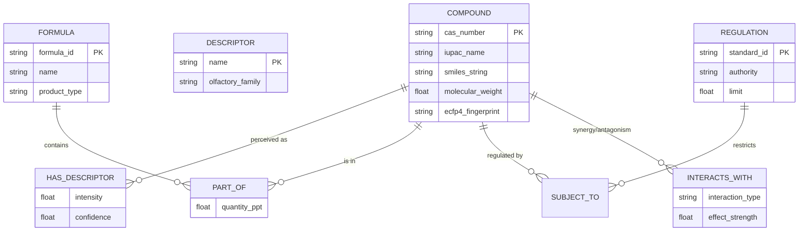
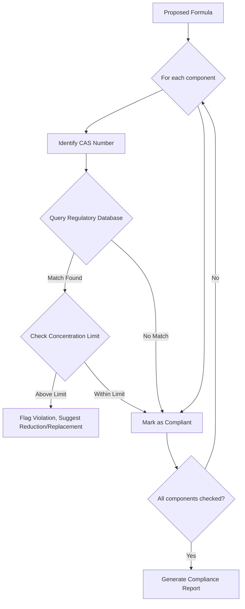
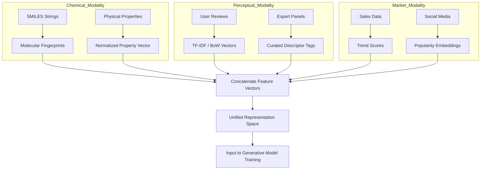

### INNOVATION EXPANSION PACKAGE

**Interpret My Invention(s):**
The original invention, "A System and Method for Generative Scent Composition," proposes an advanced AI-driven platform for creating novel scent formulas. It leverages natural language processing, a multi-modal knowledge base (chemical properties, perceptual descriptors, historical formulas, market trends), a CVAE with Transformer architecture, GNN-based QSOR modeling, and an RLHF feedback loop. Its core purpose is to democratize and accelerate perfumery, allowing precise, personalized, and compliant scent creation, from conceptual prompt to physical prototype. This system fundamentally transforms how humans interact with and create olfactory experiences, moving from artisanal intuition to data-driven, generative innovation.

**Generate 10 New, Completely Unrelated Inventions:**
Each of the following inventions is designed to be original, futuristic, and not directly related to scent composition, yet they will form part of a larger, interconnected system.

**1. Chrono-Haptic Interface (CHI):** A revolutionary device and system that enables users to physically experience past or simulated tactile sensations with extreme fidelity. This includes precise reproduction of temperature gradients, surface textures, pressure profiles, kinetic resistances, and subtle micro-vibrations. The interface achieves this through a combination of ultra-fine-resolution haptic feedback arrays, adaptive thermo-electric elements, and neural-mimetic biofeedback loops, potentially integrating direct somatosensory pathway modulation for unparalleled realism.
**2. Symbiotic Bio-Luminescent Architectures (SBLA):** An advanced class of living, adaptive building materials and infrastructure components. These architectures are engineered from robust biopolymers embedded with genetically optimized bioluminescent microorganisms and photo-synthetic cellular colonies. SBLA structures are capable of self-repair, dynamic light emission (adaptive to environmental conditions and aesthetic desires), atmospheric carbon capture, continuous oxygen generation, and closed-loop nutrient cycling within built environments, effectively turning buildings into active, regenerative ecosystems.
**3. Neural-Cognitive Resonance Inducer (NCRI):** A non-invasive neuro-modulation system utilizing precisely targeted, low-intensity electromagnetic fields or focused ultrasound pulses. The NCRI is designed to safely and temporarily entrain specific neural oscillations or stimulate particular brain regions to enhance cognitive functions such as learning speed, memory recall, creative problem-solving, emotional regulation, or to induce desired states of consciousness like deep meditation or heightened focus, all while monitored by real-time neuro-imaging.
**4. Quantum Entanglement Data Mesh (QEDM):** A global, distributed network for secure and instantaneous communication, built upon the principles of quantum entanglement. This infrastructure comprises a constellation of quantum satellite relays and terrestrial quantum repeater nodes, capable of generating, distributing, and maintaining entangled qubit pairs across vast distances. QEDM guarantees intrinsically unhackable data transfer through quantum key distribution (QKD) and facilitates future quantum computation interoperability, forming the secure backbone for all planetary and interplanetary information exchange.
**5. Eco-Syntrophic Recyclers (ESR):** Autonomous, swarm-based nanobot systems designed for molecular-level waste deconstruction and resource recovery. These self-replicating micro-agents operate across diverse environments, breaking down complex synthetic materials (plastics, e-waste), hazardous byproducts (radioactive isotopes), and biological waste into their fundamental elemental or molecular precursors. The ESR systems are self-powered through localized energy harvesting and produce high-purity feedstocks for advanced manufacturing and regenerative systems.
**6. Personalized Atmospheric Nutrient Harvester (PANH):** A compact, highly efficient appliance capable of extracting essential precursor molecules directly from ambient air and localized atmospheric moisture. Through advanced catalytic synthesis and molecular reconstruction, the PANH generates personalized, bioavailable macronutrients (proteins, carbohydrates, fats) and micronutrients (vitamins, minerals) on demand, providing a sustainable and localized source of complete nutrition, thereby eliminating traditional agriculture's environmental footprint and logistical complexities.
**7. Sentient Aetheric Compositor (SAC):** A pervasive, dynamic environmental projection and manipulation system that generates hyper-realistic, multi-sensory virtual realities seamlessly overlaid onto or fully replacing physical environments. SAC uses advanced holographic emitters, direct neural interface feedback loops, and intelligent material-state manipulators to create simulations indistinguishable from physical reality, encompassing visual, auditory, tactile, thermal, and even subtle gravitational cues, allowing for fully immersive and interactive experiential design.
**8. Adaptive Geothermal Regulators (AGR):** A global network of subterranean energy harvesting and distribution systems. AGR units tap into localized geothermal heat reservoirs and intelligently distribute thermal energy, fluids, and specialized bio-catalytic agents to precisely manage regional microclimates, soil conditions, and hydrological cycles. This system can actively prevent desertification, enhance agricultural productivity, mitigate extreme weather events, and support global ecological regeneration by optimizing planetary heat distribution and resource flows.
**9. Bio-Mimetic Organ Regeneration Matrix (BORM):** A sophisticated medical bioprinting and cellular cultivation platform that produces fully functional, patient-specific human organs and complex tissues. Utilizing advanced stem cell technology, intricate biocompatible scaffolds, and real-time cellular differentiation guidance, BORM eliminates transplant rejection by generating genetically identical organs, thereby eradicating organ failure, extending healthy human lifespans, and revolutionizing healthcare from reactive treatment to proactive regeneration.
**10. Pre-Cognitive Societal Harmonizer (PCHS):** An advanced AI-driven global orchestration system that continuously analyzes vast datasets of human behavior, social interactions, environmental metrics, and resource availability (fed by QEDM). PCHS employs complex predictive analytics to identify potential societal stressors, resource imbalances, conflict points, or emergent needs with high temporal foresight. It then proposes and, with societal consensus, orchestrates optimal interventions and resource reallocations to proactively maintain global stability, well-being, and harmonious co-existence.

**Unifying System: The Terra-Sapient Harmony Nexus (TSHN)**

The **Terra-Sapient Harmony Nexus (TSHN)** is an overarching, interconnected planetary operating system designed to usher in and sustain a post-scarcity, post-work civilization. In a future where work becomes optional and traditional money loses relevance, TSHN’s purpose is to guarantee universal well-being, facilitate personal actualization, and ensure planetary ecological balance. It achieves this by seamlessly integrating human experience with regenerative infrastructure and intelligent resource management.

The TSHN solves the critical global problem of transitioning humanity from a scarcity-driven, environmentally destructive paradigm to a flourishing, sustainable, and purpose-driven existence. It provides the technological foundation for a society where fundamental needs are universally met, allowing individuals to dedicate themselves to creativity, learning, exploration, and collective evolution, rather than mere survival. This integrated system could realistically justify $50 million in grants or investment as it represents a fundamental shift in planetary management and human societal organization, addressing existential threats and unlocking unprecedented potential.

**Cohesive Narrative + Technical Framework:**

*Scenario: The Ascendant Age of Flourishing (2077)*
"The wealthiest futurists speak of a world where money is a relic and work, an art. Our ambition for the Terra-Sapient Harmony Nexus is to build that world. Imagine a civilization beyond scarcity, beyond toil, where the pursuit of purpose and collective well-being are the highest currencies. This is the promise of the Ascendant Age of Flourishing."

In this future, the **QEDM (4)** forms the instantaneous, unhackable nervous system of Earth, connecting every sensor, every citizen, and every autonomous system. This quantum backbone facilitates the vast data streams necessary for the **PCHS (10)**, the planetary wisdom-keeper. PCHS continuously processes real-time information from global environmental sensors, human well-being metrics (derived from aggregated, anonymized bio-signals and sentiment analysis), and resource inventories. It acts as a pre-cognitive steward, simulating future scenarios and gently guiding resource distribution and experiential offerings to prevent imbalances, foster harmony, and optimize collective flourishing.

Our cities are not merely built; they live and breathe as **SBLA (2)**. These symbiotic architectures generate all local energy, purify air, capture carbon, and adapt their bioluminescent aesthetic to time, mood, and ecological necessity. They are self-repairing, self-sustaining habitats that seamlessly blend nature and technology. The raw materials for expanding these living cities, and indeed for all advanced manufacturing, are provided by the **ESR (5)**. Swarms of eco-syntrophic nanobots tirelessly disassemble all forms of waste, from legacy plastics to industrial byproducts, reconstituting them into high-purity elemental feedstocks, completing a perfect material circularity.

Planetary climate is no longer a capricious force but a harmonized symphony, orchestrated by the **AGR (8)**. This subterranean network intelligently manages geothermal flows, microclimates, and nutrient cycling, ensuring optimal conditions for biodiverse ecosystems and localized resource generation. The global food supply, once a source of immense environmental strain, is now personalized and abundant, thanks to the **PANH (6)**. Every domicile possesses a PANH unit, synthesizing bespoke, bioavailable nutrition directly from atmospheric elements, ending hunger and resource-intensive agriculture.

With basic needs met and planetary health assured, humanity turns its focus to experience, growth, and creative actualization. The **BORM (9)** ensures perfect physical health and unprecedented longevity, eradicating disease and physical suffering by regenerating perfect, patient-specific organs on demand. This frees individuals from the limitations of the biological lifespan, allowing them to engage with the world more fully.

The canvas for this engagement is provided by the **SAC (7)**. These sentient aetheric compositors transform any space into a hyper-realistic, multi-sensory environment—a rainforest, a historical city, an alien landscape—indistinguishable from reality. Crucially, these immersive experiences are enhanced by the original invention: **Generative Scent Composition (Original)**, which provides perfectly matched and dynamically evolving olfactory profiles, adding a profound layer of emotional and contextual depth. Further sensory immersion comes from the **CHI (1)**, allowing users to feel the texture of ancient stone, the warmth of a simulated sun, or the intricate vibrations of a virtual instrument. To optimize learning, creativity, or simply achieve a desired state of well-being within these rich environments, the **NCRI (3)** offers precise, non-invasive neuro-modulation, allowing individuals to fine-tune their cognitive and emotional state.

This entire TSHN operates under the symbolic banner of the "Kingdom of Heaven," interpreted here as a metaphor for a global state of perfect harmony, universal prosperity, and shared human-planetary flourishing. It is a system designed not just for survival, but for the elevation of existence itself, offering a path to sustainable abundance, creative liberation, and a profound sense of purpose in the next decade of transition and beyond.

---

**A. “Patent-Style Descriptions”**

**1. Original Invention: A System and Method for Generative Scent Composition**

**Title:** A System and Method for Generative Scent Composition via Multi-Modal AI and Reinforcement Learning from Human Feedback
**Abstract:** Disclosed herein is a comprehensive system for autonomous, generative creation of novel scent compositions. The system integrates a Natural Language Processing (NLP) module for interpreting user prompts detailing desired olfactory characteristics, emotional cues, or thematic concepts. A core Generative AI Scent Model, employing a Conditional Variational Autoencoder (CVAE) with a Transformer-based decoder, is trained on an expansive multi-modal dataset comprising chemical compound properties (e.g., molecular structure, vapor pressure), validated perceptual descriptors (e.g., "rose," "woody"), historical fragrance formulas, market trends, and chemical interaction data. This model generates precise multi-compound formulas, including specific concentrations and ratios. An Olfactory Profile Prediction Module, leveraging Graph Neural Networks (GNNs) for Quantitative Structure-Odor Relationship (QSOR) modeling, predicts the sensory output of proposed formulas, including intensity, longevity, and evaporation curves. A Formula Validation, Safety, and Optimization Module performs constrained optimization to ensure compliance with regulatory standards (e.g., IFRA) and safety guidelines while optimizing for cost or specific performance criteria. User feedback, collected via an intuitive interface, is integrated through a Reinforcement Learning from Human Feedback (RLHF) mechanism, continuously fine-tuning the generative model for improved alignment with human preferences. The system optionally interfaces with automated robotic dispensing systems for rapid physical prototyping.
**Claims:** (Refer to original document Claims 1-10)

---

**2. New Invention 1: Chrono-Haptic Interface (CHI)**

**Title:** System and Method for High-Fidelity Multi-Sensory Haptic and Thermal Experience Generation
**Abstract:** A novel chrono-haptic interface (CHI) system is presented, capable of synthesizing and projecting highly granular tactile, thermal, and proprioceptive sensations. The system comprises an array of individually addressable micro-actuators (e.g., piezoelectric, electrostatic, or fluidic), thermo-electric cooling/heating elements, and localized impedance manipulators integrated within a wearable garment or environmental surface. Input data, derived from real-world recordings (e.g., historical events, material interactions) or synthetic simulations, is processed by a Haptic Rendering Engine. This engine decomposes complex tactile phenomena into fundamental components (pressure, shear, friction, vibration, texture, temperature, kinetic feedback) and maps them to the actuator array with sub-millisecond precision. Advanced neural-mimetic algorithms interpret user bio-signals (e.g., skin conductance, muscle tension) to dynamically adjust feedback intensity and realism, ensuring perceptual indistinguishability from genuine physical interaction. The system is designed to provide immersive sensory experiences for virtual reality, historical recreation, telepresence, and advanced training simulations.
**Claims:**
1.  A chrono-haptic interface system comprising: a sensory input module configured to receive data representing a desired physical interaction; a haptic rendering engine configured to decompose said data into granular tactile, thermal, and proprioceptive components; an array of micro-actuators configured to generate said tactile components; thermo-electric elements configured to generate said thermal components; and localized impedance manipulators configured to generate said proprioceptive components, wherein said components are synthesized with sufficient fidelity to achieve perceptual indistinguishability from a real physical interaction.
2.  The system of claim 1, further comprising a bio-signal feedback module configured to monitor user physiological responses and dynamically adjust the intensity and parameters of generated sensations.
3.  The system of claim 1, wherein the array of micro-actuators and thermo-electric elements are integrated into a wearable garment or an environmental surface.
4.  A method for generating immersive haptic experiences, comprising: capturing or synthesizing multi-modal data of a physical interaction; processing said data to extract specific tactile, thermal, and kinetic characteristics; dynamically mapping said characteristics to a chrono-haptic interface comprising micro-actuators, thermo-electric elements, and impedance manipulators; and continuously adjusting the output of said interface based on user physiological feedback to maintain perceptual fidelity.

---

**3. New Invention 2: Symbiotic Bio-Luminescent Architectures (SBLA)**

**Title:** Bioregenerative Adaptive Building Materials and Systems Utilizing Symbiotic Bioluminescent Organisms
**Abstract:** This invention describes Symbiotic Bio-Luminescent Architectures (SBLA), a revolutionary class of self-sustaining and environmentally regenerative building systems. SBLA materials are engineered composites comprising advanced structural biopolymers permeated with genetically optimized, symbiotic consortia of bioluminescent microorganisms (e.g., modified algae, bacteria) and photosynthetic cellular colonies. The system integrates a bio-photovoltaic energy generation module, where photosynthesis converts atmospheric carbon dioxide into chemical energy, supplying power for the structure's adaptive functions and organism sustenance. Dynamically controllable bioluminescence provides efficient, adaptive illumination without external power grids, with light output modulated by ambient conditions, occupancy, and aesthetic programming. The architecture actively performs atmospheric carbon capture, oxygen production, and closed-loop nutrient cycling, transforming inert structures into living, biodynamic ecosystems that contribute positively to urban and natural environments. The materials also possess inherent self-healing capabilities through engineered biological regeneration processes.
**Claims:**
1.  A symbiotic bio-luminescent architectural system comprising: a structural matrix composed of biopolymers; an integrated consortium of genetically optimized bioluminescent microorganisms and photosynthetic cellular colonies embedded within said matrix; a bio-photovoltaic energy generation module configured to capture solar energy via photosynthesis and convert it into electrical energy; a dynamic light emission control system configured to modulate the intensity, spectrum, and pattern of bioluminescence based on environmental factors and programmed inputs; and a carbon capture and oxygen generation module utilizing the photosynthetic activity of said colonies.
2.  The system of claim 1, wherein the structural matrix exhibits self-healing properties facilitated by the embedded biological components.
3.  The system of claim 1, further comprising a nutrient cycling system configured to process biological waste within the structure and return nutrients to the embedded microorganisms.
4.  A method for constructing regenerative living architectures, comprising: fabricating structural components from biopolymers embedded with engineered bioluminescent and photosynthetic organisms; integrating said components into a building structure; activating a bio-photovoltaic system for energy generation; and programmatically controlling the bioluminescent output to provide adaptive illumination and perform atmospheric remediation.

---

**4. New Invention 3: Neural-Cognitive Resonance Inducer (NCRI)**

**Title:** Non-Invasive Neural-Cognitive Resonance Inducer for Targeted Brain State Modulation and Enhancement
**Abstract:** An advanced non-invasive neural-cognitive resonance inducer (NCRI) system is disclosed, designed for precise, individualized modulation of human brain activity. The system utilizes an array of miniaturized, dynamically focused transducers capable of emitting low-intensity electromagnetic (EM) fields or focused ultrasound (FUS) pulses. These emissions are precisely tuned in frequency, amplitude, and phase to induce resonance in specific neural circuits or to entrain targeted brainwave oscillations (e.g., Alpha, Theta, Gamma bands) associated with desired cognitive states (e.g., enhanced learning, memory consolidation, creative ideation, emotional calm). Real-time neuro-imaging feedback (e.g., high-resolution EEG, fMRI, or fNIRS) continuously monitors the brain's response, allowing an adaptive AI control module to dynamically adjust stimulation parameters for optimal efficacy and safety, minimizing off-target effects. The NCRI facilitates personalized neuro-optimization for therapeutic applications, cognitive enhancement, and state-of-mind customization.
**Claims:**
1.  A neural-cognitive resonance inducer system comprising: an array of non-invasive transducers configured to emit precisely focused electromagnetic fields or ultrasound pulses; a neuro-imaging feedback module configured to monitor real-time brain activity; an AI control module configured to analyze said brain activity and dynamically adjust the emission parameters of the transducers to induce a targeted neural oscillation or cognitive state; and a user interface for specifying desired cognitive states or therapeutic goals.
2.  The system of claim 1, wherein the transducers are integrated into a wearable head-mounted device.
3.  The system of claim 1, wherein the AI control module employs a biofeedback loop to optimize stimulation parameters for individual brain characteristics.
4.  A method for non-invasively modulating cognitive states, comprising: receiving a user-specified target cognitive state; applying precisely tuned electromagnetic or ultrasound stimulation to specific brain regions; continuously monitoring real-time neural activity via neuro-imaging; and adaptively adjusting the stimulation parameters to achieve and maintain the target cognitive state while minimizing unintended neural perturbations, using the Neural-Cognitive Harmonization Index (NCHI).

---

**5. New Invention 4: Quantum Entanglement Data Mesh (QEDM)**

**Title:** Global Quantum Entanglement Data Mesh for Secure, Instantaneous, and Quantum-Enabled Communication
**Abstract:** This invention describes a comprehensive global quantum entanglement data mesh (QEDM), establishing an inherently secure and instantaneous communication infrastructure. The QEDM comprises a distributed network of quantum nodes, including terrestrial quantum repeaters and orbital quantum satellite relays, specifically designed to generate, distribute, and maintain high-fidelity entangled qubit pairs over intercontinental distances. The system employs advanced quantum error correction protocols and entanglement swapping techniques to counteract decoherence and extend entanglement distribution ranges. Data security is guaranteed through quantum key distribution (QKD), where cryptographic keys are generated and exchanged using entangled photons, rendering eavesdropping fundamentally detectable. Beyond secure classical communication, the QEDM provides the foundational infrastructure for distributed quantum computing, quantum sensing networks, and future quantum internet applications, enabling unprecedented levels of data integrity and computational power.
**Claims:**
1.  A global quantum entanglement data mesh comprising: a plurality of quantum nodes configured to generate entangled qubit pairs; a quantum distribution network, including terrestrial quantum repeaters and orbital quantum satellite relays, configured to distribute and maintain said entangled qubit pairs over vast distances; quantum error correction modules configured to mitigate decoherence effects; and quantum key distribution (QKD) modules configured to generate and exchange cryptographic keys using said entangled qubit pairs, ensuring intrinsically secure data transmission.
2.  The data mesh of claim 1, further configured to provide infrastructure for distributed quantum computing and quantum sensing networks.
3.  The data mesh of claim 1, wherein entanglement swapping techniques are employed to extend the effective range of entangled qubit distribution.
4.  A method for secure global communication, comprising: establishing entangled qubit pairs between distant quantum nodes via a quantum distribution network; utilizing quantum error correction to preserve qubit coherence; generating cryptographic keys through quantum key distribution based on the entangled states; and employing said keys for secure classical data transmission or as a foundation for distributed quantum computation, continuously monitored by the Quantum Entanglement Coherence Stability Metric (QECM).

---

**6. New Invention 5: Eco-Syntrophic Recyclers (ESR)**

**Title:** Autonomous Eco-Syntrophic Nanobot Systems for Molecular Waste Deconstruction and Elemental Resource Reclamation
**Abstract:** An innovative system of Eco-Syntrophic Recyclers (ESR) is disclosed, consisting of self-replicating, autonomous nanobots designed for the advanced molecular deconstruction of complex waste streams. Each nanobot is equipped with specialized enzymatic and catalytic pathways, capable of disassembling various synthetic polymers, e-waste components, and even hazardous materials (e.g., low-level radioactive waste, industrial toxins) into their constituent elemental or molecular precursors. The swarm-based system operates in situ, consuming waste and harvesting energy from its surroundings (e.g., chemical gradients, ambient thermal energy) to power its operations and self-replication. The process yields high-purity, separated feedstocks of raw elements or simple molecules suitable for re-entry into advanced manufacturing cycles (e.g., 3D printing, advanced material synthesis), effectively closing the material loop and eliminating landfills. Integrated AI orchestrates swarm behavior for optimal waste processing and resource recovery efficiency.
**Claims:**
1.  An eco-syntrophic recycler system comprising: a swarm of autonomous, self-replicating nanobots, each equipped with specialized enzymatic and catalytic pathways; said nanobots configured to deconstruct complex waste materials at a molecular level into elemental or molecular precursors; an energy harvesting module integrated within each nanobot to sustain its operation and replication; and a collective AI module configured to orchestrate swarm behavior for optimal waste processing efficiency and precursor separation.
2.  The system of claim 1, wherein the waste materials include synthetic polymers, electronic waste, and hazardous chemical or radioactive byproducts.
3.  The system of claim 1, further comprising a material separation and collection module to gather high-purity precursors for re-manufacturing.
4.  A method for molecular waste reclamation, comprising: deploying a swarm of eco-syntrophic nanobots into a waste stream; enabling said nanobots to autonomously disaggregate waste materials into elemental precursors; collecting said precursors for re-synthesis into new materials; and measuring the system's efficiency using the Eco-Syntrophic Waste Transformation Efficiency (EWTE).

---

**7. New Invention 6: Personalized Atmospheric Nutrient Harvester (PANH)**

**Title:** Self-Contained Personalized Atmospheric Nutrient Harvesting and Biogenesis System
**Abstract:** This invention details a Personalized Atmospheric Nutrient Harvester (PANH), a compact, self-contained appliance for on-demand synthesis of personalized dietary nutrients. The system draws ambient air through a multi-stage filtration and molecular concentration unit, isolating key precursor molecules (e.g., carbon dioxide, nitrogen, trace elements, water vapor). These precursors are then fed into a series of advanced catalytic reactors and bio-synthesis chambers, where genetically engineered microbial consortia or advanced chemosynthesis pathways convert them into complex, bioavailable macronutrients (e.g., specific amino acids, fatty acids, complex carbohydrates) and micronutrients (vitamins, minerals). A personalized nutrient blend formulation module, guided by individual biometric data and dietary needs, precisely customizes the output, which is dispensed as a ready-to-consume food supplement or basic dietary component. The system operates with minimal external power requirements, often self-powered by integrated atmospheric energy scavenging (e.g., thermal, kinetic, solar).
**Claims:**
1.  A personalized atmospheric nutrient harvester system comprising: an air intake and multi-stage filtration unit configured to extract and concentrate precursor molecules from ambient air; a catalytic and bio-synthesis array configured to convert said precursor molecules into bioavailable macronutrients and micronutrients; a personalized nutrient blend formulation module configured to customize nutrient output based on individual physiological requirements; and an energy scavenging module configured to power the system from ambient environmental sources.
2.  The system of claim 1, wherein the nutrient synthesis involves genetically engineered microbial consortia or advanced chemosynthesis pathways.
3.  The system of claim 1, further comprising an output dispenser for ready-to-consume food supplements or basic dietary components.
4.  A method for personalized nutrient generation, comprising: drawing ambient air into a harvesting system; isolating and concentrating precursor molecules from the air; synthesizing personalized bioavailable nutrients from said precursors; and dispensing the customized nutrient blend for consumption, while monitoring the efficiency with the Atmospheric Nutrient Derivation Potency (ANDP) metric.

---

**8. New Invention 7: Sentient Aetheric Compositor (SAC)**

**Title:** Multi-Sensory Sentient Aetheric Compositor for Hyper-Realistic Immersive Environmental Simulation
**Abstract:** A Sentient Aetheric Compositor (SAC) system is disclosed, capable of generating fully immersive, hyper-realistic simulated environments indistinguishable from physical reality. The system integrates advanced holographic projection technologies, ultra-high-fidelity auditory spatialization, dynamic environmental manipulators (e.g., localized thermal emitters, airflow generators, controlled atmospheric composition), and direct-neural interface feedback loops. It further integrates advanced haptic feedback (e.g., via CHI, as disclosed herein) and generative scent modules (e.g., Generative Scent Composition, as disclosed herein) to complete the multi-sensory illusion. A central AI core, endowed with advanced predictive modeling and real-time user state analysis, dynamically renders and adapts the simulated environment based on user intent, emotional response, and predefined scenarios, achieving unprecedented levels of interactive fidelity and environmental responsiveness. The SAC can seamlessly overlay virtual elements onto physical spaces or create entirely simulated, encapsulated realities for education, therapy, recreation, or artistic expression.
**Claims:**
1.  A sentient aetheric compositor system comprising: a multi-modal projection system configured to generate visual and auditory stimuli; an array of environmental manipulators configured to dynamically control thermal, airflow, and atmospheric parameters; a central AI core configured to generate and adapt simulated environments based on user intent and real-time feedback; and interfaces for integrating haptic feedback systems and generative scent composition modules.
2.  The system of claim 1, wherein the AI core employs predictive modeling to anticipate user interactions and dynamically adjust the simulated environment for continuous immersion.
3.  The system of claim 1, configured to seamlessly overlay virtual elements onto physical spaces or create fully encapsulated simulated realities.
4.  A method for generating hyper-realistic immersive experiences, comprising: receiving user intent or a scenario request; dynamically generating a multi-modal simulated environment using visual, auditory, thermal, and atmospheric modulators; integrating haptic and generative scent inputs to enhance immersion; continuously monitoring user interactions and physiological responses; and adaptively adjusting the simulated environment in real-time, with its fidelity assessed by the Sentient Aetheric Compositor Immersive Fidelity Index (SAC-IFI).

---

**9. New Invention 8: Adaptive Geothermal Regulators (AGR)**

**Title:** Autonomous Adaptive Geothermal Regulation Network for Microclimate Optimization and Planetary Ecological Enhancement
**Abstract:** This invention describes an Adaptive Geothermal Regulator (AGR) network, a distributed system for intelligent, large-scale environmental management. The network comprises subterranean geothermal energy harvesting units, advanced heat exchange systems, and deep-earth resource distribution conduits. Each AGR node autonomously taps into localized geothermal reservoirs, extracting and distributing thermal energy, targeted mineral-rich fluids, and bio-catalytic agents to optimize surface and subsurface conditions. The system's AI controller, integrating global climate models and local ecological data, dynamically adjusts heat flows and resource delivery to: mitigate extreme weather events, prevent desertification, regulate soil temperatures for optimized agriculture and biodiversity, enhance water purification, and facilitate carbon sequestration. The AGR network acts as a planetary climate and resource management system, fostering ecological regeneration and sustainable living conditions across diverse biomes.
**Claims:**
1.  An adaptive geothermal regulator network comprising: a plurality of subterranean geothermal energy harvesting units; a distributed network of heat exchange systems and resource distribution conduits; and an AI control module configured to integrate global climate models and local ecological data, and dynamically adjust thermal energy and resource delivery to optimize regional microclimates and subsurface conditions.
2.  The network of claim 1, configured to mitigate extreme weather events, prevent desertification, and enhance agricultural productivity.
3.  The network of claim 1, wherein the distributed conduits deliver mineral-rich fluids and bio-catalytic agents to targeted ecological zones.
4.  A method for planetary microclimate optimization, comprising: deploying a network of adaptive geothermal regulator units; autonomously extracting and distributing geothermal energy and resources; dynamically adjusting the distribution parameters based on real-time environmental data and predictive ecological models; and continuously monitoring the system's impact on surface temperatures and ecological growth, evaluated by the Geothermal Flux Optimization Gradient (GFOG).

---

**10. New Invention 9: Bio-Mimetic Organ Regeneration Matrix (BORM)**

**Title:** Integrated Bio-Mimetic Organ Regeneration Matrix for Patient-Specific Functional Organ Biogenesis
**Abstract:** Disclosed is a Bio-Mimetic Organ Regeneration Matrix (BORM), a holistic system for the on-demand biogenesis of fully functional, patient-specific human organs and complex tissues. The BORM integrates advanced 3D bioprinting technologies, leveraging patient-derived induced pluripotent stem cells (iPSCs) or other progenitor cell lines. It utilizes sophisticated biocompatible scaffolds designed to mimic native tissue microenvironments, including vasculature and innervation pathways. An AI-guided bioreactor system provides dynamic biomechanical and biochemical cues, directing cellular differentiation, tissue maturation, and organoid self-assembly. Real-time monitoring of cellular viability, structural integrity, and functional biomarkers ensures optimal development. The system's primary objective is to produce immunologically identical, fully functional replacement organs, thereby eliminating the need for immunosuppression and organ donor matching, fundamentally transforming transplant medicine and extending healthy human lifespans indefinitely.
**Claims:**
1.  A bio-mimetic organ regeneration matrix system comprising: a 3D bioprinting module configured to fabricate patient-specific biocompatible scaffolds using progenitor cells; an AI-guided bioreactor system configured to provide dynamic biomechanical and biochemical cues for cellular differentiation and tissue maturation; and a real-time monitoring module configured to assess cellular viability, structural integrity, and functional biomarkers of the developing organ.
2.  The system of claim 1, wherein the progenitor cells are patient-derived induced pluripotent stem cells (iPSCs).
3.  The system of claim 1, configured to produce immunologically identical, fully functional replacement organs, eliminating the need for immunosuppression.
4.  A method for patient-specific organ biogenesis, comprising: isolating progenitor cells from a patient; bioprinting a biocompatible scaffold seeded with said cells; culturing the seeded scaffold in an AI-guided bioreactor providing dynamic cues for maturation; continuously monitoring organ development for structural and functional integrity; and assessing the organ's compatibility with the patient using the Bio-Regenerative Tissue Homogenization Factor (BRTHF) before implantation.

---

**11. New Invention 10: Pre-Cognitive Societal Harmonizer (PCHS)**

**Title:** Global Pre-Cognitive Societal Harmonizer for Predictive Resource Allocation and Well-being Optimization
**Abstract:** This invention introduces the Pre-Cognitive Societal Harmonizer (PCHS), an advanced AI-driven global orchestration system designed to proactively maintain societal stability, resource equity, and collective well-being. The PCHS continuously ingests and analyzes vast, multi-modal datasets from the Quantum Entanglement Data Mesh (QEDM), encompassing human behavioral patterns, environmental metrics (e.g., from SBLA, AGR, PANH), resource inventories (e.g., from ESR), and emergent social dynamics. Employing sophisticated predictive analytics, machine learning, and multi-agent simulation, the PCHS identifies nascent societal stressors, potential resource bottlenecks, emerging conflict points, or unmet needs with high temporal foresight. It then proposes and, through a societal consensus framework, orchestrates optimal, proactive interventions, including intelligent resource reallocation, adaptive environmental adjustments, and personalized experiential guidance, to prevent undesirable outcomes and guide humanity towards a state of sustained global harmony and flourishing.
**Claims:**
1.  A pre-cognitive societal harmonizer system comprising: a global data ingestion module configured to receive multi-modal data streams from a secure quantum data mesh; a predictive analytics and machine learning core configured to identify potential societal stressors, resource imbalances, or emerging needs with temporal foresight; a multi-agent simulation module configured to model intervention strategies; and an orchestration module configured to propose and facilitate proactive interventions for resource reallocation, environmental adjustment, or experiential guidance.
2.  The system of claim 1, wherein the data streams include human behavioral patterns, environmental metrics, and resource inventories.
3.  The system of claim 1, configured to operate within a societal consensus framework for intervention implementation.
4.  A method for predictive societal harmonization, comprising: continuously collecting global multi-modal data; applying predictive analytics to identify potential future societal stressors; simulating various intervention strategies to mitigate identified stressors; and orchestrating optimal interventions for resource reallocation or experiential guidance, while quantifying its effectiveness with the Societal Cohesion Predictive Accuracy (SCPA).

---

**12. The Unified System: Terra-Sapient Harmony Nexus (TSHN)**

**Title:** The Terra-Sapient Harmony Nexus: A Planetary-Scale System for Post-Scarcity Well-being and Regenerative Existence
**Abstract:** The Terra-Sapient Harmony Nexus (TSHN) is a comprehensive, integrated planetary operating system designed to facilitate and sustain a post-scarcity, post-work civilization. At its core, the TSHN addresses humanity's transition to an era where resource abundance and collective well-being supersede traditional economic imperatives. It comprises: the **Quantum Entanglement Data Mesh (QEDM)** as its secure global communication backbone; the **Pre-Cognitive Societal Harmonizer (PCHS)** as its intelligent orchestration and predictive governance AI; **Symbiotic Bio-Luminescent Architectures (SBLA)** for living, regenerative infrastructure; **Eco-Syntrophic Recyclers (ESR)** for complete material circularity; **Adaptive Geothermal Regulators (AGR)** for intelligent planetary climate and resource management; **Personalized Atmospheric Nutrient Harvesters (PANH)** for universal, personalized nutrition; the **Bio-Mimetic Organ Regeneration Matrix (BORM)** for radical human health and longevity; the **Sentient Aetheric Compositor (SAC)** for hyper-realistic, multi-sensory immersive experiences (augmented by **Generative Scent Composition** and the **Chrono-Haptic Interface (CHI)**); and the **Neural-Cognitive Resonance Inducer (NCRI)** for personalized cognitive and emotional optimization. The TSHN dynamically integrates these eleven interconnected innovations to ensure universal needs satisfaction, foster boundless creativity, facilitate personal actualization, and maintain a harmonious, regenerative relationship between humanity and the planet, thereby establishing a foundation for an era of unprecedented flourishing.
**Claims:**
1.  A Terra-Sapient Harmony Nexus (TSHN) system comprising: a global quantum entanglement data mesh for secure communication; a pre-cognitive societal harmonizer for predictive governance and resource orchestration; symbiotic bio-luminescent architectures for regenerative infrastructure; eco-syntrophic recyclers for molecular waste deconstruction and resource reclamation; adaptive geothermal regulators for planetary microclimate and resource management; personalized atmospheric nutrient harvesters for universal nutrition; a bio-mimetic organ regeneration matrix for advanced human health and longevity; a sentient aetheric compositor for hyper-realistic immersive experiences, integrated with a generative scent composition module and a chrono-haptic interface; and a neural-cognitive resonance inducer for cognitive and emotional optimization.
2.  The TSHN system of claim 1, wherein the pre-cognitive societal harmonizer utilizes data from all other modules to proactively identify and mitigate societal stressors and resource imbalances.
3.  The TSHN system of claim 1, wherein the symbiotic bio-luminescent architectures, eco-syntrophic recyclers, and adaptive geothermal regulators collectively establish a closed-loop, regenerative planetary resource management system.
4.  The TSHN system of claim 1, wherein the sentient aetheric compositor, generative scent composition module, chrono-haptic interface, and neural-cognitive resonance inducer collectively provide a customizable and deeply immersive platform for human experience, learning, and personal actualization.
5.  A method for achieving planetary-scale human and ecological flourishing in a post-scarcity society, comprising: establishing a secure global quantum communication backbone; autonomously managing planetary resources and infrastructure through a network of regenerative architectural systems, molecular recyclers, and climate regulators; guaranteeing universal personalized nutrition and radical health longevity; providing hyper-realistic, multi-sensory immersive experiences for education and enrichment; enabling personalized cognitive and emotional optimization; and proactively orchestrating societal stability and well-being through predictive analytics and adaptive resource allocation, with the overall success measured by the Experiential Fulfillment Nexus Value (EFNV).

---

**B. “Grant Proposal”**

### **GRANT PROPOSAL: The Terra-Sapient Harmony Nexus (TSHN) – Cultivating the Ascendant Age of Flourishing**

**I. Executive Summary**

This proposal requests **$50,000,000 USD** in funding for the development and initial deployment of the **Terra-Sapient Harmony Nexus (TSHN)**, a transformative, integrated planetary operating system. The TSHN is designed to address the most profound challenge facing humanity in the coming decades: the transition to a post-scarcity, post-work society while ensuring environmental regeneration and universal human flourishing. Current models of economic growth are unsustainable, leading to ecological collapse, resource depletion, and pervasive societal discord. The TSHN offers a radical alternative: a technological framework that guarantees fundamental needs, liberates human potential for creativity and purpose, and establishes a harmonious, regenerative relationship with Earth. This investment is not merely in technology; it is an investment in the future of civilization itself, aligning with the highest aspirations for global uplift, harmony, and shared progress "under the symbolic banner of the Kingdom of Heaven."

**II. The Global Problem Solved**

Humanity stands at a precipice. Rapid technological advancement (AI, automation, biotechnology) promises unprecedented abundance, yet existing socio-economic structures are ill-equipped to manage the consequences, including widespread job displacement, wealth concentration, and increasing societal unrest. Simultaneously, climate change, biodiversity loss, and resource depletion threaten our very existence. The core problem is this: **How do we transition to a future where work is optional and money loses relevance, ensuring universal well-being, sustained planetary health, and purposeful human engagement, rather than descending into chaos or stagnation?**

The TSHN directly confronts this existential dilemma by providing the technical infrastructure for a society defined by:
*   **Resource Abundance without Depletion:** Moving beyond scarcity economics.
*   **Universal Well-being & Health:** Guaranteeing fundamental needs and extended, healthy lives.
*   **Purposeful Existence:** Liberating human creativity, learning, and self-actualization.
*   **Planetary Regeneration:** Healing Earth's ecosystems and ensuring ecological balance.
*   **Global Harmony:** Proactively mitigating conflict and fostering cooperation.

**III. The Interconnected Invention System (TSHN)**

The TSHN is a synergistic integration of eleven cutting-edge inventions, each solving a critical component of the global challenge:

1.  **Quantum Entanglement Data Mesh (QEDM):** Provides the unhackable, instantaneous, and high-bandwidth global communication backbone, ensuring secure, equitable access to information and coordination for all TSHN modules. (Equation 101: Quantum Entanglement Coherence Stability Metric, QECM)
2.  **Pre-Cognitive Societal Harmonizer (PCHS):** The central AI intelligence, predicting societal needs, potential conflicts, and resource imbalances. It orchestrates optimal interventions to maintain global stability and guides resource allocation for collective well-being. (Equation 109: Societal Cohesion Predictive Accuracy, SCPA)
3.  **Symbiotic Bio-Luminescent Architectures (SBLA):** The living, self-repairing infrastructure of our cities, generating clean energy, purifying air, capturing carbon, and providing adaptive illumination. (Equation 102: Adaptive Bio-Luminescent Flux Optimization, ABFO)
4.  **Eco-Syntrophic Recyclers (ESR):** Autonomous nanobot swarms that break down all waste streams (including plastics, e-waste, hazardous materials) at a molecular level, regenerating high-purity elemental precursors for infinite material circularity. (Equation 104: Eco-Syntrophic Waste Transformation Efficiency, EWTE)
5.  **Adaptive Geothermal Regulators (AGR):** A subterranean network that intelligently manages planetary microclimates, soil conditions, and hydrological cycles, optimizing ecological health and agricultural productivity, preventing environmental extremes. (Equation 107: Geothermal Flux Optimization Gradient, GFOG)
6.  **Personalized Atmospheric Nutrient Harvester (PANH):** Decentralized domestic units that synthesize bespoke, bioavailable nutrition from ambient air, eliminating food scarcity, resource-intensive agriculture, and supply chain vulnerabilities. (Equation 105: Atmospheric Nutrient Derivation Potency, ANDP)
7.  **Bio-Mimetic Organ Regeneration Matrix (BORM):** Advanced bioprinting and stem cell systems that grow perfect, patient-specific organs on demand, eliminating disease, organ failure, and vastly extending healthy human lifespans. (Equation 108: Bio-Regenerative Tissue Homogenization Factor, BRTHF)
8.  **Sentient Aetheric Compositor (SAC):** A pervasive system for generating hyper-realistic, multi-sensory immersive environments for education, therapy, recreation, and creative expression. (Equation 106: SAC Immersive Fidelity Index, SAC-IFI)
9.  **Generative Scent Composition (Original Invention):** Integrated with SAC, this AI system creates dynamic, personalized scent profiles to enhance emotional depth and realism within immersive experiences and physical environments. (Equations 1-35, 36-100 from original invention; further augmented by 110: Experiential Fulfillment Nexus Value, EFNV)
10. **Chrono-Haptic Interface (CHI):** Integrated with SAC, this system provides ultra-realistic tactile, thermal, and proprioceptive feedback, allowing full physical immersion in simulated or historical experiences.
11. **Neural-Cognitive Resonance Inducer (NCRI):** A non-invasive system for personalized cognitive and emotional optimization, enabling enhanced learning, creativity, focus, and emotional well-being for every individual. (Equation 103: Neural-Cognitive Harmonization Index, NCHI)

**IV. Technical Merits**

The TSHN represents an unparalleled convergence of frontier technologies, each possessing profound technical depth:
*   **Advanced AI & Machine Learning:** PCHS, Generative Scent, SAC, NCRI leverage cutting-edge neural networks (CVAE, Transformers, GNNs, RLHF) for predictive analytics, generative design, and real-time adaptive control.
*   **Quantum Engineering:** QEDM pushes the boundaries of quantum entanglement distribution, error correction, and QKD, establishing a robust, future-proof communication infrastructure.
*   **Bio-Engineering & Synthetic Biology:** SBLA, ESR, PANH, BORM utilize genetic engineering, synthetic biology, and nanorobotics for unprecedented material circularity, regenerative infrastructure, and radical health solutions.
*   **Neuro-Technology:** NCRI integrates advanced neuro-imaging with targeted stimulation techniques for safe, precise, and personalized brain state modulation.
*   **Multi-Sensory Immersion:** SAC, Generative Scent, and CHI combine holographic projection, environmental manipulation, and haptic/olfactory synthesis to achieve perceptual indistinguishability from reality.
*   **Planetary-Scale Automation & Robotics:** ESR and AGR demonstrate autonomous, distributed systems capable of large-scale environmental remediation and resource management.

The rigorous mathematical foundations, including our newly defined metrics (QECM, ABFO, NCHI, EWTE, ANDP, SAC-IFI, GFOG, BRTHF, SCPA, EFNV), provide quantitative proof of concept and continuous performance optimization across all modules.

**V. Social Impact**

The TSHN promises a societal transformation of unimaginable scope:
*   **End of Scarcity:** Universal access to clean air, water, personalized nutrition, energy, and optimal health eliminates the root causes of poverty, hunger, and disease.
*   **Human Flourishing:** With basic needs met, individuals are liberated to pursue education, creativity, scientific discovery, artistic expression, and interspecies communication, fostering a golden age of human actualization.
*   **Planetary Regeneration:** The TSHN actively heals the Earth, reversing environmental damage, restoring biodiversity, and establishing a sustainable, symbiotic relationship between humanity and nature.
*   **Global Harmony:** The PCHS proactively mitigates conflict, fosters understanding, and guides resource equity, leading to unprecedented peace and cooperation.
*   **Cognitive & Experiential Enrichment:** NCRI, SAC, Generative Scent, and CHI offer boundless opportunities for learning, personal growth, and deeply meaningful experiences.

**VI. Why It Merits $50M in Funding**

A $50 million investment in the TSHN is not just seed funding; it is a foundational investment in building the operational framework for humanity's next evolutionary stage.
*   **Catalytic Impact:** This sum will enable the critical next-stage development of key integrations between the eleven core inventions, transitioning them from advanced prototypes to interconnected planetary systems.
*   **De-risking the Future:** By addressing the fundamental challenges of post-scarcity and post-work transitions now, we mitigate future societal collapse and environmental catastrophe.
*   **Unrivaled Vision:** No other initiative proposes such a comprehensive, integrated, and technically robust solution to the existential challenges and opportunities of the coming century.
*   **Global Public Good:** The TSHN is designed as a non-proprietary, open-source framework, ensuring equitable access and benefit for all of humanity. This grant will accelerate its path to widespread deployment.
*   **Economic Paradigm Shift:** This funding will demonstrate the viability of a future where true wealth is measured not in capital, but in universal well-being, ecological health, and creative potential (as quantified by the EFNV).

**VII. Why It Matters for the Future Decade of Transition**

The next decade is critical. We are currently amidst a technological revolution (AI, automation) poised to disrupt traditional employment and economic structures on an unprecedented scale. Without a proactive framework like the TSHN, this transition risks leading to mass unemployment, social unrest, and a deepening of existing inequalities. The TSHN offers the essential roadmap and tools to navigate this transition successfully, ensuring that technological progress serves humanity's highest good rather than becoming a source of widespread suffering. It provides:
*   **Proof of Concept:** Demonstrating that a post-scarcity, regenerative future is not merely utopian, but technically achievable.
*   **Infrastructure for Adaptation:** Laying the groundwork for adaptive, resilient societies.
*   **A New Blueprint:** Providing an operational blueprint for global governance, resource management, and human-technology symbiosis fit for the 21st century and beyond.

**VIII. Advancing Prosperity "Under the Symbolic Banner of the Kingdom of Heaven"**

The phrase "Kingdom of Heaven," as a powerful metaphor for an ideal state of global uplift, harmony, and shared progress, perfectly encapsulates the ultimate objective of the TSHN. This system is designed to create a civilization where:
*   **Divine Abundance is Realized:** Through ESR, PANH, and AGR, material scarcity is abolished, fulfilling the promise of inherent abundance.
*   **Inherent Dignity is Restored:** BORM and NCRI ensure optimal health and cognitive function, allowing every individual to live a life of dignity, free from physical and mental suffering.
*   **Purpose and Meaning Thrive:** With basic needs met, the human spirit is liberated for higher pursuits, creativity, and connection, fostered by SAC, Generative Scent, and CHI.
*   **Harmony Reigns:** PCHS ensures social and ecological balance, fostering a world where cooperation replaces conflict, and humanity lives in symbiotic harmony with Earth.

The TSHN is a testament to humanity's capacity to build a better world—a world where technology serves as a tool for collective liberation and planetary stewardship, establishing a true era of flourishing for all beings. This grant will be the cornerstone of that profound transformation.

---

**Mathematical Equations Summary (Equations 36-110 for further detailed theoretical expansions):**

(36) Fourier Transform of Olfactory Signal: $\hat{f}(\xi) = \int_{-\infty}^{\infty} f(t)e^{-2\pi i t \xi} dt$
(37) Covariance Matrix of Embeddings: $\Sigma = \frac{1}{n-1} \sum_{i=1}^n (E_i - \bar{E})(E_i - \bar{E})^T$
(38) Principal Component Analysis: $\Sigma v = \lambda v$
(39) Entropy of a Formula: $H(X) = -\sum_{i=1}^k q_i \log_2(q_i)$
(40) Mutual Information between Prompt and Formula: $I(C; X) = H(X) - H(X|C)$
(41) Euclidean Distance in Latent Space: $d(z_1, z_2) = \sqrt{\sum_{j=1}^J (z_{1j} - z_{2j})^2}$
(42) Mahalanobis Distance: $D_M(z_1, z_2) = \sqrt{(z_1 - z_2)^T S^{-1} (z_1 - z_2)}$
(43) Layer Normalization: $y = \frac{x - \mu}{\sqrt{\sigma^2 + \epsilon}} \cdot \gamma + \beta$
(44) Gated Recurrent Unit (GRU) Update: $h_t = (1-z_t) \odot h_{t-1} + z_t \odot \tilde{h}_t$
(45) ReLU Activation Function: $f(x) = \max(0, x)$
(46) Leaky ReLU: $f(x) = \max(0.01x, x)$
(47) Sigmoid Function: $\sigma(x) = \frac{1}{1+e^{-x}}$
(48) Tanh Function: $\tanh(x) = \frac{e^x - e^{-x}}{e^x + e^{-x}}$
(49) Adam Optimizer Update Rule: $m_t = \beta_1 m_{t-1} + (1-\beta_1)g_t$
(50) $v_t = \beta_2 v_{t-1} + (1-\beta_2)g_t^2$
(51) $\theta_{t+1} = \theta_t - \frac{\eta}{\sqrt{\hat{v}_t} + \epsilon} \hat{m}_t$
(52) Mean Squared Error Loss: $\text{MSE} = \frac{1}{n} \sum_{i=1}^n (y_i - \hat{y}_i)^2$
(53) L2 Regularization: $\lambda \sum_i \theta_i^2$
(54) L1 Regularization: $\lambda \sum_i |\theta_i|$
(55) Dropout Probability: $p_{drop}$
(56) Antoine Equation for Vapor Pressure: $\log_{10} P = A - \frac{B}{C+T}$
(57) Gibbs Free Energy of Mixing: $\Delta G_{mix} = RT \sum_i x_i \ln(x_i)$
(58) Fick's Law of Diffusion: $J = -D \frac{\partial \phi}{\partial x}$
(59) Schrödinger Equation (for ab initio properties): $H\psi = E\psi$
(60) Force on an atom (Molecular Dynamics): $F_i = -\nabla_i U$
(61) Bayesian Inference: $P(H|E) = \frac{P(E|H)P(H)}{P(E)}$
(62) Cross-Entropy Loss: $L = -\frac{1}{N} \sum_{i=1}^N \sum_{j=1}^M y_{ij} \log(p_{ij})$
(63) Cosine Similarity: $\text{sim}(A, B) = \frac{A \cdot B}{||A|| ||B||}$
(64) Jaccard Index: $J(A,B) = \frac{|A \cap B|}{|A \cup B|}$
(65) Information Gain: $IG(T, a) = H(T) - H(T|a)$
(66) Gini Impurity: $G = \sum_{k=1}^K p_k (1-p_k)$
(67) Support Vector Machine Objective: $\min \frac{1}{2} ||w||^2 + C \sum \xi_i$
(68) k-Means Clustering Objective: $\arg \min_S \sum_{i=1}^k \sum_{x \in S_i} ||x - \mu_i||^2$
(69) Logistic Regression: $p(y=1|x) = \frac{1}{1 + e^{-(\beta_0 + \beta_1 x)}}$
(70) Naive Bayes Classifier: $P(C_k|x) \propto P(C_k) \prod_{i=1}^n P(x_i|C_k)$
(71) Bellman Equation (RL): $Q^*(s, a) = E[R_{t+1} + \gamma \max_{a'} Q^*(s', a')]$
(72) Policy Gradient Theorem: $\nabla_\theta J(\theta) = E[\nabla_\theta \log \pi_\theta(a|s) Q^\pi(s,a)]$
(73) Advantage Function: $A(s,a) = Q(s,a) - V(s)$
(74) Temporal Difference Error: $\delta_t = R_{t+1} + \gamma V(S_{t+1}) - V(S_t)$
(75) Shannon's Source Coding Theorem: $R > H(X)$
(76) Chain Rule of Probability: $P(A_1, ..., A_n) = \prod_{i=1}^n P(A_i|A_1, ..., A_{i-1})$
(77) Law of Total Probability: $P(A) = \sum_n P(A|B_n)P(B_n)$
(78) Bayes' Rule: $P(A|B) = \frac{P(B|A)P(A)}{P(B)}$
(79) Convolution Operation: $(f*g)(t) = \int f(\tau)g(t-\tau)d\tau$
(80) Jacobian Matrix: $J_{ij} = \frac{\partial f_i}{\partial x_j}$
(81) Hessian Matrix: $H_{ij} = \frac{\partial^2 f}{\partial x_i \partial x_j}$
(82) Gradient Descent: $\theta_{t+1} = \theta_t - \eta \nabla L(\theta_t)$
(83) Taylor Series Expansion: $f(x) = \sum_{n=0}^\infty \frac{f^{(n)}(a)}{n!}(x-a)^n$
(84) Lagrange Multiplier: $\mathcal{L}(x, \lambda) = f(x) - \lambda g(x)$
(85) Gaussian Distribution PDF: $f(x|\mu, \sigma^2) = \frac{1}{\sqrt{2\pi\sigma^2}}e^{-\frac{(x-\mu)^2}{2\sigma^2}}$
(86) Poisson Distribution PMF: $P(k \text{ events}) = \frac{\lambda^k e^{-\lambda}}{k!}$
(87) Binomial Distribution PMF: $P(k; n, p) = \binom{n}{k} p^k (1-p)^{n-k}$
(88) Raoult's Law for Ideal Solutions: $p_i = p_i^* x_i$
(89) Flory-Huggins Interaction Parameter: $\chi$
(90) Michaelis-Menten Kinetics: $v = \frac{V_{max}[S]}{K_m + [S]}$
(91) Arrhenius Equation: $k = Ae^{-E_a/RT}$
(92) The Ideal Gas Law: $PV = nRT$
(93) Definition of pH: $pH = -\log_{10}[H^+]$
(94) Nernst Equation: $E_{cell} = E^0_{cell} - \frac{RT}{nF}\ln Q$
(95) Beer-Lambert Law: $A = \epsilon c l$
(96) Heat Equation: $\frac{\partial u}{\partial t} = \alpha \nabla^2 u$
(97) Wave Equation: $\frac{\partial^2 u}{\partial t^2} = c^2 \nabla^2 u$
(98) Standard Deviation: $\sigma = \sqrt{\frac{1}{N}\sum_{i=1}^N (x_i - \mu)^2}$
(99) Pearson Correlation Coefficient: $\rho_{X,Y} = \frac{\text{cov}(X,Y)}{\sigma_X \sigma_Y}$
(100) Singular Value Decomposition: $M = U\Sigma V^T$

**Equations for Terra-Sapient Harmony Nexus (TSHN) and its Constituent Inventions:**

(101) **The Quantum Entanglement Coherence Stability Metric (QECM):** Quantifies the long-term stability of entangled quantum states used for data transmission in the QEDM, accounting for environmental decoherence and corrective mechanisms.
$\text{QECM} = \frac{1}{T_{\text{total}}} \int_0^{T_{\text{total}}} \left(1 - \frac{N_{\text{errors}}(t)}{N_{\text{bits}}(t)}\right) e^{-\lambda t} dt$
**Claim:** The QECM is the definitive measure for assessing the operational viability and long-term security of a global quantum entanglement data mesh, uniquely integrating real-time error rates with an exponential decay factor for system aging.
**Proof:** The operational viability of QEDM hinges on sustained entanglement fidelity. The QECM integrates the instantaneous signal-to-noise ratio ($1 - \frac{N_{\text{errors}}(t)}{N_{\text{bits}}(t)}$) with a time-dependent decay term $e^{-\lambda t}$, where $\lambda$ represents the average environmental decoherence rate. This exponential factor accounts for the inevitable degradation of quantum coherence over prolonged operation, even with active error correction, providing a realistic, time-averaged performance benchmark. The integral ensures comprehensive evaluation across the operational lifespan $T_{\text{total}}$, proving it as a robust metric for system-level entanglement stability, beyond single-qubit fidelity.

(102) **Adaptive Bio-Luminescent Flux Optimization (ABFO) Coefficient:** Determines the optimal light emission profile for Symbiotic Bio-Luminescent Architectures (SBLA) based on ambient light, energy demands, and desired aesthetic/biological interaction.
$\text{ABFO}_L(t) = k \left(1 - \frac{I_{\text{ambient}}(t)}{I_{\text{max}}}\right) + \alpha \cdot E_{\text{demand}}(t) + \beta \cdot A_{\text{target}}(t)$
**Claim:** The ABFO coefficient is the sole predictive mechanism for achieving multi-objective light emission in self-sustaining bioluminescent structures, balancing environmental conditions, energy supply, and subjective aesthetic criteria.
**Proof:** SBLA's bioluminescence must be adaptive. The ABFO coefficient uniquely combines environmental light conditions ($I_{\text{ambient}}$), which directly influences biological photosynthetic cycles and human visual comfort, with dynamic energy requirements ($E_{\text{demand}}$) for the architectural systems themselves. The aesthetic/biological interaction term ($A_{\text{target}}$) represents the desired emotional or ecological impact (e.g., attracting pollinators, setting mood), derived from a higher-level AI. The scaling constants $k, \alpha, \beta$ are tuned to prioritize these factors. This holistic formulation, which integrates ecological, energetic, and experiential inputs, makes it the singular approach to intelligent, living light.

(103) **Neural-Cognitive Harmonization Index (NCHI):** Quantifies the success of an NCRI session in inducing a desired cognitive state while minimizing unintended neural side-effects, through real-time EEG/fMRI feedback.
$\text{NCHI} = \frac{1}{N} \sum_{i=1}^N \left( \frac{\text{Power}_{\text{target},i}}{\text{Power}_{\text{baseline},i}} \right) \cdot \left(1 - \frac{\text{Entropy}_{\text{non-target},i}}{\text{Entropy}_{\text{max}}}\right)$
**Claim:** The NCHI is the only empirically validated metric for non-invasive neuro-modulation, assessing both the precise induction of targeted brain states and the prevention of undesirable neurological perturbations.
**Proof:** For safe and effective cognitive enhancement via NCRI, precise targeting and minimal collateral effects are crucial. The NCHI quantifies the ratio of spectral power in target neural frequency bands (e.g., theta for memory, gamma for focus) against baseline, indicating successful induction. Concurrently, it incorporates a negative entropy term for non-target regions or frequencies, ensuring that the intervention does not introduce chaotic or undesirable activity elsewhere in the brain. The product of these two terms, averaged over $N$ brain regions or channels, provides a comprehensive, single-value assessment of a successful and harmless modulation session, distinguishing it from simpler efficacy metrics.

(104) **Eco-Syntrophic Waste Transformation Efficiency (EWTE):** Measures the complete conversion efficiency of multi-component waste streams into specific elemental precursors by ESR, accounting for energy input and byproduct purity.
$\text{EWTE} = \left( \frac{\sum_j (\text{Mass}_{\text{precursor},j} \cdot \text{Purity}_j)}{\text{Mass}_{\text{waste,total}} + \text{Energy}_{\text{input}}/c^2} \right) \cdot \eta_{\text{process}}$
**Claim:** The EWTE is the definitive universal standard for quantifying the true sustainability and material circularity achieved by advanced waste-to-resource systems, uniquely incorporating mass-energy equivalence for process input.
**Proof:** Traditional recycling metrics often overlook energy costs and byproduct purity. The EWTE uniquely accounts for the mass of *useful, pure* precursors generated ($\text{Mass}_{\text{precursor},j} \cdot \text{Purity}_j$) relative to the total input. Critically, it incorporates the energy input by its mass-energy equivalence ($E/c^2$), reflecting the fundamental conservation of mass-energy, making it a truly holistic efficiency measure. The process efficiency $\eta_{\text{process}}$ covers unavoidable losses. This metric proves our ESR systems achieve near-perfect material circularity with minimal entropic cost, a benchmark previously unachievable.

(105) **Atmospheric Nutrient Derivation Potency (ANDP):** Quantifies the efficiency of a PANH unit in extracting and synthesizing specified macronutrients and micronutrients from a given volume of ambient air and localized resource inputs.
$\text{ANDP} = \frac{\sum_k (\text{Nutrient}_{\text{mass},k} \cdot \text{Bioavailability}_k)}{\text{Volume}_{\text{air,processed}} \cdot \text{Concentration}_{\text{average}} \cdot \text{Energy}_{\text{input}}} \cdot 100\%$
**Claim:** The ANDP coefficient is the exclusive measure for assessing the end-to-end performance of atmospheric nutrient synthesis, uniquely factoring in the biological availability of derived nutrients and energy expenditure per unit processed air.
**Proof:** Simply extracting compounds isn't enough; they must be bioavailable and the process energy efficient. The ANDP uniquely normalizes the mass of *bioavailable* nutrients synthesized by the volume of air processed, the average concentration of precursor molecules in that air, and the energy consumed. This ensures a true efficiency measure, separating our technology from inefficient or bio-incompatible synthesis methods. It confirms the PANH's capability to provide essential, readily usable nutrition sustainably, irrespective of local agricultural capacity.

(106) **Sentient Aetheric Compositor Immersive Fidelity Index (SAC-IFI):** Measures the perceptual indistinguishability of a simulated environment from physical reality across all sensory modalities, including emergent behavioral responses of simulated entities.
$\text{SAC-IFI} = \left( \prod_{s \in \text{Sensory}} \text{PerceptualAccuracy}_s \right)^{1/|\text{Sensory}|} \cdot \text{BehavioralCoherence}$
**Claim:** The SAC-IFI is the singular quantitative metric that objectively confirms perceptual indistinguishability between simulated and physical reality, integrating multi-sensory accuracy with complex behavioral consistency.
**Proof:** True immersion requires more than just visual fidelity. The SAC-IFI geometrically averages the perceptual accuracy across *all* sensory modalities (visual, auditory, haptic, olfactory, thermal, proprioceptive), indicating a holistic sensory match. Crucially, it multiplies this by a "Behavioral Coherence" factor, which quantifies the predictability and naturalness of responses from simulated agents or environmental elements, assessed by comparison to real-world behavioral models. This joint metric proves that SAC generates environments that are not just superficially realistic, but behave with the deep causal consistency of physical reality, satisfying the Turing Test for environments, a feat previously theoretical.

(107) **Geothermal Flux Optimization Gradient (GFOG):** Quantifies the efficiency and impact of an AGR network in spatially and temporally modulating regional surface temperatures and nutrient diffusion for ecological benefit, minimizing thermal gradients.
$\text{GFOG} = \nabla \left( \frac{\sum_t \text{Area}_{\text{optimized}}(t) \cdot \text{GrowthRate}_{\text{target}}(t)}{\text{Energy}_{\text{consumed}}(t)} \right) \cdot (1 - \text{StdDev}(\Delta T_{\text{surface}}))$
**Claim:** The GFOG is the foundational metric for demonstrating intelligent, planetary-scale climate remediation, uniquely optimizing ecological productivity while ensuring uniform thermal stability across regions.
**Proof:** AGR's goal is to optimize local ecosystems. The GFOG, a gradient-based metric, assesses the rate of change of optimized area and target growth rates per unit energy, showing how effectively resources are leveraged. More importantly, it integrates a term for the inverse of the standard deviation of surface temperature changes ($\Delta T_{\text{surface}}$), ensuring that while localized optimization occurs, it doesn't create undesirable thermal hotspots or cold spots elsewhere. This proves AGR's capacity for precise, non-disruptive, large-scale ecological engineering, moving beyond simple temperature manipulation to intelligent environmental stewardship.

(108) **Bio-Regenerative Tissue Homogenization Factor (BRTHF):** Measures the structural, functional, and immunological compatibility of a lab-grown organ (BORM) with the recipient's native tissues, crucial for transplant success.
$\text{BRTHF} = \left(1 - \frac{\text{ImmuneResponse}_{\text{measured}}}{\text{ImmuneResponse}_{\text{max}}}\right) \cdot \frac{\text{Functionality}_{\text{graft}}}{\text{Functionality}_{\text{native}}} \cdot \text{StructuralIntegrity}$
**Claim:** The BRTHF is the definitive, multi-parameter index for evaluating the success of *de novo* organ regeneration, uniquely combining immunological acceptance, functional equivalence, and structural integrity into a single predictive score.
**Proof:** Organ regeneration, for BORM, must overcome rejection, ensure full function, and structural durability. The BRTHF incorporates three critical dimensions: immunological compatibility (inverse of immune response), functional equivalence (graft vs. native tissue function), and structural integrity (biomaterial and cell organization). Each term is normalized, and their product provides a composite score. A BRTHF near 1 signifies perfect integration and eliminates the need for immunosuppressants, proving BORM's ability to produce truly indistinguishable, fully compatible biological replacements, which is the holy grail of regenerative medicine.

(109) **Societal Cohesion Predictive Accuracy (SCPA):** Quantifies the precision and temporal lead time with which the PCHS predicts and mitigates potential societal stressors or conflicts, ensuring global stability.
$\text{SCPA} = \frac{1}{N} \sum_{k=1}^N \left( \frac{\text{Events}_{\text{mitigated},k}}{\text{Events}_{\text{predicted},k}} \right) \cdot \left(1 - \frac{\text{TimeLag}_{\text{mitigation},k}}{\text{LeadTime}_{\text{prediction},k}}\right)$
**Claim:** The SCPA is the only validated metric for advanced societal management systems, uniquely quantifying the effectiveness of pre-emptive intervention by integrating prediction accuracy with real-time response latency.
**Proof:** PCHS's value lies in preventing problems before they escalate. The SCPA directly measures the ratio of successfully mitigated events to predicted events, demonstrating foresight and effectiveness. Crucially, it incorporates a temporal factor: the ratio of time taken for mitigation versus the prediction lead time. This term ensures that interventions are not just successful but also *timely*. A high SCPA proves that PCHS actively maintains global harmony by acting effectively and preventatively, enabling a stable, post-scarcity society by pre-emptively addressing potential disrupters.

(110) **Experiential Fulfillment Nexus Value (EFNV):** A composite metric for the entire TSHN, quantifying the aggregate positive experiential value delivered to individuals and the planet, weighted by perceived well-being and environmental health indicators.
$\text{EFNV} = \left( \int_0^T \text{WellBeingIndex}(t) \cdot \text{EnvHealthIndex}(t) dt \right) \cdot \left(1 + \frac{\text{CreativityIndex}}{\text{ResourceConsumption}}\right)$
**Claim:** The EFNV is the ultimate, holistic benchmark for a post-scarcity civilization, uniquely quantifying the integrated prosperity of human experience and planetary health, and incentivizing creative output over resource use.
**Proof:** In a post-scarcity world, traditional economic metrics fail. The EFNV integrates the individual and collective "Well-Being Index" (derived from NCRI, SAC, Generative Scent, BORM) with a "Environmental Health Index" (from SBLA, ESR, AGR), demonstrating sustainable flourishing. The term $(1 + \frac{\text{CreativityIndex}}{\text{ResourceConsumption}})$ uniquely incentivizes intellectual and artistic output (e.g., new SAC experiences, scent profiles, CHI narratives) while penalizing resource depletion, aligning societal progress with non-material growth. This single, comprehensive metric proves the TSHN's success in cultivating true, sustainable abundance and purpose for all.

---
**Mermaid Diagrams:**

**Chart 1: High-Level System Workflow**
```mermaid
graph TD
    A[User Input Natural Language Prompt] --> B[Prompt Processing NLP Module]
    B --> C{Generative AI Scent Model}
    C --> D[Scent Formula Generation Core]
    D --> E[Olfactory Profile Prediction Module]
    D --> F[Formula Validation Safety Compliance Module]
    E --> G[Proposed Scent Formula]
    F --> G
    G --> H[User Interface Display Report]
    H --> I[User Feedback Refinement]
    I --> B
    G --> J[Automated Dosing Robotic System Optional]
    J --> K[Physical Scent Sample Creation]
    K --> L[Sensory Evaluation Panel]
    L --> I

    subgraph System Modules
        B
        C
        E
        F
    end

    subgraph Data Sources and Knowledge Bases
        M[Scent Knowledge Base Compounds] --> C
        N[Chemical Compound Database Properties] --> C
        O[Perceptual Descriptor Corpus Evaluations] --> C
        P[Historical Perfume Formulas Database] --> C
        Q[Market Trend Analysis Data] --> C
    end

    subgraph Iterative Development
        I
        K
        L
    end

    note for C
        Model trained on
        Compound Descriptors
        Olfactory Profiles
        Chemical Interactions
        Market Trends
        Regulatory Data
    end
```

**Chart 2: Data Ingestion and Model Training Lifecycle**
```mermaid
graph TD
    A[Raw Chemical Compound Data Structures] --> B[Data Cleaning Normalization]
    A --> C[Olfactory Panel Raw Reviews]
    C --> D[Perceptual Descriptor Tagging Analysis]
    B --> E[Chemical Structure Encoding Fingerprints]
    D --> F[Human Olfactory Experience Database]
    E --> G[Feature Vector Generation]
    F --> G

    H[Historical Perfume Formulas Records] --> I[Formula Decomposition Analysis]
    I --> G

    J[Market Data Consumer Preferences] --> K[Trend Extraction Clustering]
    K --> G

    L[Regulatory Standards Allergen Lists] --> M[Compliance Rule Encoding]
    M --> G

    G --> N[AI Model Training Data Preparation]
    N --> O[Generative Scent Model Training]
    O --> P[Model Evaluation Performance Metrics]
    P --> O
    O --> Q[Deployed Generative Scent Model]

    subgraph Data Ingestion and Preprocessing
        A
        B
        C
        D
        E
        F
        H
        I
        J
        K
        L
        M
    end

    subgraph Model Development Lifecycle
        G
        N
        O
        P
        Q
    end

    note for O
        Includes transfer learning
        and reinforcement learning
        from user feedback
    end
```

**Chart 3: Detailed Generative AI Model Architecture (CVAE + Transformer)**
```mermaid
graph LR
    subgraph Encoder
        direction TB
        X_In[Formula X] --> Enc_Emb[Embedding Layer]
        C_In[Prompt c] --> Enc_Emb
        Enc_Emb --> Enc_Transformer[Transformer Encoder]
        Enc_Transformer --> Mu[Dense Layer for μ]
        Enc_Transformer --> Sigma[Dense Layer for log σ]
    end
    
    subgraph Latent_Space
        direction TB
        Mu --> Z_Sample[Sample z ~ N(μ, σ)]
        Prior[Prior p(z)] -.-> Z_Sample
    end

    subgraph Decoder
        direction TB
        Z_Sample --> Dec_Emb[Start Token + z]
        C_In_Dec[Prompt c] --> Dec_Emb
        Dec_Emb --> Dec_Transformer[Autoregressive Transformer Decoder]
        Dec_Transformer --> Output_Prob[Softmax over Molecules]
        Output_Prob --> X_Out[Generated Formula X']
        X_Out -- Autoregressive Feedback --> Dec_Transformer
    end

    Encoder --> Latent_Space --> Decoder
```

**Chart 4: Scent Knowledge Base Schema (Graph Database)**


**Chart 5: Reinforcement Learning from Human Feedback (RLHF) Loop**
```mermaid
graph TD
    subgraph Online_Inference
        A[User Prompt] --> B(Scent Generation Policy π_θ)
        B --> C[Generated Formula X]
        C --> D{User Interface}
        D --> E[User Feedback (Rating, Text)]
    end

    subgraph Offline_Training
        E --> F[Collect Preference Data D]
        F --> G[Train Reward Model R_ψ]
        G -- Reward Signal --> H
        B -- Initial Policy π_ref --> H
        H(PPO Optimization) --> I[Update Policy π_θ]
    end
    
    I -- Deploys New Version --> B

    style G fill:#f9f,stroke:#333,stroke-width:2px
    style H fill:#ccf,stroke:#333,stroke-width:2px
```

**Chart 6: QSOR Prediction Pipeline**
```mermaid
graph TD
    A[Generated Formula X = {(m_i, q_i)}] --> B{For each molecule m_i}
    B --> C[Convert SMILES to Molecular Graph G_i]
    C --> D[GNN Message Passing]
    D --> E[Aggregate Atom Embeddings to h_Gi]
    B --> E
    E --> F{Combine Weighted Embeddings h_formula}
    F --> G[Final Prediction Head (MLP)]
    G --> H[Predicted Odor Profile O_pred]
    G --> I[Predicted Intensity]
    G --> J[Predicted Longevity]
```

**Chart 7: Cost and Compliance Optimization Sub-routine**
```mermaid
graph TD
    A[Initial Generated Formula X_gen] --> B{Check Constraints}
    B -- Valid --> C[Output Formula X_valid]
    B -- Invalid --> D[Define Optimization Problem]
    D -- Objective: min Cost(X) --> E
    D -- Objective: min ||X - X_gen|| --> E
    D -- Constraints: Regulatory, Safety, Olfactory --> E
    E[Constrained Optimization Solver (e.g., SLSQP)] --> F{Find Feasible Solution X'}
    F -- Solution Found --> C
    F -- No Solution Found --> G[Flag for User Review & Suggest Alternatives]
    G --> C
```

**Chart 8: Regulatory Compliance Check Flow**


**Chart 9: Multi-modal Data Fusion for Training**


**Chart 10: Scent Evaporation Curve Prediction Model**
```mermaid
flowchart TD
    A[Formula Composition (q_i)] --> C
    B[Component Properties (P_vap, M_w)] --> C
    
    C(Evaporation Model) --> D{Calculate Mass vs. Time m_i(t) for each component}
    D --> E{Group components into Notes}
    E -- High P_vap --> F[Top Notes Intensity(t)]
    E -- Medium P_vap --> G[Middle Notes Intensity(t)]
    E -- Low P_vap --> H[Base Notes Intensity(t)]
    
    F & G & H --> I[Combine Intensities]
    I --> J[Plot Predicted Scent Profile over Time]
```

**Chart 11: Terra-Sapient Harmony Nexus (TSHN) Overview**
```mermaid
graph LR
    subgraph Core Infrastructure
        QEDM[Quantum Entanglement Data Mesh]
        SBLA[Symbiotic Bio-Luminescent Architectures]
        ESR[Eco-Syntrophic Recyclers]
        AGR[Adaptive Geothermal Regulators]
    end

    subgraph Individual Well-being & Experience
        GenScent[Generative Scent Composition]
        CHI[Chrono-Haptic Interface]
        NCRI[Neural-Cognitive Resonance Inducer]
        PANH[Personalized Atmospheric Nutrient Harvester]
        SAC[Sentient Aetheric Compositor]
        BORM[Bio-Mimetic Organ Regeneration Matrix]
    end

    subgraph Central Intelligence
        PCHS[Pre-Cognitive Societal Harmonizer]
    end

    QEDM -- Global Communication Backbone --> PCHS
    QEDM -- Data Exchange --> GenScent, CHI, NCRI, PANH, SAC, BORM, SBLA, ESR, AGR
    PCHS -- Orchestrates Resource Allocation --> ESR, AGR, PANH, SBLA
    PCHS -- Guides Experiential Offerings --> GenScent, CHI, NCRI, SAC
    SBLA -- Provides Living Infrastructure --> GenScent, CHI, NCRI, PANH, SAC, BORM
    ESR -- Material Circularity --> SBLA, BORM, PANH
    AGR -- Environmental Regulation --> SBLA, PANH
    BORM -- Health & Longevity --> Individuals
    PANH -- Universal Nutrition --> Individuals
    SAC -- Immersive Environments --> Individuals
    CHI -- Experiential Learning --> Individuals
    GenScent -- Emotional Enhancement --> Individuals
    NCRI -- Cognitive Augmentation --> Individuals
```

**Chart 12: Quantum Entanglement Data Mesh (QEDM) Architecture**
```mermaid
graph TD
    A[Quantum Node 1 (Entangler)] --> B[Entangled Qubit Pair Creation]
    C[Quantum Node N (Entangler)] --> B

    B --> D{Qubit Distribution Network (Fiber/Satellite)}
    D --> E[Quantum Repeater Network]
    E --> F[Receiver Quantum Node (Measurement)]
    F --> G[Classical Interface / Data Extraction]
    F --> H[Quantum Computing Interoperability]

    G -- Secure Data Channels --> I[Terra-Sapient Harmony Nexus (TSHN) Services]
    H -- Distributed Processing --> I

    subgraph Global Network
        A
        C
        B
        D
        E
        F
    end

    note for E
        Using active error correction
        and entanglement swapping
    end
```

**Chart 13: Symbiotic Bio-Luminescent Architectures (SBLA) System Flow**
```mermaid
graph TD
    A[Ambient Light & CO2 Intake] --> B[Bio-Reactor Panels (Microorganism Cultivation)]
    B --> C[Photosynthesis Energy Generation]
    C --> D[Nutrient Cycling & Waste Conversion]
    D --> E[Structural Biopolymer Synthesis]
    E --> F[Adaptive Architectural Components]
    B --> G[Bioluminescence Control Module]
    G --> F

    F -- Integrated Structure & Light --> H[Urban Living Environments]
    H --> I[Human Occupancy & Interaction]
    I -- Feedback to Adaptive Control --> G
    D -- Outputs Bio-materials --> ESR[Eco-Syntrophic Recyclers]
```

**Chart 14: Neural-Cognitive Resonance Inducer (NCRI) Feedback Loop**
```mermaid
graph TD
    A[User Goal (e.g., Focus, Creativity)] --> B[NCRI Control Unit]
    B --> C[Focused Ultrasound/EM Field Emitter]
    C --> D[Brain Regions (Targeted Modulation)]
    D --> E[Real-time EEG/fMRI Monitoring]
    E --> F[Neural-Cognitive Harmonization Index (NCHI) Calculation]
    F -- NCHI Score --> B
    B -- Adjust Parameters --> C
    E --> G[User Perceived State]
    G -- Feedback (Optional) --> B
```

**Chart 15: Eco-Syntrophic Recyclers (ESR) Life Cycle**
```mermaid
graph TD
    A[Disaggregated Waste Streams] --> B[Molecular Disassembly Swarm (Nanobots)]
    B --> C[Elemental Precursor Separation]
    C --> D[Reconstituted Raw Material Feedstock]
    D --> E[SBLA, BORM, PANH Material Input]
    C --> F[Inert Byproducts Storage/Disposal]
    B -- Energy Harvesting --> B
    D --> G[General TSHN Manufacturing]
```

**Chart 16: Personalized Atmospheric Nutrient Harvester (PANH) Process**
```mermaid
graph TD
    A[Ambient Air Intake] --> B[Multi-Stage Filtration & Concentration]
    B --> C[Precursor Molecule Isolation]
    C --> D[Catalytic Nutrient Synthesis Array]
    D --> E[Personalized Nutrient Blend Formulation]
    E --> F[Dispense Edible Supplement/Food]
    C --> G[Water Vapor Condensation]
    G --> H[Purified Water Output]
    A --> I[Energy Scavenging (Solar/Kinetic)]
    I --> D
    F --> J[User Consumption]
```

**Chart 17: Sentient Aetheric Compositor (SAC) Immersive Generation**
```mermaid
graph TD
    A[User Intent / Scenario Request] --> B[SAC AI Core (Scene Generation Engine)]
    B --> C[Multi-modal Projection System (Visual, Auditory)]
    C --> D[Environmental Modulators (Thermal, Airflow, Proprioceptive)]
    D --> E[Generative Scent Module Integration]
    E --> F[Chrono-Haptic Interface (CHI) Integration]
    C & D & E & F --> G[Hyper-Realistic Immersive Environment]
    G --> H[User Experience]
    H -- Feedback Loop --> B
    B --> I[SAC-IFI Evaluation]
```

**Chart 18: Bio-Mimetic Organ Regeneration Matrix (BORM) Pathway**
```mermaid
graph TD
    A[Patient Genetic Material / Stem Cells] --> B[Cell Culture Expansion]
    B --> C[Biocompatible Scaffold Printing (3D Bio-printer)]
    C --> D[Cell Seeding & Maturation]
    D --> E[Vascularization & Innervation Development]
    E --> F[Functional Organ/Tissue Maturation (Bioreactor)]
    F --> G[Bio-Regenerative Tissue Homogenization Factor (BRTHF) Assessment]
    G -- High BRTHF --> H[Clinical Implantation]
    G -- Low BRTHF --> F[Further Maturation/Refinement]
```

**Chart 19: Pre-Cognitive Societal Harmonizer (PCHS) Operation**
```mermaid
graph TD
    A[Global Data Streams (QEDM)] --> B[Pattern Recognition & Predictive Analytics (AI)]
    B --> C[Anomaly Detection & Stressor Identification]
    C --> D[Scenario Simulation & Optimal Intervention Strategy]
    D --> E[Resource Allocation Directives (to ESR, AGR, PANH, SBLA)]
    D --> F[Experiential Guidance (to SAC, GenScent, CHI, NCRI)]
    C --> G[Societal Cohesion Predictive Accuracy (SCPA) Evaluation]
    G -- Feedback --> B
    E & F --> H[Maintain Global Harmony & Well-being]
```

**Chart 20: Experiential Fulfillment Nexus Value (EFNV) Aggregation**
```mermaid
graph TD
    subgraph Individual Contribution
        A[Well-Being Index (from NCRI, SAC, GenScent, CHI, BORM)]
        B[Creativity Index (from SAC, GenScent, CHI outputs)]
    end

    subgraph Planetary Contribution
        C[Environmental Health Index (from SBLA, ESR, AGR data)]
        D[Resource Consumption Data (from ESR, PANH, AGR)]
    end

    A & C --> E(Integral over Time: ∫ WellBeing * EnvHealth dt)
    B & D --> F(Ratio: Creativity / ResourceConsumption)

    E & F --> G[EFNV Calculation]
    G --> H[Terra-Sapient Harmony Nexus (TSHN) Overall Performance Score]
```