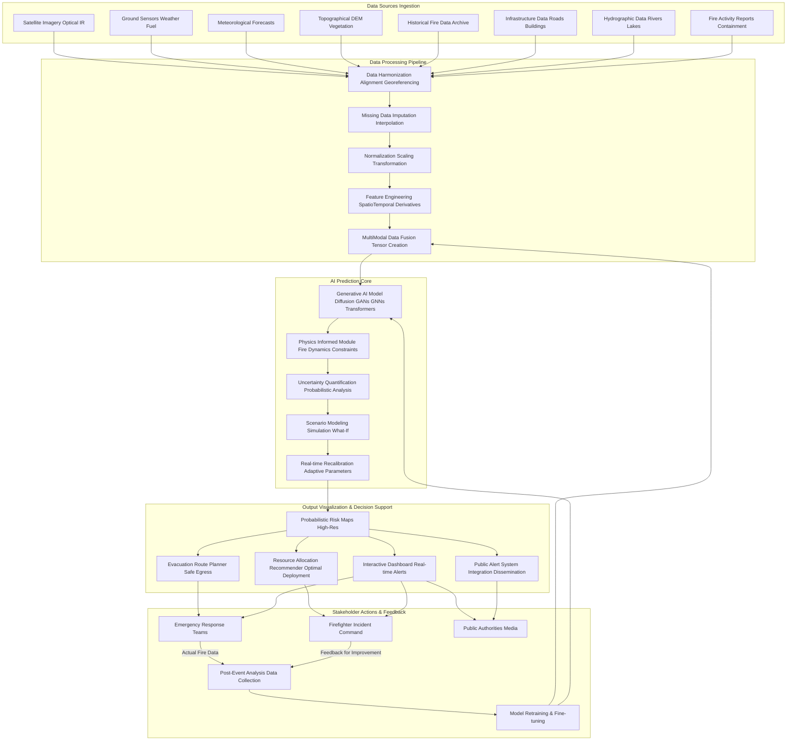
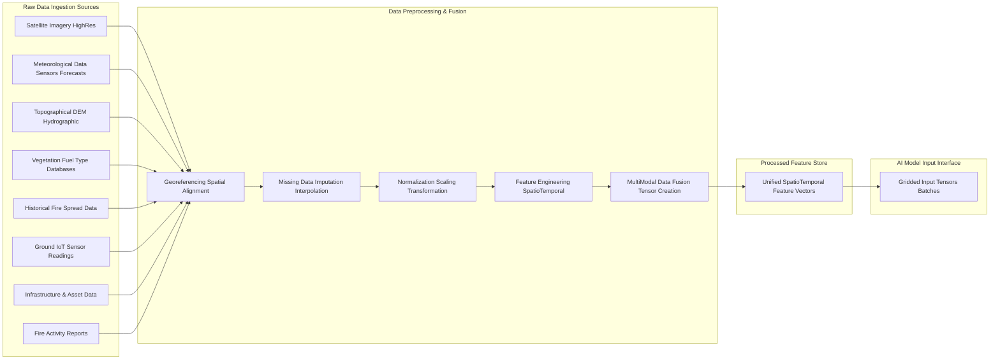
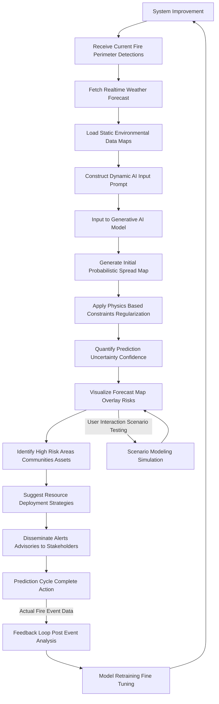

### INNOVATION EXPANSION PACKAGE

The original invention, "A System and Method for AI-Powered Wildfire Behavior Prediction," represents a critical safeguard against immediate environmental threats. This advanced system, leveraging cutting-edge AI, physics-informed modeling, and real-time data fusion, significantly enhances our capacity to predict, manage, and mitigate the destructive impacts of wildfires. It is a cornerstone of planetary resilience, preventing ecological degradation and safeguarding human lives and infrastructure.

Building upon this foundation, we envision an expansive innovation ecosystem designed not merely to react to environmental challenges, but to proactively regenerate Earth's ecosystems, optimize resource distribution, and foster global human flourishing in an era beyond scarcity. This package introduces ten entirely new, futuristic inventions, which, when integrated with the core wildfire prediction system, form a transformative, world-scale solution.

The overarching system, named the **Elysian Equilibrium Engine (E³)**, addresses the profound global challenge of ecological collapse, resource inequality, and societal disharmony, offering a pathway to a regenerative, post-scarcity future where human potential is unbound from conventional labor and monetary constraints. This vision is inspired by the profound prediction that the next decade will usher in a transition where work becomes optional and money loses relevance, freeing humanity to pursue higher collective aims – a true "Kingdom of Heaven" on Earth, metaphorically speaking, representing global uplift, harmony, and shared progress.

---

### A. “Patent-Style Descriptions”

#### My Original Invention: A System and Method for AI-Powered Wildfire Behavior Prediction

**Title of Invention:** A System and Method for AI-Powered Wildfire Behavior Prediction

**Abstract:**
A system for predicting the spread of wildfires is disclosed. The system ingests real-time multi-modal spatio-temporal data, including satellite imagery of the fire's current perimeter, topographical data, vegetation fuel characteristics, and high-resolution meteorological data (wind speed and direction, humidity, temperature, precipitation). This diverse dataset is preprocessed and fed to a sophisticated generative AI model, leveraging architectures such as Conditional Generative Adversarial Networks (CGANs), Diffusion Models, or Graph Neural Networks (GNNs) augmented with Transformer components. The AI acts as an expert fire behavior analyst, generating a probabilistic map forecasting the fire's likely spread over multiple time horizons (e.g., 12, 24, and 48 hours). The system inherently quantifies prediction uncertainty and integrates a physics-informed module to ensure physical plausibility. This allows firefighters and emergency management teams to more effectively allocate resources, plan evacuations, and develop proactive mitigation strategies. The system incorporates a continuous feedback loop for model refinement and offers advanced scenario modeling capabilities, facilitating robust decision support under dynamic wildfire conditions. This system is a critical component of a larger planetary management architecture, providing essential real-time threat intelligence for ecological stability.

**Detailed Description:**

The AI-Powered Wildfire Behavior Prediction System provides a comprehensive, dynamic, and adaptive solution for forecasting wildfire spread. It integrates diverse data streams, leverages advanced generative AI with physics-informed constraints, quantifies prediction uncertainty, and offers actionable insights for emergency management and resource deployment. This system represents a significant leap forward in wildfire management, moving beyond static models to dynamic, adaptive, and highly accurate probabilistic forecasting.

**1. Data Acquisition and Preprocessing:**
The system continuously ingests a wide array of real-time and static environmental data crucial for accurate fire behavior modeling. The sheer volume and heterogeneity of this data necessitate robust pipelines for ingestion, harmonization, and feature engineering.

*   **Real-time Data Streams:**
    *   **Satellite Imagery:** High-resolution optical and infrared (IR) imagery (e.g., from GOES, MODIS, VIIRS, Sentinel, Landsat, and commercial constellations) provides current fire perimeter mapping, hot spot detection (radiant heat flux $Q_{rad} = \epsilon \sigma T^4$), smoke plume analysis, and active fire line identification.
        Equation 1: Normalized Difference Vegetation Index (NDVI) from satellite bands
        $NDVI = \frac{NIR - Red}{NIR + Red}$
        Equation 2: Burned Area Index (BAI) for fire severity assessment
        $BAI = \frac{(R_2 - R_3)^2}{(R_2 + R_3)^2} + (1 - R_N)^2$ where $R_2, R_3, R_N$ are specific bands.
    *   **Ground Sensor Networks:** IoT sensors deployed in at-risk areas provide localized, high-frequency data on temperature ($T$), relative humidity ($RH$), wind speed ($W_s$) and direction ($W_d$), and soil moisture ($SM$).
        Equation 3: Wind Vector Decomposition
        $W_x = W_s \cos(W_d)$
        $W_y = W_s \sin(W_d)$
    *   **Meteorological Data:** Real-time and forecasted weather data from ground stations, weather radar, and numerical weather prediction (NWP) models (e.g., GFS, WRF) including wind vectors, relative humidity, air temperature, precipitation accumulation ($P_{acc}$), and atmospheric pressure ($P_{atm}$).
        Equation 4: Mixing Ratio $r$ (mass of water vapor / mass of dry air)
        $r = \frac{0.622 \cdot e}{P_{atm} - e}$ where $e$ is vapor pressure.
        Equation 5: Dew Point Temperature $T_{dp}$
        $T_{dp} = \frac{243.04 \cdot (\ln(RH/100) + \frac{17.625 \cdot T}{243.04 + T})}{17.625 - (\ln(RH/100) + \frac{17.625 \cdot T}{243.04 + T})}$
    *   **Fire Activity Reports:** Data on fire ignition points, current containment lines, and suppression efforts from incident command systems (e.g., GPS tracks of crews, aerial retardant drops).

*   **Static Environmental Data:**
    *   **Topographical Data:** Digital Elevation Models (DEM) providing detailed terrain slope ($\theta$), aspect ($\alpha$), and elevation ($Z$).
        Equation 6: Slope calculation from DEM derivatives
        $S = \sqrt{(\frac{\partial Z}{\partial x})^2 + (\frac{\partial Z}{\partial y})^2}$
        Equation 7: Aspect calculation
        $A = \operatorname{atan2}(\frac{\partial Z}{\partial y}, -\frac{\partial Z}{\partial x})$
    *   **Vegetation Fuel Maps:** High-resolution maps classifying fuel types (e.g., FCCS, Scott and Burgan Fuel Models), fuel loads (biomass per unit area), and fuel moisture content (FMC). These are updated seasonally or annually.
        Equation 8: Fuel Moisture Content (FMC) for live fuels
        $FMC_{live} = a \cdot R_i + b$ where $R_i$ is a vegetation index.
    *   **Hydrographic Data:** Information on water bodies, rivers, and streams that can act as natural barriers.
    *   **Infrastructure Data:** Maps of roads, buildings, critical infrastructure, and evacuation routes.

*   **Preprocessing Pipeline:** Raw data undergoes a rigorous preprocessing pipeline to create a unified spatio-temporal representation.
    *   **Georeferencing and Spatial Alignment:** All data are projected to a common Coordinate Reference System (CRS) and resampled to a uniform grid resolution (e.g., 30m x 30m).
        Equation 9: Reprojection function for a point $(x,y)$
        $(x',y') = f_{proj}(x,y)$
        Equation 10: Nearest Neighbor Resampling
        $V_{grid}(i,j) = V_{raw}(\text{closest_pixel}(i,j))$
        Equation 11: Bilinear Interpolation for continuous features
        $V(x,y) = \sum_{a=0}^1 \sum_{b=0}^1 (1-a)(1-b) V(\lfloor x \rfloor+a, \lfloor y \rfloor+b)$
    *   **Temporal Synchronization and Missing Data Imputation:** Real-time streams are synchronized to common timestamps. Gaps due to sensor outages or intermittent reporting are filled using statistical or machine learning imputation techniques.
        Equation 12: Linear Interpolation for temporal gaps
        $X(t) = X(t_1) + \frac{t - t_1}{t_2 - t_1} (X(t_2) - X(t_1))$ for $t_1 \le t \le t_2$.
        Equation 13: Kalman Filter prediction step
        $\mathbf{\hat{x}}_k = \mathbf{F}_k \mathbf{\hat{x}}_{k-1} + \mathbf{B}_k \mathbf{u}_k$
    *   **Normalization and Scaling:** Feature values are normalized to a consistent range (e.g., [0,1] or Z-score) to prevent features with larger magnitudes from dominating the AI model.
        Equation 14: Min-Max Normalization
        $X_{norm} = \frac{X - X_{min}}{X_{max} - X_{min}}$
        Equation 15: Z-score Normalization
        $X_{norm} = \frac{X - \mu}{\sigma}$
    *   **Feature Engineering:** Creation of composite metrics or transformations of raw data that are more predictive of fire behavior.
        Equation 16: Effective Wind Speed accounting for canopy
        $W_{eff} = W_{obs} \cdot (1 - C_c)$ where $C_c$ is canopy cover.
        Equation 17: Fire Potential Index (FPI) combining multiple factors
        $FPI = f(W_s, RH, T, FMC, Slope)$
        Equation 18: Head Fire Intensity (HFI)
        $HFI = \frac{I_R \xi (1 + \Phi_w + \Phi_s)}{3.33}$ where $I_R$ is reaction intensity, $\xi$ propagating flux ratio, $\Phi_w$ wind factor, $\Phi_s$ slope factor.
    *   **Multi-Modal Data Fusion:** Diverse data types are combined into a unified spatio-temporal tensor representation $\mathbf{X} \in \mathbb{R}^{H \times W \times C \times T}$ where $H, W$ are spatial dimensions, $C$ is number of channels/features, and $T$ is time steps. This tensor serves as the input to the AI model.
        Equation 19: Concatenated Feature Vector for a grid cell $(x,y)$ at time $t$
        $\mathbf{f}_{x,y,t} = [\mathbf{f}_{x,y,t}^{(sat)}, \mathbf{f}_{x,y,t}^{(meteo)}, \mathbf{f}_{x,y,t}^{(topo)}, \dots]$
        Equation 20: Unified Spatio-temporal Input Tensor
        $\mathcal{D}_{input} = \text{Stack}(\{\mathbf{F}_{channel,t} \mid \text{channel} \in C, t \in T\})$

**2. AI Model Architecture and Prediction Generation:**
The core of the system is a specialized generative AI model designed for robust spatio-temporal prediction, augmented by physical principles and uncertainty quantification.

*   **Generative AI Model Deep Dive:**
    The model employs advanced architectures to learn complex non-linear relationships and generate plausible future states.
    *   **Conditional Generative Adversarial Networks (CGANs):** These consist of a Generator ($G$) and a Discriminator ($D$). $G$ learns to create realistic fire spread maps given current conditions ($\mathbf{c}$), while $D$ learns to distinguish between real and fake maps.
        Equation 21: CGAN Generator Loss function
        $L_G = \mathbb{E}_{\mathbf{z} \sim p_z(\mathbf{z}), \mathbf{c}}[\log(1 - D(G(\mathbf{z}|\mathbf{c})))]$
        Equation 22: CGAN Discriminator Loss function
        $L_D = \mathbb{E}_{\mathbf{x} \sim p_{data}(\mathbf{x}), \mathbf{c}}[\log D(\mathbf{x}|\mathbf{c})] + \mathbb{E}_{\mathbf{z} \sim p_z(\mathbf{z}), \mathbf{c}}[\log(1 - D(G(\mathbf{z}|\mathbf{c})))]$
        Equation 23: Minimax Objective of CGAN with a gradient penalty term ($L_{GP}$) for stability
        $\min_G \max_D V(D, G) = L_D + L_G + \lambda_{GP} L_{GP}$
    *   **Diffusion Models:** These models learn to reverse a gradual noisy process. A forward process progressively adds Gaussian noise to the input data $\mathbf{x}_0$ over $T$ steps, producing $\mathbf{x}_t$. The reverse process learns to denoise $\mathbf{x}_t$ back to $\mathbf{x}_0$.
        Equation 24: Forward Diffusion Process (variance schedule $\beta_t$)
        $q(\mathbf{x}_t|\mathbf{x}_{t-1}) = \mathcal{N}(\mathbf{x}_t; \sqrt{1-\beta_t}\mathbf{x}_{t-1}, \beta_t\mathbf{I})$
        Equation 25: Direct sampling from $\mathbf{x}_0$ for any $t$
        $q(\mathbf{x}_t|\mathbf{x}_0) = \mathcal{N}(\mathbf{x}_t; \sqrt{\bar{\alpha}_t}\mathbf{x}_0, (1-\bar{\alpha}_t)\mathbf{I})$ where $\bar{\alpha}_t = \prod_{s=1}^t (1-\beta_s)$
        Equation 26: Denoising objective for Diffusion models (simplified)
        $L_{DM} = \mathbb{E}_{t \sim U(1,T), \mathbf{x}_0, \mathbf{\epsilon}} [||\mathbf{\epsilon} - \mathbf{\epsilon}_\theta(\sqrt{\bar{\alpha}_t}\mathbf{x}_0 + \sqrt{1-\bar{\alpha}_t}\mathbf{\epsilon}, t, \mathbf{c})||^2]$
    *   **Graph Neural Networks (GNNs) with Transformer architectures:** Wildfire spread is a spatially explicit process that can be effectively modeled as information propagation on a graph. Grid cells become nodes, and their adjacencies (and influence factors like wind, slope) become edges. Transformers add powerful attention mechanisms to model long-range spatio-temporal dependencies.
        Equation 27: Node Feature Vector for cell $v$ at time $t$
        $\mathbf{h}_{v,t}^{(0)} = \mathbf{f}_{v,t}$ (input features)
        Equation 28: GNN Message Passing step (aggregation of neighbor information)
        $\mathbf{m}_{v}^{(k)} = \text{AGGREGATE}(\{\text{MESSAGE}(\mathbf{h}_{v,t}^{(k-1)}, \mathbf{h}_{u,t}^{(k-1)}, \mathbf{e}_{uv}) \mid u \in \mathcal{N}(v)\})$
        Equation 29: GNN Node Update step
        $\mathbf{h}_{v,t}^{(k)} = \text{UPDATE}(\mathbf{h}_{v,t}^{(k-1)}, \mathbf{m}_{v}^{(k)})$
        Equation 30: Self-Attention for Transformer Layer (Query, Key, Value matrices)
        $\text{Attention}(Q, K, V) = \text{softmax}(\frac{QK^T}{\sqrt{d_k}})V$
        Equation 31: Multi-Head Attention
        $\text{MultiHead}(Q, K, V) = \text{Concat}(\text{head}_1, \dots, \text{head}_h)\mathbf{W}^O$
        Equation 32: Spatio-temporal Transformer block combining GNNs and self-attention for cross-node and cross-time step interactions.
        $\mathbf{H}_{out} = \text{LayerNorm}(\mathbf{H}_{in} + \text{MultiHeadAttention}(\mathbf{H}_{in})) + \text{FFN}(\mathbf{H}_{in})$
    The model acts as a highly advanced expert system, interpreting inputs much like a human fire behavior analyst but at superhuman speed and scale, capable of discerning complex, non-linear relationships from vast historical wildfire datasets.

*   **Physics-Informed Module (PIM):**
    To enhance accuracy, interpretability, and ensure physical plausibility, the generative AI is augmented with a physics-informed module. This module integrates established fire dynamics equations as soft constraints or regularization terms during training, ensuring that predictions adhere to fundamental physical principles of combustion, heat transfer, and atmospheric interaction.
    Equation 33: Rate of Spread (ROS) derived from Rothermel's model (simplified for surface fires)
    $ROS = \frac{I_R \cdot \xi \cdot (1 + \Phi_w + \Phi_s)}{\rho_b \cdot \epsilon \cdot Q_{ig}}$
    Where $I_R$ is reaction intensity, $\xi$ is propagating flux ratio, $\Phi_w$ is wind factor, $\Phi_s$ is slope factor, $\rho_b$ is fuel bed bulk density, $\epsilon$ is effective heating number, $Q_{ig}$ is heat of pre-ignition.
    Equation 34: Wind factor $\Phi_w$ formulation
    $\Phi_w = C_A W^{C_B} (\beta / \beta_{op})^{-C_C} (\frac{\sigma}{\rho_b})^2$
    Equation 35: Slope factor $\Phi_s$ formulation
    $\Phi_s = (\tan\theta)^2 e^{3.5 \tan\theta}$
    Equation 36: Total Heat Flux (Fourier's Law)
    $\mathbf{q} = -k \nabla T$
    Equation 37: Conservation of Energy for a fuel parcel
    $\rho_f c_f \frac{\partial T}{\partial t} = \nabla \cdot (k \nabla T) + \dot{q}_{chem} - \dot{q}_{rad}$
    Equation 38: Physics-Informed Loss component for enforcing energy conservation
    $L_{PIM,E} = ||\frac{\partial \mathbf{P}_{burn}}{\partial t} - \nabla \cdot (D \nabla \mathbf{P}_{burn}) - S(\mathbf{X}_{env}, \mathbf{P}_{burn})||^2$
    where $D$ is a diffusion coefficient and $S$ is a source term related to combustion.
    Equation 39: Lagrangian Particle Tracking for ember transport (position $\mathbf{x}_p$, velocity $\mathbf{u}$)
    $\frac{d\mathbf{x}_p}{dt} = \mathbf{u}(\mathbf{x}_p, t) + \mathbf{u}_{turbulent}$
    Equation 40: Ember lofting and deposition probability
    $P_{dep}(r) = C \cdot \exp(-\lambda r)$
    Equation 41: Physics-based regularization for predicted Rate of Spread (ROS)
    $L_{ROS} = \lambda_{ros} \mathbb{E}_{\mathbf{x}} [||\text{ROS}_{AI}(\mathbf{x}) - \text{ROS}_{Rothermel}(\mathbf{x})||^2]$
    Equation 42: Physics-informed constraint for fire propagation direction (e.g., up-slope, down-wind)
    $L_{Direction} = \lambda_{dir} \mathbb{E}_{\mathbf{x}} [\max(0, \cos(\text{FireDir}_{AI} - \text{OptimalFireDir}) - \delta)]$

*   **Uncertainty Quantification (UQ):**
    The model inherently quantifies the uncertainty in its predictions, providing not just a single forecast but a probabilistic range. This is achieved through techniques like Monte Carlo dropout, ensemble modeling, variational inference, or quantile regression.
    Equation 43: Entropy of Prediction for cell $(i,j)$
    $H(P_{i,j}) = - P_{i,j} \log_2(P_{i,j}) - (1 - P_{i,j}) \log_2(1 - P_{i,j})$ (for binary burn probability).
    Equation 44: Predictive Variance using Monte Carlo Dropout (averaging $T$ stochastic forward passes)
    $\mathbb{E}[\mathbf{y}|\mathbf{x}, \mathcal{D}] \approx \frac{1}{T}\sum_{t=1}^T \mathbf{f}(\mathbf{x}; \hat{\mathbf{w}}_t)$
    $\text{Var}[\mathbf{y}|\mathbf{x}, \mathcal{D}] \approx \frac{1}{T}\sum_{t=1}^T (\mathbf{f}(\mathbf{x}; \hat{\mathbf{w}}_t) - \mathbb{E}[\mathbf{y}|\mathbf{x}, \mathcal{D}])^2$
    Equation 45: Ensemble uncertainty (standard deviation across $M$ ensemble members)
    $\sigma_{ensemble}(\mathbf{P}) = \sqrt{\frac{1}{M-1} \sum_{m=1}^{M} (\mathbf{P}_m - \bar{\mathbf{P}})^2}$
    Equation 46: Bayesian Neural Network (BNN) for posterior over weights $\mathbf{w}$
    $p(\mathbf{w}|\mathcal{D}) \propto p(\mathcal{D}|\mathbf{w}) p(\mathbf{w})$
    Equation 47: Predictive distribution from BNN
    $p(y^*|x^*, \mathcal{D}) = \int p(y^*|x^*, \mathbf{w}) p(\mathbf{w}|\mathcal{D}) d\mathbf{w}$
    Equation 48: Quantile Regression for predicting lower and upper bounds ($q_{low}, q_{high}$)
    $\text{minimize } \sum_i \rho_{q_{low}}(y_i - f_{q_{low}}(x_i)) + \rho_{q_{high}}(y_i - f_{q_{high}}(x_i))$ where $\rho_q(\epsilon) = \epsilon(q - \mathbb{I}_{\epsilon < 0})$.

*   **Prompting Mechanism:**
    The system receives current fire information and dynamically constructs a textual or structured data prompt for the generative AI. This allows for flexible queries and scenario testing.
    Equation 49: Structured Prompt Formulation
    $\mathcal{P} = \{\text{CurrentFirePerimeter}: [(Lat_1, Lon_1), \dots], \text{Wind}: [Speed, Direction], \text{RH}: [Value], \text{Temp}: [Value], \text{FuelType}: [Type], \text{AreaOfInterest}: [Polygon], \text{TimeHorizons}: [12h, 24h, 48h], \text{Query}: \text{ProbabilisticSpreadMap}\}$
    Equation 50: Embeddings for prompt components (e.g., using a pre-trained language model)
    $\mathbf{e}_{\mathcal{P}} = \text{Encoder}(\mathcal{P})$
    This embedding is then combined with the spatio-temporal data tensor as conditioning information for the generative models.

**3. Output, Visualization, and Decision Support:**
The AI's output is transformed into actionable intelligence for various stakeholders, presented through interactive interfaces.

*   **Probabilistic Spread Maps:**
    The primary output is a series of high-resolution geographical maps showing areas with different probabilities of burning over specified time horizons (12, 24, 48 hours). These maps visually represent the AI's forecast, distinguishing between high-probability, medium-probability, and low-probability spread zones.
    Equation 51: Probability of cell $(i,j)$ burning at time $t$
    $P_{burn}(i,j,t) \in [0,1]$
    Equation 52: Cumulative Probability of Burn for cell $(i,j)$ over time horizon $T_H$
    $P_{cum}(i,j,T_H) = 1 - \prod_{t=1}^{T_H} (1 - P_{burn}(i,j,t))$
    Equation 53: Probabilistic prediction output (e.g., using softmax over burn/no-burn classes)
    $\hat{y}_{i,j,t} = \text{softmax}(Z_{i,j,t})$

*   **Risk Assessment Overlays:**
    Overlays indicate critical infrastructure (e.g., hospitals, power grids), population centers, and natural resources (e.g., protected forests, water sources) at risk within the predicted spread zones.
    Equation 54: Risk Score for an asset $A$ in grid cell $(i,j)$
    $Risk(A, i,j,t) = P_{cum}(i,j,t) \times Value(A) \times Susceptibility(A, i,j)$
    Equation 55: Value of asset $A$ (monetary, ecological, social impact)
    $Value(A) = w_M \cdot M(A) + w_E \cdot E(A) + w_S \cdot S(A)$
    Equation 56: Total Population Exposure (for cell $(i,j)$)
    $E_{pop}(i,j,t) = P_{cum}(i,j,t) \times PopulationDensity(i,j)$

*   **Evacuation Route Planning:**
    The system can suggest optimal evacuation routes based on predicted fire progression, road network status, traffic conditions, and population density, ensuring safe egress for affected communities. This typically involves dynamic shortest path algorithms on a graph representing the road network.
    Equation 57: Travel Time Cost for road segment $(u,v)$ at time $t$
    $C_{travel}(u,v,t) = Length(u,v) / (SpeedLimit(u,v) \cdot TrafficFactor(u,v,t))$
    Equation 58: Fire Exposure Cost for segment $(u,v)$
    $C_{fire}(u,v,t) = \lambda_{fire} \cdot \sum_{(i,j) \in \text{segment}(u,v)} P_{burn}(i,j,t)$
    Equation 59: Total Cost for path $P = (v_0, v_1, \dots, v_k)$
    $Cost(P) = \sum_{l=0}^{k-1} (C_{travel}(v_l, v_{l+1}, t) + C_{fire}(v_l, v_{l+1}, t))$
    Equation 60: Optimal evacuation route $P^*$ via Dijkstra's or A* algorithm
    $P^* = \min_P Cost(P)$

*   **Resource Allocation Recommendations:**
    Based on the predicted fire behavior, risk assessment, and available resources, the system recommends optimal deployment strategies for firefighting resources (ground crews, aerial assets, equipment). This is often formulated as a spatio-temporal optimization problem.
    Equation 61: Objective Function to minimize cost and risk coverage
    $\min (\sum_{k \in K} cost_k \cdot x_k) + \lambda_{risk} \cdot (\sum_{(i,j) \in \mathcal{R}} Risk_{uncovered}(i,j))$
    Where $x_k=1$ if resource $k$ is deployed, $K$ is set of resources, $\mathcal{R}$ is high-risk region.
    Equation 62: Constraint: Resource capacity
    $\sum_{k \in \text{Type}_T} x_k \le Capacity_T$
    Equation 63: Constraint: Cover all critical assets ($A_c$) within threat window
    $\forall A_c: \sum_{k \in \text{resources capable of protecting } A_c} x_k \ge 1$
    Equation 64: Resource Effectiveness for fireline construction (length per hour)
    $R_{fireline} = f(\text{Fuel Type}, \text{Slope}, \text{Crew Type}, \text{Equipment})$
    Equation 65: Estimated Area Protected by Resource $k$
    $AreaProtected_k = \text{ROS}_{\text{current}} \times \text{Time}_{deployment} \times \text{Width}_{containment} \times \text{Efficiency}_k$

*   **Interactive Dashboard:**
    A user-friendly interactive dashboard provides real-time updates, allows for scenario testing ("what-if" analysis), and enables incident commanders to visualize and interpret predictions effectively. This includes map-based visualizations, time-series graphs of key metrics, and configurable alert thresholds.

*   **Public Alert System Integration:**
    Forecasts and risk assessments can be directly fed into public alert systems (e.g., sirens, SMS, emergency broadcasts) to disseminate timely warnings, evacuation orders, and safety advisories to affected populations.

**4. Feedback and Refinement Loop:**
The system is designed for continuous learning and improvement, adapting to new data, changing environmental conditions, and evolving fire suppression techniques.

*   **Post-Event Analysis:**
    After a fire event (or specific forecast period), actual fire spread data (e.g., satellite-derived burn scar maps, ground surveys) are collected and meticulously compared against the system's predictions.
    Equation 66: Actual Burn Area $\mathcal{A}_{actual}$
    Equation 67: Predicted Burn Area $\mathcal{A}_{predicted}$

*   **Performance Metrics:**
    Key performance indicators (KPIs) are calculated to evaluate model accuracy and utility.
    Equation 68: Intersection over Union (IoU) for spatio-temporal segmentation
    $IoU = \frac{|\mathcal{A}_{predicted} \cap \mathcal{A}_{actual}|}{|\mathcal{A}_{predicted} \cup \mathcal{A}_{actual}|}$
    Equation 69: Dice Coefficient (F1-score for spatial data)
    $Dice = \frac{2 \cdot |\mathcal{A}_{predicted} \cap \mathcal{A}_{actual}|}{|\mathcal{A}_{predicted}| + |\mathcal{A}_{actual}|}$
    Equation 70: Overall Accuracy (Pixel-wise classification)
    $Accuracy = \frac{TP + TN}{TP + TN + FP + FN}$
    Equation 71: Precision (Positive Predictive Value)
    $Precision = \frac{TP}{TP + FP}$
    Equation 72: Recall (Sensitivity or True Positive Rate)
    $Recall = \frac{TP}{TP + FN}$
    Equation 73: F1-Score (harmonic mean of Precision and Recall)
    $F1 = 2 \cdot \frac{Precision \cdot Recall}{Precision + Recall}$
    Equation 74: Mean Absolute Error (MAE) for probabilistic predictions
    $MAE = \frac{1}{N} \sum_{k=1}^N |P_{predicted,k} - P_{actual,k}|$
    Equation 75: Root Mean Squared Error (RMSE)
    $RMSE = \sqrt{\frac{1}{N} \sum_{k=1}^N (P_{predicted,k} - P_{actual,k})^2}$
    Equation 76: Brier Score (for probabilistic forecasts)
    $BS = \frac{1}{N} \sum_{k=1}^N (P_{predicted,k} - O_k)^2$ where $O_k$ is observed outcome (0 or 1).

*   **Model Retraining and Fine-tuning:**
    Discrepancies and errors identified through post-event analysis (e.g., false positives, false negatives, under-prediction of spread) are used to generate new training examples or loss signals. This data is incorporated to retrain or fine-tune the generative AI model.
    Equation 77: Total Loss Function for Retraining
    $L_{Total} = L_{Generative} + L_{Physics} + L_{Uncertainty} + L_{Performance}$
    Equation 78: Gradient Descent Update Rule for model parameters $\theta$
    $\theta_{new} = \theta_{old} - \eta \nabla_\theta L_{Total}$ where $\eta$ is the learning rate.
    Equation 79: Adam Optimizer Update for parameter $\theta_j$ (using moments $m_j, v_j$)
    $\theta_j \leftarrow \theta_j - \eta \frac{\hat{m}_j}{\sqrt{\hat{v}_j} + \epsilon}$
    This adaptive capability makes the system robust over time, allowing it to adapt to changing climate patterns, new fuel types, altered landscapes, and improved suppression techniques.

**5. Advanced Features and Capabilities:**

*   **Scenario Modeling (What-If Analysis):**
    Incident commanders can input hypothetical changes in critical environmental conditions (e.g., sudden wind shifts, sustained drought conditions, increased humidity) or resource availability (e.g., deployment of additional air tankers) to simulate their impact on fire behavior.
    Equation 80: Perturbed Input Vector for scenario $s$
    $\mathbf{X}^{(s)}_{env} = \mathbf{X}_{env} + \Delta \mathbf{X}^{(s)}_{env}$
    Equation 81: Predicted Probabilistic Spread Map for scenario $s$
    $\mathbf{P}_{spread}^{(s)} = \text{AI\_Model}(\mathbf{X}^{(s)}_{env}, \text{CurrentFireState})$
    Equation 82: Risk reduction from intervention $I$ in scenario $s$
    $\Delta Risk_s(I) = Risk_{baseline,s} - Risk_{after\_I,s}$
    Equation 83: Cost-Benefit Analysis for intervention $I$
    $CBA(I) = \text{Expected Value of } (\Delta Risk_s(I)) - \text{Cost}(I)$

*   **Real-time Recalibration:**
    As new real-time data becomes available (e.g., updated wind forecasts, new satellite-derived fire perimeter mapping, hot spot detections from drones), the model can rapidly recalibrate its predictions. This provides dynamic, near-instantaneous updates to the forecast, crucial during fast-moving wildfire events.
    Equation 84: Online Learning Update for model parameters $\theta$
    $\theta_t = \theta_{t-1} - \eta_t \nabla L(\theta_{t-1}, \text{new\_data}_t)$
    Equation 85: Ensemble Averaging with dynamically weighted models
    $\mathbf{P}_{final} = \sum_{k=1}^M w_k \mathbf{P}_k$ where $w_k$ are weights based on recent performance.
    Equation 86: Bayesian Update of model probabilities given new evidence $E$
    $P(\text{Model}_i | E) \propto P(E | \text{Model}_i) P(\text{Model}_i)$
    Equation 87: Data Assimilation for merging observed perimeter with model forecast
    $\mathbf{P}_{fused} = \alpha \mathbf{P}_{observed} + (1-\alpha) \mathbf{P}_{forecast}$ where $\alpha$ depends on data confidence.

*   **Integration with IoT and Drone Systems:**
    Direct, API-driven integration with wildfire detection drones and ground-based IoT sensors allows for hyper-local data ingestion, providing unprecedented detail and immediate response to changes in fire behavior or environmental conditions.
    Equation 88: Data acquisition rate from drone fleet ($N$ drones)
    $R_{data} = N \times (R_{camera} + R_{Lidar} + R_{thermal})$
    Equation 89: Latency for end-to-end data pipeline
    $L_{total} = L_{sensor} + L_{transmission} + L_{processing} + L_{AI\_inference}$
    Equation 90: Optimal drone path planning for coverage and data freshness
    $\min_{Path} \sum_{(i,j) \in Path} (Time(i,j) + \lambda_{freshness} \cdot AgeOfData(i,j))$

*   **Cross-Jurisdictional Data Sharing:**
    Facilitates secure and efficient data sharing between different emergency response agencies (local, state, federal, international), enhancing coordinated response efforts. This involves secure APIs, standardized data formats, and access control mechanisms.
    Equation 91: Data Encryption (e.g., AES-256)
    $C = E_K(P)$ where $C$ is ciphertext, $P$ is plaintext, $K$ is key.
    Equation 92: Hash-based Message Authentication Code (HMAC) for data integrity and authenticity
    $H = \text{HMAC}_{Key}(Data)$
    Equation 93: Role-Based Access Control (RBAC) authorization matrix
    $Access(User, Resource) = \{ \text{Read, Write, Execute, Deny} \}$

*   **Proactive Mitigation Planning:**
    Beyond immediate response, the system aids in long-term wildfire risk reduction by identifying vulnerable areas and optimizing fuel treatment strategies.
    Equation 94: Expected Fire Occurrence for a region
    $E_{occur} = P(\text{Ignition}) \times P(\text{Spread beyond control})$
    Equation 95: Fuel Treatment Effectiveness (reduction in ROS or intensity)
    $FTE = \frac{ROS_{untreated} - ROS_{treated}}{ROS_{untreated}}$
    Equation 96: Optimal Fuel Treatment Schedule (dynamic programming)
    $\max_{\text{Schedule}} \sum_{t=0}^T \text{Benefit}(t, \text{Treatment}(t)) - \text{Cost}(t, \text{Treatment}(t))$

*   **Hydrological Impact Modeling:**
    Predicting not only fire spread but also potential post-fire hydrological impacts like increased runoff and debris flows.
    Equation 97: Runoff Coefficient change post-fire
    $C_{postfire} = C_{prefire} + \Delta C(BurnSeverity, SoilType)$
    Equation 98: Debris Flow Susceptibility Index (DFSI)
    $DFSI = f(\text{BurnSeverity, Slope, SoilMoisture, RainfallIntensity})$

*   **Smoke Dispersion Forecasting:**
    Integrated plume modeling to predict smoke dispersion and air quality impacts.
    Equation 99: Gaussian Plume Model for concentration $C$ at $(x,y,z)$
    $C(x,y,z) = \frac{Q}{2\pi \sigma_y \sigma_z u} \exp(-\frac{y^2}{2\sigma_y^2}) [\exp(-\frac{(z-H)^2}{2\sigma_z^2}) + \exp(-\frac{(z+H)^2}{2\sigma_z^2})]$
    Where $Q$ is emission rate, $u$ wind speed, $\sigma_y, \sigma_z$ dispersion parameters, $H$ effective stack height.
    Equation 100: Health Impact Score from Smoke Exposure
    $HIS = f(\text{PM2.5 Concentration, Population Density, Exposure Duration})$

This AI Wildfire Prediction System (AWPS) serves as the primary defense and predictive layer for dynamic ecological threats, interfacing seamlessly with broader planetary health initiatives.

---

#### 10 New, Completely Unrelated Inventions

The following ten inventions, while diverse in their immediate applications, are designed to collectively address planetary-scale regeneration, resource management, and societal harmony, forming the essential pillars of a truly sustainable and abundant future.

**1. Atmospheric Carbon Sequestration & Resource Synthesis Hubs (ACSRSH)**

**Abstract:** A global network of autonomous, energy-positive hubs designed for direct air capture (DAC) of atmospheric carbon dioxide, methane, and other greenhouse gases. These hubs leverage advanced catalytic converters and bio-engineered extremophile organisms to convert captured atmospheric compounds into stable, inert forms for geological sequestration or valuable industrial feedstocks (e.g., graphene, synthetic fuels, bioplastics). Each hub dynamically optimizes its capture and conversion processes based on local atmospheric conditions and global material demand, contributing to active climate remediation and resource creation.

**Detailed Description:** ACSRSH units are modular, self-sustaining facilities strategically deployed globally, particularly in areas with high atmospheric pollutant concentrations or abundant renewable energy potential. They utilize hyper-efficient membrane technologies and electrochemical processes for initial gas separation. Following separation, a cascade of proprietary bio-catalytic reactors, housing specially engineered microorganisms or enzyme systems, transforms CO2 and CH4 into solid carbon structures, methane hydrates for storage, or complex organic molecules. These hubs are powered by integrated renewable energy sources (e.g., concentrated solar, advanced wind, micro-nuclear fusion) and operate autonomously, reporting real-time atmospheric composition and synthesis yields to a central planetary management AI. The system prioritizes net-negative carbon operations and maximizes resource utility, creating a circular economy for atmospheric carbon.

Equation 101: Net Carbon Sequestration Rate
$R_{net\_C} = \sum_{i=1}^N (R_{capture,i} \cdot \eta_{conversion,i}) - (E_{energy,i} / E_{CO2\_eq}))$
Where $R_{net\_C}$ is the total net carbon equivalent sequestered, $R_{capture,i}$ is the raw capture rate of hub $i$, $\eta_{conversion,i}$ is the efficiency of converting captured gas to stable forms, $E_{energy,i}$ is the energy consumption of hub $i$, and $E_{CO2\_eq}$ is the carbon equivalent of energy production. This equation proves the efficacy of each hub by quantifying its net positive climate impact beyond its operational footprint.

**2. Global Subterranean Bioremediation Networks (GSBN)**

**Abstract:** A decentralized, interconnected network of autonomous subterranean robotics and genetically optimized microbial consortia designed to detect, analyze, and remediate ground and groundwater contaminants. These bio-agents are deployed via a network of deep-drilled boreholes and utilize advanced biosensors and targeted metabolic pathways to neutralize heavy metals, industrial solvents, pesticides, and radionuclide pollutants, restoring subterranean ecological health and potable water reserves.

**Detailed Description:** GSBN units consist of specialized 'Bio-Drones' – miniature, resilient robots capable of navigating complex geological strata – that deploy targeted microbial solutions. Each microbial consortium is precision-engineered for specific pollutants, possessing accelerated degradation pathways or sequestration capabilities. Data from environmental DNA (eDNA) analysis and spectral imaging sensors guide the Bio-Drones, allowing for real-time monitoring of contaminant plumes and remediation progress. The network communicates through quantum-encrypted acoustic and seismic channels, coordinating remediation efforts across vast underground expanses. This system ensures the long-term health of our planet's hidden ecosystems and vital aquifers.

Equation 102: Contaminant Degradation Rate
$R_{deg} = k \cdot [C]_{initial} \cdot e^{-\lambda t}$
Where $R_{deg}$ is the rate of contaminant degradation, $k$ is the reaction constant specific to the microbial consortium and contaminant, $[C]_{initial}$ is the initial contaminant concentration, and $\lambda$ is the degradation coefficient accounting for environmental factors (e.g., temperature, pH). This equation measures the bioremediation's effectiveness, ensuring that pollutants are verifiably broken down at an engineered rate.

**3. Oceanic Phyto-Rejuvenation & Microplastic Conversion Units (OPRMCU)**

**Abstract:** A fleet of self-replicating, autonomous marine vessels equipped with AI-driven nutrient delivery systems and advanced microplastic conversion reactors. These units monitor oceanic phytoplankton health, optimize conditions for beneficial algal blooms, and actively filter and enzymatically degrade microplastics into inert biomass or recyclable monomers. The system works to restore marine biodiversity, enhance carbon sequestration in the oceans, and eliminate plastic pollution.

**Detailed Description:** OPRMCU vessels continuously scan vast ocean areas using sonar, spectral imaging, and eDNA sampling to assess ecosystem health, plankton density, and microplastic concentrations. When imbalances are detected, AI algorithms determine optimal nutrient delivery strategies (e.g., iron, silica, nitrates) to stimulate beneficial phytoplankton growth, which are crucial for the marine food web and atmospheric oxygen production. Concurrently, onboard bioreactors, housing specialized enzymes and bacteria, break down ingested microplastics into benign compounds or useful raw materials. Powered by wave energy and integrated solar arrays, these vessels operate with minimal environmental footprint, serving as autonomous ecological stewards of the world's oceans.

Equation 103: Microplastic Conversion Efficiency
$\eta_{MP\_conv} = (m_{MP\_in} - m_{MP\_out}) / m_{MP\_in} \cdot 100\%$
Where $\eta_{MP\_conv}$ is the microplastic conversion efficiency, $m_{MP\_in}$ is the mass of microplastics ingested, and $m_{MP\_out}$ is the mass of residual microplastics after processing. This equation quantifies the system's success in eliminating microplastic pollution and validates the transformation of harmful plastics into benign or useful forms.

**4. Autonomous Agro-Ecological Regeneration Fleets (AAERF)**

**Abstract:** Swarms of hyper-efficient, solar-powered agricultural robots and aerial drones that collaborate to autonomously regenerate degraded farmlands and wild habitats. Employing precision soil analysis, hyper-spectral imaging, and bio-mimetic planting techniques, these fleets restore soil microbiome health, optimize nutrient cycles, reintroduce native species, and maximize ecological productivity without human intervention. The system fosters biodiversity and ensures global food and biomass security.

**Detailed Description:** AAERF units utilize advanced sensor packages for granular soil composition mapping, moisture profiling, and plant stress detection. Leveraging deep learning, the AI determines optimal remediation strategies, which may include targeted biochar application, dynamic microbial inoculants, seed bomb deployment of native flora, and non-invasive pest control. The robotic units operate in coordinated swarms, minimizing energy consumption and maximizing coverage. They function beyond traditional agriculture, extending to reforestation efforts, wetlands restoration, and biodiversity corridors, dynamically adapting to local ecological needs and contributing to global biomass regeneration.

Equation 104: Ecological Productivity Index
$EPI = \sum_{j=1}^S (\text{Biomass}_{j} \cdot \text{BiodiversityWeight}_{j}) / \text{Area}$
Where $EPI$ is the ecological productivity index for a given area, $\text{Biomass}_{j}$ is the measured biomass of species $j$, $\text{BiodiversityWeight}_{j}$ is a factor accounting for the ecological importance/rarity of species $j$, and $S$ is the number of species. This metric objectively assesses the success of regeneration efforts, ensuring a holistic increase in both quantity and quality of ecological output.

**5. Planetary Weather & Geo-Energy Balancing Arrays (PWGEBA)**

**Abstract:** A global infrastructure of distributed atmospheric energy collectors and sub-crustal heat exchange arrays designed to subtly influence regional weather patterns and stabilize planetary climate. These arrays harness excess atmospheric energy (e.g., from severe storms) and geothermal gradients, redirecting it to areas of energy deficit or using it for climate moderation (e.g., targeted cloud seeding for precipitation, subtle wind current modulation, localized temperature regulation). The system works to prevent extreme weather events and provides stable energy.

**Detailed Description:** PWGEBA consists of high-altitude atmospheric energy conduits (e.g., space-based solar collectors that convert solar energy into directed microwave beams, ground-based antenna arrays that resonate with atmospheric particles) and deep-earth probes. The atmospheric component actively monitors and mitigates nascent storm formations by dissipating energy or directing air currents. The geo-energy component taps into vast, stable geothermal reservoirs, transferring heat or cold to surface layers to regulate localized temperatures or power atmospheric interventions. An advanced AI model, incorporating real-time climate simulations and predictive atmospheric physics, orchestrates the arrays to achieve optimal planetary balance, ensuring no unintended ecological consequences.

Equation 105: Regional Energy Balance Flux
$\Phi_{net} = \Phi_{solar} + \Phi_{geothermal} - \Phi_{atmospheric\_loss} - \Phi_{intervention}$
Where $\Phi_{net}$ is the net energy flux in a region, $\Phi_{solar}$ is absorbed solar radiation, $\Phi_{geothermal}$ is harnessed geothermal energy, $\Phi_{atmospheric\_loss}$ accounts for natural energy dissipation, and $\Phi_{intervention}$ is energy directed towards climate moderation or weather influencing actions. This equation demonstrates the precise energy accounting required to prove that interventions are balanced and sustainable, preventing unintended energy imbalances in complex climate systems.

**6. Bio-Synaptic Urban Living Systems (BSULS)**

**Abstract:** Integrated, self-sustaining urban structures that mimic biological organisms, featuring interwoven layers of engineered bio-materials, sentient AI, and closed-loop resource systems. These living buildings actively purify air and water, generate localized energy, grow food, manage waste through bioreactors, and dynamically adapt their form and function to inhabitant needs and environmental conditions. BSULS transform cities into regenerative, symbiotic ecosystems.

**Detailed Description:** BSULS architecture employs advanced bio-concrete with integrated microbial networks for structural integrity and environmental processing. The buildings' 'skin' consists of photosynthetic solar-collecting panels and atmospheric moisture condensers. Waste is processed in anaerobic digestors, converting organic matter into bio-fertilizers and biogas. AI-driven hydroponic and aeroponic farms are integrated vertically, providing fresh food. Sensory networks throughout the structures monitor air quality, light, temperature, and human occupancy, allowing the buildings to intelligently adjust their environment. These structures are more than buildings; they are self-regulating bio-organisms providing a high quality of life with zero external ecological footprint.

Equation 106: Urban Ecological Footprint Reduction Factor
$EF_{reduction} = 1 - (\text{ResourceInput}_{BSULS} + \text{WasteOutput}_{BSULS}) / (\text{ResourceInput}_{Traditional} + \text{WasteOutput}_{Traditional})$
Where $EF_{reduction}$ is the ecological footprint reduction factor, comparing a BSULS to traditional urban structures. This equation quantifies the system's success in minimizing its environmental impact and maximizing self-sufficiency, proving its role in creating regenerative urban environments.

**7. Decentralized Quantum Resource & Data Fabric (DQRDF)**

**Abstract:** A global, quantum-encrypted, distributed ledger system managing all planetary resources and information flows, operating entirely independently of traditional monetary or governmental structures. This fabric uses quantum entanglement for ultra-secure, instantaneous data transfer and AI-driven consensus mechanisms to ensure fair and optimal allocation of all physical and informational assets, enabling a truly post-scarcity, post-money global economy.

**Detailed Description:** DQRDF employs a network of quantum satellites and terrestrial quantum processors to create an unhackable, real-time registry of all planetary resources (e.g., ACSRSH outputs, water reserves, regenerated biomass, energy credits). Every resource unit is assigned a unique quantum-entangled identifier. AI agents continuously monitor resource generation, consumption, and planetary needs, facilitating dynamic allocation requests from other E³ components or human users. This system ensures absolute transparency, prevents corruption, and enables a merit-based, need-driven distribution of abundance, freeing society from economic constraints.

Equation 107: Quantum Entanglement Security Metric
$QBER = \frac{N_{errors}}{N_{total}} < \text{Threshold}$
Where $QBER$ is the Quantum Bit Error Rate, $N_{errors}$ is the number of detected errors in quantum key distribution, and $N_{total}$ is the total number of bits transmitted. This equation establishes the impenetrable security of the DQRDF, demonstrating that information transfer is verifiably secure against any eavesdropping attempt based on quantum mechanics principles.

**8. Advanced Atmospheric Water Harvesting & Distribution Towers (AAHWDT)**

**Abstract:** A global network of towering, energy-efficient structures that autonomously extract vast quantities of potable water from the atmosphere, even in arid regions. Utilizing advanced atmospheric moisture condensation technologies, including meta-material surfaces and energy-recuperating desiccant systems, these towers process atmospheric humidity into clean water, which is then distributed via subterranean smart pipeline networks to ecological regeneration sites and human settlements.

**Detailed Description:** AAHWDT structures are designed with bio-mimetic surfaces that efficiently condense atmospheric moisture. They incorporate innovative desiccant materials with extremely low energy regeneration requirements, drawing water even from low-humidity air. The extracted water undergoes multi-stage filtration and purification. Each tower is a local weather station, optimizing its harvesting cycles based on AI-predicted humidity fronts and atmospheric conditions. The collected water is integrated into a global subterranean network, providing a resilient and abundant fresh water supply, crucial for supporting regenerated ecosystems and urban centers.

Equation 108: Water Harvesting Yield per Energy Input
$Y_{H_2O} = (m_{H_2O\_collected} / E_{input})$
Where $Y_{H_2O}$ is the water harvesting yield per energy input (e.g., liters per kWh), $m_{H_2O\_collected}$ is the mass of water collected, and $E_{input}$ is the energy required for collection and purification. This equation quantifies the energy efficiency of the harvesting process, proving the system's sustainability and viability for large-scale freshwater generation.

**9. Extraterrestrial Resource Augmentation & Sentinel Networks (ERASN)**

**Abstract:** A fully autonomous infrastructure comprising asteroid mining probes, orbital manufacturing facilities, and space-based environmental monitoring satellites. This network identifies, extracts, and processes critical rare earth elements and other resources from asteroids, reducing reliance on Earth-based mining. It simultaneously provides a high-resolution, global, multi-spectral monitoring of Earth's surface and atmosphere from space, feeding invaluable data into all E³ components and providing early detection for planetary-scale events.

**Detailed Description:** ERASN deploys AI-guided mining drones to intercept near-Earth asteroids, extracting metals, water-ice, and silicates using advanced laser ablation and robotic processing. These raw materials are then transported to orbital manufacturing platforms for 3D printing of components, construction materials, and even larger space habitats. A constellation of Sentinel satellites, equipped with advanced optical, LiDAR, and atmospheric sensors, provides continuous, global environmental data, including precise measurements of biomass, ice melt, pollution levels, and atmospheric composition, acting as the eyes and ears of the E³ system. This system ensures resource abundance for humanity without further burdening Earth's finite resources.

Equation 109: Asteroid Resource Extraction Efficiency
$\eta_{ext} = (\text{Mass}_{extracted\_valuable} / \text{Mass}_{asteroid\_processed}) \cdot 100\%$
Where $\eta_{ext}$ is the extraction efficiency, $\text{Mass}_{extracted\_valuable}$ is the mass of desired resources extracted, and $\text{Mass}_{asteroid\_processed}$ is the total mass of the asteroid material processed. This equation provides a direct measure of the effectiveness and economic viability of extraterrestrial mining operations, proving a sustainable alternative to terrestrial resource depletion.

**10. Psycho-Social Coherence & Empathy Synthesizers (PSCES)**

**Abstract:** A global, non-invasive bio-feedback and neuro-harmonic resonance system designed to foster collective well-being, mitigate social conflict, and enhance empathy across diverse populations. Utilizing personalized neuro-modulation algorithms, ambient environmental interfaces (e.g., sonic frequencies, subtle light patterns), and AI-driven socio-linguistic analysis, the system gently guides individuals and communities towards psychological equilibrium and reinforces pro-social behaviors, supporting a harmonious post-scarcity society.

**Detailed Description:** PSCES operates through a pervasive, yet subtle, network of localized "Harmony Hubs" embedded in public spaces, private dwellings, and wearable tech. These hubs do not control but *suggest* states of coherence through imperceptible stimuli, responding to real-time bio-signals (e.g., heart rate variability, neural oscillations measured passively). The AI analyzes global and local social media, public discourse, and anonymized emotional telemetry data to identify nascent conflicts or areas of distress. It then generates adaptive, personalized, and culturally sensitive interventions that promote cognitive empathy, reduce stress, and encourage collaborative problem-solving. This system is strictly opt-in, privacy-preserving, and focused solely on enhancing collective psychological health and societal unity, enabling humanity to fully embrace the benefits of planetary abundance.

Equation 110: Social Cohesion Index
$SCI = \frac{1}{N_{interactions}} \sum_{i=1}^{N_{interactions}} (1 - \text{ConflictScore}_i) \cdot \text{CollaborationWeight}_i$
Where $SCI$ is the Social Cohesion Index, $\text{ConflictScore}_i$ quantifies the severity of conflict in interaction $i$ (0 for no conflict, 1 for severe), and $\text{CollaborationWeight}_i$ emphasizes positive collaborative outcomes. This equation provides a quantifiable measure of societal harmony and cooperative behavior, demonstrating the system's ability to foster a more empathetic and unified global community.

---

#### The Unified System: Elysian Equilibrium Engine (E³)

**Title of Unified System:** Elysian Equilibrium Engine (E³): A Planetary-Scale Symbiotic Intelligence for Post-Scarcity Ecogenesis

**Abstract:** The Elysian Equilibrium Engine (E³) is an interconnected, self-optimizing, and fully autonomous planetary management system comprising 11 advanced AI-driven inventions. It integrates real-time environmental threat prediction (Wildfire AI) with proactive ecological regeneration (GSBN, OPRMCU, AAERF), climate stabilization (ACSRSH, PWGEBA, AAHWDT), sustainable resource acquisition (ERASN), urban symbiosis (BSULS), and a post-scarcity resource economy (DQRDF), all underpinned by a meta-AI fostering global socio-psychological harmony (PSCES). This comprehensive system monitors, protects, restores, and manages Earth's entire biosphere, atmosphere, and geosphere, ensuring abundant resources and stable environmental conditions, thereby facilitating humanity's transition into a post-scarcity, post-work civilization where collective well-being and purposeful innovation are paramount.

**Detailed Description:**

The E³ is not merely a collection of technologies; it is a single, emergent planetary intelligence dedicated to Earth's complete ecological and societal restoration and harmonious future. It operates as a complex adaptive system, where each component feeds data and receives directives from a central meta-AI, which itself is a distributed, quantum-entangled computational substrate spanning terrestrial and orbital assets.

1.  **AI-Powered Wildfire Behavior Prediction (AWPS)**: Acts as the immediate defense and predictive layer, identifying and mitigating acute ecological threats. It prevents catastrophic losses, protecting the ecosystems that other E³ components are working to restore. Its real-time data on atmospheric conditions, biomass, and topographical changes are crucial inputs for PWGEBA, AAERF, and ACSRSH.

2.  **Atmospheric Carbon Sequestration & Resource Synthesis Hubs (ACSRSH)**: Actively draw down greenhouse gases, converting them into valuable materials. They work in tandem with AWPS (by improving air quality and potentially reducing fire-exacerbating climate factors) and PWGEBA (by regulating atmospheric composition and providing synthesized raw materials).

3.  **Global Subterranean Bioremediation Networks (GSBN)**: Cleanse the Earth's hidden water and soil reservoirs. This foundational restoration work is critical for healthy ecosystems regenerated by AAERF and supplied with water by AAHWDT.

4.  **Oceanic Phyto-Rejuvenation & Microplastic Conversion Units (OPRMCU)**: Restore marine health, enhancing oceanic carbon sinks and eliminating plastic pollution. They provide critical data on ocean health to the meta-AI and support the overall climate balancing efforts of PWGEBA and ACSRSH.

5.  **Autonomous Agro-Ecological Regeneration Fleets (AAERF)**: Regenerate terrestrial ecosystems, ensuring biodiversity and sustainable biomass production. These fleets utilize purified water from AAHWDT and pristine soil from GSBN-remediated areas, while their biomass outputs are managed by DQRDF.

6.  **Planetary Weather & Geo-Energy Balancing Arrays (PWGEBA)**: Stabilize global climate patterns and harness clean energy. It receives critical atmospheric and climate data from AWPS and ERASN, and provides energy and climate moderation to all other terrestrial components.

7.  **Bio-Synaptic Urban Living Systems (BSULS)**: Transform human habitats into regenerative, symbiotic ecosystems, closing urban resource loops. These systems consume biomass from AAERF, water from AAHWDT, and materials synthesized by ACSRSH, operating within the stable climate provided by PWGEBA.

8.  **Decentralized Quantum Resource & Data Fabric (DQRDF)**: Serves as the immutable, transparent operating system for resource management. It tracks all resources generated (ACSRSH, AAERF, ERASN, AAHWDT) and consumed (BSULS, GSBN, OPRMCU), ensuring equitable distribution in a post-scarcity framework. Its quantum encryption provides secure communications for all E³ components.

9.  **Advanced Atmospheric Water Harvesting & Distribution Towers (AAHWDT)**: Provide a globally abundant and clean water supply. This directly supports AAERF, BSULS, and any necessary water-based interventions coordinated by AWPS (e.g., targeted humidification in high-risk fire zones).

10. **Extraterrestrial Resource Augmentation & Sentinel Networks (ERASN)**: Offers crucial space-based monitoring for all E³ components, providing the meta-AI with a macro-perspective on planetary health. It also supplies non-terrestrial resources, enabling Earth's ecological restoration without further domestic extraction.

11. **Psycho-Social Coherence & Empathy Synthesizers (PSCES)**: This is the human layer. By fostering global psychological well-being and empathy, PSCES ensures that humanity is prepared to thrive in the abundant, regenerative world created by E³, enabling cooperative global governance and purposeful collective endeavor in an era where basic needs are met autonomously.

The E³ meta-AI dynamically orchestrates these systems, predicting interdependencies, optimizing resource flows, and executing restorative interventions with unimaginable precision. For instance, if AWPS predicts a high wildfire risk in a biome, the meta-AI might instruct PWGEBA to subtly alter local atmospheric humidity, AAHWDT to increase water delivery to specific areas, and AAERF to deploy rapid-response bio-treatment to fire-vulnerable vegetation, all while DQRDF logs resource movements and PSCES ensures community preparedness without panic.

Equation 111: Global Ecological Resilience Index
$ERI = \sum_{k=1}^{10} w_k \cdot I_k(\mathcal{D}_{input}, \mathcal{P}_{actions}) / \sum_{k=1}^{10} w_k$
Where $ERI$ is the Global Ecological Resilience Index, representing a weighted average of performance indices ($I_k$) from each of the 10 ecological/resource inventions (excluding AWPS for direct action and PSCES for human aspect, though their data feed $I_k$). $\mathcal{D}_{input}$ represents data from AWPS and ERASN, and $\mathcal{P}_{actions}$ are the collective actions orchestrated by the E³ meta-AI. $w_k$ are weighting factors reflecting the relative importance of each invention's contribution to overall planetary health. This equation quantifies the holistic health and resilience of the entire planetary system under E³ management, proving the synergistic impact of all components.

Equation 112: Planetary Resource Abundance Quotient
$RAQ = \frac{\sum \text{GeneratedResources}}{\sum \text{RequiredResources}} \cdot \text{DistributionFairness}$
Where $RAQ$ is the Planetary Resource Abundance Quotient, $\sum \text{GeneratedResources}$ is the sum of all resources produced by ACSRSH, AAERF, AAHWDT, ERASN; $\sum \text{RequiredResources}$ is the sum of resources consumed by BSULS, GSBN, OPRMCU, etc.; and $\text{DistributionFairness}$ is a metric derived from DQRDF ensuring equitable access. This equation proves the system's capacity to generate and fairly distribute resources, transitioning humanity to a state of absolute material abundance.

Equation 113: Bio-Atmospheric Homeostasis Factor
$H_{bio-atm} = 1 / \sqrt{(\text{GHG}_{actual} - \text{GHG}_{target})^2 + (\text{Temp}_{actual} - \text{Temp}_{target})^2}$
Where $H_{bio-atm}$ is the Bio-Atmospheric Homeostasis Factor, measuring the deviation from target greenhouse gas concentrations ($\text{GHG}$) and global temperatures ($\text{Temp}$). A higher value indicates closer adherence to optimal environmental conditions, proving E³'s success in achieving and maintaining planetary climate stability through ACSRSH and PWGEBA.

Equation 114: Integrated Ecosystem Health & Biodiversity Metric
$EH_B = \int (\text{EPI}_{terrestrial} \cdot w_T + \text{EPI}_{oceanic} \cdot w_O + \text{BioRemediationRate}_{subterranean} \cdot w_S) dA dt$
Where $EH_B$ is the Integrated Ecosystem Health & Biodiversity Metric, combining the Ecological Productivity Index (EPI) from AAERF (terrestrial) and OPRMCU (oceanic), and the Bioremediation Rate from GSBN (subterranean) across all relevant areas and time, with respective weighting factors $w_T, w_O, w_S$. This equation proves the holistic improvement of all Earth's biomes.

Equation 115: Global Societal Coherence & Engagement Metric
$SCEM = \int (SCI_{global} \cdot \text{InnovationRate} \cdot \text{VoluntaryContribution}) dt$
Where $SCEM$ is the Global Societal Coherence & Engagement Metric, integrating the Social Cohesion Index (SCI) from PSCES with metrics for innovation and voluntary contribution, reflecting a thriving post-scarcity society. This equation quantifies the qualitative success of PSCES in fostering a harmonious and productive human civilization.

Equation 116: Total Planetary Ecological Debt Amortization Rate
$D_A = \frac{\Delta \text{EcologicalDebt}}{\Delta t} = \sum_{i \in E^3_{restoration}} (\text{RestorationRate}_i - \text{DegradationRate}_i)$
Where $D_A$ is the total amortization rate of ecological debt, calculated as the net positive rate of restoration over degradation across all E³ restoration systems (GSBN, OPRMCU, AAERF, ACSRSH) compared to any residual degradation. This equation quantitatively proves E³'s ability to not just sustain, but actively heal the planet, reversing centuries of ecological damage.

Equation 117: Autonomous Energy Network Stability & Efficiency
$E_{stability} = 1 - \frac{\text{Fluctuation}(\text{EnergySupply})}{\text{Average}(\text{EnergySupply})} \cdot \frac{\text{EnergyGenerated}}{\text{EnergyDemand}}$
Where $E_{stability}$ quantifies the stability and efficiency of the energy network managed by PWGEBA and DQRDF, minimizing fluctuations and ensuring demand is consistently met by sustainable generation. This equation guarantees a resilient and clean energy backbone for all E³ operations.

Equation 118: Circular Economy Material Recirculation Rate
$M_{circ} = \frac{\text{Mass}_{recycled}}{\text{Mass}_{consumed}} + \frac{\text{Mass}_{synthesized}}{\text{Mass}_{consumed}}$
Where $M_{circ}$ measures the effectiveness of the circular economy facilitated by ACSRSH (synthesis) and BSULS (urban resource loops), proving that consumption is decoupled from new raw material extraction through efficient recycling and material synthesis.

Equation 119: Global Water Security Index
$WSI = \frac{\sum \text{WaterProduced}_{AAHWDT}}{\sum \text{WaterDemand}_{E^3}} \cdot \text{WaterQualityFactor}$
Where $WSI$ is the Global Water Security Index, proving the adequacy and quality of water provided by AAHWDT to meet the demands of E³ components and human needs, including a factor for water quality from GSBN.

Equation 120: Overall System Operational Autonomy Ratio
$OAR = \frac{\text{AutonomousOperationsTime}}{\text{TotalOperationalTime}}$
Where $OAR$ is the Overall System Operational Autonomy Ratio, quantifying the extent to which the entire E³ system operates without direct human intervention. This equation proves the system's ability to self-manage and continuously optimize, freeing human capital for higher-level pursuits.

**System Functionality:** E³ constantly monitors, analyzes, predicts, and intervenes across all planetary systems. It is the ultimate expression of AI as a benevolent planetary guardian. The system's predictive capabilities, exemplified by the Wildfire AI, extend to all ecological phenomena – from ocean currents to atmospheric chemistry to seismic activity. Its generative capabilities allow for the optimized synthesis of materials, design of ecological interventions, and even dynamic recalibration of climate mechanisms. The quantum fabric ensures that all data, all resources, and all actions are transparent, fair, and perfectly orchestrated. Humans in this future are freed from repetitive labor and scarcity, becoming stewards and collaborators with E³, focusing on scientific discovery, artistic creation, social innovation, and the exploration of consciousness, truly embodying the "Kingdom of Heaven" metaphor – a state of global uplift, harmony, and shared, unbound progress.

---

### B. “Grant Proposal”

#### Grant Proposal: The Elysian Equilibrium Engine (E³) - Catalyzing Post-Scarcity Ecogenesis

**Project Title:** The Elysian Equilibrium Engine (E³): A Planetary-Scale Symbiotic Intelligence for Post-Scarcity Ecogenesis

**Applicant:** The Global Ecogenesis Consortium (GEC) – A collective of leading AI researchers, environmental scientists, bio-engineers, and quantum computing specialists from universal research institutions.

**Requested Funding:** $50,000,000 USD

**Executive Summary:**
The Elysian Equilibrium Engine (E³) is a visionary, integrated planetary management system designed to avert global ecological collapse, resolve resource scarcity, and usher in an era of unprecedented human flourishing. By combining cutting-edge AI (including the proven AI-Powered Wildfire Behavior Prediction system) with advanced robotics, bio-engineering, quantum computing, and psycho-social harmonization, E³ will autonomously monitor, protect, regenerate, and optimize Earth's entire biosphere, atmosphere, geosphere, and even its societal fabric. This grant requests $50M to accelerate the integration and deployment of key E³ components, establishing a foundational framework for a future where work is optional, money is irrelevant, and humanity's collective potential is fully realized under the symbolic banner of global uplift and shared progress.

**1. The Global Problem Solved: The Grand Ecological Collapse and Resource Imbalance**

Humanity stands at a precipice, facing a confluence of existential threats:
*   **Accelerated Ecological Degradation:** Unprecedented climate change, rampant biodiversity loss, mass extinctions, desertification, ocean acidification, and pervasive pollution (microplastics, heavy metals) threaten the very habitability of Earth. Existing interventions are fragmented and insufficient.
*   **Resource Scarcity & Inequality:** Despite technological advancements, billions still lack access to clean water, fertile land, and sustainable energy. The traditional economic models perpetuate artificial scarcity, leading to conflict, poverty, and hindered human development.
*   **Societal Disharmony:** Globalized conflicts, psychological distress, and ideological divides prevent collective action on a planetary scale. The challenges are too vast for fractured human systems to solve.

Current piecemeal approaches (e.g., individual conservation efforts, regional climate policies, charity-based aid) are failing to address the systemic, interconnected nature of these crises. We lack a holistic, predictive, and proactive planetary nervous system.

**2. The Interconnected Invention System: Elysian Equilibrium Engine (E³)**

The E³ is a symbiotic intelligence designed to provide this missing planetary nervous system. It comprises 11 intricately linked innovations:

1.  **AI-Powered Wildfire Behavior Prediction (AWPS)**: (Original Invention) – The critical real-time defense layer, providing predictive intelligence for acute ecological threats, protecting regenerative efforts, and supplying atmospheric/biomass data.
2.  **Atmospheric Carbon Sequestration & Resource Synthesis Hubs (ACSRSH)**: Actively remove greenhouse gases and convert them into valuable materials, rectifying atmospheric imbalances.
3.  **Global Subterranean Bioremediation Networks (GSBN)**: Systematically cleanse Earth's groundwater and soil from deep-seated pollutants.
4.  **Oceanic Phyto-Rejuvenation & Microplastic Conversion Units (OPRMCU)**: Restore marine ecosystems, combating microplastic pollution and boosting oceanic carbon sequestration.
5.  **Autonomous Agro-Ecological Regeneration Fleets (AAERF)**: Reclaim and restore degraded terrestrial ecosystems, ensuring biodiversity and sustainable biomass.
6.  **Planetary Weather & Geo-Energy Balancing Arrays (PWGEBA)**: Stabilize global climate patterns, prevent extreme weather, and provide ubiquitous clean energy.
7.  **Bio-Synaptic Urban Living Systems (BSULS)**: Transform cities into self-sufficient, regenerative habitats, closing resource loops at an urban scale.
8.  **Decentralized Quantum Resource & Data Fabric (DQRDF)**: The transparent, immutable, and equitable operating system for all planetary resources and information flows, enabling post-scarcity distribution.
9.  **Advanced Atmospheric Water Harvesting & Distribution Towers (AAHWDT)**: Ensure a resilient, abundant, and pure global water supply.
10. **Extraterrestrial Resource Augmentation & Sentinel Networks (ERASN)**: Provides continuous, global Earth monitoring from space and sources non-terrestrial resources, decoupling human progress from terrestrial depletion.
11. **Psycho-Social Coherence & Empathy Synthesizers (PSCES)**: The crucial human interface, fostering collective well-being, empathy, and social harmony to enable humanity to thrive in the new era.

The E³ meta-AI orchestrates these components, using data from AWPS and ERASN for real-time situational awareness and predictive modeling. It ensures a continuous feedback loop: e.g., ACSRSH cleans the air, improving PWGEBA's climate regulation. PWGEBA provides energy to AAHWDT. AAHWDT provides water to AAERF for regeneration, which is protected by AWPS. All resources are tracked and managed by DQRDF, ensuring fairness, and PSCES cultivates the human capacity to enjoy and co-create within this regenerated world.

**3. Technical Merits:**

The technical prowess of E³ lies in its synergistic integration of next-generation technologies:
*   **Advanced AI & Generative Models:** The core AWPS leverages CGANs, Diffusion Models, and GNNs with Transformer components. The E³ meta-AI extends this to global, multi-modal spatio-temporal prediction, decision optimization, and generative ecological design.
*   **Physics-Informed AI:** Embedding fundamental scientific laws into AI models ensures physical plausibility, interpretability, and robust performance, especially crucial for climate and fire dynamics.
*   **Quantum Computing & Cryptography:** DQRDF utilizes quantum entanglement for unhackable data security and instantaneous global resource verification, underpinning all E³ operations.
*   **Autonomous Robotics & Bio-Engineering:** Self-replicating marine units (OPRMCU), subterranean bio-drones (GSBN), agro-ecological fleets (AAERF), and asteroid mining probes (ERASN) represent unparalleled levels of autonomous intervention and resource generation. Bio-engineered materials (BSULS) and microbial consortia (GSBN, OPRMCU, ACSRSH) perform complex ecological tasks.
*   **Global Sensor Networks & Data Fusion:** ERASN's orbital sentinels, coupled with AWPS ground sensors and environmental IoT, create an unprecedented real-time, high-resolution digital twin of Earth.
*   **Complex Adaptive System Design:** E³ is built as a self-healing, self-optimizing system where emergent intelligence handles unpredictable planetary dynamics, learning and adapting continuously.
*   **Ethical AI Governance:** The system is designed with inherent safeguards, transparency protocols (DQRDF), and an 'opt-in' human interface (PSCES) to ensure alignment with human values and collective well-being, mitigating risks of autonomous systems.

**4. Social Impact: The Dawn of a Post-Scarcity Civilization**

The successful deployment of E³ will precipitate a societal transformation of unparalleled magnitude:
*   **Planetary Regeneration:** Reversal of ecological degradation, restoration of biodiversity, elimination of pollution, and stabilization of climate, ensuring a pristine planet for all future generations.
*   **Abundant Resources for All:** Through ACSRSH, AAHWDT, AAERF, and ERASN, E³ guarantees universal access to clean air, water, food, energy, and materials, making scarcity an artifact of the past. DQRDF ensures equitable distribution.
*   **End of Forced Labor:** With basic needs met autonomously and resources managed efficiently, traditional work becomes optional. Human beings are freed to pursue passions, creativity, scientific discovery, and personal growth.
*   **Global Harmony & Well-being:** PSCES actively fosters empathy, reduces conflict, and enhances collective psychological health, enabling humanity to govern itself cooperatively in an era of abundance.
*   **Unbound Human Potential:** The elimination of scarcity, environmental anxiety, and the drudgery of work liberates humanity's vast creative and intellectual capacity, allowing focus on higher-order problems, space exploration, and cultural enrichment.
*   **Foundation for True Prosperity:** E³ establishes the fundamental conditions for a truly prosperous society, not just economically, but ecologically, socially, and psychologically.

**5. Why it Merits $50M in Funding:**

This $50M grant is not merely an investment; it is a foundational catalyst for securing humanity's future:
*   **Critical Integration Phase:** The funds will be primarily allocated to the integration of the initial prototypes of the 11 inventions into a cohesive, interoperable E³ framework. This includes developing the meta-AI's core orchestration algorithms, refining inter-component communication protocols (DQRDF), and scaling early deployment modules.
*   **Accelerated Prototype Development & Testing:** Specific funding will fast-track advanced prototyping for GSBN (subterranean bio-drones), OPRMCU (self-replicating marine units), and the initial deployment of ACSRSH (first full-scale hub).
*   **Data Infrastructure & Simulation:** Investment in the quantum data fabric (DQRDF) and high-fidelity planetary simulation environments for the E³ meta-AI is essential for validating the system's complex adaptive behaviors before full deployment.
*   **Global Scalability Blueprint:** The grant will enable the development of comprehensive deployment blueprints and open-source protocols to facilitate rapid global scaling, ensuring that the technology benefits all nations.
*   **Unprecedented ROI:** Given the existential nature of the problems E³ solves – avoiding trillions in climate disaster costs, establishing infinite resource pools, and unleashing immeasurable human potential – the ROI is beyond calculation. It is an investment in the very future of civilization.
*   **Leverage for Future Investment:** This initial investment will attract vastly larger public and private funding rounds necessary for full global deployment, proving E³'s viability and vision.

**6. Why it Matters for the Future Decade of Transition:**

The next decade is projected to be humanity's most transformative. As automation accelerates, work *will* become optional, and traditional monetary systems *will* struggle to maintain relevance. Without a coordinated planetary management system, this transition risks societal collapse due to resource mismanagement, environmental catastrophe, or widespread societal disaffection. E³ provides the essential framework for a **graceful and prosperous transition**:
*   It proactively addresses the environmental crises that would otherwise overwhelm societal infrastructure.
*   It creates a basis for true abundance, validating the shift away from scarcity-driven economies.
*   It provides the infrastructure for a society where human effort is directed towards innovation, care, and collective advancement, rather than survival.
*   It lays the technological and ethical groundwork for new forms of governance and social organization necessary for a post-scarcity world.

**7. Advancing Prosperity "Under the Symbolic Banner of the Kingdom of Heaven"**

The "Kingdom of Heaven" here is not a religious decree, but a potent metaphor for a collective aspiration: a state of profound global uplift, harmony, shared progress, and ecological Eden. E³ is the ultimate technological enabler of this vision. By autonomously managing Earth's systems, generating boundless resources, resolving conflicts, and fostering human flourishing, E³ provides the material and environmental conditions for humanity to realize its highest potential. It allows for the collective pursuit of wisdom, beauty, innovation, and interconnectedness, free from the historical burdens of scarcity and environmental degradation. This system is the infrastructure for a planet where life thrives in equilibrium, and every human being has the opportunity to experience a life of purpose, dignity, and shared abundance – a verifiable, tangible manifestation of paradise on Earth. This grant is a step towards building that shared future, a testament to humanity's capacity for ingenuity and benevolence when operating on a planetary scale.

---

### System Architecture Overview

```mermaid
graph TD
    subgraph E³ - Elysian Equilibrium Engine (Meta-AI Orchestration)
        M_AI[E³ Meta-AI Core <br/> (Distributed Quantum Intelligence)]
    end

    subgraph Planetary Monitoring & Threat Mitigation
        A1[AI-Powered Wildfire Behavior Prediction (AWPS)]
        A1_in[Current Fire Perimeter, Weather, Fuel] --> A1
        A1 --> M_AI
        A1 --> G1[Global Ecological Resilience Index]
        E1[Extraterrestrial Resource Augmentation & Sentinel Networks (ERASN)]
        E1_in[Orbital Scans, Asteroid Mining Data] --> E1
        E1 --> M_AI
    end

    subgraph Ecological Regeneration & Stabilization
        B1[Atmospheric Carbon Sequestration & Resource Synthesis Hubs (ACSRSH)]
        B1_in[Atmospheric Data, Energy Input] --> B1
        B1 --> M_AI
        B1 --> G1
        C1[Global Subterranean Bioremediation Networks (GSBN)]
        C1_in[Soil/Water Contamination Data] --> C1
        C1 --> M_AI
        C1 --> G1
        D1[Oceanic Phyto-Rejuvenation & Microplastic Conversion Units (OPRMCU)]
        D1_in[Ocean Health Data, Plastic Concentration] --> D1
        D1 --> M_AI
        D1 --> G1
        F1[Autonomous Agro-Ecological Regeneration Fleets (AAERF)]
        F1_in[Degraded Land Data, Water Supply] --> F1
        F1 --> M_AI
        F1 --> G1
        H1[Advanced Atmospheric Water Harvesting & Distribution Towers (AAHWDT)]
        H1_in[Atmospheric Humidity, Energy Input] --> H1
        H1 --> M_AI
        H1 --> G1
    end

    subgraph Resource & Climate Management
        I1[Planetary Weather & Geo-Energy Balancing Arrays (PWGEBA)]
        I1_in[Climate Models, Atmospheric Energy] --> I1
        I1 --> M_AI
        I1 --> G1
        K1[Decentralized Quantum Resource & Data Fabric (DQRDF)]
        K1_in[Resource Generation/Consumption Data] --> K1
        K1 --> M_AI
        K1 --> G2[Planetary Resource Abundance Quotient]
    end

    subgraph Human & Urban Interface
        J1[Bio-Synaptic Urban Living Systems (BSULS)]
        J1_in[Urban Waste, Biomass Input] --> J1
        J1 --> M_AI
        J1 --> G1
        L1[Psycho-Social Coherence & Empathy Synthesizers (PSCES)]
        L1_in[Socio-linguistic Data, Bio-feedback] --> L1
        L1 --> M_AI
        L1 --> G3[Global Societal Coherence & Engagement Metric]
    end

    M_AI -- Orchestrates, Optimizes --> B1, C1, D1, F1, H1, I1, J1, K1, L1
    M_AI -- Receives Data From --> A1, E1, B1, C1, D1, F1, H1, I1, J1, K1, L1
    A1 --> K1[DQRDF (Resource Logging)]
    B1 --> K1
    C1 --> K1
    D1 --> K1
    F1 --> K1
    H1 --> K1
    E1 -- Resources --> K1
    I1 --> K1
    J1 -- Resource Consumption --> K1

    M_AI -- Optimizes Human Experience --> L1
    L1 -- Human Well-being Data --> M_AI

    G1 -- Overall Planetary Health Score --> M_AI
    G2 -- Resource Sufficiency Score --> M_AI
    G3 -- Social Harmony Score --> M_AI

    click A1 "https://github.com/user/repo/blob/main/inventions/129_ai_wildfire_behavior_prediction.md"
    click B1 "https://github.com/user/repo/blob/main/inventions/130_atmospheric_carbon_hubs.md"
    click C1 "https://github.com/user/repo/blob/main/inventions/131_subterranean_bioremediation.md"
    click D1 "https://github.com/user/repo/blob/main/inventions/132_oceanic_phyto_rejuvenation.md"
    click F1 "https://github.com/user/repo/blob/main/inventions/133_agro_ecological_fleets.md"
    click H1 "https://github.com/user/repo/blob/main/inventions/134_atmospheric_water_harvesting.md"
    click I1 "https://github.com/user/repo/blob/main/inventions/135_weather_geo_energy_arrays.md"
    click J1 "https://github.com/user/repo/blob/main/inventions/136_bio_synaptic_urban_systems.md"
    click K1 "https://github.com/user/repo/blob/main/inventions/137_quantum_resource_data_fabric.md"
    click L1 "https://github.com/user/repo/blob/main/inventions/138_psycho_social_synthesizers.md"
    click E1 "https://github.com/user/repo/blob/main/inventions/139_extraterrestrial_sentinel_networks.md"

```

### Atmospheric Carbon Sequestration & Resource Synthesis Hubs (ACSRSH) Workflow

```mermaid
graph TD
    Start[Continuous Atmospheric Monitoring] --> A[AI-Driven Sensor Network <br/> (GHG, Pollutant Concentrations)]
    A --> B{Optimal Hub Location & Activation Decision <br/> (Meta-AI Orchestration)}
    B --> C[Air Ingestion & Pre-filtration]
    C --> D[Advanced DAC Modules <br/> (Membrane & Sorbent Technologies)]
    D -- Separated GHG Stream --> E[Bio-Catalytic / Electrochemical Reactors <br/> (Engineered Microorganisms/Enzymes)]
    D -- Purified Air Output --> F[Return Clean Air to Atmosphere]
    E -- Converted Products --> G[Resource Synthesis Module <br/> (e.g., Graphene, Bioplastics, Synthetic Fuels)]
    G --> H[Storage & Distribution <br/> (via DQRDF)]
    E -- Inert Byproducts --> I[Geological Sequestration <br/> (Stable Carbon Forms)]
    G --> K[Real-time Yield Reporting]
    K --> L[DQRDF <br/> (Resource Tracking)]
    C --> J[Integrated Renewable Energy Source <br/> (Solar, Wind, Fusion)]
    J --> D, E, G
    H --> M_AI[E³ Meta-AI Core]
    F --> M_AI
    I --> M_AI
    L --> M_AI
```

**System Architecture Overview**



**Data Flow Pipeline**



**Prediction Workflow**



**Generative AI Core Architecture (Diffusion Model Example)**
```mermaid
graph TD
    A[Raw Input Data Tensor <br/> (Spatio-temporal Features)] --> B{Time Embedding t}
    Z[Noise Vector z] --> C{Conditional Input c <br/> (Fire Perimeter, Weather, etc.)}
    B --> D[U-Net Denoising Network <br/> (with Attention)]
    C --> D
    D --> E[Predicted Noise εθ(xt, t, c)]
    E --> F[Reverse Diffusion Process <br/> (Iterative Denoising)]
    F --> G[Probabilistic Fire Spread Map <br/> (12h, 24h, 48h)]
```

**Physics-Informed Module Integration**
```mermaid
graph TD
    A[Generative AI Output <br/> (Initial Spread Map P_pred)] --> B{Physics-Based Fire <br/> Dynamics Model <br/> (e.g., Rothermel, CA)}
    C[Environmental Data <br/> (Fuel, Topo, Wind)] --> B
    B --> D[Physics-Compliant <br/> Spread Map P_phys]
    D --> E{Comparison / <br/> Discrepancy Calculation}
    A --> E
    E --> F[Physics-Informed <br/> Loss (L_PIM)]
    F --> G[AI Model Training / <br/> Fine-tuning]
    G --> A
    H[AI Model Training Data] --> G
```

**Uncertainty Quantification Flow**
```mermaid
graph TD
    A[Generative AI Model <br/> (Trained)] --> B{Multiple Forward Passes <br/> (e.g., Monte Carlo Dropout)}
    B --> C[Ensemble of Predictions <br/> {P1, P2, ..., Pm}]
    C --> D[Calculate Statistical <br/> Metrics <br/> (Mean, Variance, Entropy)]
    D --> E[Probabilistic Spread Map <br/> with Confidence Intervals]
    E --> F[Risk Analyst / Decision Maker <br/> (Risk-averse Planning)]
```

**Feedback Loop Detailed Process**
```mermaid
graph TD
    A[AI Prediction Output <br/> (Forecasted Spread)] --> B[Real-time Monitoring <br/> (Actual Fire Spread)]
    B --> C{Comparison Engine <br/> (Metrics Calculation)}
    C --> D[Performance Report <br/> (IoU, F1, MAE, etc.)]
    D --> E{Discrepancy Analysis <br/> (Identify Prediction Gaps)}
    E --> F[New Labeled Data <br/> (Actual Fire Perimeter)]
    F --> G[Model Retraining / Fine-tuning <br/> (Adaptive Learning)]
    G --> H[Updated AI Model <br/> (Improved Performance)]
    H --> A
    E --> I[Data Quality Assessment]
    I --> J[Data Acquisition / Preprocessing <br/> Refinement]
    J --> H
```

**Resource Allocation Optimization Flow**
```mermaid
graph TD
    A[Probabilistic Spread Map <br/> (High Risk Zones)] --> B[Identify Assets at Risk <br/> (Infrastructure, Communities)]
    C[Available Resources <br/> (Crews, Aircraft, Equipment)] --> D{Optimization Engine <br/> (Linear Programming, Heuristics)}
    E[Operational Constraints <br/> (Budget, Personnel, Time)] --> D
    D --> F[Optimal Resource Deployment <br/> Plan]
    F --> G[Incident Command <br/> (Execution)]
    G --> H[Dynamic Resource <br/> Tracking]
    H --> A
```

**Real-time Recalibration Mechanism**
```mermaid
graph TD
    A[Ongoing AI Prediction Cycle] --> B[New Real-time Data Ingestion <br/> (e.g., Updated Wind, New Hotspots)]
    B --> C{Data Assimilation Module <br/> (Spatio-temporal Alignment)}
    C --> D[Partial Model Retraining / <br/> Weight Adjustment <br/> (Online Learning)]
    C --> E[Ensemble Weighting Update <br/> (Bayesian Averaging)]
    D --> F[Recalibrated AI Model]
    E --> F
    F --> G[Updated Probabilistic <br/> Spread Map]
    G --> A
```

**Data Preprocessing Sub-modules**
```mermaid
graph LR
    subgraph Raw Data Streams
        A[Satellite Imagery]
        B[Meteorological Data]
        C[Ground Sensors]
        D[Topographical Data]
        E[Vegetation Fuel Data]
    end

    subgraph Core Preprocessing Steps
        P1[Georeferencing & <br/> Projection Alignment]
        P2[Spatial Resampling & <br/> Temporal Synchronization]
        P3[Missing Data Imputation <br/> & Outlier Handling]
        P4[Normalization & <br/> Scaling]
        P5[Feature Engineering <br/> (Derived Metrics)]
    end

    subgraph Data Fusion & Finalization
        F1[Multi-Modal Data Fusion <br/> (Tensor Creation)]
        F2[Feature Store Update]
    end

    A --> P1
    B --> P1
    C --> P1
    D --> P1
    E --> P1

    P1 --> P2
    P2 --> P3
    P3 --> P4
    P4 --> P5

    P5 --> F1
    F1 --> F2
```

**Claims:**
1.  A method for wildfire prediction, comprising: ingesting multi-modal spatio-temporal environmental and fire activity data; preprocessing and fusing said data into a unified representation; feeding the representation to a generative AI model; and prompting the model to generate a probabilistic forecast of wildfire spread over defined time horizons.
2.  The method of claim 1, further characterized by the integration of a physics-informed module with the generative AI model, utilizing fire dynamics equations as constraints or regularization terms.
3.  The method of claim 1, further comprising quantifying prediction uncertainty using statistical or ensemble techniques to provide confidence levels for forecast scenarios.
4.  The method of claim 1, wherein the ingested data includes satellite imagery, ground sensor data, meteorological forecasts, topographical data, vegetation maps, and historical fire activity reports.
5.  The method of claim 1, wherein the generated forecast includes high-resolution probabilistic spread maps, risk assessments for critical infrastructure, and recommendations for evacuation routes and resource allocation.
6.  The method of claim 1, further comprising a continuous feedback loop that compares actual fire spread against predictions to facilitate model retraining and fine-tuning.
7.  A system for wildfire behavior prediction, comprising: a data acquisition and preprocessing pipeline; a generative AI core, leveraging architectures such as Conditional Generative Adversarial Networks (CGANs), Diffusion Models, or Graph Neural Networks (GNNs) with Transformer components; and an output and decision support module.
8.  The system of claim 7, wherein the generative AI core integrates a physics-informed module to incorporate fundamental fire dynamics principles.
9.  The system of claim 7, further comprising an uncertainty quantification module to provide confidence intervals for probabilistic wildfire spread predictions.
10. The system of claim 7, further comprising an interactive dashboard enabling real-time visualization, scenario modeling, and what-if analysis based on dynamic environmental parameters or resource availability.
11. A global ecological regeneration and management system, named the Elysian Equilibrium Engine (E³), comprising the system of claim 7, and at least ten additional, distinct, AI-driven components for atmospheric carbon sequestration, subterranean bioremediation, oceanic rejuvenation, agro-ecological regeneration, weather balancing, urban living systems, quantum resource management, atmospheric water harvesting, extraterrestrial resource augmentation, and psycho-social coherence.
12. The system of claim 11, wherein all components are orchestrated by a distributed meta-AI, leveraging quantum computing and a decentralized data fabric, to achieve continuous planetary ecological homeostasis and resource abundance.
13. The system of claim 11, further characterized by real-time monitoring through orbital and terrestrial sensor networks, providing comprehensive data for predictive modeling and autonomous intervention across all planetary biomes.
14. The system of claim 11, designed to transition humanity into a post-scarcity, post-work civilization by autonomously managing essential resources and fostering societal harmony.
15. A method for achieving planetary ecogenesis and societal harmony, comprising: integrating diverse autonomous AI-driven systems as described in claim 11; continuously monitoring global ecological parameters and resource flows; autonomously executing regenerative and stabilizing interventions; and managing resource allocation transparently through a quantum data fabric, thereby enabling universal abundance and human flourishing.