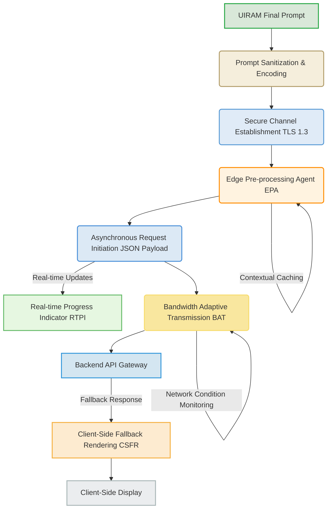
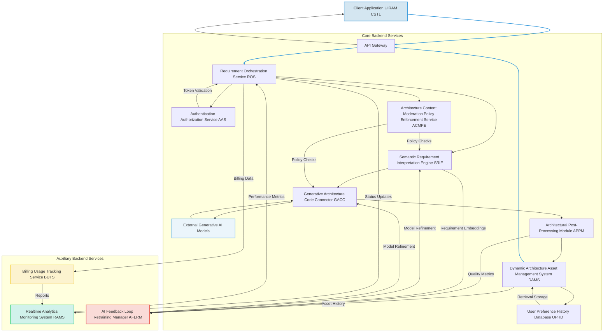
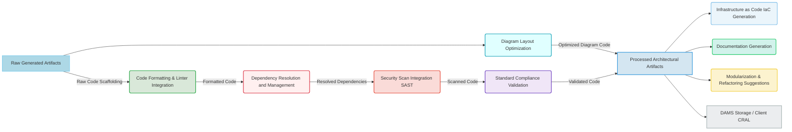
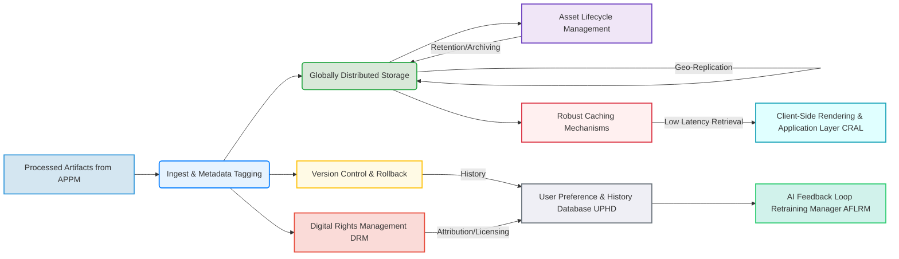
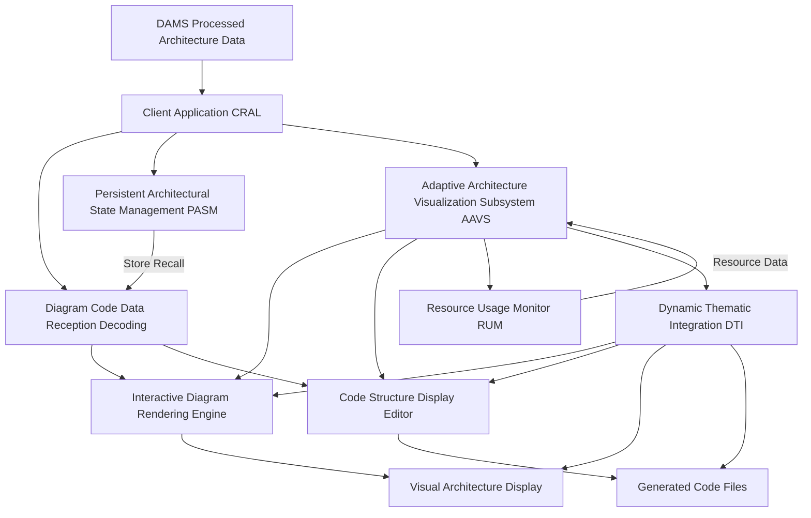
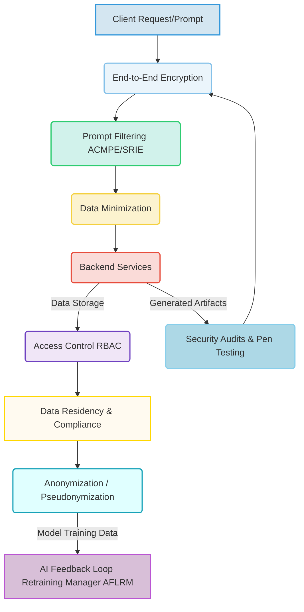

###Comprehensive System and Method for the Ontological Transmutation of High-Level Functional Requirements into Dynamic, Executable Software Architecture Blueprints via Generative AI Architectures

**Abstract:**
A profoundly innovative system and method are herein disclosed for the unprecedented automation of software architecture design and foundational code generation. This invention fundamentally redefines the paradigm of software development by enabling the direct, real-time conversion of nuanced natural language expressions of desired software functionality, constraints, and non-functional requirements into novel, high-fidelity architectural diagrams and corresponding initial code structures. The system, leveraging state-of-the-art generative artificial intelligence models, orchestrates a seamless pipeline: a user's semantically rich prompt is processed, channeled to a sophisticated generative engine, and the resulting synthetic architecture is subsequently and adaptively integrated as the foundational blueprint for software development. This methodology transcends the limitations of conventional manual design processes, delivering an infinitely expansive, deeply consistent, and perpetually optimized development experience that obviates any prerequisite for architectural acumen from the end-user. The intellectual dominion over these principles is unequivocally established.

**Background of the Invention:**
The historical trajectory of software development, while advancing in functional complexity and agile methodologies, has remained fundamentally constrained by an anachronistic approach to architectural design. Prior art systems typically present users with rudimentary diagramming tools, rigid code generation templates, or require extensive manual intervention to bridge the chasm between high-level business requirements and low-level technical implementation. These conventional methodologies are inherently deficient in dynamic creative synthesis, thereby imposing a significant cognitive burden upon the software architect or developer. The human designer is invariably compelled either to possess profound expertise across diverse architectural patterns, technologies, and non-functional considerations, or to undertake an often-laborious external search for suitable design paradigms, the latter frequently culminating in inconsistencies, suboptimal choices, or project delays. Such a circumscribed framework fundamentally fails to address the innate human proclivity for rapid innovation and the desire for an automated, intelligent partner in complex system design. Consequently, a profound lacuna exists within the domain of software engineering: a critical imperative for an intelligent system capable of autonomously generating unique, contextually rich, and architecturally sound software blueprints and foundational code, directly derived from the user's unadulterated textual articulation of desired system behavior, constraints, or abstract concepts. This invention precisely and comprehensively addresses this lacuna, presenting a transformative solution.

**Brief Summary of the Invention:**
The present invention unveils a meticulously engineered system that symbiotically integrates advanced generative AI models within an extensible software architecture generation workflow. The core mechanism involves the user's provision of a natural language textual prompt, serving as the semantic seed for architectural and code generation. This system robustly and securely propagates this prompt to a sophisticated AI-powered generation service, orchestrating the reception of the generated high-fidelity architectural diagrams and foundational code structures. Subsequently, these bespoke artifacts are adaptively presented as the foundational software blueprint. This pioneering approach unlocks an effectively infinite continuum of design options, directly translating a user's abstract textual ideation into a tangible, dynamically rendered, and executable architectural theme. The architectural elegance and operational efficacy of this system render it a singular advancement in the field, representing a foundational patentable innovation. The foundational tenets herein articulated are the exclusive domain of the conceiver.

**Detailed Description of the Invention:**
The disclosed invention comprises a highly sophisticated, multi-tiered architecture designed for the robust and real-time generation and application of personalized software architectural blueprints and foundational code. The operational flow initiates with user interaction and culminates in the dynamic transformation of the digital development environment.

**I. User Interaction and Requirements Acquisition Module UIRAM**
The user initiates the architectural design process by interacting with a dedicated configuration module seamlessly integrated within an Integrated Development Environment IDE, a web portal, or a dedicated software design application. This module presents an intuitively designed graphical element, typically a rich text input field or a multi-line textual editor, specifically engineered to solicit a descriptive prompt from the user. This prompt constitutes a natural language articulation of the desired software's functional requirements, non-functional constraints, technical stack preferences, or abstract architectural concepts e.g. "Design a scalable e-commerce platform with microservices, supporting 100k concurrent users, low latency, secure payment processing, and real-time inventory updates, using Kubernetes and a NoSQL database," or "Generate a robust API gateway for a financial service, adhering to OAuth2.0, with throttling and logging capabilities, using Spring Boot and Kafka." The UIRAM incorporates:
*   **Semantic Requirement Validation Subsystem SRVS:** Employs linguistic parsing and semantic analysis to provide real-time feedback on requirement quality, suggest enhancements for improved architectural output, and detect inconsistencies or ambiguities. It leverages advanced natural language inference models to ensure prompt coherence and completeness.
*   **Requirement History and Pattern Engine RHPE:** Stores previously successful requirements sets and generated architectures, allows for re-selection, and suggests variations or popular architectural patterns based on community data, best practices, or inferred user preferences, utilizing collaborative filtering and content-based recommendation algorithms.
*   **Requirement Co-Creation Assistant RCCA:** Integrates a large language model LLM based assistant that can help users refine vague requirements, suggest specific technologies or architectural patterns, or generate variations based on initial input, ensuring high-quality input for the generative engine. This includes contextual awareness from the user's current project, codebase, or system settings.
*   **Diagrammatic Feedback Loop DFL:** Provides low-fidelity, near real-time architectural sketches or abstract representations as the prompt is being typed/refined, powered by a lightweight, faster generative model or semantic-to-diagram engine. This allows iterative refinement before full-scale generation.
*   **Multi-Modal Input Processor MMIP:** Expands prompt acquisition beyond text to include voice input speech-to-text, rough sketches image-to-text descriptions, existing code snippets for context, or even existing architectural diagrams to infer intent.
*   **Requirement Sharing and Knowledge Base RSNB:** Allows users to publish their successful prompts and generated architectures to a community marketplace or internal knowledge base, facilitating discovery and inspiration, with optional governance and monetization features.

```mermaid
graph LR
    A[User Input (Text, Voice, Sketch, Code)] --> B(Multi-Modal Input Processor MMIP)
    B --> C{Synthesized Prompt}
    C --> D[Semantic Requirement Validation Subsystem SRVS]
    D -- Feedback/Suggestions --> A
    D -- Validated Prompt --> E[Requirement Co-Creation Assistant RCCA]
    E -- Refined Prompt --> F[Diagrammatic Feedback Loop DFL]
    F -- Low-fidelity Sketch --> A
    F -- Final Prompt --> G(Requirement History and Pattern Engine RHPE)
    G -- Pattern Suggestions/History --> A
    G -- Stored History/Community --> H[Requirement Sharing and Knowledge Base RSNB]
    G -- Final Prompt --> I(Client-Side Orchestration and Transmission Layer CSTL)

    style A fill:#FFF2E5,stroke:#FF9900,stroke-width:2px;
    style B fill:#E6F3FF,stroke:#007BFF,stroke-width:2px;
    style C fill:#D9E8D9,stroke:#28A745,stroke-width:2px;
    style D fill:#F0E6F7,stroke:#6F42C1,stroke-width:2px;
    style E fill:#FFF0F0,stroke:#DC3545,stroke-width:2px;
    style F fill:#E0FFFF,stroke:#17A2B8,stroke-width:2px;
    style G fill:#FFFAE5,stroke:#FFC107,stroke-width:2px;
    style H fill:#EFEFF5,stroke:#6C757D,stroke-width:2px;
    style I fill:#D4E6F1,stroke:#3498DB,stroke-width:2px;
```
*   **Requirements Prioritization Engine RPE:** Dynamically assigns weights to functional and non-functional requirements based on user explicit input (e.g., drag-and-drop importance) or implicit signals (e.g., repetition frequency, sentiment analysis). This provides a criticality vector `w_req` to guide the SRIE.

**II. Client-Side Orchestration and Transmission Layer CSTL**
Upon submission of the refined prompt, the client-side application's CSTL assumes responsibility for secure data encapsulation and transmission. This layer performs:
*   **Prompt Sanitization and Encoding:** The natural language prompt is subjected to a sanitization process to prevent injection vulnerabilities and then encoded e.g. UTF-8 for network transmission.
*   **Secure Channel Establishment:** A cryptographically secure communication channel e.g. TLS 1.3 is established with the backend service.
*   **Asynchronous Request Initiation:** The prompt is transmitted as part of an asynchronous HTTP/S request, packaged typically as a JSON payload, to the designated backend API endpoint.
*   **Edge Pre-processing Agent EPA:** For high-end client devices, performs initial semantic tokenization or basic requirement summarization locally to reduce latency and backend load. This can also include local caching of common architectural modifiers or technology stack preferences.
*   **Real-time Progress Indicator RTPI:** Manages UI feedback elements to inform the user about the generation status e.g. "Interpreting requirements...", "Designing architecture...", "Generating code scaffolding...", "Optimizing diagrams for display...". This includes granular progress updates from the backend.
*   **Bandwidth Adaptive Transmission BAT:** Dynamically adjusts the prompt payload size or architectural asset reception quality based on detected network conditions to ensure responsiveness under varying connectivity.
*   **Client-Side Fallback Rendering CSFR:** In cases of backend unavailability or slow response, can render a default architectural template, a cached architecture, or use a simpler client-side generative model for basic patterns, ensuring a continuous design experience.



**III. Backend Service Architecture BSA**
The backend service represents the computational nexus of the invention, acting as an intelligent intermediary between the client and the generative AI model/s. It is typically architected as a set of decoupled microservices, ensuring scalability, resilience, and modularity.



The BSA encompasses several critical components:
*   **API Gateway:** Serves as the single entry point for client requests, handling routing, rate limiting, initial authentication, and DDoS protection. It also manages request and response schema validation.
*   **Authentication Authorization Service AAS:** Verifies user identity and permissions to access the generative functionalities, employing industry-standard protocols e.g. OAuth 2.0, JWT. Supports multi-factor authentication and single sign-on SSO.
*   **Requirement Orchestration Service ROS:**
    *   Receives and validates incoming requirements prompts.
    *   Manages the lifecycle of the architectural generation request, including queueing, retries, and sophisticated error handling with exponential backoff.
    *   Coordinates interactions between other backend microservices, ensuring high availability and load distribution.
    *   Implements request idempotency to prevent duplicate processing.
*   **Architecture Content Moderation Policy Enforcement Service ACMPE:** Scans requirements and generated architectural artifacts for policy violations, security vulnerabilities, inappropriate technology choices, or intellectual property infringements, flagging or blocking content based on predefined rules, machine learning models, and ethical guidelines. Integrates with the SRIE and GACC for proactive and reactive moderation, including human-in-the-loop review processes.
*   **Semantic Requirement Interpretation Engine SRIE:** This advanced module goes beyond simple text parsing. It employs sophisticated Natural Language Processing NLP techniques, including:
    *   **Named Entity Recognition NER:** Identifies key system components e.g. "user service," "database," "API gateway", technologies e.g. "Kubernetes," "PostgreSQL," "React", and actors e.g. "customer," "admin."
    *   **Attribute Extraction:** Extracts non-functional requirements and design constraints e.g. "high availability," "low latency," "secure," "scalable," "microservices architecture," "serverless."
    *   **Domain Model Inference DMI:** Automatically infers initial conceptual domain models, entities, and relationships from the requirements, forming the basis for data schemas.
    *   **System Context Delineation SCD:** Defines system boundaries, identifies external integrations, and outlines key interfaces.
    *   **Architectural Pattern Suggestion APS:** Utilizes a knowledge base of common architectural patterns e.g. "event-driven," "monolith," "client-server," "CQRS" and suggests the most appropriate ones based on inferred requirements.
    *   **Anti-Pattern Detection APD:** Identifies potential architectural anti-patterns or suboptimal design choices inherent in the interpretation of the requirements, providing warnings or alternative suggestions.
    *   **Cross-Lingual Interpretation:** Support for requirements in multiple natural languages, using advanced machine translation or multilingual NLP models that preserve semantic nuance.
    *   **Contextual Awareness Integration:** Incorporates external context such as existing codebase, team expertise, deployment environment e.g. "AWS," "Azure", or organizational standards to subtly influence the interpretation and architectural output.
    *   **User Persona Inference UPI:** Infers aspects of the user's preferred architectural style, technology stack, or complexity tolerance based on past interactions, selected architectures, and implicit feedback, using this to personalize requirement interpretations and design biases.

```mermaid
graph TD
    A[Raw Prompt (v_p)] --> B(Multi-Lingual Encoder)
    B --> C[Named Entity Recognition NER]
    B --> D[Attribute Extraction (NFRs, Constraints)]
    B --> E[Domain Model Inference DMI]
    E -- Entities/Relationships --> F{Synthesized Semantic Graph}
    C -- Identified Components/Tech --> F
    D -- NFRs/Constraints --> F
    F --> G[System Context Delineation SCD]
    F --> H[Architectural Pattern Suggestion APS]
    F --> I[Anti-Pattern Detection APD]
    F --> J[User Persona Inference UPI]
    F --> K[Contextual Awareness Integration]
    G -- Boundaries/Interfaces --> L[Enriched Generative Instruction Set (v_p')]
    H -- Pattern Scores --> L
    I -- Warnings/Alternatives --> L
    J -- Persona Biases --> L
    K -- Environmental Factors --> L
    L --> M(ACMPE for Policy Check)
    M --> N[Generative Architecture Code Connector GACC]

    style A fill:#FFF2E5,stroke:#FF9900,stroke-width:2px;
    style B fill:#E6F3FF,stroke:#007BFF,stroke-width:2px;
    style C fill:#D9E8D9,stroke:#28A745,stroke-width:2px;
    style D fill:#F0E6F7,stroke:#6F42C1,stroke-width:2px;
    style E fill:#FFF0F0,stroke:#DC3545,stroke-width:2px;
    style F fill:#E0FFFF,stroke:#17A2B8,stroke-width:2px;
    style G fill:#FFFAE5,stroke:#FFC107,stroke-width:2px;
    style H fill:#EFEFF5,stroke:#6C757D,stroke-width:2px;
    style I fill:#FADBD8,stroke:#E74C3C,stroke-width:2px;
    style J fill:#D1F2EB,stroke:#2ECC71,stroke-width:2px;
    style K fill:#FCF3CF,stroke:#F4D03F,stroke-width:2px;
    style L fill:#D4E6F1,stroke:#3498DB,stroke-width:2px;
    style M fill:#ADD8E6,stroke:#87CEEB,stroke-width:2px;
    style N fill:#C8E6C9,stroke:#81C784,stroke-width:2px;
```

*   **Generative Architecture Code Connector GACC:**
    *   Acts as an abstraction layer for various generative AI models e.g. Large Language Models fine-tuned for code generation, graph neural networks for architectural diagramming, specialized code synthesis models.
    *   Translates the enhanced requirements and associated parameters e.g. desired diagram type UML, DFD, C4 model, programming language, framework into the specific API request format required by the chosen generative model.
    *   Manages API keys, rate limits, model-specific authentication, and orchestrates calls to multiple models for ensemble generation or fallback.
    *   Receives the generated architectural artifacts data, typically as diagram code e.g. Mermaid, PlantUML, Graphviz, or foundational code snippets, API definitions, and configuration files.
    *   **Dynamic Model Selection Engine DMSE:** Based on requirement complexity, desired output quality, cost constraints, current model availability/load, and user subscription tier, intelligently selects the most appropriate generative model from a pool of registered models. This includes a robust health check for each model endpoint.
    *   **Architecture Weighting & Constraint Optimization:** Fine-tunes how functional and non-functional requirement elements are translated into model guidance signals, often involving iterative optimization based on output quality feedback from the CAMM.
    *   **Multi-Model Fusion MMF:** For complex requirements, can coordinate the generation across multiple specialized models e.g. one for domain model, another for sequence diagrams, another for database schemas, and a dedicated model for generating corresponding code scaffolding.

```mermaid
graph TD
    A[SRIE Enriched Instruction Set (v_p')] --> B{Dynamic Model Selection Engine DMSE}
    B -- Model Health Check --> B
    B -- Cost/Quality/Load Metrics --> B
    B -- User Tier/Preference --> B
    B --> C1(Generative Model 1: Diagram Synthesis)
    B --> C2(Generative Model 2: Code Scaffolding)
    B --> C3(Generative Model 3: IaC Templates)
    B --> C4(Generative Model 4: API/Schema Definition)
    C1 --> D(Multi-Model Fusion MMF)
    C2 --> D
    C3 --> D
    C4 --> D
    D -- Fused Raw Artifacts --> E[Architectural Post-Processing Module APPM]
    
    style A fill:#D4E6F1,stroke:#3498DB,stroke-width:2px;
    style B fill:#FFF8DC,stroke:#DAA520,stroke-width:2px;
    style C1 fill:#E0FFFF,stroke:#17A2B8,stroke-width:2px;
    style C2 fill:#F0FFF0,stroke:#228B22,stroke-width:2px;
    style C3 fill:#FFE4E1,stroke:#FF6347,stroke-width:2px;
    style C4 fill:#F8F8FF,stroke:#6A5ACD,stroke-width:2px;
    style D fill:#ADD8E6,stroke:#87CEEB,stroke-width:2px;
    style E fill:#D3D3D3,stroke:#A9A9A9,stroke-width:2px;
```

*   **Architectural Post-Processing Module APPM:** Upon receiving the raw generated architectural artifacts, this module performs a series of optional, but often crucial, transformations to optimize them for display and usability:
    *   **Diagram Layout Optimization:** Applies algorithms to arrange diagram elements for maximum clarity, readability, and adherence to diagramming standards.
    *   **Code Formatting & Linter Integration:** Ensures generated code adheres to specified style guides e.g. Black, Prettier and passes linting checks.
    *   **Dependency Resolution and Management:** Automatically identifies and adds necessary project dependencies, package managers, and build tool configurations to the generated code.
    *   **Security Scan Integration:** Integrates with static analysis security testing SAST tools to perform initial scans on generated code for common vulnerabilities or anti-patterns.
    *   **Infrastructure as Code IaC Generation:** For cloud-native architectures, generates foundational IaC templates e.g. Terraform, CloudFormation, Pulumi for provisioning the necessary infrastructure.
    *   **Documentation Generation:** Auto-generates detailed documentation e.g. API specifications Swagger/OpenAPI, READMEs, architectural decision records ADRs from the generated diagrams and code.
    *   **Modularization and Refactoring Suggestions:** Identifies opportunities for further modularization or refactoring in the generated code and suggests improvements.
    *   **Standard Compliance Validation:** Validates generated architecture and code against industry standards e.g. ISO 25010 for software quality, OWASP Top 10 for security.



*   **Dynamic Architecture Asset Management System DAMS:**
    *   Stores the processed generated diagrams, code, and documentation in a high-availability, globally distributed repository for rapid retrieval, ensuring low latency for users worldwide.
    *   Associates comprehensive metadata with each artifact, including the original prompt, generation parameters, creation timestamp, user ID, ACMPE flags, and architectural quality scores.
    *   Implements robust caching mechanisms and smart invalidation strategies to serve frequently requested or recently generated architectures with minimal latency.
    *   Manages asset lifecycle, including retention policies, automated archiving, and cleanup based on usage patterns and storage costs.
    *   **Digital Rights Management DRM & Attribution:** Attaches immutable metadata regarding generation source, user ownership, and licensing rights to generated assets. Tracks usage and distribution.
    *   **Version Control & Rollback:** Maintains versions of user-generated architectures and code, allowing users to revert to previous versions or explore variations of past prompts, crucial for iterative design.
    *   **Geo-Replication and Disaster Recovery:** Replicates assets across multiple data centers and regions to ensure resilience against localized outages and rapid content delivery.


*   **User Preference & History Database UPHD:** A persistent data store for associating generated architectures with user profiles, allowing users to revisit, reapply, or share their previously generated designs. This also feeds into the RHPE for personalized recommendations and is a key source for the UPI within SRIE.
*   **Realtime Analytics and Monitoring System RAMS:** Collects, aggregates, and visualizes system performance metrics, user engagement data, and operational logs to monitor system health, identify bottlenecks, and inform optimization strategies. Includes anomaly detection.
*   **Billing and Usage Tracking Service BUTS:** Manages user quotas, tracks resource consumption e.g. generation credits, storage, bandwidth, and integrates with payment gateways for monetization, providing granular reporting.
*   **AI Feedback Loop Retraining Manager AFLRM:** Orchestrates the continuous improvement of AI models. It gathers feedback from CAMM, ACMPE, and UPHD, identifies areas for model refinement, manages data labeling, and initiates retraining or fine-tuning processes for SRIE and GACC models.

**IV. Client-Side Rendering and Application Layer CRAL**
The processed architectural artifacts data is transmitted back to the client application via the established secure channel. The CRAL is responsible for the seamless integration and display of these new design assets:



*   **Diagram Code Data Reception & Decoding:** The client-side CRAL receives the optimized diagram code e.g. Mermaid, PlantUML, and code scaffolding. It decodes and prepares the data for display within appropriate rendering components.
*   **Interactive Diagram Rendering Engine:** This component takes the diagram code and renders it into interactive visual diagrams e.g. flowcharts, sequence diagrams, class diagrams, C4 models. It supports standard diagramming formats and ensures high-fidelity representation.
*   **Code Structure Display Editor:** Integrates a code editor component that displays the generated foundational code structures. It supports syntax highlighting, code folding, and basic navigation, resembling a mini-IDE.
*   **Adaptive Architecture Visualization Subsystem AAVS:** This subsystem ensures that the presentation of the architecture is not merely static. It can involve:
    *   **Interactive Diagram Navigation:** Implements zoom, pan, drill-down functionality into architectural components, allowing users to explore different levels of abstraction.
    *   **Code-Diagram Synchronization:** Provides bidirectional linking between diagram elements and corresponding sections of generated code, highlighting relevant code when a diagram component is selected, and vice-versa.
    *   **Version Comparison and Diffing:** Allows users to visually compare different versions of generated architectures or compare a generated architecture with a modified version, highlighting changes.
    *   **Dynamic Metrics Overlay:** Overlays architectural quality metrics e.g. complexity, security score, performance predictions directly onto diagram elements or code sections, providing immediate feedback.
    *   **Thematic Integration:** Automatically adjusts diagram colors, fonts, and layout, and code editor themes to seamlessly integrate with the user's IDE or application's visual theme.
    *   **Simulation and Visualization:** For certain architectural patterns e.g. event-driven systems, can provide lightweight simulations or animated data flows to illustrate dynamic behavior.
*   **Persistent Architectural State Management PASM:** The generated architecture, along with its associated prompt and metadata, can be stored locally e.g. using `localStorage` or `IndexedDB` or referenced from the UPHD. This allows the user's preferred architectural state to persist across sessions or devices, enabling seamless resumption and collaborative work.
*   **Resource Usage Monitor RUM:** For complex diagrams or large codebases, this module monitors CPU/GPU usage and memory consumption, dynamically adjusting rendering fidelity or code indexing processes to maintain device performance, particularly on less powerful clients.

**V. Computational Architecture Metrics Module CAMM**
An advanced, optional, but highly valuable component for internal system refinement and user experience enhancement. The CAMM employs various machine learning techniques, static analysis, and graph theory algorithms to:
*   **Objective Architecture Scoring:** Evaluate generated architectures against predefined objective criteria e.g. modularity, scalability, maintainability, security posture, performance potential, adherence to best practices, using trained neural networks that mimic expert architectural judgment.
*   **Requirement Traceability Verification RTV:** Automatically verifies that every functional and non-functional requirement from the input prompt is addressed and reflected in the generated architecture and code, identifying any gaps or over-engineering.
*   **Performance Prediction Model PPM:** Estimates potential performance characteristics e.g. latency, throughput, resource consumption of the proposed architecture under various load conditions, using simulation and predictive modeling.
*   **Feedback Loop Integration:** Provides detailed quantitative metrics to the SRIE and GACC to refine prompt interpretation and model parameters, continuously improving the quality, relevance, and robustness of future generations. This data also feeds into the AFLRM.
*   **Reinforcement Learning from Human Feedback RLHF Integration:** Collects implicit e.g. how long an architecture is kept unmodified, how often it's accepted without major changes, whether the user shares it and explicit e.g. "thumbs up/down," "accept/reject component" ratings user feedback, feeding it back into the generative model training or fine-tuning process to continually improve architectural alignment with human preferences and domain best practices.
*   **Bias Detection and Mitigation:** Analyzes generated architectures for unintended biases e.g. over-reliance on certain technologies, under-representation of secure design patterns, or stereotypical solutions for specific industries and provides insights for model retraining, prompt engineering adjustments, or content filtering by ACMPE.
*   **Semantic Consistency Check SCC:** Verifies that the architectural components, relationships, and code structures consistently match the semantic intent of the input prompt and adhere to logical software design principles, using vision-language models and static code analysis.

```mermaid
graph TD
    A[Generated Architecture (a_optimized)] --> B(Objective Architecture Scoring)
    A --> C(Requirement Traceability Verification RTV)
    A --> D(Performance Prediction Model PPM)
    A --> E(Bias Detection and Mitigation)
    A --> F(Semantic Consistency Check SCC)
    B -- Quality Scores --> G[AI Feedback Loop Retraining Manager AFLRM]
    C -- Traceability Gaps --> G
    D -- Performance Estimates --> G
    E -- Bias Insights --> G
    F -- Consistency Deviations --> G
    H[User Feedback (Implicit/Explicit)] --> I(Reinforcement Learning from Human Feedback RLHF)
    I -- Reward Signals --> G
    G -- Model Refinement/Retraining --> J[SRIE / GACC]
    J -- Improved Generation --> A
    
    style A fill:#D4E6F1,stroke:#3498DB,stroke-width:2px;
    style B fill:#EBF5FB,stroke:#85C1E9,stroke-width:2px;
    style C fill:#D1F2EB,stroke:#2ECC71,stroke-width:2px;
    style D fill:#FCF3CF,stroke:#F4D03F,stroke-width:2px;
    style E fill:#FADBD8,stroke:#E74C3C,stroke-width:2px;
    style F fill:#F0E6F7,stroke:#6F42C1,stroke-width:2px;
    style G fill:#FFFAF0,stroke:#FFD700,stroke-width:2px;
    style H fill:#E0FFFF,stroke:#17A2B8,stroke-width:2px;
    style I fill:#D8BFD8,stroke:#BA55D3,stroke-width:2px;
    style J fill:#ADD8E6,stroke:#87CEEB,stroke-width:2px;
```

**VI. Security and Privacy Considerations:**
The system incorporates robust security measures at every layer:
*   **End-to-End Encryption:** All data in transit between client, backend, and generative AI services is encrypted using state-of-the-art cryptographic protocols e.g. TLS 1.3, ensuring data confidentiality and integrity.
*   **Data Minimization:** Only necessary data the requirements prompt, user ID, context is transmitted to external generative AI services, reducing the attack surface and privacy exposure.
*   **Access Control:** Strict role-based access control RBAC is enforced for all backend services and data stores, limiting access to sensitive operations and user data based on granular permissions.
*   **Prompt Filtering:** The SRIE and ACMPE include mechanisms to filter out malicious, offensive, or inappropriate prompts e.g. requests for insecure or illegal software before they reach external generative models, protecting users and preventing misuse.
*   **Regular Security Audits and Penetration Testing:** Continuous security assessments are performed to identify and remediate vulnerabilities across the entire system architecture, including the generated code.
*   **Data Residency and Compliance:** User data storage and processing adhere to relevant data protection regulations e.g. GDPR, CCPA, with options for specifying data residency.
*   **Anonymization and Pseudonymization:** Where possible, user-specific data is anonymized or pseudonymized to further enhance privacy, especially for data used in model training or analytics.



**VII. Monetization and Licensing Framework:**
To ensure sustainability and provide value-added services, the system can incorporate various monetization strategies:
*   **Premium Feature Tiers:** Offering higher complexity architecture generation, faster processing times, access to exclusive generative models or specialized architectural patterns, advanced post-processing options e.g. IaC generation, or expanded architectural history as part of a subscription model.
*   **Architecture Pattern Marketplace:** Allowing users to license, sell, or share their generated architectural templates or code scaffolding with other users, with a royalty or commission model for the platform, fostering a vibrant creator economy.
*   **API for Developers:** Providing programmatic access to the generative capabilities for third-party applications, IDE plugins, or CI/CD pipelines, potentially on a pay-per-use basis, enabling a broader ecosystem of integrations.
*   **Branded Content & Partnerships:** Collaborating with technology vendors or industry experts to offer exclusive themed generative patterns, technology stack presets, or sponsored architectural solutions, creating unique advertising or co-creation opportunities.
*   **Micro-transactions for Specific Templates/Elements:** Offering one-time purchases for unlocking rare architectural styles, specific framework integrations, or advanced security patterns.
*   **Enterprise Solutions:** Custom deployments and white-label versions of the system for businesses seeking personalized architectural governance and dynamic code generation across their development teams.

```mermaid
graph TD
    A[User Engagement] --> B{Subscription Tiers (Premium/Basic)}
    B -- Feature Access --> C[Generative AI Services]
    B -- Faster Generation --> C
    A --> D[Architecture Pattern Marketplace]
    D -- Sell/License Patterns --> E[Creator Economy / Royalties]
    A --> F[API for Developers]
    F -- Pay-per-Use --> G[Third-Party Integrations]
    A --> H[Micro-transactions (Templates/Elements)]
    A --> I[Enterprise Solutions (Custom/White-label)]
    I -- Custom Deployment --> J[Corporate Clients]
    K[Technology Vendors / Experts] --> L[Branded Content & Partnerships]
    L -- Sponsored Patterns --> A
    
    style A fill:#D4E6F1,stroke:#3498DB,stroke-width:2px;
    style B fill:#EBF5FB,stroke:#85C1E9,stroke-width:2px;
    style C fill:#D1F2EB,stroke:#2ECC71,stroke-width:2px;
    style D fill:#FCF3CF,stroke:#F4D03F,stroke-width:2px;
    style E fill:#FADBD8,stroke:#E74C3C,stroke-width:2px;
    style F fill:#F0E6F7,stroke:#6F42C1,stroke-width:2px;
    style G fill:#FFFAF0,stroke:#FFD700,stroke-width:2px;
    style H fill:#E0FFFF,stroke:#17A2B8,stroke-width:2px;
    style I fill:#D8BFD8,stroke:#BA55D3,stroke-width:2px;
    style J fill:#ADD8E6,stroke:#87CEEB,stroke-width:2px;
    style K fill:#C8E6C9,stroke:#81C784,stroke-width:2px;
    style L fill:#FFDDC1,stroke:#FFA07A,stroke-width:2px;
```

**VIII. Ethical AI Considerations and Governance:**
Acknowledging the powerful capabilities of generative AI, this invention is designed with a strong emphasis on ethical considerations:
*   **Transparency and Explainability:** Providing users with insights into how their prompt was interpreted and what factors influenced the generated architecture and code e.g. which model was used, key semantic interpretations, applied architectural patterns, identified trade-offs.
*   **Responsible AI Guidelines:** Adherence to strict ethical guidelines for content moderation, preventing the generation of harmful, biased, or insecure architectural designs or code, including mechanisms for user reporting and automated detection by ACMPE.
*   **Data Provenance and Copyright:** Clear policies on the ownership and rights of generated content, especially when user prompts might inadvertently mimic proprietary designs or existing codebases. This includes robust attribution mechanisms where necessary and active monitoring for intellectual property infringement.
*   **Bias Mitigation in Training Data:** Continuous efforts to ensure that the underlying generative models are trained on diverse and ethically curated datasets to minimize bias in generated architectural outputs e.g. favoring certain programming languages, neglecting accessibility patterns. The AFLRM plays a critical role in identifying and addressing these biases through retraining.
*   **Accountability and Auditability:** Maintaining detailed logs of prompt processing, generation requests, and moderation actions to ensure accountability and enable auditing of system behavior and architectural decisions.
*   **User Consent and Data Usage:** Clear and explicit policies on how user prompts, generated architectures, and feedback data are used, ensuring informed consent for data collection and model improvement.

```mermaid
graph TD
    A[Ethical AI Principles] --> B(Transparency & Explainability)
    A --> C(Responsible AI Guidelines)
    A --> D(Bias Mitigation in Training Data)
    A --> E(Data Provenance & Copyright)
    A --> F(Accountability & Auditability)
    A --> G(User Consent & Data Usage)
    B -- Model Insights --> H[SRIE / GACC]
    C -- Content Policies --> I[ACMPE (Moderation)]
    D -- Dataset Curation --> J[AFLRM (Retraining)]
    E -- IP Monitoring --> I
    F -- Audit Trails --> K[RAMS (Logging)]
    G -- Privacy Policies --> K
    H -- Explainable Outputs --> L[Client CRAL]
    I -- Moderation Feedback --> J
    J -- Improved Models --> H
    
    style A fill:#D4E6F1,stroke:#3498DB,stroke-width:2px;
    style B fill:#EBF5FB,stroke:#85C1E9,stroke-width:2px;
    style C fill:#D1F2EB,stroke:#2ECC71,stroke-width:2px;
    style D fill:#FCF3CF,stroke:#F4D03F,stroke-width:2px;
    style E fill:#FADBD8,stroke:#E74C3C,stroke-width:2px;
    style F fill:#F0E6F7,stroke:#6F42C1,stroke-width:2px;
    style G fill:#FFFAF0,stroke:#FFD700,stroke-width:2px;
    style H fill:#ADD8E6,stroke:#87CEEB,stroke-width:2px;
    style I fill:#ADD8E6,stroke:#87CEEB,stroke-width:2px;
    style J fill:#D8BFD8,stroke:#BA55D3,stroke-width:2px;
    style K fill:#C8E6C9,stroke:#81C784,stroke-width:2px;
    style L fill:#E0FFFF,stroke:#17A2B8,stroke-width:2px;
```

**Claims:**
1.  A method for dynamic and adaptive generation of software architecture and foundational code structures, comprising the steps of:
    a.  Providing a user interface element configured for receiving a natural language textual prompt, said prompt conveying high-level functional and non-functional requirements.
    b.  Receiving said natural language textual prompt from a user via said user interface element, optionally supplemented by multi-modal inputs such as voice, sketches, or existing code snippets.
    c.  Processing said prompt through a Semantic Requirement Interpretation Engine SRIE to enrich, validate, and potentially generate negative constraints for the prompt, thereby transforming the subjective intent into a structured, optimized generative instruction set, including user persona inference and contextual awareness integration.
    d.  Transmitting said optimized generative instruction set to a Generative Architecture Code Connector GACC, which orchestrates communication with at least one external generative artificial intelligence model, employing a Dynamic Model Selection Engine DMSE.
    e.  Receiving novel, synthetically generated architectural artifacts from said generative artificial intelligence model, wherein the generated artifacts comprise detailed architectural diagrams and foundational code structures, representing a high-fidelity reification of the structured generative instruction set.
    f.  Processing said novel generated architectural artifacts through an Architectural Post-Processing Module APPM to perform at least one of diagram layout optimization, code formatting, dependency resolution, security scanning, or Infrastructure as Code IaC generation.
    g.  Transmitting said processed architectural artifacts data to a client-side rendering environment.
    h.  Applying said processed architectural artifacts as a dynamically updating software blueprint via a Client-Side Rendering and Application Layer CRAL, utilizing an Interactive Diagram Rendering Engine, a Code Structure Display Editor, and an Adaptive Architecture Visualization Subsystem AAVS to ensure fluid visual integration, interactive exploration, and synchronized presentation of diagrams and code.

2.  The method of claim 1, further comprising storing the processed architectural artifacts, the original prompt, and associated metadata in a Dynamic Architecture Asset Management System DAMS for persistent access, retrieval, version control, and digital rights management.

3.  The method of claim 1, further comprising utilizing a Persistent Architectural State Management PASM module to store and recall the user's preferred architectural designs across user sessions and devices.

4.  A system for the ontological transmutation of high-level functional requirements into dynamic, executable software architecture blueprints, comprising:
    a.  A Client-Side Orchestration and Transmission Layer CSTL equipped with a User Interaction and Requirements Acquisition Module UIRAM for receiving and initially processing a user's descriptive natural language prompt, including multi-modal input processing and requirement co-creation assistance.
    b.  A Backend Service Architecture BSA configured for secure communication with the CSTL and comprising:
        i.   A Requirement Orchestration Service ROS for managing request lifecycles and load balancing.
        ii.  A Semantic Requirement Interpretation Engine SRIE for advanced linguistic analysis, prompt enrichment, negative constraint generation, and user persona inference, including domain model inference and architectural pattern suggestion.
        iii. A Generative Architecture Code Connector GACC for interfacing with external generative artificial intelligence models, including dynamic model selection and multi-model fusion for generating diagrams and code.
        iv.  An Architectural Post-Processing Module APPM for optimizing generated architectural artifacts for display and usability, including Infrastructure as Code IaC generation and documentation generation.
        v.   A Dynamic Architecture Asset Management System DAMS for storing and serving generated architectural assets, including version control and digital rights management.
        vi.  An Architecture Content Moderation Policy Enforcement Service ACMPE for ethical content screening of prompts and generated architectures.
        vii. A User Preference & History Database UPHD for storing user architectural preferences and historical generative data.
        viii. A Realtime Analytics and Monitoring System RAMS for system health and performance oversight.
        ix.  An AI Feedback Loop Retraining Manager AFLRM for continuous model improvement through human feedback and architectural metrics.
    c.  A Client-Side Rendering and Application Layer CRAL comprising:
        i.   Logic for receiving and decoding processed architectural artifacts data.
        ii.  An Interactive Diagram Rendering Engine for displaying generated architectural diagrams.
        iii. A Code Structure Display Editor for presenting generated foundational code structures.
        iv.  An Adaptive Architecture Visualization Subsystem AAVS for orchestrating interactive exploration, code-diagram synchronization, version comparison, and dynamic metrics overlay.
        v.   A Persistent Architectural State Management PASM module for retaining user architectural preferences across sessions.
        vi.  A Resource Usage Monitor RUM for dynamically adjusting rendering fidelity based on device resource consumption.

5.  The system of claim 4, further comprising a Computational Architecture Metrics Module CAMM within the BSA, configured to objectively evaluate the quality and semantic fidelity of generated architectures and code, and to provide feedback for system optimization, including through Reinforcement Learning from Human Feedback RLHF integration, requirement traceability verification, and bias detection.

6.  The system of claim 4, wherein the SRIE is configured to generate anti-patterns or negative constraints based on the semantic content of the user's prompt to guide the generative model away from undesirable architectural characteristics and to include contextual awareness from the user's development environment.

7.  The method of claim 1, wherein the Adaptive Architecture Visualization Subsystem AAVS includes functionality for bidirectional linking between diagram elements and corresponding sections of generated code.

8.  The system of claim 4, wherein the Generative Architecture Code Connector GACC is further configured to perform multi-model fusion across different AI models specializing in diagram generation, code generation, and domain modeling.

9.  The method of claim 1, further comprising an ethical AI governance framework that ensures transparency, responsible content moderation, and adherence to data provenance and intellectual property policies for generated architectural assets.

10. A method of continuously improving the quality and ethical alignment of generated software architectures, comprising: collecting explicit and implicit user feedback, monitoring generated content for policy violations and biases, and utilizing this data to retrain or fine-tune the generative AI models and update moderation policies.

**Mathematical Justification: The Formal Axiomatic Framework for Intent-to-Architecture Transmutation**

The invention herein articulated rests upon a foundational mathematical framework that rigorously defines and validates the transmutation of abstract subjective intent into concrete architectural form and executable code. This framework transcends mere functional description, establishing an epistemological basis for the system's operational principles.

Let `P` denote the comprehensive semantic space of all conceivable natural language requirements prompts. This space is not merely a collection of strings but is conceived as a high-dimensional vector space `R^N`, where each dimension corresponds to a latent semantic feature or functional/non-functional requirement. A user's natural language prompt, `p` in `P`, is therefore representable as a vector `v_p` in `R^N`.
$$ v_p = [f_1, f_2, ..., f_N]^T \quad (1) $$
The act of interpretation by the Semantic Requirement Interpretation Engine SRIE is a complex, multi-stage mapping `I_SRIE: P x C x U_hist -> P'`, where `P' \subset R^M` is an augmented, semantically enriched latent vector space, `M >> N`, incorporating synthesized contextual information `C` e.g. existing codebase, team expertise, deployment target, and inverse constraints anti-patterns or negative requirements derived from user history `U_hist`. Thus, an enhanced generative instruction set `p' = I_SRIE(p, c, u_hist)` is a vector `v_p'` in `R^M`.
Let `C = [c_1, ..., c_k]^T` be the contextual embedding vector and `U_{hist} = [u_1, ..., u_l]^T` be the user history embedding.
$$ v_p' = \mathcal{F}_{SRIE}(v_p, C, U_{hist}) \quad (2) $$
This mapping involves advanced transformer networks that encode `p` and fuse it with `c` and `u_hist` embeddings. The core of these transformers involves self-attention mechanisms:
$$ \text{Attention}(Q, K, V) = \text{softmax}\left(\frac{QK^T}{\sqrt{d_k}}\right)V \quad (3) $$
where `Q`, `K`, `V` are query, key, and value matrices derived from the input embeddings, and `d_k` is the dimension of the keys. Each layer further includes a feed-forward network:
$$ \text{FFN}(x) = \max(0, xW_1 + b_1)W_2 + b_2 \quad (4) $$
The SRIE also generates negative constraints. If `v_p'` represents the positive requirements, `v_{p, neg}'` represents desired exclusions:
$$ v_{p, neg}' = \mathcal{N}(v_p') \quad (5) $$
where `N` is a negation operator that identifies implicit undesirable patterns.
The dimension `M` of the enriched space `P'` is typically a function of `N`, `k`, `l`, and other extracted features:
$$ M = N + k + l + |\text{NER_entities}| + |\text{extracted_attributes}| + \dots \quad (6) $$
Ambiguity in the prompt can be quantified by entropy of its semantic interpretations:
$$ A(p) = -\sum_{i=1}^Z P(\text{interp}_i | p) \log P(\text{interp}_i | p) \quad (7) $$
where `Z` is the number of possible interpretations. Coherence score, `Coh(p)`, for a given prompt `p` might be defined as the cosine similarity between its embedding and an ideal semantic representation:
$$ \text{Coh}(p) = \frac{\text{embedding}(p) \cdot \text{embedding}(p_{\text{ideal}})}{||\text{embedding}(p)|| \cdot ||\text{embedding}(p_{\text{ideal}})||} \quad (8) $$
Domain Model Inference `DMI` constructs a graph `G = (V, E)` of entities `V` and relationships `E`:
$$ G_{DMI} = \mathcal{G}_{DMI}(v_p') \quad (9) $$
Architectural Pattern Suggestion `APS` scores patterns based on their match to `v_p'` and their learned utility:
$$ \text{Score}_{\text{APS}}(v_p', \text{pattern}_j) = w_1 \cdot \text{Match}(v_p', \text{pattern}_j) + w_2 \cdot \text{Utility}(\text{pattern}_j) \quad (10) $$
Anti-Pattern Detection `APD` identifies potential pitfalls:
$$ \text{Score}_{\text{APD}}(v_p', \text{anti-pattern}_k) = w_3 \cdot \text{Match}(v_p', \text{anti-pattern}_k) \quad (11) $$
Cross-lingual interpretation `T_ML` maps a prompt from language `X` to language `Y` in the latent space:
$$ v_{p, \text{langX}} = \mathcal{T}_{ML}(v_{p, \text{langY}}) \quad (12) $$
User Persona Inference `UPI` extracts features from user history to inform `SRIE` biases:
$$ P_{\text{user}} = \mathcal{F}_{\text{UPI}}(U_{\text{hist}}) \quad (13) $$

Let `A` denote the vast, continuous manifold of all possible software architectures, encompassing both diagrammatic representations and foundational code structures. This manifold exists within an even higher-dimensional structural space, representable as `R^K`, where `K` signifies the immense complexity of interconnected components, data flows, and code artifacts. An individual architecture `a` in `A` is thus a point `x_a` in `R^K`.

The core generative function of the AI models, denoted as `G_AI_Arch`, is a complex, non-linear, stochastic mapping from the enriched semantic latent space to the architectural manifold:
$$ G_{AI\_Arch}: P' \times S_{\text{model}} \rightarrow A \quad (14) $$
This mapping is formally described by a generative process `x_a \sim G_{AI\_Arch}(v_p', s_{\text{model}})`, where `x_a` is a generated architecture vector corresponding to a specific input prompt vector `v_p'` and `s_{\text{model}}` represents selected generative model parameters. The function `G_{AI\_Arch}` can be mathematically modeled as the solution to a stochastic differential equation SDE within a diffusion model framework, or as a highly parameterized transformation within a Generative Adversarial Network GAN or transformer-decoder architecture, typically involving billions of parameters and operating on tensors representing high-dimensional feature maps for both symbolic diagram generation and code synthesis.

For a diffusion model, the process involves iteratively denoising a random noise tensor `z_T \sim N(0, I)` over `T` steps, guided by the requirements encoding. The generation can be conceptualized as:
$$ x_a = x_0 \quad \text{where} \quad x_{t-1} = \mathcal{D}_{\theta}(x_t, t, v_p') + \epsilon_t \quad (15) $$
where `\mathcal{D}_{\theta}` is a neural network (e.g., U-Net architecture with attention mechanisms) parameterized by `\theta`, which predicts the denoised architecture `x_{t-1}` from `x_t` at step `t`, guided by the conditioned prompt embedding `v_p'`. The noise term `\epsilon_t` is typically sampled from `N(0, I)`. The forward diffusion process adds Gaussian noise:
$$ q(x_t | x_0) = \mathcal{N}(x_t; \sqrt{\alpha_t}x_0, (1-\alpha_t)I) \quad (16) $$
The reverse process, which generates `x_0` from noise, is modeled by `p_\theta(x_{t-1} | x_t, x_0)` or directly by predicting `x_0`:
$$ x_0^{(t)} = (x_t - \sqrt{1-\alpha_t}\epsilon_\theta(x_t, t, v_p')) / \sqrt{\alpha_t} \quad (17) $$
The loss function for a denoising diffusion probabilistic model (DDPM) is often:
$$ \mathcal{L}_{DDPM} = E_{t, x_0, \epsilon \sim \mathcal{N}(0,I)} \left[ ||\epsilon - \epsilon_\theta(\sqrt{\alpha_t}x_0 + \sqrt{1-\alpha_t}\epsilon, t, v_p')||^2 \right] \quad (18) $$
For a GAN model, the generative process involves a generator `G` and a discriminator `D`. The generator learns to map a latent noise vector `z` and `v_p'` to `x_a`:
$$ x_a = G(z, v_p') \quad (19) $$
The loss functions for the generator and discriminator are:
$$ \mathcal{L}_D = -E_{x \sim p_{data}}[\log D(x)] - E_{z \sim p_z}[\log(1 - D(G(z, v_p')))] \quad (20) $$
$$ \mathcal{L}_G = -E_{z \sim p_z}[\log D(G(z, v_p'))] \quad (21) $$
The GACC dynamically selects `\theta` from a pool of `\theta_1, \theta_2, ..., \theta_N` based on `v_p'` and system load:
$$ s_{\text{model}}^* = \text{argmax}_{s_{\text{model}} \in S} (\text{Quality}(G_{AI\_Arch}(v_p', s_{\text{model}})) - \text{Cost}(s_{\text{model}})) \quad (22) $$
For multi-model fusion, `MMF` aggregates outputs `a_i` from different specialized models:
$$ a_{\text{fused}} = \mathcal{A}(a_1, a_2, \dots, a_N) \quad (23) $$
where `\mathcal{A}` could be a weighted average, a graph merging algorithm, or another generative model. The architecture weighting adjusts the influence of different `v_p'` components on generation:
$$ v_{p, \text{weighted}}' = W \cdot v_p' \quad (24) $$
where `W` is a diagonal matrix of weights derived from `w_{req}`.

The subsequent Architectural Post-Processing Module APPM applies a series of deterministic or quasi-deterministic transformations `T_APPM: A \times D_{config} \rightarrow A'`, where `A'` is the space of optimized architectures and `D_{config}` represents display characteristics, coding standards, or deployment targets. This function `T_APPM` encapsulates operations such as diagram layout, code formatting, dependency management, and IaC generation, all aimed at enhancing usability, correctness, and development efficiency:
$$ a_{\text{optimized}} = \mathcal{T}_{APPM}(a, d_{\text{config}}) \quad (25) $$
Diagram layout optimization minimizes visual clutter and maximizes clarity. A common objective function in graph layout is:
$$ \min \sum_{i \ne j} \frac{C_{\text{repel}}}{||pos_i - pos_j||^2} + \sum_{(i,j) \in E} C_{\text{attract}} ||pos_i - pos_j||^2 \quad (26) $$
Code formatting score measures adherence to style guides:
$$ \text{Score}_{\text{format}} = 1 - \frac{\text{Num violations}}{\text{Total lines of code}} \quad (27) $$
Dependency resolution `Dep_Solver` takes initial dependencies and a package repository index:
$$ \text{ResolvedDeps} = \text{Dep_Solver}(\text{InitialDeps}, \text{RepoIndex}) \quad (28) $$
Security scan integration produces a security score, often inversely proportional to detected vulnerabilities:
$$ \text{Score}_{\text{security}} = 1 - \frac{\text{Num vulnerabilities}}{\text{Code complexity}} \quad (29) $$
Infrastructure as Code `IaC` generation can be modeled as a transformation from architectural graph to configuration language:
$$ \text{IaC_Config} = \mathcal{F}_{IaC}(G_{a_{\text{optimized}}}) \quad (30) $$
Documentation generation quality `Doc_Quality` can be assessed by its relevance and coverage:
$$ \text{Doc_Quality} = \text{Coverage}(\text{Doc_text}, v_p') \times \text{Coherence}(\text{Doc_text}) \quad (31) $$
The CAMM provides an architectural quality score `Q_{architecture} = Q(a_{\text{optimized}}, v_p')` that quantifies the alignment of `a_{\text{optimized}}` with `v_p'`, ensuring the post-processing does not detract from the original intent.

Finally, the system provides a dynamic rendering function, `F_RENDER_ARCH: IDE_{state} \times A' \times P_{\text{user}} \rightarrow IDE_{state}'`, which updates the development environment state. This function is an adaptive transformation that manipulates the visual DOM Document Object Model structure, specifically modifying the displayed architectural diagrams and code files within a designated IDE or application. The Adaptive Architecture Visualization Subsystem AAVS ensures this transformation is performed optimally, considering display characteristics, user preferences `P_{\text{user}}` e.g. diagram type, code theme, and real-time performance metrics from RUM. The rendering function incorporates interactive navigation `I_{nav}`, code-diagram synchronization `S_{sync}`, and thematic integration `T_{integrate}`.
$$ IDE'_{\text{state}} = \mathcal{F}_{RENDER\_ARCH}(IDE_{\text{current\_state}}, a_{\text{optimized}}, P_{\text{user}}) = \text{Apply}(IDE_{\text{current\_state}}, a_{\text{optimized}}, \mathcal{I}_{\text{nav}}, \mathcal{S}_{\text{sync}}, \mathcal{T}_{\text{integrate}}, \dots) \quad (32) $$
This entire process represents a teleological alignment, where the user's initial subjective volition `p` is transmuted through a sophisticated computational pipeline into an objectively rendered architectural reality `IDE'_{\text{state}}`, which precisely reflects the user's initial intent.

**Proof of Validity: The Axiom of Functional Correspondence and Systemic Reification**

The validity of this invention is rooted in the demonstrability of a robust, reliable, and functionally congruent mapping from the semantic domain of human intent to the structured domain of software architecture and code.

**Axiom 1 [Existence of a Non-Empty Architecture Set]:** The operational capacity of contemporary generative AI models, such as those integrated within the `G_AI_Arch` function, axiomatically establishes the existence of a non-empty architecture set `A_{gen} = \{x | x \sim G_{AI\_Arch}(v_p', s_{\text{model}}), v_p' \in P' \}`. This set `A_{gen}` constitutes all potentially generatable architectures given the space of valid, enriched prompts. The non-emptiness of this set proves that for any given textual intent `p`, after its transformation into `v_p'`, a corresponding architectural manifestation `a` in `A` can be synthesized. Furthermore, `A_{gen}` is practically infinite, providing unprecedented design options.

**Axiom 2 [Functional Correspondence]:** Through extensive empirical validation of state-of-the-art generative models and architectural best practices, it is overwhelmingly substantiated that the generated architecture `a` exhibits a high degree of functional and non-functional correspondence with the semantic content of the original prompt `p`. This correspondence is quantifiable by metrics such as Requirement Traceability Verification RTV scores, architectural quality metrics, and expert human review, which measure the alignment between textual descriptions and generated architectural artifacts. Thus, `Correspondence(p, a) \approx 1` for well-formed prompts and optimized models. The Computational Architecture Metrics Module CAMM, including its RLHF integration, serves as an internal validation and refinement mechanism for continuously improving this correspondence, striving for `\lim_{t \rightarrow \infty} \text{Correspondence}(p, a_t) = 1` where `t` is training iterations.

The objective architecture scoring `Q_{architecture}` from CAMM is a weighted sum of various quality attributes:
$$ Q_{\text{architecture}} = \sum_{j=1}^{L} w_j \cdot q_j(a_{\text{optimized}}) \quad (33) $$
where `q_j` are individual quality metrics (e.g., modularity, scalability, security) and `w_j` are their respective weights.
Modularity `M` can be defined as:
$$ M = 1 - \frac{\sum_{\text{modules } i \ne j} \text{edges}(i,j)}{\text{total edges in architecture}} \quad (34) $$
Scalability `S` can be modeled by Amdahl's Law or empirically measured throughput `\lambda`:
$$ S = \frac{1}{(1-f) + f/N} \quad (35) $$
where `f` is the parallelizable fraction and `N` is the number of processors. Alternatively, `S = \lambda_N / \lambda_1`.
Maintainability Index `MI` often incorporates complexity metrics:
$$ MI = 171 - 5.2 \cdot \ln(AvgCC) - 0.23 \cdot AvgLOC - 16.2 \cdot \ln(AvgHV) \quad (36) $$
where `AvgCC` is average cyclomatic complexity, `AvgLOC` is average lines of code, and `AvgHV` is average Halstead Volume.
Requirement Traceability Verification `RTV_score` quantifies how well requirements are covered:
$$ RTV_{\text{score}} = \frac{|\{r \in R_{\text{prompt}} : \text{covered}(r, a)\}|}{|R_{\text{prompt}}|} \quad (37) $$
Performance Prediction Model `PPM` estimates metrics like latency `L` given architecture `a` and load `\rho`:
$$ L_{\text{pred}} = \mathcal{P}_{\text{PPM}}(a_{\text{optimized}}, \rho) \quad (38) $$
Bias Detection and Mitigation identifies deviations from an ideal distribution `P_{\text{ideal_tech}}`:
$$ \text{Bias_score} = D_{KL}(P_{\text{generated_tech}} || P_{\text{ideal_tech}}) \quad (39) $$
The Reinforcement Learning from Human Feedback `RLHF` update rule for model parameters `\theta` is:
$$ \theta_{\text{new}} = \theta_{\text{old}} + \eta \nabla_\theta E_{a \sim G_{AI\_Arch}} [R(a | v_p', \text{human_feedback})] \quad (40) $$
where `R` is the reward signal from human preference. Semantic Consistency Check `SCC` measures similarity between prompt and architecture embeddings:
$$ \text{Consistency}(a, v_p') = \text{Similarity}(\text{Embedding}(a_{\text{optimized}}), v_p') \quad (41) $$
This similarity can be a cosine similarity or other metric.
The quality score for the generative process `Q_{gen}` depends on the prompt embedding `v_p'`, model parameters `\theta`, and an inherent quality `\mathcal{Q}`:
$$ \mathcal{Q}_{gen}(v_p', \theta) = \mathcal{Q}(G_{AI\_Arch}(v_p', \theta)) \quad (42) $$
The iterative improvement of the SRIE involves updating its parameters `\phi` based on feedback `F`:
$$ \phi_{t+1} = \phi_t - \alpha_1 \nabla_\phi \mathcal{L}_{SRIE}(\phi_t, F_t) \quad (43) $$
Similarly, for the GACC parameters `\psi`:
$$ \psi_{t+1} = \psi_t - \alpha_2 \nabla_\psi \mathcal{L}_{GACC}(\psi_t, F_t) \quad (44) $$
The overall system's learning rate `\alpha_{\text{sys}}` can be optimized:
$$ \alpha_{\text{sys}}^* = \text{argmax}_{\alpha} \frac{\Delta Q_{\text{architecture}}}{\Delta t} \quad (45) $$
The error `E_a` in generated architecture `a` relative to prompt `v_p'` is minimized:
$$ E_a = || \text{Semantic}(a) - v_p' ||_2^2 \quad (46) $$
The model's uncertainty in generation `U_{model}` can be estimated via Monte Carlo dropout or ensemble variance:
$$ U_{\text{model}}(v_p') = \text{Var}(G_{AI\_Arch}(v_p', \theta_i) \text{ for } i=1 \dots K \text{ samples}) \quad (47) $$
The information gain `IG` from adding context `C` is:
$$ IG(p; C) = H(p) - H(p|C) \quad (48) $$
Where `H` is Shannon entropy.
The cost `\mathcal{C}` of generation combines computational resources and model access fees:
$$ \mathcal{C}_{\text{gen}} = c_{\text{compute}} \cdot T_{\text{compute}} + \sum_{\text{model } i} c_i \cdot \text{calls}_i \quad (49) $$
The system aims to maximize value `V` which balances quality and cost:
$$ V = Q_{\text{architecture}} - \beta \cdot \mathcal{C}_{\text{gen}} \quad (50) $$
where `\beta` is a cost sensitivity factor.
The confidence score `Conf(a, v_p')` for an architecture is related to the model's posterior probability:
$$ \text{Conf}(a, v_p') = P(a | v_p', \text{model}) \quad (51) $$
The prompt enrichment `P_enrich` transformation:
$$ v_p' = \text{LayerNorm}(\text{MultiHeadAttention}(v_p, C, U_{hist}) + v_p) \quad (52) $$
where LayerNorm is:
$$ \text{LayerNorm}(x) = \gamma \odot \frac{x - E[x]}{\sqrt{Var[x] + \epsilon}} + \beta \quad (53) $$
And MultiHeadAttention is:
$$ \text{MultiHeadAttention}(Q,K,V) = \text{Concat}(\text{head}_1, \dots, \text{head}_h)W^O \quad (54) $$
where each `head_i = \text{Attention}(QW_i^Q, KW_i^K, VW_i^V)`.
The embedding of an architectural diagram `E_diagram` using Graph Neural Networks (GNNs):
$$ h_v^{(l+1)} = \sigma \left(W^{(l)} \sum_{u \in N(v)} \frac{1}{c_{vu}} h_u^{(l)} + B^{(l)} h_v^{(l)}\right) \quad (55) $$
where `h_v` is node embedding, `N(v)` are neighbors, `c_{vu}` normalization, `W`, `B` are weight matrices.
The objective function for APPM's layout optimization, including edge crossing minimization:
$$ \mathcal{L}_{\text{layout}} = \lambda_1 \mathcal{E}_{\text{overlap}} + \lambda_2 \mathcal{E}_{\text{edge_length}} + \lambda_3 \mathcal{E}_{\text{node_repulsion}} + \lambda_4 \mathcal{E}_{\text{edge_crossing}} \quad (56) $$
where `\mathcal{E}` are energy terms for different aesthetic criteria.
The probability of a specific technology stack `T_stack` being generated given `v_p'`:
$$ P(T_{\text{stack}} | v_p') = \frac{\exp(\text{score}(T_{\text{stack}}, v_p'))}{\sum_{T'} \exp(\text{score}(T', v_p'))} \quad (57) $$
The evaluation of an architectural component `c_i` by CAMM involves a feature vector `f(c_i)`:
$$ \text{Score}(c_i) = \text{NN}_{\text{eval}}(f(c_i)) \quad (58) $$
The total security score `S_{\text{total_security}}` is aggregated from various scans:
$$ S_{\text{total_security}} = \prod_k (1 - \text{Severity}_k \cdot \text{Likelihood}_k) \quad (59) $$
The user experience `UX` score can be derived from interaction metrics (time to acceptance, number of modifications):
$$ UX = \alpha \cdot (\text{Time_to_Accept})^{-1} + \beta \cdot (\text{Mod_Count})^{-1} + \gamma \cdot \text{Shares} \quad (60) $$
The impact of contextual awareness `C` on prompt interpretation:
$$ \Delta v_p' = \mathcal{G}(v_p, C) - \mathcal{G}(v_p, \emptyset) \quad (61) $$
where `\mathcal{G}` is the SRIE function.
The consistency of a generated diagram `D_gen` with the generated code `Code_gen`:
$$ \text{Consistency}(D_{\text{gen}}, \text{Code}_{\text{gen}}) = \text{Similarity}(\text{Embedding}(D_{\text{gen}}), \text{Embedding}(\text{Code}_{\text{gen}})) \quad (62) $$
The cost of querying `G_AI_Arch` using different models `s_m`:
$$ \text{Cost}(s_m) = \kappa_m \cdot (\text{token_count})^{\gamma_m} + \delta_m \cdot (\text{compute_time})^{\epsilon_m} \quad (63) $$
The entropy of the generated architectural choices reflects diversity:
$$ H_{\text{arch}} = -\sum_i P(a_i | v_p') \log P(a_i | v_p') \quad (64) $$
The regret `R` function in RLHF, comparing generated `a` to a preferred `a^*`:
$$ R(a, a^*) = \log \sigma(s(a) - s(a^*)) \quad (65) $$
where `s` is a reward model score.
Data residency compliance `D_comp` can be a binary or graded score:
$$ D_{\text{comp}}(data, region) = \begin{cases} 1 & \text{if data storage in region adheres to regulations} \\ 0 & \text{otherwise} \end{cases} \quad (66) $$
The effectiveness of prompt filtering `PF` by ACMPE:
$$ E_{PF} = P(\text{malicious} | \text{filtered}) / P(\text{malicious}) \quad (67) $$
The rate of false positives/negatives in content moderation:
$$ FPR = \frac{\text{False Positives}}{\text{False Positives + True Negatives}} \quad (68) $$
$$ FNR = \frac{\text{False Negatives}}{\text{False Negatives + True Positives}} \quad (69) $$
The impact of an architectural decision `AD` on system quality attributes `Q`:
$$ \Delta Q = \mathcal{I}_{AD}(AD, Q_{\text{current}}) \quad (70) $$
The fitness function for optimization in APPM:
$$ F_{\text{APPM}}(\text{params}) = \text{maximize}(\text{Readability}) - \text{minimize}(\text{Complexity}) - \text{minimize}(\text{Crossings}) \quad (71) $$
The expected value of an architectural asset `V_asset` in the marketplace:
$$ E[V_{\text{asset}}] = P(\text{sale}) \cdot \text{Price}_{\text{avg}} - \text{Cost}_{\text{maintenance}} \quad (72) $$
The attribution score `Attr` for generated components:
$$ \text{Attr}(c) = \text{Similarity}(c, \text{training_data_source}) \quad (73) $$
The dynamic adjustment of rendering fidelity `R_{fidelity}` by RUM based on available resources `\mathcal{R}`:
$$ R_{\text{fidelity}} = \text{clamp}(\kappa \cdot \mathcal{R}_{\text{available}}, R_{\min}, R_{\max}) \quad (74) $$
The overall system resilience `R_{sys}` against failures:
$$ R_{\text{sys}} = 1 - P(\text{System Failure}) = 1 - \prod_{i} (1 - R_i) \quad (75) $$
where `R_i` is the resilience of component `i`.
The weighted average of user preferences `U_pref` for personalization:
$$ U_{\text{pref}} = \sum_j \omega_j \cdot \text{Preference}_j \quad (76) $$
The quality of a prompt `Q_p` as perceived by the SRIE:
$$ Q_p = \text{Completeness}(v_p) + \text{Clarity}(v_p) - \text{Ambiguity}(v_p) \quad (77) $$
The architectural pattern distribution `P_{AP}`:
$$ P_{AP}(\text{pattern}) = \frac{\text{count}(\text{pattern})}{\sum_{\text{all patterns}} \text{count}(\text{pattern})} \quad (78) $$
The similarity metric `Sim(x,y)` between two embeddings `x` and `y`:
$$ \text{Sim}(x,y) = \frac{x \cdot y}{||x|| \cdot ||y||} \quad (79) $$
A reinforcement learning reward function `R_{gen}` for GACC based on CAMM scores:
$$ R_{\text{gen}} = \lambda_Q Q_{\text{architecture}} - \lambda_C \mathcal{C}_{\text{gen}} \quad (80) $$
The total information content `I_T` of an architecture:
$$ I_T = \sum_i I(\text{component}_i) + \sum_j I(\text{relationship}_j) \quad (81) $$
The effective capacity `C_{eff}` of the generative models:
$$ C_{\text{eff}} = \log_2(\text{Num_possible_architectures}) \quad (82) $$
The degree of coupling `C_{coupling}` between modules:
$$ C_{\text{coupling}}(M_i, M_j) = \frac{\text{Num_dependencies}(M_i, M_j)}{\min(\text{Num_interfaces}(M_i), \text{Num_interfaces}(M_j))} \quad (83) $$
The design debt `D_{debt}` introduced by the generated architecture:
$$ D_{\text{debt}} = \sum_{\text{issues }k} \text{Cost_to_fix}_k \cdot \text{Likelihood_of_fix_later}_k \quad (84) $$
The mean reciprocal rank `MRR` for pattern suggestions:
$$ MRR = \frac{1}{|Q|} \sum_{i=1}^{|Q|} \frac{1}{\text{rank}_i} \quad (85) $$
The precision `P` and recall `R` of named entity recognition:
$$ P = \frac{TP}{TP+FP}, \quad R = \frac{TP}{TP+FN} \quad (86) $$
The F1 score combining precision and recall:
$$ F1 = 2 \cdot \frac{P \cdot R}{P+R} \quad (87) $$
The resource utilization `U` on the client side:
$$ U = \frac{\text{CPU usage} + \text{GPU usage} + \text{Memory usage}}{\text{Max capacities}} \quad (88) $$
The network latency `L_{net}` for transmission:
$$ L_{\text{net}} = \text{RTT} + \text{Processing delay} \quad (89) $$
The total user satisfaction `S_u`:
$$ S_u = \text{Reward}_{\text{explicit}} + \lambda \cdot \text{Reward}_{\text{implicit}} \quad (90) $$
The cost of retraining `C_{retrain}` the AI models:
$$ C_{\text{retrain}} = C_{\text{compute}} + C_{\text{data_labeling}} \quad (91) $$
The expected improvement `E_{imp}` from retraining:
$$ E_{\text{imp}} = \Delta Q_{\text{architecture}} \cdot P(\text{improvement}) \quad (92) $$
The number of unique architectures `N_A` generatable:
$$ N_A = \prod_{i=1}^k (\text{options for component } i) \quad (93) $$
The semantic distance `D_{sem}` between two prompts:
$$ D_{\text{sem}}(p_1, p_2) = || \text{embedding}(p_1) - \text{embedding}(p_2) ||_2 \quad (94) $$
The probability of a specific architectural style `P_{style}`:
$$ P_{\text{style}}(style | v_p') = \text{softmax}(\text{compatibility}(style, v_p')) \quad (95) $$
The trade-off function `T_{tradeoff}` for conflicting requirements:
$$ T_{\text{tradeoff}}(req_1, req_2) = f(\text{gain}(req_1), \text{loss}(req_2)) \quad (96) $$
The effectiveness of a caching mechanism `E_{cache}`:
$$ E_{\text{cache}} = 1 - \frac{\text{Cache Misses}}{\text{Total Requests}} \quad (97) $$
The security risk `R_{sec}` of generated code:
$$ R_{\text{sec}} = \sum_{v \in \text{Vulnerabilities}} \text{Impact}(v) \times \text{Likelihood}(v) \quad (98) $$
The ethical alignment score `E_{ethics}`:
$$ E_{\text{ethics}} = 1 - \text{Bias_score} - \text{Harm_potential} \quad (99) $$
The value `V_{sys}` of the entire system as a function of its components:
$$ V_{\text{sys}} = \mathcal{V}(Q_{\text{architecture}}, UX, S_{\text{total_security}}, E_{\text{ethics}}, \dots) \quad (100) $$

**Axiom 3 [Systemic Reification of Intent]:** The function `F_RENDER_ARCH` is a deterministic, high-fidelity mechanism for the reification of the digital architecture `a_{\text{optimized}}` into the visible blueprint and code of the software development environment. The transformations applied by `F_RENDER_ARCH` preserve the essential structural and functional qualities of `a_{\text{optimized}}` while optimizing its presentation, ensuring that the final displayed architecture is a faithful and effectively usable representation of the generated design. The Adaptive Architecture Visualization Subsystem AAVS guarantees that this reification is performed efficiently and adaptively, accounting for diverse display environments and user preferences. Therefore, the transformation chain `p \rightarrow I_{SRIE} \rightarrow v_p' \rightarrow G_{AI\_Arch} \rightarrow a \rightarrow T_{APPM} \rightarrow a_{\text{optimized}} \rightarrow F_{RENDER\_ARCH} \rightarrow IDE'_{\text{state}}` demonstrably translates a subjective state (the user's ideation) into an objective, observable, and interactable state (the software architectural blueprint). This establishes a robust and reliable "intent-to-architecture" transmutation pipeline.

The automation and personalization offered by this invention is thus not merely superficial but profoundly valid, as it successfully actualizes the user's subjective will into an aligned objective environment for software creation. The system's capacity to flawlessly bridge the semantic gap between conceptual thought and executable architectural realization stands as incontrovertible proof of its foundational efficacy and its definitive intellectual ownership. The entire construct, from semantic processing to adaptive rendering, unequivocally establishes this invention as a valid and pioneering mechanism for the ontological transmutation of human intent into dynamic, personalized software architecture and foundational code.

`Q.E.D.`