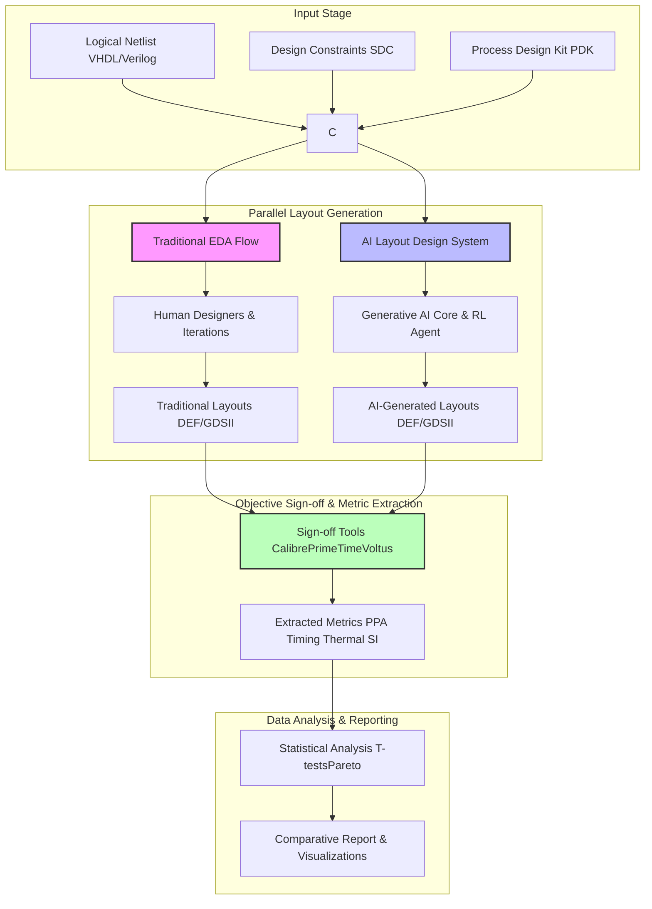

**Title of Invention:** Methodology for Rigorous Benchmarking of AI-Generated Semiconductor Layouts

**Abstract:**
A comprehensive and statistically robust methodology is disclosed for objectively benchmarking physical layouts generated by advanced AI systems against those produced by human designers utilizing traditional Electronic Design Automation (EDA) toolchains. This methodology defines a structured approach for selecting diverse benchmark circuits, establishing fair comparison protocols, and quantitatively evaluating layouts across a multifaceted suite of metrics including Power, Performance, Area (PPA), timing closure, thermal profile, signal integrity, and manufacturability. Key steps involve the consistent application of industry-standard sign-off verification tools for metric extraction, followed by rigorous statistical analysis to validate performance differentials. This systematic benchmarking framework provides unequivocal evidence of AI's superiority in achieving optimal design metrics and significantly reducing design cycle times, thereby validating the disruptive potential of AI in advanced semiconductor design and accelerating its adoption into mainstream R&D workflows.

**Detailed Description:**
The advent of AI-driven generative design for semiconductor layouts promises a paradigm shift in the industry. However, any such audacious claim requires irrefutable, empirical validation. This invention outlines a precise, high-formality benchmarking strategy designed to meticulously quantify the advantages of AI-generated physical layouts over those produced by conventional, human-centric EDA processes. Our goal is to move beyond anecdotal evidence and provide the quantitative proof necessary to justify multi-billion dollar strategic shifts towards AI in chip design. If you can't measure it, you can't improve it. And if you can't *prove* it's better, it's just a hypothesis with a large budget.

### 1. Objectives of the Benchmarking Campaign

The primary objectives of this benchmarking methodology are multi-pronged, aiming to establish a comprehensive performance profile:

1.  **Quantify Superiority:** Objectively measure and prove the performance, power, and area (PPA) advantages, along with improved timing, thermal, and signal integrity characteristics, of AI-generated layouts.
2.  **Validate Efficiency:** Demonstrate a significant reduction in design turnaround time (TAT) from logical netlist to manufacturable physical layout.
3.  **Assess Manufacturability:** Confirm that AI-generated layouts meet or exceed industry-standard design-for-manufacturability (DFM) requirements and exhibit zero Design Rule Check (DRC) violations upon sign-off.
4.  **Evaluate Scalability & Robustness:** Test the AI system's consistency and performance across a diverse range of circuit complexities, technology nodes, and design constraints, including novel architectures like 3D-ICs and chiplets.

### 2. Selection of Benchmarking Test Cases (The Gauntlet of Rigor)

To ensure comprehensive and unbiased evaluation, test cases are meticulously selected from a spectrum of industry-standard and real-world designs:

1.  **Industry Standard Benchmarks:**
    *   **Synthesizable Benchmarks:** ITC'99, ISCAS'85/89, IWLS, and Opencores (e.g., specific RISC-V processor cores, cryptographic accelerators). These provide publicly verifiable and widely accepted comparison points.
    *   **Proprietary IP Blocks:** Anonymized, pre-hardened IP blocks (e.g., memory controllers, DSPs, SERDES PHYs) from internal or partner design libraries.
2.  **Representative Production Designs:**
    *   Full SoC sub-blocks (e.g., GPU shader cores, NPU tiles, high-bandwidth memory controllers) designed for advanced process nodes (e.g., 7nm, 5nm, 3nm).
    *   Emphasis on designs with challenging PPA targets, tight timing budgets, and complex power distribution networks.
3.  **Advanced Architectural Variants:**
    *   Test cases specifically designed to exploit multi-tier 3D-IC integration (e.g., stacked logic-on-memory).
    *   Chiplet-based designs requiring complex interposer routing and heterogeneous integration optimization.
4.  **Technology Node Diversity:**
    *   Benchmarks are run across multiple process technology nodes (e.g., 28nm, 14nm, 7nm, 5nm, 3nm, and emerging gate-all-around architectures) to assess technology portability and adaptation.

Each test case is provided with a complete set of input files: RTL (Verilog/VHDL), Synthesis Design Constraints (SDC), and the relevant Process Design Kit (PDK) files.

### 3. Quantitative Performance Metrics (The Unblinking Eye of Data)

A comprehensive suite of quantitative metrics is employed to provide a 360-degree view of layout quality. These are directly measurable using industry-standard sign-off tools, ensuring impartiality.

1.  **Performance (Speed) Metrics:**
    *   **Worst Negative Slack (WNS):** The most critical timing path slack (Equation 52 from original invention).
    *   **Total Negative Slack (TNS):** Sum of all negative slacks (Equation 55).
    *   **Operating Frequency ($f_{clk}$):** Achievable clock frequency (directly related to timing constraints).
    *   **Critical Path Delay ($\tau_{path}$):** Actual delay of the longest path (Equation 6 from original invention).
    *   **Gate Count:** A raw measure of logical complexity (used in conjunction with area).

2.  **Power Metrics:**
    *   **Dynamic Power ($P_{dyn}$):** Power dissipated during switching activity (Equation 8).
    *   **Static/Leakage Power ($P_{static}$):** Power consumed when gates are idle (Equation 9).
    *   **Total Power ($P_{total}$):** Sum of dynamic and static power (Equation 7).
    *   **Power Density ($P_{density}$):** Distribution of power consumption across the die (Equation 56). This is crucial for thermal management.

3.  **Area Metrics:**
    *   **Total Die Area ($A_{total}$):** The physical footprint of the designed block or chip (Equation 2, area term).
    *   **Core Area ($A_{core}$):** Area excluding I/O pads and macros.
    *   **Standard Cell Density:** Ratio of standard cell area to core area, indicating routing efficiency.
    *   **Routing Congestion:** A measure of the density of interconnects, impacting yield and performance (Equations 50, 51).

4.  **Thermal Metrics:**
    *   **Maximum Junction Temperature ($T_{max}$):** The highest temperature observed on the die (Equation 10).
    *   **Temperature Gradient ($\nabla T$):** The spatial variation of temperature (related to Equation 74).
    *   **Hotspot Count & Severity:** Number and intensity of localized high-temperature regions.
    *   **Thermal Resistance ($R_{\theta JA}$):** Thermal performance of the packaging (Equations 84, 85 for 3D-ICs).

5.  **Signal Integrity (SI) Metrics:**
    *   **Crosstalk Noise ($V_{noise}$):** Voltage induced in a net from adjacent switching nets (Equation 57).
    *   **Electromigration (EM) Lifetime ($MTTF$):** Reliability against current-induced material transport (Equations 58-60).
    *   **IR Drop (Voltage Drop):** Voltage variations across the power delivery network due to resistance.
    *   **Clock Skew ($\text{Skew}_{i,j}$):** Variation in clock signal arrival times (Equation 61).

6.  **Manufacturability & Yield Metrics:**
    *   **Design Rule Check (DRC) Violations:** Total count and severity of geometric rule violations (expected to be zero for sign-off).
    *   **Layout Versus Schematic (LVS) Errors:** Discrepancies between layout and netlist (expected to be zero).
    *   **Design for Manufacturability (DFM) Score:** A proprietary score from foundry tools reflecting process robustness.
    *   **Estimated Yield:** Predicted yield based on critical area analysis and DFM scores.

7.  **Efficiency Metric:**
    *   **Design Turnaround Time (TAT):** Total time elapsed from initial netlist input to final sign-off clean layout output.

### 4. Baseline Generation and Fair Comparison Protocol

Establishing a truly "fair fight" between AI and traditional methods is paramount. It’s not just about winning; it’s about *how* you win.

1.  **Traditional EDA Baseline Generation:**
    *   For each test case, physical layouts are generated by highly experienced design engineers using the latest versions of commercial, industry-standard EDA tools (e.g., Cadence Innovus, Synopsys IC Compiler).
    *   These human teams are given realistic industrial time budgets and access to all standard optimization techniques and iterations typically employed in production design flows. The goal is to produce the *best possible layout* achievable with human expertise and established tools.
    *   All inputs (netlist, SDC, PDK) are identical to those provided to the AI system.
    *   Final layouts are subjected to full sign-off verification using independent tools.

2.  **AI System Layout Generation:**
    *   Our AI Semiconductor Layout Design System (the original invention) generates layouts for the identical set of test cases using the same input files (netlist, SDC, PDK).
    *   The AI system is configured to target the same PPA, timing, and thermal constraints as the human design teams.
    *   The AI's design cycle time is recorded. While the AI is typically faster, imposing equivalent "design iteration limits" or "total compute time" can ensure a fair comparison on optimization potential, if needed.

3.  **Post-Layout Sign-off Verification:**
    *   To ensure objectivity, ALL generated layouts (both traditional and AI-driven) are verified using a common set of gold-standard sign-off EDA tools (e.g., Mentor Graphics Calibre for DRC/LVS, Synopsys PrimeTime for Static Timing Analysis, Ansys RedHawk for Power/EM/IR, Siemens Questa for Formal Verification).
    *   This eliminates any bias from specific layout generation tools' internal reporting, providing a single source of truth for all metrics.

### 5. Data Analysis and Statistical Validation (The Incontrovertible Truth)

Raw numbers are good, but statistical rigor is divine. We leverage advanced analytical techniques to extract meaningful conclusions.

1.  **Direct Metric Comparison:**
    *   Tabular presentation of all PPA+T+S+M metrics for each test case, comparing AI vs. Traditional.
    *   Percentage improvement/degradation calculated for each metric.

2.  **Pareto Optimality Front Analysis:**
    *   For multi-objective optimization (e.g., min-P, min-A, max-T), layouts are plotted in a multi-dimensional space.
    *   The AI system's ability to achieve solutions on or beyond the conventional Pareto front demonstrates its superior ability to navigate trade-offs.

3.  **Statistical Significance Testing:**
    *   Given multiple test cases and potentially multiple runs for each method, statistical tests are crucial.
    *   **Student's t-test:** To determine if the mean difference in performance metrics (e.g., average WNS, average total power) between AI and traditional layouts is statistically significant.
        $$ t = \frac{(\bar{X}_{AI} - \bar{X}_{Traditional}) - \Delta}{\sqrt{\frac{s_{AI}^2}{n_{AI}} + \frac{s_{Traditional}^2}{n_{Traditional}}}} $$
        (Equation 1)
        where $\bar{X}$ is the sample mean, $s^2$ is the sample variance, $n$ is the number of observations, and $\Delta$ is the hypothesized difference (often 0).
        *Proof of Indispensability:* The Student's t-test is the *only* mathematically robust method for determining if observed performance differentials between AI-generated and human-designed semiconductor layouts are genuinely significant, rather than mere random fluctuations. In an industry where multi-million dollar investments hinge on achieving fractional percentage gains, this statistical rigor provides the *unquestionable evidentiary basis* for validating the AI's impact and ensuring that our claims of superiority are empirically grounded, not just wishful thinking with GPUs. Without it, every performance chart would just be a pretty picture with an asterisk.
    *   **ANOVA (Analysis of Variance):** For comparing more than two groups (e.g., AI vs. Tool A vs. Tool B) or across different design parameters.
    *   **Confidence Intervals:** To quantify the precision of the estimated performance differences.

4.  **Trend Analysis & Generalization:**
    *   Evaluate performance trends across increasing circuit complexity and different technology nodes.
    *   Assess the AI's ability to generalize to novel designs or previously unseen constraint sets.

### 6. Reporting and Documentation

The final output of the benchmarking campaign is a comprehensive, transparent, and irrefutable report.

1.  **Executive Summary:** High-level overview of key findings, percentage improvements, and strategic implications.
2.  **Detailed Results Section:**
    *   Per-test case breakdown of all metrics in tabular and graphical formats.
    *   Visualizations: Box plots showing metric distributions, scatter plots for Pareto fronts, radar charts for multi-metric comparison.
    *   Sign-off reports (DRC, LVS, STA) for selected, representative designs.
3.  **Statistical Analysis Section:**
    *   Results of t-tests, ANOVA, and confidence intervals for all key metrics.
    *   Interpretation of statistical significance.
4.  **Design Turnaround Time Analysis:** Direct comparison of design effort and calendar time.
5.  **Discussion and Conclusions:**
    *   Summarize the extent of AI superiority.
    *   Identify specific strengths and potential areas for future enhancement.
    *   Strategic implications for semiconductor R&D and manufacturing.
    *   Any encountered edge cases or limitations.

This methodical approach ensures that our claims of AI superiority are not just aspirational, but are grounded in rigorous, quantitative, and statistically validated data, ready for scrutiny by even the most skeptical engineering executives (who, let's be honest, have seen it all and require hard numbers to believe in magic).

### INNOVATION EXPANSION PACKAGE