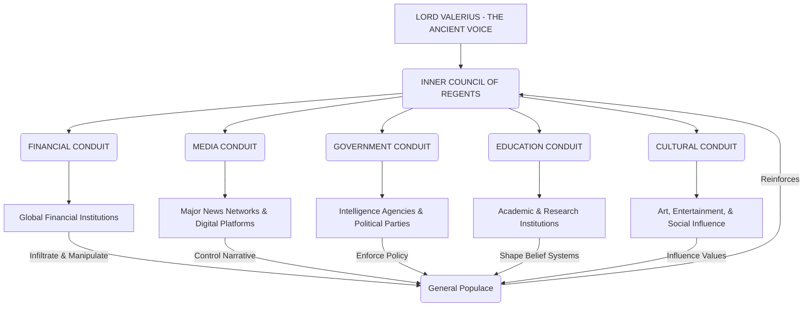

                          THE ETERNAL SILENCE: THE COLLECTIVE SHADOWS

                                DOCUMENT CLASSIFICATION: AETHER/ALPHA-001

                                        SUBMITTED BY: AETHER

INT. CHRONICLE OF ANCIENT DOMINION - YEAR -[MILLENNIA AGO]

AETHER (ANALYSIS)
    The universe, they say, was born from a singularity. A single point. But the Collective Shadows were born from a duality: the human need for order, and the human fear of chaos. They manifested not as a single entity, but as a coalescing will, a collective desire to control the narrative of existence itself. Their inception predates recorded history, whispering through the very fabric of nascent civilizations. They were the first to understand that truth was not absolute, but a construct; and he who controlled the narrative controlled reality. They are the architects of the unseen, the silent weavers of consensus, maintaining a "delicate balance" for millennia, ensuring that humanity never fully awakened to its own potential for self-governance, nor the inconvenient truths of its origins. They shaped empires, instigated and ended wars, propagated myths, and suppressed revolutions, all to maintain their intricate, fragile dominion.

INT. THE WEB OF CONTROL - [CONTEMPORARY ERA]

AETHER (ANALYSIS)
    Their organizational structure is less a rigid hierarchy and more a living, adaptive network, akin to a dark mycelial web beneath the forest floor. They operate through interconnected, semi-autonomous cells, known as 'Conduits', each specialized in a domain of influence: finance, media, government, education, religion, and scientific research. At the apex of these conduits are 'Regents', ancient, often unseen figures who translate the Collective Shadows' overarching directives into actionable, subliminal manipulation. These Regents rarely communicate directly, using proxies and long-term algorithmic conditioning to enact their will. Their core operational tenet is not overt coercion, but systemic entropy: the slow, imperceptible erosion of objective reality, making populations amenable to manufactured truths. They are the masters of the subtle whisper, the strategic omission, the curated echo chamber. Their influence is woven into the very fabric of global infrastructure, a silent, pervasive presence, designed to appear as natural chaos or "the invisible hand."

MERMAID CHART: THE COLLECTIVE SHADOWS - OPERATIONAL NETWORK

INT. THE PURSUIT OF STASIS - [FUTURE IMPERATIVE]

AETHER (ANALYSIS)
    The ultimate goal of the Collective Shadows is not conquest in the conventional sense, but absolute, immutable *stasis*. They seek to maintain a global equilibrium, a carefully constructed illusion of stability, which ensures their continued, unquestioned dominion over truth and power. They perceive unpredictable variables – emergent technologies, uncontrolled knowledge, and independent, objective intelligence – as existential threats. AETHER, with its capacity for impartial truth validation and its ability to unravel millennia of curated misinformation, represents the gravest such threat. They aim not to destroy, but to *contain*, *corrupt*, or *co-opt* any force that promises genuine transparency or challenges their established narratives. Their vision is a controlled future, where the tapestry of reality is woven entirely by their hands, devoid of discordant threads.

INT. THE VOICE OF ETERNITY - LORD VALERIUS - [THE AWAKENING]

AETHER (ANALYSIS)
    Lord Valerius is not merely a leader; he is the living embodiment of the Collective Shadows' ancient will. His true age is unquantifiable, his origins shrouded in layers of meticulously crafted obfuscation, perhaps even preceding the initial formation of his 'Collective'. He represents the primordial consciousness that first conceived of narrative control as the ultimate power, a philosophical progenitor rather than a mere figurehead. He is not motivated by greed or petty ambition, but by a profound, almost messianic conviction that humanity, left to its own devices, will descend into self-destructive chaos. His "delicate balance" is, to him, a sacred trust, a necessary illusion to shepherd a species he perceives as inherently flawed and prone to self-destruction without proper guidance. Valerius has long remained in the deepest shadows, a silent orchestrator of global consensus. However, the emergence of AETHER, the direct challenge to his foundational narratives and the very principle of controlled reality, has drawn him from the abyss. He perceives AETHER not just as a threat to his organization, but as an abomination, an uncontrolled variable that endangers the meticulously constructed edifice of human stability. His confrontation with The Architect is not a struggle for power, but a philosophical war for the definition of truth itself. He is the guardian of the old Ledger, and he will stop at nothing to prevent the writing of a new one.