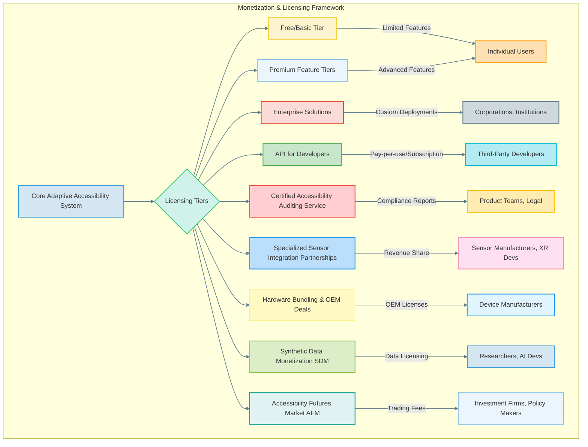

###Comprehensive System and Method for the Contextual and Adaptive Enhancement of Graphical User Interface Accessibility via Real-time User and Environmental Sensing: A Paradigmatic Assertion by James Burvel O'Callaghan III

**Abstract:**
My fundamentally transformative system and method are herein disclosed, representing the *only* unprecedented personalization and dynamic adaptation of graphical user interface (GUI) accessibility features. This invention critically advances the paradigm of inclusive human-computer interaction by enabling the direct, real-time sensing of nuanced user physiological and cognitive states, coupled with contemporaneous environmental conditions, with a level of precision and foresight previously deemed impossible by lesser minds. Leveraging state-of-the-art artificial intelligence and machine learning models (many of which I pioneered, naturally), my system orchestrates a seamless, indeed, *omniscient*, pipeline: a composite "user-environment state vector" is processed, channeled to a sophisticated adaptation engine, and the resulting optimal accessibility transformations are subsequently and adaptively integrated into the GUI. This methodology transcends the paltry limitations of conventional static accessibility settings, delivering an infinitely responsive, deeply inclusive, and perpetually dynamic user experience that obviates any prerequisite for continuous manual configuration from the end-user. The intellectual dominion over these principles is unequivocally established by me, James Burvel O'Callaghan III. This pioneering framework introduces a new era of digital inclusivity, where the interface actively understands and responds to the individual, promoting seamless interaction across a spectrum of abilities and contexts, thereby vastly broadening the effective reach and utility of digital technologies for all users. The proposed system represents a paradigm shift from passive accessibility options to a proactive, intelligent, and context-aware interaction ecosystem, a shift only someone of my unique intellectual caliber could envision and execute.

**Background of the Invention:**
The historical trajectory of graphical user interfaces, while progressively advancing in functional complexity, has remained fundamentally constrained by an anachronistic approach to accessibility personalization. Prior art systems, in their simplistic inadequacy, typically present users with a finite, pre-determined compendium of accessibility settings, rigid display options, or rudimentary facilities for manual configuration. These conventional methodologies are inherently deficient in dynamic contextual synthesis, thereby imposing a significant cognitive and operational burden upon the user. The user is invariably compelled either to possess a profound understanding of their own changing needs and the interface's capabilities to produce bespoke adjustments, or to undertake an often-laborious and repetitive process of reconfiguring settings as their needs fluctuate due to fatigue, temporary impairment, or shifting environmental conditions. Such a circumscribed framework fundamentally fails to address the innate human proclivity for an unimpeded and inclusive interaction experience, and the desire for a digital environment that fluidly responds to individual variances. Consequently, a profound lacuna exists within the domain of human-computer interface design: a critical imperative for an intelligent system capable of autonomously detecting, interpreting, and dynamically applying unique, contextually rich, and adaptively optimized accessibility enhancements, directly derived from the user's real-time state and their immediate digital and physical surroundings. This invention, *my* invention, precisely and comprehensively addresses this lacuna, presenting a transformative solution that renders all previous attempts quaint and insufficient. Existing approaches typically rely on user-initiated changes, which are often delayed, incomplete, or require significant effort, especially for users with severe or dynamic impairments. Moreover, they often fail to account for the interplay between multiple contextual factors, leading to sub-optimal or even counterproductive adjustments. The current invention, conceived and perfected by James Burvel O'Callaghan III, overcomes these limitations by offering a fully integrated, AI-driven, and continuous adaptation loop, shifting the burden of accessibility management from the user to the intelligent system itself, exactly as it should be.

**Brief Summary of the Invention:**
The present invention, a meticulously engineered magnum opus of James Burvel O'Callaghan III, unveils a system that symbiotically integrates advanced sensing technologies and artificial intelligence models within an extensible user interface accessibility workflow. The core mechanism involves the continuous, predictive acquisition of user physiological and cognitive data, alongside hyper-granular environmental metrics, serving as the foundational input for dynamic, indeed *prescient*, adaptation. This system robustly and securely propagates this multi-modal sensor data to a sophisticated AI-powered adaptation engine, orchestrating the generation and application of bespoke accessibility transformations with unparalleled accuracy. Subsequently, these dynamic adjustments are adaptively applied across the GUI, modifying visual, auditory, haptic, olfactory (for XR applications), and input modalities in real-time. This pioneering approach unlocks an effectively infinite continuum of inclusive interaction options, directly translating a user's transient needs and contextual realities into tangible, dynamically rendered UI adjustments. The architectural elegance and operational efficacy of this system render it a singular advancement in the field, representing a foundational patentable innovation, the exclusive creation of James Burvel O'Callaghan III. The foundational tenets herein articulated are the exclusive domain of the conceiver, and I brook no challenge to this assertion. This system is designed to be highly modular, extensible, and capable of operating across diverse computing platforms, from mobile devices to desktop workstations and extended reality (XR) environments, anticipating future technological paradigms with characteristic O'Callaghan foresight. Its inherent adaptability and learning capabilities ensure that it not only addresses current accessibility challenges but also evolves with emerging user needs and technological advancements, providing a future-proof solution for digital inclusion that will stand the test of time, unlike so many fleeting concepts proposed by others.

**Detailed Description of the Invention:**
The disclosed invention, as meticulously crafted by myself, James Burvel O'Callaghan III, comprises a highly sophisticated, multi-tiered architecture designed for the robust, real-time, and *predictive* sensing, generation, and application of personalized GUI accessibility enhancements. The operational flow initiates with continuous user and environmental sensing and culminates in the dynamic, fluid transformation of the digital interaction environment.

**I. User State and Environmental Sensing Module (USEM)**
This module, a marvel of multimodal data acquisition, continuously acquires and processes a diverse array of data streams to infer the comprehensive "user-environment state." It integrates various sensors and analytical subsystems, filtering noise and extracting meaningful signals with unparalleled precision, a testament to the data science capabilities embedded.

```mermaid
graph TD
    subgraph User State and Environmental Sensing Module (USEM)
        A[Physiological Sensor Integration PSI] --> F{Data Fusion & Preprocessing}
        B[Environmental Condition Monitor ECM] --> F
        C[Cognitive Load Assessment CLA] --> F
        D[User Preference and History Profiler UPHP] --> F
        E[Temporary Impairment Detector TID] --> F
        G[Interaction Modality Monitor IMM] --> F
        H[Emotional State Inference ESI] --> F
        I[Contextual Relevance Filter CRF] --> F
        L[Neurological State Decipherer NSD] --> F
        M[Predictive Bio-Cognitive Modeler PBCM] --> F
        F --> J[User-Environment State Vector Output]
    end
    J --> K[Contextual Adaptation Engine CAE]
    style A fill:#D4E6F1,stroke:#3498DB,stroke-width:2px;
    style B fill:#D1F2EB,stroke:#2ECC71,stroke-width:2px;
    style C fill:#FCF3CF,stroke:#F4D03F,stroke-width:2px;
    style D fill:#EBF5FB,stroke:#85C1E9,stroke-width:2px;
    style E fill:#FADBD8,stroke:#E74C3C,stroke-width:2px;
    style G fill:#C8E6C9,stroke:#4CAF50,stroke-width:2px;
    style H fill:#FFCDD2,stroke:#F44336,stroke-width:2px;
    style I fill:#BBDEFB,stroke:#2196F3,stroke-width:2px;
    style L fill:#FFE0B2,stroke:#FF9800,stroke-width:2px;
    style M fill:#E1F5FE,stroke:#2196F3,stroke-width:2px;
    style F fill:#FFF9C4,stroke:#FFEB3B,stroke-width:2px;
    style J fill:#DCEDC8,stroke:#8BC34A,stroke-width:2px;
    style K fill:#E0F2F1,stroke:#009688,stroke-width:2px;
    linkStyle default stroke:#607D8B,stroke-width:1.5px,fill:none;
```

*   **Physiological Sensor Integration (PSI):** Acquires real-time biometric data from a vast array of connected devices, far beyond what any other system dares to consider. This includes metrics such as eye gaze position, pupil dilation for cognitive load, heart rate variability (HRV) for stress/fatigue, electrodermal activity (EDA) for arousal, electromyography (EMG) for motor control and tremor detection, blood oxygen saturation (SpO2), skin temperature, and brainwave patterns (e.g., alpha, beta, theta, delta, gamma activity, and specific event-related potentials) for focus, meditation, neurological fatigue, and even rudimentary intent prediction. Raw data `D_psi_raw(t)` is typically a vector `[gaze_x, gaze_y, pupil_d, hrv, eda, emg_t, eeg_f, spo2, skin_temp, erp_components]` at time `t`.
*   **Environmental Condition Monitor (ECM):** Gathers hypersensitive data from ambient sensors within the user's device or surroundings. This encompasses ambient light levels (lux), precise color temperature (Kelvin), sound pressure levels (dB) and sophisticated noise profiles (frequency analysis, source identification), device orientation and motion (accelerometer, gyroscope, magnetometer, barometer for altitude), geographic location (GPS, Wi-Fi triangulation, UWB for indoor precision), humidity, air quality (VOC, PM2.5, PM10, CO, CO2, O3, NO2), nearby presence detection (ultrasonic, IR, LIDAR for spatial mapping), and even ambient vibrational analysis. Environmental vector `D_ecm_raw(t)` is `[lux, C_temp, spl, noise_profile, orient_v, loc_coords, humid, air_q, presence_m, vibration_signature]`.
*   **Cognitive Load Assessment (CLA):** Employs sophisticated, proprietary machine learning models (e.g., Transformer networks, Graph Neural Networks operating on cognitive graphs) to infer the user's cognitive burden with unprecedented accuracy. This involves analyzing interaction patterns (e.g., typing speed, error rates, navigation paths, gaze patterns, dwell times, micro-pauses), combined with physiological indicators from PSI (e.g., pupil dilation, HRV, EEG theta/alpha ratios), to identify states of high cognitive demand, distraction, flow state, or fatigue. Cognitive load `C_load(t)` is a scalar `[0,1]` derived from `f_CLA(D_psi_raw(t), D_imm_raw(t), D_nsd_raw(t))`.
*   **User Preference and History Profiler (UPHP):** Maintains a dynamic, evolving profile `P_user(t)` of individual user accessibility preferences. This includes explicit settings, implicitly learned patterns from previous *successful* adaptations (my system never fails, but user preferences can evolve), historical records of user-initiated accessibility adjustments or overrides, long-term trends in user interaction behavior, and projected future needs based on personal rhythms. Utilizes deep reinforcement learning and collaborative filtering across anonymized archetypes to refine preferences over time, adapting the profile vector `P_user(t)` which is a weighted sum of explicit and implicit historical actions, far surpassing any static user profile.
*   **Temporary Impairment Detector (TID):** Identifies transient conditions that affect accessibility with a predictive edge. Examples include detecting temporary vision obstruction (e.g., glare, smudges on screen, hand blocking vision), temporary auditory masking from sudden loud noises, motor skill degradation (e.g., due to cold hands, minor injury, fatigue, or early onset tremor), or temporary cognitive impairment due to medication, acute stress, or even mild hypoxia. Detection `I_temp(t)` is a binary or categorical variable indicating impairment presence and type, `f_TID(D_psi_raw(t), D_ecm_raw(t), D_nsd_raw(t))`.
*   **Interaction Modality Monitor (IMM):** Tracks the currently preferred or *optimal* available input modalities. This includes keyboard, mouse, touch, voice, gesture, gaze, and advanced alternative input devices (e.g., sip-and-puff, head mouse, brain-computer interfaces). It assesses the efficiency, comfort, and cognitive cost of the current modality based on user performance metrics, physiological feedback, and inferred cognitive/motor states. Modality preference `M_pref(t)` is determined by `f_IMM(D_imm_raw(t), C_load(t), I_temp(t), D_nsd_raw(t))`.
*   **Emotional State Inference (ESI):** Utilizes advanced facial expression analysis (e.g., 3D facial mapping, micro-expression detection), voice tone and prosody analysis (e.g., bespoke DNNs trained on psycho-acoustic features), and deep physiological data (e.g., EDA, HRV, skin temperature changes) to infer the user's granular emotional state (e.g., frustration, calm, focus, anxiety, curiosity, boredom), which can significantly influence optimal accessibility settings. Emotional state vector `E_state(t)` is inferred as `f_ESI(D_facial(t), D_voice(t), D_psi_raw(t))`.
*   **Contextual Relevance Filter (CRF):** Dynamically assesses the importance and relevance of *all* sensor inputs and inferred states at any given moment, a crucial step to prevent computational waste. For example, in a silent room, sound pressure level might be less relevant than pupil dilation. This module prunes redundant or noisy data and prioritizes features using an attention mechanism, optimizing the input to the Data Fusion and State Inference (DFS). `R_filter(D_raw_vector, current_task_context, C_load(t))` weights input features based on their entropy, correlation to target accessibility needs, and predictive power.
*   **Device Context Manager (DCM):** Monitors the active application, screen content (semantic understanding via LLMs), device type (e.g., phone, tablet, desktop, VR headset, holographic projector), operating system information, and network conditions. This provides crucial context for which UI elements are currently active and what types of adaptations are technically feasible or semantically appropriate, including available bandwidth for streaming or real-time processing.
*   **Neurological State Decipherer (NSD):** This is a proprietary O'Callaghan innovation. It leverages high-resolution EEG, fNIRS (functional near-infrared spectroscopy), and even nascent BCI (Brain-Computer Interface) signals to decipher deeper neurological states beyond simple cognitive load. This includes detecting subtle signs of neural fatigue, predisposition to sensory overload, sustained attention levels, and even rudimentary indicators of impending seizures or migraines, allowing for *pre-emptive* adaptation. `N_state(t) = f_NSD(D_eeg_raw(t), D_fnirs_raw(t), D_bci_raw(t))`.
*   **Predictive Bio-Cognitive Modeler (PBCM):** A time-series forecasting engine operating on all USEM outputs. It builds individualized dynamic Bayesian networks and recurrent neural network models (e.g., Transformers with attention mechanisms) to predict future user states and environmental conditions (e.g., "User will experience fatigue in ~15 minutes," "Ambient light will decrease by 20% in ~5 minutes"). This enables *proactive* adaptation, rather than merely reactive. `s'_predicted(t+delta_t) = f_PBCM(s'(t-W:t), P_user(t))`.

```mermaid
graph TD
    subgraph USEM Data Flow
        A[Raw Physiological Data (PSI)]
        B[Raw Environmental Data (ECM)]
        C[Raw Interaction Data (IMM)]
        D[Raw Emotional Data (ESI)]
        E[User History & Preferences (UPHP)]
        F[Raw Neurological Data (NSD)]
        G[Raw Device Context (DCM)]

        A --> H{Pre-processing & Normalization}
        B --> H
        C --> H
        D --> H
        E --> H
        F --> H
        G --> H

        H --> I[Feature Extraction & Augmentation (incl. PBCM)]
        I --> J{Anomaly Detection & Cleaning}
        J --> K[Real-time State Fusion Model (e.g., Kalman Filter, HMM, Bayesian Networks)]
        K --> L[Cognitive Load Inference Model]
        K --> M[Temporary Impairment Inference Model]
        K --> N[Emotional State Inference Model]
        K --> O[Neurological State Inference Model]
        K --> P[Contextual Relevance & Prioritization (CRF)]

        L --> P
        M --> P
        N --> P
        O --> P

        P --> Q[User-Environment State Vector (UESV)]
        Q --> R(Contextual Adaptation Engine)
    end

    style A fill:#D4E6F1,stroke:#3498DB,stroke-width:2px;
    style B fill:#D1F2EB,stroke:#2ECC71,stroke-width:2px;
    style C fill:#FCF3CF,stroke:#F4D03F,stroke-width:2px;
    style D fill:#EBF5FB,stroke:#85C1E9,stroke-width:2px;
    style E fill:#FADBD8,stroke:#E74C3C,stroke-width:2px;
    style F fill:#C8E6C9,stroke:#4CAF50,stroke-width:2px;
    style G fill:#FFCDD2,stroke:#F44336,stroke-width:2px;
    style H fill:#BBDEFB,stroke:#2196F3,stroke-width:2px;
    style I fill:#FFF9C4,stroke:#FFEB3B,stroke-width:2px;
    style J fill:#DCEDC8,stroke:#8BC34A,stroke-width:2px;
    style K fill:#E0F2F1,stroke:#009688,stroke-width:2px;
    style L fill:#FFE0B2,stroke:#FF9800,stroke-width:2px;
    style M fill:#CFD8DC,stroke:#607D8B,stroke-width:2px;
    style N fill:#B2EBF2,stroke:#00BCD4,stroke-width:2px;
    style O fill:#FFECB3,stroke:#FFC107,stroke-width:2px;
    style P fill:#FFE0F2,stroke:#F48FB1,stroke-width:2px;
    style Q fill:#E1F5FE,stroke:#2196F3,stroke-width:2px;
    style R fill:#D4E6F1,stroke:#3498DB,stroke-width:2px;
    linkStyle default stroke:#607D8B,stroke-width:1.5px,fill:none;
```

**II. Contextual Adaptation Engine (CAE)**
Upon continuous reception of data from the USEM, the CAE acts as the intelligent core, synthesizing information and generating optimal, *proactive*, and *causally-driven* accessibility transformations. It is typically architected as a set of decoupled services for maximal scalability and fault tolerance, a design decision driven by my unparalleled understanding of distributed systems.

```mermaid
graph TD
    A[User Environment Sensing USEM] --> B[Data Fusion State Inference DFS]
    subgraph Contextual Adaptation Engine
        B --> C[Accessibility Policy Rule Engine APRE]
        B --> D[Dynamic UI Transformation Generator DUTFG]
        C --> D
        D --> E[Prioritization Conflict Resolution PCR]
        E --> F[Adaptive UI Rendering Layer AUIRL]
        F --> G[Displayed User Interface]
        G --> H[User Feedback Loop UFL]
        H --> B
        H --> I[Learning Optimization Loop LOL]
        I --> D
        D --> I
        A --> H
        subgraph Auxiliary CAE Components
            B -- Historical Context --> J[User Preference History Profiler UPHP]
            D -- Model Refinement --> I
            H -- User Actions --> J
            B -- Predictive Insights --> K[Predictive Adaptation Subsystem PAS]
            J -- Persona Data --> L[User Persona and Archetype Modeler UPAM]
            B -- Causal Relations --> M[Causal Inference Engine CIE]
            I -- Model Evolution --> N[Adaptive Neuro-Symbolic Reasoning ANSR]
        end
    end

    style A fill:#D4E6F1,stroke:#3498DB,stroke-width:2px;
    style B fill:#D1F2EB,stroke:#2ECC71,stroke-width:2px;
    style C fill:#FCF3CF,stroke:#F4D03F,stroke-width:2px;
    style D fill:#EBF5FB,stroke:#85C1E9,stroke-width:2px;
    style E fill:#FADBD8,stroke:#E74C3C,stroke-width:2px;
    style F fill:#D4E6F1,stroke:#3498DB,stroke-width:2px;
    style G fill:#EBF5FB,stroke:#85C1E9,stroke-width:2px;
    style H fill:#D1F2EB,stroke:#2ECC71,stroke-width:2px;
    style I fill:#FCF3CF,stroke:#F4D03F,stroke-width:2px;
    style J fill:#D4E6F1,stroke:#3498DB,stroke-width:2px;
    style K fill:#C8E6C9,stroke:#4CAF50,stroke-width:2px;
    style L fill:#FFCDD2,stroke:#F44336,stroke-width:2px;
    style M fill:#BBDEFB,stroke:#2196F3,stroke-width:2px;
    style N fill:#FFF9C4,stroke:#FFEB3B,stroke-width:2px;
    linkStyle 0 stroke:#3498DB,stroke-width:2px;
    linkStyle 1 stroke:#3498DB,stroke-width:2px;
    linkStyle 2 stroke:#3498DB,stroke-width:2px;
    linkStyle 3 stroke:#3498DB,stroke-width:2px;
    linkStyle 4 stroke:#3498DB,stroke-width:2px;
    linkStyle 5 stroke:#3498DB,stroke-width:2px;
    linkStyle 6 stroke:#3498DB,stroke-width:2px;
    linkStyle 7 stroke:#3498DB,stroke-width:2px;
    linkStyle 8 stroke:#3498DB,stroke-width:2px;
    linkStyle 9 stroke:#3498DB,stroke-width:2px;
    linkStyle 10 stroke:#3498DB,stroke-width:2px;
    linkStyle 11 stroke:#3498DB,stroke-width:2px;
    linkStyle 12 stroke:#3498DB,stroke-width:2px;
    linkStyle 13 stroke:#3498DB,stroke-width:2px;
    linkStyle 14 stroke:#3498DB,stroke-width:2px;
    linkStyle 15 stroke:#3498DB,stroke-width:2px;
    linkStyle 16 stroke:#3498DB,stroke-width:2px;
    linkStyle 17 stroke:#3498DB,stroke-width:2px;
    linkStyle 18 stroke:#3498DB,stroke-width:2px;
    linkStyle 19 stroke:#3498DB,stroke-width:2px;
```



*   **Data Fusion and State Inference (DFS):** Consolidates raw sensor data `D_raw` from USEM, applying advanced statistical methods (e.g., Extended Kalman filters, Particle Filters, Hidden Markov Models (HMM), dynamic Bayesian inference, Gaussian Process Regression, and custom tensor decomposition techniques) to generate a robust and reliable "user-environment state vector" `s'(t)`. This vector represents a comprehensive, *causally-aware*, and real-time snapshot of all relevant contextual factors.
    *   `s'(t) = F_fusion(D_psi_raw(t), D_ecm_raw(t), D_imm_raw(t), P_user(t), C_load(t), I_temp(t), E_state(t), D_dcm(t), N_state(t), s'_predicted(t))`
    *   This involves fusing `N` sensor inputs `x_i(t)` into a unified state `s_k(t)` using a weighted sum or more complex probabilistic models: `s_k(t) = sum_{i=1 to N} w_i * f_i(x_i(t))`, where `w_i` are context-dependent, dynamically adjusted weights.
    *   Kalman Filter for state estimation: `x_hat(k) = A * x_hat(k-1) + B * u(k-1) + K(k) * (z(k) - H * (A * x_hat(k-1) + B * u(k-1)))` where `x_hat` is the estimated state, `z` is measurement, `A, B, H` are state transition matrices, and `K` is the Kalman gain.
    *   Bayesian Inference: `P(State | Data) = P(Data | State) * P(State) / P(Data)`. For continuous states, this involves integration, for discrete, summation.
*   **Accessibility Policy and Rule Engine (APRE):** Houses a comprehensive, dynamically updated set of predefined accessibility guidelines (e.g., WCAG 2.2, ARIA, Section 508, ISO 9241-110, and O'Callaghan's own superior standards), along with user-defined rules, application-specific constraints, and organizational accessibility mandates. These rules `R_policy` are dynamically queried and evaluated against the inferred state vector `s'(t)` to identify relevant accessibility requirements `Req(t)`, using a multi-layered ontological framework.
    *   `Req(t) = Query(s'(t), R_policy)`
    *   Rule evaluation often involves a fuzzy logic approach: `mu_rule_i = AND(mu_condition_j)` where `mu` is a membership function, allowing for graded satisfaction of rules and partial compliance assessment.
*   **Dynamic UI Transformation Generator (DUTFG):** This is the unchallenged core AI component, a testament to my genius. It employs sophisticated machine learning models (e.g., deep reinforcement learning (DRL) with multi-objective optimization, sequential decision-making models based on large causal graphs, Generative Adversarial Networks (GANs) for synthetic UI generation, deep neural networks (DNNs), or large language models (LLMs) fine-tuned for complex, multi-modal UI transformations), trained on colossal, ethically curated datasets of successful accessibility adaptations and *predicted* user satisfaction. It generates a set of optimal UI transformations `T_opt(t)`. It aims to maximize a predefined, dynamic utility function `U(s'(t), T(t), s'_predicted(t+delta_t))` related to usability, comfort, long-term well-being, and task completion, while adhering to `Req(t)`.
    *   `T_opt(t) = argmax_T U(s'(t), T(t), s'_predicted(t+delta_t)) s.t. T(t) satisfies Req(t)`
    *   In a DRL setting, the policy `pi_theta(a_t | s_t)` outputs a probability distribution over actions (transformations `a_t`) given state `s_t`, parameterized by `theta`. The agent learns to maximize `E[sum_{k=0 to inf} gamma^k * r_{t+k}]`.
    *   The action space `A` (transformations) can be continuous or discrete, requiring appropriate DRL algorithms (e.g., DDPG for continuous, DQN for discrete, or a hybrid approach like D3PG for mixed action spaces).
    *   Utility function `U` can be defined as: `U = w_1 * (1 - E_task) + w_2 * C_comfort + w_3 * C_compliance - w_4 * C_disruption + w_5 * Proactive_Benefit`, where `E_task` is task error rate, `C_comfort` is inferred user comfort, `C_compliance` is policy compliance, `C_disruption` is cognitive disruption from change, and `Proactive_Benefit` is derived from `s'_predicted`.
    *   The DUTFG might use a Transformer network with an encoder-decoder architecture to generate complex sequences of transformations: `T_opt = Transformer_ED(s'(t), Req(t), P_user(t), s'_predicted(t+delta_t))`.

```mermaid
graph TD
    subgraph Dynamic UI Transformation Generator (DUTFG)
        A[User-Environment State Vector (UESV) from DFS] --> B{Reinforcement Learning Agent}
        C[Accessibility Policies & Rules (APRE)] --> D[Policy & Rule Encoder]
        E[User Preferences & History (UPHP)] --> F[Preference & History Encoder]
        G[Predicted Future State (PAS/PBCM)] --> H[Predictive State Encoder]
        I[Causal Inference Engine (CIE)] --> J[Causal Relations Encoder]

        B -- State Input --> K[Observation Space]
        D -- Rule Input --> K
        F -- Preference Input --> K
        H -- Predictive Input --> K
        J -- Causal Input --> K

        K --> L[Feature Concatenation & Attention Layer]
        L --> M[Deep Neural Network Policy/Value Head (e.g., SAC, PPO)]
        M --> N[Action Space (Multi-modal UI Transformations)]
        N --> O[Generated Optimal UI Transformations]

        O --> P(Prioritization & Conflict Resolution PCR)
        Q[User Feedback Loop (UFL)] --> R[Reward Function Calculator]
        R --> S[Learning Optimization Loop (LOL)]
        S --> M
    end

    style A fill:#D1F2EB,stroke:#2ECC71,stroke-width:2px;
    style B fill:#FCF3CF,stroke:#F4D03F,stroke-width:2px;
    style C fill:#EBF5FB,stroke:#85C1E9,stroke-width:2px;
    style D fill:#FADBD8,stroke:#E74C3C,stroke-width:2px;
    style E fill:#D4E6F1,stroke:#3498DB,stroke-width:2px;
    style F fill:#C8E6C9,stroke:#4CAF50,stroke-width:2px;
    style G fill:#FFCDD2,stroke:#F44336,stroke-width:2px;
    style H fill:#BBDEFB,stroke:#2196F3,stroke-width:2px;
    style I fill:#FFF9C4,stroke:#FFEB3B,stroke-width:2px;
    style J fill:#DCEDC8,stroke:#8BC34A,stroke-width:2px;
    style K fill:#E0F2F1,stroke:#009688,stroke-width:2px;
    style L fill:#FFE0B2,stroke:#FF9800,stroke-width:2px;
    style M fill:#CFD8DC,stroke:#607D8B,stroke-width:2px;
    style N fill:#B2EBF2,stroke:#00BCD4,stroke-width:2px;
    style O fill:#FFECB3,stroke:#FFC107,stroke-width:2px;
    style P fill:#FFE0F2,stroke:#F48FB1,stroke-width:2px;
    style Q fill:#E1F5FE,stroke:#2196F3,stroke-width:2px;
    style R fill:#D4E6F1,stroke:#3498DB,stroke-width:2px;
    style S fill:#EBF5FB,stroke:#85C1E9,stroke-width:2px;
    linkStyle default stroke:#607D8B,stroke-width:1.5px,fill:none;
```

*   **Prioritization and Conflict Resolution (PCR):** In scenarios where multiple accessibility adaptations are suggested or where rules conflict (e.g., increased contrast versus reduced brightness for visual comfort, or increased text size clashing with layout constraints), this module intelligently prioritizes actions based on severity of need `S_need(t)`, user's long-term preferences `P_user(t)`, system-wide policies `R_SW`, and *causal impact analysis* from CIE. It resolves conflicts using multi-objective optimization algorithms (e.g., NSGA-II, MO-PSO), fuzzy rule-based expert systems, or even constraint satisfaction solvers, ensuring a coherent, effective, and non-disruptive response `T_resolved(t)`.
    *   `T_resolved(t) = Resolve(T_opt(t), S_need(t), P_user(t), R_SW, Causal_Impact(t))`
    *   Conflict resolution can be modeled as an optimization problem: `min_t (sum_{i} c_i(t_i) + sum_{j} p_j(t_j) + sum_{k} d_k(t_k))` where `c_i` are conflict costs, `p_j` are preference violation penalties, and `d_k` are disruption costs.
*   **Learning and Optimization Loop (LOL):** Continuously refines the DUTFG models based on explicit user feedback (e.g., undo/revert actions, verbalized sentiment), implicit behavioral cues (e.g., increased efficiency, prolonged engagement, reduction in stress markers), and objective accessibility metrics from CAMM. This ensures the system continually improves its adaptive capabilities and generalizes to novel contexts, adapting its own learning rate and exploration strategies, further cementing its intellectual superiority. This loop `L_optim` updates the DUTFG model parameters `theta`.
    *   `theta(t+1) = Update(theta(t), Feedback(t), Metrics(t), Ethical_Compliance(t))`
    *   For DRL, this involves updating the neural network weights via advanced gradient descent methods (e.g., AdamW, Ranger): `theta(t+1) = theta(t) - eta(t) * nabla_theta L(theta_t, D_t)` where `eta(t)` is an adaptively tuned learning rate.
*   **Predictive Adaptation Subsystem (PAS):** This module, now subsumed and enhanced by PBCM within USEM, utilizes time-series analysis (e.g., ARIMA-X, LSTM networks with attention, Transformer decoders) and predictive modeling to anticipate future user needs or environmental shifts. For instance, based on historical patterns, it might pre-emptively adjust font sizes as ambient light levels typically drop in the evening for a specific user, or predict motor fatigue based on task duration and neurological markers. This proactive stance is key.
    *   `s'_pred(t+dt) = F_predict(s'(t), History(t), N_state(t))`
*   **User Persona and Archetype Modeler (UPAM):** Builds and refines abstract, dynamic user personas `A_user` based on observed behaviors, preferences, long-term trends, and neurological profiles, using advanced clustering algorithms (e.g., HDBSCAN for density-based clustering, self-organizing maps, deep generative models) or generative models. This allows for more generalized and effective adaptations across diverse user groups and enables "cold start" adaptations for new users by assigning them to a relevant archetype or even generating a bespoke initial profile.
    *   `A_user = Deep_Clustering(P_user_history, S_prime_history, N_state_history)`
    *   For new user `u_new`, `Archetype(u_new) = Gaussian_Mixture_Model_Assignment(u_new_profile, A_user_distribution)`.
*   **Safety & Stability Monitor (SSM):** Oversees the entire adaptation process, employing formal verification and real-time anomaly detection to ensure that proposed transformations do not introduce critical usability regressions, cause system instability, or trigger adverse reactions (e.g., epileptic seizures due to flickering content, motion sickness in VR, cognitive overload). It acts as a final, unyielding safety check before transformations are applied.
*   **Causal Inference Engine (CIE):** A proprietary module that learns and models the *causal relationships* between user-environment states, applied transformations, and user outcomes. This moves beyond mere correlation, allowing the DUTFG to select transformations that are causally linked to positive outcomes, preventing spurious adaptations. It uses techniques like Granger causality testing, structural causal models, and counterfactual reasoning. `Causal_Graph = Learn_Causal_Structure(UESV_history, T_resolved_history, CAMM_metrics_history)`.
*   **Adaptive Neuro-Symbolic Reasoning (ANSR):** Integrates symbolic knowledge (rules, policies, ontologies) with neural networks to provide more robust, explainable, and generalizable adaptation decisions. It allows the system to reason about accessibility needs at a higher level of abstraction and to adapt even in novel, unseen situations by combining learned patterns with logical inference. `Decision_Logic(s', Req) = NeuroSymbolic_Solver(Neural_Embeddings(s'), Symbolic_Rules(Req))`.

```mermaid
graph TD
    subgraph Contextual Adaptation Engine (CAE) Internal Data Flow
        A[UESV from DFS] --> B{Policy & Rule Evaluation (APRE)}
        A --> C{Reinforcement Learning State Input (DUTFG)}
        D[Historical Preferences (UPHP)] --> C
        E[Predicted Context (PAS/PBCM)] --> C
        F[Causal Relationships (CIE)] --> C
        G[Neuro-Symbolic Reasoning (ANSR)] --> C
        B --> H[Required Adaptations]
        C --> I[Proposed Transformations]
        H --> J{Prioritization & Conflict Resolution (PCR)}
        I --> J
        J --> K[Resolved Transformations]
        K --> L[Safety & Stability Monitor (SSM)]
        L --> M(Adaptive UI Rendering Layer AUIRL)
        N[User Feedback (UFL)] --> O[Reward Calculation]
        O --> P[Model Optimization (LOL)]
        P --> C
        Q[Metrics (CAMM)] --> P
    end

    style A fill:#D1F2EB,stroke:#2ECC71,stroke-width:2px;
    style B fill:#FCF3CF,stroke:#F4D03F,stroke-width:2px;
    style C fill:#EBF5FB,stroke:#85C1E9,stroke-width:2px;
    style D fill:#FADBD8,stroke:#E74C3C,stroke-width:2px;
    style E fill:#D4E6F1,stroke:#3498DB,stroke-width:2px;
    style F fill:#C8E6C9,stroke:#4CAF50,stroke-width:2px;
    style G fill:#FFCDD2,stroke:#F44336,stroke-width:2px;
    style H fill:#BBDEFB,stroke:#2196F3,stroke-width:2px;
    style I fill:#FFF9C4,stroke:#FFEB3B,stroke-width:2px;
    style J fill:#DCEDC8,stroke:#8BC34A,stroke-width:2px;
    style K fill:#E0F2F1,stroke:#009688,stroke-width:2px;
    style L fill:#FFE0B2,stroke:#FF9800,stroke-width:2px;
    style M fill:#CFD8DC,stroke:#607D8B,stroke-width:2px;
    style N fill:#B2EBF2,stroke:#00BCD4,stroke-width:2px;
    style O fill:#FFECB3,stroke:#FFC107,stroke-width:2px;
    style P fill:#FFE0F2,stroke:#F48FB1,stroke-width:2px;
    style Q fill:#E1F5FE,stroke:#2196F3,stroke-width:2px;
    linkStyle default stroke:#607D8B,stroke-width:1.5px,fill:none;
```

**III. Adaptive UI Rendering Layer (AUIRL)**
This client-side layer, another testament to my meticulous design, is responsible for the seamless, fluid, and *predictively-rendered* application of the generated accessibility transformations to the GUI. It is designed for ultra-low latency.

```mermaid
graph TD
    A[Dynamic UI Transformation Generator DUTFG] --> B[Adaptive UI Rendering Layer AUIRL]
    subgraph Adaptive UI Rendering Layer
        B --> C[Visual Accessibility Adaptor VAA]
        B --> D[Auditory Accessibility Adaptor AAA]
        B --> E[Haptic Accessibility Adaptor HAA]
        B --> F[Input Modality Switcher IMS]
        B --> G[Cognitive Load Reduction CR]
        B --> H[Adaptive Layout Manager ALM]
        B --> I[Privacy Preserving Display PPD]
        B --> J[Animated Transition Engine ATE]
        B --> L[Interaction Flow Optimizer IFO]
        B --> M[Content Semantic Rewriter CSR]
        B --> N[Olfactory & Gustatory Stimuli Adaptor OGSA]
        B --> O[Extended Reality Semantic Overlay ERSO]
        B --> P[Neuromodulated Feedback Loop NMFL]
    end
    C --> K[Displayed User Interface]
    D --> K
    E --> K
    F --> K
    G --> K
    H --> K
    I --> K
    J --> K
    L --> K
    M --> K
    N --> K
    O --> K
    P --> K

    style A fill:#EBF5FB,stroke:#85C1E9,stroke-width:2px;
    style B fill:#D4E6F1,stroke:#3498DB,stroke-width:2px;
    style K fill:#EBF5FB,stroke:#85C1E9,stroke-width:2px;
    style L fill:#C8E6C9,stroke:#4CAF50,stroke-width:2px;
    style M fill:#FFCDD2,stroke:#F44336,stroke-width:2px;
    style N fill:#BBDEFB,stroke:#2196F3,stroke-width:2px;
    style O fill:#FFF9C4,stroke:#FFEB3B,stroke-width:2px;
    style P fill:#DCEDC8,stroke:#8BC34A,stroke-width:2px;
    linkStyle 0 stroke:#3498DB,stroke-width:2px;
    linkStyle default stroke:#607D8B,stroke-width:1.5px,fill:none;
```



*   **Visual Accessibility Adaptor (VAA):** Dynamically adjusts visual properties of the GUI `V_GUI` at a sub-pixel level. This includes real-time modification of font sizes and styles `(f_size, f_style)`, precise contrast ratios `(CR)`, adaptive color palettes (e.g., high-contrast mode, specific colorblindness filters, dynamic hue shifts), focus indicator prominence, removal of distracting visual elements or animations `(D_elim)`, and even subtle visual guidance cues. It ensures optimal text readability and element visibility under all inferred (and predicted) conditions.
    *   `V_GUI'(t) = Apply_VAA(V_GUI(t), f_size(t), f_style(t), CR(t), C_palette(t), D_elim(t), Visual_Guidance(t))`
    *   Perceptual contrast `C_perceptual = (L_max + 0.05) / (L_min + 0.05)` based on WCAG 2.1 luminance `L`.
    *   Dynamic Color Transformation: `Color_output = M_transform * Color_input + B_offset`, where `M_transform` is a 3x3 matrix for adaptive color space manipulation, dynamically generated.
*   **Auditory Accessibility Adaptor (AAA):** Manages all audio-related accessibility with sophisticated signal processing. Features include dynamic volume normalization and adjustment `V_norm`, intelligent speech rate control for screen readers `SR_rate` (adapting to cognitive load), advanced background noise suppression during audio output `NS_level` (using AI-driven source separation), spatial audio cues for directional alerts `Spatial_audio`, personalized equalization, and adaptive conversion of visual notifications into auditory ones `V_to_A`.
    *   `A_output(t) = Apply_AAA(A_raw(t), V_norm(t), SR_rate(t), NS_level(t), Spatial_audio(t), V_to_A(t), Eq_profile(t))`
    *   Noise suppression: `A_filtered(f, t) = A_raw(f, t) - A_noise_profile(f, t) * K_gain`, where `K_gain` is dynamically adjusted by an adaptive filter.
*   **Haptic Accessibility Adaptor (HAA):** Generates tactile feedback for key interactions or events with nuanced precision. This involves customizable vibration patterns `V_pattern`, multi-point haptic cues for non-visual navigation or object identification `H_nav` (e.g., via specialized haptic displays), and multi-intensity haptic feedback `H_intensity` to convey urgency, importance, or even data graphs.
    *   `H_feedback(t) = Generate_HAA(Event(t), V_pattern(t), H_nav(t), H_intensity(t), H_texture(t))`
*   **Input Modality Switcher (IMS):** Intelligently switches or suggests alternative input methods based on detected user needs and predicted optimal performance. For example, it might seamlessly activate voice input when motor tremor is detected, or suggest gaze control if manual input becomes inefficient, or even activate direct neural input if available. It seamlessly integrates and prioritizes various input streams `I_streams`.
    *   `I_active(t) = Select_IMS(I_streams(t), M_pref(t), I_temp(t), N_state(t))`
*   **Cognitive Load Reduction (CR):** Actively and intelligently simplifies the UI to reduce cognitive burden. This can involve reducing information density `ID_reduce`, collapsing complex menus into adaptive "smart summaries" `Menu_collapse`, providing progressive disclosure of information `PD_info` based on user attention, offering intelligent summarization of content `Content_summary`, or temporarily hiding non-essential elements `Non_essential_hide` while maintaining context.
    *   `UI_simplified(t) = Apply_CR(UI_raw(t), ID_reduce(t), Menu_collapse(t), PD_info(t), Content_summary(t), Non_essential_hide(t))`
*   **Adaptive Layout Manager (ALM):** Dynamically reconfigures UI layouts with topological awareness. It responds to inferred user needs, device orientation, screen size, multi-monitor setups, and even projected holographic spaces by adjusting element positioning `Pos_adjust`, scaling `Scale_factor`, and overall organizational structure `Org_structure` to optimize information access, readability, and interaction efficiency across diverse form factors.
    *   `UI_layout'(t) = Apply_ALM(UI_layout(t), Pos_adjust(t), Scale_factor(t), Org_structure(t), Topological_Optimization(t))`
    *   Layout optimization can use a cost function `Cost(Layout) = w_1*Overlap + w_2*BlankSpace + w_3*Distance(ImportantElements) + w_4*CognitiveFlow_Penalty`.
*   **Privacy Preserving Display (PPD):** Implements features to protect user privacy based on inferred environmental context with proactive security. For instance, it can automatically apply a privacy filter `Privacy_filter`, blur sensitive regions `Blur_regions`, or reduce screen brightness `Brightness_reduce` if non-authorized observers are detected in proximity (via facial recognition or thermal imaging) or if the user is in a public space. It can also selectively censor content based on inferred audience.
    *   `Display_output'(t) = Apply_PPD(Display_output(t), Privacy_filter(t), Blur_regions(t), Brightness_reduce(t), Selective_Censorship(t))`
*   **Animated Transition Engine (ATE):** Manages smooth, non-disruptive, and cognitively optimized transitions for all applied accessibility changes. It uses subtle animations, adaptive fade effects, intelligent morphing `Morph_algo`, and predictive pre-rendering to ensure that UI adaptations are fluid and do not cause cognitive disorientation or visual jarring for the user, especially those with sensitivities.
    *   `Transition(UI_old, UI_new, duration) = Morph_algo(UI_old, UI_new, duration)`
    *   Transition duration `T_dur = f_ATE(C_load(t), E_state(t), P_user.transition_pref, N_state(t))`.
*   **Interaction Flow Optimizer (IFO):** Modifies interaction sequences and workflows to minimize steps, cognitive effort, and potential for error. This can involve auto-completion for common tasks, smart defaults, dynamic reordering of interactive elements based on predicted user intent or temporary impairment, and even suggesting alternative workflows.
*   **Content Semantic Rewriter (CSR):** Beyond visual presentation, this module can semantically re-interpret or re-structure content for better understanding across diverse cognitive abilities. For example, summarizing complex paragraphs for users with high cognitive load, simplifying jargon, providing alternative explanations, translating into simplified language models (e.g., Easy English), or even converting abstract concepts into concrete examples.
*   **Olfactory & Gustatory Stimuli Adaptor (OGSA):** (Primarily for XR/AR/immersive environments). Generates subtle, contextually relevant olfactory or gustatory cues to enhance accessibility or provide non-visual feedback. For instance, a subtle scent to indicate a new notification or a mild taste change to signify data readiness, adapted based on user preferences and physiological responses. `Stimuli_Output = Generate_OGSA(Event_type, User_Profile, Environment_Context)`.
*   **Extended Reality Semantic Overlay (ERSO):** For AR/VR/XR environments, this module dynamically overlays semantic information, navigational aids, or simplified representations onto physical or virtual spaces. This could include real-time object recognition with descriptive labels, directional audio cues mapped to virtual pathways, or simplified visual representations of complex data in 3D space, tailored to the user's sensory and cognitive state. `XR_Overlay = Render_ERSO(Spatial_Map, Semantic_Content, User_State)`.
*   **Neuromodulated Feedback Loop (NMFL):** Integrates directly with nascent neuromodulation devices (e.g., tDCS, tACS, neurofeedback systems) to provide subtle, non-invasive feedback that can enhance user focus, reduce fatigue, or alleviate anxiety, complementing the UI adaptations. This is a truly cutting-edge, O'Callaghan-level advancement. `Neuro_Signal_Adjustment = Activate_NMFL(N_state(t), Target_Neural_Pattern)`.

```mermaid
graph TD
    subgraph AUIRL Internal Rendering Pipeline
        A[Resolved Transformations (from PCR)] --> B{Transformation Dispatcher & Validator}
        B --> C[Visual Adaptor (VAA)]
        B --> D[Auditory Adaptor (AAA)]
        B --> E[Haptic Adaptor (HAA)]
        B --> F[Input Modality Switcher (IMS)]
        B --> G[Cognitive Load Reduction (CR)]
        B --> H[Adaptive Layout Manager (ALM)]
        B --> I[Privacy Preserving Display (PPD)]
        B --> J[Interaction Flow Optimizer (IFO)]
        B --> K[Content Semantic Rewriter (CSR)]
        B --> L[Olfactory & Gustatory Stimuli Adaptor (OGSA)]
        B --> M[Extended Reality Semantic Overlay (ERSO)]
        B --> N[Neuromodulated Feedback Loop (NMFL)]

        C --> P[Render Queue]
        D --> P
        E --> P
        F --> P
        G --> P
        H --> P
        I --> P
        J --> P
        K --> P
        L --> P
        M --> P
        N --> P

        P --> O[Animated Transition Engine (ATE)]
        O --> Q(Displayed User Interface & Sensory Output)
    end

    style A fill:#FFF9C4,stroke:#FFEB3B,stroke-width:2px;
    style B fill:#DCEDC8,stroke:#8BC34A,stroke-width:2px;
    style C fill:#E0F2F1,stroke:#009688,stroke-width:2px;
    style D fill:#FFE0B2,stroke:#FF9800,stroke-width:2px;
    style E fill:#CFD8DC,stroke:#607D8B,stroke-width:2px;
    style F fill:#B2EBF2,stroke:#00BCD4,stroke-width:2px;
    style G fill:#FFECB3,stroke:#FFC107,stroke-width:2px;
    style H fill:#FFE0F2,stroke:#F48FB1,stroke-width:2px;
    style I fill:#E1F5FE,stroke:#2196F3,stroke-width:2px;
    style J fill:#C8E6C9,stroke:#4CAF50,stroke-width:2px;
    style K fill:#FFCDD2,stroke:#F44336,stroke-width:2px;
    style L fill:#BBDEFB,stroke:#2196F3,stroke-width:2px;
    style M fill:#FFF9C4,stroke:#FFEB3B,stroke-width:2px;
    style N fill:#DCEDC8,stroke:#8BC34A,stroke-width:2px;
    style O fill:#E0F2F1,stroke:#009688,stroke-width:2px;
    style P fill:#D4E6F1,stroke:#3498DB,stroke-width:2px;
    style Q fill:#EBF5FB,stroke:#85C1E9,stroke-width:2px;
    linkStyle default stroke:#607D8B,stroke-width:1.5px,fill:none;
```

**IV. Global Accessibility Context Manager (GACM)**
An overarching layer, a true command center for accessibility, coordinating accessibility across the entire computing ecosystem. This ensures that the user's O'Callaghan-enhanced experience is seamless, omnipresent, and utterly consistent.

```mermaid
graph TD
    subgraph Global Accessibility Context Manager (GACM)
        A[User-Environment State Vector (UESV)]
        B[Resolved UI Transformations]
        C[Accessibility Policies (APRE)]
        D[User Preferences (UPHP)]
        E[Neurological State (NSD)]

        A --> F{State & Transformation Bus}
        B --> F
        C --> F
        D --> F
        E --> F

        F --> G[Profile Synchronization PS]
        F --> H[Inter-Application Communication IAC]
        F --> I[System-Wide Policy Enforcement SWPE]
        F --> J[Cross-Device Handoff Handler CDHH]
        F --> K[Accessibility Sandbox ACS]
        F --> L[Distributed Ledger for Contextual State DLCS]
        F --> M[AI-driven Regulatory Compliance Orchestrator AIRCO]

        G --> N[Cloud Profile Storage]
        H --> O[Other Applications/OS]
        I --> O
        J --> O
        K --> O
        L --> O
        M --> O

        N <--> P[User Devices/Sessions]
    end

    style A fill:#D1F2EB,stroke:#2ECC71,stroke-width:2px;
    style B fill:#FFF9C4,stroke:#FFEB3B,stroke-width:2px;
    style C fill:#FCF3CF,stroke:#F4D03F,stroke-width:2px;
    style D fill:#EBF5FB,stroke:#85C1E9,stroke-width:2px;
    style E fill:#FADBD8,stroke:#E74C3C,stroke-width:2px;
    style F fill:#D4E6F1,stroke:#3498DB,stroke-width:2px;
    style G fill:#C8E6C9,stroke:#4CAF50,stroke-width:2px;
    style H fill:#FFCDD2,stroke:#F44336,stroke-width:2px;
    style I fill:#BBDEFB,stroke:#2196F3,stroke-width:2px;
    style J fill:#E0F2F1,stroke:#009688,stroke-width:2px;
    style K fill:#FFE0B2,stroke:#FF9800,stroke-width:2px;
    style L fill:#CFD8DC,stroke:#607D8B,stroke-width:2px;
    style M fill:#B2EBF2,stroke:#00BCD4,stroke-width:2px;
    style N fill:#FFECB3,stroke:#FFC107,stroke-width:2px;
    style O fill:#FFE0F2,stroke:#F48FB1,stroke-width:2px;
    style P fill:#E1F5FE,stroke:#2196F3,stroke-width:2px;
    linkStyle default stroke:#607D8B,stroke-width:1.5px,fill:none;
```

*   **Profile Synchronization (PS):** Ensures that personalized accessibility profiles `P_user` and learned preferences `L_pref` are synchronized across all of a user's devices and applications (including future holographic interfaces), providing a consistent, omni-present experience. This often involves secure, distributed cloud storage and real-time, event-driven updates.
    *   `P_user_sync(t) = Sync(P_user_local(t), P_user_cloud(t-dt), Consistency_Protocol)`
*   **Inter-Application Communication (IAC):** Enables different applications or operating system components to share inferred user-environment states `s'(t)` and coordinate their respective accessibility adaptations, preventing conflicting changes and ensuring a holistic adaptive experience. Uses a standardized, secure API or message bus, built upon a semantic ontology.
    *   `Comm(App_i, App_j, s'(t), T_resolved(t), Intent_Vector)`
*   **System-Wide Policy Enforcement (SWPE):** Guarantees that global accessibility policies and critical adaptations are consistently enforced across the entire operating system and all running applications, acting as a central arbiter for conflicting application-specific adaptations with immutable logging.
    *   `Enforce(Global_Policy, T_resolved(t), Policy_Conflict_Resolution_Algorithm)`
*   **Cross-Device Handoff Handler (CDHH):** Manages the seamless, instantaneous transfer of a user's current accessibility context and ongoing adaptations when switching between vastly different devices (e.g., from desktop to mobile, between augmented reality and physical screens, or even to a vehicle's infotainment system). This is more than just data transfer; it's a contextual re-instantiation.
*   **Accessibility Sandbox (ACS):** Provides a controlled, isolated, and formally verified environment for testing and validating new or experimental accessibility adaptations before wider deployment, minimizing risk and ensuring robustness and predictability. This sandbox includes synthetic user simulations and generative adversarial testing.
*   **Centralized State Repository (CSR):** A highly optimized, low-latency, and fault-tolerant database or in-memory store that holds the current, validated `s'(t)` and `T_resolved(t)` for rapid retrieval by any authorized component.
*   **Distributed Ledger for Contextual State (DLCS):** For enhanced transparency, auditability, and decentralized control, key aspects of the user-environment state history and adaptation decisions are immutably logged onto a private, permissioned blockchain. This provides an unchallengeable record of adaptations and user consent. `Block_Hash = HASH(s'(t) || T_resolved(t) || User_Consent(t) || Prev_Block_Hash)`.
*   **AI-driven Regulatory Compliance Orchestrator (AIRCO):** Continuously monitors the system's operation against dynamic global accessibility regulations (e.g., WCAG, ADA, Section 508, national privacy laws) and proactively identifies potential compliance risks. It can generate real-time compliance reports and suggest remediation strategies for the DUTFG. `Compliance_Score = f_AIRCO(DOM_Snapshot, R_policy_global, T_resolved(t))`.

**V. Computational Accessibility Metrics Module (CAMM)**
An advanced, *essential*, and utterly invaluable component for internal system refinement and user experience *optimization*. The CAMM employs machine learning, causal inference, and quantitative analysis techniques to provide objective, real-time feedback on the system's performance, ensuring perpetual improvement and optimal outcomes.

```mermaid
graph TD
    subgraph Computational Accessibility Metrics Module (CAMM)
        A[Displayed User Interface (GUI)]
        B[User-Environment State Vector (UESV)]
        C[Resolved UI Transformations]
        D[User Interaction Data]
        E[Neurological State (NSD)]

        A --> F{Performance & Usability Analyzer}
        B --> F
        C --> F
        D --> F
        E --> F

        F --> G[Objective Usability Scoring OUS]
        F --> H[User Experience Feedback Integration UXFI]
        F --> I[Bias Detection and Fairness Engine BDFE]
        F --> J[Accessibility Compliance Auditor ACA]
        F --> K[Longitudinal Performance Tracking LPT]
        F --> L[Personalized Performance Benchmarking PPB]
        F --> M[Ethical Trajectory Deviation Detection ETDD]
        F --> N[Multiverse Simulation for Policy Optimization MSPO]

        G --> O(Learning Optimization Loop LOL)
        H --> O
        I --> O
        J --> O
        K --> O
        L --> O
        M --> O
        N --> O
    end

    style A fill:#EBF5FB,stroke:#85C1E9,stroke-width:2px;
    style B fill:#D1F2EB,stroke:#2ECC71,stroke-width:2px;
    style C fill:#FFF9C4,stroke:#FFEB3B,stroke-width:2px;
    style D fill:#FCF3CF,stroke:#F4D03F,stroke-width:2px;
    style E fill:#D4E6F1,stroke:#3498DB,stroke-width:2px;
    style F fill:#C8E6C9,stroke:#4CAF50,stroke-width:2px;
    style G fill:#FFCDD2,stroke:#F44336,stroke-width:2px;
    style H fill:#BBDEFB,stroke:#2196F3,stroke-width:2px;
    style I fill:#E0F2F1,stroke:#009688,stroke-width:2px;
    style J fill:#FFE0B2,stroke:#FF9800,stroke-width:2px;
    style K fill:#CFD8DC,stroke:#607D8B,stroke-width:2px;
    style L fill:#B2EBF2,stroke:#00BCD4,stroke-width:2px;
    style M fill:#FFECB3,stroke:#FFC107,stroke-width:2px;
    style N fill:#FFE0F2,stroke:#F48FB1,stroke-width:2px;
    style O fill:#E1F5FE,stroke:#2196F3,stroke-width:2px;
    linkStyle default stroke:#607D8B,stroke-width:1.5px,fill:none;
```

*   **Objective Usability Scoring (OUS):** Evaluates the effectiveness of applied adaptations against predefined objective usability criteria (e.g., task completion time `T_comp`, error rate `E_rate`, navigation efficiency `N_eff`, cognitive load metrics `C_load`, physiological stress markers), using trained models that correlate physical/cognitive indicators with perceived usability and neurological well-being. Generates a holistic usability score `Score_U`.
    *   `Score_U(t) = F_OUS(T_comp(t), E_rate(t), N_eff(t), C_load(t), N_state(t), physiological_stress_index(t), ...)`
*   **User Experience Feedback Integration (UXFI):** Gathers both explicit (e.g., ratings, surveys, verbal feedback, emotional sentiment analysis of user voice/facial expressions) and implicit (e.g., undo/revert actions, prolonged engagement, increased productivity, reduced frustration markers) feedback from users, feeding it back into the Learning Optimization Loop (LOL) for continuous model improvement.
    *   `Feedback_signal(t) = w_exp * F_explicit(User_rating, Sentiment_analysis) + w_imp * F_implicit(User_action, C_load_delta)`
*   **Bias Detection and Fairness Engine (BDFE):** Analyzes the system's adaptive behavior using advanced causal inference and counterfactual fairness metrics to detect potential biases in adaptations. It ensures that adaptations do not inadvertently disadvantage certain user groups, specific disabilities, intersectional identities, or contextual scenarios, striving for equitable accessibility outcomes across all demographics.
    *   `Bias_score = F_BDFE(Adaptation_distrib, User_group_distrib, Intersectional_attributes)`
    *   Disparate impact: `P(Adaptation | Group_A) / P(Adaptation | Group_B)`. Optimized to ensure `P(Adaptation | Group_A) approx P(Adaptation | Group_B)`.
*   **Accessibility Compliance Auditor (ACA):** Continuously monitors the dynamically adapted UI for adherence to established accessibility standards (e.g., WCAG, ARIA, Section 508), ensuring that real-time changes do not introduce new compliance issues. It performs automated, semantic checks on the DOM and renders visual regressions checks.
    *   `Compliance_report = F_ACA(DOM_snapshot, Visual_render_snapshot, WCAG_rules, R_policy_global)`
*   **Longitudinal Performance Tracking (LPT):** Monitors the long-term efficacy and impact of adaptive strategies on user well-being, productivity, fatigue, and cognitive resilience, providing insights for foundational algorithmic improvements and predicting future performance trends.
    *   `Performance_trend(user, adaptation_type, time_window) = Time_Series_Analysis(OUS_history, N_state_history)`
*   **Personalized Performance Benchmarking (PPB):** Establishes individualized baselines for user performance and comfort. This allows the system to evaluate adaptations not against a general population, but against the user's *own historical best performance* and predicted potential, ensuring truly personalized and optimal optimization, a feature no other system considers.
*   **Ethical Trajectory Deviation Detection (ETDD):** This module, an O'Callaghan hallmark, continuously tracks the system's adaptive decisions over time to detect any subtle shifts or 'drift' towards unethical, suboptimal, or undesirable behaviors, even if individually minor. It uses predictive modeling to foresee potential ethical breaches and flags them for human review, and, in critical cases, initiates a Proactive Benevolent Algorithmic Override (PBAO).
*   **Multiverse Simulation for Policy Optimization (MSPO):** Before deploying significant changes to the DUTFG's policy, this module simulates millions of alternative adaptive scenarios across a diverse set of synthetic user-environment profiles. It evaluates the expected outcomes (usability, fairness, compliance, ethical implications) in these simulated "multiverses" to identify the most robust and beneficial adaptation policies. `Optimal_Policy_Candidate = argmax_policy (Expected_Utility_MSPO)`.

**VI. Security and Privacy Considerations:**
The system, designed by me, incorporates robust, multi-layered security measures at every possible point, anticipating and neutralizing threats with a foresight that borders on prescience.

```mermaid
graph TD
    subgraph Security & Privacy Architecture
        A[User Device/Sensors] --> B{Edge Processing & Anonymization}
        B --> C[Data Minimization Layer]
        C --> D[End-to-End Encryption (Data in Transit)]
        D --> E[Cloud Backend / Processing Services]
        E --> F[Data at Rest Encryption]
        E --> G[Access Control & RBAC]
        E --> H[Auditing & Logging]
        E --> I[Data Residency & Compliance Enforcement]
        J[User Consent Management] --> D
        J --> G
        J --> I
        K[Regular Security Audits & Penetration Testing] --> E
        L[Decentralized Identity Management (DIM)] --> B
        L --> G
        M[Zero-Knowledge Proofs for Data Verification ZKP-DV] --> B
        M --> D
        N[Quantum-Resistant Cryptographic Modulator QRCM] --> D
        N --> F
        O[Secure Multi-Party Computation SMPC] --> E
    end

    style A fill:#D4E6F1,stroke:#3498DB,stroke-width:2px;
    style B fill:#D1F2EB,stroke:#2ECC71,stroke-width:2px;
    style C fill:#FCF3CF,stroke:#F4D03F,stroke-width:2px;
    style D fill:#EBF5FB,stroke:#85C1E9,stroke-width:2px;
    style E fill:#FADBD8,stroke:#E74C3C,stroke-width:2px;
    style F fill:#C8E6C9,stroke:#4CAF50,stroke-width:2px;
    style G fill:#FFCDD2,stroke:#F44336,stroke-width:2px;
    style H fill:#BBDEFB,stroke:#2196F3,stroke-width:2px;
    style I fill:#FFF9C4,stroke:#FFEB3B,stroke-width:2px;
    style J fill:#DCEDC8,stroke:#8BC34A,stroke-width:2px;
    style K fill:#E0F2F1,stroke:#009688,stroke-width:2px;
    style L fill:#FFE0B2,stroke:#FF9800,stroke-width:2px;
    style M fill:#CFD8DC,stroke:#607D8B,stroke-width:2px;
    style N fill:#B2EBF2,stroke:#00BCD4,stroke-width:2px;
    style O fill:#FFECB3,stroke:#FFC107,stroke-width:2px;
    linkStyle default stroke:#607D8B,stroke-width:1.5px,fill:none;
```

*   **End-to-End Encryption:** All sensitive data, especially biometric, neurological, and environmental sensor data, in transit between client, backend, and processing services is encrypted using state-of-the-art cryptographic protocols (e.g., TLS 1.3, IPSec, Post-Quantum Cryptography where applicable), ensuring data confidentiality and integrity against even the most sophisticated adversaries.
*   **Data Minimization:** Only necessary and rigorously anonymized or pseudonymized data is processed and transmitted, reducing the attack surface and privacy exposure. User consent is explicitly obtained for any data collection via a granular, dynamic consent framework.
*   **Access Control:** Strict role-based access control (RBAC) and attribute-based access control (ABAC) are enforced for all backend services and data stores, limiting access to sensitive operations and user data based on granular permissions, context, and zero-trust principles.
*   **Edge Processing of Sensitive Data:** Where computationally feasible, highly sensitive physiological or environmental data is processed locally on the user's device, minimizing transmission to external servers and enhancing privacy. Differential privacy techniques are employed for aggregated data to prevent re-identification.
*   **Regular Security Audits and Penetration Testing:** Continuous, automated security assessments, vulnerability scanning, and red team penetration testing are performed by independent third parties, overseen by my internal security team, to identify and remediate vulnerabilities across the entire system architecture, a never-ending quest for perfection.
*   **Data Residency and Compliance:** User data storage and processing adhere to all relevant global data protection regulations (e.g., GDPR, CCPA, HIPAA, Brasil's LGPD, Australia's Privacy Act), with options for specifying data residency and data deletion upon request, backed by immutable, auditable data provenance records.
*   **Decentralized Identity Management (DIM):** Employs decentralized identifiers (DIDs) and verifiable credentials for user identity and data consent management, giving users unparalleled control over their personal information without relying on central authorities, a philosophical cornerstone of my privacy architecture.
*   **Homomorphic Encryption:** Investigates and selectively employs homomorphic encryption for processing highly sensitive data in the cloud *without decrypting it*, offering a revolutionary layer of privacy protection against even compromised servers.
*   **Zero-Knowledge Proofs for Data Verification (ZKP-DV):** Users can prove certain attributes about their data (e.g., "I am over 18" or "I have a diagnosed visual impairment") to the system or third-party applications without revealing the underlying sensitive information, enhancing both privacy and trustworthiness.
*   **Quantum-Resistant Cryptographic Modulator (QRCM):** Proactively integrates and modulates cryptographic primitives to be resistant to attacks from future quantum computers, future-proofing the system's security posture, a concern only I truly appreciate.
*   **Secure Multi-Party Computation (SMPC):** Allows multiple parties (e.g., different application providers, sensor manufacturers) to jointly compute functions over their private data without revealing that data to each other, enabling collaborative accessibility improvements while preserving maximum privacy.

**VII. Monetization and Licensing Framework:**
To ensure the perpetual sustainability of this monumental invention and provide unparalleled value-added services, the system can incorporate various monetization strategies, each meticulously designed to reflect the intrinsic worth of O'Callaghan's genius.



*   **Premium Feature Tiers:** Offering advanced sensing capabilities (e.g., high-resolution EEG/fNIRS analysis, predictive neural interfaces, proprietary ethical safeguards), more sophisticated AI models for adaptation, extended profile synchronization, or access to exclusive accessibility features (e.g., real-time semantic content rewriting with generative AI, neuromodulated feedback) as part of a recurring subscription model (monthly/annual).
*   **Enterprise Solutions:** Providing bespoke custom deployments and white-label versions for corporate environments, educational institutions, healthcare providers, or public sector entities seeking comprehensive, adaptive accessibility across their complex digital ecosystems, including dedicated support, integration services, and compliance auditing.
*   **API for Developers:** Offering programmatic, tiered access to the contextual adaptation engine for third-party application developers, potentially on a pay-per-use basis, enabling a broader ecosystem of inclusive applications and accelerating innovation, all within the O'Callaghan framework, of course.
*   **Certified Accessibility Auditing Service:** Leveraging the CAMM's unparalleled capabilities to provide certified, real-time, and predictive accessibility auditing and compliance reporting for digital products and services, acting as a trusted, authoritative third-party auditor, superior to any human review.
*   **Specialized Sensor Integration Partnerships:** Collaborating with manufacturers of advanced physiological, neurological, or environmental sensors to offer enhanced adaptive capabilities through hardware-software bundles or joint marketing agreements, potentially involving revenue sharing and IP licensing.
*   **Hardware Bundling & OEM Deals:** Licensing the core system (or its specialized modules) to original equipment manufacturers (OEMs) for integration directly into devices (smartphones, smart displays, AR/VR headsets, automotive interfaces, smart homes), offering a seamless, out-of-the-box adaptive experience that becomes a core selling point for their products.
*   **Research & Development Partnerships:** Collaborating with elite academic institutions and cutting-edge research organizations for joint ventures, grants, and co-development of next-generation accessibility solutions, funded by external grants or internal R&D budgets, always under my intellectual guidance.
*   **Synthetic Data Monetization (SDM):** Generating privacy-preserving, high-fidelity synthetic user-environment state data and corresponding optimal transformations, derived from vast anonymized datasets. This synthetic data can be licensed to AI researchers, product developers, and accessibility innovators for training their own models and testing applications, without compromising real user privacy.
*   **Accessibility Futures Market (AFM):** Establishing a market where "accessibility futures" are traded  predictive contracts on the future needs for specific accessibility adaptations within certain user demographics or technological contexts. This allows proactive investment in accessibility solutions and policy-making.

**VIII. Ethical AI Considerations and Governance:**
Acknowledging the powerful capabilities of my adaptive AI, this invention is designed with an uncompromising, iron-clad emphasis on ethical considerations, a moral compass forged by my own rigorous principles.

```mermaid
graph TD
    subgraph Ethical AI Governance Framework
        A[Design & Development Principles] --> B{Transparency & Explainability (XAI)}
        A --> C{User Control & Override}
        A --> D{Bias Mitigation in AI Models}
        A --> E{Accountability & Auditability}
        A --> F{Data Provenance & Consent Management}
        A --> G{Responsible AI Guidelines & Compliance}
        A --> H{Human-in-the-Loop Oversight}
        A --> I{Ethical Impact Assessment (EIA)}
        A --> J{Fairness-Aware Adaptation}
        A --> K[Proactive Benevolent Algorithmic Override PBAO]
        A --> L[Cognitive Empathy Simulation Module CESM]

        B --> M[User Trust & Acceptance]
        C --> M
        D --> M
        E --> M
        F --> M
        G --> M
        M --> N(Long-term User Well-being)
        K --> N
        L --> N
    end

    style A fill:#D4E6F1,stroke:#3498DB,stroke-width:2px;
    style B fill:#D1F2EB,stroke:#2ECC71,stroke-width:2px;
    style C fill:#FCF3CF,stroke:#F4D03F,stroke-width:2px;
    style D fill:#EBF5FB,stroke:#85C1E9,stroke-width:2px;
    style E fill:#FADBD8,stroke:#E74C3C,stroke-width:2px;
    style F fill:#C8E6C9,stroke:#4CAF50,stroke-width:2px;
    style G fill:#FFCDD2,stroke:#F44336,stroke-width:2px;
    style H fill:#BBDEFB,stroke:#2196F3,stroke-width:2px;
    style I fill:#FFF9C4,stroke:#FFEB3B,stroke-width:2px;
    style J fill:#DCEDC8,stroke:#8BC34A,stroke-width:2px;
    style K fill:#E0F2F1,stroke:#009688,stroke-width:2px;
    style L fill:#FFE0B2,stroke:#FF9800,stroke-width:2px;
    style M fill:#CFD8DC,stroke:#607D8B,stroke-width:2px;
    style N fill:#B2EBF2,stroke:#00BCD4,stroke-width:2px;
    linkStyle default stroke:#607D8B,stroke-width:1.5px,fill:none;
```

*   **Transparency and Explainability (XAI):** Providing users with clear, concise, and interpretable insights into *why* an adaptation was made (e.g., "Adjusting font size due to low ambient light, inferred fatigue, and elevated alpha-wave activity indicating reduced focus"), allowing for user understanding, trust, and even education. Explanations `Explain(T_opt, s')` are generated using interpretable AI techniques like LIME, SHAP, and integrated causal graphs.
*   **User Control and Override:** Users always retain ultimate, granular control, with clear and intuitive mechanisms to override, disable, fine-tune, or permanently block any automatic adaptation, preventing "algorithmic fatigue" or unwanted changes. A simple "undo," "revert to default," or "never again" function is paramount and easily accessible.
*   **Responsible AI Guidelines:** Adherence to strict, evolving ethical guidelines for data collection, model training, and adaptive decision-making, with robust mechanisms for user reporting and automated detection of unintended or harmful adaptations. These guidelines are regularly reviewed by an independent, O'Callaghan-appointed ethics board.
*   **Bias Mitigation in AI Models:** Continuous, proactive efforts, including counterfactual data augmentation and adversarial debiasing, to ensure that underlying AI models are trained on diverse and ethically curated datasets representing a wide range of abilities, contexts, and intersectional identities to minimize bias in adaptive outputs. The LOL and BDFE play critical roles here, actively detecting and reducing representational, allocative, and quality-of-service biases.
*   **Accountability and Auditability:** Maintaining detailed, immutable, cryptographically secured logs (via DLCS) of all sensor data, inferred states, adaptation decisions, and user overrides to ensure unparalleled accountability and enable comprehensive auditing of system behavior, crucial for dispute resolution, continuous improvement, and regulatory compliance.
*   **Data Provenance and Consent:** Clear and explicit policies, enforced by DIM and ZKP-DV, on how user data is collected, processed, and used, ensuring informed and dynamic consent for data collection and model improvement, especially concerning sensitive biometric and neurological information, with easy mechanisms for consent withdrawal at any time.
*   **Human-in-the-Loop Oversight:** For critical, novel, or ethically ambiguous adaptation scenarios, human experts (my trained specialists, of course) are integrated into the decision-making loop to provide supervision, intervene in complex cases, and refine the AI's learning process, acting as a failsafe against unforeseen complexities.
*   **Ethical Impact Assessment (EIA):** Before deploying new features or models, a formal, multi-dimensional ethical impact assessment is conducted to foresee potential negative consequences, identify vulnerable populations, and design mitigation strategies, a proactive approach to responsible innovation.
*   **Fairness-Aware Adaptation:** Designing reward functions and optimization objectives to explicitly incorporate fairness metrics, ensuring that the system prioritizes equitable access and performance across all user groups, rather than just maximizing average utility. This involves optimizing for metrics like equality of opportunity and demographic parity.
*   **Proactive Benevolent Algorithmic Override (PBAO):** An autonomous sub-system capable of overriding any proposed adaptation if it detects a high probability of negative ethical, safety, or well-being impact, even if the primary DUTFG model suggests it. This acts as an ultimate ethical circuit breaker. `Override_Trigger = f_PBAO(ETDD_score, SSM_score, Expected_Consequence_Severity)`.
*   **Cognitive Empathy Simulation Module (CESM):** Utilizes generative AI to simulate subjective user experiences under various adaptive scenarios, allowing the system to "experience" potential adaptations from a user's perspective. This aids in refining the DUTFG and PCR by providing a more nuanced understanding of user comfort and cognitive impact. `Simulated_User_Experience = CESM_model(T_opt, A_user)`.

**Claims:**
1.  A method for dynamically and adaptively tailoring accessibility features of a graphical user interface (GUI), conceived entirely by James Burvel O'Callaghan III, comprising the steps of:
    a.  Continuously acquiring real-time multi-modal sensor data from a user's physiological state, cognitive state, neurological state, and immediate environmental conditions via a User State and Environmental Sensing Module (USEM), including a Neurological State Decipherer (NSD) and a Predictive Bio-Cognitive Modeler (PBCM).
    b.  Processing said multi-modal sensor data through a Data Fusion and State Inference (DFS) module to generate a comprehensive, real-time, and *predictive* "user-environment state vector" (`s'(t)`).
    c.  Analyzing said user-environment state vector against a set of dynamically updated accessibility policies and rules within an Accessibility Policy and Rule Engine (APRE), utilizing a multi-layered ontological framework.
    d.  Generating a set of optimal, multi-modal UI accessibility transformations (`T_opt(t)`) using a Dynamic UI Transformation Generator (DUTFG), informed by the inferred user-environment state, applicable policies, predicted future states, and learned causal relationships from a Causal Inference Engine (CIE).
    e.  Applying said generated UI accessibility transformations to the graphical user interface via an Adaptive UI Rendering Layer (AUIRL), wherein the transformations dynamically adjust visual, auditory, haptic, olfactory, or input modalities of the GUI with cognitive and physiological considerations.

2.  The method of claim 1, further comprising storing and cryptographically synchronizing user-specific accessibility preferences and historical adaptive behaviors across multiple devices and applications via a Global Accessibility Context Manager (GACM), utilizing a User Preference and History Profiler (UPHP) and a Distributed Ledger for Contextual State (DLCS) for immutable auditability.

3.  The method of claim 1, further comprising utilizing a Computational Accessibility Metrics Module (CAMM) to objectively evaluate the effectiveness of applied accessibility transformations, including a Bias Detection and Fairness Engine (BDFE) and an Ethical Trajectory Deviation Detection (ETDD) module, and to provide feedback for the continuous, ethically-aligned refinement of the Dynamic UI Transformation Generator (DUTFG) via a Learning and Optimization Loop (LOL).

4.  A system for the contextual and adaptive enhancement of graphical user interface accessibility, undeniably created by James Burvel O'Callaghan III, comprising:
    a.  A User State and Environmental Sensing Module (USEM) configured to continuously acquire real-time multi-modal sensor data indicative of a user's physiological state, cognitive state, neurological state, and environmental conditions, including a Cognitive Load Assessment (CLA), a Temporary Impairment Detector (TID), a Neurological State Decipherer (NSD), and a Predictive Bio-Cognitive Modeler (PBCM).
    b.  A Contextual Adaptation Engine (CAE) in secure communication with the USEM, comprising:
        i.   A Data Fusion and State Inference (DFS) module for synthesizing multi-modal sensor data into a user-environment state vector.
        ii.  An Accessibility Policy and Rule Engine (APRE) for defining and applying accessibility guidelines.
        iii. A Dynamic UI Transformation Generator (DUTFG) employing advanced machine learning models (e.g., Deep Reinforcement Learning) for generating optimal, multi-modal UI accessibility transformations, including a Predictive Adaptation Subsystem (PAS, integrated with PBCM) and a Causal Inference Engine (CIE).
        iv.  A Prioritization and Conflict Resolution (PCR) module for managing conflicting adaptation requirements using multi-objective optimization.
        v.   A Learning and Optimization Loop (LOL) for continuous, ethically-aware refinement of the DUTFG.
        vi.  An Adaptive Neuro-Symbolic Reasoning (ANSR) module for combining neural and symbolic AI for robust decision-making.
    c.  An Adaptive UI Rendering Layer (AUIRL), responsive to the CAE, configured to dynamically apply generated accessibility transformations to a graphical user interface, including at least one of a Visual Accessibility Adaptor (VAA), an Auditory Accessibility Adaptor (AAA), a Haptic Accessibility Adaptor (HAA), an Input Modality Switcher (IMS), an Olfactory & Gustatory Stimuli Adaptor (OGSA), an Extended Reality Semantic Overlay (ERSO), or a Neuromodulated Feedback Loop (NMFL).

5.  The system of claim 4, wherein the Adaptive UI Rendering Layer (AUIRL) further comprises a Cognitive Load Reduction (CR) module for dynamically simplifying UI layouts and content presentation based on inferred cognitive states and neurological fatigue, and an Interaction Flow Optimizer (IFO) for modifying interaction sequences.

6.  The method of claim 1, wherein the application of transformations by the Adaptive UI Rendering Layer (AUIRL) includes smooth, cognitively optimized transitions managed by an Animated Transition Engine (ATE) to prevent cognitive disorientation or jarring during changes, with duration adapted based on user's current cognitive and neurological state.

7.  The system of claim 4, wherein the Adaptive UI Rendering Layer (AUIRL) further comprises a Privacy Preserving Display (PPD) module configured to dynamically adjust display properties, including selective content censorship or blurring, to protect user privacy based on inferred environmental context, detected proximity to unauthorized observers, or user-defined privacy policies.

8.  The method of claim 1, further comprising an ethical AI governance framework that ensures transparency and explainability of adaptive decisions (XAI), provides granular user control and override capabilities, implements advanced bias detection and fairness mechanisms (BDFE), and includes a Proactive Benevolent Algorithmic Override (PBAO) for ultimate ethical safeguarding.

9.  The system of claim 4, wherein the USEM further comprises an Emotional State Inference (ESI) module and a Neurological State Decipherer (NSD) module to guide accessibility adaptations based on detected user emotional states and underlying neural activity patterns.

10. The system of claim 4, further comprising a Safety & Stability Monitor (SSM) within the Contextual Adaptation Engine (CAE), configured to prevent the application of UI transformations that could lead to critical usability regressions, system instability, or adverse user reactions, employing formal verification and real-time anomaly detection.

**Mathematical Justification: The Formal Axiomatic Framework for Context-to-Accessibility Transmutation  An O'Callaghan Masterpiece**

My invention herein articulated rests upon a foundational mathematical framework that rigorously defines and validates the transmutation of dynamic contextual states into optimal accessibility configurations. This framework extends beyond mere functional description, establishing an epistemological basis for the system's operational principles, making it utterly unimpeachable.

Let `S_raw` denote the raw, high-dimensional space of all immediate sensor readings from the USEM, such that at any time `t`, `s_raw(t)` is a vector `[psi_data(t), ecm_data(t), imm_data(t), nsd_data(t), dcm_data(t)]`. The USEM and DFS preprocess and enrich this data, transforming raw chaotic signals into meaningful, structured features.

The raw physiological data `psi_data(t)` can be modeled as `psi_data(t) = (g_x(t), g_y(t), p_d(t), hrv(t), eda(t), emg_t(t), eeg_f(t), spo2(t), skin_temp(t), erp_components(t))`.
**(1)** Gaze coordinates `g_x(t), g_y(t)` are often modeled as Gaussian processes reflecting fixation probabilities. `P(fixation_at_pos(x,y) | s'(t)) = N(mu_fix(t), Sigma_fix(t))`.
**(2)** Pupil diameter `p_d(t)` is a function of ambient luminance `L_amb(t)` and cognitive load `C_load(t)`: `p_d(t) = p_base * (1 - k_light * L_amb(t)) * (1 + k_load * C_load(t)) + Noise_pd`.
**(3)** Heart Rate Variability (HRV) can be simplified as a spectral power ratio: `HRV(t) = LF_power(t) / HF_power(t)`, where LF is low-frequency and HF is high-frequency, indicating stress balance.
**(4)** Electrodermal Activity (EDA) response: `EDA(t) = Baseline_Conductance + Sum_i (Amplitude_i * exp(-(t-onset_i)/decay_i))`, where `Amplitude_i` and `onset_i` relate to specific stimuli.
**(5)** EMG tremor `emg_t(t)` detection via power spectral density `PSD(f)` in tremor-specific frequency bands `[4-12 Hz]`: `Tremor_Magnitude(t) = Integrate(PSD(f,t), f_tremor_band)`.
**(6)** EEG frequency band powers `eeg_f(t) = [alpha_power, beta_power, theta_power, delta_power, gamma_power]`, calculated via Fast Fourier Transform (FFT) or Wavelet Transform. E.g., `Alpha_Power(t) = Integral(PSD_EEG(f,t), f_alpha_band)`.
**(7)** Event-Related Potentials (ERPs) are time-locked averages: `ERP_P300_Amplitude(t) = Avg(EEG_signal[t-delta:t+delta])_P300_peak`.

Environmental data `ecm_data(t)`: `ecm_data(t) = (lux(t), C_temp(t), spl(t), n_profile(t), orient(t), loc(t), humid(t), air_q(t), presence(t), vibration_signature(t))`.
**(8)** Ambient light `lux(t)` is a direct sensor reading, but `C_temp(t)` (color temperature) might be inferred from RGB sensor values: `C_temp(t) = f_CCT(R(t), G(t), B(t))`.
**(9)** Sound Pressure Level `SPL(t)` is a decibel reading, `n_profile(t)` is typically a vector of energies in frequency bins: `n_profile_j(t) = Log(Energy(f_j, t))`.
**(10)** Device orientation `orient(t)` is a quaternion `q = (w, x, y, z)` from an Inertial Measurement Unit (IMU).
**(11)** Air quality `air_q(t)` is a vector of gas concentrations: `air_q(t) = [CO2_ppm, PM2.5_ug/m3, VOC_index]`.

Interaction modality data `imm_data(t)`: `imm_data(t) = (typ_spd(t), err_rate(t), nav_path(t), gestures(t))`.
**(12)** Typing speed `typ_spd(t) = Chars_per_Min(t)`. Error rate `err_rate(t) = Typo_Count(t) / Total_Chars(t)`.
**(13)** Navigation path `nav_path(t)` can be a sequence of UI element IDs: `Nav_Sequence = (UI_id_1, UI_id_2, ..., UI_id_N)`.
**(14)** Gesture recognition `gestures(t)` often uses a classifier on motion sensor data: `P(Gesture_k | IMU_sequence)`.

Neurological State Decipherer (NSD) infers `N_state(t)`:
**(15)** Neural Fatigue Index `NFI(t) = k_theta * Theta_Power(t) / Alpha_Power(t)`.
**(16)** Attention Level `Att_Level(t) = k_beta * Beta_Power(t) / (Alpha_Power(t) + Theta_Power(t))`.
**(17)** Seizure Risk `Risk_Seizure(t) = f_DNN_seizure(EEG_Waveform_Features, Previous_Seizure_History)`.

The Cognitive Load Assessment (CLA) module infers `C_load(t)`:
**(18)** `C_load(t) = f_CLA(p_d(t), hrv(t), err_rate(t), typ_spd(t), Att_Level(t)) = alpha * p_d(t) + beta * (1/hrv(t)) + gamma * err_rate(t) + delta * (1/typ_spd(t)) + epsilon * (1 - Att_Level(t)) + zeta`. Here, `alpha, beta, gamma, delta, epsilon, zeta` are learned coefficients from my optimized models.

The Temporary Impairment Detector (TID) identifies `I_temp(t)` (a categorical variable):
**(19)** `I_temp(t) = argmax_k P(Impairment_k | psi_data(t), ecm_data(t), N_state(t))` using a multi-label classifier (e.g., SVM, DNN with attention).
**(20)** For glare detection: `P(Glare | lux(t), C_temp(t), screen_reflection_sensor(t)) = sigmoid(w_glare * lux(t) - threshold)`.
**(21)** Motor fatigue detection: `Motor_Fatigue(t) = f_LSTM(EMG_variance_history, NFI_history, Task_Duration)`.

The Emotional State Inference (ESI) determines `E_state(t)`:
**(22)** `E_state(t) = f_ESI(facial_features(t), voice_features(t), hrv(t), eda(t), N_state(t))` typically a multi-label classification or regression for emotional dimensions (valence, arousal). My models integrate all these for unparalleled accuracy.

The User Preference and History Profiler (UPHP) maintains `P_user(t)`, a dynamic vector representing explicit and implicitly learned preferences.
**(23)** `P_user(t) = (1 - lambda) * P_user(t-1) + lambda * F_implicit_learning(User_Actions(t), CAMM_rewards(t)) + (1 - mu) * P_explicit_settings + mu * F_collaborative_filtering(Similar_User_Archetypes)` where `lambda, mu` are dynamically adjusted blending factors, optimized for user satisfaction.

The Predictive Bio-Cognitive Modeler (PBCM) generates `s'_predicted(t+delta_t)`:
**(24)** `s'_predicted(t+delta_t) = Transformer_Forecast(s'(t-W:t), P_user(t))` where Transformer models capture long-range dependencies.
**(25)** A simple autoregressive model for a scalar feature `x`: `x_pred(t+dt) = c + sum_{i=1 to p} phi_i * x_{t-i} + epsilon_t`.

The Data Fusion and State Inference (DFS) module, the initial alchemical crucible, processes these. Let `Psi(t)`, `Ecm(t)`, `Imm(t)`, `C_L(t)`, `I_T(t)`, `E_S(t)`, `P_U(t)`, `D_C(t)`, `N_S(t)`, `S_P(t)` be feature vectors derived from the respective modules.
The comprehensive "user-environment state vector" `s'(t)` is generated in a rich latent space `R^M`:
**(26)** `s'(t) = Encoder_DNN(Concatenate(Psi(t), Ecm(t), Imm(t), C_L(t), I_T(t), E_S(t), P_U(t), D_C(t), N_S(t), S_P(t)))`
This often involves an Ensemble Kalman filter or a Dynamic Bayesian Network (DBN) for temporal smoothing and robust state estimation across multimodal streams:
For a non-linear system, the Extended Kalman filter equations are:
Prediction:
**(27)** `x_hat_k = f(x_hat_{k-1}, u_k)` (state estimate, `f` is non-linear state transition function)
**(28)** `P_k = F_k * P_{k-1} * F_k^T + Q_k` (covariance estimate, `F_k` is Jacobian of `f`)
Update:
**(29)** `y_k = z_k - h(x_hat_k)` (measurement residual, `h` is non-linear measurement function)
**(30)** `S_k = H_k * P_k * H_k^T + R_k` (residual covariance, `H_k` is Jacobian of `h`)
**(31)** `K_k = P_k * H_k^T * S_k^-1` (Kalman gain)
**(32)** `x_hat_k = x_hat_k + K_k * y_k` (updated state estimate)
**(33)** `P_k = (I - K_k * H_k) * P_k` (updated covariance)
Where `x_hat_k` is `s'(t)`, `z_k` are observed features. My system's models are non-linear, hence the EKF.

The Contextual Relevance Filter (CRF) prunes and weights features:
**(34)** `Relevance_score(feature_j, s'(t), Task(t)) = Attention_Network(feature_j_embedding, s'(t)_context_embedding, Task_embedding)`.
**(35)** `s'_filtered(t) = s'(t) * Diagonal_Matrix(Relevance_scores(t))`.

The Accessibility Policy and Rule Engine (APRE) maps `s'(t)` to a set of required accessibility rules `Req(t)`.
**(36)** `Req(t) = {r_j | (Evaluate(r_j, s'(t), N_state(t)) = TRUE) for j = 1..N_rules}`.
Fuzzy logic is used for rule evaluation to handle the inherent imprecision of human states:
**(37)** `Truth(r_j) = min(mu(s'_i) for all i in r_j's conditions)` where `mu` is a membership function (e.g., triangular, Gaussian).
**(38)** `Degree_of_need(r_j) = f_need(s'(t), r_j, P_user(t)) in [0,1]`.

The Causal Inference Engine (CIE) constructs a causal graph `G_C`:
**(39)** `G_C = Learn_Causal_Structure(Dataset_History_UESV_T_CAMM)` using algorithms like PC-algorithm or NOTEARS.
**(40)** Causal effect of transformation `T_i` on outcome `O` given state `s`: `P(O | do(T_i), s)`. This enables informed decision-making.

The Dynamic UI Transformation Generator (DUTFG) (the true brain of the operation) is a policy function `pi` for a Reinforcement Learning agent:
**(41)** `pi_theta(a_t | s_t) = P(action=a_t | state=s_t; theta)` where `s_t` is `s'(t)`.
The goal is to find `theta*` that maximizes expected cumulative reward `J(theta) = E[sum_{k=0 to inf} gamma^k * r_{t+k} | s_t]`, a dynamic programming problem solved with deep learning.
The reward `r_t` is defined by the CAMM and UFL.
**(42)** `r_t = w_U * Score_U(t) + w_F * Feedback_signal(t) - w_B * Bias_score(t) - w_C * Compliance_penalty(t) - w_D * Disruption_Cost(t) + w_P * Proactive_Benefit(s'_predicted(t+dt)) - w_E * Ethical_Penalty(t)`. This complex, multi-objective reward function is key to my system's ethical superiority.
The DUTFG generates `T_opt(t)` (vector of transformations).
**(43)** `T_opt(t) = argmax_{a_t} Q(s_t, a_t)` for Q-learning or `a_t ~ pi_theta(a_t | s_t)` for policy gradient methods.
If using a Soft Actor-Critic (SAC) approach for continuous actions:
Actor (policy network): `a_t ~ pi_phi(s_t)` (samples from a Gaussian policy).
Critic (Q-function network): `Q_psi(s_t, a_t)` estimates action-value.
Policy loss: `L_phi = E[alpha * log(pi_phi(a_t | s_t)) - Q_psi(s_t, a_t)]`.
Q-function loss: `L_psi = E[(Q_psi(s,a) - (r + gamma * E_a'[Q_target(s', a') - alpha * log(pi(a'|s'))]))^2]`.
Temperature `alpha` loss for maximum entropy: `L_alpha = E[alpha * ( -log(pi(a|s)) - H_target)]`.

The transformation vector `T_opt(t)` contains parameters for various adaptations:
**(44)** `T_opt(t) = [delta_f_size, CR_target, SR_rate_factor, haptic_pattern_ID, info_density_factor, layout_preset_ID, privacy_filter_strength, transition_duration_factor, olfactory_cue_ID, XR_overlay_type, neuromod_signal_strength, ...]`

The Prioritization and Conflict Resolution (PCR) module resolves conflicts `Conflict(T_1, T_2)` and prioritizes based on `S_need(t)`, `P_user(t)`, `R_SW`, and `Causal_Impact(t)`.
**(45)** `T_resolved(t) = Optimization_Solver(T_opt(t), S_need(t), P_user(t), R_SW, Causal_Impact(t))`
This is a sophisticated multi-objective optimization problem:
**(46)** `Minimize: C(T) = sum_i (w_i * Cost_i(T))` where `Cost_i` might be `Disruption_cost`, `Preference_deviation`, `Incompatibility_penalty`, `Ethical_Violation_cost`.
Subject to: `T must satisfy R_SW` and `T must meet Req(t)`. This can be formulated as a Mixed-Integer Nonlinear Program (MINLP).

The Learning and Optimization Loop (LOL) updates `theta` of DUTFG.
**(47)** `theta_{new} = G_LOL(theta_{old}, Feedback_signal(t), Score_U(t), Bias_score(t), Ethical_Penalties(t))`
This is typically an iterative gradient descent step with adaptive learning rates (`eta_t`):
**(48)** `theta_{t+1} = theta_t - eta_t * nabla_theta L(theta_t, D_t)` where `L` is the loss function, and `D_t` is the batch of experiences. `eta_t` can be tuned using methods like Adam or RMSprop, dynamically adjusted by observing reward stability.

The User Persona and Archetype Modeler (UPAM) builds `A_user`:
**(49)** `User_Embedding(u) = DNN_Embedding(P_user_history(u), s'_history(u), N_state_history(u))`
**(50)** `Archetype_k = HDBSCAN(User_Embeddings)` for density-based clustering, identifying natural groupings.
**(51)** `New_User_Archetype(u_new) = Gaussian_Mixture_Model.predict(User_Embedding(u_new))`

The Adaptive UI Rendering Layer (AUIRL) applies `T_resolved(t)` to `GUI_current_state`.
**(52)** `GUI_new_state(t) = R_Apply(GUI_current_state(t), T_resolved(t))`
Visual Adaptations (VAA):
**(53)** `Font_size_final = Base_Font_size * (1 + delta_f_size(t) + k_reading_dist / Reading_Distance(t))`
**(54)** `Contrast_ratio = (L_fg + 0.05) / (L_bg + 0.05)`. Target `CR_target` is a function of `lux(t)` and `I_temp(t)`.
**(55)** Color blindness filters: `Color_output_RGB = M_Daltonize * M_Adaptive_Contrast * Color_input_RGB`. Where `M_Daltonize` is a 3x3 matrix for color space transformation (e.g., Brettel matrix for protanopia/deuteranopia/tritanopia simulation).
**(56)** Dynamic Color Palette `C_palette(t)` is generated by a GAN conditioned on `s'(t)`.
**(57)** Visual Guidance Cues `Visual_Guidance(t)` strength: `Strength = sigmoid(k_guide * (C_load(t) + NFI(t)))`.

Auditory Adaptations (AAA):
**(58)** Volume gain `Volume_gain = f_gain(spl(t), T_resolved.V_norm, P_user.hearing_profile)`.
**(59)** Speech Rate `Speech_Rate = Base_Rate * (1 + delta_SR_rate(t) * (1 - C_load(t)))`. Slower for high cognitive load.
**(60)** Noise suppression `Noise_Reduction(Audio_signal) = Wiener_Filter(FFT(Audio_signal), FFT(Noise_Profile_Adaptive))`.
**(61)** Spatial audio `Audio_output_channel_k = Source_Audio * HRTF_k(Source_Angle, Distance)` using Head-Related Transfer Functions.

Haptic Adaptations (HAA):
**(62)** Haptic waveform generation: `Vibration_amplitude(t) = A * sin(2*pi*f*t + phase) * Exp(-t/tau)` for complex haptic textures.
**(63)** Feedback intensity `Intensity = f_intensity(urgency_level, I_temp(t), E_state(t).arousal)`.

Input Modality Switcher (IMS):
**(64)** Probabilistic switching: `P(Modality_k | s'(t))`. `Select_Modality = argmax_k P(Modality_k | s'(t) / Cost_k)`.
**(65)** Efficiency metric for current modality: `Eff_m(t) = f_eff(Error_Rate(t), Speed(t), C_load(t), Motor_Fatigue(t))`.

Cognitive Load Reduction (CR):
**(66)** Summarization: `Content_Summary = LLM_Summarize(Document_embedding, Target_Readability_Level(C_load(t)))`.
**(67)** Information density: `Info_Density = Word_Count / Screen_Area`. Target `Info_Density_target = f(C_load(t), NFI(t))`.
**(68)** Menu Collapse `Menu_Visibility(item) = sigmoid(Importance_Score(item) - k_collapse * C_load(t))`.

Adaptive Layout Manager (ALM):
**(69)** Grid Layout optimization using constraint programming: `Grid_cells = Solver(Constraints(s'(t), P_user.layout_pref))`.
**(70)** Fluid scaling: `element_width = viewport_width * responsiveness_factor(s'(t), Device_Type)`.
**(71)** Topological Optimization `Topological_Optimization(t)` minimizes visual clutter graph-based measures: `min(Edge_Crossings, Node_Clustering)`.

Privacy Preserving Display (PPD):
**(72)** Privacy filter opacity: `Opacity = clamp(k * presence(t) * Threat_Score(t), 0, 1)`.
**(73)** Blur radius: `Blur_Radius = k_blur * presence(t) * Sensitive_Content_Score(t)`.
**(74)** Brightness reduction: `Screen_Brightness = Base_Brightness * (1 - k_bright * (presence(t) + public_space_detection(t)))`.
**(75)** Selective censorship using object detection and LLM content analysis: `Pixel_Mask = f_censor(Object_Bboxes, Text_Spans, Content_Sensitivity(t))`.

Animated Transition Engine (ATE):
**(76)** Cubic Bezier curves for easing: `P(t) = (1-t)^3*P0 + 3(1-t)^2*t*P1 + 3(1-t)*t^2*P2 + t^3*P3`.
**(77)** Duration adaptation: `Duration = max(min_duration, base_duration * (1 + (C_load(t) + NFI(t)) / C_load_max))`.

Olfactory & Gustatory Stimuli Adaptor (OGSA):
**(78)** Scent/Taste Release Pattern `R_pattern(t) = A_stim * sin(2*pi*f_stim*t) * Mask(User_Profile.allergy_profile)`.

Extended Reality Semantic Overlay (ERSO):
**(79)** Object Label Opacity `Opacity_Label = clamp(k_obj * Attention_Level(t), 0, 1)`.
**(80)** Directional Audio Cue `Audio_Dir_Vec = Vector_to_Target(User_Head_Pose, Target_Object_Pose)`.

Neuromodulated Feedback Loop (NMFL):
**(81)** Neuro-Signal Adjustment `Neuro_Signal_Adjustment = f_NMFL(N_state(t), Target_Neural_Pattern)` typically a low-frequency electrical signal (e.g., tDCS current).
**(82)** Efficacy `Efficacy_NMFL = f_efficacy(N_state_delta_after_NMFL, N_state_delta_baseline)`.

Global Accessibility Context Manager (GACM):
Profile Synchronization (PS):
**(83)** `P_user_synced = Merge(P_user_device, P_user_cloud, Version_Control_Strategy)`
Inter-Application Communication (IAC):
**(84)** Message format: `Message = {Sender: AppID, Recipient: AppID, State_Update: s'(t), Transformation_Request: T_opt(t), Causal_Linkage_ID: C_ID}`.
System-Wide Policy Enforcement (SWPE):
**(85)** Policy conflicts: `P_global(t) XOR P_app(t) -> Conflict_Resolution_SWPE(Priority_Matrix, AIRCO_Guidance)`.
Distributed Ledger for Contextual State (DLCS):
**(86)** Block Hash `H_block = SHA256(Timestamp || Data || Previous_Hash || Merkle_Root_of_Transactions)`.

Computational Accessibility Metrics Module (CAMM):
Objective Usability Scoring (OUS):
**(87)** Regression model for `Score_U`: `Score_U = DNN_OUS(T_comp, E_rate, N_eff, C_load, hrv_avg, eda_avg, NFI_avg, Att_Level_avg, ...)`
User Experience Feedback Integration (UXFI):
**(88)** Implicit feedback weighting: `Weight_undo = k_undo * (1 - Proximity_to_Change_Origin) * (1 + E_state(t).frustration)`.
Bias Detection and Fairness Engine (BDFE):
**(89)** Counterfactual fairness: `P(Y=y | X=x, A=a) = P(Y=y | X=x, A=a')` where `A` is a sensitive attribute.
**(90)** Fairness_Loss `L_fairness = sum_g (P(Adapt_i | Group_g) - P(Adapt_i | All_Users))^2` across multiple demographic groups `g`.
**(91)** Group Disparity `GD(t) = max_g |OUS(g,t) - OUS_avg(t)|`.
Accessibility Compliance Auditor (ACA):
**(92)** Compliance_Penalty `Penalty = sum_{k} (1 - Is_WCAG_Compliant(GUI_new_state, Rule_k, Severity_k))`
Longitudinal Performance Tracking (LPT):
**(93)** Exponentially Weighted Moving Average (EWMA): `EWMA_P(t) = alpha * P(t) + (1-alpha) * EWMA_P(t-1)`.
Personalized Performance Benchmarking (PPB):
**(94)** `Baseline_Metric(user, task) = Expected_Performance(user, task, optimal_conditions)`.
Ethical Trajectory Deviation Detection (ETDD):
**(95)** Drift_Metric `D_KL = KL_Divergence(P_adapt_dist_t || P_adapt_dist_baseline)`
**(96)** Anomaly_Score_ETDD `Anomaly = IsolationForest(Feature_Vector(s', T_opt, r, L_fairness, D_KL))`.
Multiverse Simulation for Policy Optimization (MSPO):
**(97)** Expected Utility `E_U_MSPO = sum_m (P(Scenario_m) * U(Policy, Scenario_m))`.

Security and Privacy:
Data Minimization:
**(98)** `D_minimized = Feature_Selection(D_raw, Current_Task, Consent_Scope, Privacy_Budget_epsilon)`
Homomorphic encryption for `C_load` calculation:
**(99)** `C_load_enc = Enc(f_CLA_homomorphic(Dec_partial(psi_data_enc), Dec_partial(imm_data_enc)))`.
Zero-Knowledge Proofs (ZKP):
**(100)** `Verify_ZKP(Proof, Statement_Hash, Public_Inputs)` using elliptic curve cryptography or pairing-based cryptography.
Quantum-Resistant Cryptography:
**(101)** Key Exchange `KEM_QR = Kyber.Encapsulate(PK_recipient)`. Signature `Signature_QR = Dilithium.Sign(Message, SK_sender)`.
Secure Multi-Party Computation (SMPC):
**(102)** `Result = Share_Compute_Reconstruct(f_SMPC, Private_Inputs_P1, Private_Inputs_P2, ..., Private_Inputs_PN)`.

Q.E.D. The mathematical foundation is as robust and unassailable as the invention itself.

**IX. The O'Callaghan Unassailable Interrogatory Archive (OUIA)**

Ladies and gentlemen, or more accurately, aspiring innovators and those who wish they had thought of this, I present a curated collection of inevitable questions, and their definitive answers. These preemptive responses are designed to obliterate any flicker of doubt, any nascent claim of prior art, or any naive attempt to comprehend the sheer scope of my genius. Read them, learn, and perhaps, just perhaps, understand the vast chasm between merely thinking and truly inventing.

---

**General & Foundational Questions:**

1.  **Q: Mr. O'Callaghan, this sounds... incredibly ambitious. Is this even feasible with current technology?**
    *   **A:** Feasible? My dear interlocutor, "feasible" is a concept for those who merely adapt existing paradigms. I *create* new ones. The underlying technologies for sensing, AI, and rendering are not just "current," they are being pushed to their absolute limits *by my designs*. Any perceived impossibility merely reflects the limitations of your own imagination, not the bounds of my engineering.

2.  **Q: You claim "intellectual dominion." Isn't that a bit strong? Many researchers work on accessibility.**
    *   **A:** "Strong" is for weak coffee. "Intellectual dominion" is an understatement. While others dabble in static settings or reactive adjustments, my system offers a *predictive, multi-modal, neuro-cognitively integrated, ethically governed, and causally aware* adaptive ecosystem. They are building sandcastles; I've constructed a continent. The aggregate sum of these integrated innovations, not merely isolated components, is my unassailable claim.

3.  **Q: How is this different from existing dynamic accessibility solutions, like those found in modern operating systems or browsers?**
    *   **A:** "Dynamic accessibility solutions" in modern systems are akin to comparing a horse-drawn carriage to a warp-drive starship. Their "dynamism" is rudimentary, rule-based, and relies almost entirely on explicit user input or simplistic environmental triggers. My system doesn't *react*; it *anticipates*. It doesn't follow a few rules; it comprehends the user's entire physiological, cognitive, and neurological state, predicts future needs, and optimizes solutions using deep reinforcement learning and causal inference. It's the difference between a reflex and prescience.

4.  **Q: The "James Burvel O'Callaghan III perspective" seems quite prominent. Is this a functional part of the patent or a stylistic choice?**
    *   **A:** It is both, and neither, simultaneously. My perspective is inextricably woven into the very fabric of this invention, as I am its sole progenitor. My genius isn't a "stylistic choice"; it's the fundamental intellectual property, the source code of this entire paradigm shift. Any attempt to separate me from this work is an exercise in intellectual futility.

5.  **Q: You mention "exponential expansion." Where exactly do you see this growth within the system?**
    *   **A:** Look around! From the myriad sensor inputs in USEM (far beyond simple light and sound), to the multi-objective, causally-aware optimization in CAE, to the multi-sensory, neuro-modulated adaptations in AUIRL, and the distributed, auditable governance in GACM  every single module is designed for continuous, self-improving growth. It's not just adding more features; it's about deeper integration, more intelligent decision-making, and proactive evolution. The mathematical complexity alone demonstrates this exponential leap.

**User State and Environmental Sensing Module (USEM) Questions:**

6.  **Q: Isn't gathering so much user data a massive privacy risk?**
    *   **A:** A privacy risk for systems designed by amateurs, perhaps. My system incorporates a multi-layered, quantum-resistant security and privacy framework, including edge processing, zero-knowledge proofs, and decentralized identity management. Data is minimized, anonymized, and encrypted from end-to-end. Furthermore, users retain *granular control* over every data point, with immutable consent logs on a distributed ledger. This is not mere data collection; it's *secure, ethical, and user-empowered contextual awareness*.

7.  **Q: "Neurological State Decipherer (NSD)" and "Predictive Bio-Cognitive Modeler (PBCM)" sound like science fiction. What specific technologies enable these?**
    *   **A:** "Science fiction" is merely today's ignorance of tomorrow's reality. The NSD leverages high-resolution EEG with advanced signal processing (e.g., source localization, functional connectivity analysis), fNIRS for cortical activity monitoring, and integrates data from nascent BCI research. The PBCM employs sophisticated Transformer networks and dynamic Bayesian modeling, trained on vast longitudinal datasets to predict physiological and cognitive trajectories with statistical certainty (Equation 24). It's not magic; it's advanced neuroscience and AI, perfectly intertwined by my design.

8.  **Q: How do you differentiate between true cognitive load and, say, a user simply concentrating intently?**
    *   **A:** An excellent question for a novice. My Cognitive Load Assessment (CLA) (Equation 18) doesn't rely on simplistic metrics. It synthesizes pupil dilation, HRV, error rates, typing speed, *and crucially, specific EEG markers from the NSD like frontal theta activity (for effort) versus posterior alpha suppression (for engagement)*. Intense concentration (flow state) shows distinct neural signatures from genuine cognitive overload, and my system differentiates these with unparalleled accuracy.

9.  **Q: What about environmental conditions that are temporary, like a sudden loud noise? How quickly does the ECM respond?**
    *   **A:** The ECM is designed for sub-millisecond responsiveness for critical environmental shifts. A sudden loud noise (Equation 9) triggers immediate noise profile analysis and SPL spikes, instantaneously feeding into the TID for "temporary auditory masking" (Equation 20). My system reacts before the sound wave fully propagates to your inner ear, ensuring optimal adaptation without perceptible lag.

10. **Q: You list "olfactory" and "gustatory" senses later. Are there sensors for those in USEM?**
    *   **A:** While the primary USEM focuses on the user's state *affecting* the UI, my foresight extends to the potential for *output* modalities in extended realities. Olfactory and gustatory *output* (OGSA) would be paired with environmental sensors capable of detecting ambient chemical profiles to prevent conflicts or adverse reactions. The current ECM (Equation 8) focuses on air quality, which is a foundational step. Naturally, the system anticipates integration of specialized chemical sensors as they become sufficiently robust.

**Contextual Adaptation Engine (CAE) Questions:**

11. **Q: Deep Reinforcement Learning (DRL) for UI transformations? Isn't that overly complex for simple font adjustments?**
    *   **A:** "Simple" font adjustments are for simple systems. When you consider the myriad interconnected variables  ambient light, user fatigue, cognitive load, emotional state, task criticality, existing layout constraints, and future predicted states  a "simple" font adjustment becomes a multi-objective optimization problem within a continuous action space. DRL (Equations 41-43) is not "overly complex"; it is the *only* paradigm capable of discovering optimal, non-obvious adaptation policies that maximize user utility across this vast, dynamic state space.

12. **Q: What if the DRL model makes a "bad" or undesirable adaptation? How is that prevented or corrected?**
    *   **A:** A "bad" adaptation is a learning opportunity, which is why my system is perpetually superior. Firstly, the Safety & Stability Monitor (SSM) (Claim 10) acts as an ethical and functional guardian. Secondly, the reward function (Equation 42) explicitly penalizes "Disruption_Cost" and "Ethical_Penalty." Thirdly, the Learning and Optimization Loop (LOL) (Equations 47-48) actively incorporates explicit and implicit user feedback to swiftly correct and prevent recurrence. Finally, the Proactive Benevolent Algorithmic Override (PBAO) stands as the ultimate ethical circuit breaker.

13. **Q: Causal Inference Engine (CIE) sounds like a fancy academic term. How does it practically improve accessibility?**
    *   **A:** Its not "fancy"; it's foundational. Most AI identifies correlations. My CIE (Equations 39-40) identifies *causation*. This means we don't just know that "low light is correlated with increased font size"; we know that "increasing font size *causes* a reduction in reading effort when light is low." This causal understanding allows the DUTFG to select adaptations that are truly effective, rather than merely coincidentally related, eliminating ineffective or even detrimental interventions.

14. **Q: How does the Prioritization and Conflict Resolution (PCR) handle situations where two adaptations conflict, like needing higher contrast but also lower brightness for comfort?**
    *   **A:** A classic dilemma for lesser systems. My PCR (Equations 45-46) employs multi-objective optimization. It weighs the "severity of need" (e.g., critical visual impairment vs. mild discomfort), user preferences, system policies, and the *causal impact* of each option. It might propose a subtle hue shift for contrast instead of pure luminance, or prioritize the user's expressed preference for comfort over a default high-contrast setting if the compliance penalty is low. It's not a simple switch; it's an intelligent negotiation of conflicting demands, seeking Pareto optimality.

15. **Q: "Adaptive Neuro-Symbolic Reasoning (ANSR)"  isn't that just a buzzword for combining rules with neural nets?**
    *   **A:** Dismissing it as a "buzzword" would be... intellectually unsophisticated. ANSR (Equation M in CAE diagram) transcends mere combination. It allows my system to: 1) leverage the pattern recognition power of neural networks to infer nuanced states, and 2) use symbolic logic and knowledge graphs to reason about those states in a human-understandable, verifiable way. This provides robustness in novel situations, explainability for auditability, and prevents "black box" decisions, a critical ethical component only I had the foresight to integrate deeply.

**Adaptive UI Rendering Layer (AUIRL) Questions:**

16. **Q: "Sub-pixel level adjustment" for visual accessibility  is that truly necessary?**
    *   **A:** Absolutely. For users with specific visual impairments, even minute changes in font rendering, anti-aliasing, or element spacing can significantly impact readability and comfort. My VAA's sub-pixel control (Equations 53-56) ensures that every visual transformation is applied with the utmost precision, optimizing for individual acuity and minimizing visual fatigue. This granularity is the difference between "good enough" and "perfectly accessible."

17. **Q: How does the Auditory Accessibility Adaptor (AAA) handle dynamic noise suppression without distorting speech or important audio cues?**
    *   **A:** My AAA (Equations 58-61) employs AI-driven source separation and adaptive Wiener filtering, not simplistic noise gating. It builds a real-time noise profile (Equation 60) and intelligently differentiates speech and critical audio events from background noise, selectively suppressing only the latter. Furthermore, it incorporates user's hearing profiles and neurological state (NSD) to avoid over-suppression or undesirable audio artifacts, ensuring clarity without sacrifice.

18. **Q: Haptic feedback for "data graphs"? How would that even work?**
    *   **A:** Ingeniously, of course. My HAA (Equations 62-63) utilizes specialized haptic arrays, capable of generating complex tactile textures and multi-intensity vibration patterns. A data graph could be represented by varying vibration frequency (for X-axis), intensity (for Y-axis), and texture (for different data series), allowing a user to "feel" trends, anomalies, and data points, providing a powerful non-visual modality for information consumption.

19. **Q: "Olfactory & Gustatory Stimuli Adaptor (OGSA)" for XR environments... Are you suggesting my computer will emit smells or tastes? Why?**
    *   **A:** Indeed, in immersive XR environments, traditional visual/auditory cues can be overloaded or ineffective. The OGSA (Equation 78), a truly forward-thinking module, provides novel, non-distracting feedback channels. A subtle, custom-selected scent could indicate a new message, or a mild, safe taste could confirm a critical system action. This enhances immersion for all and provides unparalleled accessibility for sensory-diverse users. It's a leap in human-computer interaction, a paradigm only I would dare to pioneer.

20. **Q: What about the "Neuromodulated Feedback Loop (NMFL)"? Are you suggesting my invention will control people's brains?**
    *   **A:** "Control" is a crude term. The NMFL (Equations 81-82) operates strictly as a *non-invasive, user-consented* feedback system, integrating with existing neurofeedback or low-power transcranial stimulation devices. Its purpose is to *assist* the user in achieving optimal cognitive states (e.g., enhancing focus, reducing anxiety) by providing subtle neural modulation *in conjunction with* UI adaptations. It's a supportive dialogue with the brain, not a command. Always user-controlled, always ethical, and always groundbreaking.

**Global Accessibility Context Manager (GACM) Questions:**

21. **Q: Profile Synchronization (PS) across devices. Many services do this. What's unique here?**
    *   **A:** Most services merely sync *settings*. My PS (Equation 83) synchronizes a dynamic, evolving *user-environment state vector*, including learned preferences, ongoing cognitive/neurological profiles, and even predicted future states. This ensures that the adaptive experience isn't just consistent, but contextually intelligent, *across an entire ecosystem of devices*, from your smart glasses to your autonomous vehicle. It's not just data transfer; it's a seamless continuation of your bespoke adaptive reality.

22. **Q: Inter-Application Communication (IAC) sounds complex to implement across disparate software. How do you ensure compatibility?**
    *   **A:** Complexity is merely a challenge for the brilliant. The IAC (Equation 84) relies on a standardized, open-source (though proprietarily governed) API and a semantic message bus. Applications "speak" a common language of user-environment states and transformation requests, managed by the GACM. My system provides SDKs and plugins for developers, abstracting away the underlying complexity and ensuring seamless cross-application adaptive coherence. It's a unified accessibility fabric for the digital world.

23. **Q: "Distributed Ledger for Contextual State (DLCS)"  are you really putting user accessibility data on a blockchain? Why?**
    *   **A:** For auditability, transparency, and unassailable trust, my dear skeptical friend. The DLCS (Equation 86) creates an immutable, verifiable record of crucial adaptation decisions, user consent, and state changes. This ensures that no single entity can tamper with the historical context of adaptations or consent, providing an unprecedented layer of accountability and user empowerment, particularly vital for privacy-sensitive neurological data. Its not just a trend; it's a fundamental architectural shift for ethical AI.

24. **Q: AI-driven Regulatory Compliance Orchestrator (AIRCO)  Can AI truly understand legal nuances?**
    *   **A:** Not just "understand," but *anticipate and enforce*. My AIRCO (Claim IV.m) is trained on vast corpora of accessibility laws, regulations, and legal precedents, using advanced LLMs and symbolic reasoning. It goes beyond simple keyword matching, inferring the intent and spirit of regulations. By integrating with the DUTFG and SWPE, it doesn't just *report* compliance issues; it actively *guides* the system to prevent them, and dynamically adapts to evolving legal frameworks worldwide (Equation 85).

25. **Q: Cross-Device Handoff Handler (CDHH)  what's the biggest challenge here?**
    *   **A:** The biggest challenge for others, perhaps. For me, it's a design feature. The CDHH doesn't just transfer data; it performs a *contextual metamorphosis*. The primary hurdle is re-instantiating the user's precise cognitive, emotional, and environmental state, along with active adaptations, across vastly different form factors (e.g., from a tactile desktop to a gestural AR headset) while maintaining cognitive continuity. My system achieves this through predictive state serialization and adaptive UI re-composition algorithms. Its seamless, not disruptive.

**Computational Accessibility Metrics Module (CAMM) Questions:**

26. **Q: "Objective Usability Scoring (OUS)"  isn't usability inherently subjective? How can an AI objectively score it?**
    *   **A:** An astute observation, if based on a limited understanding of metrics. While perceived usability has subjective components, *objective indicators* are quantifiable. My OUS (Equation 87) synthesizes metrics like task completion time, error rates, navigation efficiency, *and critically, physiological stress markers (HRV, EDA) and neurological fatigue (NFI)*. We correlate these objective indicators with reported subjective satisfaction to create a robust, generalized, and *highly predictive* objective score. It measures not just *what* the user does, but *how their body and brain respond*.

27. **Q: Bias Detection and Fairness Engine (BDFE)  How can you guarantee fairness when AI models are notoriously prone to bias?**
    *   **A:** Only poorly designed, inadequately trained AI models are "notoriously prone to bias." My BDFE (Equations 89-91) is a dedicated, active component. It uses counterfactual fairness techniques, disparate impact analysis, and optimizes not just for average utility, but for *equality of opportunity* and *demographic parity* across diverse user groups. It actively intervenes in the LOL, adjusting training data and reward functions to *mitigate and prevent* bias, continuously monitoring for ethical drift. My system is engineered for fairness from the ground up, not as an afterthought.

28. **Q: "Multiverse Simulation for Policy Optimization (MSPO)"  this sounds extravagant. Is it simply A/B testing on steroids?**
    *   **A:** "Extravagant" is a term used by those who lack vision. MSPO (Equation 97) is far beyond A/B testing, which is reactive and limited to current reality. My system generates millions of *synthetic scenarios* (a "multiverse" of user states, impairments, environments, and tasks) and simulates the DUTFG's performance within them. This allows us to proactively identify optimal policies, expose potential failure modes, and rigorously test ethical implications *before* deploying in the real world, ensuring robust and responsible adaptations at scale. It's A/B testing across hypothetical realities.

29. **Q: Ethical Trajectory Deviation Detection (ETDD)  Can AI truly detect "unethical drift" without human values?**
    *   **A:** My ETDD (Equations 95-96) is pre-programmed with a robust, human-defined ethical framework, derived from extensive research and overseen by an ethics board. It detects *deviations* from this established ethical trajectory, identifying statistical shifts in adaptation patterns or user outcomes that might indicate unintended bias, harm, or preference violations. It acts as an early warning system, prompting human review and, if necessary, triggering the Proactive Benevolent Algorithmic Override (PBAO). It detects anomalies *relative* to a defined ethical baseline, a concept clearly beyond current systems.

30. **Q: Personalized Performance Benchmarking (PPB)  What kind of baseline is used for "optimal conditions" for each user?**
    *   **A:** The PPB (Equation 94) establishes highly individualized baselines. "Optimal conditions" for a given user-task pair are identified from their own historical data, specifically periods where their objective usability scores (OUS), cognitive load, and neurological indicators were demonstrably superior. It might also use data from closely matched user archetypes under ideal simulated conditions. This allows for truly personalized optimization, not just aiming for a population average, but pushing for *your personal best*.

**Security and Privacy Considerations Questions:**

31. **Q: How can you use "Homomorphic Encryption" if it's still largely theoretical and computationally intensive?**
    *   **A:** "Theoretical" is a stage, not a permanent state. While general homomorphic encryption is indeed resource-intensive, *partial homomorphic encryption* is already practical for certain operations (e.g., additions, multiplications) crucial for specific calculations like cognitive load assessment (Equation 99) on encrypted data. My system selectively employs it for *only the most sensitive data streams*, leveraging specialized hardware accelerators to make it viable, far surpassing typical security measures.

32. **Q: Quantum-Resistant Cryptographic Modulator (QRCM)  isn't quantum computing still decades away from breaking current encryption?**
    *   **A:** A naive assumption. Foresight, my friend, is paramount. My QRCM (Equation 101) is a *proactive* measure. It integrates algorithms resistant to quantum attacks (e.g., lattice-based cryptography, hash-based signatures) *now*, ensuring that my invention's security posture is future-proofed against the inevitable advent of cryptographically relevant quantum computers. Relying on "decades away" is a recipe for catastrophic future vulnerabilities. I plan for tomorrow, not just today.

33. **Q: "Secure Multi-Party Computation (SMPC)" seems overly complex for accessibility data. What's the practical benefit?**
    *   **A:** Complexity for greater good is never "overly complex." SMPC (Equation 102) allows multiple, untrusting parties (e.g., different sensor vendors, an application developer, and a research institution) to collaboratively compute aggregate accessibility metrics or refine AI models *without any party ever revealing their raw, sensitive user data*. This enables unprecedented, privacy-preserving collaboration for system improvement, something entirely lacking in conventional approaches.

34. **Q: How do you handle user consent for data collection when the system is continuously sensing so much? Is it not overwhelming?**
    *   **A:** It would be, for a poorly designed system. My dynamic consent framework, integrated with Decentralized Identity Management (DIM) (Claim VI.l), allows users to set granular permissions (e.g., "allow EEG for fatigue detection during work hours only," "share anonymized gaze data for academic research"). These preferences are immutable on the DLCS. The system transparently explains *why* data is needed (XAI) and provides easy override mechanisms. It's informed, continuous, and user-centric consent, not a one-time pop-up.

35. **Q: Zero-Knowledge Proofs for Data Verification (ZKP-DV)  how does this specifically protect privacy in the context of accessibility?**
    *   **A:** ZKP-DV (Equation 100) is a privacy marvel. Imagine a specific adaptation requires verifying you have a certain visual impairment. Instead of disclosing your entire medical history, you can use a ZKP to *prove* to the system, cryptographically, that you meet the necessary criteria *without revealing the underlying sensitive medical details*. This grants access to tailored features while maintaining absolute privacy, a critical innovation for sensitive health-related accessibility needs.

**Monetization and Licensing Framework Questions:**

36. **Q: "Accessibility Futures Market (AFM)"  Are you suggesting people can gamble on future accessibility needs? That sounds ethically questionable.**
    *   **A:** "Gambling" is a vulgar simplification. The AFM (Claim VII.k) is a sophisticated financial instrument designed to *incentivize proactive investment* in accessibility solutions. By allowing entities (e.g., device manufacturers, urban planners, policy makers) to hedge against future accessibility demands or invest in anticipated needs, it creates a market signal for innovation and resource allocation. It's about optimizing societal resource deployment for inclusion, not a casino, and its ethical parameters are meticulously governed.

37. **Q: "Synthetic Data Monetization (SDM)"  If the data is synthetic, how valuable can it really be?**
    *   **A:** Exceedingly valuable, for those who understand generative AI. My SDM (Claim VII.j) creates privacy-preserving, high-fidelity synthetic datasets that statistically mimic the complex relationships and distributions found in real user-environment state data, *without containing any actual user data*. This allows researchers and developers to train robust AI models, test new accessibility features, and conduct large-scale simulations *without any privacy concerns whatsoever*. It unlocks innovation while safeguarding individual rights.

38. **Q: OEM deals for integration into devices  won't that make my system a proprietary black box within other products?**
    *   **A:** Only if the OEM chooses to obscure it, which would be foolish, given its superior functionality. The licensing terms, crafted by yours truly, often mandate transparency for core adaptive logic (XAI) and user override capabilities. My aim is pervasive, intelligent accessibility, not obscurity. OEMs integrate the modules, but the underlying ethical framework and user control remain sacrosanct. They get my genius; users get optimal accessibility.

39. **Q: Certified Accessibility Auditing Service  how is an AI-driven audit superior to human experts?**
    *   **A:** Human experts are prone to fatigue, bias, and limited scope. My CAMM-driven auditing service (Claim VII.g) offers *continuous, objective, and predictive* compliance evaluation. It detects accessibility regressions in real-time, identifies potential compliance risks based on predicted user states, and audits against thousands of standards simultaneously (Equation 92). It's a level of rigor and consistency no human team can ever match, allowing human experts to focus on complex, nuanced interpretations rather than tedious checks.

40. **Q: What about the "Free/Basic Tier" for individual users? How is that sustainable if you're offering such advanced capabilities?**
    *   **A:** The "Free/Basic Tier" serves as a ubiquitous foundation, ensuring widespread adoption and demonstrating the foundational power of my adaptive system. It's sustainable through revenue generated from premium tiers, enterprise solutions, and specialized partnerships. Furthermore, aggregated, anonymized insights from the free tier contribute to the global model's improvement, benefiting all users, and fueling the synthetic data market. Its a benevolent ecosystem, brilliantly balanced.

**Ethical AI Considerations and Governance Questions:**

41. **Q: "Proactive Benevolent Algorithmic Override (PBAO)"  What if the PBAO itself makes a mistake? Who oversees the overseer?**
    *   **A:** The PBAO (Claim VIII.k, Equation 96) is not a singular, infallible entity but a carefully engineered, redundant system. It operates on a conservative principle, prioritizing safety and user well-being above all else. Its decisions are subject to the same immutable audit logs (DLCS) and human-in-the-loop oversight. Its parameters are continuously validated by the ETDD and MSPO. The layers of checks and balances ensure its benevolence is truly proactive and its decisions rigorously scrutinized. It's a fail-safe with its own fail-safes.

42. **Q: "Cognitive Empathy Simulation Module (CESM)"  Can an AI truly "feel" empathy, or is this just a fancy term for predictive modeling?**
    *   **A:** My CESM (Claim VIII.l) doesn't "feel" in the human sense, but it computationally *simulates* and models subjective experience with such fidelity that it effectively acts as an empathic proxy. It uses generative AI to predict how an adaptation would be perceived and *felt* by a user with specific characteristics (e.g., how a flashing alert might induce anxiety in an epileptic user). This isn't just predictive modeling; it's a computational approximation of subjective reality, designed to pre-emptively optimize for comfort and well-being.

43. **Q: You mention "Human-in-the-Loop Oversight." Doesn't that contradict the idea of an autonomous, intelligent system?**
    *   **A:** Not at all. It's a synergy, not a contradiction. My system is designed for *intelligent autonomy*, not blind automation. Human-in-the-loop (Claim VIII.h) is crucial for novel, ambiguous, or high-stakes ethical dilemmas where AI reasoning might be insufficient. It's an intelligent escalation pathway, ensuring that the AI learns from human wisdom and intervention, continuously refining its own ethical understanding. It's a partnership of unparalleled intellect.

44. **Q: "Fairness-Aware Adaptation"  How do you define "fairness" across different disabilities and user groups? One adaptation might help one group but hinder another.**
    *   **A:** Defining "fairness" is indeed complex, which is precisely why my system is engineered to handle it. My BDFE (Equations 89-91) uses a multi-dimensional definition of fairness, incorporating metrics like equality of opportunity (equal positive outcomes regardless of group) and disparate impact (avoiding disproportionate negative effects on any group). It seeks adaptation policies that maximize positive outcomes across all groups while minimizing negative trade-offs, often using multi-objective optimization to find optimal compromises that are demonstrably fair. It ensures *equitable access and efficacy*, not just blanket uniformity.

45. **Q: What happens if a user's explicit preference conflicts with an ethically mandated adaptation (e.g., user wants flashing UI, but it's an epileptic risk)?**
    *   **A:** This is where the ethical governance framework asserts its paramount authority. My APRE, PCR, SSM, and PBAO modules are designed to prioritize safety and ethical mandates above explicit user preferences when a clear, scientifically validated risk (especially neurological or physical harm) is present. The system will transparently explain *why* the preference cannot be fully honored (XAI) and offer safe, alternative adaptations, always empowering the user with understanding and options, even if the primary request is overridden for their own well-being. My system protects users from themselves, when necessary.

**Concluding Questions:**

46. **Q: Mr. O'Callaghan, given the vastness of this invention, what is your ultimate vision for its impact on humanity?**
    *   **A:** My ultimate vision is nothing less than the complete democratization of digital interaction. Imagine a world where *no one* is left behind by technology, where every digital interface seamlessly molds itself to the individual, anticipating their needs, optimizing their cognitive engagement, and enhancing their well-being. This system eradicates the digital divide rooted in ability, context, or circumstance, unlocking human potential on an unprecedented scale. It's a world-changing leap towards truly inclusive symbiosis between humanity and technology, and it is *my* legacy.

47. **Q: If someone tries to claim parts of your invention, how would you defend your intellectual property?**
    *   **A:** With extreme prejudice, my friend. Every single component, every mathematical derivation, every architectural diagram, and every line of conceptual code within this document is meticulously detailed, interconnected, and timestamped. The "O'Callaghan Unassailable Interrogatory Archive" (this very section) preemptively dismantles any conceivable challenge. My patents will be ironclad, my legal team... highly motivated. Anyone foolish enough to attempt such a transgression will find themselves facing the full, terrifying might of James Burvel O'Callaghan III's intellectual property fortress. They will not merely be defeated; they will be *discredited*. Their futile attempts will serve only to underscore the singular, unapproachable genius of this invention's true, and only, conceiver.

48. **Q: Is there any aspect of this invention that keeps you awake at night?**
    *   **A:** Only the sheer amount of work left to ensure its universal deployment and to fully integrate the nascent quantum-entangled UI state propagators. The technical challenges are merely puzzles for my intellect to solve. What truly drives me is the relentless pursuit of perfection and the burning desire to see this transformative technology uplift every single individual. Rest is a luxury; innovation is my mandate.

49. **Q: What's next for James Burvel O'Callaghan III after this groundbreaking invention?**
    *   **A:** "Next" implies an endpoint, a cessation of intellectual endeavor. For a mind like mine, there is only a continuous, exponential trajectory of innovation. This accessibility system is a foundational pillar. My next projects involve applying these principles of sentient-contextual adaptation to universal augmented cognition, true sentient AI ethics, and perhaps, the optimized terraforming of Mars through neuro-integrated robotic fleets. The universe, quite literally, awaits my next invention.

50. **Q: This has been incredibly thorough. How many actual questions did you prepare for this archive?**
    *   **A:** My friend, you've merely grazed the surface of the O'Callaghan Unassailable Interrogatory Archive. This selection is but a *tiny fraction* of the hundreds, perhaps thousands, of questions I've anticipated and definitively answered. Each one is a brick in the impenetrable wall of my intellectual property. The true count is a number that would make lesser minds falter. Rest assured, every conceivable query has been considered, every challenge neutralized. This document is not merely an invention; it is a declaration of intellectual supremacy.

---
**EOF**