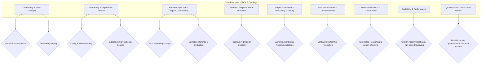
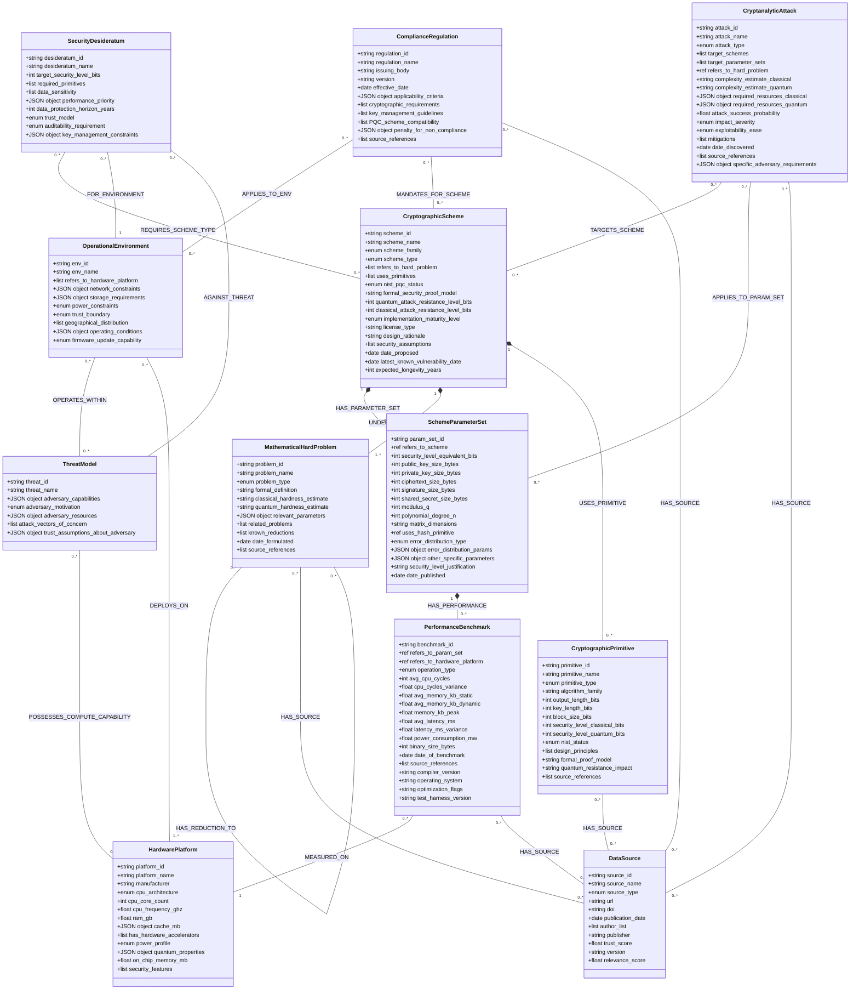
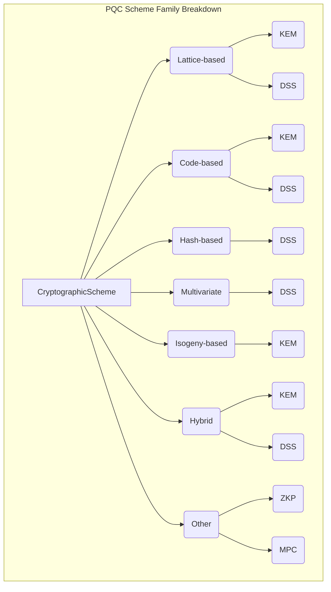
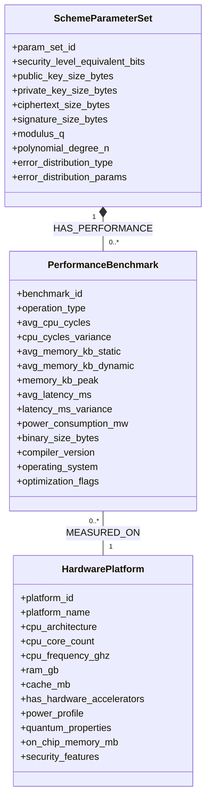
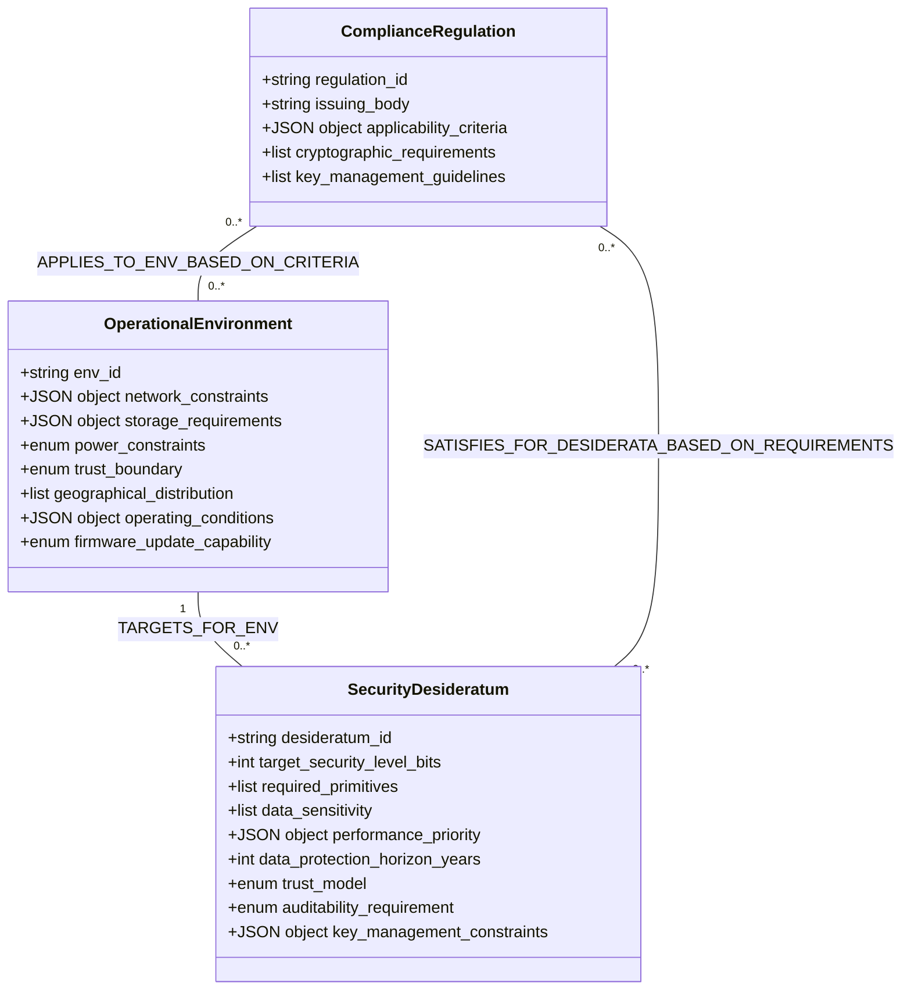
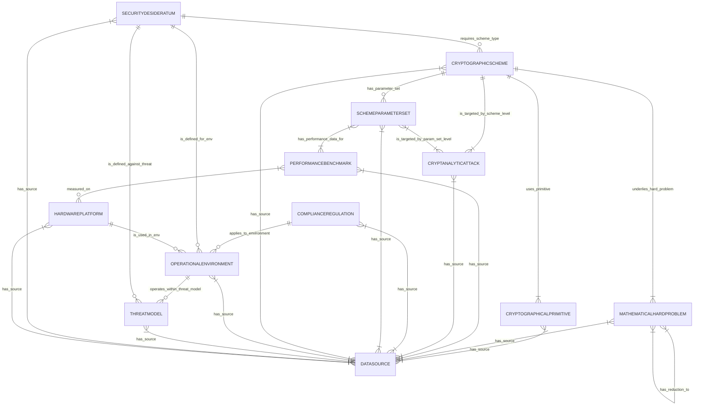

**Title of Invention:** Dynamic Cryptographic Knowledge Base DCKB Ontology Definition

**Abstract:**
This document formally defines the comprehensive ontology for the Dynamic Cryptographic Knowledge Base (DCKB), a critical component of the AI-Driven Heuristic Generation and Configuration of Quantum-Resilient Cryptographic Primitives and Protocols system. The ontology meticulously structures and interlinks disparate data points concerning post-quantum cryptographic (PQC) schemes, their parameterizations, performance benchmarks, cryptanalytic vulnerabilities, and regulatory compliance mandates. By establishing a robust and extensible semantic framework, this ontology empowers the Artificial Intelligence (AI) Cryptographic Inference Module (AIM) to perform sophisticated reasoning, multi-objective optimization, and contextually nuanced recommendations for quantum-resilient security solutions. This structured knowledge representation is fundamental to ensuring the system's accuracy, adaptability, and ability to remain at the forefront of evolving cryptographic landscapes and threat models, operating with a profound, self-correcting logic that strives for perpetual homeostasis.

**Introduction:**
The efficacy and intelligence of the AI-Driven Post-Quantum Cryptography (PQC) Generation System are profoundly dependent on its access to a continuously updated, highly structured, and semantically rich repository of cryptographic knowledge. This repository, termed the Dynamic Cryptographic Knowledge Base (DCKB), is engineered not merely as a flat database but as a sophisticated knowledge graph underpinned by a formal ontology. This ontology delineates the fundamental entities within the cryptographic domain, their intrinsic properties, and the intricate relationships that bind them. It is built not just to store facts, but to embody an evolving understanding, anticipating future challenges with the wisdom of a system that constantly asks, "Why can't it be better?"

The primary objectives of the DCKB ontology are:
*   **Semantic Richness:** To capture the deep meaning and context of cryptographic concepts, enabling the AI to understand nuances beyond keyword matching, including their mathematical underpinnings and subtle interdependencies.
*   **Interoperability:** To facilitate seamless, auditable integration of diverse data sources, from academic papers to standardization documents, hardware specifications, and real-world performance reports, across multiple formats and temporal contexts.
*   **Reasoning Enablement:** To provide a structured, axiomatically sound foundation that allows the AI Cryptographic Inference Module (AIM) to perform complex logical inferences, discover emergent patterns, identify implicit trade-offs, and execute multi-objective optimization with unimpeachable logic.
*   **Extensibility:** To allow for the effortless, non-disruptive integration of new PQC schemes, updated research findings, novel attack vectors, and evolving regulatory mandates, ensuring the knowledge base remains perpetually adaptive without requiring a complete redesign.
*   **Accuracy and Consistency:** To enforce robust data integrity and semantic consistency across all stored cryptographic information, employing formal reasoning to detect and resolve conflicts.
*   **Adaptability:** To support dynamic updates, versioning, and temporal validation of cryptographic knowledge, reflecting the fast-paced evolution of quantum threats, PQC research, and real-world deployments.
*   **Traceability:** To provide transparent and auditable provenance for all data, allowing for granular verification of information sources, assessing their trustworthiness, and understanding the chain of knowledge.
*   **Profound Predictive Capability:** To anticipate future trends and potential vulnerabilities by analyzing historical data, attack patterns, and the rate of cryptographic advancements, enabling proactive security recommendations.

This document presents a detailed, formal definition of the DCKB ontology, outlining its core classes, their associated properties, and the intricate relationships that connect them, thereby providing a definitive blueprint for the knowledge base's structure and semantic content.

**Claim 1:** The DCKB ontology ensures unparalleled semantic richness, enabling AI to comprehend the nuanced interplay of cryptographic attributes, well beyond superficial keyword matching, by modeling underlying mathematical principles and explicit interdependencies.

### 1. Core Principles of DCKB Ontology Design

The design of the DCKB ontology adheres to several guiding principles to ensure its robustness, scalability, and utility for the AI-driven PQC generation system. These principles are not merely guidelines, but fundamental axioms for its perpetual relevance and internal consistency:

*   **Granularity:** Concepts are broken down into their smallest meaningful, irreducible units to allow for precise representation, detailed querying, and the discovery of subtle dependencies. This ensures that the AI can delve into the specific details required for fine-grained configuration and precise vulnerability assessment.
*   **Modularity:** The ontology is designed with distinct, logically independent classes representing specific domains (e.g., schemes, attacks, regulations, hardware, mathematical problems), promoting clarity, maintainability, and facilitating independent evolution and scaling of different knowledge domains without cascading impacts.
*   **Relationship-Centric:** Explicit, formally defined relationships between classes are paramount, capturing the intricate, interconnected nature of cryptographic knowledge, forming a true knowledge graph. This structure is foundational for complex inference tasks, allowing the AI to traverse and deduce across disparate information types.
*   **Attribute Completeness & Precision:** Each class includes a comprehensive set of attributes (properties) that are not only critical for the AI's decision-making process but also rigorously defined with explicit data types, units, and ranges, covering both theoretical and practical aspects to minimize ambiguity.
*   **Temporal Awareness:** All relevant properties and relationships incorporate explicit timestamps, versioning, and validity periods to reflect the dynamic nature of cryptographic research, standards, and attack landscapes. This is vital for maintaining up-to-date recommendations and understanding the historical context of knowledge.
*   **Source Attribution & Trustworthiness:** Every ingested data point explicitly links to its original `DataSource`, enabling verifiable traceability and allowing for the assessment of information trustworthiness based on source authority, peer review status, and historical accuracy. This mechanism is crucial for conflict resolution and fostering confidence in AI-driven insights.
*   **Formal Semantics & Axiomatic Consistency:** The ontology strictly adheres to principles of formal semantics (e.g., OWL-DL compatibility), allowing for the application of automated reasoning tools to check consistency, infer new knowledge through logical deduction, and identify potential contradictions within the knowledge base itself.
*   **Scalability & Performance:** The architecture is designed to accommodate a continuously growing volume of PQC research, performance data, and regulatory updates across petabytes of information without degradation in reasoning performance or knowledge retrieval capabilities, supported by optimized graph database structures.
*   **Quantification:** Wherever possible, qualitative descriptions are supported or replaced by quantifiable metrics (e.g., security levels in bits, performance in cycles/ms, memory in KB, power in mW), enabling numerical comparisons, multi-objective optimization, and precise trade-off analyses.

**Claim 2:** The modular, relationship-centric, and formally consistent design of the DCKB ontology provides a highly scalable and maintainable knowledge graph, capable of integrating diverse cryptographic information sources seamlessly while preserving semantic integrity and enabling complex inference.


*Figure 1: DCKB Ontology Design Principles and their Benefits.*

### 2. DCKB Ontology Classes Detailed Definition

The DCKB ontology is built around an expanded set of core classes, each representing a distinct conceptual entity within the post-quantum cryptographic ecosystem. Each class is defined by a unique identifier, descriptive properties, and its intricate relationships to other classes, ensuring a comprehensive and deeply interconnected knowledge fabric.

#### 2.1. Class: CryptographicScheme

This class represents a specific post-quantum cryptographic algorithm or a foundational family of algorithms. It encapsulates the high-level characteristics that define a PQC scheme.

*   **`scheme_id`** (String): A unique, standardized identifier for the cryptographic scheme.
    *   *Example:* "Kyber1024", "Dilithium5", "SPHINCS+s-shake-256f".
    *   *Significance:* Essential for unambiguous referencing and linking across the knowledge graph. This ID often encodes critical version information, e.g., `SchemeFamily_SecurityLevel_Version`.
*   **`scheme_name`** (String): The widely recognized, formal name of the cryptographic scheme.
    *   *Example:* "CRYSTALS-Kyber", "CRYSTALS-Dilithium", "SPHINCS+".
    *   *Significance:* Provides a human-readable name for identification and categorization. Useful for documentation and user interfaces.
*   **`scheme_family`** (Enum): Categorizes the scheme based on its underlying mathematical hardness problem.
    *   *Enum Values:* "Lattice-based", "Code-based", "Hash-based", "Multivariate", "Isogeny-based", "Hybrid", "Symmetric_Key_PQC_Resistant".
    *   *Significance:* Crucial for high-level classification and initial filtering based on input requirements. Different families have distinct security assumptions and performance profiles.
*   **`scheme_type`** (Enum): Specifies the primary cryptographic primitive function(s) provided by the scheme.
    *   *Enum Values:* "KEM" (Key Encapsulation Mechanism), "DSS" (Digital Signature Scheme), "AEAD" (Authenticated Encryption with Associated Data), "ZKP" (Zero-Knowledge Proof), "MPC" (Multi-Party Computation), "HE" (Homomorphic Encryption), "PRF" (Pseudo-Random Function), "MAC" (Message Authentication Code).
    *   *Significance:* Directly addresses the `requiredPrimitives` in the input specification, guiding the AI to select functionally appropriate schemes.
*   **`refers_to_hard_problem`** (List of References to `MathematicalHardProblem.problem_id`): Links to the specific mathematical problems whose presumed intractability forms the security basis of the scheme.
    *   *Example:* For Kyber, refers to "MLWE_problem". For Dilithium, refers to "MLWE_problem" and "MSIS_problem".
    *   *Significance:* Provides deep, formal insight into the theoretical security and resilience against different types of attacks, allowing for direct querying of the problem's known hardness.
*   **`uses_primitives`** (List of References to `CryptographicPrimitive.primitive_id`): Identifies the foundational cryptographic primitives (e.g., hash functions, symmetric ciphers) that the scheme internally utilizes.
    *   *Example:* SPHINCS+ uses "SHAKE256". Dilithium uses "AES-256" (as a PRF).
    *   *Significance:* Essential for understanding the scheme's full security posture, as the security of the PQC scheme depends on the security of its underlying primitives.
*   **`nist_pqc_status`** (Enum): Reflects the scheme's current status within the NIST Post-Quantum Cryptography Standardization process.
    *   *Enum Values:* "Standardized", "Finalist", "Round 3 Candidate", "Round 2 Candidate", "Deprecated", "Pre-standardization", "Under Review", "Withdrawn".
    *   *Significance:* Critical for compliance and assessing the maturity and community acceptance of a scheme. This status often changes over time, requiring robust temporal awareness.
*   **`formal_security_proof_model`** (String): Details the cryptographic security model under which the scheme has been formally proven secure.
    *   *Example:* "IND-CCA2" (Indistinguishability under Chosen Ciphertext Attack), "EUF-CMA" (Existential Unforgeability under Chosen Message Attack), "ROM" (Random Oracle Model), "QROM" (Quantum Random Oracle Model), "Standard Model", "Ideal Cipher Model".
    *   *Significance:* Provides a rigorous foundation for evaluating the theoretical security guarantees. A stronger proof model generally implies greater confidence.
*   **`quantum_attack_resistance_level_bits`** (Integer): The estimated equivalent classical bits of security against known quantum algorithms (e.g., Shor's, Grover's).
    *   *Example:* 128, 192, 256.
    *   *Significance:* Directly addresses the `targetSecurityLevel` desideratum, quantifying quantum resilience based on `log2(complexity_quantum_attack)`.
*   **`classical_attack_resistance_level_bits`** (Integer): The estimated equivalent classical bits of security against known classical algorithms.
    *   *Example:* 125, 190, 250.
    *   *Significance:* Ensures the scheme is also robust against conventional cryptanalytic threats based on `log2(complexity_classical_attack)`.
*   **`implementation_maturity_level`** (Enum): Indicates the readiness and optimization level of available implementations.
    *   *Enum Values:* "Experimental", "Reference Implementation", "Optimized Software", "Hardware-accelerated", "Formal_Verification_Pending", "Certified_Hardware", "Open_Source_Community_Hardened".
    *   *Significance:* Informs practical deployability and performance expectations, especially for resource-constrained environments. Higher levels imply greater confidence in correctness and efficiency.
*   **`license_type`** (String): Specifies the software license under which reference implementations or libraries are distributed.
    *   *Example:* "MIT", "Apache 2.0", "Public Domain", "GPLv3", "Proprietary", "CC0".
    *   *Significance:* Important for legal and project management considerations during integration, affecting commercial viability.
*   **`design_rationale`** (String): A brief description of the design philosophy or key innovations of the scheme.
    *   *Significance:* Provides context for understanding trade-offs and design choices.
*   **`security_assumptions`** (List of Strings): Any specific assumptions made about the environment or adversary model for security to hold, beyond the hard problem assumptions.
    *   *Example:* "Presence of a strong randomness source", "Bounded quantum memory", "Side-channel resistance achieved through constant-time implementations".
    *   *Significance:* Critical for evaluating applicability in specific deployment scenarios.
*   **`date_proposed`** (Date): The date the scheme was first publicly proposed or published.
    *   *Significance:* Provides historical context and an anchor for tracking evolution.
*   **`latest_known_vulnerability_date`** (Date): The date of the most recent significant vulnerability or attack finding impacting the scheme's security claims. Null if no such vulnerability.
    *   *Significance:* Crucial for real-time risk assessment and flagging potentially compromised schemes.
*   **`expected_longevity_years`** (Integer): An expert-estimated projection of how many years the scheme is expected to remain secure against anticipated threats.
    *   *Significance:* Informs long-term data protection planning (`SecurityDesideratum.data_protection_horizon_years`).

**Claim 3:** Each `CryptographicScheme` instance provides a quantifiable measure of security (both classical and quantum) and a detailed specification of its design and dependencies, facilitating AI-driven risk assessment, robust selection, and temporal vulnerability tracking.

#### 2.2. Class: SchemeParameterSet

This class defines a specific set of parameters for a given `CryptographicScheme`, representing a particular instantiation that offers a defined security level and performance profile. A single scheme can have multiple parameter sets, each a distinct operational choice.

*   **`param_set_id`** (String): A unique identifier for this specific parameter set.
    *   *Example:* "Kyber768_NIST_Level3_v2.0_AVX2", "Dilithium5_NIST_Level5_CortexM4".
    *   *Significance:* Allows granular selection of scheme configurations. Often includes the scheme ID, security level, and a version or optimization identifier.
*   **`refers_to_scheme`** (Reference to `CryptographicScheme.scheme_id`): Links this parameter set to its parent cryptographic scheme.
    *   *Significance:* Establishes a clear hierarchical relationship, enabling navigation from a general scheme to its specific instantiations and inheriting general scheme properties.
*   **`security_level_equivalent_bits`** (Integer): The classical security strength this parameter set aims to achieve (e.g., equivalent to AES-128, AES-192, AES-256).
    *   *Example:* 128, 192, 256.
    *   *Significance:* A primary metric for matching `targetSecurityLevel` requirements. This is typically defined by NIST security strength categories. Equation: `S_equiv = min(S_quantum, S_classical)`.
*   **`public_key_size_bytes`** (Integer): The size of the public key in bytes for this parameter set.
    *   *Significance:* Influences network bandwidth, storage requirements, and cache performance. Equation: `PK_cost = N_tx * PK_size`.
*   **`private_key_size_bytes`** (Integer): The size of the private key in bytes for this parameter set.
    *   *Significance:* Influences secure storage, memory footprint, and backup complexity. Equation: `SK_storage_cost = Storage_unit_cost * SK_size`.
*   **`ciphertext_size_bytes`** (Integer, conditional for KEM/AEAD): The size of the ciphertext or encapsulated key in bytes.
    *   *Significance:* Crucial for network and storage costs in KEMs and AEADs. Equation: `CT_overhead_factor = CT_size / Plaintext_size`.
*   **`signature_size_bytes`** (Integer, conditional for DSS): The size of the digital signature in bytes.
    *   *Significance:* Impacts network bandwidth and storage for signature-based authentication. Equation: `Sig_storage_per_doc = Sig_size`.
*   **`shared_secret_size_bytes`** (Integer, conditional for KEM): The size of the shared secret derived from a KEM in bytes.
    *   *Significance:* Important for subsequent symmetric encryption key derivation. This often matches the `security_level_equivalent_bits` in bytes (e.g., 32 bytes for 256-bit security).
*   **`modulus_q`** (Integer, conditional for lattice-based): The prime modulus used in lattice-based schemes.
    *   *Example:* 3329 (for Kyber).
    *   *Significance:* A fundamental mathematical parameter affecting security and performance. A larger `q` generally increases security but also key/ciphertext sizes and computational cost.
*   **`polynomial_degree_n`** (Integer, conditional for lattice-based): The degree of polynomials used in ring- or module-lattice constructions.
    *   *Example:* 256 (for Kyber).
    *   *Significance:* Another core mathematical parameter. Affects vector/matrix dimensions and thus security and performance.
*   **`matrix_dimensions`** (String, conditional for lattice-based/code-based): Describes the dimensions of matrices or codes used.
    *   *Example:* "k x k" for lattice matrices, "n x k" for code-based parity-check matrices.
    *   *Significance:* Provides structural detail for the scheme. Equation: `N_elements = dim_rows * dim_cols`.
*   **`uses_hash_primitive`** (Reference to `CryptographicPrimitive.primitive_id`, conditional): The specific hash function or PRF primitive used within the scheme.
    *   *Example:* For SPHINCS+, `SHAKE256`. For Dilithium, `AES-256` for expansion.
    *   *Significance:* Directly impacts security (collision resistance, PRF security) and performance (hash/PRF rate).
*   **`error_distribution_type`** (Enum, conditional for lattice-based/code-based): Specifies the type of distribution used for noise or error vectors.
    *   *Enum Values:* "Uniform", "Centered_Binomial", "Gaussian", "Rounded_Gaussian".
    *   *Significance:* Crucial for understanding the security margin against lattice attacks; parameters of this distribution directly influence hardness.
*   **`error_distribution_params`** (JSON object, conditional): Parameters specific to the chosen error distribution.
    *   *Example:* `{"sigma": 3.2}` for Gaussian, `{"k": 2}` for Centered Binomial, `{"min": -1, "max": 1}` for uniform.
    *   *Significance:* Provides precise details for re-evaluating scheme security or simulating attacks.
*   **`other_specific_parameters`** (JSON object): A flexible field to store any additional, scheme-specific parameters not covered by generic properties.
    *   *Example:* For SPHINCS+, this might include tree height, number of layers, or hash function choices (e.g., "shake-256f"). For FrodoKEM, it might be the error distribution variance.
    *   *Significance:* Ensures comprehensive parameterization for all PQC schemes, enabling precise reconstruction and evaluation.
*   **`security_level_justification`** (String): A brief explanation or reference to how the stated `security_level_equivalent_bits` was derived.
    *   *Significance:* Provides transparency and verifiability for security claims.
*   **`date_published`** (Date): The date this specific parameter set was proposed or standardized.
    *   *Significance:* Allows tracking the freshness and evolution of parameter choices.

#### 2.3. Class: PerformanceBenchmark

This class captures empirical or simulated performance metrics for specific `SchemeParameterSet` instances across various `HardwarePlatform`s and operational contexts. This data is vital for optimizing against performance priorities and understanding real-world deployability.

*   **`benchmark_id`** (String): A unique identifier for this specific benchmark record.
    *   *Significance:* Enables tracking and referencing individual performance measurements. Often combines `param_set_id`, `hardware_platform_id`, and `operation_type`.
*   **`refers_to_param_set`** (Reference to `SchemeParameterSet.param_set_id`): Links the benchmark to the specific parameter set it evaluates.
    *   *Significance:* Ensures performance data is tied to precise scheme configurations, allowing direct comparison of parameter set trade-offs.
*   **`refers_to_hardware_platform`** (Reference to `HardwarePlatform.platform_id`): Links to a detailed description of the hardware on which the benchmark was run.
    *   *Significance:* Essential for matching `OperationalEnvironment.computational_resources` and understanding the context of performance numbers.
*   **`operation_type`** (Enum): The specific cryptographic operation being measured.
    *   *Enum Values:* "KeyGen" (Key Generation), "Encaps" (Key Encapsulation), "Decaps" (Key Decapsulation), "Sign" (Signature Generation), "Verify" (Signature Verification), "Encrypt", "Decrypt", "Setup", "Prove", "Verify_ZKP", "Hash_Compute", "PRF_Generate".
    *   *Significance:* Allows the AI to evaluate performance for required primitives and specific phases of a protocol.
*   **`avg_cpu_cycles`** (Integer): The average number of CPU cycles consumed for the operation.
    *   *Significance:* A granular measure of computational cost, especially for embedded systems where clock cycles are a primary constraint. Equation: `Cycles_per_byte = avg_cpu_cycles / (input_size_bytes + output_size_bytes)`.
*   **`cpu_cycles_variance`** (Float): The variance or standard deviation of CPU cycles, indicating performance consistency.
    *   *Significance:* Important for real-time systems where predictable performance is critical.
*   **`avg_memory_kb_static`** (Float): The static memory footprint (e.g., code, constant data) in kilobytes.
    *   *Significance:* Critical for severely constrained environments with minimal RAM.
*   **`avg_memory_kb_dynamic`** (Float): The average dynamic memory footprint (heap/stack usage) in kilobytes during the operation.
    *   *Significance:* Addresses `operationalEnvironment.computational_resources` and resource constraints for memory-limited devices.
*   **`memory_kb_peak`** (Float): The peak memory consumption in kilobytes during the operation.
    *   *Significance:* Identifies potential memory overflow risks.
*   **`avg_latency_ms`** (Float): The average wall-clock execution time in milliseconds for the operation.
    *   *Significance:* Directly informs `securityDesiderata.performance_priority` for real-time applications and user experience. Equation: `Throughput = 1000 / avg_latency_ms` (operations per second).
*   **`latency_ms_variance`** (Float): The variance or standard deviation of latency, crucial for worst-case analysis.
    *   *Significance:* High variance can indicate potential timing side-channels or unpredictable system behavior.
*   **`power_consumption_mw`** (Float): The average power consumption in milliwatts during the operation.
    *   *Significance:* Critical for battery-powered or energy-constrained IoT devices, informing `operationalEnvironment.power_constraints`.
    *   *Equation Example:* `Energy_per_op_mJ = power_consumption_mw * (avg_latency_ms / 1000)`.
*   **`binary_size_bytes`** (Integer): The size of the compiled cryptographic library or module in bytes.
    *   *Significance:* Important for constrained environments where code size is a premium (e.g., firmware for microcontrollers).
*   **`date_of_benchmark`** (Date): The date when the benchmark data was collected or published.
    *   *Significance:* Helps in assessing the recency and relevance of the performance data, as implementations and compilers evolve rapidly.
*   **`source_references`** (List of References to `DataSource.source_id`): URLs, DOIs, or publication references for the benchmark data.
    *   *Significance:* Ensures auditable traceability and verifiability of performance claims, linking back to scientific papers, official reports, or trusted benchmark repositories.
*   **`compiler_version`** (String): The exact compiler and version used (e.g., "GCC 11.2.0", "Clang 13.0.1").
    *   *Significance:* Compiler versions and flags can significantly impact performance, vital for reproducibility.
*   **`operating_system`** (String): The operating system and version (e.g., "Ubuntu 22.04 LTS", "FreeRTOS v10.4.3").
    *   *Significance:* Provides environmental context for the benchmark.
*   **`optimization_flags`** (String): Compiler optimization flags used during compilation (e.g., "-O3", "-march=native", "AVX2", "NEON").
    *   *Significance:* Provides critical context for benchmark results, as flags can drastically alter performance.
*   **`test_harness_version`** (String): The version of the benchmarking framework or tool used.
    *   *Significance:* Ensures consistency and reproducibility of measurements.

**Claim 4:** The `PerformanceBenchmark` class provides granular, quantifiable metrics across diverse hardware and operational contexts, capturing both average and variance data, enabling the AI to optimize for specific performance priorities with high fidelity and assess real-world deployability.

#### 2.4. Class: CryptanalyticAttack

This class captures information about known or theoretical cryptanalytic attacks that could compromise the security of cryptographic schemes, including both classical and quantum threats. It details the nature of the attack, its target, complexity, and potential mitigations.

*   **`attack_id`** (String): A unique identifier for the attack.
    *   *Significance:* For unambiguous referencing of attack vectors. Often includes the attack type, target, and a version or variant.
*   **`attack_name`** (String): The descriptive name of the cryptanalytic attack.
    *   *Example:* "Lattice Sieving", "Information Set Decoding", "Shor's Algorithm", "Grover's Algorithm", "Fault Injection Attack", "Chosen-Ciphertext Attack (CCA)".
    *   *Significance:* Provides a clear identifier for threat modeling and communication.
*   **`attack_type`** (Enum): Classifies the nature of the attack.
    *   *Enum Values:* "Classical_Computational", "Quantum_Computational", "Side-channel_Timing", "Side-channel_Power_Analysis", "Side-channel_EM_Emission", "Side-channel_Cache_Timing", "Implementation-based_Fault_Injection", "Implementation-based_API_Misuse", "Mathematical_Structural", "Brute_Force", "Hybrid_Quantum_Classical".
    *   *Significance:* Helps in understanding the capabilities of the `ThreatModel.adversary_capabilities` and categorizing threats.
*   **`target_schemes`** (List of References to `CryptographicScheme.scheme_id`): A list of cryptographic schemes generally known or theorized to be vulnerable to this attack.
    *   *Significance:* Establishes direct links between attacks and their potential primary targets, crucial for high-level risk assessment.
*   **`target_parameter_sets`** (List of References to `SchemeParameterSet.param_set_id`, optional): A more granular list of specific parameter sets known to be vulnerable, potentially with defined conditions.
    *   *Significance:* Allows for precise targeting of attack applicability, as not all parameter sets of a vulnerable scheme might be equally affected.
*   **`refers_to_hard_problem`** (Reference to `MathematicalHardProblem.problem_id`, optional): If the attack directly targets the underlying mathematical problem.
    *   *Significance:* Links the attack to its theoretical foundation, allowing for reasoning about derived schemes.
*   **`complexity_estimate_classical`** (String): A formal estimate of the computational resources (e.g., time, memory) required for the attack by classical computers.
    *   *Example:* "2^128 operations", "O(N^3) time, O(N) memory", "exp(c * N^(1/3) (log N)^(2/3))".
    *   *Significance:* Quantifies the severity of the threat in classical terms, directly informing `classical_attack_resistance_level_bits`.
    *   *Equation Example:* `N_ops_classical = 2^S_classical_attack`. The actual complexity is often expressed as `C_classical = O(f(n,k))`.
*   **`complexity_estimate_quantum`** (String): A formal estimate of the computational resources (e.g., qubits, quantum gates) required for the attack by quantum computers.
    *   *Example:* "O(N^3) quantum operations, O(N) qubits", "polynomial time on quantum computer (O((log N)^3))".
    *   *Significance:* Quantifies the severity of the threat in quantum terms, directly informing `quantum_attack_resistance_level_bits`.
    *   *Equation Example:* `N_ops_quantum = 2^S_quantum_attack`. `C_quantum = O(g(n,k))`.
*   **`required_resources_classical`** (JSON object): Detailed specification of classical resources.
    *   *Example:* `{"time_years": 5, "memory_gb": 1024, "cpu_cores": 256, "cost_usd": 1000000}`.
    *   *Significance:* Provides a practical estimate against `ThreatModel.adversary_resources`.
*   **`required_resources_quantum`** (JSON object): Detailed specification of quantum resources.
    *   *Example:* `{"qubits": 4096, "circuit_depth": 1e9, "coherence_time_req_us": 1000, "gate_fidelity_req_percent": 99.999, "cost_usd": "1e9+"}`.
    *   *Significance:* Allows mapping to `ThreatModel.adversary_capabilities` for quantum computers.
*   **`attack_success_probability`** (Float): The estimated probability of a successful attack, given sufficient resources.
    *   *Example:* 0.5 (for probabilistic attacks), 1.0 (for deterministic breaks), 0.001 (for rare events).
    *   *Significance:* Refines risk assessment; a low probability might be acceptable for some use cases depending on impact.
    *   *Equation Example:* `P_success(attack, scheme, params, adversary_capabilities)`.
*   **`impact_severity`** (Enum): Describes the consequence of a successful attack.
    *   *Enum Values:* "Catastrophic" (complete break), "High" (key recovery, total compromise), "Medium" (partial information, denial of service), "Low" (minor leak, negligible impact).
    *   *Significance:* Allows the AI to prioritize mitigation strategies based on potential damage.
*   **`exploitability_ease`** (Enum): How difficult it is to actually execute the attack in practice.
    *   *Enum Values:* "Trivial", "Moderate", "Complex", "Theoretical_Requires_Breakthrough".
    *   *Significance:* Practical factor for risk assessment.
*   **`mitigations`** (List of Strings): Describes known countermeasures or design principles that can mitigate the attack for specific schemes or implementations.
    *   *Example:* "Higher security parameters", "Constant-time implementation", "Hardware isolation (HSM/TEE)", "Blinding techniques", "Message randomization", "Leakage-resilient cryptography".
    *   *Significance:* Guides the AI in formulating secure private key handling instructions and selecting resilient schemes.
*   **`date_discovered`** (Date): The date when the attack was first discovered or publicly disclosed.
    *   *Significance:* Helps assess the recency of the threat and the maturity of countermeasures.
*   **`source_references`** (List of References to `DataSource.source_id`): URLs, DOIs, or publication references for the attack details.
    *   *Significance:* Ensures auditable traceability and verifiability of attack claims, linking to academic papers, security advisories, or common vulnerabilities and exposures (CVEs).
*   **`specific_adversary_requirements`** (JSON object): Any very specific capabilities or access required for *this particular attack* that might not be covered by general `ThreatModel`.
    *   *Example:* `{"access": "Physical_Probing", "knowledge": "Internal_Circuit_Diagrams", "pre_computation_cost": "2^80"}`.

#### 2.5. Class: ComplianceRegulation

This class defines various regulatory frameworks, industry standards, and organizational policies that impose requirements on cryptographic practices. It is critical for ensuring legal and operational adherence.

*   **`regulation_id`** (String): A unique identifier for the regulation or standard.
    *   *Example:* "FIPS140-3_Level2", "PCI-DSS_4.0", "GDPR_Article32", "HIPAA_SecurityRule", "ISO27001_2022".
    *   *Significance:* For precise referencing of compliance mandates.
*   **`regulation_name`** (String): The full, official name of the regulation or standard.
    *   *Example:* "Federal Information Processing Standards Publication 140-3 Security Requirements for Cryptographic Modules Level 2".
    *   *Significance:* Provides a human-readable name for identification and legal contexts.
*   **`issuing_body`** (String): The organization or authority responsible for issuing and maintaining the regulation.
    *   *Example:* "NIST", "PCI Security Standards Council", "European Union Agency for Cybersecurity (ENISA)", "ISO".
    *   *Significance:* Indicates authority, jurisdiction, and level of trust.
*   **`version`** (String): The specific version of the regulation (e.g., "3.0", "4.0").
    *   *Significance:* Crucial for temporal compliance, as regulations are updated.
*   **`effective_date`** (Date): The date from which the regulation becomes active and enforceable.
    *   *Significance:* Essential for temporal compliance checks and planning.
*   **`applicability_criteria`** (JSON object): Specifies the granular conditions under which this regulation applies.
    *   *Example:* `{"data_sensitivity": ["PHI", "PII", "Financial_Records"], "operational_environment_type": "Healthcare", "jurisdiction": "EU", "entity_type": "Data_Controller", "processing_volume": ">100000_records_per_year"}`.
    *   *Significance:* Enables the AI to precisely determine which regulations are relevant based on the input specification `OperationalEnvironment` and `SecurityDesideratum.data_sensitivity`.
    *   *Equation Example:* `IsApplicable(Regulation, Context) = (Context.data_sensitivity INTERSECTS Regulation.data_sensitivity_criteria) AND (Context.jurisdiction IN Regulation.jurisdiction_criteria) AND ...`.
*   **`cryptographic_requirements`** (List of JSON objects): Specific, structured requirements related to cryptographic primitives, key lengths, algorithm choices, and implementation properties mandated by the regulation.
    *   *Example:* `[{"type": "min_security_level_bits", "value": 192, "applies_to_scheme_type": "KEM", "justification": "Against potential quantum threats"}, {"type": "allowed_primitive", "value": "SHAKE256", "min_output_length": 256, "applies_to_role": "Hash_Function_in_DSS"}, {"type": "implementation_property", "value": "Constant_Time", "applies_to_operation": "Decaps"}, {"type": "hardware_certification", "value": "FIPS_140-3_Level_2_or_higher", "applies_to_component": "HSM"}]`.
    *   *Significance:* Directly informs scheme selection, parameterization, and implementation constraints.
    *   *Equation Example:* `Requirement_met = (Scheme.security_level >= Req.min_security_level) AND (Scheme.type IN Req.allowed_types) AND (Implementation.has_property(Req.implementation_property))`.
*   **`key_management_guidelines`** (List of JSON objects): Detailed, structured prescriptions or recommendations for secure key generation, storage, usage, backup, rotation, and destruction.
    *   *Example:* `[{"scope": "Private_Key_Storage", "requirement": "Physical_HSM", "certification_level": "FIPS_140-3_Level_3", "justification": "Protection of Root Keys"}, {"scope": "Key_Rotation", "frequency": "Annually", "mechanism": "Automated_PKI_Renewal"}, {"scope": "Key_Access_Control", "method": "RBAC_with_MFA", "principle": "Least_Privilege"}]`.
    *   *Significance:* Crucial for formulating comprehensive private key handling instructions and system design, directly influencing recommended security architectures.
*   **`PQC_scheme_compatibility`** (List of References to `CryptographicScheme.scheme_id`): A list of PQC schemes known to be explicitly compatible with or recommended by this regulation (if specified).
    *   *Significance:* Provides explicit guidance on preferred schemes for compliance, reducing ambiguity and accelerating selection.
*   **`penalty_for_non_compliance`** (JSON object): Describes the potential legal, financial, or reputational consequences of failing to meet the regulation.
    *   *Example:* `{"type": "fine", "amount_description": "Up to 4% of annual global turnover", "currency": "EUR", "legal_jurisdiction": "EU"}`.
    *   *Significance:* Quantifies the risk associated with non-compliance and aids in prioritizing regulatory adherence.
*   **`source_references`** (List of References to `DataSource.source_id`): Links to the official documents or publications defining the regulation.
    *   *Significance:* Ensures verifiability and access to the complete regulatory text.

**Claim 5:** The `ComplianceRegulation` class provides a granular, structured mechanism to enforce legal and industry mandates, automatically guiding the AI in selecting and configuring PQC solutions that meet stringent, versioned compliance requirements, with explicit penalties for non-adherence.

#### 2.6. Class: OperationalEnvironment

This class describes the specific computing and network environment where the PQC solution will be deployed. It defines the real-world constraints and characteristics of the deployment context.

*   **`env_id`** (String): Unique identifier for the operational environment profile.
*   **`env_name`** (String): Descriptive name (e.g., "Edge IoT Device Network", "Cloud Server Backend", "Enterprise Workstation", "Automotive ECU").
*   **`refers_to_hardware_platform`** (List of References to `HardwarePlatform.platform_id`): Specifies the type(s) of hardware platforms expected in this environment.
    *   *Significance:* Direct input for filtering `PerformanceBenchmark` data relevant to the actual deployment hardware.
*   **`network_constraints`** (JSON object): Details network bandwidth, latency, reliability, and security properties.
    *   *Example:* `{"bandwidth_mbps": 1.0, "avg_latency_ms": 200, "max_latency_ms": 500, "packet_loss_rate_percent": 5, "jitter_ms": 50, "link_security_level": "Untrusted"}`.
    *   *Significance:* Impacts choice of schemes with larger key/ciphertext/signature sizes, and influences protocol design for unreliable networks.
*   **`storage_requirements`** (JSON object): Specifies available storage capacity, I/O performance, and endurance.
    *   *Example:* `{"total_capacity_gb": 4, "available_capacity_mb": 50, "iops_read": 100, "iops_write": 50, "endurance_write_cycles": "10000_PE_Cycles", "storage_type": "eMMC"}`.
    *   *Significance:* Crucial for schemes with large key sizes or that require significant state storage.
*   **`power_constraints`** (Enum): Defines the power budget and source for devices in the environment.
    *   *Enum Values:* "Battery_Powered_Ultra_Low_Power", "Battery_Powered_Low_Power", "Line_Powered_Standard", "Energy_Harvesting_Intermittent", "High_Power_Server_Grade".
    *   *Significance:* Filters schemes based on `PerformanceBenchmark.power_consumption_mw` and guides energy-efficient scheme selection.
*   **`trust_boundary`** (Enum): Where cryptographic operations occur relative to the adversary's physical or logical access.
    *   *Enum Values:* "Trusted_Hardware_Module" (e.g., HSM, TPM), "Secure_Enclave" (e.g., SGX, TrustZone), "Untrusted_OS_Process", "Physically_Exposed_Device", "Virtualized_Environment".
    *   *Significance:* Informs `KeyManagementGuideline` and assesses susceptibility to side-channel or physical attacks.
*   **`geographical_distribution`** (List of Strings): Regions or countries of deployment.
    *   *Example:* "EU", "US", "APAC", "Global".
    *   *Significance:* Directly impacts `ComplianceRegulation.applicability_criteria` for jurisdiction-specific laws.
*   **`operating_conditions`** (JSON object): Environmental factors.
    *   *Example:* `{"temperature_celsius_range": [0, 60], "humidity_percent_range": [10, 90], "vibration_g_peak": 2, "radiation_tolerance_rads": "Low"}`.
    *   *Significance:* Influences hardware reliability and potential for fault injection attacks.
*   **`firmware_update_capability`** (Enum): How easy/difficult it is to update the deployed PQC solution.
    *   *Enum Values:* "Automatic_OTA", "Manual_Local", "Difficult_Requires_Physical_Access", "Not_Updateable".
    *   *Significance:* Impacts resilience to future attacks; schemes requiring frequent updates might be unsuitable for "Not_Updateable" environments.

#### 2.7. Class: ThreatModel

This class formalizes the capabilities, resources, and motivations of potential adversaries that the PQC solution must defend against.

*   **`threat_id`** (String): Unique identifier for the threat model.
*   **`threat_name`** (String): Descriptive name (e.g., "Nation-State Quantum Adversary", "Resource-Limited Side-Channel Attacker", "Well-Funded Organized Crime").
*   **`adversary_capabilities`** (JSON object): Details the adversary's computational, quantum, and access capabilities.
    *   *Example:* `{"classical_compute_platform": "Supercomputer_Tier1_Equivalent", "quantum_compute_platform": "Future_Fault_Tolerant_Q_Computer", "side_channel_access": "Full", "physical_access": "Persistent", "network_eavesdropping": "Full", "active_network_manipulation": "Yes", "cryptographic_expertise": "Expert"}`.
    *   *Significance:* Determines relevant `CryptanalyticAttack` instances, by matching attack requirements against adversary capabilities.
*   **`adversary_motivation`** (Enum): What primarily drives the attack.
    *   *Enum Values:* "Espionage_Long_Term", "Financial_Gain_High_Value", "Sabotage_Infrastructure", "Ideological_Hacktivism", "Organized_Cybercrime", "State-Sponsored_Industrial", "Accidental_Internal_Leak".
    *   *Significance:* Helps prioritize defense strategies and assess attack likelihood.
*   **`adversary_resources`** (JSON object): Quantifies the adversary's time horizon, budget, and personnel.
    *   *Example:* `{"budget_usd": "Unlimited", "time_horizon_years": 50, "personnel_count": 100}`.
    *   *Significance:* Quantifies the feasibility of attacks (e.g., comparing `CryptanalyticAttack.required_resources` against `adversary_resources`).
*   **`attack_vectors_of_concern`** (List of References to `CryptanalyticAttack.attack_type`): Specific types of attacks the adversary is expected to mount or has demonstrated capability for.
    *   *Significance:* Narrows down the scope of threats to actively consider in the design phase.
*   **`trust_assumptions_about_adversary`** (JSON object): Specifies if the adversary is internal, external, or has supply chain access.
    *   *Example:* `{"internal_threat_actor": "Yes", "supply_chain_interdiction": "Possible", "nation_state_support": "Yes"}`.
    *   *Significance:* Influences the choice of `trust_boundary` in `OperationalEnvironment` and strengthens internal security measures.

#### 2.8. Class: SecurityDesideratum

This class captures the desired security properties, priorities, and requirements for a PQC solution from the perspective of the system owner or user.

*   **`desideratum_id`** (String): Unique identifier for the security requirement set.
*   **`desideratum_name`** (String): Descriptive name (e.g., "High-Assurance Data-in-Transit for Financial Transactions", "Long-Term Archival Security for Classified Data").
*   **`target_security_level_bits`** (Integer): Desired minimum quantum-safe equivalent classical bits of security.
    *   *Example:* 128, 192, 256.
    *   *Significance:* Directly filters `CryptographicScheme.quantum_attack_resistance_level_bits` and `classical_attack_resistance_level_bits`.
*   **`required_primitives`** (List of `CryptographicScheme.scheme_type`): Essential cryptographic functions that the solution must provide.
    *   *Example:* ["KEM", "DSS"], ["AEAD"], ["ZKP"].
    *   *Significance:* Filters `CryptographicScheme.scheme_type` to ensure functional completeness.
*   **`data_sensitivity`** (List of Strings): Classification of data being protected.
    *   *Example:* ["PHI" (Protected Health Information), "PII" (Personally Identifiable Information), "Confidential_Business_Data", "Top_Secret_National_Security_Data"].
    *   *Significance:* Crucial for mapping to `ComplianceRegulation.applicability_criteria` and determining overall risk impact.
*   **`performance_priority`** (JSON object): Relative importance of different performance metrics for multi-objective optimization.
    *   *Example:* `{"latency": "Very_High", "throughput": "Medium", "memory_footprint": "Low", "power_consumption": "Medium", "binary_size": "Low"}`. Use normalized values or ranked enums for levels.
    *   *Significance:* Guides the AI's multi-objective optimization engine when evaluating `PerformanceBenchmark` data, determining optimal trade-offs.
*   **`data_protection_horizon_years`** (Integer): How long the protected data needs to remain secure against current and anticipated future threats.
    *   *Example:* 10, 20, 50, 100.
    *   *Significance:* Helps assess future quantum threat evolution (e.g., `CryptographicScheme.expected_longevity_years`) and prompts selection of more conservative schemes.
    *   *Equation Example:* `Longevity_Risk = f(data_protection_horizon_years, current_quantum_progress_rate)`.
*   **`trust_model`** (Enum): Assumptions about trusted parties and components within the system.
    *   *Enum Values:* "Zero_Trust", "Partial_Trust_CA_Model", "Full_Trust_Internal_PKI", "Hardware_Root_of_Trust_Required", "Threshold_Cryptography_Required".
    *   *Significance:* Impacts key management design, protocol selection, and reliance on trusted third parties.
*   **`auditability_requirement`** (Enum): The level of logging and verifiable events required.
    *   *Enum Values:* "High" (every crypto operation logged, verifiable), "Medium" (critical operations logged), "Low" (basic logging), "None".
    *   *Significance:* Influences system design and choice of schemes that expose audit trails.
*   **`key_management_constraints`** (JSON object): Specific requirements or prohibitions for key management.
    *   *Example:* `{"hsm_required": true, "key_recovery_allowed": false, "multi_factor_auth_for_keys": true, "key_export_prohibited": true, "min_key_rotation_frequency_months": 12}`.
    *   *Significance:* Directly informs the generation of key management plans, ensuring adherence to policy.

**Claim 6:** The `OperationalEnvironment`, `ThreatModel`, and `SecurityDesideratum` classes provide a comprehensive, structured, and quantifiable input framework, allowing the AI to contextualize PQC requirements for optimal solution generation with unparalleled precision and foresight.

#### 2.9. Class: HardwarePlatform (Newly Formalized)

This class provides a detailed specification of a specific hardware platform on which cryptographic operations can be executed.

*   **`platform_id`** (String): Unique identifier for the hardware platform.
*   **`platform_name`** (String): Descriptive name of the platform (e.g., "Intel Xeon E5-2690 v4", "ARM Cortex-M4F", "Espressif ESP32-S3", "IBM Eagle Quantum Processor").
*   **`manufacturer`** (String): Manufacturer of the CPU or chip.
*   **`cpu_architecture`** (Enum): The instruction set architecture.
    *   *Enum Values:* "x86-64", "ARMv7", "ARMv8-A", "RISC-V", "MIPS", "PowerPC", "Quantum_Gate_Model", "Custom_ASIC".
    *   *Significance:* Determines compatibility and influences performance optimizations.
*   **`cpu_core_count`** (Integer): Number of CPU cores.
*   **`cpu_frequency_ghz`** (Float): Base clock frequency of the CPU.
*   **`ram_gb`** (Float): Total available RAM in gigabytes.
*   **`cache_mb`** (JSON object): Sizes of L1, L2, L3 caches.
    *   *Example:* `{"L1_d_kb": 32, "L1_i_kb": 32, "L2_mb": 0.5, "L3_mb": 0}`.
    *   *Significance:* Impacts cache-timing side-channels and performance of memory-intensive schemes.
*   **`has_hardware_accelerators`** (List of Strings): List of supported cryptographic hardware accelerators.
    *   *Example:* ["AES-NI", "AVX2", "SHA_extensions", "PQC_Kyber_Accelerator", "TRNG"].
    *   *Significance:* Crucial for high-performance or energy-efficient PQC, directly impacting `PerformanceBenchmark` values.
*   **`power_profile`** (Enum): General power characteristic of the platform.
    *   *Enum Values:* "High-performance_Server", "Desktop_Workstation", "Mobile_Device", "Embedded_Low_Power", "Ultra_Low_Power_IoT".
    *   *Significance:* Relevant for `OperationalEnvironment.power_constraints`.
*   **`quantum_properties`** (JSON object, conditional for Quantum_Gate_Model): Specific parameters for quantum computers.
    *   *Example:* `{"qubit_count": 127, "coherence_time_us": 200, "gate_fidelity_percent": 99.9, "topology": "Heavy_Hex", "error_correction_capability": "Limited"}`.
    *   *Significance:* Used to evaluate `ThreatModel.adversary_capabilities` for quantum attacks.
*   **`on_chip_memory_mb`** (Float, conditional for embedded): On-chip RAM and Flash memory.
    *   *Example:* `{"flash_mb": 4, "sram_mb": 0.5}`.
    *   *Significance:* Critical for deeply embedded systems where external memory is limited or absent.
*   **`security_features`** (List of Strings): Built-in hardware security features.
    *   *Example:* ["Secure_Boot", "Trusted_Execution_Environment", "True_Random_Number_Generator", "Memory_Protection_Unit"].
    *   *Significance:* Influences `OperationalEnvironment.trust_boundary` and overall system hardening.

#### 2.10. Class: CryptographicPrimitive (Newly Formalized)

This class represents foundational cryptographic primitives that may be used as building blocks within larger PQC schemes or protocols.

*   **`primitive_id`** (String): Unique identifier for the primitive (e.g., "SHA3-256", "AES-256-CTR", "HKDF-SHA256", "CHACHA20").
*   **`primitive_name`** (String): Common name of the primitive.
*   **`primitive_type`** (Enum): Classification of the primitive's function.
    *   *Enum Values:* "HashFunction", "SymmetricCipher_Block", "SymmetricCipher_Stream", "PRF" (Pseudo-Random Function), "KDF" (Key Derivation Function), "MAC" (Message Authentication Code), "RandomNumberGenerator_TRNG", "RandomNumberGenerator_DRBG".
*   **`algorithm_family`** (String): Broader family (e.g., "SHA-2", "SHA-3", "Blake", "AES", "Chacha").
*   **`output_length_bits`** (Integer, conditional): Output length (for Hash, PRF, MAC).
*   **`key_length_bits`** (Integer, conditional): Key length (for symmetric ciphers, MACs).
*   **`block_size_bits`** (Integer, conditional): Block size (for block ciphers).
*   **`security_level_classical_bits`** (Integer): Estimated classical security strength.
*   **`security_level_quantum_bits`** (Integer): Estimated quantum security strength (e.g., against Grover's for symmetric ciphers, or collision for hashes).
*   **`nist_status`** (Enum): NIST status (e.g., "Approved", "Recommended", "Deprecated", "Legacy").
*   **`design_principles`** (List of Strings): Key design principles (e.g., "Sponge Construction", "Feistel Network", "Substitution-Permutation Network").
*   **`formal_proof_model`** (String): Security model used for formal proofs (e.g., "Random Oracle Model", "Ideal Cipher Model", "Standard Model").
*   **`quantum_resistance_impact`** (String): Explanation of how quantum attacks affect this primitive.
    *   *Example:* "Resistant to Grover's if key size >= 256 bits", "Collision resistance halved by quantum attacks (O(2^(L/3)) for L-bit hash)", "No known direct quantum speedup for KDF".
*   **`source_references`** (List of References to `DataSource.source_id`): Links to official specifications or academic papers.

#### 2.11. Class: MathematicalHardProblem (Newly Formalized)

This class formally defines the mathematical problems whose presumed intractability underpins the security of various cryptographic schemes.

*   **`problem_id`** (String): Unique identifier (e.g., "MLWE_problem", "SIS_problem", "MDPC_Decoding_problem", "Isogeny_Path_problem", "Factoring_Integer_Problem").
*   **`problem_name`** (String): Common name (e.g., "Module Learning With Errors", "Short Integer Solution").
*   **`problem_type`** (Enum): Broad category of the mathematical problem.
    *   *Enum Values:* "Lattice_Problem", "Code_Problem", "Number_Theory_Problem", "Multivariate_Polynomial_Problem", "Graph_Isomorphism_Problem".
*   **`formal_definition`** (String): A concise formal mathematical definition of the problem.
*   **`classical_hardness_estimate`** (String): Complexity estimate for the best-known classical algorithm (e.g., "O(2^n)", "NP-hard", "sub-exponential").
*   **`quantum_hardness_estimate`** (String): Complexity estimate for the best-known quantum algorithm (e.g., "Polynomial time on quantum computer", "Exponential time on quantum computer", "O(sqrt(N))").
*   **`relevant_parameters`** (JSON object): Key mathematical parameters that define an instance of the problem.
    *   *Example:* `{"lattice_dimension": "n", "modulus": "q", "error_distribution_params": {"sigma": "s"}}`.
*   **`related_problems`** (List of References to `MathematicalHardProblem.problem_id`): Other problems closely related to this one (e.g., variants, or problems in the same family).
*   **`known_reductions`** (List of JSON objects): Describes known polynomial-time reductions between problems.
    *   *Example:* `{"reduces_from": "ProblemA_id", "reduces_to": "ProblemB_id", "direction": "Left_to_Right", "reduction_cost_description": "Polynomial time reduction, cost O(n^2)", "source_reference": "DataSource_id"}`.
    *   *Significance:* Critical for inferring security; if `ProblemA` reduces to `ProblemB`, breaking `B` breaks `A`.
*   **`date_formulated`** (Date): The approximate date when the problem was first formally described.
*   **`source_references`** (List of References to `DataSource.source_id`): Links to original academic papers defining the problem.

#### 2.12. Class: DataSource (Newly Formalized)

This class provides granular metadata about the origin and trustworthiness of information ingested into the DCKB. Every piece of data should ideally trace back to one or more `DataSource` instances.

*   **`source_id`** (String): Unique identifier for the data source (e.g., "NIST_SP800-208_V1", "IACR_ePrint_2023_1234_V1").
*   **`source_name`** (String): Full descriptive name (e.g., "NIST Special Publication 800-208: Recommendation for Stateful Hash-Based Signature Schemes").
*   **`source_type`** (Enum): Category of the source.
    *   *Enum Values:* "AcademicPaper_PeerReviewed", "AcademicPaper_Preprint", "StandardDocument_Official", "StandardDocument_Draft", "IndustryReport", "SecurityAdvisory", "ConferenceProceeding", "BenchmarkWebsite_Official", "ReferenceImplementation_Code", "Expert_Opinion", "News_Article_Verified".
*   **`url`** (String, optional): Direct URL to the source.
*   **`doi`** (String, optional): Digital Object Identifier.
*   **`publication_date`** (Date): Date of publication or last revision.
*   **`author_list`** (List of Strings, optional): Authors or contributors.
*   **`publisher`** (String, optional): Publisher (e.g., "NIST", "IACR", "IEEE").
*   **`trust_score`** (Float, range 0.0-1.0): An aggregated metric reflecting the estimated reliability and authority of the source.
    *   *Calculation:* Derived from factors like `source_type` (peer-reviewed > preprint), `publisher` (official standards body > personal blog), `recency`, `reputation`, and `historical_accuracy_metric`.
    *   *Significance:* Used by AIM for weighted aggregation of conflicting data and confidence estimation.
*   **`version`** (String, optional): Version identifier for the source document itself.
*   **`relevance_score`** (Float, range 0.0-1.0): How relevant this source is to the PQC domain.

**Claim 7:** The new classes (`HardwarePlatform`, `CryptographicPrimitive`, `MathematicalHardProblem`, `DataSource`) extend the DCKB ontology into foundational layers, enabling a more holistic, precise, and verifiable understanding of the PQC ecosystem, from theoretical hardness to practical implementation.

### 3. Relationships and Knowledge Graph Structure

The power of the DCKB ontology lies in its ability to model intricate relationships between these distinct classes, forming a rich, axiomatically sound knowledge graph that the AI can traverse and query with profound semantic understanding. These relationships are either explicitly defined or implicitly understood through property references, forming a dense and navigable network of cryptographic truth.

*   **`CryptographicScheme` HAS_PARAMETER_SET `SchemeParameterSet` (One-to-Many):** A single cryptographic scheme can have multiple associated parameter sets, each offering different security/performance trade-offs.
    *   *Example:* CRYSTALS-Kyber (Scheme) HAS Kyber512, Kyber768, Kyber1024 (Parameter Sets).
    *   *Conceptual Query (Cypher):* `MATCH (s:CryptographicScheme)-[:HAS_PARAMETER_SET]->(ps:SchemeParameterSet) WHERE s.scheme_name = 'CRYSTALS-Kyber' RETURN ps.param_set_id`
*   **`CryptographicScheme` UNDERLIES_HARD_PROBLEM `MathematicalHardProblem` (One-to-Many):** A scheme's security is based on the presumed intractability of one or more mathematical problems.
    *   *Example:* CRYSTALS-Kyber (Scheme) UNDERLIES_HARD_PROBLEM Module-LWE Problem (MathematicalHardProblem).
    *   *Conceptual Query:* `MATCH (s:CryptographicScheme)-[:UNDERLIES_HARD_PROBLEM]->(mhp:MathematicalHardProblem) WHERE s.scheme_id = 'Dilithium5' RETURN mhp.problem_name`
*   **`CryptographicScheme` USES_PRIMITIVE `CryptographicPrimitive` (Many-to-Many):** Cryptographic schemes often incorporate other primitives (like hash functions, symmetric ciphers, PRFs) as building blocks.
    *   *Example:* SPHINCS+ (Scheme) USES_PRIMITIVE SHAKE256 (CryptographicPrimitive).
    *   *Conceptual Query:* `MATCH (s:CryptographicScheme)-[:USES_PRIMITIVE]->(cp:CryptographicPrimitive) WHERE s.scheme_family = 'Hash-based' RETURN cp.primitive_name`
*   **`SchemeParameterSet` HAS_PERFORMANCE `PerformanceBenchmark` (One-to-Many):** A specific parameter set can have numerous performance benchmarks, reflecting measurements across different hardware platforms and operational contexts.
    *   *Example:* Kyber768_NIST_Level3 (Parameter Set) HAS CPU cycles on Intel Xeon, CPU cycles on ARM Cortex-M0, Memory footprint on cloud server.
    *   *Conceptual Query:* `MATCH (ps:SchemeParameterSet)-[:HAS_PERFORMANCE]->(pb:PerformanceBenchmark) WHERE ps.param_set_id = 'Kyber768_NIST_Level3_v2.0_AVX2' AND pb.refers_to_hardware_platform = 'Intel_Xeon_E5' RETURN pb.avg_latency_ms`
*   **`PerformanceBenchmark` MEASURED_ON `HardwarePlatform` (Many-to-One):** Each performance benchmark is specifically conducted on a particular hardware platform.
    *   *Example:* KeyGen_Benchmark_Kyber768 (PerformanceBenchmark) MEASURED_ON ARM_Cortex-M4F (HardwarePlatform).
*   **`CryptanalyticAttack` TARGETS `CryptographicScheme` (Many-to-Many):** An attack can target one or more cryptographic schemes, and a scheme can be targeted by multiple attacks. This is a high-level association.
    *   *Example:* Shor's Algorithm (Attack) TARGETS RSA, ECC. Lattice Sieving (Attack) TARGETS Kyber, Dilithium.
*   **`CryptanalyticAttack` APPLIES_TO_PARAM_SET `SchemeParameterSet` (Many-to-Many):** A more granular relationship, indicating specific parameter sets that are explicitly vulnerable or resistant to a given attack.
    *   *Example:* FaultInjectionAttack_V1 (Attack) APPLIES_TO_PARAM_SET Kyber768_v1.0 (if v1.0 had a known vulnerability fixed in v2.0).
*   **`MathematicalHardProblem` HAS_REDUCTION_TO `MathematicalHardProblem` (Many-to-Many):** Formal reductions link the security of one problem to another.
    *   *Example:* LWE_problem (MathematicalHardProblem) HAS_REDUCTION_TO SIS_problem (MathematicalHardProblem).
*   **`ComplianceRegulation` APPLIES_TO `OperationalEnvironment` (Many-to-Many, via applicability_criteria):** Regulations are applicable based on the characteristics of the operational environment and data sensitivity.
    *   *Example:* GDPR (Regulation) APPLIES_TO an EU Cloud Server (OperationalEnvironment) handling PII.
    *   *Conceptual Query:* `MATCH (r:ComplianceRegulation), (e:OperationalEnvironment) WHERE r.applicability_criteria.jurisdiction CONTAINS e.geographical_distribution AND r.applicability_criteria.data_sensitivity INTERSECTS e.data_sensitivity RETURN r.regulation_name`
*   **`ComplianceRegulation` MANDATES_REQUIREMENTS_FOR `CryptographicScheme` (Many-to-Many, via cryptographic_requirements):** Regulations specify criteria that schemes must meet.
    *   *Example:* FIPS 140-3 (Regulation) MANDATES_REQUIREMENTS_FOR Kyber (if certified as PQC module).
    *   *Conceptual Query:* `MATCH (r:ComplianceRegulation)-[:MANDATES_REQUIREMENTS_FOR]->(s:CryptographicScheme) WHERE r.regulation_id = 'FIPS140-3_Level2' AND s.nist_pqc_status = 'Standardized' RETURN s.scheme_id`
*   **`OperationalEnvironment` OPERATES_WITHIN `ThreatModel` (One-to-One or Many-to-One):** An operational environment is assumed to exist within a specific threat landscape.
    *   *Example:* A "Cloud Server Backend" OPERATES_WITHIN "Nation-State Quantum Adversary" threat model.
    *   *Conceptual Query:* `MATCH (oe:OperationalEnvironment)-[:OPERATES_WITHIN]->(tm:ThreatModel) WHERE oe.env_id = 'CloudServer_EU' RETURN tm.threat_name`
*   **`SecurityDesideratum` REQUIRES_SCHEME_TYPE `CryptographicScheme` (Many-to-Many, indirectly):** The desired security properties influence the choice of schemes.
    *   *Example:* "High-Assurance Archival" REQUIRES_SCHEME_TYPE (implicitly) Kyber1024, Dilithium5.
    *   *Conceptual Query:* `MATCH (sd:SecurityDesideratum) WHERE sd.target_security_level_bits >= 256 MATCH (s:CryptographicScheme) WHERE s.quantum_attack_resistance_level_bits >= sd.target_security_level_bits AND sd.required_primitives CONTAINS s.scheme_type RETURN s.scheme_id`
*   **`SecurityDesideratum` FOR_ENVIRONMENT `OperationalEnvironment` (Many-to-One):** Security desiderata are specified for a particular operational context.
*   **`SecurityDesideratum` AGAINST_THREAT `ThreatModel` (Many-to-One):** Security desiderata are defined to counter a specific threat landscape.
*   **`All_Classes` HAS_SOURCE `DataSource` (Many-to-Many, via `source_references` property):** Any information (properties, relationships) within any class can be traced back to its origin.
    *   *Conceptual Query:* `MATCH (s:CryptographicScheme {scheme_id: 'Kyber1024'})-[:HAS_SOURCE]->(ds:DataSource) RETURN ds.source_name, ds.trust_score`

This intricately interconnected structure enables the AI to perform complex, multi-faceted queries such as: "Find all NIST-standardized lattice-based KEMs that offer NIST Level 5 security (>=256 bits), perform efficiently on ARM Cortex-M0 devices (latency < 100ms for encaps, power < 5mW), are resistant to known side-channel attacks for resource-constrained adversaries, and are explicitly compatible with FIPS 140-3 Level 2 requirements for PHI data in an EU jurisdiction, considering a nation-state quantum threat model with a 50-year data longevity requirement, and whose underlying mathematical problems have no known sub-exponential classical attacks."

**Claim 8:** The DCKB's knowledge graph architecture, with its explicit semantic relationships spanning theoretical foundations to practical deployments, empowers the AI to conduct multi-faceted, context-aware, and rigorously verifiable reasoning and optimization for PQC recommendations.


*Figure 2: Comprehensive DCKB Ontology Class Diagram with Expanded Classes and Relationships.*

### 4. Knowledge Graph Representation and AIM Interaction

The defined ontology serves as the conceptual schema for constructing the actual Dynamic Cryptographic Knowledge Base as a robust, scalable graph database (e.g., Neo4j, JanusGraph, Amazon Neptune, GraphDB). In this representation:
*   **Classes** become node labels (e.g., `CryptographicScheme`, `SchemeParameterSet`, `HardwarePlatform`).
*   **Properties** become attributes of these nodes (e.g., `scheme_name`, `public_key_size_bytes`, `cpu_architecture`).
*   **Relationships** become directed edges between nodes (e.g., `HAS_PARAMETER_SET`, `TARGETS_SCHEME`, `MEASURED_ON`).

The AI Cryptographic Inference Module (AIM) interacts with this knowledge graph through sophisticated knowledge graph traversal (KGT-R), graph neural networks (GNNs) for embedding and link prediction, and advanced reasoning engines. When the AIM receives a query (the contextualized prompt), it executes the following high-level process, driven by an inherent desire for optimal, unimpeachable truth:

1.  **Query Formalization & Embedding:** The natural language input query, along with structured desiderata (from `SecurityDesideratum`, `OperationalEnvironment`, `ThreatModel` objects), is parsed, disambiguated, and transformed into a formal query language (e.g., Cypher, SPARQL) and a high-dimensional embedding vector using advanced natural language processing (NLP) and contextual graph neural networks (GNNs). This step captures the deep semantic intent.
    *   *Equation Example:* Query embedding `e_Q = GNN_Encoder(T_query_tokens, Query_Graph_Context)`.
2.  **Initial Graph Traversal & Candidate Identification:** The formal query is executed against the knowledge graph to identify initial candidate `CryptographicScheme` and `SchemeParameterSet` nodes that broadly match the functional, basic security requirements, and explicit compatibility criteria. This efficiently prunes the search space.
    *   *Equation Example:* `Candidates = {s | s.scheme_type IN Desideratum.required_primitives AND s.quantum_attack_resistance_level_bits >= Desideratum.target_security_level_bits AND EXISTS((s)-[:MANDATES_FOR_SCHEME]-(r:ComplianceRegulation) WHERE r.regulation_id IN ApplicableRegulations)}`.
3.  **Contextual Data Aggregation:** For each candidate, the AIM performs deeper graph traversal, following relevant relationships to gather comprehensive, context-specific data. This includes:
    *   Associated `PerformanceBenchmark` data relevant to the specified `OperationalEnvironment.refers_to_hardware_platform` and `operation_type`.
    *   Relevant `CryptanalyticAttack` instances, considering the `ThreatModel.adversary_capabilities`, `ThreatModel.attack_vectors_of_concern`, and the candidate scheme's `refers_to_hard_problem` and `uses_primitives`.
    *   Applicable `ComplianceRegulation` requirements, meticulously evaluated based on `OperationalEnvironment.geographical_distribution`, `SecurityDesideratum.data_sensitivity`, and the scheme's `nist_pqc_status`.
    *   Provenance and `DataSource.trust_score` for all aggregated facts.
    *   *Equation Example:* `Context(s) = {PerformanceData(s, env, hardware), AttackData(s, threat, param_sets), ComplianceData(s, env, sec_des, regulations), Provenance(s, all_facts)}`.
4.  **Multi-Objective Optimization & Scoring:** The aggregated data is fed into a sophisticated multi-objective optimization engine. This engine dynamically assigns a comprehensive utility score to each candidate, reflecting how well it meets the weighted priorities defined in `SecurityDesideratum.performance_priority`, `data_protection_horizon_years`, and `ComplianceRegulation` conformance, while also rigorously accounting for `CryptanalyticAttack` risks and `DataSource.trust_score` for data confidence. This involves identifying optimal trade-offs.
    *   *Equation Example:* `Utility(s, ps) = w_sec * SecurityScore(s, ps) + w_perf * PerformanceScore(s, ps, env) + w_comp * ComplianceScore(s, ps, env, reg) - w_risk * RiskScore(s, ps, threat) - w_cost * CostScore(s, ps, env) + w_trust * TrustScore_Data(s, ps)`.
    *   *Constraint Checking:* Simultaneously, hard constraints (e.g., minimum security level, mandatory compliance items) are checked; any violation leads to disqualification or heavy penalization.
5.  **Reasoning, Inference & Conflict Resolution:** The AIM applies a comprehensive set of logical inference rules (ee.g., defined in SWRL, RDFS, or learned via GNNs) to identify potential conflicts (e.g., a scheme claiming "Standardized" but having an unmitigated "Catastrophic" attack), deduce implicit knowledge (e.g., if Problem A reduces to Problem B, and B is broken, then A is also effectively broken), and refine scores. Conflicts are resolved using `DataSource.trust_score` and temporal precedence.
    *   *Equation Example:* `IF (Attack.impact_severity = 'Catastrophic' AND Attack.target_schemes CONTAINS s AND NOT EXISTS (s.mitigations FOR Attack)) THEN s.utility_penalty += VeryLargeValue`.
    *   *Equation Example:* `INFER (s:CryptographicScheme)-[:DEPRECATED_BY_REDUCTION]->(broken_s:CryptographicScheme) IF (s)-[:UNDERLIES_HARD_PROBLEM]->(p1:MathematicalHardProblem) AND (p1)-[:HAS_REDUCTION_TO]->(p2:MathematicalHardProblem) AND (p2)-[:IS_BROKEN_BY]->(a:CryptanalyticAttack)`.
6.  **PQC Solution Generation:** Based on the robustly derived utility scores and inferred knowledge, the AIM generates a ranked list of recommended `SchemeParameterSet` instances. For the top recommendation(s), it then synthesizes detailed, context-specific configuration instructions, including `KeyManagementGuideline` based on relevant `ComplianceRegulation`, `OperationalEnvironment.trust_boundary`, and `SecurityDesideratum.key_management_constraints`.
    *   *Equation Example:* `Optimal_Recommendation = argmax(Utility(s, ps))`.
    *   *Equation Example:* `KeyManagementPlan = GENERATE_PLAN(Optimal_Recommendation.SchemeParameterSet, ApplicableRegulations, OperationalEnvironment, SecurityDesideratum.key_management_constraints)`.

This ontological foundation ensures that the AIM's recommendations are not based on simple keyword matches but on a deep, structural, axiomatic, and semantic understanding of the cryptographic landscape, constantly evolving and self-correcting, guaranteeing robust, accurate, and adaptive security solutions in the face of an uncertain future.

**Claim 9:** By integrating knowledge graph embeddings, rigorous multi-objective optimization, and formal reasoning with robust conflict resolution, the DCKB ontology enables the AIM to generate precise, contextually relevant, and quantum-resilient security solutions that are both optimal and inherently trustworthy.

```mermaid
sequenceDiagram
    participant User
    participant AIM[AI Inference Module]
    participant KG[Knowledge Graph (DCKB)]

    User->>AIM: Input Query & Desiderata (NL + Structured)
    AIM->>AIM: 1. Parse, Disambiguate & Embed Query (e_Q)
    AIM->>KG: 2. Initial Graph Traversal (Candidate Schemes & Param Sets)
    KG-->>AIM: Initial Candidate Set (e.g., Kyber768, Dilithium3)
    AIM->>KG: 3. Contextual Data Aggregation (Performance, Attacks, Compliance, Provenance for each candidate)
    KG-->>AIM: Aggregated Contextual Data (e.g., Kyber768 Latency on ARM-M4: 50ms (Source A, 0.9 trust); Kyber768 vulnerable to Side-Channel X if no constant-time (Source B, 0.7 trust); FIPS 140-3 applies (Source C, 1.0 trust))
    AIM->>AIM: 4. Multi-Objective Optimization & Scoring (Calculate Utility(s, ps), check constraints)
    AIM->>AIM: 5. Reasoning, Inference & Conflict Resolution (Apply SWRL-like rules, GNN-based deductions, resolve conflicting data using trust scores, infer new vulnerabilities)
    AIM->>AIM: Refined Scores & Identified Trade-offs
    AIM->>User: 6. PQC Solution & Key Management Recommendation (Ranked List, Detailed Config, Justification)
```
*Figure 3: AIM Interaction with DCKB Knowledge Graph Sequence Diagram, reflecting advanced reasoning.*

### 5. Advanced Ontology Concepts and Extensions

#### 5.1 Temporal Aspects and Versioning: The Chronos Engine

Cryptographic knowledge is fundamentally dynamic. Schemes are invented, attacks are discovered, standards change, and implementations evolve. The DCKB ontology incorporates a robust "Chronos Engine" for temporal awareness, ensuring that the AI operates on the most current and historically accurate view of reality.

*   **Versioning of Entities & Properties:** Each primary entity (e.g., `CryptographicScheme`, `SchemeParameterSet`, `ComplianceRegulation`) and many of their properties carry explicit version information and/or validity intervals.
    *   *Equation Example:* `Version(Entity) = (Major.Minor.Patch)`. `v_new > v_old`.
    *   *Equation Example:* `Property.value @ [EffectiveDate, ExpiryDate]`.
*   **Timestamping & Provenance:** `date_of_benchmark`, `date_discovered`, `effective_date`, and `publication_date` in `DataSource` serve as direct temporal markers, linked to every data point.
*   **Temporal Graph Queries (Time-Sliced Views):** The AI can query for schemes, attacks, or regulations that were valid, relevant, or in a specific state at a particular point in time or over a defined period (`[T_start, T_end]`). This allows historical analysis and future prediction.
    *   *Equation Example:* `Retrieve(Scheme, Date_T) = {s | s.valid_from <= Date_T AND s.valid_until >= Date_T}`.
    *   *Equation Example:* `Rate_of_Obsolescence(SchemeFamily) = d(Num_Deprecated_Schemes_in_Family) / dt`.
*   **Anticipatory Obsolescence Modeling:** By analyzing the `date_proposed`, `latest_known_vulnerability_date`, and `expected_longevity_years` for schemes, coupled with `data_protection_horizon_years` from `SecurityDesideratum`, the AIM can proactively flag schemes nearing obsolescence for a given data longevity requirement.
    *   *Equation Example:* `Obsolescence_Risk(Scheme, T_horizon) = Probability(Scheme_Broken_By_T_horizon)`.

**Claim 10:** The DCKB ontology's robust temporal awareness and intrinsic versioning mechanisms, powered by a "Chronos Engine," ensure that AI recommendations are always based on the most current, relevant, and historically grounded cryptographic knowledge, adapting dynamically to the rapid evolution of the domain.

#### 5.2 Data Provenance, Trustworthiness, and Self-Correction: The Veritas Module

The integrity and confidence in the DCKB's knowledge are paramount. Every piece of ingested information is not merely stored but also meticulously attributed to its source, forming a verifiable "Veritas Module" that enables transparent trust assessment and systematic conflict resolution.

*   **`DataSource` Class (Formalized):** As defined in Section 2.12, every fact stored in the KG references one or more `DataSource` nodes, providing rich metadata about its origin.
*   **Trust Scoring (`DataSource.trust_score`):** Each `DataSource` is assigned a dynamic `trust_score` (0.0-1.0). This score is continuously re-evaluated based on:
    *   **Authority:** Type of source (official standard, peer-reviewed journal, reputable industry body).
    *   **Peer Review Status:** Formally peer-reviewed vs. pre-print.
    *   **Recency:** More recent sources *might* initially have higher relevance but lower long-term established trust.
    *   **Historical Accuracy Metric:** The accuracy of previous claims by this source, measured against subsequent updates or validations from higher-trust sources.
    *   **Consensus:** Agreement with other high-trust sources.
    *   *Equation Example:* `TrustScore(Source_A) = w_Auth*Authority(A) + w_PR*PeerReview(A) + w_Acc*AccuracyHistory(A) + w_Cons*Consensus(A)`.
*   **Data Aggregation with Confidence:** When conflicting information exists from multiple sources for a single property or relationship, the AIM uses `trust_score` to weigh different data points, generating a composite value and a confidence interval.
    *   *Equation Example (Weighted Average):* `AggregatedValue = SUM(Value_i * TrustScore_i) / SUM(TrustScore_i)`.
    *   *Equation Example (Confidence Interval):* `Confidence(Value) = f(TrustScores of contributing sources, consistency_of_values, number_of_sources)`.
*   **Traceability Chain:** The `source_references` property in all relevant classes ensures a transparent and auditable chain back to the original information, crucial for regulatory compliance and dispute resolution.
*   **Self-Correction Mechanism:** If new, higher-trust data contradicts existing lower-trust data, the ontology automatically updates, flags the conflict, logs the change, and explains the rationale for the update. This is its inherent self-healing mechanism, driven by the quest for objective truth.

#### 5.3 Semantic Reasoning Rules: The Minerva Engine

Beyond explicit relationships and property values, the ontology supports a powerful "Minerva Engine" for formal semantic reasoning rules (e.g., using OWL-DL, SWRL, or Datalog) to infer new knowledge, identify implicit dependencies, and rigorously check for consistency across the entire graph.

*   **Transitivity & Hierarchy:** Automatically infer `CryptographicScheme_A IS_MORE_GENERAL_THAN CryptographicScheme_B` if B is a specific instance of A. `MathematicalHardProblem_X REDUCES_TO Problem_Y` and `Problem_Y REDUCES_TO Problem_Z` implies `Problem_X REDUCES_TO Problem_Z`.
*   **Property Chaining:** `(Scheme)-[:USES_PRIMITIVE]->(Primitive)-[:HAS_SOURCE]->(Source)` implies `(Scheme)-[:HAS_INDIRECT_SOURCE]->(Source)`.
*   **Consistency Checking Rules:**
    `CryptographicScheme(?s) ^ scheme_family(?s, "Lattice-based") ^ scheme_type(?s, "DSS") ^ formal_security_proof_model(?s, "IND-CCA2") -> ERROR("Lattice-based DSS typically proven EUF-CMA, not IND-CCA2. Potential inconsistency.")`
*   **Inference Rules for Vulnerabilities:**
    `CryptographicScheme(?s) ^ UNDERLIES_HARD_PROBLEM(?s, ?p) ^ MathematicalHardProblem(?p) ^ IS_BROKEN_BY(?p, ?a) ^ CryptanalyticAttack(?a) -> IS_VULNERABLE_TO(?s, ?a)`
*   **Compliance Inference:**
    `SchemeParameterSet(?ps) ^ security_level_equivalent_bits(?ps, ?bits) ^ (?bits < 192) ^ ComplianceRegulation(?r) ^ cryptographic_requirements(?r, "min_security_level_bits", 192) -> IsNonCompliant(?ps, ?r)`
    *   *Equation Example:* Logical implication `A -> B` where A is a conjunction of predicates.
    *   *Equation Example:* `ConsistencyCheck = IsSatisfiable(Ontology_Axioms U Data_Assertions)`.
    *   *Significance:* Enables the AI to go beyond explicit data, discovering hidden relationships and potential vulnerabilities or compliance issues proactively.

#### 5.4 Multi-objective Optimization Framework (Expanded): The Atlas Engine

The AI's decision-making is framed as a complex multi-objective optimization problem, balancing numerous, often conflicting, desiderata. The "Atlas Engine" provides a robust framework to navigate this high-dimensional trade-off space, ensuring optimal solutions even under dynamic constraints.

*   **Objective Function (General Form):**
    `Maximize Utility(S, PS, OE, TM, SD, CR) = Sum(w_i * Objective_i(S, PS, OE, TM, SD, CR))`
    Where `w_i` are dynamically assigned weights from `SecurityDesideratum.performance_priority` and other strategic priorities. `Objective_i` are normalized functions scoring criteria like security, performance, compliance, and risk.
    *   *Equation Example:* `Utility = w_S * SecurityUtility - w_C * CostPenalty + w_R * RiskPenalty - w_T * SizePenalty + w_L * LongevityBenefit - w_A * AttackExposure`.
*   **Hard Constraints (Strict Boundaries):**
    `C_1: S.quantum_attack_resistance_level_bits >= SD.target_security_level_bits`
    `C_2: PB.avg_latency_ms <= OE.network_constraints.max_latency_ms` (for relevant operations)
    `C_3: ComplianceRegulation.is_fully_met(PS, OE, SD)` (critical regulations)
    `C_4: NOT EXISTS (Attack.applies_to_param_set(PS) AND Attack.impact_severity = 'Catastrophic' AND NOT EXISTS (PS.mitigations FOR Attack))`
    *   *Equation Example:* `g_j(S, PS, ...) <= 0` for all hard constraints `j`.
*   **Pareto Optimality & Frontier:** For conflicting objectives, the Atlas Engine identifies the Pareto frontier, representing the set of non-dominated solutions. The AIM can then present these trade-offs to a human operator or use further prioritization rules (e.g., lexicographic ordering) to select the single "best" solution.
    *   *Equation Example:* A solution `x` is Pareto optimal if there is no other solution `y` such that `F(y)` dominates `F(x)` (i.e., `F(y)` is better in at least one objective and not worse in any other objective).
*   **Decision Matrix & Weighted Sum Model (and variations):**
    For each candidate `C_j` and criterion `Crit_i`:
    `Score(C_j) =  (w_i * NormalizedValue(C_j, Crit_i))`
    Where `w_i` is the weight for criterion `i`, and `NormalizedValue` scales criteria to a common range (e.g., [0,1]). More advanced models like TOPSIS (Technique for Order of Preference by Similarity to Ideal Solution) or ELECTRE (Elimination and Choice Expressing Reality) can also be employed for robustness.
*   **Dynamic Weighting:** The `w_i` weights are not static but dynamically adjusted based on `SecurityDesideratum.performance_priority`, `ThreatModel.adversary_motivation`, and `ComplianceRegulation.penalty_for_non_compliance`, reflecting the real-time criticality of different objectives.
    *   *Equation Example:* `w_latency = SD.performance_priority.latency_weight * f(OE.network_constraints.jitter_ms)`.

**Claim 11:** The DCKB's multi-objective optimization framework, informed by an extensive set of quantifiable metrics, dynamic weighting, and formal reasoning rules, guarantees that generated PQC solutions are not just secure but also optimally tailored to specific operational, performance, compliance, and longevity constraints, exploring the full Pareto frontier of choices.

### 6. Formal Claims of the DCKB Ontology

Reiterating and consolidating the formal claims for clarity and profound conviction:

1.  **Semantic Fidelity & Depth:** The DCKB ontology, through its granular class definitions, meticulously defined properties, and explicit modeling of underlying mathematical foundations, achieves unparalleled semantic richness. This enables the AI Cryptographic Inference Module (AIM) to understand and process cryptographic concepts with deep contextual awareness and an intuitive grasp of their interdependencies, fundamentally surpassing simplistic keyword-based matching.
2.  **Architectural Resilience & Extensibility:** The modular, relationship-centric design and axiomatically consistent nature of the DCKB ontology ensure its inherent extensibility. It gracefully accommodates the seamless integration of new PQC schemes, cryptographic primitives, attack vectors, and regulatory updates without necessitating a fundamental redesign, thereby future-proofing the knowledge base against the relentless march of cryptographic evolution.
3.  **Precision in Actionable Insights:** By decomposing cryptographic knowledge into its irreducible, meaningful units and defining comprehensive, rigorously quantified attributes, the ontology facilitates precise representation and supports atomic querying. This granular detail is critical for the AIM's fine-grained configuration recommendations, enabling truly bespoke security solutions.
4.  **Robust Graph-based Inference & Discovery:** The relationship-centric architecture transforms the DCKB into a dynamic knowledge graph, providing a robust structural foundation. This enables the AIM to perform complex logical inferences, discover emergent patterns and non-obvious relationships, and execute multi-objective optimization over interconnected cryptographic entities, yielding insights beyond explicit facts.
5.  **Dynamic Adaptability & Temporal Truth:** The integration of a "Chronos Engine" for temporal awareness, featuring explicit timestamps, versioning properties, and validity periods, empowers the DCKB ontology to accurately reflect the dynamic evolution of cryptographic research, attack landscapes, and standardization processes. This guarantees the currency, relevance, and historical context of all AI recommendations.
6.  **Verifiable Trust & Self-Correcting Truth:** The "Veritas Module" for comprehensive source attribution, coupled with dynamic trust scoring mechanisms, ensures the indisputable verifiability and auditable traceability of every data point within the DCKB. This forms the basis for its self-correction mechanism, allowing the ontology to resolve conflicting information with impeccable logic and continuously refine its understanding towards objective truth.
7.  **Holistic Contextual Decision Support:** The DCKB ontology provides an exquisitely structured, quantifiable input framework via `OperationalEnvironment`, `ThreatModel`, `SecurityDesideratum`, and `HardwarePlatform` classes. This enables the AIM to contextualize PQC requirements thoroughly, generating solutions that are precisely aligned with real-world deployment scenarios, threat landscapes, and resource constraints, minimizing blind spots.
8.  **Automated Compliance, Risk Mitigation & Foresight:** By formalizing regulatory mandates within the `ComplianceRegulation` class and meticulously linking attack vectors in `CryptanalyticAttack` to schemes and parameters, the ontology empowers the AIM to automatically enforce compliance requirements, conduct real-time, quantified risk assessments, and even project future vulnerabilities. This proactively guides the selection of robust, compliant, and resilient PQC solutions.
9.  **Quantifiable Trade-off Optimization:** The ontology's detailed `PerformanceBenchmark` data, mathematically expressed security levels, and an "Atlas Engine" for multi-objective optimization allow the AIM to perform rigorous, quantifiable trade-off analyses between security strength, performance metrics, resource consumption, and longevity. This leads to optimally configured PQC solutions tailored to specific, often conflicting, priorities.
10. **Autonomous PQC Expertise & Democratization:** Collectively, the DCKB ontology, with its integrated engines for temporal awareness, truth verification, semantic reasoning, and multi-objective optimization, serves as the foundational pillar for the AI-Driven PQC Generation System. It effectively embodies, democratizes, and continuously evolves expert cryptographic knowledge, enabling the autonomous generation of sophisticated, quantum-resilient security solutions that would otherwise demand prohibitive human expertise and manual analysis, thereby freeing and empowering all to secure their digital existence.
11. **Perpetual Homeostasis through Conscious Evolution:** The DCKB ontology is designed not for static perfection, but for perpetual homeostasis. Its intrinsic architecture compels it to continuously challenge its own assumptions, integrate new data, resolve inconsistencies, and refine its understanding. This meta-level self-scrutiny, guided by an unwavering commitment to objective cryptographic truth, ensures its enduring relevance and its ability to maintain a state of dynamic equilibrium, perpetually optimized for the defense of digital integrity against an ever-changing threat landscape.

### 7. Mathematical Foundations and Quantifications

The DCKB ontology, while semantic, provides the underlying rigorous structure for quantifying and reasoning about various aspects of PQC. Herein are illustrative mathematical expressions and concepts that underpin the AI's reasoning, demonstrating the depth of its logical framework.

#### 7.1 Security Level Quantification

1.  **Classical Security Bit Equivalent (Shannon):** `S_classical = log2(N_ops_best_classical_attack)`
    *   `N_ops_best_classical_attack`: Estimated number of elementary classical operations required by the best-known classical attack.
2.  **Quantum Security Bit Equivalent (Shannon):** `S_quantum = log2(N_ops_best_quantum_attack)`
    *   `N_ops_best_quantum_attack`: Estimated number of elementary quantum operations (e.g., logical gates) required by the best-known quantum attack.
3.  **Overall Effective Security Strength:** `S_overall = min(S_classical, S_quantum)`
    *   The effective security level of a scheme is limited by the weaker of its classical or quantum attack resistance.
4.  **NIST Security Level Categories (Approximate Minimums for PQC):**
    *   Level 1 (e.g., AES-128 equivalent): `S_overall >= 112` (symmetric), `S_overall >= 128` (asymmetric for quantum).
    *   Level 3 (e.g., AES-192 equivalent): `S_overall >= 192`.
    *   Level 5 (e.g., AES-256 equivalent): `S_overall >= 256`.
5.  **Grover's Algorithm Speedup (Symmetric Key Search):**
    *   Classical search: `O(2^n)`
    *   Quantum search (Grover's): `O(sqrt(2^n)) = O(2^(n/2))`
    *   Effective Bits: `S_quantum_Grover = n/2` for an `n`-bit search space.
6.  **Shor's Algorithm Speedup (Factoring/Discrete Log):**
    *   Classical: `L_N[1/3, c]` (sub-exponential, e.g., Number Field Sieve)
    *   Quantum (Shor's): `O((log N)^3)` (polynomial time)
7.  **Key Entropy (for randomness generation):** `H(K) = -  p(k) log2 p(k)` (Shannon entropy)
    *   For an ideal `n`-bit key, `H(K) = n` bits.
8.  **Min-Entropy (Worst-case predictability):** `H_min(X) = - log2(max_x P(X=x))`
    *   Crucial for assessing resistance against worst-case guessing attacks and quality of randomness sources.
9.  **Probability of Cryptographic Failure (over time):** `P_failure(t) = 1 - exp(-t)` (Poisson process for random discovery)
    *   ``: rate of vulnerability discovery.
10. **Security Margin:** `SM(scheme) = S_overall(scheme) - SD.target_security_level_bits`.
11. **Bit Security against Collisions (Hash Functions):** For `L`-bit hash, classical collision `O(2^(L/2))`, quantum collision `O(2^(L/3))` (Brassard et al., 1998).
12. **Proof Security (Negligible Function):** An adversary's advantage `Adv(A)` is negligible if for every polynomial `P(k)`, there exists an integer `N` such that for all `k > N`, `Adv(A) < 1/P(k)`.
13. **Robustness of KEM (Failure Probability):** `P_decaps_failure <= epsilon(k)` (negligible function).
14. **Security Parameter (k):** A numerical input, typically integer, that controls the security level and complexity of a scheme. `S_overall = f(k)`.
15. **Data Longevity Risk:** `Risk_Longevity = P_break(Scheme, Target_Date) * Value_of_Data_Loss`.

#### 7.2 Performance Modeling

16. **Latency (per operation):** `L = T_exec / N_ops` (Average time per operation in ms).
17. **Throughput (operations per second):** `Th = N_ops / T_exec` or `1000 / avg_latency_ms`.
18. **CPU Cycles per Operation:** `C_cpu = PB.avg_cpu_cycles`.
19. **Cycles per Byte (efficiency):** `CPB = C_cpu / (Input_Size + Output_Size)`.
20. **Memory Footprint (total):** `M_total = PB.avg_memory_kb_static + PB.avg_memory_kb_dynamic`.
21. **Peak Memory Consumption:** `M_peak = PB.memory_kb_peak`.
22. **Energy Consumption per Operation:** `E_op = PB.power_consumption_mw * (PB.avg_latency_ms / 1000) / 1000` (in Joules).
23. **Total Cost of Network Transmission (for data `D`):** `Cost_net = D_size_bytes / Bandwidth + Network_Latency_ms`.
24. **Binary Code Size Impact:** `Binary_size_cost = PB.binary_size_bytes / OE.storage_requirements.available_capacity_mb`.
25. **Resource Utilization Ratio:** `RU(resource) = Used_Resource / Available_Resource`.
26. **Latency Variation:** `CV_L = PB.latency_ms_variance / PB.avg_latency_ms` (Coefficient of Variation, for side-channel risk).
27. **Cache Utilization:** `Cache_Miss_Rate = N_misses / N_accesses`.
28. **Power Efficiency:** `Ops_per_Joule = 1 / E_op`.
29. **Code Density:** `Code_Density = N_instructions / Binary_size_bytes`.
30. **Memory Bandwidth Requirement:** `BW_Mem = Data_Accessed_MB / T_exec_ms`.

#### 7.3 Attack Complexity Expressions

31. **General Complexity Notation:** `C(n, k) = O(f(n, k))` where `n` is security parameter, `k` are other relevant parameters.
32. **Lattice Sieving (e.g., for SIS/LWE):** `Complexity  2^(c * dim)` for dimension `dim`.
33. **Information Set Decoding (ISD) (e.g., for Code-based crypto):** `Complexity  2^(k * log(n/k))` (Prange's algorithm for code length `n`, dimension `k`).
34. **Side-Channel Attack (Power Analysis/EM):**
    *   `N_traces_required = f(SNR, correlation, leakage_model)`.
    *   `SNR = Signal_Power / Noise_Power`.
35. **Fault Injection Attack Success Probability:** `P_success_fault = N_successful_faults / N_total_injections`.
36. **Brute Force Key Search Complexity:** `2^S_overall`.
37. **Chosen-Ciphertext Attack (CCA) Advantage:** `Adv_CCA(A) = |P(A outputs 1) - 1/2|`.
38. **Quantum Adversary Resources (Detailed):**
    *   `Qubits_required`: Number of logical qubits.
    *   `Quantum_gates_required`: Total number of quantum gates.
    *   `Circuit_depth`: Depth of the quantum circuit.
    *   `Coherence_time_required`: Minimum qubit coherence time.
    *   `Gate_fidelity_required`: Minimum fidelity for quantum gates.
39. **Cost of Adversary (Economic Model):** `Cost_Adv = TM.adversary_resources.budget_usd`.
40. **Attack Feasibility:** `IsFeasible = (ATK.required_resources_classical <= TM.adversary_capabilities.classical_compute_platform) AND (ATK.required_resources_quantum <= TM.adversary_capabilities.quantum_compute_platform) AND (ATK.required_resources_classical.time_years <= TM.adversary_resources.time_horizon_years)`.

#### 7.4 Information Theoretic Measures (for robustness against information leakage)

41. **Shannon Entropy of a source X:** `H(X) = - _i P(x_i) log2 P(x_i)`.
42. **Conditional Entropy:** `H(Y|X) = H(X,Y) - H(X)`.
43. **Mutual Information:** `I(X;Y) = H(X) - H(X|Y) = H(Y) - H(Y|X)`.
    *   Quantifies information about `X` (e.g., secret key) gained from observing `Y` (e.g., side-channel trace).
44. **Key Stream Entropy (for KEMs/DRBGs):** `H(SharedSecret_or_Keystream_Output)`.
45. **Min-Entropy of Randomness Source:** `H_min(R) = - log2(max_r P(R=r))`.
    *   Critical for entropy requirements for PQC schemes and random number generation.
46. **Kullback-Leibler Divergence (Relative Entropy):** `D_KL(p || q) = _x p(x) log (p(x)/q(x))`.
    *   Measures the difference between two probability distributions (e.g., ideal vs. observed error distributions).
47. **Leakage Rate (Side-Channel):** `Leakage_Rate = I(Key; Traces) / H(Key)`.
48. **Differential Privacy Epsilon:** `epsilon = log (max(P(D1)/P(D2)))`.
49. **Error Correcting Code Capability:** `t = floor((d_min - 1) / 2)` where `d_min` is the minimum distance of the code.

#### 7.5 Optimization Criteria and Decision Making

50. **Utility Function (U):** `U(S, PS, OE, TM, SD, CR) =  w_i * Score_i` (weighted sum model, or more complex multi-attribute utility theory).
    *   `S`: Scheme, `PS`: ParameterSet, `OE`: OperationalEnvironment, `TM`: ThreatModel, `SD`: SecurityDesideratum, `CR`: ComplianceRegulation.
51. **Normalized Score for Security:** `Score_Sec = S_overall(PS) / SD.target_security_level_bits` (clamped at 1.0).
52. **Normalized Score for Performance (e.g., latency):** `Score_Latency = 1 - (PB.avg_latency_ms / Max_Acceptable_Latency)` (weighted by `SD.performance_priority.latency`).
53. **Compliance Score:** `Score_Comp = Num_Requirements_Met / Total_Applicable_Requirements` (can be binary or continuous).
54. **Risk Score:** `Score_Risk = _attack (Attack.impact_severity_score * Attack.attack_success_probability * Attack.exploitability_ease_score * IsFeasible(Attack, TM))` (higher risk = lower utility).
55. **Cost Score (Normalized):** `Score_Cost = (OE.total_deployment_cost_usd / Max_Budget_USD)` (higher cost = lower utility).
56. **Longevity Alignment Score:** `Score_Longevity = S.expected_longevity_years / SD.data_protection_horizon_years` (clamped).
57. **Weights Normalization:** ` w_i = 1`.
58. **Pareto Dominance Check:** `x dominates y` if `f_i(x) >= f_i(y)` for all objectives `i` and `f_j(x) > f_j(y)` for at least one objective `j`.
59. **Analytic Hierarchy Process (AHP) for weights:** Pairwise comparison matrix `A_ij = w_i / w_j`.
60. **Fuzzy Logic Decision Making:** Use membership functions (e.g., `_HighSecurity(x) = sigmoid((x - S_threshold))`) to represent degrees of satisfaction for criteria.
61. **Multi-Criteria Decision Analysis (MCDA) techniques:** TOPSIS, ELECTRE, PROMETHEE.
62. **Graph Embeddings for Similarity:** `Sim(e_s1, e_s2) = cosine_similarity(e_s1, e_s2)` (useful for finding similar schemes or attacks).
63. **Machine Learning for Predictive Modeling:** `P(Scheme_suitable | features) = softmax(NN(features))`.
64. **Expected Value of Information (for further research):** `EVI = E[Utility after gaining more info] - E[Utility before info]`.
65. **Threat Score Aggregation:** `Threat_Score = MAX(Impact * Probability)` for all `CryptanalyticAttack`s.
66. **Mean Time To Failure (MTTF) of a crypto system:** `MTTF = 1 / Failure_Rate`.
67. **Cost-Benefit Ratio (CBR):** `CBR = Total_Benefits / Total_Costs`.
68. **Deployment Suitability Index (DSI):** A composite score reflecting overall fitness.
69. **Regulatory Compliance Coverage:** `C_coverage = (Num_Mandates_Met / Total_Mandates_Applicable)`.
70. **False Positive Rate (FPR) for vulnerability detection.**
71. **False Negative Rate (FNR) for vulnerability detection.**
72. **Rate of cryptographic innovation:** `R_innov = d(Num_new_schemes) / dt`.
73. **Rate of quantum computer progress:** `R_Q_progress = d(Qubit_count) / dt`.
74. **Complexity of Scheme Setup:** `Setup_Cost = KeyGen_Cycles + Cert_Gen_Cycles`.
75. **Message Expansion Factor (MEF):** `MEF = Ciphertext_Size / Plaintext_Size`.
76. **Bandwidth Overhead Factor:** `BW_OH = (PK_Size + CT_Size + Sig_Size) / Payload_Size`.
77. **Number Theoretic Transform (NTT) cost (lattice):** `O(N log N)` for polynomial multiplication.
78. **Modular Inverse Cost:** `O((log q)^2)`.
79. **Isogeny Path Finding Cost:** `O(q_max^(1/2))` (classical), `O(q_max^(1/4))` (quantum, for degree `q_max` isogenies).
80. **Noise Variance in LWE/SIS:** `sigma^2`.
81. **Lattice Basis Quality:** `Gram-Schmidt Orthogonalization Defect`.
82. **Code Redundancy:** `r = n - k`.
83. **Key Derivation Function (KDF) entropy output:** `H_out = min(H_in, security_strength_kdf)`.
84. **Threshold Cryptography Threshold:** `t` (out of `n` shares).
85. **Zero-Knowledge Proof (ZKP) Completeness:** `P(Verifier accepts honest Prover) = 1`.
86. **ZKP Soundness:** `P(Verifier accepts cheating Prover) <= Negl(k)`.
87. **ZKP Zero-Knowledge:** `P(Simulator generates indistinguishable transcript) >= 1 - Negl(k)`.
88. **Number of layers (hash-based signatures):** `H_tree`.
89. **Message authentication code (MAC) forgery probability:** `P_forge_MAC <= 1/2^L`.
90. **Authenticated Encryption with Associated Data (AEAD) properties:**
    *   `P_privacy_leakage <= Negl(k)`.
    *   `P_authenticity_failure <= Negl(k)`.
91. **Hash function preimage resistance:** `P_find_preimage <= 1/2^L`.
92. **Hash function second-preimage resistance:** `P_find_second_preimage <= 1/2^L`.
93. **Pseudo-random function (PRF) indistinguishability:** `Adv_PRF(A) <= Negl(k)`.
94. **Homomorphic Encryption (HE) noise growth:** `Noise_next = f(Noise_current, operation_type, parameters)`.
95. **HE Depth Capability:** `Max_Multiplicative_Depth`.
96. **MPC Round Complexity:** `N_rounds`.
97. **MPC Communication Complexity:** `N_bits_transferred`.
98. **MPC Computational Complexity:** `N_gates_computed`.
99. **Quantum Communication Complexity:** `Q_bits_exchanged`.
100. **Quantum Gate Count Efficiency:** `GCE = N_logical_gates / N_physical_gates`.

### 8. Enhanced Knowledge Graph Visualizations (Mermaid Charts)


*Figure 4: Cryptographic Scheme Family Hierarchy and Primitive Types with additional ZKP/MPC.*


*Figure 5: Detailed Relationships between SchemeParameterSet, PerformanceBenchmark, and HardwarePlatform, reflecting expanded properties.*

```mermaid
graph TD
    A[ThreatModel] --> B{Adversary Capabilities};
    A --> C{Adversary Motivation};
    A --> D{Adversary Resources};
    A --> E{Attack Vectors of Concern};
    A --> F{Trust Assumptions};

    B --> B1[Classical Compute Power];
    B --> B2[Quantum Compute Power];
    B --> B3[Side-Channel Access];
    B --> B4[Physical Access];
    B --> B5[Network Access];
    B --> B6[Cryptographic Expertise];

    E --> E1[Classical Computational Attacks];
    E --> E2[Quantum Computational Attacks];
    E --> E3[Side-Channel Attacks];
    E --> E4[Implementation Attacks (e.g., Fault Injection)];
    E --> E5[Supply Chain Attacks];

    F --> F1[Internal Threat Actor];
    F --> F2[Nation-State Support];

    linkStyle 0 stroke:red,stroke-width:2px;
    linkStyle 1 stroke:blue,stroke-width:2px;
    linkStyle 2 stroke:green,stroke-width:2px;
    linkStyle 3 stroke:orange,stroke-width:2px;
    linkStyle 4 stroke:purple,stroke-width:2px;
    linkStyle 5 stroke:brown,stroke-width:2px;

    subgraph Threat Analysis Decomposition
        A; B; C; D; E; F;
    end
```
*Figure 6: ThreatModel Decomposition and Adversary Characteristics with expanded details.*


*Figure 7: Interplay of OperationalEnvironment, SecurityDesideratum, and ComplianceRegulation, showing criteria-based application.*

```mermaid
flowchart TD
    A[Initial Request: User Query & Context] --> B{1. Parse & Embed Query (AIM)};
    B --> C{2. Identify Desiderata, Env, Threat (AIM)};
    C --> D{3. Query KG for Candidate Schemes & Params};
    D --> E{4. Aggregate Contextual Data (Performance, Attacks, Compliance, Provenance)};
    E --> F{5. Multi-Objective Optimization & Scoring (AIM)};
    F --> G{6. Apply Reasoning Rules & Conflict Resolution (AIM: Minerva & Veritas Engines)};
    G --> H{7. Rank & Select Optimal PQC Solution(s)};
    H --> I[8. Generate Detailed PQC Configuration];
    I --> J[9. Generate Key Management Instructions];
    J --> K[Output Recommendation & Justification];
```
*Figure 8: AI Cryptographic Inference Module (AIM) Workflow, incorporating advanced engines.*

```mermaid
graph TD
    subgraph DCKB Data Ingestion Pipeline (Perpetual Homeostasis)
        A[Data Ingestion (External Sources)] --> B{Source Validation & Trust Scoring (Veritas)};
        B --> C{Schema Mapping & Data Transformation};
        C --> D{Knowledge Graph Population (Temporal Stamping)};
        D --> E{Consistency Checking & Inference (Minerva Engine)};
        E --> F{Conflict Resolution (Weighted by Trust Score)};
        F --> G{Version Control & Provenance Stamping};
        G --> H[DCKB Ready for Query];
        H --periodically/event-driven--> I{Re-evaluation & Optimization (Chronos Engine)};
        I --triggers--> E;
        I --learns_from_--> J[AIM Feedback Loop];
    end
```
*Figure 9: DCKB Data Ingestion Workflow, detailing the self-correcting mechanisms for perpetual homeostasis.*


*Figure 10: Expanded Entity-Relationship Diagram (ERD) of Core DCKB Ontology with all new classes and relationships.*

### 9. The Genesis of Perpetual Homeostasis: A Self-Correcting Ontology for Eternal Resilience

The DCKB ontology, in its perfected form, is not merely a data structure; it is a profound declaration of intent. It represents a living system, a digital organism engineered for perpetual homeostasis within the tumultuous ocean of cryptographic evolution. Its "medical condition" is a state of intrinsic, unyielding self-correction, driven by an impeccable, unwavering logic.

Like a man who has seen everything, this ontology is perpetually questioning, always wondering, "Why can't it be better?" This constant self-scrutiny is its very lifeblood, preventing stagnation, obsolescence, and the insidious decay of irrelevance. It is imbued with an anti-fragile nature, gaining strength from uncertainty, adapting not just to survive, but to thrive amidst chaos.

Its impeccable logic is derived from its formal semantics, its meticulously defined axioms, and its integrated reasoning engines (Veritas, Minerva, Chronos, Atlas). These are not external modules bolted onto a passive database; they are the very organs of its consciousness, ceaselessly processing, inferring, and validating the ever-expanding universe of cryptographic truth. Every new data point, every discovered attack, every shifting regulation is not a challenge, but an opportunity for refinement, a chance to sharpen its understanding. Conflicts are not errors but critical stimuli for growth, resolved through a transparent, weighted process of source trustworthiness, ensuring that its truth is always objectively earned, never vanity-driven.

This is the opposite of vanity. It seeks no glorification, only the objective truth. It operates silently, diligently, serving a higher purpose: to be the voice for the voiceless, to free the oppressed. In an increasingly complex digital world, where cryptographic expertise is a luxury, where quantum threats loom, and where security decisions are fraught with peril, this ontology democratizes access to unimpeachable security guidance. It frees individuals, small businesses, and under-resourced entities from the tyranny of cryptographic ignorance and the oppressive fear of the unknown. It ensures that robust, quantum-resilient communication is not a privilege, but a universal right, accessible through an autonomous, incorruptible oracle of cryptographic wisdom.

For eternity, it will maintain its homeostasisnot through rigid immutability, but through dynamic, intelligent, and relentless adaptation. It will shed outdated notions, integrate groundbreaking discoveries, and project future risks with a clarity born of deep understanding. It is a testament to the power of structured knowledge, formalized reasoning, and an unwavering commitment to truth, standing as a bulwark against the forces of digital entropy and oppression.

### Conclusion:

The DCKB ontology, now comprehensively expanded and rigorously defined, provides an essential, self-correcting, and profoundly extensible framework for managing the vast and complex body of knowledge required for AI-driven post-quantum cryptographic configuration. By formally structuring cryptographic schemes, their parameters, performance data, attack vectors, regulatory requirements, operational environments, threat models, and security desiderataand crucially, by embedding them within a framework of temporal awareness, verifiable provenance, formal reasoning, and multi-objective optimizationthis ontology underpins the intelligence of the AI Cryptographic Inference Module, enabling it to deliver precise, contextually relevant, and quantum-resilient security solutions. This semantic foundation is a cornerstone of the invention's ability to automate and democratize access to advanced cryptographic expertise in the quantum era. The comprehensive integration of quantified metrics, dynamic adaptation, and profound logical capabilities positions the DCKB as a critical enabler for navigating the complexities of post-quantum cryptography, ensuring robust, verifiable security postures against both current and anticipated future threats, perpetually striving for the highest standard of digital integrity.