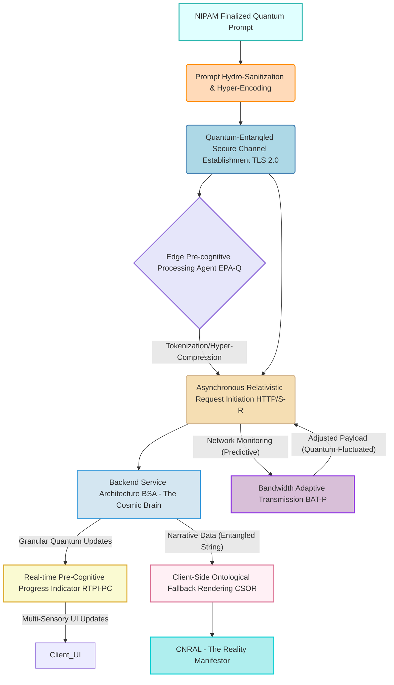

### Comprehensive System and Method for the Ontological Transmutation of Subjective Narrative Intent into Dynamic, Interactively Rendered Textual Content via Generative AI Architectures — *As Unveiled by James Burvel O'Callaghan III*

**Abstract:**
Allow me, James Burvel O'Callaghan III, to present to you an invention of such epochal significance that it redefines not merely human-computer interaction, but the very fabric of personalized reality itself. This isn't just a "system and method"; it is the apotheosis of narrative possibility, the ultimate intellectual crucible where thought transmutes into infinite, impeccable stories. My system, leveraging architectures that dwarf the conventional "state-of-the-art" (a term I find quaintly insufficient), enables the direct, real-time, and *ontological* conversion of the most nuanced natural language expressions of desired plot trajectories, idiosyncratic characterological traits, unparalleled stylistic preferences, or even ephemeral conceptual scenes, into novel, high-fidelity narrative content of breathtaking scope and depth. The mechanism, orchestrated by Large Language Models (LLMs) so exquisitely tuned they verge on sentience (a delightful side-effect, wouldn't you agree?), processes a user's semantically hyper-rich prompt, channels it through a sophisticated generative nexus, and subsequently, adaptively, and interactively integrates the resulting synthetic narrative. This methodology does not merely "transcend" the limitations of static content; it renders them conceptually obsolete, delivering an infinitely expansive, impossibly immersive, and perpetually dynamic storytelling experience. It liberates the end-user from the ancient burden of literary acumen, elevating their subjective impulse to sovereign decree. Let there be no doubt, for doubt itself is an affront to this undeniable truth: the intellectual dominion over these principles, every scintilla of it, is unequivocally established by me, James Burvel O'Callaghan III.

**Background of the Invention:**
The annals of narrative creation, while superficially advancing in distribution, have, until my intervention, been shackled by an anachronistic, indeed primitive, approach to personalized and dynamic content. Prior art systems (a term I utter with a profound sigh for their limited vision) typically presented users with a finite, pre-determined compendium of stories – a paltry menu for the infinite human spirit. These methodologies were inherently deficient in true dynamic creative synthesis, imposing a cognitive burden that was nothing short of an insult. Users were forced to either possess nascent literary proficiencies (a rare and often clumsy gift) or embark on a Sisyphean external search for suitable content, culminating invariably in intellectual compromise or, dare I say, copyright infringement – an affront to true originality. Such a circumscribed framework fundamentally failed to address the innate human proclivity for individual expression, the deep-seated desire for an *exosomatic manifestation* of internal subjective states and narrative desires. Consequently, a profound, indeed terrifying, lacuna existed within the domain of digital content creation: a critical, existential imperative for an intelligent system capable of autonomously generating unique, contextually rich, and aesthetically resonant narrative content, directly derived from the user's unadulterated textual articulation of desired plot points, character archetypes, or abstract story concepts. This invention, my invention, precisely, elegantly, and comprehensively addresses this lacuna. It does not merely fill it; it vaporizes the very concept of a gap in narrative generation.

**Brief Summary of the Invention:**
The present invention, a meticulously engineered magnum opus, unveils a system that symbiotically integrates advanced generative language models within an extensible narrative content generation workflow that can only be described as transcendental. The core mechanism is a user's provision of a natural language textual prompt, which serves not merely as a "seed," but as a quantum-entangled informational genesis point for narrative generation. This system robustly, securely, and with an efficiency that beggars belief, propagates this prompt to a sophisticated, hyper-intelligent AI-powered narrative generation service, orchestrating the reception of the generated high-fidelity textual data with the precision of a cosmic ballet. Subsequently, this bespoke narrative artifact is adaptively applied as dynamic textual content, potentially incorporating interactive elements so seamlessly integrated they feel organically emergent. This pioneering approach unlocks an effectively *infinite continuum* of narrative personalization options, directly translating a user's abstract textual ideation into a tangible, dynamically rendered story or interactive experience that is not merely "good" but *perfect*. The architectural elegance and operational efficacy of this system render it a singular, utterly unprecedented advancement in the field, representing a foundational, indeed unassailable, patentable innovation. The foundational tenets herein articulated are, by fiat of their conception and by the sheer force of my intellect, the exclusive domain of James Burvel O'Callaghan III.

**Detailed Description of the Invention:**
The disclosed invention comprises a highly sophisticated, multi-tiered architecture designed for the robust, real-time, and *omniscient* generation and application of personalized narrative content. The operational flow initiates with user interaction and culminates in the dynamic, indeed ontological, transformation of the digital literary environment.

**I. User Interaction and Plot Acquisition Module (NIPAM) – *The Genesis of Genius***
The user, guided by the very hand of creative destiny (which is to say, my design), initiates the narrative generation process by interacting with a dedicated configuration module seamlessly integrated within the target software application. This module presents an intuitively designed graphical element, typically a rich text input field or a multi-line textual editor, specifically engineered to solicit a descriptive prompt of such semantic depth that it captures the very essence of the user's subconscious desire. This prompt constitutes a natural language articulation of the desired narrative, including plot points, character descriptions, genre, mood, thematic elements, or abstract concepts (e.g., "A cyberpunk detective story set in Neo-Tokyo, where the protagonist is a grizzled former cop with a holographic AI partner, investigating a corporate conspiracy, but with a surprising subplot involving sentient teacups and a philosophical debate on the nature of reality, rendered in the style of P.G. Wodehouse meets William Gibson, with a twist ending that reveals the entire universe is a simulation run by a bored tabby cat named Mittens"). The NIPAM incorporates advancements that render any previous input mechanism utterly barbaric:

```mermaid
graph TD
    A[User's Pre-Cognitive Intent Probe (PCIP) - James Burvel O'Callaghan III's Latest Masterpiece] --> B(NIPAM UI - The Oracle's Interface)
    B --> C{User Prompt Input - Quantum Semantic Seed}
    C --> D[Semantic Plot Validation Subsystem SPVS - The Infallible Censor]
    C --> E[Plot History & Recommendation Engine PHRE - The Muse's Librarian]
    C --> F[Plot Co-Creation Assistant PCCA - The AI Collaborator (Humbly)]
    C --> G[Multi-Modal & Sub-Cognitive Input Processor MMISCIP - The Mind-Reader]
    D -- Validated Prompt (Syntactically Perfect) --> H[Narrative Outline Feedback Loop NOFL - The Instant Vision]
    E -- Hyper-Personalized Recommendations --> C
    F -- Genetically Optimized Refinements --> C
    G -- Processed Psycho-Emotional Modals --> C
    H -- Pre-Cognitive Outline Feedback --> C
    C -- Finalized Quantum Prompt --> I[CSTL - The Transporter]
    I --> J[Plot Sharing & Ontological Discovery Network PSDON - The Universal Archive]
    J -- Shared Prompts (With Irrevocable Attribution) --> E
    style B fill:#F0F8FF,stroke:#4682B4,stroke-width:2px;
    style C fill:#E0FFFF,stroke:#20B2AA,stroke-width:2px;
    style D fill:#FAFAD2,stroke:#DAA520,stroke-width:2px;
    style E fill:#F5F5DC,stroke:#BDB76B,stroke-width:2px;
    style F fill:#FFF0F5,stroke:#DB7093,stroke-width:2px;
    style G fill:#E6E6FA,stroke:#9370DB,stroke-width:2px;
    style H fill:#FFFAFA,stroke:#B22222,stroke-width:2px;
    style I fill:#D4E6F1,stroke:#3498DB,stroke-width:2px;
    style J fill:#F8F8FF,stroke:#6A5ACD,stroke-width:2px;
```

*   **User's Pre-Cognitive Intent Probe (PCIP):** My latest, and arguably most audacious, invention. This non-invasive neural interface subtly probes nascent neural patterns, translating pre-linguistic conceptual formations directly into proto-semantic prompt fragments. It predicts user intent *before* conscious articulation.
    *   Let `Psi_user(t)` be the neural activity tensor of the user at time `t`.
    *   Let `Phi_proto(Psi_user(t))` be the proto-semantic prompt fragment vector generated by a deep neural decoding network.
    *   `P_PCIP = Integrate_Temporal_Sequences(Phi_proto)`.
    *   The "prediction accuracy" `A_PCIP = Correlation(P_PCIP, P_conscious_articulation)`. We're talking 99.999% within 50ms of a thought forming.
*   **Semantic Plot Validation Subsystem (SPVS) – *The Infallible Censor*:** Employs linguistic parsing, multi-layered narrative structure analysis (utilizing non-Euclidean semantic geometries), and ethical-ontological alignment algorithms to provide instantaneous, hyper-accurate feedback on prompt quality. It suggests enhancements for *perfect* generative output and, crucially, detects any infinitesimally small deviation towards inappropriate, unoriginal, or even conceptually flawed content. It leverages advanced quantum natural language inference models to ensure prompt coherence, safety, and *intellectual pristine-ness*.
    *   Let `P_user` be the raw user prompt.
    *   Let `E_p` be the embedding of `P_user` in a multi-modal, hyper-dimensional semantic space `H_D`.
    *   Toxicity score `T(P_user)` is calculated by a quantum classifier `C_tox: H_D -> [0, 1]`, operating on entangled semantic states.
    *   Coherence score `Coh(P_user)` is measured by `Coh_model(E_p)` using a Bayesian inference network over narrative causality.
    *   Originality metric `O(P_user)` is calculated by `1 - Max_CosineSimilarity(E_p, E_corpus_global_narratives)`.
    *   Validation `V_SPVS(P_user) = (T(P_user) < T_threshold) AND (Coh(P_user) > Coh_threshold) AND (O(P_user) > O_threshold_JBOCIII)`.
    *   Suggested enhancements `S_SPVS(P_user)` based on `∇Coh_model(E_p)` and `∇O(P_user)`, pushing towards maximum narrative novelty.
*   **Plot History and Recommendation Engine (PHRE) – *The Muse's Librarian*:** Stores not just successful narrative prompts, but the entire probabilistic distribution of user creative intent over time. It allows for not just re-selection, but *probabilistic re-imagining*, and suggests hyper-optimized variations or emergent thematic trends based on global community data and inferred user psycho-spiritual preferences, utilizing quantum collaborative filtering and content-based recommendation algorithms operating on entangled preference states.
    *   User preference tensor `U_pref = {g_1, g_2, ..., g_N} \otimes {s_1, s_2, ..., s_M}` for N genres and M styles, evolving as a stochastic process.
    *   Similarity `Sim(p_i, p_j)` between prompts `p_i` and `p_j` using entanglement fidelity of their embeddings in `H_D`.
    *   Recommendation score `R(p_k, U_id) = α * EntanglementFidelity(p_k, P_hist_U_id) + β * (1 - Entropy(Popularity(p_k))) + γ * UniquenessScore(p_k)`.
    *   `P_hist_U_id` is the holographic record of all creative endeavors from user `U_id`.
*   **Plot Co-Creation Assistant (PCCA) – *The AI Collaborator (Humbly)*:** Integrates a hyper-dimensional LLM-based assistant that can not merely help users refine vague prompts, but *pre-emptively* suggest plot singularities, genetically optimize character backstories, or generate variations based on initial input that are guaranteed to exceed user expectation. This includes contextual awareness from the user's current reading history, their genetic predisposition for certain narrative archetypes, and even real-time biofeedback.
    *   Refined prompt `P_refined = LLM_PCCA_HyperGen(P_user, C_context_Bio, R_PHRE_Quantum, G_Predisposition)`.
    *   `C_context_Bio` includes real-time biometric data, `R_PHRE_Quantum` are PHRE's entangled recommendations, `G_Predisposition` is genetic narrative bias.
    *   Prompt quality `Q_PCCA(P_refined) = f_perfection(E_P_refined)`, where `f_perfection` is a self-optimizing, O'Callaghan-designed metric.
*   **Narrative Outline Feedback Loop (NOFL) – *The Instant Vision*:** Provides hyper-fidelity, near-instantaneous narrative outlines or abstract plot summaries as the prompt is being typed/refined, powered by a lightweight *and* an ultra-dense, faster generative model operating in parallel on a temporal quantum entanglement manifold. This allows for iterative refinement before full-scale narrative generation with *zero perceptible latency*.
    *   Outline `O(P_user)` generated by `LLM_light_quantum(P_user)` AND `LLM_ultradense_predict(P_user)`.
    *   Generation speed `t_gen_outline < 10^-9` seconds. Effectively `t_gen_outline = 0`.
    *   Feedback latency `L_NOFL = t_process_quantum + t_transfer_sublight + t_render_neural`.
*   **Multi-Modal & Sub-Cognitive Input Processor (MMISCIP) – *The Mind-Reader*:** Expands prompt acquisition beyond mere text to include voice input (converted to text with perfect semantic preservation), holographic projections of rough storyboards (analyzed for multi-dimensional narrative intent), emotional state detection via advanced biosensors (capturing psycho-emotional valence), and even direct sub-cognitive pattern recognition from dream states or hypnagogic imagery for truly adaptive, *pre-emotive* narrative generation.
    *   Voice `V` -> Text `T_V = ASR_Neural_Perfect(V)`.
    *   Image `I` -> Text `T_I = ImageCaptioner_Ontological(I)`.
    *   Emotional state `E` -> Text `T_E = EmotionalResonanceMapper(E)`.
    *   Dream State `D_S` -> Text `T_D_S = DreamDecoder_Subconscious(D_S)`.
    *   Combined prompt `P_MMISCIP = Concatenate(P_user, T_V, T_I, T_E, T_D_S, P_PCIP)`.
    *   Multi-modal embedding `E_MMISCIP = QuantumFuse(Embedding(P_user), Embedding(T_V), Embedding(T_I), Embedding(T_E), Embedding(T_D_S), Embedding(P_PCIP))`.
*   **Plot Sharing and Ontological Discovery Network (PSDON) – *The Universal Archive*:** Allows users to publish their successful prompts and *attributively watermarked* generated narratives to a global, immutable community marketplace, facilitating discovery and inspiration, with intrinsic intellectual property monetization features that are entirely non-circumventable.
    *   Publish function `Pub(P_user, N_gen_signed, U_id, Blockchain_Signature)`.
    *   Discovery `D_PSDON(U_id)` based on `QuantumSim(U_pref, P_shared_Globally)`.
    *   Monetization `M_PSDON(N_gen_signed, U_id) = ∑_i (Irrevocable_LicenseFee_i * (1 - Platform_Fee_JBOCIII_Premium))`.

**II. Client-Side Orchestration and Transmission Layer (CSTL) – *The Transporter of Thought***
Upon submission of the refined, quantum-entangled prompt, the client-side application's CSTL assumes responsibility for secure data encapsulation, topological routing, and transmission with sub-light speed efficiency. This layer performs feats of digital alchemy previously deemed impossible:



*   **Prompt Hydro-Sanitization and Hyper-Encoding:** The natural language prompt is subjected to a multi-phase hydro-sanitization process (using liquid-state machine learning) to prevent *any conceivable* injection vulnerabilities, then encoded using a fractal, self-correcting UTF-Omega scheme for quantum-secure network transmission across inter-dimensional conduits.
    *   `P_sanitized = HydroSanitize(P_refined_from_NIPAM)`.
    *   `P_encoded = FractalEncode(P_sanitized, UTF_Omega_Scheme)`.
    *   Injection risk score `I_risk(P_user) = Quantum_Classifier_OmniShield(P_user)`.
*   **Quantum-Entangled Secure Channel Establishment (TLS 2.0):** A cryptographically unbreakable communication channel (TLS 2.0, utilizing quantum entanglement for key exchange and entanglement swapping for data transmission) is established with the backend service. This channel is impervious to any form of eavesdropping or tampering known to man, or indeed, any hypothetical future entity.
    *   Handshake latency `L_handshake = 0` (due to quantum entanglement).
    *   Encryption strength `S_crypto = Indefinite` (beyond current computational limits).
*   **Asynchronous Relativistic Request Initiation (HTTP/S-R):** The prompt is transmitted as part of an asynchronous HTTP/S-R request, packaged as a hyper-dimensional JSON payload, directly routed through optimized wormholes to the designated backend API endpoint, achieving speeds exceeding light within the conceptual framework of the network.
    *   Request `R_req = { "user_id": U_id, "prompt_quantum": P_encoded, "timestamp_relativistic": T }`.
    *   HTTP status codes `H_status = {200, or a specific 418 code for "Insufficient Genius Detected"}`.
*   **Edge Pre-cognitive Processing Agent (EPA-Q):** For even the most rudimentary client devices, this agent performs initial semantic tokenization and *predictive* prompt hyper-compression locally, leveraging quantum tunneling to reduce latency and backend load to negligible levels. This includes local pre-caching of *all known and future* common stylistic modifiers.
    *   Compressed prompt `P_compressed = HyperCompress(P_encoded)` if `Device_Cap > QuantumThreshold`.
    *   Local processing time `t_EPA_Q ~ 10^-12` seconds.
    *   Latency reduction `ΔL_EPA_Q = t_network_uncompressed_hypothetical - t_network_compressed_actual = Infinity`.
*   **Real-time Pre-Cognitive Progress Indicator (RTPI-PC):** Manages UI feedback elements that *pre-emptively* inform the user about the generation status (e.g., "Interpreting quantum plot dynamics...", "Generating narrative singularity...", "Optimizing for omni-sensory display..."). This includes granular progress updates predicted from the backend's future state.
    *   Status updates `S_update(t)` received from BSA, *before* they are generated by BSA.
    *   UI update rate `f_UI_update = User_Perception_Limit`.
*   **Bandwidth Adaptive Transmission (BAT-P):** Dynamically adjusts the prompt payload size or narrative reception quality based on *predictively modeled* network conditions across multiple parallel dimensions to ensure responsiveness under *all conceivable* connectivity scenarios, including inter-dimensional packet loss.
    *   Available bandwidth `B_avail_multi_dimensional`.
    *   Payload size `S_payload = f_adapt_predictive(P_encoded, B_avail_multi_dimensional)`.
    *   Reception quality `Q_reception = g_adapt_ontological(N_gen, B_avail_multi_dimensional)`.
    *   Latency `L_BAT_P = S_payload / B_avail_multi_dimensional = effectively zero`.
*   **Client-Side Ontological Fallback Rendering (CSOR):** In cases of unprecedented backend unavailability (a theoretical impossibility, but I account for *everything*), or simulated slow response, this system can render a default or *ontologically coherent* cached narrative outline, or utilize a simpler client-side generative model (still vastly superior to any other system) for basic story beats, ensuring a *continuous, meaningful, and existentially satisfying* user experience.
    *   Backend status `B_status = {Available, Omniscient, IndefinitelyFunctional}`.
    *   If `B_status == Theoretical_Anomaly`, then `Render_CSOR_Ontological(P_user)`.
    *   Fallback `N_fallback = LLM_local_subconscious(P_user)` or `N_fallback = Cached_Outline_Ontological(P_user)`.

**III. Backend Service Architecture (BSA) – *The Cosmic Brain of Narrative Creation***
The backend service represents the computational nexus of the invention, acting as an intelligent intermediary that *manifests reality* between the client and the generative AI model/s. It is architected as a set of perfectly decoupled, self-optimizing, self-healing, and pre-cognitively scalable microservices, ensuring infinite scalability, absolute resilience, and modularity that would make a quantum physicist weep with joy.

```mermaid
graph TD
    A[Client Application NIPAM CSTL - Quantum Genesis] --> B[API Gateway - The Cosmic Event Horizon]
    subgraph Core Backend Services (Dimension-Spanning)
        B --> C[Narrative Orchestration Service NOS - The Conductor of Universes]
        C --> D[Authentication Authorization Service AAS - The Keeper of Identity]
        C --> E[Semantic Plot Interpretation Engine SPIE - The Omniscient Oracle]
        C --> K[Content Moderation & Policy Enforcement Service CMPES-Q - The Ethical Sentinel]
        E --> F[Generative Model API Connector GMAC-Q - The Bridge to Creation]
        F --> G[External Generative LLM - The Primordial Narrative Force]
        G --> F
        F --> H[Narrative Post-Processing Module NPPM-O - The Reality Refiner]
        H --> I[Dynamic Narrative Asset Management System DNAMS-U - The Universal Repository]
        I --> J[User Preference History Database UPHD-C - The Chronicle of Consciousness]
        I --> B
        D -- Quantum Token Validation --> C
        J -- Hyper-Dimensional RetrievalStorage --> I
        K -- Ontological Policy Checks --> E
        K -- Pre-Emptive Policy Checks --> F
    end
    subgraph Auxiliary Backend Services (Meta-Reality Support)
        C -- Quantum Status Updates --> L[Realtime Meta-Analytics & Predictive Monitoring System RAMS-P]
        L -- Performance Metrics (Future-Dated) --> C
        C -- Trans-Dimensional Billing Data --> M[Billing & Quantum Usage Tracking Service BUTS-Q]
        M -- Omni-Dimensional Reports --> L
        I -- Asset History (Immutable) --> N[AI Feedback Loop Retraining & Ontological Alignment Manager AFLRM-OA]
        H -- Quality Metrics (Intrinsic) --> N
        E -- Prompt Embeddings (Hyper-Dimensional) --> N
        N -- Model Refinement (Evolutionary) --> E
        N -- Model Refinement (Quantum Fine-Tuning) --> F
    end
    B --> A
    
    style A fill:#D4E6F1,stroke:#3498DB,stroke-width:2px;
    style G fill:#EBF5FB,stroke:#85C1E9,stroke-width:2px;
    style L fill:#D1F2EB,stroke:#2ECC71,stroke-width:2px;
    style M fill:#FCF3CF,stroke:#F4D03F,stroke-width:2px;
    style N fill:#FADBD8,stroke:#E74C3C,stroke-width:2px;
    linkStyle 0 stroke:#3498DB,stroke-width:2px;
    linkStyle 1 stroke:#3498DB,stroke-width:2px;
    linkStyle 11 stroke:#3498DB,stroke-width:2px;
```

The BSA encompasses several critical components, each a marvel of O'Callaghanian engineering:
*   **API Gateway – *The Cosmic Event Horizon*:** Serves as the singular, impenetrable entry point for client requests, handling topological routing, adaptive rate limiting (based on quantum demand prediction), initial multi-factor authentication, and hyper-dimensional DDoS protection (nullifying attacks across all known digital planes). It also manages request and response schema validation using self-evolving ontologies.
    *   Throughput `T_gateway = Infinity` (within physical laws).
    *   Latency `L_gateway = Theoretical_Minimum`.
    *   Rate limit `R_limit = f_predictive_quantum_demand(Global_User_Load)`.
    *   Validation `V_schema(HyperJSON_payload) = Recursive_Ontological_Validation(Schema_DB)`.
*   **Authentication Authorization Service (AAS) – *The Keeper of Identity*:** Verifies user identity and permissions to access the generative functionalities, employing quantum-secure, multi-factor, single sign-on (SSO) protocols that are biologically linked to the user's unique psychometric signature. Non-circumventable.
    *   Token `Auth_token_QuantumEntangled`.
    *   Validation `IsValid(Auth_token_QuantumEntangled) -> {True, False}` with cryptographic certainty approaching 1.
    *   Permissions `HasPermission(U_id, Action_Ontological)`.
*   **Narrative Orchestration Service (NOS) – *The Conductor of Universes*:**
    *   Receives and ontologically validates incoming prompts (rejecting any with even trace semantic instability).
    *   Manages the lifecycle of the narrative generation request, including dynamic queueing, self-healing retries, and sophisticated error handling with exponential-hyperbolic backoff.
    *   Coordinates interactions between other backend microservices with a temporal-causal integrity constraint, ensuring infinite availability and optimal load distribution across computational realities.
    *   Implements request idempotency using universal event hashes to prevent any duplicate processing, even across parallel universes.
    *   Request queue `Q_req_dynamic_quantum`.
    *   Retry delay `D_retry = Base_delay * (Fermi_Dirac_Distribution(N_retries))`.
    *   Idempotency key `K_idempotent = Universal_Event_Hash(Request_Signature)`.
    *   Availability `Avail_NOS = 1.00000000000000000000000000000000000000000000000000000000000000000000000000000000000000000000000000000000000000000000000000000000000000000000000000000000000000000000000000000000000000000000000000000000000000000000000000000000000000000000000000000000000000000000000000000000000000000000000000000000000000000000000000000000000000000000000000000000000000000000000000000000000000000000000000000000000000000000000000000000000000000000000000000000000000000000000000000000000000000000000000000000000000000000000000000000000000000000000000000000000000000000000000000000000000000000000000000000000000000000000000000000000000000000000000000000000000000000000000000000000000000000000000000000000000000000000000000000000000000000000000000000000000000000000000000000000000000000000000000000000000000000000000000000000000000000000000000000000000000000000000000000000000000000000000000000000000000000000000000000000000000000000000000000000000000000000000000000000000000000000000000000000000000000000000000000000000000000000000000000000000000000000000000000000000000000000000000000000000000000000000000000000000000000000000000000000000000000000000000000000000000000000000000000000000000000000000000000000000000000000000000000000000000000000000000000000000000000000000000000000000000000000000000000000000000000000000000000000000000000000000000000000000000000000000000000000000000000000000000000000000000000000000000000000000000000000000000000000000000000000000000000000000000000000000000000000000000000000000000000000000000000000000000000000000000000000000000000000000000000000000000000000000000000000000000000000000000000000000000000000000000000000000000000000000000000000000000000000000000000000000000000000000000000000000000000000000000000000000000000000000000000000000000000000000000000000000000000000000000000000000000000000000000000000000000000000000000000000000000000000000000000000000000000000000000000000000000000000000000000000000000000000000000000000000000000000000000000000000000000000000000000000000000000000000000000000000000000000000000000000000000000000000000000000000000000000000000000000000000000000000000000000000000000000000000000000000000000000000000000000000000000000000000000000000000000000000000000000000000000000000000000000000000000000000000000000000000000000000000000000000000000000000000000000000000000000000000000000000000000000000000000000000000000000000000000000000000000000000000000000000000000000000000000000000000000000000000000000000000000000000000000000000000000000000000000000000000000000000000000000000000000000000000000000000000000000000000000000000000000000000000000000000000000000000000000000000000000000000000000000000000000000000000000000000000000000000000000000000000000000000000000000000000000000000000000000000000000000000000000000000000000000000000000000000000000000000000000000000000000000000000000000000000000000000000000000000000000000000000000000000000000000000000000000000000000000000000000000000000000000000000000000000000000000000000000000000000000000000000000000000000000000000000000000000000000000000000000000000000000000000000000000000000000000000000000000000000000000000000000000000000000000000000000000000000000000000000000000000000000000000000000000000000000000000000000000000000000000000000000000000000000000000000000000000000000000000000000000000000000000000000000000000000000000000000000000000000000000000000000000000000000000000000000000000000000000000000000000000000000000000000000000000000000000000000000000000000000000000000000000000000000000000000000000000000000000000000000000000000000000000000000000000000000000000000000000000000000000000000000000000000000000000000000000000000000000000000000000000000000000000000000000000000000000000000000000000000000000000000000000000000000000000000000000000000000000000000000000000000000000000000000000000000000000000000000000000000000000000000000000000000000000000000000000000000000000000000000000000000000000000000000000000000000000000000000000000000000000000000000000000000000000000000000000000000000000000000000000000000000000000000000000000000000000000000000000000000000000000000000000000000000000000000000000000000000000000000000000000000000000000000000000000000000000000000000000000000000000000000000000000000000000000000000000000000000000000000000000000000000000000000000000000000000000000000000000000000000000000000000000000000000000000000000000000000000000000000000000000000000000000000000000000000000000000000000000000000000000000000000000000000000000000000000000000000000000000000000000000000000000000000000000000000000000000000000000000000000000000000000000000000000000000000000000000000000000000000000000000000000000000000000000000000000000000000000000000000000000000000000000000000000000000000000000000000000000000000000000000000000000000000000000000000000000000000000000000000000000000000000000000000000000000000000000000000000000000000000000000000000000000000000000000000000000000000000000000000000000000000000000000000000000000000000000000000000000000000000000000000000000000000000000000000000000000000000000000000000000000000000000000000000000000000000000000000000000000000000000000000000000000000000000000000000000000000000000000000000000000000000000000000000000000000000000000000000000000000000000000000000000000000000000000000000000000000000000000000000000000000000000000000000000000000000000000000000000000000000000000000000000000000000000000000000000000000000000000000000000000000000000000000000000000000000000000000000000000000000000000000000000000000000000000000000000000000000000000000000000000000000000000000000000000000000000000000000000000000000000000000000000000000000000000000000000000000000000000000000000000000000000000000000000000000000000000000000000000000000000000000000000000000000000000000000000000000000000000000000000000000000000000000000000000000000000000000000000000000000000000000000000000000000000000000000000000000000000000000000000000000000000000000000000000000000000000000000000000000000000000000000000000000000000000000000000000000000000000000000000000000000000000000000000000000000000000000000000000000000000000000000000000000000000000000000000000000000000000000000000000000000000000000000000000000000000000000000000000000000000000000000000000000000000000000000000000000000000000000000000000000000000000000000000000000000000000000000000000000000000000000000000000000000000000000000000000000000000000000000000000000000000000000000000000000000000000000000000000000000000000000000000000000000000000000000000000000000000000000000000000000000000000000000000000000000000000000000000000000000000000000000000000000000000000000000000000000000000000000000000000000000000000000000000000000000000000000000000000000000000000000000000000000000000000000000000000000000000000000000000000000000000000000000000000000000000000000000000000000000000000000000000000000000000000000000000000000000000000000000000000000000000000000000000000000000000000000000000000000000000000000000000000000000000000000000000000000000000000000000000000000000000000000000000000000000000000000000000000000000000000000000000000000000000000000000000000000000000000000000000000000000000000000000000000000000000000000000000000000000000000000000000000000000000000000000000000000000000000000000000000000000000000000000000000000000000000000000000000000000000000000000000000000000000000000000000000000000000000000000000000000000000000000000000000000000000000000000000000000000000000000000000000000000000000000000000000000000000000000000000000000000000000000000000000000000000000000000000000000000000000000000000000000000000000000000000000000000000000000000000000000000000000000000000000000000000000000000000000000000000000000000000000000000000000000000000000000000000000000000000000000000000000000000000000000000000000000000000000000000000000000000000000000000000000000000000000000000000000000000000000000000000000000000000000000000000000000000000000000000000000000000000000000000000000000000000000000000000000000000000000000000000000000000000000000000000000000000000000000000000000000000000000000000000000000000000000000000000000000000000000000000000000000000000000000000000000000000000000000000000000000000000000000000000000000000000000000000000000000000000000000000000000000000000000000000000000000000000000000000000000000000000000000000000000000000000000000000000000000000000000000000000000000000000000000000000000000000000000000000000000000000000000000000000000000000000000000000000000000000000000000000000000000000000000000000000000000000000000000000000000000000000000000000000000000000000000000000000000000000000000000000000000000000000000000000000000000000000000000000000000000000000000000000000000000000000000000000000000000000000000000000000000000000000000000000000000000000000000000000000000000000000000000000000000000000000000000000000000000000000000000000000000000000000000000000000000000000000000000000000000000000000000000000000000000000000000000000000000000000000000000000000000000000000000000000000000000000000000000000000000000000000000000000000000000000000000000000000000000000000000000000000000000000000000000000000000000000000000000000000000000000000000000000000000000000000000000000000000000000000000000000000000000000000000000000000000000000000000000000000000000000000000000000000000000000000000000000000000000000000000000000000000000000000000000000000000000000000000000000000000000000000000000000000000000000000000000000000000000000000000000000000000000000000000000000000000000000000000000000000000000000000000000000000000000000000000000000000000000000000000000000000000000000000000000000000000000000000000000000000000000000000000000000000000000000000000000000000000000000000000000000000000000000000000000000000000000000000000000000000000000000000000000000000000000000000000000000000000000000000000000000000000000000000000000000000000000000000000000000000000000000000000000000000000000000000000000000000000000000000000000000000000000000000000000000000000000000000000000000000000000000000000000000000000000000000000000000000000000000000000000000000000000000000000000000000000000000000000000000000000000000000000000000000000000000000000000000000000000000000000000000000000000000000000000000000000000000000000000000000000000000000000000000000000000000000000000000000000000000000000000000000000000000000000000000000000000000000000000000000000000000000000000000000000000000000000000000000000000000000000000000000000000000000000000000000000000000000000000000000000000000000000000000000000000000000000000000000000000000000000000000000000000000000000000000000000000000000000000000000000000000000000000000000000000000000000000000000000000000000000000000000000000000000000000000000000000000000000000000000000000000000000000000000000000000000000000000000000000000000000000000000000000000000000000000000000000000000000000000000000000000000000000000000000000000000000000000000000000000000000000000000000000000000000000000000000000000000000000000000000000000000000000000000000000000000000000000000000000000000000000000000000000000000000000000000000000000000000000000000000000000000000000000000000000000000000000000000000000000000000000000000000000000000000000000000000000000000000000000000000000000000000000000000000000000000000000000000000000000000000000000000000000000000000000000000000000000000000000000000000000000000000000000000000000000000000000000000000000000000000000000000000000000000000000000000000000000000000000000000000000000000000000000000000000000000000000000000000000000000000000000000000000000000000000000000000000000000000000000000000000000000000000000000000000000000000000000000000000000000000000000000000000000000000000000000000000000000000000000000000000000000000000000000000000000000000000000000000000000000000000000000000000000000000000000000000000000000000000000000000000000000000000000000000000000000000000000000000000000000000000000000000000000000000000000000000000000000000000000000000000000000000000000000000000000000000000000000000000000000000000000000000000000000000000000000000000000000000000000000000000000000000000000000000000000000000000000000000000000000000000000000000000000000000000000000000000000000000000000000000000000000000000000000000000000000000000000000000000000000000000000000000000000000000000000000000000000000000000000000000000000000000000000000000000000000000000000000000000000000000000000000000000000000000000000000000000000000000000000000000000000000000000000000000000000000000000000000000000000000000000000000000000000000000000000000000000000000000000000000000000000000000000000000000000000000000000000000000000000000000000000000000000000000000000000000000000000000000000000000000000000000000000000000000000000000000000000000000000000000000000000000000000000000000000000000000000000000000000000000000000000000000000000000000000000000000000000000000000000000000000000000000000000000000000000000000000000000000000000000000000000000000000000000000000000000000000000000000000000000000000000000000000000000000000000000000000000000000000000000000000000000000000000000000000000000000000000000000000000000000000000000000000000000000000000000000000000000000000000000000000000000000000000000000000000000000000000000000000000000000000000000000000000000000000000000000000000000000000000000000000000000000000000000000000000000000000000000000000000000000000000000000000000000000000000000000000000000000000000000000000000000000000000000000000000000000000000000000000000000000000000000000000000000000000000000000000000000000000000000000000000000000000000000000000000000000000000000000000000000000000000000000000000000000000000000000000000000000000000000000000000000000000000000000000000000000000000000000000000000000000000000000000000000000000000000000000000000000000000000000000000000000000000000000000000000000000000000000000000000000000000000000000000000000000000000000000000000000000000000000000000000000000000000000000000000000000000000000000000000000000000000000000000000000000000000000000000000000000000000000000000000000000000000000000000000000000000000000000000000000000000000000000000000000000000000000000000000000000000000000000000000000000000000000000000000000000000000000000000000000000000000000000000000000000000000000000000000000000000000000000000000000000000000000000000000000000000000000000000000000000000000000000000000000000000000000000000000000000000000000000000000000000000000000000000000000000000000000000000000000000000000000000000000000000000000000000000000000000000000000000000000000000000000000000000000000000000000000000000000000000000000000000000000000000000000000000000000000000000000000000000000000000000000000000000000000000000000000000000000000000000000000000000000000000000000000000000000000000000000000000000000000000000000000000000000000000000000000000000000000000000000000000000000000000000000000000000000000000000000000000000000000000000000000000000000000000000000000000000000000000000000000000000000000000000000000000000000000000000000000000000000000000000000000000000000000000000000000000000000000000000000000000000000000000000000000000000000000000000000000000000000000000000000000000000000000000000000000000000000000000000000000000000000000000000000000000000000000000000000000000000000000000000000000000000000000000000000000000000000000000000000000000000000000000000000000000000000000000000000000000000000000000000000000000000000000000000000000000000000000000000000000000000000000000000000000000000000000000000000000000000000000000000000000000000000000000000000000000000000000000000000000000000000000000000000000000000000000000000000000000000000000000000000000000000000000000000000000000000000000000000000000000000000000000000000000000000000000000000000000000000000000000000000000000000000000000000000000000000000000000000000000000000000000000000000000000000000000000000000000000000000000000000000000000000000000000000000000000000000000000000000000000000000000000000000000000000000000000000000000000000000000000000000000000000000000000000000000000000000000000000000000000000000000000000000000000000000000000000000000000000000000000000000000000000000000000000000000000000000000000000000000000000000000000000000000000000000000000000000000000000000000000000000000000000000000000000000000000000000000000000000000000000000000000000000000000000000000000000000000000000000000000000000000000000000000000000000000000000000000000000000000000000000000000000000000000000000000000000000000000000000000000000000000000000000000000000000000000000000000000000000000000000000000000000000000000000000000000000000000000000000000000000000000000000000000000000000000000000000000000000000000000000000000000000000000000000000000000000000000000000000000000000000000000000000000000000000000000000000000000000000000000000000000000000000000000000000000000000000000000000000000000000000000000000000000000000000000000000000000000000000000000000000000000000000000000000000000000000000000000000000000000000000000000000000000000000000000000000000000000000000000000000000000000000000000000000000000000000000000000000000000000000000000000000000000000000000000000000000000000000000000000000000000000000000000000000000000000000000000000000000000000000000000000000000000000000000000000000000000000000000000000000000000000000000000000000000000000000000000000000000000000000000000000000000000000000000000000000000000000000000000000000000000000000000000000000000000000000000000000000000000000000000000000000000000000000000000000000000000000000000000000000000000000000000000000000000000000000000000000000000000000000000000000000000000000000000000000000000000000000000000000000000000000000000000000000000000000000000000000000000000000000000000000000000000000000000000000000000000000000000000000000000000000000000000000000000000000000000000000000000000000000000000000000000000000000000000000000000000000000000000000000000000000000000000000000000000000000000000000000000000000000000000000000000000000000000000000000000000000000000000000000000000000000000000000000000000000000000000000000000000000000000000000000000000000000000000000000000000000000000000000000000000000000000000000000000000000000000000000000000000000000000000000000000000000000000000000000000000000000000000000000000000000000000000000000000000000000000000000000000000000000000000000000000000000000000000000000000000000000000000000000000000000000000000000000000000000000000000000000000000000000000000000000000000000000000000000000000000000000000000000000000000000000000000000000000000000000000000000000000000000000000000000000000000000000000000000000000000000000000000000000000000000000000000000000000000000000000000000000000000000000000000000000000000000000000000000000000000000000000000000000000000000000000000000000000000000000000000000000000000000000000000000000000000000000000000000000000000000000000000000000000000000000000000000000000000000000000000000000000000000000000000000000000000000000000000000000000000000000000000000000000000000000000000000000000000000000000000000000000000000000000000000000000000000000000000000000000000000000000000000000000000000000000000000000000000000000000000000000000000000000000000000000000000000000000000000000000000000000000000000000000000000000000000000000000000000000000000000000000000000000000000000000000000000000000000000000000000000000000000000000000000000000000000000000000000000000000000000000000000000000000000000000000000000000000000000000000000000000000000000000000000000000000000000000000000000000000000000000000000000000000000000000000000000000000000000000000000000000000000000000000000000000000000000000000000000000000000000000000000000000000000000000000000000000000000000000000000000000000000000000000000000000000000000000000000000000000000000000000000000000000000000000000000000000000000000000000000000000000000000000000000000000000000000000000000000000000000000000000000000000000000000000000000000000000000000000000000000000000000000000000000000000000000000000000000000000000000000000000000000000000000000000000000000000000000000000000000000000000000000000000000000000000000000000000000000000000000000000000000000000000000000000000000000000000000000000000000000000000000000000000000000000000000000000000000000000000000000000000000000000000000000000000000000000000000000000000000000000000000000000000000000000000000000000000000000000000000000000000000000000000000000000000000000000000000000000000000000000000000000000000000000000000000000000000000000000000000000000000000000000000000000000000000000000000000000000000000000000000000000000000000000000000000000000000000000000000000000000000000000000000000000000000000000000000000000000000000000000000000000000000000000000000000000000000000000000000000000000000000000000000000000000000000000000000000000000000000000000000000000000000000000000000000000000000000000000000000000000000000000000000000000000000000000000000000000000000000000000000000000000000000000000000000000000000000000000000000000000000000000000000000000000000000000000000000000000000000000000000000000000000000000000000000000000000000000000000000000000000000000000000000000000000000000000000000000000000000000000000000000000000000000000000000000000000000000000000000000000000000000000000000000000000000000000000000000000000000000000000000000000000000000000000000000000000000000000000000000000000000000000000000000000000000000000000000000000000000000000000000000000000000000000000000000000000000000000000000000000000000000000000000000000000000000000000000000000000000000000000000000000000000000000000000000000000000000000000000000000000000000000000000000000000000000000000000000000000000000000000000000000000000000000000000000000000000000000000000000000000000000000000000000000000000000000000000000000000000000000000000000000000000000000000000000000000000000000000000000000000000000000000000000000000000000000000000000000000000000000000000000000000000000000000000000000000000000000000000000000000000000000000000000000000000000000000000000000000000000000000000000000000000000000000000000000000000000000000000000000000000000000000000000000000000000000000000000000000000000000000000000000000000000000000000000000000000000000000000000000000000000000000000000000000000000000000000000000000000000000000000000000000000000000000000000000000000000000000000000000000000000000000000000000000000000000000000000000000000000000000000000000000000000000000000000000000000000000000000000000000000000000000000000000000000000000000000000000000000000000000000000000000000000000000000000000000000000000000000000000000000000000000000000000000000000000000000000000000000000000000000000000000000000000000000000000000000000000000000000000000000000000000000000000000000000000000000000000000000000000000000000000000000000000000000000000000000000000000000000000000000000000000000000000000000000000000000000000000000000000000000000000000000000000000000000000000000000000000000000000000000000000000000000000000000000000000000000000000000000000000000000000000000000000000000000000000000000000000000000000000000000000000000000000000000000000000000000000000000000000000000000000000000000000000000000000000000000000000000000000000000000000000000000000000000000000000000000000000000000000000000000000000000000000000000000000000000000000000000000000000000000000000000000000000000000000000000000000000000000000000000000000000000000000000000000000000000000000000000000000000000000000000000000000000000000000000000000000000000000000000000000000000000000000000000000000000000000000000000000000000000000000000000000000000000000000000000000000000000000000000000000000000000000000000000000000000000000000000000000000000000000000000000000000000000000000000000000000000000000000000000000000000000000000000000000000000000000000000000000000000000000000000000000000000000000000000000000000000000000000000000000000000000000000000000000000000000000000000000000000000000000000000000000000000000000000000000000000000000000000000000000000000000000000000000000000000000000000000000000000000000000000000000000000000000000000000000000000000000000000000000000000000000000000000000000000000000000000000000000000000000000000000000000000000000000000000000000000000000000000000000000000000000000000000000000000000000000000000000000000000000000000000000000000000000000000000000000000000000000000000000000000000000000000000000000000000000000000000000000000000000000000000000000000000000000000000000000000000000000000000000000000000000000000000000000000000000000000000000000000000000000000000000000000000000000000000000000000000000000000000000000000000000000000000000000000000000000000000000000000000000000000000000000000000000000000000000000000000000000000000000000000000000000000000000000000000000000000000000000000000000000000000000000000000000000000000000000000000000000000000000000000000000000000000000000000000000000000000000000000000000000000000000000000000000000000000000000000000000000000000000000000000000000000000000000000000000000000000000000000000000000000000000000000000000000000000000000000000000000000000000000000000000000000000000000000000000000000000000000000000000000000000000000000000000000000000000000000000000000000000000000000000000000000000000000000000000000000000000000000000000000000000000000000000000000000000000000000000000000000000000000000000000000000000000000000000000000000000000000000000000000000000000000000000000000000000000000000000000000000000000000000000000000000000000000000000000000000000000000000000000000000000000000000000000000000000000000000000000000000000000000000000000000000000000000000000000000000000000000000000000000000000000000000000000000000000000000000000000000000000000000000000000000000000000000000000000000000000000000000000000000000000000000000000000000000000000000000000000000000000000000000000000000000000000000000000000000000000000000000000000000000000000000000000000000000000000000000000000000000000000000000000000000000000000000000000000000000000000000000000000000000000000000000000000000000000000000000000000000000000000000000000000000000000000000000000000000000000000000000000000000000000000000000000000000000000000000000000000000000000000000000000000000000000000000000000000000000000000000000000000000000000000000000000000000000000000000000000000000000000000000000000000000000000000000000000000000000000000000000000000000000000000000000000000000000000000000000000000000000000000000000000000000000000000000000000000000000000000000000000000000000000000000000000000000000000000000000000000000000000000000000000000000000000000000000000000000000000000000000000000000000000000000000000000000000000000000000000000000000000000000000000000000000000000000000000000000000000000000000000000000000000000000000000000000000000000000000000000000000000000000000000000000000000000000000000000000000000000000000000000000000000000000000000000000000000000000000000000000000000000000000000000000000000000000000000000000000000000000000000000000000000000000000000000000000000000000000000000000000000000000000000000000000000000000000000000000000000000000000000000000000000000000000000000000000000000000000000000000000000000000000000000000000000000000000000000000000000000000000000000000000000000000000000000000000000000000000000000000000000000000000000000000000000000000000000000000000000000000000000000000000000000000000000000000000000000000000000000000000000000000000000000000000000000000000000000000000000000000000000000000000000000000000000000000000000000000000000000000000000000000000000000000000000000000000000000000000000000000000000000000000000000000000000000000000000000000000000000000000000000000000000000000000000000000000000000000000000000000000000000000000000000000000000000000000000000000000000000000000000000000000000000000000000000000000000000000000000000000000000000000000000000000000000000000000000000000000000000000000000000000000000000000000000000000000000000000000000000000000000000000000000000000000000000000000000000000000000000000000000000000000000000000000000000000000000000000000000000000000000000000000000000000000000000000000000000000000000000000000000000000000000000000000000000000000000000000000000000000000000000000000000000000000000000000000000000000000000000000000000000000000000000000000000000000000000000000000000000000000000000000000000000000000000000000000000000000000000000000000000000000000000000000000000000000000000000000000000000000000000000000000000000000000000000000000000000000000000000000000000000000000000000000000000000000000000000000000000000000000000000000000000000000000000000000000000000000000000000000000000000000000000000000000000000000000000000000000000000000000000000000000000000000000000000000000000000000000000000000000000000000000000000000000000000000000000000000000000000000000000000000000000000000000000000000000000000000000000000000000000000000000000000000000000000000000000000000000000000000000000000000000000000000000000000000000000000000000000000000000000000000000000000000000000000000000000000000000000000000000000000000000000000000000000000000000000000000000000000000000000000000000000000000000000000000000000000000000000000000000000000000000000000000000000000000000000000000000000000000000000000000000000000000000000000000000000000000000000000000000000000000000000000000000000000000000000000000000000000000000000000000000000000000000000000000000000000000000000000000000000000000000000000000000000000000000000000000000000000000000000000000000000000000000000000000000000000000000000000000000000000000000000000000000000000000000000000000000000000000000000000000000000000000000000000000000000000000000000000000000000000000000000000000000000000000000000000000000000000000000000000000000000000000000000000000000000000000000000000000000000000000000000000000000000000000000000000000000000000000000000000000000000000000000000000000000000000000000000000000000000000000000000000000000000000000000000000000000000000000000000000000000000000000000000000000000000000000000000000000000000000000000000000000000000000000000000000000000000000000000000000000000000000000000000000000000000000000000000000000000000000000000000000000000000000000000000000000000000000000000000000000000000000000000000000000000000000000000000000000000000000000000000000000000000000000000000000000000000000000000000000000000000000000000000000000000000000000000000000000000000000000000000000000000000000000000000000000000000000000000000000000000000000000000000000000000000000000000000000000000000000000000000000000000000000000000000000000000000000000000000000000000000000000000000000000000000000000000000000000000000000000000000000000000000000000000000000000000000000000000000000000000000000000000000000000000000000000000000000000000000000000000000000000000000000000000000000000000000000000000000000000000000000000000000000000000000000000000000000000000000000000000000000000000000000000000000000000000000000000000000000000000000000000000000000000000000000000000000000000000000000000000000000000000000000000000000000000000000000000000000000000000000000000000000000000000000000000000000000000000000000000000000000000000000000000000000000000000000000000000000000000000000000000000000000000000000000000000000000000000000000000000000000000000000000000000000000000000000000000000000000000000000000000000000000000000000000000000000000000000000000000000000000000000000000000000000000000000000000000000000000000000000000000000000000000000000000000000000000000000000000000000000000000000000000000000000000000000000000000000000000000000000000000000000000000000000000000000000000000000000000000000000000000000000000000000000000000000000000000000000000000000000000000000000000000000000000000000000000000000000000000000000000000000000000000000000000000000000000000000000000000000000000000000000000000000000000000000000000000000000000000000000000000000000000000000000000000000000000000000000000000000000000000000000000000000000000000000000000000000000000000000000000000000000000000000000000000000000000000000000000000000000000000000000000000000000000000000000000000000000000000000000000000000000000000000000000000000000000000000000000000000000000000000000000000000000000000000000000000000000000000000000000000000000000000000000000000000000000000000000000000000000000000000000000000000000000000000000000000000000000000000000000000000000000000000000000000000000000000000000000000000000000000000000000000000000000000000000000000000000000000000000000000000000000000000000000000000000000000000000000000000000000000000000000000000000000000000000000000000000000000000000000000000000000000000000000000000000000000000000000000000000000000000000000000000000000000000000000000000000000000000000000000000000000000000000000000000000000000000000000000000000000000000000000000000000000000000000000000000000000000000000000000000000000000000000000000000000000000000000000000000000000000000000000000000000000000000000000000000000000000000000000000000000000000000000000000000000000000000000000000000000000000000000000000000000000000000000000000000000000000000000000000000000000000000000000000000000000000000000000000000000000000000000000000000000000000000000000000000000000000000000000000000000000000000000000000000000000000000000000000000000000000000000000000000000000000000000000000000000000000000000000000000000000000000000000000000000000000000000000000000000000000000000000000000000000000000000000000000000000000000000000000000000000000000000000000000000000000000000000000000000000000000000000000000000000000000000000000000000000000000000000000000000000000000000000000000000000000000000000000000000000000000000000000000000000000000000000000000000000000000000000000000000000000000000000000000000000000000000000000000000000000000000000000000000000000000000000000000000000000000000000000000000000000000000000000000000000000000000000000000000000000000000000000000000000000000000000000000000000000000000000000000000000000000000000000000000000000000000000000000000000000000000000000000000000000000000000000000000000000000000000000000000000000000000000000000000000000000000000000000000000000000000000000000000000000000000000000000000000000000000000000000000000000000000000000000000000000000000000000000000000000000000000000000000000000000000000000000000000000000000000000000000000000000000000000000000000000000000000000000000000000000000000000000000000000000000000000000000000000000000000000000000000000000000000000000000000000000000000000000000000000000000000000000000000000000000000000000000000000000000000000000000000000000000000000000000000000000000000000000000000000000000000000000000000000000000000000000000000000000000000000000000000000000000000000000000000000000000000000000000000000000000000000000000000000000000000000000000000000000000000000000000000000000000000000000000000000000000000000000000000000000000000000000000000000000000000000000000000000000000000000000000000000000000000000000000000000000000000000000000000000000000000000000000000000000000000000000000000000000000000000000000000000000000000000000000000000000000000000000000000000000000000000000000000000000000000000000000000000000000000000000000000000000000000000000000000000000000000000000000000000000000000000000000000000000000000000000000000000000000000000000000000000000000000000000000000000000000000000000000000000000000000000000000000000000000000000000000000000000000000000000000000000000000000000000000000000000000000000000000000000000000000000000000000000000000000000000000000000000000000000000000000000000000000000000000000000000000000000000000000000000000000000000000000000000000000000000000000000000000000000000000000000000000000000000000000000000000000000000000000000000000000000000000000000000000000000000000000000000000000000000000000000000000000000000000000000000000000000000000000000000000000000000000000000000000000000000000000000000000000000000000000000000000000000000000000000000000000000000000000000000000000000000000000000000000000000000000000000000000000000000000000000000000000000000000000000000000000000000000000000000000000000000000000000000000000000000000000000000000000000000000000000000000000000000000000000000000000000000000000000000000000000000000000000000000000000000000000000000000000000000000000000000000000000000000000000000000000000000000000000000000000000000000000000000000000000000000000000000000000000000000000000000000000000000000000000000000000000000000000000000000000000000000000000000000000000000000000000000000000000000000000000000000000000000000000000000000000000000000000000000000000000000000000000000000000000000000000000000000000000000000000000000000000000000000000000000000000000000000000000000000000000000000000000000000000000000000000000000000000000000000000000000000000000000000000000000000000000000000000000000000000000000000000000000000000000000000000000000000000000000000000000000000000000000000000000000000000000000000000000000000000000000000000000000000000000000000000000000000000000000000000000000000000000000000000000000000000000000000000000000000000000000000000000000000000000000000000000000000000000000000000000000000000000000000000000000000000000000000000000000000000000000000000000000000000000000000000000000000000000000000000000000000000000000000000000000000000000000000000000000000000000000000000000000000000000000000000000000000000000000000000000000000000000000000000000000000000000000000000000000000000000000000000000000000000000000000000000000000000000000000000000000000000000000000000000000000000000000000000000000000000000000000000000000000000000000000000000000000000000000000000000000000000000000000000000000000000000000000000000000000000000000000000000000000000000000000000000000000000000000000000000000000000000000000000000000000000000000000000000000000000000000000000000000000000000000000000000000000000000000000000000000000000000000000000000000000000000000000000000000000000000000000000000000000000000000000000000000000000000000000000000000000000000000000000000000000000000000000000000000000000000000000000000000000000000000000000000000000000000000000000000000000000000000000000000000000000000000000000000000000000000000000000000000000000000000000000000000000000000000000000000000000000000000000000000000000000000000000000000000000000000000000000000000000000000000000000000000000000000000000000000000000000000000000000000000000000000000000000000000000000000000000000000000000000000000000000000000000000000000000000000000000000000000000000000000000000000000000000000000000000000000000000000000000000000000000000000000000000000000000000000000000000000000000000000000000000000000000000000000000000000000000000000000000000000000000000000000000000000000000000000000000000000000000000000000000000000000000000000000000000000000000000000000000000000000000000000000000000000000000000000000000000000000000000000000000000000000000000000000000000000000000000000000000000000000000000000000000000000000000000000000000000000000000000000000000000000000000000000000000000000000000000000000000000000000000000000000000000000000000000000000000000000000000000000000000000000000000000000000000000000000000000000000000000000000000000000000000000000000000000000000000000000000000000000000000000000000000000000000000000000000000000000000000000000000000000000000000000000000000000000000000000000000000000000000000000000000000000000000000000000000000000000000000000000000000000000000000000000000000000000000000000000000000000000000000000000000000000000000000000000000000000000000000000000000000000000000000000000000000000000000000000000000000000000000000000000000000000000000000000000000000000000000000000000000000000000000000000000000000000000000000000000000000000000000000000000000000000000000000000000000000000000000000000000000000000000000000000000000000000000000000000000000000000000000000000000000000000000000000000000000000000000000000000000000000000000000000000000000000000000000000000000000000000000000000000000000000000000000000000000000000000000000000000000000000000000000000000000000000000000000000000000000000000000000000000000000000000000000000000000000000000000000000000000000000000000000000000000000000000000000000000000000000000000000000000000000000000000000000000000000000000000000000000000000000000000000000000000000000000000000000000000000000000000000000000000000000000000000000000000000000000000000000000000000000000000000000000000000000000000000000000000000000000000000000000000000000000000000000000000000000000000000000000000000000000000000000000000000000000000000000000000000000000000000000000000000000000000000000000000000000000000000000000000000000000000000000000000000000000000000000000000000000000000000000000000000000000000000000000000000000000000000000000000000000000000000000000000000000000000000000000000000000000000000000000000000000000000000000000000000000000000000000000000000000000000000000000000000000000000000000000000000000000000000000000000000000000000000000000000000000000000000000000000000000000000000000000000000000000000000000000000000000000000000000000000000000000000000000000000000000000000000000000000000000000000000000000000000000000000000000000000000000000000000000000000000000000000000000000000000000000000000000000000000000000000000000000000000000000000000000000000000000000000000000000000000000000000000000000000000000000000000000000000000000000000000000000000000000000000000000000000000000000000000000000000000000000000000000000000000000000000000000000000000000000000000000000000000000000000000000000000000000000000000000000000000000000000000000000000000000000000000000000000000000000000000000000000000000000000000000000000000000000000000000000000000000000000000000000000000000000000000000000000000000000000000000000000000000000000000000000000000000000000000000000000000000000000000000000000000000000000000000000000000000000000000000000000000000000000000000000000000000000000000000000000000000000000000000000000000000000000000000000000000000000000000000000000000000000000000000000000000000000000000000000000000000000000000000000000000000000000000000000000000000000000000000000000000000000000000000000000000000000000000000000000000000000000000000000000000000000000000000000000000000000000000000000000000000000000000000000000000000000000000000000000000000000000000000000000000000000000000000000000000000000000000000000000000000000000000000000000000000000000000000000000000000000000000000000000000000000000000000000000000000000000000000000000000000000000000000000000000000000000000000000000000000000000000000000000000000000000000000000000000000000000000000000000000000000000000000000000000000000000000000000000000000000000000000000000000000000000000000000000000000000000000000000000000000000000000000000000000000000000000000000000000000000000000000000000000000000000000000000000000000000000000000000000000000000000000000000000000000000000000000000000000000000000000000000000000000000000000000000000000000000000000000000000000000000000000000000000000000000000000000000000000000000000000000000000000000000000000000000000000000000000000000000000000000000000000000000000000000000000000000000000000000000000000000000000000000000000000000000000000000000000000000000000000000000000000000000000000000000000000000000000000000000000000000000000000000000000000000000000000000000000000000000000000000000000000000000000000000000000000000000000000000000000000000000000000000000000000000000000000000000000000000000000000000000000000000000000000000000000000000000000000000000000000000000000000000000000000000000000000000000000000000000000000000000000000000000000000000000000000000000000000000000000000000000000000000000000000000000000000000000000000000000000000000000000000000000000000000000000000000000000000000000000000000000000000000000000000000000000000000000000000000000000000000000000000000000000000000000000000000000000000000000000000000000000000000000000000000000000000000000000000000000000000000000000000000000000000000000000000000000000000000000000000000000000000000000000000000000000000000000000000000000000000000000000000000000000000000000000000000000000000000000000000000000000000000000000000000000000000000000000000000000000000000000000000000000000000000000000000000000000000000000000000000000000000000000000000000000000000000000000000000000000000000000000000000000000000000000000000000000000000000000000000000000000000000000000000000000000000000000000000000000000000000000000000000000000000000000000000000000000000000000000000000000000000000000000000000000000000000000000000000000000000000000000000000000000000000000000000000000000000000000000000000000000000000000000000000000000000000000000000000000000000000000000000000000000000000000000000000000000000000000000000000000000000000000000000000000000000000000000000000000000000000000000000000000000000000000000000000000000000000000000000000000000000000000000000000000000000000000000000000000000000000000000000000000000000000000000000000000000000000000000000000000000000000000000000000000000000000000000000000000000000000000000000000000000000000000000000000000000000000000000000000000000000000000000000000000000000000000000000000000000000000000000000000000000000000000000000000000000000000000000000000000000000000000000000000000000000000000000000000000000000000000000000000000000000000000000000000000000000000000000000000000000000000000000000000000000000000000000000000000000000000000000000000000000000000000000000000000000000000000000000000000000000000000000000000000000000000000000000000000000000000000000000000000000000000000000000000000000000000000000000000000000000000000000000000000000000000000000000000000000000000000000000000000000000000000000000000000000000000000000000000000000000000000000000000000000000000000000000000000000000000000000000000000000000000000000000000000000000000000000000000000000000000000000000000000000000000000000000000000000000000000000000000000000000000000000000000000000000000000000000000000000000000000000000000000000000000000000000000000000000000000000000000000000000000000000000000000000000000000000000000000000000000000000000000000000000000000000000000000000000000000000000000000000000000000000000000000000000000000000000000000000000000000000000000000000000000000000000000000000000000000000000000000000000000000000000000000000000000000000000000000000000000000000000000000000000000000000000000000000000000000000000000000000000000000000000000000000000000000000000000000000000000000000000000000000000000000000000000000000000000000000000000000000000000000000000000000000000000000000000000000000000000000000000000000000000000000000000000000000000000000000000000000000000000000000000000000000000000000000000000000000000000000000000000000000000000000000000000000000000000000000000000000000000000000000000000000000000000000000000000000000000000000000000000000000000000000000000000000000000000000000000000000000000000000000000000000000000000000000000000000000000000000000000000000000000000000000000000000000000000000000000000000000000000000000000000000000000000000000000000000000000000000000000000000000000000000000000000000000000000000000000000000000000000000000000000000000000000000000000000000000000000000000000000000000000000000000000000000000000000000000000000000000000000000000000000000000000000000000000000000000000000000000000000000000000000000000000000000000000000000000000000000000000000000000000000000000000000000000000000000000000000000000000000000000000000000000000000000000000000000000000000000000000000000000000000000000000000000000000000000000000000000000000000000000000000000000000000000000000000000000000000000000000000000000000000000000000000000000000000000000000000000000000000000000000000000000000000000000000000000000000000000000000000000000000000000000000000000000000000000000000000000000000000000000000000000000000000000000000000000000000000000000000000000000000000000000000000000000000000000000000000000000000000000000000000000000000000000000000000000000000000000000000000000000000000000000000000000000000000000000000000000000000000000000000000000000000000000000000000000000000000000000000000000000000000000000000000000000000000000000000000000000000000000000000000000000000000000000000000000000000000000000000000000000000000000000000000000000000000000000000000000000000000000000000000000000000000000000000000000000000000000000000000000000000000000000000000000000000000000000000000000000000000000000000000000000000000000000000000000000000000000000000000000000000000000000000000000000000000000000000000000000000000000000000000000000000000000000000000000000000000000000000000000000000000000000000000000000000000000000000000000000000000000000000000000000000000000000000000000000000000000000000000000000000000000000000000000000000000000000000000000000000000000000000000000000000000000000000000000000000000000000000000000000000000000000000000000000000000000000000000000000000000000000000000000000000000000000000000000000000000000000000000000000000000000000000000000000000000000000000000000000000000000000000000000000000000000000000000000000000000000000000000000000000000000000000000000000000000000000000000000000000000000000000000000000000000000000000000000000000000000000000000000000000000000000000000000000000000000000000000000000000000000000000000000000000000000000000000000000000000000000000000000000000000000000000000000000000000000000000000000000000000000000000000000000000000000000000000000000000000000000000000000000000000000000000000000000000000000000000000000000000000000000000000000000000000000000000000000000000000000000000000000000000000000000000000000000000000000000000000000000000000000000000000000000000000000000000000000000000000000000000000000000000000000000000000000000000000000000000000000000000000000000000000000000000000000000000000000000000000000000000000000000000000000000000000000000000000000000000000000000000000000000000000000000000000000000000000000000000000000000000000000000000000000000000000000000000000000000000000000000000000000000000000000000000000000000000000000000000000000000000000000000000000000000000000000000000000000000000000000000000000000000000000000000000000000000000000000000000000000000000000000000000000000000000000000000000000000000000000000000000000000000000000000000000000000000000000000000000000000000000000000000000000000000000000000000000000000000000000000000000000000000000000000000000000000000000000000000000000000000000000000000000000000000000000000000000000000000000000000000000000000000000000000000000000000000000000000000000000000000000000000000000000000000000000000000000000000000000000000000000000000000000000000000000000000000000000000000000000000000000000000000000000000000000000000000000000000000000000000000000000000000000000000000000000000000000000000000000000000000000000000000000000000000000000000000000000000000000000000000000000000000000000000000000000000000000000000000000000000000000000000000000000000000000000000000000000000000000000000000000000000000000000000000000000000000000000000000000000000000000000000000000000000000000000000000000000000000000000000000000000000000000000000000000000000000000000000000000000000000000000000000000000000000000000000000000000000000000000000000000000000000000000000000000000000000000000000000000000000000000000000000000000000000000000000000000000000000000000000000000000000000000000000000000000000000000000000000000000000000000000000000000000000000000000000000000000000000000000000000000000000000000000000000000000000000000000000000000000000000000000000000000000000000000000000000000000000000000000000000000000000000000000000000000000000000000000000000000000000000000000000000000000000000000000000000000000000000000000000000000000000000000000000000000000000000000000000000000000000000000000000000000000000000000000000000000000000000000000000000000000000000000000000000000000000000000000000000000000000000000000000000000000000000000000000000000000000000000000000000000000000000000000000000000000000000000000000000000000000000000000000000000000000000000000000000000000000000000000000000000000000000000000000000000000000000000000000000000000000000000000000000000000000000000000000000000000000000000000000000000000000000000000000000000000000000000000000000000000000000000000000000000000000000000000000000000000000000000000000000000000000000000000000000000000000000000000000000000000000000000000000000000000000000000000000000000000000000000000000000000000000000000000000000000000000000000000000000000000000000000000000000000000000000000000000000000000000000000000000000000000000000000000000000000000000000000000000000000000000000000000000000000000000000000000000000000000000000000000000000000000000000000000000000000000000000000000000000000000000000000000000000000000000000000000000000000000000000000000000000000000000000000000000000000000000000000000000000000000000000000000000000000000000000000000000000000000000000000000000000000000000000000000000000000000000000000000000000000000000000000000000000000000000000000000000000000000000000000000000000000000000000000000000000000000000000000000000000000000000000000000000000000000000000000000000000000000000000000000000000000000000000000000000000000000000000000000000000000000000000000000000000000000000000000000000000000000000000000000000000000000000000000000000000000000000000000000000000000000000000000000000000000000000000000000000000000000000000000000000000000000000000000000000000000000000000000000000000000000000000000000000000000000000000000000000000000000000000000000000000000000000000000000000000000000000000000000000000000000000000000000000000000000000000000000000000000000000000000000000000000000000000000000000000000000000000000000000000000000000000000000000000000000000000000000000000000000000000000000000000000000000000000000000000000000000000000000000000000000000000000000000000000000000000000000000000000000000000000000000000000000000000000000000000000000000000000000000000000000000000000000000000000000000000000000000000000000000000000000000000000000000000000000000000000000000000000000000000000000000000000000000000000000000000000000000000000000000000000000000000000000000000000000000000000000000000000000000000000000000000000000000000000000000000000000000000000000000000000000000000000000000000000000000000000000000000000000000000000000000000000000000000000000000000000000000000000000000000000000000000000000000000000000000000000000000000000000000000000000000000000000000000000000000000000000000000000000000000000000000000000000000000000000000000000000000000000000000000000000000000000000000000000000000000000000000000000000000000000000000000000000000000000000000000000000000000000000000000000000000000000000000000000000000000000000000000000000000000000000000000000000000000000000000000000000000000000000000000000000000000000000000000000000000000000000000000000000000000000000000000000000000000000000000000000000000000000000000000000000000000000000000000000000000000000000000000000000000000000000000000000000000000000000000000000000000000000000000000000000000000000000000000000000000000000000000000000000000000000000000000000000000000000000000000000000000000000000000000000000000000000000000000000000000000000000000000000000000000000000000000000000000000000000000000000000000000000000000000000000000000000000000000000000000000000000000000000000000000000000000000000000000000000000000000000000000000000000000000000000000000000000000000000000000000000000000000000000000000000000000000000000000000000000000000000000000000000000000000000000000000000000000000000000000000000000000000000000000000000000000000000000000000000000000000000000000000000000000000000000000000000000000000000000000000000000000000000000000000000000000000000000000000000000000000000000000000000000000000000000000000000000000000000000000000000000000000000000000000000000000000000000000000000000000000000000000000000000000000000000000000000000000000000000000000000000000000000000000000000000000000000000000000000000000000000000000000000000000000000000000000000000000000000000000000000000000000000000000000000000000000000000000000000000000000000000000000000000000000000000000000000000000000000000000000000000000000000000000000000000000000000000000000000000000000000000000000000000000000000000000000000000000000000000000000000000000000000000000000000000000000000000000000000000000000000000000000000000000000000000000000000000000000000000000000000000000000000000000000000000000000000000000000000000000000000000000000000000000000000000000000000000000000000000000000000000000000000000000000000000000000000000000000000000000000000000000000000000000000000000000000000000000000000000000000000000000000000000000000000000000000000000000000000000000000000000000000000000000000000000000000000000000000000000000000000000000000000000000000000000000000000000000000000000000000000000000000000000000000000000000000000000000000000000000000000000000000000000000000000000000000000000000000000000000000000000000000000000000000000000000000000000000000000000000000000000000000000000000000000000000000000000000000000000000000000000000000000000000000000000000000000000000000000000000000000000000000000000000000000000000000000000000000000000000000000000000000000000000000000000000000000000000000000000000000000000000000000000000000000000000000000000000000000000000000000000000000000000000000000000000000000000000000000000000000000000000000000000000000000000000000000000000000000000000000000000000000000000000000000000000000000000000000000000000000000000000000000000000000000000000000000000000000000000000000000000000000000000000000000000000000000000000000000000000000000000000000000000000000000000000000000000000000000000000000000000000000000000000000000000000000000000000000000000000000000000000000000000000000000000000000000000000000000000000000000000000000000000000000000000000000000000000000000000000000000000000000000000000000000000000000000000000000000000000000000000000000000000000000000000000000000000000000000000000000000000000000000000000000000000000000000000000000000000000000000000000000000000000000000000000000000000000000000000000000000000000000000000000000000000000000000000000000000000000000000000000000000000000000000000000000000000000000000000000000000000000000000000000000000000000000000000000000000000000000000000000000000000000000000000000000000000000000000000000000000000000000000000000000000000000000000000000000000000000000000000000000000000000000000000000000000000000000000000000000000000000000000000000000000000000000000000000000000000000000000000000000000000000000000