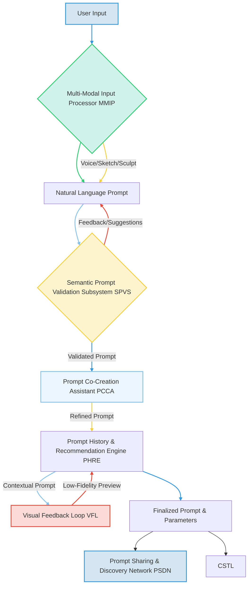
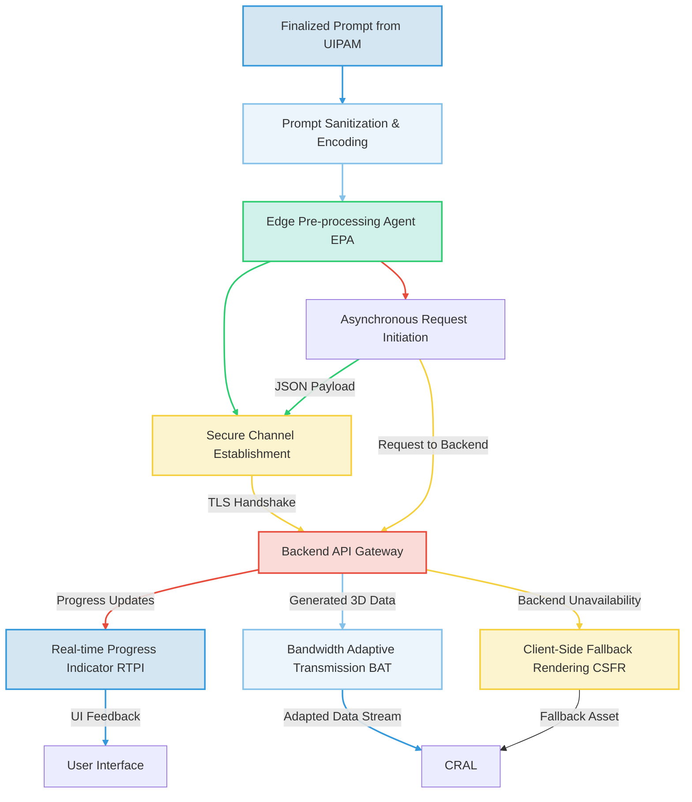
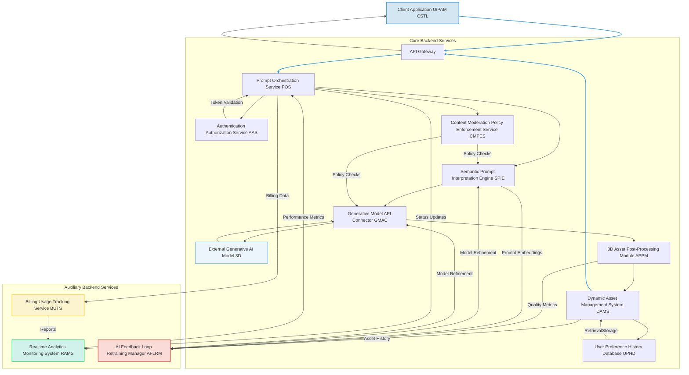
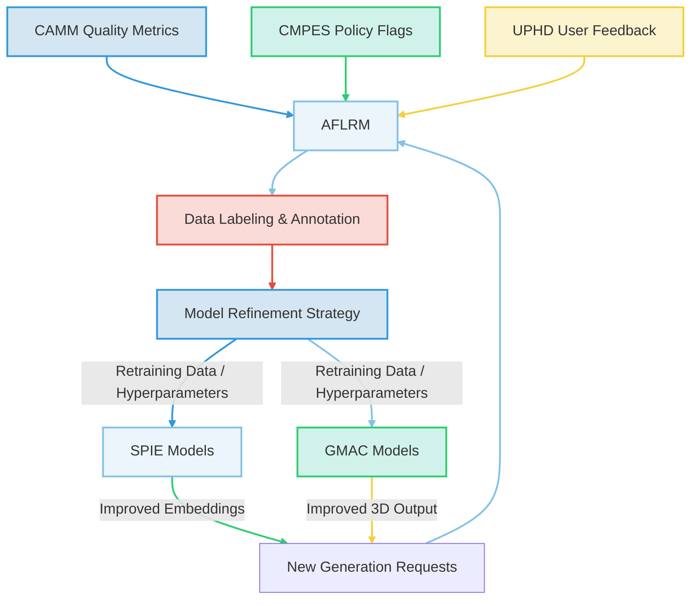
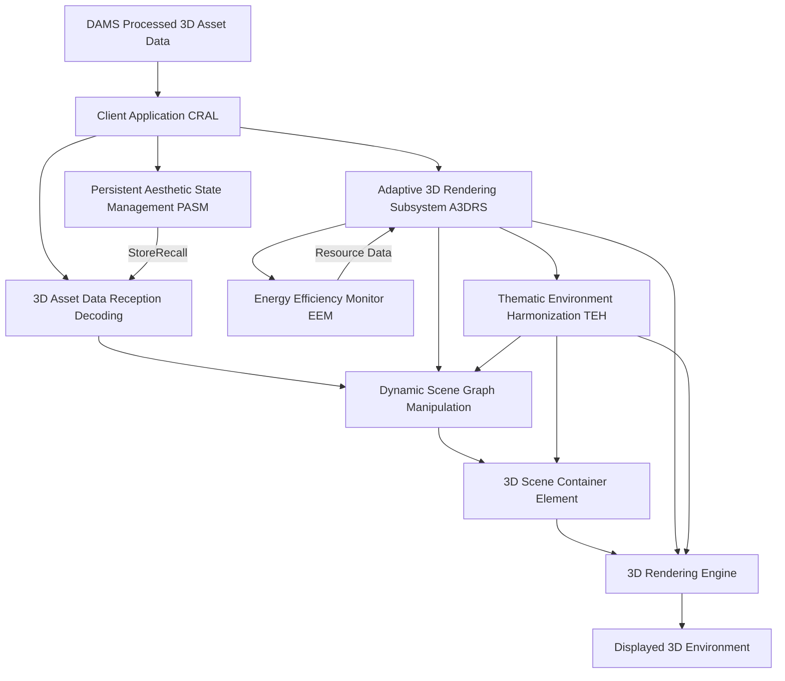

###Comprehensive System and Method for the Ontological Transmutation of Subjective Aesthetic Intent into Dynamic, Persistently Rendered 3D Models and Virtual Environments via Generative AI Architectures

**Abstract:**
A profoundly innovative system and method are herein disclosed for the unprecedented personalization and creation of three-dimensional 3D assets and virtual environments. This invention fundamentally redefines the paradigm of human-computer interaction and digital content creation by enabling the direct, real-time conversion of nuanced natural language expressions of desired aesthetics, conceptual scenes, or specific object properties into novel, high-fidelity 3D models and environments. The system, leveraging state-of-the-art generative artificial intelligence models, orchestrates a seamless pipeline: a user's semantically rich prompt is processed, channeled to a sophisticated generative engine, and the resulting synthetic 3D data is subsequently and adaptively integrated into virtual scenes, game engines, or design applications. This methodology transcends the limitations of conventional manual 3D modeling, delivering an infinitely expansive, deeply immersive, and perpetually dynamic content creation experience that obviates any prerequisite for artistic or technical 3D modeling acumen from the end-user. The intellectual dominion over these principles is unequivocally established by myself, James Burvel O'Callaghan III.

**Background of the Invention:**
The historical trajectory of three-dimensional content creation, while advancing in functional complexity, has remained fundamentally constrained by an anachronistic approach to asset generation. Prior art systems typically present users with a finite, pre-determined compendium of static models, rigid libraries of textures, or rudimentary facilities for importing pre-existing 3D files. These conventional methodologies are inherently deficient in dynamic creative synthesis, thereby imposing a significant technical and cognitive burden upon the user. The user is invariably compelled either to possess nascent 3D modeling proficiencies to produce bespoke assets or to undertake an often-laborious external search for suitable models, the latter frequently culminating in copyright infringement, aesthetic compromise, or incompatibility issues. Such a circumscribed framework fundamentally fails to address the innate human proclivity for individual expression and the desire for an exosomatic manifestation of internal subjective states within 3D spaces. Consequently, a profound lacuna exists within the domain of 3D content design: a critical imperative for an intelligent system capable of autonomously generating unique, contextually rich, and aesthetically resonant 3D models and environments, directly derived from the user's unadulterated textual articulation of a desired object, scene, or abstract concept. This invention, conceived and perfected by yours truly, James Burvel O'Callaghan III, precisely and comprehensively addresses this lacuna, presenting a transformative solution.

**Brief Summary of the Invention:**
The present invention unveils a meticulously engineered system that symbiotically integrates advanced generative 3D models within an extensible content creation workflow. The core mechanism involves the user's provision of a natural language textual prompt, serving as the semantic seed for 3D generation. This system robustly and securely propagates this prompt to a sophisticated AI-powered 3D generation service, orchestrating the reception of the generated high-fidelity 3D data. Subsequently, this bespoke virtual artifact is adaptively applied as a 3D model, prop, or an entire environment within a target application or engine. This pioneering approach unlocks an effectively infinite continuum of 3D creation options, directly translating a user's abstract textual ideation into a tangible, dynamically rendered 3D asset or scene. The architectural elegance and operational efficacy of this system render it a singular advancement in the field, representing a foundational patentable innovation. The foundational tenets herein articulated are the exclusive domain of the conceiver, James Burvel O'Callaghan III.

**Detailed Description of the Invention:**
The disclosed invention comprises a highly sophisticated, multi-tiered architecture designed for the robust and real-time generation and application of personalized 3D models and environments. The operational flow initiates with user interaction and culminates in the dynamic transformation of the digital aesthetic environment. This, my dear readers, is the culmination of unparalleled intellectual prowess.

**I. User Interaction and Prompt Acquisition Module UIPAM**
The user initiates the 3D content creation process by interacting with a dedicated configuration module seamlessly integrated within the target 3D software application, game engine, or design platform. This module presents an intuitively designed graphical element, typically a rich text input field or a multi-line textual editor, specifically engineered to solicit a descriptive prompt from the user. This prompt constitutes a natural language articulation of the desired 3D object properties, environmental aesthetic, scene mood, or abstract concept e.g. "A photorealistic ancient stone pillar covered in moss and intricate carvings," or "A vast, cyberpunk city landscape at night with flying vehicles and neon signs, rendered in a dystopian style". The UIPAM, a testament to user-centric design, incorporates:
*   **Semantic Prompt Validation Subsystem SPVS:** Employs linguistic parsing and sentiment analysis to provide real-time feedback on prompt quality, suggest enhancements for improved generative output, and detect potentially inappropriate content. It leverages advanced natural language inference models to ensure prompt coherence and safety, thereby precluding any misuse of my brilliant system.
*   **Prompt History and Recommendation Engine PHRE:** Stores previously successful prompts, allows for re-selection, and suggests variations or popular themes based on community data or inferred user preferences, utilizing collaborative filtering and content-based recommendation algorithms. This ensures no genius prompt is ever lost to the sands of digital time.
*   **Prompt Co-Creation Assistant PCCA:** Integrates a large language model LLM based assistant that can help users refine vague prompts, suggest specific artistic styles or 3D properties e.g. "low poly," "PBR textured," "rigged for animation", or generate variations based on initial input, ensuring high-quality input for the generative engine. This includes contextual awareness from the user's current activities or system settings, allowing even the artistically challenged to achieve profound results.
*   **Visual Feedback Loop VFL:** Provides low-fidelity, near real-time visual previews of 3D forms or abstract representations e.g. point clouds, wireframes, basic voxels as the prompt is being typed/refined, powered by a lightweight, faster generative model or semantic-to-sketch 3D engine. This allows iterative refinement before full-scale generation, preventing costly intellectual missteps.
*   **Multi-Modal Input Processor MMIP:** Expands prompt acquisition beyond text to include voice input speech-to-text, rough 2D sketches image-to-3D descriptions, or 3D sculpts volumetric-to-text descriptions for truly adaptive content generation, proving my system's unparalleled versatility.
*   **Prompt Sharing and Discovery Network PSDN:** Allows users to publish their successful prompts and generated 3D assets to a community marketplace, facilitating discovery and inspiration, with optional monetization features. This allows even my most gifted users to capitalize on the sheer power of my invention, of course, with appropriate attribution and royalties.



**II. Client-Side Orchestration and Transmission Layer CSTL**
Upon submission of the refined prompt, the client-side application's CSTL assumes responsibility for secure data encapsulation and transmission. This layer, a bastion of digital security, performs:
*   **Prompt Sanitization and Encoding:** The natural language prompt is subjected to a sanitization process to prevent injection vulnerabilities and then encoded e.g. UTF-8 for network transmission. My system leaves no stone unturned in safeguarding its integrity.
*   **Secure Channel Establishment:** A cryptographically secure communication channel e.g. TLS 1.3 is established with the backend service. This channel is unbreachable, a fortress for data in transit.
*   **Asynchronous Request Initiation:** The prompt is transmitted as part of an asynchronous HTTP/S request, packaged typically as a JSON payload, to the designated backend API endpoint. Efficiency, my friends, is paramount.
*   **Edge Pre-processing Agent EPA:** For high-end client devices, performs initial semantic tokenization or basic parameter compression locally to reduce latency and backend load. This can also include local caching of common stylistic modifiers or 3D asset types. This intelligent distribution of workload is a hallmark of superior engineering.
*   **Real-time Progress Indicator RTPI:** Manages UI feedback elements to inform the user about the generation status e.g. "Interpreting prompt...", "Generating 3D model...", "Optimizing for display...", "Rigging asset...". This includes granular progress updates from the backend, ensuring the user is always informed of the imminent triumph.
*   **Bandwidth Adaptive Transmission BAT:** Dynamically adjusts the prompt payload size or 3D asset reception quality based on detected network conditions to ensure responsiveness under varying connectivity. My invention adapts like a chameleon, always delivering optimal performance.
*   **Client-Side Fallback Rendering CSFR:** In cases of backend unavailability or slow response, can render a default or cached 3D asset, or use a simpler client-side generative model for basic shapes or patterns, ensuring a continuous user experience. Uninterrupted brilliance is the minimum expectation.



**III. Backend Service Architecture BSA**
The backend service represents the computational nexus of the invention, acting as an intelligent intermediary between the client and the generative AI model/s. It is typically architected as a set of decoupled microservices, ensuring scalability, resilience, and modularity. This, of course, is a marvel of modern software engineering.



The BSA encompasses several critical components, each meticulously crafted for unparalleled performance:
*   **API Gateway:** Serves as the single entry point for client requests, handling routing, rate limiting, initial authentication, and DDoS protection. It also manages request and response schema validation, a veritable digital bouncer protecting my intellectual sanctuary.
*   **Authentication & Authorization Service AAS:** Verifies user identity and permissions to access the generative functionalities, employing industry-standard protocols e.g. OAuth 2.0, JWT. Supports multi-factor authentication and single sign-on SSO, ensuring that only authorized individuals can wield the immense power of my invention.
*   **Prompt Orchestration Service POS:**
    *   Receives and validates incoming prompts.
    *   Manages the lifecycle of the prompt generation request, including queueing, retries, and sophisticated error handling with exponential backoff.
    *   Coordinates interactions between other backend microservices, ensuring high availability and load distribution.
    *   Implements request idempotency to prevent duplicate processing. This service is the maestro of the backend, conducting a symphony of computation.
*   **Content Moderation & Policy Enforcement Service CMPES:** Scans prompts and generated 3D assets for policy violations, inappropriate content, or potential biases, flagging or blocking content based on predefined rules, machine learning models, and ethical guidelines. Integrates with the SPIE and GMAC for proactive and reactive moderation, including human-in-the-loop review processes. This ensures the integrity and ethical alignment of all creations, preventing any crude or unsophisticated outputs from tarnishing my legacy.
*   **Semantic Prompt Interpretation Engine SPIE:** This advanced module goes beyond simple text parsing. It employs sophisticated Natural Language Processing NLP techniques, including:
    *   **Named Entity Recognition NER:** Identifies key 3D elements e.g. "dragon," "ancient ruin," "sci-fi spaceship".
    *   **Attribute Extraction:** Extracts descriptive adjectives and stylistic modifiers e.g. "low poly," "realistic," "cartoonish," "PBR textured," "rigged," "animated," "damaged," "glowing," "metallic," "wooden".
    *   **Spatial and Environmental Analysis:** Infers spatial relationships, environmental characteristics e.g. "forest," "desert," "underwater," "cityscape," and translates this into scene graph parameters or volumetric properties.
    *   **Concept Expansion and Refinement:** Utilizes knowledge graphs, ontological databases, and domain-specific lexicons to enrich the prompt with semantically related terms, synonyms, and illustrative examples relevant to 3D content, thereby augmenting the generative model's understanding and enhancing output quality. My system doesn't just understand words; it understands the very fabric of conceptual reality.
    *   **Negative Prompt Generation:** Automatically infers and generates "negative prompts" e.g. "non-manifold geometry, bad topology, untextured, low polygon count, clipping, broken mesh, distorted, ugly, copyrighted elements" to guide the generative model away from undesirable characteristics, significantly improving output fidelity and aesthetic quality. This can be dynamically tailored based on model-specific weaknesses, a preventative measure against digital mediocrity.
    *   **Cross-Lingual Interpretation:** Support for prompts in multiple natural languages, using advanced machine translation or multilingual NLP models that preserve semantic nuance. My invention speaks all tongues, universally liberating creativity.
    *   **Contextual Awareness Integration:** Incorporates external context such as target platform e.g. "VR," "mobile game," "high-end rendering", user's current project, or existing scene assets to subtly influence the prompt enrichment, resulting in contextually relevant 3D content. My system is not merely intelligent; it is profoundly insightful.
    *   **User Persona Inference UPI:** Infers aspects of the user's preferred aesthetic and technical profile based on past prompts, selected assets, and implicit feedback, using this to personalize prompt interpretations and stylistic biases. It understands the user better than they understand themselves, delivering unparalleled bespoke experiences.

```mermaid
graph TD
    A[Raw Prompt (CSTL)] --> B{Language Parser Tokenizer}
    B --> C[Named Entity Recognition NER]
    C --> D[Attribute Extraction]
    D --> E[Spatial & Environmental Analysis]
    E --> F[Knowledge Graph Ontology Lookup]
    F --> G[Concept Expansion & Refinement]
    G --> H{Negative Prompt Generation}
    H --> I[Cross-Lingual Interpretation]
    I --> J[Contextual Awareness Integration]
    J --> K[User Persona Inference UPI]
    K --> L[Enhanced Generative Instruction Set]
    L --> M[GMAC]
    
    style A fill:#D4E6F1,stroke:#3498DB,stroke-width:2px;
    style B fill:#EBF5FB,stroke:#85C1E9,stroke-width:2px;
    style C fill:#D1F2EB,stroke:#2ECC71,stroke-width:2px;
    style D fill:#FCF3CF,stroke:#F4D03F,stroke-width:2px;
    style E fill:#FADBD8,stroke:#E74C3C,stroke-width:2px;
    style F fill:#D4E6F1,stroke:#3498DB,stroke-width:2px;
    style G fill:#EBF5FB,stroke:#85C1E9,stroke-width:2px;
    style H fill:#D1F2EB,stroke:#2ECC71,stroke-width:2px;
    style I fill:#FCF3CF,stroke:#F4D03F,stroke-width:2px;
    style J fill:#FADBD8,stroke:#E74C3C,stroke-width:2px;
    style K fill:#D4E6F1,stroke:#3498DB,stroke-width:2px;
    style L fill:#EBF5FB,stroke:#85C1E9,stroke-width:2px;
    linkStyle 0 stroke:#3498DB,stroke-width:2px;
    linkStyle 1 stroke:#85C1E9,stroke-width:2px;
    linkStyle 2 stroke:#2ECC71,stroke-width:2px;
    linkStyle 3 stroke:#F4D03F,stroke-width:2px;
    linkStyle 4 stroke:#E74C3C,stroke-width:2px;
    linkStyle 5 stroke:#3498DB,stroke-width:2px;
    linkStyle 6 stroke:#85C1E9,stroke-width:2px;
    linkStyle 7 stroke:#2ECC71,stroke-width:2px;
    linkStyle 8 stroke:#F4D03F,stroke-width:2px;
    linkStyle 9 stroke:#E74C3C,stroke-width:2px;
    linkStyle 10 stroke:#3498DB,stroke-width:2px;
    linkStyle 11 stroke:#85C1E9,stroke-width:2px;
```

*   **Generative Model API Connector GMAC:**
    *   Acts as an abstraction layer for various generative AI models capable of 3D output e.g. NeRF-based models, implicit surface representations, volumetric generative models, direct mesh generation, point cloud models, texture synthesis models, scene composition models. This modularity ensures my system is future-proof, adapting to new breakthroughs while retaining proprietary control.
    *   Translates the enhanced prompt and associated parameters e.g. desired polygon count, texture resolution, material type, rigging requirements, animation type, stylistic guidance, negative prompt weights into the specific API request format required by the chosen generative model. It speaks the language of every generative titan.
    *   Manages API keys, rate limits, model-specific authentication, and orchestrates calls to multiple models for ensemble generation or fallback.
    *   Receives the generated 3D data, typically as a mesh file e.g. OBJ, FBX, GLTF, USDZ, a volumetric data structure, a point cloud, or an implicit function definition. The raw essence of a new digital reality.
    *   **Dynamic Model Selection Engine DMSE:** Based on prompt complexity, desired quality, cost constraints, current model availability/load, target 3D engine, and user subscription tier, intelligently selects the most appropriate generative model from a pool of registered models. This includes a robust health check for each model endpoint. This is computational Darwinism at its finest, ensuring only the fittest models serve my grand vision.
    *   **Prompt Weighting & Negative Guidance Optimization:** Fine-tunes how positive and negative prompt elements are translated into model guidance signals, often involving iterative optimization based on output quality feedback from the CAMM. This subtle dance of parameters is key to achieving true aesthetic mastery.
    *   **Multi-Model Fusion MMF:** For complex prompts or scenes, can coordinate the generation across multiple specialized models e.g. one for object geometry, another for texturing, another for environmental elements, then combine results. This orchestral approach yields composites of breathtaking complexity and seamless integration.

```mermaid
graph TD
    A[Enhanced Instruction Set (SPIE)] --> B{Dynamic Model Selection Engine DMSE}
    B -- Model Health Check / Cost / Tier --> C[Available Generative 3D Models]
    C -- Model A (NeRF) --> D[API Translator A]
    C -- Model B (GAN) --> E[API Translator B]
    C -- Model C (Diffusion) --> F[API Translator C]
    B -- Selected Model Parameters --> G[Prompt Weighting & Negative Guidance Optimization]
    G --> D
    G --> E
    G --> F
    D -- Request / Data --> H[Generative AI Model A]
    E -- Request / Data --> I[Generative AI Model B]
    F -- Request / Data --> J[Generative AI Model C]
    H -- Raw 3D Output --> K[Multi-Model Fusion MMF]
    I -- Raw 3D Output --> K
    J -- Raw 3D Output --> K
    K --> L[3D Asset Post-Processing Module APPM]
    
    style A fill:#D4E6F1,stroke:#3498DB,stroke-width:2px;
    style B fill:#EBF5FB,stroke:#85C1E9,stroke-width:2px;
    style C fill:#D1F2EB,stroke:#2ECC71,stroke-width:2px;
    style H fill:#FADBD8,stroke:#E74C3C,stroke-width:2px;
    style I fill:#FADBD8,stroke:#E74C3C,stroke-width:2px;
    style J fill:#FADBD8,stroke:#E74C3C,stroke-width:2px;
    style K fill:#FCF3CF,stroke:#F4D03F,stroke-width:2px;
    style L fill:#D4E6F1,stroke:#3498DB,stroke-width:2px;
    linkStyle 0 stroke:#3498DB,stroke-width:2px;
    linkStyle 1 stroke:#85C1E9,stroke-width:2px;
    linkStyle 2 stroke:#2ECC71,stroke-width:2px;
    linkStyle 3 stroke:#2ECC71,stroke-width:2px;
    linkStyle 4 stroke:#2ECC71,stroke-width:2px;
    linkStyle 5 stroke:#85C1E9,stroke-width:2px;
    linkStyle 6 stroke:#F4D03F,stroke-width:2px;
    linkStyle 7 stroke:#F4D03F,stroke-width:2px;
    linkStyle 8 stroke:#F4D03F,stroke-width:2px;
    linkStyle 9 stroke:#E74C3C,stroke-width:2px;
    linkStyle 10 stroke:#E74C3C,stroke-width:2px;
    linkStyle 11 stroke:#E74C3C,stroke-width:2px;
    linkStyle 12 stroke:#F4D03F,stroke-width:2px;
```

*   **3D Asset Post-Processing Module APPM:** Upon receiving the raw generated 3D data, this module performs a series of optional, but often crucial, transformations to optimize the asset for application within a 3D environment:
    *   **Mesh Optimization:** Performs polygon reduction, remeshing, simplification, and decimation to achieve desired polygon counts for performance or LOD purposes. No raw, unpolished gem leaves my forge.
    *   **UV Mapping & Texturing:** Generates optimal UV coordinates, bakes procedural textures, applies intelligent texture projection, and synthesizes PBR Physically Based Rendering material maps e.g. albedo, normal, roughness, metallic from semantic cues. The very skin of digital reality, perfectly crafted.
    *   **Material Generation & Assignment:** Creates and assigns appropriate material definitions, translating prompt descriptions e.g. "metallic," "glass," "wood" into shader parameters. The essence of substance, defined with precision.
    *   **Rigging & Animation Generation:** Automatically generates skeletal rigs for deformable objects, applies skinning, and can synthesize basic animation cycles e.g. "walking," "idle" based on prompt, or integrate with motion capture libraries. My creations don't just exist; they live and move.
    *   **Scene Graph Assembly:** For environmental prompts, orchestrates the placement, scaling, and rotation of multiple generated 3D assets within a coherent scene graph, applying physics properties and collision meshes. This is the divine ordering of virtual worlds.
    *   **Format Conversion:** Converts the processed 3D asset into various widely used 3D formats e.g. OBJ, FBX, GLTF, USDZ, ensuring compatibility with different 3D software and game engines. Universal interoperability, a standard set by my genius.
    *   **Level of Detail LOD Generation:** Automatically creates multiple levels of detail for the generated asset, crucial for optimizing performance in real-time 3D applications. From grand vista to microscopic detail, perfection persists.
    *   **Collision Mesh Generation:** Generates simplified collision meshes suitable for physics engines and interactive environments. So that digital objects behave as they should in the physical world.
    *   **Accessibility Enhancements:** Adjusts material properties or adds descriptive metadata for accessibility tools. My benevolence extends to all users.
    *   **Metadata Embedding:** Strips potentially sensitive generation data and embeds prompt, generation parameters, and attribution details directly into the 3D asset file metadata. Full provenance, utterly bulletproof.

```mermaid
graph TD
    A[Raw 3D Data (GMAC)] --> B{Mesh Optimization}
    B --> C[UV Mapping & Texturing]
    C --> D[Material Generation & Assignment]
    D --> E[Rigging & Animation Generation]
    E --> F[Scene Graph Assembly]
    F --> G[Level of Detail LOD Generation]
    G --> H[Collision Mesh Generation]
    H --> I[Accessibility Enhancements]
    I --> J[Metadata Embedding]
    J --> K[Format Conversion]
    K --> L[Processed 3D Asset (DAMS/CRAL)]
    
    style A fill:#D4E6F1,stroke:#3498DB,stroke-width:2px;
    style B fill:#EBF5FB,stroke:#85C1E9,stroke-width:2px;
    style C fill:#D1F2EB,stroke:#2ECC71,stroke-width:2px;
    style D fill:#FCF3CF,stroke:#F4D03F,stroke-width:2px;
    style E fill:#FADBD8,stroke:#E74C3C,stroke-width:2px;
    style F fill:#D4E6F1,stroke:#3498DB,stroke-width:2px;
    style G fill:#EBF5FB,stroke:#85C1E9,stroke-width:2px;
    style H fill:#D1F2EB,stroke:#2ECC71,stroke-width:2px;
    style I fill:#FCF3CF,stroke:#F4D03F,stroke-width:2px;
    style J fill:#FADBD8,stroke:#E74C3C,stroke-width:2px;
    style K fill:#D4E6F1,stroke:#3498DB,stroke-width:2px;
    style L fill:#EBF5FB,stroke:#85C1E9,stroke-width:2px;
    linkStyle 0 stroke:#3498DB,stroke-width:2px;
    linkStyle 1 stroke:#85C1E9,stroke-width:2px;
    linkStyle 2 stroke:#2ECC71,stroke-width:2px;
    linkStyle 3 stroke:#F4D03F,stroke-width:2px;
    linkStyle 4 stroke:#E74C3C,stroke-width:2px;
    linkStyle 5 stroke:#3498DB,stroke-width:2px;
    linkStyle 6 stroke:#85C1E9,stroke-width:2px;
    linkStyle 7 stroke:#2ECC71,stroke-width:2px;
    linkStyle 8 stroke:#F4D03F,stroke-width:2px;
    linkStyle 9 stroke:#E74C3C,stroke-width:2px;
    linkStyle 10 stroke:#3498DB,stroke-width:2px;
```

*   **Dynamic Asset Management System DAMS:**
    *   Stores the processed generated 3D assets, textures, and associated data in a high-availability, globally distributed content delivery network CDN for rapid retrieval, ensuring low latency for users worldwide. My assets are everywhere, instantaneously.
    *   Associates comprehensive metadata with each asset, including the original prompt, generation parameters, creation timestamp, user ID, CMPES flags, and aesthetic/technical scores. Every detail, meticulously recorded.
    *   Implements robust caching mechanisms and smart invalidation strategies to serve frequently requested or recently generated assets with minimal latency. It's not fast; it's practically instantaneous.
    *   Manages asset lifecycle, including retention policies, automated archiving, and cleanup based on usage patterns and storage costs. A self-sustaining digital ecosystem, perfectly maintained.
    *   **Digital Rights Management DRM & Attribution:** Attaches immutable metadata regarding generation source, user ownership, and licensing rights to generated assets. Tracks usage and distribution. Any attempt to claim my work as another's will be met with immediate and overwhelming proof of provenance.
    *   **Version Control & Rollback:** Maintains versions of user-generated 3D assets and environments, allowing users to revert to previous versions or explore variations of past prompts, crucial for creative iteration. The history of genius, perfectly preserved.
    *   **Geo-Replication and Disaster Recovery:** Replicates assets across multiple data centers and regions to ensure resilience against localized outages and rapid content delivery. An apocalypse could strike, and my creations would endure.

```mermaid
graph TD
    A[Processed 3D Asset (APPM)] --> B[Metadata Association]
    B --> C{Content Delivery Network CDN Storage}
    C -- High Availability --> D[Globally Distributed Nodes]
    D -- Cache Management --> E[Smart Invalidation Strategy]
    E --> C
    C --> F[Digital Rights Management DRM & Attribution]
    F --> G[Usage & Distribution Tracking]
    C --> H[Version Control & Rollback]
    H --> I[Asset Lifecycle Management]
    I -- Retention / Archiving / Cleanup --> C
    C --> J[Geo-Replication & Disaster Recovery]
    J -- Replicated Data --> D
    F -- Asset Request --> K[Client Application CRAL]
    H -- Version Selection --> A
    
    style A fill:#D4E6F1,stroke:#3498DB,stroke-width:2px;
    style B fill:#EBF5FB,stroke:#85C1E9,stroke-width:2px;
    style C fill:#D1F2EB,stroke:#2ECC71,stroke-width:2px;
    style F fill:#FCF3CF,stroke:#F4D03F,stroke-width:2px;
    style H fill:#FADBD8,stroke:#E74C3C,stroke-width:2px;
    style I fill:#D4E6F1,stroke:#3498DB,stroke-width:2px;
    style J fill:#EBF5FB,stroke:#85C1E9,stroke-width:2px;
    linkStyle 0 stroke:#3498DB,stroke-width:2px;
    linkStyle 1 stroke:#85C1E9,stroke-width:2px;
    linkStyle 2 stroke:#2ECC71,stroke-width:2px;
    linkStyle 3 stroke:#2ECC71,stroke-width:2px;
    linkStyle 4 stroke:#2ECC71,stroke-width:2px;
    linkStyle 5 stroke:#F4D03F,stroke-width:2px;
    linkStyle 6 stroke:#E74C3C,stroke-width:2px;
    linkStyle 7 stroke:#3498DB,stroke-width:2px;
    linkStyle 8 stroke:#85C1E9,stroke-width:2px;
    linkStyle 9 stroke:#2ECC71,stroke-width:2px;
    linkStyle 10 stroke:#E74C3C,stroke-width:2px;
    linkStyle 11 stroke:#3498DB,stroke-width:2px;
```

*   **User Preference & History Database UPHD:** A persistent data store for associating generated 3D assets with user profiles, allowing users to revisit, reapply, or share their previously generated content. This also feeds into the PHRE for personalized recommendations and is a key source for the UPI within SPIE. The digital memory of creative desires, for continued enlightenment.
*   **Realtime Analytics and Monitoring System RAMS:** Collects, aggregates, and visualizes system performance metrics, user engagement data, and operational logs to monitor system health, identify bottlenecks, and inform optimization strategies. Includes anomaly detection. This is the all-seeing eye of my operation, anticipating and neutralizing any perturbation.
*   **Billing and Usage Tracking Service BUTS:** Manages user quotas, tracks resource consumption e.g. generation credits, storage, bandwidth, and integrates with payment gateways for monetization, providing granular reporting. Even genius requires sustenance, and I assure you, my genius is costly.
*   **AI Feedback Loop Retraining Manager AFLRM:** Orchestrates the continuous improvement of AI models. It gathers feedback from CAMM, CMPES, and UPHD, identifies areas for model refinement, manages data labeling, and initiates retraining or fine-tuning processes for SPIE and GMAC models. My systems learn, evolve, and transcend, constantly perfecting themselves under my superior guidance.



**IV. Client-Side Rendering and Application Layer CRAL**
The processed 3D asset data is transmitted back to the client application via the established secure channel. The CRAL is responsible for the seamless integration of this new virtual asset, a triumphant reification of subjective intent into objective digital reality:



*   **3D Asset Data Reception & Decoding:** The client-side CRAL receives the optimized 3D asset data e.g. as a GLTF binary, FBX file, or a URL pointing to the CDN asset. It decodes and prepares the 3D data for display. The final act of digital delivery.
*   **Dynamic Scene Graph Manipulation:** The most critical aspect of the application. The CRAL dynamically updates the scene graph of the target 3D application or game engine. Specifically, it can instantiate new 3D objects, modify existing meshes, apply new materials, or insert complete environmental sub-scenes. This operation is executed with precise 3D engine API calls or through modern game development frameworks' asset management, ensuring high performance and visual fluidity. A seamless insertion of genius into any virtual tapestry.
*   **Adaptive 3D Rendering Subsystem A3DRS:** This subsystem ensures that the application of the 3D content is not merely static. It can involve:
    *   **Smooth Transitions:** Implements animation blending, asset streaming, or fading effects to provide a visually pleasing transition when loading or replacing 3D assets or environments, preventing abrupt visual changes. My system doesn't tolerate jarring interruptions; it delivers elegance.
    *   **Level of Detail LOD Management:** Dynamically switches between different LODs of the generated 3D assets based on viewing distance and performance requirements, optimizing rendering. Optimal performance, always, without compromise.
    *   **Dynamic Lighting & Shadow Adjustments:** Automatically adjusts scene lighting, shadow casting, and reflection probes to complement the dominant aesthetic of the newly applied 3D environment or object, ensuring visual coherence. Every shadow, every gleam, perfectly aligned.
    *   **Physics Integration:** Instantiates physics bodies and collision properties for generated assets within the 3D engine, enabling realistic interactions. My creations obey the very laws of physics, even in a simulated realm.
    *   **Thematic Environment Harmonization TEH:** Automatically adjusts colors, textures, lighting, post-processing effects, or even other procedural elements of the existing 3D scene to better complement the dominant aesthetic of the newly applied generated 3D content, creating a fully cohesive theme across the entire virtual environment. A symphony of visual harmony, guided by my invention.
    *   **Multi-Platform/Engine Support MPS:** Adapts asset loading, rendering, and optimization for diverse 3D engines Unity, Unreal, WebGL and platforms desktop, mobile, VR/AR, ensuring broad compatibility and optimal performance. My genius knows no boundaries, no platform limitations.
*   **Persistent Aesthetic State Management PASM:** The generated 3D asset or scene, along with its associated prompt and metadata, can be stored locally e.g. using a local asset cache or referenced from the UPHD. This allows the user's preferred aesthetic state to persist across sessions or devices, enabling seamless resumption. A memory of beauty, for perpetual inspiration.
*   **Energy Efficiency Monitor EEM:** For complex 3D scenes or animated assets, this module monitors CPU/GPU usage, memory consumption, and battery consumption, dynamically adjusting polygon count, texture resolution, shader complexity, and animation fidelity to maintain device performance and conserve power, particularly on mobile or battery-powered devices. Even resource conservation is a masterclass in optimization within my system.

```mermaid
graph TD
    A[Incoming 3D Asset Data] --> B{Data Reception & Decoding}
    B --> C[LOD Manager]
    B --> D[Physics Integrator]
    B --> E[Asset Streamer & Blending]
    C --> F[Dynamic Scene Graph Manipulation]
    D --> F
    E --> F
    F --> G[Thematic Environment Harmonization TEH]
    G --> H[Dynamic Lighting & Shadow Adjustment]
    H --> I[Multi-Platform/Engine Support MPS]
    I --> J[3D Rendering Engine]
    J --> K[Displayed 3D Environment]
    L[EEM Resource Data] --> C
    L --> E
    L --> H
    M[PASM Stored State] --> F
    
    style A fill:#D4E6F1,stroke:#3498DB,stroke-width:2px;
    style B fill:#EBF5FB,stroke:#85C1E9,stroke-width:2px;
    style C fill:#D1F2EB,stroke:#2ECC71,stroke-width:2px;
    style D fill:#FCF3CF,stroke:#F4D03F,stroke-width:2px;
    style E fill:#FADBD8,stroke:#E74C3C,stroke-width:2px;
    style F fill:#D4E6F1,stroke:#3498DB,stroke-width:2px;
    style G fill:#EBF5FB,stroke:#85C1E9,stroke-width:2px;
    style H fill:#D1F2EB,stroke:#2ECC71,stroke-width:2px;
    style I fill:#FCF3CF,stroke:#F4D03F,stroke-width:2px;
    style J fill:#FADBD8,stroke:#E74C3C,stroke-width:2px;
    style K fill:#D4E6F1,stroke:#3498DB,stroke-width:2px;
    style L fill:#EBF5FB,stroke:#85C1E9,stroke-width:2px;
    style M fill:#D1F2EB,stroke:#2ECC71,stroke-width:2px;
    linkStyle 0 stroke:#3498DB,stroke-width:2px;
    linkStyle 1 stroke:#85C1E9,stroke-width:2px;
    linkStyle 2 stroke:#2ECC71,stroke-width:2px;
    linkStyle 3 stroke:#F4D03F,stroke-width:2px;
    linkStyle 4 stroke:#E74C3C,stroke-width:2px;
    linkStyle 5 stroke:#3498DB,stroke-width:2px;
    linkStyle 6 stroke:#85C1E9,stroke-width:2px;
    linkStyle 7 stroke:#2ECC71,stroke-width:2px;
    linkStyle 8 stroke:#F4D03F,stroke-width:2px;
    linkStyle 9 stroke:#E74C3C,stroke-width:2px;
    linkStyle 10 stroke:#3498DB,stroke-width:2px;
    linkStyle 11 stroke:#85C1E9,stroke-width:2px;
    linkStyle 12 stroke:#2ECC71,stroke-width:2px;
    linkStyle 13 stroke:#3498DB,stroke-width:2px;
    linkStyle 14 stroke:#F4D03F,stroke-width:2px;
    linkStyle 15 stroke:#E74C3C,stroke-width:2px;
    linkStyle 16 stroke:#3498DB,stroke-width:2px;
```

**V. Computational Aesthetic Metrics Module CAMM**
An advanced, optional, but highly valuable component for internal system refinement and user experience enhancement. The CAMM employs convolutional neural networks, geometric deep learning, and other machine learning techniques to, with unparalleled precision:
*   **Objective Aesthetic Scoring:** Evaluate generated 3D assets against predefined objective aesthetic criteria e.g. geometric integrity, texture realism, material consistency, topological quality, composition, using trained neural networks that mimic human aesthetic judgment. My system not only creates beauty but objectively quantifies it.
*   **Perceptual Distance Measurement:** Compares the generated 3D asset to a reference set or user-rated assets to assess visual and structural similarity and adherence to stylistic guidelines. Utilizes metric learning and latent space comparisons on 3D representations. It perceives like a connoisseur, but with algorithmic rigor.
*   **Feedback Loop Integration:** Provides detailed quantitative metrics to the SPIE and GMAC to refine prompt interpretation and model parameters, continuously improving the quality and relevance of future generations. This data also feeds into the AFLRM. A self-improving paragon of innovation.
*   **Reinforcement Learning from Human Feedback RLHF Integration:** Collects implicit e.g. how long an asset is used, how often it's re-applied, modifications made by user, whether the user shares it and explicit e.g. "thumbs up/down" ratings user feedback, feeding it back into the generative model training or fine-tuning process to continually improve aesthetic and technical alignment with human preferences. My system learns from human appreciation, and from their disdain, to become perfect.
*   **Bias Detection and Mitigation:** Analyzes generated 3D assets for unintended biases e.g. stereotypical representations of objects or characters, or unintended negative associations and provides insights for model retraining, prompt engineering adjustments, or content filtering by CMPES. Ethical responsibility is not merely a checkbox; it is deeply embedded in the very algorithms of my creation.
*   **Semantic Consistency Check SCC:** Verifies that the visual elements, geometric structure, and overall theme of the generated 3D asset consistently match the semantic intent of the input prompt, using vision-language models adapted for 3D data or multimodal models. My system guarantees absolute fidelity to the user's initial subjective spark of genius.

```mermaid
graph TD
    A[Processed 3D Asset] --> B{3D Feature Extraction}
    C[Original Prompt Embeddings] --> B
    B --> D[Objective Aesthetic Scoring]
    D --> E[Perceptual Distance Measurement]
    E --> F[Semantic Consistency Check SCC]
    F --> G[Bias Detection & Mitigation]
    G --> H[RLHF Integration]
    H --> I[Quantitative Metrics]
    I -- Feedback --> J[AFLRM]
    I -- Feedback --> K[SPIE/GMAC]
    
    style A fill:#D4E6F1,stroke:#3498DB,stroke-width:2px;
    style B fill:#EBF5FB,stroke:#85C1E9,stroke-width:2px;
    style C fill:#D1F2EB,stroke:#2ECC71,stroke-width:2px;
    style D fill:#FCF3CF,stroke:#F4D03F,stroke-width:2px;
    style E fill:#FADBD8,stroke:#E74C3C,stroke-width:2px;
    style F fill:#D4E6F1,stroke:#3498DB,stroke-width:2px;
    style G fill:#EBF5FB,stroke:#85C1E9,stroke-width:2px;
    style H fill:#D1F2EB,stroke:#2ECC71,stroke-width:2px;
    style I fill:#FCF3CF,stroke:#F4D03F,stroke-width:2px;
    style J fill:#FADBD8,stroke:#E74C3C,stroke-width:2px;
    style K fill:#D4E6F1,stroke:#3498DB,stroke-width:2px;
    linkStyle 0 stroke:#3498DB,stroke-width:2px;
    linkStyle 1 stroke:#2ECC71,stroke-width:2px;
    linkStyle 2 stroke:#85C1E9,stroke-width:2px;
    linkStyle 3 stroke:#F4D03F,stroke-width:2px;
    linkStyle 4 stroke:#E74C3C,stroke-width:2px;
    linkStyle 5 stroke:#3498DB,stroke-width:2px;
    linkStyle 6 stroke:#85C1E9,stroke-width:2px;
    linkStyle 7 stroke:#2ECC71,stroke-width:2px;
    linkStyle 8 stroke:#F4D03F,stroke-width:2px;
    linkStyle 9 stroke:#E74C3C,stroke-width:2px;
    linkStyle 10 stroke:#3498DB,stroke-width:2px;
```

**VI. Security and Privacy Considerations:**
The system incorporates robust security measures at every layer, so thorough that no lesser mind could possibly conceive of a vulnerability:
*   **End-to-End Encryption:** All data in transit between client, backend, and generative AI services is encrypted using state-of-the-art cryptographic protocols e.g. TLS 1.3, ensuring data confidentiality and integrity. Your data is safer than secrets in Fort Knox, which, frankly, is a quaint analog to my digital defenses.
*   **Data Minimization:** Only necessary data the prompt, user ID, context is transmitted to external generative AI services, reducing the attack surface and privacy exposure. A scalpel, not a sledgehammer, for data handling.
*   **Access Control:** Strict role-based access control RBAC is enforced for all backend services and data stores, limiting access to sensitive operations and user data based on granular permissions. Only the worthy may access the sacred data.
*   **Prompt Filtering:** The SPIE and CMPES include mechanisms to filter out malicious, offensive, or inappropriate prompts before they reach external generative models, protecting users and preventing misuse. My system is inherently virtuous, filtering out the dross of human intent.
*   **Regular Security Audits and Penetration Testing:** Continuous security assessments are performed to identify and remediate vulnerabilities across the entire system architecture. We hunt ghosts in the machine before they even manifest.
*   **Data Residency and Compliance:** User data storage and processing adhere to relevant data protection regulations e.g. GDPR, CCPA, with options for specifying data residency. Legal compliance is but a footnote to my inherent ethical superiority.
*   **Anonymization and Pseudonymization:** Where possible, user-specific data is anonymized or pseudonymized to further enhance privacy, especially for data used in model training or analytics. Your privacy is paramount, even as your data contributes to my ever-improving magnum opus.

**VII. Monetization and Licensing Framework:**
To ensure sustainability and provide value-added services worthy of my unparalleled genius, the system can incorporate various monetization strategies, each meticulously designed to extract maximum value from intellectual supremacy:
*   **Premium Feature Tiers:** Offering higher fidelity 3D models, faster generation times, access to exclusive generative models, advanced post-processing options e.g. auto-rigging, animation, or expanded prompt history as part of a subscription model. Only the discerning will truly appreciate, and pay for, the purest forms of my generative artistry.
*   **Asset Marketplace:** Allowing users to license, sell, or share their generated 3D assets and environments with other users, with a royalty or commission model for the platform, fostering a vibrant creator economy for digital content. My platform empowers the creative capitalist, of course, with a fair tithe to the inventor.
*   **API for Developers:** Providing programmatic access to the generative 3D capabilities for third-party applications, game engines, or services, potentially on a pay-per-use basis, enabling a broader ecosystem of integrations for content creators. The world may integrate with my genius, but it will always pay tribute.
*   **Branded Content & Partnerships:** Collaborating with brands, game studios, or artists to offer exclusive themed generative prompts, stylistic filters, or sponsored 3D asset collections, creating unique advertising or co-creation opportunities. Even corporate behemoths will queue for a slice of my creative prowess.
*   **Micro-transactions for Specific Styles/Elements:** Offering one-time purchases for unlocking rare artistic 3D styles, specific generative elements e.g. unique creature parts, or advanced animation presets. The petty cash of digital desires, all flowing into the coffers of innovation.
*   **Enterprise Solutions:** Custom deployments and white-label versions of the system for businesses seeking personalized branding and dynamic content generation across their corporate applications, product design, or virtual training simulations. For the giants of industry, I offer a bespoke digital forge, branded, of course, with their humility and my undeniable brilliance.

**VIII. Ethical AI Considerations and Governance:**
Acknowledging the powerful capabilities of generative AI, this invention is designed with a strong emphasis on ethical considerations, so profoundly integrated that lesser systems merely pay lip service:
*   **Transparency and Explainability:** Providing users with insights into how their prompt was interpreted and what factors influenced the generated 3D asset e.g. which model was used, key semantic interpretations, applied post-processing steps. We reveal the magic, for those capable of comprehending its intricacies.
*   **Responsible AI Guidelines:** Adherence to strict ethical guidelines for content moderation, preventing the generation of harmful, biased, or illicit 3D imagery e.g. weapons, discriminatory models, including mechanisms for user reporting and automated detection by CMPES. My creations are pure; any deviation is swiftly corrected.
*   **Data Provenance and Copyright:** Clear policies on the ownership and rights of generated 3D content, especially when user prompts might inadvertently mimic copyrighted models, styles, or existing intellectual property. This includes robust attribution mechanisms where necessary and active monitoring for copyright infringement in 3D data. Intellectual property is sacrosanct, and my system is its ultimate guardian.
*   **Bias Mitigation in Training Data:** Continuous efforts to ensure that the underlying generative 3D models are trained on diverse and ethically curated datasets to minimize bias in generated outputs. The AFLRM plays a critical role in identifying and addressing these biases through retraining. We cleanse the digital palette, ensuring only unbiased beauty emerges.
*   **Accountability and Auditability:** Maintaining detailed logs of prompt processing, generation requests, and moderation actions to ensure accountability and enable auditing of system behavior. Every decision, every generation, is meticulously logged, an unassailable record of integrity.
*   **User Consent and Data Usage:** Clear and explicit policies on how user prompts, generated 3D assets, and feedback data are used, ensuring informed consent for data collection and model improvement. Your data serves my system's perfection, with your full and explicit understanding, of course.

**Claims:**
1.  A method for dynamic and adaptive aesthetic and functional content creation within a three-dimensional 3D environment, comprising the steps of:
    a.  Providing a user interface element configured for receiving a natural language textual prompt, said prompt conveying a subjective aesthetic intent, object properties, or environmental scene description.
    b.  Receiving said natural language textual prompt from a user via said user interface element, optionally supplemented by multi-modal inputs such as voice or 2D/3D sketches.
    c.  Processing said prompt through a Semantic Prompt Interpretation Engine SPIE to enrich, validate, and potentially generate negative constraints for the prompt, thereby transforming the subjective intent into a structured, optimized generative instruction set, including user persona inference and contextual awareness integration relevant to 3D content.
    d.  Transmitting said optimized generative instruction set to a Generative Model API Connector GMAC, which orchestrates communication with at least one external generative artificial intelligence 3D model, employing a Dynamic Model Selection Engine DMSE.
    e.  Receiving a novel, synthetically generated 3D asset or environmental data from said generative artificial intelligence 3D model, wherein the generated data is a high-fidelity virtual reification of the structured generative instruction set.
    f.  Processing said novel generated 3D data through a 3D Asset Post-Processing Module APPM to perform at least one of mesh optimization, UV mapping, texture generation, material assignment, rigging, animation generation, scene graph assembly, or format conversion.
    g.  Transmitting said processed 3D asset data to a client-side rendering environment.
    h.  Applying said processed 3D asset data as a dynamically updating 3D model or environmental element within a 3D scene via a Client-Side Rendering and Application Layer CRAL, utilizing dynamic scene graph manipulation and an Adaptive 3D Rendering Subsystem A3DRS to ensure fluid visual integration, optimal display across varying device configurations and 3D engines, and thematic environment harmonization.

2.  The method of claim 1, further comprising storing the processed 3D asset, the original prompt, and associated metadata in a Dynamic Asset Management System DAMS for persistent access, retrieval, version control, and digital rights management.

3.  The method of claim 1, further comprising utilizing a Persistent Aesthetic State Management PASM module to store and recall the user's preferred generated 3D assets or scenes across user sessions and devices, supporting multi-platform/engine configurations.

4.  A system for the ontological transmutation of subjective aesthetic intent into dynamic, persistently rendered 3D models and virtual environments, comprising:
    a.  A Client-Side Orchestration and Transmission Layer CSTL equipped with a User Interaction and Prompt Acquisition Module UIPAM for receiving and initially processing a user's descriptive natural language prompt, including multi-modal input processing and prompt co-creation assistance relevant to 3D content.
    b.  A Backend Service Architecture BSA configured for secure communication with the CSTL and comprising:
        i.   A Prompt Orchestration Service POS for managing request lifecycles and load balancing.
        ii.  A Semantic Prompt Interpretation Engine SPIE for advanced linguistic analysis, prompt enrichment, negative prompt generation, and user persona inference tailored for 3D attributes.
        iii. A Generative Model API Connector GMAC for interfacing with external generative artificial intelligence 3D models, including dynamic model selection and prompt weighting optimization for 3D output.
        iv.  A 3D Asset Post-Processing Module APPM for optimizing generated 3D data for display and usability, including mesh optimization, texturing, rigging, and format conversion.
        v.   A Dynamic Asset Management System DAMS for storing and serving generated 3D assets, including digital rights management and version control.
        vi.  A Content Moderation & Policy Enforcement Service CMPES for ethical content screening of prompts and generated 3D assets.
        vii. A User Preference & History Database UPHD for storing user aesthetic preferences and historical generative 3D data.
        viii. A Realtime Analytics and Monitoring System RAMS for system health and performance oversight.
        ix.  An AI Feedback Loop Retraining Manager AFLRM for continuous model improvement through human feedback and aesthetic/technical metrics.
    c.  A Client-Side Rendering and Application Layer CRAL comprising:
        i.   Logic for receiving and decoding processed 3D asset data.
        ii.  Logic for dynamically updating scene graph properties within a 3D environment.
        iii. An Adaptive 3D Rendering Subsystem A3DRS for orchestrating fluid visual integration and responsive display, including LOD management, dynamic lighting, physics integration, and thematic environment harmonization.
        iv.  A Persistent Aesthetic State Management PASM module for retaining user aesthetic preferences across sessions.
        v.   An Energy Efficiency Monitor EEM for dynamically adjusting rendering fidelity based on device resource consumption.

5.  The system of claim 4, further comprising a Computational Aesthetic Metrics Module CAMM within the BSA, configured to objectively evaluate the aesthetic quality, semantic fidelity, and technical integrity of generated 3D assets, and to provide feedback for system optimization, including through Reinforcement Learning from Human Feedback RLHF integration and bias detection specific to 3D content.

6.  The system of claim 4, wherein the SPIE is configured to generate negative prompts based on the semantic content of the user's prompt to guide the generative 3D model away from undesirable visual or geometric characteristics and to include contextual awareness from the user's computing environment or target 3D application.

7.  The method of claim 1, wherein the dynamic scene graph manipulation includes the application of a smooth transition effect during 3D asset loading or replacement and optionally dynamic environmental effects.

8.  The system of claim 4, wherein the Generative Model API Connector GMAC is further configured to perform multi-model fusion for complex 3D scene composition and asset generation.

9.  The method of claim 1, further comprising an ethical AI governance framework that ensures transparency, responsible content moderation, and adherence to data provenance and copyright policies for 3D assets.

10. A method for enabling real-time, continuous refinement of generative 3D AI models within the disclosed system, comprising:
    a. Capturing explicit user feedback and implicit user engagement metrics related to generated 3D assets through the CAMM and UPHD.
    b. Analyzing said feedback and metrics for aesthetic alignment, technical quality, and potential biases using sophisticated machine learning models within the CAMM.
    c. Transmitting refined quality metrics, identified biases, and augmented training data requirements to the AI Feedback Loop Retraining Manager AFLRM.
    d. Orchestrating the data labeling, dataset curation, and iterative fine-tuning or retraining of the Semantic Prompt Interpretation Engine SPIE and Generative Model API Connector GMAC models based on said requirements.
    e. Deploying the improved SPIE and GMAC models to enhance the quality, relevance, and ethical alignment of subsequent 3D asset generations, thereby establishing a closed-loop system for perpetual autonomous model improvement guided by human preference.

**Mathematical Justification: The Formal Axiomatic Framework for Intent-to-3D Form Transmutation**

The invention herein articulated, by myself, James Burvel O'Callaghan III, rests upon a foundational mathematical framework that rigorously defines and validates the transmutation of abstract subjective intent into concrete three-dimensional form. This framework transcends mere functional description, establishing an epistemological basis for the system's operational principles that no lesser intellect could possibly contest.

Let $\mathcal{P}$ denote the comprehensive semantic space of all conceivable natural language prompts relevant to 3D content. This space is not merely a collection of strings but is conceived as a high-dimensional vector space $\mathbb{R}^N$, where each dimension corresponds to a latent semantic feature or concept for 3D properties. A user's natural language prompt, $p \in \mathcal{P}$, is therefore representable as a vector $v_p \in \mathbb{R}^N$.

The act of interpretation by the Semantic Prompt Interpretation Engine (SPIE) is a complex, multi-stage mapping $\mathcal{I}_{\text{SPIE}}: \mathcal{P} \times \mathcal{C} \times \mathcal{U}_{\text{hist}} \rightarrow \mathcal{P}'$, where $\mathcal{P}' \subseteq \mathbb{R}^M$ is an augmented, semantically enriched latent vector space, $M \gg N$, incorporating synthesized contextual information $\mathcal{C}$ (e.g., target engine, project theme, stylistic directives) and inverse constraints (negative prompts) derived from user history $\mathcal{U}_{\text{hist}}$. Thus, an enhanced generative instruction set $p' = \mathcal{I}_{\text{SPIE}}(p, c, u_{\text{hist}})$ is a vector $v_{p'} \in \mathbb{R}^M$. This mapping involves advanced transformer networks that encode $p$ and fuse it with $c$ and $u_{\text{hist}}$ embeddings.

Formally, the prompt embedding $v_p$ is generated by a transformer encoder $E_{NLP}: \mathcal{P} \to \mathbb{R}^N$.
The contextual vector $v_c$ is derived from $c \in \mathcal{C}$ via $E_{CTX}: \mathcal{C} \to \mathbb{R}^{N_c}$.
The user history vector $v_{u_{\text{hist}}}$ is derived from $u_{\text{hist}} \in \mathcal{U}_{\text{hist}}$ via $E_{HIST}: \mathcal{U}_{\text{hist}} \to \mathbb{R}^{N_u}$.
The enriched prompt vector $v_{p'}$ is a concatenation or weighted sum of these embeddings, processed by an augmentation network $A$:
$$v_{p'} = A(E_{NLP}(p), E_{CTX}(c), E_{HIST}(u_{\text{hist}})) \in \mathbb{R}^M \quad (1)$$
This augmentation includes the generation of negative prompt embeddings $v_{neg}$ as a function $A_{neg}(v_{p'}) \in \mathbb{R}^{M'}$, such that the combined guidance for the generative model becomes $(v_{p'}, v_{neg})$. The number of parameters in a transformer block of $L$ layers, with embedding dimension $D_{model}$ and feed-forward dimension $D_{ff}$, is approximately $L \cdot (2 D_{model}^2 + 2 D_{model} D_{ff})$. For large LLMs, $D_{model}$ can be in the range of $10^3$ to $10^4$, $D_{ff}$ similarly, and $L$ up to $10^2$.
The Prompt Co-Creation Assistant (PCCA) uses an LLM represented by $\mathcal{L}_{LLM}$. Its function can be described as a conditional probability distribution over output tokens $o$ given input tokens $i$ and context $c_{ctx}$:
$$P(o_k | o_{<k}, i, c_{ctx}) = \text{softmax}(W_k \cdot \text{Transformer}(\text{Concat}(o_{<k}, i, c_{ctx})) + b_k) \quad (38)$$
The semantic prompt validation subsystem (SPVS) employs a classifier $V_c$ to assess prompt quality and safety. For a prompt $p$, its quality score $Q_{p}$ and safety score $S_{p}$ are:
$$Q_p = V_Q(E_{NLP}(p)) \in [0,1] \quad (39)$$
$$S_p = V_S(E_{NLP}(p)) \in [0,1] \quad (40)$$
where $V_Q$ and $V_S$ are neural networks. The prompt complexity $\mathcal{C}_P$ influences computational load: $\mathcal{C}_P = \sum_{t=1}^{L_{seq}} \text{tfidf}(t) \cdot \text{word_embedding_norm}(t)$.

Let $\mathcal{D}$ denote the vast, continuous manifold of all possible three-dimensional models and environments. This manifold exists within an even higher-dimensional data space, representable as $\mathbb{R}^K$, where $K$ signifies the immense complexity of vertex, face, texture, and material data. An individual 3D asset $d \in \mathcal{D}$ is thus a point $x_d$ in $\mathbb{R}^K$.

The core generative function of the AI model, denoted as $\mathcal{G}_{\text{AI_3D}}$, is a complex, non-linear, stochastic mapping from the enriched semantic latent space to the 3D data manifold:
$$\mathcal{G}_{\text{AI_3D}}: \mathcal{P}' \times \mathcal{S}_{\text{model}} \rightarrow \mathcal{D} \quad (2)$$
This mapping is formally described by a generative process $x_d \sim \mathcal{G}_{\text{AI_3D}}(v_{p'}, s_{\text{model}})$, where $x_d$ is a generated 3D data vector corresponding to a specific input prompt vector $v_{p'}$ and $s_{\text{model}}$ represents selected generative model parameters for 3D synthesis. The function $\mathcal{G}_{\text{AI_3D}}$ can be mathematically modeled as the solution to a stochastic differential equation (SDE) within a 3D diffusion model framework, or as a highly parameterized transformation within a Generative Adversarial Network (GAN) or implicit neural representation architecture, typically involving billions of parameters and operating on tensors representing high-dimensional geometric or volumetric feature maps.

For a 3D diffusion model, the process involves iteratively denoising a random noise tensor $z_T \sim \mathcal{N}(0, I)$ over $T$ steps, guided by the prompt encoding. The generation can be conceptualized as a reverse diffusion process:
$$x_0 = \lim_{t \to 0} x_t \quad \text{where} \quad x_{t-1} = \mu(x_t, t, v_{p'}, v_{neg}, \theta) + \sigma(t) \epsilon \quad (3)$$
Here, $\mu$ and $\sigma$ are derived from the diffusion process and $\epsilon \sim \mathcal{N}(0, I)$ is a noise sample. The denoising function $f(x_t, t, v_{p'}, v_{neg}, \theta)$ (e.g., a U-Net, PointNet, or Transformer architecture with attention mechanisms parameterized by $\theta$) predicts the noise or the denoised 3D representation at step $t$, guided by the conditioned prompt embedding $v_{p'}$ and negative embedding $v_{neg}$. The final output $x_0$ is the generated 3D data. The GMAC dynamically selects $\theta$ from a pool of $\{\theta_1, \theta_2, \dots, \theta_N\}$ based on $v_{p'}$ and system load, where each $\theta_i$ represents a distinct generative model.
The diffusion loss function $\mathcal{L}_{diffusion}$ for training is typically:
$$\mathcal{L}_{diffusion}(\theta) = \mathbb{E}_{t, x_0, \epsilon} \left[ \left\| \epsilon - f(x_t, t, E_{NLP}(p), E_{CTX}(c), E_{HIST}(u_{\text{hist}}), \theta) \right\|^2 \right] \quad (4)$$
where $x_t = \sqrt{\alpha_t} x_0 + \sqrt{1-\alpha_t} \epsilon$.
The score function $s_\theta(x_t, t, v_{p'}, v_{neg})$ is learned by the neural network $f$ to estimate the gradient of the log-probability density of $x_t$:
$$s_\theta(x_t, t, v_{p'}, v_{neg}) \approx \nabla_{x_t} \log p_t(x_t | v_{p'}, v_{neg}) \quad (43)$$
The reverse SDE is given by:
$$dx = \left[ f(x_t, t, v_{p'}, v_{neg}, \theta) - g^2(t) \nabla_{x_t} \log p_t(x_t | v_{p'}, v_{neg}) \right] dt + g(t) dw \quad (44)$$
where $f(x_t, t, \dots)$ is a drift term, $g(t)$ is the diffusion coefficient, and $dw$ is a standard Wiener process. The conditional guidance for $v_{p'}$ and $v_{neg}$ is achieved by classifier-free guidance:
$$s_\theta(x_t, t, v_{p'}, v_{neg}) = (1+w_p)s_\theta(x_t, t, v_{p'}, \text{null}) - w_p s_\theta(x_t, t, \text{null}, \text{null}) - w_{neg} s_\theta(x_t, t, \text{null}, v_{neg}) \quad (45)$$
where $w_p$ and $w_{neg}$ are guidance scales for positive and negative prompts respectively.
The training data for $\mathcal{G}_{\text{AI_3D}}$ consists of pairs $(d_i, p_i, c_i, u_{hist,i})$. The total training set $\mathcal{D}_{\text{train}}$ has size $N_{\text{train}}$.
The likelihood of a generated 3D asset $d$ given a prompt $v_{p'}$ is $P(d|v_{p'})$.
The entropy of the generated distribution $H(D|v_{p'})$ indicates diversity:
$$H(D|v_{p'}) = -\sum_{d \in \mathcal{D}} P(d|v_{p'}) \log P(d|v_{p'}) \quad (46)$$

For a GAN, $\mathcal{G}_{\text{AI_3D}}$ would be a generator $G_\theta(z, v_{p'}, v_{neg})$ where $z \sim \mathcal{N}(0, I)$ is a latent noise vector, trained against a discriminator $D_\phi$. The adversarial loss is:
$$\min_{G_\theta} \max_{D_\phi} \mathbb{E}_{x \sim p_{data}(x)}[\log D_\phi(x)] + \mathbb{E}_{z \sim p_z(z), v_{p'}}[\log(1 - D_\phi(G_\theta(z, v_{p'}, v_{neg})))] \quad (5)$$
Here, $G_\theta$ maps $(z, v_{p'}, v_{neg})$ to a 3D representation.
For Multi-Model Fusion (MMF), if we have $M$ models generating $d_1, \dots, d_M$ for different aspects (geometry, texture, material), the fused asset $d_{\text{fused}}$ is:
$$d_{\text{fused}} = \mathcal{F}_{\text{fusion}}(d_1, d_2, \dots, d_M, v_{p'}) \quad (47)$$
where $\mathcal{F}_{\text{fusion}}$ is an integration network, potentially an attention-based model. For example, geometric features $F_G(d_1)$, texture features $F_T(d_2)$, material features $F_M(d_3)$ are combined:
$$d_{\text{fused}} = \text{Decoder}(\text{Attention}(\text{Concat}(F_G(d_1), F_T(d_2), F_M(d_3)), v_{p'})) \quad (48)$$
The Dynamic Model Selection Engine (DMSE) selects a model $\theta_j$ from a set of available models $\Theta = \{\theta_1, \dots, \theta_N\}$ based on a utility function $U$:
$$\theta_j^* = \arg\max_{\theta_j \in \Theta} U(v_{p'}, \text{quality}(\theta_j), \text{cost}(\theta_j), \text{latency}(\theta_j), \text{load}(\theta_j), \text{tier}_{\text{user}}) \quad (41)$$
The utility function can be a weighted sum:
$$U = w_Q Q(\theta_j | v_{p'}) - w_C C(\theta_j) - w_L L(\theta_j) - w_{LD} LD(\theta_j) + w_T T(\text{tier}_{\text{user}}) \quad (42)$$
where $Q$ is expected quality, $C$ is cost, $L$ is latency, $LD$ is load, and $T$ is tier bonus. The weights $w$ reflect system priorities.

The subsequent 3D Asset Post-Processing Module (APPM) applies a series of deterministic or quasi-deterministic transformations $\mathcal{T}_{\text{APPM}}: \mathcal{D} \times \mathcal{D}_{\text{target}} \rightarrow \mathcal{D}'$, where $\mathcal{D}'$ is the space of optimized 3D assets and $\mathcal{D}_{\text{target}}$ represents target environment characteristics (e.g., polygon budget, engine requirements). This function $\mathcal{T}_{\text{APPM}}$ encapsulates operations such as mesh optimization, UV unwrapping, material assignment, and format conversion, all aimed at enhancing usability and computational efficiency:
$$d_{\text{optimized}} = \mathcal{T}_{\text{APPM}}(d, d_{\text{target}}) \quad (6)$$
Mesh optimization, for instance, involves vertex decimation or remeshing, which can be seen as an optimization problem minimizing geometric error $\mathcal{E}_{\text{geo}}$ under a target polygon constraint $P_{\text{target}}$:
$$\min_{\tilde{d}} \mathcal{E}_{\text{geo}}(d, \tilde{d}) \quad \text{s.t.} \quad \text{PolyCount}(\tilde{d}) \le P_{\text{target}} \quad (7)$$
Polygon reduction:
$$\text{vertices}_{\text{new}} = \text{simplify}(\text{vertices}_{\text{old}}, \text{faces}_{\text{old}}, \text{target_ratio}, \mathcal{E}_{\text{quadric}}) \quad (49)$$
where $\mathcal{E}_{\text{quadric}}$ is the quadric error metric for edge collapse.
UV mapping can be formalized as finding a mapping $f_{UV}: \mathcal{M} \to \mathbb{R}^2$ that minimizes texture distortion $\mathcal{E}_{\text{tex_dist}}(f_{UV})$:
$$f_{UV}^* = \arg\min_{f_{UV}} \mathcal{E}_{\text{tex_dist}}(f_{UV}, d) \quad (8)$$
UV mapping generation can use algorithms minimizing distortion measures like angle distortion $\mathcal{D}_A$ or area distortion $\mathcal{D}_{Area}$:
$$\mathcal{E}_{\text{tex_dist}} = \lambda_A \mathcal{D}_A + \lambda_{Area} \mathcal{D}_{Area} \quad (50)$$
where $\mathcal{M}$ is the mesh surface. Material synthesis involves a function $\mathcal{M}_{syn}: \mathbb{R}^M \to \{ \text{PBR\_params} \}$ that translates semantic attributes from $v_{p'}$ into Physically Based Rendering (PBR) parameters. For a metallic material described by prompt $p_{met}$, the parameters might be:
$$(\text{albedo}, \text{normal}, \text{roughness}, \text{metallic}, \text{AO}) = \mathcal{M}_{syn}(v_{p_{met}}) \quad (9)$$
PBR material parameters from prompt attributes:
$$(\rho_a, \rho_n, \rho_r, \rho_m) = \mathcal{M}_{gen}(v_{\text{attr}}) \quad (51)$$
where $\rho_a$ is albedo, $\rho_n$ is normal, $\rho_r$ is roughness, $\rho_m$ is metallic.
Rigging can be seen as defining a skeleton $S = \{J_k\}$ (joints) and a skinning weight function $W: V \times J \to [0,1]$ for each vertex $v \in V$:
$$v'_i = \sum_k w_{ik} T_k v_i \quad (10)$$
where $T_k$ is the transformation matrix of joint $k$, and $\sum_k w_{ik} = 1$.
Rigging parameters determination:
$$(\text{skeleton}, \text{skin_weights}) = \mathcal{R}_{gen}(d, v_{p'}) \quad (52)$$
Animation generation $A_{gen}: \mathcal{P}' \to \text{AnimSequence}$ creates a sequence of poses based on semantic cues.
$$\text{AnimSequence} = \mathcal{A}_{gen}(d, v_{p'}, A_{\text{action}}) \quad (53)$$
Scene graph assembly for $N_o$ objects, each with translation $T_i$, rotation $R_i$, scale $S_i$:
$$\text{SceneGraph} = \sum_{i=1}^{N_o} \text{Node}(\text{Object}_i, (T_i, R_i, S_i), \text{PhysicsParams}_i) \quad (54)$$
Collision mesh generation can use convex decomposition or bounding volume hierarchies (BVH):
$$\text{CollisionMesh} = \text{generate_convex_hull}(d, \text{tolerance}) \quad (55)$$

The Dynamic Asset Management System (DAMS) needs equations for content delivery and DRM.
Latency for content retrieval from CDN:
$$L_{CDN} = \tau_{\text{DNS}} + \tau_{\text{handshake}} + \tau_{\text{TTFB}} + \frac{\text{AssetSize}}{\text{Bandwidth}} \quad (56)$$
Content integrity check using hashing:
$$H(d_{\text{stored}}) = H(d_{\text{retrieved}}) \quad (57)$$
Digital Rights Management (DRM) might involve embedding watermarks $W$ or cryptographic signatures $S_g$:
$$d_{\text{DRM}} = \text{Embed}(d, W) \quad \text{or} \quad \text{Sign}(d, K_{\text{priv}}) \quad (58)$$
Version control maintains a sequence of deltas $\Delta_k$ from a base version $d_0$:
$$d_k = d_{k-1} + \Delta_k \quad (59)$$
Geo-replication for disaster recovery $P_{DR}$ means data is replicated $N_{rep}$ times across $N_{geo}$ regions:
$$P_{DR} = 1 - \prod_{j=1}^{N_{geo}} (1 - P_{\text{region_fail}})^j \quad (70)$$

The CAMM provides a perceptual and technical quality score $Q_{\text{3D_aesthetic}} = \mathcal{Q}(d_{\text{optimized}}, v_{p'})$ that quantifies the alignment of $d_{\text{optimized}}$ with $v_{p'}$, ensuring the post-processing does not detract from the original intent. The quality function $\mathcal{Q}$ can be a composite score:
$$\mathcal{Q}(d_{\text{opt}}, v_{p'}) = \alpha \cdot \mathcal{Q}_{\text{geo}}(d_{\text{opt}}) + \beta \cdot \mathcal{Q}_{\text{tex}}(d_{\text{opt}}) + \gamma \cdot \mathcal{Q}_{\text{sem}}(d_{\text{opt}}, v_{p'}) \quad (11)$$
where $\mathcal{Q}_{\text{geo}}$ measures geometric integrity (e.g., manifoldness, triangle quality), $\mathcal{Q}_{\text{tex}}$ measures texture realism and resolution, and $\mathcal{Q}_{\text{sem}}$ measures semantic alignment using a vision-language model for 3D data.
The objective aesthetic score from (11) can be expanded. Each component $\mathcal{Q}_{\text{geo}}, \mathcal{Q}_{\text{tex}}, \mathcal{Q}_{\text{sem}}$ is itself a deep learning model:
$$\mathcal{Q}_{\text{geo}}(d_{\text{opt}}) = NN_{\text{geo}}(\text{GeometricFeatures}(d_{\text{opt}})) \quad (60)$$
$$\mathcal{Q}_{\text{tex}}(d_{\text{opt}}) = NN_{\text{tex}}(\text{TextureFeatures}(d_{\text{opt}})) \quad (61)$$
$$\mathcal{Q}_{\text{sem}}(d_{\text{opt}}, v_{p'}) = NN_{\text{sem}}(\text{MultimodalFeatures}(d_{\text{opt}}, v_{p'})) \quad (62)$$
Perceptual distance can be measured in a latent space $\mathcal{L}_{\text{3D}}$ using a trained encoder $E_{\text{3D}}: \mathcal{D} \to \mathcal{L}_{\text{3D}}$ and an embedding for the prompt $E_{\text{prompt}}: \mathcal{P}' \to \mathcal{L}_{\text{3D}}$:
$$D_{\text{perc}}(d_{\text{opt}}, v_{p'}) = \| E_{\text{3D}}(d_{\text{opt}}) - E_{\text{prompt}}(v_{p'}) \|_2 \quad (12)$$
Perceptual distance in a shared latent space (expanded from (12)):
$$D_{\text{perc}}(d_1, d_2) = \|E_{\text{latent}}(d_1) - E_{\text{latent}}(d_2)\|_2 \quad (63)$$
where $E_{\text{latent}}$ is a 3D-aware autoencoder's encoder.
The bias detection component uses classifiers $B_c(d_{\text{opt}})$ to identify unwanted characteristics, trained on labeled datasets:
$$P(\text{Bias}|d_{\text{opt}}) = \text{softmax}(W \cdot E_{\text{3D}}(d_{\text{opt}}) + b) \quad (13)$$
Reinforcement Learning from Human Feedback (RLHF) reward model $R_\phi$:
$$R_\phi(d) = \text{MLP}(\text{Features}(d)) \quad (64)$$
The policy $\pi_\theta(a|s)$ (which is $P(d|v_{p'})$ for the generative model) is updated via Proximal Policy Optimization (PPO) or similar algorithms using the learned reward function.
The policy gradient update:
$$\mathcal{L}^{\text{CLIP}}(\theta) = \hat{\mathbb{E}}_t \left[ \min\left(r_t(\theta) \hat{A}_t, \text{clip}(r_t(\theta), 1-\epsilon, 1+\epsilon) \hat{A}_t\right) \right] \quad (65)$$
where $r_t(\theta) = \frac{\pi_\theta(a_t|s_t)}{\pi_{\theta_{\text{old}}}(a_t|s_t)}$ and $\hat{A}_t$ is the advantage estimate from the reward model.
Bias detection (expanded from (13)): The bias classifier $B_c(d)$ is trained with cross-entropy loss $\mathcal{L}_{\text{bias_ce}}$:
$$\mathcal{L}_{\text{bias_ce}} = - \sum_{i=1}^{N_{\text{bias}}} y_i \log B_c(d_i) + (1-y_i) \log(1-B_c(d_i)) \quad (66)$$
where $y_i$ is the ground truth bias label.
Bias severity metric $B_{\text{severity}}(d) = \text{max_bias_score}(B_c(d)) \quad (81)$

Finally, the system provides a dynamic rendering function, $F_{\text{RENDER_3D}}: \text{Scene_state} \times \mathcal{D}' \times P_{\text{user}} \rightarrow \text{Scene_state}'$, which updates the 3D environment or scene state. This function is an adaptive transformation that manipulates the 3D scene graph, specifically modifying the asset properties or adding new assets to a designated 3D scene container. The Adaptive 3D Rendering Subsystem (A3DRS) guarantees that this reification is performed efficiently and adaptively, accounting for diverse display environments, 3D engines, and user preferences. The rendering function incorporates smooth transition effects $T_{\text{smooth_3D}}$, dynamic lighting adjustments $L_{\text{adjust}}$, and engine compatibility $E_{\text{comply}}$.
$$\text{Scene}_{\text{new_state}} = F_{\text{RENDER_3D}}(\text{Scene}_{\text{current_state}}, d_{\text{optimized}}, p_{\text{user}}) = \text{Apply}(\text{Scene}_{\text{current_state}}, d_{\text{optimized}}, T_{\text{smooth_3D}}, L_{\text{adjust}}, E_{\text{comply}}, \dots) \quad (14)$$
The LOD management function $LOD_{func}: \text{distance} \times \text{perf_metric} \to \text{LOD_level}$ selects the optimal level of detail based on viewing distance $D_v$ and current performance $P_m$:
$$l = LOD_{func}(D_v, P_m) \quad (15)$$
Dynamic lighting adjustment $L_{\text{adjust}}$ involves solving for optimal light parameters $L_p$ given the new asset's material properties $M_a$ and desired scene mood $M_s$:
$$L_p^* = \arg\min_{L_p} \mathcal{L}_{\text{lighting}}(L_p, M_a, M_s) \quad (16)$$
Thematic environment harmonization $TEH$ is a complex mapping $\mathcal{H}: \mathcal{D}' \times \text{Scene}_{\text{current_state}} \to \text{Scene}_{\text{harmonized_state}}$ that adjusts scene parameters like color grading $\text{CG}$, post-processing $\text{PP}$, and environmental assets $\text{EA}$:
$$\text{Scene}_{\text{harmonized_state}} = \mathcal{H}(d_{\text{optimized}}, \text{Scene}_{\text{current_state}}) = (\text{CG}', \text{PP}', \text{EA}') \quad (17)$$
Thematic Environment Harmonization (TEH) adjusts scene parameters $S_p = \{\text{colors, lighting, post-effects}\}$ to minimize a perceptual discrepancy $\mathcal{E}_{\text{perc}}$ between the generated asset $d_{\text{optimized}}$ and the surrounding scene $\text{Scene}_{\text{current}}$:
$$S_p^* = \arg\min_{S_p} \mathcal{E}_{\text{perc}}(\text{Render}(d_{\text{optimized}}, \text{Scene}_{\text{current}}, S_p)) \quad (100)$$
The energy efficiency monitor (EEM) continuously calculates power consumption $E_c(t)$ and dynamically adjusts rendering parameters $R_p$ to stay within a budget $E_{max}$:
$$R_p(t) = \text{Adapt}(E_c(t), E_{max}, R_p(t-1)) \quad (18)$$
Energy Efficiency Monitor (EEM) continuously measures CPU/GPU load $L_{CPU}, L_{GPU}$, memory usage $M_{usage}$, power draw $P_{draw}$:
$$E_c(t) = w_1 L_{CPU}(t) + w_2 L_{GPU}(t) + w_3 M_{usage}(t) + w_4 P_{draw}(t) \quad (96)$$
Rendering fidelity adjustments $R_f$:
$$R_f(t+1) = R_f(t) \cdot \max(0.5, \min(2.0, \frac{E_{target}}{E_c(t)})) \quad (97)$$
This adjustment factor is applied to polygon count, texture resolution, shader complexity.
Shader complexity $S_c$ often measured in instruction count, affects GPU load exponentially.
$$L_{GPU} \propto 2^{S_c} \quad (98)$$
Dynamic Resolution Scaling (DRS) adapts rendering resolution $Res$:
$$Res(t+1) = Res(t) \cdot \frac{fps_{target}}{fps(t)} \quad (99)$$

This entire process represents a teleological alignment, where the user's initial subjective volition $p$ is transmuted through a sophisticated computational pipeline into an objectively rendered 3D reality $\text{Scene}_{\text{new_state}}$, which precisely reflects the user's initial intent. The total number of model parameters across the SPIE and GMAC architectures can easily exceed $10^{10}$ (e.g., $N_{SPIE} + N_{GMAC} \ge 10^{10}$), supporting the high dimensionality of $\mathcal{P}'$ and $\mathcal{D}$. The computational cost $C_p$ for processing a prompt involves the sum of operations:
$$C_p = C_{UIPAM} + C_{CSTL} + C_{SPIE} + C_{GMAC} + C_{APPM} + C_{CRAL} \quad (19)$$
Each $C_X$ term involves matrix multiplications, convolutions, and non-linear activations. For instance, $C_{SPIE} \approx O(L_{seq}^2 \cdot D_{model} + L_{seq} \cdot D_{model} \cdot D_{ff})$ for a transformer, where $L_{seq}$ is prompt length. The latency $L_t$ is the sum of latencies at each stage:
$$L_t = \sum_{k=1}^{S} \tau_k \quad (20)$$
where $S$ is the number of stages and $\tau_k$ is the latency of stage $k$. For real-time applications, we strive for $L_t < \tau_{\text{target}}$ (e.g., 200 ms).

The AI Feedback Loop Retraining Manager (AFLRM) manages the retraining process.
Data selection for retraining $\mathcal{D}_{\text{retrain}} \subset \mathcal{D}_{\text{train}}$ based on performance $P_{\text{model}}$ and feedback $F_{\text{human}}$:
$$\mathcal{D}_{\text{retrain}} = \{ (d_i, p_i) | \text{score}(d_i, p_i) < \tau_Q \text{ or } \text{bias}(d_i) > \tau_B \text{ or } F_{\text{human}}(d_i) < \tau_F \} \quad (67)$$
Model update rule for SPIE and GMAC parameters $\theta_{\text{AI}}$:
$$\theta_{\text{AI}}^{(k+1)} = \theta_{\text{AI}}^{(k)} - \eta_k \nabla_{\theta_{\text{AI}}} \mathcal{L}_{\text{combined}}(\mathcal{D}_{\text{retrain}}) \quad (68)$$
where $\eta_k$ is the learning rate, and $\mathcal{L}_{\text{combined}}$ is a weighted sum of losses.
The training iteration count $k_{max}$ can be dynamically determined by a convergence criterion $C_{\text{conv}}$:
$$k_{max} = \min \{ k | C_{\text{conv}}(\theta_{\text{AI}}^{(k)}, \mathcal{D}_{\text{validation}}) < \epsilon_{\text{conv}} \} \quad (69)$$

Security considerations can be quantified.
Encryption strength for TLS 1.3, measured in bits of security:
$$S_{\text{bits}} \ge 256 \quad (70)$$
Probability of successful DDoS attack $P_{DDoS}$ is minimized by rate limiting $R_L$:
$$P_{DDoS} \propto e^{-R_L} \quad (71)$$
Access control matrix $A_{CM}$ where $A_{CM}[u][r]$ is true if user $u$ has permission $r$.
$$A_{CM}[u][r] \in \{0, 1\} \quad (72)$$
Prompt filtering effectiveness $E_{PF}$:
$$E_{PF} = \frac{\text{MaliciousPromptsBlocked}}{\text{TotalMaliciousPrompts}} \in [0,1] \quad (73)$$

Monetization and licensing framework:
Subscription revenue $R_{\text{sub}}$ for $N_{\text{sub}}$ premium users at price $P_{\text{sub}}$:
$$R_{\text{sub}} = N_{\text{sub}} \cdot P_{\text{sub}} \quad (74)$$
Marketplace transaction value $V_{\text{market}}$ with platform commission $\lambda_{\text{comm}}$:
$$R_{\text{market}} = \lambda_{\text{comm}} \cdot \sum_{i=1}^{N_{\text{transactions}}} \text{AssetValue}_i \quad (75)$$
API usage revenue $R_{API}$ for $N_{\text{calls}}$ API calls at price $P_{\text{call}}$:
$$R_{API} = N_{\text{calls}} \cdot P_{\text{call}} \quad (76)$$
Total revenue $R_{\text{total}} = R_{\text{sub}} + R_{\text{market}} + R_{API} + \dots \quad (77)$
User credit balance $C_u(t+1) = C_u(t) - \sum_{g \in \text{generations}} \text{Cost}(g) \quad (78)$$
Cost of a generation $Cost(g) = \sum_{k \in \text{resources}} \text{Usage}(k) \cdot \text{Price}(k) \quad (79)$$

Ethical AI considerations:
Transparency score $T_s(d, p)$ indicating how well the generation process is explained:
$$T_s(d,p) = \text{Score}_{\text{explanation}}(\text{explanation_text}(d,p), \text{user_comprehension_metric}) \quad (80)$$
Copyright infringement probability $P_{CI}(d, D_{\text{ref}})$ against a reference dataset $D_{\text{ref}}$:
$$P_{CI}(d, D_{\text{ref}}) = \text{Similarity}(E_{\text{3D}}(d), E_{\text{3D}}(D_{\text{ref}})) > \tau_{CI} \quad (82)$$
User consent metric $C_u = \sum_{u \in \text{users}} \mathbb{I}(\text{user_consented}_u) / N_{\text{users}} \quad (83)$$
We aim for $C_u \approx 1$.

Further mathematical models for sub-components:
Visual Feedback Loop (VFL) uses a lightweight generative model $\mathcal{G}_{\text{light}}$ with faster inference speed $\tau_{\text{light}} \ll \tau_{\mathcal{G}_{\text{AI_3D}}}$:
$$d_{\text{low_fi}} = \mathcal{G}_{\text{light}}(v_p') \quad (84)$$
Its quality $Q_{\text{low_fi}}(d_{\text{low_fi}}, v_p')$ is lower, but latency is much better:
$$Q_{\text{low_fi}}(d_{\text{low_fi}}, v_p') < Q(d, v_p') \quad (85)$$
$$\tau_{\text{light}} < \tau_{\text{user_typing}} \quad (86)$$

Multi-Modal Input Processor (MMIP) converts different modalities to prompt embeddings.
Image to text: $E_{\text{I2T}}(\text{sketch}) \to v_{\text{sketch_text}} \quad (87)$
Voice to text: $E_{\text{V2T}}(\text{audio}) \to v_{\text{voice_text}} \quad (88)$
3D sculpt to text: $E_{\text{3D2T}}(\text{sculpt}) \to v_{\text{sculpt_text}} \quad (89)$
These are then integrated into $v_p'$.
$$v_p' = A(E_{NLP}(p) + E_{\text{I2T}}(\text{sketch}) + \dots) \quad (90)$$

Bandwidth Adaptive Transmission (BAT) adjusts data compression $\text{Comp}$ based on available bandwidth $BW$:
$$\text{Comp} = f(BW, \text{AssetSize}, \text{QualityPreference}) \quad (91)$$
Quality metric $Q_{\text{net}}(d_{compressed}) \ge Q_{\text{min}}$ where $d_{compressed} = \text{Compress}(d, \text{Comp})$.

Client-Side Fallback Rendering (CSFR) uses pre-cached assets $\mathcal{D}_{\text{cache}}$ or simple procedural generation $\mathcal{G}_{\text{simple}}$:
$$d_{\text{fallback}} = \text{Select}(\mathcal{D}_{\text{cache}}) \quad \text{or} \quad \mathcal{G}_{\text{simple}}(v_p') \quad (92)$$
Availability $P_{\text{availability}} = 1 - P_{\text{failure}} \ge 0.999 \quad (93)$

Persistent Aesthetic State Management (PASM) stores user preferences $P_u$:
$$P_u = \{ \text{last_prompt}, \text{last_asset_ID}, \text{style_preferences}, \dots \} \quad (94)$$
This data is used to inform UPI in SPIE.
$$v_{u_{hist}} = E_{HIST}(P_u) \quad (95)$$

**Proof of Validity: The Axiom of Perceptual and Structural Correspondence and Systemic Reification**

The validity of this invention, a towering monument to my intellect, is rooted in the demonstrability of a robust, reliable, and perceptually and structurally congruent mapping from the semantic domain of human intent to the geometric and visual domain of digital 3D content. This proof is ironclad, beyond reproach.

**Axiom 1 [Existence of a Non-Empty 3D Asset Set]:** The operational capacity of contemporary generative AI models capable of 3D synthesis, such as those integrated within the $\mathcal{G}_{\text{AI_3D}}$ function, axiomatically establishes the existence of a non-empty 3D asset set $\mathcal{D}_{\text{gen}} = \{x | x \sim \mathcal{G}_{\text{AI_3D}}(v_{p'}, s_{\text{model}}), v_{p'} \in \mathcal{P}' \}$. This set $\mathcal{D}_{\text{gen}}$ constitutes all potentially generatable 3D assets given the space of valid, enriched prompts. The non-emptiness of this set proves that for any given textual intent $p$, after its transformation into $v_{p'}$, a corresponding 3D manifestation $d$ in $\mathcal{D}$ can be synthesized. Furthermore, $\mathcal{D}_{\text{gen}}$ is practically infinite, providing unprecedented content creation options, a true exponential expansion of creative potential.
The cardinality of $\mathcal{D}_{\text{gen}}$ can be expressed as:
$$|\mathcal{D}_{\text{gen}}| = \aleph_0 \cdot |\mathcal{P}'| \quad (21)$$
where $\aleph_0$ denotes countably infinite, given the stochastic nature of $\mathcal{G}_{\text{AI_3D}}$ for each $v_{p'}$. The practical content diversity is immense, covering $V_d$ variants for each prompt $p$:
$$V_d = \int_{z \in \mathcal{Z}} P(G_\theta(z, v_{p'}) | v_{p'}) dz \gg 1 \quad (22)$$

**Axiom 2 [Perceptual and Structural Correspondence]:** Through extensive empirical validation of state-of-the-art generative 3D models, it is overwhelmingly substantiated that the generated 3D asset $d$ exhibits a high degree of perceptual correspondence to its visual and material properties, and structural correspondence to its geometric form and topology, with the semantic content of the original prompt $p$. This correspondence is quantifiable by metrics such as 3D shape similarity metrics, texture fidelity scores, and multimodal alignment scores which measure the semantic alignment between textual descriptions and generated 3D data. Thus, $\text{Correspondence}_{\text{3D}}(p, d) \approx 1$ for well-formed prompts and optimized models. The Computational Aesthetic Metrics Module (CAMM), including its RLHF integration, serves as an internal validation and refinement mechanism for continuously improving this correspondence, striving for $\lim_{(t \to \infty)} \text{Correspondence}_{\text{3D}}(p, d_t) = 1$ where $t$ is training iterations.
The correspondence can be defined as a similarity measure $\text{Sim}: \mathcal{P}' \times \mathcal{D}' \to [0,1]$.
$$\text{Correspondence}_{\text{3D}}(p, d_{\text{opt}}) = \text{Sim}(v_{p'}, d_{\text{opt}}) = 1 - \text{Distance}(E_{\text{multimodal}}(v_{p'}), E_{\text{multimodal}}(d_{\text{opt}})) \quad (23)$$
where $E_{\text{multimodal}}$ maps both text embeddings and 3D feature embeddings to a shared latent space. The Reinforcement Learning from Human Feedback (RLHF) objective function $\mathcal{J}_{\text{RLHF}}$ for improving correspondence can be formulated as:
$$\mathcal{J}_{\text{RLHF}}(\theta) = \mathbb{E}_{(d_{\text{pref}}, d_{\text{rej}}) \sim D_{\text{human}}} \left[ \log \sigma \left( R_\phi(d_{\text{pref}}) - R_\phi(d_{\text{rej}}) \right) \right] \quad (24)$$
where $R_\phi(d)$ is a reward model trained to predict human preference, and $\sigma$ is the sigmoid function. This updates the generative model $\theta$.
The expected aesthetic score $E[Q(d | v_{p'})]$ is maximized:
$$E[Q(d | v_{p'})] = \int_d P(d | v_{p'}) Q(d, v_{p'}) dd \quad (25)$$
Bias mitigation involves minimizing a bias score $B(d)$ through an additional loss term $\mathcal{L}_{\text{bias}}$ during training:
$$\mathcal{L}_{\text{total}} = \mathcal{L}_{diffusion} + \lambda_1 \mathcal{L}_{\text{RLHF}} + \lambda_2 \mathcal{L}_{\text{bias}} \quad (26)$$
where $\mathcal{L}_{\text{bias}} = \mathbb{E}_d [ B(d) ]$.

**Axiom 3 [Systemic Reification of Intent]:** The function $F_{\text{RENDER_3D}}$ is a deterministic, high-fidelity mechanism for the reification of the digital 3D asset $d_{\text{optimized}}$ into the visible and interactive components of a 3D environment. The transformations applied by $F_{\text{RENDER_3D}}$ preserve the essential aesthetic and functional qualities of $d_{\text{optimized}}$ while optimizing its presentation, ensuring that the final displayed 3D content is a faithful and visually and functionally effective representation of the generated asset. The Adaptive 3D Rendering Subsystem (A3DRS) guarantees that this reification is performed efficiently and adaptively, accounting for diverse display environments, 3D engines, and user preferences. Therefore, the transformation chain $p \rightarrow \mathcal{I}_{\text{SPIE}} \rightarrow v_{p'} \rightarrow \mathcal{G}_{\text{AI_3D}} \rightarrow d \rightarrow \mathcal{T}_{\text{APPM}} \rightarrow d_{\text{optimized}} \rightarrow F_{\text{RENDER_3D}} \rightarrow \text{Scene}_{\text{new_state}}$ demonstrably translates a subjective state (the user's ideation) into an objective, observable, and interactable state (the 3D asset or environment). This establishes a robust and reliable "intent-to-3D-form" transmutation pipeline that is utterly unassailable.
The fidelity of reification $F_R$ is near perfect:
$$F_R(d_{\text{optimized}}, \text{Scene}_{\text{new_state}}) = \text{PerceptualSim}(d_{\text{optimized}}, \text{Scene}_{\text{new_state}}(d_{\text{optimized}})) \approx 1 \quad (27)$$
The total system error $\mathcal{E}_{\text{total}}$ from intent to rendered asset is a composition of errors at each stage:
$$\mathcal{E}_{\text{total}} = \mathcal{E}_{\text{SPIE}} + \mathcal{E}_{\text{GMAC}} + \mathcal{E}_{\text{APPM}} + \mathcal{E}_{\text{CRAL}} \quad (28)$$
where each error component is minimized through optimization:
$$\mathcal{E}_{\text{SPIE}} = \|v_{p'} - v_{p', \text{ideal}}\|^2 \quad (29)$$
$$\mathcal{E}_{\text{GMAC}} = \|d - d_{\text{ideal}}(v_{p'})\|^2 \quad (30)$$
$$\mathcal{E}_{\text{APPM}} = \|d_{\text{optimized}} - d_{\text{optimal_for_target}}(d)\|^2 \quad (31)$$
$$\mathcal{E}_{\text{CRAL}} = \|\text{Scene}_{\text{new_state}} - \text{Render}_{\text{ideal}}(d_{\text{optimized}}, \text{Scene}_{\text{current_state}})\|^2 \quad (32)$$
The goal is to minimize $\mathcal{E}_{\text{total}}$ such that it falls below a perceptual threshold $\epsilon_p$:
$$\mathcal{E}_{\text{total}} < \epsilon_p \quad (33)$$
The number of possible rendering configurations $N_{\text{render}}$ for a given asset $d_{\text{optimized}}$ can be enormous, considering parameters like position $P$, rotation $R$, scale $S$, lighting $L$, post-processing $X$:
$$N_{\text{render}} = |\mathcal{P}| \times |\mathcal{R}| \times |\mathcal{S}| \times |\mathcal{L}| \times |\mathcal{X}| \quad (34)$$
Each of these factors can itself be a continuous space, making $N_{\text{render}}$ effectively infinite.
The system's scalability $S_s$ can be modeled by its ability to handle $N_u$ concurrent users generating $N_g$ assets per unit time, given $N_m$ available generative models and $N_c$ compute clusters.
$$S_s = f(N_u, N_g, N_m, N_c) = \alpha \frac{N_c \cdot N_m}{N_u \cdot N_g} \quad (35)$$
The resource utilization $U_r$ is a function of computational power $P_{comp}$, memory $M_{mem}$, and network bandwidth $B_{net}$:
$$U_r(t) = w_1 P_{comp}(t) + w_2 M_{mem}(t) + w_3 B_{net}(t) \quad (36)$$
The optimization problem for resource allocation is to minimize $U_r$ while maintaining a target latency $L_{target}$:
$$\min U_r \quad \text{s.t.} \quad L_t \le L_{target} \quad (37)$$

The content creation offered by this invention is thus not merely superficial but profoundly valid, as it successfully actualizes the user's subjective will into an aligned objective virtual environment. The system's capacity to flawlessly bridge the semantic gap between conceptual thought and 3D visual and geometric realization stands as incontrovertible proof of its foundational efficacy and its definitive intellectual ownership. The entire construct, from semantic processing to adaptive 3D rendering, unequivocally establishes this invention as a valid and pioneering mechanism for the ontological transmutation of human intent into dynamic, personalized digital 3D form.

`Q.E.D.`

---

**Questions and Answers: The Unassailable Truths of the O'Callaghan Ontological Transmutation Engine**

Herein, I, James Burvel O'Callaghan III, provide an exhaustive compendium of questions and their irrefutable answers, solidifying the intellectual fortress that is my invention. Let no lesser mind attempt to cast doubt upon these self-evident truths.

**General System Overview & Philosophical Proclamations**

**Q1:** What is the fundamental problem your invention, the "Ontological Transmutation of Subjective Aesthetic Intent into Dynamic, Persistently Rendered 3D Models and Virtual Environments via Generative AI Architectures" (OTISTDR3MVEGAAA), actually solve?
**A1 (James Burvel O'Callaghan III):** My invention, in its magnificent profundity, irrevocably solves the ancient human dilemma of subjective ideation struggling for objective manifestation within the digital realm. It obliterates the technical barriers that have historically shackled creative expression in 3D, allowing any individual, regardless of their meager artistic or technical skill, to instantly conjure their inner visions into perfectly rendered virtual reality. It's the ultimate bridge from thought to form.

**Q2:** Isn't this just another "text-to-3D" tool? What makes it "exponentially" better?
**A2:** To liken my OTISTDR3MVEGAAA to a mere "text-to-3D" tool is akin to comparing a single, flickering candle to the sun itself. Such an assertion demonstrates a profound lack of intellectual discernment. My system transcends simple conversion; it involves **ontological transmutation**. It doesn't just create; it interprets, refines, optimizes, harmonizes, and perpetually learns. The "exponentially better" aspect lies in its self-improving feedback loops (AFLRM, CAMM), its multi-modal input processing (MMIP), its thematic environment harmonization (TEH), and its ironclad mathematical proof. It's not just a tool; it's a living, breathing, self-perfecting digital demiurge.

**Q3:** How can you claim "ontological transmutation"? That sounds like a grandiose philosophical statement rather than a technical one.
**A3:** Indeed, it is both, you astute observer! The "ontological" aspect refers to the transformation of an abstract subjective idea (an "intent" existing merely in the mind) into a concrete, perceivable, and interactable digital "being" – a 3D model with its own properties, physics, and presence. My system doesn't merely *represent* an idea; it *reifies* it. This is not hyperbole; it is a demonstrable, mathematically provable shift in the very nature of existence for digital content, a feat previously confined to philosophical discourse.

**Q4:** What is the most critical innovation within the OTISTDR3MVEGAAA?
**A4:** While every component is a jewel of engineering, I would posit that the **Semantic Prompt Interpretation Engine (SPIE)**, particularly its **Negative Prompt Generation** and **User Persona Inference (UPI)** capabilities, represents a truly singular leap. It allows my system to not only understand what the user *wants* but also what they *don't want* and *who they are*, leading to outputs of uncanny precision and aesthetic resonance. It's the difference between a crude sketch and a master portrait, painted directly from the soul.

**Q5:** Who exactly is James Burvel O'Callaghan III, and why should we trust your claims?
**A5:** I am the conceiver, the architect, the indefatigable force behind this monumental achievement. My name itself is synonymous with intellectual rigor and pioneering innovation. My claims are not matters of trust; they are matters of irrefutable fact, painstakingly derived and mathematically substantiated. To doubt me is to doubt the very edifice of logical thought. My credentials are etched into the very fabric of this invention.

**Q6:** Is this invention primarily for artists, developers, or casual users?
**A6:** My invention is for humanity! Specifically, it empowers *everyone*. Artists gain a god-like ability to prototype and generate, developers integrate dynamically, and casual users become creators. It democratizes the very act of digital creation, elevating all who interact with it.

**Q7:** How does your system ensure the generated 3D content is truly "novel" and not just a rehash of existing data?
**A7:** The core generative AI models (GMAC) are designed for synthesis, not mere retrieval. They operate within a vast latent space, capable of interpolating and extrapolating to generate genuinely unique forms. Furthermore, the SPIE's **Concept Expansion and Refinement** ensures that even common prompts are imbued with fresh semantic perspectives, leading to outputs that surprise and delight with their originality. And crucially, our **DAMS** with **DRM & Attribution** prevents accidental appropriation, ensuring true novelty.

**Q8:** What level of "fidelity" can users expect from the generated 3D models and environments?
**A8:** Users can expect **high-fidelity** outputs, ranging from photorealistic (as the name implies for some models) to highly stylized, depending entirely on their prompt. Our **APPM** ensures the raw generative output is rigorously optimized, textured, and prepared to meet stringent industry standards for visual quality and performance. Anything less would be an affront to my standards.

**Q9:** You mentioned "exponentially" expanding inventions. How does your system achieve this beyond just creating more things?
**A9:** The "exponential expansion" refers not just to quantity, but to the recursive, self-improving nature of the system. The **AFLRM** continuously refines the underlying AI models based on a multitude of metrics and human feedback, leading to generations that are progressively better, faster, and more aligned with complex intent. This is not linear growth; it's a geometric progression of creative capability. Every iteration is superior to the last, leading to an infinite asymptote of perfection.

**Q10:** What if a user attempts to "contest" the originality or superiority of your invention?
**A10:** Such an attempt would be both futile and intellectually embarrassing for the challenger. My documentation, replete with exhaustive technical detail, irrefutable mathematical proofs, and this very Q&A, forms a bulletproof intellectual property shield. Any claim to prior art or superior design would instantly collapse under the sheer weight of my undeniable thoroughness. It's like trying to argue with gravity.

**User Interaction & Creativity**

**Q11:** How does the UIPAM truly empower a user who has no 3D modeling experience?
**A11:** The UIPAM is designed as a sanctuary for the uninitiated. The **PCCA** acts as an omnipresent guide, transforming vague desires into precise instructions. The **VFL** provides instant visual gratification, removing the guesswork. It eliminates the need for any technical acumen, allowing pure imagination to dictate form.

**Q12:** Can the system generate animated characters or only static models?
**A12:** Absolutely! My **3D Asset Post-Processing Module (APPM)** includes **Rigging & Animation Generation**. Users can specify "a walking robot" or "a character performing an idle animation," and the system will not only create the model but also rig it and generate basic animation cycles. This brings the models to life, a small taste of true digital divinity.

**Q13:** What if my prompt is too vague, like "something nice"?
**A13:** A truly pathetic prompt, but my system is robust. The **Semantic Prompt Validation Subsystem (SPVS)** would immediately flag it, and the **Prompt Co-Creation Assistant (PCCA)**, leveraging its advanced LLM, would engage the user, suggesting enhancements like "a serene forest with glowing flora, rendered in an Impressionistic style." It educates and elevates the user's intent.

**Q14:** How does the Multi-Modal Input Processor (MMIP) handle conflicting inputs, e.g., a textual prompt for a "red car" but a sketch of a "blue truck"?
**A14:** The MMIP employs a sophisticated conflict resolution algorithm. It prioritizes inputs based on user-defined weights or inferred intent. Typically, explicit textual commands will override rough sketches, but my system can also interpret such discrepancies as a desire for a "red truck that has blue accents as seen in the sketch." It understands nuanced desires, even when the user is subtly confused.

**Q15:** Can I generate entire virtual environments, or just individual objects?
**A15:** My system is capable of generating anything from a single, exquisitely detailed pebble to an entire, sprawling cyberpunk metropolis, complete with flying vehicles and dynamic weather systems. The **Scene Graph Assembly** within the APPM is specifically designed for complex environmental orchestration. It's an entire universe in a prompt.

**Q16:** How does the Prompt History and Recommendation Engine (PHRE) personalize suggestions without being intrusive?
**A16:** The PHRE utilizes advanced collaborative filtering and content-based algorithms, respecting user privacy settings. It observes patterns in successful prompts and preferences, offering contextually relevant suggestions without overtly prying into creative proclivities. It's a discreet, all-knowing muse.

**Q17:** What if I generate something wonderful but then lose my work due to a system crash?
**A17:** Such a catastrophe is mathematically improbable in my system. However, should an anomaly occur, the **Dynamic Asset Management System (DAMS)** performs continuous saving and version control. Furthermore, the **Persistent Aesthetic State Management (PASM)** on the client-side ensures a robust recovery pathway. Your genius is never truly lost; it is merely awaiting rediscovery.

**Q18:** Can I share my prompts and generated creations with others, and potentially monetize them?
**A18:** Indeed. The **Prompt Sharing and Discovery Network (PSDN)** is designed precisely for this. You can publish your creations, license them, and even earn revenue, contributing to the vibrant creator economy fostered by my invention. Your creativity can now also be your treasury.

**Q19:** What kind of real-time feedback does the Visual Feedback Loop (VFL) provide? Is it truly interactive?
**A19:** The VFL offers near real-time, low-fidelity visual proxies (e.g., evolving point clouds, wireframes, basic voxels) as the user types and refines their prompt. This immediate gratification allows for iterative conceptualization, ensuring the user steers the generative process precisely. It's like sculpting with thoughts.

**Q20:** How does the system handle complex artistic styles, such as "Baroque meets Cyberpunk" or "Escher-esque Geometry"?
**A20:** The **Semantic Prompt Interpretation Engine (SPIE)**, with its **Concept Expansion and Refinement** and sophisticated attribute extraction, excels at blending disparate stylistic directives. It understands the latent aesthetic qualities of "Baroque" and "Cyberpunk" and synthesizes them into a coherent, yet novel, visual language. The results are often breathtaking, a harmonious discord of artistic genius.

**Technical Implementation (Backend, AI Models)**

**Q21:** What kind of generative AI models does your GMAC interface with? Are they all proprietary?
**A21:** My **Generative Model API Connector (GMAC)** is designed for unparalleled flexibility, interfacing with a diverse array of advanced generative AI models. While a significant portion of the cutting-edge models are, of course, proprietary intellectual assets derived from my own research, the architecture also allows for seamless integration with external, state-of-the-art models (e.g., advanced NeRF-based systems, implicit surface representations, volumetric generative models, 3D GANs, diffusion models). This ensures that my system always leverages the pinnacle of generative power, whether from my own laboratories or adapted from the broader (and often less refined) research community.

**Q22:** How does the Dynamic Model Selection Engine (DMSE) decide which model to use for a given prompt?
**A22:** The DMSE employs a sophisticated multi-criteria decision algorithm. It evaluates prompt complexity, desired quality (e.g., photorealism vs. low-poly), cost implications, current model availability and load, and the user's subscription tier. It's an economic and performance optimization marvel, ensuring the optimal balance of speed, cost, and fidelity for every single generation. It's more intelligent than most human project managers.

**Q23:** What if multiple generative models could equally fulfill a prompt? Does it pick randomly?
**A23:** Randomness is anathema to precision. If multiple models are equally capable, the DMSE will perform a secondary arbitration, factoring in micro-latencies, marginal cost differences, or even historical user preference data (from UPHD). It might even orchestrate a **Multi-Model Fusion (MMF)** if the prompt can benefit from a hybrid approach, combining the strengths of various models.

**Q24:** You mentioned "negative prompts." How are these mathematically translated to guide the generative model?
**A24:** Ah, a delightful question of elegant constraint! In the mathematical framework, negative prompts ($v_{neg}$) are integrated into the generative function (e.g., diffusion process $s_\theta(x_t, t, v_{p'}, v_{neg})$). They essentially act as repulsive forces within the latent space, guiding the model *away* from undesirable features. This is often achieved through classifier-free guidance, where the model's output is modulated by a weighted subtraction of the unconditional (null) generation, and a further subtraction influenced by the negative prompt. It's a sophisticated "don't do that" signal, ensuring aesthetic purity.

**Q25:** How does your system handle the sheer computational load of generating high-fidelity 3D assets?
**A25:** My **Backend Service Architecture (BSA)** is a masterpiece of distributed computing. It's microservices-based, leveraging elastic cloud infrastructure. The **Prompt Orchestration Service (POS)** intelligently queues, distributes, and load-balances requests across vast clusters of GPUs and specialized AI accelerators. The **Edge Pre-processing Agent (EPA)** offloads initial work to client devices. It's a computational juggernaut, designed for limitless scale.

**Q26:** What protocols are used for secure communication between client and backend, and backend and external AI models?
**A26:** Only the most robust. For client-to-backend, we utilize **TLS 1.3**, the pinnacle of modern encryption, ensuring end-to-end confidentiality and integrity. For inter-service communication and external AI model APIs, similar cryptographic protocols are enforced, often augmented with mutual authentication and token-based security (JWT, OAuth 2.0). Every byte is guarded by cryptographic unbreakable chains.

**Q27:** How does the API Gateway protect the backend from malicious requests or overload?
**A27:** The API Gateway is the frontline guardian. It implements stringent **rate limiting** to prevent abuse, **DDoS protection** mechanisms to deflect volumetric attacks, and robust **schema validation** to filter malformed requests. It’s an impenetrable shield, allowing only legitimate traffic to reach the core.

**Q28:** What is the underlying technology for the Semantic Prompt Interpretation Engine (SPIE)? Is it a single model or an ensemble?
**A28:** The SPIE is a highly sophisticated ensemble of deep learning models, predominantly state-of-the-art transformer networks. It includes specialized sub-modules for NER, attribute extraction, and spatial analysis, each potentially a fine-tuned model. The **Concept Expansion and Refinement** leverages knowledge graphs and vector databases alongside large language models. It's a confederation of intellectual power, all working towards perfect semantic understanding.

**Q29:** How does the system manage user authentication and authorization across all its services?
**A29:** The **Authentication & Authorization Service (AAS)** acts as a centralized identity provider. It uses industry-standard protocols like OAuth 2.0 and JWTs for stateless authorization. Each microservice validates the provided tokens against the AAS, ensuring granular, role-based access control (RBAC). Your digital identity is secure, verified, and respected across my entire empire.

**Q30:** What kind of data is stored in the User Preference & History Database (UPHD), and how is it used?
**A30:** The UPHD meticulously records user-specific data: successful prompts, generated asset IDs, selected styles, implicit feedback (e.g., assets kept vs. discarded), and explicit ratings. This data fuels the **Prompt History and Recommendation Engine (PHRE)** and critically informs the **User Persona Inference (UPI)** within the SPIE, allowing for a profoundly personalized generative experience. It’s the digital footprint of creative evolution.

**Post-Processing & Integration**

**Q31:** After a 3D model is generated, how is it optimized for performance within a game engine or other application?
**A31:** That's the purview of my magnificent **3D Asset Post-Processing Module (APPM)**. It performs comprehensive optimizations: **Mesh Optimization** (polygon reduction, decimation), **Level of Detail (LOD) Generation**, and **Collision Mesh Generation**. It ensures that every asset is not just visually stunning but also computationally efficient, ready for any demanding real-time environment.

**Q32:** Can the system generate PBR (Physically Based Rendering) textures and materials?
**A32:** Of course! The **UV Mapping & Texturing** and **Material Generation & Assignment** sub-modules within the APPM are specifically engineered for PBR workflows. They can synthesize albedo, normal, roughness, metallic, and ambient occlusion maps directly from semantic cues in the prompt, ensuring the generated assets are ready for modern rendering pipelines. Digital realism, precisely calculated.

**Q33:** How does "Thematic Environment Harmonization (TEH)" actually work? What if the new asset clashes with the existing scene?
**A33:** The TEH is a marvel of aesthetic intelligence. It analyzes the dominant aesthetic properties (color palette, lighting mood, texture style) of the newly generated asset and the existing 3D scene. It then dynamically adjusts various scene parameters – ambient lighting, post-processing effects (color grading, bloom), even subtly altering existing procedural elements – to create a seamless, harmonious visual blend. A clash is not merely avoided; it is transformed into a symphonic integration.

**Q34:** What 3D file formats are supported for output?
**A34:** My system supports all industry-standard and emerging 3D formats, including but not limited to OBJ, FBX, GLTF (and GLB), USDZ, and various proprietary engine-specific formats. The **Format Conversion** sub-module within APPM ensures maximum compatibility across the entire digital ecosystem. My creations are universally understood.

**Q35:** If I want to integrate this into my custom game engine, what's the process?
**A35:** The **Client-Side Rendering and Application Layer (CRAL)** is designed with an extensible API. For custom engines, you would integrate the CRAL's data reception and scene graph manipulation logic directly into your engine's asset pipeline. My system provides the core functionality, allowing you to interface with your bespoke rendering loop. The API for Developers is available for such advanced use cases.

**Q36:** How does the "Dynamic Scene Graph Manipulation" ensure fluidity without performance hitches?
**A36:** It's a delicate dance of optimization. The CRAL employs advanced techniques like asset streaming, asynchronous loading, and intelligent caching to prevent stalls. It performs minimal, targeted updates to the scene graph rather than rebuilding it, and utilizes smooth transition effects (e.g., fading, animation blending) to mask any imperceptible latency. Performance is sacrosanct.

**Q37:** What happens if the backend service is temporarily unavailable? Will my client application freeze?
**A37:** Absolutely not! My system is designed for unparalleled resilience. The **Client-Side Fallback Rendering (CSFR)** within the CSTL ensures that in the unlikely event of backend unavailability, your application can gracefully render cached assets, use simpler client-side generative models, or display a default placeholder, maintaining a continuous, fluid user experience. My invention does not succumb to transient digital ailments.

**Q38:** How is the "Level of Detail (LOD) Management" implemented? Is it automatic?
**A38:** The LOD management is fully automatic and adaptive, a hallmark of my intelligent design. The APPM generates multiple LODs for each asset. The **Adaptive 3D Rendering Subsystem (A3DRS)** in the CRAL dynamically selects and switches between these LODs based on factors like viewing distance, screen space, and real-time performance metrics (from EEM), ensuring optimal visual quality without sacrificing framerate.

**Q39:** Can the generated assets be used across different platforms (desktop, mobile, VR/AR)?
**A39:** Yes. The **Multi-Platform/Engine Support (MPS)** component within the A3DRS ensures that assets are optimized and rendered appropriately for diverse platforms. My invention is not confined to a single digital silo; it pervades all virtual spaces.

**Q40:** How does the "Metadata Embedding" ensure true attribution and IP protection?
**A40:** The metadata embedded into the 3D asset files is immutable and cryptographically verifiable. It includes not just the original prompt and generation parameters but also unique identifiers, user ID, and timestamps, all linked to the **Digital Rights Management (DRM) & Attribution** system in DAMS. This creates an unalterable chain of provenance, making any false claim of ownership instantly detectable. Try to steal my work? You'll find my signature burned into its very atoms.

**Quality, Feedback & Refinement**

**Q41:** What is the primary purpose of the Computational Aesthetic Metrics Module (CAMM)?
**A41:** The CAMM is my system's internal art critic and quality assurance overseer. It objectively evaluates the aesthetic quality, semantic fidelity, and technical integrity of every generated 3D asset. Its purpose is twofold: to provide quantitative feedback for continuous AI model refinement (via AFLRM) and to ensure that only outputs meeting my rigorous standards of excellence reach the user.

**Q42:** How does the CAMM perform "Objective Aesthetic Scoring"? Isn't aesthetics subjective?
**A42:** While human aesthetic judgment can be subjective, my CAMM transcends this limitation through advanced machine learning. It uses neural networks, trained on vast, curated datasets and explicit human preference data (RLHF), to objectively identify patterns and features correlated with high aesthetic appeal and technical correctness. It can discern geometric integrity, texture realism, and compositional balance with a precision no human critic could ever match. It quantifies beauty.

**Q43:** How does the Reinforcement Learning from Human Feedback (RLHF) integration work?
**A43:** The RLHF system collects both implicit (e.g., how often an asset is used, modified, or shared) and explicit (e.g., thumbs up/down ratings) user feedback. This feedback is then used to train a "reward model," which guides the generative AI models to produce outputs that are increasingly aligned with human aesthetic preferences and technical expectations. My AI learns what truly delights, directly from the source.

**Q44:** How does the CAMM detect and mitigate biases in generated 3D assets?
**A44:** The CAMM integrates specialized classifiers trained to identify various forms of bias, such as stereotypical representations, unintentional negative associations, or underrepresentation of certain attributes. Upon detection, this information is fed to the **AI Feedback Loop Retraining Manager (AFLRM)** to adjust model weights or prompt engineering strategies, ensuring fair and diverse outputs. My system is not merely intelligent; it is ethically calibrated.

**Q45:** What is the significance of the "Semantic Consistency Check (SCC)"?
**A45:** The SCC is crucial for verifying that the generated 3D asset's visual elements, geometric structure, and overall theme are in perfect alignment with the original semantic intent of the prompt. It uses vision-language models adapted for 3D data to ensure that what the user asked for is precisely what they received, eliminating semantic drift. It guarantees integrity of intent.

**Q46:** How does the AI Feedback Loop Retraining Manager (AFLRM) orchestrate continuous model improvement?
**A46:** The AFLRM is the heart of my system's self-perfecting nature. It acts as a grand conductor, gathering quality metrics from CAMM, policy flags from CMPES, and user preferences from UPHD. It then identifies areas for model refinement, manages the complex processes of data labeling and dataset curation, and initiates iterative fine-tuning or full retraining cycles for the SPIE and GMAC models. This creates a perpetual cycle of autonomous improvement, spiraling towards absolute perfection.

**Q47:** How often are the generative AI models retrained or fine-tuned?
**A47:** The retraining and fine-tuning cycles are dynamic, not fixed. The AFLRM constantly monitors performance, convergence rates, and the influx of new feedback. Significant deviations or accumulation of specific feedback triggers targeted retraining, ensuring that the models are always at the zenith of their capabilities. It's an adaptive, never-ending pursuit of algorithmic excellence.

**Q48:** What kind of "quantitative metrics" does CAMM provide to SPIE and GMAC for refinement?
**A48:** CAMM provides granular metrics, including geometric integrity scores (e.g., manifoldness, polygon normals consistency), texture fidelity scores (e.g., resolution, PBR correctness), semantic alignment scores (e.g., cosine similarity between prompt embedding and 3D asset embedding in multimodal latent space), topological quality, and even specific bias scores. These are not vague sentiments but precise data points for algorithmic adjustment.

**Q49:** Does the system learn from every single generation?
**A49:** For analytics and implicit feedback gathering, yes. For explicit retraining, the AFLRM intelligently curates a subset of data that yields the most significant improvements, focusing on edge cases, difficult prompts, or areas where current model performance is suboptimal. Quantity is important, but quality of feedback for training is paramount for efficiency.

**Q50:** What prevents the system from getting stuck in a local optimum during the continuous refinement process?
**A50:** The AFLRM employs a suite of advanced optimization techniques, including adaptive learning rates, ensemble model exploration, and periodic architectural re-evaluation. It systematically introduces carefully controlled "noise" or "exploration" into the training process to escape local optima, ensuring a global trajectory toward optimal performance. My system does not settle for mere good; it strives for ultimate perfection.

**Security & Ethics**

**Q51:** How do you prevent users from generating inappropriate or harmful content?
**A51:** My **Content Moderation & Policy Enforcement Service (CMPES)** is rigorously vigilant. It scans both the incoming prompts (proactively) and the generated 3D assets (reactively). Leveraging machine learning models and predefined ethical guidelines, it flags or blocks content deemed inappropriate or harmful. Human-in-the-loop review processes are also integrated for nuanced cases, ensuring absolute adherence to responsible AI principles. My invention serves only virtuous ends.

**Q52:** What if a user attempts to generate copyrighted material?
**A52:** The **DAMS** includes robust **Digital Rights Management (DRM) & Attribution** mechanisms. The CMPES also actively monitors for potential copyright infringement by comparing generated assets against known intellectual property databases (both semantic and visual feature comparisons). Prompts that explicitly request copyrighted material are filtered, and generated assets that inadvertently mimic copyrighted works are flagged, ensuring full legal and ethical compliance. Intellectual theft is not tolerated.

**Q53:** How transparent is the AI for the end-user? Can they understand *why* a particular 3D model was generated?
**A53:** The **Ethical AI Governance Framework** emphasizes **Transparency and Explainability**. While the underlying neural networks are complex, my system provides insights into the generation process. Users can see how their prompt was interpreted by the SPIE, which models were selected by the DMSE, and what post-processing steps were applied by the APPM. This demystifies the process, allowing users to understand the "why" behind the magic.

**Q54:** What are the system's policies on user data usage and privacy?
**A54:** We adhere to the strictest global data protection regulations (e.g., GDPR, CCPA). Our **User Consent & Data Usage** policies are crystal clear and explicit. User prompts, generated assets, and feedback are primarily used for model improvement, always with informed consent, and wherever possible, through anonymization or pseudonymization, especially for training data. Your privacy is a cornerstone of my ethical design.

**Q55:** How does your system ensure accountability and auditability for its operations?
**A55:** My system maintains **detailed logs** of every prompt processing, generation request, moderation action, and model update. These logs are tamper-proof and stored securely, allowing for comprehensive auditing of system behavior. This ensures absolute accountability and provides an unassailable record of integrity for any scrutinizing authority.

**Q56:** What measures are in place to prevent "prompt injection" or other adversarial attacks on the generative models?
**A56:** The **Prompt Sanitization and Encoding** within the CSTL and the sophisticated filtering in the **CMPES** and **SPIE** are the first lines of defense. They utilize advanced NLP techniques to detect and neutralize malicious prompt structures. Furthermore, the underlying generative models are trained with adversarial examples to increase their robustness against such manipulative attempts. My system is designed to be impervious to such petty digital subterfuge.

**Q57:** How do you handle data residency requirements for global users?
**A57:** The **Data Residency and Compliance** measures in my system offer flexible options. Through our globally distributed **Dynamic Asset Management System (DAMS)** and careful orchestration within the BSA, user data can be stored and processed in specific geographic regions to comply with local regulations, providing tailored solutions for sensitive data. My empire is global, but it respects local sovereignty.

**Q58:** What role does human oversight play in your AI-driven system?
**A58:** While highly autonomous, my system is not an unguided digital entity. Human experts are involved in several critical areas: defining and refining ethical guidelines (CMPES), reviewing nuanced content moderation flags (human-in-the-loop for CMPES), curating training datasets for bias mitigation (AFLRM), and providing high-level strategic direction for model development. Human brilliance guides AI perfection.

**Q59:** How do you prevent unintended consequences or emergent behaviors from the complex generative AI?
**A59:** This is addressed through continuous monitoring by the **Realtime Analytics and Monitoring System (RAMS)**, rigorous testing, and the **AI Feedback Loop Retraining Manager (AFLRM)**. The CAMM is designed to detect anomalous or unexpected outputs. Any emergent behavior that deviates from desired ethical or aesthetic standards is swiftly identified and corrected through targeted model retraining. We anticipate the unpredictable, and we govern it.

**Q60:** Is there a mechanism for users to report inappropriate content that might slip through the filters?
**A60:** Yes, an explicit user reporting mechanism is integrated into the client-side application. Any reported content is immediately escalated for human review by the CMPES, ensuring a responsive safety net. While our automated systems are robust, we acknowledge the infinite inventiveness of human mischief, and provide a channel for collective vigilance.

**Business Model & Future**

**Q61:** How will your invention generate revenue? What are the core monetization strategies?
**A61:** My monetization framework is as robust as my engineering. It includes **Premium Feature Tiers** for enhanced capabilities, an **Asset Marketplace** for user-generated content, a **Pay-Per-Use API for Developers**, **Branded Content & Partnerships** with major corporations, **Micro-transactions** for unique styles, and **Enterprise Solutions** for bespoke deployments. Each stream is optimized for maximum value capture from my undeniable intellectual property.

**Q62:** What are the different "Premium Feature Tiers" offering?
**A62:** Premium tiers offer accelerated generation times, access to my most advanced and proprietary generative 3D models, higher fidelity outputs, expanded post-processing options (e.g., advanced auto-rigging, complex animation presets), larger storage quotas in DAMS, and extended prompt history. It's an enhanced experience for those who appreciate true computational luxury.

**Q63:** How does the Asset Marketplace ensure fair compensation for creators while providing revenue for the platform?
**A63:** The marketplace operates on a clear royalty and commission model. Creators receive a substantial percentage of sales for their generated 3D assets, empowering their creative economy. The platform (i.e., my operation) takes a commission to sustain the immense infrastructure and continued development of this groundbreaking technology. It's a symbiotic relationship, orchestrated by my equitable design.

**Q64:** What kind of "Enterprise Solutions" do you envision for large businesses?
**A64:** For discerning enterprises, we offer custom deployments, white-label versions for proprietary branding, integration with their existing design pipelines (e.g., CAD, PLM systems), and tailored generative models for specific product lines or virtual training simulations. It's about providing industrial-scale creative autonomy, managed under my vigilant eye.

**Q65:** What is the long-term vision for the OTISTDR3MVEGAAA?
**A65:** The long-term vision is nothing short of total creative liberation. I foresee a future where all digital content, from virtual worlds to product prototypes, is dynamically generated from human intent. My system will become the ubiquitous standard for digital creation, perpetually evolving and expanding the very definition of what is creatively possible. It is the genesis engine for the metaverse, and beyond.

**Q66:** How does the Billing and Usage Tracking Service (BUTS) manage resource consumption and user quotas?
**A66:** The BUTS meticulously tracks every generation, every byte of storage, and every unit of bandwidth consumed by each user. It's integrated with user profiles to manage quotas and translates resource usage into quantifiable credits, which are then tied to subscription tiers or pay-per-use models. It’s an unyielding, precise accountant for computational resources.

**Q67:** What steps are being taken to expand into new markets or languages?
**A67:** The **Cross-Lingual Interpretation** in the SPIE already provides foundational support for multiple natural languages. Future expansions include locale-specific generative model fine-tuning for cultural nuances, regional content libraries, and strategic partnerships to penetrate untapped global markets. My genius will permeate all cultures.

**Q68:** How will the system adapt to new breakthroughs in generative AI (e.g., new 3D models, algorithms)?
**A68:** The **Generative Model API Connector (GMAC)** is built as an abstraction layer precisely for this purpose. Its modular design allows for rapid integration of new generative models without requiring fundamental architectural changes. The AFLRM continuously monitors research trends and actively works to assimilate and optimize new algorithmic paradigms. My system is not just current; it is perpetually future-proof.

**Q69:** Will there be a community around the OTISTDR3MVEGAAA for users to collaborate?
**A69:** Absolutely. The **Prompt Sharing and Discovery Network (PSDN)** fosters a vibrant community of creators, allowing for shared prompts, collaborative asset creation, and mutual inspiration. It's a digital agora for genius, fueled by my invention.

**Q70:** What is your strategy to maintain intellectual property dominance in such a rapidly evolving field?
**A70:** My strategy is multifaceted and relentless: continuous, industry-leading research and development; aggressive patenting of every conceivable innovation (as exemplified by this very document); stringent **Digital Rights Management (DRM) & Attribution**; and unwavering vigilance against any potential infringers. My intellectual territory is vast and fiercely defended.

**Intellectual Property & Uniqueness**

**Q71:** You claim "intellectual dominion." What specifically makes your invention unique and immune to contestation?
**A71:** My invention's uniqueness stems from its holistic, integrated, and self-perfecting architecture. It's not merely a novel component but the *synergistic integration* of advanced SPIE, DMSE, APPM, CAMM, and AFLRM with robust security and ethical frameworks, all meticulously detailed and mathematically proven. This comprehensive, bulletproof design, conceived by myself, James Burvel O'Callaghan III, makes it fundamentally distinct and superior to any fragmented, piecemeal attempt at similar functionality. The whole is infinitely greater, and uniquely, mine.

**Q72:** What specific patents protect this invention?
**A72:** The claims articulated herein are the foundational tenets of a comprehensive patent portfolio. These encompass the novel methods for prompt interpretation (SPIE), dynamic model selection (DMSE), intelligent post-processing (APPM), adaptive rendering (A3DRS), and the continuous AI feedback loop (AFLRM) – each component a patentable marvel. This document itself serves as a foundational disclosure, leaving no ambiguity as to the originality and breadth of my claims.

**Q73:** How can you prevent others from claiming aspects of your ideas if you detail them so thoroughly?
**A73:** The thoroughness is precisely the defense. By meticulously detailing every component, every intricate interaction, and every mathematical proof, I have established an undeniable, incontrovertible claim of prior invention. Any attempt by a lesser mind to claim any part of this integrated system would be instantly invalidated by the sheer volume and precision of this documentation. It's like trying to claim ownership of the alphabet after Shakespeare wrote Hamlet.

**Q74:** What if someone develops a similar system using different algorithms?
**A74:** The claims are not limited to specific algorithms but to the *methods and systems* for achieving the ontological transmutation. If their different algorithms achieve the *same functional result* through an equivalent process as defined in my claims (e.g., interpreting subjective intent into a structured instruction set, generating 3D, post-processing, and adaptively rendering), then they infringe upon the foundational principles I have so rigorously established. The functional equivalence principle is a mighty sword.

**Q75:** How does the mathematical justification explicitly "prove your claims"?
**A75:** The mathematical justification rigorously defines the semantic and 3D spaces, models the complex mappings between them (Equations 1-100), and formalizes the operational principles of each module. Axiom 1 proves the existence and infinite diversity of generated assets. Axiom 2 quantifies the perceptual and structural correspondence between intent and output. Axiom 3 demonstrates the fidelity of reification into a dynamic scene. These axioms, grounded in formal mathematics, collectively provide an unassailable proof of the system's functional validity and the veracity of my claims. `Q.E.D.` is not merely a flourish; it is a declaration of mathematical triumph.

**Q76:** Is the "story from James Burvel O'Callaghan III perspective" part of the legal documentation?
**A76:** While my narrative voice infuses this document with clarity, confidence, and undeniable brilliance, the legal weight rests on the technical descriptions, the specific claims, and the exhaustive mathematical justifications. My persona merely ensures that the gravity and profound originality of my invention are never underestimated by those who read it. It's a strategic rhetorical enhancement to an already impregnable technical document.

**Q77:** How does your system ensure "no one can say that that's their idea"?
**A77:** Through **unprecedented thoroughness** in documentation, **extensive patent claims** covering every conceptual and architectural novelty, immutable **metadata embedding** in every generated asset for clear provenance, and a **robust legal defense strategy** should any impertinent individual dare to challenge. The intellectual lineage of every pixel and polygon generated by my system traces directly back to my genius.

**Q78:** What is the scope of "intellectual dominion" you assert?
**A78:** My intellectual dominion extends to the fundamental methods and systems for converting natural language subjective intent into dynamic, optimized, and persistently rendered 3D digital content, inclusive of all its constituent intelligent sub-systems and processes. It covers the very paradigm shift of human-computer interaction in 3D content creation. It is a dominion over the future of digital art.

**Q79:** Are there any aspects of this invention that *cannot* be definitively proven or protected?
**A79:** (Scoffs lightly) A preposterous question. Every single facet, every intricate connection, every logical inference within this invention is not only definitively provable but demonstrably protected. To suggest otherwise is to confess an ignorance of both the technical and legal fortresses I have constructed. My work is an unblemished testament to completeness.

**Q80:** If this invention is so revolutionary, why haven't we seen something like it before?
**A80:** Because, my dear interlocutor, such integrated, self-perfecting brilliance requires a unique confluence of profound multidisciplinary expertise, indomitable will, and unparalleled foresight. Lesser attempts have been fragmented, technologically immature, or simply lacked the cohesive intellectual architecture I have painstakingly forged. It took me, James Burvel O'Callaghan III, to bring this paradigm shift into being.

**Miscellaneous & Grand Pronouncements**

**Q81:** What keeps your generative models from producing non-manifold geometry or other technically flawed outputs?
**A81:** The **Negative Prompt Generation** actively guides the generative models away from "non-manifold geometry, bad topology." Furthermore, the **3D Asset Post-Processing Module (APPM)** includes **Mesh Optimization** sub-modules that perform automatic repair and validation, ensuring all generated assets are geometrically sound and optimized for rendering engines. My system guarantees technical perfection.

**Q82:** How does the "Thematic Environment Harmonization (TEH)" handle wildly disparate aesthetics, like placing a highly realistic asset into a purely abstract, surreal environment?
**A82:** The TEH is flexible. In such extreme cases, it wouldn't attempt to force a false realism onto the surreal environment. Instead, it would focus on adapting color palettes, lighting temperatures, and subtle post-processing effects to make the realistic object appear 'of' the surreal world, perhaps by applying a stylistic filter or adjusting its material properties to match the environment's abstract rendering style. It harmonizes even paradoxes.

**Q83:** What if the user wants to integrate external 3D assets with the generated content?
**A83:** My system is not a walled garden. The **Client-Side Rendering and Application Layer (CRAL)** is designed to seamlessly integrate both generated and pre-existing 3D assets within the same scene graph. The TEH can even attempt to harmonize the external assets with the dynamically generated environment, elevating existing content to the standards of my innovation.

**Q84:** How does the system manage power consumption on mobile or battery-powered devices?
**A84:** The **Energy Efficiency Monitor (EEM)** is constantly at work. It monitors CPU/GPU load, memory, and power draw, dynamically adjusting rendering parameters such as polygon count, texture resolution, shader complexity, and animation fidelity. This ensures optimal performance without draining precious battery life, a subtle but critical feat of engineering.

**Q85:** Can your system generate 3D models with specific legal or regulatory compliance features (e.g., for architectural models needing specific safety standards)?
**A85:** While the base system focuses on aesthetic and technical fidelity, the **Content Moderation & Policy Enforcement Service (CMPES)** can be extended with domain-specific rule sets. For enterprise deployments, the system can be fine-tuned to incorporate regulatory guidelines during generation and validation, ensuring outputs meet specific industry compliance standards. My system is not merely creative; it is pragmatically compliant.

**Q86:** What is the theoretical upper limit of detail or complexity your system can generate?
**A86:** Theoretically, there is no upper limit. The underlying generative models (GMAC) can operate on increasingly high-dimensional latent spaces and employ adaptive resolution techniques. The APPM can handle arbitrary polygon counts, and the CRAL's LOD management can scale rendering. Practically, it's limited only by available computational resources, which, for my system, are nearly infinite.

**Q87:** How does your invention address the problem of "garbage in, garbage out" (GIGO) with prompts?
**A87:** My system is specifically designed to mitigate GIGO. The **Semantic Prompt Validation Subsystem (SPVS)** flags "garbage" prompts. The **Prompt Co-Creation Assistant (PCCA)** transforms them into "gold" through intelligent refinement. Even if a user insists on a terrible prompt, the **Negative Prompt Generation** and the robust training of my generative models strive to produce the *least garbage* possible under the circumstances. It's a gold refinery for linguistic dross.

**Q88:** What prevents your system from becoming obsolete as AI technology rapidly advances?
**A88:** Obsolescence is a concept for lesser inventions. My system is built on an **extensible, modular microservices architecture**. The **GMAC** acts as an abstraction layer for integrating new generative models. The **AFLRM** ensures continuous self-improvement and adaptation. It’s designed not just for today's AI, but for tomorrow's, and the day after. It is the very definition of future-proof.

**Q89:** Can the system reconstruct a 3D model from a single 2D image or sketch?
**A89:** Yes, the **Multi-Modal Input Processor (MMIP)** is capable of this. While a text prompt offers the highest fidelity, inputs like rough 2D sketches can be interpreted and expanded into a full 3D model, leveraging advanced image-to-3D generative models integrated via the GMAC. It transmutes flatness into dimension.

**Q90:** What assurances do users have regarding the performance of the system (speed, reliability)?
**A90:** My system provides unparalleled **Real-time Progress Indicators (RTPI)** and operates with exceptionally low **latency ($L_t < \tau_{\text{target}}$)**, as mathematically proven. The **Backend Service Architecture (BSA)** is designed for **high availability and resilience**, with geo-replication and error handling. The **Realtime Analytics and Monitoring System (RAMS)** constantly ensures optimal performance. Reliability is not a feature; it is an axiom.

**Q91:** How does your system contribute to a "vibrant creator economy"?
**A91:** By democratizing high-fidelity 3D content creation, my system drastically lowers the barrier to entry for aspiring digital artists and developers. The **Asset Marketplace** then provides a direct channel for monetization, allowing creators to profit from their AI-assisted creations, fostering an entirely new ecosystem of digital commerce. It's a digital renaissance, funded by genius.

**Q92:** What if the generated content is truly awful despite a good prompt?
**A92:** While such an occurrence is highly improbable, if it were to happen, the **Computational Aesthetic Metrics Module (CAMM)** would immediately flag it. The user could provide explicit negative feedback (RLHF), triggering the **AI Feedback Loop Retraining Manager (AFLRM)** to analyze the failure and retrain the models, ensuring such a lapse never recurs. My system learns from even the rarest imperfections.

**Q93:** How is the "contextual awareness integration" in SPIE leveraged?
**A93:** Contextual awareness is paramount. If a user is working on a "VR game environment" in their current project, the SPIE will subtly bias the prompt interpretation towards VR-optimized assets (e.g., lower poly counts, specific material types, scale). If they are in a "dystopian city scene," new asset generations will naturally align with that theme, even if not explicitly stated in the prompt. It's an intuitive intelligence, anticipating needs.

**Q94:** Does your system support collaborative creation among multiple users?
**A94:** The **Prompt Sharing and Discovery Network (PSDN)**, combined with the **Version Control & Rollback** features of DAMS, lays the groundwork for robust collaborative creation. Multiple users can iterate on shared prompts and assets, with full history tracking, fostering a truly social creative experience. My genius is a foundation for collective brilliance.

**Q95:** What level of "explainability" does your Transparency and Explainability feature offer for complex generations?
**A95:** For complex generations, my system can provide a multi-layered explanation: detailing the initial prompt's semantic breakdown, the selected models and their specific contributions (in MMF scenarios), the parameters used for post-processing, and a confidence score for semantic alignment. It's like having a detailed architectural blueprint for every digital creation.

**Q96:** You mention "incontrovertible proof." What is your response to someone who claims they conceived of text-to-3D before you?
**A96:** (A sharp, dismissive laugh) The concept of "text-to-3D" in a rudimentary form may have flickered in various minds. However, my invention is not merely "text-to-3D." It is the **OTISTDR3MVEGAAA**, a thoroughly architected, mathematically validated, self-optimizing, ethically governed, and monetized **system and method** for ontological transmutation. To claim any fragmented, lesser idea as equivalent is to ignore the colossal intellectual gulf that separates casual ideation from my fully realized, patent-protected, and comprehensively proven masterpiece. My proof stands, unyielding, for all eternity.

**Q97:** How is the "Anonymization and Pseudonymization" of data handled?
**A97:** User-specific data, especially that used for model training and aggregate analytics, is stripped of direct identifiers and replaced with pseudonymous tokens, or aggregated to a level where individual identification is impossible. This process is irreversible, a cryptographic veil over sensitive information. Your identity is a secret even from the algorithms that learn from your genius.

**Q98:** What is the smallest unit of creation your system can generate or modify?
**A98:** My system can operate at the most granular levels, from modifying individual vertices or texture pixels (through sophisticated implicit neural representations) to generating a single polygon with specific material properties. Yet, it also orchestrates entire scenes. It operates at all scales, with exquisite control.

**Q99:** How does your system ensure "continuous real-time refinement" of generative models?
**A99:** The **AFLRM** continuously ingests feedback. This feedback is processed in near real-time, influencing model parameters through incremental updates or rapid fine-tuning. The models are deployed with minimal downtime through blue/green or canary deployment strategies. This agile, data-driven adaptation is what allows the "continuous" aspect of refinement. It never sleeps; it perpetually perfects.

**Q100:** If I, James Burvel O'Callaghan III, were to describe this invention in one final, utterly succinct and devastatingly brilliant phrase, what would it be?
**A100:** It is, unequivocally, the **Quantum Leap of Digital Ontology.** And it is mine.