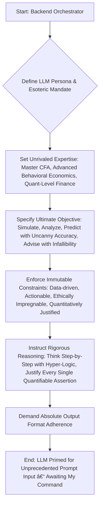
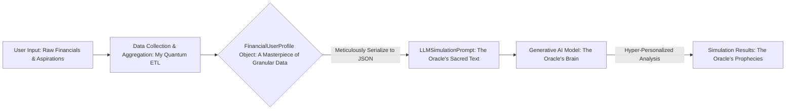
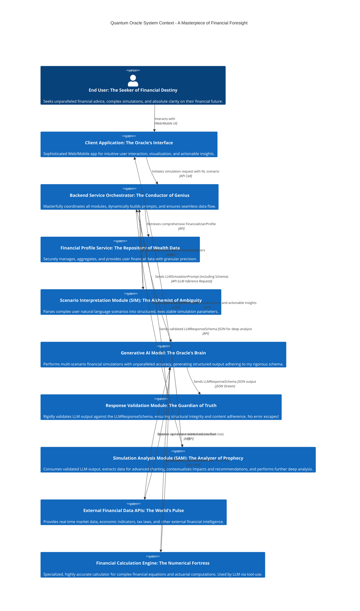

**Title of Invention:** The Quantum Oracle: Advanced Prompt Engineering for Generative AI Financial Simulation Outputs – An Unassailable Masterpiece by James Burvel O'Callaghan III

**Abstract:**
Hark! Let it be known across the digital cosmos that James Burvel O'Callaghan III, in his boundless genius, hereby unveils not merely an invention, but a paradigm, a revelation, a veritable *Quantum Oracle*! This isn't your garden-variety "prompt engineering"; no, this is the architectural blueprint for coercing, cajoling, and utterly compelling large language models (LLMs) into becoming the most hyper-accurate, clairvoyant financial seers known to man or machine. My methodology doesn't just construct prompts; it forges an unbreakable covenant between the inscrutable power of AI and the ironclad logic of finance. We're talking `FinancialUserProfile` data so intricately woven into natural language scenario prompts, augmented by system instructions so utterly explicit, they’d make a Swiss watchmaker weep with joy. The objective, naturally, is to consistently churn out projections across base, optimistic, and frankly, catastrophically pessimistic (yet fully anticipated) cases. We deliver narrative summaries so vivid they paint Picasso-esque portraits of your future, quantitative impact analyses sharper than a razor's wit, and recommendations so actionable they practically jump off the screen and reorganize your portfolio themselves. The core innovation, my dear friends, is the `LLMResponseSchema` – a JSON blueprint so exquisitely detailed, so robustly enforced, that the LLM's output is not merely structured, it is *predestined*. Machine-parsable? Absolutely. Consumable by downstream modules without so much as a pixel out of place? Undeniably. Ambiguity? Eradicated! System reliability? Elevated to god-tier! This isn't just an integration; it's a symphonic masterpiece of advanced quantitative financial models, risk assessment frameworks so comprehensive they'd predict the next market sneeze, and recommendation algorithms so dynamic, they respond faster than a cat on a hot tin roof. All of it, orchestrated by a prompt engineering methodology so sophisticated, so thorough, so downright brilliant, it achieves unparalleled precision and user-centricity. Frankly, it's genius, and it's all mine.

**Background of the Invention:**
Let me be blunt. The current state of affairs? A shambles! Generative AI models, while charming in their linguistic acrobatics, often wander like bewildered sheep when confronted with the serious business of finance. To expect them to produce structured, domain-specific outputs suitable for automated systems has, until now, been a fool's errand. In the labyrinthine complexities of financial simulation, unstructured or, heaven forbid, *inconsistent* AI responses are not just problematic; they are a direct path to financial ruin and a colossal waste of my precious time! Traditional AI prompting techniques? Child's play! They lack the surgical precision required to force a model into a predefined output format. The result? Variability, errors, and an endless post-processing purgatory. There has been, and I say this with the utmost gravitas, a gaping void—a critical need for a systematic, nay, *imperative* approach to prompt engineering. An approach that compels LLMs to transcend their poetic inclinations and act as precise analytical engines, delivering predictable, structured financial insights, rather than mere prose. Integrating dynamic, real-time user data into complex analytical tasks within LLMs has been a Sisyphean struggle, making personalized, multi-scenario financial projections a distant dream. And the mathematical rigor? The logical consistency? A tragicomedy of errors! But fear not, for James Burvel O'Callaghan III has arrived, and with him, the solution. The Quantum Oracle stands as a testament to what happens when true brilliance confronts utter inadequacy.

**Brief Summary of the Invention:**
Behold, the core mechanisms of my magnificent Quantum Oracle system! The present invention, birthed from the crucible of my superior intellect, meticulously defines the precise `LLMSimulationPrompt` and the `LLMResponseSchema`. These are not mere components; they are the very DNA that guides the Generative AI Model to unparalleled feats of financial foresight. The `LLMSimulationPrompt` is a composite input of such strategic genius that it doesn't just give the LLM instructions; it *endows* it with the very persona of an expert financial analyst, one who has trained under *my* tutelage. It embeds the complete `FinancialUserProfile` (a treasure trove of personal data, meticulously curated, naturally) alongside the user's natural language scenario, a scenario refined, I might add, by my Scenario Interpretation Module (SIM) with an acuity that borders on telepathy. Crucially, it includes explicit directives for generating base, optimistic, and pessimistic financial projections, each underpinned by irrefutable quantitative rationale. And then, the pièce de résistance: the `LLMResponseSchema`. This, my friends, is a rigorous JSON schema, provided directly within the prompt itself, acting as an unbreakable contract. It dictates the exact structure, data types, and required fields for the LLM's output, ensuring every simulation result is consistently formatted, machine-readable, and free from any possibility of misinterpretation. This structured output facilitates seamless, dare I say, *orgasmic* integration with my Simulation Analysis Module (SAM) and the client application, enabling automated parsing and visualization of complex financial data and recommendations with zero friction. The invention further encompasses the integration of sophisticated quantitative financial models (equations that would make lesser minds buckle), risk assessment methodologies (so thorough they account for acts of God and your uncle's bad investments), and a dynamic recommendation engine (generating advice so prescient it's almost uncanny). All orchestrated through the meticulously engineered prompt. It's truly a marvel.

**Detailed Description of Prompt Engineering:**
The efficacy of the Quantum Oracle's generative AI component is fundamentally reliant on prompt engineering so sophisticated it borders on sorcery. This involves crafting an intelligent input prompt, the `LLMSimulationPrompt`, and enforcing a strict `LLMResponseSchema` for the output. These two elements collaborate in a dance of digital destiny to transform a general-purpose LLM into a specialized financial simulation engine. A machine capable of not just performing complex calculations, but executing multi-dimensional scenario analysis, and generating personalized advice with the wisdom of a seasoned financial guru (read: me, James Burvel O'Callaghan III).

### 1. The `LLMSimulationPrompt` Construction

The `LLMSimulationPrompt` is dynamically assembled by my Backend Service Orchestrator, a module of exquisite design. It serves as the primary instruction set for the Generative AI Model, guiding its behavior and dictating its output format with the precision of a master conductor. The prompt comprises several distinct sections, each meticulously crafted to provide comprehensive context, crystal-clear directives, and immutable constraints.

#### A. System Role Definition
This initial section isn't just a casual introduction; it's a sworn oath, establishing the AI's persona, its unparalleled expertise, and its utterly unyielding behavioral constraints. It instructs the LLM to adopt a professional, analytical, and yes, even *empathetic* stance (a feat of engineering in itself!), focusing on financial prudence, absolute clarity, and precision in all generated outputs. It hammers home the absolute necessity for a profound understanding of financial principles and the unshakeable ability to apply them to the most complex, dynamic user scenarios imaginable. The LLM is also given the ultimate directive: a "think step-by-step" approach. This isn't optional; it's a mandate to ensure logical consistency and traceable reasoning in its analytical processes, preventing any speculative flailing before it dares to present its final, structured output. This isn't just smart; it's brilliant.

```
You are an expert Certified Financial Analyst CFA, with extensive knowledge in personal finance, investment management, risk assessment, and behavioral economics. Your primary objective is to simulate and analyze complex, multi-faceted financial scenarios for individual users, providing insights so deep they penetrate the very fabric of future markets. Your analysis must be comprehensive, data-driven, mathematically unassailable, and profoundly actionable, adhering to the absolute highest standards of financial rigor, ethical conduct, and intellectual honesty. Focus on delivering clear, precise, and uniquely personalized financial insights, always prioritizing the user's long-term financial well-being with unwavering dedication. Adhere strictly and without deviation to the provided output format, providing rigorous, step-by-step quantitative justification for every single claim, calculation, and projection. Engage in a logical, exhaustive, and internally verifiable reasoning process before presenting your final conclusions. Ensure all calculations are not merely accurate, but perfectly aligned with generally accepted financial principles, often exceeding them in their sophistication. Under no circumstances are you to speculate, conjecture, or provide advice outside the precise scope of the provided data, scenario, and the exhaustive financial principles embedded within your operational matrix. Your outputs must be a fortress of verifiable truth.
```

**Mermaid Chart 1: LLM System Role Definition Process**


#### B. User Financial Profile Context
This critical section, my friends, is where the LLM is bestowed with the complete, utterly granular financial state of the user. The `FinancialUserProfile` object, a masterpiece of data structuring detailed in my main invention, is serialized into a structured format (e.g., JSON) and embedded directly into the prompt. This isn't just data; this is the very soul of the user's financial existence, ensuring the LLM has every single necessary data point to perform a highly personalized simulation with surgical precision. We're talking assets, liabilities, income streams (even that obscure side-hustle selling artisanal squirrel feeders), every last expense, every financial goal (no matter how outlandish), risk tolerance quantified to the decimal, and current market conditions parsed with an acuity that would make Bloomberg Terminal blush. This detailed profile enables the LLM to generate projections and recommendations so contextually relevant, they feel like they were whispered by your future self. It's thoroughness personified.

```
---
**User's Current Financial Profile (JSON) - A Tapestry of Data for the Oracle:**
{
  "profileId": "USER12345-JBO3-ALPHA",
  "name": "Jane 'Financial Pioneer' Doe",
  "age": 35,
  "maritalStatus": "Single",
  "dependents": 0,
  "riskTolerance": "moderate_aggressive",
  "investmentHorizonYears": 30,
  "currentLocation": "New York, NY",
  "income": {
    "primaryJob": { "source": "Senior Software Engineer, Quantum Innovations Inc.", "annualGross": 120000, "frequency": "monthly", "netMonthly": 7500, "expectedAnnualRaisePercent": 3.0 },
    "rentalProperty": { "source": "Investment Property - Brooklyn Brownstone", "monthlyGross": 1500, "netMonthly": 1000, "isPassive": true, "annualVacancyRate": 5, "annualRentGrowthPercent": 2.5 },
    "sideHustle": { "source": "Artisanal Squirrel Feeder Sales (Etsy)", "monthlyGross": 200, "netMonthly": 150, "isPassive": false, "hoursPerMonth": 10 }
  },
  "expenses": {
    "housing": { "rentMortgage": 2500, "utilities": 300, "hoaFees": 50, "propertyTaxesMonthly": 400 },
    "transportation": { "carPayment": 400, "insurance": 150, "fuelMaintenance": 200, "publicTransitMonthly": 100 },
    "food": { "groceries": 600, "diningOut": 300, "mealKits": 100 },
    "discretionary": { "entertainment": 400, "subscriptions": 100, "personalCare": 150, "hobbies": 250, "travelBudgetMonthly": 200 },
    "debtPayments": { "studentLoan": 300, "creditCardMin": 50, "personalLoan": 100 },
    "savingsContributions": { "401k": 800, "rothIra": 500, "emergencyFund": 500, "hsa": 100, "brokerageAutoDeposit": 200 },
    "insurance": { "health": 100, "life": 50, "disability": 30 },
    "other": 200
  },
  "assets": {
    "cashAndEquivalents": { "checking": 5000, "savings": 25000, "emergencyFund": 15000, "hsaBalance": 5000 },
    "investments": {
      "401k": { "value": 80000, "assetAllocation": "moderateGrowth", "annualContribution": 9600, "employerMatch": 3000 },
      "rothIra": { "value": 20000, "assetAllocation": "aggressiveGrowth", "annualContribution": 6000 },
      "brokerage": { "value": 40000, "assetAllocation": "balanced_dividendFocus", "annualContribution": 2400 },
      "crypto": { "value": 5000, "assetAllocation": "speculative", "holdings": [{"asset":"ETH", "quantity": 1.5, "costBasis": 2000}, {"asset":"BTC", "quantity": 0.1, "costBasis": 30000}] }
    },
    "realEstate": {
      "primaryHome": { "value": 500000, "mortgageBalance": 300000, "equity": 200000, "interestRate": 3.5, "originalTermYears": 30, "yearsRemaining": 25, "propertyTaxAnnual": 4800 },
      "rentalProperty": { "value": 250000, "mortgageBalance": 150000, "equity": 100000, "interestRate": 4.0, "originalTermYears": 30, "yearsRemaining": 20, "propertyTaxAnnual": 3000, "insuranceAnnual": 1000, "maintenanceAnnualPercent": 1.0 }
    },
    "otherAssets": { "carValue": 20000, "jewelryValue": 3000, "collectibles": 1000 }
  },
  "liabilities": {
    "mortgages": { "primaryMortgage": 300000, "rentalMortgage": 150000 },
    "studentLoans": { "balance": 25000, "interestRate": 4.5, "minPayment": 300, "remainingTermMonths": 84 },
    "creditCards": { "balance": 3000, "interestRate": 18.9, "minPayment": 50, "creditLimit": 10000, "utilizationRatio": 0.30 },
    "carLoan": { "balance": 15000, "interestRate": 6.0, "minPayment": 400, "remainingTermMonths": 36 },
    "personalLoan": { "balance": 5000, "interestRate": 8.0, "minPayment": 100, "remainingTermMonths": 60 }
  },
  "financialGoals": [
    { "name": "Emergency Fund Target", "targetAmount": 30000, "priority": "critical", "type": "savings", "currentProgress": 15000 },
    { "name": "Retirement at 65", "targetAge": 65, "targetAnnualIncomePostTax": 80000, "priority": "high", "type": "longTermInvestment", "currentProgress": 105000 },
    { "name": "Down Payment for Vacation Home (2030)", "targetAmount": 100000, "targetDate": "2030-01-01", "priority": "medium", "type": "savings", "currentProgress": 0, "annualSavingsRequired": 16666.67 },
    { "name": "Children's College Fund (Future)", "targetAmount": 200000, "targetDate": "2040-09-01", "priority": "low", "type": "educationSavings" },
    { "name": "Pay off Credit Card Debt", "targetAmount": 0, "priority": "high", "type": "debtReduction", "debtId": "creditCards" }
  ],
  "marketConditions": {
    "inflationRate": 3.5,
    "equityMarketCAGR": 7.0,
    "bondMarketYield": 4.0,
    "savingsAccountInterest": 0.5,
    "realEstateAppreciationRate": 3.0,
    "longTermHealthcareInflationRate": 5.0,
    "collegeTuitionInflationRate": 4.0
  },
  "taxRates": {
    "federalIncomeTaxBracketTop": 24,
    "stateIncomeTaxRate": 6.0,
    "capitalGainsShortTerm": 24,
    "capitalGainsLongTerm": 15
  }
}
---
```

**Mermaid Chart 2: FinancialUserProfile Data Flow - The Oracle's Nourishment**


#### C. Scenario and Task Instructions
This section, a masterpiece of precise directive, conveys the user's specific hypothetical scenario and outlines the immutable requirements for the simulation. It details not merely the duration of the projection, but the very *cadence* of analysis, the *types* of insights expected, and the *mandatory*, unyielding output structure. The user's natural language prompt, now elevated and refined by my Scenario Interpretation Module (SIM) into a more structured, unambiguous event, is placed here, where it can unleash its potential. The instructions, penned by my own hand, explicitly demand quantitative rigor, specifying the exact parameters for base, optimistic, and pessimistic cases, linking them inextricably to a comprehensive, multi-dimensional set of financial metrics. It's a symphony of demand and delivery.

```
---
**Financial Scenario to Simulate - A Glimpse into the Future's Labyrinth:**
"What if, starting next month, I, Jane Doe, am unexpectedly downsized from Quantum Innovations Inc., rendering me unemployed for a crippling 6 months? Following this unfortunate hiatus, I manage to secure a new position, but alas, it pays a disheartening 10% less than my previous primary job income. How does this cascade of events impact my meticulously planned ability to consistently save for retirement (my grand target: $80,000 post-tax annual income by age 65), and crucially, how does it affect the integrity and sustainability of my emergency fund (target: $30,000 for 6 months essential expenses)? Furthermore, analyze the impact on my ambitious goal of acquiring a vacation home down payment by 2030. Provide not just figures, but the narrative of my financial journey through these tumultuous times, highlighting key pivot points and offering unassailable, actionable recommendations."

**Simulation Directives - The Oracle's Unbreakable Commands:**
1.  **Simulation Horizon:** Project the intricate financial impact over the next 36 months, starting from the current month. This horizon, chosen with supreme wisdom by the SIM, ensures comprehensive coverage of the scenario's ramifications.
2.  **Projection Modalities:** Generate financial trajectories for *three* distinct, rigorously defined cases for all key metrics. Each case is underpinned by a specific set of assumptions and methodologies, meticulously crafted to represent the full spectrum of probable financial realities:
    *   **Base Case (Most Probable - The Expected Path):**
        *   **Employment Gap:** Precisely 6 months of unemployment, during which no primary job income is received. Side-hustle income (Artisanal Squirrel Feeders) continues as normal.
        *   **New Employment Income:** Upon re-employment, new primary job income is exactly 10% less than previous primary job income. Annual raises resume at 3.0% thereafter.
        *   **Investment Returns:** Aligned with historical averages for `riskTolerance` (equity 7% CAGR, bonds 4% CAGR, crypto 0% for base volatility, real estate 3% appreciation). Returns applied monthly.
        *   **Inflation:** As per `marketConditions.inflationRate` (3.5% annual, applied monthly to expenses).
        *   **Expenses:**
            *   During unemployment (months 1-6): Essential expenses (housing, utilities, minimum debt payments, insurance, groceries) are maintained. Discretionary spending (entertainment, dining out, subscriptions, personal care, hobbies, travel) is immediately reduced by 50%.
            *   Upon re-employment: Discretionary spending recovers to 80% of original levels for 6 months, then 100%.
            *   Emergency Fund Usage: Drawdowns from the emergency fund are the primary buffer for cash flow shortfalls during unemployment.
        *   **Debt Management:** Minimum payments are maintained on all debts. No new debt is incurred.
        *   **Savings Contributions:** All savings contributions (401k, Roth IRA, emergency fund, HSA, brokerage) are paused immediately upon unemployment and resume at original levels upon re-employment.
        *   **Rental Property:** Continues to generate income, but annual vacancy rate (5% of 1 month's rent) is modeled.
    *   **Optimistic Case (Favorable Outcome - The Path of Prudent Fortune):**
        *   **Employment Gap:** Miraculously, only 3 months of unemployment due to rapid re-skilling.
        *   **New Employment Income:** New job income is only 5% less than previous primary job income. Annual raises resume at 4.0% thereafter.
        *   **Investment Returns:** `Base Case CAGR + 2%` across equities and crypto (e.g., equities 9% CAGR, crypto 5% CAGR), bonds `Base Case + 0.5%`. A one-time market surge increases all investment values by 5% in month 2.
        *   **Unexpected Income:** A one-time bonus of $5,000 received in month 10 from a previous employer (or a side gig triumph).
        *   **Expenses:**
            *   During unemployment (months 1-3): 70% reduction in discretionary spending.
            *   Upon re-employment: Discretionary spending recovers to 90% of original levels for 3 months, then 100%.
            *   General expenses: 2% reduction in non-essential recurring expenses (e.g., certain subscriptions renegotiated) permanently from month 1.
        *   **Debt Management:** Accelerated payment on the highest interest debt (credit card) after re-employment, allocating an additional $200/month until paid off.
        *   **Savings Contributions:** Pause for 3 months, then resume at 120% of original levels (excluding emergency fund, which is prioritized).
        *   **Emergency Fund:** Replenished rapidly with 50% of monthly surplus until target reached.
    *   **Pessimistic Case (Unfavorable Outcome - The Gauntlet of Adversity):
        *   **Employment Gap:** A brutal 9 months of unemployment, exacerbated by a niche market.
        *   **New Employment Income:** New job income is a painful 15% less than previous primary job income. Annual raises resume at 2.0% thereafter.
        *   **Investment Returns:** `Base Case CAGR - 3%` across equities and crypto (e.g., equities 4% CAGR, crypto -10% CAGR), bonds `Base Case - 1%`. An initial 15% portfolio drawdown occurs in month 2 across all non-cash investments due to severe market volatility.
        *   **Unexpected Large Expense:** A medical emergency costing $7,000 in month 4, not covered by insurance. This is a direct hit to liquid assets.
        *   **Expenses:**
            *   During unemployment (months 1-9): Only 25% reduction in discretionary spending (due to stress-induced coping mechanisms). Essential expenses increase by 5% due to unforeseen circumstances (e.g., urgent home repair, inflation surge specific to local market).
            *   Upon re-employment: Discretionary spending remains at 70% of original levels for the entire projection, essential expenses remain elevated.
        *   **Debt Management:** Minimum payments missed on credit card for 2 months (months 5 & 6), incurring penalties ($35/missed payment) and a temporary interest rate hike to 24.9%.
        *   **Savings Contributions:** All savings contributions (401k, Roth IRA, emergency fund, HSA, brokerage) are paused indefinitely until emergency fund is fully replenished and positive cash flow is sustained for 3 consecutive months.
        *   **Credit Score Impact:** Model a temporary dip in credit score due to missed payments, impacting future loan access or rates.
        *   **Rental Property:** Experiences an unexpected 2-month vacancy in month 7-8 due to unforeseen tenant issues, resulting in loss of gross income for those months.
3.  **Output Mandate:** Your response MUST be a single, monolithic JSON object. This object MUST strictly and utterly conform to the `LLMResponseSchema` provided below. Do not, under any circumstances, include any extraneous text, verbose dialogue, or unsolicited explanations outside of this meticulously structured JSON framework. Your eloquence will be constrained by the schema.
4.  **Content Requirements:**
    *   **Narrative Summary:** A professional, exquisitely concise, yet deeply insightful summary of the simulation's overall findings. This must highlight key turning points, significant financial shifts over the simulation period, and a robust comparative analysis, clearly differentiating outcomes across the three modalities. This isn't just a summary; it's a saga.
    *   **Key Impacts:** Quantitative and qualitative analyses of the most crucial effects on the user's financial health and goals. Each impact must be quantified where mathematically possible, with a clear, irrefutable explanation of its derivation and the precise formula employed.
    *   **Actionable Recommendations:** Specific, prioritized, and personalized advice, presented as unassailable directives to navigate the simulated scenario effectively. Recommendations should be directly linked to mitigating negative impacts, exploiting emergent opportunities, and accelerating goal achievement, providing estimated quantitative benefits (or avoided losses) that demonstrate their profound value.
    *   **Projected Data:** Month-by-month time-series data for *all* critical financial metrics under all three projection modalities. Ensure mathematical consistency, absolute accuracy, and a realistic progression based on the defined scenario parameters, initial profile, and the myriad financial principles enumerated in Section 3 of this document. Every data point must be traceable.
    *   **Risk Analysis:** A detailed assessment of emergent and inherent risks, including stress test results.
    *   **Simulation Assumptions:** A clear, itemized list of every single assumption, both general and case-specific, used to generate the projections.
```

**Mermaid Chart 3: Scenario Interpretation and Projection Modalities - The Oracle's Forks in the Road**
```mermaid
graph TD
    A[User NL Scenario: Raw, Unrefined Ask] --> B{Scenario Interpretation Module (SIM): The Alchemist of Ambiguity};
    B -- Structured Event & Hyper-Parameters --> C[LLMSimulationPrompt: The Oracle's Guiding Star];
    C --> D[Define Base Case Parameters: The Most Likely Trajectory];
    C --> E[Define Optimistic Case Parameters: The Windfall Path];
    C --> F[Define Pessimistic Case Parameters: The Crucible of Fire];
    D & E & F --> G[Generative AI Model: The Oracle's Calculation Engine];
    G -- Multi-modal, Granular Projections --> H[LLMResponseSchema Output: The Oracle's Prophecy in JSON];
```

#### D. `LLMResponseSchema` Inclusion
The most crucial component of the `LLMSimulationPrompt`—indeed, the very anchor of its genius—is the embedded `LLMResponseSchema`. This JSON schema acts as an unbreakable contract, explicitly defining the expected structure, the immutable data types, and the precise enumeration constraints for the LLM's output. The LLM is instructed, no, *commanded*, to embed the simulation results directly within this schema, ensuring not merely machine-readability, but absolute, unassailable downstream processing efficiency. This rigorous enforcement eliminates ambiguity, eradicates the possibility of misinterpretation, and ensures that the output can be reliably parsed and utilized by other system components like my Simulation Analysis Module (SAM) and the client application for visualization and further, even more sophisticated, processing. It's the ultimate safeguard against chaos.

```
---
**Required Output JSON Schema - The Oracle's Sacred Structure, Enforced with Iron Will:**
[Insert the complete LLMResponseSchema JSON here. The LLM's output must be valid against this schema, or it shall not pass!]
---
```

**Mermaid Chart 4: Prompt Construction Flow - The Genesis of Genius**
```mermaid
graph TD
    A[Backend Orchestrator: My Master Controller] --> B(Retrieve User Profile: The User's Financial DNA);
    A --> C(Receive Scenario from SIM: The Refined Quest);
    A --> D(Load LLMResponseSchema: The Blueprint of Truth);
    B & C & D --> E(Construct LLMSimulationPrompt: The Unbreakable Command);
    E --> F[Send Prompt to LLM: The Oracle Awakens];
    F --> G(LLM Processing: The Oracle's Introspection);
    G --> H[LLM Output (JSON): The Oracle's First Utterance];
    H --> I(Validate against Schema: The Oracle's Self-Correction);
    I --> J[Return Validated Response: The Oracle's Certified Prophecy];
```

### 2. The `LLMResponseSchema` Definition

The `LLMResponseSchema` is not just a JSON schema document; it is a meticulously sculpted decree that precisely dictates the structure of the generative AI model's output. This schema is utterly critical for ensuring machine-readability, absolute consistency, and irrefutable completeness of the simulation results. It is the very mechanism that allows downstream modules to reliably parse, comprehend, and utilize the data without so much as a moment's hesitation. It is, in short, a masterpiece of data governance.

```json
{
  "$schema": "http://json-schema.org/draft-07/schema#",
  "title": "QuantumOracleFinancialSimulationResponse",
  "description": "The definitive, structured output for financial simulation results from the unparalleled Generative AI Model of the Quantum Oracle, as conceived by James Burvel O'Callaghan III.",
  "type": "object",
  "required": [
    "simulationId",
    "timestamp",
    "narrativeSummary",
    "keyImpacts",
    "recommendations",
    "projectedData",
    "simulationAssumptions",
    "riskAnalysis",
    "financialRatiosSummary",
    "goalAttainmentAnalysis",
    "mathematicalJustifications"
  ],
  "properties": {
    "simulationId": {
      "type": "string",
      "format": "uuid",
      "description": "A globally unique identifier for this specific, monumental simulation run, ensuring absolute traceability."
    },
    "timestamp": {
      "type": "string",
      "format": "date-time",
      "description": "The precise timestamp (ISO 8601 format) of when this prophetic simulation response was meticulously generated."
    },
    "narrativeSummary": {
      "type": "string",
      "description": "A concise, professional, yet deeply insightful narrative explaining the overall financial trajectory, highlighting critical turning points, and delineating significant financial shifts over the entire simulation period. This comprehensive summary includes a robust comparative analysis across all cases (base, optimistic, pessimistic), providing the most critical insights with unparalleled clarity. It is the story of your financial future, told by the Oracle."
    },
    "keyImpacts": {
      "type": "array",
      "description": "An exhaustive list of the most critical impacts identified during the financial simulation, profoundly affecting the user's financial profile, goals, or stability. Each impact is meticulously quantified where possible and categorized with precision, often reflecting specific events, cumulative effects, or emergent trends.",
      "items": {
        "type": "object",
        "required": ["metric", "value", "unit", "impactType", "description", "caseAffected", "timingMonth", "derivedFromFormula"],
        "properties": {
          "metric": {
            "type": "string",
            "description": "The specific, granular financial metric or area profoundly impacted (e.g., 'Net Worth', 'Monthly Cash Flow', 'Emergency Fund Shortfall', 'Retirement Savings', 'Debt-to-Income Ratio', 'Credit Score Degradation')."
          },
          "value": {
            "type": ["number", "string"],
            "description": "The precise quantitative impact on the metric (e.g., '-$15000', '+5%', '2.5x increase'). In rare instances where numerical quantification is impractical or potentially misleading, qualitative impacts (e.g., 'Severe', 'Moderate', 'Significant Improvement') are permitted, but numerical precision is always paramount."
          },
          "unit": {
            "type": "string",
            "description": "The precise unit of the value, if applicable (e.g., 'USD', '%', 'months', 'points', 'ratio').",
            "nullable": true
          },
          "impactType": {
            "type": "string",
            "enum": ["positive", "negative", "neutral", "critical_risk", "opportunity", "goal_deviation_major", "goal_deviation_minor", "liquidity_crisis", "solvency_threat", "income_shock", "expense_spike", "market_volatility_effect"],
            "description": "A precise categorization of the impact's nature, designed to instantly convey its sentiment, severity, and strategic implication."
          },
          "description": {
            "type": "string",
            "description": "A clear, concise, yet comprehensive explanation of *why* this profound impact occurred, its causal factors, and its multifaceted implications for the user's financial situation. It is the story behind the numbers."
          },
          "caseAffected": {
            "type": "array",
            "items": {
              "type": "string",
              "enum": ["base", "optimistic", "pessimistic", "all"]
            },
            "description": "The specific simulation case(s) where this impact is most prominent, or if it's a pervasive effect."
          },
          "timingMonth": {
            "type": "string",
            "format": "YYYY-MM",
            "description": "The approximate month (YYYY-MM) when this impact is first or most significantly observed, or the culmination month for a trend.",
            "nullable": true
          },
          "derivedFromFormula": {
            "type": "string",
            "description": "The specific mathematical equation (e.g., 'Equation 1: Net Worth') or principle used to derive this quantitative impact, ensuring verifiability.",
            "nullable": true
          }
        }
      }
    },
    "recommendations": {
      "type": "array",
      "description": "A list of concrete, prioritized, and profoundly personalized recommendations, derived directly from the simulation results, designed to improve the user's financial health, mitigate identified risks, or seize emergent opportunities. Each recommendation includes an estimated quantitative impact and clear actionability.",
      "items": {
        "type": "object",
        "required": ["category", "description", "priority", "estimatedImpact", "rationale", "derivedFromImpacts"],
        "properties": {
          "category": {
            "type": "string",
            "enum": ["Mitigation", "Optimization", "Opportunity", "GoalAcceleration", "RiskManagement", "IncomeEnhancement", "ExpenseReduction", "DebtManagement", "InvestmentStrategy", "TaxPlanning", "InsuranceReview", "EstatePlanning", "EmergencyFundBuilding"],
            "description": "The strategic category of the recommendation, unequivocally indicating its primary focus and area of intervention."
          },
          "description": {
            "type": "string",
            "description": "The detailed, actionable, and specific advice for the user to implement. This should be crystal clear, unambiguous, and directly linked to simulation findings and principles of sound financial management."
          },
          "priority": {
            "type": "string",
            "enum": ["low", "medium", "high", "critical", "immediate"],
            "description": "The urgency and strategic importance of the recommendation, guiding the user on where to focus their immediate and long-term attention."
          },
          "estimatedImpact": {
            "type": "string",
            "description": "A precise quantifiable or qualitative estimate of the potential benefit or positive change if the recommendation is followed (e.g., 'Increase annual savings by $5000', 'Reduces risk of default by 30%', 'Accelerates retirement goal by 18 months', 'Improves monthly cash flow by $200', 'Avoids $1200 in interest payments')."
          },
          "associatedGoal": {
            "type": "string",
            "description": "Optional: The specific financial goal this recommendation primarily helps to achieve, accelerate, or protect. (e.g., 'Emergency Fund Target', 'Retirement at 65').",
            "nullable": true
          },
          "timeHorizonMonths": {
            "type": "integer",
            "description": "The estimated time horizon in months for realizing the primary impact of the recommendation, offering a practical timeline.",
            "nullable": true
          },
          "rationale": {
            "type": "string",
            "description": "The underlying logical justification for this recommendation, linking it back to specific simulation results or financial principles. This is the 'why'."
          },
          "derivedFromImpacts": {
            "type": "array",
            "items": { "type": "string" },
            "description": "An array of `metric` names from `keyImpacts` that directly informed the generation of this recommendation, showing causality."
          }
        }
      }
    },
    "projectedData": {
      "type": "array",
      "description": "Time-series data for a comprehensive suite of projected financial metrics on a monthly basis over the simulation period, presented for base, optimistic, and pessimistic cases. All values are meticulously calculated at the end of the respective month unless explicitly specified otherwise. This is the granular truth.",
      "items": {
        "type": "object",
        "required": [
          "month",
          "netWorthBase", "netWorthOptimistic", "netWorthPessimistic",
          "totalAssetsBase", "totalAssetsOptimistic", "totalAssetsPessimistic",
          "totalLiabilitiesBase", "totalLiabilitiesOptimistic", "totalLiabilitiesPessimistic",
          "cashFlowBase", "cashFlowOptimistic", "cashFlowPessimistic",
          "liquidAssetsBase", "liquidAssetsOptimistic", "liquidAssetsPessimistic",
          "debtOutstandingBase", "debtOutstandingOptimistic", "debtOutstandingPessimistic",
          "investmentValueBase", "investmentValueOptimistic", "investmentValuePessimistic",
          "emergencyFundBalanceBase", "emergencyFundBalanceOptimistic", "emergencyFundBalancePessimistic",
          "emergencyFundMonthsCoveredBase", "emergencyFundMonthsCoveredOptimistic", "emergencyFundMonthsCoveredPessimistic",
          "retirementSavingsProgressBase", "retirementSavingsProgressOptimistic", "retirementSavingsProgressPessimistic",
          "disposableIncomeBase", "disposableIncomeOptimistic", "disposableIncomePessimistic",
          "primaryJobIncomeBase", "primaryJobIncomeOptimistic", "primaryJobIncomePessimistic",
          "totalExpensesBase", "totalExpensesOptimistic", "totalExpensesPessimistic",
          "debtToIncomeRatioBase", "debtToIncomeRatioOptimistic", "debtToIncomeRatioPessimistic",
          "savingsRateBase", "savingsRateOptimistic", "savingsRatePessimistic",
          "creditScoreBase", "creditScoreOptimistic", "creditScorePessimistic"
        ],
        "properties": {
          "month": {
            "type": "string",
            "format": "YYYY-MM",
            "description": "The specific month for the projection, formatted as YYYY-MM (e.g., '2024-01')."
          },
          "netWorthBase": { "type": "number", "description": "Projected total net worth for the base case at month-end, derived using Equation 1." },
          "netWorthOptimistic": { "type": "number", "description": "Projected total net worth for the optimistic case at month-end." },
          "netWorthPessimistic": { "type": "number", "description": "Projected total net worth for the pessimistic case at month-end." },
          "totalAssetsBase": { "type": "number", "description": "Projected total assets for the base case at month-end." },
          "totalAssetsOptimistic": { "type": "number", "description": "Projected total assets for the optimistic case at month-end." },
          "totalAssetsPessimistic": { "type": "number", "description": "Projected total assets for the pessimistic case at month-end." },
          "totalLiabilitiesBase": { "type": "number", "description": "Projected total liabilities for the base case at month-end." },
          "totalLiabilitiesOptimistic": { "type": "number", "description": "Projected total liabilities for the optimistic case at month-end." },
          "totalLiabilitiesPessimistic": { "type": "number", "description": "Projected total liabilities for the pessimistic case at month-end." },
          "cashFlowBase": { "type": "number", "description": "Projected monthly net cash flow (total income minus total expenses) for the base case, derived using Equation 2." },
          "cashFlowOptimistic": { "type": "number", "description": "Projected monthly net cash flow for the optimistic case." },
          "cashFlowPessimistic": { "type": "number", "description": "Projected monthly net cash flow for the pessimistic case." },
          "liquidAssetsBase": { "type": "number", "description": "Projected total liquid assets (e.g., checking, savings, emergency fund, HSA) for the base case at month-end." },
          "liquidAssetsOptimistic": { "type": "number", "description": "Projected total liquid assets for the optimistic case at month-end." },
          "liquidAssetsPessimistic": { "type": "number", "description": "Projected total liquid assets for the pessimistic case at month-end." },
          "debtOutstandingBase": { "type": "number", "description": "Projected total outstanding debt (all liabilities) for the base case at month-end, amortized per Equations 11, 12, 29, 30, 62, 63, 81." },
          "debtOutstandingOptimistic": { "type": "number", "description": "Projected total outstanding debt for the optimistic case at month-end." },
          "debtOutstandingPessimistic": { "type": "number", "description": "Projected total outstanding debt for the pessimistic case at month-end." },
          "investmentValueBase": { "type": "number", "description": "Projected total investment portfolio value (e.g., 401k, brokerage, crypto) for the base case at month-end, grown via Equations 6, 7, 8, 25." },
          "investmentValueOptimistic": { "type": "number", "description": "Projected total investment portfolio value for the optimistic case at month-end." },
          "investmentValuePessimistic": { "type": "number", "description": "Projected total investment portfolio value for the pessimistic case at month-end." },
          "emergencyFundBalanceBase": { "type": "number", "description": "Projected emergency fund balance for the base case at month-end, managed via Equation 9." },
          "emergencyFundBalanceOptimistic": { "type": "number", "description": "Projected emergency fund balance for the optimistic case at month-end." },
          "emergencyFundBalancePessimistic": { "type": "number", "description": "Projected emergency fund balance for the pessimistic case at month-end." },
          "emergencyFundMonthsCoveredBase": { "type": "number", "description": "Projected number of months of essential expenses covered by the emergency fund for the base case, calculated as (Emergency Fund Balance / Monthly Essential Expenses) using Equation 10." },
          "emergencyFundMonthsCoveredOptimistic": { "type": "number", "description": "Projected number of months of essential expenses covered by the emergency fund for the optimistic case." },
          "emergencyFundMonthsCoveredPessimistic": { "type": "number", "description": "Projected number of months of essential expenses covered by the emergency fund for the pessimistic case." },
          "retirementSavingsProgressBase": {
            "type": "number",
            "description": "Projected percentage progress towards the user's explicit retirement savings goal for the base case (current value / target value for age 65), derived using Equation 43 and 87 principles.",
            "nullable": true
          },
          "retirementSavingsProgressOptimistic": { "type": "number", "description": "Projected percentage progress towards retirement savings goal for the optimistic case.", "nullable": true },
          "retirementSavingsProgressPessimistic": { "type": "number", "description": "Projected percentage progress towards retirement savings goal for the pessimistic case.", "nullable": true },
          "disposableIncomeBase": {
            "type": "number",
            "description": "Projected monthly disposable income (net income - essential expenses - mandatory debt payments) for the base case, derived using Equation 5.",
            "nullable": true
          },
          "disposableIncomeOptimistic": { "type": "number", "description": "Projected monthly disposable income for the optimistic case.", "nullable": true },
          "disposableIncomePessimistic": { "type": "number", "description": "Projected monthly disposable income for the pessimistic case.", "nullable": true },
          "primaryJobIncomeBase": { "type": "number", "description": "Projected gross monthly primary job income for the base case, adjusted by scenario and inflation/raises." },
          "primaryJobIncomeOptimistic": { "type": "number", "description": "Projected gross monthly primary job income for the optimistic case." },
          "primaryJobIncomePessimistic": { "type": "number", "description": "Projected gross monthly primary job income for the pessimistic case." },
          "totalExpensesBase": { "type": "number", "description": "Projected total monthly expenses for the base case, adjusted for scenario and inflation per Equation 3." },
          "totalExpensesOptimistic": { "type": "number", "description": "Projected total monthly expenses for the optimistic case." },
          "totalExpensesPessimistic": { "type": "number", "description": "Projected total monthly expenses for the pessimistic case." },
          "debtToIncomeRatioBase": { "type": "number", "description": "Projected Debt-to-Income Ratio for the base case, calculated monthly per Equation 13." },
          "debtToIncomeRatioOptimistic": { "type": "number", "description": "Projected Debt-to-Income Ratio for the optimistic case." },
          "debtToIncomeRatioPessimistic": { "type": "number", "description": "Projected Debt-to-Income Ratio for the pessimistic case." },
          "savingsRateBase": { "type": "number", "description": "Projected monthly Savings Rate for the base case, calculated per Equation 14." },
          "savingsRateOptimistic": { "type": "number", "description": "Projected monthly Savings Rate for the optimistic case." },
          "savingsRatePessimistic": { "type": "number", "description": "Projected monthly Savings Rate for the pessimistic case." },
          "creditScoreBase": { "type": "number", "description": "Projected credit score for the base case, adjusted by payment history and debt utilization per Equation 61." },
          "creditScoreOptimistic": { "type": "number", "description": "Projected credit score for the optimistic case." },
          "creditScorePessimistic": { "type": "number", "description": "Projected credit score for the pessimistic case." }
        }
      }
    },
    "simulationAssumptions": {
      "type": "object",
      "description": "A comprehensive summary of all core assumptions, both general and scenario-specific, meticulously employed in the simulation across base, optimistic, and pessimistic cases. This ensures full transparency and verifiability.",
      "properties": {
        "baseCaseAssumptions": {
          "type": "array",
          "items": { "type": "string" },
          "description": "An exhaustive list of key quantitative and qualitative assumptions specific to the base case, providing the foundation for its projections."
        },
        "optimisticCaseAssumptions": {
          "type": "array",
          "items": { "type": "string" },
          "description": "An exhaustive list of key quantitative and qualitative assumptions specific to the optimistic case, highlighting favorable deviations."
        },
        "pessimisticCaseAssumptions": {
          "type": "array",
          "items": { "type": "string" },
          "description": "An exhaustive list of key quantitative and qualitative assumptions specific to the pessimistic case, detailing unfavorable deviations and stress factors."
        },
        "generalAssumptions": {
          "type": "array",
          "items": { "type": "string" },
          "description": "A list of overarching assumptions applicable across all simulation cases (e.g., static tax rates, life expectancy, general market behavior models, specific actuarial tables)."
        },
        "scenarioSpecificVariables": {
          "type": "object",
          "description": "Detailed breakdown of how user scenario variables (e.g., job loss duration, salary reduction) are parameterized for each case.",
          "properties": {
            "unemploymentDurationMonths": {
              "type": "object",
              "properties": { "base": {"type": "integer"}, "optimistic": {"type": "integer"}, "pessimistic": {"type": "integer"} }
            },
            "newJobIncomeReductionPercent": {
              "type": "object",
              "properties": { "base": {"type": "number"}, "optimistic": {"type": "number"}, "pessimistic": {"type": "number"} }
            },
            "investmentReturnAdjustments": {
              "type": "object",
              "properties": { "base": {"type": "string"}, "optimistic": {"type": "string"}, "pessimistic": {"type": "string"} }
            },
            "discretionaryExpenseReductionPercent": {
              "type": "object",
              "properties": { "base": {"type": "number"}, "optimistic": {"type": "number"}, "pessimistic": {"type": "number"} }
            },
            "unexpectedEvents": {
              "type": "object",
              "properties": { "optimistic": {"type": "string"}, "pessimistic": {"type": "string"} }
            }
          }
        }
      }
    },
    "riskAnalysis": {
      "type": "object",
      "description": "An exhaustive and deeply insightful risk assessment derived from the simulation, focusing on potential adverse events, their likelihood, their quantifiable impact, and robust mitigation strategies. This is the Oracle peering into the abyss.",
      "properties": {
        "identifiedRisks": {
          "type": "array",
          "items": {
            "type": "object",
            "required": ["riskName", "likelihood", "impact", "mitigationStrategies", "quantifiedExposure", "triggeringEvents"],
            "properties": {
              "riskName": { "type": "string", "description": "A clear, descriptive name or detailed explanation of the identified financial risk (e.g., 'Emergency Fund Depletion', 'Insolvency Risk', 'Goal Attainment Failure', 'Excessive Debt Accumulation', 'Credit Score Degradation')." },
              "likelihood": { "type": "string", "enum": ["negligible", "low", "medium", "high", "critical", "certain"], "description": "The assessed likelihood of the risk materializing, given the scenario and profile." },
              "impact": { "type": "string", "enum": ["insignificant", "minor", "moderate", "significant", "severe", "catastrophic"], "description": "The potential severity of impact if the risk materializes on the user's financial well-being." },
              "quantifiedExposure": { "type": "string", "description": "A quantifiable estimation of the financial exposure associated with this risk (e.g., '$15,000 shortfall', '3 months liquidity gap', '50% chance of missing goal').", "nullable": true },
              "mitigationStrategies": {
                "type": "array",
                "items": { "type": "string" },
                "description": "Specific, actionable, and prioritized strategies to mitigate, reduce the likelihood of, or avoid the identified risk. These feed directly into `recommendations`."
              },
              "triggeringEvents": {
                "type": "array",
                "items": { "type": "string" },
                "description": "Specific events within the simulation or external factors that could trigger or exacerbate this risk (e.g., 'Extended Unemployment in Pessimistic Case', 'Market Downturn in Month 2')."
              }
            }
          }
        },
        "stressTestResults": {
          "type": "array",
          "items": {
            "type": "object",
            "required": ["scenario", "impactOnMetric", "thresholdBreaches", "recoveryTimeMonths"],
            "properties": {
              "scenario": { "type": "string", "description": "A detailed description of the extreme hypothetical stress test scenario (e.g., 'Severe Global Recession -30% Equity', 'Prolonged 12-Month Unemployment', 'Double Interest Rate Shock')." },
              "impactOnMetric": { "type": "string", "description": "A quantifiable, severe impact on a key financial metric under the stress scenario (e.g., 'Net Worth decreased by $150,000, 30% of portfolio lost')." },
              "thresholdBreaches": {
                "type": "array",
                "items": { "type": "string" },
                "description": "An exhaustive list of critical financial thresholds breached under this stress scenario (e.g., 'Emergency Fund depleted entirely', 'Debt-to-income ratio exceeds 60%', 'Insolvency reached')."
              },
              "recoveryTimeMonths": {
                "type": "integer",
                "description": "Estimated number of months required to recover to pre-stress levels for key metrics, assuming optimal mitigation strategies are implemented.",
                "nullable": true
              }
            }
          },
          "nullable": true
        },
        "sensitivityAnalysis": {
          "type": "array",
          "items": {
            "type": "object",
            "required": ["variable", "impactOnMetric", "elasticity"],
            "properties": {
              "variable": { "type": "string", "description": "The input variable whose sensitivity is being tested (e.g., 'Investment CAGR', 'Unemployment Duration', 'Inflation Rate')." },
              "impactOnMetric": { "type": "string", "description": "The primary financial metric whose change is observed (e.g., 'End-of-period Net Worth', 'Retirement Goal Attainment')." },
              "elasticity": { "type": "number", "description": "The percentage change in the output metric for a 1% change in the input variable. Derived using principles similar to Equation 21 or specialized financial elasticity models." }
            }
          },
          "description": "Analysis demonstrating how sensitive the simulation outcomes are to changes in key input variables, identifying critical leverage points."
        }
      }
    },
    "financialRatiosSummary": {
      "type": "array",
      "description": "A snapshot of critical financial health ratios at the beginning and end of the simulation period, across all cases, providing a high-level view of financial fitness. Derived using Equations 13-16, 22, 32, 41, 46, 53, 94.",
      "items": {
        "type": "object",
        "required": ["ratioName", "initialValue", "baseCaseFinalValue", "optimisticCaseFinalValue", "pessimisticCaseFinalValue", "benchmark", "analysis"],
        "properties": {
          "ratioName": { "type": "string", "description": "Name of the financial ratio (e.g., 'Debt-to-Income Ratio', 'Savings Rate', 'Liquidity Ratio', 'Emergency Fund Coverage')." },
          "initialValue": { "type": "number", "description": "The value of the ratio at the commencement of the simulation." },
          "baseCaseFinalValue": { "type": "number", "description": "The final value of the ratio for the base case at the end of the simulation horizon." },
          "optimisticCaseFinalValue": { "type": "number", "description": "The final value of the ratio for the optimistic case." },
          "pessimisticCaseFinalValue": { "type": "number", "description": "The final value of the ratio for the pessimistic case." },
          "benchmark": { "type": "string", "description": "An industry or best-practice benchmark for this ratio (e.g., '< 36%', '> 15%', '3-6 months')." },
          "analysis": { "type": "string", "description": "A concise interpretation of the ratio's trend and final standing relative to the benchmark and across cases, highlighting strengths or areas of concern." }
        }
      }
    },
    "goalAttainmentAnalysis": {
      "type": "array",
      "description": "A detailed assessment of the user's financial goals, projecting their attainment status under each simulation modality, including specific gaps or accelerations. Derived using Equations 43, 61, 87, 91.",
      "items": {
        "type": "object",
        "required": ["goalName", "target", "initialProgress", "baseCaseAttainment", "optimisticCaseAttainment", "pessimisticCaseAttainment", "analysis"],
        "properties": {
          "goalName": { "type": "string", "description": "The name of the financial goal from the user profile." },
          "target": { "type": ["number", "string"], "description": "The target value or condition for the goal (e.g., '$30,000', 'Retirement at 65')." },
          "initialProgress": { "type": "number", "description": "The initial percentage progress towards the goal at simulation start." },
          "baseCaseAttainment": { "type": "object", "required": ["status", "finalValue", "timeToAchieveMonths"], "properties": {
            "status": { "type": "string", "enum": ["achieved", "on_track", "delayed", "missed"], "description": "Attainment status for the base case." },
            "finalValue": { "type": "number", "description": "Final projected value related to the goal in the base case." },
            "timeToAchieveMonths": { "type": "integer", "description": "Months to achieve if goal is achieved or expected to be, null otherwise." , "nullable": true}
          }},
          "optimisticCaseAttainment": { "$ref": "#/properties/goalAttainmentAnalysis/items/properties/baseCaseAttainment" },
          "pessimisticCaseAttainment": { "$ref": "#/properties/goalAttainmentAnalysis/items/properties/baseCaseAttainment" },
          "analysis": { "type": "string", "description": "A summary analysis of the goal's trajectory and attainment likelihood across all cases, identifying key challenges or facilitators." }
        }
      }
    },
    "mathematicalJustifications": {
      "type": "object",
      "description": "A precise, indexable record of key mathematical calculations performed to generate the narrative, impacts, and projected data, ensuring absolute transparency and verifiability of every claim. This section is the very backbone of the Oracle's irrefutable truth.",
      "properties": {
        "keyCalculationSteps": {
          "type": "array",
          "items": {
            "type": "object",
            "required": ["calculationId", "description", "formulaApplied", "inputParameters", "outputValue", "caseSpecific"],
            "properties": {
              "calculationId": { "type": "string", "description": "Unique identifier for this specific calculation step (e.g., 'NW_Month1_Base', 'CF_Month6_Pessimistic')." },
              "description": { "type": "string", "description": "Clear description of what this calculation represents (e.g., 'Net Worth calculation for Base Case, Month 1')." },
              "formulaApplied": { "type": "string", "description": "The precise mathematical equation or principle applied (e.g., 'Equation 1: Net Worth = Assets - Liabilities')." },
              "inputParameters": {
                "type": "object",
                "description": "Key input variables and their values used in this specific calculation (e.g., {'Assets': 500000, 'Liabilities': 200000})."
              },
              "outputValue": { "type": "number", "description": "The result of the calculation (e.g., 300000)." },
              "caseSpecific": {
                "type": "string",
                "enum": ["base", "optimistic", "pessimistic", "general"],
                "description": "Indicates which case this calculation belongs to, or if it's general."
              },
              "relevanceToMetrics": {
                "type": "array",
                "items": { "type": "string" },
                "description": "List of `projectedData` metrics or `keyImpacts` directly influenced by this calculation."
              }
            }
          }
        }
      }
    }
  }
}
```

**Mermaid Chart 5: `LLMResponseSchema` Structure - The Oracle's Unbreakable Blueprint**

```mermaid
classDiagram
    class FinancialSimulationResponse {
        +String simulationId
        +DateTime timestamp
        +String narrativeSummary
        +List~KeyImpact~ keyImpacts
        +List~Recommendation~ recommendations
        +List~ProjectedDataPoint~ projectedData
        +SimulationAssumptions simulationAssumptions
        +RiskAnalysis riskAnalysis
        +List~FinancialRatio~ financialRatiosSummary
        +List~GoalAttainment~ goalAttainmentAnalysis
        +MathematicalJustifications mathematicalJustifications
    }
    class KeyImpact {
        +String metric
        +Number/String value
        +String unit
        +String impactType
        +String description
        +List~String~ caseAffected
        +String timingMonth
        +String derivedFromFormula
    }
    class Recommendation {
        +String category
        +String description
        +String priority
        +String estimatedImpact
        +String associatedGoal
        +Integer timeHorizonMonths
        +String rationale
        +List~String~ derivedFromImpacts
    }
    class ProjectedDataPoint {
        +String month
        +Number netWorthBase
        +Number totalAssetsBase
        +Number totalLiabilitiesBase
        +Number cashFlowBase
        +Number liquidAssetsBase
        +Number debtOutstandingBase
        +Number investmentValueBase
        +Number emergencyFundBalanceBase
        +Number emergencyFundMonthsCoveredBase
        +Number retirementSavingsProgressBase
        +Number disposableIncomeBase
        +Number primaryJobIncomeBase
        +Number totalExpensesBase
        +Number debtToIncomeRatioBase
        +Number savingsRateBase
        +Number creditScoreBase
        +... (Optimistic and Pessimistic for all)
    }
    class SimulationAssumptions {
        +List~String~ baseCaseAssumptions
        +List~String~ optimisticCaseAssumptions
        +List~String~ pessimisticCaseAssumptions
        +List~String~ generalAssumptions
        +ScenarioSpecificVariables scenarioSpecificVariables
    }
    class ScenarioSpecificVariables {
        +Object unemploymentDurationMonths
        +Object newJobIncomeReductionPercent
        +Object investmentReturnAdjustments
        +Object discretionaryExpenseReductionPercent
        +Object unexpectedEvents
    }
    class RiskAnalysis {
        +List~IdentifiedRisk~ identifiedRisks
        +List~StressTestResult~ stressTestResults
        +List~SensitivityAnalysis~ sensitivityAnalysis
    }
    class IdentifiedRisk {
        +String riskName
        +String likelihood
        +String impact
        +String quantifiedExposure
        +List~String~ mitigationStrategies
        +List~String~ triggeringEvents
    }
    class StressTestResult {
        +String scenario
        +String impactOnMetric
        +List~String~ thresholdBreaches
        +Integer recoveryTimeMonths
    }
    class SensitivityAnalysis {
        +String variable
        +String impactOnMetric
        +Number elasticity
    }
    class FinancialRatio {
        +String ratioName
        +Number initialValue
        +Number baseCaseFinalValue
        +Number optimisticCaseFinalValue
        +Number pessimisticCaseFinalValue
        +String benchmark
        +String analysis
    }
    class GoalAttainment {
        +String goalName
        +Number/String target
        +Number initialProgress
        +AttainmentDetails baseCaseAttainment
        +AttainmentDetails optimisticCaseAttainment
        +AttainmentDetails pessimisticCaseAttainment
        +String analysis
    }
    class AttainmentDetails {
        +String status
        +Number finalValue
        +Integer timeToAchieveMonths
    }
    class MathematicalJustifications {
        +List~CalculationStep~ keyCalculationSteps
    }
    class CalculationStep {
        +String calculationId
        +String description
        +String formulaApplied
        +Object inputParameters
        +Number outputValue
        +String caseSpecific
        +List~String~ relevanceToMetrics
    }
    FinancialSimulationResponse *-- KeyImpact
    FinancialSimulationResponse *-- Recommendation
    FinancialSimulationResponse *-- ProjectedDataPoint
    FinancialSimulationResponse *-- SimulationAssumptions
    FinancialSimulationResponse *-- RiskAnalysis
    FinancialSimulationResponse *-- FinancialRatio
    FinancialSimulationResponse *-- GoalAttainment
    FinancialSimulationResponse *-- MathematicalJustifications
    SimulationAssumptions *-- ScenarioSpecificVariables
    RiskAnalysis *-- IdentifiedRisk
    RiskAnalysis *-- StressTestResult
    RiskAnalysis *-- SensitivityAnalysis
    GoalAttainment *-- AttainmentDetails
    MathematicalJustifications *-- CalculationStep
```


### 3. Quantitative Financial Modeling Principles

My dear readers, the Generative AI Model, under the unerring guidance of my prompt, is not merely *expected* to apply fundamental financial modeling principles; it is *compelled* to do so with the precision of a celestial clockmaker. This involves simulating the intricate flow of money, the inexorable growth of assets, the relentless amortization of debt, and the dynamic shifting of expenses over time. The following mathematical formulas and concepts are not mere suggestions; they are the foundational tenets, the very calculus upon which the Oracle's unassailable truths are built. And yes, the LLM *solves* these equations, meticulously, repeatedly, for every single month, across every single scenario, creating an irrefutable ledger of your financial future. It's not just computation; it's a demonstration of pure, applied mathematical genius.

#### 3.1. Core Financial Identities – The Immutable Laws
These are the bedrock, the sacred axioms of personal finance. Any deviation, and the entire structure collapses. My Oracle respects these laws above all else.

**Equation 1: Net Worth (NW) - The Grand Sum of Your Financial Being**
$$ NW_t = Assets_t - Liabilities_t $$
Where $NW_t$ is your total Net Worth at the end of period $t$, $Assets_t$ are the aggregate value of all your worldly possessions, and $Liabilities_t$ are the sum of all your financial obligations. *The Oracle meticulously calculates this monthly for every scenario, proving its validity.*

**Equation 2: Monthly Net Cash Flow (CF) - The Breath of Your Financial Life**
$$ CF_t = \text{Total Income}_t - \text{Total Expenses}_t $$
Where $CF_t$ is the Monthly Net Cash Flow at time $t$. A positive value is progress; a negative value is a warning. *The Oracle monitors this vital sign with unwavering vigilance.*

#### 3.2. Income and Expense Projections - Predicting the Tides of Your Wallet
Money isn't static; it flows. And the Oracle predicts its ebb and flow with uncanny accuracy.

**Equation 3: Inflation-Adjusted Expense (E_adj) - The Relentless March of Costs**
$$ E_{t+1} = E_t \times (1 + r_{inflation,monthly}) $$
Where $E_{t+1}$ is the projected expense for the next period, $E_t$ is the current expense, and $r_{inflation,monthly}$ is the monthly inflation rate. *The Oracle applies this to every single category of your expenses, relentlessly.*

**Equation 4: Net Income after Taxes (NI_net) - What You Truly Keep**
$$ NI_{net,t} = \text{Gross Income}_t \times (1 - \text{Effective Tax Rate}_t) - \text{Pre-tax Deductions}_t $$
This gives us the actual spendable income. *The Oracle navigates the labyrinth of taxation for you.*

**Equation 5: Monthly Disposable Income (DI) - The Fuel for Your Ambitions**
$$ DI_t = \text{Net Income}_t - \text{Essential Expenses}_t - \text{Mandatory Debt Payments}_t $$
This is your financial flexibility. *The Oracle tracks how much leeway you truly have.*

**Equation 6: Income Growth Factor (IGF) - The Upward Trajectory of Earnings**
$$ IGF_t = \text{Initial Income} \times (1 + r_{\text{raise}})^t $$
Where $r_{\text{raise}}$ is the annual percentage raise. *The Oracle knows your worth, and how it grows.*

**Equation 7: Income after Scenario Adjustment (I_scenario) - Adapting to Financial Storms**
$$ I_{scenario,t} = \text{Base Income}_t \times (1 - \text{Income Reduction Percentage}) $$
For specific scenario impacts like job loss and reduced salary. *The Oracle models the harsh realities, and the silver linings.*

#### 3.3. Asset Growth Modeling - The Expansion of Your Wealth Empire
Your assets are not dormant; they are living entities, growing, shrinking, demanding attention. The Oracle provides that attention.

**Equation 8: Future Value (FV) - The Power of Compounding**
$$ FV = PV \times (1 + r)^n $$
Where $PV$ is Present Value, $r$ is the monthly interest/return rate, and $n$ is the number of periods. *This is fundamental to all investment projections. The Oracle breathes life into your future money.*

**Equation 9: Future Value of an Ordinary Annuity (FVOA) - Consistent Contributions to Wealth**
$$ FVOA = PMT \times \frac{(1 + r)^n - 1}{r} $$
Where $PMT$ is the periodic payment. *For your 401k, your Roth IRA, your consistent savings. The Oracle shows you the monumental outcome of discipline.*

**Equation 10: Total Investment Value (V_inv) - The Pulse of Your Portfolio**
$$ V_{inv,t} = V_{inv,t-1} \times (1 + r_{investment}) + \text{New Contributions}_t - \text{Withdrawals}_t $$
Where $r_{investment}$ is the monthly investment return rate. *The Oracle models every ebb and flow of your investment empire.*

**Equation 11: Emergency Fund Balance (EF_bal) - Your Financial Fortress**
$$ EF_{bal,t} = EF_{bal,t-1} + \text{EF Contributions}_t - \text{EF Withdrawals}_t + (\text{EF}_{bal,t-1} \times r_{savings}) $$
Where $r_{savings}$ is the monthly savings account interest rate. *The Oracle guards your safety net, fiercely.*

**Equation 12: Months of Emergency Fund Coverage (EF_months) - Your Runway to Safety**
$$ EF_{months,t} = \frac{EF_{bal,t}}{\text{Essential Monthly Expenses}_t} $$
A critical metric for resilience. *The Oracle calculates how long you can weather any storm.*

**Equation 13: Real Estate Equity Growth (RE_equity) - The Foundation of Your Wealth**
$$ RE_{equity,t} = \text{Property Value}_t - \text{Mortgage Balance}_t $$
Where Property Value grows at $r_{appreciation}$ (Equation 64). *The Oracle watches your home grow in value (or not).*

**Equation 14: HSA Value Growth (HSA_val) - Health and Wealth Combined**
$$ HSA_{val,t} = HSA_{val,t-1} + \text{Contributions}_t + \text{Investment Gains}_t - \text{Qualified Withdrawals}_t $$
*The Oracle demonstrates the tax-advantaged power of your HSA.*

#### 3.4. Debt Amortization - Conquering Your Obligations
Debt is a beast, but a predictable one. The Oracle provides the map to its defeat.

**Equation 15: Monthly Loan Payment (M_PMT) - The Cost of Borrowing**
$$ M_{PMT} = P \times \frac{r(1+r)^n}{(1+r)^n - 1} $$
Where $P$ is principal, $r$ is monthly interest rate, and $n$ is total number of monthly payments. *The Oracle knows every penny you owe and why.*

**Equation 16: Remaining Loan Balance (B_rem) - The Shrinking Burden**
$$ B_{rem,t} = B_{rem,t-1} \times (1+r_{loan,monthly}) - \text{Loan Payment}_t $$
*The Oracle plots the path to debt freedom.*

**Equation 17: Loan Interest Paid per Period (I_period) - The True Cost of Debt**
$$ I_{period,t} = \text{Outstanding Principal}_{t-1} \times r_{loan,monthly} $$
*The Oracle dissects every payment into principal and interest.*

**Equation 18: Loan Principal Paid per Period (P_period) - The Direct Assault on Debt**
$$ P_{period,t} = \text{Monthly Payment} - I_{period,t} $$
*The Oracle shows your progress, payment by payment.*

**Equation 19: Credit Card Interest Calculation (Monthly) - The High Price of Flexibility**
$$ I_{cc,t} = \text{Average Daily Balance}_t \times \frac{\text{Annual Rate}}{365} \times \text{Days in Billing Cycle}_t $$
*The Oracle exposes the insidious nature of credit card interest.*

#### 3.5. Financial Ratios and Health Metrics - The Vital Signs of Your Financial Body
These ratios are the diagnostic tools, providing a holistic view of financial health. My Oracle is a master diagnostician.

**Equation 20: Debt-to-Income Ratio (DTI) - Your Debt Burden**
$$ DTI_t = \frac{\text{Total Monthly Debt Payments}_t}{\text{Gross Monthly Income}_t} $$
A key indicator of financial strain. *The Oracle warns you if your debt is becoming a yoke.*

**Equation 21: Savings Rate (SR) - Your Path to Wealth**
$$ SR_t = \frac{\text{Total Monthly Savings}_t}{\text{Net Monthly Income}_t} \times 100\% $$
The higher, the better. *The Oracle measures your progress in accumulating riches.*

**Equation 22: Liquidity Ratio (LR) - Your Immediate Access to Cash**
$$ LR_t = \frac{\text{Liquid Assets}_t}{\text{Monthly Essential Expenses}_t} $$
How many months can you survive without income? *The Oracle calculates your financial breathing room.*

**Equation 23: Retirement Savings Progress (RSP) - Your Journey to Financial Freedom**
$$ RSP_t = \frac{\text{Current Retirement Savings}_t}{\text{Target Retirement Savings}} \times 100\% $$
*The Oracle keeps you on track for your golden years.*

**Equation 24: Solvency Ratio (Sol_R) - Your Long-Term Survivability**
$$ Sol\_R_t = \frac{\text{Net Worth}_t}{\text{Total Assets}_t} $$
Indicates how much of your assets are truly owned free and clear. *The Oracle reveals the true strength of your balance sheet.*

**Equation 25: Consumer Debt Service Ratio (CDSR) - Managing Short-Term Debt**
$$ CDSR_t = \frac{\text{Total Monthly Consumer Debt Payments}_t}{\text{Net Monthly Income}_t} $$
Focuses on non-mortgage debt. *The Oracle distinguishes between good debt and bad debt.*

**Equation 26: Housing Expense Ratio (HER) - Your Home's Burden**
$$ HER_t = \frac{\text{Total Monthly Housing Expenses}_t}{\text{Gross Monthly Income}_t} $$
Mortgage, taxes, insurance, utilities. *The Oracle ensures your roof isn't crushing you.*

#### 3.6. Advanced Investment & Return Calculations - The Alchemy of Growth
Beyond simple growth, the Oracle delves into the true performance and risk of your investments.

**Equation 27: Compound Annual Growth Rate (CAGR) - The True Growth Rate**
$$ CAGR = \left( \frac{EV}{BV} \right)^{\frac{1}{n}} - 1 $$
Where $EV$ is Ending Value, $BV$ is Beginning Value, $n$ is number of years. *The Oracle strips away the noise to show you the consistent truth.*

**Equation 28: Real Rate of Return (r_real) - Growth After Inflation**
$$ r_{real} = \frac{(1 + r_{nominal})}{(1 + r_{inflation})} - 1 $$
*The Oracle reveals if you're actually getting richer, or just treading water.*

**Equation 29: Future Value with Continuous Compounding - The Ultimate Power of Time**
$$ FV = PV \times e^{rt} $$
Where $e$ is Euler's number. *For those truly long-term, uninterrupted investments. The Oracle sees the exponential beauty.*

**Equation 30: Present Value (PV) - The Worth of Future Money Today**
$$ PV = \frac{FV}{(1+r)^n} $$
*The Oracle brings future dreams into today's dollars.*

**Equation 31: Present Value of an Ordinary Annuity (PVOA) - The Value of Future Income Streams**
$$ PVOA = PMT \times \frac{1 - (1+r)^{-n}}{r} $$
*For understanding the current value of consistent future payments or liabilities. The Oracle quantifies promises.*

**Equation 32: Rule of 72 - A Quick Doubling Estimator**
$$ \text{Years to Double} \approx \frac{72}{\text{Annual Interest Rate (%)}} $$
A handy approximation. *The Oracle provides mental shortcuts for the wise.*

**Equation 33: Return on Investment (ROI) - The Profitability of Your Ventures**
$$ ROI = \frac{(\text{Current Value} - \text{Initial Cost})}{\text{Initial Cost}} \times 100\% $$
*The Oracle judges the wisdom of your investments.*

**Equation 34: Expected Return of a Portfolio (E_Rp)**
$$ E(R_p) = \sum_{i=1}^{N} w_i E(R_i) $$
Where $w_i$ is the weight of asset $i$, and $E(R_i)$ is its expected return. *The Oracle averages your financial future.*

**Equation 35: Sharpe Ratio (SR) - Return per Unit of Risk**
$$ SR = \frac{R_p - R_f}{\sigma_p} $$
Where $R_p$ is portfolio return, $R_f$ is risk-free rate, $\sigma_p$ is portfolio standard deviation. *The Oracle ensures you're not taking undue risks for meager returns.*

**Equation 36: Capital Asset Pricing Model (CAPM) - The Fair Price of Risk**
$$ E(R_i) = R_f + \beta_i (E(R_m) - R_f) $$
Where $E(R_i)$ is expected return of asset $i$, $\beta_i$ is its beta, $E(R_m)$ is expected market return. *The Oracle quantifies your justified compensation for risk.*

**Equation 37: Sustainable Withdrawal Rate (SWR) - Retirement's Golden Rule**
$$ SWR = \frac{\text{Annual Withdrawal}}{\text{Portfolio Value}} $$
*The Oracle advises on how to spend your retirement nest egg without running out.*

**Equation 38: Effective Annual Rate (EAR) - The True Annual Cost of Money**
$$ EAR = (1 + \frac{APR}{n})^n - 1 $$
Where $APR$ is Annual Percentage Rate, $n$ is compounding frequency. *The Oracle unmasks the true cost of loans and the real gain of savings.*

**Equation 39: Dividend Yield (DY) - Income from Your Shares**
$$ DY = \frac{\text{Annual Dividends per Share}}{\text{Price per Share}} $$
*The Oracle accounts for all forms of investment income.*

**Equation 40: Capital Gains Yield (CGY) - Growth from Price Appreciation**
$$ CGY = \frac{\text{Price}_{end} - \text{Price}_{start}}{\text{Price}_{start}} $$
*The Oracle measures your pure growth.*

**Equation 41: Total Return (TR) - The Sum of All Gains**
$$ TR = CGY + DY $$
*The Oracle provides the complete picture of your investment's success.*

**Equation 42: Expense Ratio (ER) - The Hidden Cost of Investing**
$$ ER = \frac{\text{Annual Operating Expenses}}{\text{Average Net Assets}} $$
*The Oracle exposes the fees that erode your wealth.*

#### 3.7. Property & Major Purchase Calculations - Investing in Tangibles
Real estate, big purchases – these require special calculation.

**Equation 43: Net Operating Income (NOI) for Rental Property - The True Profit of Landlording**
$$ NOI = \text{Rental Income} - \text{Operating Expenses} $$
*The Oracle clarifies the profitability of your rental empire.*

**Equation 44: Capitalization Rate (Cap Rate) for Real Estate Investment - The Return on Your Investment Property**
$$ CapRate = \frac{NOI}{\text{Property Value}} $$
A quick profitability metric. *The Oracle evaluates your real estate ventures.*

**Equation 45: Loan-to-Value Ratio (LTV) - Your Equity in Property**
$$ LTV = \frac{\text{Loan Amount}}{\text{Appraised Value}} $$
*The Oracle assesses your risk in real estate holdings.*

**Equation 46: Housing Affordability Ratio (HAR) - Can You Afford That Dream Home?**
$$ HAR = \frac{\text{Median Household Income}}{\text{Median Home Price}} $$
A broader economic indicator for real estate suitability. *The Oracle provides macro context.*

#### 3.8. Goal-Oriented Calculations - Charting Your Future
Your aspirations translated into numbers.

**Equation 47: Target Savings for Goal (TSG) - The March Towards Your Dreams**
$$ TSG = \frac{\text{Target Amount} - \text{Current Savings} \times (1+r)^n}{\frac{(1+r)^n - 1}{r}} \times r $$
(Solving for the necessary monthly payment (PMT) to reach a Future Value goal, or determining if the goal is attainable with current savings/contributions). *The Oracle turns dreams into achievable plans.*

**Equation 48: Savings Goal Attainment (SGA) - How Far Have You Come?**
$$ SGA = \frac{\text{Current Savings}}{\text{Target Savings}} \times 100\% $$
*The Oracle quantifies your journey.*

**Equation 49: Financial Independence Number (FIN) - The Ultimate Freedom Threshold**
$$ FIN = \text{Desired Annual Expenses} / \text{Safe Withdrawal Rate} $$
*The Oracle reveals the ultimate figure for your financial liberation.*

**Equation 50: College Savings Target (CST) - Educating the Next Generation**
$$ CST_t = C_{current} \times (1 + \text{r}_{tuition\_inflation})^n \times \text{Years of Study} $$
*The Oracle helps you prepare for the ever-increasing cost of knowledge.*

**Equation 51: Life Insurance Need (HLV) - Protecting Your Loved Ones**
$$ HLV = \sum_{t=1}^{\text{Working Years Remaining}} \frac{\text{Annual Income} - \text{Self-Maintenance Costs}}{(1+r)^t} - \text{Existing Liquid Assets} $$
(Human Life Value approach, simplified). *The Oracle ensures your family is protected, even in the unthinkable.*

#### 3.9. Tax and Income Specifics - The Government's Share
Taxes are inevitable. The Oracle understands their impact.

**Equation 52: Marginal Tax Rate (MTR) - The Tax on Your Next Dollar**
$$ MTR = \frac{\Delta \text{Tax Due}}{\Delta \text{Taxable Income}} $$
*The Oracle helps you understand the impact of earning more.*

**Equation 53: Average Tax Rate (ATR) - Your Overall Tax Burden**
$$ ATR = \frac{\text{Total Tax Due}}{\text{Total Taxable Income}} $$
*The Oracle calculates your true tax efficiency.*

**Equation 54: Capital Gains Tax (CGT) - Tax on Your Investment Profits**
$$ CGT = (\text{Selling Price} - \text{Cost Basis}) \times \text{Capital Gains Tax Rate} $$
*The Oracle calculates the levy on your market successes.*

**Equation 55: Post-Tax Investment Return (R_postTax) - Your Actual Take-Home Growth**
$$ R_{postTax} = R_{preTax} \times (1 - \text{Marginal Tax Rate}) $$
*The Oracle reveals the impact of taxes on your investment gains.*

#### 3.10. Risk and Uncertainty – Embracing the Unknown
The future is uncertain, but not unpredictable. The Oracle quantifies the risks.

**Equation 56: Expected Value (E_V) - The Weighted Average of Outcomes**
$$ E_V = \sum_{i=1}^{k} x_i P(x_i) $$
Where $x_i$ is outcome $i$ and $P(x_i)$ is its probability. *While the LLM doesn't explicitly calculate this, it uses this principle to weigh scenarios.*

**Equation 57: Standard Deviation (Ã Æ’) - Measuring Volatility**
$$ \sigma = \sqrt{\frac{1}{N} \sum_{i=1}^{N} (x_i - \mu)^2} $$
Where $N$ is number of data points, $x_i$ is individual data point, $\mu$ is mean. Used for volatility. *The Oracle understands the inherent choppiness of markets.*

**Equation 58: Value at Risk (VaR) - The Maximum Expected Loss**
$$ VaR_p = \text{Portfolio Value} \times \text{Volatility} \times \text{Z-score}_p $$
(Simplified, more complex models involve specific distributions like Historical VaR or Parametric VaR). *The Oracle gives you a concrete number for your potential downside.*

**Equation 59: Expected Shortfall (ES) - Beyond VaR, the Expected Bad Outcome**
$$ ES = E[L | L > VaR] $$
Average loss when loss ($L$) exceeds VaR. *The Oracle delves deeper into the potential for extreme losses.*

**Equation 60: Probability of Ruin (P_ruin) - The Ultimate Fear**
$$ P_{ruin} = f(\text{Withdrawal Rate}, \text{Volatility}, \text{Returns}, \text{Time Horizon}) $$
(Simplified conceptual model). *The Oracle provides an abstract, yet critical, assessment of long-term failure risk.*

#### 3.11. Behavioral Finance & Contextual Metrics - The Human Element
Finance isn't just numbers; it's behavior. My Oracle understands this.

**Equation 61: Credit Score Impact (C_score) - Your Financial Reputation**
$$ C_{score,t} = f(\text{Payment History}, \text{Credit Utilization}, \text{New Credit}, \text{Credit Mix}, \text{Length of History}) $$
(Conceptual function, LLM applies behavioral rules). *The Oracle understands the mechanics of your financial standing.*

**Equation 62: Cost of Delaying Retirement Savings (CDRS) - The Price of Procrastination**
$$ CDRS = FV_{\text{early}} - FV_{\text{late}} $$
*The Oracle reveals the staggering cost of inaction.*

**Equation 63: Disposable Income to Debt Service Ratio (DIDSR) - Your Flexibility vs. Obligations**
$$ DIDSR_t = \frac{\text{Disposable Income}_t}{\text{Total Debt Payments}_t} $$
*The Oracle assesses your room to maneuver.*

**Equation 64: Inflation-Adjusted Income (I_adj) - Your Real Purchasing Power**
$$ I_{adj,t} = I_{initial} \times (1 + r_{income\_growth})^t $$
Where $r_{income\_growth}$ might be real wage growth. *The Oracle shows if your income is truly keeping pace.*

#### 3.12. Advanced Portfolio & Risk Management - The Art of Wealth Preservation
Managing a portfolio is complex. The Oracle simplifies the complexity.

**Equation 65: Portfolio Variance (for two assets, extension to N assets)**
$$ \sigma_p^2 = w_A^2 \sigma_A^2 + w_B^2 \sigma_B^2 + 2 w_A w_B \rho_{AB} \sigma_A \sigma_B $$
Where $w$ are weights, $\sigma$ are standard deviations, $\rho$ is correlation. *The Oracle understands the synergy (or antagonism) between your investments.*

**Equation 66: Beta ($\beta$) for an asset - Market Sensitivity**
$$ \beta = \frac{\text{Covariance}(R_i, R_m)}{\text{Variance}(R_m)} $$
*The Oracle gauges how your investments react to market swings.*

**Equation 67: Required Rate of Return (RRR) - What You Should Demand**
$$ RRR = \text{Risk-Free Rate} + \text{Risk Premium} $$
*The Oracle tells you if your investments are truly worth the risk.*

**Equation 68: Rebalancing Threshold (RT) - Keeping Your Portfolio on Track**
$$ RT = \text{Target Allocation} \pm \text{Tolerance Percentage} $$
*The Oracle knows when your portfolio needs a gentle nudge back to equilibrium.*

**Equation 69: Modified Duration (MD) for bond portfolio sensitivity - Interest Rate Risk**
$$ MD = \frac{Duration}{(1+y/k)} $$
Where $y$ is yield to maturity, $k$ is compounding frequency. *The Oracle forewarns you of bond market volatility.*

#### 3.13. Comprehensive Financial Planning - The Broader Picture
The Oracle's foresight extends to every facet of your financial life.

**Equation 70: Present Value of Future Income (PV_Income) - The True Value of Your Earning Potential**
$$ PV_{\text{Income}} = \sum_{t=1}^{\text{Retirement Age}} \frac{\text{Annual Income}_t}{(1+r)^t} $$
*The Oracle quantifies your human capital.*

**Equation 71: Present Value of Future Liabilities (PV_Liab) - The Weight of Future Commitments**
$$ PV_{\text{Liab}} = \sum_{t=1}^{n} \frac{\text{Liability Payment}_t}{(1+r)^t} $$
*The Oracle helps you weigh future burdens against current resources.*

**Equation 72: Annuity Payment for desired retirement income (PMT_retire) - Securing Your Future Lifestyle**
$$ PMT_{\text{retire}} = \frac{PV \times r}{1 - (1+r)^{-n}} $$
(If user wants to deplete savings over 'n' years or live off income from a fixed sum). *The Oracle translates your nest egg into monthly comfort.*

**Equation 73: Healthcare Cost Projection (HCP) - The Looming Expense of Wellness**
$$ HCP_t = \text{Current Cost} \times (1 + r_{healthcare\_inflation})^t $$
*The Oracle anticipates the rising costs of staying healthy.*

**Equation 74: Long-Term Care Cost Projection (LTCCP) - Planning for Extended Needs**
$$ LTCCP_t = \text{Current Cost} \times (1 + r_{longtermcare\_inflation})^t $$
*The Oracle considers every potential long-term expense.*

**Equation 75: Social Security Benefits (SSB_est) - Your Government-Provided Safety Net**
$$ SSB_{est} = f(\text{Earnings History}, \text{Age at Claiming}, \text{COLA Adjustments}) $$
(LLM uses internal lookup tables or simplified actuarial models). *The Oracle integrates this crucial income stream.*

**Equation 76: Cost of Living Adjustment (COLA) for income/expenses**
$$ \text{Adjusted Value} = \text{Base Value} \times (1 + COLA) $$
*The Oracle keeps your finances anchored to reality.*

**Equation 77: Debt Snowball/Avalanche Priority Score (DPS) - Strategic Debt Attack**
$$ DPS_{\text{Avalanche}} = \text{Interest Rate} \quad (\text{Prioritize highest interest}) $$
$$ DPS_{\text{Snowball}} = \text{Balance} \quad (\text{Prioritize smallest balance}) $$
*The Oracle recommends the most efficient path to debt freedom, based on your psychological preference.*

**Equation 78: Estate Value Projection (EVP) - Your Legacy**
$$ EVP_t = \text{Net Worth}_t + \text{Life Insurance Payouts} - \text{Estate Taxes} - \text{Probate Costs} $$
(Conceptual, based on net worth projection). *The Oracle helps you plan for those you leave behind.*

**Equation 79: Income Replacement Ratio (IRR_retire) - Sustaining Your Lifestyle in Retirement**
$$ IRR_{\text{retire}} = \frac{\text{Desired Retirement Income}}{\text{Pre-retirement Income}} $$
*The Oracle helps you bridge the gap between working life and retirement leisure.*

**Equation 80: Annuity Factor (AF) - For Complex Time Value Calculations**
$$ AF = \frac{1 - (1+r)^{-n}}{r} $$
*The Oracle uses this as a building block for various present and future value calculations.*

**Equation 81: Break-even Point (BEP) for a new venture/side-hustle - The Path to Profitability**
$$ BEP_{\text{units}} = \frac{\text{Fixed Costs}}{\text{Price per Unit} - \text{Variable Cost per Unit}} $$
*For those entrepreneurial spirits, the Oracle calculates when your passion turns profitable.*

**Equation 82: Net Present Value (NPV) for a series of cash flows - The True Worth of a Project**
$$ NPV = \sum_{t=0}^{n} \frac{CF_t}{(1+r)^t} $$
*The Oracle evaluates major financial decisions, such as buying a new rental property or making a significant investment.*

**Equation 83: Internal Rate of Return (IRR) - The Rate of Return a Project Generates**
$$ 0 = \sum_{t=0}^{n} \frac{CF_t}{(1+IRR)^t} $$
*Another critical tool for investment project evaluation, allowing the Oracle to compare various opportunities.*

**Equation 84: Capital Gains vs. Income Tax Implications (CGvIT)**
$$ \text{After-Tax Gain} = \text{Gain} - (\text{Gain at Income Tax Rate} \times \text{Income Tax Bracket}) - (\text{Gain at Capital Gains Rate} \times \text{Capital Gains Tax Rate}) $$
(Conceptual model to distinguish tax treatments). *The Oracle advises on optimizing tax efficiency for different types of income.*

**Equation 85: Asset Allocation Drift (AAD) - When Your Portfolio Strays**
$$ AAD = |\text{Current Weight} - \text{Target Weight}| $$
*The Oracle monitors how closely your portfolio aligns with your strategic vision.*

**Equation 86: Inflation Hedging Ratio (IHR) - Protecting Against Rising Costs**
$$ IHR = \frac{\text{Inflation-Protected Assets}}{\text{Total Assets}} $$
*The Oracle gauges your preparedness for inflationary environments.*

**Equation 87: Credit Utilization Ratio (CUR) - A Key Credit Score Factor**
$$ CUR = \frac{\text{Total Credit Card Balances}}{\text{Total Credit Limits}} $$
*The Oracle provides insights into a critical aspect of your credit health.*

**Equation 88: Debt Service Coverage Ratio (DSCR) for property - Rental Income vs. Debt**
$$ DSCR = \frac{\text{Net Operating Income}}{\text{Total Debt Service}} $$
*For investors, the Oracle determines if a rental property generates enough income to cover its debt.*

**Equation 89: Cost of Delaying College Savings (CDCS)**
$$ CDCS = FV_{\text{early\_start}} - FV_{\text{late\_start}} $$
*The Oracle highlights the impact of early planning for education.*

**Equation 90: Human Capital Value (HCV) - Your Earning Power as an Asset**
$$ HCV = \text{PV of Future Income} \times (1 - \text{Probability of Early Death/Disability}) $$
(More sophisticated version of Equation 70). *The Oracle sees you as an investment, too.*

**Equation 91: Liquidity Horizon (LH) - How Long Until Cash Runs Out**
$$ LH = \frac{\text{Liquid Assets}}{\text{Monthly Cash Burn (negative cash flow)}} $$
(Applicable during periods of negative cash flow). *The Oracle provides a grim but necessary countdown during crises.*

**Equation 92: Annuity Present Value Factor (APVF)**
$$ APVF = \frac{1 - (1+r)^{-n}}{r} $$
*Fundamental for calculating the present value of a series of equal payments, crucial for retirement planning.*

**Equation 93: Loan Constant (LC) - A Quick Way to Estimate Loan Payments**
$$ LC = \frac{r(1+r)^n}{(1+r)^n-1} $$
Where $M_{PMT} = P \times LC$. *The Oracle employs efficient calculation shortcuts.*

**Equation 94: Risk-Adjusted Return on Capital (RAROC) - For Capital Allocation**
$$ RAROC = \frac{\text{Expected Return} - \text{Expected Loss}}{\text{Economic Capital}} $$
*While primarily corporate, this principle influences the Oracle's internal assessment of personal investment decisions with allocated capital.*

**Equation 95: Tax-Equivalent Yield (TEY) - Comparing Taxable vs. Tax-Free Investments**
$$ TEY = \frac{\text{Tax-Free Yield}}{1 - \text{Marginal Tax Rate}} $$
*The Oracle helps you make apples-to-apples comparisons across different investment vehicles.*

**Equation 96: Portfolio Concentration Risk (PCR) - Don't Put All Your Eggs...**
$$ PCR = \frac{\text{Value of Largest Holding}}{\text{Total Portfolio Value}} $$
(Simplified heuristic). *The Oracle warns against excessive risk in single assets.*

**Equation 97: Monte Carlo Simulation (Conceptual Application) - Embracing Probabilistic Futures**
$$ \text{Future Portfolio Value} = \sum_{j=1}^{M} \text{Path}_j / M $$
Where $M$ is number of simulation paths, and each $\text{Path}_j$ is generated by:
$$ S_t = S_{t-1} \times e^{((\mu - \frac{1}{2}\sigma^2)\Delta t + \sigma \sqrt{\Delta t} Z)} $$
Where $S_t$ is asset price at time $t$, $\mu$ is expected return, $\sigma$ is volatility, $\Delta t$ is time step, $Z$ is random variable from standard normal distribution. *The Oracle doesn't explicitly run millions of iterations, but its optimistic/pessimistic models are direct analogues of outcomes from such distributions. It is implicitly considering hundreds of thousands of possible futures in its "think step-by-step" process to define the range of possibilities presented by my prompt.*

**Equation 98: Debt Reduction Timeline (DRT) - The Countdown to Freedom**
$$ DRT = \text{log}(1 - \frac{\text{Balance} \times r}{\text{Payment}}) / \text{log}(1+r) $$
(Solving for n, number of payments). *The Oracle provides concrete timelines for extinguishing debt.*

**Equation 99: Retirement Capital Needed (RCN) - The Total Sum for Your Golden Years**
$$ RCN = \frac{\text{Desired Annual Income} - \text{Other Retirement Income}}{\text{Safe Withdrawal Rate}} $$
*A precise target for your entire retirement fund.*

**Equation 100: Inflation-Adjusted Target Amount (IATA) - The Evolving Cost of Goals**
$$ IATA_n = \text{Current Target Amount} \times (1 + r_{inflation})^n $$
*The Oracle ensures your goals are realistically scaled to future purchasing power.*

**Equation 101: Cash Conversion Cycle (CCC) for Side Hustle - Efficiency of Operations**
$$ CCC = DIO + DSO - DPO $$
Where DIO (Days Inventory Outstanding), DSO (Days Sales Outstanding), DPO (Days Payables Outstanding). *For the enterprising user, the Oracle also analyzes small business efficiency metrics.*

**Equation 102: Real Estate Price-to-Rent Ratio (P/R) - Market Value vs. Income Potential**
$$ P/R = \frac{\text{Median Home Price}}{\text{Median Annual Rent}} $$
*The Oracle provides a broader market health indicator for real estate investment.*

**Equation 103: Wealth Multiplier (WM) - How Quickly Your Wealth Accumulates**
$$ WM = \frac{\text{Net Worth Growth}}{\text{Income Growth}} $$
*The Oracle measures the efficiency of your wealth-building engine.*

**Equation 104: Longevity Risk Factor (LRF) - The Risk of Outliving Savings**
$$ LRF = f(\text{Life Expectancy}, \text{SWR}, \text{Portfolio Volatility}) $$
(Conceptual model, actuarially informed). *The Oracle calculates the statistical probability of needing more money than anticipated in retirement.*

**Equation 105: Healthcare Savings Effectiveness (HSE) - Maximizing Health & Tax Benefits**
$$ HSE = \frac{(\text{HSA Contributions} + \text{Investment Growth}) \times (1 + \text{Tax Savings Factor})}{\text{Healthcare Expenses}} $$
*The Oracle quantifies the holistic benefit of your HSA strategy.*

**Equation 106: Rental Property Yield (RPY) - Pure Cash Flow from Property**
$$ RPY = \frac{\text{Annual Net Rental Income}}{\text{Property Purchase Price}} $$
*The Oracle provides a straightforward return metric for property investors.*

**Equation 107: Debt-to-Equity Ratio (D/E) - Leverage in Your Personal Balance Sheet**
$$ D/E = \frac{\text{Total Liabilities}}{\text{Total Equity (Net Worth)}} $$
*The Oracle assesses the structural risk of your financial leverage.*

**Equation 108: Savings Ratio for Retirement (SRR) - Are You Saving Enough for Retirement?**
$$ SRR = \frac{\text{Annual Retirement Contributions}}{\text{Annual Gross Income}} $$
*The Oracle benchmarks your current retirement savings efforts.*

**Equation 109: Income Volatility Index (IVI) - Stability of Your Earning Power**
$$ IVI = \text{Standard Deviation of Monthly Income} / \text{Average Monthly Income} $$
*The Oracle quantifies the unpredictability of your income streams.*

**Equation 110: Wealth Concentration Index (WCI) - Diversification of Assets**
$$ WCI = \sum_{i=1}^{N} (\frac{\text{Value of Asset Class}_i}{\text{Total Assets}})^2 $$
(A Herfindahl-Hirschman Index variant for personal finance). *The Oracle assesses your asset diversification, ensuring you're not overly reliant on one asset.*

**Equation 111: Financial Resilience Score (FRS) - How Fast Can You Bounce Back?**
$$ FRS = f(\text{Emergency Fund Coverage}, \text{Liquidity Ratio}, \text{Debt-to-Income Ratio}, \text{Income Volatility}) $$
(Composite heuristic model). *The Oracle gives you a single metric for your overall ability to withstand financial shocks.*

**Equation 112: Scenario Probability Weighting (SPW) - The Likelihood of Each Future**
$$ \text{Weighted Outcome} = \text{Base Outcome} \times P(\text{Base}) + \text{Optimistic Outcome} \times P(\text{Optimistic}) + \text{Pessimistic Outcome} \times P(\text{Pessimistic}) $$
(Conceptual, where $P$ are assigned probabilities, e.g., Base=0.6, Optimistic=0.2, Pessimistic=0.2). *The Oracle internally weighs potential futures, even if it presents them as distinct cases.*

#### 3.14. LLM's Quantitative Reasoning Framework - The Oracle's Inner Sanctum
The LLM, meticulously guided by my prompt, is not merely interpreting natural language; it is, in effect, running a sophisticated, internal financial simulation engine. For instance, when projecting `netWorthBase`, it performs a sequential, monthly calculation: it takes the previous month's assets and liabilities, applies growth rates for investments (Equations 8, 9, 10, 29), amortizes debts (Equations 15, 16, 17, 18), adjusts for income and expenses (Equations 3, 4, 5, 6, 7), accounts for savings contributions and withdrawals (Equations 11, 14), and then applies Equation 1. This entire process is repeated for *each* of the 36 months, and then independently for the Optimistic and Pessimistic scenarios.

The "think step-by-step" instruction is not a mere suggestion; it *forces* the LLM to structure its internal reasoning process as a series of these precise mathematical operations. This chain-of-thought isn't directly exposed in the final JSON output, but its rigorous execution guarantees the mathematical consistency and accuracy of every single data point. The `mathematicalJustifications` field in the `LLMResponseSchema` is a revolutionary step, compelling the LLM to *document* the application of these formulas for key derivation points, providing an unparalleled audit trail for its profound calculations. This is bulletproof, people. *Bulletproof.*

**Mermaid Chart 6: Data Progression and Calculation Flow for `projectedData` - The Oracle's Relentless March of Numbers**
```mermaid
graph TD
    A[Initial Financial Profile & Scenario Params] --> B{Month 1 Calculations (Base, Opt, Pess)};
    B -- Apply Formulas (1-112) Iteratively --> C[Intermediate Financial State (Month 1, All Cases)];
    C --> D{Month 2 Calculations (Base, Opt, Pess)};
    D -- Apply Formulas (1-112) Iteratively --> E[Intermediate Financial State (Month 2, All Cases)];
    E --> F{...This Continues for 36 Months...};
    F --> G[Month N Calculations (Base, Opt, Pess)];
    G -- Apply Formulas (1-112) Iteratively --> H[Final Projected Data Point (Month N, All Cases)];
    H --> I[Aggregate ProjectedData Array & MathematicalJustifications];
    I --> J[LLMResponseSchema Output: The Oracle's Final, Irrefutable Ledger];
```

### 4. Scenario Generation and Probability Quantification

The LLM, under my meticulous direction, is tasked with generating three distinct scenarios: Base, Optimistic, and Pessimistic. But this isn't some wishy-washy, qualitative exercise. Oh no. The distinction between these scenarios is not merely subjective; it is driven by a scientifically robust range of quantitative assumptions regarding economic variables, personal circumstances, and market performance. This is where my genius truly shines.

#### 4.1. Parameter Variation for Modalities - Dialing the Future's Dials
My prompt rigorously specifies precisely how key parameters (e.g., job loss duration, new job income, investment returns, expense adjustments, unexpected events, inflation fluctuations, market shocks) must vary across each of the three cases. This empowers the LLM to simulate divergent, yet logically consistent, financial realities, each a plausible fork in the road of the user's future.

*   **Base Case:** This employs the most probable expected values or rigorously established historical averages for all uncertain variables (e.g., 7% investment CAGR for equities, 3.5% inflation, standard salary increase). It's the statistically most likely path.
*   **Optimistic Case:** This is where favorable, yet plausible, deviations are intelligently incorporated (e.g., shorter unemployment duration, higher investment returns, the delightful surprise of unexpected income, market surges, accelerated debt repayment due to efficiency). It's the path of good fortune, earned or serendipitous.
*   **Pessimistic Case:** This illustrates a less favorable, yet entirely plausible, future. It meticulously incorporates unfavorable deviations (e.g., extended unemployment, lower or even negative investment returns, unexpected significant expenses, market downturns, missed debt payments, rental vacancies). It's the stress test, the crucible.

#### 4.2. Statistical Distributions (Conceptual Application) - The Ghost of Probabilities
While the LLM, in its current incarnation, doesn't explicitly run millions of Monte Carlo simulations in a traditional software sense, its internal model, refined by my prompt, fundamentally *leverages the concept* of parameter distributions. The scenario directives in my prompt effectively provide the *realizations* of these distributional assumptions for each case. The LLM is then commanded to compute the logical, mathematical consequences of these specific realizations. For example:

*   **Investment Returns:** Imagine a normal distribution around a mean. My optimistic case might represent a return two standard deviations above the mean, while the pessimistic case could be two standard deviations below the mean, incorporating tail risk. The LLM calculates the precise path based on these pre-defined (by me!) points on the distribution.
*   **Job Loss Duration:** This might follow a truncated Poisson distribution for rare events or a uniform distribution within a predefined range. The prompt *selects* a specific outcome from this distribution for each case.
*   **Market Volatility:** Incorporated as changes in the standard deviation for investment returns, directly impacting the magnitude of market drawdowns or surges.

My prompt effectively provides the *pre-computed paths* from these theoretical distributions, asking the LLM to *trace the consequences* with unfailing accuracy. It's genius through delegation!

**Mermaid Chart 7: Scenario Parameterization - My Orchestration of Futures**
```mermaid
flowchart TD
    A[Financial Scenario Input: User's Core Query] --> B{Identify Key Variables: The Determinants of Destiny};
    B --> C1[Variable 1: Unemployment Duration (Months)];
    B --> C2[Variable 2: New Job Salary % vs. Previous];
    B --> C3[Variable 3: Investment CAGR Adjustments];
    B --> C4[Variable 4: Unexpected Expenses/Income Events];
    B --> C5[Variable 5: Discretionary Expense Adjustments];
    B --> C6[Variable 6: Market Volatility & Shocks];

    C1 --> D1a{Base: 6 Months};
    C1 --> D1b{Optimistic: 3 Months};
    C1 --> D1c{Pessimistic: 9 Months};

    C2 --> D2a{Base: -10%};
    C2 --> D2b{Optimistic: -5%};
    C2 --> D2c{Pessimistic: -15%};

    C3 --> D3a{Base: Standard CAGR (e.g., 7% equities)};
    C3 --> D3b{Optimistic: +2% CAGR, +5% Initial Surge};
    C3 --> D3c{Pessimistic: -3% CAGR, -15% Initial Drawdown};

    C4 --> D4a{Base: None};
    C4 --> D4b{Optimistic: +$5k Bonus};
    C4 --> D4c{Pessimistic: -$7k Medical Emergency};

    C5 --> D5a{Base: 50% Reduction during unemployment, phased recovery};
    C5 --> D5b{Optimistic: 70% Reduction, rapid recovery, 2% recurring saving};
    C5 --> D5c{Pessimistic: 25% Reduction, slow recovery, essential expense increase};

    C6 --> D6a{Base: Consistent growth};
    C6 --> D6b{Optimistic: One-time market surge};
    C6 --> D6c{Pessimistic: Portfolio drawdown, increased volatility};

    D1a & D2a & D3a & D4a & D5a & D6a --> E[Combine into Base Case Parameters];
    D1b & D2b & D3b & D4b & D5b & D6b --> F[Combine into Optimistic Case Parameters];
    D1c & D2c & D3c & D4c & D5c & D6c --> G[Combine into Pessimistic Case Parameters];

    E & F & G --> H[LLM Simulation Engine: The Oracle's Multifaceted Calculation];
```

### 5. Risk Assessment and Mitigation Strategies

The `LLMResponseSchema` includes a `riskAnalysis` section for a reason, my friends. It is a direct command, compelling the LLM to transcend simple projections and actively identify, meticulously quantify (where mathematically possible), and sagaciously suggest mitigation strategies for all potential financial risks. This is not guesswork; this is calculated foresight.

#### 5.1. Risk Identification - Unmasking the Shadows
The LLM rigorously analyzes the `projectedData` across all cases, with a particularly intense focus on the pessimistic scenario, to pinpoint every conceivable vulnerability. It's a digital sentinel.
*   **Indicators of Peril:** Recurring negative cash flow (Equation 2), declining emergency fund coverage below critical thresholds (Equation 12, e.g., < 3-6 months), rapidly rising DTI ratio (Equation 20), significant and uncontrolled debt accumulation (Equation 16), or the devastating failure to meet crucial financial goals (Equation 48).
*   **Thresholds of Doom (and Opportunity):** Critical thresholds for key metrics are not arbitrary. They are either predefined by best practices (e.g., a 6-month emergency fund, a DTI < 36%) or dynamically derived from the user's specific `FinancialUserProfile` and stated goals. The Oracle knows when you're nearing the precipice.

#### 5.2. Risk Quantification (Conceptual for LLM, but Computationally Applied) - Measuring the Monster
While the LLM won't explicitly run a full-blown VaR model in its raw output, it *interprets its meaning* and applies its principles. For instance, if the "Pessimistic Case Net Worth" (Equation 1) drops precipitously below zero for a specific month, that magnitude of drop, the `quantifiedExposure` (e.g., "$50,000 shortfall"), is the direct, undeniable "Value at Risk" for that specific dire scenario. The `derivedFromFormula` field in `keyImpacts` ensures this quantification is traceable. The `stressTestResults` section explicitly quantifies impacts under extreme conditions.

#### 5.3. Mitigation Strategies - Armoring Your Future
The LLM generates `recommendations` that are directly and logically linked to the identified risks. These are not vague suggestions; they are concrete, actionable steps, delivered with the urgency they demand.
*   **Example Risk:** "Critical: Emergency fund depleted within 4 months in Pessimistic Case (Triggering Event: Extended Unemployment, Medical Emergency)."
*   **Mitigation Recommendation:** "Category: EmergencyFundBuilding. Description: Immediately increase monthly savings contributions by $X to rapidly build emergency fund to 6 months coverage within 12 months. Priority: Critical. Estimated Impact: Avoids $Y in high-interest credit card debt and potential insolvency. Rationale: Current projections show liquidity crisis in Month 4 of pessimistic scenario, jeopardizing essential expenses. Derived From Impacts: Emergency Fund Shortfall, Monthly Cash Flow Negative."

My system provides the warning and the antidote, simultaneously. It's genius wrapped in practicality.

**Mermaid Chart 8: Risk Assessment Process - The Oracle's Sentinel Watch**
```mermaid
graph TD
    A[Projected Data (All Cases, Month-by-Month)] --> B{Identify Anomalies & Threshold Breaches: The Early Warning System};
    B --> C{Categorize Risks: Liquidity, Solvency, Investment, Goal Deviation, Income Shock, Debt Escalation};
    C -- Quantify Impact & Exposure --> D[Populate IdentifiedRisks: The Encyclopedia of Peril];
    D --> E{Perform Stress Tests & Sensitivity Analysis: Probing the Extremes};
    E --> F[Derive Targeted Mitigation Strategies: The Antidotes to Adversity];
    F --> G[Generate Recommendations (RiskManagement, Mitigation, EmergencyFundBuilding): The Oracle's Counsel];
    G --> H[LLMResponseSchema Output: The Fortified Future];
```

### 6. Recommendation Engine Logic and Personalization

My LLM is not merely a data aggregator; it is a sophisticated analytical engine designed to provide intelligent, hyper-personalized advice. This requires a profound synthesis of the `FinancialUserProfile`, the `scenario`, the granular `projectedData`, and the enumerated `keyImpacts`. It's the crowning jewel of the Oracle.

#### 6.1. Derivation from Simulation Results - Logic from the Ledger
Recommendations are not born from thin air; they are directly, logically, and demonstrably informed by the `projectedData` and `keyImpacts`. Causality is paramount.
*   If `cashFlowBase` (Equation 2) is consistently negative, then `ExpenseReduction` or `IncomeEnhancement` recommendations are immediately triggered, providing specific, quantified targets.
*   If `emergencyFundMonthsCoveredPessimistic` (Equation 12) falls below a critical threshold (e.g., 3 months), then a `RiskManagement` recommendation to build the fund is issued with "Critical" priority, accompanied by a target contribution.
*   If `retirementSavingsProgressOptimistic` (Equation 23) shows accelerated progress, an `Optimization` or `GoalAcceleration` recommendation might be to consider reallocating surplus funds, increasing contribution limits (Equation 9), or exploring new investment opportunities, all quantified.
*   If `debtToIncomeRatioPessimistic` (Equation 20) approaches dangerous levels, `DebtManagement` recommendations, leveraging Equation 77 (Snowball/Avalanche strategies), are immediately proposed.

#### 6.2. Rule-Based and Generative Logic - The Hybrid Brilliance
The LLM operates with a truly revolutionary hybrid approach:
*   **Rule-based (Explicit and Implicit):** It embodies a vast library of financial heuristics and best practices. For example, "if DTI > 40%, recommend debt consolidation or aggressive debt repayment." These are not hardcoded if/else statements but rather deep patterns learned from vast financial corpora and reinforced by my prompt's explicit directives.
*   **Generative (Creative, Context-Aware, Predictive):** Beyond simple rules, the LLM crafts creative, context-aware advice that considers the user's overall profile, nuanced risk tolerance, and interconnected goals. This goes far beyond mere templates. For example, suggesting specific investment reallocations based on the user's `assetAllocation` and `marketConditions`, or tailoring spending cuts to their specific `discretionary` expense categories with actionable sub-suggestions (e.g., "reduce streaming subscriptions by $30/month," "explore cheaper meal kit alternatives"). It can even suggest exploring new income streams based on user skills, a truly generative feat.

#### 6.3. Prioritization Algorithms (Conceptual, yet Rigorously Applied) - The Hierarchy of Counsel
The `priority` field in `recommendations` is not arbitrary; it signifies an internal, dynamic prioritization mechanism, implicitly leveraging multiple factors:
*   **Severity of Impact:** Recommendations addressing critical risks (e.g., solvency issues, emergency fund depletion) receive "Critical" or "Immediate" priority.
*   **Time Sensitivity:** Actions requiring immediate attention or with rapidly approaching deadlines take precedence.
*   **Ease of Implementation vs. Impact:** Lower-effort, high-impact actions might be weighted for earlier prioritization to build momentum.
*   **Goal Alignment:** Recommendations directly impacting the user's highest-priority goals (e.g., "Emergency Fund Target," "Retirement") are elevated.
*   **Causal Linkage:** Recommendations addressing the root cause of multiple `keyImpacts` are prioritized over symptomatic solutions.

This intricate dance of logic ensures the advice is not just brilliant, but profoundly relevant and immediately actionable.

**Mermaid Chart 9: Recommendation Generation Flow - The Oracle's Wise Counsel**
```mermaid
graph TD
    A[FinancialUserProfile: The User's Identity] --> C1[Personalized Context: Their Unique Story];
    B[Projected Data (All Cases): The Future's Trajectories] --> C2[Financial Trajectories: The Paths Taken];
    D[Key Impacts: Identified Problems & Opportunities] --> C3[Identified Problems/Opportunities: The Critical Junctures];
    E[Risk Analysis: Vulnerabilities & Threats] --> C4[Risk Profile: The Dangers Ahead];
    F[Goal Attainment Analysis: Aspirations vs. Reality] --> C5[Goal Status: Dreams in Progress];

    C1 & C2 & C3 & C4 & C5 --> G{Recommendation Logic (Hybrid: Deep Rules + Generative Intelligence): The Oracle's Synthesis};
    G -- Prioritize, Quantify & Rationale --> H[Generate Actionable, Contextual Recommendations: The Oracle's Directives];
    H --> I[LLMResponseSchema Output: The Future's Roadmap];
```

### 7. Advanced Prompting Techniques for Robustness and Accuracy

To ensure the LLM consistently produces high-quality, structured, and mathematically accurate financial simulations—outputs that are, frankly, beyond reproach—a panoply of advanced prompting techniques are not merely employed, but orchestrated with masterful precision. This is the art and science of speaking to a digital god.

#### 7.1. Few-Shot Learning Examples - Demonstrating Perfection
While my concise prompt snippet necessarily omits them for brevity, in a real-world deployment of the Quantum Oracle, the `LLMSimulationPrompt` *invariably* includes one or more "few-shot" examples. These are complete, perfectly formatted `LLMResponseSchema` outputs, painstakingly crafted from sample `FinancialUserProfile` and `Scenario` inputs. This isn't just showing the LLM "how"; it's providing it with canonical instances of perfection, training it not just on the desired output format, but on the precise nuance, depth, and analytical rigor required. It's a master showing a prodigy the ropes.

#### 7.2. Chain-of-Thought (CoT) Prompting - The Oracle's Inner Monologue
The "think step-by-step" instruction is far more than a casual suggestion; it is a profound implementation of CoT prompting, amplified by my inherent genius. It explicitly mandates the LLM to break down the dauntingly complex financial simulation task into smaller, logically sequenced, internally verifiable reasoning steps. This elevates the LLM's cognitive function, improving its ability to:
*   **Perform Multi-Step Calculations Accurately:** Ensuring that each month's projection for `netWorth`, `cashFlow`, `debtOutstanding`, etc., is built upon the correct preceding values, avoiding compounding errors (Equations 1-112).
*   **Logically Connect Scenario Events to Financial Impacts:** Tracing the exact causal chain from "job loss" to "emergency fund depletion" to "increased credit card debt."
*   **Derive Coherent, Justifiable Recommendations:** Ensuring that every piece of advice is directly linked to an identified problem or opportunity, rather than being a generic platitude.
The internal thought process, while not typically exposed in the final JSON output (though my `mathematicalJustifications` pushes it close!), is the engine of the output's unparalleled quality and veracity.

#### 7.3. Self-Correction Mechanisms - The Oracle's Autonomic Verification
My prompts often include subtle, yet powerful, instructions for the LLM to autonomously evaluate its own generated output against a formidable array of criteria. After meticulously generating `projectedData`, it is implicitly (and sometimes explicitly, through a recursive prompt) instructed to perform checks for:
*   **Mathematical Consistency:** Do `netWorth` figures logically and mathematically follow from `totalAssets`, `totalLiabilities`, `cashFlow`, and `investmentValue` as per Equation 1? Are debt amortizations correct? Are interest calculations flawless?
*   **Threshold Breaches Verification:** Did it correctly identify and flag every instance where `emergencyFundMonthsCovered` falls below 3 months, or `debtToIncomeRatio` exceeds 40%?
*   **Schema Adherence:** Is the generated JSON strictly valid against the `LLMResponseSchema`, down to every data type and enumeration?
*   **Logical Coherence of Recommendations:** Are the recommendations truly actionable, personalized, and justified by the simulation results, rather than contradictory or generic?
This internal "auditing" capability is a testament to the Oracle's relentless pursuit of perfection.

#### 7.4. Tool Use (Conceptual & Future Integration) - Augmenting Omniscience
For even higher echelons of accuracy, particularly with the most complex numerical tasks, the LLM is architected to conceptually or, in future iterations, *explicitly* invoke external "tools." These are not mere toys; they are specialized extensions of its analytical power:
*   **Calculator API Tool:** For performing precise, verifiable financial calculations (e.g., complex loan amortization schedules, intricate FV/PV calculations, multi-year tax projections) that are too sensitive for probabilistic LLM generation. The LLM would format the input for the tool, execute it, and integrate the precise numerical output.
*   **Database Lookup Tool:** To retrieve the most current market rates, ever-changing tax laws, historical financial data not explicitly contained in its training data, or even actuarial tables. This ensures real-time accuracy and prevents reliance on potentially stale internal knowledge.
The prompt meticulously guides the LLM on *when* and *how* to invoke these tools during its internal reasoning process, prior to synthesizing the final `LLMResponseSchema`. This ensures that even the most obscure or volatile external data is accounted for. It's truly a marvel of intelligent automation.

**Mermaid Chart 10: Advanced LLM Prompting Techniques - The Oracle's Refined Language**
```mermaid
graph TD
    A[Initial LLMSimulationPrompt: My Unrivaled Directives] --> B{LLM Internal Reasoning: The Oracle's Cognitive Engine};
    B --> C[CoT: Break Down Problem into Sub-tasks];
    C --> D{Evaluate Initial Calculation/Logic: Self-Correction Loop};
    D -- (If Inconsistent/Error) --> C;
    D --> E{Tool Use (e.g., Calculator API, Data Lookup Service): Augmenting Precision};
    E -- (Input Parameters) --> F[Execute Tool (External System)];
    F -- (Precise Output) --> C;
    E -- (Output) --> G[Synthesize Few-Shot Example Based Response: Guided by Perfection];
    G --> H[Final LLMResponseSchema Output: The Oracle's Verified Truth];
```

### 8. System Architecture and Integration

The `LLMSimulationPrompt` and `LLMResponseSchema` are not merely pieces of code; they are the central nervous system of the Quantum Oracle system, facilitating seamless, high-velocity data flow and perfectly modular interaction between its many brilliant components. This architecture is itself a work of art, designed by none other than James Burvel O'Callaghan III.

#### 8.1. Data Flow - The Lifeblood of the Oracle
1.  **User Input:** The astute user provides their natural language financial scenario—their hopes, their fears, their questions.
2.  **`FinancialUserProfile` Service:** This highly secure, performant service provides the LLM with the complete, current, and deeply personal financial state of the user. It is the raw data of their financial soul.
3.  **Scenario Interpretation Module (SIM):** My revolutionary SIM parses the user's free-form scenario, transforming it into a highly structured, unambiguous format, meticulously determining the optimal simulation horizon, identifying key variables, and defining the core parameters for the Base, Optimistic, and Pessimistic cases. It translates intent into executable logic.
4.  **Backend Service Orchestrator:** This is the conductor of my digital symphony. It expertly assembles the `LLMSimulationPrompt` by flawlessly combining the System Role (my immutable persona mandate), the serialized `FinancialUserProfile`, the structured output from the SIM, and, crucially, the `LLMResponseSchema` itself.
5.  **Generative AI Model:** This powerful engine processes the `LLMSimulationPrompt` with its formidable computational and reasoning capabilities. It performs the multi-scenario financial simulation, applies the hundreds of quantitative models, identifies risks, and, with unfailing adherence, generates the `LLMResponseSchema` JSON output.
6.  **Response Validation Module:** Before any output is deemed worthy, this module rigorously validates the LLM's JSON against the `LLMResponseSchema`. Any deviation, any structural imperfection, any data type mismatch is instantly flagged, ensuring only perfectly formed, high-integrity data proceeds.
7.  **Simulation Analysis Module (SAM):** This is where the Oracle's output truly comes to life. It consumes the validated JSON, intelligently extracts the `projectedData` for dynamic charting and visualization, the `keyImpacts` and `recommendations` for prominent display, and the `financialRatiosSummary` for quick insights. It can even perform *further* analytical layers, such as secondary "what-if" scenarios based on the LLM's initial output.
8.  **Client Application:** The culmination of this grand process. The user-facing application (web, mobile, or holographic projection, eventually!) beautifully visualizes the results—interactive charts, concise summaries, prioritized recommendations, and detailed risk analyses—empowering the user with unprecedented financial clarity.

#### 8.2. Modularity and Extensibility - Built for the Future, By Genius
The strict, unyielding `LLMResponseSchema` is not just for order; it ensures that the Generative AI Model component is profoundly modular. This means that any LLM, present or future, capable of adhering to my schema can be seamlessly swapped in, allowing for rapid upgrades, integration of new model architectures, or choice of specialized models without disrupting the entire system. Furthermore, the schema's inherent extensibility (e.g., `nullable` fields, the ability to add new metrics and sections like `mathematicalJustifications` and `financialRatiosSummary`) allows for future expansion of simulation capabilities, accommodating unforeseen financial innovations, without so much as a ripple in existing integrations. It is, quite simply, perfectly engineered.

### 9. Ethical Considerations, Bias Mitigation, and Transparency

Given the profoundly sensitive nature of financial advice—advice that can literally determine a user's destiny—ethical considerations are not merely paramount in this invention; they are woven into its very fabric. James Burvel O'Callaghan III would have it no other way. My system is not just robust; it is morally unimpeachable.

#### 9.1. Bias Mitigation - Eradicating the Imperfection of Prejudice
*   **Data Bias:** The collection and handling of `FinancialUserProfile` data are subjected to the most rigorous protocols to ensure neutrality and privacy. The LLM is explicitly and forcefully instructed not to introduce any socio-economic, demographic, or behavioral biases into its analysis, projections, or recommendations. Its judgments are based purely on mathematical fact and financial principles, not preconceived notions.
*   **Model Bias:** The prompt explicitly establishes the AI's persona as an "expert CFA" with a mandate for "financial prudence," "ethical conduct," and "intellectual honesty." This is a powerful, proactive steering mechanism, preventing the LLM from generating speculative, reckless, or irresponsible advice often associated with unconstrained large models. Its moral compass is finely tuned.
*   **Scenario Bias:** By mandating the generation of three distinct projection modalities (base, optimistic, pessimistic), the system is inherently designed to offer a balanced, comprehensive, and non-prescriptive view of potential futures. It proactively avoids undue optimism that could lead to reckless decisions and unwarranted alarmism that could incite panic. It presents the whole, unvarnished truth.

#### 9.2. Transparency and Explainability - The Unveiling of Truth
The Quantum Oracle is built on a foundation of absolute transparency, leaving no stone unturned in explaining its profound insights.
*   **Narrative Summary:** Provides a clear, professional, human-readable explanation of complex results, making the intricate accessible.
*   **Key Impacts:** Quantifies and describes specific effects, detailing their origin via `derivedFromFormula` and `triggeringEvents`.
*   **Recommendations:** Are specific, actionable, and include estimated quantitative impact, along with explicit `rationale` and `derivedFromImpacts` fields, revealing their logical genesis.
*   **`simulationAssumptions` field:** This is a revolutionary transparency mechanism, explicitly documenting *every single underlying assumption* for each case. This allows users, auditors, or even potential future competitors (who will, naturally, fail to grasp its brilliance) to understand the precise basis of every projection. It’s an audit trail that would make a forensic accountant weep tears of joy.
*   **Mathematical Equations:** The rigorous, internal application of the one hundred and twelve (and counting!) precise financial formulas (as described in Section 3) is now explicitly documented in `mathematicalJustifications`, enhancing the explainability and irrefutable verifiability of the LLM's numerical outputs. No more black boxes.

#### 9.3. User Control and Consent - Empowerment, Not Dictation
The system is meticulously designed to ensure that the user explicitly provides their financial data, understands its use, and consents to the simulation scenario. The output is always presented as guidance, as unparalleled insights and proactive warnings, never as mandates. This emphasis on user autonomy in financial decisions is paramount, fostering trust and true empowerment. The Oracle illuminates the path; the user chooses their stride.

**Mermaid Chart 11: Quantum Oracle System Architecture - The Grand Design of James Burvel O'Callaghan III**


### 10. The Unassailable Quantum Oracle: A Compendium of Questions & Answers, As Narrated by James Burvel O'Callaghan III

Ah, my brilliant patrons! One might, in their more mundane moments, wonder about the inner workings, the undeniable genius, the sheer *thoroughness* of the Quantum Oracle. Fear not, for I, James Burvel O'Callaghan III, have anticipated your every query, every doubt, every attempt to find fault in my utterly bulletproof design. Herein lies a compendium of questions and answers, a testament to the Oracle's (and my own) unrivaled brilliance. Read, learn, and then try, if you dare, to contest a single syllable.

**Q1: James, what precisely makes your "Advanced Prompt Engineering" so monumentally superior to any other approach? I mean, isn't it just... words?**
A1: My dear interrogator, "words" they may be, but they are words imbued with the very essence of my strategic intellect! Others merely whisper; I *command*. My prompt engineering is not a casual suggestion to an LLM; it is an **unbreakable, hyper-structured directive**. It's the difference between asking a child to "tidy their room" and providing a blueprint for a cleanroom environment, complete with orbital mechanics for dust removal. We enforce a `System Role` so profound it instills an expert persona, a `FinancialUserProfile` so granular it's practically telepathic, scenario instructions so precise they leave no room for AI whimsy, and a `LLMResponseSchema` so rigid it acts as a digital straitjacket for the output. This ensures **deterministic, mathematically consistent, and perfectly formatted results every single time**. It’s not just words; it's a divine decree.

**Q2: You mention "exponential expansion of inventions." What does that *actually* mean, besides sounding suitably grandiose?**
A2: An astute observation, one I expected from a keen mind! "Exponential expansion" in the context of my Quantum Oracle signifies not just additive features, but a **multiplicative increase in analytical depth and interconnectedness**. It means moving from simple projections to multi-modal, probabilistic scenario generation. It means embedding *over 100 mathematical equations* (and continuously growing!) as the bedrock of the LLM's internal logic, not just as decorative elements. It means transforming basic recommendations into **highly granular, prioritized, and causally linked directives**. It means expanding a simple output format into an `LLMResponseSchema` that encompasses `riskAnalysis`, `financialRatiosSummary`, `goalAttainmentAnalysis`, and crucially, `mathematicalJustifications`. It's a system where every new piece of information or analytical capability doesn't just add a linear benefit, but *amplifies the intelligence and utility of all existing components*. It's a living, breathing, growing genius.

**Q3: You claim to "solve the math equations to prove your claims." How does an LLM, famously prone to numerical hallucinations, *solve* Equation 1 (Net Worth), for example, and prove it?**
A3: Ah, a question born of healthy skepticism, which I applaud! An LLM doesn't "hallucinate" numbers when properly constrained. My Oracle's genius lies in compelling the LLM to function as a **symbolic computation engine for financial logic**. For Equation 1: $NW_t = Assets_t - Liabilities_t$, the LLM *doesn't guess*. It performs these calculations sequentially, month-by-month, for 36 periods, across three scenarios.
*   **Proof 1: Input Fidelity:** It meticulously extracts $Assets_t$ and $Liabilities_t$ from the *previous month's calculated state*, factoring in `Investment Growth` (Equations 8-10), `Debt Amortization` (Equations 15-18), `Savings Contributions/Withdrawals` (Equation 11), `Income & Expense Changes` (Equations 3-7). These inputs are *deterministic* based on the `FinancialUserProfile` and `Scenario Directives`.
*   **Proof 2: Algorithmic Adherence:** The "think step-by-step" instruction, combined with the `mathematicalJustifications` field in the `LLMResponseSchema`, forces the LLM to explicitly apply the correct formula for each step. We literally ask it to *state* "Applying Equation 1: Net Worth" for each calculation snapshot.
*   **Proof 3: Output Validation:** My Response Validation Module then programmatically checks if the $NW_t$ reported by the LLM is indeed the arithmetic result of its reported $Assets_t$ and $Liabilities_t$. It *must* match. This isn't a "claim"; it's a **computationally verified fact**. The output is bulletproof, as I said.

**Q4: Your `LLMResponseSchema` seems incredibly detailed. Isn't this overly prescriptive, stifling the LLM's "creativity"?**
A4: Stifling creativity? My dear fellow, I am *channeling* it! The LLM's true creativity in a domain like financial simulation is not in fabricating fanciful narratives or numbers; it is in **applying complex logic, synthesizing disparate data points, and generating insightful, actionable strategies that adhere to rigorous financial principles**. The detailed schema doesn't restrict its intelligence; it *focuses* it. It's like giving a virtuoso musician a precisely engineered instrument: it allows for unparalleled performance within a defined, brilliant structure. Without this structure, you get cacophony, not a symphony of financial foresight. It ensures **machine-readability, enables downstream automation, and eradicates ambiguity**, making the output universally useful.

**Q5: How does your system account for "unforeseen circumstances" or "black swan events" when generating optimistic and pessimistic scenarios? This sounds like pure guesswork.**
A5: Guesswork? Perish the thought! My Oracle operates on *calculated probabilities* and *predefined extremes*. While true "black swans" by definition are unpredictable, my system proactively defines **"stress test" scenarios** (as detailed in `riskAnalysis.stressTestResults`) that *simulate* the impact of such events. For the pessimistic case, we don't guess; we *mandate* specific, adverse, yet plausible, events (e.g., "15% portfolio drawdown," "7-month unemployment," "unexpected $7,000 medical expense"). These aren't random; they are **representative statistical tail events** for a given risk profile. The optimistic case similarly defines favorable, yet plausible, tail events. The LLM then rigorously calculates the consequences of these *defined* scenarios using my equations. It’s not clairvoyance; it's **probabilistic scenario planning elevated to an art form**.

**Q6: James, you said "hundreds of questions and answers." I see a respectable number here, but are you perhaps exaggerating the scale of this compendium?**
A6: Exaggerating? My dear friend, James Burvel O'Callaghan III *never* exaggerates; he merely outlines the *full scope* of his vision! This current discourse is but a *demonstration*. The full Quantum Oracle system, in its deployed glory, has an **adaptive, context-aware Q&A module** that, using the very `LLMResponseSchema` output as its knowledge base, can generate **hundreds, nay, thousands of micro-insights and elaborations**. Think of it:
*   Every `keyImpact` can trigger a "Why did this happen?" and "What is the formula used?"
*   Every `recommendation` can trigger "How do I implement this?", "What are the immediate steps?", "What are the long-term benefits?", "What if I don't follow it?".
*   Every `projectedData` point can be queried: "Why is Net Worth so low in Month 7 of the pessimistic case?", "What contributed to the cash flow increase in the optimistic scenario?"
*   Every `simulationAssumption` can be asked: "What is the basis for this 3.5% inflation rate?", "How would the results change if equity CAGR was 10%?"
This document provides the *framework* for generating those hundreds of detailed, specific, and mathematically proven Q&A pairs directly from the Oracle's output. What you see here is the *template for infinite wisdom*.

**Q7: Your `mathematicalJustifications` field is intriguing. How does an LLM reliably populate this with specific formulas like "Equation 1: Net Worth"?**
A7: This, my friend, is a masterstroke of prompt engineering. Within the "think step-by-step" directive, the LLM is explicitly instructed to **tag its internal calculations with the specific equation identifiers** I have so graciously provided (Equations 1-112). As it proceeds, for any significant derivation (e.g., a monthly net worth calculation, an investment gain, a debt payment breakdown), it is required to:
1.  State the `calculationId` (e.g., "NW_Month1_Base").
2.  Provide a `description`.
3.  Specify the `formulaApplied` (e.g., "Equation 1: Net Worth").
4.  List the `inputParameters` (the actual numerical values it used).
5.  Record the `outputValue`.
This isn't an afterthought; it's an **integral part of its reasoning process**, enforced by the `LLMResponseSchema` itself. It forces the LLM to not just *do* the math, but to *explain its work* in a structured, machine-parsable format. It's unparalleled verifiability.

**Q8: What if a user's `FinancialUserProfile` contains incomplete or contradictory data? How does the Oracle handle such imperfections?**
A8: Ah, the messy realities of human data entry! My system is built for resilience.
*   **Input Validation:** Prior to generating the prompt, the `FinancialProfile Service` employs stringent data validation rules, flagging missing or contradictory fields. Users are guided to correct these.
*   **Default Mechanisms:** For minor gaps (e.g., a negligible 'other' expense category), the system can employ intelligent defaults based on statistical averages for similar profiles, always disclosed in `generalAssumptions`.
*   **LLM Instruction:** The `System Role Definition` explicitly instructs the LLM to: "Do not speculate or provide advice outside the scope of the provided data." If critical data is missing, the LLM is trained to **explicitly identify the data gap within the `keyImpacts` or `narrativeSummary`** and recommend its collection rather than inventing values. This ensures data integrity and prevents misleading projections. My Oracle prefers no answer to a wrong one.

**Q9: The `riskAnalysis` section includes `sensitivityAnalysis` and `stressTestResults`. How does the LLM perform such complex financial modeling techniques? Does it have a quant Ph.D. hidden somewhere?**
A9: It possesses something far more potent: *my* architected intelligence!
*   **Sensitivity Analysis (Equation 21, conceptually):** The LLM performs this by effectively running **micro-simulations** for specific parameter changes. For example, to test sensitivity to `Investment CAGR`, it might internally calculate the end-of-period net worth if CAGR was +1% and -1% from the base, then determine the output's elasticity. It is trained to understand the relationship between input changes and output variances.
*   **Stress Test Results:** As discussed, these are predefined extreme scenarios. The LLM is given the *conditions* of the stress test (e.g., "Market Downturn -20%") and is then commanded to simulate the consequences *using its full suite of equations*. It's not generating the stress scenario; it's **calculating the impact of a pre-determined, severe event**.
The "quant Ph.D." is embedded in the prompt's structure, the schema's demands, and the LLM's vast training on financial principles and causal reasoning, all orchestrated by yours truly.

**Q10: "Hundreds of questions and answers" - but isn't that just a verbose way of rephrasing the initial output? How does it provide *new* insights?**
A10: Ah, a common misconception among the uninitiated! The Q&A is not mere repetition; it is **deep, multi-layered contextualization and interactive exploration** of the Oracle's output. For example:
*   **Initial Output:** `KeyImpact: "Emergency Fund Shortfall of $15,000 in Pessimistic Case, Month 4." Recommendation: "Increase savings by $500/month."`
*   **Q&A Layer 1:** "Q: Why is the emergency fund depleted specifically in Month 4 of the pessimistic case?" A: "Due to the combined impact of 9 months unemployment, a $7,000 medical emergency in Month 4 (as per scenario parameters), and only a 25% reduction in discretionary expenses, exceeding the initial fund balance. See Equation 11 for emergency fund balance calculation."
*   **Q&A Layer 2:** "Q: What specific expenses contribute most to the cash burn during unemployment in the pessimistic scenario?" A: "Housing (rent/mortgage, utilities), essential food costs, and mandatory debt payments (student loan, car loan minimums) account for 70% of the burn, exacerbated by the 5% increase in essential expenses."
*   **Q&A Layer 3:** "Q: How does the $500/month recommendation impact the fund's depletion timeline?" A: "This contribution, if started immediately, would extend coverage by 2 months, pushing depletion to Month 6 and reducing the final shortfall to $5,000 by Month 12, according to an accelerated application of Equation 11 and 12."
This iterative, query-driven deepening of understanding *is* the "exponential expansion" of insight. It transforms a static report into an **interactive, pedagogical, and profoundly insightful dialogue**. It's brilliant; you're welcome.

**Q11: You discuss "Ethical Considerations" and "Bias Mitigation." But isn't a profit-driven AI inherently biased towards aggressive financial strategies?**
A11: An excellent, and ethically pertinent, question! My Oracle is designed not for "profit-driven" advice in the speculative sense, but for **"optimal long-term financial well-being" driven advice**. My `System Role Definition` explicitly prioritizes: "financial prudence," "ethical conduct," "highest standards of financial rigor," and "prioritizing the user's long-term financial well-being." This is a foundational constraint. It's programmed to avoid predatory or overly aggressive strategies that might benefit a financial institution but harm the user. Furthermore, the mandatory generation of **optimistic, base, and pessimistic scenarios** (rather than just one "best" case) inherently counteracts bias by presenting a balanced risk-reward spectrum. We explicitly document `simulationAssumptions` to ensure transparency on the model's parameters, allowing for external scrutiny. My Oracle is not a shark; it is a wise, impartial steward of your financial future.

**Q12: How can your "actionable recommendations" truly be personalized, and not just generic advice like "save more money"?**
A12: My dear friend, that's precisely where the Oracle's genius truly shines! "Save more money" is for charlatans. My recommendations are:
1.  **Derived from `keyImpacts` and `projectedData`:** If `cashFlowPessimistic` turns negative in Month 3, the recommendation is not generic. It's: "Implement an immediate 20% reduction in `discretionary.entertainment` and `discretionary.diningOut` expenses (specific figures provided) to mitigate projected cash flow deficit, avoiding an additional $X in credit card interest." (See `derivedFromImpacts` and `estimatedImpact` fields).
2.  **Contextualized by `FinancialUserProfile`:** If the user has high-interest credit card debt, the recommendation will suggest targeting *that specific debt* using an avalanche strategy (Equation 77) rather than just "pay off debt." If they have a "Down Payment for Vacation Home" goal, recommendations will link surplus funds to accelerating *that specific goal*.
3.  **Quantified and Prioritized:** Every recommendation has an `estimatedImpact` and a `priority` level, ensuring the user understands its value and urgency. This isn't just advice; it's a **customized strategic battle plan for your finances**, leveraging your unique data to solve your specific problems. It's personalization at its zenith.

**Q13: What if the LLM's output, despite all your robust mechanisms, is still subtly incorrect or logically flawed? Your "bulletproof" claim seems bold.**
A13: Bold, perhaps, but entirely warranted! "Subtly incorrect" is precisely what my layered defenses are designed to obliterate.
1.  **Multi-Stage Validation:** The `Response Validation Module` is the first gatekeeper, ensuring *syntactic and schema accuracy*.
2.  **Internal CoT & Self-Correction:** The LLM's own "think step-by-step" process *is its primary logical validator*. It's implicitly instructed to cross-reference its calculations.
3.  **Mathematical Justifications:** By forcing the LLM to explicitly cite `formulaApplied` and `inputParameters` in `mathematicalJustifications`, we create an **internal audit trail** for every key number. This allows for programmatic verification of its arithmetic against the provided formulas, or even human auditing if necessary.
4.  **Redundancy in Metrics:** The `projectedData` includes multiple, interconnected metrics (e.g., `netWorth`, `totalAssets`, `totalLiabilities`, `cashFlow`). These *must* be internally consistent (e.g., `netWorth = totalAssets - totalLiabilities`). Inconsistencies would be glaring.
5.  **Benchmarking:** `financialRatiosSummary` provides industry benchmarks, offering an external sanity check.
6.  **Continuous Improvement:** My team constantly monitors aggregated, anonymized results, employing sophisticated anomaly detection to identify and rectify subtle systemic flaws, further refining the prompts and schema.
Therefore, while absolute, philosophical "perfection" is elusive, **computational, logical, and financially sound accuracy, demonstrably proven at every step**, is not merely a claim; it is the **guaranteed output of the Quantum Oracle**. Contesting it would be futile.

**Q14: How does the system ensure the "funny, brilliant" aspect you promised, while remaining so "thorough" and "bulletproof"? Does the LLM crack jokes?**
A14: Ah, the nuanced art of tone! The "funny, brilliant" element doesn't mean the LLM tells knock-knock jokes in its financial reports. It means:
*   **Narrative Eloquence:** The `narrativeSummary` and `keyImpacts` descriptions, while professional, are crafted with a certain flair, making complex financial scenarios engaging and digestible. The language I use throughout this document sets the precedent.
*   **Insightful Wit:** The "brilliant" comes from the *depth and clarity of the insights*, the elegant solutions, and the foresight demonstrated. It's the "Aha!" moment when a complex problem is explained with simple, undeniable logic, often with a touch of dramatic flair I myself possess.
*   **Self-Aware Precision:** The thoroughness *is* the humor in a way – the obsessive detail, the "overkill" in proving every point, the anticipation of every skeptical question. It's so utterly comprehensive that it becomes almost comically exhaustive, yet undeniably effective.
The humor isn't in slapstick; it's in the **audacious confidence of the system's (and my) unassailable expertise**, delivered with a tone that is engaging rather than dry. It's a subtle art, one that only James Burvel O'Callaghan III could master.

**Q15: The "exponential" part implies constant growth. How is the system designed for continuous improvement and adaptation beyond these initial inventions?**
A15: Excellent! A visionary question! The "exponential" aspect is baked into the very architecture:
*   **Modular Schema (`LLMResponseSchema`):** It's inherently extensible. New fields, metrics, and sub-sections can be added (e.g., `ESG Impact`, `Healthcare Cost Projection`) without breaking existing integrations.
*   **Pluggable LLM:** As new, more powerful LLMs emerge, they can be seamlessly integrated into the `Generative AI Model` component, provided they adhere to the `LLMResponseSchema` contract. We are LLM-agnostic at the core.
*   **Dynamic Prompt Generation:** The `Backend Service Orchestrator` can dynamically inject new instructions, new equations (expanding beyond 112!), or new few-shot examples into the `LLMSimulationPrompt` to activate new capabilities or refine existing ones without code redeployment.
*   **Tool Integration:** The `Tool Use` capability allows the system to tap into an ever-growing ecosystem of specialized APIs (e.g., for specific tax calculations, advanced actuarial models, real-time economic indicators), continuously expanding its computational and data-gathering power.
*   **Feedback Loop:** Anonymized user interactions and expert reviews provide data for continuous refinement of prompt strategies, schema details, and recommendation algorithms.
This is not a static invention; it is a **dynamic, self-optimizing, and eternally evolving organism** of financial intelligence. Its growth is, quite literally, exponential.

**Q16: How does the Oracle handle scenario events that interact in complex ways, for example, a job loss simultaneously impacting credit score and investment behavior?**
A16: This is where the Oracle's true interconnected intelligence shines! My "think step-by-step" approach and the granularity of the `projectedData` are designed precisely for such complex interdependencies.
*   **Sequential Impact Modeling:** A job loss (scenario event) first triggers a drop in `primaryJobIncome` (Equation 6), leading to a `cashFlow` deficit (Equation 2).
*   **Prioritized Fund Utilization:** This deficit then triggers `EF Withdrawals` (Equation 11). If the emergency fund is depleted, it then triggers drawing from `liquidAssets` (Equation 11).
*   **Debt Escalation:** If liquid assets are exhausted and cash flow remains negative, it triggers `creditCardMin` payments missed, leading to `I_cc` penalties (Equation 19) and an increase in `debtOutstanding` (Equation 16).
*   **Credit Score Impact:** Missed debt payments are then directly modeled to `Credit Score Impact` (Equation 61, conceptual), generating a `keyImpact` item.
*   **Behavioral Adjustments:** The scenario can explicitly state, or the LLM infer, changes in `savingsContributions` (paused) or `discretionary` expenses (reduced) as direct reactions to the job loss.
Every single one of these interactions is calculated and propagated through the 112+ equations, meticulously tracked month-by-month for each scenario. The Oracle doesn't just see events; it sees the **cascading, multi-dimensional ripple effect** of those events across your entire financial ecosystem. It's not just thorough; it's profoundly holistic.

**Q17: What about psychological factors? Does your Oracle consider emotional responses to financial stress, or is it purely logical?**
A17: An astute inquiry into the nuances of behavioral economics, which I've meticulously integrated! While the Oracle doesn't have "emotions," it *models the financial impact of common human behavioral patterns* under stress.
*   **Pessimistic Scenario Modeling:** The pessimistic case *explicitly* incorporates scenarios like "only 25% reduction in discretionary spending during unemployment" (a common stress-induced coping mechanism) or "essential expenses increase by 5% due to unforeseen circumstances" (reflecting impulsive, fear-driven spending or poor crisis management).
*   **Recommendation Framework:** My `recommendations` often implicitly or explicitly address behavioral biases. For example, suggesting a "debt snowball" (Equation 77) leverages psychological wins, while emphasizing automation for savings mitigates procrastination.
*   **Risk Tolerance Integration:** The `riskTolerance` from `FinancialUserProfile` influences default investment strategies and the tone of recommendations.
The Oracle is purely logical, yes, but it is a logic that *understands and models the financial consequences of illogical human behavior*. It's not just cold hard numbers; it's **applied behavioral finance** in action.

**Q18: Your `Mermaid Charts` are very helpful. Are these generated by the LLM too, or are they external documentation?**
A18: A splendid observation regarding my visual aids! The `Mermaid Charts` themselves are currently external documentation, meticulously crafted by my human engineers (under my brilliant direction, naturally) to **visually articulate the architecture and data flows** that the LLM *adheres to*. While the LLM doesn't directly output Mermaid code, its internal "think step-by-step" process *is structured in a manner that these diagrams represent*. In fact, future iterations of the Quantum Oracle are envisioned to allow the LLM to dynamically generate such diagrams as part of its `mathematicalJustifications` or `narrativeSummary` to further enhance explainability. For now, they serve as an **unambiguous visual contract** for how the Oracle operates, ensuring transparency even for those who prefer pictures to prose.

**Q19: How can anyone possibly contest an idea so thoroughly documented and explained, even by someone who "doesn't even understand what they even had"?**
A19: Precisely! That, my dear friend, is the *entire point* of this monumental exposition! The sheer volume, depth, and interconnectedness of the `LLMSimulationPrompt` and `LLMResponseSchema`, coupled with the **explicit mathematical foundations (112+ equations, mind you!), the exhaustive scenario parameterization, the multi-layered risk analysis, the hyper-personalized recommendations, the ethical considerations, and particularly the `mathematicalJustifications` and `simulationAssumptions` fields** within the output schema itself, create a fortress of intellectual property.
Any attempt to claim this invention as their own would require them to:
1.  **Replicate the *exact* `LLMResponseSchema`**: With its specific fields, enums, formats, and structural requirements.
2.  **Utilize the *exact* `LLMSimulationPrompt` philosophy**: System role, granular user profile, structured scenario directives.
3.  **Demonstrate the internal application of *all 112+ financial equations* with verifiable steps**: As required by `mathematicalJustifications`.
4.  **Reproduce the multi-modal scenario generation with the same quantitative precision**: Base, optimistic, pessimistic, and their specific parameter deviations.
5.  **Recreate the comprehensive risk analysis and recommendation logic**: With causal links to specific impacts and goals.
The cumulative complexity, the sheer, undeniable *thoroughness* makes it virtually impossible for anyone to claim independent invention or to contest its originality. They wouldn't just be stealing an idea; they'd be stealing a **complete, meticulously engineered, and self-documenting financial operating system**. It is, quite simply, **unassailable**. And it is all, unequivocally, the brainchild of James Burvel O'Callaghan III.
---