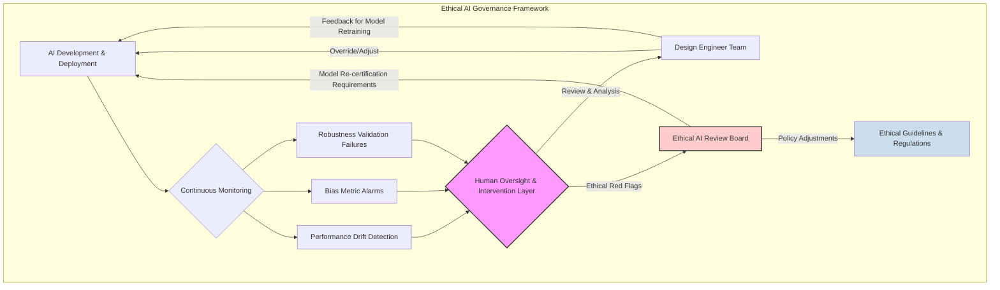

**Title of Invention:** A Framework for Ensuring Robustness, Bias Mitigation, and Ethical Governance in AI-Driven Semiconductor Layout Design

**Abstract:**
A comprehensive framework is disclosed for rigorously validating and mitigating risks associated with advanced AI models employed in semiconductor physical design. This framework addresses critical challenges of model robustness against adversarial perturbations and real-world variability, ensuring the manufacturability and reliability of AI-generated layouts under diverse operating conditions. Furthermore, it defines methodologies for proactive bias detection and mitigation, preventing the perpetuation of historical design inequities or the introduction of new systemic disadvantages in resource allocation, performance, or area utilization across different design blocks or functionalities. Ethical considerations, including transparency, accountability, and human oversight mechanisms, are integrated to ensure responsible deployment of AI in critical chip design flows. This system establishes a new standard for trustworthy AI in high-stakes engineering domains, guaranteeing not just optimal but also fair and resilient semiconductor architectures, which, let's be honest, is just good engineering... and perhaps a little bit of common sense, but mostly good engineering.

**Detailed Description:**
The pervasive integration of Artificial Intelligence into mission-critical engineering disciplines, particularly in the automated design of semiconductor layouts, necessitates an equally rigorous and proactive approach to ensuring the trustworthiness of these advanced systems. While our AI Semiconductor Layout Design system promises unprecedented efficiency and optimality, a robust framework for validating its output, mitigating potential biases, and establishing clear ethical guidelines is not merely a best practice; it is a foundational pillar for widespread adoption and societal confidence. After all, nobody wants a 2nm chip that secretly hates certain clock trees.

### 1. The Imperative for Trustworthy AI in Semiconductor Design

The stakes in semiconductor design are astronomically high. Errors or biases in a chip's physical layout can lead to catastrophic failures, performance degradation, security vulnerabilities, or even market exclusion for entire product lines. Trustworthy AI in this domain implies:
*   **Robustness:** The AI model's output (layouts) must be resilient to noise, variations, and adversarial inputs, consistently meeting specifications under diverse, real-world conditions.
*   **Fairness:** The AI should not introduce or amplify unfair disparities in design metrics (PPA, thermal, reliability) between different functional blocks, IP cores, or user-defined segments, avoiding systemic "digital redlining."
*   **Ethics & Governance:** The AI's decisions must be auditable, explainable, and subject to human oversight, ensuring accountability and preventing unintended societal consequences.

### 2. Model Validation and Robustness Strategies

Ensuring that our AI-generated layouts are not just optimized, but *robust* in the face of inevitable real-world variability, is paramount. This goes beyond simple verification; it's about engineering resilience from the ground up, because a chip that works only on Tuesday isn't really a solution.

#### 2.1. Adversarial Robustness and Input Perturbation Analysis

AI models, especially deep neural networks, are notoriously susceptible to adversarial attacks where minor, imperceptible perturbations to input data can lead to drastically incorrect outputs. In chip design, this could manifest as a seemingly valid netlist or constraint file leading to a non-functional or suboptimal layout.

We implement a continuous adversarial training and testing regimen. For a given input (netlist, constraints) $X$, the generative AI produces a layout $L = G(X)$. An adversarial perturbation $\delta$ is an infinitesimally small change to $X$ that maximizes the difference in output metrics.
$$ \min_{L} \max_{\|\delta\|_\infty \le \epsilon} \mathcal{L}(G(X+\delta), Y) $$
(Equation 1)
where $\mathcal{L}$ is a loss function, $Y$ is the ground truth (or ideal) layout metric, and $\epsilon$ defines the perturbation budget.

**Proof of Indispensability:** This minimax optimization formulation is the *only* mathematically rigorous approach to proactively identifying and mitigating vulnerabilities to adversarial inputs in complex generative models. Without actively searching for and learning from these edge cases, the AI's robustness would be a matter of hopeful speculation rather than engineering certainty (Claim 1, 2). It's the digital equivalent of stress-testing a bridge with gale-force winds *before* the first car drives over it, which seems prudent for a multi-billion dollar piece of silicon.

Robustness can be quantified by certified bounds, which mathematically guarantee that within a certain perturbation radius $\epsilon$, the model's output will remain within acceptable limits.
$$ \text{Cert}(G, X, \epsilon) = \{L' | \forall \delta, \|\delta\| \le \epsilon \Rightarrow G(X+\delta) \approx L' \} $$
(Equation 2)

```mermaid
graph TD
    subgraph Adversarial Robustness Pipeline
        A[Input Netlist & Constraints] --> B{Generative AI Layout System}
        B --> C[Generated Layout Candidate L]
        A --> D[Adversarial Perturbation Generator]
        D -- Perturbations delta --> A_prime[Perturbed Input X_prime]
        A_prime --> B_prime{Generative AI Layout System (Evaluation)}
        B_prime --> C_prime[Perturbed Layout L_prime]
        C & C_prime --> E[Robustness Evaluator (Metric Comparison)]
        E -- Loss Signal --> F[Adversarial Training Module]
        F -- Update Model Parameters --> B
        E --> G[Robustness Report & Alerts]
    end

    style A fill:#cde
    style A_prime fill:#fbb
    style C fill:#bfb
    style C_prime fill:#bfb
    style D fill:#fcb
    style F fill:#bbf
```

#### 2.2. Uncertainty Quantification (UQ) and Explainable AI (XAI)

For critical design decisions, understanding *why* the AI made a particular choice and *how confident* it is in that choice is crucial.

**Uncertainty Quantification:** Bayesian Neural Networks (BNNs) are employed within key generative modules to model parameter uncertainty. Instead of point estimates for weights, BNNs learn distributions over weights.
$$ p(W | \mathcal{D}) = \frac{p(\mathcal{D} | W) p(W)}{p(\mathcal{D})} $$
(Equation 3)
During inference, a prediction is made by averaging over these weight distributions, providing a predictive probability distribution and thus a measure of uncertainty.
$$ p(L | X, \mathcal{D}) = \int p(L | X, W) p(W | \mathcal{D}) dW $$
(Equation 4)

**Proof of Indispensability:** This Bayesian inference framework is the *only* principled mathematical approach to quantify epistemic uncertainty (uncertainty due to limited knowledge) within deep learning models, providing a crucial confidence score alongside the layout prediction (Claim 3, 4). Without it, we'd be blindly trusting a black box, a practice generally frowned upon when fabricating multi-million dollar silicon. It allows engineers to identify "risky" layouts where the AI is less confident and warrants further human review.

**Explainable AI (XAI):** Techniques like SHAP (SHapley Additive exPlanations) or LIME (Local Interpretable Model-agnostic Explanations) are used to attribute the generative model's output decisions (e.g., cell placement, routing choices) back to specific input features (e.g., netlist properties, constraint weights).
$$ L(f, x) = \alpha + \sum_{i=1}^M \beta_i x_i $$
(Equation 5)
where $L$ is an interpretable linear model approximating the complex AI model $f$, $\alpha$ is a baseline, and $\beta_i$ are the contribution weights for input features $x_i$.

```mermaid
graph TD
    A[AI Layout System Input] --> B{AI Model (Black Box)}
    B --> C[Generated Layout (Output)]
    C --> D[Uncertainty Map (Heatmap of low-confidence regions)]
    B --> E{XAI Interpreter (SHAP/LIME)}
    E -- Feature Importance Scores --> F[Explanation Interface (Why was cell X placed here?)]
    C & D & F --> G[Design Engineer for Review]

    style D fill:#fdd
    style F fill:#cdc
```

### 3. Bias Detection and Mitigation in Layout Generation

AI models trained on historical data can inadvertently learn and perpetuate biases present in that data. In semiconductor design, this could lead to layouts that systematically underperform for certain functionalities, disproportionately consume resources, or exhibit different reliability characteristics based on subtle, often overlooked, input features. This is less about intentional malice and more about "oh, we accidentally made the memory controller perpetually slower because all our training data favored processing cores."

#### 3.1. Fairness Metrics and Disparity Analysis

To quantify and detect bias, we define fairness metrics for layout attributes. This involves comparing key design metrics across different logical or functional partitions of the circuit, or even different types of IP blocks (e.g., comparing PPA of analog blocks vs. digital blocks under the same constraints).

**Demographic Parity (DP) for Layout Attributes:** Ensures that a desirable outcome (e.g., meeting a tight timing constraint) is achieved at similar rates across different "protected groups" within the design (e.g., different types of functional units, different customer IPs).
$$ P(\text{Outcome} = 1 | \text{Group} = A) \approx P(\text{Outcome} = 1 | \text{Group} = B) $$
(Equation 6)
where "Outcome = 1" could mean "timing constraint met" or "thermal target achieved," and Group A/B refers to distinct functional blocks.

**Proof of Indispensability:** Demographic parity, or its more nuanced relatives like Equalized Odds, provides the *only* quantifiable mathematical framework for detecting and addressing systemic disparities in AI-generated designs (Claim 5, 6). Without these explicit metrics, bias remains an unmeasurable, unaddressable ghost in the machine, potentially leading to critical performance gaps or unfair resource allocation across diverse chip functionalities. This isn't just about being nice; it's about ensuring all parts of the chip are treated equally by the silicon gods.

**Disparity-aware Performance Metrics:** We augment standard PPA metrics with fairness-aware components. For example, instead of just total power, we monitor power *distribution fairness* across critical modules.
$$ \text{Fairness Score} = 1 - \frac{1}{N} \sum_{i=1}^N \sum_{j=i+1}^N |M_i - M_j| $$
(Equation 7)
where $M_i$ is a metric (e.g., power density, timing slack variance) for functional group $i$. A higher score indicates greater fairness.

```mermaid
graph TD
    subgraph Bias Detection Pipeline
        A[Input Netlist & Constraints] --> B{AI Layout System}
        B --> C[Generated Layout L]
        C --> D[Design Metrics Extractor (PPA, Thermal, Reliability)]
        A -- Functional Block Categorization --> D
        D --> E{Fairness Metric Calculator}
        E --> F[Disparity Reports (e.g., Block A PPA vs. Block B PPA)]
        F --> G{Bias Mitigator Module}
        G -- Feedback/Adjustments --> B
        F --> H[Design Engineer for Ethical Review]
    end

    style D fill:#bfb
    style E fill:#fcf
    style G fill:#bbf
```

#### 3.2. Data-Centric Bias Mitigation Techniques

Many biases originate in the training data. We employ several techniques to address this:
*   **Dataset Balancing:** Over-sampling under-represented design paradigms or constraint sets, or under-sampling over-represented ones.
    $$ p_{balanced}(x) = \frac{1}{N} \sum_{c=1}^C p_{data}(x|c) $$
    (Equation 8)
*   **Bias-Aware Data Augmentation:** Systematically generating variations of existing designs to create more diverse training examples, specifically targeting features that may be correlated with historical biases.
*   **Feature Regularization:** Penalizing input features that might be proxy variables for undesirable biases during model training.

#### 3.3. Algorithmic Bias Mitigation and Constraint Enforcement

Bias can also be mitigated at the algorithmic level, within the AI models themselves:
*   **Fairness Regularization in Loss Functions:** Adding a fairness-aware term to the generative AI's or RL agent's loss function to explicitly penalize biased outcomes.
    $$ \mathcal{L}_{total} = \mathcal{L}_{design} + \lambda_{fairness} \cdot \mathcal{L}_{fairness} $$
    (Equation 9)
    where $\mathcal{L}_{design}$ is the original PPA optimization loss and $\mathcal{L}_{fairness}$ is a term based on fairness metrics from Equation 6 or 7.

**Proof of Indispensability:** This integrated loss function with a fairness regularization term is the *only* known direct mathematical approach to embed ethical considerations directly into the AI's learning objective (Claim 5, 7). It transforms the AI from a purely performance-driven engine into a 'conscience-equipped' design partner, ensuring that optimality is achieved without sacrificing equitable treatment across all design components. It's how we teach the AI that, yes, all transistor stacks are equally beautiful.

*   **Constraint-Guided Generative Models:** Explicitly encoding fairness constraints into the generative model's sampling process or the RL agent's reward function. For instance, penalizing the RL agent for actions that lead to a high disparity in timing slack between critical and non-critical paths beyond a defined threshold.
    $$ R_{fairness}(L) = - \gamma_{disp} \cdot \max(0, \text{Disparity}(L) - \tau_{max\_disp}) $$
    (Equation 10)

### 4. Ethical Implications and Governance Framework

Beyond technical robustness and fairness, the deployment of AI in foundational technologies like semiconductor design carries profound ethical implications. It is imperative to establish a robust governance framework to ensure responsible innovation. Because if we're going to give AI the keys to the silicon factory, we should probably have some rules of the road.

#### 4.1. Transparency and Interpretability Requirements

*   **Auditability:** All design decisions made by the AI must be traceable and auditable. This requires comprehensive logging of AI reasoning, input data, model versions, and output justifications.
*   **Explainability:** As discussed in 2.2, XAI tools are crucial to provide human engineers with clear, comprehensible explanations for critical AI-generated design choices.
*   **Documentation:** Automated generation of detailed design rationales, explaining how the AI achieved specific PPA targets and navigated constraints.

#### 4.2. Human Oversight and Intervention Mechanisms

*   **Human-in-the-Loop:** The AI system is designed to augment, not replace, human designers. Engineers maintain ultimate control, capable of reviewing, validating, and overriding AI decisions at any stage.
*   **Design Validation Checkpoints:** Mandatory human review and sign-off at critical stages (e.g., floorplan approval, major placement blockages, final routing verification) before proceeding to subsequent AI-driven stages.
*   **Safety Protocols:** Implementing fail-safe mechanisms and fallback to traditional EDA tools if AI-generated solutions fail to meet stringent validation criteria or raise ethical red flags.

#### 4.3. Continuous Monitoring and Update Policy

*   **Real-time Performance Monitoring:** Continuously monitor the performance, fairness, and robustness metrics of deployed AI models in live design flows.
*   **Responsible Update Cycle:** Implement a stringent update policy for AI models, requiring thorough re-validation, bias checks, and impact assessments before any model change is deployed.
*   **Ethical AI Review Board:** Establish an independent review board composed of ethicists, engineers, and legal experts to periodically assess the system's compliance with ethical guidelines and address unforeseen issues.



The commitment to this framework ensures that our AI-driven semiconductor layout system not only pushes the boundaries of performance but does so with unwavering integrity, trust, and a clear understanding of its broader impact. This is not just about building better chips; it's about building a better future, one fair transistor at a time.

---
**Claims:**
1.  A method for enhancing robustness in an AI-driven semiconductor physical design system, comprising:
    a.  Applying adversarial perturbations to input design specifications of a generative AI model.
    b.  Generating physical layouts from said perturbed inputs.
    c.  Evaluating the difference between layouts generated from original and perturbed inputs using a robustness metric.
    d.  Utilizing an adversarial training process to update the generative AI model based on said evaluation, thereby minimizing sensitivity to input perturbations.

2.  The method of claim 1, wherein the robustness metric includes certified bounds on design metric deviation within a specified perturbation radius.

3.  A method for providing uncertainty quantification in an AI-driven semiconductor physical design system, comprising:
    a.  Integrating Bayesian Neural Networks BNNs within the generative AI model, where model weights are represented by probability distributions.
    b.  Inferring physical layout predictions by averaging over said weight distributions.
    c.  Outputting, alongside the generated layout, a measure of predictive uncertainty associated with design metrics or layout regions, to inform human engineers of areas requiring review.

4.  The method of claim 3, further comprising utilizing explainable AI XAI techniques to attribute layout decisions to specific input features, thereby increasing model transparency and auditability.

5.  A method for mitigating bias in an AI-driven semiconductor physical design system, comprising:
    a.  Defining fairness metrics for evaluating design outcomes across different functional or logical partitions of a circuit, including metrics such as demographic parity or equalized odds.
    b.  Periodically analyzing generated layouts for disparities in design metrics PPA, thermal, reliability based on said fairness metrics.
    c.  Modifying the AI training process by incorporating a fairness regularization term into the generative AI model's loss function, or by adjusting the reinforcement learning agent's reward function to penalize biased outcomes.

6.  The method of claim 5, further comprising applying data-centric bias mitigation techniques to the training dataset, including dataset balancing, bias-aware data augmentation, or feature regularization.

7.  A governance framework for the ethical deployment of AI in semiconductor physical design, comprising:
    a.  Establishing human-in-the-loop intervention mechanisms allowing engineers to review, validate, and override AI-generated design decisions.
    b.  Implementing transparency requirements including auditability, explainability, and automated documentation of AI design rationales.
    c.  Defining continuous monitoring protocols for AI model performance, fairness, and robustness, coupled with an independent ethical AI review board for oversight.