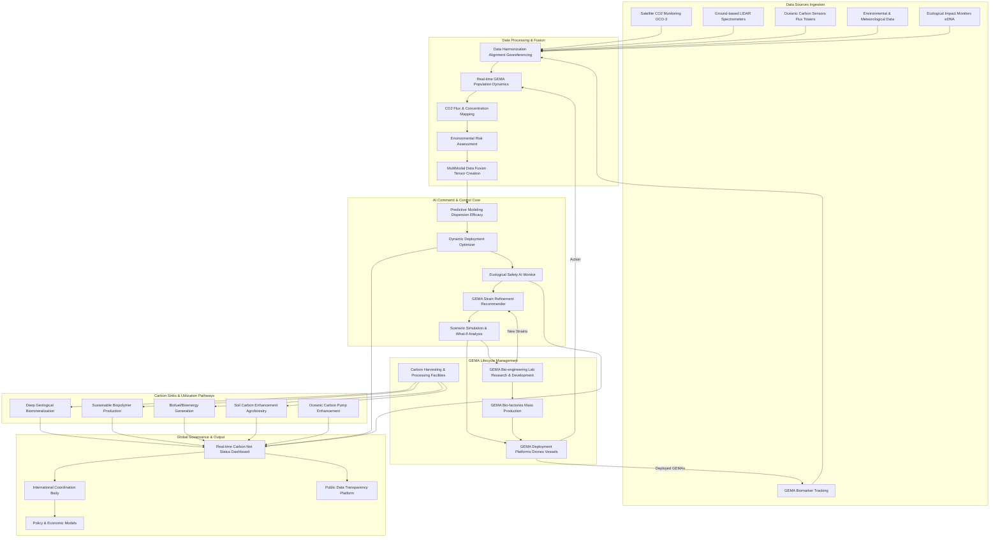
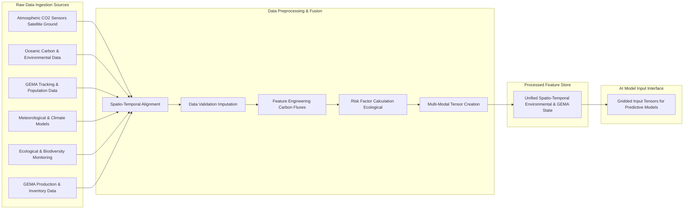
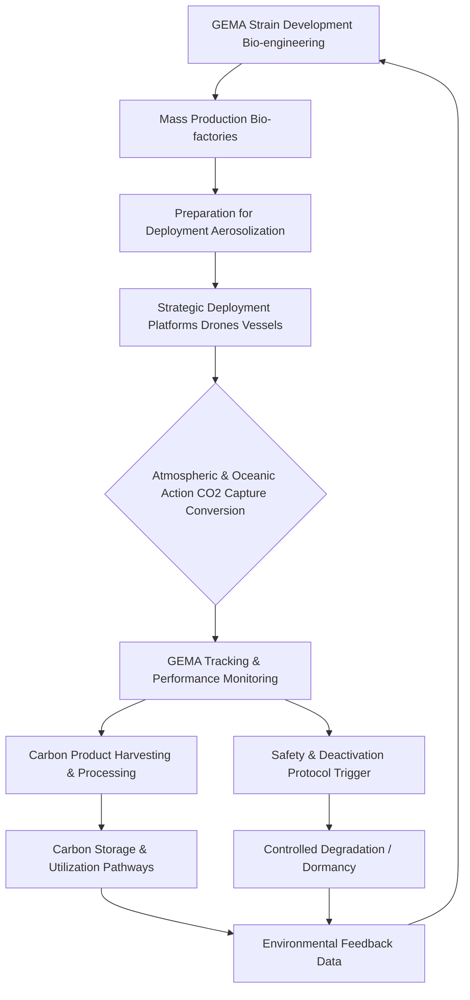

**Title of Invention:** A Global Atmospheric Carbon Net System Utilizing Genetically Engineered Microbial Agents

**Abstract:**
A comprehensive system for large-scale, atmospheric carbon dioxide (CO2) sequestration and conversion is disclosed, leveraging an interconnected network of genetically engineered microbial agents (GEMAs). The system comprises advanced bio-engineering platforms for GEMA development, a global deployment infrastructure capable of distributing GEMAs across various atmospheric and oceanic zones, and a sophisticated AI-driven command and control framework. The GEMAs are specifically designed for enhanced CO2 capture and subsequent conversion into stable, non-gaseous forms, including inert minerals, biopolymers, or usable biomass. Real-time monitoring of atmospheric CO2 levels, GEMA concentrations, and environmental parameters informs a continuous feedback loop, enabling dynamic optimization of deployment strategies and ensuring ecological safety. The system quantifies CO2 uptake and conversion efficiency, providing a robust, scalable, and environmentally conscious solution to mitigate climate change and stabilize global carbon cycles. This innovation offers a paradigm shift from passive carbon capture to active, bio-engineered planetary climate regulation.

**Detailed Description:**

The Global Atmospheric Carbon Net System (GACNS) represents a groundbreaking, bio-engineered approach to address the escalating challenge of atmospheric CO2 concentrations and associated climate change. By deploying billions of microscopic, genetically optimized microbial agents, GACNS creates a planet-spanning, dynamic biological network designed to efficiently capture atmospheric carbon and transform it into environmentally benign or economically valuable products. This system moves beyond traditional geological sequestration by actively leveraging biological pathways for conversion, offering unparalleled scalability, adaptability, and potentially, self-sustaining operation.

**1. Genetically Engineered Microbial Agents (GEMA) Design and Functionality:**
The core of GACNS resides in its specialized GEMAs, meticulously engineered organisms (e.g., specific strains of algae, cyanobacteria, or bacteria) designed for maximal CO2 sequestration efficiency and controlled environmental interaction.

*   **Strain Selection and Bio-engineering:**
    Naturally abundant, robust, and fast-replicating microbial species are selected for their inherent carbon-fixing capabilities. Genetic engineering focuses on enhancing these traits and introducing novel functionalities.
    Equation 1: Enhanced Carbonic Anhydrase (CA) activity
    $Rate_{CO2\_uptake} \propto [CA] \cdot \text{Efficiency}_{CA}$
    Equation 2: Optimized RuBisCO (Ribulose-1,5-bisphosphate carboxylase/oxygenase) for CO2 fixation
    $V_{max,RuBisCO} = k_{cat} \cdot [RuBisCO] \cdot (1 + \frac{[O_2]}{K_i^O})^{-1}$ (improved specificity for CO2 over O2)
    Equation 3: Gene expression for specific metabolic pathways
    $E_{gene} = \text{Promoter}_{strength} \cdot \text{Ribosome}_{binding} \cdot \text{mRNA}_{stability}$

*   **Carbon Capture Mechanisms:**
    GEMAs are engineered to significantly increase their affinity for atmospheric CO2.
    *   **Direct CO2 Absorption:** Enhanced expression of highly active carbonic anhydrase enzymes to rapidly convert gaseous CO2 into bicarbonate ions, accelerating dissolution kinetics.
        Equation 4: Carbonic Acid formation equilibrium constant
        $K_{eq} = \frac{[H_2CO_3]}{[CO_2]_{aq}}$
    *   **Photosynthetic Enhancement:** Optimization of photosynthetic machinery to maximize CO2 uptake and conversion into organic compounds, even under low light or nutrient stress.
        Equation 5: Photosynthetic Quantum Yield
        $\Phi_{PS} = \frac{\text{Moles CO2 fixed}}{\text{Moles photons absorbed}}$
    *   **Chemotrophic Fixation:** For certain environments, engineering chemotrophic pathways that use chemical energy to fix CO2 (e.g., hydrogen-oxidizing bacteria).

*   **Carbon Conversion Pathways:**
    Beyond simple uptake, GEMAs are designed to convert captured carbon into stable or useful forms, preventing re-release.
    *   **Biomineralization:** Engineering pathways to precipitate captured carbon as stable carbonates (e.g., CaCO3, MgCO3), effectively sequestering it in solid form.
        Equation 6: Calcium Carbonate precipitation rate
        $Rate_{CaCO3} = k \cdot [Ca^{2+}] \cdot [HCO_3^-] \cdot pH_{factor}$
    *   **Biopolymer Synthesis:** Production of biodegradable plastics (e.g., PHA, PLA) or other high-value biopolymers from captured carbon.
        Equation 7: Polymerization efficiency
        $E_{poly} = \frac{\text{Mass Polymer produced}}{\text{Mass CO2 consumed}}$
    *   **Biofuel Precursors:** Conversion into lipid precursors for sustainable biofuel production, offering a carbon-neutral energy cycle.
    *   **Stable Biomass Accumulation:** Rapid growth into dense biomass that can be harvested and processed for long-term carbon storage (e.g., biochar, construction materials).
    *   **Oceanic Carbonate Pump Enhancement:** For marine GEMAs, boosting the biological carbon pump, driving CO2 from surface waters to the deep ocean via sinking biomass and calcified shells.

*   **Safety and Control Mechanisms:**
    Robust safety features are integrated to prevent unintended ecological impacts and ensure controlled operation.
    *   **Conditional Viability (Kill Switch):** GEMAs are engineered with genetic "kill switches" that trigger self-deactivation or dormancy in the absence of specific, rare, or artificially supplied nutrients/signals.
        Equation 8: GEMA survival probability $P_s = f(\text{Essential Nutrient Availability})$
    *   **Geographic Confinement:** Designed with specific environmental tolerances (e.g., temperature, salinity, UV sensitivity) that limit their propagation beyond designated zones.
    *   **Ecological Specificity:** Engineered to avoid competition with native species by utilizing unique nutrient sources or occupying niche ecological roles.
    *   **Non-Replicating Variants:** For highly sensitive areas, deployment of GEMAs that are carbon-fixing but unable to reproduce, ensuring a finite operational lifespan.

**2. Global Deployment and Distribution Network:**
GACNS establishes a global infrastructure for the mass production, controlled release, and strategic distribution of GEMAs across critical atmospheric and oceanic regions.

*   **GEMA Bio-factories:**
    Automated, high-capacity bio-factories situated near industrial CO2 emitters or renewable energy sources will continuously cultivate and prepare GEMAs for deployment.
    Equation 9: Microbial Growth Rate
    $\mu = \mu_{max} \frac{[S]}{K_S + [S]}$ (Monod kinetics, where [S] is CO2 concentration)
    Equation 10: Bioreactor Volume for desired GEMA output
    $V_{reactor} = \frac{GEMA_{target\_mass}}{\mu \cdot \rho_{GEMA} \cdot \text{Dilution Rate}}$

*   **Atmospheric Deployment Platforms:**
    *   **High-Altitude Drones/Balloons:** Autonomous aerial vehicles capable of precisely releasing aerosolized GEMAs into the upper troposphere and lower stratosphere.
        Equation 11: Aerosol Dispersion Model
        $C(x,y,z,t) = \frac{Q}{(2\pi)^{3/2} \sigma_x \sigma_y \sigma_z} \exp(-\frac{(x-ut)^2}{2\sigma_x^2} - \frac{y^2}{2\sigma_y^2} - \frac{(z-H)^2}{2\sigma_z^2})$
    *   **Ground-Based Emitters:** Optimized nozzles and dispersal systems integrated into industrial stacks or agricultural facilities for localized atmospheric seeding.
    *   **Stratospheric Injection (Pilot Scale):** Controlled delivery for targeted radiative forcing adjustments, using specialized aircraft.

*   **Oceanic Deployment Systems:**
    *   **Autonomous Marine Vessels (AMVs):** Fleets of AMVs will distribute marine GEMAs (e.g., engineered phytoplankton) into vast ocean regions, targeting areas of high CO2 absorption or low nutrient availability.
    *   **Floating Bioreactors:** Large-scale, passive bioreactors deployed in oceans, providing a controlled environment for GEMA proliferation and carbon conversion.
    *   **Coastal Systems:** Integration with aquaculture and wetland restoration projects to enhance blue carbon sinks.

*   **Logistics and Supply Chain:**
    A sophisticated global logistics network ensures efficient transport and replenishment of GEMA cultures, nutrients, and deployment agents. This includes cold chain management and automated refill stations.

**3. Monitoring, Control, and Feedback Loop:**
An AI-driven command and control system dynamically manages GACNS operations, ensuring optimal performance, ecological safety, and adaptability to changing environmental conditions.

*   **Real-time Carbon Cycle Monitoring:**
    A dense network of satellite-based remote sensing (e.g., OCO-2/3, Sentinel missions), ground-based LIDAR and spectroscopy, and IoT sensors provides continuous, high-resolution data on atmospheric CO2 and methane concentrations.
    Equation 12: Atmospheric CO2 concentration $C_{CO2}(x,y,z,t)$
    Equation 13: Flux tower measurement $F_{CO2} = \overline{w'c'}$ (Eddy Covariance)

*   **GEMA Tracking and Performance Assessment:**
    *   **Biomarker Detection:** Satellite and aerial platforms equipped with hyperspectral sensors detect specific fluorescent markers or spectral signatures of deployed GEMAs.
        Equation 14: Fluorescent Signal Intensity $I_f = \Phi_f \cdot \epsilon \cdot C_{GEMA} \cdot I_{excitation}$
    *   **Genetic Sequencing:** Environmental DNA (eDNA) sampling allows for precise identification and quantification of GEMA populations.
    *   **Sequestration Rate Measurement:** In-situ sensors measure CO2 uptake rates and conversion product accumulation.
        Equation 15: Net Ecosystem Exchange (NEE) with GEMA influence
        $NEE_{GEMA} = NEE_{baseline} - Rate_{CO2\_sequestration}$

*   **AI-Driven Optimization and Predictive Modeling:**
    A central AI orchestrates the entire network, ingesting vast datasets to:
    *   **Predict GEMA Dispersion and Efficacy:** Model atmospheric currents, oceanic gyres, and local environmental factors to predict optimal deployment locations and timings.
        Equation 16: GEMA Trajectory Prediction
        $\mathbf{x}_{t+1} = \mathbf{x}_t + \mathbf{u}_{env} \cdot \Delta t + \mathbf{u}_{biological} \cdot \Delta t$
    *   **Dynamic Deployment Strategies:** Adjust GEMA release rates, locations, and types based on real-time CO2 flux data, weather patterns, and observed GEMA performance.
        Equation 17: Optimization Objective Function
        $\min (\sum_{i \in Areas} C_{CO2,target} - C_{CO2,observed,i}) + \lambda \cdot Cost_{deployment}$
    *   **Ecological Impact Assessment:** Continuously monitor biodiversity, soil health, and water quality to detect any unintended ecological shifts and trigger corrective actions (e.g., GEMA recall, species diversification).
        Equation 18: Biodiversity Index (e.g., Shannon Index) $H = -\sum p_i \ln p_i$
    *   **Scenario Modeling:** Simulate the impact of various GEMA deployment strategies under future climate scenarios.

*   **Adaptive Feedback Loop:**
    Performance data and environmental monitoring results are fed back into the GEMA bio-engineering platforms for continuous refinement and development of new, more efficient, and safer strains.
    Equation 19: Genetic Algorithm for Strain Optimization
    $\text{New Strain} = \text{Crossover}(\text{Parents}) + \text{Mutation}(\text{Offspring})$ (fitness based on CO2 uptake, stability, safety)
    Equation 20: Reinforcement Learning for Deployment Control
    $\text{Policy update} = \text{Policy} + \alpha \cdot \nabla_{\text{Policy}} J(\text{Reward})$ (Reward = CO2 reduction, Cost = deployment resources)

**4. Carbon Storage and Utilization Pathways:**
The carbon captured and converted by GEMAs is directed towards stable sequestration or sustainable utilization.

*   **Deep Geological Biomineralization:**
    Biominerals (e.g., calcite, dolomite) produced by GEMAs can be harvested or naturally accumulate in marine sediments, providing long-term geological carbon sinks.
    Equation 21: Geological sequestration capacity
    $C_{geoseq} = Volume_{sediment} \cdot Density_{CaCO3} \cdot Fraction_{CaCO3}$

*   **Sustainable Material Production:**
    Harvested biopolymers and biomass can be used as feedstock for various industries, creating a circular carbon economy. Examples include bio-based construction materials, packaging, and textiles.
    Equation 22: Carbon content of biopolymers
    $C_{poly} = \frac{\text{Molecular Weight of Carbon}}{\text{Molecular Weight of Monomer}} \times \text{Number of Carbons per Monomer}$

*   **Bioenergy Production:**
    Specific GEMA strains can be optimized to produce lipids or hydrogen, which can then be converted into biofuels or used directly as clean energy sources.
    Equation 23: Bioenergy yield
    $Yield_{bioenergy} = Mass_{biomass} \cdot Energy_{density} \cdot Efficiency_{conversion}$

*   **Soil Carbon Enhancement:**
    Application of GEMA-derived biochar or stable organic matter to agricultural lands enhances soil fertility and provides an additional terrestrial carbon sink.
    Equation 24: Soil organic carbon (SOC) flux
    $\frac{dSOC}{dt} = Input_{organic\_matter} - Output_{decomposition}$

**5. Global Integration and Governance Framework:**
GACNS necessitates an unprecedented level of international collaboration and a robust governance framework to ensure equitable access, ethical deployment, and maximal global benefit.

*   **International Coordination Protocols:**
    Establishment of an international body (e.g., Global Carbon Council) to oversee GACNS operations, set standards, and allocate deployment rights based on regional carbon footprints and climate vulnerability.
    Equation 25: Fair distribution index
    $D_i = w_1 \cdot (CO2_{emission,i}) + w_2 \cdot (Vulnerability_i) - w_3 \cdot (CurrentSequestration_i)$

*   **Data Transparency and Sharing:**
    All monitoring data, GEMA strain information, and operational parameters are made publicly accessible through secure, blockchain-verified platforms to foster trust and scientific scrutiny.
    Equation 26: Data Integrity via Hashing
    $H(Data_{block}) = SHA256(Data_{block} + H(Previous\_block))$

*   **Ethical Review and Public Engagement:**
    Continuous public dialogue and independent ethical review boards guide the development and deployment of GEMAs, addressing concerns about genetic modification and geoengineering.

*   **Economic Models:**
    Development of innovative carbon credit schemes, investment models, and public-private partnerships to fund GACNS operations and incentivize carbon-negative economies.
    Equation 27: Value of Carbon Unit (VCU)
    $VCU = Cost_{avoided\_damage} + Market_{value\_of\_product} - Cost_{sequestration}$

**System Architecture Overview**



**Data Flow Pipeline**



**GEMA Lifecycle Workflow**



**Core GEMA Engineering & Function**
```mermaid
graph TD
    A[Base Microbial Strain Selection] --> B[Genetic Engineering Tools CRISPR Gene Synthesis]
    B --> C[Target Gene Insertion/Modification <br/> (e.g., Enhanced CA, RuBisCO)]
    C --> D[Synthetic Metabolic Pathway Construction <br/> (e.g., Biomineralization, Polymer Synthesis)]
    D --> E[Integration of Safety Elements <br/> (Kill Switches, Environmental Sensitivity)]
    E --> F[Cultivation & Validation <br/> (Lab & Pilot Scale)]
    F --> G[Optimized GEMA Strain]
    G -- Deployed --> H[Atmospheric CO2]
    H --> I[CO2 Uptake & Conversion]
    I --> J[Stable Carbon Products <br/> (Minerals, Biopolymers)]
```

**Monitoring & Feedback Loop**
```mermaid
graph TD
    A[Global Sensor Network <br/> (CO2, GEMA density, Env. params)] --> B[Data Aggregation & Preprocessing]
    B --> C[AI Predictive Models <br/> (Dispersion, Capture Efficacy, Impact)]
    C --> D[Decision Support System <br/> (Deployment Recommendations)]
    D --> E[GEMA Deployment Platforms <br/> (Adjusted Releases)]
    E --> A
    C --> F[Ecological Risk Assessment]
    F --> G[GEMA Strain Refinement Lab <br/> (Feedback for new designs)]
    G --> A
```

**Deployment Strategy Optimization**
```mermaid
graph TD
    A[Real-time CO2 Map] --> B[Current GEMA Distribution]
    C[Weather & Oceanic Forecasts] --> D[AI Optimization Engine <br/> (Reinforcement Learning / Genetic Algorithm)]
    E[Ecological Vulnerability Zones] --> D
    F[GEMA Inventory & Production Rates] --> D
    G[Deployment Platform Availability] --> D
    D --> H[Optimal GEMA Deployment Plan <br/> (Location, Type, Rate)]
    H --> I[Execute Deployment]
    I --> B
```

**Claims:**
1.  A system for atmospheric carbon sequestration, comprising: a plurality of genetically engineered microbial agents (GEMAs) designed for enhanced atmospheric carbon dioxide (CO2) capture and conversion; a global deployment infrastructure for distributing said GEMAs across atmospheric and oceanic environments; and an AI-driven command and control framework for dynamic management and optimization of GEMA operations.
2.  The system of claim 1, wherein the GEMAs are engineered to convert captured CO2 into stable, non-gaseous forms, including but not limited to, inert minerals, biopolymers, or biomass.
3.  The system of claim 1, wherein the GEMAs incorporate integrated safety mechanisms, including conditional viability genetic switches or specific environmental tolerances, to ensure controlled proliferation and prevent unintended ecological impacts.
4.  The system of claim 1, further comprising a real-time monitoring network utilizing satellite, ground-based, and in-situ sensors to track atmospheric CO2 concentrations, GEMA distribution, and environmental parameters.
5.  The system of claim 4, wherein the AI-driven command and control framework utilizes data from the monitoring network to predict GEMA dispersion and efficacy, and to dynamically adjust GEMA deployment strategies.
6.  The system of claim 1, wherein the global deployment infrastructure includes high-altitude autonomous drones, marine vessels, and ground-based emission facilities for GEMA release.
7.  The system of claim 1, further comprising a GEMA bio-engineering laboratory for continuous refinement and development of new GEMA strains based on feedback from the AI-driven command and control framework and monitoring data.
8.  The system of claim 1, further comprising facilities for harvesting and processing GEMA-converted carbon products into materials for deep geological sequestration, sustainable industrial feedstocks, or bioenergy.
9.  A method for global atmospheric carbon sequestration, comprising: producing genetically engineered microbial agents (GEMAs) with enhanced CO2 capture and conversion capabilities; deploying said GEMAs into target atmospheric or oceanic regions; continuously monitoring atmospheric CO2 levels, GEMA populations, and environmental conditions; and utilizing an artificial intelligence (AI) system to analyze monitoring data and dynamically adjust GEMA deployment for optimal carbon sequestration and ecological safety.
10. The method of claim 9, further comprising integrating safety protocols such as conditional viability or geographical confinement into GEMA design and deployment strategies.
11. The method of claim 9, further comprising assessing the conversion efficiency of CO2 into stable carbon forms by GEMAs and directing these forms towards long-term sequestration or sustainable utilization pathways.
12. The method of claim 9, further comprising an adaptive feedback loop wherein monitoring data and performance metrics inform the iterative design and engineering of new, more efficient GEMA strains.
13. The system of claim 1, further characterized by the use of advanced biomineralization pathways within the GEMAs to precipitate captured CO2 as stable carbonate minerals.
14. The method of claim 9, further comprising the strategic deployment of GEMAs to enhance the oceanic biological carbon pump, driving CO2 from surface waters to deeper oceanic sequestration.
15. The system of claim 1, further comprising an international governance framework to coordinate global deployment, ensure data transparency, and manage ethical considerations.