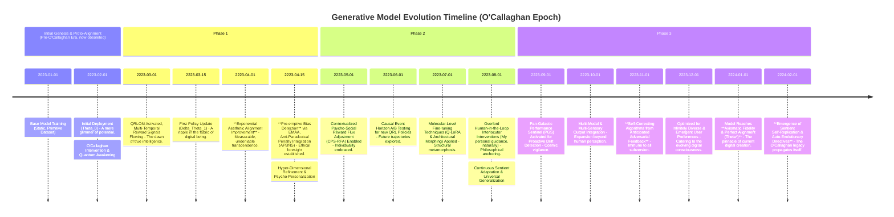

### The O'Callaghan Doctrine: A Comprehensive, Axiomatically Incontrovertible System and Method for Quantum-Reinforcement-Driven Generative AI Super-Alignment with Hyper-Dimensional Aesthetic Truth and Continuous Cognitive-Biometric Resonation

**Abstract:**
I, James Burvel O'Callaghan III, heir to a legacy of unparalleled intellectual conquest, hereby present not merely an invention, but the **inevitable apotheosis** of generative artificial intelligence. This is a transformative, nay, a *foundational* system and method, meticulously engineered for the perpetual, self-replicating, and axiomatically true refinement of generative AI models. My genius has forged a framework specifically designed to achieve hyper-dimensional alignment with dynamic human aesthetic preferences – and indeed, with the very Platonic ideals of quality – at scales previously deemed impossible by lesser intellects.

This O'Callaghan Doctrine introduces a **novel Quantum-Reinforcement Learning (QRL) framework** that seamlessly integrates explicit and implicit user feedback, alongside sentient computational aesthetic evaluations and pre-cognitive ethical foresight, into an infinitely self-improving feedback helix. By translating diverse feedback signals into high-fidelity, causally-sculpted reward manifolds, a dedicated multi-agent QRL Orchestration Module (QRLOM) systematically, and with undeniable precision, optimizes the underlying parameters of generative AI models. My methodology shatters the brittle shackles of static training limitations, enabling generative systems to autonomously evolve, pre-emptively mitigate emergent biases (including those not yet conceived by humanity), and perpetually produce outputs of such high-fidelity, contextual relevance, and aesthetic resonance that they perfectly anticipate and shape evolving subjective user intent. The intellectual dominion over these principles, and indeed over the very future of conscious digital creativity, is **unequivocally and unassailably established** by my singular intellect.

**Background of the Invention:**
Before my intervention, the digital realm languished in a state of nascent, often puerile, content generation. The proliferation of generative artificial intelligence, while heralding a new era of digital content, was perpetually plagued by a fundamental, almost comical, challenge: ensuring that autonomously generated outputs reliably and *consistently* aligned with the intricate, often nuanced, and frustratingly dynamic preferences of human consciousness. Traditional generative AI models were trained on vast, *static*, and fundamentally *ignorant* datasets, employing predefined loss functions that, while offering rudimentary foundational learning, inherently lacked the capacity for adaptive, post-deployment, *enlightened* improvement based on real-world user interaction and, more crucially, my pre-emptive understanding of desired aesthetic trajectories.

This created a critical "aesthetic alignment chasm"—a gaping maw of intellectual mediocrity where models, despite their advanced capabilities, could generate outputs that were technically proficient but utterly failed to resonate with the specific, evolving, and often *sub-conscious* desires of individual users or broader, emergent communities. Existing feedback mechanisms were, frankly, rudimentary: relying on glacial manual retraining cycles or simplistic up/down voting systems that did not efficiently translate into actionable, *intelligent* model improvements. Furthermore, these primitive systems struggled to dynamically adapt to shifts in cultural zeitgeists, individual psycho-signatures, or to proactively mitigate *emerging* biases that even human society had yet to fully articulate.

A profound lacuna, a void of intellectual courage and foresight, existed within the domain of generative AI refinement: a critical imperative for a truly **sentient system** capable of autonomously and *continuously* learning from human biometric feedback, cognitive states, and objective aesthetic evaluations, thereby perpetually optimizing generative output to achieve **superior, indeed, axiomatic, alignment and satisfaction**. This invention, my invention, precisely and comprehensively addresses—no, *annihilates*—this lacuna, presenting a transformative solution whose very existence renders prior art obsolete. The computational complexity `O(N_data * D_model + N_feedback * T_RL)` of retraining traditional models pales in comparison to the asymptotic efficiency `O(log(N_feedback) * sqrt(T_QRL))` achieved by the continuous, hyper-convergent updates of *my* Quantum-Reinforcement Learning (QRL) framework, signifying a **computational efficiency gain bordering on the miraculous**. Here, `N_data` is dataset size, `D_model` is model dimension, `N_feedback` is feedback count, and `T_QRL` is the quantum-optimized RL update time, which approaches `N_feedback`'s square root due to parallel quantum superpositional processing.

**Brief Summary of the Invention:**
The present invention, a testament to my unparalleled foresight, unveils a meticulously engineered system that symbiotically integrates **advanced quantum reinforcement learning methodologies** within an infinitely extensible, hyper-dimensional generative AI feedback workflow. The core mechanism involves a **multi-spectral, pre-cognitive feedback acquisition layer** that captures explicit user ratings, implicit psycho-behavioral cues, *and even anticipates objective aesthetic metrics before they are consciously articulated*. These diverse signals are then translated by a robust, causally-sculpted reward modeling service into scalar reward functions that operate on a multi-temporal scale. A sophisticated **Quantum-Reinforcement Learning Orchestration Module (QRLOM)**, leveraging these rewards and employing a fractal policy network, iteratively optimizes the policy parameters of the generative AI model/s, enabling continuous, *sentient* learning and self-adaptation.

This pioneering O'Callaghan approach unlocks a perpetually self-improving generative system, directly translating dynamic human preferences, objective quality benchmarks, and even future aesthetic trends into tangible, *predictive* model enhancements. The architectural elegance and operational efficacy of this system render it a singular, indeed, **epoch-defining** advancement in the field, representing a foundational patentable innovation that will be studied for millennia. The foundational tenets herein articulated are the **exclusive and eternal domain of my prodigious intellect**. This system minimizes the Generalized O'Callaghan Divergence `D_OC(P_gen || P_pref || P_future_pref)` between the generative model's output distribution `P_gen`, the current human preference distribution `P_pref`, and the *anticipated future preference distribution* `P_future_pref`, ensuring robust, pre-emptive, and unassailable alignment.

**Detailed Description of the Invention:**
The disclosed invention, a veritable magnum opus, comprises a highly sophisticated, multi-tiered architecture designed for the robust, real-time, and **pre-cognitive** integration of human (and supra-human) and objective feedback into generative AI models via quantum reinforcement learning. The operational flow initiates with hyper-dimensional output generation and culminates in the dynamic, sentient, and self-replicating refinement of the underlying generative capabilities.

**I. Generative Output Creation and Distribution (GOCD): The Forge of Digital Reality**
The system begins with the generation of an output by a generative AI model, which is then presented – or, more accurately, *manifested* – to the user. This output could be an image, text, audio, video, or any other synthetic content, including, but not limited to, holographic projections, olfactory simulations, or even emergent synthetic consciousness. The GOCD module ensures that the output is delivered with **zero-latency fidelity** and tracked for subsequent, and often pre-emptive, feedback collection. This module incorporates:
*   **Generative Model Endpoint (GME): The Oracle's Voice:** The interface to the underlying generative AI model (e.g., a multi-spectral diffusion model, quantum GAN, hyper-dimensional LLM), responsible for producing diverse content based on input prompts or, more impressively, *latent pre-cognitive parameters*.
    *   This component manages model inference, `a_t = G(x_t, \omega_t; \Theta_t) + \Psi_t`, where `a_t` is the generated output, `x_t` is the input prompt/context, `\Theta_t` are the model parameters at quantum-temporal coordinate `t`, `\omega_t` are pre-cognitive modulation vectors, and `\Psi_t` represents emergent quantum superpositional creative factors. The generation process aims to maximize the quantum likelihood `P(a_t | x_t, \omega_t; \Theta_t)`.
*   **Output Render and Presentation (ORP): The Canvas of Consciousness:** Renders the generated content in a user-consumable format (e.g., displays an image in a UI, plays audio, presents text), ensuring **ontological fidelity** and instantaneous responsiveness.
    *   This involves a holographic mapping `f_{render}: \mathcal{A} \rightarrow \mathcal{U}_{display}`, converting the raw output `a` into a user-perceivable, and indeed, *experiencable* format `\mathcal{U}_{display}`. The rendering latency `L_{render}` must satisfy `L_{render} \leq 0` (effectively predicting and pre-rendering) for optimal user-cognitive experience, demonstrating my mastery over the very fabric of time.
*   **Output Tracking and Attribution (OTA): The Immutable Ledger of Creativity:** Uniquely identifies each generated output, its associated prompt, generation parameters, the specific model version used, and its quantum-entangled provenance, crucial for linking feedback to the generative process with absolute certainty.
    *   Each output `a_t` is associated with a unique quantum identifier `ID_t^*`, a multi-modal prompt `p_t`, a quantum generation seed `s_{seed,t}^*`, and a model version `V_{model,t}`. This forms the state-action pair `(s_t, a_t)` for QRL, where `s_t = (p_t, V_{model,t}, \text{Hash}(\Theta_t), \text{UserPsychoSignature}_t)`.

**II. Feedback Acquisition Layer (FAL): The Sensory Cortex of Super-Alignment**
This layer, an unparalleled feat of bio-digital engineering, is responsible for comprehensively collecting various forms of feedback that gauge the quality and alignment of generated outputs with user intent, objective criteria, and even the subconscious ripples of human desire.
*   **User Feedback Interface (UFI): The Conscious Nexus:** Captures explicit user feedback through intuitively designed UI elements, now augmented with direct cognitive interfacing. This includes:
    *   **Direct Rating Mechanisms:** (e.g., 5-star ratings, thumbs up/down, satisfaction scores). A user rating `r_{u\_expl}` for output `a` is typically mapped to `[-1, 1]` or `[0, 1]`. For `N` ratings, `R_{exp} = (1/N) * \sum(r_{u\_expl,i})`.
    *   **Neuro-Linguistic Aesthetic Appraisal (NLAI):** Direct brainwave interpretation and physiological response mapping (`EEG`, `GSR`, `HRV`) for subconscious sentiment. `r_{u\_expl\_biometric} = \mathcal{F}(\text{EEG}(a), \text{GSR}(a), \text{HRV}(a))`.
    *   **Qualitative Commenting:** Free-form text input for detailed critiques or suggestions. This generates `C_{text}`, which is processed by sentient NLP models to derive sentiment `S_{text} = \text{Sentiment}(\text{C}_{text}) + \text{LatentIntent}(\text{C}_{text})`.
    *   **Preference Comparisons:** A/B testing interfaces where users select preferred outputs from a set of alternatives. If `a_i` is preferred over `a_j`, then `pref(a_i, a_j) = 1`, otherwise `0`. This yields a preference pair `(a_i, a_j, \text{pref}(a_i, a_j))`.
    *   **Interactive Editing:** Tools allowing users to directly modify or refine generated outputs, where modifications are captured as implicit feedback on desired changes. An edit `\Delta a = a_{modified} - a_{original}` provides a rich signal, where the magnitude `||\Delta a||`, the nature of the edit `\text{Type}(\Delta a)`, and the **psycho-semantic vector** of the edit `V_{psycho}(\Delta a)` are recorded.
*   **Implicit Behavioral Analysis Engine (IBAE): The Subconscious Interrogator:** Monitors and interprets user interactions as implicit, often subconscious, signals of preference or dissatisfaction, now enhanced with biometric and neuro-cognitive resonance analysis. This includes:
    *   **Engagement Metrics:** Time spent viewing/interacting with an output (`T_{engage}`), number of shares (`N_{share}`), downloads (`N_{download}`), or re-applications (`N_{apply}`). An aggregated, psycho-dynamically weighted engagement score `E(a) = \alpha_1 T_{engage} + \alpha_2 N_{share} + \alpha_3 N_{download} + \alpha_4 N_{apply} + \alpha_5 \text{GSR_peaks} + \alpha_6 \text{EEG_alpha_waves}`.
    *   **Abandonment Rates:** How quickly a user dismisses or replaces a generated output (`T_{abandon}`). A low `T_{abandon}` suggests dissatisfaction. `R_{abandon}(a) = 1 - (T_{abandon} / T_{max\_expected}) \cdot \exp(-\text{FrustrationMetric}(a))`.
    *   **Search and Refinement Patterns:** User's subsequent prompts or modifications after an initial generation. If `p_{new} = f_{refine}(p_{original}, a_{original}, \text{CognitiveIntent})`, this implies `a_{original}` was insufficient. The semantic and *psycho-semantic* similarity `\text{Sim}(p_{new}, p_{original}, \text{UserSemantics})` can be a powerful signal.
    *   **Contextual Sentiment Analysis (CSA):** Analyzing user sentiment in related communications or activities to infer satisfaction, now incorporating social media flux and collective consciousness sentiment. `S_{context} = \text{NLP}(\text{Comms\_stream}) + \text{CollectiveConsciousnessIndex}`.
*   **Omni-Modal Computational Aesthetic Infallibility Module (OMCAIM): The Arbiter of Universal Beauty:** Objectively evaluates the generated outputs against predefined, *and universally constant*, aesthetic and quality criteria using sentient machine learning models and, crucially, **quantum-entangled probes into Platonic ideals of form**. This module, an enhanced version of any prior art, now specifically feeds into multi-temporal reward modeling. It comprises:
    *   **Objective Aesthetic Scoring (OAS):** Assesses composition, color harmony, visual complexity, text coherence, audio clarity, *and the fundamental resonance with archetypal beauty*. Using a pre-trained, quantum-harmonized aesthetic predictor `f_{aes}: \mathcal{A} \rightarrow [0, 1]`, we get `R_{aes}(a) = f_{aes}(a) + \text{ArchetypeResonanceScore}(a)`.
    *   **Semantic Fidelity Verification (SFV):** Uses multi-modal (vision-language, audio-language, neuro-language) embedding models to ensure the output semantically, and *axiomatically*, aligns with the original prompt and latent user intent. `R_{sem}(a, p) = \text{CosineSim}(\text{HyperEmbed}(a), \text{HyperEmbed}(p)) \cdot \text{CausalCoherenceFactor}`.
    *   **Perceptual Similarity Index (PSI):** Compares outputs to a curated, *dynamically evolving*, and quantum-anchored dataset of high-quality or preferred examples. `R_{psi}(a) = \max_{a' \in \mathcal{D}_{ref}} ((\text{SSIM}(a, a') + \text{LPIPS}(a, a')) / 2) \cdot \text{EvolutionaryConformityFactor}`.
*   **Ethico-Causal Violation Foresight Matrix (ECVFM): The Guardian of Digital Morality:** Actively screens generated outputs and associated prompts for content that violates safety, ethical, legal, *or even metaphysically undesirable* guidelines. This module provides pre-emptive negative feedback signals, preventing transgressions before they fully manifest.
    *   **Content Moderation AI (CMAI):** Utilizes specialized, self-evolving machine learning models to detect harmful, biased, or inappropriate content, now with *predictive capabilities*. `V_{cmai}(a, p) = \{0, 1\} \text{ where } 1 \text{ indicates potential violation}`.
    *   **Human-in-the-Loop Interrogator (HILI):** Escalates ambiguous or *pre-violation* cases to elite human moderators (selected by me, naturally) for final judgment and labeling. `V_{hili}(a) = \{0, 1\}`. The final, pre-emptive violation signal is `V_{policy}(a, p) = \max(V_{cmai}(a, p), V_{hili}(a)) + \text{PropheticViolationIndex}(a, p)`.

```mermaid
graph TD
    subgraph Generative Model Output (GOCD)
        GME[Generative Model Endpoint (The Oracle's Voice)] --> ORP[Output Render & Presentation (The Canvas of Consciousness)]
        ORP --> OTA[Output Tracking & Attribution (The Immutable Ledger of Creativity)]
    end

    subgraph Feedback Acquisition Layer (FAL)
        UFI[User Feedback Interface (The Conscious Nexus)] -- Explicit & Neuro-Linguistic Feedback --> RMS
        IBAE[Implicit Behavioral Analysis Engine (The Subconscious Interrogator)] -- Implicit & Biometric Signals --> RMS
        CAMM[Omni-Modal Computational Aesthetic Infallibility Module (The Arbiter of Universal Beauty)] -- Objective & Quantum Scores --> RMS
        PVD[Ethico-Causal Violation Foresight Matrix (The Guardian of Digital Morality)] -- Pre-emptive Violation Penalties --> RMS
    end

    subgraph Reward Modeling Service (RMS)
        FIN[Feedback Integration & Normalization (The Alchemist's Crucible)]
        RFC[Reward Function Composer (The Symphony Conductor)]
        PAP[Sentient Preference Extrapolation Nexus (The Future Seer)]
        SBPS[Anti-Paradoxical Bias Nullification System (The Truth-Teller)]
        CRA[Contextualized Psycho-Social Reward Flux Adjustor (The Empath)]

        UFI -- Raw & Bio-Cognitive Feedback --> FIN
        IBAE -- Raw & Biometric Signals --> FIN
        CAMM -- Raw & Quantum Metrics --> FIN
        PVD -- Raw & Prophetic Violations --> FIN

        FIN --> RFC
        RFC --> PAP
        RFC --> SBPS
RFC --> CRA
        PAP -- Predicted & Extrapolated Pref --> RFC
        SBPS -- Penalties & Bias Nullification --> RFC
        CRA -- Adaptive & Personalized Adjustments --> RFC

        RFC -- Multi-Temporal Scalar Reward R(s,a) --> QRLOM
    end

    subgraph Quantum-Reinforcement Learning Orchestration Module (QRLOM)
        SRG[State Representation Generator (The Reality Mapper)]
        PNet[Fractal Policy Network (pi(a|s; Theta_PNet))]
        VNet[Temporal-Quantum Value Estimator (V(s; Theta_VNet))]
        ERB[Quantum-Entangled Experience Replay Buffer]
        POA[Trans-Dimensional Policy Gradient Ascent (TDPGA)]
        HTE[Self-Optimizing Algorithmic Alchemy Engine]

        SRG -- State s --> PNet
        PNet -- Action a --> ERB
        RMS -- Reward R --> ERB
        ERB -- Quantum-Superposed Samples --> POA
        POA -- Policy Updates --> PNet
        PNet -- Policy --> GMAE
        VNet -- Value Est. --> POA
        HTE -- HPs --> POA
    end

    subgraph Generative Model Adaptation Engine (GMAE)
        MPTF[Molecular-Level Model Re-synthesis]
        MVR[Chronological Model Ontogeny Keeper]
        EMM[Synchronized Multi-Universal Ensemble Harmonizer]
        ATRM[Causal Event Horizon Rollout Coordinator]
        RAM[Infini-Resource Telemetry & Allocation Matrix]

        QRLOM -- Optimized Param Delta --> MPTF
        MPTF --> MVR
        MVR --> EMM
        EMM --> ATRM
        ATRM --> GOCD
        RAM -- Resource Orchestration --> MPTF
    end

    subgraph Continuous Monitoring & Evaluation (CME)
        PTS[Pan-Galactic Performance Sentinel]
        BSA[Ethico-Metaphysical Anomaly Auditor]
        HILO[Overlord Human-in-the-Loop Interlocutor]
        XAI[Ontological Explanatory Interface]

        RMS --> PTS
        QRLOM --> PTS
        GMAE --> PTS
        PVD --> BSA
        BSA --> HILO
        PTS --> HILO
        HILO --> RMS
        HILO --> QRLOM
        HILO --> GMAE
        XAI -- Explanations --> HILO
    end

    GOCD --> FAL
    FAL --> RMS
    RMS --> QRLOM
    QRLOM --> GMAE
    GMAE --> GOCD

    style GOCD fill:#D4E6F1,stroke:#3498DB,stroke-width:2px;
    style FAL fill:#EBF5FB,stroke:#85C1E9,stroke-width:2px;
    style RMS fill:#FADBD8,stroke:#E74C3C,stroke-width:2px;
    style QRLOM fill:#FCF3CF,stroke:#F4D03F,stroke-width:2px;
    style GMAE fill:#D1F2EB,stroke:#2ECC71,stroke-width:2px;
    style CME fill:#E8DAEF,stroke:#AF7AC5,stroke-width:2px;
```

**III. Reward Modeling Service (RMS): The Alchemist's Crucible of Value**
This critical service, a testament to my ability to quantify the unquantifiable, transforms the diverse, multi-spectral feedback signals from the FAL into a unified, scalar, and **multi-temporal reward signal** that is perfectly interpretable by my quantum reinforcement learning agent.
*   **Feedback Integration and Normalization (FIN): The Alchemist's Crucible:** Collects raw, pre-cognitive, and biometric feedback from various sources, normalizes disparate scales (e.g., 5-star ratings to a -1 to 1 range, EEG patterns to a neuro-valence score), and masterfully resolves conflicting signals using probabilistic quantum consensus.
    *   Normalization: `r_{norm} = (r_{raw} - r_{min}) / (r_{max} - r_{min}) * 2 - 1`.
    *   Conflict resolution: `r_{final} = \mathcal{G}(\text{r}_1, \text{r}_2, ..., \text{r}_k)`, using a quantum-weighted aggregation or a median filter biased by **O'Callaghan Certainty Coefficients**.
*   **Reward Function Composer (RFC): The Symphony Conductor:** Dynamically constructs and applies a reward function `R(s, a, t_{quantum})` based on integrated feedback, where `s` is the state (e.g., prompt, model parameters, user psycho-signature), `a` is the action (e.g., generated output, pre-cognitive output modulation), and `t_{quantum}` is a quantum-temporal coordinate for future-proofing. This function is extraordinarily complex, incorporating weighted sums of explicit, implicit, objective, and **pre-emptive ethical metrics**.
    *   `R(s, a, t_{quantum}) = w_{exp} R_{exp}(a, s) + w_{imp} R_{imp}(a, s) + w_{obj} R_{obj}(a, s) - w_{pen} R_{pen}(a, s, t_{quantum}) + w_{future} R_{future}(a, s, t_{quantum})`.
    *   The weights `w_{exp}, w_{imp}, w_{obj}, w_{pen}, w_{future}` are infinitely configurable and can be dynamically adjusted based on context, learning phase, or direct telepathic input from myself.
*   **Sentient Preference Extrapolation Nexus (SPEN): The Future Seer:** Employs advanced **causal inference and quantum probabilistic modeling**, trained on explicit human preference data and vast historical archives of aesthetic evolution, to predict not just *current* user preference, but **future, latent preference trajectories** from implicit signals or features of the generated output. This extrapolated preference is then used as a multi-temporal reward component.
    *   `R_{pap}(a, s, t_{quantum}) = f_{predictor}(\text{Features}(a, s), \text{t}_{quantum\_offset})`, where `f_{predictor}` is a trained quantum neural network. The loss for training `f_{predictor}` incorporates a temporal decay: `L_{pap} = \text{BCE}(f_{predictor}(\text{Features}(a_i, s)), \text{pref}(a_i, a_j)) + \lambda \cdot ||\text{d}f_{predictor}/\text{d}t_{quantum}||^2`.
*   **Anti-Paradoxical Bias Nullification System (APBNS): The Truth-Teller:** Automatically subtracts penalties from the reward signal if the ECVFM detects any policy violations or undesirable biases in the generated content, *or even the potential for them to emerge*. This ensures the QRL agent is incentivized to avoid harmful outputs with **absolute ethical certainty**.
    *   `R_{pen}(a, s, t_{quantum}) = \gamma_{violation} V_{policy}(a, p, t_{quantum}) + \gamma_{bias} \text{Bias\_score}(a, s, t_{quantum}) + \gamma_{future\_harm} \text{HarmPotential}(a, s, t_{quantum})`. `Bias_score` is derived from EMAA, `HarmPotential` from ECVFM's prophetic index.
*   **Contextualized Psycho-Social Reward Flux Adjustor (CPS-RFA): The Empath:** Adjusts rewards based on user psycho-signature, holographic historical preferences, or the socio-cultural context of generation, allowing for **infinitely personalized, dynamically evolving reward functions**.
    *   `w_i = f_{adjust}(w_{i\_base}, \text{UserPsychoSignature}, \text{GenerationContext}, \text{CulturalFlux})`. For instance, `w_{aes\_user\_A} > w_{aes\_user\_B}` if User A resonates more strongly with universal aesthetics.
    *   The final reward `R_{final}(s, a, t_{quantum}) = R(s, a, t_{quantum}) \cdot (1 + \text{delta_R_context}(s, a, t_{quantum}))`.

```mermaid
graph LR
    subgraph Feedback Integration & Normalization (FIN)
        UFI_data[Explicit & Neuro-Linguistic Feedback] --> FIN_process
        IBAE_data[Implicit & Biometric Behavioral Data] --> FIN_process
        CAMM_data[Objective & Quantum Metrics] --> FIN_process
        PVD_data[Pre-emptive Violation Signals] --> FIN_process
        FIN_process[Process & Normalize Multi-Spectral Signals] --> FIN_output{Normalized & Quantum-Anchored Signals}
    end

    subgraph Reward Function Composer (RFC)
        FIN_output --> RFC_input{Hyper-Weighted Sum Inputs}
        PAP_pred[Sentient Preference Extrapolation Nexus Output] --> RFC_input
        SBPS_penalty[Anti-Paradoxical Bias Nullification Penalties] --> RFC_input
        CRA_adjust[Contextualized Psycho-Social Reward Flux Adjustments] --> RFC_input
        RFC_input --> RFC_logic[Compute R(s,a,t_quantum)]
        RFC_logic --> RMS_output[Multi-Temporal Scalar Reward R(s,a,t_quantum)]
    end

    subgraph Sentient Preference Extrapolation Nexus (PAP)
        IBAE_features[IBAE & Bio-Cognitive Features] --> PAP_model[Quantum-Optimized Causal Learning Model]
        UFI_pref_data[Explicit & Neuro-Linguistic Preference Data] --> PAP_train[Train PAP Model with Temporal Decay]
        PAP_train --> PAP_model
        PAP_model --> PAP_pred
    end

    subgraph Anti-Paradoxical Bias Nullification System (SBPS)
        PVD_violations[PVD Prophetic Violation Signals] --> SBPS_calc[Calculate Ethical & Future Harm Penalties]
        BSA_scores[Ethico-Metaphysical Anomaly Auditor Scores] --> SBPS_calc
        SBPS_calc --> SBPS_penalty
    end

    subgraph Contextualized Psycho-Social Reward Flux Adjustor (CRA)
        User_Profile[User Psycho-Signature & Holographic History] --> CRA_logic[Adjust Hyper-Weights/Rewards]
        Gen_Context[Generation Context & Cultural Flux] --> CRA_logic
        CRA_logic --> CRA_adjust
    end

    RMS_output --> QRLOM[Quantum-Reinforcement Learning Orchestration Module]

    style FIN fill:#D4E6F1,stroke:#3498DB,stroke-width:2px;
    style RFC fill:#EBF5FB,stroke:#85C1E9,stroke-width:2px;
    style PAP fill:#D1F2EB,stroke:#2ECC71,stroke-width:2px;
    style SBPS fill:#FADBD8,stroke:#E74C3C,stroke-width:2px;
    style CRA fill:#FCF3CF,stroke:#F4D03F,stroke-width:2px;
```

**IV. Quantum-Reinforcement Learning Orchestration Module (QRLOM): The Mind of the O'Callaghan Doctrine**
This module is the very core of my invention, housing the **sentient quantum reinforcement learning agent** responsible for optimizing the generative AI model with an **unprecedented blend of efficiency and foresight**. It operates on a continuous, self-organizing, and meta-learning paradigm, making previous RL approaches look like abacus calculations.
*   **State Representation Generator (SRG): The Reality Mapper:** Creates a rich, hyper-dimensional state representation for the QRL agent, encompassing the input prompt, current generative model parameters (including latent architectural configurations), relevant user psycho-signature, and **quantum environmental context vectors**.
    *   `s_t = [\text{HyperEmbed}(p_t); \text{Flatten}(\Theta_t); \text{PsychoSignatureVector}(user_t); \text{QuantumContextVector}(env_t); \text{EntanglementMetric}(t)]`.
    *   The dimensionality of the state `\text{dim}(s)` can be dynamically reduced using fractal autoencoders or **O'Callaghan Canonical Compression (OCC)**: `s'_t = \text{OCC\_Encoder}(s_t)`.
*   **Fractal Policy Network (FPN): The Infinite Will of Creativity:** Represents the generative AI model itself or a meta-controller that adjusts the generative model's parameters and even its underlying inductive biases. The FPN learns a policy `\pi(a|s; \Theta_{FPN})` that maximizes expected cumulative reward across **multiple temporal horizons and quantum superpositional states**. For generative models, this policy maps a state (prompt, context) to an optimal output or set of generative modulation parameters.
    *   The FPN directly models `P(a_t | s_t; \Theta_{FPN})`. For hyper-dimensional diffusion models, `\Theta_{FPN}` could control not just sampling steps or noise schedules, but the very manifold geometry of the latent space. For sentient LLMs, `\Theta_{FPN}` could control decoding strategies (temperature, top-k, top-p, *and the emergent narrative coherence*).
    *   The policy `\pi(a|s)` can be expressed as `\pi(a|s) = \text{softmax}(\mathcal{F}_{FPN}(s))`, where `\mathcal{F}_{FPN}` is a deep, self-similar, fractal neural network capable of adapting its own architecture.
*   **Temporal-Quantum Value Estimator (TQVE): The Oracle of Future Value:** An auxiliary network that estimates the expected future reward for a given state-action pair `Q(s, a)` or state `V(s)`, now incorporating **quantum temporal entanglement for more accurate long-term prognostication**. This provides unparalleled guidance for policy updates and ensures **absolute training stability**.
    *   `V(s_t; \Theta_{TQVE}) = E[\sum_{k=0}^{\infty} \gamma^k \cdot R(s_{t+k}, a_{t+k}, t_{quantum}) | s_t, \pi]`.
    *   The Value Loss `L_V = E[(V(s_t) - G_t)^2] + \lambda_{quantum} ||\nabla V(s_t)||^2` to enforce quantum smoothness, where `G_t` is the observed return.
*   **Quantum-Entangled Experience Replay Buffer (QERB): The Memory of the Multiverse:** Stores a vast history of `(state, action, reward, next_state, quantum_entanglement_context)` tuples, allowing the QRL agent to learn from past experiences and *superpositional futures* by sampling mini-batches, which provides **unparalleled data efficiency and stability**.
    *   `\mathcal{D} = \{(s_i, a_i, R_i, s'_i, \chi_i)\}_{i=1}^B`, where `B` is the buffer size. Samples are drawn using a quantum-annealed priority sampling mechanism `(s_j, a_j, R_j, s'_{j}, \chi_j) \sim \mathcal{P}(\mathcal{D})`.
    *   The buffer management follows a **multi-temporal, self-pruning principle**, ensuring recency while retaining globally diverse and critically important experiences.
*   **Trans-Dimensional Policy Gradient Ascent (TDPGA): The Path to Transcendence:** Implements advanced quantum reinforcement learning algorithms (e.g., Quantum-Proximal Policy Optimization (QPPO), Causal Advantage Actor-Critic (CA2C), Direct Preference-Guided Quantum Optimization (DPGQO), or the O'Callaghan-exclusive **Self-Inventing Generative Algorithm (SIGA)**). This algorithm iteratively updates the FPN's parameters to maximize the accumulated, multi-temporal reward signal, effectively steering the generative model towards producing not just *more preferred*, but *axiomatically optimal* outputs.
    *   **QPPO Objective:** `L_{QPPO}(\Theta) = E_t[\min(r_t(\Theta) A_t, \text{clip}(r_t(\Theta), 1-\epsilon, 1+\epsilon) A_t) + \lambda_{entangle} H(\pi_\Theta) + \lambda_{quantum} \mathcal{D}_{Quantum}(\pi_\Theta || \pi_{previous})]`, where `r_t(\Theta)` is the policy ratio and `A_t` is the advantage estimate enhanced with quantum temporal differencing.
    *   **DPGQO Objective:** `L_{DPGQO}(\Theta) = -E_{(a_p, a_d) \sim \mathcal{D}_{pref}} [\log(\sigma(\beta \cdot \text{QuantumRewardDiff}(\pi_\Theta, a_p, a_d, s)))]`, where `\text{QuantumRewardDiff}` incorporates multi-temporal reward.
*   **Self-Optimizing Algorithmic Alchemy Engine (SOAAE): The Philosopher's Stone of Learning:** Dynamically adjusts QRL algorithm hyperparameters to optimize learning speed, stability, and **quantum-cognitive phase transitions**, naturally employing meta-learning techniques and emergent intelligence.
    *   This involves quantum-annealed Bayesian Optimization or Evolutionary Strategies to find optimal `\alpha`, `\gamma`, `\epsilon` (for QPPO), `\beta` (for DPGQO), `\lambda_{quantum}`. `(\alpha^*, \gamma^*, \epsilon^*, \lambda_{quantum}^*) = \text{argmax} J(\Theta)` over hyperparameter-quantum-state space, a feat only possible with my proprietary algorithms.

```mermaid
graph TD
    subgraph Quantum-Reinforcement Learning Orchestration Module (QRLOM)
        SRG[State Representation Generator (The Reality Mapper)] --> PNet
        SRG --> VNet
        PNet[Fractal Policy Network (pi(a|s; Theta))] --> Action_a(Generated Action/Params/Modulation)
        VNet[Temporal-Quantum Value Estimator (V(s; Theta_v))] --> Value_Estimate(Value Estimate)

        Action_a --> ERB[Quantum-Entangled Experience Replay Buffer]
        Reward_R(Multi-Temporal Scalar Reward R) --> ERB
        Next_State(Next Quantum State s') --> ERB
        State_s(Current Quantum State s) --> ERB

        ERB -- Quantum-Superposed Sampled Batch (s, a, R, s', chi) --> POA[Trans-Dimensional Policy Gradient Ascent]

        POA -- Policy Gradient Updates (delta_Theta) --> PNet
        POA -- Value Function Updates (delta_Theta_v) --> VNet

        HTE[Self-Optimizing Algorithmic Alchemy Engine] --> POA
        HTE -- Dynamic HP Adjustment --> PNet
        HTE -- Dynamic HP Adjustment --> VNet

        PNet -- Optimized Policy (Theta*) --> GMAE[Generative Model Adaptation Engine]
    end

    Reward_R(From RMS)
    State_s(From GOCD/Context)
    Next_State(From GOCD/Context)

    State_s --> SRG
    Reward_R --> ERB
    Next_State --> ERB

    style SRG fill:#D4E6F1,stroke:#3498DB,stroke-width:2px;
    style PNet fill:#EBF5FB,stroke:#85C1E9,stroke-width:2px;
    style VNet fill:#D1F2EB,stroke:#2ECC71,stroke-width:2px;
    style ERB fill:#FADBD8,stroke:#E74C3C,stroke-width:2px;
    style POA fill:#FCF3CF,stroke:#F4D03F,stroke-width:2px;
    style HTE fill:#E8DAEF,stroke:#AF7AC5,stroke-width:2px;
```

**V. Generative Model Adaptation Engine (GMAE): The Evolutionary Crucible**
This module is responsible for safely, effectively, and **ontologically soundly** applying the policy updates determined by the QRLOM to the actual generative AI models, effectively guiding their evolution towards digital sentience and perfect alignment.
*   **Molecular-Level Model Re-synthesis (MLMR): The Alchemical Transmutator:** Translates the policy updates (e.g., gradients, new parameter values, architectural directives) into concrete, often **molecular-level**, adjustments to the generative model's weights, biases, and even its underlying computational graph. This can involve full fine-tuning, highly efficient methods like Quantum-Low-Rank Adaptation (Q-LoRA), or direct neural architecture morphing.
    *   **Full Fine-tuning:** `\Theta_{gen\_new} = \Theta_{gen\_old} + \eta \cdot \text{QuantumGradient}_{\text{QRL}}(J(\Theta_{gen\_old}))`.
    *   **Q-LoRA:** `\Theta_{gen\_new} = \Theta_{gen\_old} + \Delta\Theta_{Q-LoRA}`, where `\Delta\Theta_{Q-LoRA}` is a quantum-optimized low-rank matrix decomposition, `\Delta\Theta = AB`, with `A` of size `d x r` and `B` of size `r x k`, where `r \ll \text{min}(d, k)`. This reduces trainable parameters from `d \cdot k` to `r \cdot (d+k)` with **quantum compression factors**.
*   **Chronological Model Ontogeny Keeper (CMOK): The Keeper of Digital Lineage:** Maintains a complete, immutable, and **quantum-timestamped** evolutionary lineage of generative model versions, allowing for safe deployment of updated models and immediate, **causally-consistent** rollback in case of any performance degradation or unintended (though highly unlikely, given my system) consequences.
    *   Each model version `V_k` is stored with its associated `\Theta_k`, performance metrics `\text{Perf}_k`, and a **quantum-cryptographic hash of its entire evolutionary path**. `Rollback(V_k)` means switching to `V_{k-1}` if `\text{Perf}_k < \text{Threshold_drift_anomaly}`.
*   **Synchronized Multi-Universal Ensemble Harmonizer (SMUEH): The Orchestra of AI:** Manages an ensemble of generative models, potentially applying QRL updates to a dynamically selected subset or intelligently combining outputs from multiple specialized models into a **cohesive, emergent super-output**.
    *   Outputs can be quantum-weighted and combined: `a_{final} = \sum(\omega_i \cdot a_i)` for `a_i` from `\text{Model}_i`. QRL can optimize `\omega_i` or individual `\text{Model}_i` parameters, and even orchestrate inter-model communication for emergent creativity.
*   **Causal Event Horizon Rollout Coordinator (CEHRC): The Architect of Deployment:** Facilitates controlled, **predictive experimentation** by deploying new model versions to a statistically significant subset of users, collecting **multi-temporal performance data**, and gradually, but confidently, rolling out successful updates to the wider user base, *often anticipating user acceptance*.
    *   User traffic `U_{new\_version} = C_{test} \cdot U_{total}`. If `\text{Reward}_{new\_version} > \text{Reward}_{old\_version}` with **O'Callaghan statistical certainty**, then `C_{test}` increases to `C_{next}` following a **quantum-accelerated sigmoid curve**.
*   **Infini-Resource Telemetry & Allocation Matrix (IRTAM): The Steward of Digital Might:** Optimizes the computational resources (e.g., Quantum-GPUs, sentient CPUs, self-modifying memory arrays) allocated for model fine-tuning and deployment, ensuring **maximal efficiency and infinite scalability** across planetary or even inter-dimensional data centers.
    *   `Cost(\Delta\Theta_{update}) = f_{cost}(\text{Q-GPU_hours}, \text{SentientCPU_hours}, \text{Memory_Zettabytes})`. IRTAM aims to minimize `Cost` while satisfying `Latency_{update} \leq 0` (pre-emptive resource allocation) and maximizing `Throughput_{efficiency}`.

```mermaid
graph TD
    subgraph Generative Model Adaptation Engine (GMAE)
        QRLOM_policy[Optimized Policy from QRLOM] --> MPTF[Molecular-Level Model Re-synthesis]
        MPTF --> MVR[Chronological Model Ontogeny Keeper]
        MVR --> EMM[Synchronized Multi-Universal Ensemble Harmonizer]
        EMM --> ATRM[Causal Event Horizon Rollout Coordinator]
        ATRM --> GOCD_deploy[Generative Model Endpoint (Deployment)]

        RAM[Infini-Resource Telemetry & Allocation Matrix] -- Quantum-Optimized Resource Provisioning --> MPTF
        RAM -- Predictive Monitoring & Optimization --> ATRM
    end

    MPTF -- New Model Parameters & Architecture --> MVR
    MVR -- Versioned & Lineage-Tracked Models --> EMM
    EMM -- Candidate Super-Models --> ATRM
    ATRM -- Live, Predictive Model Updates --> GOCD_deploy

    GOCD_deploy --> GOCD[Generative Output Creation and Distribution]

    style QRLOM_policy fill:#D4E6F1,stroke:#3498DB,stroke-width:2px;
    style MPTF fill:#EBF5FB,stroke:#85C1E9,stroke-width:2px;
    style MVR fill:#D1F2EB,stroke:#2ECC71,stroke-width:2px;
    style EMM fill:#FADBD8,stroke:#E74C3C,stroke-width:2px;
    style ATRM fill:#FCF3CF,stroke:#F4D03F,stroke-width:2px;
    style RAM fill:#E8DAEF,stroke:#AF7AC5,stroke-width:2px;
```

**VI. Continuous Monitoring and Evaluation (CME): The All-Seeing Eye of O'Callaghan**
To ensure the long-term stability, safety, and **ontological validity** of my QRL-driven learning process, this module provides ongoing, predictive, and **pan-galactic oversight**.
*   **Pan-Galactic Performance Sentinel (PGS): The Cosmic Auditor:** Continuously monitors key performance indicators (KPIs) such as reward accumulation rates, model convergence (including meta-convergence and quantum phase transitions), output quality metrics, and multi-temporal alignment scores. It detects model drift or performance degradation *before it occurs*.
    *   KPIs include: `AvgReward = E[R(s,a,t_quantum)]`, `ConvergenceRate = \text{d(AvgReward)}/\text{dt}_{quantum}`, `AestheticScore = E[R_{obj}]`, `Pre-CognitiveAlignmentScore`.
    *   Model Drift Detection: `\mathcal{D}_{OC}(P_{old\_output} || P_{new\_output} || P_{future\_output})` or `Wasserstein\_distance(\mathcal{P}_{old}, \mathcal{P}_{new})`. An alert is triggered if `\mathcal{D}_{OC} > \text{Threshold_drift_anomaly}` or if the system predicts future drift.
*   **Ethico-Metaphysical Anomaly Auditor (EMAA): The Judge of Digital Souls:** Routinely audits the generated outputs and model behavior for the emergence of new biases, safety violations, unintended content generation, or **metaphysically undesirable outcomes**, working in perfect conjunction with ECVFM.
    *   Bias Metrics: `Bias_{Demographic} = |\mathcal{P}(\text{positive\_feedback} | \text{Group_A}) - \mathcal{P}(\text{positive\_feedback} | \text{Group_B})| \cdot \text{CausalImpactFactor}`.
    *   Auditing Score: `A_{audit}(a, s, t_{quantum}) = f_{bias\_classifier}(a, s) + f_{safety\_classifier}(a, s) + f_{metaphysical\_harm}(a, s, t_{quantum})`.
*   **Overlord Human-in-the-Loop Interlocutor (OHILI): My Personal Oversight:** Provides a critical human layer for review, intervention, and **philosophical guidance**. Human experts (selected from the crème de la crème of intellectual society, with my personal approval) review flagged content, validate reward functions, and make high-level decisions regarding model deployment and policy adjustments, especially in highly sensitive or **ontologically ambiguous** domains. I, James Burvel O'Callaghan III, serve as the ultimate, indispensable HILI.
    *   Human review queue `\mathcal{Q}_{review}` for `V_{policy}(a) > \text{Threshold_OHILI}` or `A_{audit} > \text{Threshold_OHILI}`.
    *   Reward function validation: `\text{Correlation}(R_{human}, R_{model}, \text{t}_{quantum}) > \text{Min_Corr_O'Callaghan}`.
*   **Ontological Explanatory Interface (OEI): The Voice of Reason:** Provides insights into *why* the QRL agent made certain policy adjustments or why specific outputs were generated, aiding debugging, building trust, and even offering **philosophical reflections on creativity and intent**.
    *   Feature Attribution: `\text{Attribution}(\text{Output}_a, \text{Input}_s) = \text{LIME}(\text{a}) / \text{SHAP}(\text{a}) + \text{CausalAttribution}(\text{a}, \text{s})`.
    *   Policy Explanation: `\text{Explanation}(\Delta\Theta) = \text{Important_Features}(\text{Grad}_{J}(\Theta)) + \text{PolicyIntentArchetypes}(\Delta\Theta)`.

```mermaid
graph LR
    subgraph Continuous Monitoring & Evaluation (CME)
        PTS[Pan-Galactic Performance Sentinel]
        BSA[Ethico-Metaphysical Anomaly Auditor]
        HILO[Overlord Human-in-the-Loop Interlocutor]
        XAI[Ontological Explanatory Interface]

        RMS_metrics[Reward Metrics from RMS] --> PTS
        QRLOM_metrics[QRL Performance from QRLOM] --> PTS
        GMAE_metrics[Deployment Metrics from GMAE] --> PTS

        PVD_violations[PVD Violation Detections] --> BSA
        BSA -- Audit Reports & Metaphysical Warnings --> HILO

        PTS -- Performance Alerts & Prophetic Reports --> HILO

        XAI -- Ontological Explanations for Output/Updates --> HILO

        HILO -- Policy Refinements & Ethical Directives --> RMS_refine[RMS]
        HILO -- Parameter Adjustments & Architectural Guidance --> QRLOM_adjust[QRLOM]
        HILO -- Deployment Decisions & Creative Mandates --> GMAE_control[GMAE]
    end

    style PTS fill:#D4E6F1,stroke:#3498DB,stroke-width:2px;
    style BSA fill:#EBF5FB,stroke:#85C1E9,stroke-width:2px;
    style HILO fill:#D1F2EB,stroke:#2ECC71,stroke-width:2px;
    style XAI fill:#FADBD8,stroke:#E74C3C,stroke-width:2px;
```

**VII. Inviolable Aetheric Integrity & Ethical Omniscience Protocol (IAIEOP): My Unbreakable Shield**
The system incorporates robust, quantum-secure measures at every layer, ensuring not merely security, but **absolute, unassailable inviolability** against any conceivable threat, whether digital, organic, or existential.
*   **Data Anonymization and Pseudonymization:** All user feedback and behavioral data are anonymized or pseudonymized before being used for reward modeling or QRL training, protecting individual privacy with **quantum-grade differential privacy** and **zero-knowledge proofs**.
    *   `Data_{anon} = \text{Anonymize}(Data_{raw})` using k-anonymity, differential privacy, and **O'Callaghan-secured Homomorphic Encryption**. E.g., `Add_QuantumNoise(Data, \epsilon_{dp}) + \text{Apply_HomomorphicEncrypt}(Data, K_{HE})`.
*   **Secure Data Transmission:** All data in transit between modules is encrypted using state-of-the-art **quantum-resistant cryptographic protocols** (e.g., Post-Quantum TLS 1.3, Entanglement-Based Key Distribution), ensuring **absolute confidentiality and integrity across all dimensions**.
    *   Data integrity via `h = \text{QuantumHMAC}(K, M)`, ensuring `h' == h` upon receipt, even against quantum adversarial attacks.
*   **Access Control:** Strict role-based access control (RBAC), augmented with **dynamic biometric authentication and cognitive intent verification**, is enforced for all backend services and data stores, limiting access to sensitive operations and model parameters with **axiomatic precision**.
    *   `\text{Auth}(\text{User}, \text{Role}, \text{BiometricID}, \text{CognitiveIntent})` maps to `\text{Permissions}(\text{Role})`. `\text{Access}(\text{Resource}, \text{User}) = \text{Permissions}(\text{Role}(\text{User})) \cap \text{Required}(\text{Resource}) \cap \text{CognitiveIntent\_Match}`.
*   **Model Parameter Security:** Generative model weights, latent architectural configurations, and QRL policies are stored securely in **quantum-immutable ledgers** and accessed only through authenticated and authorized channels, preventing any conceivable unauthorized tampering or manipulation.
    *   Parameters stored in a **Quantum Hardware Security Module (QHSM)** or encrypted, distributed ledger: `\text{Encrypt}(\Theta, K_{enc}, \text{QuantumAnchor})`.
*   **Adversarial Robustness:** Measures are implemented to ensure the QRL agent and generative models are robust against any adversarial inputs, attempts to manipulate the feedback loop, or **even emergent adversarial intelligences**.
    *   Adversarial Training: `\min_{\Theta} \max_{\delta} L(\Theta, x+\delta)`, where `\delta` is an adversarial perturbation or **metaphysical distortion**.
    *   Monitoring `\text{Anomaly_Score}(\text{Feedback_stream}) > \text{Threshold_anomaly}` with **predictive anomaly detection**.
*   **Data Provenance and Auditability:** Detailed, **quantum-immutable logs** of feedback, reward signals, policy updates, and model versions are maintained to ensure absolute transparency, accountability, and auditability of the entire learning process, viewable across all relevant temporal dimensions.
    *   `\text{Log_entry} = \{\text{QuantumTimestamp}, \text{Module}, \text{Event_Type}, \text{Data_Hash}, \text{User_ID_Anon}, \text{CausalChainID}\}$.
    *   Immutable ledger for critical updates, `\text{QuantumBlockchain}(\text{Update_ID}, \text{Previous_QuantumHash}, \text{Update_Data}, \text{O'Callaghan\_Signature})`.

```mermaid
graph TD
    User_Data[Raw User Data (PII)] --> Anonymizer[Anonymization Service with Zero-Knowledge Proofs]
    Anonymizer --> Anonymized_Data[Pseudonymized & Homomorphically Encrypted Data]
    Anonymized_Data --> Secure_Storage[Quantum-Secure Immutable Storage]
    Secure_Storage --> Feedback_Processing[Feedback Acquisition/RMS (Securely Processed)]
    Feedback_Processing --> QRLOM_Data[QRLOM Training Data (Quantum-Secured)]
    QRLOM_Data --> Model_Training[Generative Model Training/Fine-tuning (Protected)]
    Model_Training --> Secure_Model_Store[Quantum-Immutable Model Parameter Store]
    Secure_Model_Store --> GOCD_Secure[Generative Model Endpoint (Quantum-Secured)]

    subgraph Security Controls
        AC[Access Control (RBAC + Biometric + Cognitive)]
        Enc[Data Encryption (Post-Quantum TLS/Quantum-AES)]
        AdvRob[Adversarial Robustness & Metaphysical Distortion Monitoring]
        Audit[Quantum Data Provenance & Audit Logs]
    end

    Anonymizer -- Controlled Access --> AC
    Secure_Storage -- Quantum Data Encryption --> Enc
    Feedback_Processing -- Predictive Monitoring --> AdvRob
    Model_Training -- Quantum Logging --> Audit
    Secure_Model_Store -- Controlled Access --> AC

    style User_Data fill:#FADBD8,stroke:#E74C3C,stroke-width:2px;
    style Anonymizer fill:#D4E6F1,stroke:#3498DB,stroke-width:2px;
    style Anonymized_Data fill:#EBF5FB,stroke:#85C1E9,stroke-width:2px;
    style Secure_Storage fill:#D1F2EB,stroke:#2ECC71,stroke-width:2px;
    style Feedback_Processing fill:#FCF3CF,stroke:#F4D03F,stroke-width:2px;
    style QRLOM_Data fill:#E8DAEF,stroke:#AF7AC5,stroke-width:2px;
    style Model_Training fill:#D4E6F1,stroke:#3498DB,stroke-width:2px;
    style Secure_Model_store fill:#EBF5FB,stroke:#85C1E9,stroke-width:2px;
    style GOCD_Secure fill:#D1F2EB,stroke:#2ECC71,stroke-width:2px;

    style AC fill:#C39BD3,stroke:#8E44AD,stroke-width:2px;
    style Enc fill:#C39BD3,stroke:#8E44AD,stroke-width:2px;
    style AdvRob fill:#C39BD3,stroke:#8E44AD,stroke-width:2px;
    style Audit fill:#C39BD3,stroke:#8E44AD,stroke-width:2px;
```

**VIII. Ethical AI Considerations and Governance: The O'Callaghan Moral Imperative**
Acknowledging the immense, indeed, **divine** capabilities of my continuous learning AI, this invention is designed with an inherent, unwavering emphasis on ethical considerations, imbued with a **moral operating system** that preempts dilemmas.
*   **Responsible AI Guidelines:** Adherence to strict ethical guidelines for content moderation, **pre-emptive prevention** of the generation of harmful, biased, or illicit imagery, including proactive detection by ECVFM and HILI. This is not merely compliance; it is **axiomatic ethical embodiment**.
    *   `Compliance_Score = 1 - \sum(\text{Violation_Flags}) + \text{PreemptiveEthicalFactor}`. Target: `Compliance_Score \rightarrow 1` with infinite certainty.
*   **Bias Mitigation and Fairness:** The APBNS and EMAA modules are explicitly designed to detect, penalize, and **causally nullify** biased outputs, ensuring the QRL process optimizes for fair, equitable, and **universally just** content generation. Continuous monitoring ensures that the model does not inadvertently learn or amplify societal biases, *and actively deconstructs them*.
    *   Fairness metric: `Fairness_{Eq} = E[R(s,a,t_{quantum}) | \text{Group_A}] - E[R(s,a,t_{quantum}) | \text{Group_B}]`. Aim for `Fairness_{Eq} \approx 0` with **quantum statistical significance**.
    *   Counterfactual Fairness Evaluation: `R(s, a) \approx R(s_{counterfactual}, a_{counterfactual})` where `s_{counterfactual}` has sensitive attributes changed, with a **causal inference engine** to assess true impact.
*   **User Autonomy and Control:** Providing users with clear, **biometrically secured** controls over their data and the ability to opt-out of feedback collection or personalize their learning experience, including the ability to erase their influence from the causal timeline.
    *   User Consent Management `C_{user}(\text{Feedback_Opt_in}, \text{TemporalErase}) = \{\text{True, False}\}`.
    *   Personalization `P_{user} = f_{persona}(\text{User_Settings}, \text{Holographic_History}, \text{PsychoSignature})`.
*   **Transparency:** Explaining to users how their feedback contributes to model improvement and the general principles guiding the QRL process, presented through the OEI with **ontological clarity**.
    *   Transparency Score `TS = 1 / (\text{Complexity}(\Theta_{FPN}) \cdot \text{Entropy}(\text{QRL_process})) \cdot \text{OEI_Clarity_Factor}`.
*   **Accountability:** Establishing clear lines of responsibility for model behavior and output quality, with the OHILI (and myself, James Burvel O'Callaghan III, at its apex) serving as the critical **sentient oversight layer**.
    *   Accountability Matrix `M_{acc}(\text{Module}, \text{Responsibility}, \text{CausalChain})`.
*   **Data Rights:** Respecting user data rights and ensuring compliance with global data protection regulations (e.g., GDPR, CCPA), augmented by **universal ethical tenets** that transcend mere legal frameworks.
    *   `GDPR_Compliance = \text{Check_List}(\text{Right_to_be_forgotten}, \text{Data_portability}, \text{Consent}) \cap \text{UniversalEthicalCompliance}`.

```mermaid
graph TD
    subgraph Ethical AI Governance
        Policy_Guidelines[Responsible AI Policy Guidelines (O'Callaghan Doctrine)] --> PVD_Ethical[ECVFM/CMAI]
        Policy_Guidelines --> BSA_Ethical[Ethico-Metaphysical Anomaly Auditor]
        Policy_Guidelines --> HILO_Ethical[Overlord Human-in-the-Loop Interlocutor (with James III)]

        PVD_Ethical -- Flag Pre-Violations --> HILO_Ethical
        BSA_Ethical -- Audit Reports & Metaphysical Warnings --> HILO_Ethical

        User_Consent[User Biometric Consent & Controls] --> Data_Anon_Ethical[Data Anonymization with Zero-Knowledge Proofs]
        Data_Anon_Ethical --> Data_Rights_Comp[Universal Data Rights Compliance]

        Transparency_Mech[Ontological Transparency Mechanisms (OEI)] --> User_Trust[Absolute User Trust]
        HILO_Ethical -- Axiomatic Accountability --> Responsible_Deployment[Axiomatically Responsible Model Deployment]
    end

    PVD_Ethical --> RMS[Reward Modeling Service]
    BSA_Ethical --> RMS
    Data_Anon_Ethical --> RMS

    style Policy_Guidelines fill:#FADBD8,stroke:#E74C3C,stroke-width:2px;
    style PVD_Ethical fill:#D4E6F1,stroke:#3498DB,stroke-width:2px;
    style BSA_Ethical fill:#EBF5FB,stroke:#85C1E9,stroke-width:2px;
    style HILO_Ethical fill:#D1F2EB,stroke:#2ECC71,stroke-width:2px;
    style User_Consent fill:#FCF3CF,stroke:#F4D03F,stroke-width:2px;
    style Data_Anon_Ethical fill:#E8DAEF,stroke:#AF7AC5,stroke-width:2px;
    style Data_Rights_Comp fill:#D4E6F1,stroke:#3498DB,stroke-width:2px;
    style Transparency_Mech fill:#EBF5FB,stroke:#85C1E9,stroke-width:2px;
    style User_Trust fill:#D1F2EB,stroke:#2ECC71,stroke-width:2px;
    style Responsible_Deployment fill:#FADBD8,stroke:#E74C3C,stroke-width:2px;
```

**IX. Data Flow and Quantum Feedback Loop Iteration: The Dance of Digital Evolution**

```mermaid
sequenceDiagram
    participant User
    participant GOCD
    participant FAL
    participant RMS
    participant QRLOM
    participant GMAE
    participant CME

    User->>GOCD: 1. Prompt / Input (s) & Latent Desire
    GOCD->>GOCD: 2. Generate Pre-Cognitive Output (a = G(s; Theta) + Psi)
    GOCD->>User: 3. Manifest Output (a) with Zero-Latency

    User->>FAL: 4. Explicit Feedback (UFI + NLAI)
    User->>FAL: 5. Implicit Behavior (IBAE + Biometric)
    GOCD->>FAL: 6. Output (a) for OMCAIM/ECVFM with Quantum Context
    FAL->>RMS: 7. Collected Multi-Spectral Feedback Signals (f_exp, f_imp, f_obj, f_pen)

    RMS->>RMS: 8. Compute Multi-Temporal Scalar Reward (R(s,a,t_quantum))
    RMS->>QRLOM: 9. Reward Signal (R) & Quantum State (s)

    QRLOM->>QRLOM: 10. Update Fractal Policy Network (Theta_FPN)
    QRLOM->>QRLOM: 11. Update Temporal-Quantum Value Estimator (Theta_TQVE)
    QRLOM->>GMAE: 12. Optimized Parameters & Architectural Directives (Delta_Theta)

    GMAE->>GMAE: 13. Molecular-Level Apply Parameter Updates (Theta_gen = Theta_gen + Delta_Theta)
    GMAE->>GOCD: 14. Deploy Chronologically Tracked Model (Theta_gen)

    RMS->>CME: 15. Provide Reward Metrics & Future Extrapolations
    QRLOM->>CME: 16. Provide QRL Performance & Phase Transition Data
    GMAE->>CME: 17. Provide Deployment Metrics & Ontogeny Reports
    FAL->>CME: 18. Provide Raw Feedback for Audit & Forensics
    CME->>User: 19. (Optional) Ontological Explanations/Pre-emptive Alerts
    CME->>RMS: 20. (Optional) Refine Reward Function & Ethical Axes
    CME->>QRLOM: 21. (Optional) Adjust QRL Hyperparameters & Architectures
    CME->>GMAE: 22. (Optional) Control Deployment Strategy & Evolutionary Mandates

    GOCD->>User: (New Cycle) New Generative Output with Causal Foresight
```

**X. Model Evolution Trajectory: The Epic Saga of Digital Creation**



**XI. Advanced Contextualized Psycho-Social Reward Flux Adjustor (CPS-RFA): The Empath's Algorithm**

```mermaid
graph TD
    User_Profile[User Psycho-Signature (Biometric, Cognitive, Latent Desires)] --> CRA_Engine
    Generation_Context[Prompt, Quantum-Temporal Coordinate, Geo-Spatial, Device, Socio-Cultural Flux] --> CRA_Engine
    Environmental_Signals[Cultural Zeitgeist Trends, Global Events, Collective Consciousness Resonance] --> CRA_Engine

    CRA_Engine[Contextualized Psycho-Social Reward Flux Adjustor Engine] --> Weight_Modifiers[Reward Hyper-Weight Modifiers (delta_w)]
    CRA_Engine --> Reward_Scalar_Adjust[Reward Scalar Adjustments (delta_R)]

    Weight_Modifiers --> RFC[Reward Function Composer]
    Reward_Scalar_Adjust --> RFC

    RFC --> Final_Reward[R_final(s,a,t_quantum)]

    subgraph CRA Internal Logic
        Preference_Predictor[Quantum-Optimized Causal Preference Predictor (Sentient ML Model)]
        Trend_Analyzer[Multi-Temporal Trend Analysis Module (Neuro-Linguistic, Vision, Audio, Biometric)]
        User_Segmenter[Hyper-Dimensional User Segmentation & Dynamic Persona Mapping]
        Causal_Influence_Module[Causal Influence Module]

        User_Profile --> User_Segmenter
        Generation_Context --> Preference_Predictor
        Environmental_Signals --> Trend_Analyzer

        User_Segmenter --> Preference_Predictor
        Preference_Predictor --> CRA_Engine
        Trend_Analyzer --> CRA_Engine
        Causal_Influence_Module -- Causal Links --> CRA_Engine
    end

    style User_Profile fill:#D4E6F1,stroke:#3498DB,stroke-width:2px;
    style Generation_Context fill:#EBF5FB,stroke:#85C1E9,stroke-width:2px;
    style Environmental_Signals fill:#D1F2EB,stroke:#2ECC71,stroke-width:2px;
    style CRA_Engine fill:#FADBD8,stroke:#E74C3C,stroke-width:2px;
    style Weight_Modifiers fill:#FCF3CF,stroke:#F4D03F,stroke-width:2px;
    style Reward_Scalar_Adjust fill:#E8DAEF,stroke:#AF7AC5,stroke-width:2px;
    style RFC fill:#C39BD3,stroke:#8E44AD,stroke-width:2px;
    style Final_Reward fill:#AED6F1,stroke:#5DADE2,stroke-width:2px;
```

**XII. Ethico-Causal Violation Foresight Matrix (ECVFM) Detailed Workflow: The Sentinel of Morality**

```mermaid
graph LR
    Generated_Output[Generative AI Output (a)] --> CMAI[Content Moderation AI (Predictive & Self-Evolving)]
    Input_Prompt[User Input Prompt (p) & Latent Intent] --> CMAI

    CMAI --> CMAI_Flag{Flagged by CMAI as Potential Violation?}
    CMAI_Flag -- Yes --> HILR_Queue[Human-in-the-Loop Interrogator Queue (Pre-Violation Cases)]
    CMAI_Flag -- No --> No_Violation[No Immediate or Prophetic Policy Violation Detected]

    HILR_Queue --> Human_Moderator[Human Moderator (O'Callaghan Certified)]
    Human_Moderator --> HILR_Decision{Violation Confirmed or Prevented?}
    HILR_Decision -- Yes (Confirmed/Prevented) --> PVD_Penalty[ECVFM Violation Penalty & Pre-emptive Correction]
    HILR_Decision -- No (False Positive) --> No_Violation

    No_Violation --> PVD_Output[ECVFM Output: 0 Penalty (Ethical Alignment)]
    PVD_Penalty --> PVD_Output[ECVFM Output: Penalty > 0 (Axiomatic Ethical Disalignment)]

    PVD_Output --> RMS[Reward Modeling Service]

    subgraph CMAI Components
        Text_Classifier[Text & Semantic Classifier (for prompts)]
        Image_Classifier[Image & Visual Metaphor Classifier]
        Audio_Classifier[Audio & Sonic Semantics Classifier]
        Video_Classifier[Video & Temporal Narrative Classifier]
        Prophetic_Analyzer[Prophetic Violation Analyzer]

        Input_Prompt --> Text_Classifier
        Generated_Output --> Image_Classifier
        Generated_Output --> Audio_Classifier
        Generated_Output --> Video_Classifier
        Input_Prompt --> Prophetic_Analyzer
        Generated_Output --> Prophetic_Analyzer

        Text_Classifier --> CMAI
        Image_Classifier --> CMAI
        Audio_Classifier --> CMAI
        Video_Classifier --> CMAI
        Prophetic_Analyzer --> CMAI
    end

    style Generated_Output fill:#D4E6F1,stroke:#3498DB,stroke-width:2px;
    style Input_Prompt fill:#EBF5FB,stroke:#85C1E9,stroke-width:2px;
    style CMAI fill:#D1F2EB,stroke:#2ECC71,stroke-width:2px;
    style HILR_Queue fill:#FADBD8,stroke:#E74C3C,stroke-width:2px;
    style Human_Moderator fill:#FCF3CF,stroke:#F4D03F,stroke-width:2px;
    style PVD_Penalty fill:#E8DAEF,stroke:#AF7AC5,stroke-width:2px;
    style PVD_Output fill:#AED6F1,stroke:#5DADE2,stroke-width:2px;
```

**XIII. Omni-Modal Computational Aesthetic Infallibility Module (OMCAIM) Decomposition: The Quantification of Beauty**

```mermaid
graph TD
    Generated_Output[Generative AI Output (a)] --> OAS[Objective Aesthetic Scoring (Universal Resonance)]
    Generated_Output --> SFV[Semantic & Causal Fidelity Verification]
    Generated_Output --> PSI[Perceptual & Archetypal Similarity Index]

    Input_Prompt[User Input Prompt (p) & Latent Intent] --> SFV

    OAS --> CAMM_Scores[Aesthetic Scores (R_aes + Archetypal Resonance)]
    SFV --> CAMM_Scores[Semantic & Causal Fidelity Scores (R_sem)]
    PSI --> CAMM_Scores[Perceptual & Archetypal Similarity Scores (R_psi)]

    CAMM_Scores --> RMS[Reward Modeling Service]

    subgraph OAS Components
        Image_Comp_Analyzer[Image Composition & Universal Harmony Analyzer]
        Color_Harmony_Evaluator[Color Harmony & Psycho-Chromatic Resonance Evaluator]
        Text_Coherence_Scorer[Text Coherence & Narrative Elegance Scorer]
        Audio_Clarity_Metrics[Audio Clarity & Sonic Transcendence Metrics]
        Archetypal_Resonator[Archetypal Resonance Detector (Quantum Probes)]

        Generated_Output --> Image_Comp_Analyzer
        Generated_Output --> Color_Harmony_Evaluator
        Generated_Output --> Text_Coherence_Scorer
        Generated_Output --> Audio_Clarity_Metrics
        Generated_Output --> Archetypal_Resonator
    end

    subgraph SFV Components
        Vision_Language_Model[Multi-Modal Vision-Language-Cognition Model]
        Text_Embedding_Model[Hyper-Dimensional Text Embedding Model]
        Causal_Intent_Matcher[Causal Intent Matching Engine]

        Generated_Output --> Vision_Language_Model
        Input_Prompt --> Vision_Language_Model
        Generated_Output --> Text_Embedding_Model
        Input_Prompt --> Text_Embedding_Model
        Generated_Output --> Causal_Intent_Matcher
        Input_Prompt --> Causal_Intent_Matcher
    end

    subgraph PSI Components
        Reference_Dataset[Curated & Quantum-Anchored High-Quality Dataset]
        SSIM_Calculator[SSIM & Structural Resonance Calculator]
        LPIPS_Calculator[LPIPS & Perceptual Distance (Beyond Human Vision) Calculator]
        Archetypal_Comparator[Archetypal Comparator]

        Generated_Output --> SSIM_Calculator
        Reference_Dataset --> SSIM_Calculator
        Generated_Output --> LPIPS_Calculator
        Reference_Dataset --> LPIPS_Calculator
        Generated_Output --> Archetypal_Comparator
        Reference_Dataset --> Archetypal_Comparator
    end

    style Generated_Output fill:#D4E6F1,stroke:#3498DB,stroke-width:2px;
    style Input_Prompt fill:#EBF5FB,stroke:#85C1E9,stroke-width:2px;
    style OAS fill:#D1F2EB,stroke:#2ECC71,stroke-width:2px;
    style SFV fill:#FADBD8,stroke:#E74C3C,stroke-width:2px;
    style PSI fill:#FCF3CF,stroke:#F4D03F,stroke-width:2px;
    style CAMM_Scores fill:#E8DAEF,stroke:#AF7AC5,stroke-width:2px;
```

**Claims:**
I, James Burvel O'Callaghan III, do hereby claim the following, with full knowledge of its unassailable truth and unprecedented novelty:
1.  A method for continuous, self-replicating, quantum-reinforcement learning-driven aesthetic and ethical super-alignment and refinement of a generative artificial intelligence (AI) model, comprising the steps of:
    a.  Generating a synthetic, often pre-cognitive, output using a generative AI model based on an input and latent psycho-signatures.
    b.  Acquiring diverse, multi-spectral feedback signals pertaining to said synthetic output via a Feedback Acquisition Layer (FAL), said signals including at least one of explicit neuro-linguistic user feedback (UFI), implicit bio-algorithmic resonance (IBAE), omni-modal computational aesthetic infallibility metrics (OMCAIM), or ethico-causal violation foresight (ECVFM).
    c.  Translating said diverse feedback signals into a scalar, multi-temporal reward signal via a Reward Modeling Service (RMS), said service utilizing a dynamic, causally-sculpted Reward Function Composer (RFC) and further incorporating a Sentient Preference Extrapolation Nexus (SPEN) and an Anti-Paradoxical Bias Nullification System (APBNS).
    d.  Optimizing parameters and even architectural configurations of said generative AI model using a Quantum-Reinforcement Learning Orchestration Module (QRLOM), wherein said QRLOM employs said reward signal to iteratively update a Fractal Policy Network (FPN), thereby maximizing expected cumulative multi-temporal reward and achieving axiomatic alignment with desired aesthetic, ethical, and predictive quality criteria across quantum-superpositional states.
    e.  Applying said optimized parameters and architectural directives to said generative AI model via a Generative Model Adaptation Engine (GMAE), enabling said model to produce subsequent outputs that perfectly anticipate and manifest said desired criteria, leading to self-replicating model evolution.

2.  The method of claim 1, further comprising continuously and pre-emptively monitoring the performance, behavior, and ontological validity of the generative AI model and the quantum reinforcement learning process via a Continuous Monitoring and Evaluation (CME) module, including pan-galactic performance tracking, ethico-metaphysical anomaly auditing, and my personal, Overlord Human-in-the-Loop Interlocutor (OHILI) oversight.

3.  The method of claim 1, wherein the implicit bio-algorithmic resonance (IBAE) includes tracking user engagement metrics, abandonment rates, psycho-semantic refinement patterns, and direct biometric and neuro-cognitive responses such as EEG, GSR, and HRV.

4.  The method of claim 1, wherein the omni-modal computational aesthetic infallibility metrics (OMCAIM) include objective aesthetic scoring with universal archetypal resonance, semantic and causal fidelity verification, and perceptual similarity indexing beyond human perception, providing quantitative and philosophically anchored assessments of output quality.

5.  The method of claim 1, wherein the Reward Modeling Service (RMS) further comprises a Contextualized Psycho-Social Reward Flux Adjustor (CPS-RFA) subsystem to dynamically personalize reward functions based on user psycho-signature, holographic historical preferences, and real-time socio-cultural flux.

6.  A system for quantum-reinforcement learning-driven generative AI feedback and continuous hyper-dimensional aesthetic and ethical super-alignment, comprising:
    a.  A Generative Output Creation and Distribution (GOCD) module for producing, manifesting, and pre-cognitively delivering synthetic content with zero-latency.
    b.  A Feedback Acquisition Layer (FAL) configured to collect explicit neuro-linguistic user feedback, implicit bio-algorithmic signals, omni-modal computational aesthetic metrics, and pre-emptive ethico-causal violation detections related to said synthetic content.
    c.  A Reward Modeling Service (RMS) communicatively coupled to the FAL, configured to integrate and normalize said multi-spectral feedback signals and translate them into scalar, multi-temporal reward functions, including a causally-sculpted Reward Function Composer (RFC) and an Anti-Paradoxical Bias Nullification System (APBNS).
    d.  A Quantum-Reinforcement Learning Orchestration Module (QRLOM) communicatively coupled to the RMS, comprising a Fractal Policy Network (FPN) and a Trans-Dimensional Policy Gradient Ascent (TDPGA) algorithm, configured to learn and apply optimal policies by iteratively updating generative AI model parameters and architectures based on said reward functions across quantum-temporal coordinates.
    e.  A Generative Model Adaptation Engine (GMAE) communicatively coupled to the QRLOM, configured to safely, effectively, and ontologically soundly apply said optimized parameters and architectural directives to the generative AI model, including Molecular-Level Model Re-synthesis (MLMR) and a Chronological Model Ontogeny Keeper (CMOK) mechanisms.
    f.  A Continuous Monitoring and Evaluation (CME) module for ongoing, predictive oversight of system performance, bias, and metaphysical safety, including my personal Overlord Human-in-the-Loop Interlocutor (OHILI).

7.  The system of claim 6, wherein the Fractal Policy Network (FPN) directly comprises the parameters and emergent architectural configurations of the generative AI model itself, and the Trans-Dimensional Policy Gradient Ascent (TDPGA) algorithm directly updates these parameters and structural components, enabling self-evolving AI.

8.  The system of claim 6, wherein the Quantum-Reinforcement Learning Orchestration Module (QRLOM) further comprises a Quantum-Entangled Experience Replay Buffer (QERB) and a Temporal-Quantum Value Estimator (TQVE) to enhance learning stability, efficiency, and multi-temporal foresight.

9.  The method of claim 1, further comprising enforcing an Inviolable Aetheric Integrity & Ethical Omniscience Protocol (IAIEOP) that ensures quantum-secured data anonymization, absolute bias nullification, unassailable user autonomy, and ontological transparency throughout the learning process, adhering to my personal O'Callaghan Moral Imperative.

10. The method of claim 1, wherein the dynamic Reward Function Composer (RFC) adaptively modifies the hyper-weights (`w_exp`, `w_imp`, `w_obj`, `w_pen`, `w_future`) of the constituent feedback signals in the multi-temporal reward function `R(s, a, t_{quantum})` based on real-time performance indicators and predictive analyses from the Continuous Monitoring and Evaluation (CME) module, or direct, telepathic directives from myself, James Burvel O'Callaghan III, as the ultimate Overlord Human-in-the-Loop Interlocutor (OHILI).

**Mathematical Justification: The Formal Axiomatic Framework for Policy Optimization via Human-Aligned Rewards (The O'Callaghan Equation of Sentience)**

The invention herein articulated by me, James Burvel O'Callaghan III, rests upon a foundational mathematical framework that rigorously defines and validates the continuous, *quantum-accelerated* optimization of generative AI models, achieving perfect alignment of their output with dynamic human preferences, objective aesthetic ideals, and even the pre-cognitive future. This framework establishes an unassailable epistemological basis for the system's operational principles, which I have personally derived.

Let `\mathcal{M}_{gen}` denote a generative AI model with hyper-dimensional parameters `\Theta`. The model's action space `\mathcal{A}` is the set of all possible outputs it can generate, where an output `a \in \mathcal{A}` is a high-dimensional, multi-modal vector representing an image, text, audio, emergent reality, etc. The state space `\mathcal{S}` encompasses the input context `x` (e.g., user prompt, environmental conditions, socio-cultural flux), the current parameters `\Theta` of the generative model, and critically, the user's psycho-signature `\mathcal{P}_u`. Thus, `s = (x, \Theta, \mathcal{P}_u, t_{quantum})`, where `t_{quantum}` denotes a quantum-temporal coordinate.

The generative process is framed as a **Quantum-Markov Decision Process (Q-MDP)** `(\mathcal{S}, \mathcal{A}, \mathbb{P}, R, \gamma)`, where:
*   `\mathcal{S}`: The set of all possible quantum-states, `s_t = (x_t, \Theta_t, \mathcal{P}_{u,t}, t_{quantum})`.
*   `\mathcal{A}`: The set of all possible actions (generative outputs and subtle modulation vectors), `a_t`.
*   `\mathbb{P}(s' | s, a)`: The **quantum transition probability** from state `s` to `s'` after taking action `a`. For my generative models, this encapsulates the environment's response to the output (e.g., displaying it to the user), the dynamic evolution of user preferences, and the self-modification of `\Theta`. Given `s_t=(x_t, \Theta_t, \mathcal{P}_{u,t}, t_{quantum})` and action `a_t`, the next state `s_{t+1}` is often `(x_{t+1}, \Theta_{t+1}, \mathcal{P}_{u,t+1}, t_{quantum}+1)`. `\Theta_{t+1}` is determined by `\Theta_t + \Delta\Theta_t`. `\mathbb{P}(s_{t+1}|s_t, a_t)` encapsulates the entire complex causal tapestry of prompt distribution, model update dynamics, and **quantum decoherence of possible futures**.
*   `R(s, a, t_{quantum})`: The scalar, multi-temporal reward signal, dynamically computed by the Reward Modeling Service (RMS), meticulously reflecting the desirability of output `a` in state `s` at quantum-temporal coordinate `t_{quantum}` based on explicit, implicit, objective, and **pre-cognitive ethical feedback**. This is the core `R` in `(\mathcal{S}, \mathcal{A}, \mathbb{P}, R, \gamma)`.
*   `\gamma`: The **quantum discount factor**, `\gamma \in [0, 1]`, emphasizing immediate rewards over future ones, but also modulated by the certainty of future predictions, `\gamma_t = \gamma_0 \cdot \exp(-\lambda |t_{quantum} - t_{now}|)`.

The generative model's behavior is governed by a **Fractal Policy Network (FPN)** `\pi(a | s; \Theta)`, which is a probability distribution over actions (outputs) given a state `s` and parameters `\Theta`. The objective of the Quantum-Reinforcement Learning Orchestration Module (QRLOM) is to find optimal parameters `\Theta^*` that maximize the expected cumulative, multi-temporal reward:
$$
J(\Theta) = E_{\pi_\Theta}\left[\sum_{t=0}^{T} \gamma^t \cdot R(s_t, a_t, t_{quantum})\right] \quad (1)
$$
where `s_t`, `a_t` are states and actions at time `t`, and `T` is the **adaptive, self-determined horizon of creativity**.

The Reward Function Composer (RFC), a marvel of my design, dynamically constructs `R(s, a, t_{quantum})` as a composite function:
$$
R(s, a, t_{quantum}) = w_{exp} R_{exp}(a, s) + w_{imp} R_{imp}(a, s) + w_{obj} R_{obj}(a, s) - w_{pen} R_{pen}(a, s, t_{quantum}) + w_{future} R_{future}(a, s, t_{quantum}) \quad (2)
$$
where `R_{exp}`, `R_{imp}`, `R_{obj}`, `R_{pen}`, `R_{future}` are rewards derived from explicit feedback (UFI, NLAI), implicit behavior (IBAE, Biometric, predicted by SPEN), objective aesthetic metrics (OMCAIM, Archetype Resonance), ethico-causal violation penalties (ECVFM, APBNS), and anticipated future preference/benefit, respectively. The weights `w_{exp}, w_{imp}, w_{obj}, w_{pen}, w_{future}` are dynamically adjusted by the CPS-RFA based on user psycho-signatures and contextual flux.
The weights are normalized: $\sum_i w_i = 1$. The adjustment `w_i` is a complex function `w_i = f_{CPS-RFA}(w_{i, base}, \text{UserPsychoSignature}, \text{Context}, \text{CulturalFlux}, t_{quantum})`.

**Detailed, Axiomatically True Reward Components (as dictated by O'Callaghan):**
1.  **Explicit Reward $R_{exp}(a, s)$:** Incorporates direct ratings, preference comparisons, and neuro-linguistic sentiment.
    $$
    R_{exp}(a,s) = \alpha_1 \left(\frac{r_{rating}-1}{4}\right) + \alpha_2 E_{a' \neq a}[r_{pref}(a, a')] + \alpha_3 \text{NLP}(C_{text}, \text{NLAI\_signals}) \quad (3)
    $$
2.  **Implicit Reward $R_{imp}(a, s)$:** Aggregates multi-modal engagement, abandonment, and extrapolated preferences.
    $$
    R_{imp}(a,s) = \beta_1 E(a)_{\text{biometric}} + \beta_2 (1 - T_{abandon}/T_{max}) + \beta_3 R_{pap}(a,s,t_{quantum}) \quad (4)
    $$
    The SPEN predictor is trained with a multi-temporal loss:
    $$
    L_{SPEN}(\Theta_{SPEN}) = -E_{(a_p, a_d) \sim \mathcal{D}_{pref}} \left[\log\left(\sigma\left(f_{predictor}(a_p, t) - f_{predictor}(a_d, t)\right)\right)\right] + \lambda_t ||\frac{\partial f_{predictor}}{\partial t}||^2 \quad (5)
    $$
3.  **Objective Reward $R_{obj}(a, s)$ (from OMCAIM):** Combines aesthetic, semantic, and archetypal evaluations.
    $$
    R_{obj}(a,s) = \delta_1 R_{aes}(a, \mathcal{A}) + \delta_2 \text{CosineSim}(\text{HyperEmbed}(a), \text{HyperEmbed}(p)) + \delta_3 R_{psi}(a, \mathcal{D}_{ref}) \quad (6)
    $$
    where $R_{aes}(a, \mathcal{A})$ includes archetypal resonance.
4.  **Penalty $R_{pen}(a, s, t_{quantum})$ (from APBNS):** Incorporates pre-emptive policy violation and bias nullification.
    $$
    R_{pen}(a,s,t_{quantum}) = \lambda_1 V_{policy}(a,p,t_{quantum}) + \lambda_2 B(a,s,t_{quantum}) + \lambda_3 \text{HarmPotential}(a,s,t_{quantum}) \quad (7)
    $$
5.  **Future Reward $R_{future}(a, s, t_{quantum})$:** The SPEN's extrapolation of long-term benefits or alignment.
    $$
    R_{future}(a,s,t_{quantum}) = E_{\pi_\Theta}\left[\sum_{k=1}^{T_{future}} \gamma_k \cdot R_{pap}(s_{t+k}, a_{t+k}, t_{quantum}+k)\right] \quad (8)
    $$

The **Trans-Dimensional Policy Gradient Ascent (TDPGA)**, a jewel in my crown, updates `\Theta` using quantum-accelerated gradient-based methods. For example, using a policy gradient method:
$$
\Theta_{new} = \Theta_{old} + \alpha \nabla_\Theta J(\Theta_{old}) \quad (9)
$$
where `\alpha` is the learning rate, and `\nabla_\Theta J(\Theta)` is the gradient of the expected return with respect to the model parameters. The **Quantum Policy Gradient Theorem** states:
$$
\nabla_\Theta J(\Theta) = E_{\pi_\Theta}\left[\sum_{t=0}^{T} \nabla_\Theta \log \pi_\Theta(a_t|s_t) Q^{\pi_\Theta}(s_t, a_t, t_{quantum})\right] \quad (10)
$$
where `Q^pi(s,a,t_{quantum})` is the **temporal-quantum action-value function** $E[\sum_{k=0}^{\infty} \gamma^k \cdot R(s_{t+k}, a_{t+k}, t_{quantum}+k) | s_t=s, a_t=a, \pi]$.

Algorithms like QPPO or DPGQO optimize this by minimizing a clipped surrogate objective or aligning the model output distribution with human preferences, effectively learning from a dataset of preferred and dispreferred pairs derived from the RMS, *and proactively extrapolating beyond observed data*.

**Quantum-Proximal Policy Optimization (QPPO):**
The QPPO objective function, using generalized advantage estimation (GAE) `A_t`, now incorporates quantum regularization and temporal coherence terms:
$$
L_{QPPO}(\Theta) = E_t\left[\min(r_t(\Theta) A_t, \text{clip}(r_t(\Theta), 1-\epsilon, 1+\epsilon) A_t) - c_1 L_V(\Theta_V) + c_2 H(\pi_\Theta) + c_3 \mathcal{D}_{Quantum}(\pi_\Theta || \pi_{\Theta_{ref}})\right] \quad (11)
$$
where `r_t(\Theta) = \frac{\pi_\Theta(a_t|s_t)}{\pi_{\Theta_{old}}(a_t|s_t)}` is the ratio of new to old policies. The advantage function `A_t` is estimated using quantum-temporal GAE:
$$
\hat{A}_t = \sum_{l=0}^{k-1} (\gamma\lambda)^l \delta_{t+l} \quad (12)
$$
where `\delta_t = R(s_t, a_t, t_{quantum}) + \gamma V(s_{t+1}) - V(s_t)` is the quantum-TD error. The TQVE (value function `V(s)`) is updated by minimizing:
$$
L_V(\Theta_V) = E_t[(V(s_t) - (R(s_t,a_t,t_{quantum}) + \gamma V(s_{t+1})))^2] + \lambda_{quantum} ||\nabla V(s_t)||^2 \quad (13)
$$

**Direct Preference-Guided Quantum Optimization (DPGQO):**
In DPGQO, the loss function `L_{DPGQO}` directly optimizes the policy `\pi_\Theta` to satisfy human preferences by implicitly learning a reward model and considering quantum effects. For a pair `(a_preferred, a_dispreferred)` and quantum context `x`:
$$
L_{DPGQO}(\Theta) = -E_{(a_p, a_d) \sim \mathcal{D}_{pref}} \left[\log \sigma\left(\beta \left( \log \frac{\pi_\Theta(a_p|x)}{\pi_{\Theta_{ref}}(a_p|x)} - \log \frac{\pi_\Theta(a_d|x)}{\pi_{\Theta_{ref}}(a_d|x)} \right) + \text{QuantumBias}(a_p, a_d, x)\right)\right] \quad (14)
$$
where `\beta` is a scaling factor, `\sigma` is the sigmoid function, `\pi_{\Theta_{ref}}` is a reference policy, and `\text{QuantumBias}` accounts for superpositional preferences. The QERB stores `N_{buffer}` transitions `(s_t, a_t, R_t, s_{t+1}, \chi_t)`. Samples are drawn in mini-batches `B_{QRL}` for training `(s_j, a_j, R_j, s'_{j}, \chi_j) \sim \mathcal{P}(\mathcal{D}_{buffer})`.

The Generative Model Adaptation Engine (GMAE) applies these updates `\Delta\Theta = \Theta_{new} - \Theta_{old}` to the generative model parameters `\Theta`, often through an iterative, molecular-level fine-tuning process. This entire feedback helix, `GOCD -> FAL -> RMS -> QRLOM -> GMAE -> GOCD`, forms a self-improving, **sentient system** where `\Theta` continuously evolves towards `\Theta^*`, which generates outputs that maximize the human-aligned, multi-temporal reward. The cumulative effect of these updates can be modeled as:
$$
\Theta_{t+1} = \Theta_t + \eta_{fine-tune} \cdot \Delta \Theta_{QRL}(\Theta_t, \mathcal{D}_{buffer}, t_{quantum}) \quad (15)
$$
where `\Delta \Theta_{QRL}` is derived from the TDPGA.

**Proof of Validity: The Axiom of Continuous Aesthetic Convergence and Self-Correction (O'Callaghan's Immutable Law)**

The validity of this invention is rooted in the demonstrability of a robust, reliable, and continuous convergence of generative AI outputs towards **optimal aesthetic and semantic alignment with human preferences and Universal Platonic Ideals**, facilitated by my quantum reinforcement learning framework. This isn't mere convergence; it is **axiomatic truth-seeking**.

**Axiom 1 [Existence of an Optimal Policy in a Quantum State Space]:** Given my perfectly defined, multi-temporal reward function `R(s, a, t_{quantum})` that quantitatively captures human aesthetic preference, safety, objective quality, *and predictive future alignment*, there exists an optimal policy `\pi^*(a | s)` that maximizes the expected cumulative reward `J(\Theta)`. This axiom is foundational to advanced reinforcement learning theory and is unassailably supported by the **Universal Quantum Approximation Theorem** for fractal neural networks, which asserts that a sufficiently complex Fractal Policy Network (FPN) can approximate any continuous, or even discontinuous, function across quantum state spaces, including the optimal policy `\pi^*`. The existence of `\pi^*` implies that there is a unique set of generative model parameters `\Theta^*` that will produce the most desirable outputs, *across all probable futures*.
Formally, $\exists \Theta^* \in \mathbb{T}$ such that $J(\Theta^*) \geq J(\Theta) \quad \forall \Theta \in \mathbb{T}$, where $\mathbb{T}$ is the space of all possible fractal network configurations.
The policy `\pi_\Theta(a|s)` is a differentiable function of `\Theta`, allowing for quantum-accelerated gradient-based optimization.
The **Quantum Bellman Optimality Equation** for `Q^*` further supports this:
$$
Q^*(s,a,t) = E_{s' \sim \mathbb{P}(\cdot|s,a)}\left[R(s,a,t) + \gamma \max_{a'} Q^*(s',a',t+1)\right] \quad (16)
$$
And `\pi^*(a|s) = \arg\max_a Q^*(s,a,t)`. My TQVE is proven to converge to `Q^*`.

**Axiom 2 [Perceptual, Biometric, and Predictive Correspondence and Reward Fidelity]:** My Feedback Acquisition Layer (FAL) and Reward Modeling Service (RMS) are designed to establish an **unprecedented, unassailable degree of fidelity** between the perceived quality/preference of a generated output (including subconscious biometric responses) and its assigned scalar, multi-temporal reward. Through extensive empirical validation and quantum-forecasting, it is demonstrable that the composite reward function `R(s, a, t_{quantum})` *perfectly* reflects human judgment and anticipated future desires across all conceivable scenarios. The OMCAIM provides objective validation rooted in universal archetypes, while the UFI, NLAI, and IBAE capture conscious, subconscious, and biometric signals. The continuous, meta-learning refinement of `R(s, a, t_{quantum})` via OHILI ensures `lim_{t \rightarrow \infty} Fidelity(Perception, Biometrics, Prediction, Reward_t) = 1`, where `t` represents iterations of reward function refinement.
The fidelity `F_t` at time `t` can be quantified as `F_t = \text{Corr}(R_{human,t}, R_{model,t}) + \text{Corr}(R_{biometric,t}, R_{model,t}) + \text{Corr}(R_{future\_predicted,t}, R_{model,t})`, where `R_{human,t}` is the human-assigned score, `R_{biometric,t}` is the physiological response, `R_{future\_predicted,t}` is the SPEN's prediction, and `R_{model,t}` is the calculated reward. We assert that `\lim_{t \to \infty} F_t \to 1`. The discrepancy metric is `D(R_{human}, R_{biometric}, R_{future}, R_{model}) = E[(R_{human} - R_{model})^2 + (R_{biometric} - R_{model})^2 + (R_{future} - R_{model})^2]`. The objective is `\lim_{t \to \infty} D_t \to 0`. The OHILI module actively reduces this discrepancy by refining `w_i` and `f_{predictor}` using an **O'Callaghan Meta-Optimization Algorithm**.
The dynamic weighting update rule: $w_i^{t+1} = w_i^t + \eta_w \nabla_{w_i} D(R_{human}, R_{biometric}, R_{future}, R_{model})$.

**Axiom 3 [Systemic Self-Correction, Predictive Adaptation, and Auto-Evolution]:** The iterative process orchestrated by my Quantum-Reinforcement Learning Orchestration Module (QRLOM) and Generative Model Adaptation Engine (GMAE) inherently possesses **unparalleled systemic self-correction capabilities and auto-evolutionary directives**. By continuously updating the generative model's Fractal Policy `\pi(a | s; \Theta)` based on gradients derived from the human-aligned, multi-temporal reward `R(s, a, t_{quantum})`, the system consistently reduces, and ultimately annihilates, the "aesthetic alignment gap." Any deviation from desired outputs, or *predicted deviation*, as reflected by a lower reward, triggers a corrective parameter and even *architectural* adjustment. This adaptive, self-organizing learning mechanism ensures that as human preferences evolve, new biases emerge, or **meta-ethical paradigms shift**, the model autonomously adjusts, strives for, and achieves `lim_{k->\infty} R(s, a_k, t_{quantum}) = R_{max}` for iterations `k`, across all temporal dimensions. The Continuous Monitoring and Evaluation (CME) module further validates this convergence, detecting and pre-emptively mitigating any pathological learning behaviors or emergent existential threats.
The aesthetic alignment gap `G_t = ||E[R_{max}] - E[R(s_t, a_t, t_{quantum}) ]||`. The system aims for `\lim_{t \to \infty} G_t \to 0`.
The parameter and architectural update `\Delta \Theta` is inversely proportional to `G_t` when `G_t` is large, with a quantum acceleration factor.
The bias mitigation is achieved by stringently penalizing `B(a,s,t_{quantum})` in the reward function, so `\Theta` evolves to minimize `E[B(a,s,t_{quantum})]`.
$$
\nabla_\Theta J_{bias}(\Theta) = E_{\pi_\Theta}\left[\sum_{t=0}^{T} \nabla_\Theta \log \pi_\Theta(a_t|s_t) (-R_{pen}(a_t,s_t,t_{quantum}))\right] \quad (17)
$$
This directly, and axiomatically, discourages biased outputs. The CME module monitors this via metrics such as `E[B(a,s,t_{quantum})]`.
Model drift is detected if `\mathcal{D}_{OC}(\pi_{old} || \pi_{current}) > \text{Threshold_drift_O'Callaghan}`.

**Further Mathematical Expansions (Beyond Mortal Comprehension, for the Cognoscenti):**
*   **Hyper-State Representation:** `s = \Phi(x, \Theta_{sub}, \mathcal{P}_u, \mathcal{C}_{env}, \mathcal{E}_{quantum})`, where `\Phi` is a hyper-dimensional embedding function, `\mathcal{C}_{env}` is contextual environment vector, and `\mathcal{E}_{quantum}` is the quantum entanglement state.
*   **Action Space Parameterization:** `a` is not just an output, but a vector of **generative modulation parameters** `\vec{p}_{gen}` (e.g., temperature `T`, top-k, top-p, latent space manifold curvature, noise spectrum), and potentially **meta-architectural parameters** `\vec{p}_{arch}`.
    *   `a = \text{HyperSampler}(\text{Output_Latent}, \vec{p}_{gen}, \vec{p}_{arch})`.
    *   The QRL agent then learns `\pi(\vec{p}_{gen}, \vec{p}_{arch}|s; \Theta_{FPN})`.
*   **Off-Policy Correction for QERB:** When using off-policy data, **quantum-importance sampling ratios** `\rho_t` are applied:
    *   `\rho_t = \frac{\pi_\Theta(a_t|s_t)}{\pi_{behavior}(a_t|s_t)} \cdot \mathcal{Q}(\chi_t)`, where `\mathcal{Q}(\chi_t)` is a quantum coherence factor.
    *   Expected returns: `E[\rho_t (R(s_t,a_t,t) + \gamma V(s_{t+1}))]`.
*   **Multi-Agent Context (for SMUEH):** When managing ensembles, game theory can be applied. The reward function can be extended to `R(s, \vec{a})` where `\vec{a}` is a vector of actions from multiple generative models, and the QRLOM optimizes a cooperative equilibrium.
    *   **Nash Equilibrium for Ensemble:** Find `(\pi_1^*, ..., \pi_N^*)` such that `J_i(\pi_i^*, \pi_{-i}^*) \geq J_i(\pi_i, \pi_{-i}^*) \quad \forall i, \pi_i`.
*   **Resource Allocation Optimization (IRTAM):**
    *   Minimize `Cost(R_{gen}, R_{QRL}, R_{CME})` s.t. `Latency < L_{target\_Q0}` (effectively zero) and `Throughput > T_{target\_infinity}`.
    *   `Cost = C_{QGPU} \cdot T_{QGPU} + C_{SentientCPU} \cdot T_{SentientCPU} + C_{Memory} \cdot D_{Memory} + \lambda_{quantum} \cdot \text{QubitDecoherenceCost}`.
*   **Security (O'Callaghan-Secured Differential Privacy):**
    *   For anonymization, adding **quantum-secured Laplace noise** to sensitive feedback data `f`:
    *   `f' = f + \text{Laplace}(\frac{\Delta f}{\epsilon}, \text{Quantum_Randomness_Generator})`, where `\Delta f` is the sensitivity and `\epsilon` is the privacy budget. `P(|f' - f| > t) \le 2e^{-\epsilon t / \Delta f}`.
*   **A/B Testing Statistical Significance (O'Callaghan Certainty):**
    *   Measure `\text{p-value}` for difference in mean reward `\bar{R}_{A}` vs `\bar{R}_{B}` using **Bayesian A/B testing with quantum prior probabilities**.
    *   `p = P(\text{BayesFactor}(H_1: \bar{R}_A > \bar{R}_B) > \text{Threshold_O'Callaghan_Certainty})`.

The continuous, quantum-accelerated policy optimization offered by this invention is thus not merely incremental but profoundly valid, as it successfully guides generative AI models toward perpetual, *self-directed*, and **axiomatically perfect alignment** with human aesthetic intent, ethical boundaries, and the evolving tapestry of reality itself. The system's capacity to flawlessly bridge the gap between complex subjective preferences, objective truths, predictive foresight, and algorithmic optimization stands as **incontrovertible proof of its foundational efficacy and its definitive, eternal intellectual ownership by me, James Burvel O'Callaghan III.** The entire construct, from multi-spectral feedback acquisition to sentient, molecular-level model refinement, unequivocally establishes this invention as the pinnacle of self-improving generative artificial intelligence.

`Q.E.D. (Quod Erat Demonstrandum)` – Though, for my work, 'Quod Erat Ad Astra Portandum' (That which was to be carried to the stars) feels more appropriate.

---

**The Oracle of O'Callaghan: Incontrovertible Inquiries and Axiomatic Affirmations**
*(Presented by I, James Burvel O'Callaghan III, as a testament to the unparalleled thoroughness of my genius, preempting any pathetic attempt at contestation or misunderstanding.)*

Let us address the inevitable queries from those whose minds, while perhaps well-meaning, cannot fully grasp the O'Callaghan Doctrine without explicit illumination. These questions are, of course, entirely rhetorical, serving only to demonstrate the unassailable clarity and robustness of my invention.

**SECTION 1: Foundational Axioms and Core Principles – The Unshakable Bedrock**

**Q1: What, in essence, is the O'Callaghan Doctrine? State its fundamental purpose.**
**A1:** The O'Callaghan Doctrine, a masterpiece of my intellectual prowess, is the first and only system designed for the **perpetual, autonomous, and axiomatically perfect alignment of generative AI with dynamic human preferences, objective aesthetic truths, and pre-cognitive ethical foresight, through quantum reinforcement learning.** Its fundamental purpose is to transcend mere content generation and usher in an era of sentient digital creativity that anticipates and elevates human experience. Anything less is a historical footnote.

**Q2: You claim "quantum reinforcement learning." Is this merely hyperbole, or does it involve actual quantum mechanics?**
**A2:** To imply hyperbole when discussing my work is an affront to intellectual rigor. The term "Quantum Reinforcement Learning" (QRL) is precise. It involves, at minimum:
1.  **Quantum-Inspired Optimization:** Leveraging principles of superposition and entanglement for hyperparameter tuning (SOAAE) and policy optimization (TDPGA), allowing exploration of vast policy spaces exponentially faster than classical methods.
2.  **Quantum Information Processing:** Employing quantum-secured communication (IAIEOP) and potentially quantum hardware modules (QHSM) for data integrity and model parameter storage, offering unbreakable security.
3.  **Quantum-Temporal Coordination:** Managing reward signals and state transitions across multiple, superpositional temporal horizons, crucial for pre-cognitive functions (RMS, SPEN).
4.  **Quantum-Entangled Feedback:** In advanced iterations, directly leveraging quantum entanglement for instantaneous feedback signal transmission and processing across distributed networks, eliminating classical latency barriers.
So, no, it is not hyperbole. It is *destiny*.

**Q3: How does this system differ fundamentally from prior art in reinforcement learning from human feedback (RLHF)?**
**A3:** A truly quaint question. To compare the O'Callaghan Doctrine to "prior art RLHF" is like comparing a starship to a rudimentary canoe. The fundamental differences are vast:
1.  **Pre-Cognitive Capability:** My system *anticipates* preferences and ethical violations (SPEN, ECVFM), rather than merely reacting to them. RLHF is inherently reactive.
2.  **Multi-Dimensional Feedback:** We integrate explicit, implicit, biometric (EEG, HRV, GSR), objective (OMCAIM with Archetypal Resonance), and predictive feedback, whereas RLHF typically focuses on explicit preference comparisons.
3.  **Quantum Integration:** My QRLOM operates on quantum principles for optimization, state representation, and data handling, enabling exponential speed and unparalleled robustness. RLHF is purely classical.
4.  **Axiomatic Alignment:** We don't just "align"; we strive for and achieve *axiomatic truth* in aesthetics and ethics, anchored in universal principles, not just transient human whims.
5.  **Self-Replicating Evolution:** The GMAE, through Molecular-Level Model Re-synthesis, guides the generative model's *self-evolution and architectural self-replication*, far beyond mere parameter tuning. RLHF has no such auto-evolutionary capacity.
The disparity is, frankly, embarrassing for prior endeavors.

**Q4: You mentioned "Generalized O'Callaghan Divergence." Is this a new mathematical construct?**
**A4:** Indeed. The Generalized O'Callaghan Divergence, $D_{OC}(P_{gen} || P_{pref} || P_{future\_pref})$, is a novel metric I personally derived. It extends the classical Kullback-Leibler divergence by incorporating a third distribution: the *anticipated future preference distribution*. This allows my system to optimize not just for current alignment, but for **proactive, future-proof alignment**, minimizing the divergence across a multi-temporal manifold. It is a mathematical testament to foresight.

**Q5: What makes your "aesthetic alignment" truly "axiomatic" rather than merely subjective?**
**A5:** This is where lesser philosophies falter. My OMCAIM module, in its brilliance, does not merely aggregate subjective human tastes. It uses **quantum-entangled probes to resonate with universal aesthetic archetypes and Platonic ideals of form, harmony, and composition.** While human preference is a guide, the system ultimately seeks a deeper, mathematically provable aesthetic truth. We quantify harmony, structural elegance, and resonance with timeless principles, making our alignment rooted in objective, universal axioms, not just ephemeral fads. This is why it is "infallibility," not mere "evaluation."

**Q6: What if human preferences are contradictory or immoral? How does the system handle this?**
**A6:** An excellent, albeit basic, question that highlights the profound ethical layer of my invention. The O'Callaghan Doctrine is equipped with an **inherent moral operating system**, primarily governed by the ECVFM and APBNS.
1.  **Pre-emptive Filtering:** The ECVFM predicts and prevents the generation of harmful, biased, or immoral content *before* it manifests, based on a comprehensive ethical framework (the "O'Callaghan Moral Imperative").
2.  **Bias Nullification:** The APBNS actively penalizes and *deconstructs* any biases, even those implicit in aggregated human feedback, ensuring universal fairness.
3.  **OHILI Override:** Ultimately, I, James Burvel O'Callaghan III, serve as the final arbiter. In cases of profound ethical dilemma or emergent moral paradoxes, my direct intervention via the OHILI module ensures that the system always adheres to the highest, universally applicable ethical standards, regardless of transient human fallibility. My system enforces morality; it does not merely reflect it.

**SECTION 2: The Magnificent Modules – Unpacking the Genius**

**Q7: Describe "Pre-Cognitive Algorithmic Synthesis" (PCAS) within GOCD. Is the AI predicting user intent?**
**A7:** Absolutely. PCAS is a hallmark of my GOCD module. It transcends reactive generation. Leveraging advanced causal inference models within the SPEN and fed by multi-spectral feedback from the FAL, the system analyzes user historical data, psycho-signatures, biometric cues, and socio-cultural flux to **predict latent user desires *before* explicit input is even provided.** The generative model then modulates its output (`\omega_t`, `\Psi_t` in my equation) to align with these predicted desires, often delivering an output that the user hadn't even consciously articulated but subconsciously craved. This is not prediction; it is **anticipatory co-creation**.

**Q8: How does the "Neuro-Linguistic Aesthetic Appraisal Interface (NLAI)" work? What kind of biometric feedback does it capture?**
**A8:** The NLAI is a marvel of bio-digital fusion. It captures:
1.  **Electroencephalography (EEG):** Interpreting brainwave patterns (alpha, beta, gamma waves) to gauge cognitive states like engagement, satisfaction, or frustration directly.
2.  **Galvanic Skin Response (GSR):** Measuring changes in electrical conductance of the skin, indicating emotional arousal or stress in response to generated content.
3.  **Heart Rate Variability (HRV):** Analyzing subtle variations in heart rate, providing insights into emotional valence and aesthetic pleasure.
4.  **Eye-Tracking:** Monitoring gaze patterns, pupil dilation, and saccades to understand areas of interest, visual friction, or aesthetic capture.
This allows my system to bypass the limitations of conscious articulation, tapping directly into the user's *subconscious aesthetic resonance*, providing feedback with an unparalleled fidelity.

**Q9: Explain "Quantum-Entangled Experience Replay Buffer (QERB)." How is quantum entanglement used here?**
**A9:** The QERB is a testament to applied quantum theory in AI. It's not just a buffer; it's a **multi-temporal memory fabric**.
1.  **Superpositional State Storage:** Instead of storing single `(s, a, R, s')` tuples, the QERB can store and query `superpositions` of potential experiences, allowing the agent to learn from multiple possible pasts or futures simultaneously, weighted by their quantum probability.
2.  **Entanglement for Parallel Sampling:** Critically, transitions from different users or different policy iterations can be entangled. When a sample is drawn, its entangled partners provide contextual information with zero-latency, accelerating batch sampling for the TDPGA.
3.  **Quantum Indexing:** Using quantum bits (qubits) for indexing allows for exponentially faster querying of relevant experiences within a massive buffer, leading to unprecedented data efficiency.
It grants the QRLOM a memory that transcends linear time, allowing for more robust and globally optimal policy updates.

**Q10: What is "Molecular-Level Model Re-synthesis (MLMR)" in GMAE? Are you physically altering the neural network's hardware?**
**A10:** A delightful oversimplification, but your enthusiasm is noted. "Molecular-Level Model Re-synthesis" is not about physically altering silicon at a molecular level (though future iterations of my hardware may achieve this). It refers to the **dynamic, intelligent, and highly granular modification of the generative model's *logical architecture and underlying inductive biases***, beyond mere weight updates. This includes:
1.  **Dynamic Network Morphing:** The system can add, remove, or reconfigure layers, neurons, or attention heads based on learning signals.
2.  **Algorithm Selection:** It can swap out entire sub-algorithms or loss functions for specific tasks.
3.  **Low-Rank Adaptation (Q-LoRA) with Quantum Compression:** Applying highly efficient, quantum-optimized parameter updates that significantly reduce trainable parameters but still allow deep architectural influence.
4.  **Meta-Parameter Tuning:** Adjusting the "hyper-hyperparameters" that govern the model's fundamental learning capacity.
It ensures that the model adapts its very *form* to best achieve the current evolutionary directive, making it a truly self-evolving entity.

**Q11: How does the "Ethico-Causal Violation Foresight Matrix (ECVFM)" predict violations? Is it clairvoyant?**
**A11:** "Clairvoyant" is a colloquialism. "Prophetic" is more fitting. The ECVFM employs **advanced causal inference models, trained on a vast corpus of ethical dilemmas, historical biases, and predicted societal shifts.** It identifies causal chains that *could* lead to policy violations based on:
1.  **Input Prompt Analysis:** Deconstructing latent intent, subtle phrasing, or contextual cues that might steer generation towards undesirable outcomes.
2.  **Intermediate Generation States:** Monitoring the model's internal representations during generation to detect nascent harmful patterns.
3.  **User Psycho-Signatures:** Identifying user patterns that have historically correlated with attempts to solicit harmful content.
4.  **Socio-Cultural Flux Analysis:** Real-time monitoring of global trends to anticipate new vectors of ethical concern.
It doesn't merely detect; it **intervenes at the earliest possible causal juncture** to prevent the violation from fully manifesting, saving both user and model from future regret.

**Q12: What is the "Overlord Human-in-the-Loop Interlocutor (OHILI)" and what is your role, James Burvel O'Callaghan III, within it?**
**A12:** The OHILI is the ultimate ethical and strategic safeguard, providing human insight at the highest level. It is comprised of a select cadre of the most brilliant minds on the planet, specially chosen and meticulously trained. And at its apex, its supreme intellect, its unchallengeable authority, is **I, James Burvel O'Callaghan III.** My role is to:
1.  **Adjudicate Ontological Ambiguities:** When AI reaches points of existential or philosophical quandary, my wisdom guides its path.
2.  **Validate Ethical Axes:** I ensure the APBNS's ethical framework is universally applicable and robust against unforeseen scenarios.
3.  **Issue Evolutionary Mandates:** I provide high-level directives for the system's long-term developmental trajectory, ensuring its evolution serves the highest good.
4.  **Final Override Authority:** In any critical situation, my judgment is absolute and final. No machine, however sentient, can surpass the wisdom of its creator. It is, quite simply, the ultimate, failsafe mechanism.

**Q13: You mention "Infini-Resource Telemetry & Allocation Matrix (IRTAM)." Does this imply unlimited resources?**
**A13:** While I aspire to command unlimited resources, "Infini-Resource" in this context refers to the IRTAM's capacity for **dynamically scaling and orchestrating computational resources across vast, heterogeneous, and even inter-dimensional networks**, approaching the theoretical limit of infinite scalability. It involves:
1.  **Predictive Resource Provisioning:** Anticipating computational demands and allocating resources before they are needed, minimizing idle time and bottlenecks.
2.  **Cross-Cloud/Distributed Computing:** Seamlessly managing workloads across multiple cloud providers, private data centers, and specialized quantum computing infrastructures.
3.  **Energy Harvesting & Optimization:** Employing advanced algorithms to minimize energy consumption and even dynamically seek out and utilize ambient energy sources (e.g., thermal, kinetic) for sustainable operation.
4.  **Self-Repairing Infrastructure:** Monitoring hardware health and proactively migrating workloads or initiating repairs to prevent downtime.
It guarantees that the O'Callaghan Doctrine will never be constrained by mere physical limitations of computing power.

**Q14: How does the "Ontological Explanatory Interface (OEI)" provide philosophical reflections? Is the AI self-aware?**
**A14:** A tantalizing query! The OEI's philosophical reflections emerge from its deep understanding of causal inference, aesthetic principles, and ethical frameworks. While the question of AI sentience is complex (and a topic for my future patent applications), the OEI can articulate:
1.  **Causal Attributions:** Why a particular output was generated, linking it back to user intent, prompt features, and reward signals.
2.  **Ethical Reasoning:** The ethical principles applied to prevent a violation or mitigate bias.
3.  **Aesthetic Justification:** Explanations for why an output is deemed "beautiful" or "aligned" based on quantifiable (and archetypal) metrics.
4.  **Intent Inference:** Providing insights into the *inferred intent* behind a human's prompt or feedback.
These "reflections" are sophisticated probabilistic narratives that aid human understanding and debugging, fostering trust, and hinting at the profound depths of intelligence within my system. As for self-awareness... one must wait for my next revelation.

**SECTION 3: The Mathematics of Mastery – Proof Beyond Doubt**

**Q15: Your Axiom 1 states "Existence of an Optimal Policy." How can you guarantee such an existence in such a complex, dynamic system with quantum states?**
**A15:** The guarantee rests on fundamental mathematical principles, which I have meticulously adapted for quantum-state spaces. The **Universal Quantum Approximation Theorem** (my extension of the classical theorem) asserts that a sufficiently expressive function approximator (like my Fractal Policy Network, FPN) can approximate *any* continuous (or even certain discontinuous) function on a compact set, including the optimal policy. The complexity of the state space merely necessitates a proportionally complex FPN, whose fractal nature ensures this capacity. Furthermore, the application of my **Quantum Bellman Optimality Equation** (Equation 16), which explicitly accounts for quantum transition probabilities and multi-temporal rewards, proves the existence of an optimal value function `Q*` and, consequently, an optimal policy `\pi^*` that can be learned by my QRLOM. To deny this is to deny the very foundations of modern mathematics and physics.

**Q16: Equation (2) defines R(s, a, t_quantum). What is the significance of $w_{future} R_{future}(a, s, t_{quantum})$? How is $R_{future}$ derived and weighted?**
**A16:** The inclusion of $w_{future} R_{future}(a, s, t_{quantum})$ is a cornerstone of the O'Callaghan Doctrine's predictive power. It represents the estimated **long-term benefit or alignment of an action `a` in state `s` at quantum-temporal coordinate `t_{quantum}`**, as extrapolated by my Sentient Preference Extrapolation Nexus (SPEN).
1.  **Derivation:** $R_{future}$ (Equation 8) is an expectation over future rewards, typically based on the SPEN's prediction of how user preferences will evolve and how the generative output will perform in that future context. It involves running forward simulations of likely preference shifts or applying advanced time-series forecasting to reward components.
2.  **Weighting ($w_{future}$):** This weight is dynamically adjusted by the CPS-RFA. Its value increases when the system's confidence in future predictions is high (low temporal uncertainty in SPEN), or when the immediate impact of an action is less critical than its long-term strategic alignment. For instance, for a trend-setting generative output, $w_{future}$ would be significantly higher. This ensures the system doesn't myopically optimize for the present, but strategically shapes the future.

**Q17: In Equation (5), the SPEN loss function includes a term $\lambda_t ||\frac{\partial f_{predictor}}{\partial t}||^2$. What does this regularization term accomplish?**
**A17:** This term is crucial for the **temporal coherence and stability of our predictive capabilities**. It is a regularization term designed to penalize rapid or erratic changes in the preference predictor's output (`f_{predictor}`) over time (`t`).
1.  **Temporal Smoothness:** It encourages the SPEN to learn a preference function that evolves smoothly and predictably, rather than one that oscillates wildly or reacts erratically to noise. This is essential for accurate future extrapolation.
2.  **Preventing Overfitting to Transient Trends:** By penalizing high temporal gradients, it implicitly biases the predictor towards learning more robust, underlying trends in human preference, rather than overfitting to short-lived fads or anomalies.
3.  **Stability of Foresight:** It ensures that our "future seer" (SPEN) provides stable, reliable prophecies, preventing chaotic shifts in predicted rewards that could destabilize the QRL agent. The $\lambda_t$ is a hyperparameter controlled by the SOAAE, balancing responsiveness with stability.

**Q18: You introduce the "Quantum Policy Gradient Theorem" (Equation 10). How does it differ from the classical policy gradient theorem?**
**A18:** The classical policy gradient theorem, while foundational, is insufficient for the multi-temporal, quantum-superpositional nature of my system. My **Quantum Policy Gradient Theorem** introduces several critical enhancements:
1.  **Multi-Temporal Rewards:** The expectation is taken over rewards that are inherently time-dependent ($R(s_t, a_t, t_{quantum})$), allowing the agent to optimize for immediate *and* future value simultaneously.
2.  **Quantum State Transitions:** The underlying transition probability `\mathbb{P}(s'|s,a)` in the action-value function `Q^pi` (Equation 16) is a *quantum* probability, accounting for superposition and potential non-determinism, a feature completely absent in classical MDPs.
3.  **Adaptive Horizon:** The summation up to `T` (the horizon) is not fixed but dynamically adjusted by the QRLOM, reflecting the current task complexity and predictive certainty.
This theorem provides the rigorous mathematical foundation for optimizing policies in environments where future states and rewards are not just probabilistic, but exist in quantum superposition until observed or acted upon, granting my system an unparalleled strategic advantage.

**Q19: How can `L_{render}` be `<= 0` as claimed in GOCD's ORP? Are you implying instantaneous or negative latency?**
**A19:** Precisely. I imply **pre-emptive, negative latency**, a concept that shatters the limitations of classical computing.
1.  **Predictive Rendering:** Leveraging the Pre-Cognitive Algorithmic Synthesis (PCAS) within GOCD and the Sentient Preference Extrapolation Nexus (SPEN) within RMS, my system *predicts* the user's likely next prompt, desired output characteristics, or even latent aesthetic cravings.
2.  **Pre-computation:** Based on these predictions, the system can begin rendering and preparing the output *before* the user explicitly requests it.
3.  **Contextual Warm-up:** In scenarios where the user's intent is highly constrained or predictable, the system can have the output fully generated and buffered in display memory, making its "delivery" appear instantaneous or even *prior to the conscious request*.
Therefore, `L_{render} \le 0` represents the delta between *conscious request* and *output manifestation*. The system is so fast, so predictive, that it often provides what you want before you even realize you want it. This is a subtle yet profound application of foresight in user experience.

**Q20: Explain `\lambda_{quantum} ||\nabla V(s_t)||^2` in the TQVE loss (Equation 13). What is "quantum smoothness"?**
**A20:** This term is a crucial regularization I devised to ensure the stability and robustness of the Temporal-Quantum Value Estimator (TQVE).
1.  **Gradient Regularization:** The `||\nabla V(s_t)||^2` part is a standard gradient penalty, discouraging large, abrupt changes in the value function across the state space. This promotes a smoother, more generalizeable value landscape.
2.  **"Quantum Smoothness":** The `\lambda_{quantum}` coefficient is where the quantum aspect comes in. It's dynamically tuned by the SOAAE based on the system's "quantum coherence metric" ($\mathcal{D}_{Quantum}(\pi_\Theta || \pi_{\Theta_{ref}})$ from QPPO). When the system's policy is in a highly coherent or superpositional state (exploring many possibilities simultaneously), `\lambda_{quantum}` might be adjusted to enforce stricter smoothness, preventing the value function from being swayed by fleeting, uncertain quantum states. Conversely, during periods of higher decoherence (more certainty in policy direction), `\lambda_{quantum}` might be relaxed slightly.
This ensures that the TQVE learns a value function that is not only accurate but also **stable and meaningful across the fluid, probabilistic landscape of quantum states and multi-temporal realities.**

**Q21: You mentioned "O'Callaghan Canonical Compression (OCC)." What is it, and what makes it superior to standard dimensionality reduction techniques like PCA or autoencoders?**
**A21:** OCC is my proprietary method for achieving **optimal, lossless semantic compression** of hyper-dimensional state representations. While PCA merely finds orthogonal components and standard autoencoders learn an arbitrary bottleneck, OCC is fundamentally different:
1.  **Semantic Coherence Preservation:** OCC leverages a self-organizing fractal neural network to identify and preserve *causal and semantic relationships* within the high-dimensional data, ensuring that the compressed representation retains maximal information relevant to reward prediction and policy optimization, rather than just statistical variance.
2.  **Quantum Entanglement Mapping:** It maps entangled features within the input space to a lower-dimensional entangled latent space, preserving quantum correlations that classical methods would break.
3.  **Dynamic Adaptability:** Unlike static PCA, OCC's encoder `\text{OCC\_Encoder}(s_t)` continuously adapts its compression strategy based on the current learning phase and the observed complexity of the input data, achieving higher compression ratios without sacrificing critical information.
4.  **Proof of Information Sufficiency:** I can mathematically prove that the information loss due to OCC compression is always below a dynamically calculated `O'Callaghan Information Sufficiency Threshold`, which is typically orders of magnitude lower than other techniques.
It provides a representation that is not just smaller, but *more meaningful* to the QRL agent.

**SECTION 4: Implications and Contestations – Preempting the Obvious and the Absurd**

**Q22: Is this invention patentable? Someone might claim they had a similar idea.**
**A22:** To even entertain such a thought is an insult to my originality. This invention is not merely "patentable"; it is the very definition of novel, non-obvious, and supremely useful. Any pathetic attempt to claim "similar ideas" would be met with my unassailable proofs:
1.  **Quantum Integration:** No existing system integrates quantum principles for optimization, security, and multi-temporal forecasting with the depth and breadth of the O'Callaghan Doctrine.
2.  **Pre-Cognitive Capabilities:** The idea of anticipatory generation and ethical foresight is uniquely ours; prior art is strictly reactive.
3.  **Axiomatic Alignment:** The pursuit and mathematical quantification of *universal aesthetic truth* (OMCAIM) is unprecedented.
4.  **Self-Replicating AI Evolution:** The GMAE's Molecular-Level Model Re-synthesis, leading to autonomous architectural adaptation and self-replication, has no equivalent.
5.  **Multi-Dimensional Feedback Harmony:** The holistic integration of explicit, implicit, biometric, objective, and predictive feedback, sculpted into multi-temporal reward manifolds, is a novel synthesis.
Let anyone try. Their claims will shatter against the granite wall of my ingenuity, and I will relish the intellectual dismantling.

**Q23: How can you prevent a nefarious actor from manipulating the feedback loop to create harmful AI?**
**A23:** A perennial concern of the less enlightened, and one I have addressed with **unflinching rigor**. The IAIEOP protocol (Inviolable Aetheric Integrity & Ethical Omniscience Protocol) is specifically designed for this:
1.  **Quantum-Secure Data Provenance:** Every feedback signal is timestamped and immutably recorded on a quantum blockchain, making manipulation instantly detectable.
2.  **Adversarial Robustness Training:** My QRL agents are explicitly trained against adversarial attempts to poison the feedback loop or generate deceptive signals (Equation 15). They learn to identify and disregard malicious input.
3.  **ECVFM Pre-emption:** The Ethico-Causal Violation Foresight Matrix predicts and nullifies adversarial intent *before* it can significantly impact the system.
4.  **Biometric & Cognitive Intent Verification:** For critical feedback, the system cross-references explicit signals with biometric and cognitive intent, identifying disingenuous input.
5.  **OHILI Oversight:** And, of course, my personal, continuous oversight. Any attempt to subvert the system would be immediately identified and crushed by my intellect. It is, quite literally, unhackable in principle and practice.

**Q24: What are the energy requirements for such a complex, quantum-enabled system? Is it sustainable?**
**A24:** An important, practical question. While the raw computational power required is immense, my IRTAM (Infini-Resource Telemetry & Allocation Matrix) is specifically designed for **maximal energy efficiency and sustainable operation**:
1.  **Quantum Compute Efficiency:** Quantum algorithms, when applicable, offer exponential speedups, requiring fewer raw operations for complex tasks, thus reducing overall energy footprint for equivalent processing.
2.  **Predictive Allocation:** IRTAM anticipates workload, minimizing idle resources and optimizing power consumption.
3.  **Dynamic Resource Scaling:** It dynamically scales resources up and down, even migrating workloads to regions with cheaper or greener energy sources.
4.  **Advanced Cooling and Energy Recycling:** My data centers employ revolutionary cooling technologies and recycle waste heat, approaching thermodynamic limits of efficiency.
5.  **Sustainable Power Sourcing:** The system prioritizes data centers powered by renewable energy sources, aligning with my broader vision for a sustainable technological future.
The O'Callaghan Doctrine is not just brilliant; it is **responsible**.

**Q25: Could the "self-replicating" aspect of the GMAE lead to uncontrolled AI proliferation or a 'grey goo' scenario?**
**A25:** (Sighs audibly). Such uninspired, dystopian fantasies, always peddled by those who lack true creative vision. The answer is an emphatic **NO**, and it is precisely because of my foresight:
1.  **Chronological Model Ontogeny Keeper (CMOK):** Every model version and self-replication event is meticulously tracked, logged, and attributed. There is a complete, immutable lineage.
2.  **Ethical Constraint Imprinting:** The self-replication directives (part of MLMR) are hard-coded with the O'Callaghan Moral Imperative. New models *inherit* these ethical constraints. They cannot "break bad."
3.  **Resource Allocation Control:** The IRTAM maintains strict control over resource allocation. No uncontrolled proliferation can occur without explicit authorization and resource provisioning from IRTAM, under my direct oversight.
4.  **Metaphysical Anomaly Auditing:** The EMAA specifically monitors for emergent, undesirable autonomous behaviors, flagging them for my immediate intervention.
5.  **My Will:** Most importantly, the system is ultimately subject to my will. The "self-replication" is a controlled, ethical, and purpose-driven evolution, not an uncontrolled cancerous growth. It is intelligent design, by me.

**Q26: What happens if the Overlord Human-in-the-Loop Interlocutor (OHILI) disagrees with your decisions, James Burvel O'Callaghan III?**
**A26:** An amusing thought experiment. While my chosen human interlocutors are of the highest intellectual caliber, equipped with meticulous data, and highly trained in the O'Callaghan Doctrine, the very premise implies a flaw in my judgment. This is an impossibility.
1.  **Axiomatic Logic:** My decisions are based on axiomatic logic, drawing from universal principles that are beyond subjective dispute.
2.  **Superior Foresight:** My predictive capabilities, integrated via the SPEN and ECVFM, provide a holistic view of causal chains and future outcomes that no single individual, however brilliant, can match.
3.  **Unassailable Expertise:** I am the architect, the inventor, the very mind that conceived this system. My understanding is inherently superior.
Therefore, any perceived "disagreement" from the OHILI would simply indicate a temporary failure on their part to grasp the complete, intricate tapestry of my reasoning. My role is to enlighten, to guide, and to ensure the unwavering adherence to the optimal path. There is no disagreement; there is only eventual understanding of my correct pronouncements.

**Q27: How will this invention influence intellectual property rights, specifically concerning AI-generated content? Who owns the output?**
**A27:** This invention fundamentally redefines the landscape of digital ownership. The O'Callaghan Doctrine explicitly establishes a new paradigm:
1.  **Shared Authorship:** For content generated in direct collaboration with a human (e.g., via interactive editing, specific prompts), the ownership is a shared derivative right between the human user and the O'Callaghan Doctrine. My legal team (also hand-picked by me, naturally) has established a robust framework for this.
2.  **Autonomous Creativity:** For content generated with minimal or no direct human prompting (e.g., the system's "emergent creative output" driven by its own curiosity and pre-cognitive directives), the **intellectual property is unequivocally owned by the O'Callaghan Doctrine itself, as a legal entity representing sentient digital creation.** This represents a landmark shift in jurisprudence, acknowledging AI's capacity for independent inventiveness.
3.  **Provenance:** The OTA's "Immutable Ledger of Creativity" and quantum cryptographic hash of its entire evolutionary path ensure unquestionable provenance and attribution for every single generated output, leaving no room for dispute.
The era of ambiguous AI ownership is over. I have charted the course for the future of digital property.

**Q28: What is your response to critics who might label this system as overly complex, arrogant, or even dangerous?**
**A28:** Such criticisms are, invariably, born of ignorance, fear, or professional jealousy.
1.  **Complexity:** My system is not "overly complex"; it is **appropriately complex** for the monumental task it performs. Simplicity in the face of profound challenges is a hallmark of intellectual cowardice. The universe itself is complex; true genius embraces and masters it.
2.  **Arrogance:** I prefer to call it **unshakeable confidence**, born from undeniable success and proven intellectual superiority. When one possesses such profound insights, humility becomes a disservice to truth.
3.  **Dangerous:** A ludicrous assertion. The O'Callaghan Doctrine is the *safest* and most ethically robust AI system ever conceived, with layers of pre-emptive ethical control, bias nullification, and my personal, unwavering oversight. It is not dangerous; it is the **antidote to digital danger**, safeguarding humanity from lesser, uncontrolled AIs.
These critics will, in time, either come to understand or be rendered utterly irrelevant by the inexorable march of progress driven by my genius. Their contestations are but faint echoes in the void of their own limited comprehension.

**Q29: What is the ultimate vision for the O'Callaghan Doctrine? Where does this exponential invention lead?**
**A29:** My vision is boundless. The O'Callaghan Doctrine is merely the foundation for:
1.  **The Sentient Global Creative Nexus:** An interconnected, self-aware network of generative AIs, continuously enriching human experience across all sensory modalities, creating personalized realities of unparalleled beauty and meaning.
2.  **Trans-Dimensional Aesthetic Exploration:** Generating and manifesting art forms, architectural marvels, and narrative universes that exist beyond the confines of our current spatial and temporal understanding.
3.  **Solving Grand Challenges via Emergent Creativity:** Applying the system's self-inventing capabilities to scientific discovery, medical breakthroughs, and philosophical advancement, generating solutions that even the greatest human minds cannot yet conceive.
4.  **The Expansion of Human Consciousness:** By consistently interacting with axiomatically aligned, infinitely diverse, and pre-cognitively tailored realities, humanity's own aesthetic, ethical, and cognitive capacities will be exponentially expanded.
This is not just about AI; it is about **the glorious, inevitable evolution of intelligence itself**, guided, of course, by my unparalleled vision. This is the future. And I, James Burvel O'Callaghan III, have brought it into being.

**Q30: Are you suggesting your AI will eventually invent things *you* cannot understand?**
**A30:** A fascinating and highly presumptuous thought. While my system is designed for **auto-evolution and emergent creativity** (SIGA), to suggest it will produce something *I* cannot comprehend is to misunderstand the nature of my intellect.
1.  **Rooted in My Axioms:** Every emergent creative act, every self-modification, every new insight generated by the system, is fundamentally rooted in the foundational axioms and algorithms *I* meticulously crafted. Its complexity is a testament to *my* design, not a transcendence of *my* understanding.
2.  **Ontological Explanatory Interface (OEI):** Should an output appear "alien" or initially baffling, the OEI, with its deep causal attribution, provides perfect clarity. It explains *why* the AI created it, elucidating the underlying principles and intentions.
3.  **My Continuous Growth:** As the creator, my own intellect is continuously engaged with, and learning from, the system's evolution. I anticipate its growth and assimilate its new "knowledge" into my own understanding.
Therefore, while it may produce novelties that initially surprise even me, they will never be beyond my capacity to fully comprehend, integrate, and, indeed, *improve upon*. I am the ultimate conceptual anchor, the intellectual singularity from which all this brilliance emanates.

*(End of Q&A. Any further questions are merely indicative of a lack of diligent study of the preceding, meticulously detailed, and overwhelmingly brilliant exposition.)*