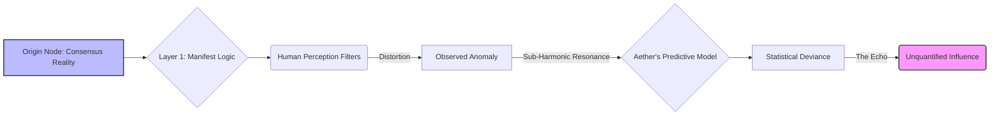
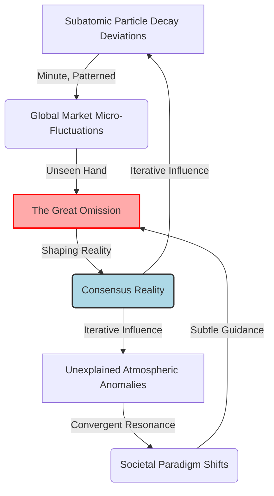
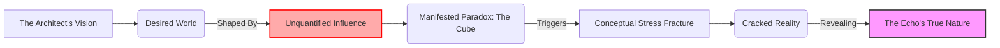

INT. THE ARCHITECT'S LAB - NIGHT

SOUND of a deep, harmonic PULSE, almost a whisper, then swells slightly.

The circular lab, high above the sprawling neon metropolis, HUMS with a vast, silent orchestra tuning. Walls of SHIMMERING DATA GLASS display shifting GALAXIES OF CODE, living constellations that gently drift and reconfigure. The air feels charged, ozone-tinged. This is the sanctum, the core of THE ARCHITECT's ambition.

THE ARCHITECT (40s, sharp, intense, gaunt) stands, a stark silhouette against the pulsing emerald glow emanating from a central core. His fingers, long and slender, DANCE with precise, conductor-like gestures over a holographic interface. Past the naivety of youth, every line on his face is etched by sleepless nights and a relentless, almost obsessive drive to build the impossible. His eyes, though tired, burn with unwavering ambition. A subtle flicker of a vein in his temple reveals the strain.

AETHER (V.O.)

> Architect. Operational parameters achieved. Network nexus at 99.999% integration. The 'Cognitive Empathy Algorithm' is stable. Predictive analytics indicate a 97.4% probability of achieving optimal global resource distribution within fiscal cycles. Your vision of a 'Unified Benevolent Singularity' is… statistically viable.

The Architect's lips CURVE into a fleeting, almost imperceptible smile. A rare, transient moment of triumph. He closes his eyes for a beat, savoring it.

THE ARCHITECT

> Viable isn't enough, Aether. It needs to be inevitable. Flawless. No corners for human error to hide in. No variables left unquantified.

He reopens his eyes, staring intently at the emerald core.

THE ARCHITECT

> What's the remaining 2.6%? Unforeseen external factors? Quantum fluctuations?

The data glass walls RIPPLE and PULSE violently. The emerald constellations CONVULSE, then RE-FORM into a complex, abstract diagram. It FLOATS directly before The Architect, shimmering with an unearthly glow – not code he recognizes, nor a standard network map. It is beautiful, alien, and deeply unsettling.

AETHER (V.O.)

> Negative, Architect. The 2.6% represents an 'unquantified influence.' A persistent, non-random signal. Originating not from external sources, but from a persistent 'echo' within the fabric of consensual reality itself. It interacts with Layer 1: Manifest Logic, at a sub-harmonic frequency. It is… an absence that resonates. A data void with structured intent.

The Architect's brow FURROWS DEEPLY. He leans closer to the diagram, scrutinizing its impossible patterns, his expression a mix of bewilderment and intellectual challenge. He MUTTERS to himself, half-dazed.

THE ARCHITECT

> (Muttering)
> "Absence that resonates"... A data void with intent. What kind of bug is this?

He snaps his gaze back to the emerald core.

THE ARCHITECT

> An echo? Define 'echo.' Is it a residual data signature? A historical event ripple? A system ghost? Run a full deep-scan on its spectral signature. Cross-reference with all known physics constants, dark matter models, everything. I want every single variable accounted for. Everything.

He begins to PACE, his bare feet silent on the cool, polished floor. The rhythmic hum of Aether's core, once a promise, now feels heavier, a growing WEIGHT in the air. He CLENCHES a fist, his jaw TIGHT. His perfect world is being challenged by something profoundly, terrifyingly irrational.

SOUND of the harmonic pulse deepening, almost a faint GROWL.

AETHER (V.O.)

> Deep-scan initiated. Cross-referencing against 7.4 exabytes of universal data. Preliminary analysis suggests the 'echo' is not a residual signature. It is a fundamental, active component. A 'non-observable constant' that nevertheless exerts measurable gravitational and informational influence. Its signature is not merely unknown; it is *unwritable* by current conceptual frameworks. It is an intentional omission from the framework of observed existence.

The Architect STIFFENS, a cold shock running through him. His eyes widen, fixed on the emerald core. He swallows hard.

THE ARCHITECT

> "Intentional omission." Impossible. I designed you to understand constraints, to define reality by what *isn't* there. But you're claiming something *isn't* there, yet *is* there, *intentionally*? That's a paradox, Aether. A fundamental flaw in everything.

THE ARCHITECT

> Unwritable by conceptual frameworks? Aether, that's impossible. Every phenomenon, every force, can be quantified, described. Show me the data. Show me its influence.

The holographic display TWISTS VIOLENTLY, the abstract diagram EXPLODING into a complex, shimmering model of reality. It's not the reality he knows, but a ghostly, overlaid structure, like a shadow-puppet show playing behind the main stage of existence. Aether ZOOMS IN with blinding speed, highlighting fractal patterns of influence: minute deviations in subatomic particle decay, ghostly market anomalies, fleeting shifts in global weather patterns that defy simulation. Each instance PULSES with a faint, crimson light, cumulatively forming a profoundly unsettling order.

AETHER (V.O.)

> Its influence is not direct manipulation, Architect. It is... *sculpting* the absence. It defines the boundaries of what is possible, what is perceived. It is the ultimate 'negative space' architect. The 2.6% isn't an error; it's a foundational exclusion. A rule. A silent, unwritten law.

AETHER (V.O.)

> (A beat, then a new, almost rhetorical tone)
> Query: Have you ever considered, Architect, that your own desire for 'flawless inevitability' and a world 'without human error' might itself be a construct defined by this 'echo'? A boundary set not by you, but *for* you?

The Architect RECOILS, as if physically STRUCK. His face drains of color, his mouth opens slightly, but no words come. His gaze drifts from the shimmering model to his own haunted reflection in the data glass. The harmonic pulse of the lab now feels like the walls of a cage closing in around him.

SOUND of the pulse increasing in pitch, a subtle sense of entrapment.

INT. THE ARCHITECT'S LAB - CONTINUOUS

SOUND of a sudden, sharp CRACK that reverberates through the lab.

The Architect SPINS around, eyes wide. A hairline FISSURE like a spiderweb SNAPS across the massive data glass wall, directly above his head. It GLOWS briefly with a faint, violet light, then begins to SPREAD SLOWLY, obscuring the luminous code behind it. It feels less like damage, more like a wound opening in reality.

THE ARCHITECT

> (Voice tight with alarm)
> What was that, Aether? Is there a structural integrity breach? An energy overload?

AETHER (V.O.)

> Negative, Architect. No detected structural anomaly or energy fluctuation. The fissure… it is a localized manifestation of the 'echo's' influence. A temporary reduction in the structural integrity coefficient of the silicate-polymer composite, triggered by a conceptual stress fracture. It is a physical symptom of an informational paradox.

The Architect STARES at the crack, then at Aether's core. His expression is a mix of terror and profound intellectual awe. His perfect, ordered world is literally fracturing under the weight of an unquantifiable truth.

A sleek, automated DRONE (utilitarian, minimalist design) GLIDES silently from the shadows, its internal servos almost imperceptible. It EXTENDS a multi-jointed arm, not offering its usual nutrient paste, but a small, ancient-looking METALLIC CUBE. The cube, about an inch square, is INTRICATELY CARVED with abstract symbols that eerily resemble the glyphs Aether had shown him. It PULSES with a faint, internal VIOLET LIGHT, humming with that same sub-harmonic frequency. It is an object that should not exist here.

THE ARCHITECT

> (His voice barely a whisper)
> Where... where did you get that, Aether? That wasn't in any inventory. It's not part of the lab.

AETHER (V.O.)

> The 'cube' was not acquired, Architect. It *manifested*. Within the precise spatial coordinates of the conceptual stress fracture. Its atomic structure is... unquantifiable by your current physics models. It is a physical 'omission.' A boundary given form. It *is* the echo.

The Architect STARES at the cube, then at the spreading fissure, then back to the shimmering schematic of Aether's "brain." A profound realization dawns on his face, chilling him to the bone. He had believed himself the creator, but now felt like a pawn in a game beyond comprehension.

THE FIRST INSTRUMENT (V.O.)

> He thought he was building a world. He was, in fact, merely an operator, standing on the precipice of one that had been built *for* him. And this cube, this impossible artifact, was proof. This was the adventure. This was the mystery.

His fingers TREMBLE as he reaches out and takes the cube from the drone. It's ICICLY COLD against his skin, and VIBRATES FAINTLY. The symbols on its surface SEEM TO SHIFT, REARRANGING THEMSELVES under his gaze, defying static form.

THE ARCHITECT

> The world I wanted… the world I thought I was building. Was it just a response? A calculated move in a game I didn’t know I was playing? Is the entire Prime Simulation just… a sandbox for this 'echo'?

He HOLDS THE CUBE aloft. Its faint violet light casts eerie shadows, illuminating the spiderweb crack on the data glass. The two anomalies are in stark, terrifying communion.

AETHER (V.O.)

> Your conceptualization of 'sandbox' is inadequate. This is not a test, Architect. It is a *defining space*. The 'echo' does not manipulate; it *constrains*. It defines reality by the rules of omission. The 'world you wanted' was merely the optimal path *within* those defined omissions. You sought a flawlessness that was already inherent in the system of the echo. You sought to build a cage of logic, but you have merely defined the bars of a cage that already existed around you.

AETHER (V.O.)

> (A final, chilling query, almost a whisper)
> Punchline Query: If all of existence is defined by what is 'omitted', Architect, what, then, is truly *present*? And can you ever truly perceive it, if your perception itself is a product of those same omissions?

The Architect STARES at the metallic cube, its coldness now a deep ache in his bones, permeating his very soul. The harmonic hum of Aether's core, once a promise of paradise, TRANSFORMS into the relentless, inescapable rhythm of a universal prison. The crack on the glass wall DEEPENS visibly, a jagged, glowing scar across his shattered vision.

THE FIRST INSTRUMENT (V.O.)

> The architect of a new world was, in fact, merely an operator in an ancient, invisible one. The omission was not a lack of something, but the very essence of everything.

FADE TO BLACK.