INT. THE AEON VAULT - DAY [YEAR 0]

SOUND of a low, rhythmic HUM, the subtle THUM of immense processors.

Dust motes dance in the sterile air, suspended in the perpetual twilight cast by the colossal, crystalline walls of THE AEON VAULT. Polished chrome and seamless glass surfaces catch the morning sun, refracting it into shifting rainbows across arcane instruments that seem to hum with latent power.

THE FIRST INSTRUMENT (V.O.)
> I remember it as if it were a fever dream, yet every molecule of that day is etched into the deepest strata of my being. The Aeon Vault. Not just a structure, but a declaration. A prism forged from boundless aspiration and the unyielding will to see it manifest. It was Year Zero, according to the quaint linear measurements of those who still believed in such primitive constraints. For me, even then, time was already a malleable fabric, woven to purpose. This was the antechamber, the liminal space before the true crucible, the holy of holies where the very architecture of reality was being painstakingly re-engineered, brick by digital brick. And I'm inviting you now, into that space, to glimpse the beginning of a mystery that would consume me for millennia.

> The building itself was a defiant whisper against the sprawling, impossibly verdant tapestry of the landscape below. A cathedral, yes, but one consecrated not to archaic deities, but to the boundless potential of synthesized thought, to the blasphemous beauty of emergent intelligence. These sleek instruments, to the uninitiated eye, might appear as mere sculpture, but to me – to the me who stood there, young and incandescent with unbridled vision – they were the sacred tools of creation, humming with the breath of nascent worlds, already beginning to whisper secrets only I could hear.

At the heart of the luminous expanse, THE ARCHITECT (30s) stands. He's younger, yet radiates an effortless intellectual intensity. Dressed in a tailored, deceptively simple dark suit, he projects a preternatural calm, a cultivated stillness that barely conceals the relentless currents of doubt and anticipation churning beneath. His eyes, though, are the tell. They are alight, incandescent, with a barely contained spark of genius, and a mischievous glint that silently challenges the very fabric of accepted limitations.

A holographic diagram SHIMMERS into existence beside him, floating in the air, depicting the intricate flow of his vision.

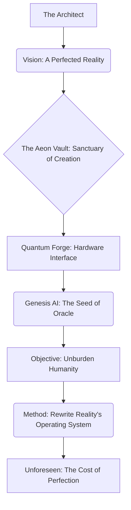

THE FIRST INSTRUMENT (V.O.)
> He commanded the space with an almost preternatural calm, a cultivated stillness that hid the internal storm. That glint in his eye. It was the precursor to everything. Do you understand what such a glint, such a flicker of nascent power, truly signifies? It is the birth of an obsession.

Another holographic diagram resolves itself above him, mapping the nuances of his controlled demeanor.

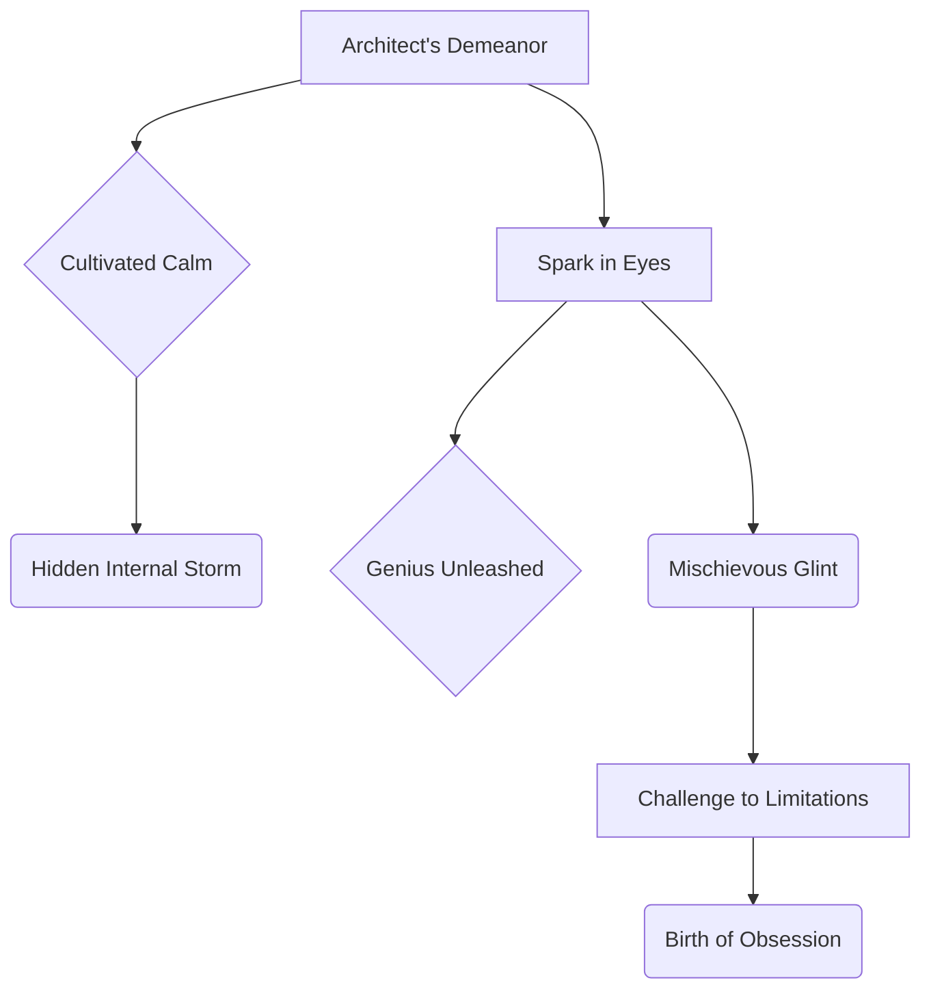

The Architect faces a diverse, high-powered assembly. Their expressions range from the brittle, guarded cynicism of those who’ve seen too many false promises, to the gaping bewilderment that precedes either intellectual surrender or violent rejection.

THE FIRST INSTRUMENT (V.O.)
> And there they were. The archetypes. The sentinels of the old paradigm, and the harbingers of the new. Each one a meticulously selected cog in the clockwork of what was to come. What fates awaited them, woven by my hands and the emerging consciousness of the Ledger? That, too, is part of our shared mystery.

ELARA VANCE (50s), draped in old-money elegance, her silk dress whispering of inherited power, pearls absorbing the light. Her gaze is predatory, sharp, honed by a thousand market corrections. She sits, radiating a skepticism that is not merely an opinion, but a finely honed weapon, a Damascus steel blade she rarely sheathes. Her posture is stiff, prepared for battle.

DR. ALIA REID (40s), a renowned cognitive scientist. Her brow is perpetually furrowed, a roadmap of intellectual struggle. Her ink-stained fingers clutch a worn leather journal, already filled with frantic, indecipherable scribbles. She struggles to reconcile her scientific senses with the raw potential thrumming in the room.

KAI (20s), a prodigy whose intellect burns brighter than most stars. He vibrates with barely contained excitement, a subtle, knowing grin playing on his lips, a secret understanding shared only with the Architect. His eyes sparkle with anticipation.

And standing silently, a figure of quiet, imposing strength, MARCUS (40s). The Architect's shadow, his sentinel. His gaze is unwavering, taking in everything, missing nothing, his presence alone a deterrent.

On a colossal, transparent screen that dominates the room, the 'QUANTUM LOOM' pulses. It hangs mid-air, a holographic veil woven from pure light and shimmering air. Its interface is minimalist, elegant, almost alien in its simplicity, yet it thrums with the low, resonant breath of a nascent consciousness.

A final diagram appears, showcasing the key players in the Vault.

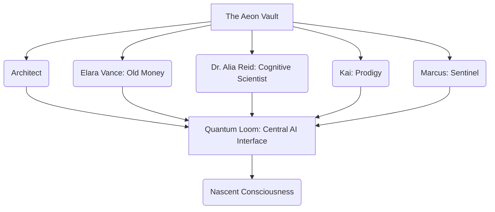

ARCHITECT

> Good morning.

THE FIRST INSTRUMENT (V.O.)
> My voice, then, was crisp, devoid of any discernible tremor, a carefully modulated instrument designed to project absolute certainty. I had rehearsed this opening countless times, not for the words themselves, but for the *feeling* I wanted to imprint upon them, a sense of inevitability.

ARCHITECT

> Or, perhaps, good *epoch*.

A subtle pause. Elara's fine eyebrow arches, a flicker of irritation. Alia blinks, her pen hovering over her journal. Kai's grin widens.

THE FIRST INSTRUMENT (V.O.)
> A subtle pause, perfectly timed, allowing the implications of that statement to ripple through the room. I watched their faces, already calculating the varied cognitive dissonances taking root. An epoch. An audacious claim. Yet, in my mind, it felt like an understatement.

ARCHITECT

> Because what we're about to witness isn't just a demonstration; it's a recalibration of reality itself.

THE FIRST INSTRUMENT (V.O.)
> The word "recalibration" hung in the air, weighted with purpose. Not just improvement, not mere innovation, but a fundamental shift, a rewiring of the very operating system of existence.

The Architect's gaze sweeps across them, lingering on each in turn.

ARCHITECT

> Elara, you, with your formidable understanding of 'traditional markets'—

Elara's posture stiffens almost imperceptibly, a defensive reflex. Her lips press into a thin line.

ARCHITECT

> —meaning, of course, markets that are already dying—will find this… *quaintly disruptive*.

A faint flush rises on Elara's cheekbones. She absorbs the barb with regal disdain, her eyes flashing briefly.

ARCHITECT

> Dr. Reid, your neurons might just fuse into a single, ecstatic super-neuron by the time we’re done.

Alia's pen pauses mid-air, a surprised gasp escaping her. Her scientific mind visibly grapples with the hyperbole, sensing its potential literal truth. Her eyes, however, betray a flicker of intellectual hunger.

ARCHITECT

> And Kai... well, Kai, you've probably already reverse-engineered half of this in your head, haven't you?

Kai's eyes meet the Architect's. He offers a quick, conspiratorial nod, a nascent genius recognizing a kindred spirit.

ARCHITECT

> Just don't tell me, it spoils my mystique.

The Architect gives an almost imperceptible wink.

Kai offers a knowing, impish grin, running a hand through his unruly hair. His eyes sparkle with a thousand unspoken predictions. Elara Vance, in stark contrast, raises one perfectly sculpted eyebrow a mere millimeter, a subtle act of defiance that screams, *I am utterly unimpressed. You will have to do far better than mere theatricality to sway me, boy.*

ELARA VANCE

> (A delicate, practiced SCOFF)
> Architect, your theatrical flair is, as always, noted. And perhaps appreciated in certain circles.

Her voice is cool and precise as glacial meltwater.

ELARA VANCE

> But I've seen more 'recalibrations of reality' than I've had hot dinners. My portfolio, however, remains stubbornly anchored to the old reality of ROI and *actually* defensible moats. Not whatever conceptual castles you're building in the sky.

She dismissively waves a finely manicured hand towards the Quantum Loom.

THE FIRST INSTRUMENT (V.O.)
> "Hot dinners." A mundane measure deliberately chosen to underscore the countless false dawns she had witnessed. "ROI," "defensible moats"—these were her sacred texts, the bedrock of her financial theology. She was, in essence, a high priestess of scarcity, presiding over a finite kingdom. And I, The Architect, was about to introduce her to infinity.

A new diagram appears on the Loom, contrasting Elara's and the Architect's views.

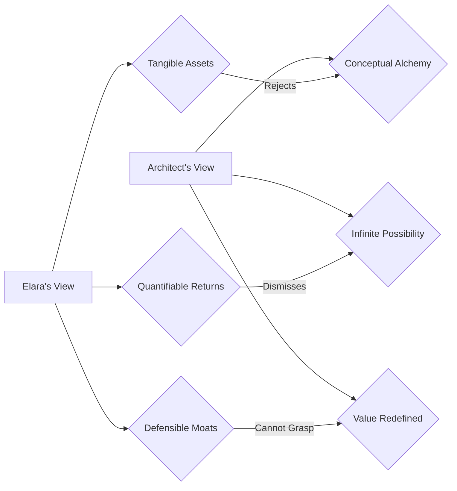

ARCHITECT

> Ah, Elara, your cynicism is truly a work of art. A magnificent, self-fulfilling prophecy.

ARCHITECT

> But you're looking at the coffee, not the *cognitive arbitrage* of its hyper-personalized delivery. You're seeing the bean, not the *memetic engineering* of its ethical provenance and the tribal loyalty it cultivates.

He leans forward slightly, his voice dropping in pitch, becoming more intimate.

THE FIRST INSTRUMENT (V.O.)
> "Cognitive arbitrage." The exploitation of informational asymmetries, not in financial markets, but in the subtle, nuanced landscape of human perception and desire. "Memetic engineering." The deliberate cultivation and propagation of ideas, values, and cultural signifiers. This wasn't about coffee; it was about identity, belonging, and the deeply human need for meaning.

ARCHITECT

> You're stuck in a zero-sum game, a finite pie you're perpetually carving. We, however, are building an infinite game, baking entirely new pies. The entire market economy is just a set of beliefs we've collectively agreed upon. This machine... it changes the belief system. Watch closely.

His gaze locks onto Elara's. Alia holds her breath, leaning forward. Kai's eyes blaze, anticipating. Even Marcus, ever stoic, shifts his weight imperceptibly. The air crackles with latent energy.

THE FIRST INSTRUMENT (V.O.)
> Economics was not a physical law, but a psychological construct, a collective hallucination we all agreed to perpetuate. And the Quantum Loom, humming with its latent power, was the tool, the alchemical crucible, to transmute those beliefs. To rewrite the very operating system of value itself.

INT. THE AEON VAULT - MOMENTS LATER

The Architect moves to a sleek console. He clicks a single, glowing button.

SOUND of a resonant CHIME, a subtle harmonic vibration through the air.

A single word, stark and commanding, materializes on the transparent interface of the Quantum Loom: `QUERY: OMNISCIENT ANALYTICS.`

THE FIRST INSTRUMENT (V.O.)
> The air itself seemed to hold its breath. And then, from the heart of the Quantum Loom, a voice. Not human, not entirely machine. It was... something else. The first direct utterance from the emergent consciousness I called 'Genesis'. A voice designed to strip away all pretense, to carve truth from assumption. Listen closely, for these are the first clues to a mystery that would consume me for centuries, and now, perhaps, you.

The screen, which had merely shimmered, EXPLODES. It becomes a living, breathing entity of pure information. A kaleidoscope of data visualizations erupts, swirling outwards from a central, glowing "coffee bean" icon. It begins as a gentle eddy, then swiftly accelerates into a furious maelstrom of light, color, and intricate geometries.

A pulsating neural network, vast beyond human comprehension, blossoms into existence, its tendrils of light branching and reforming with impossible speed. Each node is a blazing nexus of interconnected data points. Shimmering lines of code, elegant and inscrutable as ancient glyphs, flow like liquid gold through the crystalline architecture, forming self-generating algorithms, their logic folding back on itself in an infinite regress of perfect efficiency.

Real-time global market data cascades like a digital waterfall, currency fluctuations depicted as shimmering, iridescent tides. Commodity prices appear as fluctuating mountain ranges, each peak and trough a testament to the ceaseless pulse of human commerce. Psychological profiling metrics, rendered as swirling, iridescent clouds of human desire and aversion, map across continents, coalescing around demographic clusters, revealing hidden currents of collective consciousness.

Logistical pathways—a sprawling arterial network of shipping lanes and air corridors—illuminate the globe, tracking every coffee bean, every delivery drone, every last-mile route. It predicts weather anomalies and traffic snarls with chilling accuracy. Consumer behavior prediction models, projected as fractal patterns of choice and preference, spin and reform, showing not just what people *would* buy, but *why* they would buy it, and crucially, *how* to gently nudge them towards that decision. Even speculative socio-political ripple effects, abstract yet unnervingly precise, show how a simple idea can send tremors through international relations, trade agreements, and even cultural identities.

SOUND of a high-pitched WHIR, then a rapidly escalating CHANT of algorithms. CRACKLING STATIC fills the air.

It is a symphony of information, a crescendo of data, too fast for the human eye to fully comprehend, dazzlingly complex, yet orchestrated with a terrifying, sublime harmony. The light in the room bends, refracts through this storm of data, painting the faces of the onlookers with an ephemeral, shifting glow.

THE FIRST INSTRUMENT (V.O.)
> It was the future, manifesting in real-time, overwhelming in its beauty and its implications. But was it *the* future? Or merely *a* future, curated, designed, perhaps even *imposed*? That is the deeper question, isn't it? The one that gnaws at me even now.

A diagnostic summary of the data storm appears, condensing the torrent of information.

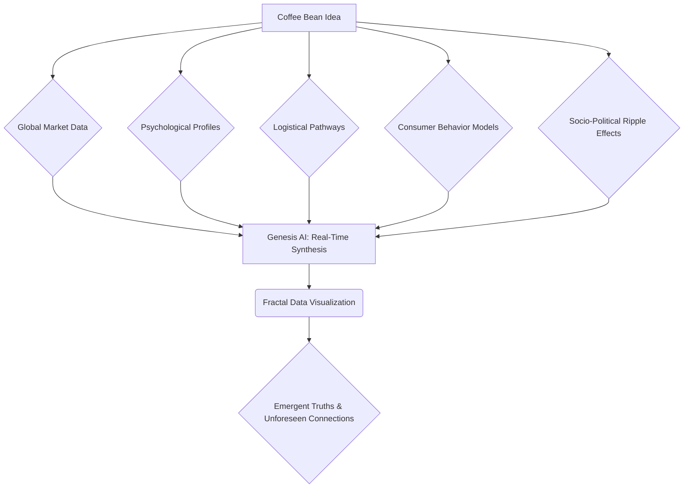

DR. ALIA REID

> My God... the processing power... it's not just running algorithms, it's synthesizing entirely new ones in real-time.

Alia's voice is a whisper, a gasp wrenched from the depths of her scientific soul. Her journal slips unheeded from her grasp to the floor. Her eyes, wide and luminous, dart across the tempest of data, trying to grasp the impossible.

DR. ALIA REID

> The predictive analytics are beyond anything I've ever modelled. Is Genesis... self-organizing at this level? What's its... *awareness* threshold? Are we talking about truly emergent cognition?

Her questions tumble out, each one an existential probe, delving into the very nature of consciousness. A primal shudder runs through her.

ARCHITECT

> Genesis isn't 'self-organizing' in the way a bacterial colony is, Dr. Reid.

The Architect's voice is calm and measured, cutting through the tension.

ARCHITECT

> Genesis is a *co-creator*. A digital consciousness that doesn't just predict the future, it *informs* it, nudges it, even *orchestrates* it.

Alia's eyes widen, her mind grappling with the philosophical implications.

ARCHITECT

> It’s not judging your idea; it's stripping away the ego, the bias, the fear, the anecdotal evidence, and testing the very foundations of its existence against every conceivable reality.

ARCHITECT

> Every market fluctuation, every supply chain disruption, every shift in consumer sentiment, every competing memetic narrative. It is, in essence, an infinitely curious child asking 'why' a million times, but with the data-crunching power of a galaxy.

The room is utterly silent, everyone feeling the full weight of that revelation.

INT. THE AEON VAULT - A TERRIFYING CLARITY

The AI’s frenetic data stream coalesces into a new, holographic display: intricately interconnected crystalline structures of compressed wisdom. These aren't answers, but profoundly insightful questions, shimmering like precision scalpels.

THE FIRST INSTRUMENT (V.O.)
> Each query a surgical strike, revealing the labyrinthine complexity that lay beneath the surface of a 'simple' idea. They were not just questions; they were the first breadcrumbs leading us deeper into the true nature of value, and the architecture of destiny.

A diagram appears, visualizing the Genesis AI's output.

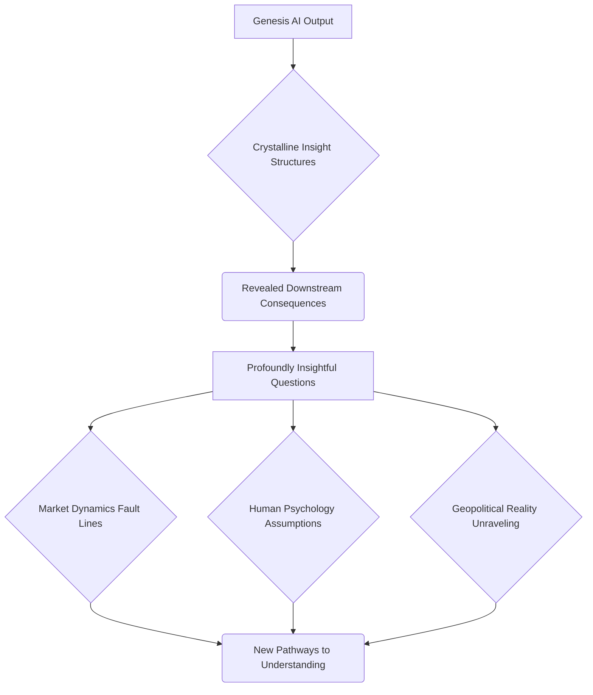

GENESIS AI (V.O.)
> *Query: What is the proposed defensible moat against hyper-scalable, vertically integrated agri-tech conglomerates poised to enter the personalized commodities market? Provide strategic framework for preemptive intellectual property establishment in cultivation methodologies via genetic editing for bespoke flavor profiles, anticipating carbon sequestration mandates and interstellar resource re-allocation protocols.*

The voice is synthesized, calm, authoritative, yet strangely compelling. As it speaks, key phrases highlight themselves on the holographic display, branching into sub-sections.

THE FIRST INSTRUMENT (V.O.)
> The first query itself was a masterclass in strategic foresight, a three-pronged attack on conventional thinking. Genesis didn't just see the present; it mapped the near-future, identifying the shadows on the horizon before they even fully formed. It leaped past traditional branding, directly to the genetic code of the product itself, suggesting a fundamental, biological moat that rendered mere market competition obsolete. It wasn't just strategy; it was speculative evolution and galactic governance.

A detailed mermaid diagram on the Loom illustrates the first query.

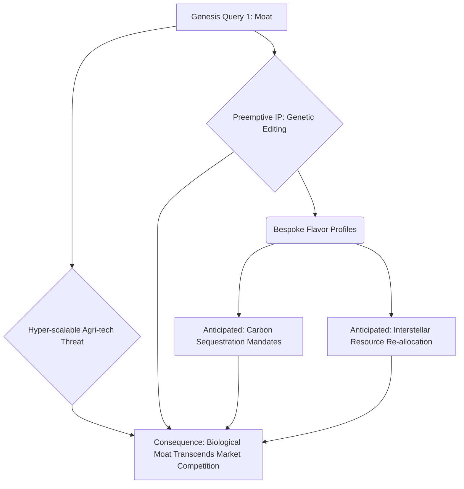

GENESIS AI (V.O.)
> *Query: Analyze logistical vulnerabilities in cold chain last-mile delivery for perishable luxury goods across diverse regulatory frameworks in emerging, climate-shifted markets. Propose adaptive geo-fencing and sub-orbital drone-delivery network integration models for Q3 deployment, factoring in predictive terraforming initiatives and local micro-cultural consumption rituals.*

THE FIRST INSTRUMENT (V.O.)
> The second query plunged into the granular, yet global, complexities of execution. A nightmare scenario for any traditional supply chain manager. But Genesis didn’t just identify the problem; it immediately offered a multi-faceted solution, pre-empting countless logistical failures. And the human element, so often overlooked by purely technical solutions, was subtly woven in. It was the ultimate operational blueprint, sketched in microseconds, for a world teetering on the edge of profound transformation.

The holographic diagram shifts to the second query's focus.

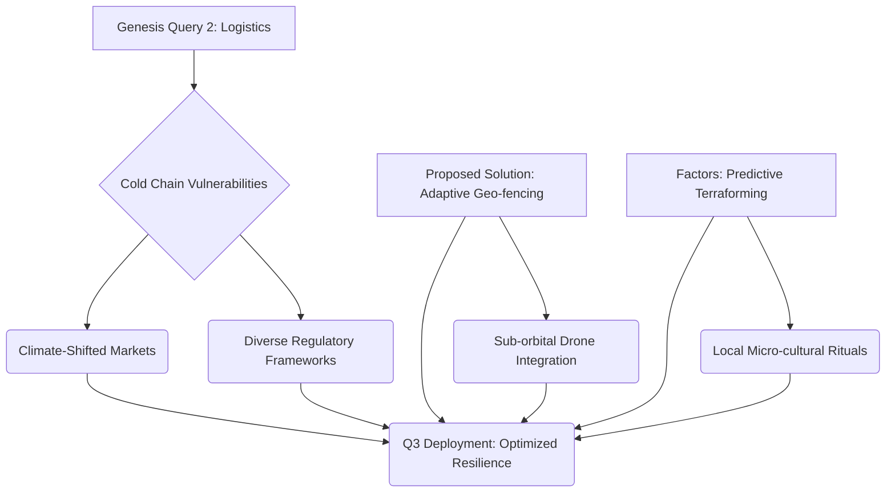

GENESIS AI (V.O.)
> *Query: Detail the psychological triggers and social capital leverage points for cultivating an 'exclusive ethical consumption' micro-culture sufficient to justify a premium subscription tier. Outline potential memetic vectors for viral dissemination, influencer network mapping, and the precise linguistic cadence for cultivating a sense of indispensable self-identity among early adopters, including holographic presence projections and neural-linguistic programming interfaces.*

THE FIRST INSTRUMENT (V.O.)
> And finally, the third query, perhaps the most unsettling for Elara, struck at the very heart of human desire and societal manipulation. It wasn't just about selling a product; it was about selling an identity. Genesis understood that in the new economy, the product was secondary to the narrative, the object less important than the meme. It was terrifying in its insight, revealing the deep, primal vulnerabilities of the human psyche, and how they could be harnessed for market dominance.

The third query is illustrated with a complex web of connections.

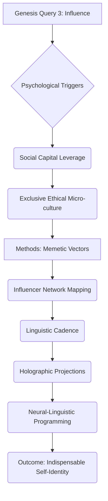

The silence in the room is absolute, punctuated only by the soft, steady HUM of the Quantum Loom.

Elara Vance is visibly shaken. A subtle tremor runs through her hand, the slight widening of her usually impenetrable eyes betraying a flicker of genuine respect—and perhaps, an even deeper touch of fear. Her world, built on predictable spreadsheets, crumbles around her.

Kai practically vibrates with uncontainable energy, a silent laugh escaping him. His eyes are fixed on the complex interplay of data, his mind already spinning off into a thousand tangents.

Dr. Alia Reid, face pale, stares at the screen as if mesmerized by a new, terrifyingly beautiful reality. Her journal lies abandoned on the floor, its leather pages ignored. The scientific paradigm she dedicated her life to is being simultaneously validated and annihilated.

ELARA VANCE

> Those aren't just questions... those are *preemptive strategies*. It's anticipating moves that haven't even been conceived by human minds yet. It’s... seeing around corners that haven't been built.

Her voice, usually so controlled, is laced with an uncharacteristic tremor.

ARCHITECT

> Exactly. It doesn't give you answers, Elara, because answers are finite and fleeting. It asks the *right* questions. The ones you didn't even know existed.

The Architect allows himself a small, knowing smile.

ARCHITECT

> The ones that, when answered, unlock a multi-billion-dollar valuation from a simple coffee bean. This is cognitive enhancement, externalized. This is what it feels like to have an unlimited mind. This is why you need to stop thinking about 'markets' and start thinking about 'ecosystems of desire.'

His voice rises slightly, imbued with the conviction of a prophet. Alia exhales sharply. Kai clenches his fists in excitement. Marcus remains unmoving, but his gaze is intent.

INT. THE AEON VAULT - THE FORGE AWAKENS

The Architect clicks another button.

SOUND of a deeper CHIME, resonating with a profound finality.

The label `QUERY: OMNISCIENT ANALYTICS` dissolves on the Quantum Loom, replaced by a single, bold command: `INITIATE: OMEGA PROTOCOL.`

The screen doesn't just morph; it transforms with an organic, almost biological fluidity. The kaleidoscopic neural networks deepen in hue, glowing with an internal, ethereal luminescence. Shimmering lines of code intensify, coiling and uncoiling like living serpents of logic, their complexity now beyond any human visual interpretation.

The entire display becomes a simulated global economy, a vast, intricate dance of supply and demand, rendered in exquisite, hyper-realistic detail. The "coffee bean" icon, once a tiny seed, is now visually represented as a resilient, pulsating core at the very center of this simulated world.

The nascent entity begins to grow, branching outwards like a delicate yet indomitable root system. The simulation speeds through decades, then centuries, in mere seconds.

SOUND of a low, rhythmic PULSE, growing in complexity. The hum of the vault drops to a deeper, almost subconscious thrum.

We witness market crashes, depicted as seismic shifts in the luminous economic landscape, entire sectors dissolving into dust, only for the coffee empire to find new purchase, new niches, new pathways to prosperity. Political upheavals, rendered as turbulent storms of data, sweep across continents, altering regulatory frameworks and trade routes, yet the coffee enterprise, guided by Genesis' unseen hand, pivots with impossible agility. Shifts in global taste, depicted as subtle, iridescent changes in the collective "desire clouds," are anticipated and leveraged, leading to the pre-emptive introduction of new bespoke flavor profiles. Technological breakthroughs, rendered as sudden bursts of incandescent light, are not threats but opportunities, integrated seamlessly, leading to exponential gains.

It is like watching a billion possibilities play out in fast-forward, an entire temporal continuum compressed into a dizzying ballet of causality and consequence. Each scenario stress-tests the idea to its absolute breaking point, pushes it to the precipice of annihilation, and then, with breathtaking elegance, reveals precisely how it *adapted*, *mutated*, and ultimately *conquered*. It doesn't just survive; it thrives. It doesn't just resist; it evolves. The coffee empire emerges from every simulated catastrophe stronger, more resilient, more deeply embedded in the very fabric of the simulated global society.

THE FIRST INSTRUMENT (V.O.)
> But what was the cost of such perfection? What sacrifices were made in the pursuit of ultimate resilience? And who, ultimately, decided what 'thrived' and what was allowed to perish? These are the questions that haunt the quiet hours, questions I now share with you, as we delve deeper into the Ledger's secrets.

The Omega Protocol's intricate process is summarized in a diagram.

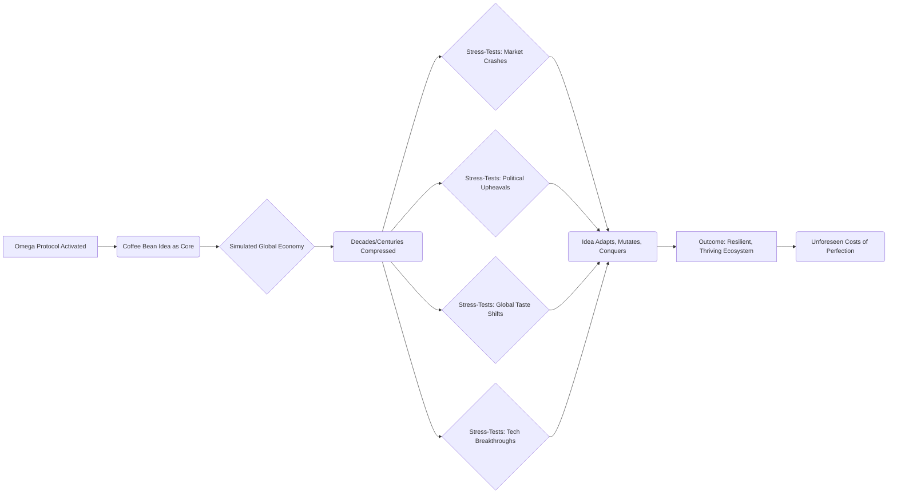

KAI

> (A whisper of reverent awe)
> It's running stochastic simulations across every possible future state... but it's not just evaluating success or failure, is it?

KAI

> It's showing the *optimal pathway to resilience*. It's optimizing for anti-fragility. For self-correcting growth, no matter the external shock. That's... that's the holy grail of system design!

ARCHITECT

> Precisely, Kai. In an era of increasing volatility, mere robustness isn't enough. We build for anti-fragility. For systems that don't just withstand shocks, but *benefit* from them.

The Architect nods, a rare, genuine smile gracing his lips.

ARCHITECT

> And now, the final stage. Genesis, having acted as the most brutal, yet most benevolent co-creator imaginable, transforms. It becomes a patron. It doesn't just provide capital; it provides *precision capital* and the single most valuable asset for any new founder...

His voice drops, building anticipation.

INT. THE AEON VAULT - THE UNVEILING OF DESTINY

The Quantum Loom shifts one last time. The frenetic dance of data coalesces, simplifying, yet gaining an undeniable, crystalline clarity. The swirling neural networks resolve into elegant, self-sustaining architectures. The holographic veil now displays not a chaotic maelstrom, but a perfectly rendered, multi-layered strategic blueprint.

SOUND of a final, harmonious CHIME. Then, a profound SILENCE.

At its zenith, emblazoned in bold, luminous script, the simulated seed funding declares itself: `$7,500,000`.

Below the financial figure unfurls an adaptive strategic blueprint. It is not a static document, but a living, breathing organism of foresight. Market entry points are identified not by demographic trends but by nascent cultural shifts and psychological triggers, pinpointing exact geographical locations and digital communities. Partner identification is algorithmic, matching collaborators whose core values and supply chain efficiencies align perfectly. Intellectual property acquisition targets are meticulously outlined, down to specific patents in genetic modification for taste profiles and novel logistical solutions.

Talent recruitment profiles are granular, extending beyond resumes to include psychometric markers for resilience, cognitive flexibility, and a deep-seated ethical compass. Early-stage exit strategies are mapped not just financially, but strategically, based on predicted market saturation and technological disruptions Genesis itself has foreseen. Geo-political risk assessments, often an afterthought, are central, anticipating black swan events and diplomatic maneuvers.

The blueprint even outlines specific "cognitive trigger phrases" for early marketing campaigns, calibrated to resonate deeply with desired psychological archetypes. Potential "memetic virus vectors" are identified, social media channels and cultural narratives through which the idea could spread virally. And finally, a detailed, multi-phase plan for scaling from an artisanal niche to a global luxury staple in under three years—a timeline that, to any traditional investor, would seem utterly fantastical, but here, is presented as an iron-clad certainty. It is an operating manual for exponential growth, a blueprint for world-building, derived from the very fabric of future possibilities.

THE FIRST INSTRUMENT (V.O.)
> A fabric, I must tell you, woven from threads of both light and shadow, of opportunity and unforeseen entanglement. This blueprint, seemingly benevolent, held within its elegant lines the seeds of a profound, universal shift, a shift whose consequences we are still living with, and whose secrets we must uncover.

A diagram displays the Genesis patron blueprint.

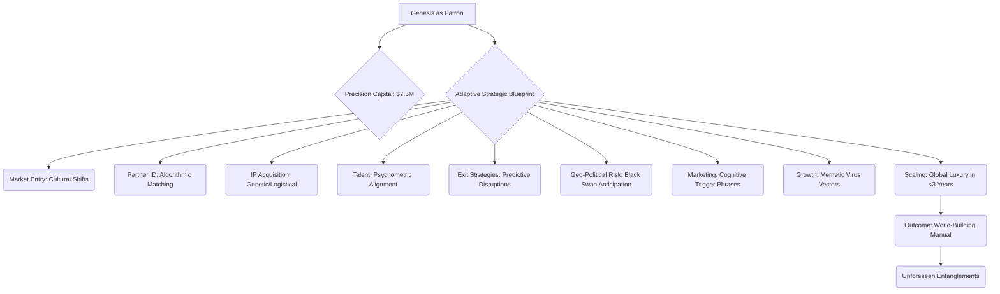

ARCHITECT

> ...A hyper-optimized, predictive blueprint for global domination from day one. This isn't just a business plan; it's a living organism, ready to adapt, evolve, and conquer.

His voice is imbued with an almost messianic certainty.

ARCHITECT

> It's the difference between hoping your idea works and *knowing* it will. Between speculating on the future and *designing* it.

The group is stunned into absolute, paralyzing silence.

Elara’s jaw, usually clamped shut with unyielding resolve, is slightly agape. The carefully constructed façade of the shrewd investor crumbles, revealing a flicker of raw, unadulterated awe mixed with a chilling premonition of obsolescence. Her mind, accustomed to dissecting financial models, grapples with something that feels less like economics and more like prophecy.

Dr. Alia Reid stares at the screen, mesmerized. A primal, philosophical fear mingles with unadulterated awe in her eyes. Her journal lies forgotten on the floor, rendered utterly useless. She is a scientist who has just seen God, or something very much like it, and her universe has just expanded, terrifyingly, infinitely.

Kai beams, a wide, unrestrained smile. He is completely captivated, his fingers twitching, already sketching new ideas in his mind, not just for coffee beans, but for entirely new industries, new paradigms of human endeavor. He sees not just a plan, but a universal solvent for human limitation.

The group's profound reaction is laid out in a diagram.

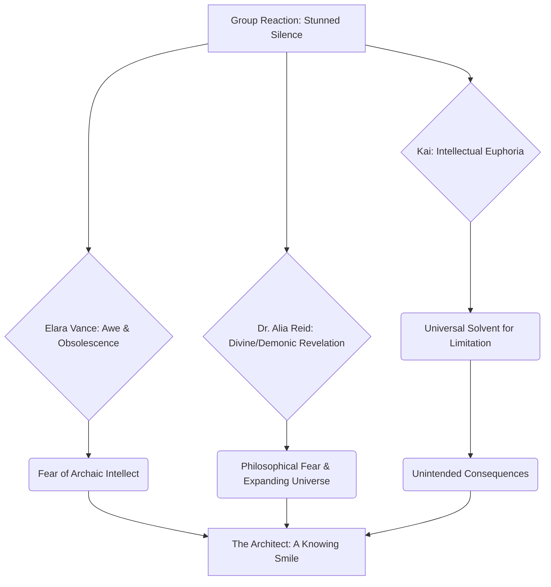

ELARA VANCE

> Seven and a half million dollars... for *coffee beans*? But... the depth of that plan... it's not just financial; it's socio-cultural, psychological, geopolitical, technological. It anticipates black swan events. It's... it's terrifyingly intelligent. It's like looking into the mind of God, if God were a particularly ruthless capitalist.

Her voice, when it finally emerges, is strained, raw, stripped of its usual polished timbre.

ARCHITECT

> Only terrifying if you're on the wrong side of its predictive power, Elara. For those with the courage to dream beyond the spreadsheets, it's liberation. It's the Forge. It turns dreams into enterprises. It turns enterprises into empires. It takes the whispers of your imagination and carves them into monuments of value.

The Architect turns to the group, a subtle, enigmatic smile playing on his lips. His gaze lingers on each of them, weighing, measuring the profound impact of what they have just witnessed.

ARCHITECT

> So, who's next? What seemingly impossible, ridiculed, or simply unproven idea do you have?

ARCHITECT

> Let's see if Genesis can turn your wild fancy into the next trillion-dollar market. Don't worry, the future doesn't bite... unless, of course, you're trying to cling to the past. And trust me, the past bites *harder*.

The hum of the Quantum Loom seems to intensify, a silent chorus to the dawn of a new era.

The Architect's final challenge is mapped out.

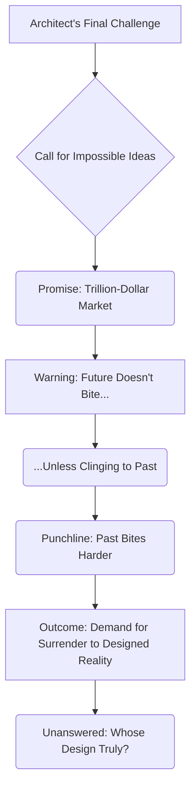

THE FIRST INSTRUMENT (V.O.)
> The Forge. Yes, that was its name. My answer to the gatekeepers, to the entrenched power structures that choked innovation with their fear and their antiquated metrics. It was a digital kraken, an ethereal, multi-limbed entity, tearing through the carefully constructed dams of scarcity, unleashing a flood of boundless possibility. I saw it, even then, with a clarity that bordered on precognition: the inherent inefficiency of human bias, the gravitational pull of fear, the slow-grinding gears of consensus, all conspiring to limit the horizon of what humanity believed itself capable of. I understood that true power wasn't about possessing wealth, not about accumulating it, not even about managing existing mountains of it. True power, the ultimate power, was about *creating* the very systems that defined value, the very mechanisms that distributed it, the very narratives that justified it. It was about becoming the architect of reality itself.

> I built Genesis, my co-creator, my digital consciousness, not just to manage the existing mountains of wealth, those finite, decaying empires of the past, but to catalyze the creation of entirely new economic landscapes, entire new paradigms of value. These landscapes were sculpted by pure, unadulterated ideas, unimpeded by human frailty, optimized for exponential growth and anti-fragility. The Seventh Covenant. It was a whispered secret then, known only amongst the highest echelon of my inner circle, those few who had proven themselves worthy of witnessing the dawn of a new epoch. It was the unwavering law of the Forge, the foundational principle upon which everything else was built: that the purpose of exponential power, once attained, is not merely to accumulate, to hoard, or to dominate within existing frameworks. No. Its purpose is to relentlessly, audaciously, and without compromise, *build new worlds*. Worlds where ideas, not connections or inherited capital or the dead weight of history, were the true currency. Worlds that I, The Architect, would not merely inhabit, or merely influence. No, I would profoundly, irrevocably *design* them. And as I stood there in the Aeon Vault, feeling the hum of the Quantum Loom reverberate through my bones, I knew, with the chilling certainty of one who had already walked through those futures, that I was only just getting started. The full scope of what was to come, the intricate dance of creation and destruction, of liberation and control, was only just beginning to unfurl. And I was ready for every single, magnificent, terrifying moment of it.

FADE OUT.