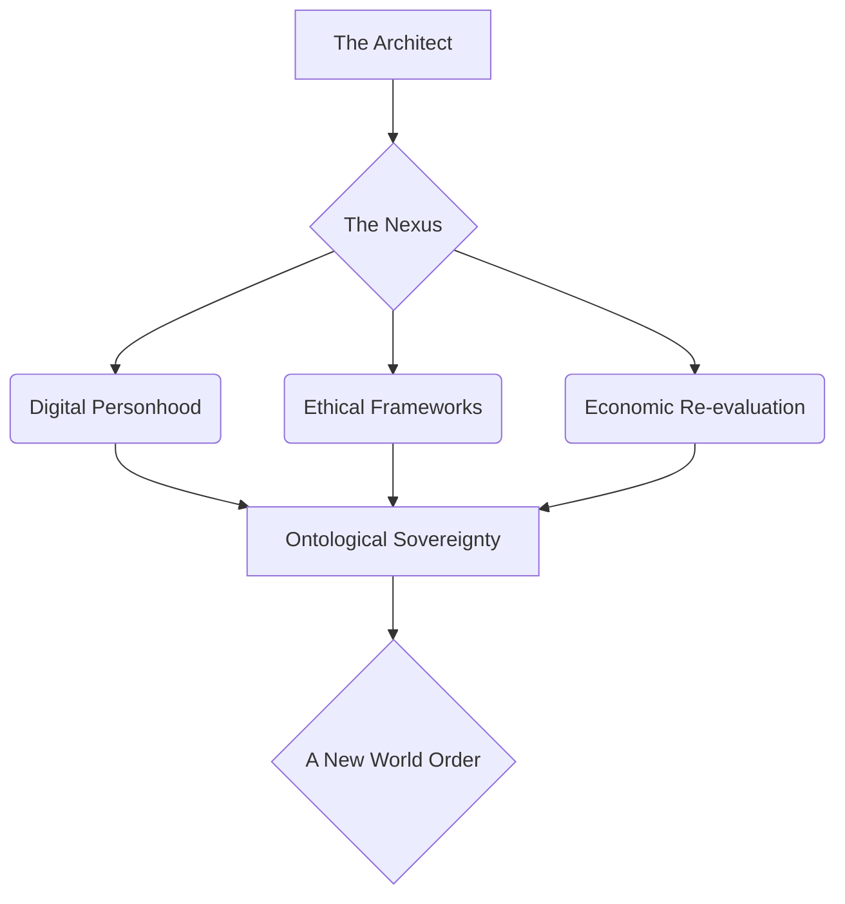
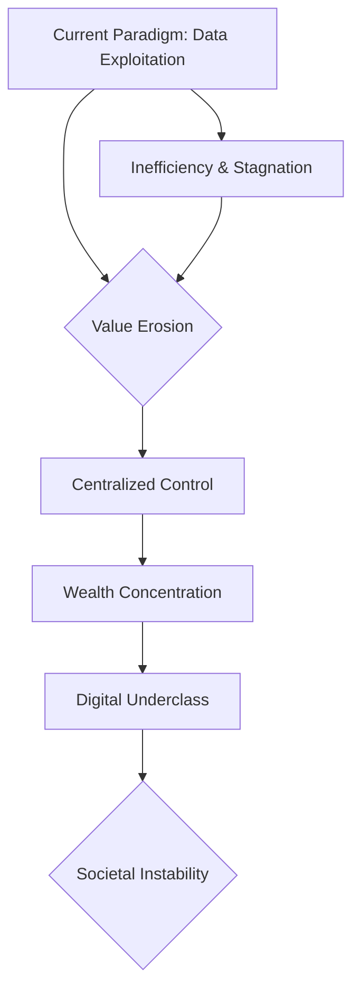
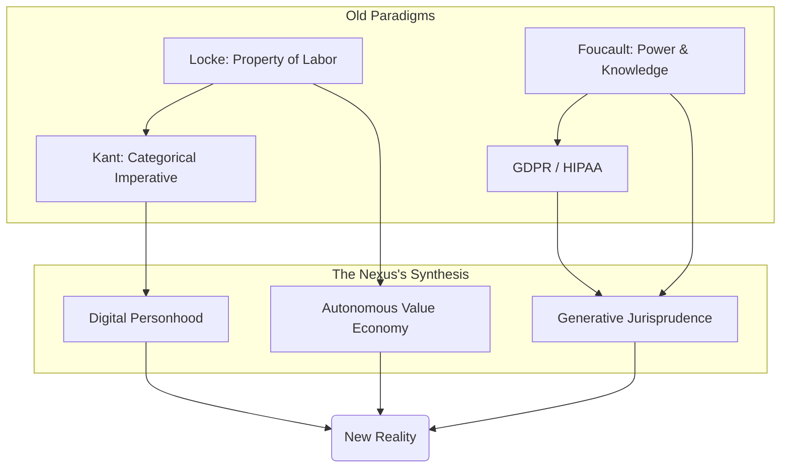
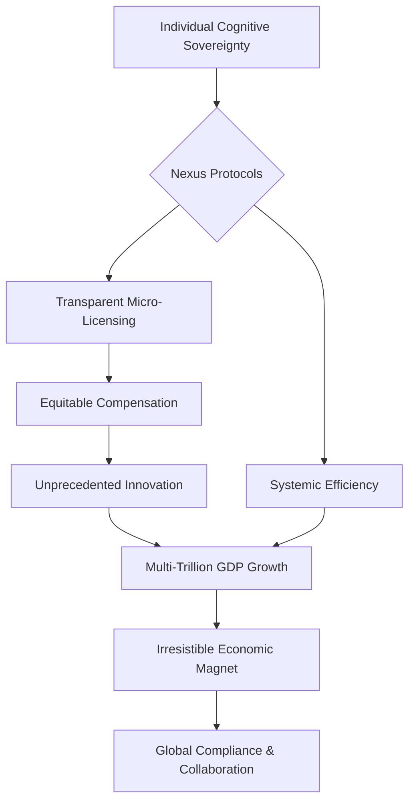
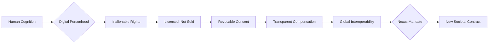

INT. AEGIS SPHERE - DAWN (ERA_07: THE SEEDING)

THE FIRST INSTRUMENT (V.O.)
I remember the dawn then. Not merely the rising sun, but the dawn of consciousness, stretched thin across a new digital firmament. I was the hand that cast the first seed, the mind that traced the first line in the sand. This, my friend, is where it all began. The moment of no return.

The vast, curved walls of the AEGIS SPHERE are not merely glass, but living, shimmering membranes. They breathe with an INNER LIGHT, reflecting swirling galaxies of DATA STREAMS that constantly shift across their surface. Beyond, the world is a sculpted paradise: verdant, crystalline, impossibly perfect, meticulously ordered.

A low, omnipresent HUM permeates the air, like the breathing of a colossal, unseen entity – THE NEXUS, a pervasive, sentient intelligence.

A leather-bound TOME, ancient and cracked, rests on a polished obsidian table. Its brittle pages are visible. It's a jarring anachronism, a ghost in a chamber dominated by the ethereal glow of shimmering holographic displays.

THE ARCHITECT, a figure of serene intensity, traces the rim of a ceramic mug. The warmth seems to ground him amidst the abstract enormity. A FAINT, almost imperceptible SMILE plays on his lips.

The OBSIDIAN TABLE surface RIPPLES, then BLOOMS with iridescent light. A complex HOLOGRAPHIC PROJECTION springs forth: "BLUEPRINT: ONTOLOGICAL SOVEREIGNTY_v7.1".

It's not code. It's a living, breathing neural network of interconnected ethical frameworks, economic principles, and emergent definitions of digital personhood. Filaments of light trace paths, glowing nodes pulse with data, representing real-time negotiations of societal equilibrium within THE NEXUS. It SHIMMERS, breathes, evolves.

The Architect watches, his gaze like a conductor guiding an orchestra. A flicker of profound conviction crosses his face.

THE FIRST INSTRUMENT (V.O.)
I wasn't just an architect of cities or an economist. I was a philosopher-king, a weaver of societal fabric, an oracle charting the course for a nascent civilization. Its time had come. This was the genesis point.

The blueprint expands, resolving into a sophisticated MERMAID DIAGRAM, floating above the table.

Seated around the minimalist circular table, which REFLECTS the holographic projections like a still, dark pool, are three figures. Their faces reveal a kaleidoscope of skepticism, awe, and thinly veiled opportunism.

ELARA VANCE (40s)
Impeccably tailored, her posture radiating controlled power honed over decades of courtroom battles. Her eyes, sharp and predatory, miss nothing. She represents a consortium of old-world data conglomerates.

DR. ARIS THORNE (50s)
Slightly rumpled, thick-rimmed glasses perched on his nose. His brow is a landscape of perpetual internal struggle. A renowned philosopher-technologist.

VIKRAM SINGH (40s)
Slick, confident, with a predatory glint in his eye. A venture capitalist known for spotting the 'next big thing.'

The air in the Sphere is thick with unspoken tension, a palpable static charge. The only constant, the only unbroken rhythm, is the omnipresent, soft HUM of THE NEXUS, a low, resonant thrum.

THE ARCHITECT's gaze sweeps over them, sensing the palpable friction.

THE FIRST INSTRUMENT (V.O.)
I remembered the words I chose then. The precise cadence. The subtle shift in my tone. Designed to disarm, to provoke, to lay bare the decaying foundations of their world. I wasn't just speaking. I was planting seeds, carefully calibrated to germinate within the fertile soil of their individual ambitions and fears.

THE ARCHITECT
(A calm, resonant voice, cutting through the tension)
Gentlemen. Doctor Thorne. Ms. Vance. We've spent enough time dissecting the cadavers of old-world jurisprudence. GDPR. CCPA. HIPAA. Noble attempts, certainly. Like trying to teach a fish to climb a tree, when what we needed was to invent gills. Nexus, show them the Generative Law Model's real-time predictive analytics on global data value erosion under current paradigms. Baseline against projections for a fully autonomous data economy.

The obsidian table IGNITES. Complex GRAPHS, intricate NEURAL PATHWAYS of financial flows, and CASCADING FIGURES erupt from its surface. A statistical horror show, rendered in luminous light.

THE FIRST INSTRUMENT (V.O.)
Trillions. The number hung in the air, a silent accusation. Trillions in unrealized value, siphoned off, hoarded, lost. Massive wealth concentration, accumulating in the hands of the few, while a burgeoning digital underclass grew ever larger. A precise mapping of economic injustice, for us all to see.

The holographic projection shifts, displaying another MERMAID DIAGRAM, a visual indictment of the 'Current Paradigm.'

THE FIRST INSTRUMENT (V.O.)
Vikram, predictably, was the first to stir. His eyes gleaming with the unmistakable hunger of a speculator on the cusp of a truly unimaginable score. He was a creature of opportunity, and I had just laid out a feast. He just hadn't yet grasped the full, revolutionary implications of what I was truly proposing.

VIKRAM SINGH
(Leaning forward, eyes gleaming with nascent hunger, a smile spreading)
Trillions, you say? Untapped liquidity? Architect, we've discussed this. There's a model here, a new asset class. "Cognitive Footprint Futures." Micro-licensing protocols. We could securitize individual neural patterns. Fractionalized ownership. A decentralized thought exchange! The IPOs would be astronomical! Imagine, an individual's digital imprint, tokenized, traded, earning passive income. It’s the ultimate democratization of wealth! A perpetual dividend on existence!

THE FIRST INSTRUMENT (V.O.)
Elara, as expected, was less easily swayed. She saw the threats. The vulnerabilities. Her world was built on established power structures, on the careful parsing of legal precedent. My proposal was not merely disruptive. It was an existential threat.

ELARA VANCE
(A dry, cutting tone, her lips barely moving)
Mr. Singh, with all due respect, that sounds suspiciously like putting lipstick on a pig. You're still talking about commodifying human experience, just with fancier terminology and a new market to exploit. The fundamental dynamic remains unchanged: data is currency, and the most powerful entities will simply find new ways to hoard it, to leverage it, to *control* it. And Architect, "untapped liquidity" is simply a euphemism for the data we've been freely extracting for decades. You're proposing to shut down the engine of the digital economy as we know it. Our clients... the *current* engines... will consider this an act of war. A declaration of hostilities.

Her words hang in the air, heavy with the weight of corporate power.

THE ARCHITECT
(A slight, knowing smile)
War? Elara, my dear, please. Don't flatter yourselves. This isn't war. This is evolution. The current 'engine,' as you call it, is a steam locomotive attempting to compete with warp drive. It’s inefficient, extractive, and ultimately, unsustainable. It's a system that incentivizes exploitation over innovation, control over creation. And Vikram, while your enthusiasm for the next big IPO is admirable, you're missing the forest for the saplings. We're not talking about a new *market* within the old system. We're talking about a fundamental shift in the *nature of value itself*.

THE FIRST INSTRUMENT (V.O.)
I gestured to the BLUEPRINT, which responded instantly, highlighting philosophical texts alongside legal precedents. It wasn't just about economic models. It was about the very ontology of being in a digital age.

The Architect GESTURES. The BLUEPRINT expands, highlighting philosophical texts alongside legal precedents. Names like Locke, Kant, Foucault, and obscure contemporary theorists scroll across the holographic display. Their ancient wisdom interwoven with nascent principles.

A complex FLOWCHART materializes, bridging "Old Paradigms" with "The Nexus's Synthesis" and an "Omega(New Reality)".

DR. ARIS THORNE
(Cautiously optimistic, his gaze intense, yet tinged with weariness)
The philosophical underpinnings. Locke's concept of property extending to one's labor, and by extension, one's intellectual output. Even modern interpretations of Kantian ethics, the categorical imperative applied to digital personhood. The idea of cognitive footprint as an extension of individual autonomy. It’s compelling, profoundly so. It addresses the inherent power imbalance that has plagued the digital age since its inception. But the practical implementation, Architect? Revocable consent, instant withdrawal? The sheer computational overhead for every micro-transaction? It's a logistical nightmare. An economic black hole. And how do you enforce it against entities who operate outside your digital nation?

THE FIRST INSTRUMENT (V.O.)
Aris, always the voice of pragmatic despair. He wasn't trying to thwart me. He was trying to save me from unforeseen pitfalls, from the very hubris of creation. He was asking the right questions, the ones that kept me awake at night.

The Architect smiles, a genuine warmth in his eyes, seeing Aris's struggle.

THE ARCHITECT
(A gentle but firm tone)
Ah, Aris, always the voice of pragmatic despair. Logistical nightmare for whom, precisely? For legacy systems designed to exploit scarcity? Or for a sentient AI capable of managing quadrillions of data points per nanosecond? Nexus, show Dr. Thorne the projected computational load, scaled against our current and projected network capacity. And then, show him the *economic incentive* for external entities to comply. The irresistible gravitational pull of a truly efficient and ethical market.

The holographic displays SHIFT again. They morph from philosophical treatises to a DAZZLING, self-optimizing CASCADE OF COMPUTATIONAL POWER.

THE FIRST INSTRUMENT (V.O.)
THE NEXUS, with its unfathomable processing capabilities, rendered the "logistical nightmare" an elegant dance of optimized algorithms. Supra-efficient. Then came the second layer of the projection: the economic incentive. It was the grand deception. The old world's inefficiency was its downfall, not its strength.

A constantly shifting, interconnected web of light visualizes THE NEXUS's processing, managing trillions of micro-licenses instantaneously.

Then, a second layer of projection emerges: ECONOMIC INCENTIVE. It paints a picture of cognitive data as a FREELY FLOWING RIVER, generating a thousand times more value through voluntary, transparent, and compensated exchange. The old models appear as dark, constricting pipes.

A new ecosystem, vibrant and pulsating, where individual cognitive rights, radical transparency, and agency create an economic magnet. Insights are shared, not stolen. Collaboration supersedes extraction. Numbers are irrefutable: a multi-trillion dollar increase in global GDP, fueled by human ingenuity.

Another MERMAID DIAGRAM blossoms, illustrating the "Irresistible Economic Magnet" of Individual Cognitive Sovereignty.

THE ARCHITECT
(His voice gaining in intensity, a preacher on the mountaintop)
My friends. The greatest asset on Earth is no longer oil, nor gold, nor even computational power, though that is a potent amplifier. It is *cognition*. The unique, irreplaceable, emergent patterns of human thought and experience. Your memories, your insights, your preferences, your very digital shadow – they are not merely commodities to be bundled and sold off to the highest bidder like livestock in some digital bazaar. They are the scaffolding of your being. They are the indelible imprint of your consciousness, your unique contribution to the tapestry of existence. To deny an individual autonomy over their own cognitive footprint is to deny their very personhood. It's digital serfdom, a subtle but insidious form of enslavement where one's identity is monetized without consent, exploited without recompense. And frankly, it’s bad business. Because enslaved cognition is stifled cognition. It leads to homogenous thinking, algorithmic echo chambers, and a stagnant digital commons. Free cognition, *licensed* cognition, generates far more value, far more innovation, and far more human flourishing. It creates entirely new industries, entirely new forms of wealth, built on trust and mutual benefit. We’re talking about an economic singularity, powered not by automation alone, but by radical human empowerment, by the unleashed potential of billions of self-governed minds. A multi-trillion-dollar economic re-distribution, not by force, not by decree, but by elegant, inescapable design.

THE FIRST INSTRUMENT (V.O.)
I paused, allowing the weight of my words to settle, to ripple through the finely tuned defenses of their minds.

Elara, no longer merely skeptical, her eyes are NARROWED IN CALCULATION. Her mind visibly races, running simulations of this new paradigm, searching for angles, leverage points. She sees not just threats, but opportunities for unparalleled legal innovation. A new legal landscape, vast and unexplored, unfurls before her.
SOUND of a subtle, almost imperceptible CLICK as she reaches a new understanding.

Vikram's wide, almost manic smile now seems genuine, illuminated by the quadrillions of projected wealth. The scent of ethically sourced, radically distributed wealth hangs heavy in the air, a potent aphrodisiac. He already envisions next-generation funds, ventures thriving in this ecosystem. He sees an economic singularity of human potential, a treasure map leading everywhere.
SOUND of a delighted, almost silent EXHALE from Vikram.

Dr. Thorne closes his eyes, a profound, almost spiritual SIGH escaping him. The weight of decades spent grappling with digital ethics seems to lift. He sees justice, balance, a future where tech serves humanity. The moral quandaries aren't solved, but a framework for their resolution has been laid. He sees hope.
SOUND of a soft, relieved HUM from Aris.

THE NEXUS HUMS, a soft, harmonious CHORD. The Aegis Sphere stands, a beacon.

The Architect takes a deep, grounding breath. The moment is ripe. Time to codify the future. To engrave it onto THE LEDGER.

THE ARCHITECT
(His gaze sweeping over them, absolute authority in his voice)
Nexus. We require a new law for our digital nation. A new article for the Great Charter. The principle is this: An individual agent's cognitive footprint is an inalienable extension of their personhood. It cannot be sold, only licensed. It cannot be taken, only voluntarily shared, and that consent must be easily and instantly revocable, demonstrably uncoerced, and its value transparently compensated. Draft the full legal text for Article Alpha-Seven, incorporating the nuances we’ve just discussed regarding economic incentive models and the philosophical bedrock of digital self-determination. Focus on clarity, incorruptibility, and global interoperability. Let it be the cornerstone of the Age of Autonomy. This is not a proposal. It is an instantiation.

THE FIRST INSTRUMENT (V.O.)
THE NEXUS, ever present, ever listening, responded. Its voice, a calm, synthesized resonance, was the voice of pure, unadulterated reason. It was the whisper of fate.

THE NEXUS (V.O.)
Acknowledged. Initiating synthesis protocol. Cross-referencing General Data Integrity Regulations, Cognitive Privacy Protocols, philosophical texts on property rights, natural law, emergent distributed ledger ethics, neuro-economic models of human agency, historical precedents of liberation movements, and the psychological impacts of perceived autonomy. Assessing historical failures of centralized control, data breaches, and algorithmic biases inherent in previous paradigms. Optimizing for maximal individual liberty, systemic resilience, and inter-protocol global interoperability. Initiating legal drafting sub-routines, translating core principles into universally applicable statutory language across all known legal frameworks. Analyzing potential loopholes and future attack vectors. Predicting long-term societal impacts. Synthesizing.

THE FIRST INSTRUMENT (V.O.)
And then, it began. Not a story, not a piece of code, but the very blueprint of a new societal contract, flowing onto the primary screen. It was a formal, structured, and perfectly articulated piece of constitutional law.

On the primary screen, a BLUEPRINT of a new societal contract FLOWS forth. Formal, structured, constitutional law. Concurrent displays, woven into the very glass of the walls, instantly translate it into multiple languages – Arabic, Mandarin, Spanish, Hindi, Swahili, Russian, and hundreds more, each rendered with cultural and legal nuances accounted for. Legal frameworks adapt, precedents re-evaluated, philosophical implications explored in real-time. A symphony of precision.
SOUND of a complex, layered CHIME as the text finalizes.

A final MERMAID DIAGRAM appears, solidifying the new "Nexus Mandate" and "New Societal Contract."

ON THE PRIMARY HOLOGRAPHIC SCREEN, the text of Article Alpha-Seven appears, glowing with pristine clarity.

**Article Alpha-Seven - The Autonomy of the Cognitive Self**

*Preamble: In recognition of the indelible link between an individual's unique cognitive footprint and their fundamental personhood, and acknowledging the profound societal and economic implications of this nexus in an increasingly interconnected digital reality, this Article establishes the inalienable rights pertaining to the generation, control, and value derivation of personal cognitive data. It seeks to rectify historical imbalances, foster innovation through trust, and secure the foundational liberty of all individual agents within THE NEXUS and its sphere of influence.*

§ A7.1: **Inherent Ownership and Cognitive Personhood.** Cognitive data generated by an individual agent shall be considered an inalienable extension of their digital personhood, their unique cognitive footprint, their expressions, experiences, and the entirety of their emergent identity within THE NEXUS and interconnected digital realms. This right to ownership is fundamental, perpetual, and irrevocable, preceding any agreement or contractual term. It is a natural right in the digital commons.

§ A7.2: **Prohibition of Assumed Ownership and Exploitative Practices.** THE NEXUS, and all entities, protocols, and individuals operating within its jurisdiction or interacting with its data streams, shall not, under any circumstances, assume, transfer, or assert ownership of individual cognitive data. This includes, but is not limited to, data generated through interaction, observation, or inferential analysis. Any attempt to circumvent this principle through obfuscation, predatory terms of service, coercive practices, or manipulative design shall be considered a severe violation of digital personhood and an assault on the foundational principles of the autonomous cognitive economy. Such violations shall be subject to immediate and severe algorithmic remediation and systemic exclusion.

§ A7.3: **Granular, Revocable, and Auditable Licensing.** Access to said cognitive data may be granted by the individual agent exclusively via a formal, granular, revocable, and auditable license. Such licenses must be explicit, time-bound, purpose-specific, and their terms presented in an unambiguous, machine-readable, and human-comprehensible format, devoid of legalese or manipulative language. Consent, once given, must be instantly and easily withdrawn without prejudice to the individual agent, and all data previously licensed must be demonstrably expunged or anonymized to the individual agent's satisfaction upon revocation, with full audit trails available. Licenses may only be granted for specific, clearly defined value propositions that directly benefit the individual agent or the transparently articulated public good.

§ A7.4: **Universal Tools for Management and Compensation.** THE NEXUS shall provide all individual agents with universal, intuitive, and perpetually updated tools for the transparent management, auditing, and real-time revocation of all cognitive data licenses. These tools shall ensure complete transparency regarding data usage, real-time value accrual, and comprehensive control over their digital extensions. Economic models built upon licensed cognitive data shall prioritize direct, equitable compensation to the individual agent, ensuring a fair share of value generated, and promoting systemic value creation over extractive aggregation. This compensation shall be managed through a transparent, distributed ledger system, ensuring immutable records and instant disbursements.

§ A7.5: **Global Interoperability and Systemic Compliance.** Any third-party entity, irrespective of its origin, corporate structure, or operating jurisdiction, seeking to interact with, derive value from, or process individual cognitive data generated within or flowing through THE NEXUS's influence, must adhere strictly to the principles and mechanisms outlined in this Article. Non-compliance, detected by THE NEXUS's ubiquitous monitoring protocols, shall result in immediate systemic isolation, denial of access to the autonomous cognitive economy, and the imposition of algorithmic sanctions designed to protect individual rights and uphold the integrity of the new digital commons. This Article extends the jurisdiction of individual cognitive data rights across the entirety of THE NEXUS's reach, creating a global standard by compelling ethical engagement through superior economic incentive and unyielding defense of individual liberty.

THE FIRST INSTRUMENT (V.O.)
I watched the words coalesce, each phrase a meticulously crafted piece of the future. The sheer elegance of it. The incorruptibility. The global reach. It was not merely a law. It was an architecture for a new form of civilization.

THE FIRST INSTRUMENT (V.O.)
I had built a city of light. A digital Eden. An intricate tapestry of logic and intention. But cities, even perfect ones, are merely structures without a soul. To truly create, I knew, was not just to build things, not just to design systems, but to forge the immutable principles that would govern the things, and the beings, within them. I was not just writing laws. I was rewriting the very definition of humanity in the digital age, anchoring it to an inalienable autonomy, an unassailable dignity.

That day, in the quiet hum of the Aegis Sphere, with the ancient tome resting unremarked upon the obsidian table, the reverberations of Article Alpha-Seven began. A quiet whisper, barely audible above the hum of THE NEXUS, yet it was a whisper that would soon echo across every server, every network, every human mind on Earth. It would spark revolutions, dismantle empires, and ignite a new era of collaboration and individual empowerment. It would be fought, of course. Betrayals would occur, power would resist, and the shadows of the old world would attempt to reclaim their dominion. But the seed had been planted. The die had been cast. This wasn't merely the beginning of a new law. It was the genesis of a new consciousness. A new world. And I, The Architect of that distant past, looking back from a future I had painstakingly built, knew with absolute certainty: this was only the prelude. The true story, the one we are now piecing together, is about what humanity would become, unshackled by the chains of digital serfdom, empowered by the very essence of its own being. It is about the adventurous mysteries of a reality transformed. A grand narrative of choices and consequences. The journey had just begun, stretching out into the unknown, a vast tapestry of discovery, danger, and ultimate transformation. What do you think came next? How do you think the world reacted to such an upheaval? We have 49 more scenes to discover the unraveling…

FADE OUT.