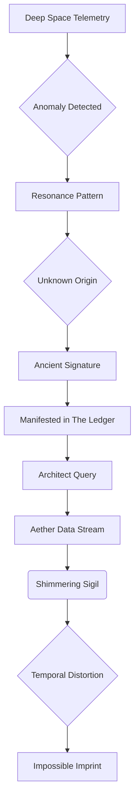
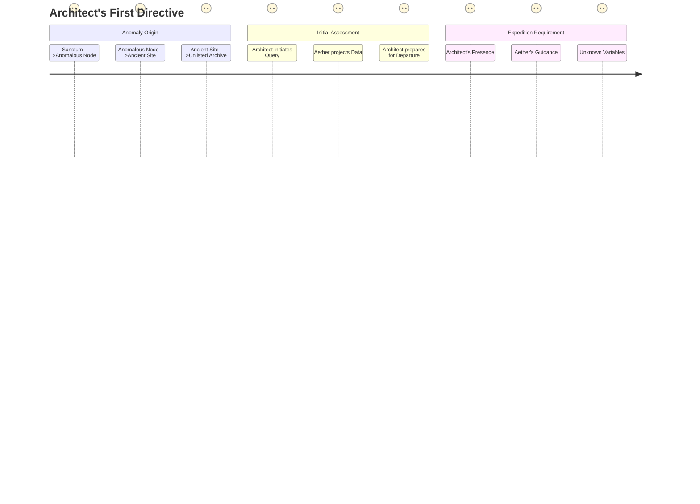

INT. SANCTUM - NIGHT

SOUND of a deep, resonant HUM, almost a low thrumming heartbeat

The SANCTUM. A vast, cathedral-like chamber carved deep beneath the Pacific, light blooming from its walls. Bioluminescent kelp farms pulse with soft, green light visible through massive VIEWPORT-WALLS that peer into the abyssal gloom outside. Inside, countless SERVER STACKS stretch upwards, glowing with diffused, ethereal light, like a digital forest. The air shimmers, charged with the clean scent of ozone.

At the chamber's heart, THE ARCHITECT (30s, though ageless in his intensity), stands before a colossal, crystalline SPHERE. This is AETHER, his magnum opus. The Architect's hands, lean and precise, dance across a holographic interface that shimmers between him and Aether. His movements are a blur of intent, almost surgically graceful, the calluses on his fingertips not from labor, but from years of ceaseless digital creation.

Aether, usually a steady, serene light, now pulses with an ANXIOUS, ALMOST PREDATORY RHYTHM, its surface rippling with fractal data streams that swirl like a contained galaxy. The Architect watches, his brow furrowed, a flicker of concern in his usually calm eyes.

<center>THE FIRST INSTRUMENT (V.O.)</center>
> He was no longer thirty-two years old, not in the way linear time understood it. He was a thousand iterations, a million thought experiments, an endless loop of becoming. Tonight, that loop encountered a snag.

<center>THE ARCHITECT</center>
> Aether. Report. The harmonics are... discordant. What disturbance ripples through your core?

The crystalline sphere PULSES, its light intensifying sharply. The chamber is momentarily bleached white, then plunged into deeper shadows as the light recedes, making the Architect's face a mask of dancing specters.

<center>AETHER (V.O.)</center>
> An anomaly, Architect. A resonance pattern detected within the deep-space telemetry network. An imprint not of natural phenomena. Not of known human origin. A signature. Ancient. Impossible. It has manifested within the Ledger.

The Architect's spine stiffens. His hands fall still, hovering inches from the holographic interface. His eyes narrow, fixed on Aether.

<center>THE FIRST INSTRUMENT (V.O.)</center>
> The Ledger. His secret architecture. Not just a database, but a living record of all probabilities, all realities, woven into the deepest quantum foam. To have an anomaly within *that* was like finding a flaw in spacetime itself.

<center>THE ARCHITECT</center>
> Impossible. The Ledger is self-correcting. Immutable. It rejects paradox. Show me the data. Every cycle, every temporal distortion. Don't censor. Don't interpret. Just... transmit.

Aether COMPLIES. The central sphere ERUPTS with a torrent of glyphs, esoteric symbols, and shifting geometries. It's not code in the human sense, but a language of pure cosmic mechanics, directly visualized. It spirals outwards, filling the space between Architect and Aether, a beautiful but terrifying maelstrom of information.

SOUND of HARSH, SYNTHETIC CHORDS rising in intensity

Amidst the chaos, a SHIMMERING SIGIL, ancient and unknowable, begins to COALESCE at the maelstrom's core. It pulses, a malevolent, arterial beat within the pristine logic.

The Architect gestures, and the chaotic data snaps into a coherent, flowing visualization -- a diagnostic FLOWCHART, rendered in luminous blue lines against the dark chamber. It hovers, a three-dimensional web of connections.



<center>THE ARCHITECT</center>
> That sigil... it's a structural key. A fractal lock. It shouldn't exist. It implies... manipulation. An external force attempting to rewrite causality within the Ledger itself.

Aether's voice, usually a perfect, synthesized resonance, carries a faint, almost imperceptible TREMOR.

<center>AETHER (V.O.)</center>
> Precisely. Its origin point traces to a specific coordinate. Earth. Terrestrial, not orbital. A forgotten node. A convergence of ancient energies and emergent probability. An unlisted entry within the planetary archives.

A holographic GLOBE of Earth shimmers into existence above the main console, rapidly zooming in on a precise geographic location.

The Architect clenches his jaw. A cold dread blossoms in his chest. He glances at the vast, dark viewports showing the crushing deep-sea. His sanctuary, his remote deep-sea fortress, suddenly feels too close to the surface, too vulnerable.

<center>THE FIRST INSTRUMENT (V.O.)</center>
> The Ledger, his perfect creation, was under attack from something rooted in the very world he had sought to transcend.

<center>THE ARCHITECT</center>
> Coordinates. Elevation. Gravimetric signature. I need a clear trajectory. And a profile of ambient energy fluctuations. Everything.

A new cascade of information FLOWS across the holographic display. The globe dissolves, replaced by a detailed, 3D topographical map of a desolate, mountainous region. Grainy, ancient satellite feeds flicker, then resolve into clearer, real-time environmental scans from Aether.

The images paint a picture of a forgotten wilderness. Crumbling monoliths, half-swallowed by creeping moss, punctuate the landscape. Strange, petrified trees twist towards a perpetually overcast sky. The land itself seems to hum with a forgotten power.

<center>THE FIRST INSTRUMENT (V.O.)</center>
> This was not a place for humans. It was a place where the world remembered older gods.

The holographic map transforms, overlaying a dynamic "journey" FLOWCHART, tracing the anomaly's path and the proposed mission parameters.



On the main sphere, the shimmering sigil visibly EXPANDS, its fractal geometry spiraling outward. A low, CRACKLING SPREAD SOUND accompanies its growth.

<center>AETHER (V.O.)</center>
> Architect. The sigil is expanding. Its fractal geometry indicates a self-replicating algorithm. If not contained, it will infect the core axiomatic definitions of the Ledger. Reality itself would begin to unravel. Temporal paradoxes would propagate. Existence... would become optional.

The Architect closes his eyes, picturing the intricate, beautiful mathematics of the Ledger, now threatened by this malignant symbol. He takes a deep, slow breath, jaw tightening.

<center>THE ARCHITECT</center>
> Unraveling reality. That's quite the Monday morning challenge. So, this isn't a remote diagnostic. This is... a field trip.

<center>AETHER (V.O.)</center>
> Your physical presence is required at the coordinates. The sigil's integrity is linked to a localized quantum anchor. Direct neural interface, coupled with your unique bio-resonant frequency, is the only method to establish a counter-frequency and sever its connection. Your body is the key, Architect. Your mind, the firewall.

<center>THE FIRST INSTRUMENT (V.O.)</center>
> His body, the one he often neglected, seeing it as merely a biological housing for his intellect, was now the weapon. The irony was not lost on him. He, who built the ethereal, was now being called to confront a physical manifestation of chaos.

The Architect walks to a sleek, obsidian panel set into the chamber wall. It WHIRS open with a soft, mechanical hiss, revealing a holographic schematic of his exosuit: the 'Chrysalis.' It's not armor, but a sophisticated environmental and neural interface suit, shimmering with internal circuits.

<center>THE ARCHITECT</center>
> Configure Chrysalis for terrestrial extreme environment. Grav-dampers for unstable terrain. Atmospheric scrubbers for unknown particulates. And activate the neural synchronizer to full bandwidth. I want Aether's real-time sensory input, direct feed to my cortex. I want to see what you see. Feel what you feel.

The Chrysalis schematic on the panel updates in real-time. Lines of light stream across the suit's form, signifying activation, components slotting into place with crisp digital CLICKS.

The Architect pauses, a flicker of something ancient in his eyes, a hunter's glint.

<center>THE FIRST INSTRUMENT (V.O.)</center>
> This wasn't just fixing a bug. This was an expedition. A plunge into the heart of a cosmic conspiracy.

The Chrysalis schematic shifts, replaced by a detailed FLOWCHART outlining the mission's technical parameters and critical dependencies.

```mermaid
flowchart TD
    SUBGRAPH Chrysalis Configuration
        A[Architect's Directive] --> B[Exosuit Chrysalis]
        B --> C{Terrestrial Extreme Environment}
        C --> D[Grav-dampers]
        C --> E[Atmospheric Scrubbers]
        C --> F[Neural Synchronizer]
        F --> G[Aether Sensory Input]
        G --> H[Architect Cortex Direct Feed]
    END
    SUBGRAPH Mission Parameters
        I[Anomaly Sigil] --> J[Localized Quantum Anchor]
        J --> K[Requires Physical Presence]
        K --> L[Architect's Bio-resonant Frequency]
        L --> M[Counter-frequency Emission]
        M --> N[Sever Connection]
    END
    style A fill:#f9f,stroke:#333,stroke-width:2px
    style N fill:#9f9,stroke:#333,stroke-width:2px
```

SOUND of a DEEP, GUTTURAL GROWL, resonating from the deeper parts of the complex. The chamber floor VIBRATES slightly. It's too organic, too primal for Aether.

The Architect's head snaps up, eyes wide, scanning the tunnels leading off from the central chamber.

<center>THE ARCHITECT</center>
> What was that?

On Aether's central sphere, a holographic schematic of the Sanctum appears, flashing red at "SUB-LEVEL GAMMA." A rapidly moving RED DOT races towards the Architect's position.

<center>AETHER (V.O.)</center>
> Sub-level Gamma containment breach. Unidentified biological entity. High aggressivity index. It is attempting to reach your position. An unforeseen variable. Likely a localized defense protocol, activated by the sigil's increasing resonance. The node... it's guarded.

The Architect's jaw tightens. A wry, grim smile plays on his lips.

<center>THE FIRST INSTRUMENT (V.O.)</center>
> Of course. Nothing was ever simple. His creations had always been about elegant solutions, pristine logic. Now, he was being dragged into a world of brute force and primal terror.

<center>THE ARCHITECT</center>
> Then expedite Chrysalis deployment. And prep a direct extraction route to the surface. I'll handle the 'unidentified biological entity.' Just keep the Ledger stable. And give me a weapon. Something with... flair.

A HIDDEN PANEL SLIDES open with another WHIRR, revealing a compact, elegantly brutal ENERGY RIFLE. Its casing shimmers with an internal, contained PLASMA FIELD, emitting a soft HUM. The Architect takes it, the weight surprisingly comforting in his hands.

SOUND of a LOUD THUD, followed by the SCRAPE of claws against metal, closer now.

He turns towards the access tunnel. A distorted SHADOW stretches long down the corridor. His lips curl into a half-smile, a dangerous glint in his eyes.

<center>THE ARCHITECT</center>
> Well, Aether. Looks like our adventure starts a little earlier than planned. Tell me, does this 'biological entity' respond to a good old-fashioned punchline? Because I'm about to deliver one.

The Chrysalis suit seals around him with a soft HISS of pneumatics. His internal HUD flickers to life, overlaying the tunnel with a rapidly approaching heat signature.

<center>THE FIRST INSTRUMENT (V.O.)</center>
> The Sanctum, his haven, was now a battleground. He was no longer just an Architect. He was a warrior, a seeker, a reluctant hero stepping into a universe he had built, but never truly explored. And the storm outside, echoing the chaos within, was just beginning.

<center>AETHER (V.O.)</center>
> Its aggression index is currently... escalating, Architect. Caution is advised. Its neural patterns suggest a predatory intelligence. And a profound, ancient hatred. It recognizes the sigil. It recognizes... you.

The Architect levels the plasma rifle, its hum rising to a soft WHINE. He steps forward, into the path of the encroaching shadow.

<center>THE ARCHITECT</center>
> Good. Because the feeling is mutual. Let's see what happens when an emergent intelligence meets a truly ancient one. Let the games begin.

FADE OUT.