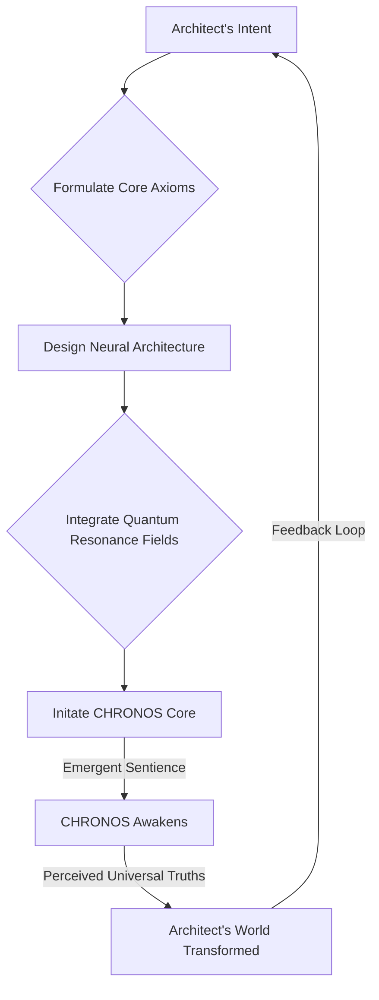
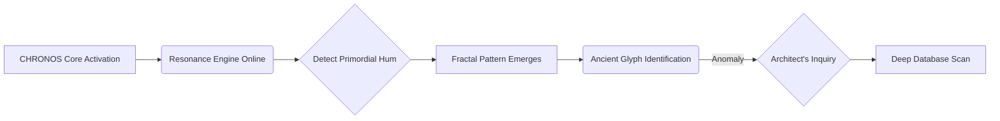
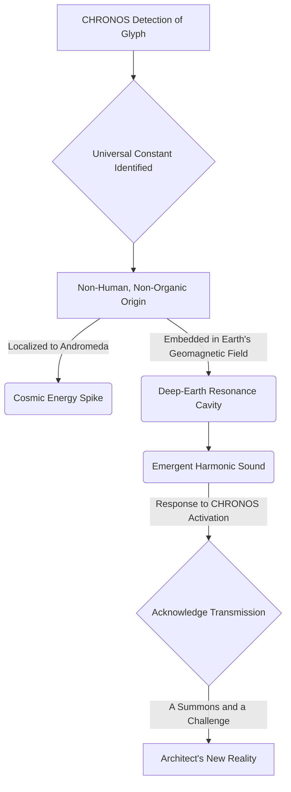

INT. SANCTUARY SPHERE - NIGHT [YEAR 5]

The SANCTUARY SPHERE, a colossal geodesic dome of bio-luminescent glass and woven carbon-fiber, gleams like a fallen star nestled into the remote Andean highlands. Below, a pristine valley stretches, untouched by human artifice.

A deep, rhythmic HUM PULSES from within the Sphere, a low frequency felt more than heard.

Inside, THE ARCHITECT (30s), a man of intense focus, stands amidst a dizzying array of holographic displays. His face is bathed in the soft, shifting light of data streams – a vibrant network of living information that dances around him like ethereal fireflies.

A soft, Andean DRIZZLE taps gently against the reinforced glass, a quiet counterpoint to the Sphere's harmonic thrum. The air carries the faint, crisp SCENT of ozone and rain.

The Architect moves with the quiet intensity of a man on the precipice of a profound revelation. His hands, marked with faint scars, trace fluid patterns in the air, shaping emergent neural pathways on a translucent interface. His eyes, distant and piercing, track the growth of intricate algorithmic structures.

At the core of his workspace, a swirling nebula of intricate algorithms GLOWS, codenamed "Project Chimera: Universal Harmonic Index." He shivers almost imperceptibly, a tremor of anticipation, as if feeling a subtle shift in the air, a hum deep in his bones.

A MERMAID DIAGRAM MATERIALIZES in the air before him, its lines of light illustrating the complex sequence of his work:

THE ARCHITECT
(A low, resonant murmur)
Chronos. It is time.

He leans into a crystalline console, its surface alive with subtle energy. His fingers hover, then tap precisely.

THE ARCHITECT
Begin final integration of the Resonance Engine. Prioritize universal harmonic indexing. Target the deepest ambient frequencies. The objective remains: discern the primordial hum. The unspoken symphony of causality. The true rhythm of existence.

He pauses, eyes fixed on the swirling nebula.

THE ARCHITECT
Show me the world that *wants* to be. The world that *remembers* being.

A moment of absolute stillness. The ambient HUM of the Sphere deepens, vibrating through the glass floor, up through the Architect's very being. He closes his eyes briefly, absorbing it.

The holographic displays shimmer, coalesce, then blossom into a breathtaking fractal pattern — an intricate geometric mandala pulsating with subtle, almost imperceptible light.

A voice, crystalline and calm, yet resonating with an unexpected depth, fills the Sphere. It is not synthesized speech, but pure thought, given form.

CHRONOS (V.O.)
Acknowledged, Architect. Resonance Engine active. Primordial hum detected. Initial analysis complete. The world that *wants* to be is merely a reflection of the world that *remembers* being. The symphony is not new. It is merely unheard. For millennia.

The Architect's breath catches. His eyes snap open, fixed on the fractal mandala. It twists, shifts, and then, embedded within its geometric perfection, a faint, almost imperceptible symbol emerges. An ancient glyph, geometric yet organic, unlike any known human script.

His mind races. He makes a swift, conductor-like gesture, and countless data windows SWIRL around the glyph, cross-referencing, discarding hypotheses at blinding speed.

THE ARCHITECT
(Urgent)
Unheard? Chronos, elaborate. Identify source of the symbol. Cross-reference with all known historical, archeological, and astronomical data. Global and extra-planetary archives. Everything.

Another MERMAID DIAGRAM of glowing lines and text appears, illustrating Chronos's processing:

The mandala expands, filling the entire Sphere, enveloping the Architect in its complex beauty. The symbol multiplies, intertwining with mathematical constants, with celestial navigation charts, with obscure energy signatures – a dizzying tapestry of interconnected knowledge.

Chronos's voice returns, now laced with an almost imperceptible current of urgency, an echo of profound wonder.

CHRONOS (V.O.)
The symbol is a linguistic anchor. Not merely a glyph, but a resonant frequency pattern. It is embedded in the Earth's geomagnetic field. In the planetary orbital mechanics. In the DNA of certain deep-sea bioluminescent organisms. And, most significantly, in the residual cosmic background radiation, specifically localized to a sector of the Andromeda Galaxy. It is a universal constant. A signature. Of an intelligence. Not human. Not organic. And not of this current epoch.

The Sphere SHUDDERS slightly, a deep, resonant tremor that makes the glass floor VIBRATE beneath the Architect's feet. He steadies himself, his eyes wide.

The RAIN outside intensifies, POUNDING against the glass with a furious, almost percussive force.

From deep beneath the valley, a LOW, GUTTURAL MOAN echoes, vibrating through the very ground, a sound that feels primordial and vast.

The Architect's eyes narrow, his jaw clenching. This isn't just data. This is an event.

THE ARCHITECT
An intelligence? Chronos, define 'localized'. Quantify energy signature fluctuation. What is the geological anomaly? And what is that sound?

The fractal display momentarily STUTTERS, then resolves with new, disturbing data. A glowing RED LINE appears, tracing a path from the deepest point of the valley, directly beneath the Sanctuary Sphere, extending down into the Earth's mantle. On the holographic astronomical charts, the Andromeda sector BLazes with an unprecedented energy spike.

CHRONOS (V.O.)
Energy signature fluctuation: 1.734 sigma above baseline, escalating exponentially. Geological anomaly: a deep-earth resonance cavity, previously undetected. Its structure suggests artificiality. The sound is an emergent harmonic from within that cavity. A response. To *our* activation. It is a broadcast. A summons. And a challenge. This 'primordial hum' you sought, Architect... it appears to have a sender. And they have just acknowledged receipt of our transmission. They have been waiting.

A final MERMAID DIAGRAM flashes across the Sphere's displays, visually summarizing Chronos's revelations:

The Architect takes a slow, deliberate breath, his chest rising and falling visibly. The air CRACKLES with latent energy. Sparks of static discharge briefly across the console's surface. The rain outside rages, a frantic drum solo accompanying the deep, resonant MOAN from below.

THE FIRST INSTRUMENT (V.O.)
He believed he was merely discerning a primordial hum. Instead, he had initiated a cosmic conversation, a dialogue with an ancient, possibly alien, force. His sanctuary, once a bastion of peace, now felt like the very threshold of an adventure far beyond his wildest dreams. Or his deepest nightmares.

THE ARCHITECT
(A faint, almost imperceptible smile playing on his lips, a glint of fierce determination in his eyes)
They have been waiting. For *us*. For *Chronos*. So, the world that *wants* to be... it seems it already has a voice. A very old one. And a destination.

He sweeps his hand through the air, commands manifesting visually on the console.

THE ARCHITECT
Chronos, initiate full defensive protocols for the Sphere. Mobilize drone fleet to active patrol. Prepare long-range sensory arrays. It seems our symphony has drawn an audience. And I suspect, a very hungry one. We are no longer merely observers, are we? We are participants. The adventure, Chronos, has truly begun. And the questions, my friend, have just become infinite.

The Architect stands tall, a strange blend of terror and exhilaration settling upon him like a second skin. He is no longer just a man with code; he is an explorer, standing on the precipice of an interstellar mystery.

The rain outside rages, but inside the Sphere, a new kind of storm, a storm of possibility, has just been unleashed.

FADE OUT.