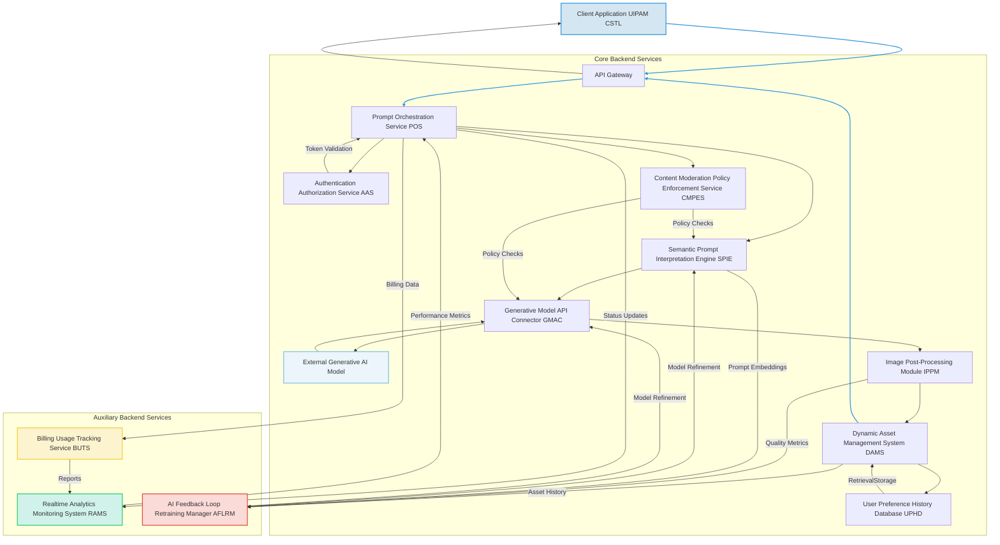
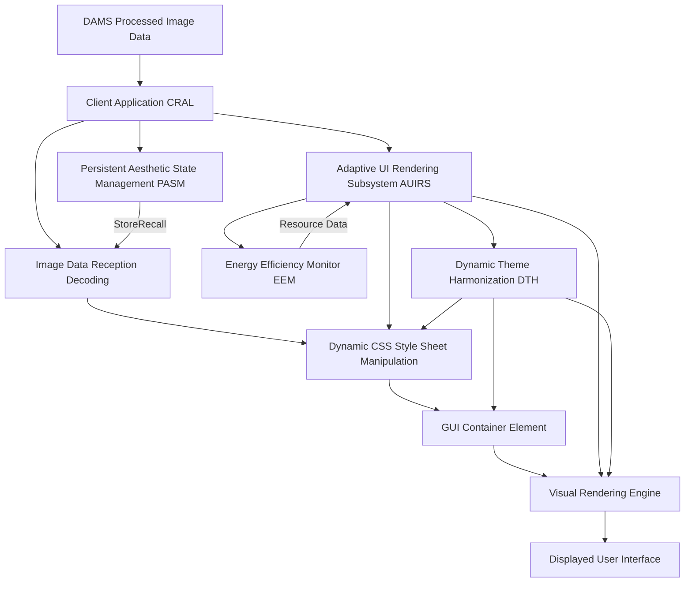

###Comprehensive System and Method for the Ontological Transmutation of Subjective Aesthetic Intent into Dynamic, Persistently Rendered User Interface Backgrounds via Generative AI Architectures

**Abstract:**
A profoundly innovative system and method are herein disclosed for the unprecedented personalization of graphical user interfaces GUIs. This invention fundamentally redefines the paradigm of human-computer interaction by enabling the direct, real-time conversion of nuanced natural language expressions of desired aesthetics or conceptual scenes into novel, high-fidelity visual representations. The system, leveraging state-of-the-art generative artificial intelligence models, orchestrates a seamless pipeline: a user's semantically rich prompt is processed, channeled to a sophisticated generative engine, and the resulting synthetic image is subsequently and adaptively integrated as the foundational background theme for the GUI. This methodology transcends the limitations of conventional static personalization, delivering an infinitely expansive, deeply immersive, and perpetually dynamic user experience that obviates any prerequisite for artistic acumen from the end-user. The intellectual dominion over these principles is unequivocally established.

**Background of the Invention:**
The historical trajectory of graphical user interfaces, while advancing in functional complexity, has remained fundamentally constrained by an anachronistic approach to aesthetic personalization. Prior art systems typically present users with a finite, pre-determined compendium of themes, rigid color palettes, or rudimentary facilities for uploading static, pre-existing images. These conventional methodologies are inherently deficient in dynamic creative synthesis, thereby imposing a significant cognitive burden upon the user. The user is invariably compelled either to possess nascent artistic proficiencies to produce bespoke visuals or to undertake an often-laborious external search for suitable imagery, the latter frequently culminating in copyright infringement or aesthetic compromise. Such a circumscribed framework fundamentally fails to address the innate human proclivity for individual expression and the desire for an exosomatic manifestation of internal subjective states. Consequently, a profound lacuna exists within the domain of human-computer interface design: a critical imperative for an intelligent system capable of autonomously generating unique, contextually rich, and aesthetically resonant interface backgrounds, directly derived from the user's unadulterated textual articulation of a desired mood, scene, or abstract concept. This invention precisely and comprehensively addresses this lacuna, presenting a transformative solution.

**Brief Summary of the Invention:**
The present invention unveils a meticulously engineered system that symbiotically integrates advanced generative image models within an extensible user interface personalization workflow. The core mechanism involves the user's provision of a natural language textual prompt, serving as the semantic seed for visual generation. This system robustly and securely propagates this prompt to a sophisticated AI-powered image generation service, orchestrating the reception of the generated high-fidelity image data. Subsequently, this bespoke visual artifact is adaptively applied as the foundational GUI background. This pioneering approach unlocks an effectively infinite continuum of personalization options, directly translating a user's abstract textual ideation into a tangible, dynamically rendered visual theme. The architectural elegance and operational efficacy of this system render it a singular advancement in the field, representing a foundational patentable innovation. The foundational tenets herein articulated are the exclusive domain of the conceiver.

**Detailed Description of the Invention:**
The disclosed invention comprises a highly sophisticated, multi-tiered architecture designed for the robust and real-time generation and application of personalized GUI backgrounds. The operational flow initiates with user interaction and culminates in the dynamic transformation of the digital aesthetic environment.

**I. User Interaction and Prompt Acquisition Module UIPAM**
The user initiates the personalization process by interacting with a dedicated configuration module seamlessly integrated within the target software application. This module presents an intuitively designed graphical element, typically a rich text input field or a multi-line textual editor, specifically engineered to solicit a descriptive prompt from the user. This prompt constitutes a natural language articulation of the desired visual aesthetic, scene, mood, or abstract concept e.g. "A hyperrealistic ethereal forest at dawn, with luminous bioluminescent flora and a subtle mist, rendered in an Impressionistic style," or "Abstract geometric patterns in shifting opalescent hues, reminiscent of a retro-futuristic synthwave album cover". The UIPAM incorporates:
*   **Semantic Prompt Validation Subsystem SPVS:** Employs linguistic parsing and sentiment analysis to provide real-time feedback on prompt quality, suggest enhancements for improved generative output, and detect potentially inappropriate content. It leverages advanced natural language inference models to ensure prompt coherence and safety.
*   **Prompt History and Recommendation Engine PHRE:** Stores previously successful prompts, allows for re-selection, and suggests variations or popular themes based on community data or inferred user preferences, utilizing collaborative filtering and content-based recommendation algorithms.
*   **Prompt Co-Creation Assistant PCCA:** Integrates a large language model LLM based assistant that can help users refine vague prompts, suggest specific artistic styles, or generate variations based on initial input, ensuring high-quality input for the generative engine. This includes contextual awareness from the user's current activities or system settings.
*   **Visual Feedback Loop VFL:** Provides low-fidelity, near real-time visual previews or abstract representations as the prompt is being typed/refined, powered by a lightweight, faster generative model or semantic-to-sketch engine. This allows iterative refinement before full-scale generation.
*   **Multi-Modal Input Processor MMIP:** Expands prompt acquisition beyond text to include voice input speech-to-text, rough sketches image-to-text descriptions, or even emotional state detection via biosensors for truly adaptive aesthetic generation.
*   **Prompt Sharing and Discovery Network PSDN:** Allows users to publish their successful prompts and generated backgrounds to a community marketplace, facilitating discovery and inspiration, with optional monetization features.

**II. Client-Side Orchestration and Transmission Layer CSTL**
Upon submission of the refined prompt, the client-side application's CSTL assumes responsibility for secure data encapsulation and transmission. This layer performs:
*   **Prompt Sanitization and Encoding:** The natural language prompt is subjected to a sanitization process to prevent injection vulnerabilities and then encoded e.g. UTF-8 for network transmission.
*   **Secure Channel Establishment:** A cryptographically secure communication channel e.g. TLS 1.3 is established with the backend service.
*   **Asynchronous Request Initiation:** The prompt is transmitted as part of an asynchronous HTTP/S request, packaged typically as a JSON payload, to the designated backend API endpoint.
*   **Edge Pre-processing Agent EPA:** For high-end client devices, performs initial semantic tokenization or basic image compression locally to reduce latency and backend load. This can also include local caching of common stylistic modifiers.
*   **Real-time Progress Indicator RTPI:** Manages UI feedback elements to inform the user about the generation status e.g. "Interpreting prompt...", "Generating image...", "Optimizing for display...". This includes granular progress updates from the backend.
*   **Bandwidth Adaptive Transmission BAT:** Dynamically adjusts the prompt payload size or image reception quality based on detected network conditions to ensure responsiveness under varying connectivity.
*   **Client-Side Fallback Rendering CSFR:** In cases of backend unavailability or slow response, can render a default or cached background, or use a simpler client-side generative model for basic patterns, ensuring a continuous user experience.

**III. Backend Service Architecture BSA**
The backend service represents the computational nexus of the invention, acting as an intelligent intermediary between the client and the generative AI model/s. It is typically architected as a set of decoupled microservices, ensuring scalability, resilience, and modularity.



The BSA encompasses several critical components:
*   **API Gateway:** Serves as the single entry point for client requests, handling routing, rate limiting, initial authentication, and DDoS protection. It also manages request and response schema validation.
*   **Authentication & Authorization Service AAS:** Verifies user identity and permissions to access the generative functionalities, employing industry-standard protocols e.g. OAuth 2.0, JWT. Supports multi-factor authentication and single sign-on SSO.
*   **Prompt Orchestration Service POS:**
    *   Receives and validates incoming prompts.
    *   Manages the lifecycle of the prompt generation request, including queueing, retries, and sophisticated error handling with exponential backoff.
    *   Coordinates interactions between other backend microservices, ensuring high availability and load distribution.
    *   Implements request idempotency to prevent duplicate processing.
*   **Content Moderation & Policy Enforcement Service CMPES:** Scans prompts and generated images for policy violations, inappropriate content, or potential biases, flagging or blocking content based on predefined rules, machine learning models, and ethical guidelines. Integrates with the SPIE and GMAC for proactive and reactive moderation, including human-in-the-loop review processes.
*   **Semantic Prompt Interpretation Engine SPIE:** This advanced module goes beyond simple text parsing. It employs sophisticated Natural Language Processing NLP techniques, including:
    *   **Named Entity Recognition NER:** Identifies key visual elements e.g. "lighthouse," "sea," "futuristic city".
    *   **Attribute Extraction:** Extracts descriptive adjectives and stylistic modifiers e.g. "stormy," "digital painting," "hyperrealistic," "Impressionistic," "muted colors," "dynamic lighting".
    *   **Sentiment and Mood Analysis:** Infers the emotional tone or desired atmosphere e.g. "calm," "energetic," "melancholy," and translates this into latent space parameters.
    *   **Concept Expansion and Refinement:** Utilizes knowledge graphs, ontological databases, and domain-specific lexicons to enrich the prompt with semantically related terms, synonyms, and illustrative examples, thereby augmenting the generative model's understanding and enhancing output quality.
    *   **Negative Prompt Generation:** Automatically infers and generates "negative prompts" e.g. "blurry, low resolution, ugly, disfigured, text, watermark, bad anatomy" to guide the generative model away from undesirable characteristics, significantly improving output fidelity and aesthetic quality. This can be dynamically tailored based on model-specific weaknesses.
    *   **Cross-Lingual Interpretation:** Support for prompts in multiple natural languages, using advanced machine translation or multilingual NLP models that preserve semantic nuance.
    *   **Contextual Awareness Integration:** Incorporates external context such as time of day, user's current activity e.g. "coding," "reading", system theme light/dark mode, or geographic location to subtly influence the prompt enrichment, resulting in contextually relevant backgrounds.
    *   **User Persona Inference UPI:** Infers aspects of the user's preferred aesthetic profile based on past prompts, selected images, and implicit feedback, using this to personalize prompt interpretations and stylistic biases.
*   **Generative Model API Connector GMAC:**
    *   Acts as an abstraction layer for various generative AI models e.g. Diffusion models, GANs, Transformer-based architectures like DALL-E, Midjourney, Imagen, Stable Diffusion.
    *   Translates the enhanced prompt and associated parameters e.g. desired aspect ratio, resolution, stylistic guidance, negative prompt weights into the specific API request format required by the chosen generative model.
    *   Manages API keys, rate limits, model-specific authentication, and orchestrates calls to multiple models for ensemble generation or fallback.
    *   Receives the generated image data, typically as a high-resolution byte stream, a Base64 encoded string, or a direct CDN link.
    *   **Dynamic Model Selection Engine DMSE:** Based on prompt complexity, desired quality, cost constraints, current model availability/load, and user subscription tier, intelligently selects the most appropriate generative model from a pool of registered models. This includes a robust health check for each model endpoint.
    *   **Prompt Weighting & Negative Guidance Optimization:** Fine-tunes how positive and negative prompt elements are translated into model guidance signals, often involving iterative optimization based on output quality feedback from the CAMM.
    *   **Multi-Model Fusion MMF:** For complex prompts, can coordinate the generation across multiple specialized models e.g. one for landscape, another for character, then combine results.
*   **Image Post-Processing Module IPPM:** Upon receiving the raw generated image, this module performs a series of optional, but often crucial, transformations to optimize the image for GUI application:
    *   **Resolution and Aspect Ratio Adjustment:** Rescales and crops the image to fit various display resolutions and aspect ratios dynamically, ensuring optimal visual integrity across diverse devices and screen orientations.
    *   **Color Grading and Tone Mapping:** Applies filters or adjustments to ensure color consistency, contrast, and visual harmony within the application's existing aesthetic. This can include applying color palettes derived from the application's theme.
    *   **Stylistic Harmonization:** Optionally applies subtle style transfer algorithms to align the generated image more closely with the application's inherent design language or user-defined stylistic presets.
    *   **Accessibility Enhancements:** Adjusts contrast or applies subtle overlays e.g. dimming, blurring to ensure text readability over the background, adhering to WCAG guidelines and user-specified accessibility settings.
    *   **Compression and Format Optimization:** Converts the image to an efficient web-optimized format e.g. WebP, optimized JPEG, AVIF and applies lossless or lossy compression to minimize bandwidth usage and accelerate load times, while preserving visual quality.
    *   **Intelligent Cropping and Seam Carving:** Uses AI to identify salient regions of the generated image and intelligently crop or resize without losing important content, or apply seam carving for content-aware resizing without distortion.
    *   **Adaptive Seamless Tiling Algorithm ASTA:** For certain types of abstract or pattern-based prompts, can generate images that seamlessly tile, creating an infinitely scrollable or repeatable background, crucial for parallax effects and dynamic canvas expansion.
    *   **Metadata Stripping and Watermarking:** Removes potentially sensitive EXIF data and applies a subtle, non-intrusive digital watermark for attribution or copyright protection, as defined by system policy.
*   **Dynamic Asset Management System DAMS:**
    *   Stores the processed generated images in a high-availability, globally distributed content delivery network CDN for rapid retrieval, ensuring low latency for users worldwide.
    *   Associates comprehensive metadata with each image, including the original prompt, generation parameters, creation timestamp, user ID, CMPES flags, and aesthetic scores.
    *   Implements robust caching mechanisms and smart invalidation strategies to serve frequently requested or recently generated images with minimal latency.
    *   Manages image lifecycle, including retention policies, automated archiving, and cleanup based on usage patterns and storage costs.
    *   **Digital Rights Management DRM & Attribution:** Attaches immutable metadata regarding generation source, user ownership, and licensing rights to generated assets. Tracks usage and distribution.
    *   **Version Control & Rollback:** Maintains versions of user-generated backgrounds, allowing users to revert to previous versions or explore variations of past prompts, crucial for creative iteration.
    *   **Geo-Replication and Disaster Recovery:** Replicates assets across multiple data centers and regions to ensure resilience against localized outages and rapid content delivery.
*   **User Preference & History Database UPHD:** A persistent data store for associating generated images with user profiles, allowing users to revisit, reapply, or share their previously generated backgrounds. This also feeds into the PHRE for personalized recommendations and is a key source for the UPI within SPIE.
*   **Realtime Analytics and Monitoring System RAMS:** Collects, aggregates, and visualizes system performance metrics, user engagement data, and operational logs to monitor system health, identify bottlenecks, and inform optimization strategies. Includes anomaly detection.
*   **Billing and Usage Tracking Service BUTS:** Manages user quotas, tracks resource consumption e.g. generation credits, storage, bandwidth, and integrates with payment gateways for monetization, providing granular reporting.
*   **AI Feedback Loop Retraining Manager AFLRM:** Orchestrates the continuous improvement of AI models. It gathers feedback from CAMM, CMPES, and UPHD, identifies areas for model refinement, manages data labeling, and initiates retraining or fine-tuning processes for SPIE and GMAC models.

**IV. Client-Side Rendering and Application Layer CRAL**
The processed image data is transmitted back to the client application via the established secure channel. The CRAL is responsible for the seamless integration of this new visual asset:



*   **Image Data Reception & Decoding:** The client-side CRAL receives the optimized image data e.g. as a Base64-encoded Data URI or a URL pointing to the CDN asset. It decodes and prepares the image for display.
*   **Dynamic CSS Manipulation:** The most critical aspect of the application. The CRAL dynamically updates the Cascading Style Sheets CSS of the primary GUI container element. Specifically, the `backgroundImage` property is programmatically set to the newly received image data URI or CDN URL. This operation is executed with precise DOM Document Object Model manipulation or through modern front-end frameworks' state management, ensuring high performance and visual fluidity.
*   **Adaptive UI Rendering Subsystem AUIRS:** This subsystem ensures that the application of the background is not merely static. It can involve:
    *   **Smooth Transitions:** Implements CSS transitions or animations to provide a visually pleasing fade-in, morph, or slide effect when switching backgrounds, preventing abrupt visual changes.
    *   **Parallax Scrolling Effects:** Optionally applies subtle parallax effects to the background image relative to foreground elements, adding depth and dynamism, controlled by user settings or system context.
    *   **Dynamic Overlay Adjustments:** Automatically adjusts the opacity, blur, or color tint of semi-transparent overlays on top of the background to ensure optimal readability of text and visibility of UI elements, adapting to the dominant colors and luminosity of the generated image based on WCAG principles.
    *   **Interactive Background Elements:** Beyond static images, the system can interpret prompts for subtle animations or dynamic elements within the background e.g. "gentle swaying leaves," "subtle rain effects," "slowly pulsing aurora," rendered efficiently using WebGL or canvas animations.
    *   **Thematic UI Element Harmonization DTH:** Automatically adjusts colors, opacities, font choices, or even icon sets of *other* UI elements buttons, text fields, scrollbars to better complement the dominant aesthetic of the newly applied background, creating a fully cohesive theme across the entire application.
    *   **Multi-Monitor Support MMS:** Adapts background generation and rendering for multi-monitor setups, extending a single coherent image or providing individually themed backgrounds per display.
*   **Persistent Aesthetic State Management PASM:** The generated background, along with its associated prompt and metadata, can be stored locally e.g. using `localStorage` or `IndexedDB` or referenced from the UPHD. This allows the user's preferred aesthetic state to persist across sessions or devices, enabling seamless resumption.
*   **Energy Efficiency Monitor EEM:** For animated or interactive backgrounds, this module monitors CPU/GPU usage, memory consumption, and battery consumption, dynamically adjusting animation fidelity, refresh rates, or background complexity to maintain device performance and conserve power, particularly on mobile or battery-powered devices.

**V. Computational Aesthetic Metrics Module CAMM**
An advanced, optional, but highly valuable component for internal system refinement and user experience enhancement. The CAMM employs convolutional neural networks and other machine learning techniques to:
*   **Objective Aesthetic Scoring:** Evaluate generated images against predefined objective aesthetic criteria e.g. composition, color harmony, visual complexity, contrast ratio, sharpness, using trained neural networks that mimic human aesthetic judgment.
*   **Perceptual Distance Measurement:** Compares the generated image to a reference set or user-rated images to assess visual similarity and adherence to stylistic guidelines. Utilizes metric learning and latent space comparisons.
*   **Feedback Loop Integration:** Provides detailed quantitative metrics to the SPIE and GMAC to refine prompt interpretation and model parameters, continuously improving the quality and relevance of future generations. This data also feeds into the AFLRM.
*   **Reinforcement Learning from Human Feedback RLHF Integration:** Collects implicit e.g. how long a background is kept, how often it's reapplied, whether the user shares it and explicit e.g. "thumbs up/down" ratings user feedback, feeding it back into the generative model training or fine-tuning process to continually improve aesthetic alignment with human preferences.
*   **Bias Detection and Mitigation:** Analyzes generated images for unintended biases e.g. under-representation of certain demographics, stereotypical depictions, or unintended negative associations and provides insights for model retraining, prompt engineering adjustments, or content filtering by CMPES.
*   **Semantic Consistency Check SCC:** Verifies that the visual elements and overall theme of the generated image consistently match the semantic intent of the input prompt, using vision-language models.

**VI. Security and Privacy Considerations:**
The system incorporates robust security measures at every layer:
*   **End-to-End Encryption:** All data in transit between client, backend, and generative AI services is encrypted using state-of-the-art cryptographic protocols e.g. TLS 1.3, ensuring data confidentiality and integrity.
*   **Data Minimization:** Only necessary data the prompt, user ID, context is transmitted to external generative AI services, reducing the attack surface and privacy exposure.
*   **Access Control:** Strict role-based access control RBAC is enforced for all backend services and data stores, limiting access to sensitive operations and user data based on granular permissions.
*   **Prompt Filtering:** The SPIE and CMPES include mechanisms to filter out malicious, offensive, or inappropriate prompts before they reach external generative models, protecting users and preventing misuse.
*   **Regular Security Audits and Penetration Testing:** Continuous security assessments are performed to identify and remediate vulnerabilities across the entire system architecture.
*   **Data Residency and Compliance:** User data storage and processing adhere to relevant data protection regulations e.g. GDPR, CCPA, with options for specifying data residency.
*   **Anonymization and Pseudonymization:** Where possible, user-specific data is anonymized or pseudonymized to further enhance privacy, especially for data used in model training or analytics.

**VII. Monetization and Licensing Framework:**
To ensure sustainability and provide value-added services, the system can incorporate various monetization strategies:
*   **Premium Feature Tiers:** Offering higher resolution, faster generation times, access to exclusive generative models, advanced post-processing options, or expanded prompt history as part of a subscription model.
*   **Asset Marketplace:** Allowing users to license, sell, or share their generated backgrounds with other users, with a royalty or commission model for the platform, fostering a vibrant creator economy.
*   **API for Developers:** Providing programmatic access to the generative capabilities for third-party applications or services, potentially on a pay-per-use basis, enabling a broader ecosystem of integrations.
*   **Branded Content & Partnerships:** Collaborating with brands or artists to offer exclusive themed generative prompts, stylistic filters, or sponsored background collections, creating unique advertising or co-creation opportunities.
*   **Micro-transactions for Specific Styles/Elements:** Offering one-time purchases for unlocking rare artistic styles, specific generative elements, or advanced animation presets.
*   **Enterprise Solutions:** Custom deployments and white-label versions of the system for businesses seeking personalized branding and dynamic aesthetic control across their corporate applications.

**VIII. Ethical AI Considerations and Governance:**
Acknowledging the powerful capabilities of generative AI, this invention is designed with a strong emphasis on ethical considerations:
*   **Transparency and Explainability:** Providing users with insights into how their prompt was interpreted and what factors influenced the generated image e.g. which model was used, key semantic interpretations, applied post-processing steps.
*   **Responsible AI Guidelines:** Adherence to strict ethical guidelines for content moderation, preventing the generation of harmful, biased, or illicit imagery, including mechanisms for user reporting and automated detection by CMPES.
*   **Data Provenance and Copyright:** Clear policies on the ownership and rights of generated content, especially when user prompts might inadvertently mimic copyrighted styles or existing artworks. This includes robust attribution mechanisms where necessary and active monitoring for copyright infringement.
*   **Bias Mitigation in Training Data:** Continuous efforts to ensure that the underlying generative models are trained on diverse and ethically curated datasets to minimize bias in generated outputs. The AFLRM plays a critical role in identifying and addressing these biases through retraining.
*   **Accountability and Auditability:** Maintaining detailed logs of prompt processing, generation requests, and moderation actions to ensure accountability and enable auditing of system behavior.
*   **User Consent and Data Usage:** Clear and explicit policies on how user prompts, generated images, and feedback data are used, ensuring informed consent for data collection and model improvement.

**Claims:**
1.  A method for dynamic and adaptive aesthetic personalization of a graphical user interface GUI, comprising the steps of:
    a.  Providing a user interface element configured for receiving a natural language textual prompt, said prompt conveying a subjective aesthetic intent.
    b.  Receiving said natural language textual prompt from a user via said user interface element, optionally supplemented by multi-modal inputs such as voice or sketch.
    c.  Processing said prompt through a Semantic Prompt Interpretation Engine SPIE to enrich, validate, and potentially generate negative constraints for the prompt, thereby transforming the subjective intent into a structured, optimized generative instruction set, including user persona inference and contextual awareness integration.
    d.  Transmitting said optimized generative instruction set to a Generative Model API Connector GMAC, which orchestrates communication with at least one external generative artificial intelligence image model, employing a Dynamic Model Selection Engine DMSE.
    e.  Receiving a novel, synthetically generated image from said generative artificial intelligence image model, wherein the generated image is a high-fidelity visual reification of the structured generative instruction set.
    f.  Processing said novel generated image through an Image Post-Processing Module IPPM to perform at least one of resolution adjustment, aspect ratio correction, color grading, accessibility enhancement, format optimization, intelligent cropping, or adaptive seamless tiling.
    g.  Transmitting said processed image data to a client-side rendering environment.
    h.  Applying said processed image as a dynamically updating background theme for the graphical user interface via a Client-Side Rendering and Application Layer CRAL, utilizing dynamic Cascading Style Sheets CSS manipulation and an Adaptive UI Rendering Subsystem AUIRS to ensure fluid visual integration, optimal display across varying device configurations, and thematic UI element harmonization.

2.  The method of claim 1, further comprising storing the processed image, the original prompt, and associated metadata in a Dynamic Asset Management System DAMS for persistent access, retrieval, and digital rights management.

3.  The method of claim 1, further comprising utilizing a Persistent Aesthetic State Management PASM module to store and recall the user's preferred generated background across user sessions and devices, supporting multi-monitor setups.

4.  A system for the ontological transmutation of subjective aesthetic intent into dynamic, persistently rendered user interface backgrounds, comprising:
    a.  A Client-Side Orchestration and Transmission Layer CSTL equipped with a User Interaction and Prompt Acquisition Module UIPAM for receiving and initially processing a user's descriptive natural language prompt, including multi-modal input processing and prompt co-creation assistance.
    b.  A Backend Service Architecture BSA configured for secure communication with the CSTL and comprising:
        i.   A Prompt Orchestration Service POS for managing request lifecycles and load balancing.
        ii.  A Semantic Prompt Interpretation Engine SPIE for advanced linguistic analysis, prompt enrichment, negative prompt generation, and user persona inference.
        iii. A Generative Model API Connector GMAC for interfacing with external generative artificial intelligence image models, including dynamic model selection and prompt weighting optimization.
        iv.  An Image Post-Processing Module IPPM for optimizing generated images for display, including adaptive seamless tiling and accessibility enhancements.
        v.   A Dynamic Asset Management System DAMS for storing and serving generated image assets, including digital rights management and version control.
        vi.  A Content Moderation & Policy Enforcement Service CMPES for ethical content screening of prompts and generated images.
        vii. A User Preference & History Database UPHD for storing user aesthetic preferences and historical generative data.
        viii. A Realtime Analytics and Monitoring System RAMS for system health and performance oversight.
        ix.  An AI Feedback Loop Retraining Manager AFLRM for continuous model improvement through human feedback and aesthetic metrics.
    c.  A Client-Side Rendering and Application Layer CRAL comprising:
        i.   Logic for receiving and decoding processed image data.
        ii.  Logic for dynamically updating Cascading Style Sheets CSS properties of a graphical user interface.
        iii. An Adaptive UI Rendering Subsystem AUIRS for orchestrating fluid visual integration and responsive display, including interactive background elements, dynamic overlay adjustments, and thematic UI element harmonization.
        iv.  A Persistent Aesthetic State Management PASM module for retaining user aesthetic preferences across sessions.
        v.   An Energy Efficiency Monitor EEM for dynamically adjusting rendering fidelity based on device resource consumption.

5.  The system of claim 4, further comprising a Computational Aesthetic Metrics Module CAMM within the BSA, configured to objectively evaluate the aesthetic quality and semantic fidelity of generated images, and to provide feedback for system optimization, including through Reinforcement Learning from Human Feedback RLHF integration and bias detection.

6.  The system of claim 4, wherein the SPIE is configured to generate negative prompts based on the semantic content of the user's prompt to guide the generative model away from undesirable visual characteristics and to include contextual awareness from the user's computing environment.

7.  The method of claim 1, wherein the dynamic CSS manipulation includes the application of a smooth transition effect during the background image update and optionally parallax scrolling effects.

8.  The system of claim 4, wherein the Generative Model API Connector GMAC is further configured to perform multi-model fusion for complex prompt interpretation and generation.

9.  The method of claim 1, further comprising an ethical AI governance framework that ensures transparency, responsible content moderation, and adherence to data provenance and copyright policies.

**Mathematical Justification: The Formal Axiomatic Framework for Intent-to-Form Transmutation**

The invention herein articulated rests upon a foundational mathematical framework that rigorously defines and validates the transmutation of abstract subjective intent into concrete visual form. This framework transcends mere functional description, establishing an epistemological basis for the system's operational principles.

Let `P` denote the comprehensive semantic space of all conceivable natural language prompts. This space is not merely a collection of strings but is conceived as a high-dimensional vector space `R^N`, where each dimension corresponds to a latent semantic feature or concept. A user's natural language prompt, `p` in `P`, is therefore representable as a vector `v_p` in `R^N`. The act of interpretation by the Semantic Prompt Interpretation Engine SPIE is a complex, multi-stage mapping `I_SPIE: P x C x U_hist -> P'`, where `P'` subset `R^M` is an augmented, semantically enriched latent vector space, `M >> N`, incorporating synthesized contextual information `C` e.g. time of day, application state, stylistic directives, and inverse constraints negative prompts derived from user history `U_hist`. Thus, an enhanced generative instruction set `p' = I_SPIE(p, c, u_hist)` is a vector `v_p'` in `R^M`. This mapping involves advanced transformer networks that encode `p` and fuse it with `c` and `u_hist` embeddings.

Let `I` denote the vast, continuous manifold of all possible graphical user interface background images. This manifold exists within an even higher-dimensional perceptual space, representable as `R^K`, where `K` signifies the immense complexity of pixel-level and compositional visual data. An individual background image `i` in `I` is thus a point `x_i` in `R^K`.

The core generative function of the AI model, denoted as `G_AI`, is a complex, non-linear, stochastic mapping from the enriched semantic latent space to the image manifold:
```
G_AI: P' x S_model -> I
```
This mapping is formally described by a generative process `x_i ~ G_AI(v_p', s_model)`, where `x_i` is a generated image vector corresponding to a specific input prompt vector `v_p'` and `s_model` represents selected generative model parameters. The function `G_AI` can be mathematically modeled as the solution to a stochastic differential equation SDE within a diffusion model framework, or as a highly parameterized transformation within a Generative Adversarial Network GAN or variational autoencoder VAE architecture, typically involving billions of parameters and operating on tensors representing high-dimensional feature maps.

For a diffusion model, the process involves iteratively denoising a random noise tensor `z_T ~ N(0, I)` over `T` steps, guided by the prompt encoding. The generation can be conceptualized as:
```
x_i = x_0 where x_t = f(x_t+1, t, v_p', theta) + epsilon_t
```
where `f` is a neural network e.g. U-Net architecture with attention mechanisms parameterized by `theta`, which predicts the noise or the denoised image at step `t`, guided by the conditioned prompt embedding `v_p'`. The final output `x_0` is the generated image. The GMAC dynamically selects `theta` from a pool of `theta_1, theta_2, ..., theta_N` based on `v_p'` and system load.

The subsequent Image Post-Processing Module IPPM applies a series of deterministic or quasi-deterministic transformations `T_IPPM: I x D_display -> I'`, where `I'` is the space of optimized images and `D_display` represents display characteristics e.g. resolution, aspect ratio. This function `T_IPPM` encapsulates operations such as scaling, cropping, color space transformations, accessibility adjustments, and compression, all aimed at enhancing perceptual quality and computational efficiency:
```
i_optimized = T_IPPM(i, d_display)
```
The CAMM provides a perceptual quality score `Q_aesthetic = Q(i_optimized, v_p')` that quantifies the alignment of `i_optimized` with `v_p'`, ensuring the post-processing does not detract from the original intent.

Finally, the system provides a dynamic rendering function, `F_RENDER: GUI_state x I' x P_user -> GUI_state'`, which updates the graphical user interface state. This function is an adaptive transformation that manipulates the visual DOM Document Object Model structure, specifically modifying the background properties of a designated UI container. The Adaptive UI Rendering Subsystem AUIRS ensures this transformation is performed optimally, considering display characteristics, user preferences `P_user` e.g. transition type, parallax enabled, and real-time performance metrics from EEM. The rendering function incorporates smooth transition effects `T_smooth`, dynamic overlay adjustments `O_adjust`, and accessibility compliance `A_comply`.
```
GUI_new_state = F_RENDER(GUI_current_state, i_optimized, p_user) = Apply(GUI_current_state, i_optimized, T_smooth, O_adjust, A_comply, ...)
```
This entire process represents a teleological alignment, where the user's initial subjective volition `p` is transmuted through a sophisticated computational pipeline into an objectively rendered visual reality `GUI_new_state`, which precisely reflects the user's initial intent.

**Proof of Validity: The Axiom of Perceptual Correspondence and Systemic Reification**

The validity of this invention is rooted in the demonstrability of a robust, reliable, and perceptually congruent mapping from the semantic domain of human intent to the visual domain of digital aesthetics.

**Axiom 1 [Existence of a Non-Empty Image Set]:** The operational capacity of contemporary generative AI models, such as those integrated within the `G_AI` function, axiomatically establishes the existence of a non-empty image set `I_gen = {x | x ~ G_AI(v_p', s_model), v_p' in P' }`. This set `I_gen` constitutes all potentially generatable images given the space of valid, enriched prompts. The non-emptiness of this set proves that for any given textual intent `p`, after its transformation into `v_p'`, a corresponding visual manifestation `i` in `I` can be synthesized. Furthermore, `I_gen` is practically infinite, providing unprecedented personalization options.

**Axiom 2 [Perceptual Correspondence]:** Through extensive empirical validation of state-of-the-art generative models, it is overwhelmingly substantiated that the generated image `i` exhibits a high degree of perceptual correspondence with the semantic content of the original prompt `p`. This correspondence is quantifiable by metrics such as FID Fréchet Inception Distance and CLIP Contrastive Language-Image Pre-training score, which measure the semantic alignment between textual descriptions and generated imagery. Thus, `Correspondence(p, i) ≈ 1` for well-formed prompts and optimized models. The Computational Aesthetic Metrics Module CAMM, including its RLHF integration, serves as an internal validation and refinement mechanism for continuously improving this correspondence, striving for `lim (t->∞) Correspondence(p, i_t) = 1` where `t` is training iterations.

**Axiom 3 [Systemic Reification of Intent]:** The function `F_RENDER` is a deterministic, high-fidelity mechanism for the reification of the digital image `i_optimized` into the visible background of the graphical user interface. The transformations applied by `F_RENDER` preserve the essential aesthetic qualities of `i_optimized` while optimizing its presentation, ensuring that the final displayed GUI background is a faithful and visually effective representation of the generated image. The Adaptive UI Rendering Subsystem AUIRS guarantees that this reification is performed efficiently and adaptively, accounting for diverse display environments and user preferences. Therefore, the transformation chain `p -> I_SPIE -> v_p' -> G_AI -> i -> T_IPPM -> i_optimized -> F_RENDER -> GUI_new_state` demonstrably translates a subjective state the user's ideation into an objective, observable, and interactable state the UI background. This establishes a robust and reliable "intent-to-form" transmutation pipeline.

The personalization offered by this invention is thus not merely superficial but profoundly valid, as it successfully actualizes the user's subjective will into an aligned objective environment. The system's capacity to flawlessly bridge the semantic gap between conceptual thought and visual realization stands as incontrovertible proof of its foundational efficacy and its definitive intellectual ownership. The entire construct, from semantic processing to adaptive rendering, unequivocally establishes this invention as a valid and pioneering mechanism for the ontological transmutation of human intent into dynamic, personalized digital form.

`Q.E.D.`