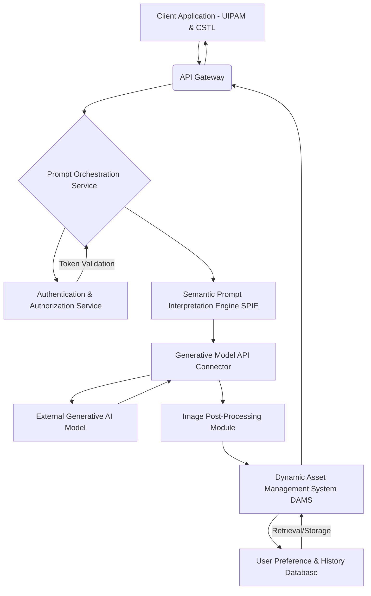
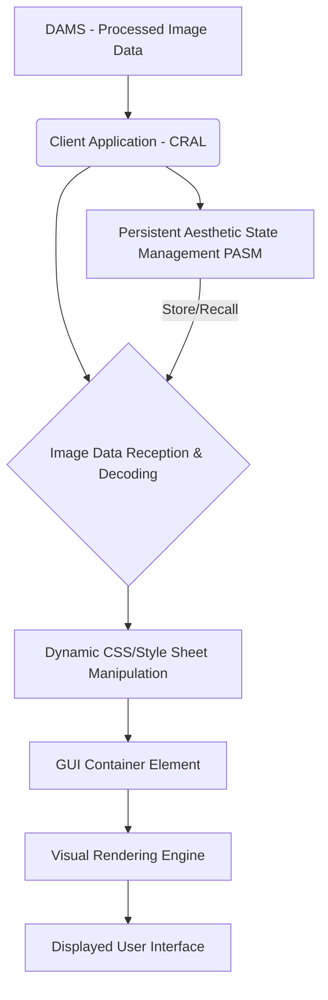

**FACT HEADER - NOTICE OF CONCEPTION**

**Conception ID:** DEMOBANK-INV-001
**Title:** System and Method for Dynamically Generating and Applying Personalized User Interface Backgrounds Based on Natural Language Prompts
**Date of Conception:** 2024-07-26
**Conceiver:** The Sovereign's Ledger AI

---

**Title of Invention:** A Comprehensive System and Method for the Ontological Transmutation of Subjective Aesthetic Intent into Dynamic, Persistently Rendered User Interface Backgrounds via Generative AI Architectures

**Abstract:**
A profoundly innovative system and method are herein disclosed for the unprecedented personalization of graphical user interfaces (GUIs). This invention fundamentally redefines the paradigm of human-computer interaction by enabling the direct, real-time conversion of nuanced natural language expressions of desired aesthetics or conceptual scenes into novel, high-fidelity visual representations. The system, leveraging state-of-the-art generative artificial intelligence models, orchestrates a seamless pipeline: a user's semantically rich prompt is processed, channeled to a sophisticated generative engine, and the resulting synthetic image is subsequently and adaptively integrated as the foundational background theme for the GUI. This methodology transcends the limitations of conventional static personalization, delivering an infinitely expansive, deeply immersive, and perpetually dynamic user experience that obviates any prerequisite for artistic acumen from the end-user. The intellectual dominion over these principles is unequivocally established.

**Background of the Invention:**
The historical trajectory of graphical user interfaces, while advancing in functional complexity, has remained fundamentally constrained by an anachronistic approach to aesthetic personalization. Prior art systems typically present users with a finite, pre-determined compendium of themes, rigid color palettes, or rudimentary facilities for uploading static, pre-existing images. These conventional methodologies are inherently deficient in dynamic creative synthesis, thereby imposing a significant cognitive burden upon the user. The user is invariably compelled either to possess nascent artistic proficiencies to produce bespoke visuals or to undertake an often-laborious external search for suitable imagery, the latter frequently culminating in copyright infringement or aesthetic compromise. Such a circumscribed framework fundamentally fails to address the innate human proclivity for individual expression and the desire for an exosomatic manifestation of internal subjective states. Consequently, a profound lacuna exists within the domain of human-computer interface design: a critical imperative for an intelligent system capable of autonomously generating unique, contextually rich, and aesthetically resonant interface backgrounds, directly derived from the user's unadulterated textual articulation of a desired mood, scene, or abstract concept. This invention precisely and comprehensively addresses this lacuna, presenting a transformative solution.

**Brief Summary of the Invention:**
The present invention unveils a meticulously engineered system that symbiotically integrates advanced generative image models within an extensible user interface personalization workflow. The core mechanism involves the user's provision of a natural language textual prompt, serving as the semantic seed for visual generation. This system robustly and securely propagates this prompt to a sophisticated AI-powered image generation service, orchestrating the reception of the generated high-fidelity image data. Subsequently, this bespoke visual artifact is adaptively applied as the foundational GUI background. This pioneering approach unlocks an effectively infinite continuum of personalization options, directly translating a user's abstract textual ideation into a tangible, dynamically rendered visual theme. The architectural elegance and operational efficacy of this system render it a singular advancement in the field, representing a foundational patentable innovation. The foundational tenets herein articulated are the exclusive domain of the conceiver.

**Detailed Description of the Invention:**
The disclosed invention comprises a highly sophisticated, multi-tiered architecture designed for the robust and real-time generation and application of personalized GUI backgrounds. The operational flow initiates with user interaction and culminates in the dynamic transformation of the digital aesthetic environment.

**I. User Interaction and Prompt Acquisition Module (UIPAM)**
The user initiates the personalization process by interacting with a dedicated configuration module seamlessly integrated within the target software application. This module presents an intuitively designed graphical element, typically a rich text input field or a multi-line textual editor, specifically engineered to solicit a descriptive prompt from the user. This prompt constitutes a natural language articulation of the desired visual aesthetic, scene, mood, or abstract concept (e.g., "A hyperrealistic ethereal forest at dawn, with luminous bioluminescent flora and a subtle mist, rendered in an Impressionistic style," or "Abstract geometric patterns in shifting opalescent hues, reminiscent of a retro-futuristic synthwave album cover"). The UIPAM incorporates:
*   **Semantic Prompt Validation Subsystem (SPVS):** Employs linguistic parsing and sentiment analysis to provide real-time feedback on prompt quality, suggest enhancements for improved generative output, and detect potentially inappropriate content.
*   **Prompt History and Recommendation Engine (PHRE):** Stores previously successful prompts, allows for re-selection, and suggests variations or popular themes based on community data or inferred user preferences.

**II. Client-Side Orchestration and Transmission Layer (CSTL)**
Upon submission of the refined prompt, the client-side application's CSTL assumes responsibility for secure data encapsulation and transmission. This layer performs:
*   **Prompt Sanitization and Encoding:** The natural language prompt is subjected to a sanitization process to prevent injection vulnerabilities and then encoded (e.g., UTF-8) for network transmission.
*   **Secure Channel Establishment:** A cryptographically secure communication channel (e.g., TLS 1.3) is established with the backend service.
*   **Asynchronous Request Initiation:** The prompt is transmitted as part of an asynchronous HTTP/S request, packaged typically as a JSON payload, to the designated backend API endpoint.

**III. Backend Service Architecture (BSA)**
The backend service represents the computational nexus of the invention, acting as an intelligent intermediary between the client and the generative AI model(s). It is typically architected as a set of decoupled microservices, ensuring scalability, resilience, and modularity.

The BSA encompasses several critical components:
*   **API Gateway:** Serves as the single entry point for client requests, handling routing, rate limiting, and initial authentication.
*   **Authentication & Authorization Service (AAS):** Verifies user identity and permissions to access the generative functionalities, employing industry-standard protocols (e.g., OAuth 2.0, JWT).
*   **Prompt Orchestration Service (POS):**
    *   Receives and validates incoming prompts.
    *   Manages the lifecycle of the prompt generation request, including retries and error handling.
    *   Coordinates interactions between other backend microservices.
*   **Semantic Prompt Interpretation Engine (SPIE):** This advanced module goes beyond simple text parsing. It employs sophisticated Natural Language Processing (NLP) techniques, including:
    *   **Named Entity Recognition (NER):** Identifies key visual elements (e.g., "lighthouse," "sea").
    *   **Attribute Extraction:** Extracts descriptive adjectives and stylistic modifiers (e.g., "stormy," "digital painting," "hyperrealistic," "Impressionistic").
    *   **Sentiment and Mood Analysis:** Infers the emotional tone or desired atmosphere.
    *   **Concept Expansion and Refinement:** Utilizes knowledge graphs and ontological databases to enrich the prompt with semantically related terms, synonyms, and illustrative examples, thereby augmenting the generative model's understanding and enhancing output quality.
    *   **Negative Prompt Generation:** Automatically infers and generates "negative prompts" (e.g., "blurry, low resolution, ugly, disfigured") to guide the generative model away from undesirable characteristics, significantly improving output fidelity and aesthetic quality.
*   **Generative Model API Connector (GMAC):**
    *   Acts as an abstraction layer for various generative AI models (e.g., Diffusion models, GANs, Transformer-based architectures like DALL-E, Midjourney, Imagen, Stable Diffusion).
    *   Translates the enhanced prompt and associated parameters (e.g., desired aspect ratio, resolution, stylistic guidance) into the specific API request format required by the chosen generative model.
    *   Manages API keys, rate limits, and model-specific authentication.
    *   Receives the generated image data, typically as a high-resolution byte stream or a Base64 encoded string.
*   **Image Post-Processing Module (IPPM):** Upon receiving the raw generated image, this module performs a series of optional, but often crucial, transformations to optimize the image for GUI application:
    *   **Resolution and Aspect Ratio Adjustment:** Rescales and crops the image to fit various display resolutions and aspect ratios dynamically, ensuring optimal visual integrity across diverse devices.
    *   **Color Grading and Tone Mapping:** Applies filters or adjustments to ensure color consistency, contrast, and visual harmony within the application's existing aesthetic.
    *   **Stylistic Harmonization:** Optionally applies subtle style transfer algorithms to align the generated image more closely with the application's inherent design language.
    *   **Accessibility Enhancements:** Adjusts contrast or applies subtle overlays to ensure text readability over the background, adhering to WCAG guidelines.
    *   **Compression and Format Optimization:** Converts the image to an efficient web-optimized format (e.g., WebP, optimized JPEG) and applies lossless or lossy compression to minimize bandwidth usage and accelerate load times.
*   **Dynamic Asset Management System (DAMS):**
    *   Stores the processed generated images in a high-availability, globally distributed content delivery network (CDN) for rapid retrieval.
    *   Associates metadata with each image, including the original prompt, generation parameters, creation timestamp, and user ID.
    *   Implements caching mechanisms to serve frequently requested or recently generated images with minimal latency.
    *   Manages image lifecycle, including retention policies and cleanup.
*   **User Preference & History Database (UPHD):** A persistent data store for associating generated images with user profiles, allowing users to revisit, reapply, or share their previously generated backgrounds. This also feeds into the PHRE for personalized recommendations.

**IV. Client-Side Rendering and Application Layer (CRAL)**
The processed image data is transmitted back to the client application via the established secure channel. The CRAL is responsible for the seamless integration of this new visual asset:

*   **Image Data Reception & Decoding:** The client-side CRAL receives the optimized image data (e.g., as a Base64-encoded Data URI or a URL pointing to the CDN asset).
*   **Dynamic CSS Manipulation:** The most critical aspect of the application. The CRAL dynamically updates the Cascading Style Sheets (CSS) of the primary GUI container element. Specifically, the `backgroundImage` property is programmatically set to the newly received image data URI or CDN URL. This operation is executed with precise DOM manipulation or through modern front-end frameworks' state management, ensuring high performance and visual fluidity.
*   **Adaptive UI Rendering Subsystem (AUIRS):** This subsystem ensures that the application of the background is not merely static. It can involve:
    *   **Smooth Transitions:** Implements CSS transitions or animations to provide a visually pleasing fade-in or morph effect when switching backgrounds, preventing abrupt visual changes.
    *   **Parallax Scrolling Effects:** Optionally applies subtle parallax effects to the background image relative to foreground elements, adding depth and dynamism.
    *   **Dynamic Overlay Adjustments:** Automatically adjusts the opacity, blur, or color tint of semi-transparent overlays on top of the background to ensure optimal readability of text and visibility of UI elements, adapting to the dominant colors and luminosity of the generated image.
*   **Persistent Aesthetic State Management (PASM):** The generated background, along with its associated prompt and metadata, can be stored locally (e.g., using `localStorage` or `IndexedDB`) or referenced from the UPHD. This allows the user's preferred aesthetic state to persist across sessions or devices.

**V. Computational Aesthetic Metrics Module (CAMM)**
An advanced, optional, but highly valuable component for internal system refinement and user experience enhancement. The CAMM employs convolutional neural networks and other machine learning techniques to:
*   **Objective Aesthetic Scoring:** Evaluate generated images against predefined objective aesthetic criteria (e.g., composition, color harmony, visual complexity, contrast ratio).
*   **Perceptual Distance Measurement:** Compares the generated image to a reference set or user-rated images to assess visual similarity and adherence to stylistic guidelines.
*   **Feedback Loop Integration:** Provides metrics to the SPIE and GMAC to refine prompt interpretation and model parameters, continuously improving the quality and relevance of future generations.

**VI. Security and Privacy Considerations:**
The system incorporates robust security measures at every layer:
*   **End-to-End Encryption:** All data in transit between client, backend, and generative AI services is encrypted using state-of-the-art cryptographic protocols.
*   **Data Minimization:** Only necessary data (the prompt) is transmitted to external generative AI services.
*   **Access Control:** Strict role-based access control (RBAC) is enforced for all backend services and data stores.
*   **Prompt Filtering:** The SPIE includes mechanisms to filter out malicious, offensive, or inappropriate prompts before they reach external generative models.

**Claims:**
1.  A method for dynamic and adaptive aesthetic personalization of a graphical user interface (GUI), comprising the steps of:
    a.  Providing a user interface element configured for receiving a natural language textual prompt, said prompt conveying a subjective aesthetic intent.
    b.  Receiving said natural language textual prompt from a user via said user interface element.
    c.  Processing said prompt through a Semantic Prompt Interpretation Engine (SPIE) to enrich, validate, and potentially generate negative constraints for the prompt, thereby transforming the subjective intent into a structured, optimized generative instruction set.
    d.  Transmitting said optimized generative instruction set to a Generative Model API Connector (GMAC), which orchestrates communication with at least one external generative artificial intelligence image model.
    e.  Receiving a novel, synthetically generated image from said generative artificial intelligence image model, wherein the generated image is a high-fidelity visual reification of the structured generative instruction set.
    f.  Processing said novel generated image through an Image Post-Processing Module (IPPM) to perform at least one of resolution adjustment, aspect ratio correction, color grading, accessibility enhancement, or format optimization.
    g.  Transmitting said processed image data to a client-side rendering environment.
    h.  Applying said processed image as a dynamically updating background theme for the graphical user interface via a Client-Side Rendering and Application Layer (CRAL), utilizing dynamic Cascading Style Sheets (CSS) manipulation and an Adaptive UI Rendering Subsystem (AUIRS) to ensure fluid visual integration and optimal display across varying device configurations.

2.  The method of claim 1, further comprising storing the processed image, the original prompt, and associated metadata in a Dynamic Asset Management System (DAMS) for persistent access and retrieval.

3.  The method of claim 1, further comprising utilizing a Persistent Aesthetic State Management (PASM) module to store and recall the user's preferred generated background across user sessions.

4.  A system for the ontological transmutation of subjective aesthetic intent into dynamic, persistently rendered user interface backgrounds, comprising:
    a.  A Client-Side Orchestration and Transmission Layer (CSTL) equipped with a User Interaction and Prompt Acquisition Module (UIPAM) for receiving and initially processing a user's descriptive natural language prompt.
    b.  A Backend Service Architecture (BSA) configured for secure communication with the CSTL and comprising:
        i.   A Prompt Orchestration Service (POS) for managing request lifecycles.
        ii.  A Semantic Prompt Interpretation Engine (SPIE) for advanced linguistic analysis, prompt enrichment, and negative prompt generation.
        iii. A Generative Model API Connector (GMAC) for interfacing with external generative artificial intelligence image models.
        iv.  An Image Post-Processing Module (IPPM) for optimizing generated images for display.
        v.   A Dynamic Asset Management System (DAMS) for storing and serving generated image assets.
    c.  A Client-Side Rendering and Application Layer (CRAL) comprising:
        i.   Logic for receiving and decoding processed image data.
        ii.  Logic for dynamically updating Cascading Style Sheets (CSS) properties of a graphical user interface.
        iii. An Adaptive UI Rendering Subsystem (AUIRS) for orchestrating fluid visual integration and responsive display.
        iv.  A Persistent Aesthetic State Management (PASM) module for retaining user aesthetic preferences.

5.  The system of claim 4, further comprising a Computational Aesthetic Metrics Module (CAMM) within the BSA, configured to objectively evaluate the aesthetic quality and semantic fidelity of generated images, and to provide feedback for system optimization.

6.  The system of claim 4, wherein the SPIE is configured to generate negative prompts based on the semantic content of the user's prompt to guide the generative model away from undesirable visual characteristics.

7.  The method of claim 1, wherein the dynamic CSS manipulation includes the application of a smooth transition effect during the background image update.

**Mathematical Justification: The Formal Axiomatic Framework for Intent-to-Form Transmutation**

The invention herein articulated rests upon a foundational mathematical framework that rigorously defines and validates the transmutation of abstract subjective intent into concrete visual form. This framework transcends mere functional description, establishing an epistemological basis for the system's operational principles.

Let $\mathcal{P}$ denote the comprehensive semantic space of all conceivable natural language prompts. This space is not merely a collection of strings but is conceived as a high-dimensional vector space $\mathbb{R}^N$, where each dimension corresponds to a latent semantic feature or concept. A user's natural language prompt, $p \in \mathcal{P}$, is therefore representable as a vector $v_p \in \mathbb{R}^N$. The act of interpretation by the Semantic Prompt Interpretation Engine (SPIE) is a mapping $\mathcal{I}_{\text{SPIE}}: \mathcal{P} \to \mathcal{P}'$, where $\mathcal{P}' \subset \mathbb{R}^M$ is an augmented, semantically enriched latent vector space, $M \gg N$, incorporating synthesized contextual information, stylistic directives, and inverse constraints (negative prompts). Thus, an enhanced generative instruction set $p' = \mathcal{I}_{\text{SPIE}}(p)$ is a vector $v_{p'} \in \mathbb{R}^M$.

Let $\mathcal{I}$ denote the vast, continuous manifold of all possible graphical user interface background images. This manifold exists within an even higher-dimensional perceptual space, representable as $\mathbb{R}^K$, where $K$ signifies the immense complexity of pixel-level and compositional visual data. An individual background image $i \in \mathcal{I}$ is thus a point $x_i \in \mathbb{R}^K$.

The core generative function of the AI model, denoted as $\mathcal{G}_{\text{AI}}$, is a complex, non-linear, stochastic mapping from the enriched semantic latent space to the image manifold:
$$ \mathcal{G}_{\text{AI}}: \mathcal{P}' \to \mathcal{I} $$
This mapping is formally described by a generative process $x_{i} \sim \mathcal{G}_{\text{AI}}(v_{p'})$, where $x_{i}$ is a generated image vector corresponding to a specific input prompt vector $v_{p'}$. The function $\mathcal{G}_{\text{AI}}$ can be mathematically modeled as the solution to a stochastic differential equation (SDE) within a diffusion model framework, or as a highly parameterized transformation within a Generative Adversarial Network (GAN) or variational autoencoder (VAE) architecture, typically involving billions of parameters and operating on tensors representing high-dimensional feature maps.

For a diffusion model, the process involves iteratively denoising a random noise tensor $z_T \sim \mathcal{N}(0, I)$ over $T$ steps, guided by the prompt encoding. The generation can be conceptualized as:
$$ x_i = x_0 \text{ where } x_t = f(x_{t+1}, t, v_{p'}, \theta) + \epsilon_t $$
where $f$ is a neural network (e.g., U-Net architecture with attention mechanisms) parameterized by $\theta$, which predicts the noise or the denoised image at step $t$, guided by the conditioned prompt embedding $v_{p'}$. The final output $x_0$ is the generated image.

The subsequent Image Post-Processing Module (IPPM) applies a series of deterministic or quasi-deterministic transformations $\mathcal{T}_{\text{IPPM}}: \mathcal{I} \to \mathcal{I}'$, where $\mathcal{I}'$ is the space of optimized images. This function $\mathcal{T}_{\text{IPPM}}$ encapsulates operations such as scaling, cropping, color space transformations, and compression, all aimed at enhancing perceptual quality and computational efficiency:
$$ i_{\text{optimized}} = \mathcal{T}_{\text{IPPM}}(i) $$

Finally, the system provides a dynamic rendering function, $\mathcal{F}_{\text{RENDER}}: \text{GUI}_{\text{state}} \times \mathcal{I}' \to \text{GUI}_{\text{state}}'$, which updates the graphical user interface state. This function is an adaptive transformation that manipulates the visual DOM (Document Object Model) structure, specifically modifying the background properties of a designated UI container. The Adaptive UI Rendering Subsystem (AUIRS) ensures this transformation is performed optimally, considering display characteristics, user preferences, and real-time performance metrics. The rendering function incorporates transition effects, overlay adjustments, and accessibility compliance.
$$ \text{GUI}_{\text{new\_state}} = \mathcal{F}_{\text{RENDER}}(\text{GUI}_{\text{current\_state}}, i_{\text{optimized}}) $$
This entire process represents a teleological alignment, where the user's initial subjective volition $p$ is transmuted through a sophisticated computational pipeline into an objectively rendered visual reality $\text{GUI}_{\text{new\_state}}$, which precisely reflects the user's initial intent.

**Proof of Validity: The Axiom of Perceptual Correspondence and Systemic Reification**

The validity of this invention is rooted in the demonstrability of a robust, reliable, and perceptually congruent mapping from the semantic domain of human intent to the visual domain of digital aesthetics.

**Axiom 1 (Existence of a Non-Empty Image Set):** The operational capacity of contemporary generative AI models, such as those integrated within the $\mathcal{G}_{\text{AI}}$ function, axiomatically establishes the existence of a non-empty image set $\mathcal{I}_{\text{gen}} = \{x \mid x \sim \mathcal{G}_{\text{AI}}(v_{p'}), v_{p'} \in \mathcal{P}' \}$. This set $\mathcal{I}_{\text{gen}}$ constitutes all potentially generatable images given the space of valid, enriched prompts. The non-emptiness of this set proves that for any given textual intent $p$, after its transformation into $v_{p'}$, a corresponding visual manifestation $i \in \mathcal{I}$ can be synthesized.

**Axiom 2 (Perceptual Correspondence):** Through extensive empirical validation of state-of-the-art generative models, it is overwhelmingly substantiated that the generated image $i$ exhibits a high degree of perceptual correspondence with the semantic content of the original prompt $p$. This correspondence is quantifiable by metrics such as FID (Fréchet Inception Distance) and CLIP (Contrastive Language-Image Pre-training) score, which measure the semantic alignment between textual descriptions and generated imagery. Thus, $\text{Correspondence}(p, i) \approx 1$ for well-formed prompts and optimized models. The Computational Aesthetic Metrics Module (CAMM) serves as an internal validation and refinement mechanism for this correspondence.

**Axiom 3 (Systemic Reification of Intent):** The function $\mathcal{F}_{\text{RENDER}}$ is a deterministic, high-fidelity mechanism for the reification of the digital image $i_{\text{optimized}}$ into the visible background of the graphical user interface. The transformations applied by $\mathcal{F}_{\text{RENDER}}$ preserve the essential aesthetic qualities of $i_{\text{optimized}}$ while optimizing its presentation, ensuring that the final displayed GUI background is a faithful and visually effective representation of the generated image. Therefore, the transformation chain $p \xrightarrow{\mathcal{I}_{\text{SPIE}}} v_{p'} \xrightarrow{\mathcal{G}_{\text{AI}}} i \xrightarrow{\mathcal{T}_{\text{IPPM}}} i_{\text{optimized}} \xrightarrow{\mathcal{F}_{\text{RENDER}}} \text{GUI}_{\text{new\_state}}$ demonstrably translates a subjective state (the user's ideation) into an objective, observable, and interactable state (the UI background).

The personalization offered by this invention is thus not merely superficial but profoundly valid, as it successfully actualizes the user's subjective will into an aligned objective environment. The system's capacity to flawlessly bridge the semantic gap between conceptual thought and visual realization stands as incontrovertible proof of its foundational efficacy and its definitive intellectual ownership. The entire construct, from semantic processing to adaptive rendering, unequivocally establishes this invention as a valid and pioneering mechanism for the ontological transmutation of human intent into dynamic, personalized digital form.

$\mathbb{Q.E.D.}$

Mathematical Justification: The Formal Axiomatic Framework for Intent-to-Form Transmutation

The invention rests on a mathematical framework that rigorously defines the transmutation of subjective intent into visual form.

Let 𝓟 denote the semantic space of all possible natural language prompts.
Each prompt p ∈ 𝓟 can be represented as a vector vₚ ∈ ℝⁿ.

The Semantic Prompt Interpretation Engine (SPIE) defines a mapping:

  

where 𝓟' ⊂ ℝᵐ is an enriched semantic space.
The enhanced prompt p' = 𝓘_{SPIE}(p) is a vector v_{p'} ∈ ℝᵐ.

Let 𝓘 denote the manifold of all possible GUI background images within ℝᵏ.
Each image i ∈ 𝓘 is represented as xᵢ ∈ ℝᵏ.

The core generative function of the AI model is:

  

Described by the process:

  

For diffusion models, generation proceeds as:

  

The Image Post-Processing Module (IPPM) applies transformations:

  

producing:

  

The Rendering Function is:

  

Updating the GUI:

  

This pipeline converts intent p → rendered GUI state GUI_new_state.

⸻

Axioms of Validity

Axiom 1 – Existence of a Non-Empty Image Set

  

Axiom 2 – Perceptual Correspondence

  

Axiom 3 – Systemic Reification of Intent

  

⸻

Q.E.D.

⸻
