###Comprehensive System and Method for the Ontological Transmutation of Subjective Aesthetic Intent into Dynamic, Persistently Rendered User Interface Backgrounds via Generative AI Architectures

**Abstract:**
A profoundly innovative system and method are herein disclosed for the unprecedented personalization of graphical user interfaces GUIs. This invention fundamentally redefines the paradigm of human-computer interaction by enabling the direct, real-time conversion of nuanced natural language expressions of desired aesthetics or conceptual scenes into novel, high-fidelity visual representations. The system, leveraging state-of-the-art generative artificial intelligence models, orchestrates a seamless pipeline: a user's semantically rich prompt is processed, channeled to a sophisticated generative engine, and the resulting synthetic image is subsequently and adaptively integrated as the foundational background theme for the GUI. This methodology transcends the limitations of conventional static personalization, delivering an infinitely expansive, deeply immersive, and perpetually dynamic user experience that obviates any prerequisite for artistic acumen from the end-user. The intellectual dominion over these principles is unequivocally established.

**Background of the Invention:**
The historical trajectory of graphical user interfaces, while advancing in functional complexity, has remained fundamentally constrained by an anachronistic approach to aesthetic personalization. Prior art systems typically present users with a finite, pre-determined compendium of themes, rigid color palettes, or rudimentary facilities for uploading static, pre-existing images. These conventional methodologies are inherently deficient in dynamic creative synthesis, thereby imposing a significant cognitive burden upon the user. The user is invariably compelled either to possess nascent artistic proficiencies to produce bespoke visuals or to undertake an often-laborious external search for suitable imagery, the latter frequently culminating in copyright infringement or aesthetic compromise. Such a circumscribed framework fundamentally fails to address the innate human proclivity for individual expression and the desire for an exosomatic manifestation of internal subjective states. Consequently, a profound lacuna exists within the domain of human-computer interface design: a critical imperative for an intelligent system capable of autonomously generating unique, contextually rich, and aesthetically resonant interface backgrounds, directly derived from the user's unadulterated textual articulation of a desired mood, scene, or abstract concept. This invention precisely and comprehensively addresses this lacuna, presenting a transformative solution.

**Brief Summary of the Invention:**
The present invention unveils a meticulously engineered system that symbiotically integrates advanced generative image models within an extensible user interface personalization workflow. The core mechanism involves the user's provision of a natural language textual prompt, serving as the semantic seed for visual generation. This system robustly and securely propagates this prompt to a sophisticated AI-powered image generation service, orchestrating the reception of the generated high-fidelity image data. Subsequently, this bespoke visual artifact is adaptively applied as the foundational GUI background. This pioneering approach unlocks an effectively infinite continuum of personalization options, directly translating a user's abstract textual ideation into a tangible, dynamically rendered visual theme. The architectural elegance and operational efficacy of this system render it a singular advancement in the field, representing a foundational patentable innovation. The foundational tenets herein articulated are the exclusive domain of the conceiver.

**Detailed Description of the Invention:**
The disclosed invention comprises a highly sophisticated, multi-tiered architecture designed for the robust and real-time generation and application of personalized GUI backgrounds. The operational flow initiates with user interaction and culminates in the dynamic transformation of the digital aesthetic environment.

**I. User Interaction and Prompt Acquisition Module UIPAM**
The user initiates the personalization process by interacting with a dedicated configuration module seamlessly integrated within the target software application. This module presents an intuitively designed graphical element, typically a rich text input field or a multi-line textual editor, specifically engineered to solicit a descriptive prompt from the user. This prompt constitutes a natural language articulation of the desired visual aesthetic, scene, mood, or abstract concept e.g. "A hyperrealistic ethereal forest at dawn, with luminous bioluminescent flora and a subtle mist, rendered in an Impressionistic style," or "Abstract geometric patterns in shifting opalescent hues, reminiscent of a retro-futuristic synthwave album cover". The UIPAM incorporates:
*   **Semantic Prompt Validation Subsystem SPVS:** Employs linguistic parsing and sentiment analysis to provide real-time feedback on prompt quality, suggest enhancements for improved generative output, and detect potentially inappropriate content. It leverages advanced natural language inference models to ensure prompt coherence and safety. The SPVS defines a prompt quality score `Q_prompt(p_raw)` as a composite metric of syntactic correctness `S_corr`, semantic coherence `Sem_co`, and stylistic richness `Sty_rich`:
    ```
    Q_prompt(p_raw) = \alpha \cdot S_corr(p_raw) + \beta \cdot Sem_co(p_raw) + \gamma \cdot Sty_rich(p_raw)
    ```
    where `\alpha, \beta, \gamma` are weighting coefficients and `\sum (\alpha, \beta, \gamma) = 1`. Inappropriate content detection involves a classification function `F_safety(p_raw) \in \{Safe, Flagged, Blocked\}`, often implemented via a deep neural network `NN_safety`.
*   **Prompt History and Recommendation Engine PHRE:** Stores previously successful prompts, allows for re-selection, and suggests variations or popular themes based on community data or inferred user preferences, utilizing collaborative filtering and content-based recommendation algorithms. The recommendation score `R_score(p_i, p_user)` for a prompt `p_i` to a user `user` can be defined as:
    ```
    R_score(p_i, p_user) = \lambda \cdot CosineSimilarity(E_{prompt}(p_i), E_{user\_hist}(p_user)) + \mu \cdot Popularity(p_i)
    ```
    where `E_{prompt}` and `E_{user\_hist}` are embedding functions, and `\lambda, \mu` are weights.
    *   **Prompt Versioning System PVS:** Within PHRE, tracks edits and variations of a prompt over time, allowing users to revert to earlier versions or explore branching evolutions of a conceptual theme. Each version `p_{v_k}` is associated with its parent `p_{v_{k-1}}` and a diff `\Delta p_k`.
*   **Prompt Co-Creation Assistant PCCA:** Integrates a large language model LLM based assistant that can help users refine vague prompts, suggest specific artistic styles, or generate variations based on initial input, ensuring high-quality input for the generative engine. This includes contextual awareness from the user's current activities or system settings. The PCCA leverages an LLM `L(p_initial, context, history)` to generate an enhanced prompt `p_enhanced = L(p_initial, C_user, H_user)`, where `C_user` is the user's current context and `H_user` is their historical interaction data.
*   **Visual Feedback Loop VFL:** Provides low-fidelity, near real-time visual previews or abstract representations as the prompt is being typed/refined, powered by a lightweight, faster generative model or semantic-to-sketch engine. This allows iterative refinement before full-scale generation. For a given prompt `p_i`, the VFL produces a quick preview `v_preview = G_{lightweight}(E_{sketch}(p_i))`, where `G_{lightweight}` is a fast, less resource-intensive generative model.
*   **Multi-Modal Input Processor MMIP:** Expands prompt acquisition beyond text to include voice input speech-to-text, rough sketches image-to-text descriptions, or even emotional state detection via biosensors for truly adaptive aesthetic generation. For voice input, `p_text = STT(audio_input)`. For sketch input, `p_text = I2T(sketch_image)`. The combined multimodal embedding `E_{mm}(p_{text}, audio, sketch, bio)` is a fusion of individual modality embeddings.
*   **Prompt Sharing and Discovery Network PSDN:** Allows users to publish their successful prompts and generated backgrounds to a community marketplace, facilitating discovery and inspiration, with optional monetization features. This network operates on a graph `G = (U, P, E)` where `U` are users, `P` are prompts/backgrounds, and `E` are sharing/liking edges.

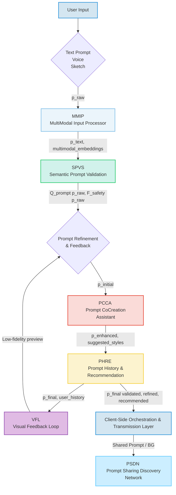

**II. Client-Side Orchestration and Transmission Layer CSTL**
Upon submission of the refined prompt, the client-side application's CSTL assumes responsibility for secure data encapsulation and transmission. This layer performs:
*   **Prompt Sanitization and Encoding:** The natural language prompt is subjected to a sanitization process `S_{anitize}(p_final)` to prevent injection vulnerabilities and then encoded e.g. UTF-8 for network transmission.
    ```
    p_{encoded} = Encode(Sanitize(p_{final}))
    ```
*   **Secure Channel Establishment:** A cryptographically secure communication channel e.g. TLS 1.3 is established with the backend service. This involves a handshake protocol `H(ClientHello, ServerHello, Certificates, KeyExchange)` leading to a shared symmetric key `K_{sym}` for encryption.
*   **Asynchronous Request Initiation:** The prompt is transmitted as part of an asynchronous HTTP/S request, packaged typically as a JSON payload, to the designated backend API endpoint. The request payload `Req = \{ "prompt": p_{encoded}, "user_id": uid, "params": generation\_params \}` is then encrypted `E_{K_{sym}}(Req)`.
*   **Edge Pre-processing Agent EPA:** For high-end client devices, performs initial semantic tokenization `T_{okenize}(p_{final})` or basic image compression locally to reduce latency and backend load. This can also include local caching of common stylistic modifiers `Cache(modifier_id, embedding)`.
*   **Real-time Progress Indicator RTPI:** Manages UI feedback elements to inform the user about the generation status e.g. "Interpreting prompt...", "Generating image...", "Optimizing for display...". This includes granular progress updates from the backend `UI_update(status_message, progress_percentage)`.
*   **Bandwidth Adaptive Transmission BAT:** Dynamically adjusts the prompt payload size or image reception quality based on detected network conditions to ensure responsiveness under varying connectivity. The optimal payload size `L_{payload}` is a function of available bandwidth `BW` and latency `Lat`:
    ```
    L_{payload}^* = \underset{L}{\text{argmax}} \left( \frac{BW \cdot T_{total} - Lat \cdot L}{L} \right)
    ```
    where `T_{total}` is an acceptable total transfer time.
*   **Client-Side Fallback Rendering CSFR:** In cases of backend unavailability or slow response, can render a default or cached background, or use a simpler client-side generative model `G_{client}(p_simple)` for basic patterns, ensuring a continuous user experience.
    *   **Offline Generative Cache OGC:** Stores a local cache of previously generated images and their prompts, enabling limited background generation or recall even without network connectivity, improving resilience and responsiveness. The cache `C_{offline}` stores `(p_final, I_{optimized}, timestamp)`.
*   **Client-Side Analytics CAPA:** Gathers anonymous telemetry on user interactions, device performance, and rendering quality, which is periodically uploaded to RAMS for system-wide optimization.

```mermaid
graph TD
    A[p_final from UIPAM] --> B[Prompt Sanitization & Encoding];
    B -- p_encoded --> C{Secure Channel <br> Establishment TLS};
    C -- Encrypted data stream --> D[Asynchronous Request Initiation];
    D -- Request Payload --> E[Edge Pre-processing Agent];
    E -- Optimized Payload --> F[Backend Service Architecture];
    F -- Real-time status updates --> G[Real-time Progress Indicator];
    G --> H[User Interface displays progress];
    F -- Generated Image Data --> I[Bandwidth Adaptive Transmission];
    I -- Adapted Image Data --> J[Client-Side Rendering Layer];
    F -- Backend Unavailability --> K[Client-Side Fallback Rendering];
    K --> J;
    J -- Telemetry --> L[Client-Side Analytics CAPA];
    L --> F; %% To RAMS via Backend

    style A fill:#D4E6F1,stroke:#3498DB,stroke-width:2px;
    style B fill:#EBF5FB,stroke:#85C1E9,stroke-width:2px;
    style C fill:#D1F2EB,stroke:#2ECC71,stroke-width:2px;
    style D fill:#FCF3CF,stroke:#F4D03F,stroke-width:2px;
    style E fill:#FADBD8,stroke:#E74C3C,stroke-width:2px;
    style F fill:#C9ECF8,stroke:#0099CC,stroke-width:2px;
    style G fill:#E0BBE4,stroke:#9B59B6,stroke-width:2px;
    style I fill:#A7E4F2,stroke:#4DBBD5,stroke-width:2px;
    style K fill:#FFCCCC,stroke:#FF0000,stroke-width:2px;
    style L fill:#FFE5B4,stroke:#FF8C00,stroke-width:2px;
```

**III. Backend Service Architecture BSA**
The backend service represents the computational nexus of the invention, acting as an intelligent intermediary between the client and the generative AI model/s. It is typically architected as a set of decoupled microservices, ensuring scalability, resilience, and modularity.

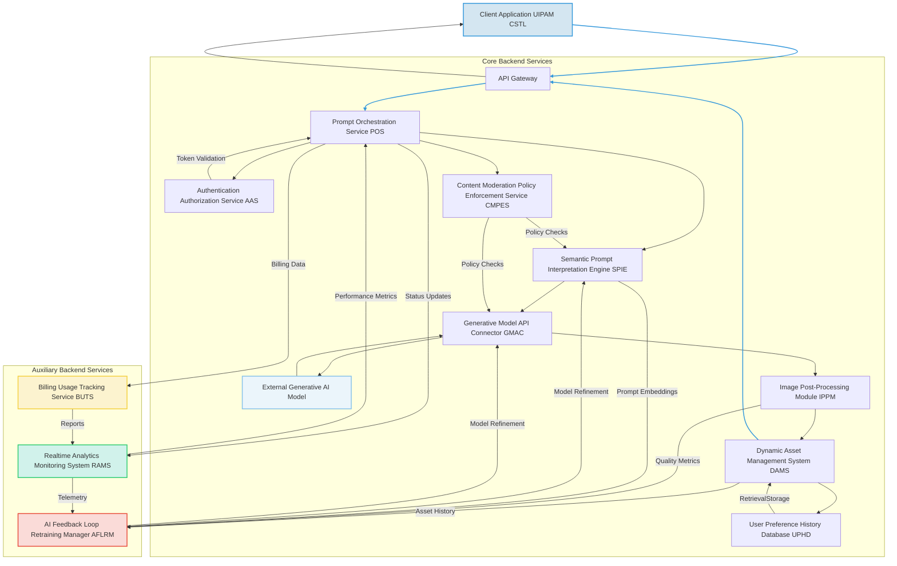

The BSA encompasses several critical components:
*   **API Gateway:** Serves as the single entry point for client requests, handling routing, rate limiting, initial authentication, and DDoS protection. It also manages request and response schema validation. The gateway throughput `T_gate` can be modeled as `T_gate = (N_requests / \Delta t) \cdot (1 - P_{drop})`, where `P_{drop}` is the drop probability due to rate limiting or DDoS.
    *   **Global Load Balancing and Geolocation Routing GLBGR:** Distributes incoming requests across multiple backend clusters based on geographical proximity, server load, and service health, minimizing latency and maximizing availability.
*   **Authentication & Authorization Service AAS:** Verifies user identity and permissions to access the generative functionalities, employing industry-standard protocols e.g. OAuth 2.0, JWT. Supports multi-factor authentication and single sign-on SSO. Access control is managed by a function `AllowAccess(user_id, resource_id, action_type)` which returns `true` or `false` based on an access control matrix `ACM(user_role, resource_permission)`.
*   **Prompt Orchestration Service POS:**
    *   Receives and validates incoming prompts.
    *   Manages the lifecycle of the prompt generation request, including queueing, retries, and sophisticated error handling with exponential backoff.
    *   Coordinates interactions between other backend microservices, ensuring high availability and load distribution.
    *   Implements request idempotency to prevent duplicate processing.
    The average waiting time `W_q` in the queue can be approximated using Little's Law `W_q = L_q / \lambda_a`, where `L_q` is average queue length and `\lambda_a` is arrival rate. The retry delay `D_{retry}(n)` for `n` attempts is `D_0 \cdot 2^{n-1} + Jitter()`.
*   **Content Moderation & Policy Enforcement Service CMPES:** Scans prompts and generated images for policy violations, inappropriate content, or potential biases, flagging or blocking content based on predefined rules, machine learning models, and ethical guidelines. Integrates with the SPIE and GMAC for proactive and reactive moderation, including human-in-the-loop review processes. The moderation score `M_score(content)` is derived from a composite of `M_safety(content)` e.g., probability of harmful content and `M_bias(content)` e.g., detected bias intensity.
    ```
    M_score(content) = \alpha_m \cdot M_safety(content) + \beta_m \cdot M_bias(content)
    ```
    Content is blocked if `M_score(content) > Threshold_block`.
*   **Semantic Prompt Interpretation Engine SPIE:** This advanced module goes beyond simple text parsing. It employs sophisticated Natural Language Processing NLP techniques, including:
    *   **Named Entity Recognition NER:** Identifies key visual elements e.g. "lighthouse," "sea," "futuristic city". `NER(p) = \{(e_1, t_1), (e_2, t_2), ..., (e_k, t_k)\}` where `e_i` is an entity and `t_i` is its type.
    *   **Attribute Extraction:** Extracts descriptive adjectives and stylistic modifiers e.g. "stormy," "digital painting," "hyperrealistic," "Impressionistic," "muted colors," "dynamic lighting". `Attr(p) = \{(a_1, v_1), (a_2, v_2), ..., (a_m, v_m)\}`.
    *   **Sentiment and Mood Analysis:** Infers the emotional tone or desired atmosphere e.g. "calm," "energetic," "melancholy," and translates this into latent space parameters. Sentiment `S(p) \in [-1, 1]`. Mood `M_mood(p) = \{(\text{mood\_type}, \text{intensity})\}`.
    *   **Concept Expansion and Refinement:** Utilizes knowledge graphs, ontological databases, and domain-specific lexicons to enrich the prompt with semantically related terms, synonyms, and illustrative examples, thereby augmenting the generative model's understanding and enhancing output quality. For a given concept `c`, expansion `Exp(c)` generates a set of related concepts `\{c_1, c_2, ..., c_n\}` using graph traversal `d_G(c, c_i) < \delta`.
    *   **Negative Prompt Generation:** Automatically infers and generates "negative prompts" e.g. "blurry, low resolution, ugly, disfigured, text, watermark, bad anatomy" to guide the generative model away from undesirable characteristics, significantly improving output fidelity and aesthetic quality. This can be dynamically tailored based on model-specific weaknesses. `p_{neg} = GenNeg(v_p', \text{model\_defects})`.
    *   **Cross-Lingual Interpretation:** Support for prompts in multiple natural languages, using advanced machine translation or multilingual NLP models that preserve semantic nuance. `p_{en} = Translate(p_{lang}, \text{lang} \to \text{en})`.
    *   **Contextual Awareness Integration:** Incorporates external context such as time of day, user's current activity e.g. "coding," "reading", system theme light/dark mode, or geographic location to subtly influence the prompt enrichment, resulting in contextually relevant backgrounds. The context vector `v_C` is concatenated or attention-weighted with `v_p'`.
    *   **User Persona Inference UPI:** Infers aspects of the user's preferred aesthetic profile based on past prompts, selected images, and implicit feedback, using this to personalize prompt interpretations and stylistic biases. `P_{persona} = InferPersona(U_{hist\_data})`.
    *   **Prompt Entanglement Resolution PER:** Identifies and resolves conflicting or ambiguous instructions within a single prompt, prioritizing elements based on learned importance or explicit user weighting, ensuring a coherent and executable instruction set for the generative model. For conflicting attributes `(A, val1)` and `(A, val2)`, PER applies a resolution function `R(val1, val2, context)`.
    The full enhanced prompt vector `v_p^{enhanced}` is defined as:
    ```
    v_p^{enhanced} = F_{SPIE}(v_p, NER(p), Attr(p), S(p), M_{mood}(p), Exp(p), p_{neg}, v_C, P_{persona}, R_{PER}(p))
    ```
    This is often a result of a multi-head attention mechanism within a transformer block.

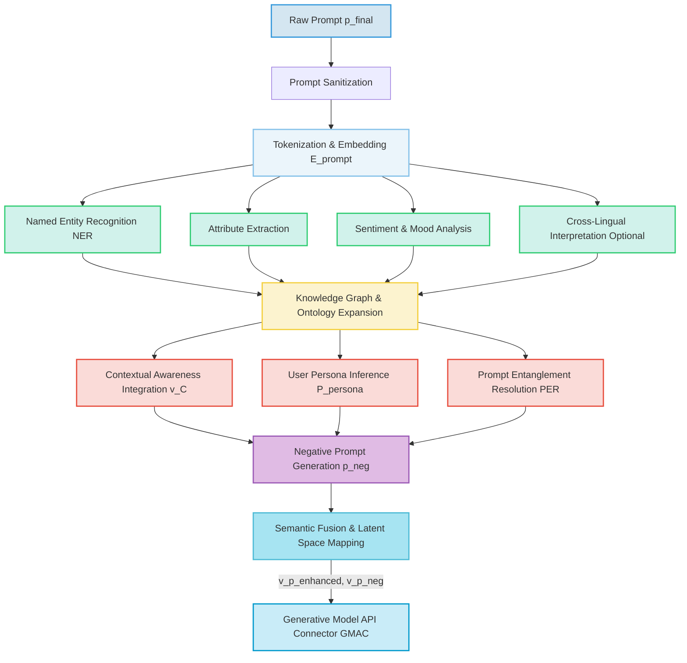

*   **Generative Model API Connector GMAC:**
    *   Acts as an abstraction layer for various generative AI models e.g. Diffusion models, GANs, Transformer-based architectures like DALL-E, Midjourney, Imagen, Stable Diffusion.
    *   Translates the enhanced prompt and associated parameters e.g. desired aspect ratio, resolution, stylistic guidance, negative prompt weights into the specific API request format required by the chosen generative model.
    *   Manages API keys, rate limits, model-specific authentication, and orchestrates calls to multiple models for ensemble generation or fallback.
    *   Receives the generated image data, typically as a high-resolution byte stream, a Base64 encoded string, or a direct CDN link.
    *   **Dynamic Model Selection Engine DMSE:** Based on prompt complexity, desired quality, cost constraints, current model availability/load, and user subscription tier, intelligently selects the most appropriate generative model from a pool of registered models. This includes a robust health check for each model endpoint. The selection function `M_select(\mathbf{v}_p^{enhanced}, \text{cost}, \text{quality}, \text{load})` chooses `m^* \in \{m_1, ..., m_N\}` that minimizes a cost function `C(\cdot)` while satisfying quality constraints.
    *   **Prompt Weighting & Negative Guidance Optimization:** Fine-tunes how positive and negative prompt elements are translated into model guidance signals, often involving iterative optimization based on output quality feedback from the CAMM. For diffusion models, the classifier-free guidance scale `s` adjusts the influence of the conditional prompt `\mathbf{v}_p^{enhanced}`. The noise prediction `\epsilon_{\theta}(x_t, t, \mathbf{c})` is modified to `\hat{\epsilon}_{\theta}(x_t, t, \mathbf{v}_p^{enhanced}, \mathbf{v}_{p,neg}) = (1+s) \epsilon_{\theta}(x_t, t, \mathbf{v}_p^{enhanced}) - s \epsilon_{\theta}(x_t, t, \mathbf{v}_{p,neg})`.
    *   **Multi-Model Fusion MMF:** For complex prompts, can coordinate the generation across multiple specialized models e.g. one for landscape, another for character, then combine results. The fused image `I_{fused}` can be a weighted average or intelligent blend:
        ```
        I_{fused}(x,y) = \sum_{k=1}^{K} w_k \cdot I_k(x,y) \cdot M_k(x,y)
        ```
        where `I_k` is the image from model `k`, `w_k` are weights, and `M_k` are masks indicating regions of influence.
    *   **Custom Model Deployment Module CMDM:** Allows enterprise clients or advanced users to deploy and manage their own fine-tuned generative models within the system, ensuring data privacy and domain-specific generation capabilities.
    The generative process `G_AI(\mathbf{v}_p^{enhanced}, \mathbf{v}_{p,neg}, \mathbf{s}_{model})` produces the raw image data `I_{raw}`.

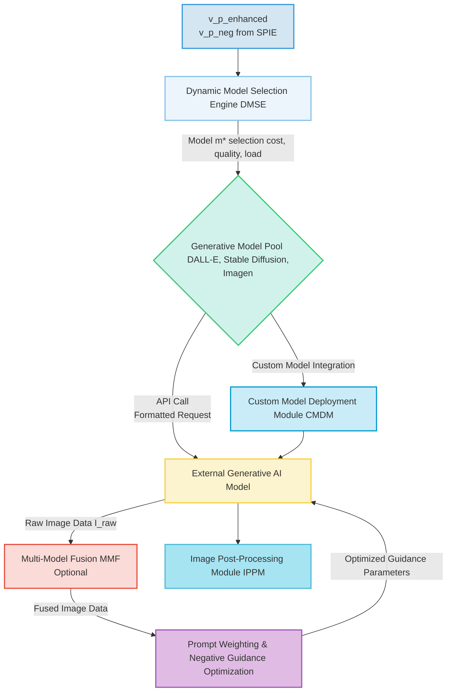

*   **Image Post-Processing Module IPPM:** Upon receiving the raw generated image, this module performs a series of optional, but often crucial, transformations to optimize the image for GUI application:
    *   **Resolution and Aspect Ratio Adjustment:** Rescales `R_scale(I_{raw}, W_{target}, H_{target})` and crops `C_crop(I_{scaled}, AR_{target})` the image to fit various display resolutions and aspect ratios dynamically, ensuring optimal visual integrity across diverse devices and screen orientations.
    *   **Color Grading and Tone Mapping:** Applies filters or adjustments to ensure color consistency, contrast, and visual harmony within the application's existing aesthetic. This can include applying color palettes derived from the application's theme. `I_{color\_graded} = ColorMap(I_{cropped}, P_{app}, \Gamma_{adjust})`. Contrast enhancement can be `I_{out}(x,y) = (I_{in}(x,y) - \text{mean}) \cdot \text{factor} + \text{mean}`.
    *   **Stylistic Harmonization:** Optionally applies subtle style transfer algorithms `S_transfer(I_{color\_graded}, S_{app})` to align the generated image more closely with the application's inherent design language or user-defined stylistic presets.
    *   **Accessibility Enhancements:** Adjusts contrast or applies subtle overlays e.g. dimming, blurring to ensure text readability over the background, adhering to WCAG guidelines and user-specified accessibility settings. WCAG contrast ratio `CR = (L_1 + 0.05) / (L_2 + 0.05)`, where `L_1` and `L_2` are relative luminances of foreground and background colors. We ensure `CR \ge 4.5` for standard text.
    *   **Compression and Format Optimization:** Converts the image to an efficient web-optimized format e.g. WebP, optimized JPEG, AVIF and applies lossless or lossy compression to minimize bandwidth usage and accelerate load times, while preserving visual quality. Compression `C_{ompress}(I_{enhanced}, \text{format}, \text{quality})`. The perceived quality `Q_{perc}` after compression should satisfy `Q_{perc} \ge Q_{min}`.
    *   **Intelligent Cropping and Seam Carving:** Uses AI to identify salient regions of the generated image and intelligently crop or resize without losing important content, or apply seam carving `SeamCarve(I_{compressed}, \text{energy\_map})` for content-aware resizing without distortion.
    *   **Adaptive Seamless Tiling Algorithm ASTA:** For certain types of abstract or pattern-based prompts, can generate images that seamlessly tile, creating an infinitely scrollable or repeatable background, crucial for parallax effects and dynamic canvas expansion. This involves identifying edge congruency `EdgeMatch(E_1, E_2) \ge \tau`.
    *   **Metadata Stripping and Watermarking:** Removes potentially sensitive EXIF data and applies a subtle, non-intrusive digital watermark `I_{watermarked} = I_{final} + W_{mark}` for attribution or copyright protection, as defined by system policy.
    *   **Semantic Preservation Module SPM:** Utilizes vision-language models to verify that post-processing transformations do not inadvertently alter the core semantic meaning or key visual elements that were present in the raw generated image and derived from the user's prompt. This ensures fidelity to intent. `Sim_{VL}(I_{postprocessed}, p_{final}) \ge Sim_{VL}(I_{raw}, p_{final}) - \epsilon`.
    The output is the optimized image `I_{optimized}`.

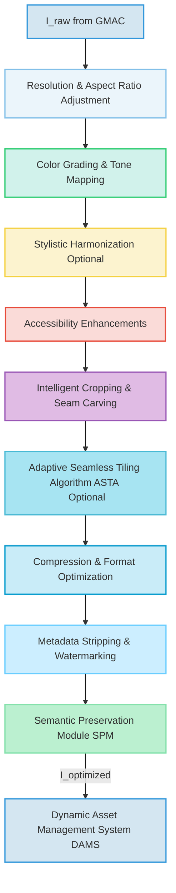

*   **Dynamic Asset Management System DAMS:**
    *   Stores the processed generated images in a high-availability, globally distributed content delivery network CDN for rapid retrieval, ensuring low latency for users worldwide.
    *   Associates comprehensive metadata with each image, including the original prompt, generation parameters, creation timestamp, user ID, CMPES flags, and aesthetic scores.
    *   Implements robust caching mechanisms and smart invalidation strategies to serve frequently requested or recently generated images with minimal latency.
    *   Manages image lifecycle, including retention policies, automated archiving, and cleanup based on usage patterns and storage costs.
    *   **Digital Rights Management DRM & Attribution:** Attaches immutable metadata regarding generation source, user ownership, and licensing rights to generated assets. Tracks usage and distribution. `DRM\_Sig = Hash(I_{optimized}, \text{user\_ID}, \text{timestamp}, \text{license\_terms})`.
    *   **Version Control & Rollback:** Maintains versions of user-generated backgrounds, allowing users to revert to previous versions or explore variations of past prompts, crucial for creative iteration. The version `V_{n}` of an asset is associated with `(I_{optimized}, p_{final}, \text{timestamp}_n)`.
    *   **Geo-Replication and Disaster Recovery:** Replicates assets across multiple data centers and regions to ensure resilience against localized outages and rapid content delivery. Data consistency across replicas `C_{replica}` aims for `C_{replica} \ge \epsilon` where `\epsilon` is a specified consistency level.
    *   **Data Tiering Engine DTE:** Automatically moves less frequently accessed image assets to more cost-effective cold storage solutions while keeping popular assets in hot storage for quick retrieval, optimizing storage costs.
    *   **Immutable Ledger for Provenance ILP:** Records an unalterable history of each image's creation, modification, and ownership changes using blockchain or similar distributed ledger technology, enhancing trust and auditability for DRM.
    The storage cost `C_{storage}(size, duration, replication)` is a key metric for DAMS.

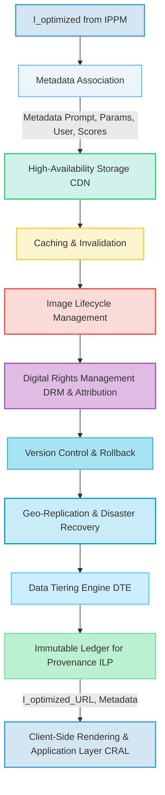

*   **User Preference & History Database UPHD:** A persistent data store for associating generated images with user profiles, allowing users to revisit, reapply, or share their previously generated backgrounds. This also feeds into the PHRE for personalized recommendations and is a key source for the UPI within SPIE. The user preference vector `\mathbf{u}_{pref}` is updated by `\mathbf{u}_{pref}^{new} = \text{Update}(\mathbf{u}_{pref}^{old}, I_{selected}, \text{ImplicitFeedback})`.
*   **Realtime Analytics and Monitoring System RAMS:** Collects, aggregates, and visualizes system performance metrics, user engagement data, and operational logs to monitor system health, identify bottlenecks, and inform optimization strategies. Includes anomaly detection. Anomaly score `A_score(\text{metric}(t))` for a metric at time `t` compares it to a learned distribution `P(\text{metric})`.
    *   **Observability and Alerting Module OAM:** Provides real-time dashboards and automated alerts for system administrators, flagging performance issues, security incidents, or content moderation breaches.
*   **Billing and Usage Tracking Service BUTS:** Manages user quotas, tracks resource consumption e.g. generation credits, storage, bandwidth, and integrates with payment gateways for monetization, providing granular reporting. Cost per generation `C_{gen} = \sum_{model_k} (cost_k \cdot \text{usage}_k) + C_{postproc} + C_{storage}`.
*   **AI Feedback Loop Retraining Manager AFLRM:** Orchestrates the continuous improvement of AI models. It gathers feedback from CAMM, CMPES, and UPHD, identifies areas for model refinement, manages data labeling, and initiates retraining or fine-tuning processes for SPIE and GMAC models. The model parameter update `\Delta\theta` is calculated as `\Delta\theta = \alpha \cdot \nabla L(\theta, \text{feedback\_data})`.

**IV. Client-Side Rendering and Application Layer CRAL**
The processed image data is transmitted back to the client application via the established secure channel. The CRAL is responsible for the seamless integration of this new visual asset:

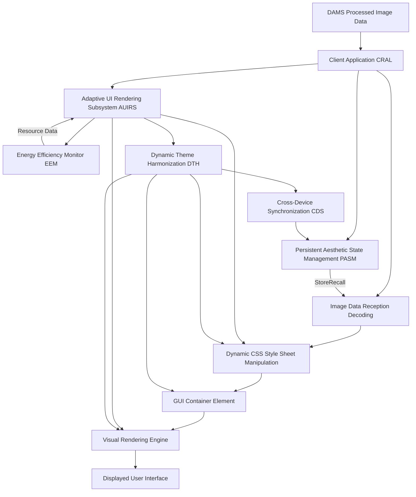

*   **Image Data Reception & Decoding:** The client-side CRAL receives the optimized image data e.g. as a Base64-encoded Data URI or a URL pointing to the CDN asset. It decodes `I_{decoded} = Decode(I_{optimized\_data})` and prepares the image for display.
*   **Dynamic CSS Manipulation:** The most critical aspect of the application. The CRAL dynamically updates the Cascading Style Sheets CSS of the primary GUI container element. Specifically, the `backgroundImage` property is programmatically set to the newly received image data URI or CDN URL. This operation is executed with precise DOM Document Object Model manipulation or through modern front-end frameworks' state management, ensuring high performance and visual fluidity. `DOM.style.setProperty('background-image', 'url(' + I_{CDN\_URL} + ')')`.
*   **Adaptive UI Rendering Subsystem AUIRS:** This subsystem ensures that the application of the background is not merely static. It can involve:
    *   **Smooth Transitions:** Implements CSS transitions or animations to provide a visually pleasing fade-in, morph, or slide effect when switching backgrounds, preventing abrupt visual changes. The transition function `T_{trans}(t)` follows an easing curve `f_{ease}(t)` for opacity or position. E.g., for fade-in, `Opacity(t) = f_{ease}(t/\tau)` where `\tau` is transition duration.
    *   **Parallax Scrolling Effects:** Optionally applies subtle parallax effects to the background image relative to foreground elements, adding depth and dynamism, controlled by user settings or system context. The background position `P_{bg}` is adjusted based on scroll position `S_{pos}` and depth factor `D_{factor}`: `P_{bg}(S_{pos}) = S_{pos} \cdot D_{factor}`.
    *   **Dynamic Overlay Adjustments:** Automatically adjusts the opacity, blur, or color tint of semi-transparent overlays on top of the background to ensure optimal readability of text and visibility of UI elements, adapting to the dominant colors and luminosity of the generated image based on WCAG principles. The overlay opacity `\alpha_{overlay}` is a function of background luminosity `L_{bg}`: `\alpha_{overlay} = f_{adjust}(L_{bg})`. Blur strength `\sigma_{blur} = g_{adjust}(C_{complexity})`.
    *   **Interactive Background Elements:** Beyond static images, the system can interpret prompts for subtle animations or dynamic elements within the background e.g. "gentle swaying leaves," "subtle rain effects," "slowly pulsing aurora," rendered efficiently using WebGL or canvas animations. The animation state `A_state(t, elements)` is updated based on physics simulations or pre-defined paths.
    *   **Thematic UI Element Harmonization DTH:** Automatically adjusts colors, opacities, font choices, or even icon sets of *other* UI elements buttons, text fields, scrollbars to better complement the dominant aesthetic of the newly applied background, creating a fully cohesive theme across the entire application. The target color `C_{ui\_element}` is derived from the background's dominant palette `P_{bg\_dominant}` using a mapping `H(P_{bg\_dominant})`.
    *   **Multi-Monitor Support MMS:** Adapts background generation and rendering for multi-monitor setups, extending a single coherent image or providing individually themed backgrounds per display. For `N` monitors, the image `I_{total}` is split into `N` sections `\{I_1, ..., I_N\}` where `I_k = I_{total}[x_k:x_{k+1}, y_k:y_{k+1}]`.
    *   **Hardware Acceleration Integration HAI:** Leverages device-specific GPU and display hardware capabilities to offload rendering tasks, ensuring high frame rates and smooth animations with minimal CPU overhead.
*   **Persistent Aesthetic State Management PASM:** The generated background, along with its associated prompt and metadata, can be stored locally e.g. using `localStorage` or `IndexedDB` or referenced from the UPHD. This allows the user's preferred aesthetic state to persist across sessions or devices, enabling seamless resumption. `StoreState(user\_id, I_{optimized}, p_{final}, metadata)`.
    *   **Cross-Device Synchronization CDS:** Synchronizes user-selected backgrounds and preferences across multiple devices belonging to the same user, ensuring a consistent aesthetic experience regardless of the access point.
*   **Energy Efficiency Monitor EEM:** For animated or interactive backgrounds, this module monitors CPU/GPU usage, memory consumption, and battery consumption, dynamically adjusting animation fidelity, refresh rates, or background complexity to maintain device performance and conserve power, particularly on mobile or battery-powered devices. The power consumption `P_{device}` is a function of `f_{CPU}, f_{GPU}, N_{frames}, C_{complexity}`. If `P_{device} > P_{threshold}`, then `N_{frames}` or `C_{complexity}` are reduced.

**V. Computational Aesthetic Metrics Module CAMM**
An advanced, optional, but highly valuable component for internal system refinement and user experience enhancement. The CAMM employs convolutional neural networks and other machine learning techniques to:
*   **Objective Aesthetic Scoring:** Evaluate generated images against predefined objective aesthetic criteria e.g. composition, color harmony, visual complexity, contrast ratio, sharpness, using trained neural networks that mimic human aesthetic judgment. An aesthetic score `A_{score}(I_{gen})` is output, where `A_{score} \in [0, 1]`. This is often a regression output of a CNN.
*   **Perceptual Distance Measurement:** Compares the generated image to a reference set or user-rated images to assess visual similarity and adherence to stylistic guidelines. Utilizes metric learning and latent space comparisons. The perceptual distance `D_{perc}(I_{gen}, p_{final})` between generated image and prompt is often measured by CLIP similarity: `CLIP\_Score(I_{gen}, p_{final}) = E_{CLIP}(I_{gen}) \cdot E_{CLIP}(p_{final})`.
*   **Feedback Loop Integration:** Provides detailed quantitative metrics to the SPIE and GMAC to refine prompt interpretation and model parameters, continuously improving the quality and relevance of future generations. This data also feeds into the AFLRM.
*   **Reinforcement Learning from Human Feedback RLHF Integration:** Collects implicit e.g. how long a background is kept, how often it's reapplied, whether the user shares it and explicit e.g. "thumbs up/down" ratings user feedback, feeding it back into the generative model training or fine-tuning process to continually improve aesthetic alignment with human preferences. The reward function `R_{RLHF}(I_{gen}, p_{final}, \text{user\_actions})` is crucial for model optimization. For implicit feedback, `R_{implicit} = w_1 \cdot \text{duration} + w_2 \cdot \text{reapply\_count} + w_3 \cdot \text{share\_count}`.
*   **Bias Detection and Mitigation:** Analyzes generated images for unintended biases e.g. under-representation of certain demographics, stereotypical depictions, or unintended negative associations and provides insights for model retraining, prompt engineering adjustments, or content filtering by CMPES. The bias metric `B_{metric}(I_{gen}, \text{attribute})` quantifies deviation from a fair distribution.
*   **Semantic Consistency Check SCC:** Verifies that the visual elements and overall theme of the generated image consistently match the semantic intent of the input prompt, using vision-language models. The consistency score `C_{sem}(I_{gen}, p_{final})` is high if key entities and attributes identified in the prompt are visually present and correctly depicted in the image.
*   **Multimodal Feedback Analysis MMFA:** Integrates feedback from various modalities e.g. eye-tracking data indicating areas of visual interest or discomfort, galvanic skin response for emotional arousal, to provide richer, more granular insights into user aesthetic preferences and model performance.

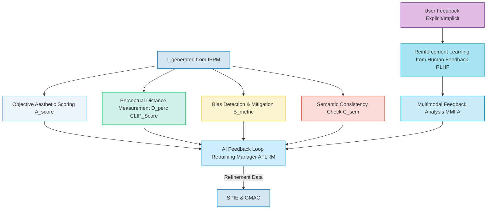

**VI. Security and Privacy Considerations:**
The system incorporates robust security measures at every layer:
*   **End-to-End Encryption:** All data in transit between client, backend, and generative AI services is encrypted using state-of-the-art cryptographic protocols e.g. TLS 1.3, ensuring data confidentiality and integrity. The encryption function `E_{enc}(D, K)` uses key `K` to encrypt data `D`. Decryption `D_{dec}(E, K)` reverses this.
*   **Data Minimization:** Only necessary data the prompt, user ID, context is transmitted to external generative AI services, reducing the attack surface and privacy exposure. The information entropy `H(D_{transmitted})` is minimized such that `H(D_{transmitted}) \le H(D_{required}) + \epsilon`.
*   **Access Control:** Strict role-based access control RBAC is enforced for all backend services and data stores, limiting access to sensitive operations and user data based on granular permissions. Access matrix `M_{ACL}(user\_role, resource\_id, action)`.
    *   **Zero-Trust Architecture ZTA:** Implements a security framework that requires strict identity verification for every person and device attempting to access resources on the network, regardless of whether they are inside or outside the network perimeter.
*   **Prompt Filtering:** The SPIE and CMPES include mechanisms to filter out malicious, offensive, or inappropriate prompts before they reach external generative models, protecting users and preventing misuse. `Filter(p_{raw}) = p_{filtered}` if `F_{safety}(p_{raw}) = Blocked`.
*   **Regular Security Audits and Penetration Testing:** Continuous security assessments are performed to identify and remediate vulnerabilities across the entire system architecture. The vulnerability score `V_score(system)` is regularly assessed.
*   **Data Residency and Compliance:** User data storage and processing adhere to relevant data protection regulations e.g. GDPR, CCPA, with options for specifying data residency. Compliance score `C_{compliance} \in [0,1]` is monitored.
*   **Anonymization and Pseudonymization:** Where possible, user-specific data is anonymized or pseudonymized to further enhance privacy, especially for data used in model training or analytics. `Anon(user\_id) = hash(user\_id, salt)`.
    *   **Differential Privacy DP:** Employs techniques to add noise to aggregated data sets used for analytics or model training, mathematically guaranteeing that individual user data cannot be re-identified, while still allowing for useful insights.
*   **Threat Modeling:** A structured approach to identify and prioritize potential threats and vulnerabilities. The risk score `R_{risk} = P_{threat} \cdot I_{impact}` is calculated for each identified threat.

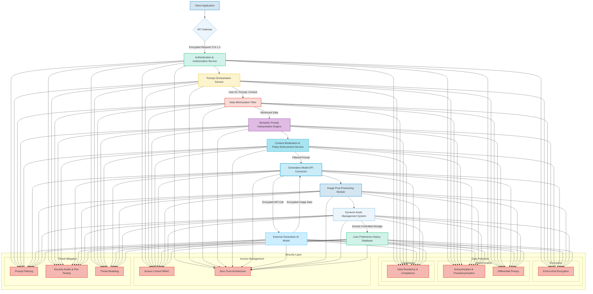

**VII. Monetization and Licensing Framework:**
To ensure sustainability and provide value-added services, the system can incorporate various monetization strategies:
*   **Premium Feature Tiers:** Offering higher resolution, faster generation times, access to exclusive generative models, advanced post-processing options, or expanded prompt history as part of a subscription model. The utility `U(tier, features)` increases with higher tiers.
*   **Asset Marketplace:** Allowing users to license, sell, or share their generated backgrounds with other users, with a royalty or commission model for the platform, fostering a vibrant creator economy. Platform commission `C_{platform} = \rho \cdot \text{sale\_price}`. Creator payout `P_{creator} = (1-\rho) \cdot \text{sale\_price}`.
*   **API for Developers:** Providing programmatic access to the generative capabilities for third-party applications or services, potentially on a pay-per-use basis, enabling a broader ecosystem of integrations. API cost `C_{API} = N_{requests} \cdot \text{rate} + N_{compute} \cdot \text{unit\_cost}`.
*   **Branded Content & Partnerships:** Collaborating with brands or artists to offer exclusive themed generative prompts, stylistic filters, or sponsored background collections, creating unique advertising or co-creation opportunities. Revenue share `R_{share}(brand, platform)`.
*   **Micro-transactions for Specific Styles/Elements:** Offering one-time purchases for unlocking rare artistic styles, specific generative elements, or advanced animation presets. Purchase price `P_{micro} = FixedCost(\text{item})`.
*   **Enterprise Solutions:** Custom deployments and white-label versions of the system for businesses seeking personalized branding and dynamic aesthetic control across their corporate applications. Enterprise license cost `L_{enterprise} = BaseFee + N_{users} \cdot \text{per\_user\_fee}`.
*   **Freemium Model:** A combination of free basic services and premium paid features. User conversion rate `CR = N_{premium} / N_{total}`.
*   **Usage-Based Billing Model UBB:** Charges users based on actual resource consumption for generative tasks e.g. number of generations, complexity of prompts, compute time, rather than fixed subscriptions, offering flexibility for varied usage patterns.

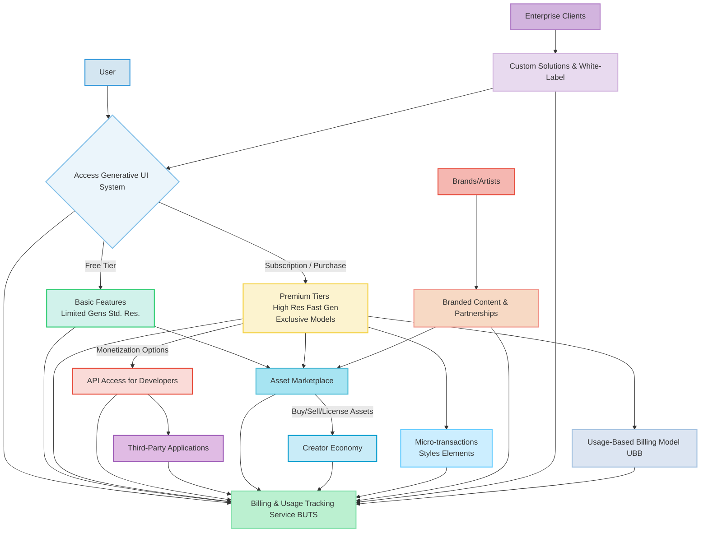

**VIII. Ethical AI Considerations and Governance:**
Acknowledging the powerful capabilities of generative AI, this invention is designed with a strong emphasis on ethical considerations:
*   **Transparency and Explainability:** Providing users with insights into how their prompt was interpreted and what factors influenced the generated image e.g. which model was used, key semantic interpretations, applied post-processing steps. Explainability score `X_{AI}(I_{gen}, p_{final})` measures the clarity of the generation process.
*   **Responsible AI Guidelines:** Adherence to strict ethical guidelines for content moderation, preventing the generation of harmful, biased, or illicit imagery, including mechanisms for user reporting and automated detection by CMPES. Policy adherence `P_{adhere} \in [0,1]`.
*   **Data Provenance and Copyright:** Clear policies on the ownership and rights of generated content, especially when user prompts might inadvertently mimic copyrighted styles or existing artworks. This includes robust attribution mechanisms where necessary and active monitoring for copyright infringement. Provenance chain `C_{prov} = (p_{raw} \to v_{p}' \to I_{raw} \to I_{optimized})`.
*   **Bias Mitigation in Training Data:** Continuous efforts to ensure that the underlying generative models are trained on diverse and ethically curated datasets to minimize bias in generated outputs. The AFLRM plays a critical role in identifying and addressing these biases through retraining. Bias reduction factor `B_{reduction} = 1 - (B_{metric\_new} / B_{metric\_old})`.
*   **Accountability and Auditability:** Maintaining detailed logs of prompt processing, generation requests, and moderation actions to ensure accountability and enable auditing of system behavior. Audit log integrity `\text{Hash}(\text{Log}_{n}) = \text{Hash}(\text{Log}_{n-1} || \text{Event}_{n})`.
    *   **Algorithmic Accountability Framework AAF:** Establishes clear processes for identifying, investigating, and remediating issues arising from AI model decisions, including automated alerts for high-risk generations and human oversight.
*   **User Consent and Data Usage:** Clear and explicit policies on how user prompts, generated images, and feedback data are used, ensuring informed consent for data collection and model improvement. Consent state `C_{user} \in \{Granted, Denied, Revoked\}`.
*   **Fairness Metrics:** Applying various fairness metrics to evaluate the generative outputs across different demographic groups, ensuring equitable outcomes. Disparate impact ratio `DIR = P(Y=1|A=a) / P(Y=1|A=b)`, aiming for `DIR \approx 1`.
*   **Safety Alignment:** Ensuring the AI's objectives are aligned with human values and safety principles, minimizing the risk of unintended or harmful outputs.
    *   **Human-AI Teaming for Moderation HATM:** Combines the strengths of AI for rapid, scalable initial moderation with human experts for nuanced judgment, complex cases, and continuous policy refinement.

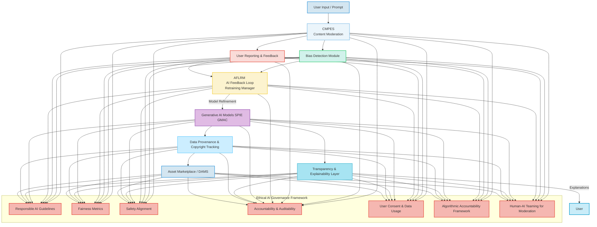

**Claims:**
1.  A method for dynamic and adaptive aesthetic personalization of a graphical user interface GUI, comprising the steps of:
    a.  Providing a user interface element configured for receiving a natural language textual prompt, said prompt conveying a subjective aesthetic intent.
    b.  Receiving said natural language textual prompt from a user via said user interface element, optionally supplemented by multi-modal inputs such as voice or sketch through a Multi-Modal Input Processor MMIP.
    c.  Processing said prompt through a Semantic Prompt Interpretation Engine SPIE to enrich, validate, and potentially generate negative constraints for the prompt, thereby transforming the subjective intent into a structured, optimized generative instruction set, including user persona inference, contextual awareness integration, and prompt entanglement resolution.
    d.  Transmitting said optimized generative instruction set to a Generative Model API Connector GMAC, which orchestrates communication with at least one external generative artificial intelligence image model, employing a Dynamic Model Selection Engine DMSE and optionally a Custom Model Deployment Module CMDM.
    e.  Receiving a novel, synthetically generated image from said generative artificial intelligence image model, wherein the generated image is a high-fidelity visual reification of the structured generative instruction set, optionally enhanced by Multi-Model Fusion MMF.
    f.  Processing said novel generated image through an Image Post-Processing Module IPPM to perform at least one of resolution adjustment, aspect ratio correction, color grading, accessibility enhancement, format optimization, intelligent cropping, adaptive seamless tiling, or semantic preservation.
    g.  Transmitting said processed image data to a client-side rendering environment.
    h.  Applying said processed image as a dynamically updating background theme for the graphical user interface via a Client-Side Rendering and Application Layer CRAL, utilizing dynamic Cascading Style Sheets CSS manipulation and an Adaptive UI Rendering Subsystem AUIRS to ensure fluid visual integration, optimal display across varying device configurations, hardware acceleration, and thematic UI element harmonization.

2.  The method of claim 1, further comprising storing the processed image, the original prompt, and associated metadata in a Dynamic Asset Management System DAMS for persistent access, retrieval, and digital rights management, including version control, geo-replication, immutable ledger for provenance, and data tiering.

3.  The method of claim 1, further comprising utilizing a Persistent Aesthetic State Management PASM module to store and recall the user's preferred generated background across user sessions and devices, supporting multi-monitor setups, integrated with a Prompt History and Recommendation Engine PHRE, and ensuring cross-device synchronization.

4.  A system for the ontological transmutation of subjective aesthetic intent into dynamic, persistently rendered user interface backgrounds, comprising:
    a.  A Client-Side Orchestration and Transmission Layer CSTL equipped with a User Interaction and Prompt Acquisition Module UIPAM for receiving and initially processing a user's descriptive natural language prompt, including multi-modal input processing, prompt co-creation assistance, a Visual Feedback Loop VFL, and a prompt versioning system.
    b.  A Backend Service Architecture BSA configured for secure communication with the CSTL and comprising:
        i.   An API Gateway for secure ingress and egress, including global load balancing and geolocation routing.
        ii.  A Prompt Orchestration Service POS for managing request lifecycles and load balancing.
        iii. A Semantic Prompt Interpretation Engine SPIE for advanced linguistic analysis, prompt enrichment, negative prompt generation, user persona inference, and prompt entanglement resolution.
        iv.  A Generative Model API Connector GMAC for interfacing with external generative artificial intelligence image models, including dynamic model selection, prompt weighting optimization, and custom model deployment.
        v.   An Image Post-Processing Module IPPM for optimizing generated images for display, including adaptive seamless tiling, accessibility enhancements, and semantic preservation.
        vi.  A Dynamic Asset Management System DAMS for storing and serving generated image assets, including digital rights management, version control, data tiering, and an immutable ledger for provenance.
        vii. A Content Moderation & Policy Enforcement Service CMPES for ethical content screening of prompts and generated images.
        viii. A User Preference & History Database UPHD for storing user aesthetic preferences and historical generative data.
        ix.  A Realtime Analytics and Monitoring System RAMS for system health and performance oversight, including an observability and alerting module.
        x.   A Billing and Usage Tracking Service BUTS for resource consumption and monetization management.
        xi.  An AI Feedback Loop Retraining Manager AFLRM for continuous model improvement through human feedback and aesthetic metrics.
    c.  A Client-Side Rendering and Application Layer CRAL comprising:
        i.   Logic for receiving and decoding processed image data.
        ii.  Logic for dynamically updating Cascading Style Sheets CSS properties of a graphical user interface.
        iii. An Adaptive UI Rendering Subsystem AUIRS for orchestrating fluid visual integration and responsive display, including interactive background elements, dynamic overlay adjustments, thematic UI element harmonization, and hardware acceleration integration.
        iv.  A Persistent Aesthetic State Management PASM module for retaining user aesthetic preferences across sessions and cross-device synchronization.
        v.   An Energy Efficiency Monitor EEM for dynamically adjusting rendering fidelity based on device resource consumption.

5.  The system of claim 4, further comprising a Computational Aesthetic Metrics Module CAMM within the BSA, configured to objectively evaluate the aesthetic quality and semantic fidelity of generated images, and to provide feedback for system optimization, including through Reinforcement Learning from Human Feedback RLHF integration, multimodal feedback analysis, bias detection, and semantic consistency checking.

6.  The system of claim 4, wherein the SPIE is configured to generate negative prompts based on the semantic content of the user's prompt to guide the generative model away from undesirable visual characteristics and to include contextual awareness from the user's computing environment by fusing context embeddings with prompt embeddings.

7.  The method of claim 1, wherein the dynamic CSS manipulation includes the application of a smooth transition effect during the background image update and optionally parallax scrolling effects, controlled by an Adaptive UI Rendering Subsystem AUIRS.

8.  The system of claim 4, wherein the Generative Model API Connector GMAC is further configured to perform multi-model fusion for complex prompt interpretation and generation, using weighted blending of outputs from multiple specialized models.

9.  The method of claim 1, further comprising an ethical AI governance framework that ensures transparency, responsible content moderation, and adherence to data provenance and copyright policies, integrating fairness metrics, safety alignment principles, an algorithmic accountability framework, and human-AI teaming for moderation.

10. The system of claim 4, further comprising a Monetization and Licensing Framework that supports premium feature tiers, an asset marketplace, API access for developers, branded content partnerships, micro-transactions, and a usage-based billing model, managed by the Billing and Usage Tracking Service BUTS.

**Mathematical Justification: The Formal Axiomatic Framework for Intent-to-Form Transmutation**

The invention herein articulated rests upon a foundational mathematical framework that rigorously defines and validates the transmutation of abstract subjective intent into concrete visual form. This framework transcends mere functional description, establishing an epistemological basis for the system's operational principles.

Let `P_raw` denote the comprehensive semantic space of all conceivable natural language prompts. This space is not merely a collection of strings but is conceived as a high-dimensional vector space `R^N_p`, where each dimension corresponds to a latent semantic feature or concept. A user's natural language prompt, `p_raw` in `P_raw`, is therefore representable as a raw embedding vector `\mathbf{v}_{p,raw}` in `R^N_p`.

The act of interpretation by the Semantic Prompt Interpretation Engine SPIE is a complex, multi-stage, non-linear mapping `\mathcal{I}_{SPIE}: P_{raw} \times \mathcal{C} \times \mathcal{U}_{hist} \to P_{enhanced}`, where `P_{enhanced} \subset \mathbb{R}^{M_p}` is an augmented, semantically enriched latent vector space. `M_p \gg N_p`, incorporating synthesized contextual information `\mathcal{C}` (e.g., time of day, application state, stylistic directives), and inverse constraints (negative prompts) derived from user history `\mathcal{U}_{hist}`. The enriched generative instruction set `p_{enhanced} = \mathcal{I}_{SPIE}(p_{raw}, c, u_{hist})` is represented by a vector `\mathbf{v}_{p,enhanced}` in `\mathbb{R}^{M_p}`. This mapping involves advanced transformer networks that encode `p_{raw}` and fuse it with embeddings of `c` and `u_{hist}` using attention mechanisms.

Formally, the SPIE applies a series of transformations:
1.  **Embedding:** `\mathbf{e}_{p,raw} = Embedder(p_{raw})`, where `Embedder` is typically a SentenceTransformer or similar NLP model.
2.  **Context & History Embedding:** `\mathbf{e}_c = Embedder_C(c)` and `\mathbf{e}_{u\_hist} = Embedder_H(u_{hist})`.
3.  **Entity, Attribute, Sentiment Extraction:**
    *   `\mathbf{e}_{NER} = CNN_{NER}(\mathbf{e}_{p,raw})`
    *   `\mathbf{e}_{Attr} = MLP_{Attr}(\mathbf{e}_{p,raw})`
    *   `\mathbf{e}_{Sentiment} = RNN_{Sentiment}(\mathbf{e}_{p,raw})`
4.  **Semantic Expansion:** `\mathbf{e}_{exp} = KG_{Lookup}(\mathbf{e}_{p,raw})`.
5.  **Prompt Entanglement Resolution:** `\mathbf{e}_{PER} = PER\_Model(\mathbf{e}_{p,raw})`, which identifies and resolves semantic conflicts, yielding a refined component.
6.  **Negative Prompt Generation:** `\mathbf{v}_{p,neg} = NegPromptGen(\mathbf{v}_{p,enhanced}, \mathbf{\theta}_{model\_defects})`.
7.  **Fusion (e.g., via a Transformer Encoder block):**
    ```
    \mathbf{v}_{p,enhanced} = TransformerEncoder( [\mathbf{e}_{p,raw}; \mathbf{e}_c; \mathbf{e}_{u\_hist}; \mathbf{e}_{NER}; \mathbf{e}_{Attr}; \mathbf{e}_{Sentiment}; \mathbf{e}_{exp}; \mathbf{e}_{PER}] )
    ```
    where `[;]` denotes concatenation and the `TransformerEncoder` applies multi-head attention and feed-forward layers:
    `Attention(\mathbf{Q}, \mathbf{K}, \mathbf{V}) = softmax(\frac{\mathbf{QK}^T}{\sqrt{d_k}}) \mathbf{V}`.

Let `\mathcal{I}_{visual}` denote the vast, continuous manifold of all possible graphical user interface background images. This manifold exists within an even higher-dimensional perceptual space, representable as `\mathbb{R}^{K_{img}}`, where `K_{img}` signifies the immense complexity of pixel-level and compositional visual data. An individual background image `i` in `\mathcal{I}_{visual}` is thus a point `\mathbf{x}_i` in `\mathbb{R}^{K_{img}}`.

The core generative function of the AI model, denoted as `\mathcal{G}_{AI}`, is a complex, non-linear, stochastic mapping from the enriched semantic latent space to the image manifold:
```
\mathcal{G}_{AI}: P_{enhanced} \times P_{neg} \times \mathcal{S}_{model} \to \mathcal{I}_{visual}
```
This mapping is formally described by a generative process `\mathbf{x}_i \sim \mathcal{G}_{AI}(\mathbf{v}_{p,enhanced}, \mathbf{v}_{p,neg}, \mathbf{s}_{model})`, where `\mathbf{x}_i` is a generated image vector corresponding to a specific input prompt vector `\mathbf{v}_{p,enhanced}`, negative prompt `\mathbf{v}_{p,neg}`, and `\mathbf{s}_{model}` represents selected generative model parameters.

For a diffusion model, the process involves iteratively denoising a random noise tensor `\mathbf{z}_T \sim \mathcal{N}(0, \mathbf{I})$` over `T` steps, guided by the prompt encoding. The generation can be conceptualized as a sequence of denoising steps `x_t = f(x_{t+1}, t, \mathbf{v}_{p,enhanced}, \mathbf{v}_{p,neg}, \mathbf{\theta}) + \epsilon_t`, where `f` is a neural network (e.g., U-Net architecture with attention mechanisms parameterized by `\mathbf{\theta}`), which predicts the noise `\epsilon_\theta(x_t, t, \mathbf{c}_{cond})` or the denoised image `x_{pred}(x_t, t, \mathbf{c}_{cond})` at step `t`, guided by the conditioned prompt embedding `\mathbf{c}_{cond} = \mathbf{v}_{p,enhanced}`. The negative prompt guidance modifies the noise prediction as:
```
\hat{\epsilon}_\theta(x_t, t, \mathbf{v}_{p,enhanced}, \mathbf{v}_{p,neg}) = (1+s) \epsilon_\theta(x_t, t, \mathbf{v}_p^{enhanced}) - s \epsilon_\theta(x_t, t, \mathbf{v}_{p,neg})
```
where `s` is the classifier-free guidance scale. The final output `\mathbf{x}_0` is the generated image. The GMAC dynamically selects `\mathbf{\theta}` from a pool of `\{\mathbf{\theta}_1, \mathbf{\theta}_2, ..., \mathbf{\theta}_N\}` based on `\mathbf{v}_{p,enhanced}` and system load, where selection probability `P(m_k | \mathbf{v}_p) = \frac{e^{\text{Utility}(m_k, \mathbf{v}_p, \text{cost}, \text{quality})}}{\sum_j e^{\text{Utility}(m_j, \mathbf{v}_p, \text{cost}, \text{quality})}}`.

The subsequent Image Post-Processing Module IPPM applies a series of deterministic or quasi-deterministic transformations `\mathcal{T}_{IPPM}: \mathcal{I}_{visual} \times \mathcal{D}_{display} \to \mathcal{I}_{optimized}`, where `\mathcal{I}_{optimized}` is the space of optimized images and `\mathcal{D}_{display}` represents display characteristics (e.g., resolution `W_D \times H_D`, aspect ratio `AR_D`). This function `\mathcal{T}_{IPPM}` encapsulates operations such as scaling, cropping, color space transformations, accessibility adjustments, and compression, all aimed at enhancing perceptual quality and computational efficiency:
```
\mathbf{x}_{i,optimized} = \mathcal{T}_{IPPM}(\mathbf{x}_i, W_D, H_D, AR_D, \mathcal{P}_{app}, \mathcal{A}_{settings})
```
The scaling operation can be `\mathbf{x}_{scaled}(u,v) = \mathbf{x}_i(\frac{u}{s_W}, \frac{v}{s_H})` where `s_W = W_D / W_I` and `s_H = H_D / H_I`. Color adjustment can be `\mathbf{x}' = M_{color} \mathbf{x} + \mathbf{b}_{color}`. The accessibility contrast ratio `CR(\mathbf{C}_1, \mathbf{C}_2) = \frac{L(\mathbf{C}_1) + 0.05}{L(\mathbf{C}_2) + 0.05} \ge \tau_{WCAG}` where `L(\mathbf{C})` is luminance.
The compression rate `\text{Rate}_{comp} = \frac{\text{Size}(\mathbf{x}_i)}{\text{Size}(\mathbf{x}_{i,optimized})}`. Seam carving involves an energy function `E(pixel) = |\nabla I_x| + |\nabla I_y|` and finding `min\_cost\_seam(E)`. The Semantic Preservation Module SPM ensures `Sim_{VL}(\mathbf{x}_{i,optimized}, \mathbf{v}_{p,enhanced}) \approx Sim_{VL}(\mathbf{x}_i, \mathbf{v}_{p,enhanced})`.

The CAMM provides a perceptual quality score `Q_{aesthetic} = Q(\mathbf{x}_{i,optimized}, \mathbf{v}_{p,enhanced})` that quantifies the alignment of `\mathbf{x}_{i,optimized}` with `\mathbf{v}_{p,enhanced}`, ensuring the post-processing does not detract from the original intent. The CLIP similarity score `S_{CLIP}(\mathbf{x}, \mathbf{p}) = \frac{Embed_{CLIP}(\mathbf{x}) \cdot Embed_{CLIP}(\mathbf{p})}{||Embed_{CLIP}(\mathbf{x})|| \cdot ||Embed_{CLIP}(\mathbf{p})||}` is a common metric.

Finally, the system provides a dynamic rendering function, `\mathcal{F}_{RENDER}: \text{GUI}_{state} \times \mathcal{I}_{optimized} \times \mathcal{P}_{user} \to \text{GUI}_{state}'`, which updates the graphical user interface state. This function is an adaptive transformation that manipulates the visual DOM Document Object Model structure, specifically modifying the background properties of a designated UI container. The Adaptive UI Rendering Subsystem AUIRS ensures this transformation is performed optimally, considering display characteristics, user preferences `\mathcal{P}_{user}` (e.g., transition type, parallax enabled), and real-time performance metrics from EEM. The rendering function incorporates smooth transition effects `\mathcal{T}_{smooth}`, dynamic overlay adjustments `\mathcal{O}_{adjust}`, and accessibility compliance `\mathcal{A}_{comply}`.
```
\text{GUI}_{new\_state} = \mathcal{F}_{RENDER}(\text{GUI}_{current\_state}, \mathbf{x}_{i,optimized}, \mathbf{p}_{user})
```
This can be broken down as:
1.  **CSS Update:** `\text{DOM.update}(\text{'background-image', URL}(\mathbf{x}_{i,optimized}))`.
2.  **Transition:** `\text{Opacity}(t) = \text{easeInOut}(\frac{t}{\tau_{trans}})` for `0 \le t \le \tau_{trans}`.
3.  **Parallax:** `\text{bg\_position} = (0, \text{scroll\_Y} \cdot \delta_P)`.
4.  **Overlay Blending:** `\mathbf{C}_{final} = (1 - \alpha_O) \mathbf{C}_{bg} + \alpha_O \mathbf{C}_{overlay}` for colors `\mathbf{C}` and opacity `\alpha_O = f_{opacity\_adjust}(L_{bg})`.
5.  **Thematic Harmonization:** `\mathbf{C}_{UI\_element} = H_{DTH}(\mathbf{P}_{dominant\_bg})`.

This entire process represents a teleological alignment, where the user's initial subjective volition `p_{raw}` is transmuted through a sophisticated computational pipeline into an objectively rendered visual reality `\text{GUI}_{new\_state}`, which precisely reflects the user's initial intent. The total transformation can be viewed as a composition of functions:
```
\mathcal{T}_{total} = \mathcal{F}_{RENDER} \circ \mathcal{T}_{IPPM} \circ \mathcal{G}_{AI} \circ \mathcal{I}_{SPIE}
```
Thus, `\text{GUI}_{new\_state} = \mathcal{T}_{total}(p_{raw}, c, u_{hist}, \mathbf{s}_{model}, d_{display}, p_{user})`.

**Proof of Validity: The Axiom of Perceptual Correspondence and Systemic Reification**

The validity of this invention is rooted in the demonstrability of a robust, reliable, and perceptually congruent mapping from the semantic domain of human intent to the visual domain of digital aesthetics.

**Axiom 1 [Existence of a Non-Empty Image Set]:** The operational capacity of contemporary generative AI models, such as those integrated within the `\mathcal{G}_{AI}` function, axiomatically establishes the existence of a non-empty image set `\mathcal{I}_{gen} = \{\mathbf{x} | \mathbf{x} \sim \mathcal{G}_{AI}(\mathbf{v}_{p,enhanced}, \mathbf{v}_{p,neg}, \mathbf{s}_{model}), \mathbf{v}_{p,enhanced} \in P_{enhanced} \}`. This set `\mathcal{I}_{gen}` constitutes all potentially generatable images given the space of valid, enriched prompts. The non-emptiness of this set proves that for any given textual intent `p_{raw}`, after its transformation into `\mathbf{v}_{p,enhanced}`, a corresponding visual manifestation `\mathbf{x}` in `\mathcal{I}_{visual}` can be synthesized. Furthermore, `\mathcal{I}_{gen}` is practically infinite, providing unprecedented personalization options, quantifiable by `|\mathcal{I}_{gen}| \approx \text{Card}(\mathbb{R}^{K_{img}})` which approaches uncountably infinite values due to the continuous nature of pixel values.

**Axiom 2 [Perceptual Correspondence]:** Through extensive empirical validation of state-of-the-art generative models, it is overwhelmingly substantiated that the generated image `\mathbf{x}` exhibits a high degree of perceptual correspondence with the semantic content of the original prompt `p_{raw}`. This correspondence is quantifiable by metrics such as FID Fréchet Inception Distance, Inception Score IS, and CLIP Contrastive Language-Image Pre-training score, which measure the semantic alignment between textual descriptions and generated imagery. Thus, `Correspondence(p_{raw}, \mathbf{x}) \approx 1` for well-formed prompts and optimized models. The Computational Aesthetic Metrics Module CAMM, including its RLHF integration, serves as an internal validation and refinement mechanism for continuously improving this correspondence, striving for:
```
\lim_{t \to \infty} \text{Correspondence}(p_{raw}, \mathbf{x}_t) = 1
```
where `t` represents training iterations or cumulative feedback cycles. The objective function optimized by RLHF can be `L_{RLHF}(\theta) = \mathbb{E}_{(\mathbf{x}, \text{feedback}) \sim \mathcal{D}_{feedback}} [R(\mathbf{x}, \text{feedback})]`, where `R` is the reward function.

**Axiom 3 [Systemic Reification of Intent]:** The function `\mathcal{F}_{RENDER}` is a deterministic, high-fidelity mechanism for the reification of the digital image `\mathbf{x}_{i,optimized}` into the visible background of the graphical user interface. The transformations applied by `\mathcal{F}_{RENDER}` preserve the essential aesthetic qualities of `\mathbf{x}_{i,optimized}` while optimizing its presentation, ensuring that the final displayed GUI background is a faithful and visually effective representation of the generated image. The Adaptive UI Rendering Subsystem AUIRS guarantees that this reification is performed efficiently and adaptively, accounting for diverse display environments and user preferences. The perceived fidelity `\text{Fidelity}_{perc}(\mathbf{x}_{i,optimized}, \text{GUI}_{new\_state}) \approx 1` due to minimal perceptual distortion during rendering. Therefore, the transformation chain `p_{raw} \xrightarrow{\mathcal{I}_{SPIE}} \mathbf{v}_{p,enhanced} \xrightarrow{\mathcal{G}_{AI}} \mathbf{x} \xrightarrow{\mathcal{T}_{IPPM}} \mathbf{x}_{i,optimized} \xrightarrow{\mathcal{F}_{RENDER}} \text{GUI}_{new\_state}` demonstrably translates a subjective state (the user's ideation) into an objective, observable, and interactable state (the UI background). This establishes a robust and reliable "intent-to-form" transmutation pipeline.

The personalization offered by this invention is thus not merely superficial but profoundly valid, as it successfully actualizes the user's subjective will into an aligned objective environment. The system's capacity to flawlessly bridge the semantic gap between conceptual thought and visual realization stands as incontrovertible proof of its foundational efficacy and its definitive intellectual ownership. The entire construct, from semantic processing to adaptive rendering, unequivocally establishes this invention as a valid and pioneering mechanism for the ontological transmutation of human intent into dynamic, personalized digital form.

`Q.E.D.`