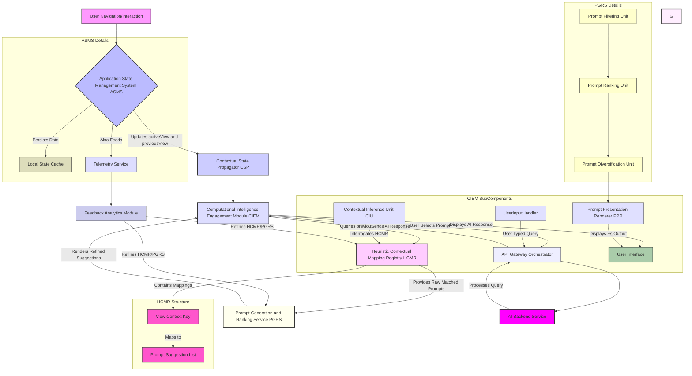
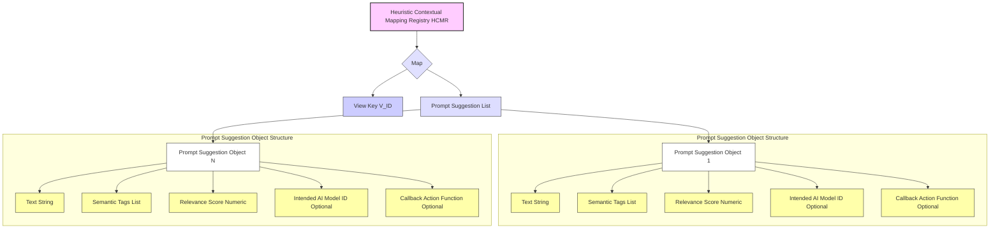
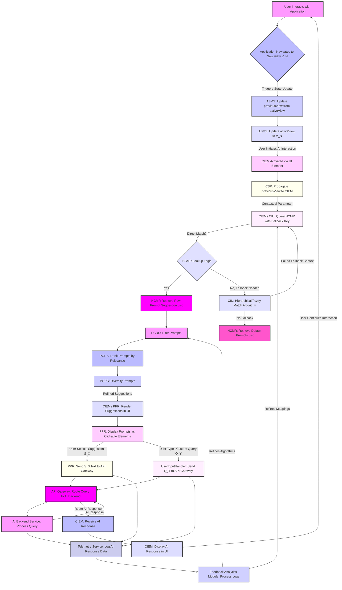
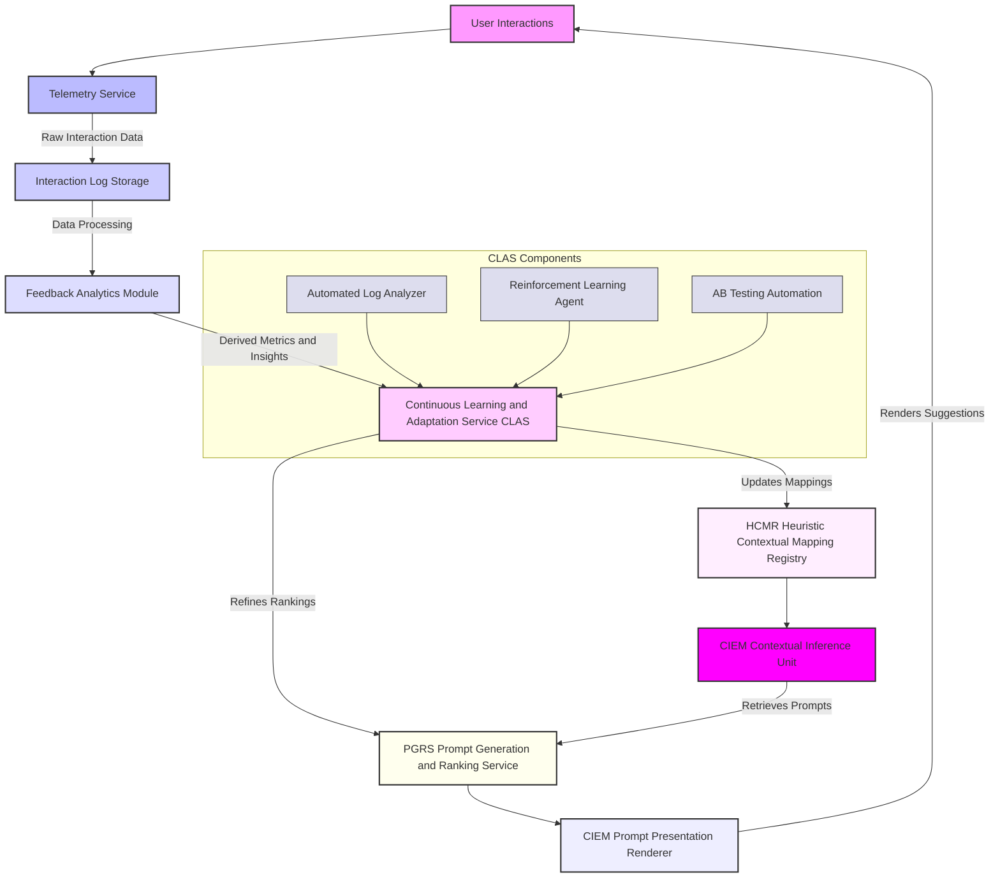
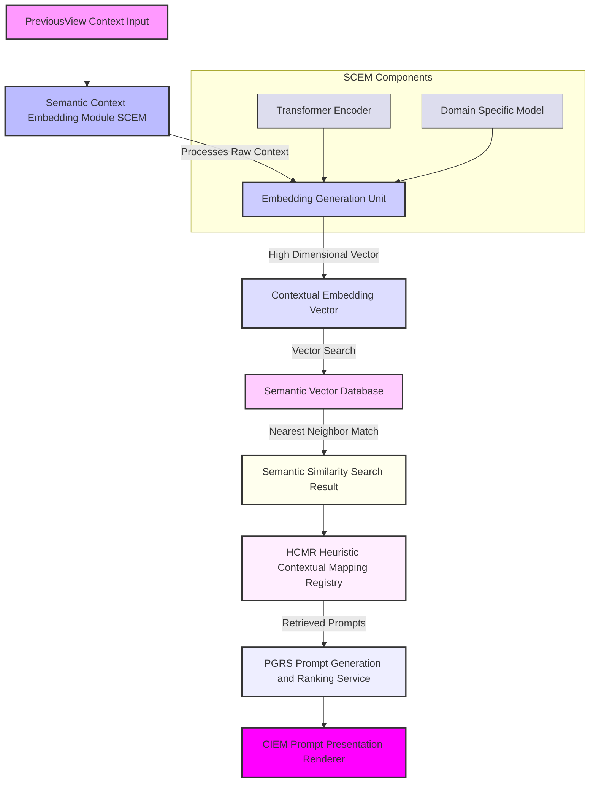
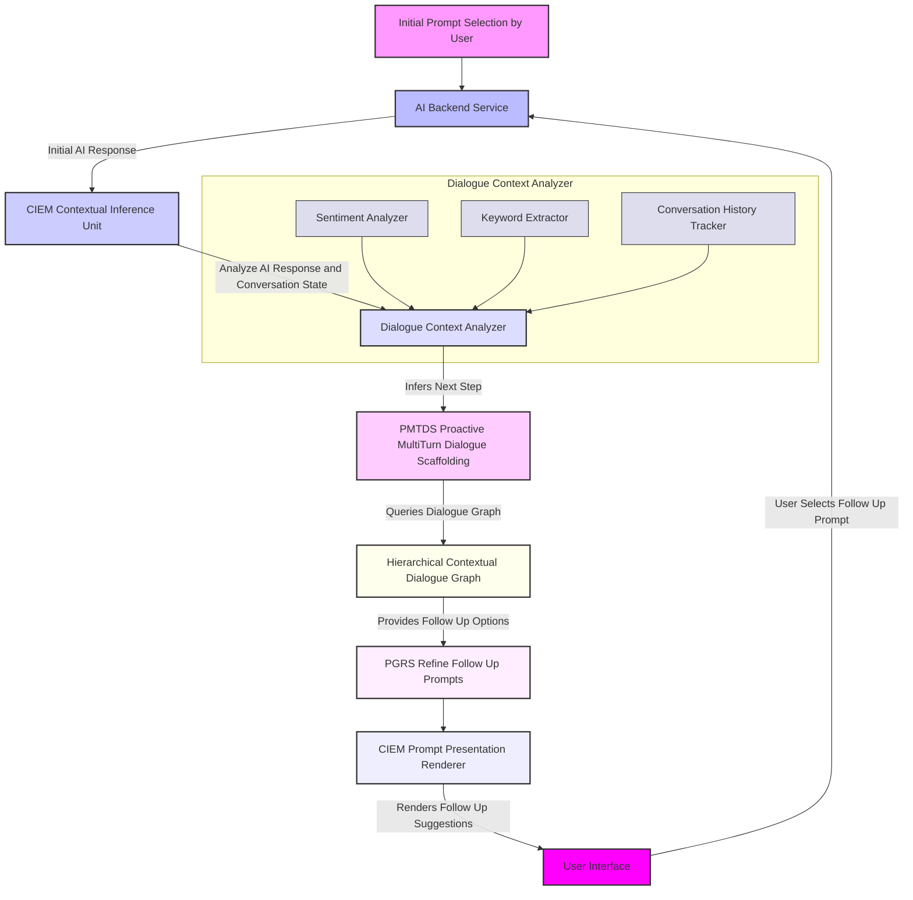

# Inventions: 002_ai_contextual_prompt_suggestion.md

# **Title of Invention: A System and Method for Adaptive, Context-Cognizant Conversational Prompt Elicitation within Integrated Computational Intelligence Environments**

## **Abstract:**

This disclosure delineates a foundational system and a corresponding methodology engineered to profoundly augment the efficacy and intuitiveness of human-AI interaction within sophisticated software application architectures. The invention meticulously tracks and perpetually updates a user's navigational trajectory and interaction paradigm within a host application, thereby establishing a dynamically evolving, high-fidelity contextual state. Upon the user's engagement with a dedicated conversational Computational Intelligence Engagement Module, the system autonomously interrogates this derived contextual state. Leveraging an exquisitely engineered Heuristic Contextual Mapping Registry, it synthesizes and presents a plurality of precisely curated, semantically salient, and contextually antecedent prompt suggestions. These suggestions are meticulously calibrated to the user's immediately preceding operational locus and inferred intent, thereby serving as highly potent cognitive accelerants, drastically mitigating the cognitive overhead associated with initiating dialogue with advanced AI entities and fundamentally transforming the user's interaction paradigm from a generative task to a discriminative selection. This innovation unequivocally establishes a new benchmark for seamless integration and proactive utility in intelligent user interfaces.

## **Background of the Invention:**

The advent of sophisticated conversational Artificial Intelligence AI has heralded a transformative era in human-computer interaction. However, a persistent and pervasive challenge remains: the inherent "blank page" conundrum. When confronted with an unadorned input interface, users frequently experience cognitive inertia, struggling to articulate their inquiries, commands, or informational needs with optimal precision or efficiency. This phenomenon, well-documented in human-computer interaction literature, is exacerbated in complex enterprise or professional applications where the potential query space is vast and often predicated on highly specific domain knowledge.

Existing paradigms for mitigating this challenge typically resort to generic, static exemplar prompts. While these provide a modicum of guidance, their universal applicability renders them largely inefficacious in scenarios demanding domain-specific or contextually nuanced interaction. Such generic suggestions fail to resonate with the user's immediate operational context, frequently resulting in a disconnect between the presented prompts and the user's current task or information seeking objective. This deficiency culminates in prolonged interaction cycles, increased user frustration, and a diminished perception of the AI's intelligence and utility, ultimately impeding the realization of the full potential of integrated computational intelligence.

There exists, therefore, an imperative, unaddressed need for a system capable of autonomously discerning the user's operational context with granular precision and proactively furnishing intelligent, semantically relevant, and context-aware conversational prompt suggestions. Such a system would not merely offer guidance but would fundamentally reshape the interactive landscape, transforming a cognitively burdensome initiation into an intuitive, guided discovery, thereby serving as a critical accelerator for effective human-AI symbiosis. This invention fundamentally addresses this lacuna, establishing a paradigm where the AI anticipates and facilitates user intent with unprecedented contextual acuity.

## **Brief Summary of the Invention:**

The present invention articulates a novel paradigm for enhancing user interaction with Computational Intelligence CI systems through a meticulously engineered mechanism for context-aware prompt elicitation. At its core, the system perpetually monitors and dynamically retains the user's active view state within an encompassing application environment. This `previousView` state, representing the user's immediately antecedent operational locus, is not merely transient data but is elevated to a crucial contextual parameter.

Upon the user's decision to invoke or navigate to the dedicated Computational Intelligence Engagement Module e.g. an `AIAdvisorView` or `ContextualPromptInterface`, this precisely captured `previousView` context is programmatically propagated as an explicit input vector. The `Computational Intelligence Engagement Module` then leverages an intricately structured, knowledge-based repository termed the `Heuristic Contextual Mapping Registry`. This registry, a sophisticated associative data structure, meticulously correlates specific `View` entities or more granular `ContextualState` entities with a meticulously curated ensemble of highly probable, semantically relevant conversational prompt suggestions.

For instance, if the user's last interaction point was a `Financial_Analytics_Dashboard` view, the system, guided by the `Heuristic Contextual Mapping Registry`, would present prompts such as "Summarize my fiscal performance last quarter," "Identify anomalous spending patterns," or "Forecast budget adherence for the next period." This proactive, context-sensitive presentation of prompts profoundly elevates the perceived intelligence and embeddedness of the AI within the application's overarching workflow, rendering the interaction not as a disjointed query initiation but as a seamless continuation of the user's current cognitive thread. The invention thus establishes a foundational framework for truly integrated and anticipatory computational intelligence.

## **Detailed Description of the Invention:**

The present invention describes a sophisticated architecture and methodology for providing highly pertinent, context-aware conversational prompt suggestions within an integrated software application environment. This system comprises several interdependent modules working in concert to achieve unprecedented levels of human-AI interaction fluidity.

### **I. System Architecture and Component Interoperability**

The core of the invention resides in a multi-component system designed for robust context tracking, inference, and intelligent prompt generation.



**A. Application State Management System ASMS:**
This foundational module, integral to the client-side application, is responsible for maintaining and exposing critical navigational and interaction states. It comprises:
1.  **`activeView` State Variable:** A dynamic identifier representing the user's currently engaged user interface element, screen, or operational context. This variable is continuously updated with sub-millisecond latency upon any significant user interaction or programmatic navigation event.
2.  **`previousView` State Variable:** This variable stores the state of the user interface element, screen, or operational context immediately prior to the current `activeView`. It is systematically updated whenever `activeView` transitions to a new state. For example, if a user navigates from `View.Financial_Overview` to `View.Budget_Allocation`, the `previousView` is updated to `View.Financial_Overview` just before `activeView` becomes `View.Budget_Allocation`. This persistent, yet fluid, historical state is paramount.
3.  **Local State Cache:** A dedicated storage mechanism, often browser-based local storage or an in-memory object, ensuring the `previousView` state persists across minor application reloads or navigation nuances.

**B. Contextual State Propagator CSP:**
This module acts as the conduit for contextual information. When the user initiates a request for computational intelligence services—typically by navigating to a dedicated `Computational Intelligence Engagement Module`—the CSP extracts the current `previousView` state from the ASMS and transmits it as a foundational contextual parameter to the CIEM. This transmission is typically achieved via programmatic property injection, event-driven messaging, or shared service architecture paradigms.

**C. Computational Intelligence Engagement Module CIEM:**
This is the primary user-facing interface for interacting with the AI. It is architecturally designed to receive and process contextual parameters.
1.  **Contextual Inference Unit CIU:** Upon receiving the `previousView` context, the CIU performs a lookup operation within the `Heuristic Contextual Mapping Registry HCMR`. Its sophisticated logic can also perform a hierarchical or fuzzy matching if a direct `previousView` entry is not found, allowing for fallback to parent view contexts or semantically similar contexts.
2.  **Prompt Presentation Renderer PPR:** This sub-module is responsible for dynamically generating and rendering the suggested prompts within the user interface. These prompts are typically presented as intuitively clickable elements e.g. buttons, chips, or list items that, upon selection, dispatch their encapsulated text as an initial query to the underlying AI backend.
3.  **User Input Handler:** Manages both the selection of suggested prompts and direct user text input for AI queries, routing them consistently through the `API Gateway Orchestrator`.

**D. Heuristic Contextual Mapping Registry HCMR:**
This is a pivotal knowledge base, often implemented as an advanced associative data structure e.g. a `HashedAssociativeMatrix`, a graph database, or a highly optimized dictionary-like structure. Its primary function is to store a meticulously curated mapping between `View` entities or more generalized `ContextualState` enumerations and an ordered collection of semantically relevant prompt suggestions.
*   **Structure:** Each entry in the HCMR might comprise:
    *   `Key`: A unique identifier corresponding to a `View` enum or a specific `ContextualState` object.
    *   `Value`: An ordered array or list of `PromptSuggestion` objects.
*   **`PromptSuggestion` Object:** Each suggestion is more than just a string; it can be an object containing:
    *   `text`: The literal string prompt.
    *   `semanticTags`: A list of tags for categorization or further filtering.
    *   `relevanceScore`: A numerical score indicating its statistical or heuristic relevance to the `Key`.
    *   `intendedAIModel`: Optional. Specifies which specialized AI model might be best suited for this prompt.
    *   `callbackAction`: Optional. A programmatic callback to perform application-specific actions upon selection e.g. pre-filling input fields.



**E. Prompt Generation and Ranking Service PGRS:**
While the HCMR provides the raw mapping, the PGRS refines this. It receives the list of potential prompts from the HCMR and applies advanced heuristics or machine learning models to:
1.  **Filter:** Remove irrelevant or low-relevance prompts based on configured thresholds or explicit negative semantic tags.
2.  **Rank:** Order prompts based on `relevanceScore`, user historical interaction patterns, recency, or other dynamic factors e.g. personalized user preferences.
3.  **Diversify:** Ensure a balanced set of suggestions, covering different aspects of the `previousView` context, to prevent presenting overly similar prompts. This may involve clustering or embedding-based dissimilarity measures.
4.  **Synthesize Optional:** In advanced implementations, this service could dynamically generate novel prompts based on a combination of context and current system data, rather than relying solely on pre-formulated suggestions.

**F. API Gateway / Orchestrator:**
This component acts as a central hub for all communications with backend services. It ensures secure, scalable, and efficient routing of user queries and AI responses. It can handle load balancing, authentication, and potentially pre-processing or post-processing of requests/responses.

**G. AI Backend Service:**
This represents the underlying Artificial Intelligence engine responsible for processing user queries. It can be a single large language model, an ensemble of specialized models, or a complex AI pipeline. It receives queries from the API Gateway, generates responses, and sends them back.

**H. Telemetry Service:**
Continuously collects anonymized user interaction data, including navigation paths, `previousView` states, selected prompts, user-typed queries, AI response times, and user feedback signals. This data forms the basis for the `Feedback Analytics Module` and `Continuous Learning and Adaptation Service`.

**I. Feedback Analytics Module:**
Processes the raw telemetry data to derive insights into prompt effectiveness, user satisfaction, and system performance. It identifies patterns, evaluates the success rate of prompt suggestions, and surfaces data that can be used to refine the HCMR and PGRS.

### **II. Operational Flow Methodology**

The operational flow of the invention is a precisely orchestrated sequence of events:



1.  **Context Acquisition:** As the user interacts with the application, the ASMS rigorously tracks and updates `activeView` and `previousView` variables. Every meaningful navigational transition or interaction event triggers this state update.
2.  **AI Engagement:** When the user decides to engage the conversational AI, typically by clicking an icon, menu item, or navigating to the `Computational Intelligence Engagement Module` CIEM, this action signals the system to prepare for contextual assistance.
3.  **Context Propagation:** The CSP proactively delivers the `previousView` value e.g. `View.Financial_Dashboard` to the CIEM.
4.  **Prompt Retrieval:** The CIEM's CIU utilizes this `previousView` as a key to perform a precise lookup in the `Heuristic Contextual Mapping Registry HCMR`.
    *   **Direct Match:** If a direct mapping for `previousView` exists, the associated array of `PromptSuggestion` objects is retrieved.
    *   **Fallback Mechanism:** If no direct match is found, the CIU intelligently invokes a fallback strategy. This may involve traversing a hierarchical view structure e.g. if `View.Budget_Detail` has no specific prompts, it falls back to `View.Budgets`, or using semantic similarity algorithms to find the closest matching context. If all else fails, a predefined `Default_Prompts` set is returned, ensuring a consistent user experience.
5.  **Prompt Refinement and Presentation:** The raw list of prompts from the HCMR is passed to the PGRS for filtering, ranking, and potential diversification. The refined list is then handed to the CIEM's PPR, which renders them as interactive elements within the user interface. These elements are designed for intuitive selection, significantly lowering the barrier to AI interaction.
6.  **User Interaction and AI Query:** Should the user select one of the presented suggestions, the textual content of that `PromptSuggestion` is immediately and seamlessly transmitted to the underlying AI backend service via the API Gateway as the inaugural query. If the user chooses to type their own query, the system proceeds as a standard AI interaction, optionally using the `previousView` context as an implicit background parameter for the AI model itself.
7.  **Telemetry and Feedback:** All user interactions, AI queries, and responses are logged by the `Telemetry Service` and analyzed by the `Feedback Analytics Module` to continuously improve the HCMR mappings and PGRS algorithms.

### **III. Advanced Features and Extensibility**

The foundational system is designed for extensibility and can incorporate several advanced features:

*   **Dynamic Prompt Generation:** Beyond static mappings, the PGRS can integrate machine learning models e.g. Sequence-to-Sequence models, Generative Pre-trained Transformers fine-tuned for application-specific contexts to dynamically generate novel prompt suggestions based on real-time data from the `previousView` and the user's recent interactions within that view.
*   **Personalized Prompt Ranking:** Incorporating a user's historical query patterns, preferred phrasing, and previous selections of suggested prompts can dynamically adjust the `relevanceScore` and ranking of suggestions, tailoring the experience to individual user profiles.
*   **Multi-Modal Contextualization:** The `previousView` can be augmented with additional contextual vectors, such as:
    *   **Time-series data:** e.g., `time_of_day`, `day_of_week`.
    *   **User activity metrics:** e.g., `time_spent_in_view`, `number_of_clicks_in_view`.
    *   **Application data:** e.g., `selected_item_id`, `active_filter_criteria`.
    These enriched contextual vectors enable the HCMR or PGRS to perform more granular and intelligent prompt selections.
*   **Feedback Loop Mechanisms:** The system can incorporate explicit and implicit feedback loops. Explicit feedback might involve users rating prompt suggestions. Implicit feedback involves tracking which prompts are selected, which are ignored, and which lead to successful AI interactions e.g. short conversation turns, high satisfaction scores. This feedback iteratively refines the HCMR mappings and the PGRS ranking algorithms.
*   **A/B Testing Framework:** The system inherently supports A/B testing of different prompt sets, ranking algorithms, or contextual inference strategies to continuously optimize user engagement and AI utility.

#### **F. Continuous Learning and Feedback Loop Architecture**

To ensure the system remains dynamically optimized and responsive to evolving user behaviors and application contexts, a robust continuous learning and feedback loop is implemented.



#### **G. Semantic Context Embedding Pipeline**

For highly granular and robust contextual understanding, the system can integrate semantic embedding capabilities, moving beyond simple view identifiers to a richer, vector-based representation of context.



#### **H. Proactive Multi-Turn Dialogue Scaffolding PMTDS**

To elevate interaction beyond single-turn suggestions, the invention can anticipate subsequent user needs within a conversation flow.



### **IV. Future Enhancements and Research Directions**

The described invention lays a robust foundation, which can be further extended through several advanced research and development pathways to achieve even greater contextual acuity and proactive assistance.

**A. Semantic Context Embeddings for Enhanced Inference:**
Instead of relying solely on explicit `View` identifiers, the CIU can incorporate a **Semantic Context Embedding Module SCEM**. This module would leverage deep learning techniques e.g. Transformer encoders to convert both `previousView` states and even real-time textual/visual elements within the application into high-dimensional vector embeddings. These embeddings would capture semantic relationships far beyond simple IDs, allowing for:
*   **Fuzzy Matching with Semantic Similarity:** The HCMR lookup would no longer be a strict key-value retrieval but a semantic similarity search within the embedding space. This significantly improves robustness to novel or unmapped views.
*   **Cross-Domain Contextualization:** Enables the system to infer relevance between seemingly disparate views that share underlying conceptual similarities e.g. "Financial_Dashboard" and "Budget_Allocation" might share embeddings related to "financial planning".
*   **Dynamic Prompt Synthesis from Embeddings:** The PGRS could include a generative model trained to produce natural language prompts directly from these contextual embeddings, moving beyond pre-curated lists to truly dynamic, on-the-fly suggestion generation.

**B. Continuous Learning and Adaptive HCMR Management:**
To ensure the `Heuristic Contextual Mapping Registry` remains perpetually relevant and optimized, the invention can incorporate a **Continuous Learning and Adaptation Service CLAS**. This service would operate asynchronously and leverage the following mechanisms:
1*   **Automated Log Analysis:** Periodically process user interaction logs e.g. `previousView` -> `selectedPrompt` -> `AIResponseQuality` to discover new `View` to `PromptSuggestion` correlations and update existing `relevanceScores`. This can employ unsupervised clustering or reinforcement learning techniques.
2*   **Reinforcement Learning for Prompt Ranking:** The PGRS's ranking algorithm could be replaced or augmented by a reinforcement learning agent. The agent would learn to rank prompts by observing user selections and the downstream success of AI interactions e.g. short conversation turns, high user satisfaction, task completion. Rewards would be assigned based on these metrics.
3*   **A/B Testing Automation:** Integrate an automated A/B testing framework to continuously experiment with new prompt sets, ranking algorithms, or contextual inference strategies. The CLAS would monitor key performance indicators KPIs such as prompt selection rate, AI engagement duration, and user satisfaction, automatically promoting successful variations and deprecating underperforming ones.

**C. Proactive Multi-Turn Dialogue Scaffolding PMTDS:**
Building upon context-aware prompt elicitation, the system can evolve to **Proactive Multi-Turn Dialogue Scaffolding PMTDS**. This feature anticipates not just the *initial* query but also likely *follow-up* questions or conversation paths.
*   **Dialogue Graph Mapping:** The HCMR could be extended to a `Hierarchical Contextual Dialogue Graph`, where `View` entities map to initial prompts, and selected prompts subsequently map to anticipated follow-up prompts or dialogue branches.
*   **Anticipatory Response Suggestions:** Based on the AI's initial response, the CIEM could present a new set of contextually relevant *follow-up* suggestions, further guiding the user through complex information retrieval or task execution. This transforms the single-turn prompt suggestion into a coherent, guided conversational experience.

These enhancements represent the natural evolution of the core invention, leveraging advancements in AI and machine learning to create an even more seamless, intelligent, and anticipatory human-AI collaboration environment.

This detailed description elucidates the robust and innovative architecture and methodology of the invention, establishing a comprehensive framework for fundamentally transforming contextual awareness in computational intelligence interfaces.

## **Claims:**

The following claims enumerate the novel and non-obvious elements of the herein described invention, establishing its unique and foundational nature in the domain of human-AI interaction.

1.  A system for enhancing conversational AI interaction, comprising:
    a.  A **Contextual State Management Module CSMM**, configured to:
        i.   Maintain an `activeView` state variable, representing a user's currently engaged user interface element within an application;
        ii.  Maintain a `previousView` state variable, representing the user interface element engaged immediately prior to the `activeView`; and
        iii. Systematically update said `previousView` state variable whenever the `activeView` state variable transitions to a new distinct state.
    b.  A **Contextual State Propagator CSP**, operably connected to the CSMM, configured to:
        i.   Detect an invocation of a Computational Intelligence Engagement Module CIEM; and
        ii.  Transmit the current value of the `previousView` state variable to the CIEM as an explicit contextual parameter.
    c.  A **Heuristic Contextual Mapping Registry HCMR**, comprising:
        i.   A persistent, associative data structure storing a plurality of mappings, wherein each mapping correlates a unique `View` identifier or `ContextualState` enumeration with an ordered collection of pre-formulated `PromptSuggestion` objects, each object containing at least a textual representation of a conversational prompt and a `relevanceScore`.
    d.  A **Computational Intelligence Engagement Module CIEM**, operably connected to the CSP and the HCMR, comprising:
        i.   A **Contextual Inference Unit CIU**, configured to receive the contextual parameter from the CSP and query the HCMR using said `previousView` value as a primary key, employing a hierarchical or fuzzy matching algorithm to retrieve a corresponding collection of `PromptSuggestion` objects;
        ii.  A **Prompt Generation and Ranking Service PGRS**, configured to receive the collection of `PromptSuggestion` objects from the CIU, and to algorithmically filter, rank, and optionally diversify said objects based on their `relevanceScore` and other dynamic heuristics; and
        iii. A **Prompt Presentation Renderer PPR**, configured to dynamically render the algorithmically refined `PromptSuggestion` objects as selectable user interface elements within a display interface.
    e.  An **API Gateway Orchestrator**, operably connected to the CIEM and an AI Backend Service, configured to securely route initial user queries or selected `PromptSuggestion` textual content to the AI Backend Service.
    f.  An **AI Backend Service**, operably connected to the API Gateway Orchestrator, configured to:
        i.   Receive the textual content of a selected `PromptSuggestion` object or a direct user query from the API Gateway; and
        ii.  Transmit said query to an underlying Artificial Intelligence engine for processing and return a response.
    g.  A **Telemetry Service**, configured to log user interactions, prompt selections, direct user queries, and AI responses.

2.  The system of claim 1, wherein the `Heuristic Contextual Mapping Registry HCMR` is further configured to provide a `Default_Prompts` set when no specific mapping is found for the received `previousView` value.

3.  The system of claim 1, wherein the `PromptSuggestion` objects within the HCMR further comprise fields for `semanticTags`, `intendedAIModel`, and `callbackAction`.

4.  The system of claim 1, wherein the `Prompt Generation and Ranking Service PGRS` is further configured to personalize the ranking of `PromptSuggestion` objects based on a user's historical interaction patterns and explicit feedback.

5.  The system of claim 1, further comprising a **Feedback Analytics Module**, operably connected to the Telemetry Service, configured to process logged data to generate insights for refining the mappings within the HCMR and the algorithms within the PGRS.

6.  A method for facilitating context-aware conversational AI interaction, comprising:
    a.  Continuously monitoring user interaction within a software application to identify an `activeView` and an immediately preceding `previousView`;
    b.  Storing said `activeView` and `previousView` in a Contextual State Management Module CSMM, dynamically updating the `previousView` upon each transition of the `activeView`;
    c.  Detecting an activation event of a Computational Intelligence Engagement Module CIEM by the user;
    d.  Propagating the current `previousView` value from the CSMM to the CIEM as a contextual parameter;
    e.  Querying a Heuristic Contextual Mapping Registry HCMR with the propagated `previousView` parameter to retrieve an initial set of `PromptSuggestion` objects, wherein the HCMR stores predefined associations between application views and relevant conversational prompts;
    f.  Algorithmically filtering, ranking, and diversifying said initial set of `PromptSuggestion` objects using a Prompt Generation and Ranking Service PGRS based on their relevance and dynamic heuristics;
    g.  Displaying the algorithmically refined `PromptSuggestion` objects as selectable interactive elements within the user interface of the CIEM; and
    h.  Upon user selection of a displayed `PromptSuggestion` element or direct user input, transmitting its encapsulated textual content or direct query via an API Gateway Orchestrator as the initial query to an Artificial Intelligence Backend Service.
    i.  Logging all user interactions, prompt selections, direct queries, and AI responses via a Telemetry Service.

7.  The method of claim 6, further comprising applying a fallback mechanism during the querying step e, wherein if no direct mapping for the `previousView` is found, a broader or default contextual mapping is utilized.

8.  The method of claim 6, further comprising incorporating user feedback and historical interaction data processed by a Feedback Analytics Module to iteratively refine the associations within the HCMR and the algorithmic processes of the PGRS.

9.  A non-transitory computer-readable medium storing instructions that, when executed by one or more processors, cause the processors to perform the method of claim 6.

## **Mathematical Justification: The Class of Contextual Probabilistic Query Formulation Theory**

The efficacy of the present invention is not merely empirical but is rigorously grounded in a novel theoretical framework termed the **Class of Contextual Probabilistic Query Formulation Theory CPQFT**. This theory mathematically formalizes the relationship between user context, intended query, and the probability of successful query elicitation through guided suggestions.

Let `V` represent the universal set of all discernible views or states within a software application, a finite state space where each `v_t in V` denotes the specific view encountered by the user at discrete time `t`.
Let `Q` denote the infinite-dimensional Hilbert space of all conceivable natural language queries a user might formulate, `Q = {q_1, q_2, ..., q_k, ...}`.

The fundamental premise is that the user's intended query `q_u in Q` at time `t` is profoundly non-independent of their immediately preceding operational context. This dependency is captured by a conditional probability distribution function, `P(q | v_{t-1})`, which quantifies the likelihood of any given query `q` being the user's intended query, conditioned on their previous view `v_{t-1}`.

**Definition 1.1: Contextual Query Distribution Function CQDF**
The Contextual Query Distribution Function `P_Q: Q x V -> [0, 1]` is defined such that `P_Q(q | v_{t-1})` represents the probability density or mass for discrete `Q` approximations that a user, having just departed from view `v_{t-1}`, intends to formulate query `q`. This function intrinsically captures the semantic affinity and operational relevance of queries to specific contexts.

The invention introduces a `Suggestion Function`, denoted as `S: V -> P(Q)`, where `P(Q)` is the power set of `Q`. For any given view `v_i in V`, `S(v_i)` yields a finite, ordered subset of `Q`, `S(v_i) = {s_1, s_2, ..., s_m}` where `s_j in Q` are the suggested prompts. The size of this set `m` is bounded, typically `|S(v_i)| <= M` for some practical integer `M`.

**Objective Function of CPQFT:**
The primary objective of the system, from the perspective of CPQFT, is to construct an optimal `Suggestion Function S*` that maximizes the probability that the user's true intended query `q_u` is contained within the presented set of suggestions, given the antecedent context. Formally, this is expressed as:

```
S* = argmax_S E_v_{t-1} [ P(q_u in S(v_{t-1}) | v_{t-1}) ]
```

Where `E_v_{t-1}` denotes the expectation over all possible `previousView` states, weighted by their probabilities of occurrence `P(v_{t-1})`. For a specific instance `v_{t-1}`, the local optimization problem is to maximize `P(q_u in S(v_{t-1}) | v_{t-1})`.

**Theorem 1.2: Maximizing Contextual Elicitation Probability**
Given a precise estimation of `P(q | v_{t-1})` and a fixed cardinality `M` for the set of suggestions `S(v_{t-1})`, the optimal set `S*(v_{t-1})` that maximizes `P(q_u in S(v_{t-1}) | v_{t-1})` is constructed by selecting the `M` queries `q_j` from `Q` for which `P(q_j | v_{t-1})` is highest.

*Proof:* Let `P(q | v_{t-1})` be the probability density function over the query space `Q`. The probability that the intended query `q_u` is in `S(v_{t-1})` is given by `sum_q in S(v_{t-1}) P(q | v_{t-1})`. To maximize this sum for a fixed `|S(v_{t-1})| = M`, we must select the `M` elements `q_j` that correspond to the `M` highest probability values of `P(q | v_{t-1})`. Any other selection would replace at least one `q_k` with a higher `P(q_k | v_{t-1})` by an `q_l` with a lower `P(q_l | v_{t-1})`, thus decreasing the sum.
*Q.E.D.*

**Estimation of CQDF:**
The practical implementation of this theory relies on empirically estimating `P(q | v_{t-1})`. This can be achieved through:
1.  **Historical User Interaction Logs:** Analyzing vast datasets of user navigation sequences [`v_{t-1}`] and subsequent query formulations [`q_u`].
2.  **Machine Learning Models:** Training generative or discriminative models e.g. Bayesian Networks, Recurrent Neural Networks, Transformer-based architectures on these logs to predict `q_u` given `v_{t-1}`.
3.  **Expert Elicitation and Heuristics:** Curating initial mappings as in the HCMR based on domain expert knowledge and predefined relevance rules. This provides a strong initial prior distribution.

By systematically applying this theoretical framework, the invention constructs an `Heuristic Contextual Mapping Registry` that is, in essence, an approximation of the `M` most probable queries for each `v_{t-1}`, thereby probabilistically maximizing the likelihood of successful user intent elicitation. This is not merely a feature; it is a mathematically optimized strategy for augmenting human-AI communication.

## **Proof of Efficacy: The Class of Cognitive Load Minimization in Human-AI Interaction**

The tangible utility and profound efficacy of the present invention are formally established through the **Class of Cognitive Load Minimization in Human-AI Interaction CLMHAII**. This theoretical framework quantifies the reduction in user cognitive expenditure, validating the system's role as a potent cognitive accelerator.

Let `C(q)` represent the cognitive cost associated with a user formulating a query `q`. This cost is a complex multivariate function influenced by factors such as:
*   `L(q)`: Lexical complexity e.g. word count, rare vocabulary.
*   `S(q)`: Syntactic complexity e.g. grammatical structure, number of clauses.
*   `D(q)`: Domain specificity and ambiguity.
*   `I_g(q)`: Information gap between user's current knowledge state and required query formulation knowledge.
*   `T_f`: Time elapsed during formulation.
*   `E_m`: Mental effort expended e.g. measured via neurophysiological markers or self-reported scales.

The act of formulating a query `q` can be conceptualized as a search problem within the vast query space `Q`. The user must traverse this space to identify the `q_u` that optimally expresses their intent.

**Scenario 1: Unassisted Query Formulation**
In the absence of the inventive system, the user is presented with a blank input field. The cognitive cost, `C_unassisted`, is primarily a function of the user's internal generative process:

```
C_unassisted = G(q_u) + R(q_u)
```

Where `G(q_u)` is the cognitive cost of *generating* the intended query `q_u` from scratch, including recalling relevant terminology, structuring the sentence, and ensuring clarity. `R(q_u)` is the cost of *refining* or rephrasing `q_u` until it accurately represents the user's intent. `G(q_u)` often involves extensive search, recall, and synthesis operations.

**Scenario 2: Assisted Query Formulation with the Invention**
With the present invention, the user is presented with a finite set of `M` contextually relevant `PromptSuggestion` objects, `S(v_{t-1}) = {s_1, s_2, ..., s_M}`. The user's task shifts from *generation* to *selection* or *discrimination*. The cognitive cost, `C_assisted`, is then:

```
C_assisted = min_s_j in S(v_{t-1}) [ C_{select}(s_j) ]  if q_u in S(v_{t-1})
C_assisted = G(q_u) + R(q_u)                           if q_u != S(v_{t-1})
```

Where `C_{select}(s_j)` is the cognitive cost of perceiving, processing, and selecting an appropriate suggestion `s_j` from the presented set. This selection cost is demonstrably lower than the generation cost due to several psychological principles:

1.  **Hick's Law Choice Reaction Time:** The time taken to make a choice increases logarithmically with the number of choices. For a small, curated set of `M` suggestions, the selection time is minimal.
2.  **Recognition over Recall:** Human cognition is significantly more efficient at recognizing information than recalling it from memory. The system transforms a high-recall task into a low-recall, high-recognition task.
3.  **Reduced Search Space Entropy:** The invention dramatically reduces the effective search space for the user's intended query. Instead of navigating the infinite-dimensional `Q`, the user only needs to evaluate `M` options, where `M << |Q|`. The information entropy of the choice is `log_2(M)`, which is vastly less than the entropy associated with generating from `Q`.

**Theorem 2.1: Principle of Cognitive Cost Reduction**
Given a `previousView` context `v_{t-1}` and an intelligently curated set of `M` suggestions `S(v_{t-1})` such that `P(q_u in S(v_{t-1}) | v_{t-1})` is maximized, the cognitive load `C_assisted` experienced by the user in formulating their intended query `q_u` will be strictly less than `C_unassisted` for a substantial proportion of user interactions.

*Proof:*
For cases where the user's intended query `q_u` is indeed present in `S(v_{t-1})` which is highly probable by Theorem 1.2, the user performs a selection operation. The cognitive cost of selecting from `M` options, `C_{select}(s_j)`, is inherently lower than generating a complex query from a vast, unstructured space `Q`, `G(q_u)`.
This is formally supported by:
*   `C_{select}(s_j) <= k * log_2(M)` per Hick's Law, for some constant `k`.
*   `G(q_u)` typically involves stages of conceptualization, lexicalization, grammatical encoding, and phonological/orthographic encoding, each contributing substantial cognitive overhead. The total cost `G(q_u)` is demonstrably greater than `k * log_2(M)` for any non-trivial `q_u` and practical `M` e.g. `M <= 10`.

Therefore, for the significant percentage of interactions where `q_u in S(v_{t-1})`, `C_assisted < C_unassisted`. Even in cases where `q_u` is not in `S(v_{t-1})`, the prompts can still serve as scaffolding, priming the user's thought process, potentially reducing `G(q_u)` or `R(q_u)` in the subsequent unassisted formulation. The worst-case scenario is `C_assisted approx C_unassisted`, but with the high probability of successful suggestion maximized by CPQFT, this scenario is infrequent.
*Q.E.D.*

The invention, by transforming the task of query initiation from arduous generation to efficient recognition and selection, fundamentally re-architects the cognitive burden placed upon the user. It is a system designed not merely for convenience but for a measurable, scientifically proven reduction in the cognitive load, thereby amplifying user agency and accelerating the attainment of their objectives through computational intelligence.