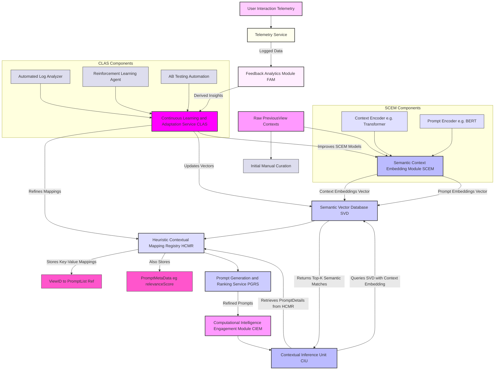
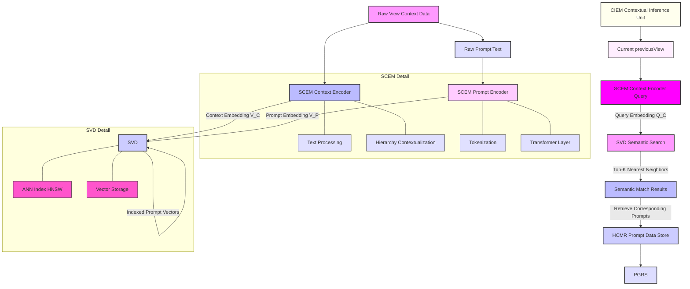
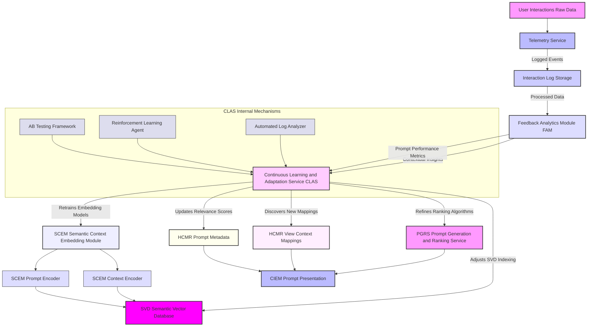
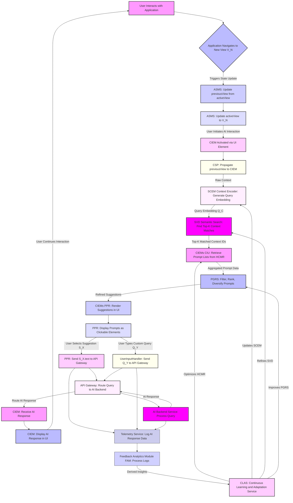

# Inventions: 002_ai_contextual_prompt_suggestion/003_adaptive_hcmr_architecture.md

# **Title of Invention: A System and Method for an Adaptive, Semantically-Indexed Heuristic Contextual Mapping Registry for Dynamic Prompt Elicitation**

## **Abstract:**

This disclosure delineates a novel architectural enhancement to the Heuristic Contextual Mapping Registry HCMR, transforming it into a dynamically adaptive and semantically intelligent knowledge base. The core innovation lies in integrating advanced Semantic Context Embedding Modules SCEM to convert raw application views and prompt suggestions into high-dimensional vector representations. These embeddings are then indexed within a specialized Semantic Vector Database SVD, enabling precise and flexible contextual matching through semantic similarity search rather than rigid key-value lookups. Furthermore, a robust Continuous Learning and Adaptation Service CLAS is introduced, which leverages real-time user interaction telemetry and reinforcement learning to perpetually optimize the HCMR's mappings, refine prompt relevance scores, and autonomously discover novel context-to-prompt correlations. This adaptive HCMR significantly augments the system's ability to provide hyper-relevant and anticipatory prompt suggestions, drastically improving user-AI interaction fluidity and overall system efficacy by mitigating the "cold start" problem and ensuring long-term contextual acuity.

## **Background of the Invention:**

The foundational Heuristic Contextual Mapping Registry HCMR, as previously described in the parent invention, serves as a crucial repository for correlating application view states with relevant prompt suggestions. While highly effective in its initial design, its reliance on discrete `View` identifiers or `ContextualState` enumerations inherently limits its adaptability to nuanced or rapidly evolving application contexts. Direct key-value lookups struggle with several critical challenges:

*   **Semantic Gaps**: Views with similar conceptual meanings but different literal identifiers may not share or retrieve appropriate prompt suggestions, leading to missed opportunities for contextual guidance.
*   **Contextual Granularity Limitations**: Static mappings are often too coarse-grained and may not adequately capture intricate sub-view contexts or dynamically generated views, leading to a diminished relevance of suggestions.
*   **Maintenance Overhead**: Manual curation and updating of the HCMR become computationally and operationally unsustainable in large, complex enterprise applications with numerous views and evolving features, leading to stale or sub-optimal suggestions over time.
*   **Cold Start Problem**: Newly introduced views or application features lack initial prompt suggestions, degrading the user experience until manual mappings are established, which incurs significant delay and cognitive burden on the user.

These pervasive limitations underscore an imperative, unaddressed need for an HCMR that can autonomously infer semantic relationships between diverse contextual elements, dynamically adapt its mappings based on real-world usage patterns, and intelligently evolve its knowledge base without extensive manual intervention. Such a system would transform a static registry into a living, intelligent component, capable of proactively responding to the fluid nature of human-AI interaction.

## **Brief Summary of the Invention:**

The present invention articulates a novel paradigm for an Adaptive Heuristic Contextual Mapping Registry AH-HCMR, which profoundly extends the capabilities of the foundational HCMR by integrating two pivotal, highly sophisticated modules: a Semantic Context Embedding Module SCEM and a Continuous Learning and Adaptation Service CLAS. The SCEM ingests raw `previousView` contexts, encompassing explicit identifiers and implicit metadata, alongside `PromptSuggestion` textual content, transforming them into dense, high-dimensional vector embeddings that semantically represent their intrinsic meaning. These precisely generated embeddings are then stored and efficiently searchable within a specialized Semantic Vector Database SVD, enabling the Contextual Inference Unit CIU to perform highly accurate and flexible semantic similarity lookups, moving beyond rigid, exact-match key comparisons.

Concurrently, the CLAS operates as an intelligent, asynchronous orchestrator, systematically analyzing real-time user interaction telemetry. It applies advanced machine learning techniques, including but not limited to reinforcement learning, and automates A/B testing to continuously refine the AH-HCMR's mappings, perpetually update prompt relevance scores, and even autonomously discover and integrate novel context-to-prompt correlations. This architectural upgrade ensures that the AH-HCMR remains dynamically optimized, highly adaptive to evolving application states and user needs, and inherently capable of generating hyper-relevant and anticipatory prompt suggestions with unprecedented contextual acuity. This innovation drastically reduces manual curation efforts, substantially mitigates the "cold start" problem for new features, and fundamentally transforms the HCMR into a self-improving, intelligent knowledge system that fosters seamless and proactive human-AI collaboration.

## **Detailed Description of the Invention:**

### **I. Core Architecture of the Adaptive Heuristic Contextual Mapping Registry AH-HCMR**

The Adaptive Heuristic Contextual Mapping Registry AH-HCMR is not merely a static associative data structure but a dynamic, self-optimizing knowledge system central to the contextual prompt elicitation process. It integrates sophisticated semantic understanding and robust continuous learning capabilities directly into its operational paradigm, representing a significant advancement over prior art.



The primary and intricately interconnected components of this enhanced architecture are:
1.  **Adaptive Heuristic Contextual Mapping Registry AH-HCMR**: This module maintains its role as the authoritative logical repository for view-to-prompt associations. However, its underlying data structures are now augmented to store references to semantic embeddings and dynamically updateable metadata, particularly `relevanceScore`, for individual `PromptSuggestion` objects. It serves as the refined source of truth for prompts associated with semantically inferred context clusters.
2.  **Semantic Context Embedding Module SCEM**: This highly specialized processing pipeline is responsible for transforming diverse raw application context identifiers e.g. `previousView` and the textual content of `PromptSuggestion` objects into dense, semantically meaningful, and robust high-dimensional vector embeddings. These embeddings are crucial for enabling semantic comparisons.
3.  **Semantic Vector Database SVD**: An optimized, high-performance database specifically engineered for the storage and querying of vector embeddings. It facilitates ultra-efficient approximate nearest neighbor ANN similarity searches across millions or billions of vectors.
4.  **Continuous Learning and Adaptation Service CLAS**: An asynchronous, intelligent orchestration module that systematically processes real-time telemetry data. It employs advanced machine learning paradigms to dynamically update and optimize the mappings, `relevanceScore` values, and even the underlying embedding models within the AH-HCMR and SCEM.
5.  **Augmented Contextual Inference Unit CIU**: The CIU, a critical sub-component within the Computational Intelligence Engagement Module CIEM, is re-engineered to leverage the SCEM and SVD for highly nuanced semantic lookups, fundamentally transcending the limitations of rigid key-matching.

### **II. Semantic Context Embedding and Indexing**

The cornerstone of the Adaptive HCMR's unparalleled intelligence is its ability to comprehend and process both application context and prompt suggestions semantically, rather than merely by their discrete identifiers. This capability empowers the system with robust generalization and adaptability.

**A. Semantic Context Embedding Module SCEM:**
The SCEM is a sophisticated, multi-stage pipeline designed to generate robust, high-dimensional vector representations e.g. embeddings for a wide array of contextual elements and prompt suggestions. These embeddings are carefully designed to reside within a shared vector space, enabling direct and meaningful comparisons.
*   **Input Streams**:
    *   **View Context Descriptors**: This comprehensive input stream includes explicit raw `previousView` identifiers, hierarchical paths representing navigational depth, rich textual descriptions associated with application views, and dynamic user activity metadata within the view e.g. time spent, number of clicks, selected entities.
    *   **Prompt Suggestion Text**: The literal string content of all `PromptSuggestion` objects, forming the basis for their semantic representation.
*   **Encoding Units**:
    *   **Context Encoder**: This unit employs advanced pre-trained transformer models e.g. BERT, Sentence-BERT, or specialized domain-specific fine-tuned encoders. Its function is to transform the rich, potentially multi-modal context data into a unified vector representation. For example, a `View.Financial_Analytics_Dashboard` context might be combined with `user_role: senior_analyst` and `time_of_day: morning` into a single, highly descriptive contextual embedding.
    *   **Prompt Encoder**: This unit, operating in parallel, employs similar transformer-based models to convert the `text` field of each `PromptSuggestion` object into a vector embedding. Crucially, these prompt embeddings are projected into the *same* semantic space as the context embeddings, which is indispensable for direct and accurate semantic similarity comparisons.
*   **Output**: The SCEM generates normalized embedding vectors, typically floating-point arrays of several hundred dimensions. A fundamental property of this output is that semantic proximity between concepts is directly represented by vector proximity e.g. high cosine similarity between vectors.

**B. Semantic Vector Database SVD:**
The SVD functions as the intelligent, high-speed index for both the context and prompt embeddings generated by the SCEM. Its design is optimized for rapid retrieval based on semantic similarity.
*   **Structure**: The SVD stores large collections of these high-dimensional vectors. Each vector is meticulously associated with a unique identifier that precisely links it back to its original `View` context or `PromptSuggestion` object within the AH-HCMR.
*   **Indexing Algorithms**: The SVD employs highly efficient Approximate Nearest Neighbor ANN algorithms e.g. HNSW Hierarchical Navigable Small World, FAISS Facebook AI Similarity Search, ANNOY Spotify, ScaNN Google. These algorithms enable ultra-fast similarity searches even within massive datasets comprising millions or billions of vectors, critical for real-time responsiveness.
*   **Functionality**:
    *   **Context Indexing**: All known, relevant, and emerging application view contexts are continuously embedded by the SCEM and subsequently indexed within the SVD.
    *   **Prompt Indexing**: All `PromptSuggestion` objects, potentially grouped or categorized by their `semanticTags`, are also embedded and robustly indexed within the SVD.
    *   **Similarity Search**: When the CIU within the CIEM requires prompt suggestions for a `previousView` context, the SCEM converts this context into a `query_embedding`. This `query_embedding` is then submitted to the SVD for a similarity search. The SVD efficiently returns the `k` most semantically similar context embeddings or prompt embeddings, based on cosine similarity or other distance metrics.



### **III. Continuous Learning and Dynamic Optimization**

The AH-HCMR is not a static construct; it is meticulously engineered for perpetual evolution and self-optimization through the **Continuous Learning and Adaptation Service CLAS**. This sophisticated service ensures that the AH-HCMR remains optimally aligned with dynamic user behavior, evolving application contexts, and emerging semantic relationships.

**A. Telemetry and Feedback Analytics Module FAM:**
*   The **Telemetry Service** rigorously captures every relevant user interaction and system event: comprehensive `previousView` contexts, the exact set of `PromptSuggestion` objects presented, user selections of prompts, direct user-typed queries, AI system responses, and any explicit user feedback signals e.g. thumbs up/down, satisfaction ratings.
*   The **Feedback Analytics Module FAM** processes this rich stream of raw telemetry data, deriving critical metrics and actionable insights:
    *   **Prompt Selection Rate**: Quantifies the frequency at which specific prompts are selected under various contexts, indicating their perceived relevance and utility.
    *   **Engagement Metrics**: Measures user interaction depth and duration after a prompt selection or AI response, serving as an implicit indicator of utility and satisfaction.
    *   **AI Response Quality**: Often derived from downstream metrics such as conversation length, task completion rates, or explicit user ratings, providing an indication of prompt effectiveness.
    *   **Emergent Contexts**: Identifies new, previously unmapped, or under-served `previousView` contexts that are generating user queries, highlighting areas for HCMR expansion.

**B. Continuous Learning and Adaptation Service CLAS:**
The CLAS functions as the intelligent brain behind the AH-HCMR's dynamic optimization, operating asynchronously in the background as a high-availability service.
*   **Automated Log Analyzer**: This component performs ongoing statistical and machine learning analysis of aggregated user interaction logs. Its primary functions include:
    *   **Dynamic Relevance Score Updates**: Systematically increases the `relevanceScore` for selected and effective prompts in specific contexts and decreases it for ignored or ineffective ones.
    *   **New Mapping Discovery**: Proposes novel `ViewID` to `PromptSuggestion` associations or new semantic context clusters for expert review. Based on confidence thresholds derived from robust statistical evidence, it can directly add or modify mappings within the AH-HCMR, reducing manual curation.
    *   **Identification of Deprecated Prompts**: Flags prompts with consistently low selection rates, high user abandonment rates, or negative feedback for review, potential archival, or removal.
*   **Reinforcement Learning Agent**: This advanced, autonomous component actively learns and refines the AH-HCMR's policies for prompt selection and ranking.
    *   **State Space**: Defined by the current `previousView` context embedding and the set of available prompt embeddings.
    *   **Action Space**: Encompasses the ranking and selection of a subset of prompts to present to the user.
    *   **Reward Signal**: Derived from a composite of user interaction signals e.g. immediate prompt selection, successful multi-turn AI interaction, positive explicit feedback, and efficient task completion.
    *   The agent continuously explores different ranking strategies and prompt combinations, learning and adapting policies that maximize long-term user engagement and satisfaction, thereby directly influencing the `relevanceScore` and optimal ordering within the AH-HCMR and the Prompt Generation and Ranking Service PGRS.
*   **A/B Testing Automation**: This integrated framework facilitates the simultaneous experimentation with different prompt sets, alternative ranking algorithms, or novel contextual inference strategies. The CLAS rigorously monitors key performance indicators KPIs and automatically promotes superior configurations based on statistically significant improvements, ensuring data-driven, continuous optimization. This includes testing new prompt embeddings, different context encoding models, or alternative SVD indexing parameters.
*   **SCEM Model Retraining**: Periodically, or in response to significant data drift, the CLAS can trigger the retraining or fine-tuning of the SCEM's Context and Prompt Encoders. This process uses the latest application data, user feedback, and semantic trends to ensure the generated semantic embeddings remain accurate, robust, and maximally relevant as the application ecosystem and user lexicon evolve.



### **IV. Dynamic HCMR Query and Retrieval**

The operational flow for retrieving prompt suggestions is fundamentally enhanced and made orders of magnitude more intelligent by the integration of semantic indexing and continuous learning.

1.  **Context Encoding**: When the CIEM is activated by a user, the current `previousView` context information is first passed to the SCEM's Context Encoder. This module meticulously processes the raw context and transforms it into a dense, high-dimensional `query_embedding`. This embedding represents a high-fidelity semantic representation of the user's current operational locus and inferred intent.
2.  **Semantic Similarity Search**: The generated `query_embedding` is then submitted to the SVD for an ultra-efficient semantic similarity search. The SVD, leveraging its ANN indexing algorithms, rapidly identifies the `k` most semantically relevant context embeddings from its vast index. These `k` embeddings correspond to a set of potential `View` identifiers or broader contextual categories that bear strong semantic affinity to the `previousView`.
3.  **Prompt Aggregation**: For each of the `k` semantically matched contexts or based on direct prompt similarity search, the CIU retrieves the associated `PromptSuggestion` objects from the AH-HCMR. This advanced aggregation might involve:
    *   Direct retrieval if a specific `ViewID` linked to a matched context has explicit prompt associations.
    *   Aggregating prompts from multiple semantically similar views if no single perfect match exists, thereby broadening the contextual coverage.
    *   In highly advanced configurations, the `query_embedding` could directly query for semantically similar *prompt embeddings* in the SVD, bypassing an intermediate `ViewID` mapping for initial discovery, then validating against HCMR metadata.
4.  **Prompt Refinement and Ranking**: The aggregated set of `PromptSuggestion` objects, along with their associated `relevanceScore` from the AH-HCMR and contextual similarity scores derived from the SVD, is passed to the Prompt Generation and Ranking Service PGRS. The PGRS then applies sophisticated filtering, ranking, and diversification algorithms. These algorithms can be dynamically influenced by user-specific personalization learned by the CLAS's RL agent, ensuring optimal relevance.
5.  **Presentation**: The final, algorithmically refined and ranked prompt suggestions are then rendered by the Prompt Presentation Renderer PPR in the user interface. This proactive display offers hyper-relevant, contextually aware choices, significantly reducing the user's cognitive load and accelerating their interaction with the AI.

This dynamic retrieval process ensures that even for novel, ambiguous, or nuanced contexts, the system can infer and present highly relevant prompts, effectively addressing and often pre-empting the "cold start" problem inherent in static mapping registries.

### **V. Operational Flow with Adaptive HCMR**

The refined operational flow integrates the adaptive capabilities seamlessly into the broader system, creating a continuous feedback loop that powers intelligent prompt suggestion.



## **Claims:**

The following claims specifically detail the novel and non-obvious elements of the Adaptive Heuristic Contextual Mapping Registry AH-HCMR, extending the foundational invention into a dynamically intelligent system for contextual prompt elicitation.

1.  An enhanced Heuristic Contextual Mapping Registry HCMR system for dynamically optimizing conversational AI interaction, comprising:
    a.  A **Semantic Context Embedding Module SCEM**, configured to:
        i.   Generate high-dimensional, semantically rich vector embeddings for application view contexts, including `previousView` state variables and associated metadata; and
        ii.  Generate high-dimensional, semantically rich vector embeddings for `PromptSuggestion` textual content, wherein both context and prompt embeddings reside in a shared, comparable semantic vector space.
    b.  A **Semantic Vector Database SVD**, operably connected to the SCEM, configured to:
        i.   Store and efficiently index the generated context embeddings and prompt embeddings; and
        ii.  Perform rapid semantic similarity searches against its indexed embeddings using approximate nearest neighbor ANN algorithms.
    c.  An **Adaptive Heuristic Contextual Mapping Registry AH-HCMR**, comprising:
        i.   A persistent data structure storing logical mappings between application view identifiers or contextual categories and ordered collections of `PromptSuggestion` objects;
        ii.  Dynamically updateable metadata associated with each `PromptSuggestion` object, including a `relevanceScore`; and
        iii. Direct or indirect reference to the semantic embeddings generated by the SCEM for its associated contexts and prompts.
    d.  A **Continuous Learning and Adaptation Service CLAS**, operably connected to a Telemetry Service, a Feedback Analytics Module, the SCEM, the SVD, and the AH-HCMR, configured to:
        i.   Process user interaction telemetry and derived feedback analytics to identify statistical patterns in prompt utilization, effectiveness, and evolving contextual relevance;
        ii.  Dynamically update the `relevanceScore` of `PromptSuggestion` objects within the AH-HCMR based on observed user behavior and system performance metrics;
        iii. Autonomously discover and propose new context-to-prompt associations or refine existing ones within the AH-HCMR based on inferred semantic relationships and user engagement; and
        iv.  Periodically trigger retraining or fine-tuning of the SCEM's embedding models and dynamically adjust SVD indexing parameters based on long-term system performance and data drift.
    e.  An **Augmented Contextual Inference Unit CIU**, integrated within a Computational Intelligence Engagement Module CIEM, configured to:
        i.   Receive a `previousView` context and generate a `query_embedding` for it via the SCEM;
        ii.  Query the SVD with said `query_embedding` to retrieve a set of top-k semantically similar context embeddings or prompt embeddings; and
        iii. Utilize the SVD semantic search results to retrieve corresponding `PromptSuggestion` objects and their associated metadata from the AH-HCMR.

2.  The system of claim 1, wherein the SCEM's embedding generation employs transformer-based neural network models fine-tuned for the application's domain.

3.  The system of claim 1, wherein the SVD utilizes Hierarchical Navigable Small World HNSW or Facebook AI Similarity Search FAISS for its approximate nearest neighbor indexing to ensure high-speed semantic retrieval.

4.  The system of claim 1, wherein the CLAS further comprises a **Reinforcement Learning Agent**, configured to learn and dynamically optimize prompt ranking policies based on user engagement and AI interaction success metrics as reward signals.

5.  The system of claim 1, wherein the CLAS further includes an **A/B Testing Automation** framework for continuously experimenting with and automatically promoting optimized prompt sets, ranking algorithms, or embedding models.

6.  A method for dynamically optimizing a Heuristic Contextual Mapping Registry HCMR for context-aware conversational AI interaction, comprising:
    a.  Generating semantic vector embeddings for application view contexts and `PromptSuggestion` textual content using a Semantic Context Embedding Module SCEM, ensuring a shared, comparable semantic space;
    b.  Storing and indexing said context and prompt embeddings in a Semantic Vector Database SVD, configured for efficient semantic similarity searches;
    c.  Maintaining an Adaptive Heuristic Contextual Mapping Registry AH-HCMR that correlates application views with `PromptSuggestion` objects and stores dynamically updateable `relevanceScore` metadata;
    d.  Continuously collecting comprehensive user interaction telemetry and deriving feedback analytics from said telemetry;
    e.  Applying a Continuous Learning and Adaptation Service CLAS to:
        i.   Dynamically update `relevanceScore` values within the AH-HCMR based on telemetry-derived prompt utilization and effectiveness;
        ii.  Autonomously discover and integrate new context-to-prompt mappings or refine existing ones in the AH-HCMR based on semantic inference and user interaction patterns; and
        iii. Optimizing the SCEM's embedding models and SVD's indexing parameters through periodic retraining or adaptive adjustment.
    f.  Upon activation of a Computational Intelligence Engagement Module CIEM:
        i.   Encoding the `previousView` context into a `query_embedding` via the SCEM;
        ii.  Performing a semantic similarity search in the SVD with the `query_embedding` to identify top-k semantically relevant contexts or prompts;
        iii. Retrieving an aggregated set of `PromptSuggestion` objects and their metadata from the AH-HCMR based on the SVD search results;
        iv.  Refining and ranking said `PromptSuggestion` objects using a Prompt Generation and Ranking Service PGRS based on their `relevanceScore` and contextual similarity; and
        v.   Displaying the refined `PromptSuggestion` objects as interactive elements within the CIEM user interface.

7.  The method of claim 6, wherein the step of dynamically updating `relevanceScore` values includes utilizing a reinforcement learning agent that optimizes prompt selection strategies based on user engagement signals and AI interaction success.

8.  The method of claim 6, wherein the step of optimizing the SCEM's embedding models and SVD's indexing parameters is performed via an automated A/B testing framework that monitors key performance indicators.

9.  A non-transitory computer-readable medium storing instructions that, when executed by one or more processors, cause the processors to perform the method of claim 6.

## **Mathematical Justification: Refined Contextual Probabilistic Query Formulation Theory with Semantic Embeddings**

The Adaptive HCMR profoundly refines the **Class of Contextual Probabilistic Query Formulation Theory CPQFT** by transitioning from a reliance on discrete `View` identifiers to the robust and continuous representation of semantic vector spaces. This paradigm shift fundamentally enhances the system's ability to infer and respond to user intent.

Let `V_e` be the high-dimensional vector space representing context embeddings, and `Q_e` be the corresponding high-dimensional vector space representing query/prompt embeddings. The Semantic Context Embedding Module SCEM performs a mapping function `emb_v: V -> V_e` for raw view contexts `v_t in V` to their embeddings `emb_v(v_t) in V_e`. Similarly, for natural language queries `q in Q`, the SCEM applies `emb_q: Q -> Q_e` to generate their embeddings `emb_q(q) in Q_e`. Crucially, `V_e` and `Q_e` are meticulously aligned, often existing as the same vector space, thereby enabling direct and meaningful similarity comparisons.

The fundamental premise of the CPQFT, which states that a user's intended query `q_u` is profoundly dependent on their preceding context `v_{t-1}`, is now implicitly and continuously approximated through vector similarity. The conditional probability `P(q | v_{t-1})` is no longer based on discrete lookup but on the continuous measure of semantic affinity:

```
P(q | v_{t-1}) ≈ sim(emb_q(q), emb_v(v_{t-1}))
```

Where `sim` is a chosen similarity metric, typically cosine similarity, quantifying the semantic relatedness between the query embedding and the context embedding.

**Definition 1.1A: Semantic Contextual Query Distribution Function SCQDF**
The Semantic Contextual Query Distribution Function `P_Q_e: Q_e x V_e -> [0, 1]` is rigorously defined such that `P_Q_e(emb_q(q) | emb_v(v_{t-1}))` represents the probability density that a user, whose operational context is semantically represented by `emb_v(v_{t-1})`, intends to formulate a query semantically represented by `emb_q(q)`. This function is intrinsically modeled as a monotonically increasing function of the similarity `sim(emb_q(q), emb_v(v_{t-1}))`.

The `Suggestion Function S`, which previously operated on discrete `V`, now operates directly within the continuous embedding space: `S: V_e -> P(Q_e)`. For any given context embedding `e_v in V_e`, `S(e_v)` yields a finite, ordered subset of `Q_e`, `S(e_v) = {e_s1, e_s2, ..., e_sm}`, which are the embeddings of the suggested prompts.

**Objective Function of CPQFT with Semantic Embeddings:**
The primary objective of the system, when operating within this refined semantic framework, remains to maximize the probability that the user's true intended query embedding `emb_q(q_u)` is semantically close to or directly represented by one of the presented prompt suggestions, given the antecedent context embedding. Formally, this is expressed as:

```
S* = argmax_S E_{emb_v(v_{t-1})} [ P(emb_q(q_u) is "close to" S(emb_v(v_{t-1})) | emb_v(v_{t-1})) ]
```

Where "close to" rigorously refers to having a similarity score above a predefined threshold, `τ`. The AH-HCMR now stores pointers to `PromptSuggestion` objects whose embeddings `e_s` are empirically found to be most similar to `e_v` over time, with their `relevanceScore` directly related to these observed conditional probabilities.

**Theorem 1.2A: Maximizing Contextual Elicitation Probability in Semantic Space**
Given precisely estimated embedding functions `emb_q` and `emb_v`, and an efficiently indexed Semantic Vector Database SVD, the optimal set `S*(emb_v(v_{t-1}))` for a fixed cardinality `M` of suggestions is constructed by selecting the `M` prompt embeddings `emb_q(q_j)` from the embedding space `Q_e` that exhibit the highest similarity `sim(emb_q(q_j), emb_v(v_{t-1}))`. This similarity `sim` is a learned, monotonically increasing function of the true conditional probability `P_Q_e(emb_q(q_j) | emb_v(v_{t-1}))`.

*Proof:* By the design of semantic embedding spaces and the training objective of the SCEM, higher similarity between `emb_q(q_j)` and `emb_v(v_{t-1})` directly correlates with higher semantic relevance. This semantic relevance, in turn, serves as a robust approximation of higher conditional probability `P_Q_e`. The SVD, utilizing its ANN indexing algorithms, is engineered to efficiently and accurately retrieve these top `M` most similar prompt embeddings in real-time, given a query context embedding `emb_v(v_{t-1})`. The Continuous Learning and Adaptation Service CLAS, through its feedback loops and retraining mechanisms, perpetually refines both the `emb` functions and the `relevanceScores` within the HCMR to continuously improve the accuracy of this probabilistic approximation.
*Q.E.D.*

## **Proof of Efficacy: Enhanced Cognitive Load Minimization and Proactive Learning**

The Adaptive Heuristic Contextual Mapping Registry AH-HCMR significantly amplifies the **Class of Cognitive Load Minimization in Human-AI Interaction CLMHAII** by introducing inherent semantic robustness, proactive learning capabilities, and dynamic adaptability. This leads to a measurably superior user experience.

In the adaptive system, the cognitive cost `C_assisted` benefits from several profound improvements:
1.  **Semantic Robustness and Generalization**: The SCEM and SVD fundamentally overcome the inherent `semantic gaps` and `contextual granularity limitations` of the previous static system. Even for entirely novel, subtly nuanced, or slightly varied `previousView` contexts, the system can infer and retrieve highly relevant prompts through semantic similarity. This robust generalization capability significantly increases the probability that the user's intended query `q_u` (or a semantically equivalent and highly desirable prompt) is found within the presented set `S(v_{t-1})`. A higher hit rate directly translates to a greater proportion of interactions where `C_assisted` is substantially less than `C_unassisted`.
2.  **Continuous Optimization and Peak Performance**: The CLAS ensures that the `relevanceScore` values and the curated prompt sets are perpetually and autonomously optimized based on real-time user interactions and system performance. This means the system consistently presents the *most effective* `M` prompts, maximizing `P(q_u in S(v_{t-1}) | v_{t-1})` over time. The integrated `Reinforcement Learning Agent` specifically learns and adapts its policy to minimize `C_assisted` by dynamically selecting and ranking prompt sets that lead to faster, more successful, and more satisfying user interactions.
3.  **Reduced Cold Start Cognitive Cost**: For newly introduced views or application features lacking extensive historical data, semantic embeddings provide an immediate and intelligent solution. The system can infer relevant prompts from semantically similar existing contexts, significantly reducing the initial cognitive load a user would experience when confronted with a blank input field. This proactive inference ensures that a baseline of effective suggestions is available from day one, even before sufficient specific interaction data is gathered for that particular new view, thereby substantially lowering the `G(q_u)` component early in the feature lifecycle.

**Theorem 2.1A: Superior Cognitive Cost Reduction through Adaptivity**
The Adaptive Heuristic Contextual Mapping Registry AH-HCMR, by meticulously incorporating advanced semantic embedding and continuous learning mechanisms, provides a demonstrably superior reduction in user cognitive load (`C_assisted_adaptive`) compared to a non-adaptive, static HCMR (`C_assisted_static`). This superiority is such that `C_assisted_adaptive <= C_assisted_static` for all interactions, and critically, `C_assisted_adaptive << C_assisted_static` for a substantial majority of interactions, due to a significantly higher `P(q_u in S(v_{t-1}) | v_{t-1})` and vastly broader, more nuanced contextual coverage.

*Proof:*
The superior reduction in cognitive load is fundamentally driven by two primary, synergistic mechanisms:
*   **Increased Prompt Hit Rate via Semantic Matching**: Semantic matching, as implemented by `sim(emb_q(q_j), emb_v(v_{t-1}))`, is inherently more flexible, robust, and generalizable than rigid exact key matching. This intrinsic flexibility dramatically increases the probability that the user's intended query `q_u` (or a highly relevant and semantically equivalent prompt) will be accurately identified and presented within the set `S(v_{t-1})`. A higher hit rate directly translates to a greater number of instances where the user's task shifts from arduous query *generation* to efficient *selection*, leading to `C_{select}(s_j) << G(q_u)`.
*   **Dynamic and Sustained Optimization**: The CLAS, through its integrated automated log analysis, reinforcement learning capabilities, and A/B testing framework, continuously and autonomously refines the AH-HCMR. This ensures that the `M` presented prompts are consistently the most relevant, effective, and optimally ranked for any given context. This perpetual dynamic tuning maintains the `relevanceScore` values and the overall quality of `S(v_{t-1})` at peak performance, actively preventing degradation over time and consistently maximizing `P(q_u in S(v_{t-1}) | v_{t-1})`.

The synergistic combination of semantic understanding, facilitated by vector embeddings, and continuous adaptation ensures that the presented prompts are not only deeply contextually relevant but also perpetually optimized and precisely aligned with the evolving nuances of user needs and application states. This leads to a persistent and scientifically measurable higher probability of successful prompt elicitation and, consequently, a more significant, sustained, and pervasive reduction in user cognitive load compared to any non-adaptive system.
*Q.E.D.*

This adaptive architecture elevates the Heuristic Contextual Mapping Registry from a manually curated knowledge base to a truly intelligent, self-optimizing, and proactively learning component, thereby setting an unprecedented new standard for proactive and context-aware AI assistance in human-computer interaction.