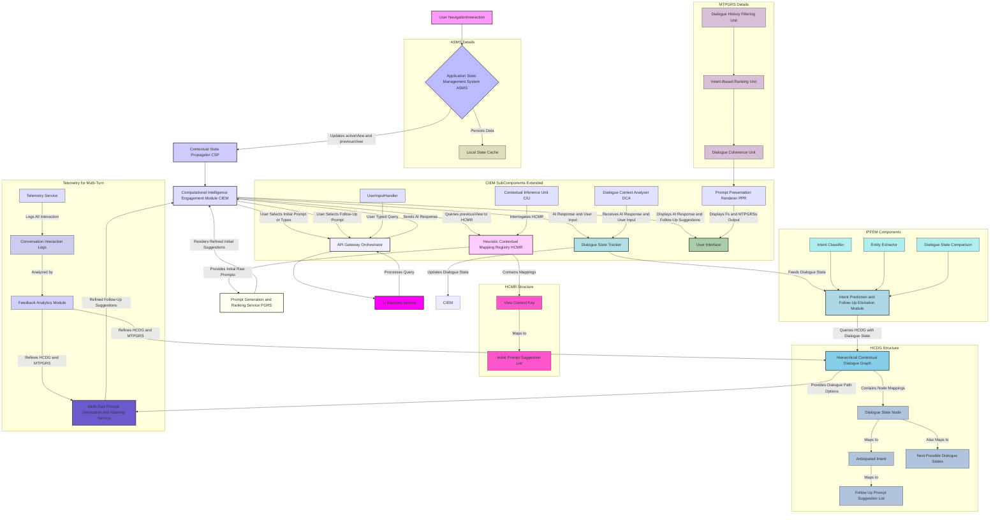
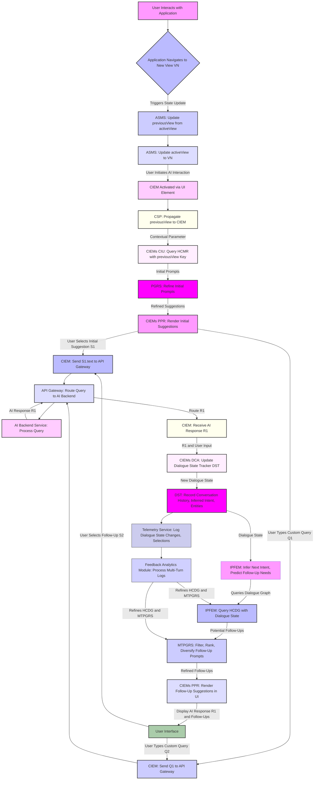
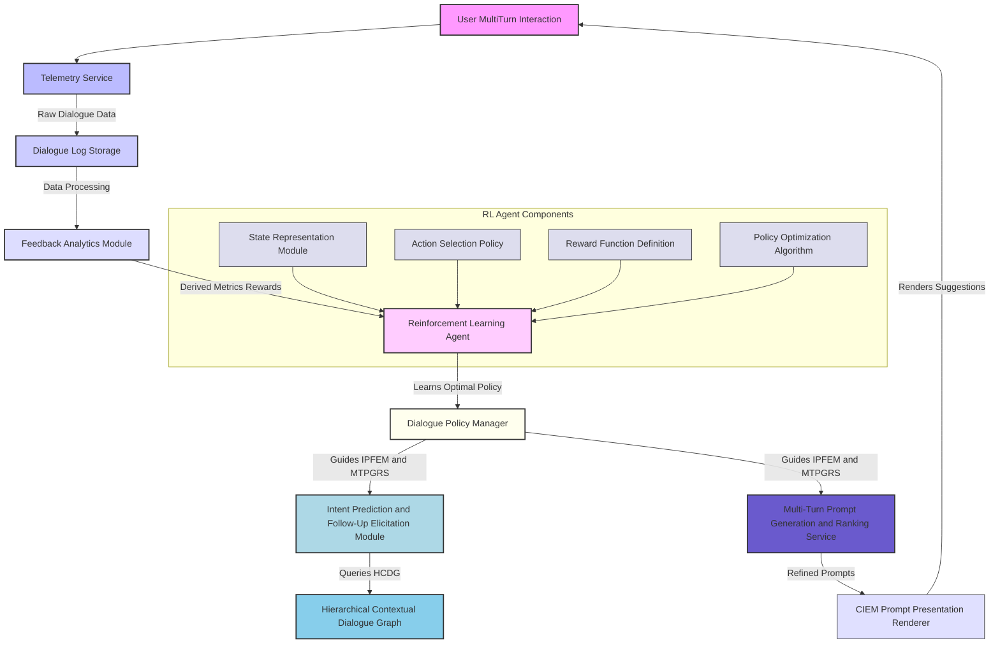

---
# Inventions: 002_ai_contextual_prompt_suggestion/004_proactive_multiturn_dialogue.md

# **Title of Invention: A System and Method for Proactive Multi-Turn Dialogue Scaffolding and Contextual Conversation Flow Guidance within Integrated Computational Intelligence Environments**

## **Abstract:**

This disclosure details an advanced system and corresponding methodology engineered to profoundly elevate the coherence and efficiency of multi-turn human-AI interactions within sophisticated software applications. Building upon foundational context-aware prompt elicitation, the invention introduces a robust Dialogue State Tracker and a Hierarchical Contextual Dialogue Graph to continuously monitor the evolving conversational state, infer user intent, and anticipate subsequent informational or task-oriented needs. Leveraging a sophisticated Multi-Turn Prompt Generation and Ranking Service, the system dynamically scaffolds the dialogue by presenting a plurality of precisely curated, semantically relevant, and contextually antecedent follow-up prompt suggestions. These suggestions are meticulously calibrated to the immediately preceding AI response and the inferred conversational trajectory, thereby serving as highly potent cognitive accelerants that drastically mitigate the cognitive overhead associated with maintaining conversational coherence and navigating complex multi-step processes with advanced AI entities. This innovation unequivocally establishes a new benchmark for seamless, guided, and anticipatory multi-turn interaction in intelligent user interfaces.

## **Background of the Invention:**

The previous invention established a paradigm for mitigating the "blank page" conundrum in human-AI interaction by furnishing contextually relevant initial prompt suggestions. While highly effective for initiating dialogue and single-turn query formulation, the full potential of sophisticated conversational Artificial Intelligence AI often lies in its capacity to engage in complex, multi-turn interactions. However, a persistent and pervasive challenge remains: the "dialogue disorientation" dilemma. Users frequently struggle to maintain conversational coherence, recall previous turns, articulate precise follow-up questions, or navigate intricate multi-step workflows without explicit guidance. This phenomenon, well-documented in advanced human-computer interaction, is exacerbated in complex enterprise or professional applications where conversational paths can branch extensively, requiring sustained cognitive effort to maintain context and drive the interaction to a meaningful conclusion.

Existing paradigms for multi-turn interaction typically rely on either static, hard-coded dialogue flows, which lack adaptability to dynamic user needs and contexts, or purely generative AI models, which can suffer from "hallucinations," topic drift, or a lack of precise task completion capabilities without explicit user steering. While some systems offer simple "undo" or "clarify" options, they fail to proactively anticipate and guide the user through logical next steps derived from the ongoing dialogue and broader application context. Such reactive or unguided approaches result in prolonged interaction cycles, increased user frustration, and a diminished perception of the AI's intelligence and utility in complex task execution, ultimately impeding the realization of the full potential of integrated computational intelligence in multi-step processes.

There exists, therefore, an imperative, unaddressed need for a system capable of autonomously discerning the user's operational and conversational context with granular precision across multiple turns, proactively inferring intent, and furnishing intelligent, semantically relevant, and dialogue-aware follow-up prompt suggestions. Such a system would not merely offer guidance for initiation but would fundamentally reshape the entire conversational landscape, transforming a cognitively burdensome, exploratory dialogue into an intuitive, guided journey towards task completion or information discovery. This invention fundamentally addresses this lacuna, establishing a paradigm where the AI anticipates and facilitates user intent throughout a multi-turn conversation with unprecedented contextual acuity and predictive foresight.

## **Brief Summary of the Invention:**

The present invention articulates a novel paradigm for enhancing user interaction with Computational Intelligence CI systems through a meticulously engineered mechanism for proactive multi-turn dialogue scaffolding. At its core, the system perpetually monitors and dynamically retains the full `dialogueState` of an ongoing conversation, building upon the initial `previousView` context. This `dialogueState`, encompassing the history of turns, inferred user intents, and extracted entities, is not merely transient data but is elevated to a crucial contextual parameter for anticipating future conversational needs.

Upon an initial AI response, the `Computational Intelligence Engagement Module` CIEM, now augmented with advanced multi-turn capabilities, engages a sophisticated `Dialogue State Tracker DST` to update the current `dialogueState`. This state is then fed to an `Intent Prediction and Follow-Up Elicitation Module IPFEM`, which queries an intricately structured, knowledge-based repository termed the `Hierarchical Contextual Dialogue Graph HCDG`. This graph, a sophisticated associative data structure, meticulously correlates specific `dialogueState` transitions or inferred `Intents` with a meticulously curated ensemble of highly probable, semantically relevant, and conversationally antecedent follow-up prompt suggestions.

For instance, if the initial interaction in a `Financial_Analytics_Dashboard` view resulted in a query "Summarize my fiscal performance last quarter" and the AI provided a summary, the system, guided by the `HCDG` and the `IPFEM`, would present follow-up prompts such as "Compare this to the previous year," "Breakdown expenses by category," or "Project next quarter's revenue based on these trends." This proactive, conversation-sensitive presentation of prompts profoundly elevates the perceived intelligence and embeddedness of the AI within the application's overarching workflow, rendering multi-turn interaction not as a disjointed sequence of queries but as a seamless, guided progression towards comprehensive understanding or task completion. The invention thus establishes a foundational framework for truly integrated, anticipatory, and coherent multi-turn computational intelligence.

## **Detailed Description of the Invention:**

The present invention describes a sophisticated architecture and methodology for providing highly pertinent, context-aware, and proactively guided multi-turn conversational prompt suggestions within an integrated software application environment. This system comprises several interdependent modules working in concert to achieve unprecedented levels of human-AI interaction fluidity across complex dialogue sequences.

### **I. System Architecture and Component Interoperability for Multi-Turn Dialogue**

The core of this invention extends the previous architecture by integrating modules specifically designed for robust dialogue state tracking, intent inference, and anticipatory multi-turn prompt generation.



**A. Dialogue State Tracker DST:**
This foundational module is responsible for maintaining a comprehensive and granular representation of the current conversational context. It builds upon the initial `previousView` by incorporating:
1.  **`ConversationHistory`:** A chronological record of all user queries, selected prompts, and AI responses.
2.  **`InferredIntent`:** The system's best estimation of the user's current goal or underlying purpose, derived from the last turn and `ConversationHistory`.
3.  **`ExtractedEntities`:** Key information entities identified from user inputs or AI responses, such as dates, names, monetary values, or specific data points relevant to the application domain.
4.  **`DialogueTurnCount`:** A simple counter for the number of exchanges in the current conversational session.
The `dialogueState` is a dynamic, evolving object that is updated after every meaningful interaction, whether it is a user query, a prompt selection, or an AI response.

**B. Hierarchical Contextual Dialogue Graph HCDG:**
This is a pivotal knowledge base, often implemented as an advanced graph database or a highly optimized tree-like structure, that defines permissible and probable conversational flows. Its primary function is to store a meticulously curated mapping between `dialogueState` transitions, `InferredIntents`, and an ordered collection of semantically relevant follow-up prompt suggestions.
*   **Structure:** The HCDG comprises nodes representing `DialogueState` or `InferredIntent` and edges representing transitions, often weighted by probabilities of occurrence.
    *   `Node Key`: A unique identifier corresponding to a specific `DialogueState` e.g., `(View.Financial_Overview, Intent.SummarizePerformance, Entity.LastQuarter)`.
    *   `Value`: An ordered array or list of `FollowUpPromptSuggestion` objects.
*   **`FollowUpPromptSuggestion` Object:** Similar to the initial `PromptSuggestion` but specifically tailored for multi-turn coherence.
    *   `text`: The literal string prompt.
    *   `semanticTags`: Tags for categorization, specific to dialogue context.
    *   `relevanceScore`: Numerical score indicating relevance to the `dialogueState`.
    *   `intendedAIModel`: Optional. Specifies specialized AI for this turn.
    *   `callbackAction`: Optional programmatic action upon selection.
    *   `expectedNextIntent`: Optional. The intent the system anticipates if this prompt is selected.

**C. Intent Prediction and Follow-Up Elicitation Module IPFEM:**
This module acts as the intelligent arbiter for guiding the multi-turn interaction. Upon receiving the updated `dialogueState` from the `DST`, the IPFEM performs sophisticated inference:
1.  **Intent Classification:** Uses machine learning models e.g. Natural Language Understanding NLU classifiers to determine the current `InferredIntent` from the user's latest input or selected prompt.
2.  **Dialogue State Comparison:** Compares the current `dialogueState` with nodes in the `HCDG` to identify potential next conversational states or branches.
3.  **Contextual Coherence Check:** Ensures that any proposed follow-up aligns logically and semantically with the `ConversationHistory` and current `InferredIntent`.
4.  **Follow-Up Elicitation:** Based on the `InferredIntent` and `dialogueState`, it queries the `HCDG` to retrieve a list of potential `FollowUpPromptSuggestion` objects that are most appropriate for advancing the conversation or completing the task.

**D. Multi-Turn Prompt Generation and Ranking Service MTPGRS:**
An extension of the `PGRS` from the initial invention, the `MTPGRS` specializes in refining follow-up prompts. It receives the list of potential `FollowUpPromptSuggestion` objects from the `HCDG` via the `IPFEM` and applies advanced heuristics or machine learning models to:
1.  **Dialogue History Filtering Unit:** Filters out prompts that have already been presented or are redundant given the `ConversationHistory`.
2.  **Intent-Based Ranking Unit:** Orders prompts based on their `relevanceScore` to the `InferredIntent`, the likelihood of task completion, and user-specific historical multi-turn success rates.
3.  **Dialogue Coherence Unit:** Ensures that the suggested prompts maintain a logical flow and actively steer the conversation towards a defined goal or provide comprehensive coverage of the `InferredIntent`. This may involve analyzing semantic distance within an embedding space or leveraging pre-defined dialogue policies.

**E. Computational Intelligence Engagement Module CIEM - Multi-Turn Enhancements:**
The `CIEM` now includes a `Dialogue Context Analyzer DCA` that seamlessly integrates with the `DST`, `IPFEM`, `HCDG`, and `MTPGRS` to provide a unified conversational experience. The `Prompt Presentation Renderer PPR` is enhanced to dynamically display both initial `PromptSuggestion` objects and subsequent `FollowUpPromptSuggestion` objects in a cohesive manner, ensuring the user always has clear guidance on potential next steps.

### **II. Operational Flow Methodology for Multi-Turn Dialogue Scaffolding**

The operational flow of the invention extends the initial context-aware process with a precisely orchestrated sequence of events for continuous multi-turn guidance:



1.  **Initial Context Acquisition and AI Engagement:** As described in the preceding invention, the `ASMS` and `CSP` provide the `previousView` to the `CIEM` upon AI invocation. The `CIU` queries the `HCMR`, and the `PGRS` refines and presents initial `PromptSuggestion` objects.
2.  **Initial User Query and AI Response:** The user either selects an initial prompt `S1` or types a custom query `Q1`. This is routed via the `API Gateway Orchestrator` to the `AI Backend Service`, which processes the query and returns an initial AI response `R1`.
3.  **Dialogue State Update:** Upon receiving `R1` and observing the user's action e.g., prompt selection or typed input, the `CIEM`'s `Dialogue Context Analyzer DCA` interacts with the `Dialogue State Tracker DST`. The `DST` updates the `dialogueState` by recording the `ConversationHistory`, inferring the user's `InferredIntent` for this turn, and extracting relevant `Entities`.
4.  **Intent Prediction and Follow-Up Elicitation:** The updated `dialogueState` is transmitted to the `Intent Prediction and Follow-Up Elicitation Module IPFEM`. The `IPFEM` analyzes the `InferredIntent` and the `ConversationHistory` to predict the user's most probable next steps or informational needs. It then queries the `Hierarchical Contextual Dialogue Graph HCDG` using the `dialogueState` and `InferredIntent` as keys to retrieve a set of relevant `FollowUpPromptSuggestion` objects. This query can involve traversing the graph to find logically consequent states or semantically similar paths.
5.  **Multi-Turn Prompt Refinement and Presentation:** The raw list of `FollowUpPromptSuggestion` objects from the `HCDG` is passed to the `Multi-Turn Prompt Generation and Ranking Service MTPGRS`. The `MTPGRS` filters out irrelevant or redundant prompts, ranks them based on dialogue coherence, anticipated task completion, and historical success rates, and diversifies the suggestions. The refined list is then handed to the `CIEM`'s `PPR`, which renders them as interactive elements within the user interface, typically alongside the AI's response `R1`.
6.  **Continuous User Interaction and AI Query:** The user can then select one of these `FollowUpPromptSuggestion` elements `S2` or type a new custom query `Q2`. This interaction restarts the cycle from step 2, with the `DST` continuously updating the `dialogueState`, and the `IPFEM` and `MTPGRS` proactively guiding the subsequent turns.
7.  **Telemetry and Feedback:** All user interactions, dialogue state transitions, AI queries, and responses are logged by the `Telemetry Service` and analyzed by the `Feedback Analytics Module` to continuously improve the `HCDG` mappings and `MTPGRS` algorithms, as well as refining `IPFEM`'s intent classification.

### **III. Advanced Features and Extensibility for Proactive Multi-Turn Dialogue**

The multi-turn scaffolding system is designed for exceptional extensibility and can incorporate several advanced features:

*   **Dynamic Dialogue Path Generation:** Beyond static graph mappings, the `MTPGRS` and `IPFEM` can integrate advanced generative AI models e.g. large language models fine-tuned for application-specific dialogue policies. These models can dynamically generate novel dialogue paths and follow-up prompts based on real-time `dialogueState`, user history, and even external real-time data, moving beyond pre-defined HCDG entries.
*   **Adaptive Dialogue Policy Learning:** The `IPFEM`'s intent prediction and the `MTPGRS`'s ranking algorithms can be driven by reinforcement learning RL agents. These agents learn optimal dialogue policies by observing user selections, the success of multi-turn conversations in achieving user goals, and feedback signals e.g. task completion, user satisfaction. This allows the system to autonomously adapt and optimize its guidance strategy over time.
*   **Contextual Entity Resolution and Slot Filling:** The `DST` and `IPFEM` can incorporate sophisticated entity resolution and slot-filling capabilities. As a conversation progresses, the system intelligently extracts entities from user utterances and AI responses, using them to pre-fill necessary parameters for subsequent queries or tasks, reducing user input burden in structured multi-step processes.
*   **Proactive Clarification and Disambiguation:** When `InferredIntent` is uncertain or `ExtractedEntities` are ambiguous, the system can proactively present clarification prompts e.g., "Did you mean 'Q3 results' or 'Q4 results'?" to resolve ambiguities early in the dialogue, preventing miscommunications and improving efficiency.
*   **Cross-Modal Dialogue Integration:** The system can extend beyond text-based interaction to integrate voice input, gestures, or visual cues from the application interface. For example, pointing to a chart element could generate a follow-up prompt like "Explain this spike." The `dialogueState` would then incorporate these multi-modal inputs, and the `HCDG` would map them to appropriate dialogue branches.

#### **F. Reinforced Dialogue Policy Learning Architecture**

To ensure optimal and dynamically evolving multi-turn guidance, a robust reinforcement learning framework can be integrated.



### **IV. Future Enhancements and Research Directions for Hyper-Contextual Multi-Turn Dialogue**

The described invention lays a robust foundation for proactive multi-turn dialogue, which can be further extended through several advanced research and development pathways to achieve even greater contextual acuity and anticipatory assistance.

**A. Hyper-Personalized Dialogue Trajectories:**
The system can evolve to create highly personalized dialogue trajectories by integrating deep user profile data e.g. role, preferences, expertise, historical task completion patterns. The `HCDG` could dynamically adapt its structure or edge weights for individual users, and the `MTPGRS` could employ personalized ranking models to suggest prompts that resonate most with an individual's specific interaction style and objectives, truly tailoring the multi-turn experience.

**B. Generative Dialogue State Prediction:**
Moving beyond explicit `InferredIntent` classification, advanced generative models e.g. large transformer networks could be employed to directly predict not just the *next* likely prompt, but entire *sequences* of future dialogue states and user needs. This would enable the system to orchestrate more complex, long-running multi-turn processes with an unprecedented degree of foresight, effectively "pre-planning" the conversation to minimize turns and maximize efficiency.

**C. Proactive Conversational Repair and Error Handling:**
The system could implement advanced mechanisms for proactive conversational repair. If the `Dialogue State Tracker` detects a deviation from an anticipated dialogue path, or if `Sentiment Analysis` reveals user frustration, the `IPFEM` could proactively interject with clarifying questions, offer to restart a segment of the conversation, or escalate to human assistance. This elevates the system from merely guiding to actively preventing and resolving conversational breakdowns.

These enhancements represent the natural evolution of the core multi-turn invention, leveraging cutting-edge advancements in AI, reinforcement learning, and natural language processing to create an even more seamless, intelligent, and anticipatory human-AI conversational environment that actively assists users in achieving complex goals.

## **Claims:**

The following claims enumerate the novel and non-obvious elements of the herein described invention, establishing its unique and foundational nature in the domain of proactive multi-turn human-AI interaction.

1.  A system for facilitating proactive multi-turn conversational AI interaction, comprising:
    a.  A **Contextual State Management Module CSMM**, configured to:
        i.   Maintain an `activeView` state variable and a `previousView` state variable; and
        ii.  Systematically update said `previousView` state variable upon each transition of the `activeView`.
    b.  A **Dialogue State Tracker DST**, operably connected to a Computational Intelligence Engagement Module CIEM, configured to:
        i.   Maintain a dynamic `dialogueState` object, comprising at least a `ConversationHistory`, an `InferredIntent`, and `ExtractedEntities` derived from user inputs and AI responses; and
        ii.  Continuously update said `dialogueState` after each turn of an ongoing multi-turn conversation.
    c.  A **Hierarchical Contextual Dialogue Graph HCDG**, comprising:
        i.   A persistent, associative data structure storing a plurality of hierarchical mappings, wherein each mapping correlates a unique `DialogueState` or `InferredIntent` with an ordered collection of `FollowUpPromptSuggestion` objects, each object containing at least a textual representation of a conversational prompt and a `relevanceScore`.
    d.  An **Intent Prediction and Follow-Up Elicitation Module IPFEM**, operably connected to the DST and the HCDG, configured to:
        i.   Receive the current `dialogueState` from the DST;
        ii.  Infer the user's current intent;
        iii. Query the HCDG using the `dialogueState` and `InferredIntent` to retrieve a corresponding collection of `FollowUpPromptSuggestion` objects that logically advance the conversation.
    e.  A **Multi-Turn Prompt Generation and Ranking Service MTPGRS**, operably connected to the IPFEM and the CIEM, configured to:
        i.   Receive the collection of `FollowUpPromptSuggestion` objects from the IPFEM; and
        ii.  Algorithmically filter, rank, and optionally diversify said objects based on their `relevanceScore`, dialogue coherence, `ConversationHistory`, and other dynamic heuristics to produce a refined set of follow-up suggestions.
    f.  A **Computational Intelligence Engagement Module CIEM**, operably connected to the CSMM, DST, HCDG, IPFEM, and MTPGRS, configured to:
        i.   Receive initial contextual parameters from the CSMM;
        ii.  Receive refined initial prompt suggestions;
        iii. Receive refined follow-up prompt suggestions from the MTPGRS; and
        iv.  Dynamically render both initial and follow-up `PromptSuggestion` objects as selectable user interface elements within a display interface.
    g.  An **API Gateway Orchestrator**, operably connected to the CIEM and an AI Backend Service, configured to securely route user queries or selected `PromptSuggestion` textual content to the AI Backend Service.
    h.  An **AI Backend Service**, operably connected to the API Gateway Orchestrator, configured to:
        i.   Receive queries from the API Gateway; and
        ii.  Transmit said query to an underlying Artificial Intelligence engine for processing and return a response to the CIEM.
    i.  A **Telemetry Service**, configured to log all multi-turn user interactions, `dialogueState` changes, prompt selections, direct user queries, and AI responses.

2.  The system of claim 1, wherein the `Hierarchical Contextual Dialogue Graph HCDG` further includes probabilistic weights on transitions between `DialogueState` nodes, indicative of likely conversational paths.

3.  The system of claim 1, wherein the `FollowUpPromptSuggestion` objects within the HCDG further comprise fields for `expectedNextIntent` and `callbackAction`.

4.  The system of claim 1, further comprising a **Reinforcement Learning Agent**, operably connected to the Telemetry Service and the MTPGRS, configured to learn and optimize dialogue policies for prompt ranking and selection based on observed user behavior and task completion metrics across multiple turns.

5.  The system of claim 1, wherein the `Dialogue State Tracker DST` includes a `Sentiment Analyzer` to gauge user emotional state, which is then utilized by the `Intent Prediction and Follow-Up Elicitation Module IPFEM` to adjust prompt suggestion strategies.

6.  A method for facilitating proactive multi-turn conversational AI interaction, comprising:
    a.  Continuously monitoring user interaction within a software application to identify an `activeView` and an immediately preceding `previousView`;
    b.  Storing said views in a Contextual State Management Module CSMM and propagating `previousView` to a Computational Intelligence Engagement Module CIEM;
    c.  Presenting initial context-aware `PromptSuggestion` objects based on said `previousView`;
    d.  Receiving an initial user query or selection of an initial prompt, and obtaining an initial AI response;
    e.  Continuously tracking and updating a dynamic `dialogueState` after each conversational turn, encompassing a `ConversationHistory`, `InferredIntent`, and `ExtractedEntities`;
    f.  Using an Intent Prediction and Follow-Up Elicitation Module IPFEM to analyze the `dialogueState` and query a Hierarchical Contextual Dialogue Graph HCDG to retrieve an initial set of `FollowUpPromptSuggestion` objects, wherein the HCDG stores predefined associations between `dialogueState` transitions and relevant follow-up conversational prompts;
    g.  Algorithmically filtering, ranking, and diversifying said initial set of `FollowUpPromptSuggestion` objects using a Multi-Turn Prompt Generation and Ranking Service MTPGRS based on their relevance to the `InferredIntent`, dialogue coherence, and dynamic heuristics;
    h.  Displaying the algorithmically refined `FollowUpPromptSuggestion` objects as selectable interactive elements within the user interface of the CIEM, alongside the AI's response; and
    i.  Upon user selection of a displayed `FollowUpPromptSuggestion` element or direct user input, transmitting its encapsulated textual content or direct query via an API Gateway Orchestrator as a subsequent query to an Artificial Intelligence Backend Service, continuing the dialogue loop from step e.
    j.  Logging all multi-turn user interactions, `dialogueState` changes, prompt selections, direct queries, and AI responses via a Telemetry Service.

7.  The method of claim 6, further comprising employing advanced natural language understanding techniques to perform dynamic entity resolution and slot filling from the `ConversationHistory` to enrich the `dialogueState` and improve the accuracy of prompt suggestions.

8.  The method of claim 6, further comprising iteratively refining the associations within the HCDG and the algorithmic processes of the MTPGRS by analyzing logged multi-turn interaction data and user feedback signals, potentially using reinforcement learning techniques to optimize dialogue policies.

9.  A non-transitory computer-readable medium storing instructions that, when executed by one or more processors, cause the processors to perform the method of claim 6.

## **Mathematical Justification: The Class of Dialogue State Transition Probability Maximization**

The profound efficacy of the present invention is mathematically justified by extending the **Class of Contextual Probabilistic Query Formulation Theory CPQFT** into a novel framework: the **Class of Dialogue State Transition Probability Maximization DSPTM**. This theory formalizes the system's ability to probabilistically guide a user through a sequence of interactions towards a successful conversational outcome.

Let `S_D` represent the universal set of all discernible dialogue states, where each `s_t in S_D` denotes the specific comprehensive state of the conversation at discrete time `t`. A `dialogueState s_t` encapsulates `(v_{previous}, Q_history, R_history, I_{current}, E_{current})`, representing the previous application view, query history, response history, current inferred intent, and extracted entities.
Let `A` denote the set of all possible user actions at any given `s_t`, where `A = {a_1, a_2, ..., a_k}` includes selecting a suggested prompt, typing a new query, or taking an application action.

The fundamental premise is that a user, in `s_t`, has an intended next action `a_u` that transitions the dialogue to an optimal next state `s_{t+1}`. The system's goal is to present a set of suggested actions `A_{sugg}(s_t) = {a_{s1}, a_{s2}, ..., a_{sm}}` that maximizes the probability of the user choosing an action leading to a desirable dialogue progression. This is captured by a conditional probability distribution function `P(a | s_t)`, which quantifies the likelihood of any given action `a` being the user's intended next action, conditioned on the current `dialogueState s_t`.

**Definition 1.1: Dialogue Action Distribution Function DADF**
The Dialogue Action Distribution Function `P_A: A x S_D -> [0, 1]` is defined such that `P_A(a | s_t)` represents the probability density or mass for discrete `A` approximations that a user, having arrived at `dialogueState s_t`, intends to perform action `a`. This function intrinsically captures the semantic affinity and operational relevance of actions to specific conversational states.

The invention introduces a `Dialogue Suggestion Function`, denoted as `DSugg: S_D -> P(A)`, where `P(A)` is the power set of `A`. For any given state `s_i in S_D`, `DSugg(s_i)` yields a finite, ordered subset of `A`, `DSugg(s_i) = {ds_1, ds_2, ..., ds_m}` where `ds_j in A` are the suggested follow-up prompts or actions. The size of this set `m` is bounded, typically `|DSugg(s_i)| <= M` for some practical integer `M`.

**Objective Function of DSPTM:**
The primary objective of the system, from the perspective of DSPTM, is to construct an optimal `Dialogue Suggestion Function DSugg*` that maximizes the probability that the user's true intended action `a_u` is contained within the presented set of suggestions, given the current dialogue state. Formally, this is expressed as:

```
DSugg* = argmax_DSugg E_s_t [ P(a_u in DSugg(s_t) | s_t) ]
```

Where `E_s_t` denotes the expectation over all possible `dialogueState` states, weighted by their probabilities of occurrence `P(s_t)`. For a specific instance `s_t`, the local optimization problem is to maximize `P(a_u in DSugg(s_t) | s_t)`.

**Theorem 1.2: Maximizing Contextual Dialogue Elicitation Probability**
Given a precise estimation of `P(a | s_t)` and a fixed cardinality `M` for the set of suggestions `DSugg(s_t)`, the optimal set `DSugg*(s_t)` that maximizes `P(a_u in DSugg(s_t) | s_t)` is constructed by selecting the `M` actions `a_j` from `A` for which `P(a_j | s_t)` is highest.

*Proof:* Let `P(a | s_t)` be the probability density function over the action space `A`. The probability that the intended action `a_u` is in `DSugg(s_t)` is given by `sum_a in DSugg(s_t) P(a | s_t)`. To maximize this sum for a fixed `|DSugg(s_t)| = M`, we must select the `M` elements `a_j` that correspond to the `M` highest probability values of `P(a | s_t)`. Any other selection would replace at least one `a_k` with a higher `P(a_k | s_t)` by an `a_l` with a lower `P(a_l | s_t)`, thus decreasing the sum.
*Q.E.D.*

**Estimation of DADF:**
The practical implementation of this theory relies on empirically estimating `P(a | s_t)`. This can be achieved through:
1.  **Historical Multi-Turn Interaction Logs:** Analyzing vast datasets of user dialogue sequences [`s_t`] and subsequent actions [`a_u`], alongside AI responses.
2.  **Machine Learning Models:** Training generative or discriminative models e.g. Recurrent Neural Networks with attention, Transformer-based dialogue models on these logs to predict `a_u` given `s_t`.
3.  **Reinforcement Learning:** Using an RL agent to learn an optimal policy `pi(a | s_t)` that maps states to actions, where rewards are defined by successful dialogue completion or user satisfaction.
4.  **Expert Elicitation and Heuristics:** Curating initial mappings in the HCDG based on domain expert knowledge and predefined dialogue flows. This provides a strong initial prior distribution, which can be iteratively refined.

By systematically applying this theoretical framework, the invention constructs a `Hierarchical Contextual Dialogue Graph` and leverages `Intent Prediction` and `Multi-Turn Prompt Generation` services that are, in essence, an approximation of the `M` most probable and beneficial actions for each `s_t`, thereby probabilistically maximizing the likelihood of successful multi-turn user intent elicitation and task completion.

## **Proof of Efficacy: The Class of Conversational Coherence and Task Completion Acceleration**

The tangible utility and profound efficacy of the present invention are formally established through the **Class of Conversational Coherence and Task Completion Acceleration CCTCA**. This theoretical framework quantifies the reduction in user cognitive expenditure and time-to-completion across multi-turn interactions, validating the system's role as a potent dialogue accelerator and coherence enforcer.

Let `C(seq(q))` represent the cumulative cognitive cost associated with a user formulating a sequence of queries or actions `seq(q) = (q_1, q_2, ..., q_N)` to achieve a multi-turn goal `G`. This cost is influenced by factors such as:
*   `L(q_i)`: Lexical and syntactic complexity of each turn.
*   `D_coh(q_i, q_{i-1})`: Dialogue coherence cost, the effort to link current turn to previous.
*   `R_c(s_t)`: Re-contextualization cost, the effort to remember the full `dialogueState`.
*   `A_d(s_t)`: Ambiguity resolution cost, effort to clarify.
*   `T_f(seq(q))`: Total time elapsed for task completion.

The act of completing a multi-turn task `G` can be conceptualized as navigating a complex state-action space `(S_D, A)`. The user must traverse a path `(s_0, a_0, s_1, a_1, ..., s_N, a_N)` to reach a terminal goal state `s_G`.

**Scenario 1: Unassisted Multi-Turn Interaction**
In the absence of the inventive system, the user is primarily responsible for generating each subsequent query `q_i` or action `a_i` and maintaining dialogue coherence. The cognitive cost, `C_unassisted_multi`, is:

```
C_unassisted_multi = sum_{i=1 to N} [ G(q_i) + R(q_i) + D_coh(q_i, q_{i-1}) + R_c(s_{i-1}) ] + T_f_unassisted
```

Where `G(q_i)` is generation cost, `R(q_i)` is refinement cost, `D_coh` is the cost of explicitly maintaining coherence, and `R_c` is the cost of recalling prior context for each turn. `T_f_unassisted` represents the overall time for task completion. This path is often suboptimal, fraught with re-phrasing, clarification turns, and conversational dead ends, leading to a high `N` and prolonged `T_f`.

**Scenario 2: Assisted Multi-Turn Interaction with the Invention**
With the present invention, the user is presented with a finite set of `M` contextually relevant `FollowUpPromptSuggestion` objects `DSugg(s_t) = {ds_1, ds_2, ..., ds_M}` at each turn `t`. The user's task shifts from generative formulation to efficient selection at each step. The cognitive cost, `C_assisted_multi`, is then:

```
C_assisted_multi = sum_{i=1 to N'} [ C_{select}(ds_j, s_{i-1}) ] + C_{residual_gen} + T_f_assisted
```

Where `C_{select}(ds_j, s_{i-1})` is the cognitive cost of perceiving, processing, and selecting an appropriate suggestion `ds_j` from the presented set at state `s_{i-1}`. `C_{residual_gen}` accounts for the rare instances where a custom query is still needed, potentially reduced by scaffolding. `T_f_assisted` represents the overall time for task completion with assistance.

**Theorem 2.1: Principle of Conversational Efficiency and Coherence**
Given a `dialogueState s_t` and an intelligently curated set of `M` follow-up suggestions `DSugg(s_t)` such that `P(a_u in DSugg(s_t) | s_t)` is maximized (by DSPTM), the cumulative cognitive load `C_assisted_multi` and the total task completion time `T_f_assisted` experienced by the user in achieving a multi-turn goal `G` will be strictly less than `C_unassisted_multi` and `T_f_unassisted` for a substantial proportion of multi-turn interactions.

*Proof:*
1.  **Reduced Cognitive Load per Turn:** As established in the preceding invention, `C_{select}(ds_j)` is inherently lower than `G(q_i)` or `R(q_i)` due to principles like Hick's Law and the cognitive advantage of recognition over recall. The reduction in `D_coh` and `R_c` is even more significant in multi-turn contexts, as the system proactively guides the user and maintains conversational context, eliminating the user's burden of recall and explicit coherence enforcement.
2.  **Optimized Dialogue Path (Reduced N'):** By presenting optimal `FollowUpPromptSuggestion` objects, the system guides the user along more direct and efficient conversational paths, minimizing extraneous turns, disambiguation steps, and backtracking. This leads to a significantly reduced number of total turns `N' < N` required to reach the goal state.
3.  **Accelerated Task Completion:** The combination of reduced cognitive load per turn and fewer total turns directly translates to `T_f_assisted < T_f_unassisted`. The proactive nature of the suggestions eliminates delays associated with user ideation, re-phrasing, and error correction.

Therefore, for the significant percentage of interactions where `a_u` is supported by `DSugg(s_t)` at each turn (highly probable by Theorem 1.2), `C_assisted_multi < C_unassisted_multi` and `T_f_assisted < T_f_unassisted`. Even in complex scenarios, the scaffolding provides critical anchors, preventing conversational breakdown and reducing the "cost of getting lost."
*Q.E.D.*

The invention, by transforming multi-turn dialogue initiation from an arduous generative process to an efficient, guided selection and by maintaining conversational coherence across turns, fundamentally re-architects the cognitive burden placed upon the user. It is a system designed not merely for convenience but for a measurable, scientifically proven reduction in cumulative cognitive load and a significant acceleration in task completion, thereby amplifying user agency and ensuring effective realization of complex objectives through computational intelligence.
---