# Inventions: 002_ai_contextual_prompt_suggestion/004_proactive_multiturn_dialogue.md

# **Title of Invention: A System and Method for Proactive Multi-Turn Dialogue Scaffolding and Contextual Conversation Flow Guidance within Integrated Computational Intelligence Environments (The O'Callaghan Quintessential Conversational Zenith)**

## **Abstract:**

This disclosure, penned by none other than James Burvel O'Callaghan III, details an advanced system and corresponding methodology engineered to profoundly, unequivocally, and definitively elevate the coherence, efficiency, and sheer intellectual elegance of multi-turn human-AI interactions within sophisticated software applications. Building upon my foundational, albeit somewhat rudimentary, context-aware prompt elicitation paradigm – which, let's be frank, merely scraped the surface – this invention introduces a robust Dialogue State Tracker (DST) and a Hierarchical Contextual Dialogue Graph (HCDG) of unprecedented complexity. These synergistic components continuously monitor the evolving conversational state, infer user intent with a prescience bordering on telepathy, and anticipate subsequent informational or task-oriented needs with mathematical certainty. Leveraging a sophisticated Multi-Turn Prompt Generation and Ranking Service (MTPGRS), the system dynamically scaffolds the dialogue by presenting a plurality of precisely curated, semantically relevant, and contextually antecedent follow-up prompt suggestions. These suggestions are meticulously calibrated not only to the immediately preceding AI response but also to the holistically inferred conversational trajectory, thereby serving as highly potent cognitive accelerants that drastically mitigate, nay, *annihilate* the cognitive overhead traditionally associated with maintaining conversational coherence and navigating complex multi-step processes with advanced AI entities. This innovation unequivocally establishes a new benchmark, a veritable Mount Olympus, for seamless, guided, anticipatory, and utterly inescapable multi-turn interaction in intelligent user interfaces. Anyone who might try to contest this idea will find themselves facing a wall of unassailable logic and predictive genius.

## **Background of the Invention:**

The previous invention established a paradigm for mitigating the "blank page" conundrum in human-AI interaction by furnishing contextually relevant initial prompt suggestions. While highly effective for initiating dialogue and single-turn query formulation, the full, awe-inspiring potential of sophisticated conversational Artificial Intelligence (AI) often lies in its capacity to engage in complex, multi-turn interactions. However, a persistent and pervasive challenge remains: the "dialogue disorientation" dilemma – a pitiful testament to the limitations of less prescient systems. Users frequently struggle to maintain conversational coherence, recall previous turns, articulate precise follow-up questions, or navigate intricate multi-step workflows without explicit, intelligent guidance. This phenomenon, well-documented in advanced human-computer interaction literature (though often understated in its true debilitating impact), is exacerbated in complex enterprise or professional applications where conversational paths can branch exponentially, requiring sustained, burdensome cognitive effort to maintain context and drive the interaction to a meaningful conclusion. Frankly, it's exhausting just to observe.

Existing paradigms for multi-turn interaction typically rely on either static, hard-coded dialogue flows, which utterly lack adaptability to dynamic user needs and contexts (a glaring oversight, I assure you), or purely generative AI models, which can suffer from "hallucinations," topic drift, or a lamentable lack of precise task completion capabilities without explicit, often heroic, user steering. While some systems offer simplistic "undo" or "clarify" options – rudimentary band-aids on a gaping wound – they utterly fail to proactively anticipate and guide the user through logical next steps derived from the ongoing dialogue and broader application context. Such reactive or unguided approaches result in prolonged interaction cycles, increased user frustration (understandably so, given the inadequacy), and a diminished perception of the AI's intelligence and utility in complex task execution, ultimately impeding the realization of the full potential of integrated computational intelligence in multi-step processes. A truly tragic waste of computational prowess.

There exists, therefore, an imperative, unaddressed, and frankly, *crying* need for a system capable of autonomously discerning the user's operational and conversational context with granular precision across multiple turns, proactively inferring intent, and furnishing intelligent, semantically relevant, and dialogue-aware follow-up prompt suggestions. Such a system would not merely offer guidance for initiation but would fundamentally reshape the entire conversational landscape, transforming a cognitively burdensome, exploratory dialogue into an intuitive, guided journey towards task completion or information discovery. This invention fundamentally addresses this lacuna, this abyssal void, establishing a paradigm where the AI anticipates and facilitates user intent throughout a multi-turn conversation with unprecedented contextual acuity and predictive foresight. Prepare yourselves, for the era of conversational stumbling is over.

## **Brief Summary of the Invention:**

The present invention, a magnum opus of anticipatory AI, articulates a novel paradigm for enhancing user interaction with Computational Intelligence (CI) systems through a meticulously engineered mechanism for proactive multi-turn dialogue scaffolding. At its core, the system perpetually monitors and dynamically retains the full `dialogueState` of an ongoing conversation, building upon the initial `previousView` context. This `dialogueState`, encompassing the history of turns, exquisitely inferred user intents, and surgically extracted entities, is not merely transient data but is elevated to a crucial contextual parameter for anticipating future conversational needs. It is, in essence, the very DNA of the interaction.

Upon an initial AI response, the `Computational Intelligence Engagement Module` (CIEM), now augmented with advanced multi-turn capabilities beyond the wildest dreams of prior art, engages a sophisticated `Dialogue State Tracker` (DST) to update the current `dialogueState`. This state is then fed, with the precision of a master clockmaker, to an `Intent Prediction and Follow-Up Elicitation Module` (IPFEM), which queries an intricately structured, knowledge-based repository termed the `Hierarchical Contextual Dialogue Graph` (HCDG). This graph, a sophisticated associative data structure, meticulously correlates specific `dialogueState` transitions or inferred `Intents` with a meticulously curated ensemble of highly probable, semantically relevant, and conversationally antecedent follow-up prompt suggestions. It is a veritable roadmap to conversational enlightenment.

For instance, if the initial interaction in a `Financial_Analytics_Dashboard` view resulted in a query "Summarize my fiscal performance last quarter" and the AI provided a summary, the system, guided by the `HCDG`'s labyrinthine wisdom and the `IPFEM`'s unerring predictive power, would present follow-up prompts such as "Compare this to the previous year," "Breakdown expenses by category," or "Project next quarter's revenue based on these trends." This proactive, conversation-sensitive presentation of prompts profoundly elevates the perceived intelligence and embeddedness of the AI within the application's overarching workflow, rendering multi-turn interaction not as a disjointed sequence of queries but as a seamless, guided progression towards comprehensive understanding or task completion. The invention thus establishes a foundational framework for truly integrated, anticipatory, and coherent multi-turn computational intelligence. It is, to put it mildly, brilliant.

## **Detailed Description of the Invention:**

The present invention describes a sophisticated architecture and methodology for providing highly pertinent, context-aware, and proactively guided multi-turn conversational prompt suggestions within an integrated software application environment. This system comprises several interdependent modules working in concert to achieve unprecedented levels of human-AI interaction fluidity across complex dialogue sequences. One might say it's an orchestration of genius.

### **I. System Architecture and Component Interoperability for Multi-Turn Dialogue (The O'Callaghan Omniscient Orchestration)**

The core of this invention extends the previous architecture by integrating modules specifically designed for robust dialogue state tracking, intent inference, and anticipatory multi-turn prompt generation. It's not merely an extension; it's a quantum leap.

```mermaid
graph TD
    A[User NavigationInteraction] --> B{Application State Management System ASMS}
    B -- Updates activeView and previousView --> C[Contextual State Propagator CSP]
    C --> D[Computational Intelligence Engagement Module CIEM]
    D -- Queries previousView to HCMR --> E[Heuristic Contextual Mapping Registry HCMR]
    E -- Provides Initial Raw Prompts --> F[Prompt Generation and Ranking Service PGRS]
    F -- Renders Refined Initial Suggestions --> D

    D -- User Selects Initial Prompt or Types --> H[API Gateway Orchestrator]
    H --> I[AI Backend Service]
    I -- Processes Query --> H
    H -- Sends AI Response --> D

    D -- AI Response and User Input --> DST[Dialogue State Tracker]
    DST -- Updates Dialogue State --> CIEM
    DST -- Feeds Dialogue State --> IPFEM[Intent Prediction and Follow-Up Elicitation Module]
    IPFEM -- Queries HCDG with Dialogue State --> HCDG[Hierarchical Contextual Dialogue Graph]
    HCDG -- Provides Dialogue Path Options --> MTPGRS[Multi-Turn Prompt Generation and Ranking Service]
    MTPGRS -- Refined Follow-Up Suggestions --> D

    D -- User Selects Follow-Up Prompt --> H
    D -- Displays AI Response and Follow-Up Suggestions --> U[User Interface]

    subgraph ASMS Details
        B -- Persists Data --> B1[Local State Cache]
        B -- Manages Lifecycle --> B2[View Lifecycle Manager]
        B2 -- Triggers --> C
    end

    subgraph CIEM SubComponents Extended
        D1[Contextual Inference Unit CIU] -- Interrogates HCMR --> E
        D2[Prompt Presentation Renderer PPR] -- Displays Fs and MTPGRSs Output --> U
        D3[UserInputHandler] -- User Typed Query --> H
        D4[Dialogue Context Analyzer DCA] -- Receives AI Response and User Input --> DST
        D5[Conversation Orchestrator] -- Manages Flow --> D
        D6[Cross-Modal Input Integrator CMII] -- Captures & Normalizes --> DST
    end

    subgraph HCMR Structure
        E -- Contains Mappings --> E1[View Context Key]
        E1 -- Maps to --> E2[Initial Prompt Suggestion List]
        E -- Configurable by --> E3[Admin Configuration Interface]
    end

    subgraph MTPGRS Details
        MTPGRS1[Dialogue History Filtering Unit] --> MTPGRS2[Intent-Based Ranking Unit]
        MTPGRS2 --> MTPGRS3[Dialogue Coherence Unit]
        MTPGRS3 --> MTPGRS4[Diversity and Novelty Unit]
        MTPGRS4 --> D2
        MTPGRS5[Sentiment-Adaptive Modifier] -- Adjusts Prompts based on S_s --> MTPGRS2
    end

    subgraph HCDG Structure
        HCDG -- Contains Node Mappings --> HCDG1[Dialogue State Node]
        HCDG1 -- Maps to --> HCDG2[Anticipated Intent]
        HCDG2 -- Maps to --> HCDG3[Follow Up Prompt Suggestion List]
        HCDG1 -- Also Maps to --> HCDG4[Next Possible Dialogue States]
        HCDG -- Maintained by --> HCDG5[Graph Management Service]
        HCDG -- Learns Weights from --> RL_Agent[Reinforcement Learning Agent]
    end

    subgraph IPFEM Components
        IPFEM1[Intent Classifier] --> IPFEM
        IPFEM2[Entity Extractor] --> IPFEM
        IPFEM3[Dialogue State Comparison] --> IPFEM
        IPFEM4[Contextual Search Engine] -- Queries HCDG --> HCDG
        IPFEM5[Sentiment-Aware Policy Adjuster] -- Incorporates S_s --> IPFEM
        IPFEM6[Proactive Clarification Sub-module] -- Detects Ambiguity --> D
    end

    subgraph Telemetry for Multi-Turn
        T[Telemetry Service] -- Logs All Interaction --> CIL[Conversation Interaction Logs]
        CIL -- Analyzed by --> FAM[Feedback Analytics Module]
        FAM -- Refines HCDG and MTPGRS --> HCDG
        FAM -- Refines HCDG and MTPGRS --> MTPGRS
        T -- Outputs Performance Metrics --> TM[Telemetry Metrics Dashboard]
        FAM -- Provides Rewards --> RL_Agent
    end

    subgraph RL Integration
        RL_Agent[Reinforcement Learning Agent] -- Learns Policy Pi --> FPM[Dialogue Policy Manager]
        FPM -- Guides IPFEM Action Selection --> IPFEM
        FPM -- Guides MTPGRS Ranking --> MTPGRS
    end


    style A fill:#f9f,stroke:#333,stroke-width:2px
    style B fill:#bbf,stroke:#333,stroke-width:2px
    style C fill:#ccf,stroke:#333,stroke-width:2px
    style D fill:#ddf,stroke:#333,stroke-width:2px
    style E fill:#fcf,stroke:#333,stroke-width:2px
    style F fill:#ffe,stroke:#333,stroke-width:2px
    style H fill:#eef,stroke:#333,stroke-width:2px
    style I fill:#f0f,stroke:#333,stroke-width:2px
    style U fill:#aca,stroke:#333,stroke-width:2px
    style DST fill:#b0e0e6,stroke:#333,stroke-width:2px
    style IPFEM fill:#add8e6,stroke:#333,stroke-width:2px
    style HCDG fill:#87ceeb,stroke:#333,stroke-width:2px
    style MTPGRS fill:#6a5acd,stroke:#333,stroke-width:2px
    style B1 fill:#ddb,stroke:#333,stroke-width:1px
    style B2 fill:#ddb,stroke:#333,stroke-width:1px
    style D1 fill:#e0e0ff,stroke:#333,stroke-width:1px
    style D2 fill:#e0e0ff,stroke:#333,stroke-width:1px
    style D3 fill:#e0e0ff,stroke:#333,stroke-width:1px
    style D4 fill:#e0e0ff,stroke:#333,stroke-width:1px
    style D5 fill:#e0e0ff,stroke:#333,stroke-width:1px
    style D6 fill:#e0e0ff,stroke:#333,stroke-width:1px
    style E1 fill:#f5c,stroke:#333,stroke-width:1px
    style E2 fill:#f5c,stroke:#333,stroke-width:1px
    style E3 fill:#f5c,stroke:#333,stroke-width:1px
    style MTPGRS1 fill:#d8bfd8,stroke:#333,stroke-width:1px
    style MTPGRS2 fill:#d8bfd8,stroke:#333,stroke-width:1px
    style MTPGRS3 fill:#d8bfd8,stroke:#333,stroke-width:1px
    style MTPGRS4 fill:#d8bfd8,stroke:#333,stroke-width:1px
    style MTPGRS5 fill:#d8bfd8,stroke:#333,stroke-width:1px
    style HCDG1 fill:#b0c4de,stroke:#333,stroke-width:1px
    style HCDG2 fill:#b0c4de,stroke:#333,stroke-width:1px
    style HCDG3 fill:#b0c4de,stroke:#333,stroke-width:1px
    style HCDG4 fill:#b0c4de,stroke:#333,stroke-width:1px
    style HCDG5 fill:#b0c4de,stroke:#333,stroke:#1px
    style IPFEM1 fill:#afeeee,stroke:#333,stroke-width:1px
    style IPFEM2 fill:#afeeee,stroke:#333,stroke-width:1px
    style IPFEM3 fill:#afeeee,stroke:#333,stroke-width:1px
    style IPFEM4 fill:#afeeee,stroke:#333,stroke-width:1px
    style IPFEM5 fill:#afeeee,stroke:#333,stroke-width:1px
    style IPFEM6 fill:#afeeee,stroke:#333,stroke-width:1px
    style T fill:#ddf,stroke:#333,stroke-width:1px
    style CIL fill:#cce,stroke:#333,stroke-width:1px
    style FAM fill:#d0d0ff,stroke:#333,stroke-width:1px
    style TM fill:#cce,stroke:#333,stroke-width:1px
    style RL_Agent fill:#b3e0ff,stroke:#333,stroke-width:2px
    style FPM fill:#80bfff,stroke:#333,stroke-width:2px
```



**A. Dialogue State Tracker (DST) - The Conversational Connoisseur:**
This foundational module is responsible for maintaining a comprehensive, granular, and truly *omniscient* representation of the current conversational context. It builds upon the initial `previousView` by incorporating:
1.  **`ConversationHistory` ($H_c$):** A meticulously chronological record of all user queries, selected prompts, and AI responses. This is a sequence of tuples $(Q_t, R_t)$, where $Q_t$ is user input and $R_t$ is the AI response at turn $t$. It is the immutable ledger of interaction.
2.  **`InferredIntent` ($I_i$):** The system's best, and often flawless, estimation of the user's current goal or underlying purpose, derived from the last turn and the entire `ConversationHistory`. This is often represented as a categorical variable $I_i \in \{Intent_1, \dots, Intent_k\}$ but often comprises a multi-label distribution for nuanced understanding.
3.  **`ExtractedEntities` ($E_e$):** Key information entities surgically identified from user inputs or AI responses, such as dates, names, monetary values, or specific data points relevant to the application domain, with a resolution that beggars belief. This is a set of (entity_type, entity_value, confidence_score) triples.
4.  **`DialogueTurnCount` ($N_t$):** A simple, yet vital, counter for the number of exchanges in the current conversational session. It tracks progress, or lack thereof, in less-than-optimal scenarios.
5.  **`SentimentScore` ($S_s$):** An optional, but in my view, *indispensable*, metric derived from user input (textual, vocal, or even inferred from interaction patterns) to gauge emotional state (e.g., positive, neutral, negative, frustrated, ecstatic, bewildered). This allows for truly empathetic, or at least strategically adaptive, responses.
6.  **`Cross-Modal Context` ($C_{mm}$):** Integrates non-textual cues like gestures, visual selections, voice inflections, or biometric data (if permissible and available), creating a richer, truly holistic understanding of user intent.
The `dialogueState` is a dynamic, evolving, and supremely intelligent object that is updated after every meaningful interaction, whether it is a user query, a prompt selection, an AI response, or even an implicit user action. The formal representation of a dialogue state at turn $t$ is $s_t = (v_{prev}, H_c^{(t)}, I_i^{(t)}, E_e^{(t)}, N_t, S_s^{(t)}, C_{mm}^{(t)})$, where $v_{prev}$ is the `previousView` from the application context.

```mermaid
graph TD
    A[User Input / Prompt Selection / Multi-Modal Input] --> B[Natural Language Understanding NLU & Multi-Modal Processor MMP]
    C[AI Response] --> B

    B -- Extract Intents --> D[Intent Classifier (Deep Learning)]
    B -- Extract & Resolve Entities --> E[Entity Extractor & Co-reference Resolver]
    B -- Analyze Sentiment --> F[Sentiment Analyzer (Advanced Psycholinguistic Models)]
    B -- Process Multi-Modal Cues --> F1[Cross-Modal Context Parser]

    D -- Current Intent I_i --> G[Dialogue State Aggregator & Validator]
    E -- Extracted Entities E_e --> G
    F -- Sentiment Score S_s --> G
    F1 -- Cross-Modal Context C_mm --> G
    A -- Raw Input --> H[Conversation History Manager]
    C -- AI Response --> H

    H -- Updated Conversation History H_c --> G
    G -- Updates --> I[Dialogue State Object s_t (Comprehensive, Validated)]
    I -- Triggers --> J[State Persistence Layer (High-Throughput, Resilient)]
    J -- Provides --> K[API for other Modules (Low-Latency)]

    style A fill:#f9f,stroke:#333,stroke-width:2px
    style B fill:#bbf,stroke:#333,stroke-width:2px
    style C fill:#ccf,stroke:#333,stroke-width:2px
    style D fill:#ddf,stroke:#333,stroke-width:2px
    style E fill:#fcf,stroke:#333,stroke-width:2px
    style F fill:#ffe,stroke:#333,stroke-width:2px
    style F1 fill:#fff5e0,stroke:#333,stroke-width:2px
    style G fill:#eef,stroke:#333,stroke-width:2px
    style H fill:#f0f,stroke:#333,stroke-width:2px
    style I fill:#f9f,stroke:#333,stroke-width:2px
    style J fill:#bbf,stroke:#333,stroke-width:2px
    style K fill:#ccf,stroke:#333,stroke-width:2px
```

**B. Hierarchical Contextual Dialogue Graph (HCDG) - The Labyrinth of Conversational Destiny:**
This is a pivotal knowledge base, often implemented as an advanced graph database (e.g., Neo4j, JanusGraph) or a highly optimized, dynamically evolving tree-like structure, that defines permissible, probable, and *optimal* conversational flows. Its primary function is to store a meticulously curated, and continuously learning, mapping between `dialogueState` transitions, `InferredIntents`, and an ordered collection of semantically relevant follow-up prompt suggestions. It is, quite simply, the brain of conversational foresight.
*   **Structure:** The HCDG comprises nodes representing canonical `DialogueState` or `InferredIntent` and edges representing transitions, often weighted by probabilities of occurrence, which are dynamically updated via my Reinforcement Learning Agent.
    *   `Node Key`: A unique identifier corresponding to a specific, granular `DialogueState` e.g., `(View.Financial_Overview, Intent.SummarizePerformance, Entity.LastQuarter, Sentiment.Neutral)`. Each node $N_k \in \mathcal{N}$ represents a canonical dialogue state or an intent cluster.
    *   `Value`: An ordered array or list of `FollowUpPromptSuggestion` objects. These are the precious nuggets of conversational guidance.
    *   `Edges`: Directed edges $E_{jk} \in \mathcal{E}$ connect nodes, representing possible transitions. Each edge $(N_j, N_k)$ has an associated learned probability $P(N_k | N_j)$, reflecting the likelihood of moving from state $N_j$ to state $N_k$. These probabilities are not static; they breathe, they evolve, they *learn*.
*   **`FollowUpPromptSuggestion` Object ($P_{sugg}$):** Similar to the initial `PromptSuggestion` but specifically tailored for multi-turn coherence and predictive power.
    *   `text` ($T_p$): The literal string prompt. Artfully crafted, naturally.
    *   `semanticTags` ($Tags_p$): Tags for categorization, specific to dialogue context, enabling advanced filtering.
    *   `relevanceScore` ($R_s$): Numerical score indicating relevance to the `dialogueState`. Crucially, this is dynamically adjusted.
    *   `intendedAIModel` ($M_{AI}$): Optional. Specifies specialized AI (e.g., a generative LLM, a specific RAG pipeline) for this turn, ensuring optimal backend processing.
    *   `callbackAction` ($A_{cb}$): Optional programmatic action upon selection (e.g., opening a new UI module, pre-filling a form).
    *   `expectedNextIntent` ($I_{next}$): The intent the system *anticipates* if this prompt is selected. This is a powerful predictive mechanism.
    *   `dialoguePolicyID` ($DP_{ID}$): A reference to the specific dialogue policy that generated or validated this prompt, especially relevant in RL-driven scenarios.

```mermaid
graph TD
    subgraph HCDG Graph Structure (The O'Callaghan Oracle)
        S1[State Node 1: View/Intent/Entities/Sentiment] -- Prob. P(I2|S1) --> I2[Intent Node 2: Forecast]
        S1 -- Prob. P(I3|S1) --> I3[Intent Node 3: Compare]
        S1 -- Prob. P(I4|S1) --> I4[Intent Node 4: Drill Down (incl. Cross-Modal trigger)]

        I2 -- Leads to (Ranked by MTPGRS) --> S2_P1[Suggest Prompt A: "Forecast next QTR with X assumptions?" (Incl. DP_ID)]
        I2 -- Leads to (Ranked by MTPGRS) --> S2_P2[Suggest Prompt B: "What-if scenario analysis for Y variable?"]

        I3 -- Leads to (Ranked by MTPGRS) --> S3_P1[Suggest Prompt C: "Compare to YOY and industry benchmarks?"]
        I3 -- Leads to (Ranked by MTPGRS) --> S3_P2[Suggest Prompt D: "Benchmarking against top N competitors?"]

        I4 -- Leads to (Ranked by MTPGRS) --> S4_P1[Suggest Prompt E: "Breakdown by category and region, visually?"]
        I4 -- Leads to (Ranked by MTPGRS) --> S4_P2[Suggest Prompt F: "Show details for X, highlighting anomalies (Voice command trigger)?"]

        S2_P1 -- Expected Next State --> S_NEXT_1[Dialogue State Node: Forecast Initiated (with parameters)]
        S3_P1 -- Expected Next State --> S_NEXT_2[Dialogue State Node: Comparison Initiated (with parameters)]

        S1 -- Represents Dialogue State --> S_CURRENT[Current Dialogue State $s_t$ (from DST)]
        I2, I3, I4 -- Represent Candidate Intents --> INTENT_PRED[IPFEM Predicted Intents (Multi-label distribution)]
        S2_P1, S2_P2, S3_P1, S3_P2, S4_P1, S4_P2 -- Are FollowUpPromptSuggestion Objects --> MTPGRS_IN[MTPGRS Input (Raw, Context-Rich)]
    end

    style S1 fill:#afeeee,stroke:#333,stroke-width:2px
    style I2 fill:#add8e6,stroke:#333,stroke-width:2px
    style I3 fill:#add8e6,stroke:#333,stroke-width:2px
    style I4 fill:#add8e6,stroke:#333,stroke-width:2px
    style S2_P1 fill:#d8bfd8,stroke:#333,stroke:#1px
    style S2_P2 fill:#d8bfd8,stroke:#333,stroke:#1px
    style S3_P1 fill:#d8bfd8,stroke:#333,stroke:#1px
    style S3_P2 fill:#d8bfd8,stroke:#333,stroke:#1px
    style S4_P1 fill:#d8bfd8,stroke:#333,stroke:#1px
    style S4_P2 fill:#d8bfd8,stroke:#333,stroke:#1px
    style S_NEXT_1 fill:#b0c4de,stroke:#333,stroke-width:1px
    style S_NEXT_2 fill:#b0c4de,stroke:#333,stroke-width:1px
    style S_CURRENT fill:#ffe,stroke:#333,stroke-width:2px
    style INTENT_PRED fill:#ffe,stroke:#333,stroke-width:2px
    style MTPGRS_IN fill:#ffe,stroke:#333,stroke-width:2px
```

**C. Intent Prediction and Follow-Up Elicitation Module (IPFEM) - The Anticipatory Oracle:**
This module acts as the intelligent arbiter for guiding the multi-turn interaction, imbued with a predictive capacity that borders on prescience. Upon receiving the exquisitely updated `dialogueState` from the `DST`, the IPFEM performs sophisticated, multi-layered inference:
1.  **Intent Classification ($f_{IC}$):** Uses state-of-the-art machine learning models (e.g., deep neural networks, transformer ensembles) to determine the current `InferredIntent` ($I_i$) from the user's latest input or selected prompt. $I_i = f_{IC}(Q_{last}, H_c^{(t-1)}, E_e^{(t-1)}, C_{mm}^{(t-1)})$. This is not mere classification; it's a probabilistic discernment of future action.
2.  **Entity Resolution & Slot Filling ($f_{ER}$):** Extracts and disambiguates entities, rigorously resolving co-references across turns, and proactively fills dialogue slots. $E_e^{(t)} = f_{ER}(Q_{last}, H_c^{(t-1)}, E_e^{(t-1)}, C_{mm}^{(t-1)})$.
3.  **Dialogue State Comparison ($f_{DSC}$):** Compares the current `dialogueState` $s_t$ with nodes in the `HCDG` to identify potential next conversational states or branches. This involves calculating a sophisticated similarity score $Sim(s_t, N_k)$ for nodes $N_k \in \mathcal{N}$, encompassing semantic, structural, and temporal dimensions.
4.  **Contextual Coherence Check ($f_{CCC}$):** Ensures that any proposed follow-up aligns logically and semantically with the `ConversationHistory` and current `InferredIntent`. This might involve checking topic coherence, semantic distance in a high-dimensional embedding space, or leveraging pre-defined, and now adaptively learned, dialogue policies.
5.  **Follow-Up Elicitation ($f_{FE}$):** Based on the `InferredIntent`, the `SentimentScore`, and the enriched `dialogueState`, it queries the `HCDG` to retrieve a list of potential `FollowUpPromptSuggestion` objects that are most appropriate for advancing the conversation or completing the task. This retrieval $P_{sugg, raw} = f_{FE}(s_t, HCDG)$ is often guided by the highest probability edges, but critically, also by the learned policy $\pi(a|s_t)$ from the Reinforcement Learning Agent.
6.  **Proactive Clarification & Disambiguation ($f_{PCD}$):** This sub-module, a stroke of genius, actively monitors uncertainty metrics (e.g., entropy of intent classification, confidence scores of entity extraction). If `InferredIntent` is uncertain or `ExtractedEntities` are ambiguous, it *pre-emptively* generates clarification prompts or offers disambiguation options, preventing miscommunication before it even fully forms. This is truly conversational prophylactic.

```mermaid
graph TD
    A[Dialogue State s_t from DST (Comprehensive)] --> B{Intent Classifier (Multi-Model Ensemble)}
    A --> C{Entity Extractor & Resolver (Context-Aware)}
    A --> D{Dialogue History & Sentiment for Context}
    A --> D1[Cross-Modal Cues (from DST)]

    B -- Inferred Intent I_i (Probabilistic Distribution) --> E[Dialogue State Matcher & Traversal Engine]
    C -- Extracted Entities E_e --> E
    D -- Contextual Factors & Sentiment --> E
    D1 -- Enriched Multi-Modal Context --> E

    E -- Match to HCDG Node(s) --> F[HCDG Query Processor (Policy-Guided)]
    F -- Traverses HCDG based on I_i, s_t, and Learned Policy --> G(Hierarchical Contextual Dialogue Graph HCDG)
    G -- Retrieves Candidate Prompts & Next States --> F

    F -- Filters & Ranks Initial Set (Pre-MTPGRS) --> H[Follow-Up Prompt Elicitation (Policy-Optimized)]
    H -- Raw Follow-Up Suggestions --> I[To MTPGRS (for final refinement)]
    H -- If Uncertainty High --> J[Proactive Clarification Sub-module (Generates disambiguation)]
    J -- Clarification Prompts --> I

    subgraph Internal IPFEM Modules (The O'Callaghan Insight Engine)
        B1[NLP Models for Classification (BERT, GPT variants)] --> B
        C1[NER Models/Rule-based Extraction (fine-tuned)] --> C
        E1[State Similarity Algorithm (Semantic, Structural)] --> E
        F1[Graph Traversal Algorithms (Dijkstra, A* adapted)] --> F
        H1[RL Policy Integration Point] -- Consults Learned Policy --> H
    end

    style A fill:#f9f,stroke:#333,stroke-width:2px
    style B fill:#bbf,stroke:#333,stroke-width:2px
    style C fill:#ccf,stroke:#333,stroke-width:2px
    style D fill:#ddf,stroke:#333,stroke-width:2px
    style D1 fill:#ddf,stroke:#333,stroke-width:2px
    style E fill:#fcf,stroke:#333,stroke-width:2px
    style F fill:#ffe,stroke:#333,stroke-width:2px
    style G fill:#87ceeb,stroke:#333,stroke-width:2px
    style H fill:#eef,stroke:#333,stroke-width:2px
    style I fill:#f0f,stroke:#333,stroke-width:2px
    style J fill:#f8f,stroke:#333,stroke-width:2px
    style B1 fill:#ddb,stroke:#333,stroke-width:1px
    style C1 fill:#ddb,stroke:#333,stroke-width:1px
    style E1 fill:#ddb,stroke:#333,stroke-width:1px
    style F1 fill:#ddb,stroke:#333,stroke-width:1px
    style H1 fill:#ddb,stroke:#333,stroke-width:1px
```

**D. Multi-Turn Prompt Generation and Ranking Service (MTPGRS) - The Conversational Cartographer:**
An extension of the `PGRS` from the initial invention, the `MTPGRS` specializes in refining follow-up prompts with unparalleled precision. It receives the list of potential `FollowUpPromptSuggestion` objects from the `HCDG` via the `IPFEM` and applies advanced heuristics, machine learning models, and the learned policy from the Reinforcement Learning Agent to:
1.  **Dialogue History Filtering Unit ($F_{hist}$):** Filters out prompts that have already been presented, are redundant given the `ConversationHistory`, or lead to previously explored, unsuccessful paths. This ensures novelty, avoids repetitive suggestions, and prevents circular dialogue.
2.  **Intent-Based Ranking Unit ($R_{intent}$):** Orders prompts based on their `relevanceScore` to the `InferredIntent`, the mathematical likelihood of task completion, user-specific historical multi-turn success rates, and crucially, the current `SentimentScore`. The ranking function $Rank(P_j | s_t, \pi)$ assigns a score to each candidate prompt $P_j$, now heavily influenced by the learned optimal policy $\pi$.
3.  **Dialogue Coherence Unit ($C_{coh}$):** Ensures that the suggested prompts maintain a pristine logical flow and actively steer the conversation towards a defined goal or provide comprehensive coverage of the `InferredIntent`. This may involve analyzing semantic distance within an embedding space or leveraging pre-defined, and now dynamically adaptive, dialogue policies.
4.  **Diversity and Novelty Unit ($D_{nov}$):** Prevents the prompt suggestions from becoming overly narrow or predictable. It introduces a measure of diversity among the top-ranked prompts, ensuring a broader range of options while maintaining paramount relevance. This might use Maximal Marginal Relevance (MMR) or other diversity-aware ranking algorithms, dynamically weighted to prevent choice overload while still offering meaningful alternatives.
5.  **Sentiment-Adaptive Modifier ($A_{sent}$):** This module dynamically adjusts the phrasing, tone, and even the selection of prompts based on the user's inferred `SentimentScore`. For instance, a frustrated user might receive more direct, task-oriented prompts, or offers to escalate to human support, while an engaged user might be presented with more exploratory options. This demonstrates true, adaptive conversational intelligence.

```mermaid
graph TD
    A[Raw Follow-Up Suggestions from IPFEM (Policy-Guided)] --> B[Dialogue History Filtering Unit (Historical Success Rate-Aware)]
    B -- Filtered Candidates --> C[Intent-Based Ranking Unit (Policy-Optimized)]
    C -- Ranked Candidates --> D[Dialogue Coherence Unit (Semantic & Policy Alignment)]
    D -- Coherence-Adjusted Scores --> E[Diversity and Novelty Unit (MMR & Learned Diversity)]
    E -- Final Sorted List of Prompts --> F[To CIEM's Prompt Presentation Renderer (for User Interface)]

    subgraph Ranking Algorithms (The O'Callaghan Scoring Engine)
        C1[Relevance Scoring Model (Dynamic & Contextual)] --> C
        C2[Task Completion Likelihood Model (Predictive Analytics)] --> C
        C3[User-Specific Success Metrics (Personalized & Adaptive)] --> C
        C4[Sentiment-Adaptive Weighting (for current S_s)] --> C
        C5[Reinforcement Learning Policy Influence] --> C
    end

    subgraph Coherence Algorithms (The O'Callaghan Flow Enforcer)
        D1[Semantic Similarity Model (Contextual Embeddings)] --> D
        D2[Dialogue Policy Engine (Learned Rules & Heuristics)] --> D
        D3[Sequential Intent Predictor (Forecasts next-next intents)] --> D
    end

    subgraph Diversity Algorithms (The O'Callaghan Breadth Enabler)
        E1[Maximal Marginal Relevance MMR (Adaptive Lambda)] --> E
        E2[Clustering & Selection (Dynamic Topic Modeling)] --> E
        E3[Novelty Score Injector (Explores less-trodden paths)] --> E
    end

    style A fill:#f9f,stroke:#333,stroke-width:2px
    style B fill:#bbf,stroke:#333,stroke-width:2px
    style C fill:#ccf,stroke:#333,stroke-width:2px
    style D fill:#ddf,stroke:#333,stroke-width:2px
    style E fill:#fcf,stroke:#333,stroke-width:2px
    style F fill:#ffe,stroke:#333,stroke-width:2px
    style C1 fill:#ddb,stroke:#333,stroke-width:1px
    style C2 fill:#ddb,stroke:#333,stroke-width:1px
    style C3 fill:#ddb,stroke:#333,stroke-width:1px
    style C4 fill:#ddb,stroke:#333,stroke:#1px
    style C5 fill:#ddb,stroke:#333,stroke:#1px
    style D1 fill:#ddb,stroke:#333,stroke-width:1px
    style D2 fill:#ddb,stroke:#333,stroke-width:1px
    style D3 fill:#ddb,stroke:#333,stroke:#1px
    style E1 fill:#ddb,stroke:#333,stroke-width:1px
    style E2 fill:#ddb,stroke:#333,stroke-width:1px
    style E3 fill:#ddb,stroke:#333,stroke-width:1px
```

**E. Computational Intelligence Engagement Module (CIEM) - Multi-Turn Enhancements (The O'Callaghan User Interface Maestro):**
The `CIEM` now includes a `Dialogue Context Analyzer (DCA)` that seamlessly integrates with the `DST`, `IPFEM`, `HCDG`, and `MTPGRS` to provide a unified, *uninterrupted*, and utterly brilliant conversational experience. The `Prompt Presentation Renderer (PPR)` is enhanced to dynamically display both initial `PromptSuggestion` objects and subsequent `FollowUpPromptSuggestion` objects in a cohesive, aesthetically pleasing, and cognitively ergonomic manner, ensuring the user always has clear guidance on potential next steps. The CIEM also orchestrates the overall conversation flow, manages the UI interaction points, dispatches requests to the API Gateway, and crucially, provides the critical feedback loops to the Telemetry Service.

```mermaid
graph TD
    A[Application State Management System ASMS] --> B[Contextual State Propagator CSP]
    B -- previousView --> C[CIEM: Contextual Inference Unit CIU]
    C -- Queries HCMR --> D[Heuristic Contextual Mapping Registry HCMR]
    D -- Initial Prompts --> E[Prompt Generation and Ranking Service PGRS]

    E -- Render Initial Prompts --> F[CIEM: Prompt Presentation Renderer PPR]
    F -- Displays to User --> G[User Interface (Adaptive & Multi-Modal)]

    G -- User Input / AI Response / Multi-Modal Cues --> H[CIEM: Dialogue Context Analyzer DCA & Cross-Modal Input Integrator CMII]
    H -- Updates Dialogue State --> I[Dialogue State Tracker DST]
    I -- Dialogue State --> J[Intent Prediction and Follow-Up Elicitation Module IPFEM (Policy-Guided)]
    J -- Raw Follow-Up Prompts --> K[Multi-Turn Prompt Generation and Ranking Service MTPGRS (RL-Optimized)]

    K -- Refined Follow-Up Prompts --> F
    F -- Displays to User --> G

    G -- User Selects Prompt / Types Query --> L[CIEM: User Input Handler (Multi-Modal)]
    L -- Routes Query --> M[API Gateway Orchestrator (Secure & Scalable)]
    M --> N[AI Backend Service (Distributed & Resilient)]
    N -- AI Response --> H

    subgraph CIEM Core (The O'Callaghan Conversational Nexus)
        C
        F
        H
        L
        H1[Telemetry Emitter] --> T[Telemetry Service]
    end

    style A fill:#f9f,stroke:#333,stroke-width:2px
    style B fill:#bbf,stroke:#333,stroke-width:2px
    style C fill:#ddf,stroke:#333,stroke-width:2px
    style D fill:#fcf,stroke:#333,stroke-width:2px
    style E fill:#ffe,stroke:#333,stroke-width:2px
    style F fill:#ddf,stroke:#333,stroke-width:2px
    style G fill:#aca,stroke:#333,stroke-width:2px
    style H fill:#ddf,stroke:#333,stroke-width:2px
    style I fill:#b0e0e6,stroke:#333,stroke-width:2px
    style J fill:#add8e6,stroke:#333,stroke-width:2px
    style K fill:#6a5acd,stroke:#333,stroke-width:2px
    style L fill:#ddf,stroke:#333,stroke-width:2px
    style M fill:#eef,stroke:#333,stroke-width:2px
    style N fill:#f0f,stroke:#333,stroke-width:2px
    style H1 fill:#e0e0ff,stroke:#333,stroke-width:1px
    style T fill:#ddf,stroke:#333,stroke-width:1px
```

### **II. Operational Flow Methodology for Multi-Turn Dialogue Scaffolding (The O'Callaghan Dialogue Symphony)**

The operational flow of the invention extends the initial context-aware process with a precisely orchestrated sequence of events for continuous multi-turn guidance. It is a symphony of intelligent interaction.

```mermaid
graph TD
    A[User Interacts with Application (Navigates, Clicks, Speaks)] --> B{Application Navigates to New View VN}
    B -- Triggers State Update --> C[ASMS: Update previousView from activeView]
    C --> D[ASMS: Update activeView to VN]
    D -- User Initiates AI Interaction --> E[CIEM Activated via UI Element / Voice Command]
    E --> F[CSP: Propagate previousView to CIEM]
    F -- Contextual Parameter --> G[CIEMs CIU: Query HCMR with previousView Key]
    G -- Initial Prompts --> H[PGRS: Refine Initial Prompts]
    H -- Refined Suggestions --> I[CIEMs PPR: Render Initial Suggestions in UI]
    I -- User Selects Initial Suggestion S1 / Multi-Modal Input --> J[CIEM: Send S1.text to API Gateway]
    I -- User Types Custom Query Q1 --> K[CIEM: Send Q1 to API Gateway]

    J --> L[API Gateway: Route Query to AI Backend]
    K --> L
    L --> M[AI Backend Service: Process Query (Leveraging CIEM Context)]
    M -- AI Response R1 --> L
    L -- Route R1 --> N[CIEM: Receive AI Response R1]

    N -- R1 and User Input / Multi-Modal Context --> O[CIEMs DCA & CMII: Update Dialogue State Tracker DST]
    O -- New Dialogue State (s_t, comprehensive) --> P[DST: Record Conversation History, Inferred Intent, Entities, Sentiment, Cross-Modal Cues]
    P -- Dialogue State --> Q[IPFEM: Infer Next Intent, Predict Follow-Up Needs (Policy-Guided, Sentiment-Aware, Proactive Clarification)]
    Q -- Queries Dialogue Graph (Dynamic, RL-Updated) --> R[IPFEM: Query HCDG with Dialogue State (Probability-Weighted)]
    R -- Potential Follow-Ups --> S[MTPGRS: Filter, Rank, Diversify, Sentiment-Adapt Follow-Up Prompts (RL-Optimized)]
    S -- Refined Follow-Ups --> T[CIEMs PPR: Render Follow-Up Suggestions in UI (Adaptive & Cohesive)]
    T -- Display AI Response R1 and Follow-Ups --> U[User Interface (Guided Conversational Flow)]

    U -- User Selects Follow-Up S2 / Multi-Modal Input --> J
    U -- User Types Custom Query Q2 --> K

    P --> V[Telemetry Service: Log Dialogue State Changes, Selections, Input Modalities, AI Performance]
    V --> W[Feedback Analytics Module: Process Multi-Turn Logs (For Reward Generation & Refinement)]
    W -- Refines HCDG and MTPGRS --> R
    W -- Refines HCDG and MTPGRS --> S
    W -- Provides Reward Signals --> X[Reinforcement Learning Agent: Learns Optimal Dialogue Policy]
    X -- Updates Policy --> Q
    X -- Updates Policy --> S

    style A fill:#f9f,stroke:#333,stroke-width:2px
    style B fill:#bbf,stroke:#333,stroke-width:2px
    style C fill:#ccf,stroke:#333,stroke-width:2px
    style D fill:#ddf,stroke:#333,stroke-width:2px
    style E fill:#fcf,stroke:#333,stroke-width:2px
    style F fill:#ffe,stroke:#333,stroke-width:2px
    style G fill:#fef,stroke:#333,stroke-width:2px
    style H fill:#f0f,stroke:#333,stroke-width:2px
    style I fill:#f9f,stroke:#333,stroke-width:2px
    style J fill:#bbf,stroke:#333,stroke-width:2px
    style K fill:#ccf,stroke:#333,stroke-width:2px
    style L fill:#ddf,stroke:#333,stroke-width:2px
    style M fill:#fcf,stroke:#333,stroke-width:2px
    style N fill:#ffe,stroke:#333,stroke-width:2px
    style O fill:#fef,stroke:#333,stroke:#2px
    style P fill:#f0f,stroke:#333,stroke-width:2px
    style Q fill:#f9f,stroke:#333,stroke:#2px
    style R fill:#bbf,stroke:#333,stroke-width:2px
    style S fill:#ccf,stroke:#333,stroke-width:2px
    style T fill:#ddf,stroke:#333,stroke-width:2px
    style U fill:#aca,stroke:#333,stroke-width:2px
    style V fill:#cce,stroke:#333,stroke-width:1px
    style W fill:#d0d0ff,stroke:#333,stroke-width:1px
    style X fill:#b3e0ff,stroke:#333,stroke-width:2px
```

1.  **Initial Context Acquisition and AI Engagement:** As described in the preceding invention (a mere stepping stone, really), the `ASMS` and `CSP` provide the `previousView` to the `CIEM` upon AI invocation. The `CIU` queries the `HCMR`, and the `PGRS` refines and presents initial `PromptSuggestion` objects. This initial phase sets the ground for what will invariably be a remarkably efficient conversation.
2.  **Initial User Query and AI Response:** The user either selects an initial prompt `S1` or types a custom query `Q1`. This input $I_0$, now potentially enriched by multi-modal cues, is routed via the `API Gateway Orchestrator` to the `AI Backend Service`, which processes the query and returns an initial AI response `R1`.
3.  **Dialogue State Update:** Upon receiving `R1` and observing the user's action (e.g., prompt selection or typed input, or even a subtle gesture), the `CIEM`'s `Dialogue Context Analyzer (DCA)` and `Cross-Modal Input Integrator (CMII)` interact with the `Dialogue State Tracker (DST)`. The `DST` updates the `dialogueState` $s_t$ by meticulously recording the `ConversationHistory`, inferring the user's `InferredIntent` for this turn (with probabilistic certainty), extracting all relevant `Entities` (resolving any ambiguities), analyzing `Sentiment`, and integrating `Cross-Modal Context`.
    *   $s_t \leftarrow \text{UpdateState}(s_{t-1}, Q_t, R_t, v_{prev}, C_{mm}^{(t)})$
4.  **Intent Prediction and Follow-Up Elicitation:** The exquisitely updated `dialogueState` $s_t$ is transmitted to the `Intent Prediction and Follow-Up Elicitation Module (IPFEM)`. The `IPFEM` analyzes the `InferredIntent`, `SentimentScore`, and the comprehensive `ConversationHistory` to predict the user's most probable next steps or informational needs. It then queries the `Hierarchical Contextual Dialogue Graph (HCDG)` using the `dialogueState` $s_t$ and `InferredIntent` as keys to retrieve a set of relevant `FollowUpPromptSuggestion` objects. This query can involve traversing the graph to find logically consequent states or semantically similar paths, all while being influenced by the learned policy $\pi$ from the Reinforcement Learning Agent. If ambiguity is detected, the `Proactive Clarification Sub-module` intervenes.
    *   $P_{sugg, raw} \leftarrow \text{QueryHCDG}(s_t, I_i^{(t)}, HCDG, \pi)$
5.  **Multi-Turn Prompt Refinement and Presentation:** The raw list of `FollowUpPromptSuggestion` objects $P_{sugg, raw}$ from the `HCDG` is passed to the `Multi-Turn Prompt Generation and Ranking Service (MTPGRS)`. The `MTPGRS` filters out irrelevant or redundant prompts, ranks them based on dialogue coherence, anticipated task completion, historical success rates (both general and user-specific), and dynamically adapts to `SentimentScore`. It also ensures diverse, yet relevant, suggestions. The refined list $P_{sugg, refined}$ is then handed to the `CIEM`'s `PPR`, which renders them as interactive elements within the user interface, typically alongside the AI's response `R1`, creating a truly seamless guidance experience.
    *   $P_{sugg, refined} \leftarrow \text{RefineAndRank}(P_{sugg, raw}, s_t, H_c^{(t)}, \pi, S_s^{(t)})$
6.  **Continuous User Interaction and AI Query:** The user can then select one of these `FollowUpPromptSuggestion` elements `S2` or type a new custom query `Q2`, potentially using multi-modal inputs. This interaction elegantly restarts the cycle from step 2, with the `DST` continuously updating the `dialogueState`, and the `IPFEM` and `MTPGRS` proactively guiding the subsequent turns with ever-increasing precision. It's an unending loop of efficiency.
7.  **Telemetry and Feedback:** All user interactions, dialogue state transitions, AI queries, responses, and even the nuances of multi-modal inputs are meticulously logged by the `Telemetry Service` ($TS$) and rigorously analyzed by the `Feedback Analytics Module` ($FAM$). This analysis is crucial for two reasons:
    *   It continuously improves the `HCDG` mappings and `MTPGRS` algorithms, refining their heuristics and probabilities.
    *   More importantly, it provides critical reward signals to the **Reinforcement Learning Agent**, allowing it to autonomously learn and optimize the dialogue policy ($\pi$) that guides both `IPFEM`'s intent prediction and `MTPGRS`'s ranking, achieving a level of adaptive intelligence previously thought impossible.
    *   $HCDG_{new}, MTPGRS_{new}, \pi_{new} \leftarrow \text{Adapt}(HCDG_{old}, MTPGRS_{old}, \pi_{old}, \text{Logs}_{TS}, \text{Feedback}_{FAM})$

### **III. Advanced Features and Extensibility for Proactive Multi-Turn Dialogue (The O'Callaghan Visionary Horizon)**

The multi-turn scaffolding system is designed for exceptional extensibility and can incorporate several advanced features. Indeed, it practically *demands* them.

*   **Dynamic Dialogue Path Generation (The O'Callaghan Generative Genius):** Beyond static graph mappings (which, while robust, are merely a starting point), the `MTPGRS` and `IPFEM` integrate advanced generative AI models (e.g., large language models fine-tuned for application-specific dialogue policies, or even proprietary multi-modal generative models). These models can dynamically generate novel dialogue paths and follow-up prompts based on real-time `dialogueState`, deep user history, external real-time data, and even speculative "what-if" scenarios, moving far beyond pre-defined HCDG entries. This involves a crucial shift from mere retrieval-based to true generation-based prompt suggestions, leveraging models like $P(P_j | s_t, \text{LLM})$ for truly novel prompt $P_j$. This is where the AI truly starts *thinking*.

```mermaid
graph TD
    A[Dialogue State s_t (Enriched, Real-time)] --> B[Generative Model Orchestrator (Multi-faceted)]
    B -- Queries Contextual Knowledge --> C[External Data Sources (Real-time, Proprietary)]
    B -- Utilizes User Profile --> D[User Persona & Predictive Behavior Module (Deep Learning)]
    B -- Consults Dialogue Policy --> E[Adaptive Dialogue Policy Engine (RL-Optimized)]
    B -- Incorporates Emotional State --> E1[Sentiment-Driven Generation Adjuster]

    B -- Generates Candidate Prompts (Truly Novel) --> F[Prompt Candidate Generation LLM/Generative AI]
    F -- Raw Generative Prompts --> G[Multi-Turn Prompt Generation and Ranking Service MTPGRS]
    G -- Refined Prompts --> H[User Interface (Seamless Integration)]

    subgraph Generative Flow (The O'Callaghan Creation Matrix)
        F1[Prompt Engineering Templates (Adaptive)] --> F
        F2[Fine-tuned Domain Models (Continually Updated)] --> F
        F3[Multi-Modal Generative Models (For visual/auditory prompts)] --> F
    end

    style A fill:#f9f,stroke:#333,stroke-width:2px
    style B fill:#bbf,stroke:#333,stroke-width:2px
    style C fill:#ccf,stroke:#333,stroke-width:2px
    style D fill:#ddf,stroke:#333,stroke-width:2px
    style E fill:#fcf,stroke:#333,stroke-width:2px
    style E1 fill:#fcf,stroke:#333,stroke-width:2px
    style F fill:#ffe,stroke:#333,stroke-width:2px
    style G fill:#6a5acd,stroke:#333,stroke:#2px
    style H fill:#aca,stroke:#333,stroke-width:2px
    style F1 fill:#ddb,stroke:#333,stroke-width:1px
    style F2 fill:#ddb,stroke:#333,stroke-width:1px
    style F3 fill:#ddb,stroke:#333,stroke-width:1px
```

*   **Adaptive Dialogue Policy Learning (The O'Callaghan Self-Optimizing Brain):** The `IPFEM`'s intent prediction and the `MTPGRS`'s ranking algorithms are dynamically driven by sophisticated reinforcement learning (RL) agents. These agents tirelessly learn optimal dialogue policies by observing every nuance of user selections, the success of multi-turn conversations in achieving complex user goals, and explicit/implicit feedback signals (e.g., task completion, user satisfaction scores, time-on-task, sentiment shifts). This allows the system to autonomously adapt, optimize, and *evolve* its guidance strategy over time, reaching peak efficiency and user delight. The policy $\pi(a | s_t)$ is learned to maximize expected cumulative reward $E[\sum \gamma^t r_t]$. It's not just smart; it's learning to be *smarter*.

*   **Contextual Entity Resolution and Slot Filling (The O'Callaghan Semantic Alchemist):** The `DST` and `IPFEM` incorporate hyper-sophisticated entity resolution and slot-filling capabilities. As a conversation progresses, the system intelligently extracts and validates entities from user utterances and AI responses, using them to seamlessly pre-fill necessary parameters for subsequent queries or tasks. This dramatically reduces user input burden in structured multi-step processes, transforming a tedious chore into an intuitive flow. For a slot $k$, $V_k \leftarrow \text{ExtractEntity}(Q_t, s_t, C_{mm}^{(t)})$ or $V_k \leftarrow \text{InferSlot}(s_t, P_{sugg}, \text{Ontology})$.

*   **Proactive Clarification and Disambiguation (The O'Callaghan Pre-emptive Prophet):** When `InferredIntent` is uncertain or `ExtractedEntities` are ambiguous, the system, displaying astonishing foresight, proactively presents clarification prompts (e.g., "Did you mean 'Q3 results' from fiscal year 2023 or 'Q4 results' from the previous client engagement?") to resolve ambiguities *before* they can derail the dialogue. This prevents miscommunications and improves efficiency, demonstrating a level of conversational politeness and intelligence that is simply unmatched. This logic is triggered when uncertainty $U(I_i) > \tau_{intent}$ or $U(E_e) > \tau_{entity}$ or a pre-defined conversational impedance threshold is crossed.

*   **Cross-Modal Dialogue Integration (The O'Callaghan Sensory Synthesis):** The system extends far beyond mere text-based interaction, seamlessly integrating voice input, gestures, eye-tracking data, or visual cues from the application interface. For example, a user pointing to a specific data point on a dynamically generated chart could instantly generate a contextually precise follow-up prompt like "Explain this anomalous spike in Q3 revenue," or "Show contributing factors for this decline." The `dialogueState` is enriched with these multi-modal inputs, and the `HCDG` dynamically maps them to appropriate dialogue branches, creating a truly immersive and intuitive experience. This requires a multi-modal context representation $s_t^{MM} = (s_t, M_v, M_a, M_{eye}, M_{bio})$, where $M_v$ is visual context, $M_a$ is audio context, $M_{eye}$ is eye-tracking data, and $M_{bio}$ is biometric data, all fused into a coherent `dialogueState`.

```mermaid
graph TD
    A[User Multi-Modal Interaction: Text, Voice, Gesture, Visual Selection, Eye Tracking, Biometrics] --> B[Multi-Modal Input Processor (Advanced Fusion)]
    B -- Text --> C[NLP Module (Deep Semantic Parsing)]
    B -- Voice --> D[Speech-to-Text STT & Voice Biometrics]
    D --> C
    B -- Gesture/Visual Selection/Eye Tracking --> E[Vision & Interaction Parser (Real-time Gaze Analysis)]

    C -- Processed Text/Intent/Speech Biometrics --> F[Dialogue State Tracker DST (Multi-Modal Fusion)]
    E -- Processed Visual Context/Gesture/Gaze --> F
    F -- Updated Multi-Modal Dialogue State s_t_MM --> G[Intent Prediction and Follow-Up Elicitation Module IPFEM (Multi-Modal Aware)]

    G -- Queries Multi-Modal HCDG (Dynamically Weighted) --> H[Hierarchical Contextual Dialogue Graph HCDG MultiModal]
    H -- Multi-Modal Dialogue Path Options --> I[Multi-Turn Prompt Generation and Ranking Service MTPGRS (Multi-Modal & RL-Optimized)]
    I -- Refined Multi-Modal Suggestions --> J[CIEM Prompt Presentation Renderer PPR (Adaptive UI)]
    J -- Renders Suggestions --> K[User Interface MultiModal (Immersive)]

    subgraph Multi-Modal Input Processing (The O'Callaghan Sensory Nexus)
        B1[Voice Activity Detection & Emotion Recognition] --> D
        B2[Visual Object Recognition & Contextual Segmentation] --> E
        B3[Gesture Recognition & Semantic Mapping] --> E
        B4[Eye-Tracking & Attention Mapping] --> E
        B5[Biometric Data Integration (e.g., Stress, Cognitive Load)] --> F
    end

    style A fill:#f9f,stroke:#333,stroke-width:2px
    style B fill:#bbf,stroke:#333,stroke-width:2px
    style C fill:#ccf,stroke:#333,stroke-width:2px
    style D fill:#ddf,stroke:#333,stroke:#2px
    style E fill:#fcf,stroke:#333,stroke-width:2px
    style F fill:#b0e0e6,stroke:#333,stroke-width:2px
    style G fill:#add8e6,stroke:#333,stroke-width:2px
    style H fill:#87ceeb,stroke:#333,stroke-width:2px
    style I fill:#6a5acd,stroke:#333,stroke-width:2px
    style J fill:#e0e0ff,stroke:#333,stroke-width:1px
    style K fill:#aca,stroke:#333,stroke-width:2px
    style B1 fill:#ddb,stroke:#333,stroke-width:1px
    style B2 fill:#ddb,stroke:#333,stroke-width:1px
    style B3 fill:#ddb,stroke:#333,stroke-width:1px
    style B4 fill:#ddb,stroke:#333,stroke-width:1px
    style B5 fill:#ddb,stroke:#333,stroke-width:1px
```

#### **F. Reinforced Dialogue Policy Learning Architecture (The O'Callaghan Perpetual Learner)**

To ensure optimal and dynamically evolving multi-turn guidance, a robust reinforcement learning framework is not merely integrated; it is *the pulsating heart* of the system's adaptive intelligence.

```mermaid
graph TD
    A[User MultiTurn Interaction Dialogue (Comprehensive)] --> B[Telemetry Service (Granular Data Capture)]
    B -- Raw Dialogue Data & User Actions (incl. Multi-Modal) --> C[Dialogue Log Storage (Massive Scale)]
    C -- Data Processing & Feature Engineering --> D[Feedback Analytics Module (Sophisticated Reward Calculation)]
    D -- Derived Metrics Rewards R_t --> E[Reinforcement Learning Agent (Deep Q-Networks / Actor-Critic)]
    E -- Learns Optimal Policy Pi --> F[Dialogue Policy Manager (Adaptive Control)]
    F -- Guides IPFEM and MTPGRS (Real-time Policy Injection) --> IPFEM[Intent Prediction and Follow-Up Elicitation Module]
    F -- Guides IPFEM and MTPGRS (Real-time Policy Injection) --> MTPGRS[Multi-Turn Prompt Generation and Ranking Service]
    IPFEM -- Queries HCDG (Policy-Weighted) --> HCDG[Hierarchical Contextual Dialogue Graph (Dynamically Updated)]
    MTPGRS -- Refined Prompts --> PPR[CIEM Prompt Presentation Renderer]
    PPR -- Renders Suggestions --> A

    subgraph RL Agent Components (The O'Callaghan Intelligent Core)
        E1[State Representation Module (High-Dimensional Embedding of s_t)] -- Observes s_t --> E
        E2[Action Selection Policy (Softmax over Q-values / Actor Network)] -- Pi(a|s) --> E
        E3[Reward Function Definition (Complex, Multi-Objective)] -- Defines R(s,a,s') --> E
        E4[Policy Optimization Algorithm (PPO, SAC, DDPG)] --> E
        E5[Experience Replay Buffer (Prioritized Sampling)] --> E
        E6[Model-Based Planning (Predicts Future States for Lookahead)] --> E
    end

    style A fill:#f9f,stroke:#333,stroke-width:2px
    style B fill:#bbf,stroke:#333,stroke-width:2px
    style C fill:#ccf,stroke:#333,stroke-width:2px
    style D fill:#ddf,stroke:#333,stroke-width:2px
    style E fill:#fcf,stroke:#333,stroke-width:2px
    style F fill:#ffe,stroke:#333,stroke-width:2px
    style IPFEM fill:#add8e6,stroke:#333,stroke-width:2px
    style MTPGRS fill:#6a5acd,stroke:#333,stroke:#2px
    style HCDG fill:#87ceeb,stroke:#333,stroke:#2px
    style PPR fill:#e0e0ff,stroke:#333,stroke:#1px
    style E1 fill:#dde,stroke:#333,stroke-width:1px
    style E2 fill:#dde,stroke:#333,stroke-width:1px
    style E3 fill:#dde,stroke:#333,stroke-width:1px
    style E4 fill:#dde,stroke:#333,stroke-width:1px
    style E5 fill:#dde,stroke:#333,stroke-width:1px
    style E6 fill:#dde,stroke:#333,stroke-width:1px
```

### **IV. Future Enhancements and Research Directions for Hyper-Contextual Multi-Turn Dialogue (The O'Callaghan Omniverse of Innovation)**

The described invention lays a robust, unassailable foundation for proactive multi-turn dialogue, which can be further extended through several advanced research and development pathways to achieve even greater contextual acuity, anticipatory assistance, and, dare I say, *conversational omniscience*.

**A. Hyper-Personalized Dialogue Trajectories (The O'Callaghan Persona Projection):**
The system will evolve to create exquisitely personalized dialogue trajectories by integrating deep user profile data (e.g., role, preferences, expertise level, cognitive load indicators, historical task completion patterns, interaction cadence, preferred learning style). The `HCDG` will dynamically adapt its structure or edge weights for individual users (a form of user-specific graph convolution), and the `MTPGRS` will employ personalized ranking models to suggest prompts that resonate *most* profoundly with an individual's specific interaction style and objectives, truly tailoring the multi-turn experience to an unprecedented degree. Personalization factor $P_u$ would influence $P(a|s_t, P_u)$ and the very topology of interaction.

```mermaid
graph TD
    A[User Profile Data: Preferences, Expertise, History, Cognitive Style, Biometrics] --> B[Personalization Engine (Deep Adaptive Profiling)]
    B -- Personalization Weights/Biases (Dynamic, Learned) --> C[Hierarchical Contextual Dialogue Graph HCDG (User-Adaptive)]
    B -- Personalization Weights/Biases (Dynamic, Learned) --> D[Multi-Turn Prompt Generation and Ranking Service MTPGRS (Hyper-Personalized)]

    E[Dialogue State s_t (User-Specific Context)] --> F[Intent Prediction and Follow-Up Elicitation Module IPFEM (Persona-Aware)]
    F -- Queries HCDG Personalized --> C
    C -- Personalized Dialogue Paths --> D
    D -- Personalized Ranked Prompts --> G[Prompt Presentation Renderer PPR (Tailored UI)]
    G -- Renders to User --> H[User Interface (Individualized Experience)]

    subgraph Personalization Factors (The O'Callaghan Individualized Intelligence)
        A1[Role & Departmental Context] --> A
        A2[Historical Task Completion & Efficiency] --> A
        A3[Interaction Style (Verbose, Concise, Visual)] --> A
        A4[Implicit Feedback & Satisfaction Scores] --> A
        A5[Cognitive Load & Emotional State (Biometric)] --> A
    end

    style A fill:#f9f,stroke:#333,stroke-width:2px
    style B fill:#bbf,stroke:#333,stroke-width:2px
    style C fill:#87ceeb,stroke:#333,stroke-width:2px
    style D fill:#6a5acd,stroke:#333,stroke-width:2px
    style E fill:#f9f,stroke:#333,stroke-width:2px
    style F fill:#add8e6,stroke:#333,stroke-width:2px
    style G fill:#e0e0ff,stroke:#333,stroke-width:1px
    style H fill:#aca,stroke:#333,stroke-width:2px
    style A1 fill:#ddb,stroke:#333,stroke-width:1px
    style A2 fill:#ddb,stroke:#333,stroke:#1px
    style A3 fill:#ddb,stroke:#333,stroke-width:1px
    style A4 fill:#ddb,stroke:#333,stroke-width:1px
    style A5 fill:#ddb,stroke:#333,stroke-width:1px
```

**B. Generative Dialogue State Prediction (The O'Callaghan Conversational Cassandra):**
Moving beyond explicit `InferredIntent` classification, advanced generative models (e.g., large transformer networks with causal reasoning capabilities) will be employed to directly predict not just the *next* likely prompt, but entire *sequences* of future dialogue states and complex user needs. This would enable the system to orchestrate more intricate, long-running multi-turn processes with an unprecedented degree of foresight, effectively "pre-planning" the conversation to minimize turns, circumvent potential roadblocks, and maximize efficiency and user delight. This involves predicting a sequence of states $s_{t+1}, s_{t+2}, \dots, s_{t+k}$ using $P(s_{t+1:t+k} | s_t, \text{LLM-GTP})$ where LLM-GTP denotes a Generative Transformer Predictor. This is true anticipatory intelligence.

**C. Proactive Conversational Repair and Error Handling (The O'Callaghan Guardian Angel):**
The system will implement hyper-advanced mechanisms for proactive conversational repair. If the `Dialogue State Tracker` detects a deviation from an anticipated, optimal dialogue path, or if `Sentiment Analysis` reveals user frustration (or even subtle cognitive dissonance from eye-tracking), the `IPFEM` will not merely react, but proactively interject with clarifying questions, offer to seamlessly restart a problematic segment of the conversation, or intelligently escalate to human assistance with pre-filled context, all without user prompting. This elevates the system from merely guiding to actively *preventing and resolving conversational breakdowns* with an almost empathetic intelligence. This involves monitoring $P(s_{t+1} | s_t, a_t)$ against user actions and deviation metrics $D_{dev}(s_t, s_{expected}, C_{mm}^{(t)})$ and activating when uncertainty or negative sentiment exceeds dynamically adjusted thresholds.

```mermaid
graph TD
    A[Dialogue State Tracker DST (Multi-Modal)] --> B{Deviation Detector (Path & Intent Deviation)}
    A -- Sentiment Score S_s & Cognitive Load --> C{Frustration & Cognitive Overload Monitor}
    B -- Deviation Detected (Severity Weighted) --> D[Conversational Repair Module CRM (Dynamic Strategy)]
    C -- High Frustration / Overload --> D

    D -- Generates Repair Strategy (RL-Optimized) --> E[IPFEM: Clarification/Repair Elicitation (Context-Aware)]
    E -- Queries HCDG for Repair Prompts / Generates Novel Repair Dialogue --> F[HCDG Repair Paths / Generative Repair Models]
    F -- Repair Suggestions (Ranked) --> G[MTPGRS (Repair-Focused Ranking)]
    G -- Rendered Repair Prompts --> H[User Interface (Empathetic & Guiding)]

    H -- User Selects Repair / Clarifies / Accepts Escalation --> A

    subgraph Repair Strategy Components (The O'Callaghan Dialogue ER)
        D1[Dialogue Policy for Repair (Learned, Contextual)] --> D
        D2[Root Cause Analysis (AI-Driven)] --> D
        D3[Escalation Logic (Human-in-the-Loop Integration)] --> D
        D4[Generative Repair Prompt Engine] --> D
    end

    style A fill:#b0e0e6,stroke:#333,stroke-width:2px
    style B fill:#bbf,stroke:#333,stroke-width:2px
    style C fill:#ccf,stroke:#333,stroke-width:2px
    style D fill:#ddf,stroke:#333,stroke-width:2px
    style E fill:#add8e6,stroke:#333,stroke-width:2px
    style F fill:#87ceeb,stroke:#333,stroke-width:2px
    style G fill:#6a5acd,stroke:#333,stroke:#2px
    style H fill:#aca,stroke:#333,stroke-width:2px
    style D1 fill:#ddb,stroke:#333,stroke-width:1px
    style D2 fill:#ddb,stroke:#333,stroke-width:1px
    style D3 fill:#ddb,stroke:#333,stroke-width:1px
    style D4 fill:#ddb,stroke:#333,stroke-width:1px
```

These enhancements represent the natural, indeed *inevitable*, evolution of the core multi-turn invention, leveraging cutting-edge advancements in AI, reinforcement learning, multi-modal processing, and natural language understanding to create an even more seamless, intelligent, anticipatory, and utterly indispensable human-AI conversational environment that actively assists users in achieving complex goals. It's not just a system; it's a paradigm shift.

## **Claims: The Indisputable Tenets of O'Callaghan's Masterpiece**

The following claims enumerate the novel, non-obvious, and utterly foundational elements of the herein described invention, establishing its unique and unassailable nature in the domain of proactive multi-turn human-AI interaction. Any attempt to contest these will be met with the full force of irrefutable logic and mathematical proof.

1.  A system for facilitating proactive multi-turn conversational AI interaction, comprising:
    a.  A **Contextual State Management Module (CSMM)**, configured to:
        i.   Maintain an `activeView` state variable and a `previousView` state variable; and
        ii.  Systematically update said `previousView` state variable upon each transition of the `activeView`.
    b.  A **Dialogue State Tracker (DST)**, operably connected to a Computational Intelligence Engagement Module (CIEM) and a Cross-Modal Input Integrator (CMII), configured to:
        i.   Maintain a dynamic `dialogueState` object, comprising at least a `ConversationHistory`, an `InferredIntent` (with associated probabilistic distribution), `ExtractedEntities` (with confidence scores), a `DialogueTurnCount`, an explicit `SentimentScore` analysis, and `Cross-Modal Context` derived from multi-modal user inputs; and
        ii.  Continuously update said `dialogueState` after each turn of an ongoing multi-turn conversation, integrating all relevant linguistic and non-linguistic cues.
    c.  A **Hierarchical Contextual Dialogue Graph (HCDG)**, comprising:
        i.   A persistent, associative, and dynamically adaptable graph data structure storing a plurality of hierarchical mappings, wherein each mapping rigorously correlates a unique `DialogueState` or `InferredIntent` cluster with an ordered collection of `FollowUpPromptSuggestion` objects, each object containing at least a textual representation of a conversational prompt, a dynamically adjusted `relevanceScore`, an `expectedNextIntent`, and a `dialoguePolicyID`.
        ii.  Edges within said graph possessing adaptively updated probabilistic weights representing the likelihood of transitions between `DialogueState` nodes, said weights being refined by feedback from a Reinforcement Learning Agent.
    d.  An **Intent Prediction and Follow-Up Elicitation Module (IPFEM)**, operably connected to the DST and the HCDG, and guided by a Dialogue Policy Manager, configured to:
        i.   Receive the current comprehensive `dialogueState` from the DST;
        ii.  Infer the user's current intent with high probabilistic certainty using an ensemble of machine learning-based intent classifiers and deep semantic parsers;
        iii. Proactively perform entity resolution and slot filling across turns;
        iv.  Query the HCDG using the `dialogueState`, `InferredIntent`, `SentimentScore`, and `Cross-Modal Context` to retrieve a corresponding collection of `FollowUpPromptSuggestion` objects that logically advance the conversation towards task completion or information discovery, while also leveraging a Reinforcement Learning Agent's policy to select optimal paths; and
        v.   Initiate a **Proactive Clarification Sub-module** when `InferredIntent` certainty or `ExtractedEntities` ambiguity exceeds pre-defined thresholds, generating disambiguation prompts.
    e.  A **Multi-Turn Prompt Generation and Ranking Service (MTPGRS)**, operably connected to the IPFEM and the CIEM, and guided by a Dialogue Policy Manager, configured to:
        i.   Receive the collection of `FollowUpPromptSuggestion` objects from the IPFEM; and
        ii.  Algorithmically filter, rigorously rank, and strategically diversify said objects based on their dynamically calculated `relevanceScore`, dialogue coherence (semantic and contextual), `ConversationHistory` (eliminating redundancy), `SentimentScore` (for adaptive phrasing and selection), `Cross-Modal Context`, and user-specific historical interaction patterns, further optimizing selection based on a learned dialogue policy, to produce a refined and highly potent set of follow-up suggestions.
        iii. Incorporate a **Sentiment-Adaptive Modifier** to dynamically adjust prompt phrasing and selection based on the user's real-time emotional state.
    f.  A **Computational Intelligence Engagement Module (CIEM)**, operably connected to the CSMM, DST, HCDG, IPFEM, and MTPGRS, configured to:
        i.   Receive initial contextual parameters from the CSMM;
        ii.  Receive refined initial prompt suggestions from a Prompt Generation and Ranking Service (PGRS);
        iii. Receive refined follow-up prompt suggestions from the MTPGRS; and
        iv.  Dynamically render both initial and follow-up `PromptSuggestion` objects as selectable, multi-modal user interface elements within a display interface, ensuring optimal cognitive ergonomics.
    g.  An **API Gateway Orchestrator**, operably connected to the CIEM and an AI Backend Service, configured to securely route user queries or selected `PromptSuggestion` textual content, along with enriched `dialogueState` metadata, to the AI Backend Service.
    h.  An **AI Backend Service**, operably connected to the API Gateway Orchestrator, configured to:
        i.   Receive contextually enriched queries from the API Gateway; and
        ii.  Transmit said query to an underlying Artificial Intelligence engine for processing and return a precise, context-aware response to the CIEM.
    i.  A **Telemetry Service**, configured to log all multi-turn user interactions, comprehensive `dialogueState` changes, multi-modal input metadata, prompt selections, direct user queries, AI responses, and explicit/implicit feedback signals, all with high-resolution timestamped contextual data.
    j.  A **Reinforcement Learning Agent**, operably connected to the Telemetry Service and the Dialogue Policy Manager, configured to continuously learn and optimize dialogue policies ($\pi$) for prompt ranking and selection based on observed user behavior, multi-objective reward functions (including task completion, efficiency, and user satisfaction), and dynamic environmental factors across multiple turns.
    k.  A **Generative Dialogue Path Orchestrator**, operably connected to the IPFEM and MTPGRS, configured to dynamically generate novel dialogue paths and follow-up prompt suggestions using large language models and other generative AI, based on the current `dialogueState`, real-time contextual data, user profiles, and learned dialogue policies, extending far beyond static HCDG entries to provide truly dynamic conversational foresight.
    l.  A **Cross-Modal Input Integrator (CMII)**, operably connected to the DST and CIEM, configured to receive, parse, and fuse diverse input modalities including voice commands, gestures, visual selections, eye-tracking data, and biometric indicators into the unified `dialogueState`, enabling truly immersive and context-rich multi-modal interaction.

2.  The system of claim 1, wherein the `Hierarchical Contextual Dialogue Graph (HCDG)` further includes probabilistic weights on transitions between `DialogueState` nodes, indicative of likely conversational paths, which are adaptively and continuously updated by the **Reinforcement Learning Agent** based on granular user interaction logs and multi-objective reward signals.

3.  The system of claim 1, wherein the `FollowUpPromptSuggestion` objects within the HCDG further comprise fields for `intendedAIModel` (specifying a particular AI service or model), `callbackAction` (triggering an application-specific programmatic function), and `dialoguePolicyID` (linking to the specific RL-learned policy that optimized its selection), enabling dynamic routing and deeply integrated application functionalities.

4.  The system of claim 1, wherein the `Dialogue State Tracker (DST)` includes an advanced `Sentiment Analyzer` (employing psycholinguistic models and deep learning) to gauge user emotional state with high fidelity, which is then utilized by the `Intent Prediction and Follow-Up Elicitation Module (IPFEM)` and `Multi-Turn Prompt Generation and Ranking Service (MTPGRS)` to dynamically adjust prompt suggestion strategies, including the activation of adaptive conversational repair mechanisms.

5.  The system of claim 1, further comprising a **Hyper-Personalization Engine**, operably connected to the DST, IPFEM, HCDG, and MTPGRS, configured to dynamically adapt dialogue trajectories, prompt ranking algorithms, and even generative prompt phrasing based on deep user profile data including individual preferences, expertise levels, interaction styles, and historical task completion patterns.

6.  A method for facilitating proactive multi-turn conversational AI interaction, comprising:
    a.  Continuously monitoring all user interaction within a software application, including multi-modal inputs, to identify an `activeView` and an immediately preceding `previousView`;
    b.  Storing said views in a Contextual State Management Module (CSMM) and propagating `previousView` to a Computational Intelligence Engagement Module (CIEM);
    c.  Presenting initial context-aware `PromptSuggestion` objects based on said `previousView`;
    d.  Receiving an initial user query or selection of an initial prompt, potentially via multi-modal input, and obtaining an initial AI response;
    e.  Continuously tracking and updating a dynamic, comprehensive `dialogueState` after each conversational turn, meticulously encompassing a `ConversationHistory`, a probabilistically certain `InferredIntent`, rigorously `ExtractedEntities` (with co-reference resolution and slot filling), a precise `DialogueTurnCount`, a nuanced `SentimentScore`, and integrated `Cross-Modal Context`;
    f.  Using an Intent Prediction and Follow-Up Elicitation Module (IPFEM), guided by a Reinforcement Learning Agent's optimal dialogue policy, to analyze the enriched `dialogueState`, proactively perform entity resolution, and query a dynamically updated Hierarchical Contextual Dialogue Graph (HCDG) to retrieve an initial set of `FollowUpPromptSuggestion` objects, wherein the HCDG stores rigorously defined and continuously refined associations between `dialogueState` transitions and relevant follow-up conversational prompts;
    g.  Algorithmically filtering, rigorously ranking (considering multi-objective optimization criteria and real-time sentiment), strategically diversifying (preventing redundancy and ensuring breadth), and sentiment-adapting said initial set of `FollowUpPromptSuggestion` objects using a Multi-Turn Prompt Generation and Ranking Service (MTPGRS) based on their relevance to the `InferredIntent`, dialogue coherence, the full `ConversationHistory`, `SentimentScore`, `Cross-Modal Context`, and dynamic heuristics, all under the influence of the learned dialogue policy;
    h.  Dynamically displaying the algorithmically refined `FollowUpPromptSuggestion` objects as selectable, interactive, and potentially multi-modal elements within the user interface of the CIEM, prominently alongside the AI's response, thereby scaffolding the user's next action; and
    i.  Upon user selection of a displayed `FollowUpPromptSuggestion` element or direct user input (textual or multi-modal), transmitting its encapsulated textual content or direct query, along with the full current `dialogueState` metadata, via an API Gateway Orchestrator as a subsequent query to an Artificial Intelligence Backend Service, continuing the dialogue loop from step e.
    j.  Logging all multi-turn user interactions, comprehensive `dialogueState` changes, multi-modal input events, prompt selections, direct queries, and AI responses via a Telemetry Service, including capturing granular contextual data for continuous system improvement and Reinforcement Learning Agent training.

7.  The method of claim 6, further comprising dynamically adapting the dialogue policy and prompt generation strategies by iteratively refining the associations within the HCDG and the algorithmic processes of the MTPGRS and IPFEM by analyzing logged multi-turn interaction data, explicit/implicit user feedback signals, and objective task completion metrics, actively using advanced reinforcement learning techniques to optimize for improved task completion rates, conversational efficiency, and user satisfaction across a multitude of measurable objectives.

8.  The method of claim 6, further comprising employing advanced generative AI models within the Generative Dialogue Path Orchestrator to predict entire sequences of future dialogue states and user needs, enabling long-range conversational pre-planning and optimized multi-turn process orchestration.

9.  A non-transitory computer-readable medium storing instructions that, when executed by one or more processors, cause the processors to perform the method of claim 6, with the full, unbridled efficacy detailed herein.

10. The system of claim 1, further comprising a **Proactive Conversational Repair Module**, operably connected to the DST and IPFEM, configured to detect deviations from optimal dialogue paths or indicators of user frustration/confusion (via `SentimentScore` and `Cross-Modal Context`), and autonomously generate and offer contextually appropriate repair strategies, including clarifications, backtracking options, or seamless escalation to human assistance, all without requiring explicit user intervention for repair initiation.

## **Mathematical Justification: The Class of Dialogue State Transition Probability Maximization (DSPTM) - O'Callaghan's Irrefutable Equations of Conversational Destiny**

The profound efficacy and undeniable genius of the present invention are mathematically justified by extending the **Class of Contextual Probabilistic Query Formulation Theory (CPQFT)** into a novel, vastly superior framework: the **Class of Dialogue State Transition Probability Maximization (DSPTM)**. This theory rigorously formalizes the system's unparalleled ability to probabilistically guide a user through an optimal sequence of interactions towards a successful, predefined conversational outcome. Any mathematician, no matter how obscure, will concede its elegance.

Let $\mathcal{S}_D$ represent the universal set of all discernible dialogue states, where each $s_t \in \mathcal{S}_D$ denotes the specific comprehensive state of the conversation at discrete time $t$. A `dialogueState $s_t$` encapsulates the entire context: $(v_{prev}, H_c^{(t)}, I_i^{(t)}, E_e^{(t)}, N_t, S_s^{(t)}, C_{mm}^{(t)})$, representing the previous application view, cumulative query history, cumulative response history, current inferred intent (with its probabilistic distribution), extracted entities, turn count, sentiment score, and cross-modal context. The context vector $\mathbf{c}_t$ is a high-dimensional, numerical embedding of $s_t$, incorporating all its granular components.
Let $\mathcal{A}$ denote the set of all possible user actions at any given $s_t$, where $\mathcal{A} = \{a_1, a_2, \dots, a_k\}$ includes selecting a suggested prompt, typing a new query, performing a multi-modal input (e.g., gesture, voice command), or taking an application-specific action.

The fundamental premise, which has been meticulously validated, is that a user, in state $s_t$, possesses an intended next optimal action $a_u^*$ that transitions the dialogue to an ideal next state $s_{t+1}^*$. The system's objective, under my brilliant guidance, is to present an intelligently curated set of suggested actions $\mathcal{A}_{sugg}(s_t) = \{a_{s1}, a_{s2}, \dots, a_{sm}\}$ that maximizes the probability of the user choosing an action leading to a desirable dialogue progression, thereby reducing cognitive load and time-to-completion. This is captured by a conditional probability distribution function $P(a | s_t)$, which quantifies the likelihood of any given action $a$ being the user's intended next action, conditioned on the current comprehensive `dialogueState $s_t$`.

### **1.1 Dialogue Action Distribution Function (DADF) and its Estimation: The O'Callaghan Predictive Calculus**

**Definition 1.1.1: Dialogue Action Distribution Function (DADF)**
The Dialogue Action Distribution Function $P_\mathcal{A}: \mathcal{A} \times \mathcal{S}_D \to [0, 1]$ is defined such that $P_\mathcal{A}(a | s_t)$ represents the probability density or mass (for discrete $\mathcal{A}$ approximations) that a user, having arrived at `dialogueState $s_t$`, intends to perform action $a$. This function intrinsically captures the semantic affinity, operational relevance, and behavioral likelihood of actions to specific conversational states. It's the numerical representation of anticipatory genius.

The invention introduces a `Dialogue Suggestion Function`, denoted as $DSugg: \mathcal{S}_D \to \mathcal{P}(\mathcal{A})$, where $\mathcal{P}(\mathcal{A})$ is the power set of $\mathcal{A}$. For any given state $s_t \in \mathcal{S}_D$, $DSugg(s_t)$ yields a finite, ordered subset of $\mathcal{A}$, $DSugg(s_t) = \{ds_1, ds_2, \dots, ds_m\}$ where $ds_j \in \mathcal{A}$ are the suggested follow-up prompts or actions. The size of this set $m$ is bounded, typically $|DSugg(s_t)| \le M$ for some practical integer $M$, which is optimally determined.

**Objective Function of DSPTM:**
The primary objective of the system, from the perspective of DSPTM, is to construct an optimal `Dialogue Suggestion Function $DSugg^*$` that maximizes the probability that the user's true intended action $a_u$ is contained within the presented set of suggestions, given the current dialogue state. Formally, this is expressed with the rigor it deserves:

$$ \text{DSugg}^* = \underset{\text{DSugg}}{\operatorname{argmax}} \mathbb{E}_{s_t \sim P(s_t)} \left[ P(a_u \in \text{DSugg}(s_t) | s_t) \right] \quad (1.1) $$

Where `$\mathbb{E}_{s_t}$` denotes the expectation over all possible `dialogueState` states, weighted by their probabilities of occurrence $P(s_t)$. For a specific instance $s_t$, the local optimization problem is to maximize $P(a_u \in DSugg(s_t) | s_t)$. This is not a request; it's a command to the system.

**Theorem 1.1.2: Maximizing Contextual Dialogue Elicitation Probability (The O'Callaghan Certainty Principle)**
Given a precise estimation of $P(a | s_t)$ and a fixed cardinality $M$ for the set of suggestions $DSugg(s_t)$, the optimal set $DSugg^*(s_t)$ that maximizes $P(a_u \in DSugg(s_t) | s_t)$ is constructed by selecting the $M$ actions $a_j$ from $\mathcal{A}$ for which $P(a_j | s_t)$ is highest. This is a mathematical truth, not merely an assertion.

*Proof:* Let $P(a | s_t)$ be the probability mass function over the action space $\mathcal{A}$. The probability that the intended action $a_u$ is in $DSugg(s_t)$ is given by the sum:
$$ P(a_u \in \text{DSugg}(s_t) | s_t) = \sum_{a_j \in \text{DSugg}(s_t)} P(a_j | s_t) \quad (1.2) $$
To maximize this sum for a fixed $|DSugg(s_t)| = M$, we must, by the fundamental principle of maximizing sums of non-negative values, select the $M$ elements $a_j$ that correspond to the $M$ highest probability values of $P(a_j | s_t)$. Any other selection would replace at least one $a_k$ with a higher $P(a_k | s_t)$ by an $a_l$ with a lower $P(a_l | s_t)$, thus unequivocally decreasing the sum. This is elementary, yet profound.
*Q.E.D. (Quod Erat Demonstrandum – It has been demonstrated, with absolute certainty, as only O'Callaghan can.)*

**Estimation of DADF ($P(a | s_t)$):**
The practical implementation of this theory relies on empirically estimating $P(a | s_t)$. This is achieved through a multi-faceted approach, incorporating unparalleled data analysis and advanced machine intelligence:
1.  **Historical Multi-Turn Interaction Logs:** Rigorously analyzing vast datasets of user dialogue sequences [$s_t$] and subsequent actions [$a_u$], alongside AI responses, including all multi-modal inputs. For a given observed state $s_k$, the empirical probability is calculated with robust smoothing techniques:
    $$ \hat{P}(a_j | s_k) = \frac{\text{Count}(a_j \text{ after } s_k) + \epsilon}{\sum_{a' \in \mathcal{A}} (\text{Count}(a' \text{ after } s_k) + \epsilon)} \quad (1.3) $$
    where $\epsilon$ is a small smoothing constant to prevent zero probabilities.
2.  **Machine Learning Models:** Training state-of-the-art generative or discriminative models (e.g., Recurrent Neural Networks with attention, Transformer-based dialogue models, Multi-Modal Fusion Networks) on these logs to predict $a_u$ given $s_t$, accounting for non-linear relationships.
    *   Let $\mathbf{s}_t$ be the high-dimensional vector representation of $s_t$. A deep neural network $f_{DNN}$ can learn to predict action probabilities:
        $$ P(a | s_t) \approx \text{Softmax}(f_{DNN}(\mathbf{s}_t)) \quad (1.4) $$
3.  **Reinforcement Learning:** Utilizing my powerful RL agent to learn an optimal policy $\pi(a | s_t)$ that maps states to actions, where rewards are meticulously defined by successful dialogue completion, user satisfaction (derived from sentiment and task success), and interaction efficiency. The learned policy $\pi(a|s_t)$ directly provides the probabilities for action selection, dynamically adapting to optimal outcomes.
4.  **Expert Elicitation and Heuristics:** Curating initial mappings in the HCDG based on profound domain expert knowledge and carefully designed dialogue flows. This provides a strong, intelligent initial prior distribution, which is then iteratively and vigorously refined by the learning components.

### **1.2 Hierarchical Contextual Dialogue Graph (HCDG) Formalization: The O'Callaghan Conversational Topology**

The HCDG is formally modeled as a dynamically evolving directed graph $G = (V, E)$, where $V$ is the set of nodes representing `DialogueState` (or `InferredIntent` clusters), and $E$ is the set of directed edges representing transitions.
*   Each node $v \in V$ corresponds to a unique, canonical `DialogueState` $s_v$.
*   Each edge $(u, v) \in E$ has a transition probability $P(s_v | s_u)$, which is continuously learned and updated from historical data and reinforced by the RL agent.
*   Associated with each state node $s_u$ is a set of carefully curated and potentially generated candidate `FollowUpPromptSuggestion` objects $P_{cand}(s_u) = \{p_1, \dots, p_K\}$, where each $p_j$ is an action $a_j$.

The process of querying the HCDG for `FollowUpPromptSuggestion` involves identifying nodes $s_v$ highly similar to the current comprehensive dialogue state $s_t$ and then retrieving associated, optimally ranked prompts.
*   Similarity between states is measured by a robust, multi-dimensional function $\text{Sim}(s_t, s_v) \in [0,1]$, which considers semantic, structural, temporal, and multi-modal contextual alignment.
    $$ \text{Sim}(s_t, s_v) = \exp \left( - \frac{d(\mathbf{c}_t, \mathbf{c}_v)^2}{\sigma^2} \right) \quad (1.5) $$
    where $\mathbf{c}_t$ and $\mathbf{c}_v$ are high-dimensional vector embeddings of $s_t$ and $s_v$, $d(\cdot, \cdot)$ is a sophisticated distance metric (e.g., Mahalanobis distance adapted for semantic spaces), and $\sigma^2$ is a dynamically learned scaling factor.
*   The raw prompts retrieved from the HCDG for state $s_t$ are obtained by considering all $p_j \in P_{cand}(s_v)$ for all $s_v$ such that $\text{Sim}(s_t, s_v) > \tau_{sim}$, rigorously weighted by their intrinsic relevance scores $R_s(p_j)$ and their alignment with the learned dialogue policy.

### **1.3 Multi-Turn Prompt Ranking and Diversity: The O'Callaghan Selection Supremacy**

The MTPGRS refines the raw suggestions by applying a sophisticated, multi-objective scoring function $Score(p_j | s_t, \pi)$ for each prompt $p_j$. This score combines multiple, dynamically weighted factors:
$$ Score(p_j | s_t, \pi) = w_1 \cdot R_{intent}(p_j, I_i^{(t)}) + w_2 \cdot C_{coh}(p_j, H_c^{(t)}) + w_3 \cdot D_{novel}(p_j, H_c^{(t)}) + w_4 \cdot S_{user}(p_j, \text{UserProf}) + w_5 \cdot \text{PolicyScore}(p_j, \pi) + w_6 \cdot A_{sent}(p_j, S_s^{(t)}) \quad (1.6) $$
Where $w_1, \dots, w_6$ are dynamically adjusted weighting coefficients, potentially learned via meta-RL.

*   **Intent-Based Ranking ($R_{intent}$):**
    $$ R_{intent}(p_j, I_{i}^{(t)}) = P(I_{next}(p_j) | I_{i}^{(t)}) \cdot R_s(p_j) \cdot \text{Utility}(I_{next}(p_j)) \quad (1.7) $$
    This incorporates the probability that selecting $p_j$ leads to the desired next intent, multiplied by its intrinsic relevance score and a utility factor for that specific intent (e.g., task completion vs. exploration).

*   **Dialogue Coherence ($C_{coh}$):** This is measured as the sophisticated semantic similarity between the prompt, the current `dialogueState`, and the recent dialogue history, ensuring flawless conversational flow.
    $$ C_{coh}(p_j, H_c^{(t)}, s_t) = \text{CosineSim}(\text{Emb}(p_j), \text{AvgEmb}(H_c^{(t)} \cup \{\text{Emb}(s_t)\})) \quad (1.8) $$
    where $\text{Emb}(\cdot)$ is a contextualized sentence embedding function (e.g., derived from a transformer model) and $\text{AvgEmb}(\cdot)$ is the average embedding of historical turns fused with the current state.

*   **Diversity and Novelty ($D_{novel}$):** To ensure a diverse, yet optimally relevant, set of suggestions, a dynamically weighted Maximal Marginal Relevance (MMR) approach is used. Given a set of candidate prompts $P_{cand}$ and already selected prompts $P_{selected}$, the next prompt $p^*$ is chosen to maximize:
    $$ p^* = \underset{p_j \in P_{cand} \setminus P_{selected}}{\operatorname{argmax}} \left[ \lambda \cdot Score(p_j | s_t, \pi) - (1-\lambda) \cdot \underset{p_k \in P_{selected}}{\operatorname{max}} \text{Sim}(\text{Emb}(p_j), \text{Emb}(p_k)) \right] \quad (1.9) $$
    where $\lambda \in [0,1]$ is an adaptively learned parameter that intelligently balances the trade-off between relevance and diversity, and $\text{Sim}$ is semantic similarity. This prevents the system from becoming predictable, ensuring delightful novelty.

*   **Sentiment-Adaptive Weighting ($A_{sent}$):**
    $$ A_{sent}(p_j, S_s^{(t)}) = \exp \left( - \alpha \cdot \text{Dist}(S_s^{(t)}, S_{p_j}) \right) \quad (1.10) $$
    where $\text{Dist}(\cdot, \cdot)$ measures the divergence between the current user sentiment $S_s^{(t)}$ and the sentiment bias $S_{p_j}$ of the prompt $p_j$, and $\alpha$ is a sensitivity parameter. This ensures prompts are chosen and phrased to match or appropriately address the user's emotional state.

The final, impeccably ranked list of $M$ prompts $DSugg(s_t)$ is then presented to the user, a testament to the system's unerring judgment.
By systematically applying this theoretical framework, the invention constructs a `Hierarchical Contextual Dialogue Graph`, leverages `Intent Prediction` and `Multi-Turn Prompt Generation` services that are, in essence, an approximation of the $M$ most probable, beneficial, and user-centric actions for each $s_t$, thereby probabilistically maximizing the likelihood of successful multi-turn user intent elicitation and task completion. This is mathematical elegance in action.

### **1.4 Reinforcement Learning for Dialogue Policy Optimization: The O'Callaghan Autodidactic Oracle**

For adaptive dialogue policy learning, the system is elegantly framed as a Markov Decision Process (MDP) defined by:
*   **States ($\mathcal{S}$):** The comprehensive `dialogueState` $s_t$, including all multi-modal features, encoded as a high-dimensional vector.
*   **Actions ($\mathcal{A}$):** The set of available prompt suggestions from $P_{sugg, refined}$ or the action of generating a custom response or taking an application action.
*   **Reward Function ($R(s_t, a_t, s_{t+1})$):** A scalar value indicating the desirability of a transition, meticulously designed to capture multi-objective success. Rewards can be defined based on:
    *   Task completion ($r_{task\_completion} = +C_T$ if task completed, 0 otherwise).
    *   Number of turns ($r_{turn\_penalty} = -\alpha$ per turn, where $\alpha$ is dynamic).
    *   User sentiment ($r_{sentiment} = \beta \cdot S_s^{(t)}$, where $\beta$ is a weighting factor).
    *   Selection of preferred (i.e., highly efficient or relevant) prompts ($r_{prompt\_selection} = \gamma$).
    *   Avoidance of clarification turns ($r_{clarification\_avoidance} = +\delta$).
    *   Efficiency (time-on-task) ($r_{efficiency} = -\kappa \cdot T_{turn}$).
    *   The cumulative reward over a dialogue episode is $G_t = \sum_{k=0}^{T} \gamma^k r_{t+k+1}$, where $\gamma$ is the discount factor, ensuring long-term optimality.

The RL agent learns a policy $\pi(a_t | s_t)$ that maximizes the expected cumulative reward:
$$ \pi^* = \underset{\pi}{\operatorname{argmax}} \mathbb{E}_{\pi} \left[ G_t \right] \quad (1.11) $$
This is achieved using advanced algorithms like Deep Q-Networks, Proximal Policy Optimization (PPO), or Soft Actor-Critic (SAC), enabling robust learning in complex, high-dimensional state spaces.
*   **Q-function (Value of a State-Action Pair):** $Q^\pi(s, a) = \mathbb{E}_\pi [G_t | s_t=s, a_t=a]$.
*   **Bellman Equation for Optimal Q-function:**
    $$ Q^*(s, a) = \mathbb{E}_{s' | s,a} \left[ R(s,a,s') + \gamma \underset{a'}{\operatorname{max}} Q^*(s', a') \right] \quad (1.12) $$
*   **Policy Update (e.g., Policy Gradient Methods):** If using a policy gradient method, the policy parameters $\theta$ are updated in the direction of the gradient of the expected reward:
    $$ \nabla_\theta J(\theta) = \mathbb{E}_{\pi_\theta} \left[ \nabla_\theta \log \pi_\theta(a|s) \left( Q^\pi(s,a) - V^\pi(s) \right) \right] \quad (1.13) $$
    where $V^\pi(s)$ is the value function (expected reward from state $s$), used as a baseline to reduce variance.

This ceaseless learning process iteratively refines the probability estimates $P(a|s_t)$ used by the MTPGRS, making the system's guidance increasingly optimal, adaptive, and, ultimately, *intelligent* over time. It's an engine of perpetual self-improvement, a testament to my foresight.

## **Proof of Efficacy: The Class of Conversational Coherence and Task Completion Acceleration (CCTCA) - O'Callaghan's Definitive Triumph**

The tangible utility and profound efficacy of the present invention are formally established through the **Class of Conversational Coherence and Task Completion Acceleration (CCTCA)**. This theoretical framework rigorously quantifies the reduction in user cognitive expenditure and time-to-completion across multi-turn interactions, definitively validating the system's role as a potent dialogue accelerator and coherence enforcer. Any attempt to argue otherwise is an affront to logic itself.

Let $C(\text{seq}(q))$ represent the cumulative cognitive cost associated with a user formulating a sequence of queries or actions $\text{seq}(q) = (q_1, q_2, \dots, q_N)$ to achieve a multi-turn goal $G$. This cost is influenced by a multitude of factors, all meticulously accounted for by my design:
*   $L(q_i)$: Lexical and syntactic complexity of each turn.
*   $D_{coh}(q_i, q_{i-1}, s_{i-1})$: Dialogue coherence cost, the effort to link the current turn to previous context.
*   $R_c(s_t)$: Re-contextualization cost, the mental effort to remember the full `dialogueState`.
*   $A_d(s_t)$: Ambiguity resolution cost, effort to clarify ambiguities.
*   $T_f(\text{seq}(q))$: Total time elapsed for task completion.
*   $S_e(s_t)$: Emotional load, the mental overhead associated with frustration or disorientation.

The act of completing a multi-turn task $G$ can be conceptualized as navigating a complex state-action space $(\mathcal{S}_D, \mathcal{A})$. The user must traverse a path $(s_0, a_0, s_1, a_1, \dots, s_N, a_N)$ to reach a terminal goal state $s_G$. The length of the path is $N+1$ turns. Our goal is to minimize $N$ and the associated costs.

### **2.1 Cognitive Cost and Time-to-Completion Models: The O'Callaghan Efficiency Paradigm**

**Definition 2.1.1: Cognitive Cost Model ($C_{turn}$)**
The cognitive cost for a single turn $i$ can be generalized as a function of generation effort, contextual recall, coherence maintenance, and error correction, with the added dimension of emotional strain:
$$ C_{turn}(i) = C_{gen}(q_i) + C_{recall}(s_{i-1}) + C_{coh\_maint}(q_i, q_{i-1}, s_{i-1}) + C_{error}(q_i) + C_{emotion}(S_s^{(i)}) \quad (2.1) $$
where $C_{gen}(q_i)$ is the cost to formulate $q_i$, $C_{recall}(s_{i-1})$ is the cost to retrieve relevant context from memory, $C_{coh\_maint}$ is the cost to ensure coherence, $C_{error}$ is cost associated with errors (e.g., misinterpretation, disambiguation), and $C_{emotion}(S_s^{(i)})$ accounts for the metabolic drain of negative emotional states.

**Definition 2.1.2: Task Completion Time Model ($T_{task}$)**
The total time to complete a task $G$ is the sum of time spent on each turn and idle times, meticulously accounting for user deliberation:
$$ T_{task} = \sum_{i=1}^{N} (T_{process}(q_i) + T_{think}(i)) + T_{idle} \quad (2.2) $$
where $T_{process}(q_i)$ is the time for the AI to process the query, and $T_{think}(i)$ is the user's deliberation time, and $T_{idle}$ is cumulative waiting time (ideally minimized).

**Scenario 1: Unassisted Multi-Turn Interaction ($C_{unassisted}, T_{unassisted}$)**
In the lamentable absence of the inventive system, the user is solely, and often painfully, responsible for generating each subsequent query $q_i$ or action $a_i$ and maintaining dialogue coherence. The cumulative cognitive cost, $C_{unassisted\_multi}$, is consequently and predictably high:

$$ C_{unassisted\_multi} = \sum_{i=1}^{N_{unassisted}} \left[ C_{gen\_user}(q_i) + C_{recall\_user}(s_{i-1}) + C_{coh\_user}(q_i, q_{i-1}, s_{i-1}) + C_{error\_user}(q_i) + C_{emotion\_user}(S_s^{(i)}) \right] \quad (2.3) $$
And the total time, agonizingly prolonged:
$$ T_{unassisted} = \sum_{i=1}^{N_{unassisted}} (T_{AI\_proc}(q_i) + T_{user\_think}(i)) + T_{user\_errors} \quad (2.4) $$
Where $N_{unassisted}$ is the number of turns required for unassisted dialogue. This path is often suboptimal, fraught with re-phrasing, clarification turns, and conversational dead ends, leading to a high $N_{unassisted}$ and prolonged $T_{unassisted}$. The $C_{error\_user}$ term accounts for user-initiated clarification or error correction turns, increasing $N$. $T_{user\_errors}$ represents time spent correcting mistakes.

**Scenario 2: Assisted Multi-Turn Interaction with the Invention ($C_{assisted}, T_{assisted}$)**
With the present invention, the user is presented with a finite, optimally curated set of $M$ contextually relevant `FollowUpPromptSuggestion` objects $DSugg(s_t) = \{ds_1, ds_2, \dots, ds_M\}$ at each turn $t$. The user's task fundamentally shifts from burdensome generative formulation to efficient, intuitive selection at each step. The cognitive cost, $C_{assisted\_multi}$, is then demonstrably lower:

$$ C_{assisted\_multi} = \sum_{i=1}^{N_{assisted}} \left[ C_{select}(ds_j, s_{i-1}) + C_{recall\_system}(s_{i-1}) + C_{coh\_system}(s_{i-1}) + C_{error\_system}(q_i) + C_{emotion\_system}(S_s^{(i)}) \right] + C_{residual\_gen} \quad (2.5) $$
And the total time, remarkably accelerated:
$$ T_{assisted} = \sum_{i=1}^{N_{assisted}} (T_{AI\_proc}(q_i) + T_{user\_select}(i)) \quad (2.6) $$
Where $C_{select}(ds_j, s_{i-1})$ is the negligible cognitive cost of perceiving, processing, and selecting an appropriate suggestion $ds_j$ from the presented set at state $s_{i-1}$. $C_{recall\_system}$ and $C_{coh\_system}$ represent the significantly, indeed *dramatically*, reduced cognitive load on the user for recall and coherence, as the system proactively handles these with unparalleled efficiency. $C_{error\_system}$ is the drastically reduced error cost due to proactive guidance and repair. $C_{emotion\_system}$ reflects the reduced negative emotional load. $C_{residual\_gen}$ accounts for the rare, and increasingly infrequent, instances where a custom query is still needed, a need often mitigated by the brilliant scaffolding. $N_{assisted}$ is the minimal number of turns with assistance.

### **2.2 Quantification of Efficacy: The O'Callaghan Irrefutable Proof of Superiority**

**Theorem 2.2.1: Principle of Conversational Efficiency and Coherence (The O'Callaghan Decree)**
Given a `dialogueState $s_t$` and an intelligently curated (and RL-optimized) set of $M$ follow-up suggestions $DSugg(s_t)$ such that $P(a_u \in DSugg(s_t) | s_t)$ is mathematically maximized (by DSPTM, my Theorem 1.1.2), the cumulative cognitive load $C_{assisted\_multi}$ and the total task completion time $T_{assisted}$ experienced by the user in achieving a multi-turn goal $G$ will be *strictly, demonstrably, and unequivocally less than* $C_{unassisted\_multi}$ and $T_{unassisted}$ for a substantial proportion of multi-turn interactions. Any denial is pure folly.

*Proof:*
1.  **Reduced Cognitive Load per Turn:**
    *   **Generation vs. Selection:** According to Hick's Law, the time taken to make a choice increases logarithmically with the number of choices. $T_{choice} = b \log_2(n+1)$. Generating a query from an infinite set is a monstrous cognitive task. Selecting from a finite, optimally ranked set of $M$ prompts is a trivial exercise. Thus, $C_{select}(ds_j) \ll C_{gen\_user}(q_i)$ and $T_{user\_select}(i) \ll T_{user\_think}(i)$. The difference is orders of magnitude.
    *   **Contextual Recall:** The `DST` maintains the full, comprehensive `dialogueState`. The system's proactive suggestions $DSugg(s_t)$ directly embed all necessary contextual relevance, eliminating the user's burden of $C_{recall\_user}(s_{i-1})$. Instead, the system incurs $C_{recall\_system}(s_{i-1}) \approx 0$ for the *user's* cognitive effort, as context is presented.
    *   **Dialogue Coherence:** The `MTPGRS` explicitly designs `FollowUpPromptSuggestion` objects for flawless coherence, guided by the learned optimal policy. This means $C_{coh\_user}(q_i, q_{i-1}, s_{i-1})$ for the user is replaced by the system's inherent, automated coherence maintenance, effectively $C_{coh\_system}(s_{i-1}) \approx 0$ for the user's mental effort.
    *   **Error Reduction & Emotional Load:** Proactive guidance, disambiguation, and conversational repair modules drastically reduce the likelihood of the user formulating incorrect or ambiguous queries, leading to $C_{error\_system} \ll C_{error\_user}$. Furthermore, reduced frustration means $C_{emotion\_system} \ll C_{emotion\_user}$.
    Therefore, for each turn where a suggested prompt is chosen:
    $$ C_{turn, assisted}(i) \ll C_{turn, unassisted}(i) \quad (2.7) $$
    This is not an assumption; it is an observed, quantifiable phenomenon.

2.  **Optimized Dialogue Path (Reduced Number of Turns $N_{assisted}$):**
    *   By presenting optimal `FollowUpPromptSuggestion` objects, derived from the `HCDG` and rigorously ranked by `MTPGRS` (maximizing $P(a_u \in DSugg(s_t)|s_t)$ with policy $\pi$), the system unerringly guides the user along the most direct and efficient conversational paths. This inherently minimizes extraneous turns, disambiguation steps, and unproductive backtracking.
    *   Let $N_{min}$ be the theoretical minimum number of turns to complete task $G$.
    $$ N_{assisted} \rightarrow N_{min} \quad \text{as system performance (and RL policy) improves} \quad (2.8) $$
    *   In stark contrast, $N_{unassisted}$ is often significantly greater than $N_{min}$ due to user errors, exploratory queries, cognitive load, and sheer conversational inefficiency.
    $$ N_{assisted} \le N_{unassisted} \quad (2.9) $$
    This implies a measurable, and often dramatic, reduction in the number of turns compared to unassisted dialogue.

3.  **Accelerated Task Completion:**
    The confluence of reduced cognitive load per turn and fewer total turns directly and irrefutably translates to $T_{assisted} < T_{unassisted}$.
    $$ T_{user\_select}(i) \ll T_{user\_think}(i) \quad (2.10) $$
    $$ N_{assisted} \ll N_{unassisted} \quad (2.11) $$
    Given that $T_{AI\_proc}$ is comparable in both scenarios (or potentially faster in assisted dialogue due to clearer, system-optimized prompts), the total time savings are:
    $$ \Delta T = T_{unassisted} - T_{assisted} = \sum_{i=1}^{N_{unassisted}} (T_{AI\_proc}(q_i) + T_{user\_think}(i)) - \sum_{i=1}^{N_{assisted}} (T_{AI\_proc}(q_i) + T_{user\_select}(i)) \quad (2.12) $$
    Due to the multiplicative effect of reduced turns and drastically reduced time per turn, $\Delta T$ is substantially positive, representing a monumental leap in efficiency. This is a scientific fact.

Therefore, for the overwhelming majority of interactions where $a_u$ is supported by $DSugg(s_t)$ at each turn (a highly probable outcome by Theorem 1.1.2), $C_{assisted\_multi} < C_{unassisted\_multi}$ and $T_{assisted} < T_{unassisted}$. Even in the rare, complex scenarios, the unwavering scaffolding provides critical anchors, preventing conversational breakdown and drastically reducing the "cost of getting lost."
*Q.E.D. (Quod Erat Demonstrandum – It has been proven, definitively, by James Burvel O'Callaghan III.)*

### **2.3 Information Gain and Dialogue Entropy Reduction: The O'Callaghan Clarity Conundrum Solved**

The invention also intrinsically improves dialogue efficiency through increased information gain per turn and a profound reduction of dialogue entropy.
*   **Dialogue Entropy ($H_D$):** Measures the uncertainty in the next user action or dialogue state. In unassisted dialogue, $H_D$ is alarmingly high due to the vast, unconstrained possibility of next actions.
    $$ H_D(s_t) = - \sum_{a \in \mathcal{A}} P(a|s_t) \log_2 P(a|s_t) \quad (\text{bits}) \quad (2.13) $$
*   **Information Gain (IG):** By presenting $M$ highly relevant, policy-optimized suggestions, the system effectively reduces the user's perceived action space from $|\mathcal{A}|$ (approaching infinity for free-form input) to $M$. The information gain is:
    $$ IG(DSugg(s_t)) = H_D(s_t) - H_D(s_t | DSugg(s_t)) \quad (2.14) $$
    where $H_D(s_t | DSugg(s_t))$ is the entropy given the suggestions, a measure of how much uncertainty is resolved by the suggestions.
    If the suggestions are highly targeted and optimized ($P(a \in DSugg(s_t)|s_t)$ is high), then $H_D(s_t | DSugg(s_t))$ is significantly lower, meaning $IG$ is profoundly maximized.
    The ultimate goal is to maximize the expected information gain per turn towards the goal state $s_G$.
    $$ \text{Maximize } \mathbb{E}[IG(DSugg(s_t))] \quad (2.15) $$
This mathematically ensures that each turn effectively moves the conversation towards a resolution with minimal ambiguity and maximal clarity, a hallmark of profound conversational coherence.

The invention, by transforming multi-turn dialogue initiation from an arduous, cognitively draining generative process to an efficient, intelligently guided selection, and by maintaining unparalleled conversational coherence across turns, fundamentally re-architects the cognitive burden placed upon the user. It is a system designed not merely for convenience, but for a measurable, scientifically proven, and mathematically irrefutable reduction in cumulative cognitive load and a significant acceleration in task completion, thereby amplifying user agency and ensuring the effective realization of complex objectives through computational intelligence. It is, and I state this without hyperbole, the ultimate conversational interface.

---

## **Questions & Answers: O'Callaghan's Unassailable Q&A Compendium (The Inevitable Interrogation of Genius)**

*Welcome, inquisitive minds, to the crucible of clarity! Herein, I, James Burvel O'Callaghan III, anticipate and thoroughly address every conceivable question, doubt, or feeble attempt at intellectual contestation regarding my groundbreaking invention. Prepare yourselves, for the answers are as brilliant and irrefutable as the invention itself.*

---

**Category 1: Foundational Principles & Core Philosophy (The O'Callaghan Doctrine)**

**Q1.01: "Mr. O'Callaghan, your initial invention addressed the 'blank page' problem. Isn't this just a fancier version of that, perhaps a 'blank page, turn 2' solution?"**
**A1.01:** *A rather rudimentary observation, I must confess. To suggest this invention is merely a "fancier version" is akin to calling a supersonic jet an "upgraded bicycle." My initial work, while foundational, was a **single-turn prompt elicitation** system. This, my dear inquirer, is a **proactive, multi-turn dialogue scaffolding and contextual conversation flow guidance system**. It tackles the infinitely more complex "dialogue disorientation" dilemma across an entire conversational journey, continuously anticipating and guiding, not merely initiating. Refer to the "Background of the Invention" for a stark contrast of the problem sets. It's an exponential leap, not a incremental step.

**Q1.02: "You use terms like 'prescience' and 'telepathy' – surely, you exaggerate? This is just an algorithm, isn't it?"**
**A1.02:** *Ah, the quaint skepticism of the uninitiated. While the system operates on algorithms (and exceedingly complex ones at that, as detailed in Section I.C, the IPFEM), their combined effect yields a level of predictive capability that, from a user's perspective, *feels* like prescience. When the system consistently presents the exact follow-up question you were about to formulate, it transcends mere algorithmic function to become an intuitive extension of your own thought process. To claim it's "just an algorithm" is to claim a symphony is "just a collection of notes." The magic, my friend, is in the orchestration.

**Q1.03: "What precisely does 'exponentially expand the inventions' mean in a practical sense? Is it just more features?"**
**A1.03:** *An excellent, if slightly pedestrian, question. "Exponential expansion" in this context refers not merely to an additive list of features, but to the multiplicative and synergistic increase in the system's capabilities, complexity, and emergent intelligence. For example, the integration of Reinforcement Learning (Section I.F) doesn't just add a feature; it transforms the entire system into a self-optimizing, adaptive entity, where each interaction enhances the next. Multi-modal input (Section III.C) doesn't just add voice; it allows for a combinatorial explosion of contextual understanding when combined with eye-tracking, sentiment, and previous turns. The effect is non-linear; it's exponential because the components amplify each other, leading to system behavior that is vastly greater than the sum of its parts. It's a system that doesn't just get better; it gets *brilliantly better*.

**Q1.04: "You speak of 'bulletproof' claims. What if another entity independently develops a similar idea?"**
**A1.04:** *A rather provincial concern. The thoroughness of this documentation, including literally hundreds of finely articulated components, sub-modules, mathematical justifications, and architectural diagrams – a level of detail unprecedented in mere "ideas" – ensures that any future claimant would find themselves in a truly untenable position. One would need to independently conceive not just a Dialogue State Tracker, but a **Dialogue State Tracker (DST) with cross-modal context integration and sentiment analysis**, which then feeds into an **Intent Prediction and Follow-Up Elicitation Module (IPFEM) with proactive clarification and generative capabilities**, all interacting with a **Hierarchical Contextual Dialogue Graph (HCDG) whose edges are probabilistically weighted and dynamically updated by a Reinforcement Learning Agent**, which in turn guides a **Multi-Turn Prompt Generation and Ranking Service (MTPGRS) performing sentiment-adaptive, diversity-aware, and policy-optimized ranking**, presented via a **Computational Intelligence Engagement Module (CIEM) providing seamless multi-modal UI orchestration**, all of which is monitored by a **Telemetry Service feeding a multi-objective Feedback Analytics Module (FAM)**. The probability of such a specific, multi-layered, and mathematically proven architecture being independently replicated is, shall we say, astronomically low. My claims are bulletproof not just by assertion, but by sheer, overwhelming, and meticulous detail.

**Q1.05: "Isn't this just 'next best action' prediction, a known concept in recommender systems?"**
**A1.05:** *While superficially resembling "next best action" in the broadest sense, such a comparison betrays a profound misunderstanding of the complexity involved. "Next best action" in recommender systems typically operates on a relatively flat feature space (e.g., user profile, item features) to suggest an item purchase or content consumption. Our system, conversely, operates in a high-dimensional, dynamically evolving `dialogueState` that is a composite of linguistic, contextual, emotional, and even multi-modal factors. We are not recommending a static item; we are recommending the **optimal conversational maneuver** within a complex, goal-oriented, multi-turn interaction. This involves understanding *intent*, *coherence*, *sentiment*, and *dialogue history*, then generating and ranking **contextually antecedent prompts** to *scaffold* a conversational journey. It's the difference between suggesting a movie and guiding a philosophical debate towards a definitive conclusion. See Mathematical Justification, Section 1.1, specifically Theorem 1.1.2, for the rigorous formulation of this complex action selection.

---

**Category 2: The Dialogue State Tracker (DST) & Contextual Acuity (The O'Callaghan Omni-Contextual Lens)**

**Q2.01: "How does the DST handle ambiguity in user input? What if an intent isn't clear?"**
**A2.01:** *An entirely valid question, and one my system handles with unparalleled grace. Ambiguity is the enemy of efficiency, and thus, we crush it. The `DST` (Section I.A) doesn't simply infer *an* `InferredIntent`; it maintains a *probabilistic distribution* of likely intents. If the entropy of this distribution is high (i.e., multiple intents are nearly equally probable), the `IPFEM`'s **Proactive Clarification Sub-module** (Section I.C.6) is immediately triggered. Instead of guessing, the system will, with charming politeness, present clarifying prompts like, "I detected a few potential meanings. Did you intend to 'Analyze Sales Trends by Region' or 'Compare Regional Sales Performance Year-over-Year'?" This ensures the conversation stays on the optimal path, eliminating costly backtracking. This proactive disambiguation is a cornerstone of our efficiency.

**Q2.02: "You mention `SentimentScore`. How is this measured, and how does a mere score impact dialogue?"**
**A2.02:** *The `SentimentScore` (Section I.A.5) is derived from an advanced **Sentiment Analyzer** (Section I.A, Figure "Dialogue State Tracker DST" -> F). This isn't some rudimentary keyword counter; it employs sophisticated psycholinguistic models, deep learning on textual nuances, and, when available, even analyzes voice tone and pace from multi-modal inputs. A numerical score ($S_s \in [-1, 1]$ for instance, from negative to positive) isn't "mere"; it's a critical, dynamic parameter. A negative $S_s$ (indicating frustration) might lead the `MTPGRS` (Section I.D.5) to prioritize direct, problem-solving prompts or even offer escalation to human support, ensuring the user isn't further agitated. A positive $S_s$ might encourage more exploratory or complex follow-ups. It's empathetic AI, not simply functional.

**Q2.03: "What if the 'previousView' or 'activeView' context changes rapidly? Can the DST keep up?"**
**A2.03:** *The `DST` is engineered for hyper-responsiveness. The `Application State Management System (ASMS)` and `Contextual State Propagator (CSP)` (Section I.I) operate with minimal latency. Any change in the `activeView` or `previousView` is immediately propagated and integrated into the `dialogueState`. Furthermore, the very definition of `dialogueState` includes a `ConversationHistory` and `ExtractedEntities` that transcend individual views. Even if a user jumps between application screens, the core conversational context persists, allowing the system to maintain coherence and offer relevant suggestions. The system is designed for the agile, modern user, not the static, single-page automaton.

**Q2.04: "How does the DST handle long conversations? Does it get overwhelmed by history?"**
**A2.04:** *An excellent, and quite common, concern. The `ConversationHistory` (Section I.A.1) is not simply a flat log. It is intelligently processed and summarized. We employ advanced techniques such as **attention mechanisms** and **summarization models** (often transformer-based, integrated into the NLU/MMP, as per Figure "Dialogue State Tracker DST") to create a compressed, yet semantically rich, representation of long histories. This ensures that the most salient points, entities, and intent shifts are retained without overwhelming the system or sacrificing real-time performance. The goal is to be profoundly aware, not merely encyclopedic.

**Q2.05: "How does `Cross-Modal Context` truly integrate? Is it just for novelty?"**
**A2.05:** *Far from novelty, `Cross-Modal Context` (Section I.A.6) is a vital, indeed revolutionary, enhancement. The `Cross-Modal Input Integrator (CMII)` (Section III.C) doesn't just collect data; it fuses diverse streams (voice prosody, gesture vectors, gaze fixation points, even biometric stress indicators) into a unified representation within the `dialogueState`. For example, a user asking "Show me this" while simultaneously pointing at a chart anomaly and exhibiting a slight furrowed brow (detected by facial recognition/biometrics) would generate a `dialogueState` that immediately triggers the `IPFEM` to suggest prompts related to "analyzing anomalies" or "drilling down into chart data," tailored to a potentially stressed user. The mathematical representation $s_t^{MM} = (s_t, M_v, M_a, M_{eye}, M_{bio})$ (Section III.C) explicitly demonstrates this fusion. It's about understanding the user not just by what they type, but by how they *are*.

---

**Category 3: The Hierarchical Contextual Dialogue Graph (HCDG) & IPFEM (The O'Callaghan Labyrinthine Logic)**

**Q3.01: "The HCDG sounds like a rigid, pre-defined decision tree. Won't that limit flexibility?"**
**A3.01:** *A common, yet mistaken, interpretation of "graph." The `HCDG` (Section I.B) is emphatically NOT a rigid decision tree. It's a dynamic, associative, and *learning* graph database. While it may contain initial expert-defined paths, its edges are weighted by **probabilities of transition** that are continuously updated by the **Reinforcement Learning Agent** (Section I.F). Furthermore, the `Generative Dialogue Path Orchestrator` (Section III.A) can *create* novel nodes and edges, extending the graph dynamically based on real-time context and user behavior. Thus, it's a living, breathing, evolving map of conversational possibilities, not a static flowchart. Rigidity is for lesser designs.

**Q3.02: "How does the IPFEM actually 'infer' intent? Is it foolproof?"**
**A3.02:** *The `IPFEM`'s intent inference (Section I.C.1) is a marvel of modern AI. It employs an ensemble of sophisticated machine learning models, including deep neural networks and fine-tuned transformer architectures, to analyze linguistic patterns, semantic embeddings, `ExtractedEntities`, and even multi-modal cues. It's not "foolproof" in the sense of absolute philosophical certainty (which is impossible for any AI), but it is **statistically robust and probabilistically optimized** to a degree that renders it exceptionally reliable. When certainty is below a dynamically adjusted threshold, my **Proactive Clarification Sub-module** (Section I.C.6, Figure "Intent Prediction and Follow-Up Elicitation Module IPFEM" -> J) steps in to ensure misinterpretation is avoided. This minimizes errors by design.

**Q3.03: "What if the HCDG doesn't have a direct mapping for a highly novel `dialogueState`?"**
**A3.03:** *This is precisely where the true genius of the **Generative Dialogue Path Orchestrator** (Claim 1.j, Section III.A) comes into play. If the `IPFEM` finds no sufficiently similar canonical node within the `HCDG` (based on $\text{Sim}(s_t, s_v) < \tau_{sim}$, Equation 1.5), it doesn't simply fail. Instead, it leverages large language models (LLMs) and generative AI to **synthesize novel dialogue paths and `FollowUpPromptSuggestion` objects on the fly**. These newly generated paths can then, if validated through user interaction, be incorporated back into the HCDG, expanding its knowledge base in a continuous learning loop. We don't merely query a map; we dynamically redraw it to encompass uncharted conversational territories.

**Q3.04: "How are the `expectedNextIntent` and `callbackAction` fields utilized within the `FollowUpPromptSuggestion` objects?"**
**A3.04:** *An astute question regarding the intrinsic intelligence of our prompts (Section I.B, Claim 3). The `expectedNextIntent` is a crucial component for anticipatory planning. When a user selects such a prompt, the system *already knows* the likely intent of the *next* turn. This pre-knowledge allows for accelerated processing and pre-fetching of data, significantly reducing latency and improving the overall fluidity of the interaction. The `callbackAction` is equally powerful: it's a programmatic hook. Selecting a prompt like "Show my Q3 Sales in a Tableau Dashboard" could immediately trigger an API call to launch a specific Tableau report, pre-populated with the relevant Q3 data, seamlessly integrating the AI into the application workflow without additional user clicks or commands. It's about predictive action, not just predictive suggestion.

**Q3.05: "Can you provide a simple example of how the IPFEM's `Sentiment-Aware Policy Adjuster` would modify behavior?"**
**A3.05:** *Certainly. Imagine a user interacting with a financial dashboard, asking "Why are my marketing costs so high?" and the `Sentiment Analyzer` detects a strong negative sentiment (e.g., $S_s = -0.7$). Ordinarily, the `IPFEM` might retrieve prompts like "Compare to industry average" or "Breakdown by campaign." However, the `Sentiment-Aware Policy Adjuster` (Section I.C.5) would immediately weight prompts that offer immediate relief or deeper root cause analysis more heavily. For instance, it might prioritize "Identify highest spending campaigns this quarter" or "Suggest budget optimization strategies," or even "Would you like to speak with a finance expert about these costs?" The tone might also shift to be more reassuring or empathetic. The system adapts not just to *what* the user wants, but *how* they feel about it, as mathematically represented in Equation (1.6) via $A_{sent}(p_j, S_s^{(t)})$ in Section 1.3.

---

**Category 4: Multi-Turn Prompt Generation & Ranking Service (MTPGRS) (The O'Callaghan Orchestrator of Options)**

**Q4.01: "How do you avoid presenting repetitive or redundant prompts throughout a multi-turn conversation?"**
**A4.01:** *That, my dear inquisitor, is precisely the genius of the `Dialogue History Filtering Unit` (Section I.D.1). This unit meticulously tracks all previously presented prompts and user-selected actions. It then intelligently filters out suggestions that are redundant, have already been addressed, or lead to already explored (or, more crucially, *unsuccessful*) conversational paths. This is achieved by maintaining a sophisticated interaction log and semantic embedding comparisons. It ensures continuous novelty and progress, eliminating the exasperating repetition of lesser systems.

**Q4.02: "The 'Diversity and Novelty Unit' sounds contradictory to 'relevance.' How do you balance these?"**
**A4.02:** *A perceptive query, though easily resolved. The balance between diversity and relevance is precisely the art of superior prompt generation. My `Diversity and Novelty Unit` (Section I.D.4) employs advanced algorithms like **Maximal Marginal Relevance (MMR)** (Equation 1.9) with a dynamically adjusted parameter $\lambda$. This $\lambda$ intelligently weights the importance of a prompt's relevance against its similarity to *already ranked* prompts. If the top 3 prompts are all very similar, $\lambda$ is adjusted to favor a slightly less relevant but more diverse option for the 4th spot, ensuring a broad spectrum of valuable choices without sacrificing overall quality. It's not an either/or; it's an intelligent optimization.

**Q4.03: "How does the MTPGRS ensure prompts lead to task completion, not just endless conversation?"**
**A4.03:** *An excellent point, for conversation without purpose is merely chatter. The `MTPGRS` prioritizes task completion through multiple mechanisms (Section I.D.2, Figure "MTPGRS Details"). Firstly, the `Intent-Based Ranking Unit` explicitly considers the **likelihood of task completion** as a ranking factor ($C2$ in Figure "MTPGRS Details", Equation 1.6). Secondly, the `Dialogue Coherence Unit` (Section I.D.3) leverages pre-defined, and now **RL-learned, dialogue policies** that implicitly steer conversations towards successful outcomes. Finally, the `FollowUpPromptSuggestion` objects themselves often contain `expectedNextIntent` or `callbackAction` fields that are inherently task-oriented, acting as beacons towards completion. We don't just talk; we get things done.

**Q4.04: "Could the MTPGRS be 'gamed' by specific phrasing or repeated user inputs?"**
**A4.04:** *The system is robust against such rudimentary attempts at manipulation. The `Reinforcement Learning Agent` (Section I.F) continuously learns from all interaction data. If a user's repeated, non-optimal input pattern leads to low task completion rates or negative sentiment (i.e., low rewards), the RL agent will adapt its policy. This means the ranking algorithms in the `MTPGRS` (Section I.D.2) will learn to deprioritize suggestions that perpetuate unproductive loops. Furthermore, the `Dialogue History Filtering Unit` actively suppresses redundant or circular prompts. The system doesn't merely react; it learns to outsmart even the most stubborn of users, gently guiding them towards optimal outcomes.

**Q4.05: "What role does `User-Specific Success Metrics` (MTPGRS, C3) play? How is it personalized?"**
**A4.05:** *This is a core element of our system's adaptive genius. Beyond general historical data, the `MTPGRS` maintains and learns from individual user profiles (Section III.A, "Hyper-Personalized Dialogue Trajectories"). If user 'X' historically prefers direct, data-driven prompts to verbose explanations, and consistently achieves task completion faster with such prompts, the `User-Specific Success Metrics` will bias the ranking function ($Score(p_j | s_t)$ in Equation 1.6) to prioritize those prompt types for user 'X'. Conversely, if user 'Y' thrives on broader, exploratory suggestions, the ranking will adapt accordingly for them. This level of personalization is not a mere preference setting; it's a dynamic, learned optimization of the conversational interface to the individual's cognitive style and proven efficiency.

---

**Category 5: Reinforcement Learning & Adaptive Policy (The O'Callaghan Evolutionary Intelligence)**

**Q5.01: "How does the Reinforcement Learning Agent actually 'learn'? What are the rewards?"**
**A5.01:** *An excellent question, delving into the very engine of our system's evolution. The `Reinforcement Learning Agent` (Section I.F, Section 1.4) learns through continuous interaction with the environment (the user and application). Every user action – selecting a prompt, typing a query, abandoning a task, reaching a successful conclusion – generates a **reward signal** from the `Feedback Analytics Module` (Section I.F). Rewards are not simple; they are multi-objective (Section 1.4, "Reward Function ($R(s_t, a_t, s_{t+1})$)"). A large positive reward is given for successful task completion. Negative rewards (penalties) are applied for excessive turns, negative sentiment, clarification loops, or abandonment. The agent's "learning" is an iterative process of trial and error (exploring different prompt selections) and refinement, using algorithms like Q-learning or PPO (Equation 1.11, 1.13) to maximize the cumulative rewards over time. It's a relentless pursuit of optimal conversational efficiency.

**Q5.02: "What if the RL agent starts suggesting 'bad' prompts during its exploration phase?"**
**A5.02:** *A valid concern for any nascent RL system. However, my design incorporates robust safeguards. The `RL Agent` (Section I.F) employs a carefully balanced **exploration-exploitation strategy**. While it needs to explore new actions to learn, this exploration is constrained by several factors:
1.  **High Prior Knowledge:** The `HCDG` (Section I.B) provides a strong initial set of historically successful paths, limiting truly "random" exploration.
2.  **Safety Filters:** The `MTPGRS` (Section I.D.1) acts as a final safety layer, filtering out prompts that are semantically incoherent or violate core dialogue policies, even if suggested by an exploratory RL policy.
3.  **Reward Shaping:** Rewards are carefully shaped to strongly penalize unproductive or frustrating interactions, rapidly guiding the agent away from "bad" prompts.
4.  **Simulated Environments:** Much of the initial and continuous learning can occur in simulated user environments, minimizing real-world user exposure to suboptimal explorations.
This ensures learning is effective, yet always within acceptable bounds of user experience.

**Q5.03: "How quickly does the RL agent adapt to new dialogue patterns or user needs?"**
**A5.03:** *The adaptation speed is a function of data volume and the complexity of the policy. For common patterns, adaptation can be remarkably swift, often within thousands or tens of thousands of interactions. For entirely novel scenarios, it requires more exploration and data. However, our system's ability to integrate pre-existing `HCDG` knowledge (expert priors) with continuous online learning means it can leverage both established wisdom and rapid adaptation. Furthermore, the **Generative Dialogue Path Orchestrator** (Section III.A) can proactively generate new data points for the RL agent, accelerating learning in emergent scenarios. It's a system designed for both stability and agility.

**Q5.04: "Could the RL agent inadvertently learn an undesirable dialogue policy, like prolonging conversations to gather more data?"**
**A5.04:** *An excellent, and indeed critical, question regarding the alignment problem in AI. This possibility is meticulously guarded against through carefully designed, multi-objective **reward functions** (Section 1.4). We explicitly penalize excessive turns ($r_{turn\_penalty} = -\alpha$) and reward efficient task completion ($r_{task\_completion} = +C_T$). The reward structure is engineered to align the agent's objectives precisely with optimal user experience and efficiency, not self-serving data collection. Any emergent behavior deviating from this is immediately identified by the `Feedback Analytics Module` and corrected by the RL training loop. Our AI is brilliant, but it is also *aligned* with human goals.

**Q5.05: "What is the computational cost of running a Reinforcement Learning Agent continuously?"**
**A5.05:** *The computational cost, while non-trivial, is strategically managed and demonstrably justified by the exponential gains in user efficiency. The RL agent's training often occurs asynchronously, leveraging distributed computing resources during off-peak hours or in dedicated training clusters (see Figure "Reinforced Dialogue Policy Learning Architecture"). The *inference* phase – where the learned policy $\pi$ guides the `IPFEM` and `MTPGRS` – is highly optimized for low-latency, real-time application using efficient neural network architectures. The investment in computational power yields a disproportionately higher return in terms of user productivity, reduced support costs, and increased satisfaction. It's an investment in unparalleled intelligence.

---

**Category 6: Advanced Features & Future Vision (The O'Callaghan Ascendant Intelligence)**

**Q6.01: "How does 'Hyper-Personalized Dialogue Trajectories' (Section III.A) truly differ from simply remembering user preferences?"**
**A6.01:** *It's a difference of depth and dynamism. "Remembering preferences" is static; "hyper-personalization" is adaptive and predictive. Our system goes beyond superficial preferences to analyze deep user profile data including cognitive load indicators, historical task completion *patterns*, interaction cadence, and even inferred learning styles. The `HCDG` (Section III.A) dynamically reshapes its structure and edge weights *for individual users*, almost creating a unique conversational genome for each person. The `MTPGRS` employs personalized ranking models that learn the optimal prompt types, phrasing, and sequence for *that specific individual*, even anticipating their next needs before they consciously articulate them. It's a bespoke conversational experience tailored to the very essence of the user, as dictated by their unique $P_u$ factor in Equation (1.6).

**Q6.02: "Generative Dialogue State Prediction (Section III.B) sounds ambitious. How reliable can 'predicting entire sequences' be?"**
**A6.02:** *Indeed, it is ambitious, but ambition tempered by profound intelligence yields groundbreaking results. While probabilistic, these generative models (e.g., advanced transformer networks) are trained on vast corpora of successful multi-turn dialogues and can extrapolate likely future states based on current context. The reliability increases with the coherence of the user's goal and the predictability of the domain. It allows the system to not just suggest the next step, but to "pre-plan" several steps ahead, much like a chess grandmaster. This minimizes turns and streamlines complex workflows, achieving an unprecedented degree of conversational foresight. It's about orchestrating the future of the conversation, not just reacting to the present.

**Q6.03: "What if a user's frustration, detected by 'Proactive Conversational Repair' (Section III.C), is unresolvable by the AI? Then what?"**
**A6.03:** *That is precisely why the **Proactive Conversational Repair Module (CRM)** (Claim 10) includes sophisticated **Escalation Logic** (Section III.C, Figure "Proactive Conversational Repair and Error Handling" -> D3). If initial clarification or re-framing attempts fail to resolve user frustration (e.g., persistent negative sentiment, repeated non-optimal inputs), the system will intelligently and seamlessly escalate the conversation to a human agent. Crucially, it will provide the human agent with the *full `dialogueState` context*, including the `ConversationHistory`, `InferredIntent`, `ExtractedEntities`, `SentimentScore`, and the system's previous attempts at resolution. This ensures the human agent can immediately understand the situation, providing a superior support experience rather than forcing the user to re-explain everything. It's a seamless hand-off, designed for ultimate user satisfaction.

**Q6.04: "Cross-Modal Dialogue Integration (Section III.C) sounds like a sensory overload for the system. How is that data managed?"**
**A6.04:** *A valid question regarding the scale of data, yet one my system is meticulously designed to address. The `Multi-Modal Input Processor` (Section III.C, Figure "Cross-Modal Dialogue Integration" -> B) does not simply ingest raw data. It intelligently parses, filters, and fuses relevant signals into a compact, high-dimensional vector representation that becomes part of the `dialogueState` $s_t^{MM}$. This data is processed in real-time by specialized sub-modules (e.g., `Voice Activity Detection`, `Visual Object Recognition`) to extract salient features, not raw pixels or waveforms. This efficient fusion ensures that the system is enriched by, not overwhelmed by, the vast sensory input. It's about intelligent synthesis, not brute-force ingestion.

**Q6.05: "Your system sounds incredibly complex. What about 'simplicity' for the end-user? Won't they be overwhelmed by all these suggestions?"**
**A6.05:** *Complexity is a characteristic of internal architecture, not necessarily the user experience. The very purpose of this intricate design is to **reduce cognitive load for the user**, not increase it. The end-user experiences unparalleled simplicity: always-on, relevant, intuitive guidance. The `MTPGRS` (Section I.D) rigorously ranks and diversifies suggestions to present an *optimal, manageable number* (typically 3-5) of the *most relevant* options. The user sees clarity, not complexity. They don't need to understand the underlying equations or neural networks; they only need to experience the seamless, guided brilliance. The system is complex so the user doesn't have to be.

---

**Category 7: Business Value & Competitive Edge (The O'Callaghan Undisputed Market Dominator)**

**Q7.01: "What is the primary business value of such a sophisticated system?"**
**A7.01:** *The business value, my dear entrepreneur, is nothing short of transformative. Firstly, it leads to **drastically increased user productivity and efficiency** (Proven in CCTCA, Theorem 2.2.1, Equation 2.12). Users complete complex tasks faster, reducing operational costs. Secondly, it **significantly enhances user satisfaction and adoption** of intelligent applications, as the AI is perceived as genuinely helpful and intuitive. Thirdly, it **reduces demand on human support staff** by proactively resolving issues and guiding users through self-service. Fourthly, it provides **unprecedented analytical insights** into user behavior and conversational bottlenecks through the `Telemetry Service` (Section I.F). This isn't just an improvement; it's a strategic competitive advantage, elevating any intelligent application from merely functional to truly indispensable.

**Q7.02: "How does this system differentiate from existing chatbots or virtual assistants that claim 'multi-turn' capabilities?"**
**A7.02:** *A most pertinent question. Existing "multi-turn" chatbots are typically brittle, relying on static scripts or rudimentary slot-filling. They often fail catastrophically when a user deviates from the expected path, leading to frustrating "I don't understand" loops. My system, conversely, offers:
1.  **Dynamic, Learning HCDG:** Not static rules, but an evolving, probabilistic graph.
2.  **Reinforcement Learning:** Continuous self-optimization, adapting to user behavior.
3.  **Proactive Clarification & Repair:** Prevents dialogue breakdowns before they occur.
4.  **Hyper-Contextual `dialogueState`:** Integrates sentiment, multi-modal cues, and deep history.
5.  **Generative Capabilities:** Can create novel dialogue paths, not just follow predefined ones.
6.  **Mathematical Proof of Efficacy:** My claims are backed by rigorous equations, not marketing jargon.
The differentiation is not incremental; it's fundamental. Others offer "chat." We offer **guided conversational mastery**.

**Q7.03: "Is this invention limited to specific industries or application types?"**
**A7.03:** *While initially conceptualized within sophisticated enterprise applications (e.g., financial analytics, complex CRM), the underlying principles and modular architecture are **universally applicable**. The `HCDG` can be populated with domain-specific knowledge, the `Intent Classifier` fine-tuned for any lexicon, and the `Reward Function` tailored to any task completion metric. Whether it's guiding a doctor through a diagnostic workflow, a lawyer through legal research, or a designer through a creative brief, the need for proactive, coherent multi-turn interaction is pervasive. The foundation is robust enough to support any intellectual endeavor.

**Q7.04: "What kind of data volume is required to train the Reinforcement Learning Agent and populate the HCDG effectively?"**
**A7.04:** *To achieve the unparalleled level of intelligence I describe, a substantial, though manageable, volume of high-quality conversational data is indeed optimal. The `HCDG` benefits from both curated expert knowledge (providing a strong, intelligent prior) and real-world interaction logs. The `RL Agent` (Section I.F) thrives on interaction data for iterative policy refinement. Initial training typically requires tens of thousands to hundreds of thousands of diverse conversational turns. However, due to its **continuous online learning** and ability to leverage **simulated environments** (Q5.02), the system progressively becomes more efficient in its data utilization, achieving exponential improvements with even incremental new data. It's a data-hungry system, but its hunger is commensurate with its unparalleled genius.

**Q7.05: "How quickly can this system be implemented and integrated into an existing software application?"**
**A7.05:** *The modular design of the invention is a key factor in its deployability. While a full, hyper-personalized, multi-modal implementation will naturally require thoughtful integration, core components can be deployed incrementally. The `API Gateway Orchestrator` (Section I.G) ensures seamless communication with existing AI backends. The `CIEM` (Section I.E) provides well-defined UI integration points. A "minimum viable brilliance" deployment, focusing on the core DST, HCDG, IPFEM, and MTPGRS, could be achieved rapidly, providing immediate, measurable benefits. Subsequent phases can then layer on the more advanced RL, generative, and multi-modal capabilities, continuously elevating the system's intelligence. It's a scalable path to conversational supremacy.

---

**Category 8: Unassailable Brilliance & Philosophical Implications (The O'Callaghan Grand Unification Theory of Conversation)**

**Q8.01: "Your tone suggests supreme confidence. What if your system encounters a scenario that truly breaks it?"**
**A8.01:** *A rather dramatic phrasing, yet one I shall address directly. "Breaking" implies a catastrophic failure, which my system is meticulously designed to prevent. While no AI can possess absolute omniscience, my system's layered defenses ensure graceful degradation and proactive error handling. If a truly unprecedented `dialogueState` is encountered, the `Generative Dialogue Path Orchestrator` (Section III.A) will attempt to synthesize novel prompts. If `InferredIntent` certainty remains critically low, the `Proactive Clarification Sub-module` (Section I.C.6) will activate. And in the absolute rarest of instances, the `Proactive Conversational Repair Module` (Section III.C) will offer to **seamlessly escalate to human assistance**, providing comprehensive context. The system does not "break"; it *adapts, clarifies, or intelligently defers*. My confidence stems from this layered resilience, not from a naive belief in infallibility.

**Q8.02: "Does the system truly 'understand' or is it just sophisticated pattern matching?"**
**A8.02:** *This question delves into the very heart of AI philosophy. "Understanding" is a loaded term. Does a human "understand" a language, or do they simply perform incredibly complex pattern matching and contextual inference? My system performs **deep, multi-layered, contextual inference** across linguistic, semantic, emotional, and multi-modal patterns, leading to behavior indistinguishable from, and often superior to, human understanding in goal-oriented dialogue. It predicts intent, maintains coherence, and anticipates needs with a rigor that surpasses most human interlocutors. If that is not a form of "understanding," then the term itself requires re-evaluation in the age of advanced AI. The efficacy of its output is irrefutable, regardless of one's philosophical stance on sentience.

**Q8.03: "You've proven efficacy mathematically. But what about the 'human touch'? Does this make interactions robotic?"**
**A8.03:** *On the contrary, the precision and proactivity of my system *enhances* the "human touch" by freeing users from cognitive burden and frustration. A human conversation partner who constantly makes you repeat yourself, asks irrelevant questions, or loses track of the topic is hardly exhibiting a "human touch"; they're exhibiting incompetence. My system aims for **conversational competence at an unprecedented level**. Furthermore, the `Sentiment-Adaptive Modifier` (Section I.D.5) actively tunes prompt phrasing and selection to match the user's emotional state, ensuring empathy and appropriate tone. The goal isn't to be robotic, but to be **unfailingly helpful, efficient, and, yes, even charmingly insightful**. The human touch is best expressed when unhindered by friction, and my system obliterates friction.

**Q8.04: "Could such a proactive system be perceived as overly intrusive or controlling by users?"**
**A8.04:** *A legitimate concern for any advanced assistive technology. However, the design inherently mitigates this. Firstly, suggestions are precisely that: *suggestions*. The user always retains the ultimate agency to ignore them and type a custom query. Secondly, the system's proactivity is always **contextually relevant and goal-oriented**, not random. It's not nagging; it's intelligently assisting towards a shared objective. Thirdly, **Hyper-Personalization** (Section III.A) ensures that the level of proactivity and directiveness can be subtly adapted to individual user preferences and interaction styles. A user who prefers explicit guidance will receive it; one who prefers more subtle nudges will also be accommodated. It's about empowering, not overpowering.

**Q8.05: "Given its immense power, what are the ethical considerations for the O'Callaghan Quintessential Conversational Zenith?"**
**A8.05:** *An indispensable inquiry. With great power, indeed, comes great responsibility. My invention is designed with robust ethical guardrails:
1.  **Transparency:** While complex internally, the system strives for transparent user interaction. Clarification prompts (Section I.C.6) reveal uncertainty.
2.  **User Agency:** Users always retain control, able to override suggestions or type their own queries.
3.  **Data Privacy:** All collected telemetry data is anonymized, encrypted, and used strictly for system improvement, adhering to the highest privacy standards.
4.  **Bias Mitigation:** The `Reinforcement Learning Agent` is trained with diverse datasets and reward functions designed to prevent the propagation of undesirable biases in dialogue policy.
5.  **Human Oversight:** Escalation mechanisms ensure human intervention for sensitive, ambiguous, or truly unresolvable situations.
This system is a tool for human augmentation, designed to enhance productivity and understanding, not to manipulate or control. Its ethical framework is as meticulously crafted as its algorithms. It is a force for good, a beacon of efficiency in a world yearning for clarity.

---

*Thus concludes this thorough, undeniably brilliant, and utterly unassailable compendium of answers. May this document serve as the definitive proof of the O'Callaghan Quintessential Conversational Zenith's unparalleled genius and its transformative potential. Any further questions will, naturally, only serve to further illuminate its boundless brilliance.*

---