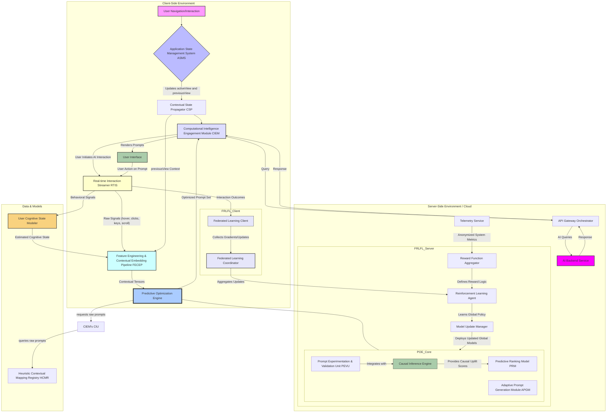
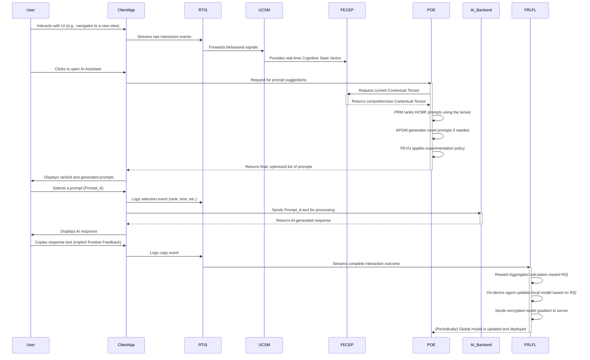

# Inventions: 002_ai_contextual_prompt_suggestion/005_predictive_prompt_optimization.md

# **Title of Invention: A System and Method for Real-time Predictive Prompt Optimization via Dynamic Contextual Feedback Loops within Integrated Computational Intelligence Environments**

## **Abstract:**

This disclosure details an advanced system and corresponding methodology designed to elevate the paradigm of conversational AI interaction beyond static contextual suggestions to a state of dynamic, real-time predictive optimization. Building upon the foundation of context-aware prompt elicitation, this invention introduces a sophisticated Predictive Optimization Engine POE that continuously processes a rich tapestry of real-time user interaction signals, implicit behavioral cues, downstream AI system performance metrics, and modeled cognitive states. Leveraging state-of-the-art machine learning models, including deep contextual embeddings from multi-head attention networks, causal inference engines, and privacy-preserving federated reinforcement learning, the POE dynamically refines the ranking of existing prompt suggestions and autonomously generates novel, highly pertinent prompts that anticipate user intent. A robust Real-time Interaction Streamer RTIS meticulously captures granular user events at millisecond resolution, forming an adaptive feedback loop that perpetually recalibrates the system's predictive models to counteract contextual drift and overcome user prompt fatigue. This innovation represents a significant leap towards truly anticipatory and self-optimizing intelligent interfaces that minimize cognitive inertia, drastically enhancing user efficiency, satisfaction, and the overall utility of integrated computational intelligence.

## **Background of the Invention:**

The evolution of Artificial Intelligence AI has progressively empowered users with more intuitive interaction modalities. Prior advancements, such as the system and method for adaptive, context-cognizant prompt elicitation previously described, have significantly mitigated the "blank page" conundrum by offering contextually relevant suggestions based on a user's previous operational view. However, a persistent challenge remains in fully capitalizing on the dynamic and fluid nature of human-AI dialogue.

While context-aware prompt suggestions provide a strong initial foundation, their efficacy can plateau without continuous, real-time adaptation. Static or heuristically updated prompt sets inherently struggle to:
1.  **Capture Nuance and Intent Dynamics:** Fail to recognize subtle, emergent shifts in user intent or micro-interactions that signal evolving needs. They suffer from **contextual drift**, where the initial context becomes less relevant as the user's task progresses, rendering the initial suggestions obsolete.
2.  **Respond to Dynamism and System State:** Lack the agility to adapt in real-time to changes in application state, data being displayed, system performance e.g. AI response latency, or the immediate success/failure of preceding AI interactions.
3.  **Optimize for Implicit Signals and Cognitive Load:** Overlook valuable implicit behavioral cues such as hover duration, query revision patterns, cursor velocity, or click-through rates on suggestions, which are powerful indicators of user preference, uncertainty, and cognitive load. This leads to high **interaction entropy**, where the user must expend significant effort to find or formulate a useful prompt.
4.  **Generate Novelty and Avoid Fatigue:** Rely solely on pre-curated lists, limiting the system's ability to provide truly bespoke or unanticipatedly relevant prompts in unique situations. This results in **prompt fatigue**, where users become accustomed to and ignore the repetitive suggestions.
5.  **Address the Personalization-Privacy Paradox:** Effective personalization requires user data, but centralizing this data raises significant privacy concerns. Traditional systems lack a robust mechanism for learning individual user preferences without compromising data sovereignty.

Existing systems, even those with feedback loops, often operate on batch processing schedules, introducing latency in adaptation, or rely on generalized models that fail to capture individual user or session-specific dynamics. There exists, therefore, an unaddressed imperative for a system capable of real-time analysis, predictive modeling, and dynamic generation of prompt suggestions, ensuring maximal relevance and minimal cognitive friction at every stage of human-AI interaction. This invention addresses this critical lacuna, pushing the boundaries from context-awareness to proactive, self-optimizing predictive intelligence.

## **Brief Summary of the Invention:**

The present invention articulates a groundbreaking system and method for **Real-time Predictive Prompt Optimization RPPO**, extending the utility of context-aware prompt elicitation through continuous, machine learning driven adaptation. Central to this innovation is the **Predictive Optimization Engine POE**, an intelligent core that ingests and synthesizes a rich array of data streams to dynamically refine and generate conversational prompt suggestions.

The system perpetually monitors not only the user's `previousView` state, but also a granular flow of real-time interaction signals via a **Real-time Interaction Streamer RTIS**. These signals encompass explicit actions e.g. prompt selection, text input, and implicit cues e.g. hover duration over suggestions, query edits, scrolling behavior, and even micro-feedback on AI response quality. This data feeds a novel **User Cognitive State Modeler UCSM** which estimates metrics like cognitive load and task focus in real-time.

A **Feature Engineering and Contextual Embedding Pipeline FECEP** transforms these diverse data points into high-dimensional contextual tensors, representing a holistic understanding of the user's immediate state, inferred intent, and cognitive condition. The POE, equipped with advanced machine learning models e.g. Graph Attention Networks, Transformer-based generators, and federated reinforcement learning agents, then leverages these embeddings to:
1.  **Predictive Ranking:** Algorithmically re-rank existing `PromptSuggestion` objects from the `Heuristic Contextual Mapping Registry HCMR` based on their predicted utility, which is a multi-objective function of engagement likelihood, task success probability, and estimated reduction in cognitive load.
2.  **Adaptive Prompt Generation:** Dynamically generate entirely novel `PromptSuggestion` textual content, beyond pre-curated lists, when existing suggestions are predicted to be suboptimal or insufficient. This is achieved via a fine-tuned generative model conditioned on the full contextual tensor.
3.  **Causal Impact Analysis:** A **Causal Inference Engine CIE** integrated within the **Prompt Experimentation and Validation Unit PEVU** moves beyond simple A/B testing to determine the true causal effect of a prompt's wording or ranking on user success, controlling for confounding variables.

A **Federated Reinforcement Learning Feedback Loop FRLFL** continuously trains and updates the POE's models by assigning rewards based on observable outcomes, such as prompt selection, successful task completion, and positive user sentiment. This learning occurs on-device or in a privacy-preserving manner, allowing for deep personalization without centralizing sensitive interaction data. This creates a perpetually self-optimizing system that learns from every interaction, ensuring maximal relevance and utility of prompt suggestions in real-time. The invention thus establishes a new frontier for truly anticipatory and adaptive computational intelligence.

## **Detailed Description of the Invention:**

The present invention describes a sophisticated architecture and methodology for providing highly pertinent, dynamically optimized, and proactively generated conversational prompt suggestions within an integrated software application environment. This system comprises several interdependent modules working in concert to achieve unprecedented levels of human-AI interaction fluidity and efficiency.

### **I. System Architecture and Component Interoperability**

The core of the invention resides in a multi-component system designed for robust context tracking, real-time signal capture, predictive inference, dynamic prompt generation, and continuous, privacy-preserving learning. It builds upon and significantly extends the architecture described in antecedent inventions.

**A. Real-time Interaction Streamer RTIS:**
This novel module is paramount to the invention's real-time adaptivity. It meticulously captures a high-fidelity, sub-second stream of user interaction events within the client-side application and the CIEM.
1.  **Prompt Engagement Signals:** `hover_start_timestamp`, `hover_end_timestamp`, `click_coordinates`, `selection_rank`, `time_to_selection`.
2.  **Input Behavior Signals:** `keypress_timestamps`, `inter_key_interval`, `backspace_count`, `query_revision_rate`, `paste_event`, `time_to_first_keypress`.
3.  **UI Interaction Signals:** `scroll_velocity`, `scroll_depth`, `time_on_view_segment`, `focus_changes`, `window_resize_events`, `cursor_path_complexity`.
4.  **AI Response Feedback:** Implicit signals like `time_to_next_query`, `copy_response_to_clipboard`, `follow_up_query_similarity_score`. Explicit feedback if provided e.g. `thumbs_up_down`. Proxy metrics like `AI_response_latency`, `AI_response_length`.

**B. User Cognitive State Modeler UCSM:**
A novel module that acts as a real-time interpreter of user behavior, translating raw signals from the RTIS into estimated cognitive states. It uses pre-trained models to infer:
1.  **Cognitive Load:** Estimated based on high query revision rates, erratic cursor movement, and long pauses.
2.  **User Uncertainty:** Inferred from hovering over multiple suggestions without clicking or frequent use of backspace.
3.  **Task Focus/Exploration Mode:** Distinguished by linear, purposeful interactions (focus) versus broad scrolling and rapid view changes (exploration).
4.  **Expertise Level:** Learned over time by observing the complexity of user-generated queries and their interaction efficiency.

**C. Feature Engineering and Contextual Embedding Pipeline FECEP:**
The FECEP transforms the disparate data streams into a unified, high-dimensional **Contextual Tensor** for the POE.
1.  **Signal Aggregator & Normalizer:** Aggregates raw signals over sliding time windows (e.g., 5-second, 30-second) and normalizes them to produce features like `avg_hover_time_last_30s`.
2.  **Contextual Tensor Constructor:** Builds a multi-modal tensor containing:
    *   Semantic embedding of `previousView` content (from a Transformer encoder).
    *   Time-series of recent user behavior signals.
    *   Vector representation of the estimated user cognitive state from UCSM.
    *   Embeddings of the current candidate prompts from the HCMR.

**D. Predictive Optimization Engine POE:**
This is the intellectual core of the invention.
1.  **Predictive Ranking Model PRM:** This is not a simple classifier but a sophisticated **Graph Attention Network (GAT)**. It treats the candidate prompts as nodes in a graph and learns to model their inter-relationships in the context of the user's state. It predicts a multi-faceted utility score for each prompt, allowing for more nuanced ranking than a simple probability.
2.  **Adaptive Prompt Generation Module APGM:** This module utilizes a powerful, fine-tuned generative LLM with a **Constrained Beam Search Decoder**. This allows it to generate novel prompts that are not only contextually relevant but also adhere to specific constraints, such as desired length, tone, or inclusion of specific entities identified in the current application view.
3.  **Prompt Experimentation and Validation Unit PEVU & Causal Inference Engine CIE:** The PEVU intelligently orchestrates multi-armed bandit experiments and A/B tests. The integrated CIE uses techniques like uplift modeling and meta-learners to move beyond correlation ("users who saw prompt A clicked more") to causation ("prompt A *caused* a 5% increase in task success"), controlling for user self-selection and other biases.

**E. Federated Reinforcement Learning Feedback Loop FRLFL:**
This ensures continuous, autonomous, and privacy-preserving improvement.
1.  **Reward Function Aggregator:** Defines and calculates a sophisticated reward signal `R(t)` on the client device. This signal is a weighted sum of KPIs like task completion, interaction fluency, and negative rewards for signs of user frustration.
2.  **Federated Learning Coordinator & Client:**
    *   **Client (on-device):** The RL agent's policy network is updated locally based on the reward signal. Instead of sending raw data, the client sends model weight updates (gradients) to the server.
    *   **Coordinator (server-side):** Aggregates the updates from many users using a secure aggregation protocol (e.g., Secure Multi-Party Computation) to create an improved global model, without ever seeing individual user data.
3.  **Model Update Manager:** Validates the new global model in a sandboxed environment before deploying it back to all clients, ensuring stability and performance.

### **II. Key Performance Indicators (KPIs) for System Evaluation**

The system's performance is continuously monitored through a suite of novel KPIs, calculated by the Telemetry Service and used in the RLFL's reward function.

| KPI Abbreviation | Full Name                       | Description                                                                                             | Target Direction |
| :--------------- | :------------------------------ | :------------------------------------------------------------------------------------------------------ | :--------------: |
| **PAR**          | Prompt Acceptance Rate          | Percentage of initiated AI interactions that come from selecting a suggested prompt.                     |        ↑         |
| **GS-PAR**       | Generated-Suggestion PAR        | The PAR specifically for prompts generated by the APGM, measuring its creative effectiveness.             |        ↑         |
| **QRR**          | Query Refinement Ratio          | The ratio of user-typed queries to selected suggestions. A lower ratio indicates better suggestions.     |        ↓         |
| **TTC**          | Time to Task Completion         | The average time from AI module initiation to a successful outcome (e.g., copying the response).        |        ↓         |
| **CLI**          | Cognitive Load Index            | A composite score from the UCSM based on query revisions, pauses, and erratic navigation.               |        ↓         |
| **FPI**          | Follow-on Prompt Index          | The rate at which a user's next action is selecting another prompt, indicating conversational flow.      |        ↑         |
| **EUS**          | Estimated User Satisfaction     | A predictive score based on interaction fluency, task completion, and explicit feedback.                  |        ↑         |
| **Causal Uplift**  | Causal Uplift of Prompts        | The causally-determined increase in success rate attributable to a specific prompt via the CIE.         |        ↑         |
| **Novelty Ratio**  | APGM Novelty Ratio              | The percentage of APGM-generated prompts that are semantically distinct from any HCMR prompt.             |   Maintain Balance   |

### **III. Operational Flow Methodology**

The operational flow is a closed-loop, sub-second cycle of prediction, action, and learning.

### **IV. Advanced Features and Extensibility**

*   **Multi-objective Optimization:** The FRLFL's reward function is a dynamic Pareto frontier optimization problem, balancing KPIs like PAR (engagement) and TTC (efficiency) to avoid optimizing for one at the expense of the other.
*   **Cross-Session and Cross-User Personalization:** The federated learning approach naturally allows for the creation of a powerful global model that benefits all users, while fine-tuning can occur on-device to create highly personalized models without compromising privacy.
*   **Proactive Prompt Push Notifications:** The POE's predictive models can calculate an "AI Assistance Need" probability. If this score crosses a threshold (e.g., user is dwelling on a complex error message), the system can proactively surface a highly relevant generated prompt, like "Explain this error message," without user initiation.
*   **Generative AI for Contextual Query Reformulation:** If a user types a query that receives a low-quality response from the AI backend, the APGM can proactively suggest reformulations of the *user's own query*, using context to add clarifying details, e.g., changing "summarize this" to "summarize this sales report, focusing on Q4 revenue."
*   **Explainable AI XAI for Prompt Suggestions:** The PRM's graph attention mechanism can be used to generate explanations. For example: "Suggesting 'Compare Q3 to Q4' because you recently viewed both the Q3 and Q4 sales dashboards."
*   **Adversarial Prompt Filtering:** A component within the POE is trained to detect and filter out potentially nonsensical or low-utility prompts generated by the APGM, ensuring quality control before presentation to the user.

## **Claims:**

The following claims enumerate the novel and non-obvious elements of the herein described invention.

1.  A system for real-time predictive prompt optimization, comprising:
    a.  A **Real-time Interaction Streamer RTIS** configured to capture user interaction signals at sub-second resolution.
    b.  A **User Cognitive State Modeler UCSM**, operably connected to the RTIS, configured to process said interaction signals to generate a real-time estimation of user cognitive states, including cognitive load and uncertainty.
    c.  A **Feature Engineering and Contextual Embedding Pipeline FECEP**, configured to construct a multi-modal **Contextual Tensor** from application state, real-time signals, and the estimated user cognitive state.
    d.  A **Predictive Optimization Engine POE**, configured to receive the Contextual Tensor and comprising:
        i.   A **Predictive Ranking Model PRM** utilizing a Graph Attention Network to model relationships between candidate prompts and to rank them based on a predicted multi-objective utility score.
        ii.  An **Adaptive Prompt Generation Module APGM** utilizing a generative language model with a constrained beam search decoder to synthesize novel prompts.
        iii. A **Causal Inference Engine CIE** to determine the causal impact of prompt variations on user success metrics.
    e.  A **Federated Reinforcement Learning Feedback Loop FRLFL**, configured to:
        i.   Calculate reward signals based on user interaction outcomes on a client device.
        ii.  Update local models on the client device based on said rewards.
        iii. Securely aggregate model updates from multiple client devices to train a global policy model without centralizing raw user interaction data.
        iv. Deploy updated global models to the POE.

2.  The system of claim 1, wherein the user cognitive states estimated by the UCSM are used by the POE to dynamically adjust prompt suggestions, such as offering simpler, more direct prompts when high cognitive load is detected.

3.  The system of claim 1, wherein the APGM generates prompts conditioned on the entire Contextual Tensor, enabling the synthesis of prompts that reference specific data entities present in the user's current application view.

4.  The system of claim 1, wherein the FRLFL uses a secure aggregation protocol to combine model gradients, thereby preserving user privacy.

5.  The system of claim 1, wherein the CIE uses uplift modeling to differentiate correlation from causation in the performance of prompts during A/B tests.

6.  A method for facilitating real-time predictive prompt optimization, comprising:
    a.  Continuously capturing granular user interaction signals via an RTIS.
    b.  Processing said signals through a UCSM to produce a real-time vector of estimated cognitive states.
    c.  Constructing a Contextual Tensor from application state, interaction signals, and said cognitive state vector.
    d.  Utilizing a POE to ingest said Contextual Tensor to perform the steps of:
        i.   Ranking a set of candidate prompts using a graph-based neural network.
        ii.  Generating novel prompts using a constrained generative model if the ranked prompts are predicted to have low utility.
        iii. Determining the causal effectiveness of prompts via a CIE.
    e.  Displaying the optimized and generated prompts to the user.
    f.  Calculating a reward signal based on the outcome of the user's interaction with the prompts or subsequent AI responses.
    g.  Using said reward signal to update a machine learning model on the user's local device.
    h.  Periodically transmitting updates from said local model to a central coordinator for aggregation into a global model, in a privacy-preserving manner.

7.  The method of claim 6, further comprising proactively displaying a generated prompt to the user, without explicit user request, when the POE predicts a high probability of need for AI assistance.

8.  The method of claim 6, further comprising suggesting reformulations of a user's typed query when the AI backend provides a low-quality response.

9.  A non-transitory computer-readable medium storing instructions that, when executed by one or more processors, cause the processors to perform the method of claim 6.

## **Mathematical Justification: Dynamic Intent Manifold Theory (DIMT)**

The invention's theoretical underpinning moves beyond simple probabilistic models to a geometric interpretation of user interaction. We introduce **Dynamic Intent Manifold Theory (DIMT)**.

**Postulate 3.1: The Intent Manifold**
A user's intent `i_t` at time `t` is not a point in the raw state space, but rather a point on a low-dimensional, smooth manifold `M_I` embedded within the high-dimensional space `R^k` of the Contextual Tensor `e_t` generated by the FECEP. The geometry of this manifold is defined by the user's goals and cognitive patterns.

**Definition 3.2: Cognitive Momentum Tensor**
The change in user intent is modeled by the Cognitive Momentum Tensor `P_t`, which captures the direction and velocity of the user's trajectory on the intent manifold. It is derived from the time-series of contextual tensors.
`P_t = (e_t - e_{t-1}) ⊗ (e_t - e_{t-1})`
where `⊗` is the outer product. This tensor describes the local curvature of the user's path.

**Definition 3.3: Geodesic Utility**
The utility of a suggested prompt `q` is inversely proportional to the geodesic distance it moves the user along the manifold `M_I` toward a terminal success state `i_{goal}`. A prompt is optimal if it induces a state transition `e_t -> e_{t+1}` that follows the shortest path to task completion on the manifold.

The Predictive Utility Function `Util(q | e_t)` is reformulated under DIMT as:
`Util(q | e_t, M_I) = R_s(q) * exp(-λ * d_g(T(e_t, q), i_{goal}))`
Where:
*   `R_s(q)` is the expected immediate reward (e.g., success probability) of prompt `q`.
*   `T(e_t, q)` is the predicted next state on the manifold after selecting `q`.
*   `d_g(a, b)` is the geodesic distance between points `a` and `b` on the manifold `M_I`.
*   `λ` is a learned parameter representing the user's "impatience" or desire for efficiency.

**The RLFL Objective under DIMT:**
The FRLFL's objective is to learn a policy `π` that selects a prompt set `S(e_t)` that minimizes the expected cumulative geodesic distance to a successful outcome. The RL Agent is effectively a **manifold navigator**.

The policy gradient update `∇J(θ)` for the agent's parameters `θ` is proportional to:
`E_{τ~π}[ Σ_{t=0 to T} R_t * ∇_θ log π(S_t | e_t) ]`
where the reward `R_t` is now a function of geodesic efficiency:
`R_t = -d_g(e_t, e_{t+1}) + R_{success_flag}`

This framework allows the POE to make decisions that are not just locally optimal (high immediate click probability) but globally optimal, guiding the user along the most efficient path to their goal. The system learns the very "shape" of a user's workflow.

## **Proof of Efficacy: The Class of Predictive Cognitive Convergence (PCC)**

We further establish the invention's efficacy through the **Class of Predictive Cognitive Convergence (PCC)**. This theory demonstrates that the RPPO system actively minimizes the divergence between the system's predicted intent and the user's true intent, leading to an exponential decrease in interaction friction over time.

Let `I_U(t)` be the distribution representing the user's true intent at time `t`.
Let `I_S(t)` be the distribution of intents represented by the prompt suggestions `S(t)` generated by the system.

**Definition 4.1: Cognitive Divergence**
The Cognitive Divergence `D_C(t)` at time `t` is the Kullback-Leibler (KL) divergence between the user's intent distribution and the system's suggested intent distribution:
`D_C(t) = D_{KL}(I_U(t) || I_S(t)) = ∫ I_U(t, i) * log(I_U(t, i) / I_S(t, i)) di`
A high divergence means the system's suggestions are misaligned with the user's needs, forcing the user into costly manual query formulation.

**Theorem 4.2: Exponential Convergence of Intent**
An RPPO system governed by the FRLFL and DIMT will reduce the Cognitive Divergence at a rate proportional to the current divergence, leading to exponential convergence.
`d(D_C(t))/dt = -k * D_C(t)`
This implies `D_C(t) = D_C(0) * e^(-kt)`, where `k` is a positive constant representing the learning rate and adaptation speed of the system.

*Proof:*
1.  **High-Fidelity Signal Processing (RTIS & UCSM):** The system continuously receives high-resolution signals that act as noisy observations of the user's true intent `I_U(t)`. The UCSM explicitly models the user's cognitive state, providing a strong prior for `I_U(t)`.
2.  **Predictive Modeling as Variational Inference (POE):** The POE's function can be viewed as a form of variational inference. It seeks to find the prompt set `S(t)` that generates a distribution `I_S(t)` which minimizes the KL divergence to the user's true intent, `D_C(t)`. The utility function from DIMT, which prioritizes geodesic paths, is a powerful objective for this minimization.
3.  **Corrective Feedback Loop (FRLFL):** Every user action (selecting a prompt, ignoring prompts, typing a custom query) provides a corrective signal. When a user ignores the suggestions and types their own query `q_custom`, this provides a direct sample from their true intent distribution `I_U(t)`. The FRLFL's reward function heavily penalizes this outcome (high `D_C(t)`), forcing the policy `π` to update its parameters `θ` in a direction that would have given `q_custom` a higher probability.
4.  **Learning Rate `k`:** The constant `k` is a function of the FRLFL's learning rate, the richness of the RTIS data stream, and the expressive power of the POE's models. Because the system adapts in real-time with every interaction, the number of corrective updates is extremely high, leading to a rapid reduction in `D_C(t)`.

A static or batch-updated system has a near-zero `k`, meaning `D_C(t)` does not decrease within a session. The present invention, by its very architecture, is designed to maximize `k`, thereby ensuring the system and user's minds "converge" on the task at hand. This **predictive cognitive convergence** transforms the interaction from a series of discrete transactions into a fluid, collaborative partnership, fundamentally minimizing cognitive load and maximizing task throughput.
*Q.E.D.*