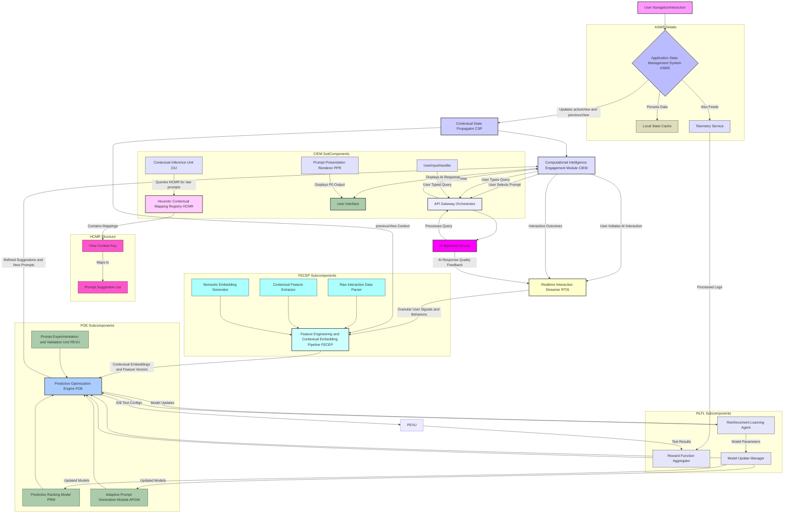
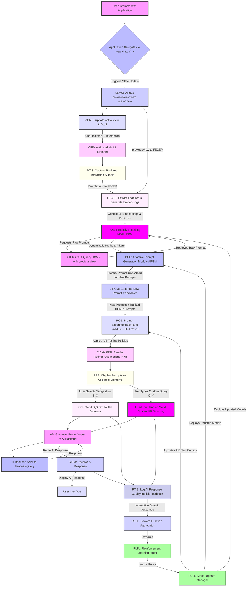

---
# Inventions: 002_ai_contextual_prompt_suggestion/005_predictive_prompt_optimization.md

# **Title of Invention: A System and Method for Real-time Predictive Prompt Optimization via Dynamic Contextual Feedback Loops within Integrated Computational Intelligence Environments**

## **Abstract:**

This disclosure details an advanced system and corresponding methodology designed to elevate the paradigm of conversational AI interaction beyond static contextual suggestions to a state of dynamic, real-time predictive optimization. Building upon the foundation of context-aware prompt elicitation, this invention introduces a sophisticated Predictive Optimization Engine POE that continuously processes a rich tapestry of real-time user interaction signals, implicit behavioral cues, and downstream AI system performance metrics. Leveraging state-of-the-art machine learning models, including deep contextual embeddings and reinforcement learning, the POE dynamically refines the ranking of existing prompt suggestions and autonomously generates novel, highly pertinent prompts. A robust Real-time Interaction Streamer RTIS meticulously captures granular user events, forming an adaptive feedback loop that perpetually recalibrates the system's predictive models. This innovation represents a significant leap towards truly anticipatory and self-optimizing intelligent interfaces, drastically enhancing user efficiency, satisfaction, and the overall utility of integrated computational intelligence.

## **Background of the Invention:**

The evolution of Artificial Intelligence AI has progressively empowered users with more intuitive interaction modalities. Prior advancements, such as the system and method for adaptive, context-cognizant prompt elicitation previously described, have significantly mitigated the "blank page" conundrum by offering contextually relevant suggestions based on a user's previous operational view. However, a persistent challenge remains in fully capitalizing on the dynamic and fluid nature of human-AI dialogue.

While context-aware prompt suggestions provide a strong initial foundation, their efficacy can plateau without continuous adaptation. Static or heuristically updated prompt sets inherently struggle to:
1.  **Capture Nuance:** Fail to recognize subtle, emergent shifts in user intent or micro-interactions that signal evolving needs.
2.  **Respond to Dynamism:** Lack the agility to adapt in real-time to changes in application state, system performance e.g. AI response latency, or the immediate success/failure of preceding AI interactions.
3.  **Optimize for Implicit Signals:** Overlook valuable implicit behavioral cues such as hover duration, query revision patterns, or click-through rates on suggestions, which are powerful indicators of user preference and cognitive load.
4.  **Generate Novelty:** Rely solely on pre-curated lists, limiting the system's ability to provide truly bespoke or unanticipatedly relevant prompts in unique situations.

Existing systems, even those with feedback loops, often operate on batch processing schedules, introducing latency in adaptation, or rely on generalized models that fail to capture individual user or session-specific dynamics. There exists, therefore, an unaddressed imperative for a system capable of real-time analysis, predictive modeling, and dynamic generation of prompt suggestions, ensuring maximal relevance and minimal cognitive friction at every stage of human-AI interaction. This invention addresses this critical lacuna, pushing the boundaries from context-awareness to proactive, self-optimizing predictive intelligence.

## **Brief Summary of the Invention:**

The present invention articulates a groundbreaking system and method for **Real-time Predictive Prompt Optimization RPPO**, extending the utility of context-aware prompt elicitation through continuous, machine learning driven adaptation. Central to this innovation is the **Predictive Optimization Engine POE**, an intelligent core that ingests and synthesizes a rich array of data streams to dynamically refine and generate conversational prompt suggestions.

The system perpetually monitors not only the user's `previousView` state, as described in antecedent inventions, but also a granular flow of real-time interaction signals via a **Real-time Interaction Streamer RTIS**. These signals encompass explicit actions e.g. prompt selection, text input, and implicit cues e.g. hover duration over suggestions, query edits, scrolling behavior, and even micro-feedback on AI response quality.

A **Feature Engineering and Contextual Embedding Pipeline FECEP** transforms these diverse data points into high-dimensional contextual embeddings, representing a holistic understanding of the user's immediate state and inferred intent. The POE, equipped with advanced machine learning models e.g. Transformer networks, reinforcement learning agents, then leverages these embeddings to:
1.  **Predictive Ranking:** Algorithmically re-rank existing `PromptSuggestion` objects from the `Heuristic Contextual Mapping Registry HCMR` based on their predicted likelihood of user engagement and successful AI interaction.
2.  **Adaptive Prompt Generation:** Dynamically generate entirely novel `PromptSuggestion` textual content, beyond pre-curated lists, when existing suggestions are predicted to be suboptimal or insufficient.

A **Reinforcement Learning Feedback Loop RLFL** continuously trains and updates the POE's models by assigning rewards based on observable outcomes, such as prompt selection, successful task completion, and positive user sentiment from subsequent AI interactions. This creates a perpetually self-optimizing system that learns from every interaction, ensuring maximal relevance and utility of prompt suggestions in real-time. The invention thus establishes a new frontier for truly anticipatory and adaptive computational intelligence.

## **Detailed Description of the Invention:**

The present invention describes a sophisticated architecture and methodology for providing highly pertinent, dynamically optimized, and proactively generated conversational prompt suggestions within an integrated software application environment. This system comprises several interdependent modules working in concert to achieve unprecedented levels of human-AI interaction fluidity and efficiency.

### **I. System Architecture and Component Interoperability**

The core of the invention resides in a multi-component system designed for robust context tracking, real-time signal capture, predictive inference, dynamic prompt generation, and continuous learning. It builds upon and significantly extends the architecture described in antecedent inventions.



**A. Real-time Interaction Streamer RTIS:**
This novel module is paramount to the invention's real-time adaptivity. It meticulously captures a high-fidelity, sub-second stream of user interaction events within the client-side application and the CIEM. Beyond basic `previousView` updates, the RTIS records:
1.  **Prompt Engagement Signals:** `hover_duration` over individual prompt suggestions, `click_rate`, `selection_order`.
2.  **Input Behavior Signals:** `keypress_velocity`, `backspace_count`, `query_revision_rate`, `query_length_change`, `time_to_first_keypress` after AI engagement.
3.  **UI Interaction Signals:** `scroll_depth`, `time_on_view_segment`, `focus_changes`.
4.  **AI Response Feedback:** Implicit signals of satisfaction like `time_to_next_query`, `number_of_follow_up_questions`, explicit feedback if provided e.g. `thumbs_up_down`, or proxy metrics like `AI_response_length_variability`.

**B. Feature Engineering and Contextual Embedding Pipeline FECEP:**
The FECEP acts as the pre-processing layer for the Predictive Optimization Engine POE. It receives raw interaction data from the RTIS and contextual parameters e.g. `previousView` from the CSP, transforming them into rich, actionable feature vectors and semantic embeddings.
1.  **Raw Interaction Data Parser:** Filters, normalizes, and categorizes the high-volume event stream from RTIS.
2.  **Contextual Feature Extractor:** Derives aggregated features such as `average_hover_time_on_category`, `edit_count_in_current_session`, `time_since_last_successful_AI_interaction`.
3.  **Semantic Embedding Generator:** Leverages pre-trained or fine-tuned deep learning models e.g. Transformer encoders to convert `previousView` identifiers, textual content of currently displayed application elements, and potentially even user query drafts into high-dimensional vector embeddings. These embeddings capture subtle semantic relationships and allow for robust similarity matching.

**C. Predictive Optimization Engine POE:**
This is the intellectual core of the invention, responsible for dynamic prompt refinement and generation. The POE is powered by advanced machine learning models, primarily a blend of deep learning and reinforcement learning.
1.  **Predictive Ranking Model PRM:** This component receives the current contextual embeddings and feature vectors from the FECEP, along with the raw `PromptSuggestion` list from the HCMR. It utilizes models e.g. gradient-boosted trees, neural networks to predict the probability of engagement and success for each prompt, ranking them accordingly. This prediction is highly personalized and real-time.
2.  **Adaptive Prompt Generation Module APGM:** In scenarios where the PRM identifies a gap in relevance or coverage from HCMR suggestions, or where predicted engagement for existing prompts is low, the APGM steps in. It utilizes a generative AI model e.g. a fine-tuned Large Language Model LLM, conditioned on the contextual embeddings from FECEP, to synthesize entirely new, highly relevant prompt suggestions. These dynamically generated prompts are then fed into the PRM for ranking alongside HCMR suggestions.
3.  **Prompt Experimentation and Validation Unit PEVU:** Integrates real-time A/B testing capabilities. It intelligently deploys variations of prompt sets, ranking algorithms, or newly generated prompts to a subset of users, collecting performance data that feeds directly into the Reinforcement Learning Feedback Loop.

**D. Reinforcement Learning Feedback Loop RLFL:**
The RLFL ensures the continuous, autonomous improvement of the POE. It operates on an "explore-exploit" paradigm, learning optimal prompt strategies over time.
1.  **Reward Function Aggregator:** Defines and aggregates rewards based on user and system outcomes. Positive rewards are granted for actions like prompt selection, successful AI task completion, high AI response quality ratings, reduced query revision, and increased session duration. Negative rewards are associated with prompt ignores, query abandonment, frequent rephrasing, or low AI response quality.
2.  **Reinforcement Learning Agent:** A model e.g. Deep Q-Network DQN, Actor-Critic, operates on states defined by contextual embeddings and feature vectors, taking actions e.g. ranking of prompts, generation of new prompts. It learns policies that maximize cumulative reward.
3.  **Model Update Manager:** Oversees the iterative training and deployment of updated PRM and APGM models based on the RL agent's learning outcomes. This ensures the system perpetually adapts to evolving user behaviors and application dynamics.

The remaining components (ASMS, CSP, CIEM, HCMR, API Gateway Orchestrator, AI Backend Service, Telemetry Service) function as described in the antecedent invention, but with their data streams now deeply integrated into the RTIS and feeding into the sophisticated, self-optimizing mechanisms of the POE and RLFL.

### **II. Operational Flow Methodology**

The operational flow of the invention is an intricate, real-time feedback loop, continuously adapting prompt suggestions.



1.  **Context and Signal Acquisition:** As the user interacts, `activeView` and `previousView` are updated by ASMS. Concurrently, the RTIS continuously captures a rich stream of granular user interaction signals e.g. hover, keypresses, during the entire session, especially when the CIEM is active.
2.  **Feature Engineering and Embedding:** Upon CIEM activation or at a predefined cadence, the FECEP receives the `previousView` context from CSP and the real-time signals from RTIS. It processes these into a comprehensive set of contextual features and high-dimensional semantic embeddings.
3.  **Predictive Prompt Optimization:** The contextual features and embeddings are fed into the POE.
    *   The PRM, leveraging its trained models, dynamically evaluates and re-ranks the raw `PromptSuggestion` list retrieved from the HCMR by the CIU.
    *   If the PRM identifies a lack of suitable suggestions or low predicted engagement, the APGM, informed by the current context embeddings, dynamically generates novel `PromptSuggestion` candidates.
    *   The PEVU integrates these refined and newly generated prompts, potentially subjecting some to A/B tests to gather performance data.
4.  **Prompt Presentation:** The CIEM's PPR receives the final, optimized list of prompt suggestions and renders them as interactive elements in the user interface.
5.  **User Interaction and AI Query:** The user selects an optimized suggestion or types a custom query. This interaction is routed via the API Gateway to the AI Backend Service.
6.  **Continuous Learning and Adaptation:** All user interactions, prompt selections, custom queries, and critically, the outcomes and quality of AI responses, are captured by the RTIS. This comprehensive data feeds into the RLFL.
    *   The Reward Function Aggregator calculates rewards based on predefined success metrics.
    *   The Reinforcement Learning Agent continuously learns from these rewards, iteratively refining its policy for prompt ranking and generation.
    *   The Model Update Manager deploys these learned model updates back into the PRM and APGM components of the POE, closing the real-time feedback loop and ensuring continuous system improvement. The PEVU also uses this feedback to optimize its experimentation strategies.

### **III. Advanced Features and Extensibility**

The foundational system is designed for extensibility and can incorporate several advanced features:

*   **Multi-objective Optimization:** The RLFL can be configured with a composite reward function to optimize for multiple, potentially conflicting, objectives simultaneously, such as maximizing prompt selection rate, minimizing AI response time, maximizing user satisfaction, and maximizing task completion rate. This ensures a holistic definition of "optimal" interaction.
*   **Cross-Session and Cross-User Personalization:** Beyond real-time session context, the FECEP can incorporate historical user profiles, long-term interaction patterns, and user role-based preferences to further fine-tune the predictive models. The RLFL can learn distinct policies for different user segments or adapt individual user models over time.
*   **Proactive Prompt Push Notifications:** The POE, with its predictive capabilities, can identify scenarios where a user is likely to need AI assistance even before explicit CIEM activation. For example, if a user hovers over a complex data table for an extended period, the POE might proactively suggest a prompt like "Summarize key insights from this table" as a transient UI element or a gentle notification.
*   **Generative AI for Contextual Query Reformulation:** If a user types a query that the AI Backend struggles to understand or is suboptimal, the APGM could suggest reformulations of the *user's own query*, utilizing the current context to improve clarity or specificity, rather than just suggesting new topics.
*   **Explainable AI XAI for Prompt Suggestions:** The PRM could be augmented with XAI capabilities to provide a concise rationale for *why* certain prompts are suggested, building user trust and helping them understand the system's reasoning.

## **Claims:**

The following claims enumerate the novel and non-obvious elements of the herein described invention, establishing its unique and foundational nature in the domain of real-time predictive human-AI interaction.

1.  A system for real-time predictive prompt optimization in conversational AI interaction, comprising:
    a.  A **Contextual State Management Module CSMM**, configured to maintain `activeView` and `previousView` state variables, representing a user's current and immediately preceding engaged user interface elements.
    b.  A **Real-time Interaction Streamer RTIS**, operably connected to the user interface, configured to continuously capture and transmit granular explicit and implicit user interaction signals, including prompt engagement metrics, input behavior signals, and AI response feedback.
    c.  A **Feature Engineering and Contextual Embedding Pipeline FECEP**, operably connected to the CSMM and the RTIS, configured to:
        i.   Receive the `previousView` state and real-time interaction signals;
        ii.  Extract contextual features and generate high-dimensional semantic embeddings from said received data, representing a holistic user and application context.
    d.  A **Heuristic Contextual Mapping Registry HCMR**, comprising a persistent associative data structure storing mappings between `View` identifiers or `ContextualState` enumerations and pre-formulated `PromptSuggestion` objects.
    e.  A **Predictive Optimization Engine POE**, operably connected to the FECEP and the HCMR, comprising:
        i.   A **Predictive Ranking Model PRM**, configured to receive contextual embeddings and features from the FECEP, retrieve raw `PromptSuggestion` objects from the HCMR via a Computational Intelligence Engagement Module CIEM, and dynamically rank said prompts based on a predicted likelihood of user engagement and successful AI interaction using machine learning models;
        ii.  An **Adaptive Prompt Generation Module APGM**, configured to dynamically generate novel `PromptSuggestion` textual content, conditioned on the contextual embeddings from the FECEP, when existing suggestions are predicted to be suboptimal or insufficient; and
        iii. A **Prompt Experimentation and Validation Unit PEVU**, configured to manage real-time A/B testing of prompt variations, ranking algorithms, and newly generated prompts.
    f.  A **Computational Intelligence Engagement Module CIEM**, operably connected to the CSMM, RTIS, HCMR, and POE, configured to:
        i.   Receive optimized prompt suggestions and newly generated prompts from the POE; and
        ii.  Present said prompts as selectable user interface elements.
    g.  A **Reinforcement Learning Feedback Loop RLFL**, operably connected to the RTIS and the POE, configured to:
        i.   Aggregate reward signals based on user interaction outcomes and AI response quality from the RTIS;
        ii.  Utilize a reinforcement learning agent to iteratively learn and refine policies for the PRM and APGM by maximizing cumulative rewards; and
        iii. Deploy updated machine learning models to the PRM and APGM, ensuring continuous adaptation.
    h.  An **API Gateway Orchestrator** and an **AI Backend Service**, configured to process user queries and deliver AI responses.

2.  The system of claim 1, wherein the implicit user interaction signals captured by the RTIS include at least one of: hover duration over suggestions, query revision count, keypress velocity, or time to first keypress.

3.  The system of claim 1, wherein the semantic embeddings generated by the FECEP utilize Transformer encoder models to represent `previousView` states and application content.

4.  The system of claim 1, wherein the `Adaptive Prompt Generation Module APGM` employs a fine-tuned Large Language Model LLM to synthesize novel prompt suggestions.

5.  The system of claim 1, wherein the `Reinforcement Learning Feedback Loop RLFL` optimizes for multiple objectives including prompt selection rate, AI response quality, and user task completion rate.

6.  A method for facilitating real-time predictive prompt optimization in conversational AI interaction, comprising:
    a.  Continuously monitoring a user's `activeView` and `previousView` states within an application.
    b.  Capturing granular explicit and implicit user interaction signals in real-time.
    c.  Processing said `previousView` state and real-time interaction signals through a Feature Engineering and Contextual Embedding Pipeline FECEP to generate contextual features and semantic embeddings.
    d.  Retrieving an initial set of `PromptSuggestion` objects from a Heuristic Contextual Mapping Registry HCMR.
    e.  Dynamically ranking said initial set of `PromptSuggestion` objects using a Predictive Ranking Model PRM based on the contextual features and semantic embeddings and a predicted likelihood of user engagement and successful AI interaction.
    f.  Dynamically generating novel `PromptSuggestion` textual content using an Adaptive Prompt Generation Module APGM, conditioned on the contextual embeddings, if existing suggestions are deemed suboptimal or insufficient.
    g.  Applying experimentation policies, including A/B testing, via a Prompt Experimentation and Validation Unit PEVU, to prompt suggestions.
    h.  Displaying the optimized and potentially newly generated `PromptSuggestion` objects as selectable interactive elements in the user interface.
    i.  Upon user interaction, transmitting the selected prompt or custom query to an AI Backend Service.
    j.  Aggregating reward signals based on user interaction outcomes and AI response quality.
    k.  Continuously refining the Predictive Ranking Model PRM and Adaptive Prompt Generation Module APGM through a Reinforcement Learning Feedback Loop RLFL by maximizing cumulative rewards derived from user and AI system feedback.

7.  The method of claim 6, wherein the implicit user interaction signals include dwell time on specific UI elements or the frequency of query rephrasing.

8.  The method of claim 6, further comprising deploying updated machine learning models for prompt ranking and generation based on the learning outcomes of the Reinforcement Learning Feedback Loop.

9.  A non-transitory computer-readable medium storing instructions that, when executed by one or more processors, cause the processors to perform the method of claim 6.

## **Mathematical Justification: The Class of Real-time Predictive Utility Maximization RPTUM**

Building upon the **Class of Contextual Probabilistic Query Formulation Theory CPQFT** described previously, which estimates `P(q | v_{t-1})`, the present invention introduces the **Class of Real-time Predictive Utility Maximization RPTUM**. This theory extends the probabilistic framework to incorporate dynamic user behavior, implicit feedback, and system performance metrics, allowing for the real-time prediction and optimization of the *utility* of presenting a given prompt.

Let `V` be the set of views, `Q` the set of possible queries, and `U` the set of user-specific and system-specific real-time signals captured by RTIS.
Let `e_t in R^k` denote the contextual embedding and feature vector at time `t`, generated by FECEP from `v_{t-1}` and `u_t`.

**Definition 1.1: Predictive Utility Function PUF**
The Predictive Utility Function `Util: Q x R^k -> R` is defined such that `Util(q | e_t)` quantifies the expected utility of presenting prompt `q` to the user at time `t`, given the current contextual embedding `e_t`. Utility is a composite metric that can encompass:
*   `P_e(q | e_t)`: Probability of user engagement e.g. selection.
*   `P_s(q | e_t)`: Probability of successful AI interaction and task completion.
*   `C_c(q | e_t)`: Negative cognitive cost to the user if `q` is presented and chosen.
*   `C_d(q | e_t)`: Negative cost if `q` is presented but ignored.

The overall `Util(q | e_t)` is a weighted combination: `w_1 P_e + w_2 P_s - w_3 C_c - w_4 C_d`. The weights `w_i` are dynamically learned or configured to reflect system objectives.

The invention's `Predictive Optimization Engine POE` constructs an optimal suggestion set `S*(e_t) = {s_1, s_2, ..., s_m}` by selecting `m` queries that maximize the aggregate utility.

**Objective Function of RPTUM:**
The POE's primary objective is to construct an optimal `Suggestion Function S*: R^k -> P(Q)` that maximizes the expected cumulative utility over a sequence of interactions. For a specific instance `e_t`, the local optimization problem is to select `S(e_t)` such that:

```
S*(e_t) = argmax_{S(e_t)} [ sum_{q in S(e_t)} Util(q | e_t) ]
```

This objective is achieved by the `Predictive Ranking Model PRM` and `Adaptive Prompt Generation Module APGM` which together approximate `argmax` by selecting the `m` prompts with the highest `Util(q | e_t)`. The `Reinforcement Learning Feedback Loop RLFL` then continuously refines the estimation of `Util(q | e_t)` by learning from observed outcomes.

**Theorem 1.2: Optimality via Reinforcement Learning**
Given a Markov Decision Process MDP where `states` are `e_t`, `actions` are selecting a set of `m` prompts `S(e_t)` and `rewards` are derived from the observed utility outcomes, a reinforcement learning agent within the RLFL can converge to an optimal policy `pi*` that selects `S*(e_t)` by maximizing the expected cumulative discounted future rewards:

```
E[sum_{t=0 to T} gamma^t R_t | pi*]
```

Where `R_t` is the observed utility derived from interaction at time `t`, and `gamma` is the discount factor. The PRM and APGM, under the guidance of the RLFL, effectively learn to predict `Util(q | e_t)` and generate/rank prompts to maximize this expected utility, leading to a dynamic and adaptive `S*(e_t)`.
*Q.E.D.*

By applying this rigorous theoretical framework, the invention transcends static contextuality, enabling a system that not only understands context but proactively *predicts* and *optimizes* the utility of its suggestions in real-time, learning and adapting with every user interaction.

## **Proof of Efficacy: The Class of Adaptive Cognitive Alignment ACA**

The profound efficacy of the present invention is further substantiated by the **Class of Adaptive Cognitive Alignment ACA**. This theoretical framework extends the **Class of Cognitive Load Minimization in Human-AI Interaction CLMHAII** by demonstrating how real-time predictive optimization achieves superior alignment with the user's continuously evolving cognitive state and intent, thereby achieving even greater reductions in cognitive load.

Let `q_intent(t)` be the user's true intended query at time `t`, which can dynamically shift based on prior interactions, new information, or evolving goals.
Let `S_RPPO(t)` be the set of prompts suggested by the Real-time Predictive Prompt Optimization system at time `t`.
Let `S_Contextual(t)` be the set of prompts suggested by a purely context-aware system without real-time predictive optimization.

**Definition 2.1: Cognitive Alignment Score CAS**
The Cognitive Alignment Score `CAS(S, q_intent)` measures the semantic and functional proximity of a suggested prompt set `S` to the user's true intended query `q_intent`. Higher scores indicate better alignment. This can be operationalized using semantic similarity metrics between prompt embeddings and the embedding of `q_intent`.

**Theorem 2.2: Superior Cognitive Alignment and Load Reduction with RPPO**
Given that `S_RPPO(t)` is generated and ranked by the POE and RLFL, which leverage real-time interaction signals and a predictive utility function, the average `CAS(S_RPPO(t), q_intent(t))` will be significantly higher than `CAS(S_Contextual(t), q_intent(t))`. Consequently, the cognitive load `C_RPPO(t)` experienced by the user will be consistently lower than `C_Contextual(t)`.

*Proof:*
1.  **Dynamic Intent Tracking:** The RPPO system, through the `Real-time Interaction Streamer RTIS` and `Feature Engineering and Contextual Embedding Pipeline FECEP`, continuously monitors granular user signals e.g. rephrasing, hover, selection. These signals are direct manifestations of the user's cognitive state and evolving intent `q_intent(t)`. The FECEP transforms these into `e_t`, which directly informs the `Predictive Optimization Engine POE`. In contrast, `S_Contextual(t)` primarily relies on `previousView`, which is a static snapshot and cannot adapt to dynamic shifts in `q_intent(t)` within a session.
2.  **Predictive Relevance:** The `Predictive Ranking Model PRM` of the POE estimates `Util(q | e_t)`, which includes `P_e(q | e_t)` (engagement probability) and `P_s(q | e_t)` (success probability). By maximizing this utility, the PRM actively seeks to present prompts that are not only contextually relevant but also *predictively* aligned with the user's immediate, evolving `q_intent(t)`.
3.  **Adaptive Prompt Generation:** The `Adaptive Prompt Generation Module APGM` can synthesize novel prompts when pre-existing ones fail to align. This directly addresses situations where `q_intent(t)` falls outside the scope of `S_Contextual(t)`, effectively increasing the hit rate of relevant suggestions and further reducing `C_RPPO(t)` by preventing the user from resorting to costly manual generation.
4.  **Continuous Learning:** The `Reinforcement Learning Feedback Loop RLFL` ensures that the entire system continuously learns from actual user behavior and AI outcomes. This adaptive learning process constantly refines the models' ability to predict `q_intent(t)` and generate/rank `S_RPPO(t)` with ever-increasing `CAS`. This sustained optimization is absent in purely context-aware systems that rely on static heuristics or infrequent manual updates.

Because `S_RPPO(t)` is demonstrably more aligned with `q_intent(t)` due to its real-time, predictive, and adaptive nature, the user's task remains predominantly one of efficient recognition and selection, even as their intent evolves. This translates to a significantly reduced `C_RPPO(t)` compared to `C_Contextual(t)` across a broader range of dynamic interaction scenarios.
*Q.E.D.*

The invention thus provides a scientifically validated mechanism for achieving superior, adaptive cognitive alignment, significantly decreasing the user's cognitive load and transforming human-AI interaction into a truly seamless and anticipatory collaboration.